# 1 机器学习与图：简介

本章涵盖

+   机器学习简介

+   图的简介

+   图在机器学习应用中的作用

机器学习是人工智能的核心分支：它是计算机科学中研究计算机程序如何从数据中学习的领域。这个术语是在 1959 年提出的，当时 IBM 的计算机科学家亚瑟·塞缪尔（Arthur Samuel）编写了第一个玩跳棋的计算机程序[塞缪尔，1959]。他心中有一个明确的想法：

*编程计算机从经验中学习最终应该消除大部分这种详细的编程工作。*

塞缪尔通过为每个棋盘位置分配基于固定公式的分数来编写他的初始程序。这个程序工作得相当好，但在第二种方法中，他让程序与自己执行数千场比赛，并使用结果来细化棋盘评分。最终，程序达到了人类玩家的水平，机器学习迈出了第一步。

一个实体——如人、动物、算法或通用计算机代理¹——如果在观察世界之后能够提高其在未来任务上的表现，那么它就是在*学习*。换句话说，学习是将*经验*转化为*专业知识*或知识的过程[沙莱夫-舒瓦茨和本-大卫，2014]。学习算法使用代表经验的训练数据作为输入，并创建专业知识作为输出。这种输出可以是计算机程序、复杂的预测模型或内部变量的调整。性能的定义取决于特定的算法或要实现的目标；一般来说，我们认为它是预测与特定需求匹配的程度。

让我们用一个例子来描述学习过程。考虑实现电子邮件的垃圾邮件过滤器。一个纯粹的编程解决方案是编写一个程序来*记忆*由人类用户标记为垃圾邮件的所有电子邮件。当一封新电子邮件到达时，伪代理将在之前的垃圾邮件中搜索相似匹配，如果找到任何匹配项，新电子邮件将被重定向到垃圾文件夹。否则，电子邮件将未经修改地通过过滤器。

这种方法可能有效，在某些情况下可能有用。然而，它不是一个学习过程，因为它缺少学习的一个重要方面：概括的能力，将个别例子转化为更广泛模型的能力。在这个特定用例中，这意味着即使它们与之前标记的电子邮件不同，也能标记未见过的电子邮件。这个过程也被称为*归纳推理*或*归纳推理*。² 为了概括，算法应该扫描训练数据，提取一组在电子邮件消息中出现可指示垃圾邮件的单词。然后，对于一封新的电子邮件，代理会检查是否有可疑的单词出现，并据此预测其标签。

如果你是一位经验丰富的开发者，你可能想知道：“为什么我要编写一个学习如何编程的程序，当我可以指示计算机执行当前任务时？”以垃圾邮件过滤器为例，可以编写一个程序来检查某些单词的出现，如果这些单词存在，则将电子邮件分类为垃圾邮件。但这种方法有三个主要缺点：

+   开发者无法预见到所有可能的情况。在垃圾邮件过滤用例中，不能事先预测出可能用于垃圾邮件的所有单词。

+   开发者无法预见到所有随时间的变化。在垃圾邮件中，可能会使用新词，或者采用一些技术来避免容易被识别，例如在字符之间添加连字符或空格。

+   有时候，开发者无法编写程序来完成这项任务。例如，识别朋友的 faces 对于人类来说是一个简单的任务，但如果没有使用机器学习，编写软件来完成这个任务是不可能的。

因此，当你面对新的问题或任务，希望用计算机程序来解决时，以下问题可以帮助你决定是否使用机器学习：

+   这个特定任务是否过于复杂而无法编程？

+   在任务的生命周期中是否需要任何形式的适应性？

任何机器学习任务的一个关键方面是构建知识所依赖的训练数据。从错误的数据开始会导致错误的结果，无论潜在的性能或学习算法的质量如何。

这本书的目的是帮助数据科学家和数据工程师从两个角度来接近机器学习过程：*学习算法*和*数据*。在这两个视角中，我们将使用图（我现在将其介绍为一组节点及其相互连接的关系）作为一个有价值的心理和技术模型。许多基于以图表示的数据的学习算法可以提供高效的预测模型，而其他算法可以通过使用以图表示的数据或在工作流程中使用图算法来改进。图的使用还提供了许多其他好处：图形是表示过程输入知识的有价值存储模型，管理训练数据，以及存储预测模型的输出，提供多种快速访问它的方式。这本书将引导读者通过整个机器学习项目生命周期，逐步展示所有可能有用和可靠的图案例。

但图表并不是所有机器学习项目的万能药。在流分析中，需要处理数据流以揭示短期异常，以图表形式存储数据可能毫无用处。此外，其他算法需要的数据格式可能无法适应图表，无论是在训练期间还是模型存储和访问时。本书使读者能够判断在过程中使用图表是否会成为优势或负担。

## 1.1 机器学习项目生命周期

机器学习项目既是一个人类过程，也是一个软件项目。它涉及大量人员、大量沟通、大量工作和一系列混合技能，并且需要一个明确的方法才能有效。我们将通过定义一个清晰的步骤和组件的流程来开始我们的漫长旅程，这些步骤和组件将在整本书中使用。这里提出的心理模型，即许多可能模型之一，将帮助您更好地理解图表在成功机器学习项目开发和部署中的作用。

提供机器学习解决方案是一个复杂的过程，它需要的不仅仅是选择正确的算法（s）。这些项目包括与[Sculley, 2015]相关的众多任务

+   选择数据源

+   收集数据

+   理解数据

+   清洗和转换数据

+   处理数据以创建机器学习模型

+   评估结果

+   部署

部署后，有必要监控应用程序并对其进行调整。整个过程涉及多个工具、大量数据和不同的人员。

数据挖掘项目中最常用的过程之一是跨行业标准数据挖掘流程，或称 CRISP-DM [Wirth 和 Hipp, 2000]。尽管 CRISP-DM 模型是为数据挖掘设计的，但它也可以应用于通用的机器学习项目。CRISP-DM 的关键特性使其成为基础工作流程模型的有吸引力的部分包括

+   它不是专有的。

+   它是应用、行业和工具中立的。

+   它明确地从应用和技术两个角度来审视数据分析过程。

这种方法可用于项目规划和管理、沟通以及文档编制。

CRISP-DM 参考模型概述了机器学习项目生命周期。这个框架或心理模型有助于在从数据角度接近机器学习项目之前，从算法角度出发，并为定义清晰的流程提供基准。图 1.1 展示了过程的六个阶段。值得注意的是，数据是这个过程的核心。

观察图 1.1，我们看到阶段的顺序是流动的。箭头仅表示阶段之间最重要的和最频繁的依赖关系；在特定项目中，每个阶段的成果决定了下一个要执行的阶段或阶段的具体任务。

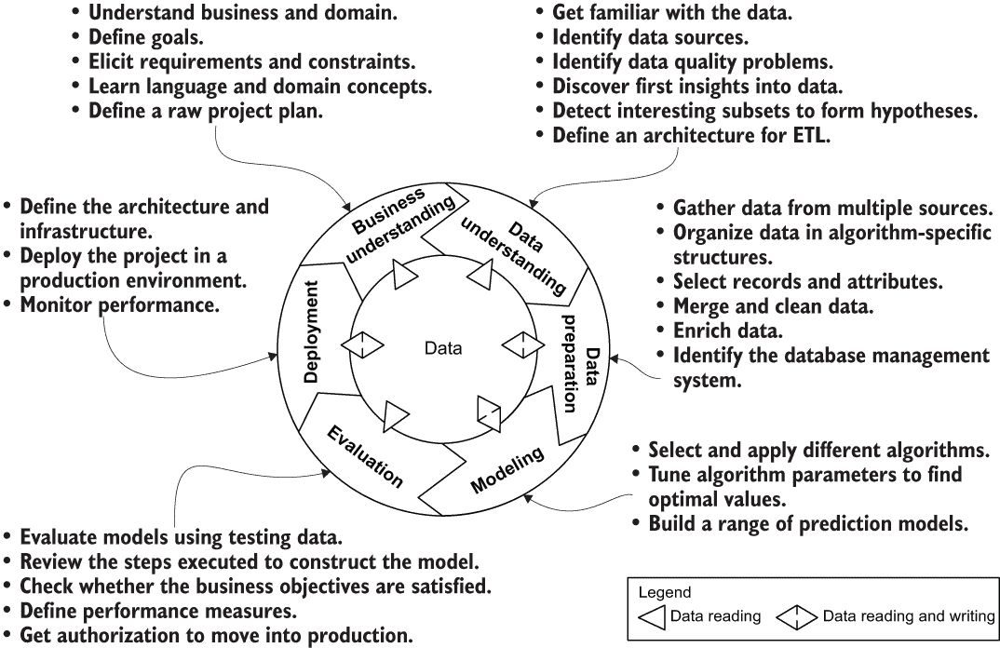

图 1.1 CRISP-DM 过程的六个阶段

外圈符号表示过程的循环性质，解决方案部署后并不意味着结束。后续的机器学习过程不仅可以从先前过程的经验中受益（Linoff 和 Berry [2011] 的良性循环），还可以从先前过程的结果中受益。让我们更详细地概述每个阶段。

### 1.1.1 业务理解

第一阶段需要定义机器学习项目的目标。这些目标通常用一般术语表达：增加收入、改善客户体验、获得更好的定制搜索结果、销售更多产品等等。为了将这些高级问题定义转换为机器学习项目的具体需求和约束，有必要了解业务和领域。

机器学习项目是软件项目，在这个阶段，学习语言和领域概念也很重要。这种知识不仅有助于数据科学家在后续阶段与内部团队之间的沟通，还能提高文档和结果展示的质量。

这个阶段的结果是

+   对领域和业务视角有清晰的理解

+   定义目标、需求和约束

+   将这些知识转换为机器学习问题定义

+   设计一个初步且合理的项目计划，旨在实现目标

第一轮的目标不应该过于宽泛，因为这一轮需要大量与将机器学习过程注入现有基础设施相关的工作。同时，在设计第一轮时，也要考虑到未来的扩展。

### 1.1.2 数据理解

数据理解阶段首先从询问数据源开始，并从每个数据源收集一些数据，然后继续以下活动：

+   熟悉数据。

+   识别数据质量问题。

+   获得对数据的初步洞察。

+   检测有趣的子集，以形成关于隐藏信息的假设。

数据理解需要领域和业务理解。此外，查看数据有助于建立对领域和业务视角的理解，这就是为什么这个阶段和前一个阶段之间存在反馈循环。

这个阶段的结果是

+   对可用的数据源有清晰的理解

+   对不同类型的数据及其内容（或至少对机器学习目标的所有重要部分）有清晰的理解

+   设计架构以获取或提取这些数据并将其输入到机器学习工作流程的下一步

### 1.1.3 数据准备

这一阶段涵盖了从多个来源收集数据并将其组织成模型阶段算法所需的具体结构的所有活动。数据准备任务包括记录和属性选择、特征工程、数据合并、数据清理、构建新属性和现有数据的丰富。正如之前指出的，数据的质量对下一阶段最终结果的影响巨大，因此这一阶段至关重要。

这一阶段的结果是

+   使用适当的设计技术定义一个或多个数据结构

+   为喂养机器学习算法训练数据而定义的清晰数据管道

+   一套合并、清理和丰富数据的程序

这一阶段另一个结果是确定在等待处理期间将存储这些数据的数据库管理系统。

为了完整性，在进一步处理之前，并不总是需要有一个明确的数据存储来持久化数据。在处理阶段之前，可以提取数据并转换它。然而，这样的中间步骤在性能、数据质量以及进一步的可扩展性方面有很多优点。

### 1.1.4 模型

模型阶段是机器学习发生的地方。选择并应用不同的算法，并将它们的参数校准到最佳值。算法被用来构建一系列预测模型，当评估阶段完成后，从中选择最佳的模型进行部署。一个有趣的现象是，一些算法产生预测模型，而另一些则不产生。³

这一阶段的结果是

+   下一个阶段要测试的算法集

+   相关的预测模型（如果适用）

数据准备和建模之间存在紧密的联系，因为在建模过程中，你经常发现数据问题并获得构建新数据点的想法。此外，一些技术需要特定的数据格式。

### 1.1.5 评估

在机器学习项目的这个阶段，你已经构建了一个或多个看起来质量很高的预测模型。在模型可以部署之前，重要的是要彻底评估它，并回顾构建模型的步骤，以确保你确信它正确地实现了在过程开始时定义的业务目标。

这种评估是以正式的方式进行，例如将可用的数据分成训练集（80%）和测试集（20%）。另一个主要目标是确定是否已经充分考虑了任何重要的业务问题。

这一阶段的结果是

+   一组允许测量性能的值。（成功的具体衡量标准取决于算法类型和范围。）

+   对是否实现业务目标进行彻底评估。

+   在生产环境中使用解决方案的授权。

### 1.1.6 部署

由于机器学习模型是为了在组织中发挥某种作用而构建的，因此模型的创建通常不是项目的终点。根据需求，部署阶段可能只是生成报告那么简单，也可能像发布一个为最终用户提供服务的完整基础设施那么复杂。在许多情况下，客户——而不是数据科学家——执行部署步骤。无论如何，重要的是事先了解需要执行哪些操作才能利用创建的模型。

此阶段的结果如下：

+   一个或多个包含预测模型结果的报告

+   用于预测未来和辅助决策的预测模型本身

+   为最终用户提供特定服务的基础设施

当项目处于生产状态时，需要持续对其进行监控（例如评估性能）。

## 1.2 机器学习挑战

机器学习项目有一些固有的挑战，使得它们难以完成。本节总结了在接近新的机器学习项目时需要考虑的主要方面。

### 1.2.1 真实来源

CRISP-DM 模型通过从数据的角度描述生命周期，将数据置于机器学习过程的核心。训练数据代表任何洞察都可以从中提取，任何预测都可以做出的*真实来源*。管理训练数据需要大量的努力。正如华盛顿大学计算机科学教授 Jeffrey Heer 所说：“将算法发送到原始数据并让洞察浮现出来是一个绝对的神话。”作为一个案例，据估计，数据科学家将高达 80% 的时间用于数据准备 [Lohr, 2014]。

在讨论算法的细节之前，我经常使用以下陈述来将重点转移到数据上：

*即使是最优秀的机器学习算法在错误的数据上也会产生错误的结果。*

Banko 和 Brill [2001] 以及 Halevy、Norvig 和 Pereira [2009] 的开创性论文指出，对于复杂问题，数据往往比算法更重要。这两篇文章都考虑了自然语言处理，但这个概念可以推广到机器学习的一般性 [Sculley, 2015]。

图 1.2，来自 Banko 和 Brill [2001]的研究，展示了针对一组学习者的学习曲线，考虑了每个学习者在不同大小的训练数据（高达 10 亿单词）上的平均性能。这里使用的具体算法并不重要；关键点是，如图像所示，在训练阶段增加可用数据量提高了所有学习者的性能。这些结果表明，重新考虑在语料库开发与算法开发之间分配时间和金钱是值得的。从另一个角度来看，作为一名数据科学家，你可以专注于垂直维度——寻找更好的算法——但图表显示，在水平方向上还有更多的改进空间——收集更多数据。作为证据，图 1.2 中表现最差的算法在拥有 1000 万个元素时比表现最好的算法在拥有 100 万个元素时表现要好得多。

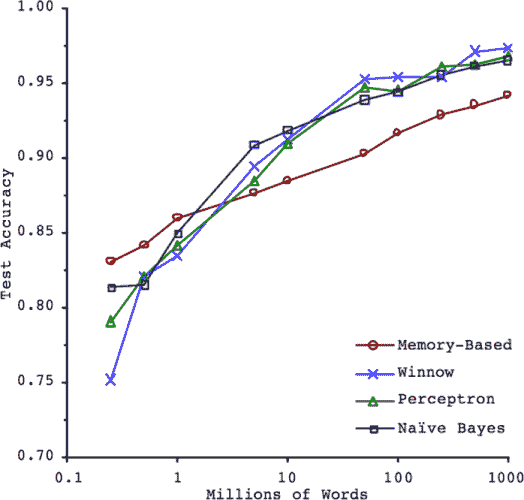

图 1.2 混淆集去歧义的学习曲线

从多个来源收集数据不仅允许你访问大量数据，还可以提高数据质量，解决稀疏性、拼写错误、正确性等问题。从各种来源收集数据不是问题；我们生活在大数据时代，网络、传感器、智能手机、企业数据库和公开数据源提供了大量的数字数据。但如果将不同数据集组合起来有价值，也会出现问题。来自不同来源的数据格式不同。在学习者分析之前，数据必须被清理、合并并规范化为算法可以理解的统一和同质化的模式。此外，对于许多问题，获取额外的训练数据都有非零成本，对于监督学习，这种成本可能很高。

由于这些原因，数据代表了机器学习过程中的第一个重大挑战。数据问题可以总结为四个类别：

+   *数据量不足*—机器学习需要大量的训练数据才能正常工作。即使是简单的用例，也需要数千个示例，而对于深度学习或非线性算法等复杂问题，你可能需要数百万个示例。

+   *数据质量差*—数据来源总是充满了错误、异常值和噪声。差的数据质量会直接影响机器学习过程的结果质量，因为许多算法难以丢弃错误（不正确、无关或无关）的值，并在这种混乱中检测到潜在的规律。

+   *非代表性数据*—机器学习是一个归纳过程：模型从其观察到的内容进行推断，并且不太可能支持训练数据中未包含的边缘情况。此外，如果训练数据太嘈杂或仅与可能情况的子集相关，学习者可能会产生偏差或过度拟合训练数据，并且无法推广到所有可能的情况。这对于基于实例和基于模型的机器学习算法都是正确的。

+   *无关特征*—如果数据包含一组良好的相关特征而不是太多无关特征，算法将以正确的方式学习。尽管选择更多特征通常是一种有用的策略，目的是提高模型的准确性，但更多并不总是更好。使用更多特征将使学习者能够找到从特征到目标的更详细的映射，这增加了模型计算将过度拟合数据的可能性。特征选择和特征提取是数据准备阶段两项重要的任务。

为了克服这些问题，数据科学家必须从多个来源收集和合并数据，对其进行清理，并通过使用外部来源来丰富它。（此外，数据往往是为了某个特定目的而准备的，但在过程中，你可能会发现一些新东西，而预期的目的会发生变化。）这些任务并不简单；它们不仅需要大量的专业技能，还需要一个数据管理平台，以便以方便的方式执行更改。

与训练示例质量相关的问题决定了机器学习项目基础设施的一组数据管理约束和要求。这些问题可以总结如下：

+   *管理大数据*—从多个数据源收集数据并将其合并到一个统一的事实来源将生成一个庞大的数据集，正如之前所指出的，增加（质量）数据的数量将提高学习过程的质量。第二章考虑了大数据平台的特点，并展示了图如何在这种巨兽的驯服中发挥突出作用。

+   *设计灵活的架构*—尝试创建一个架构模型，它能够将多个异构架构合并到一个统一且同质化的数据结构中，以满足信息和导航需求。架构应根据机器学习项目目的的变化轻松演进。第四章介绍了多种数据模型架构和最佳实践，用于对几种场景进行数据建模。

+   *开发高效的访问模式*—快速的数据读取可以提高训练过程的性能，从处理时间来看。特征提取、过滤、清理、合并以及其他训练数据的预处理任务将受益于使用提供多种灵活访问模式的数据平台。

### 1.2.2 性能

性能在机器学习中是一个复杂的话题，因为它可以与多个因素相关：

+   *预测准确性*，可以通过使用不同的性能指标来评估。回归问题的一个典型性能指标是均方根误差（RMSE），它衡量系统在预测中犯错的均方差⁴。换句话说，它查看测试数据集中所有样本的估计值与已知值之间的差异，并计算平均值。我在本书后面的章节中介绍了其他测量性能的技术，当讨论不同的算法时。准确性取决于几个因素，例如用于训练模型的数据量、数据的质量以及所选的算法。如 1.2.1 节所述，数据在保证适当准确度水平方面起着主要作用。

+   *训练性能*，指的是计算模型所需的时间。要处理的数据量以及所使用的算法类型决定了处理时间和预测模型所需的存储空间。显然，这个问题更多地影响那些在训练阶段产生模型的算法。例如，基于实例的学习者⁵的性能问题会在处理过程的后期出现，比如在预测阶段。在批量学习中，由于要处理的数据量较大（与在线学习方法相比，在线学习方法是从较少的数据量中增量学习算法），训练时间通常较长。虽然在在线学习中，要处理的数据量较小，但处理速度会影响系统与最新数据的同步能力，这直接影响到预测的准确性。

+   *预测性能*，指的是提供预测所需的时间响应。机器学习项目的输出可能是一个静态的一次性报告，以帮助管理者做出战略决策，或者是一个面向最终用户的在线服务。在前一种情况下，完成预测阶段和计算模型所需的时间不是主要问题，只要在合理的时间内完成工作（即，不是几年）。在后一种情况下，预测速度确实很重要，因为它会影响用户体验和预测的有效性。假设你正在开发一个推荐引擎，该引擎根据用户的兴趣推荐与用户当前查看的产品相似的产品。用户的导航速度相当快，这意味着在用户继续浏览下一个项目之前，需要在短时间内进行大量的预测；只有几毫秒的时间可以建议一些有用的东西。在这种情况下，预测速度是成功的关键。

这些因素可以转化为对机器学习项目的多个要求，例如在训练期间快速访问数据源、高数据质量、高效的模型访问模式以加速预测等。在这种情况下，图可以提供适当的存储机制，用于源数据和模型数据，减少读取数据所需的访问时间，并提供多种算法技术来提高预测的准确性。

### 1.2.3 存储模型

在基于模型的学习者方法中，训练阶段的输出是一个用于进行预测的模型。此模型需要时间来计算，并且必须存储在持久化层中，以避免每次系统重启时重新计算。

模型的结构直接相关于所使用的特定算法或算法类。例如包括

+   使用最近邻方法的推荐引擎的项目到项目相似性

+   表达元素如何分组到簇中的项目到簇映射

两个模型的尺寸差异极大。考虑一个包含 100 个项目的系统。作为初步尝试，项目到项目的相似性需要存储 100 x 100 个条目。利用优化，这个数字可以减少到只考虑前 k 个相似项，在这种情况下，模型将需要 100 x k 个条目。相比之下，项目到簇映射只需要 100 个条目；因此，存储模型在内存或磁盘上的空间可能是巨大的或相对适中。此外，如前所述，模型访问/查询时间会影响预测阶段的整体性能。因此，模型存储管理是机器学习中的一个重大挑战。

### 1.2.4 实时

机器学习越来越多地被用于向用户提供实时服务。例子涵盖了从简单的响应用户最后点击的推荐引擎到被指示不要伤害过街行人的自动驾驶汽车的全范围。尽管这两个例子中失败的结果差异很大，但在两种情况下，学习者对来自环境的新刺激做出快速（或适当及时）反应的能力对于最终结果的质量是基本的。

考虑一个为匿名用户提供实时推荐的推荐引擎。这种匿名性（用户未注册或登录）意味着没有长期的历史交互记录——只有通过使用 cookies 提供的短期、基于会话的信息。这是一个复杂的任务，涉及多个方面，并影响机器学习项目的多个阶段。所采取的方法可能因使用的学习者而异，但目标可以描述如下：

+   *快速学习*。在线学习者应该能够在新数据可用时立即更新模型。这种能力将减少事件或通用反馈（如导航点击或与搜索会话的交互以及模型的更新）之间的时间差距。模型与最新事件越一致，就越能满足用户的当前需求。

+   *快速预测*。当模型更新时，预测应该很快——最多几毫秒——因为用户可能已经离开当前页面，甚至可能迅速改变他们的观点。

这两个目标都需要能够快速对齐模型的算法，以及提供快速记忆和高效访问模式的存储机制（在内存中、在磁盘上或两者的组合版本）。

## 1.3 图

如本章引言所述，图提供了可以极大地支持机器学习项目的模型和算法。尽管图是一个简单的概念，但了解如何表示它以及如何使用其周围的主要概念是很重要的。本节介绍了图世界的关键元素。如果您已经掌握了这些概念，可以跳过这部分内容。

### 1.3.1 什么是图？

*图*是一个简单且相当古老的数学概念：由一组顶点（或节点/点）和边（或关系/线）组成的数据结构，可以用来模拟一组对象之间的关系。传说懒惰的莱昂哈德·欧拉于 1736 年首次开始谈论图。当访问普鲁士的柯尼斯堡（现俄罗斯加里宁格勒）时，欧拉不想在城市里花费太多时间散步，该城市位于普雷格尔河两侧，包括两个通过七座桥梁连接到彼此和城市两个大陆部分的两个大岛。欧拉将问题形式化为计划一次穿过所有这些桥梁一次且仅一次的散步。他证明了这样做是不可能的，这导致了图和图论的发明确立 [Euler, 1736]。因此，他留在了家里。图 1.3 显示了柯尼斯堡的一张旧地图和欧拉用来证明其论文的图的表示。

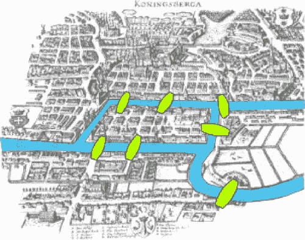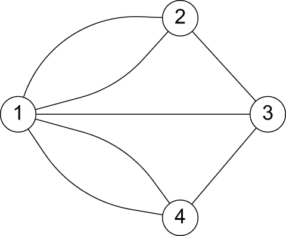

图 1.3 带领图论发明的柯尼斯堡桥梁

更正式地说，一个图是一个对 G = (V, E)，其中 V 是顶点的集合 V = {V[i], i = 1,n}，E 是 V 上的边的集合，E[ij] = {(V[i], V[j]), V[i] ∊ V, V[j] ∊ V}。E ⊆ [V]²；因此，E 的元素是 V 的两个元素子集 [Diestel, 2017]。

表示图的最简单方法是为每个顶点画一个点或一个小圆圈，如果它们形成一个边，则通过一条线连接两个这样的顶点。这种更正式的描述如图 1.4 所示。

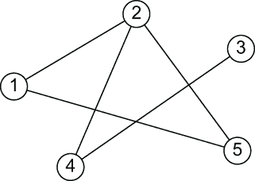

图 1.4 在 *V* = {1, 2, 3, 4, 5} 上的无向图，其边集 *E* = {(1,2), (1,5), (2,5), (2,4), (4,3)}

图可以是**有向**的或**无向**的，这取决于是否在边上定义了遍历方向。在**有向图**中，边 E[ij] 可以从 Vi 遍历到 Vj，但不能反向遍历；V[i] 被称为**尾**或**起始节点**，V[j] 被称为**头**或**终止节点**。在**无向图**中，两个方向的边遍历都是有效的。图 1.4 表示一个无向图，图 1.5 表示一个有向图。

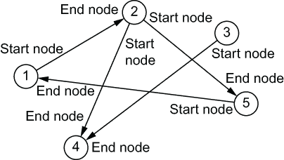

图 1.5 在 *V* = {1, ..., 5} 上的有向图，其边集 *E* = {(1,2), (2,5), (5,1), (2,4), (3,4)}

箭头表示关系的方向。默认情况下，图中的边是无权重的；因此，相应的图被称为**无权图**。当给边分配一个权重——一个用于传达某些意义的数值时，该图被称为**加权图**。图 1.6 显示了与图 1.4 和图 1.5 相同的图，并为每条边分配了权重。

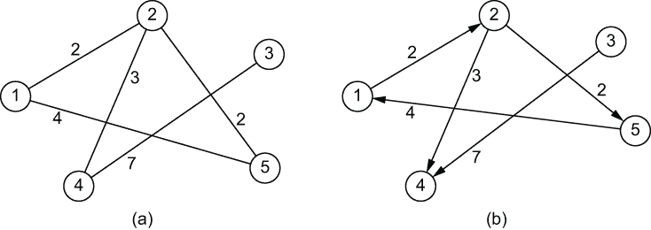

图 1.6 一个无向加权图（a）和一个有向加权图（b）

如果图 G 中的两个顶点 x 和 y 通过边 {x,y} 相连，则称这两个顶点为**相邻**或**邻居**。连接它们的边 E[ij] 被称为在两个顶点 V[i] 和 V[j] 上**关联**。如果两个不同的边 e 和 f 有一个共同的顶点，则称它们为**相邻**。如果 G 的所有顶点都是成对相邻的，则 G 是**完全图**。图 1.7 显示了一个完全图，其中每个顶点都与所有其他顶点相连。

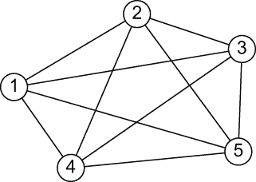

图 1.7 每个顶点都与所有其他顶点相连的完全图

图中的顶点的一个重要属性是其**度**，定义为与该顶点相连的边的总数，这也等于该顶点的邻居数量。例如，在图 1.4 的无向图中，顶点 2 的度数为 3（它有顶点 1、4 和 5 作为邻居）；顶点 1（邻居是 2、5）、4（邻居是 2、3）和 5（邻居是 1、2）的度数为 2，而顶点 3 的度数为 1（仅与顶点 4 相连）。

在有向图中，顶点 V[i]的度数分为顶点的*入度*，定义为以 V[i]为终端节点（箭头的头部）的边的数量，以及顶点的*出度*，即以 V[i]为起始节点的边的数量。在图 1.5 的有向图中，顶点 1 和 5 的入度和出度都是 1（它们各自有两个关系，一个进入和一个出去），顶点 2 的入度是 1，出度是 2（从 1 进入一个关系，向 4 和 5 各出去两个关系），顶点 4 的入度是 2，出度是 0（从 2 和 3 进入两个关系），顶点 3 的出度是 1，入度是 0（向 4 出去一个关系）。

图的平均度数计算如下，

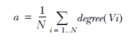

其中 N 是图中顶点的数量。

具有性质，即序列中的每对连续顶点都通过一条边连接的顶点序列称为*路径*。没有重复顶点的路径称为*简单路径*。*环*是首尾顶点相同的路径。在图 1.4 中，[1,2,4]、[1,2,4,3]、[1,5,2,4,3]等都是路径；特别是顶点序列[1,2,5]的路径代表一个环。

### 1.3.2 图作为网络模型

图对于表示事物在简单或复杂结构中如何物理上或逻辑上相互连接非常有用。当我们给边和顶点分配名称和意义时，这样的图就变成了所谓的网络。在这些情况下，图是描述网络的数学模型，而网络是对象之间的一系列关系，这些对象可能包括人、组织、国家、Google 搜索中找到的项目、脑细胞或电力变压器。这种多样性展示了图及其简单结构（这也意味着它们需要很少的磁盘存储空间）的巨大力量，这些结构可以用来模拟⁶复杂系统。

让我们通过一个例子来探讨这个概念。假设我们有一个如图 1.8 所示的图。

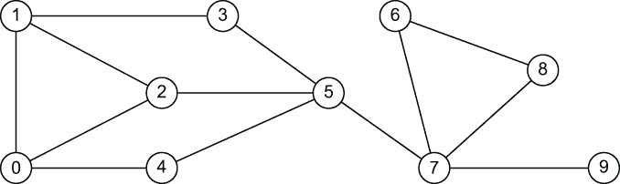

图 1.8 一个非平凡的通用图

这个在数学定义上纯粹的图可以根据边的类型和顶点的类型来模拟几种类型的网络：

+   如果顶点是人们，而每条边代表人类之间任何类型的关系（友谊、家庭成员、同事），则称为*社交网络*。

+   如果顶点是信息结构，如网页、文档或论文，而边代表逻辑连接，如超链接、引用或交叉引用，则称为*信息网络*。

+   如果顶点是能够中继消息的计算机或其他设备，而边代表可以传输消息的直接链接，则称为*通信网络*。

+   一种 *交通网络*，如果顶点是城市，而边代表使用航班、火车或道路的直接连接

这一小组示例展示了如何通过为边和顶点分配不同的语义，同一个图可以表示多个网络。图 1.9 展示了不同类型的网络。

观察图 1.9，我们可以发现图形的另一个有趣特征：它们具有很强的沟通能力。图形能够以清晰的方式展示信息，这也是为什么它们经常被用作*信息地图*。将数据表示为网络并使用图算法，可以

+   寻找复杂模式

+   使其可见以便进行进一步调查和解读

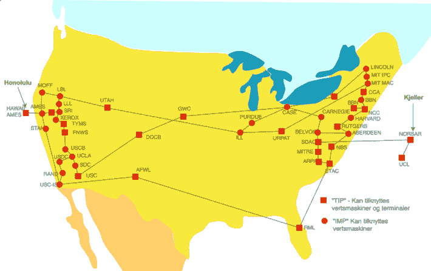

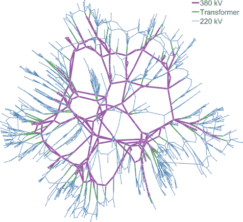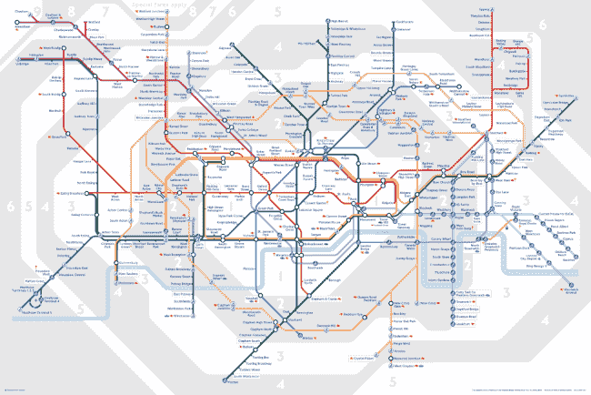

图 1.9 从左上角顺时针方向：共现网络⁷、1974 年的 ARPA 网络⁸、伦敦地铁网络⁹和电网¹⁰

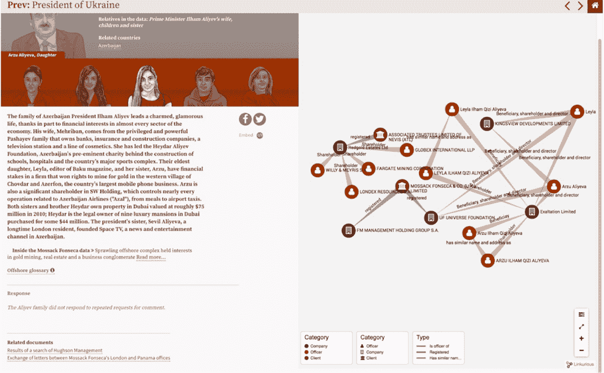

在这个方向上，许多有趣的例子也可以在组织顾问 Valdis Krebs 的博客文章中找到，¹² 他专注于社交网络应用。他的工作中包含了将图增强的机器学习与人类思维相结合的例子，通过图可视化来实现。在这里，我们考虑其中一个最著名的例子。

图 1.11 中的数据来自 Amazon.com，代表了 2008 年美国购买的前政治书籍列表 [Krebs, 2012]。Krebs 将网络分析原理应用于数据，创建了一个与那年总统选举相关的书籍地图。如果两本书经常被同一顾客购买，则它们之间有链接。这些书籍被称为*也购买*对（在那个顾客购买了这本书*也购买了*那本书）。

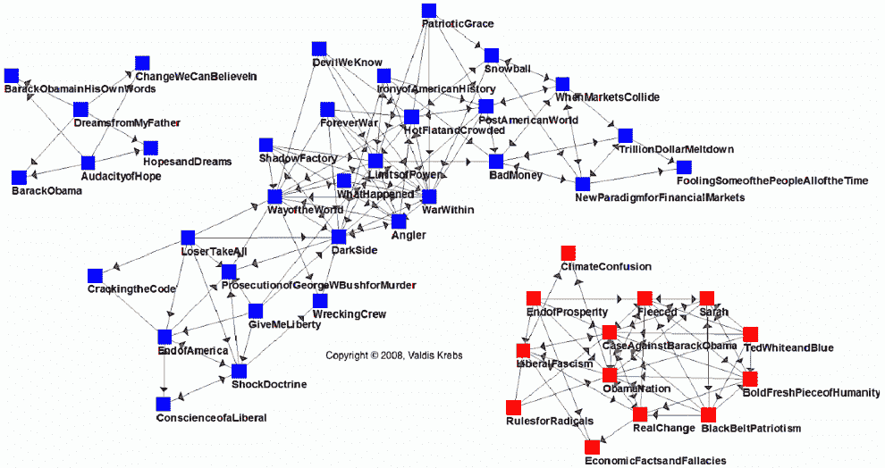

图 1.11 2008 年美国政治书籍网络图（Krebs, 2012）

有三个不同且不重叠的集群：

+   左上角的奥巴马书籍集群

+   中间的民主党（蓝色）集群

+   右下角的共和党（红色）集群

2008 年，美国政治气候高度两极分化。这一事实在 Amazon 的政治书籍数据中得到了反映，图 1.11 显示了保守派和自由派选民之间的深刻分歧。红色和蓝色书籍之间没有联系或中间人；每个集群与其他集群完全不同。如前所述，有一个单独的阅读总统候选人巴拉克·奥巴马传记的人的集群，但他们显然对阅读或购买其他政治书籍不感兴趣。

四年后，在 2012 年，同样的分析产生了一个看起来实质上不同的网络（图 1.12）。这个网络显示了许多作为集群之间桥梁的书籍。此外，潜在的选民似乎在阅读关于两位主要候选人的书籍。结果是，一个更复杂的网络，没有孤立的集群。

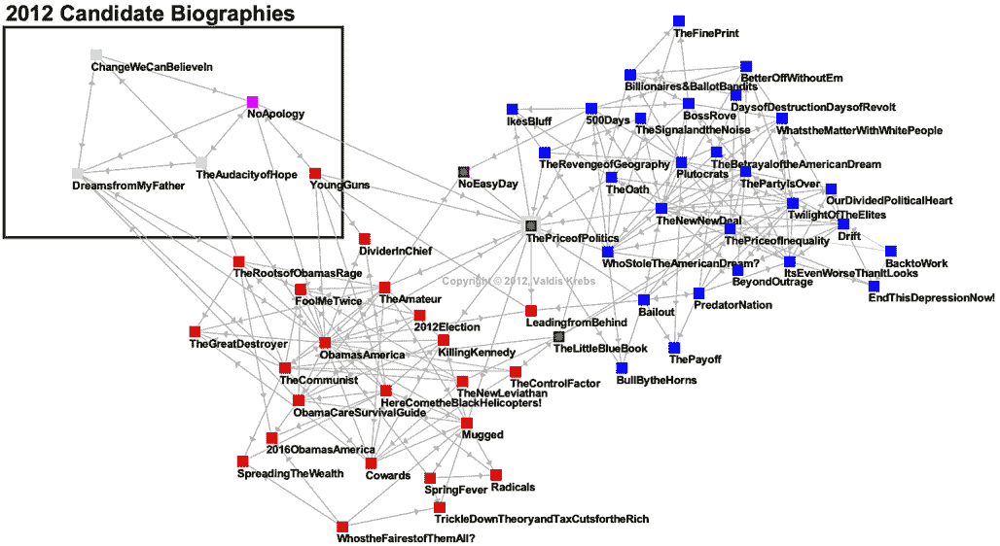

图 1.12 2012 年美国政治书籍网络图 [Krebs, 2012]

政治书籍网络示例引入了网络的一个重要方面。如果图是一个纯粹数学概念，存在于它自己的柏拉图世界中，那么网络，作为某些具体系统或生态系统的抽象，会受到*力量*的影响，这些力量作用于它们，改变它们的结构。我们将这些力量称为*周围环境*：存在于网络顶点和边之外的因素，但仍然会影响网络结构随时间演化的方式。这种环境的性质和力量的类型是特定于网络类型的。例如，在社会网络中，每个人都有一个独特的个人特征集合，两个人之间的特征相似性和兼容性会影响链接的创建或删除 [Easley and Kleinberg, 2010]。

社会网络结构的基本观念之一是*同质性*（源自希腊语，意为对相同事物的喜爱）：社会网络中的链接倾向于连接相似的人。更正式地说，如果两个人的特征在比例上大于他们所来自的群体或他们所属的网络中的预期比例，他们更有可能被连接[Verbrugge, 1977]。反之亦然：如果两个人是连接的，他们更有可能拥有共同的特征或属性。因此，我们的 Facebook（例如）朋友并不像随机抽样的人群，他们在种族、种族和地理维度上通常与我们相似；他们在年龄、职业、兴趣、信仰和观点上往往与我们相似。这一观察已有悠久的历史，其起源远在马克·扎克伯格写下第一行代码之前。这一基本思想可以在柏拉图（“相似性产生友谊”）和亚里士多德（人们“爱那些与自己相似的人”）的著作中找到，以及民间命题如“物以类聚”中。同质性原则也适用于群体、组织、国家或社会单位的任何方面。

理解网络周围的上下文以及作用于网络的相关力量，以多种方式帮助机器学习任务：

+   网络是既受欢迎又不受欢迎的流动的渠道。营销人员总是在尝试接触和说服人们。如果能够找到一种方法来启动雪球滚动，个人接触是最有效的。这个概念是所谓*病毒式营销*的基础。

+   理解这些力量可以使我们预测网络随时间如何演变，并使数据科学家能够积极应对这些变化或将其用于特定的商业目的。

+   社会学和心理学学科的研究结果表明，一个人的社交网络在决定他们的品味、偏好和活动方面具有相关性。这些信息对于构建推荐引擎很有用。与推荐引擎相关的一个问题是冷启动问题：由于没有他们的历史，你无法为新用户预测任何事情。社交网络和同质性原则可以用来根据连接用户的品味进行推荐。

## 1.4 图在机器学习中的作用

图被用来表征感兴趣对象之间的交互，用于建模简单和复杂的网络，或一般地用于表示现实世界问题。因为它们基于严格但简单的形式化，所以在许多科学领域中被使用，从计算机科学到历史科学。我们不应该对它们在机器学习中作为强大的工具被广泛使用感到惊讶，这个工具可以启发直觉并推动许多有用的功能。基于图的机器学习随着时间的推移变得越来越普遍，超越了众多传统技术。

许多不同规模的公司都在使用这种方法为他们的客户提供更高级的机器学习功能。一个突出的例子是谷歌，它正在使用基于图的机器学习作为其 Expander 平台的核心。这项技术背后支撑着许多你可能每天都在使用的谷歌产品和服务，例如 Gmail 收件箱中的提醒或 Google Photos 中的最新图像识别系统。¹⁴

构建一个图驱动机器学习平台有许多好处，因为图不仅可以作为克服先前描述的挑战的有价值工具，还可以提供没有图支持无法实现的高级功能。

图 1.13 展示了机器学习和图之间的主要接触点，考虑了不同任务的目标。

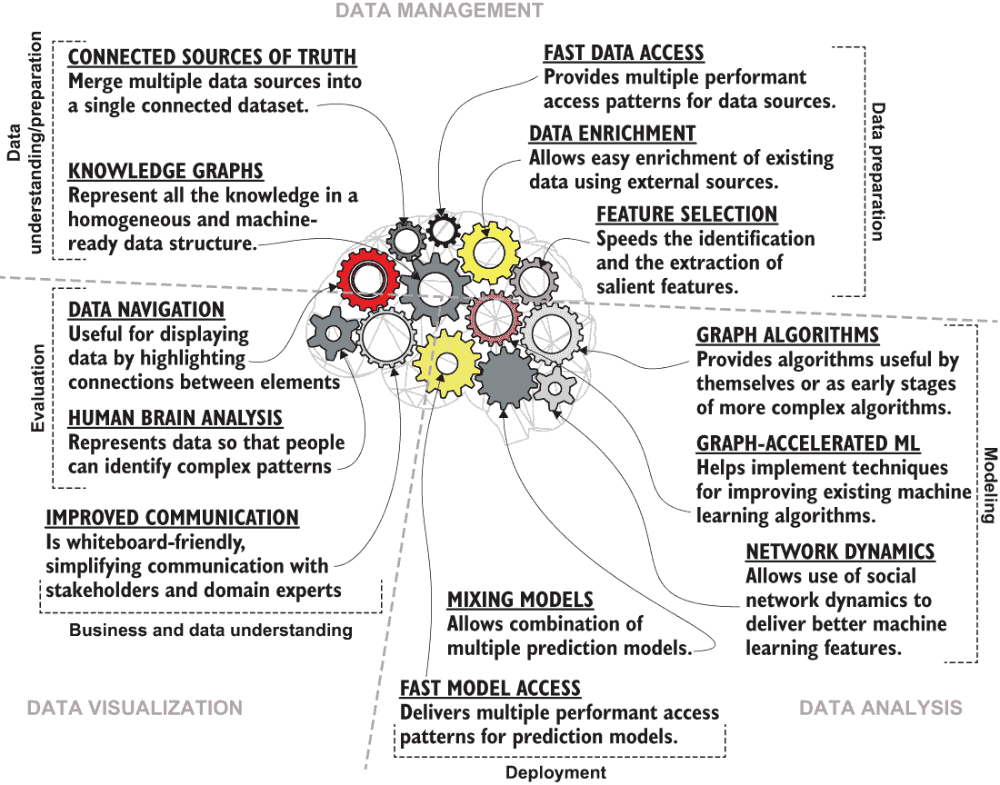

图 1.13 图驱动机器学习思维导图

这个思维导图可以立即直观地展示图在机器学习全景中的角色。在图 1.13 中，图特征被分为三个主要区域：

+   *数据管理*——这个区域包含图提供的帮助机器学习项目处理数据的特性。

+   *数据分析*——这个区域包含对学习和预测有用的图特征和算法。

+   *数据可视化*——这个区域突出了图作为视觉工具的实用性，它帮助人们通过使用人脑来沟通、与数据互动并发现洞察。

模式还显示了基于图的技术与 CRISP-DM 模型阶段之间的映射。

### 1.4.1 数据管理

图允许学习系统探索更多你的数据，更快地访问它，并轻松地进行清理和丰富。传统的学习系统在研究者准备的单个表格上训练，而图原生系统可以访问的不仅仅是这个表格。

图驱动数据管理功能包括

+   *连接的真实数据源*——图允许你将多个数据源合并成一个单一、统一、连接的数据集，为训练阶段做好准备。通过减少数据稀疏性、增加可用数据量以及简化数据管理，这一特性带来了巨大的优势。

+   *知识图谱*——基于前面的想法，知识图谱提供了一个统一的数据结构，不仅可以将数据源合并，还可以将预测模型、手动提供的数据和外部知识来源合并。结果数据是机器可用的，可以在训练、预测或可视化过程中使用。

+   *快速数据访问*——表格提供与行和列过滤器相关的单一访问模式。另一方面，图提供了对同一数据集的多个访问点。通过减少需要访问的数据量到特定需求的基本最小值，这一特性提高了性能。

+   *数据丰富*—除了使扩展现有数据与外部源变得容易外，图的无模式性质和图数据库内提供的访问模式有助于数据清理和合并。

+   *特征选择*—在数据集中识别相关特征是几个机器学习任务（如分类）的关键。通过提供快速访问数据和多种查询模式，图加速了特征识别和提取。

在 CRISP-DM 模型的“数据理解”和“数据准备”阶段，连接的真相来源和知识图是宝贵的辅助工具，而快速数据访问、数据丰富和特征选择在数据准备阶段很有用。

### 1.4.2 数据分析

图可以用来建模和分析实体之间的关系以及它们的属性。这一方面为图驱动的机器学习带来了额外的信息维度，可以用于预测和分类。图提供的模式灵活性还允许不同的模型在同一个数据集中共存。

图像驱动的数据分析功能包括

+   *图算法*—几种类型的图算法，如聚类、页面排名和链接分析算法，对于在数据中识别洞察和分析目的很有用。此外，它们可以用作更复杂分析过程中的第一个数据预处理步骤。

+   *图加速机器学习*—前面讨论的图驱动的特征提取是图如何加速或提高学习系统质量的一个例子。图可以帮助在训练阶段之前或期间过滤、清理、丰富和合并数据。

+   *网络动态*—对网络周围环境和相关作用力的认识不仅使你能够理解网络动态，而且还可以利用它们来提高预测质量。

+   *混合模型*—在同一个图中可以共存多个模型，利用灵活且快速的访问模式，只要它们在预测阶段可以合并。这一特性提高了最终精度。此外，同一个模型有时可以用不同的方式使用。

+   *快速模型访问*—实时使用需要快速预测，这意味着需要一个尽可能快就能访问的模型。图提供了这些范围所需的正确模式。

图算法、图加速机器学习和网络动态主要涉及建模阶段，因为它们比其他特性更多地与学习过程相关。部署阶段利用混合模型和快速模型访问方法，因为它们在预测阶段运行。

### 1.4.3 数据可视化

图表具有强大的沟通能力，它们能够以人类大脑易于理解的方式同时展示多种类型的信息。这一特性在机器学习项目中非常重要，无论是用于分享结果、分析它们，还是帮助人们导航数据。

图表驱动的数据可视化特性包括

+   *数据导航*—网络通过突出元素之间的连接来显示数据。它们既可以作为帮助人们正确导航数据的辅助工具，也可以作为强大的调查工具。

+   *人类大脑分析*—以图表的形式展示数据通过结合人类大脑的力量和机器学习的力量，释放了机器学习的潜力，实现了高效、高级和复杂的数据处理和模式识别。

+   *改进沟通*—图表—特别是属性图—是“白板友好”的，这意味着它们在数据库中存储的方式与在白板上表示的方式概念上是一致的。这一特性缩小了复杂模型的技术细节与将其传达给领域专家或利益相关者之间的差距。有效的沟通提高了最终结果的质量，因为它减少了领域理解、业务目标、项目需求和限制方面的问题。

在业务和数据理解阶段，改进沟通尤为重要，而数据导航和人类大脑分析主要与评估阶段相关。

## 1.5 书籍心智模型

本章中展示的心智图帮助您轻松地可视化图表在机器学习项目中的位置。这并不意味着在所有项目中，您都会使用图表来完成那里列出的所有事情。在本书的几个示例中，图表被用来克服一些问题或提高性能（无论是质量还是数量）；拥有一个帮助您通过简单的图像了解图表在特定情况下作用的思维模型将是有用的。

下一个架构将图表驱动的机器学习心智图中的关键特征（*接触点*）组织成机器学习工作流程的四个主要任务：

+   *管理数据源*，指的是收集、合并、清理和准备训练数据集以供学习阶段的所有任务

+   *学习*，涉及将机器学习算法应用于训练数据集

+   *存储和访问模型*，包括存储预测模型的方法以及提供预测的访问模式

+   *可视化*，指的是数据可视化的方式，以支持分析

这些要点总结在图 1.14 中展示的心智图中。

图 1.14 描述机器学习项目四个阶段的思维模型

此图将在书中反复出现。该方案将帮助您立即了解当前讨论在项目工作流程中的位置。

这种心智模型从过程角度展示了机器学习项目，这是确定你在生命周期中处于何种位置的最佳方式。但同时也从更广泛、以任务为导向的角度思考项目也是有用的。

## 摘要

+   机器学习的目标是开发计算机程序，这些程序可以从样本数据中自主获得经验，将其转化为专业知识，而无需明确编程。

+   机器学习项目不仅是一个软件项目，也是一个涉及众多不同技能的人的复杂的人类过程。它需要一种明确和系统的方法才能成功。CRISP-DM 提供了正式的项目生命周期来推动这样的项目，帮助实现正确的结果。

+   任何机器学习项目必须应对的挑战主要与数据管理相关——无论是训练数据集还是预测模型——以及学习算法的性能。

+   图是简单的数学概念，可以用来模拟和分析复杂网络。网络外的周围环境对其产生影响，决定了其如何演变。

+   图和网络可以从数据管理、数据分析、数据可视化三个维度提升机器学习项目的能力。

## 参考文献

[Banko and Brill, 2001] Banko, Michele, and Eric Brill. “Scaling to Very Very Large Corpora for Natural Language Disambiguation.” Proceedings of the 39th Annual Meeting on Association for Computational Linguistics (2001): 26-33.

[Diestel, 2017] Diestel, Reinhard. *Graph Theory*. 5th ed. New York: Springer, 2017.

[Easley and Kleinberg, 2010] Easley, David, and Jon Kleinberg. *Networks, Crowds, and Markets: Reasoning About a Highly Connected World*. Cambridge, UK: Cambridge University Press, 2010.

[Euler, 1736] Euler, Leonhard. “Solutio Problematis ad Geometriam Situs Pertinentis.” *Comment. Acad. Sci. U. Petrop* 8 (1736): 128-40.

[Halevy, Norvig, and Pereria, 2009] Halevy, Alon, Peter Norvig, and Fernando Pereira. “The Unreasonable Effectiveness of Data.” Intelligent Systems, IEEE 24:2 (2009): 8-12.

[Krebs, 2012] Krebs, Valdis. “Political Book Networks.” TNT: The Network Thinkers, October 2012\. [`www.thenetworkthinkers.com/2012/10/2012-political-book-network.html`](http://www.thenetworkthinkers.com/2012/10/2012-political-book-network.html).

[Linoff and Berry, 2011] Linoff, Gordon S., and Michael J. A. Berry. *Data Mining Techniques: For Marketing, Sales, and Customer Relationship Management*. 3rd ed. Hoboken, NJ: Wiley, 2011.

[Lohr, 2014] Lohr, Steve. “For Big-Data Scientists, ‘Janitor Work’ Is Key Hurdle to Insights.” New York Times, August 15, 2014\. [`mng.bz/K4wn`](https://shortener.manning.com/K4wn).

[Mihalcea 等人，2011] Mihalcea, Rada，和 Dragomir Radev. *基于图的自然语言处理和信息检索*。英国剑桥：剑桥大学出版社，2011 年。

[Russell 和 Norvig, 2009] Russell, Stuart J.，和 Peter Norvig. *人工智能：现代方法*。第 3 版。新泽西州上萨德尔河：皮尔逊，2009 年。

[Samuel, 1959] Samuel, Arthur L. “使用国际象棋游戏进行机器学习的一些研究。” *IBM 研究与发展杂志* 3:3（1959 年 7 月）：210-229.

[Sculley, 2015] Sculley, D.，Gary Holt，Daniel Golovin，Eugene Davydov，Todd Phillips，Dietmar Ebner，Vinay Chaudhary，Michael Young，Jean-Francois Crespo，和 Dan Dennison. 2015. “机器学习系统中的隐藏技术债务。” 第 28 届国际神经网络信息处理系统会议——第 2 卷（NIPS15）。麻省理工学院出版社，美国剑桥，马萨诸塞州，2503-2511.

[Shalev-Shwartz 和 Ben-David, 2014] Shalev-Shwartz, Shai，和 Shai Ben-David. *理解机器学习：从理论到算法*。英国剑桥：剑桥大学出版社，2014 年。

[Verbrugge, 1977] Verbrugge, Lois M. “成年友谊选择的结构。” *社会力量* 56（1977 年）：576-597.

[Wirth 和 Hipp, 2000] Wirth, R., 和 J. Hipp. “CRISP-DM：数据挖掘的标准流程模型。” 第四届国际知识发现和数据挖掘实际应用会议论文集（2000 年）：29-39.

* * *

^(1.)根据 Russell 和 Norvig [2009] 的说法，一个智能体是某种能够行动的东西。（“智能体”一词来源于拉丁语“agere”，意为“做。”）所有计算机程序都会做某些事情，但计算机智能体被期望做更多：自主操作、感知其环境、在长时间内持续存在、适应变化，并创造和追求目标。

^(2.)根据斯坦福哲学百科全书网站（[`plato.stanford.edu/entries/logic-inductive`](https://plato.stanford.edu/entries/logic-inductive)）的说法，在*归纳*逻辑中，前提应在一定程度上支持结论。相比之下，在*演绎*推理中，前提逻辑上蕴含结论。因此（尽管有些人不同意这个定义），*归纳*有时被定义为从具体观察中推导出一般原则的过程。

^(3.)附录 A（关于机器学习分类）包含了一些创建预测模型的算法示例。

^(4.)“标准差”是一个衡量组内成员与组平均值的差异程度的度量。

^(5.)如果您对实例化算法和批量学习等概念不熟悉，请参阅附录 A，它涵盖了机器学习分类。

^(6.)在此语境中，动词“模型”是指以简化的方式表示一个系统或现象。建模还旨在以计算机系统易于处理的方式表示数据。

(7.)Higuchi Koichi—KH Coder 的共现屏幕截图 ([`en.wikipedia.org/wiki/Co-occurrence_network`](https://en.wikipedia.org/wiki/Co-occurrence_network)).

(8.)Yngvar—1974 年 9 月 ARPANET 的符号表示 ([`en.wikipedia.org/wiki/ARPANET`](https://en.wikipedia.org/wiki/ARPANET)).

(9.)伦敦交通局提供 ([`mng.bz/G6wN`](https://shortener.manning.com/G6wN)).

(10.)Paul Cuffe—高压输电系统的网络图，显示了不同电压级别之间的互联 ([`en.wikipedia.org/wiki/Electrical_grid`](https://en.wikipedia.org/wiki/Electrical_grid)).

(11.)[`panamapapers.icij.org`](https://panamapapers.icij.org).

(12.)[`www.thenetworkthinkers.com`](http://www.thenetworkthinkers.com).

(13.)数学*柏拉图主义* ([`mng.bz/zG2Z`](https://shortener.manning.com/zG2Z)) 是一种形而上学观点，认为存在抽象的数学对象，其存在独立于我们以及我们的语言、思想和实践。

(14.)[`mng.bz/0rzz`](https://shortener.manning.com/0rzz)
