# 2 图形数据工程

+   与机器学习输入相关的主要大数据挑战

+   如何使用图模型和图数据库处理大数据分析

+   图形数据库的形状和特征

第一章强调了数据在机器学习项目中的关键作用。正如我们所见，在大量高质量数据上训练学习算法比微调或替换算法本身更能提高模型的准确性。在一次关于大数据的访谈[Coyle, 2016]中，发明了现在广泛使用的亚马逊项目到项目协同过滤算法的 Greg Linden 回答说：

*大数据是亚马逊推荐工作得如此之好的原因。大数据是调整搜索并帮助我们找到所需内容的原因。大数据是使网络和移动智能化的原因。*

在过去几年里，我们在各个领域（信息技术、工业、医疗保健、物联网（IoT）等）产生的数据量呈指数级增长。回到 2013 年，IBM 估计每天有 2500 亿字节的数据被创造——这意味着世界上 90%的数据在过去两年内已经被创造出来[Johnson, 2013]。这些数据来自各个地方：用于收集气候信息的传感器、社交媒体网站上的帖子、数字图片和视频、购买交易记录以及手机 GPS 信号，仅举几例。这些数据是*大数据*。图 2.1 展示了每分钟从知名应用程序或平台产生的当前数据量的统计数据[Domo, 2020]。

图 2.1 2020 年每分钟产生的数据（由 Domo, Inc.提供）

过去十年发生的巨大变化既不是互联网用户数量的激增，也不是像数据传感器这样的新系统的创造。这种变化是由对数据作为知识来源重要性的认识增强所引发的。对了解用户、客户、各种企业和组织的强烈愿望产生了新的数据收集、聚集和处理需求。这种愿望导致了数据科学家收集分析数据方式的变化。几年前，他们不得不在一些奇怪格式的非组织化和脏乱的数据孤岛中寻找数据。现在，随着公司发现了他们产生的数据中隐藏的价值，数据科学家领导了数据生成和收集的努力。

例如，一个旅游网站曾经可能只为简单的推荐引擎收集星级评分，而现在它使用每个用户提供的评论中的信息力量作为更详细的知识来源。这个过程产生了一种良性循环（图 2.2），能够在每个循环中收集更多数据。

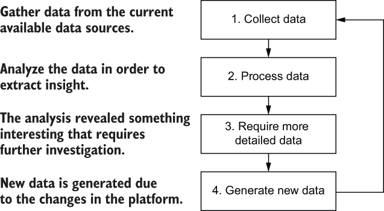

图 2.2 数据收集循环

这种前所未有的数据源可用性使得机器学习从业者能够访问大量以多种形式存在的数据。但尽管找到和访问这些数据相对容易，存储和管理它们可能完全不同。特别是对于机器学习过程，有必要识别和提取与观察现象相关的*特征*，即可测量的属性或特征。选择信息丰富、区分度高和独立的特征是创建有效学习算法的关键步骤，因为这些特征定义了算法训练阶段的输入结构，并决定了预测的准确性。特征列表的要求根据算法类别而变化，但一般来说，更准确的数据会产生更好的模型。如果你能运行一个考虑 300 个因素而不是 6 个因素的预测，你就能更好地预测需求。然而，随着因素的增多，你也会面临过拟合的风险。

分析大数据的系统生命周期由一系列步骤组成，这些步骤从从多个数据源收集数据开始。需要专门的工具和框架将来自不同源的数据摄入到定义的大数据存储中。数据存储在特定的存储解决方案中（如分布式文件系统或非关系型数据库），这些解决方案旨在可扩展。更正式地说，完成这些任务所需的步骤可以总结如下：

+   *收集.* 从多个数据源收集和汇总数据。

+   *存储.* 数据以适当的方式存储在单个（或偶尔超过一个）易于访问的数据存储中，以便为下一阶段做好准备。

+   *清洁.* 数据通过使用统一和一致的架构进行合并、清洗，并在可能的情况下进行归一化。

+   *访问.* 数据可用。提供多种视图或访问模式，以简化并加快用于训练目的的数据集的访问。

本章重点介绍这四个步骤中的最后三个：存储、清洗和访问数据。本章描述了大数据的主要特征，并讨论了处理大数据的方法。详细介绍了基于图模型和图数据库的特定方法，并提供了最佳实践。

## 2.1 处理大数据

为了驯服这个巨兽——定义大数据分析平台的需求——我们需要了解它。让我们考虑使大数据成为“大”的基本特征。

在 2001 年（是的，超过 20 年前！），META Group 的分析师道格·兰尼（Doug Laney）发表了一篇题为“3D 数据管理：控制数据量、速度和多样性”的研究报告[Laney, 2001]。尽管这个术语本身并没有出现在兰尼的报告里，但十年后，“三个 V”——量、速度和多样性——已经成为大数据普遍接受的三维定义维度。

之后，又增加了一个维度：“真实性”，指的是数据集或数据源的质量、准确性或真实性。随着新的、不可信和未经验证的数据源的出现，例如 Web 2.0 中的用户生成内容，收集到的信息的可靠性和质量成为了一个大问题，导致真实性作为大数据平台的一个有价值的、重要的维度被普遍接受。图 2.3 回顾了“四个‘V’”的主要方面，这些方面将在以下章节中更详细地描述。

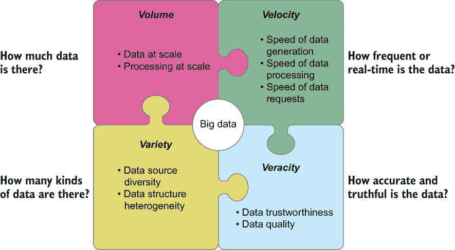

图 2.3 大数据的四个“V”

几年来，随着“大数据”这个术语开始受到越来越多的关注并变得流行，分析师和技术记者不断地在维度的列表中添加更多的“V”。截至最后一次检查，数量达到了 42 个[Shafer, 2017]；随着时间的推移，无疑还会增加更多。

我们将重点关注原始的三个“V”加上真实性，因为它们仍然是普遍接受的。这些维度在整本书中用于强调图模型和数据库在管理大量数据中的作用。

### 2.1.1 量

从“量”（图 2.4）中获得的收益——处理大量信息的能力——是大数据对机器学习的主要吸引力。拥有更多和更好的数据胜过拥有更好的模型。在大量数据的情况下，简单的数学运算可以非常有效。

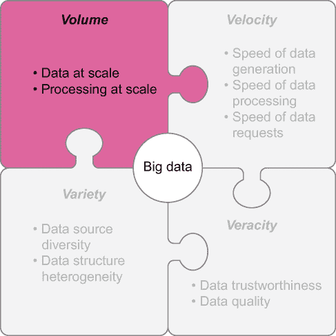

图 2.4 大数据量

假设你希望使用一种机器学习方法，该方法使用各种电子健康记录（EHR）数据来对治疗不同症状所需的类型进行实时预测。患者健康数据量呈指数增长，这意味着遗留的 EHR 数据量也在急剧增加。根据 Health Data Archiver [2018]：

*来自 EMC 和研究公司 IDC 的一份报告提出了一些富有创意的方式来可视化健康信息的激增，预计健康数据将每年增长 48%。报告将 2013 年的医疗数据量定为 153 艾字节。按照预测的增长率，这个数字将在 2020 年增加到 2,314 艾字节。*

如前所述，现代 IT、工业、医疗保健、物联网和其他系统生成数据的量呈指数级增长。这种增长一方面是由于数据存储和处理架构成本的降低，另一方面是由于从数据中提取有价值见解的能力（这些能力创造了新的需求），这些见解可以改善业务流程、效率和提供给最终用户或客户的服务的质量。尽管没有固定阈值来定义数据的量是否为“大数据”，但通常这个术语表示的数据规模是“难以使用传统的数据库系统和数据处理架构存储、管理和处理” [Bahga 和 Madisetti, 2016]。

试图持续收集和分析这些大数据已成为 IT 领域的主要挑战之一。解决这个挑战的方案主要分为两大类：

+   *可扩展存储—扩展存储*通常指的是添加更多机器并将（读取、写入或两者）负载分布到这些机器上。这个过程被称为水平扩展。通过查询或访问机制也可以实现可扩展性，这些机制提供了对整个数据存储子集的多个访问点，无需通过过滤器或索引查找来遍历整个数据集。原生图数据库属于第二组，将在 2.3.4 节中讨论。

+   *可扩展处理*—处理水平扩展不仅意味着有多个机器并行执行任务；它还需要分布式查询方法、网络中有效通信的协议、编排、监控以及分布式处理的具体范式（如分而治之、迭代和管道）。

在 CRISP-DM 生命周期（图 2.5）的数据理解和数据准备阶段，有必要确定数据源以及每个阶段的大小和结构，以设计模型并确定将使用的数据库管理系统（DBMS）。

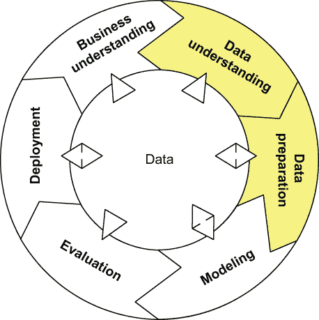

图 2.5 CRISP-DM 模型中的数据理解和数据准备

图形在这些阶段可以提供有价值的支持，帮助解决与数据量相关的问题。基于图模型的数据可以从多个数据源存储在一个单一、高度连接和同质化的真相来源中，提供多种快速访问模式。具体来说，在大数据平台上，图形可以通过扮演两个角色来帮助解决数据量问题：

+   *主要数据源*—在这种情况下，图包含所有最低粒度的数据。学习算法直接访问图以执行其分析。从这个意义上说，根据分析类型，大数据的正确图数据库必须暴露

+   +   一种索引结构（常见于其他 SQL 和 NoSQL 数据库）以支持随机访问

    +   一种仅访问图的一小部分的访问模式，消除了复杂索引查找或数据库扫描的需求

+   *物化视图*——在这种情况下，图表示主数据集的子集或其中数据的聚合版本，对于分析、可视化和结果沟通很有用。视图可以是分析过程的输入或输出，图提供的全局和本地访问模式也为此提供了宝贵的帮助。

2.2 节通过展示两个示例场景及其相关实现来阐述这些相反的方法。

### 2.1.2 速度

*速度*（图 2.6）指的是数据生成、积累或处理的快速程度。例如，在一小时内接收和处理 1,000 个搜索请求，与在几秒钟内接收和处理相同数量的请求是不同的。一些应用程序对数据分析有严格的时间限制，包括股票交易、在线欺诈检测和实时应用等。数据速度的重要性遵循与数据量类似的模式。以前仅限于特定行业段的问题现在正在更广泛的背景下出现。

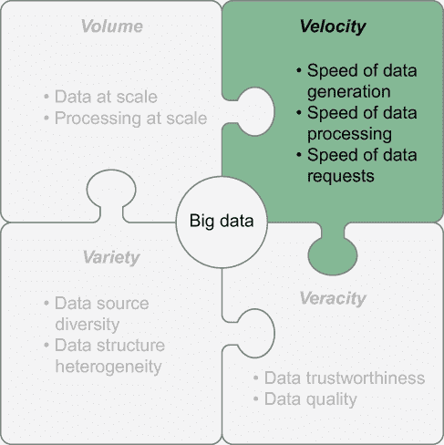

图 2.6 大数据中的速度

假设你正在开发自动驾驶汽车。每辆应该自动驾驶的汽车都可以访问许多传感器，例如摄像头、雷达、声纳、GPS 和激光雷达。¹ 每个传感器每秒都会生成大量数据，如表 2.1 [Nelson, 2016]所述。

表 2.1 自驾驶汽车传感器每秒生成数据

| 传感器 | 每秒生成数据量 |
| --- | --- |
| 摄像头 | ~20-40 MB/s |
| 雷达 | ~10-100 KB/s |
| 声纳 | ~10-100 KB/s |
| GPS | ~50 KB/s |
| 激光雷达 | ~10-70 MB/s |

在这种场景下，你设计的系统不仅应该能够快速处理这些数据，还应该尽可能快地生成预测，以避免例如撞到正在过马路的行人。

但 incoming data 的速度并不是唯一的问题：例如，可以通过将快速移动的数据流式传输到批量存储中进行后续批量处理来解决这个问题。速度的重要性在于 *反馈循环*（图 2.7）的整体速度，它涉及从输入到决策的数据处理：

*通过反馈循环，系统通过监控预测的有效性并在需要时重新训练来持续学习。监控和使用产生的反馈是机器学习的核心。²

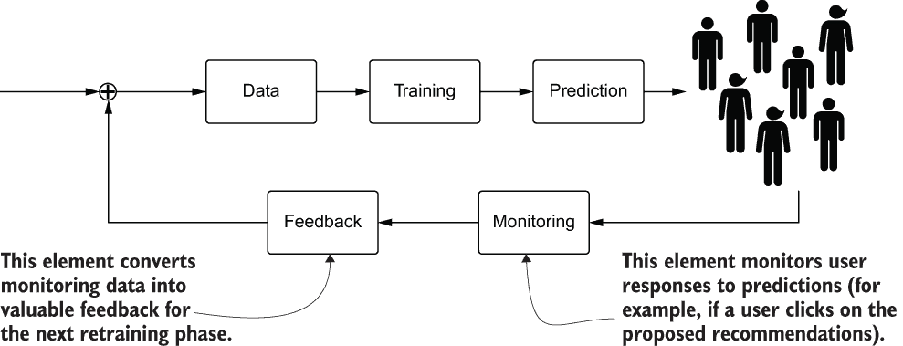

图 2.7 反馈循环的一个示例

一则 IBM 的广告指出，如果你所依赖的只是五分钟前的交通快照，你就不会过马路。这个例子说明了有时你无法等待报告运行或 Hadoop 作业完成。换句话说，“反馈循环越紧密，竞争优势越大” [Wilder-James, 2012]。理想情况下，实时机器学习平台应该能够即时分析数据，就像数据生成时一样。

随着时间的推移，针对大数据管理的一些机器学习架构最佳实践已经出现。Lambda 架构 [Marz and Warren, 2015]，这是一种用于构建实时数据密集型系统的架构模式，是这些实践之一；我们将在 2.2.1 节中查看基于图实现的例子。

能够应对速度的数据基础设施必须提供对必要数据的快速访问，这可能只是整个数据的一部分。假设你打算实现一个针对度假房屋的实时推荐引擎。学习算法使用用户的最新点击和搜索记录来推荐房屋。在这种情况下，引擎不需要访问整个数据集；它检查最后 N 次点击或在过去 X 时间段内的点击，并做出预测。一个本地的图数据库（在第 2.3.4 节中描述）维护每个节点的关联列表。从最后一次点击开始——拥有适当的图模型——引擎可以沿着每个节点的关联回溯。这个例子是图提供的高性能访问数据集小部分的一个说明，以服务于速度。

### 2.1.3 多样性

*多样性*（图 2.8）与被分析的数据的不同类型和性质有关。数据在格式、结构和大小上有所不同；很少以完美有序和准备处理的形式出现。由于它来自不同的和多样化的来源，大数据以多种形状（结构化、非结构化或半结构化）和格式出现；它可以包括文本数据、图像、视频、传感器数据等等。任何大数据平台都需要足够灵活，能够处理这种多样性，特别是考虑到数据的潜在不可预测的演变。

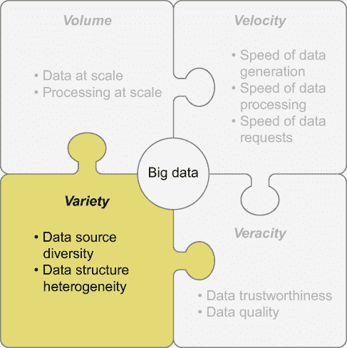

图 2.8 大数据多样性

假设你想要组织一个公司所有分散在多个数据孤岛中的知识，为洞察引擎创建一个知识库。³ 数据可能以不同的格式存在，从结构良好的关系型数据库到公司提供的产品或服务的非结构化用户评论，从 PDF 文档到社交网络数据。为了被机器学习平台处理，数据需要以统一的方式组织、存储和管理。

尽管关系型数据库广受欢迎且熟悉，但它们不再是大数据平台的首选目的地。某些数据类型比其他数据类型更适合某些类型的数据库。例如，社交网络关系本质上就是图，因此非常适合存储在像 Neo4j（附录 B 中描述）这样的图数据库中，这使得对连接数据的操作变得简单高效。此外，由于图在管理连接数据方面的多功能性，其他类别的数据也适合图模型。正如 Edd Wilder-James [2012]所说：

*即使没有根本性的数据类型不匹配，关系型数据库的一个缺点是其模式的静态性质。在一个敏捷、探索性的环境中，计算的成果会随着更多信号的检测和提取而演变。半结构化的 NoSQL 数据库满足了这种灵活性的需求：它们提供了足够的数据结构来组织数据，但在存储之前并不需要数据的精确模式。*

作为一种 NoSQL 数据库，图数据库也不例外。基于节点和边的简单模型在数据表示方面提供了极大的灵活性。此外，在设计过程中后期可以出现新的节点和边类型，而不会影响先前定义的模型，这使得图具有高度的扩展性。

### 2.1.4 真实性

*真实性*（图 2.9）与收集到的数据的质量和/或可信度相关。只有当数据是正确的、有意义的和准确的时，数据驱动型应用才能从大数据中获益。

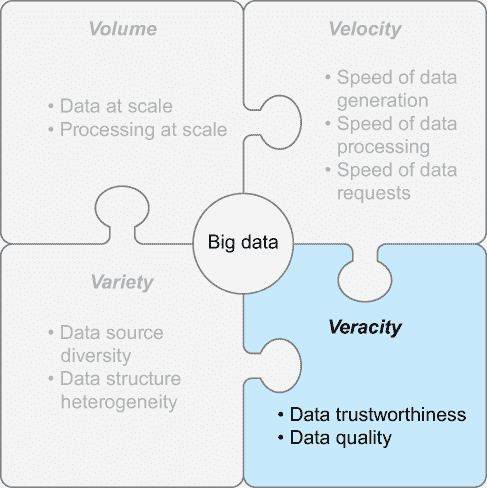

图 2.9 大数据中的真实性

假设你想通过使用评论来为旅游网站创建一个推荐引擎。这种类型的引擎是推荐领域的新趋势，因为评论包含的信息比旧式的星级评分要多得多。问题在于这种评论的真实性：

*对于在线零售商来说，打击虚假评论行业的战争现在是业务的重要组成部分。今天，当评论提交给 TripAdvisor 时，它会通过一个跟踪系统，该系统检查数百个不同的属性，从基本的数据点，如评论者的 IP 地址，到更详细的信息，如提交评论所使用的设备的屏幕分辨率。⁴*

如第一章所述，训练数据集中质量和数量的组合直接影响推断出的模型质量。错误的数据可能会影响整个处理流程。产生的预测结果肯定会受到影响。

数据很少完全准确和完整，这就是为什么需要进行清理过程的原因。这项任务可以通过图方法完成。具体来说，图访问模式使得根据元素之间的关系发现问题变得容易。此外，通过将多个来源合并到一个单一的真实来源中，可以合并信息，减少数据稀疏性。

## 2.2 大数据平台中的图

与大数据打交道是一项复杂的工作。机器学习平台需要访问数据以提取洞察力并向最终用户提供预测服务。表 2.2 总结了与四个“V”相关的挑战，将每个挑战与存储、管理、访问和分析数据的要求配对。

表 2.2 大数据挑战

| 大数据对比 | 挑战 |
| --- | --- |
| 体积 | 数据库应该能够存储大量数据，或者定义的模型应该能够通过聚合压缩数据，以便可以快速访问，同时模型可以执行所有必需的分析。 |
| 速度 | 数据通常以高速度到达，这需要队列来解耦数据摄取与存储机制。摄取速率和存储速率必须得到适当的平衡，以便数据能够快速转换和存储，从而防止队列中元素的积累。 |
| 多样性 | 数据库模式需要足够灵活，能够同时存储多种类型的信息，使用一个模型可以存储所有当前的数据类别以及项目后期可能出现的任何类别。 |
| 真实性 | 设计的模型和选择的数据库应该允许轻松、快速地导航数据，并识别不正确、无效或不受欢迎的数据。应该有一种方法来清理数据，允许去除噪声。简化数据（以对抗数据稀疏性）的任务也应得到支持。 |

处理这些挑战的方法可以分为两类：方法论（或设计）和技术。为了从两者中获取最佳效果，您应该将它们结合起来，和谐地使用。

*方法论*方法包括涉及架构、算法、存储模式和清理方法的所有设计决策；我们将在本节中查看这些方法，并与一些具体的、具体的情况相关联。

*技术*方法包括与所使用的数据库管理系统相关的设计方面，采用的集群配置，以及提供解决方案的可靠性。这些方面将在第 2.3 节中考虑。

这里提供了两个场景，以展示图在作为机器学习项目管道中管理大数据的价值以及从中提取洞察力。虽然这两个场景都与方法论方法相关，但它们也突出了将在本章后面讨论的技术方法的一些方面。

### 2.2.1 图在大数据中的价值

为了看到图在大数据全景中提供的价值，我们将探索一个复杂的用例，该用例需要处理大量数据才能有效。在这种情况下，图可以处理问题复杂性，提供一套完整的特征来存储、处理和分析数据。考虑以下场景：

你是一名警察。你如何通过使用从每个手机发送到（或接收自）所有可达基站的连续监测信号收集的蜂窝基站数据来追踪嫌疑人？

一篇由 Eagle、Quinn 和 Clauset 于 2009 年发表的有趣文章，探讨了使用从手机与可达的每个基站之间交换的连续监测信号收集的蜂窝基站数据的问题（图 2.10）。我们示例场景的目标是利用此类监测数据创建一个预测模型，该模型能够识别与主题生活相关的位置聚类，并根据主题的当前位置预测和预测后续移动。

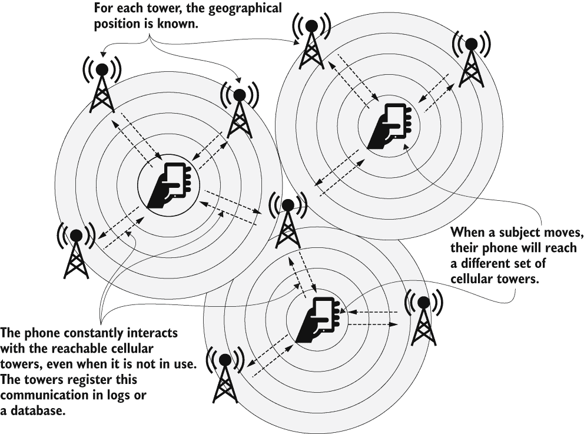

图 2.10 手机与蜂窝基站通信

此方法的相关之处在于，它使用图作为从蜂窝基站获取的数据的折叠和组织方式，并创建了一个基于图的物化视图，以展示主题的移动。该图通过识别位置聚类的图算法进行分析。这些位置在分析管道中的下一个算法中使用，以构建位置预测模型。在本书的这一阶段，我不会描述算法的细节，因为场景的目的是展示如何使用图模型作为在复杂问题中预处理和组织数据的宝贵方法。图压缩信息，使其适合完成的分析。

对于此场景的心理模型，使用图模型来存储和管理数据源，在处理管道中使用图算法，并使用图来存储中间模型（图 2.11）。

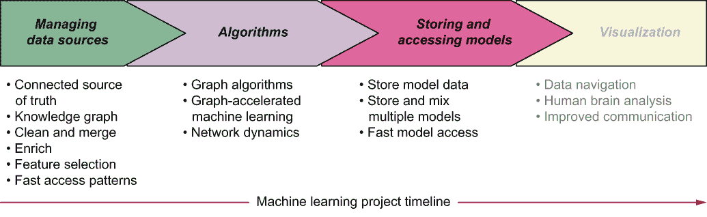

图 2.11 与此场景相关的心理地图区域

今天使用的每部移动电话都能持续访问有关附近蜂窝基站的信息。研究这些数据流可以为用户的移动和行为提供有价值的见解。获取连续蜂窝基站数据的方法包括

+   在手机本身上安装日志应用程序以捕获连续数据流

+   使用（当可用时）来自蜂窝基站的原始连续数据

此示例使用连续数据聚合过程来合并特定手机的数据，因此我们将使用此场景中的第一个用例来简化描述。

每个受试者的电话记录在 30 秒间隔内记录最近的四个塔——信号最强的塔。一旦收集到这些数据，就可以表示为一个*蜂窝塔网络*（CTN），其中节点是唯一的蜂窝塔。如果两个节点在同一个记录中同时出现，则它们之间存在一条边，每条边的权重根据这对节点在所有记录中共同出现的总时间来计算。为每个受试者生成一个 CTN，包括受试者电话在监控期间记录的所有塔[Eagle, Quinn, and Clauset, 2009]。图 2.12 显示了单个受试者产生的图例。

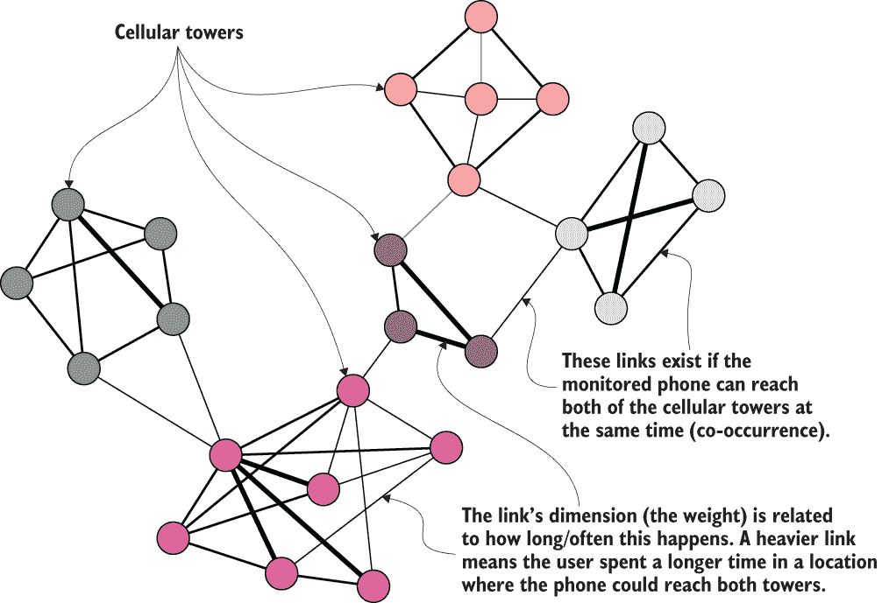

图 2.12 单个受试者的 CTN 图表示

一个节点的强度是通过求和其所有边的权重来确定的。总边权重最高的节点识别出最常靠近受试者电话的塔。因此，高权重节点的组应该对应于受试者花费大量时间的地点。基于这个想法，可以通过不同的聚类算法将图分割成簇。（我们将在本书的第二部分开始讨论这些算法。）这种聚类过程的结果将类似于图 2.13。

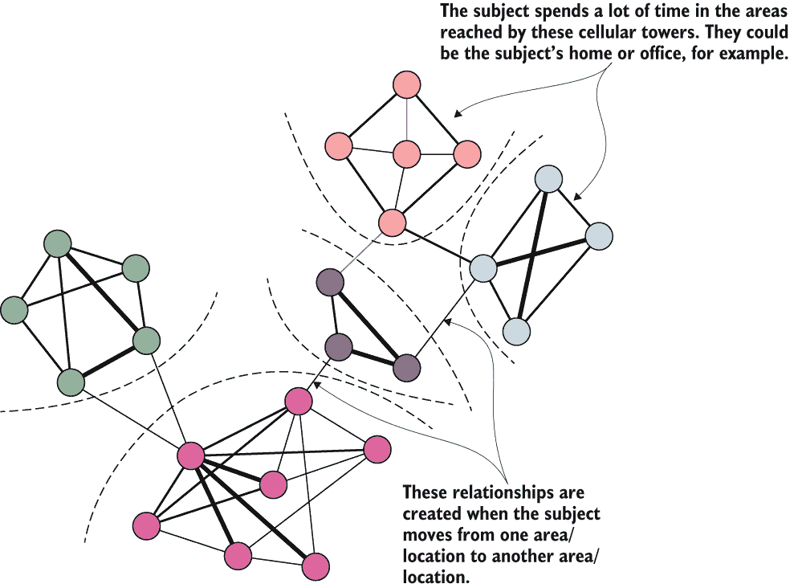

图 2.13 CTN 的聚类视图

这些簇代表受试者花费大量时间的区域——可能是家、办公室、健身房或商店。跨越簇的关系，连接一个簇中的一个节点到另一个簇中的一个节点，代表从一个区域到另一个区域的过渡，例如早上从家到办公室，下午反向行程。

识别出的塔簇可以被转换为动态模型的状态。给定一个受试者访问的地点序列，可以学习他们的行为模式，并计算他们将来移动到各种地点的概率。（可以为此目的使用不同的技术，但这些技术超出了本次讨论的范围。）当预测模型计算出来后，可以使用它来预测受试者的未来移动，考虑到从同一数据源揭示的最后位置。

这种场景说明了方法论方法，其中使用图模型作为数据的有力视图，可以用作某些机器学习算法的输入或分析师的可视化工具。此外，因为图模型是无模式的，历史数据的聚合版本（通常数据量很大，表示受试者在每个位置花费的时间等）和实时值（受试者的电话当前能够到达的蜂窝塔，这表明他们现在的位置）可以存在于同一个模型中。

从具体模型中，可以抽象出一个更通用的方法。问题和过程可以概括如下：

+   存在大量以*事件*形式的数据（来自蜂窝基站或手机的监控数据）。

+   数据分布在*多个数据源*（每个蜂窝基站或手机）。

+   需要将数据*聚合*并组织成一种简化后续处理和分析（CTN）的格式。

+   从第一个聚合格式中，创建了某些视图（聚类算法和位置预测模型）。

+   同时，还需要存储一些最近事件的实时视图，以便快速对这些事件做出反应。

此数据流的一些重要和相关的方面会影响机器学习项目的架构：

+   手机或蜂窝基站记录的*事件*是*原始的*、*不可变的*和*真实的*。它们不会因为分析而改变；它们只是发生。如果一个手机向蜂窝基站发送了 ping 请求，这个事件不会因为不同的分析目的而改变。有必要一次性以原始格式存储这些事件。

+   在此数据上创建了多个*视图*，作为分析使用的算法的函数（聚合是一个例子），并且它们可以根据分析使用的算法而改变。

+   *视图构建过程*通常在数据集的整个集合上操作，这个过程可能需要时间，尤其是在处理大量数据时，如我们的具体用例。处理数据所需的时间在当前事件视图和先前事件视图之间产生了差距。

+   要有一个*实时*的数据视图，有必要填补这个差距。实时视图需要一个读取事件并向视图追加信息的流处理过程。

这里描述的架构问题通过 Nathan Marz 和 James Warren 在他们所著的《大数据：Lambda 架构》一书中介绍的一种特定类型的架构来解决，该架构“提供了一种通用的方法，可以在任意数据集上实现任意函数，并以低延迟返回函数的结果” [Marz and Warren, 2015]。Lambda 架构的核心概念是将大数据系统构建为三个层级的系列：批处理、服务和速度。架构方案在图 2.14 中展示。

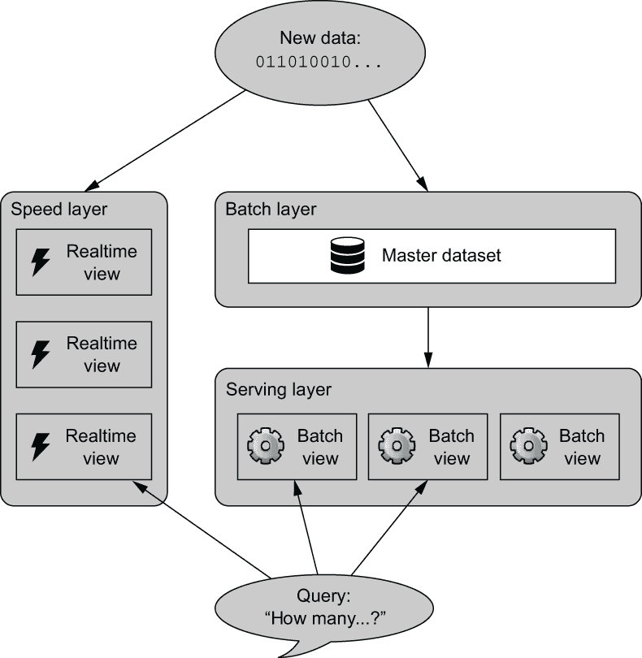

图 2.14 Lambda 架构 [Marz and Warren, 2015]

每一层都满足一组需求，并建立在其他层提供的功能之上。一切始于*查询* = *函数(所有数据)*的等式。在我们的示例场景中，查询是“获取用户花费大量时间的地点。”

理想情况下，我们可以即时运行查询以获取结果。但由于需要处理的数据量以及要访问的数据源的分布式特性，这种方法通常不可行。此外，这将消耗大量资源，成本不合理，且耗时较长。它也不适合任何实时监控和预测系统。

最明显的替代方法是预先计算查询函数的结果或加速最终查询结果的中间值。让我们称预先计算的查询结果，无论是最终结果还是中间结果，为*批量视图*。我们不是即时计算查询，而是从这个视图中计算结果，这个视图需要以提供快速访问的方式存储。然后，前面的方程式如下拆分：

*批量视图 = 函数（所有数据）*

*查询 = 函数（批量视图）*

所有原始格式的数据都存储在批量层中。该层还负责原始数据的访问、批量视图的计算和提取。生成的视图存储在服务层，其中它们以适当的方式索引并在查询期间访问（图 2.15）。

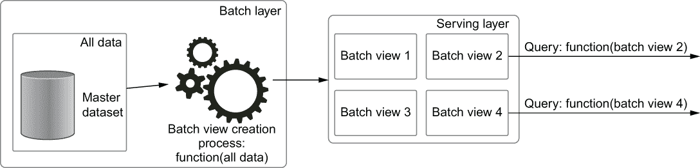

图 2.15 批量层过程

在蜂窝基站场景中，第一个批量视图是 CTN，它是一个图。在此视图上操作的函数是图聚类算法，它产生另一个视图：聚类网络。图 2.16 显示了批量层生成作为批量视图的主题图。这些视图如图 2.12 所示，为每个监控对象进行计算。

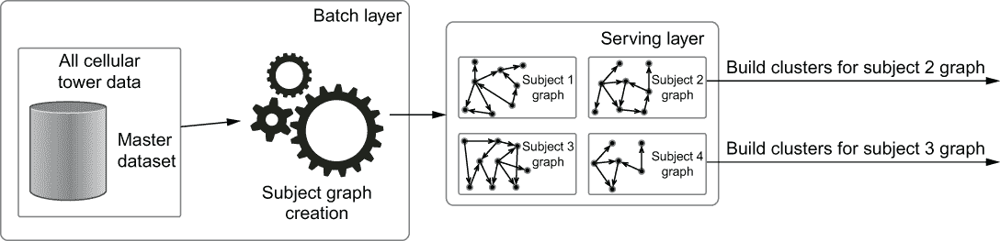

图 2.16 批量层生成图视图

图 2.16 中的主要区别在于，批量视图和随后的实时视图都被建模为图。这种建模决策在几个场景中具有优势，在这些场景中，图表示不仅使我们能够更快地响应用户查询，而且也便于分析。在考虑的具体场景中，CTN 被创建为一个对所有收集到的原始蜂窝数据的函数，并支持聚类算法。

当批量层完成预计算批量视图时，服务层会进行更新。由于预计算需要时间，因此最新到达架构入口点的新数据在批量视图中没有得到表示。速度层通过提供一些较新数据的视图来解决此问题，填补了批量层和最新传入数据之间的差距。这些视图可以与服务层中的结构相同，也可以具有不同的结构并服务于不同的目的。

两个层之间的一大区别是，速度层只关注最近的数据，而批量层关注所有数据。在蜂窝基站场景中，实时视图提供了关于主体最后位置和位置之间转换的信息。

Lambda 架构是*技术无关的*；可以使用不同的方法来实现它。您使用的具体技术可能会根据要求而变化，但 Lambda 架构定义了选择这些技术并将它们连接起来以满足您要求的一致方法。

本节中提出的场景展示了如何将图模型作为服务层和速度层的一部分来使用。最终架构在图 2.17 中表示。

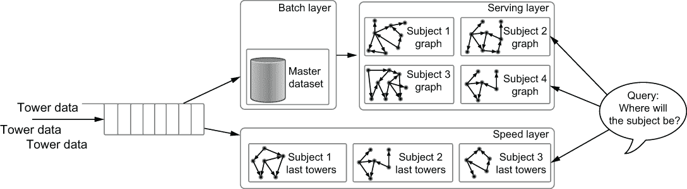

图 2.17 基于图的 Lambda 架构

这种新的 Lambda 架构子类型可以被定义为一种基于*图的 Lambda 架构*。在这种情况下，速度层仅跟踪每个主题最后已知的位置，该位置基于他们手机最后到达的蜂窝基站。然后，这些信息与聚类和预测模型结合使用，以预测主题未来将在何处。

图 2.17 架构中的主数据集可以通过任何数据库管理系统或可以存储大量数据的简单数据存储来存储。最常用的数据存储是 HDFS、Cassandra 和类似的 NoSQL 数据库管理系统。

在考虑的具体场景中，在以图的形式提取数据之前，需要合并数据。HDFS 提供了一个基于文件系统存储的基本访问机制，而 Cassandra 提供了更灵活的访问模式。存储图视图需要图数据库。此类数据库的通用特性和特定工具在 2.3 节中介绍。

基于图的 Lambda 架构和此处描述的场景是图在机器学习大数据分析中发挥重要作用的例子之一。在多个场景中，包括以下场景，可以使用相同的架构：

+   分析银行交易以检测欺诈

+   分析 Web 农场中的服务器日志以识别网络攻击

+   分析电话数据以识别人群社区

### 2.2.2 图对于主数据管理很有价值

在 2.2.1 节中，我们看到了如何使用图在主数据集（批量层）或实时（速度层）表示的部分数据上创建视图。在那个方法中，事务数据驻留在其他地方：在主数据集中。当您可以在服务层存储的聚合数据上查询和执行分析时，此选项很有用。

然而，其他类型的分析不能在数据的汇总版本上执行。这些算法需要更详细的信息才能有效；它们需要访问数据的细粒度版本来完成其工作。这种分析还可以使用图模型作为表示连接和利用数据洞察的一种方式。理解数据之间的连接并从中提取意义提供了经典基于图的分析方法所不具备的能力。在这种情况下，图是知识的主要来源，它模型化了一个单一连接的真实来源。这个概念带我们来到了我们的第二个示例场景：

您希望为银行创建一个简单但有效的欺诈检测平台。

银行和信用卡公司每年因欺诈而损失数十亿美元。传统的欺诈检测方法，如基于规则的，在最大限度地减少这些损失方面发挥着重要作用。但欺诈者不断开发越来越复杂的手段来逃避发现，使得基于规则的欺诈检测方法变得脆弱且很快过时。我们将重点关注一种特定的欺诈类型：信用卡盗窃。犯罪分子可以通过多种方式窃取信用卡数据，包括在自动取款机上安装的蓝牙数据读取设备、黑客的大规模入侵或通过收银员或餐厅工作人员的结账线刷卡的设备。甚至有权访问您的卡的人也可以在一张纸上偷偷记下相关信息[Villedieu, n.d.]。为了揭露这种欺诈，有必要确定“漏洞”的来源：信用卡窃贼及其活动地点。通过将信用卡交易表示为图，我们可以寻找共同点并追踪诈骗的起源点。与其他查看数据的方式不同，图是设计用来表达相关性的。图数据库可以揭示使用传统表示方法（如表格）难以检测到的模式。

假设表 2.3 中的交易数据库包含了一部分有争议交易的用户的交易数据。

表 2.3 用户交易⁵

| 用户标识符 | 时间戳 | 金额 | 商户 | 有效性 |
| --- | --- | --- | --- | --- |
| 用户 A | 2018 年 2 月 1 日 | $250 | Hilton Barcelona | 无争议 |
| 用户 A | 2018 年 2 月 2 日 | $220 | AT&T | 无争议 |
| 用户 A | 2018 年 3 月 12 日 | $15 | Burger King New York | 无争议 |
| 用户 A | 2018 年 3 月 14 日 | $100 | Whole Foods | 有争议 |
| 用户 B | 2018 年 4 月 12 日 | $20 | AT&T | 无争议 |
| 用户 B | 2018 年 4 月 13 日 | $20 | Hard Rock | 无争议 |
| 用户 B | 2018 年 4 月 14 日 | $8 | Burger King New York | 无争议 |
| 用户 B | 2018 年 4 月 20 日 | $8 | Starbucks | 有争议 |
| 用户 C | 2018 年 3 月 5 日 | $15 | Whole Foods | 无争议 |
| 用户 C | 2018 年 5 月 5 日 | $15 | Burger King New York | 无争议 |
| 用户 C | 2018 年 5 月 12 日 | $15 | Starbucks | 有争议 |

从这个交易数据集开始，让我们定义一个图模型。每笔交易涉及两个节点：一个人（客户或用户）和一个商人。节点通过交易本身相互连接。每笔交易都有一个日期和状态：*无争议*表示合法交易，*争议*表示报告的欺诈交易。图 2.18 将数据表示为图。

在这个图中，红色连接是争议交易；其他的是常规（无争议）交易。生成的图很大，但图的维度不会影响必须执行的分析类型。从这样的数据集开始，检测欺诈来源的分析步骤是

1.  *过滤欺诈交易*。识别攻击中涉及的人和卡。

1.  *找出欺诈的源头*。搜索欺诈开始之前的所有交易。

1.  *隔离小偷*。识别一些共同模式，例如共同的商人，这可能是欺诈的起源。

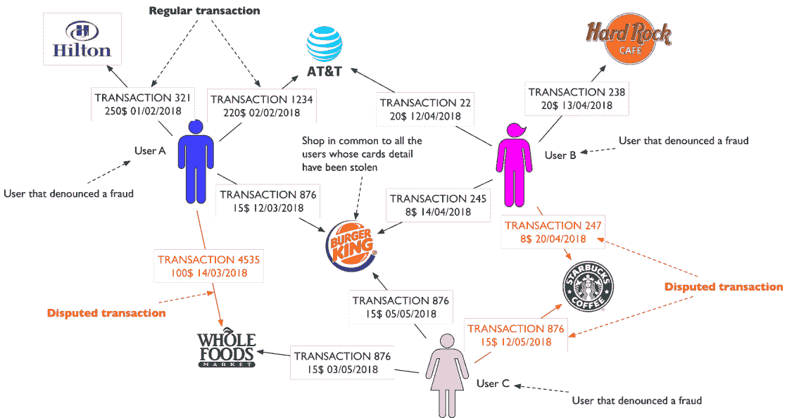

图 2.18 信用卡欺诈检测的示例图模型

根据图 2.18 中的示例图，欺诈交易和受影响的人列在表 2.4 中。

表 2.4 争议交易

| 用户标识符 | 时间戳 | 金额 | 商人 | 有效性 |
| --- | --- | --- | --- | --- |
| 用户 A | 14/03/2018 | $100 | Whole Foods | 争议 |
| 用户 B | 20/04/2018 | $8 | 星巴克 | 争议 |
| 用户 C | 12/05/2018 | $15 | 星巴克 | 争议 |

所有这些交易发生在不同的月份。现在，对于每个用户，让我们考虑在争议交易日期之前执行的交易，以及相关的商人。结果如表 2.5 所示。

表 2.5 争议交易之前的所有交易

| 用户标识符 | 时间戳 | 金额 | 商人 | 有效性 |
| --- | --- | --- | --- | --- |
| 用户 A | 01/02/2018 | $250 | 希尔顿巴塞罗那 | 无争议 |
| 用户 A | 02/02/2018 | $220 | AT&T | 无争议 |
| 用户 A | 12/03/2018 | $15 | 汉堡王纽约 | 无争议 |
| 用户 B | 12/04/2018 | $20 | AT&T | 无争议 |
| 用户 B | 13/04/2018 | $20 | 硬石 | 无争议 |
| 用户 B | 14/04/2018 | $8 | 汉堡王纽约 | 无争议 |
| 用户 C | 03/05/2018 | $15 | Whole Foods | 无争议 |
| 用户 C | 05/05/2018 | $15 | 汉堡王纽约 | 无争议 |

让我们将交易按商店分组。结果列在表 2.6 中。

表 2.6 聚合交易

| 商人 | 数量 | 用户 |
| --- | --- | --- |
| 汉堡王纽约 | 3 | [用户 A, 用户 B, 用户 C] |
| AT&T | 2 | [用户 A, 用户 B] |
| Whole Foods | 1 | [用户 A] |
| 硬石 | 1 | [用户 B] |
| 希尔顿巴塞罗那 | 1 | [用户 A] |

从这张表中可以清楚地看出，小偷在汉堡王餐厅进行操作，因为这是所有用户都有的唯一商人，并且因为每次欺诈都是在那里交易之后开始的。

从这个结果开始，分析可以进一步深入，使用图形来寻找其他类型的模式，并将结果转换为一种下降行动，防止从识别的源头进行任何进一步的交易，直到进一步的调查完成。

在这个场景中，图被用来存储分析所使用的单一真实来源，数据可以以图形的形式进行可视化，以便进行进一步的分析和调查。相关的心智模型如图 2.19 所示。

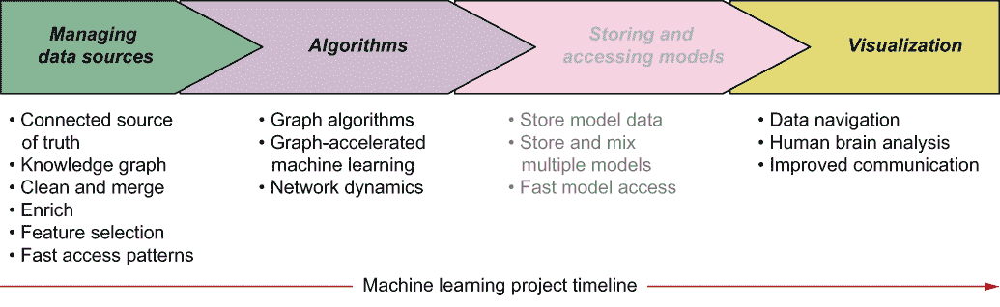

图 2.19 与此场景相关的我们心智地图的区域

这个例子是对揭示欺诈方法的简化，但它展示了使用图数据库进行此类分析的一些优点。这些优点可以总结如下：

+   *多个数据源*，如地理或 GPS 信息、社交网络数据、用户个人资料、家庭数据等，可以合并到一个单一的真实来源中。

+   可以用*外部知识来源*（商店位置、人们的地址等）或*上下文信息*（新商店、其他投诉等）来扩展现有数据，这些信息可以用以提高分析。

+   相同的数据模型可以支持*多种分析技术*（例如，揭露欺诈团伙⁶）。

+   数据可以*以图形的形式可视化*，以加快手动分析的速度。

+   分析可以扩展到多个交互级别，考虑到*多个跳数*。

+   该结构*简化了合并和清理操作*，这得益于图形模型提供的灵活访问模式。

在欺诈分析场景中，图代表了合并、清理和扩展数据的主要知识来源，分析是在其上进行的，并且任何决策都是基于它做出的。与第 2.2.1 节中描述的基于图形的 Lambda 架构不同，在这里，图扮演了主数据集的角色，是*主数据管理*（MDM）的基础——识别、清理、存储和管理数据[Robinson 等人，2015]。MDM 的关键关注点包括

+   随着组织结构的变化、企业的合并和业务规则的演变，*管理变化*。

+   结合*新的数据来源*

+   用*外部数据源*补充现有数据

+   满足报告、合规性和商业智能消费者的需求

+   随着其值和模式的变化，*版本化数据*。

MDM 不是数据仓库（DW）的替代品或现代版本，尽管这两种实践有很多共同之处。DW 与历史数据的存储有关，而 MDM 处理当前数据。MDM 解决方案包含公司内所有业务实体的当前和完整信息。DW 仅包含用于某种静态分析的历史数据。当正确实施时，MDM 具有许多优势，可以概括如下：

+   *简化*人员与部门之间的数据共享

+   *促进*在多个系统架构、平台和应用中的计算

+   *消除*数据中的不一致性和重复

+   *减少*在搜索信息时产生的无谓挫折

+   *简化*业务流程

+   *提高*组织内的沟通效率

此外，当适当的 MDM 解决方案到位时，可以更多地相信系统提供的数据分析，从而提高基于该数据的决策的信心。在这种情况下，图数据库“并不提供完整的 MDM 解决方案；然而，它们非常适合于层次结构、主数据元数据和主数据模型的建模、存储和查询。这些模型包括类型定义、约束、实体之间的关系以及模型与底层源系统之间的映射” [Robinson 等人，2015]。

基于图的 MDM 具有以下优势：

+   *灵活性*—捕获的数据可以轻松更改，以包括额外的属性和对象。

+   *可扩展性*—该模型允许主数据模型随着业务需求的变化而快速演变。

+   *搜索能力*—每个节点、每个关系以及它们的所有相关属性都是搜索入口点。

+   *索引能力*—图数据库自然由关系和节点索引，与关系型数据相比提供更快的访问速度。

基于图的 MDM 解决方案解决了不同类型的功能。在欺诈检测场景中，以及本书的其余部分，它被视为分析/机器学习平台的一部分，作为主要数据源，并由生成的模型扩展，代表了基于图 Lambda 架构的替代方法。

图可以表示存储用于训练目的的数据的 MDM 系统的一个有趣场景是推荐引擎。在这种情况下，图可以存储包含用户与项目之间交互历史的用户-项目矩阵。我们将在第三章中更详细地考虑这个场景。

## 2.3 图数据库

第 2.2 节介绍了一些使用图的机器学习方法，并展示了如何将图作为数据存储和访问模型来增强预测分析的具体示例。为了以最佳方式使用这些模型，您必须能够以与您在数据流或算法中思考它们相同的方式存储、操作和访问图。为了完成这项任务，您需要一个图数据库作为存储引擎。*图数据库*允许您存储和操作实体（也称为*节点*）以及这些实体之间的连接（也称为*关系*）。

本节描述了与图管理相关的技术方面。这种视角在机器学习项目的生命周期中是相关的，在此期间您必须操作、存储和访问真实数据。此外，在大多数情况下，您将处理大数据，因此您必须考虑可伸缩性问题。*分片*（在多个服务器上水平分割数据）和*复制*（为了高可用性和可伸缩性目的在多个服务器上复制数据）在此背景下介绍。

许多图数据库都可用，但并非所有都是*原生*（从头开始为图构建的）；相反，它们在非图存储模型之上提供了一个图“视图”。这种非原生方法会导致存储和查询时的性能问题。另一方面，适当的原生图数据库使用图模型来存储和处理数据，使得图操作简单、直观且高效。关键差异在第 2.3.4 节中突出显示。

在许多情况下，我可以说几乎总是如此，因为您至少需要一个节点标识，可能还需要为节点和关系添加一些属性。换句话说，有必要将节点分组在同一类别中。这些“特征”显著提高了图数据库的表达能力和建模能力。满足此类需求的标签属性图在第 2.3.5 节中介绍。

尽管本书中展示的所有理论、示例和用例都是完全技术无关的，但我们将使用 Neo4j（附录 B 中介绍）作为参考数据库平台。Neo4j 不仅是最少数几个提供高性能的适当图数据库之一，而且还有一个功能强大且直观的查询语言，称为 Cypher。⁷

### 2.3.1 图数据库管理

在机器学习项目中使用图需要您存储、访问、查询和管理这些图中的每一个。所有这些任务都属于图数据库管理的范畴，如图 2.20 所示。

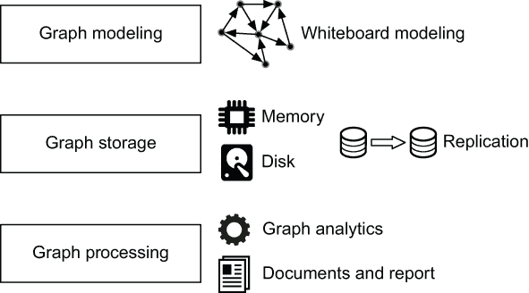

图 2.20 图数据库管理任务

此图显示了可以将图数据管理任务分为的三个主要区域：

+   *图建模*—从一般意义上讲，图模型是数据库系统背后的基本抽象——用于建模现实世界实体及其之间关系的概念工具。图结构的一个主要特征是建模非结构化数据的简单性。在图模型中，模式与数据之间的分离不如在经典的关系模型中那么显著[Angles and Gutierrez, 2017]。同时，图模型是灵活和可扩展的。在图模型中，现实或问题的同一方面可以以多种方式映射。不同的模型可以从不同的角度解决不同的问题，因此定义正确的模型需要努力和经验。幸运的是，图的“无模式”特性意味着模型，即使在项目的早期阶段定义的模型，也可以相对容易地进行更改。另一方面，当你使用其他类型的 NoSQL 数据库或关系数据库时，模型的变化可能需要完全重新导入。在大数据中，这种操作可能从金钱、时间和努力的角度来看是一项昂贵的任务。此外，模型设计会影响在图上执行的所有查询和分析的性能。因此，建模是数据管理的一个关键方面。本章前面已描述了一些模型示例，在接下来的章节中，我们将探讨几个更多的用例，并考虑相关模型的优缺点。

+   *图存储*—当模型定义完成后，数据必须存储在一个持久层中。图数据库管理系统（Graph DBMSs）专门设计用于管理类似图的数据，遵循数据库系统的通用原则：持久数据存储、内存使用、缓存、物理/逻辑数据独立性、查询语言、数据完整性和一致性等。此外，图数据库供应商还需要负责与可扩展性、可靠性和性能相关的所有方面，例如备份、恢复、横向和纵向可扩展性以及数据冗余。在本节中，我们将讨论图数据库管理系统（Graph DBMSs）的关键概念——特别是那些影响模型以及在处理过程中访问数据的方式的概念。

+   *图处理*—这些任务涉及用于处理和分析图的框架（例如工具、查询语言和算法）。有时，处理图需要使用多台机器以提高性能。一些处理功能，如查询语言和某些图访问模式，在图数据库管理系统（Graph DBMS）本身中可用；其他则作为算法或外部平台提供，这些平台必须建立在图和图数据库管理系统之上。

图处理是一个广泛的话题，相关任务可以大致分为几个类别。Özsu [2015] 提出了一种有趣的图处理分类方法，该方法沿三个维度组织：图动态性、算法类型和工作负载类型（见图 2.21）。

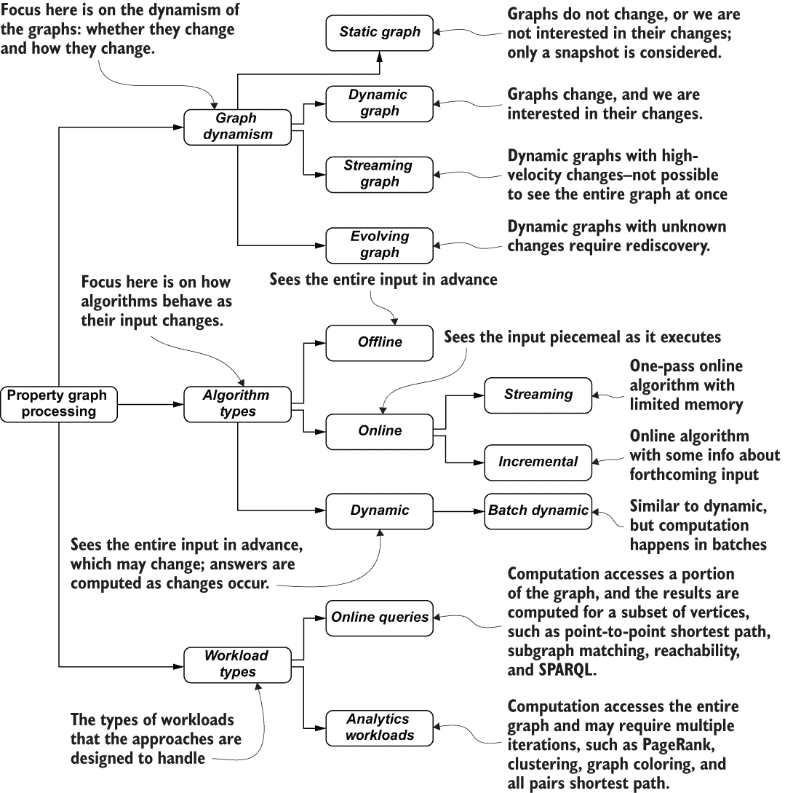

图 2.21 属性图处理分类法 [Özsu, 2015]

图处理这一复杂主题将在整本书中讨论。将介绍不同的算法，并将它们与特定的实际用例或应用实例相对应，这些实例展示了它们在提取洞察力方面的有用性。

### 2.3.2 分片

从纯粹的数据存储角度来看，大数据应用面临的主要四个 V 挑战是

+   *数据量*——涉及的数据量如此之大，以至于难以存储在单台机器上。

+   *速度*—单台机器只能服务有限数量的并发用户。

尽管垂直扩展——如增加计算、存储和内存资源——可以作为一种临时解决方案来处理大量数据并提高多个并发用户的响应时间，但数据最终会变得太大，无法存储在单个节点上，用户的数量也会太高，无法由单台机器处理。

在 NoSQL 数据库中，一种常见的扩展技术是*分片*，其中大型数据集被分割，子集被分布到不同服务器上的多个分片中。这些分片或子集通常在多个服务器上复制，以提高可靠性和性能。*分片策略*决定了哪些数据分区应该发送到哪些分片。分片可以通过各种策略实现，这些策略可以由应用程序或数据存储系统本身管理。

对于面向聚合的数据模型，如键/值、列族和文档数据库[Fowler and Sadalage, 2012]，在这些模型中，表达概念之间关系的方式是将它们聚合在单个数据条目中，使用值或文档，这种解决方案是合理的。在这些类型的存储中，用于检索任何项目的键是已知且稳定的，查找机制快速且可预测，因此将想要存储或检索数据的客户端定向到适当的分片是直接的[Webber, 2011]。

另一方面，图数据模型高度关系导向。每个节点都可以与任何其他节点相关联，因此图没有可预测的查找。它还具有高度可变的结构：在只有少量新链接和新节点的情况下，连接结构可以发生很大变化。在这些情况下，对图数据库进行分片并不简单[Webber, 2011]。一个可能的解决方案是将相关的节点和相关的边放置在同一位置。这种解决方案将提高图遍历性能，但同一数据库分片上有太多连接的节点会使它负载过重，因为大量数据将位于同一分片上，导致其不平衡。图 2.22 和 2.23 说明了这些概念。

图 2.22 展示了在导航一个图时可能需要多次跨越分片边界。这种跨分片遍历非常昂贵，因为它需要许多网络跳转，导致查询时间显著增加。在这种情况下，与所有操作都在同一分片上的情况相比，性能会迅速下降。

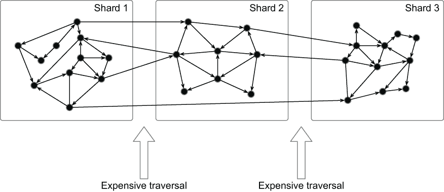

图 2.22 不同分片间的关系遍历

在图 2.23 中，为了克服这个问题，相关的节点被存储在同一分片上。图遍历更快，但分片间的负载极不平衡。此外，由于图具有动态特性，图及其访问模式在运行时可能会迅速且不可预测地发生变化，这使得在实际中实施这种解决方案不太方便。

考虑到这些挑战，一般来说，有三种技术可以用于扩展图数据库：

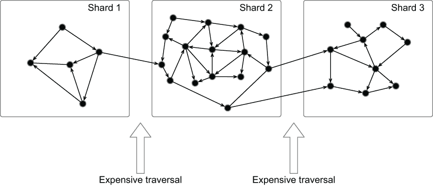

图 2.23 单个分片（分片 2）的过载

+   *应用级分片*——在这种情况下，数据的分片是在应用层面通过使用领域特定知识完成的。对于一个全球业务，与北美相关的节点可以创建在一个服务器上，而与亚洲相关的节点可以位于另一个服务器上。这种应用级分片需要理解节点存储在物理上不同的数据库中。分片也可以基于必须对数据进行的不同类型分析或图处理。在这种情况下，每个分片包含执行算法所需的所有数据，并且一些节点可以在分片之间进行复制。图 2.24 描述了应用级分片。

+   *增加 RAM 或使用缓存分片*——可以垂直扩展服务器，添加更多 RAM，使整个数据库适合内存。这种解决方案使图遍历非常快，但对于大型数据库来说既不合理也不可行。在这种情况下，可以采用一种称为缓存分片的技术，以保持高性能，同时数据集的大小远超过主内存空间。缓存分片在传统意义上不是分片，因为我们期望完整的数据集存在于每个数据库实例上。为了实现缓存共享，我们将每个数据库实例承担的工作量进行分区，以增加给定请求命中热缓存的可能性。（在像 Neo4j 这样的图数据库中，热缓存性能非常高。）

+   *复制*——可以通过添加更多（相同的）数据库副本来实现数据库的扩展，这些副本作为只读访问的跟随者。当您将相对较高数量的只读跟随者数据库实例与少量领导者数据库实例配对时，可以实现高度的扩展性。这种技术在第 2.3.3 节中描述。其他技术有其优缺点，这里不予讨论。

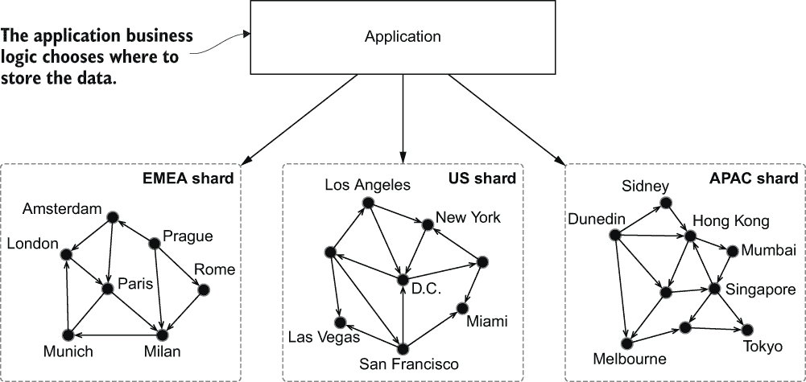

图 2.24 应用级分片隔离

在某些情况下，分片比其他情况更有效。考虑本章前面讨论的两个场景：

+   在蜂窝基站监控示例中，为每个监控对象创建一个图，因此机器学习模型会产生多个独立的图，这些图将单独访问。在这种情况下，应用级分片是一个简单的任务，因为所有图都是隔离的。为了推广，在基于图的 Lambda 架构场景中，在同一个数据集上创建了多个图视图，我们可以将视图存储在多个数据库实例中，因为它们以独立的方式访问。

+   在第二个用例（欺诈检测）中，分片会很棘手，因为在理论上，所有节点都可以连接。可以应用一些启发式方法来减少跨分片遍历，或将频繁访问的节点保持在同一分片上，但图不能像前一个用例那样分成多个独立的图。在这种情况下，另一种选择是使用复制来扩展读取性能并加快分析时间。

### 2.3.3 复制

如第 2.3.2 节所述，在图数据库中，分片是一个困难的任务。处理速度和可用性的一个有效替代方案是复制。数据复制包括在多个不同的计算机上维护数据的多个副本，这些副本被称为*副本*。复制有几个目的 [Özsu and Valduriez, 2011]：

+   *系统可用性*——通过使数据项可以从多个站点访问，复制从分布式数据库管理系统中移除了单点故障。即使某些集群节点关闭，数据也应保持可用。

+   *性能*——复制使我们能够通过将数据定位在其访问点附近来减少延迟。

+   *可扩展性*——复制允许系统在地理上和访问请求的数量上增长，同时保持可接受的响应时间。

+   *应用需求*——作为它们操作规范的一部分，应用程序可能需要维护数据的多个副本。

数据复制具有明显的优势，但保持不同副本同步是一个挑战。在定义复制协议时，数据库更新首先在哪里执行是一个基本的设计决策。这些技术可以按以下方式描述：

+   *集中式*如果它们首先在主副本上执行更新。集中式技术可以根据系统中的所有数据项只有一个主数据库副本被进一步识别为*单主节点*，或者当每个数据项或数据项集可以有一个单独的主副本时，被识别为*主副本*。

+   *分布式*如果它们允许对任何副本进行更新。

由于图的高度连通性，实现集中式主副本协议或分布式协议是一项困难的任务，这对性能和数据一致性有严重影响。（在图中，数据项可以是节点或关系；根据定义，关系连接到两个其他数据项——节点，而节点可能通过多个关系与其他节点连接。）因此，我们将重点关注具有单个主节点的集中式方法，也称为*主/从复制*。

在这种方法中，一个节点被指定为数据的主授权源，被称为*主节点*、*领导者*或*主副本*。这个节点通常负责处理对该数据的任何更新。即使从节点接受写入操作，这些操作也必须通过主节点执行（见图 2.25）。如果大部分数据访问都是读取操作，主/从复制非常有用。通过添加更多从节点并将所有读取请求路由到从节点，可以实现水平扩展。主/从复制还提供了读取弹性：如果主节点失败，从节点仍然可以处理请求 [Fowler and Sadalage, 2012]。

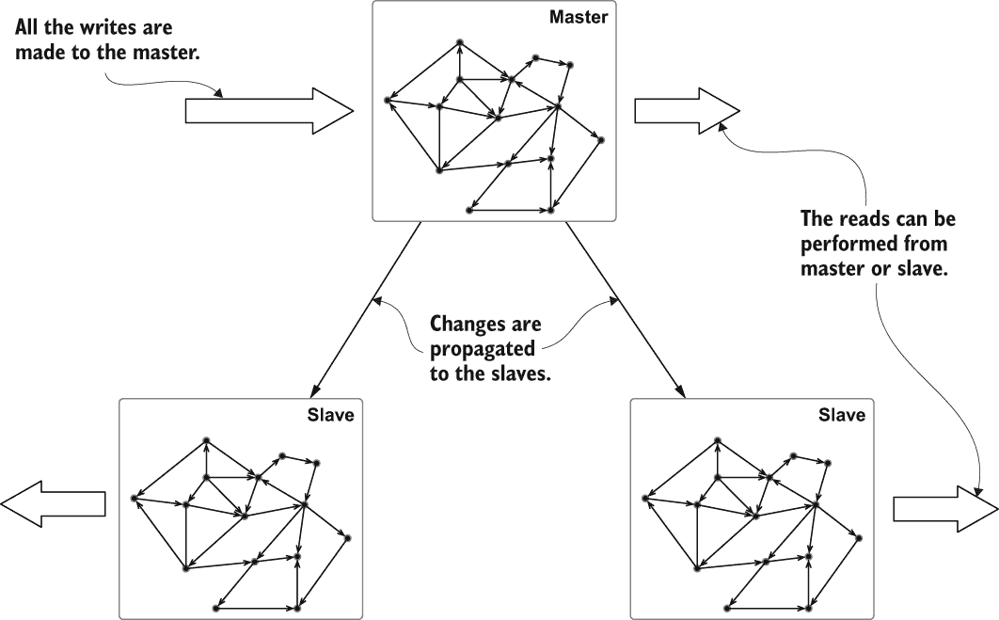

图 2.25 基于 master/slave 协议的复制

大多数主/从协议的实现允许从节点在当前主节点不可用时投票选择不同的主节点。这种方法增加了架构堆栈的可用性和可靠性。具体来说，在一个机器学习项目中，复制允许在训练或预测阶段将读取负载分散到所有节点。

### 2.3.4 原生与非原生图数据库

本书描述了多种方法，通过这些方法图可以增强机器学习项目。为了从图模型中获得最大的优势，需要一个合适的图数据库管理系统来存储、访问和处理图。尽管模型本身在多个图数据库实现中相对一致，但在不同的数据库引擎中编码和表示图的方法有很多。一个旨在处理整个计算堆栈上的图工作负载的数据库管理系统，从查询语言到数据库管理引擎和文件系统，从集群到备份和监控，被称为 *原生图数据库* [Webber, 2018]。原生图数据库被设计为以理解并支持图的方式使用文件系统，这意味着它们不仅对图工作负载性能高，而且安全。更详细地说，原生图数据库管理系统具有一种称为 *无索引邻接* 的属性，这意味着每个节点都维护对其相邻节点的直接引用。邻接表表示是表示稀疏图最常见的方法之一。

从形式上讲，这种表示图 G = (V, E) 的方法由一个邻接表数组 Adj 组成，每个顶点 V 中都有一个列表。对于 V 中的每个顶点 u，邻接表 Adj[u] 包含所有与 u 相邻的顶点 v，其中在 E 中存在边 E[uv]。换句话说，Adj[u] 包含 G 中与 u 相邻的所有顶点 [Cormen 等人，2009]。

图 2.26(b) 是图 2.26(a) 中无向图的邻接表表示。例如，顶点 1 有两个邻居，2 和 5，因此 Adj[1] 是列表 [2,5]。顶点 2 有三个邻居，1、4 和 5，因此 Adj[2] 是 [1,4,5]。其他列表以相同的方式创建。这里值得注意的是，由于关系没有顺序，列表中也没有特定的顺序；因此，Adj[1] 也可以是 [2,5] 或 [5, 2]。

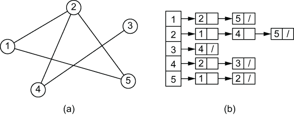

图 2.26 一个无向图（a）及其作为邻接表的表示（b）

同样，图 2.27(b) 是图 2.27(a) 中有向图的邻接表表示。这种列表被表示为链表，其中每个条目都包含对下一个条目的引用。在节点 1 的邻接表中，第一个元素是节点 2，对下一个元素的引用是节点 5 的元素。这种方法是存储邻接表最常见的方法之一，因为它使得添加和删除元素变得高效。在这种情况下，我们只考虑出边关系，但我们可以用相同的方法处理入边关系；重要的是要选择一个方向并在创建邻接表的过程中保持一致性。在这里，顶点 1 只有一个出边关系，与顶点 2 相连，因此 Adj[1] 将是 [2]。顶点 2 有两个出边关系，与 4 和 5 相连，因此 Adj[2] 是 [4,5]。顶点 4 没有出边关系，因此 Adj[4] 是空的 ([])。

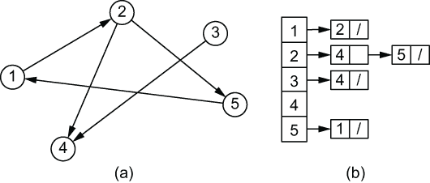

图 2.27 一个有向图（a）及其相关的邻接表表示（b）

如果 G 是一个有向图，所有邻接表长度的总和是|E|。因为每条边只能沿一个方向遍历，所以 E[uv]只会出现在 Adj[u]中。如果 G 是一个无向图，所有邻接表长度的总和是 2 × |E|，因为如果 E[uv]是一个无向边，E[uv]将出现在 Adj[u]和 Adj[v]中。无向或有向图的邻接表表示所需的内存与|V| + |E|成正比。

通过在 Adj[u]中存储边 E[uv]的权重 w，邻接表可以很容易地适应表示加权图。邻接表表示法也可以类似地修改以支持许多其他图变体。在这种表示中，每个节点都充当其他附近节点的微观索引，这比使用全局索引便宜得多。在这样的数据库中，跨关系的遍历具有恒定的成本，与图的大小无关。此外，查询时间与图的总大小无关；相反，它们与搜索的图量成正比。

另一种选择是**非原生图数据库**。这个组中的数据库系统可以分为两类：

+   在现有不同数据结构（如键/值、关系型、文档型或基于列的存储）之上叠加图 API 的那些

+   声称多模型语义的那些，即一个系统据说可以支持几种数据模型

非原生图引擎针对的是替代存储模型，如列式、关系型、文档型或键/值数据，因此在处理图时，数据库管理系统必须执行昂贵的转换，从数据库的主模型转换到图模型。实施者可以通过极端的反规范化来尝试优化这些转换，但这种方法通常会导致查询图时的高延迟。换句话说，非原生图数据库在现实情况下永远不会像原生图数据库那样高效，简单的理由是转换过程是必需的。

理解图是如何存储的有助于你为其定义一个更好的模型，其中图数据库的“原生”特性至关重要。这一关注点也与本书的哲学思想相关：

在一个成功的机器学习项目中，每个方面都与向最终用户提供高效和性能良好的服务相关，其中“高效”和“性能良好”不仅意味着“准确”，还意味着“按时交付”。

例如，一个网站上的高度准确的推荐，如果它在 30 秒内送达，那么它将是无用的，因为到那时，用户可能已经去了别处。

有时，这些方面被认为次要。一个常见的误解是，非本地图技术已经足够好。为了更好地理解在机器学习项目中数据库引擎对图的原生支持的价值，让我们考虑一个例子：

您必须实现一个供应链管理系统，该系统分析整个链以预测未来的库存问题或发现网络中的瓶颈。

供应链管理专业协会将供应链管理定义为“涵盖所有涉及采购、转换以及所有物流管理活动的计划和管理工作。”⁸ 供应链可以自然地建模为图，如图 2.28 所示。

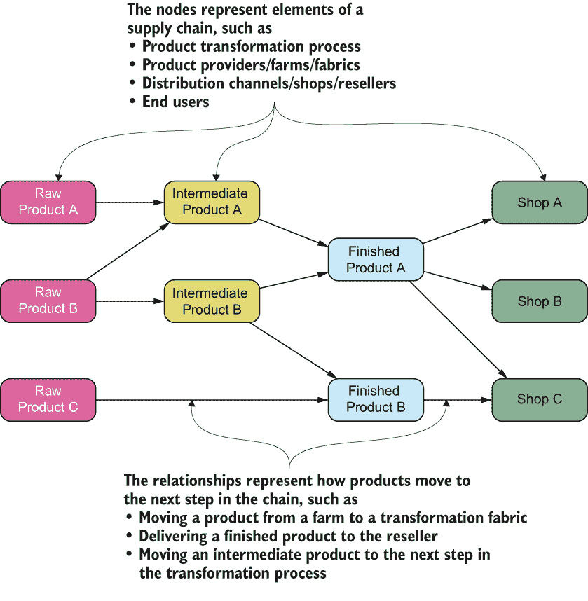

图 2.28 供应链网络

假设现在您想使用基于全局索引的关系数据库或任何其他 NoSQL 数据库来存储供应链网络模型。供应链中元素之间的关系如图 2.29 所示。

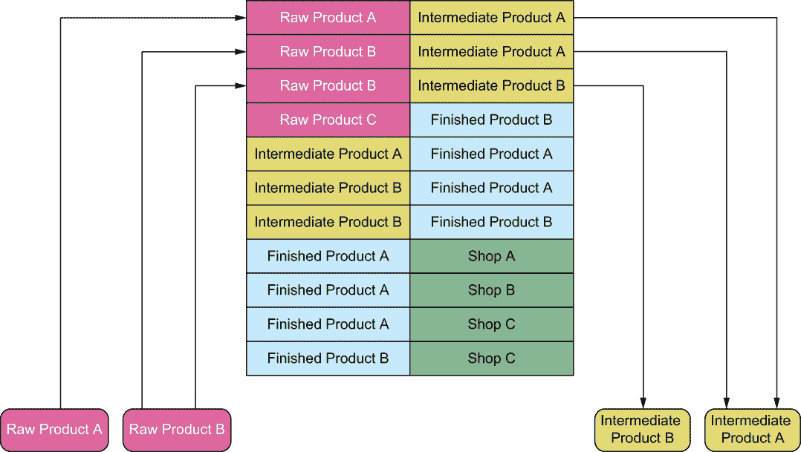

图 2.29 存储供应链网络的表格模型

如图中所示，这些索引为每次遍历添加了一层间接层，从而增加了计算成本。要找到生产完成后 B 型成品将运往何处，我们首先必须执行索引查找，成本为 O(log n)，⁹，然后获取链中下一个节点的列表。这种方法对于偶尔或浅层查找可能是可接受的，但当我们反转遍历方向（例如，找到创建 C 型成品所需的中间步骤）时，它很快就会变得难以忍受地昂贵。

假设现在原材料 A 被污染或不再可用，我们需要找到受此问题影响的链中所有产品或商店。我们必须执行多次索引查找，每次查找针对可能位于原材料和商店之间链中的每个节点，这使得成本变得更为沉重。而找到 B 型成品将运往何处的成本为 O(log n)，要遍历 m 步网络，索引方法的成本为 O(m log n)。在一个具有无索引邻接关系的本地图数据库中，双向连接实际上是预先计算并存储在数据库中的关系，如图 2.30 所示。

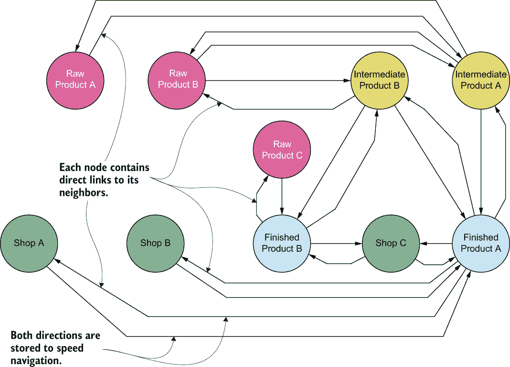

图 2.30 存储供应链的基于图模型

在这种表示中，当你有第一个节点时，遍历关系的成本为 O(1)，它直接指向下一个节点。执行之前所需的相同遍历现在只需 O(m)。不仅图引擎更快，而且成本仅与跳数（m）有关，而不是与关系的总数（n）有关。

假设现在你需要识别供应链中的瓶颈。在网络上发现瓶颈的一种常见方法是 *中介中心性*，它是一种基于计算节点之间最短路径的图中心性（重要性）度量。每个节点的中介中心性是通过该节点经过的最短路径的数量。在这种情况下，索引查找的成本——O(log n）将对计算性能产生重大影响。

总结一下，原生图架构提供了许多优势，使其在管理图模型方面通常优于非原生方法。我们可以将这些优势总结如下：

+   *“分钟到毫秒”的性能*—原生图数据库处理连接数据查询的速度远快于非原生图数据库。即使在普通的硬件上，原生图数据库也可以轻松处理每秒数百万次图上节点的遍历，以及每秒数千次的事务性写入 [Webber, 2017]。

+   *读效率*—原生图数据库可以在没有复杂模式设计和查询优化的情况下，通过无索引邻接实现常数时间遍历。直观的属性图模型消除了创建任何额外且通常复杂的应用程序逻辑来处理连接的需求 [Webber, 2017]。

+   *磁盘空间优化*—为了提高非原生图性能，可以非规范化索引或创建新索引，或者两者结合，这将影响存储相同信息所需的空间量。

+   *写效率*—索引非规范化也会对写性能产生影响，因为所有这些额外的索引结构也需要更新。

### 2.3.5 标签属性图

用于表示复杂网络的图需要存储比简单的节点和关系列表更多的信息。幸运的是，这种简单的结构可以很容易地扩展到一个更丰富的模型，该模型包含以 *属性* 形式存在的附加信息。此外，有必要将节点分组到类中，并为不同类型的关系分配不同的类型。图数据库管理系统提供商引入了 *标签属性图模型*，将一组属性与图结构（节点和关系）关联，并为节点和关系添加类或类型。这种数据模型允许具有任何数据库管理系统典型查询功能的更复杂的查询集，例如投影、过滤、分组和计数。

根据 openCypher 项目，¹⁰ 标签属性图被定义为“一个有向、顶点标记、边标记的多重图，¹¹ 其中边具有自己的标识。”在属性图中，我们用 *节点* 来表示顶点，用 *关系* 来表示边。

属性图具有以下属性（以下以平台无关的方式定义）：

+   图由一组*实体*组成。实体代表一个*节点*或一个*关系*。

+   每个实体都有一个*标识符*，它在整个图中唯一地标识它。

+   每个关系都有一个*方向*、一个*名称*，该名称标识关系的类型、一个*起始节点*和一个*结束节点*。

+   实体可以有一组*属性*，这些属性通常表示为键/值对。

+   节点可以被标记为一个或多个*标签*，这些标签将节点分组并指示它们在数据集中的角色。

属性图仍然是一个图，但通信能力比以前更强。在图 2.31 中，你可以轻松地看到，亚历山德罗·佩尔森为 GraphAware 公司工作，正如米哈尔和克里斯托夫一样。name 是节点 Person 的属性，而 start_date 和 role 是关系 WORKS_FOR 的属性。每个 Person 的国籍是通过使用关系 HAS_NATIONALITY 存储的，该关系将 Person 连接到一个具有存储国家名称属性的 Country 节点。

对于关系数据库，定义图模型有一些最佳实践或风格规则。节点的标签应该是单数，例如，因为它们代表一个特定的实体，而关系的名称应该反映方向。

显然，表示同一组概念的方法有很多种。例如，在图 2.31 中的模型中，国籍可以存储为 Person 节点的属性。根据访问模式和底层图数据库管理系统（DBMS）的具体需求，模式可能会发生显著变化。在本书的第二部分，我们将看到许多表示数据的方法，每种方法都有特定的范围并满足特定目标应用的需求。

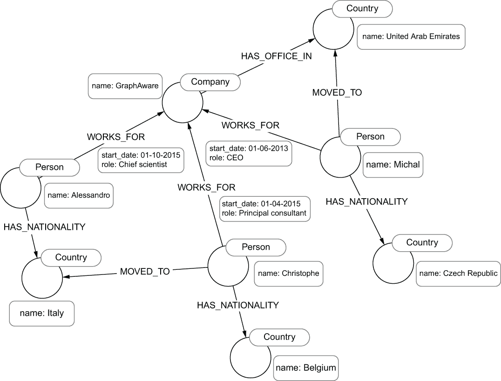

图 2.31 属性图

## 摘要

本章描述了与机器学习应用数据管理相关的一些挑战，并讨论了图模型如何帮助解决这些挑战。本章通过使用具体场景和相关图解决方案的描述来具体说明。你学到了以下内容：

+   如何处理大数据的四个 V：量（volume）、速度（velocity）、多样性（variety）和真实性（veracity）。四 V 模型描述了机器学习项目在数据规模、新数据生成的速度、数据展现出的异构结构和数据来源的不确定性等方面面临的多个关键问题。

+   如何设计架构以处理大量训练数据。预测分析和机器学习通常在训练过程中需要大量数据才能有效。拥有更多数据胜过拥有更好的模型。

+   如何设计一个使用图来存储数据视图的适当 Lambda 架构。在基于图的 Lambda 架构中，图模型用于存储和访问批量或实时视图。这些视图代表预先计算且易于查询的主数据集视图，其中包含原始格式的原始数据。

+   如何规划您的 MDM 平台。MDM 是指识别、清理、存储以及（最重要的是）管理数据的过程。在此背景下，图模型在数据模型中提供了更多的灵活性和可扩展性，同时具备搜索和索引功能。

+   如何选择适合应用程序需求的复制模式。复制允许您在图数据集群的多个节点之间分配分析负载。

+   原生图数据库的优势是什么。与非原生图数据库相比，原生图数据库管理系统更可取，因为它们将模型（我们表示数据的方式）与底层数据引擎一一映射。这种匹配允许更好的性能。

## 参考文献

[Angles 和 Gutierrez, 2017] Angles, Renzo, 和 Claudio Gutierrez. “图数据管理简介。” arXiv, 2017 年 12 月 29 日。[`arxiv.org/pdf/1801.00036.pdf`](https://arxiv.org/pdf/1801.00036.pdf).

[Bahga 和 Madisetti, 2016] Bahga, Arshdeep 和 Madisetti, Vijay K. *大数据科学与分析：动手实践方法*。VPT, 2016。

[Corbo 等人，2017] Corbo, Jacomo, Carlo Giovine, 和 Chris Wigley. “在金融机构打击欺诈中应用分析。” McKinsey & Company, 2017 年 4 月。[`mng.bz/xGZq`](http://mng.bz/xGZq).

[Cormen 等人，2009] Cormen, Thomas H., Charles E. Leiserson, Ronald L. Rivest, 和 Clifford Stein. *算法导论*。第 3 版。波士顿，MA: MIT Press, 2009。

[Coyle, 2016] Coyle, Peadar. “数据科学家访谈：Greg Linden。” 2016 年 10 月 12 日。[`mng.bz/l2Zz`](http://mng.bz/l2Zz).

[Domo, 2020] Domo. “数据永不眠 8.0。” 2020。[`www.domo.com/learn/data-never-sleeps-8`](https://www.domo.com/learn/data-never-sleeps-8).

[Eagle, Quinn 和 Clauset, 2009] Eagle, Nathan, John A. Quinn, 和 Aaron Clauset. “连续蜂窝塔数据分析方法。” *第 7 届国际普适计算会议论文集* (2009): 342-353.

[Fowler 和 Sadalage, 2012] Fowler, Martin, 和 Pramod J. Sadalage. *NoSQL 精粹：多语言持久性的新兴世界简明指南*。Upper Saddle River, NJ: Addison-Wesley Professional, 2012。

[Gatner, 2017] Gartner. “主数据管理（MDM）。” 2017。[`mng.bz/rmZE`](http://mng.bz/rmZE).

[Health Data Archiver, 2018] Health Data Archiver (2018). “健康数据量激增，传统数据归档在增加。” 2018 年 8 月 3 日。[`mng.bz/dmWz`](http://mng.bz/dmWz).

[Johnson, 2013] Johnson, Ralph. “每天产生 2500 亿字节的数据。CPG 和零售如何管理它？” IBM 消费品行业博客，2013 年 4 月 24 日。

[Jürgensen, 2016] Jürgensen, Knut. “主数据管理（MDM）：是帮助还是阻碍？” Redgate Hub，2016 年 5 月 16 日。[`mng.bz/ZY9j`](http://mng.bz/ZY9j)。

[Laney, 2001] Laney, Douglas. “3D 数据管理：控制数据量、速度和多样性。” META Group，2001 年 2 月 6 日。[`mng.bz/BKzq`](http://mng.bz/BKzq)。

[Marz 和 Warren, 2015] Marz, Nathan, 和 James Warren. *大数据*。纽约州舍尔特岛：Manning，2015 年。

[Nelson, 2016] Nelson, Patrick. “一辆自动驾驶汽车每天将使用 4,000 GB 的数据。” *网络世界*，2016 年 12 月 7 日。[`mng.bz/Paw2`](http://mng.bz/Paw2)。

[Özsu, 2015] Özsu, M. Tamer. “图数据管理和分析概述。” ADC 博士学校，2015 年 6 月 4 日。[`hkbutube.lib.hkbu.edu.hk/st/display.php?bibno= b3789774`](http://hkbutube.lib.hkbu.edu.hk/st/display.php?bibno=b3789774)。

[Özsu 和 Valduriez, 2011] Özsu, M. Tamer, 和 Patrick Valduriez. *分布式数据库系统原理*。第 3 版。纽约：Springer，2011 年。

[Parkin, 2018] Parkin, Simon. “对虚假评论的永无止境的战争。” *《纽约客》*，2018 年 5 月 31 日。[`mng.bz/1A5Z`](http://mng.bz/1A5Z)。

[Puget 和 Thomas, 2016] Puget, Jean Francois, 和 Rob Thomas. “机器学习的实用指南：理解、区分和应用。” IBM 社区，2016 年 8 月 16 日。

[Robinson 等人，2015] Robinson, Ian, Jim Webber, 和 Emil Eifrem. *图数据库*。第 2 版。加利福尼亚州塞巴斯蒂波尔：O’Reilly，2015 年。

[Rund, 2017] Rund, Ben. “关于图数据库在主数据管理（MDM）中的优点、缺点和炒作。” *TDWI*，2017 年 3 月 14 日。[`mng.bz/VG9r`](http://mng.bz/VG9r)。

[Shafer, 2017] Shafer, Tom. “大数据和数据科学的 42 个特征。” Elder Research，2017 年 4 月 1 日。[`www.elderresearch.com/blog/42-v-of-big-data`](https://www.elderresearch.com/blog/42-v-of-big-data)。

[Shannon, 2017] Shannon, Sarah. “更新至 2018 年：大数据的五大特征：它们如何帮助您的业务？” XSI，2017 年 2 月 15 日。

[Villedieu, n.d.] Villedieu, Jean. “GraphGist：信用卡欺诈检测。” Neo4j。[`mng.bz/A1GE`](http://mng.bz/A1GE)。

[Webber, 2011] Webber, Jim. “关于图数据库分片。” World Wide Webber，2011 年 2 月 16 日。

[Webber, 2017] Webber, Jim. “原生图数据库的动机。” 2017 年 5 月 17 日。[`mng.bz/2z6N`](http://mng.bz/2z6N)。

[Webber, 2018] Webber, Jim. “并非所有图数据库都是相同的：为什么您需要一个原生图数据库。” *数据库趋势与应用*，2018 年 3 月 7 日。[`mng.bz/RKwn`](http://mng.bz/RKwn)。

[Wilder-James, 2012] Wilder-James, Edd. “什么是大数据？大数据领域的介绍。” [`www.oreilly.com/ideas/what-is-big-data`](https://www.oreilly.com/ideas/what-is-big-data)。

[Woodie, 2016] Woodie, Alex. “Neo4j 将图数据库的节点限制推至超过一千万亿个。” Datanami，2016 年 4 月 26 日。[`mng.bz/Jvwp`](http://mng.bz/Jvwp)。

* * *

(1.) “激光雷达的工作原理与雷达类似，但它不是发送无线电波，而是发射红外光脉冲——即人眼看不见的激光——并测量它们击中附近物体后返回所需的时间。”来源：[`mng.bz/jBZ9`](https://shortener.manning.com/jBZ9)。

(2.) Puget 和 Thomas [2016]。

(3.) “洞察引擎应用相关性方法来描述、发现、组织和分析数据。这使得现有或合成信息能够主动或交互式地传递，并在数字工作者、客户或利益相关者的及时业务时刻传递。”（来源：[`mng.bz/WrwX`](https://shortener.manning.com/WrwX)）

(4.) Parkin [2018]。

(5.) 这里使用的商家名称作为示例，以使用例更加具体。

(6.) 根据《法律词典》（[`thelawdictionary.org/fraud-ring`](https://thelawdictionary.org/fraud-ring)），“欺诈团伙”是指“一个专注于欺诈人们的组织。伪造、虚假陈述、窃取身份、伪造支票和货币都是欺诈行为。”

(7.) [`www.opencypher.org`](https://www.opencypher.org)。

(8.) [`mng.bz/8WXg`](https://shortener.manning.com/8WXg)

(9.) 大 O 符号“在计算机科学中用于描述算法的性能或复杂度。大 O 特别描述了最坏的情况，可以用来描述算法所需的执行时间或使用的空间（例如在内存或磁盘上）。”（来源和示例：[`mng.bz/8WXg`](https://mng.bz/8WXg)）

(10.) [`mng.bz/N8wX`](https://shortener.manning.com/N8wX)

(11.) *自环*，也称为 *sloops*，是指源节点和目标节点相同的边。
