# 机器学习应用中的 3 个图表

本章涵盖

+   图表在机器学习工作流程中的作用

+   如何正确存储训练数据和生成的模型

+   机器学习的图算法

+   使用图可视化进行数据分析

在本章中，我们将更详细地探讨图表和机器学习如何结合在一起，帮助为最终用户、数据分析师和商业人士提供更好的服务。第一章和第二章介绍了机器学习的一般概念，例如

+   构成通用机器学习项目的不同阶段（特别是 CRISP-DM 模型的六个阶段：业务理解、数据理解、数据准备、建模、评估和部署）

+   数据质量和数量对于创建一个有价值且有意义、能够提供准确预测的模型的重要性

+   如何通过使用图数据模型来处理大量数据（大数据）

在这里，我们将看到如何利用图模型作为表示数据的手段，使其易于访问和分析，以及如何使用基于图理论的机器学习算法的“智能”。我想以一张图像（图 3.1）作为本章的开端，这张图像代表了将来自多个来源的原始数据转换为不仅仅是简单知识或洞察力的过程：智慧。

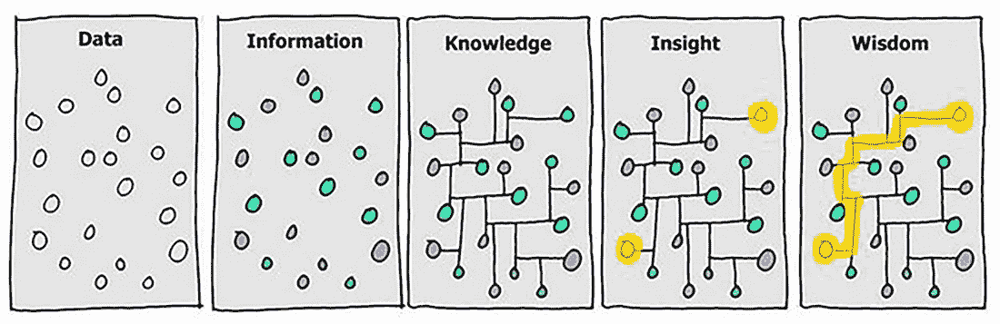

图 3.1 由 David Somerville 绘制，基于 Hugh McLeod 的原始作品¹

我们被数据淹没。数据无处不在。新闻、博客文章、电子邮件、聊天和社交媒体只是围绕我们的多个数据生成源的几个例子。此外，在撰写本文时，我们正处于物联网爆炸的中间：今天甚至我的洗衣机都会给我发送数据，提醒我我的裤子已经洗好了，我的汽车也知道我应该停车休息喝杯咖啡。

数据本身是无用的；单独来看，它不提供任何价值。为了理解数据，我们必须与之互动并组织它。这个过程产生了信息。将信息转化为知识，揭示信息项之间的关系——这是一种质量变化——需要进一步的努力。这个转换过程连接了点，使之前无关的信息获得意义、重要性和逻辑语义。从知识中产生洞察力和智慧，这不仅相关，而且提供指导，可以转化为行动：生产更好的产品，让用户更快乐，降低生产成本，提供更好的服务等等。这个行动就是数据的真正价值所在，在漫长的转换路径的终点——而机器学习提供了从数据中提炼价值的必要智能。

图 3.1 在一定程度上代表了本章第一部分的学习路径：

1.  从一个或多个来源收集数据和信息。这些数据是训练数据，任何学习都将在此基础上发生，并以图的形式管理（第 3.2 节）。

1.  当数据以知识和适当的图的形式组织时，机器学习算法可以在其上提取和构建洞察和智慧（第 3.3 节）。

1.  作为在知识上训练机器学习算法的结果而创建的预测模型被存储回图中（第 3.4 节），使得推断出的智慧永久可用。

1.  最后，可视化（第 3.5 节）以人类大脑容易理解的方式展示数据，使得推导出的知识、洞察和智慧易于获取。

此路径遵循第一章和第二章中使用的相同心智模型，以突出和整理图在机器学习项目中作为有价值的帮助的多种方式（图 3.2）。

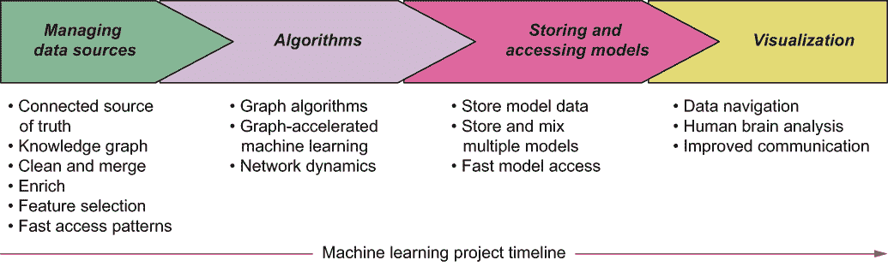

图 3.2 图驱动机器学习的心智模型

我们将从这个心智模型的开始部分开始，深入探讨，展示许多使用图特征来提高机器学习项目的技术和方法。

## 3.1 机器学习工作流程中的图

第一章中描述的 CRISP-DM 模型（Wirth 和 Hipp，2000）允许我们定义一个通用的机器学习工作流程，为了我们的讨论，可以将它分解为以下宏观步骤：

1.  选择数据源，收集数据，并准备数据。

1.  训练模型（学习阶段）。

1.  提供预测。

一些学习算法没有模型。² 基于实例的算法没有单独的学习阶段；它们在预测阶段使用训练数据集中的条目。尽管在这种情况下图方法可以是一个有效的支持，但我们不会在我们的分析中考虑这些算法。

此外，很多时候，数据需要以多种形状可视化，以达到分析的目的。因此，可视化在作为完成机器学习工作流程的最终步骤中扮演着重要的角色，允许进一步的调查。

这个工作流程描述与图 3.2 中的心智模型相匹配，你将在本章（以及本书）的整个过程中看到它，以帮助你弄清楚每个步骤的位置。在这样的工作流程中，从操作、任务和数据流的角度来看图的作用是很重要的。图 3.3 说明了数据如何从数据源通过学习过程流向最终用户，以可视化的形式或预测的形式。

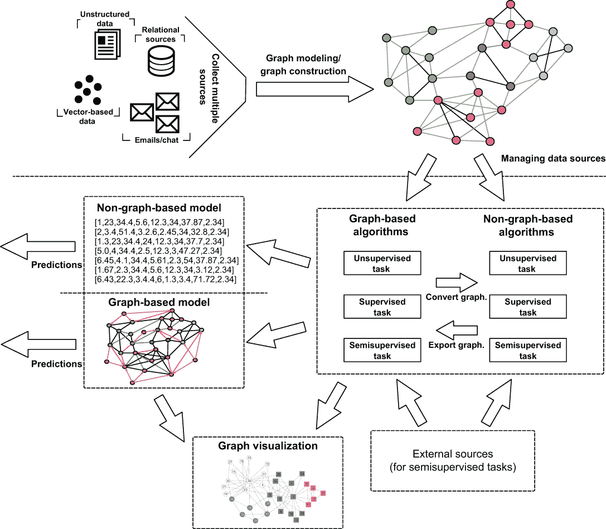

图 3.3 机器学习工作流程中图的作用

过程通常从可用的数据开始。不同的数据源将具有不同的模式、结构和内容。通常，用于机器学习应用的数据可以归类为大数据。（我们在第二章讨论了与大数据一起工作。）在学习过程开始之前，必须对这些数据进行组织和管理。图模型通过创建一个连接良好且组织有序的真相来源来帮助数据管理。从原始数据形状到图的转换可以通过多种技术完成，这些技术可以分为两组：

+   *图建模*——通过建模模式将数据转换为某种图表示。信息是相同的，只是格式不同，或者数据被聚合以使其更适合输入学习过程。

+   *图构建*——从可用的数据开始创建一个新的图。生成的图包含比之前更多的信息。

在此准备之后，数据以良好的结构格式存储，为下一阶段：学习过程。数据的图表示不仅支持基于图的算法；它可以喂养多种类型的算法。具体来说，图表示对于以下任务很有帮助：

+   *特征选择*——查询关系数据库或从 NoSQL 数据库中的值中提取一个键是一项复杂的任务。图易于查询，可以合并来自多个来源的数据，因此通过图方法找到和提取用于训练的变量列表变得简单。

+   *数据过滤*——对象之间易于导航的关系使得在训练阶段之前过滤掉无用数据变得容易，这加快了模型构建过程。我们将在 3.2.4 节中看到一个例子，我们将考虑推荐场景。

+   *数据准备*——图使得清理数据变得容易，去除虚假条目，并合并来自多个来源的数据。

+   *数据丰富*——通过图，可以轻松地用外部知识来源（如语义网络、本体和分类法）扩展数据，或者将建模阶段的结果循环回来构建更大的知识库。

+   *数据格式化*——很容易以所需的任何格式导出数据：向量、文档等。

在两种场景（基于图或非基于图的算法）中，结果可能是一个非常适合图表示的模型；在这种情况下，它可以存储回图中，或者以二进制或专有格式存储。

当预测模型允许时，将模型存储回图中，您就有机会在图上执行预测（更或更复杂）查询。此外，图提供了从不同角度和不同范围访问相同模型的方式。在第 3.2.4 节中描述的推荐是这种方法的潜在能力的例子。

最后，图模型可以用来以图格式可视化数据，这在沟通能力方面通常是一个很大的优势。图易于在白板上展示，因此这些可视化也可以在机器学习项目的早期阶段改善业务所有者和数据科学家之间的沟通。

这里描述的所有阶段和步骤并非都是强制性的；根据机器学习工作流程的需求，可能只有一些是有帮助或必要的。后面的章节将展示一系列具体的示例场景。对于每个场景，图的作用都得到了清晰的说明。

## 3.2 管理数据源

正如我们所见，图在编码信息方面极为有用，以图格式呈现的数据也越来越多。在机器学习的许多领域——包括自然语言处理、计算机视觉和推荐系统——图被用来模拟孤立数据项（用户、物品、事件等）之间的局部关系，并从局部信息构建全局结构 [赵和席尔瓦，2016]。将数据表示为图通常是处理机器学习或数据挖掘应用中产生的问题的必要步骤（有时也只是一种期望）。特别是，当我们想要将基于图的机器学习方法应用于数据集时，这一点变得至关重要。图 3.4 突出了在机器学习项目中管理数据源相关的图的作用。

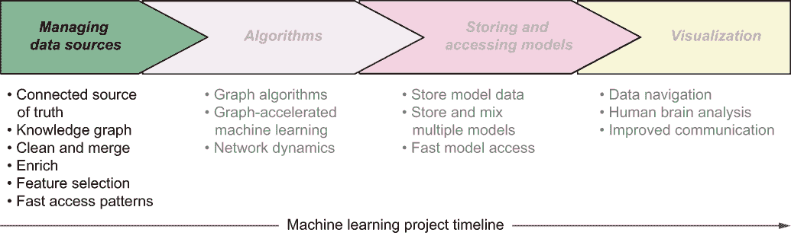

图 3.4 心智模型中的数据源管理

将结构化或非结构化数据转换为图表示可以以无损的方式进行，但这种无损表示并不总是对学习算法的目的来说是必要的（或理想的）。有时，更好的模型是数据的聚合视图。例如，如果你正在模拟两个人之间的电话通话，你可以决定为每次通话在这两个实体（打电话者和接收者）之间建立关系，或者你可以有一个聚合所有通话的单个关系。你可以通过以下两种方式从输入数据集中构建图：

+   通过设计一个表示数据的图模型

+   通过使用一些方便的图形成标准

在第一种情况下，图模型是数据集中本身或多个数据集中可用的相同信息的替代表示。图中的节点和关系仅仅是原始来源中可用数据的表示（可能是聚合的或非聚合的）。此外，在这种情况下，图充当一个连接的数据源，合并来自多个异构源的数据，在过程结束时作为单一可信的真实数据源。有多个方法、技术和最佳实践用于应用这种模型转换并在图格式中表示数据，我们将在多个场景中讨论其中一些。其他数据模型模式在本书的其余部分中介绍。

在第二种场景中——使用一些方便的图形成标准——数据项存储在图中（通常作为节点），通过某种边构建机制创建图。假设在你的图中，每个节点代表一些文本，例如一个句子或整个文档。这些条目是孤立条目。除非它们被明确连接（例如通过论文中的引用），否则节点之间没有关系。在机器学习中，文本通常表示为向量，每个条目包含文本中单词或特征的权重。可以通过使用向量之间的相似度或差异值来创建（构建）边。从无关信息开始创建一个新的图。在这种情况下，生成的图包含比原始数据集更多的信息。这些附加信息由几个成分组成，其中最重要的是数据关系的结构或拓扑信息。

这两个过程的结果是一个图，它表示输入数据，并成为相关机器学习算法的训练数据集。在某些情况下，这些算法本身就是图算法，因此它们需要数据的图表示；在其他情况下，图是访问相同数据的更好方式。这里描述的示例和场景代表了这两种情况。

图 3.5 显示了将数据转换为图表示（或作为图创建）过程中的必要步骤。

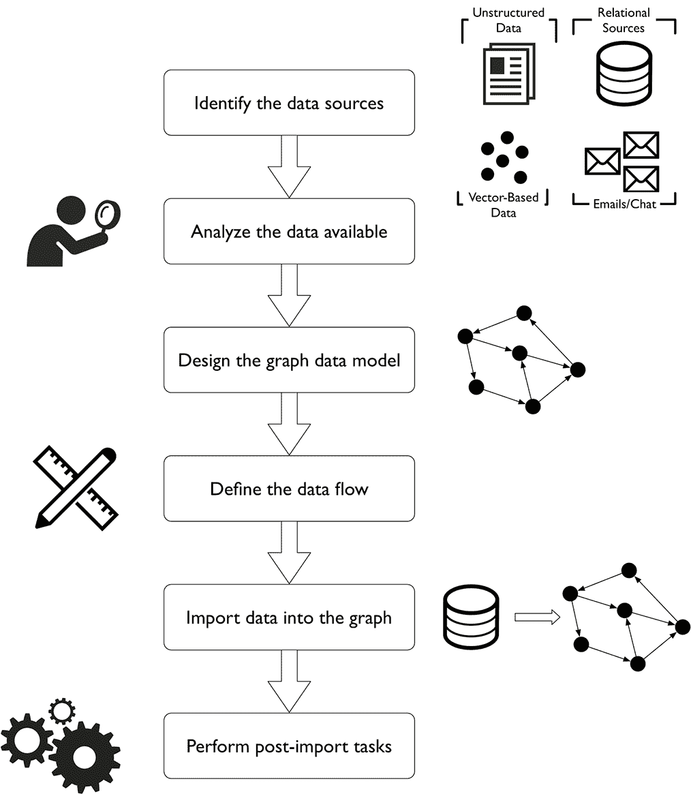

图 3.5 将数据转换为图表示的过程

让我们更详细地看看每个步骤：

1.  *确定数据来源*。确定用于算法训练目的的数据，以及可以从哪些来源提取此类数据。这一步骤对应于机器学习项目的第二阶段，在定义目标之后（CRISP-DM 数据模型的数据准备阶段）。

1.  *分析可用数据*。分析每个可用的数据源，并从质量和数量方面评估其内容。为了从训练阶段获得良好的结果，拥有大量高质量的数据至关重要。

1.  *设计图数据模型*。这一步是双重的。根据具体的分析需求，你必须

    1.  识别从数据源中提取的有意义的信息。

    1.  设计一个特定的图模型，考虑到可用的数据、访问模式和可扩展性。

1.  *定义数据流*。设计摄入过程的架构（称为 ETL 过程），该过程使用设计的模式从多个源提取、转换和加载数据到图数据库。

1.  *将数据导入图*。启动第 4 步中定义的 ETL 过程。通常，第 3 步、第 4 步和第 5 步是迭代的，直到你得到正确的模型和正确的 ETL 过程。

1.  *执行导入后任务*。在开始分析之前，图中的数据可能需要进行一些预处理。这些任务包括

    1.  *数据清理*—删除或纠正不完整或不正确的数据。

    1.  *数据丰富*—通过外部知识源或从数据本身提取的知识扩展现有数据源。后一种情况属于图创建。

    1.  *数据合并*—因为数据来自多个源，数据集中的相关元素可以合并为一个单一元素，或者可以通过新的关系连接起来。

第 5 步和第 6 步可以颠倒或混合。在某些情况下，数据在摄入之前可能需要经过一个清理过程。

数据的新表示提供了几个优势，我们将通过多个场景和多个模型来探讨这些优势。你将首次看到其中一些场景，但其他场景已在第一章和第二章中介绍，并在整本书中进一步扩展。对于每个提出的场景，我将描述背景和目的——定义正确模型和理解使用图方法存储和管理数据以及将图作为分析下一步输入的价值的关键方面。

从第二部分开始，本书详细介绍了使用图模型表示不同数据集的技术。本章通过示例场景突出了使用图管理用于训练预测模型的数据的主要优势。

### 3.2.1 监控一个主体

假设你再次是一名警察。你希望通过使用从每部手机发送到（或接收自）它能到达的所有塔的持续监控信号收集到的蜂窝塔数据来尝试追踪嫌疑人并预测他们的未来行动。使用图模型和图聚类算法，可以将蜂窝塔数据结构化，以简单、清晰的方式表示一个主体的位置和移动。然后你可以创建一个预测模型。³

在此场景中，目标是监控一个对象并创建一个预测模型，该模型能够识别与对象生活相关的位置聚类，并且能够根据对象的当前位置和最后移动情况预测和预测后续移动 [Eagle, Quinn, and Clauset, 2009]。在此场景中，数据是手机与移动基站之间交互产生的移动基站数据，如图 3.6 所示。

图 3.6 手机与移动基站通信

为了进行此类分析，可以从基站或受监控对象的手机中收集数据。通过必要的权限，从移动基站收集数据很容易，但需要进行大量的清理（去除无关的号码）和合并（来自多个移动基站的数据）。从手机收集数据需要黑客技术，这并不总是可能的，但此数据是干净的并且已经合并。在他们的论文中，Eagle, Quinn 和 Clauset 考虑了第二种数据源，我们在这里也这样做，但结果和考虑与数据来源无关。

假设手机将以表 3.1 所示的格式提供数据。

表 3.1 单个手机与四个基站（按 ID 标识）在各个时间戳下提供的数据示例

| 手机标识符 | 时间戳 | 移动基站 1 | 移动基站 2 | 移动基站 3 | 移动基站 4 |
| --- | --- | --- | --- | --- | --- |
| 562d6873b0fe | 1530713007 | eca5b35d | f7106f86 | 1d00f5fb | 665332d8 |
| 562d6873b0fe | 1530716500 | f7106f86 | 1d00f5fb | 2a434006 | eca5b35d |
| 562d6873b0fe | 1530799402 | f7106f86 | eca5b35d | 2a434006 | 1d00f5fb |
| 562d6873b0fe | 1531317805 | 1d00f5fb | 665332d8 | f7106f86 | eca5b35d |
| 562d6873b0fe | 1533391403 | 2a434006 | 665332d8 | eca5b35d | 1d00f5fb |

为了简化起见，此表表示单个手机提供的数据。（手机标识符始终相同。）手机以 30 秒的间隔记录四个信号最强的基站。

分析需要我们识别出被监控主题花费时间的位置。手机上可用的蜂窝基站数据本身无法提供这些信息，因为它只包含四个信号强度最高的基站的标识符。但是，从这些数据开始，通过数据的一个图表示和一个图算法，可以识别出关键位置。因此，这些数据可以建模为一个表示蜂窝基站网络（CTN）的图。正如你从第二章回忆的那样，这个图中的每个节点都是一个独特的蜂窝基站；任何两个节点之间都存在边，如果它们在同一个记录中同时出现，则每条边都会根据这对节点在所有记录中同时出现的总时间分配一个权重。为该主题生成一个 CTN，显示了在监控期间由他们的手机记录下的每个基站。结果看起来像图 3.7。

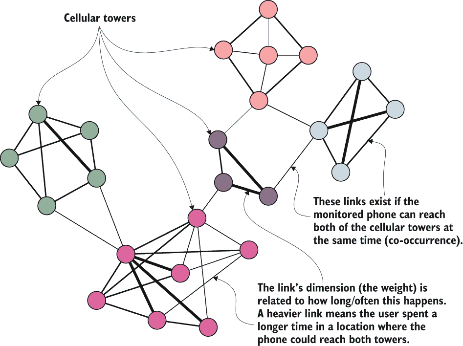

图 3.7 单个主题的 CTN 图表示

将图聚类算法应用于此图，以识别主题花费大量时间的主要位置（在办公室、在家、在超市、在教堂等）。分析的结果看起来像图 3.8，其中识别并隔离了多个聚类。

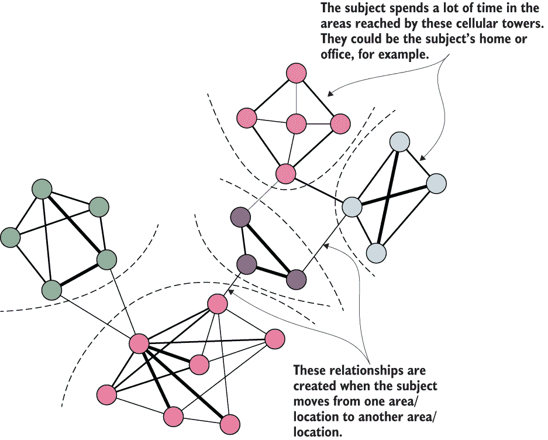

图 3.8 CTN 的聚类视图

这个场景展示了图模型在表示分析特定目的的数据方面是多么地适应良好。通过使用社区检测算法进行基于图的分析，我们可以轻松地识别出主题花费大量时间的地方——如果使用其他表示或分析方法，这项任务将变得困难，甚至不可能。

这里描述的图建模技术说明了图构建技术。生成的图可以概括为*共现图*。节点代表实体（在这种情况下，是蜂窝基站），关系表示两个实体属于一个共同的集合或组。（在 CTN 中，集合是表格中的一行，表示在特定时间点，手机可以到达两个基站。）这项技术是一种强大的技术，在许多算法和机器学习应用中作为分析前的数据预处理步骤使用。这种类型的图构建技术通常用于与文本分析相关的应用；我们将在 3.3.2 节中看到一个例子。

### 3.2.2 检测欺诈

假设你想要为银行创建一个欺诈检测平台，该平台可以揭示信用卡盗窃的源头。交易的一个图表示可以帮助你识别，甚至通过视觉识别，盗窃的位置。⁴

在这种情况下，可用的数据是信用卡交易，包括关于日期（时间戳）、金额、商家以及交易是否争议的详细信息。当某人的信用卡详情被盗时，真实操作与非法或欺诈操作会混入他们的交易历史中。分析的目标是识别欺诈开始的地方——盗窃发生的商店。该商店的交易将是真实的，但在此之后发生的任何交易可能是欺诈性的。可用的数据看起来像表 3.2。

表 3.2 用户交易子集

| 用户标识 | 时间戳 | 金额 | 商家 | 有效性 |
| --- | --- | --- | --- | --- |
| 用户 A | 2018 年 2 月 1 日 | $250 | Hilton Barcelona | 未争议 |
| 用户 A | 2018 年 2 月 2 日 | $220 | AT&T | 未争议 |
| 用户 A | 2018 年 3 月 12 日 | $15 | Burger King New York | 未争议 |
| 用户 A | 2018 年 3 月 14 日 | $100 | Whole Foods | 争议 |
| 用户 B | 2018 年 4 月 12 日 | $20 | AT&T | 未争议 |
| 用户 B | 2018 年 4 月 13 日 | $20 | Hard Rock Cafe | 未争议 |
| 用户 B | 2018 年 4 月 14 日 | $8 | Burger King New York | 未争议 |
| 用户 B | 2018 年 4 月 20 日 | $8 | Starbucks | 争议 |
| 用户 C | 2018 年 5 月 3 日 | $15 | Whole Foods | 争议 |
| 用户 C | 2018 年 5 月 5 日 | $15 | Burger King New York | 未争议 |
| 用户 C | 2018 年 5 月 12 日 | $15 | Starbucks | 争议 |

我们的目的是识别一些常见的模式，揭示用户开始对交易提出争议的点，这将帮助我们定位到卡片详情被盗的场所。这种分析可以通过使用交易的图表示来进行。表 3.2 中的数据可以建模成交易图，如图 3.9 所示。

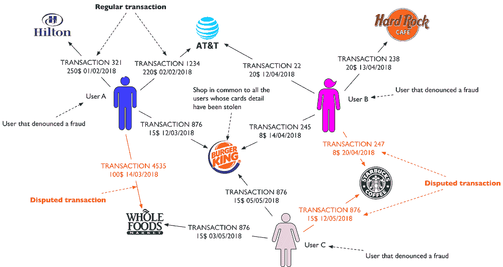

图 3.9 用于信用卡欺诈检测的交易图

如第二章所述，从这种交易表示开始，使用图查询，我们可以确定盗窃发生在 Burger King。 (得出这一结论的步骤在第 2.2.2 节中描述，此处不再重复。)

交易图使我们能够轻松地识别卡片窃贼的活动区域。在这种情况下，分析是在 ETL 阶段之后的图上进行的；不需要其他中间转换。这种数据表示方式使得在长长的交易列表中快速识别行为模式并发现问题所在成为可能。

图 3.9 所示的交易图可以表示任何涉及两个实体的活动。通常，这些图用于以非聚合方式建模货币交易，这意味着每个单独的操作都可以与图的一个特定部分相关联。在大多数情况下，在生成的图中，每个交易以以下两种方式之一表示：

+   作为涉及交易的两个实体之间的**有向边**。如果用户 A 在商店 B 进行购买，这一事件被转换为一个有向边，起点是用户 A，终点是商店 B。在这种情况下，所有与购买相关的详细信息，如日期和金额，都存储为边的属性（图 3.10 (a)）。

+   作为包含关于事件所有相关信息的一个**节点**，并通过边与相关节点相连。在购买的情况下，交易本身被建模为一个节点；然后它连接到购买的源和目的地（图 3.10 (b)）。

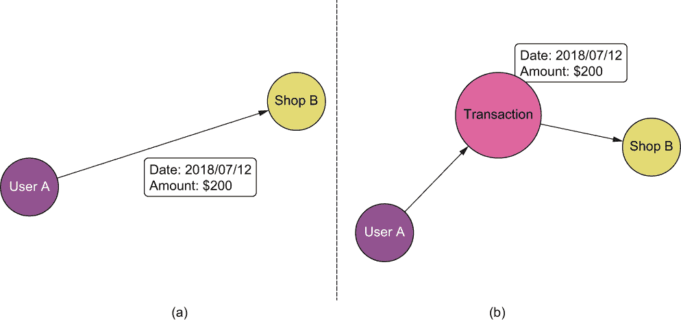

图 3.10 交易建模示例

第一种方法通常在事件相关的信息量较小或分析目的更倾向于简单模型时使用。第二种方法通常在事件本身包含有价值的信息，这些信息可以与其他信息项相关联，或者事件涉及超过两个项目时更受欢迎。

交易图在欺诈检测分析和所有机器学习项目中都很常见，在这些项目中，每个事件都包含相关信息，如果事件被汇总，这些信息将会丢失。

### 3.2.3 在供应链中识别风险

假设你必须实施一个风险管理系统，该系统可以识别或预测供应链中的可能风险。供应链网络（SCN）是表示供应链元素及其交互的一种常见方式，以图形的形式。这种表示方式，加上适当的图分析算法，使得在整个供应链中快速发现问题变得容易且快速。

这种场景近年来变得越来越相关，原因有很多，包括以下方面：

+   随着全球经济的发展，任何供应链都可以具有全球性，因此供应链管理面临的问题正变得越来越复杂。

+   位于供应链末端的客户越来越关注他们所购买产品的来源。

管理中断风险和使供应链更加透明是任何供应链中的强制性任务。供应链本质上脆弱，面临着各种威胁，包括自然灾害和攻击，以及原材料污染、交货延误和劳动力短缺[Kleindorfer 和 Saad，2005]。此外，由于链的各个部分复杂且相互关联，单个成员的正常运营——以及整个链的效率运营——通常依赖于其他组件的正常运营。供应链的成员包括供应商、制造商、分销商、客户等等。所有成员相互依赖，通过物质、信息和金融流进行合作，但它们也是独立实体，可能在多个公司提供相同的服务。因此，在这种场景下可用的数据将分布在具有不同结构的多个公司中。基于此类形状数据的任何分析都是一个复杂任务；从多个成员那里收集所需信息并对其进行组织需要大量努力。

这里分析的目的在于发现链中的元素，如果这些元素受到损害，可能会破坏整个网络（或其大部分）或严重影响正常行为。图模型可以通过不同的网络分析算法支持此类分析任务。我们将在第 3.3 节中讨论算法的细节；在这里，我们将重点介绍可以用于从多个可用来源构建图表示的图构建技术。

可以使用以下方法在图中表示供应链：

+   供应链的每个成员都由一个节点表示。成员可以是原材料供应商（一级供应商）、二级供应商、中间分销商、转换过程、大公司中的组织单位、最终零售商等等。图的粒度与所需的风险评估相关。

+   图中的每个关系都代表链中两个成员之间的依赖关系。这些关系可能包括从供应商到中间分销商的运输、两个加工步骤之间的依赖关系、最终零售商的交货等等。

+   对于每个节点，可以关联一些时间数据，这些数据可以存储历史信息以及预测信息。

网络结构也可能随时间而演变。图模型可以设计为跟踪这些变化，但这样的设计会使本例目的过于复杂。我们的示例图模型如图 3.11 所示。

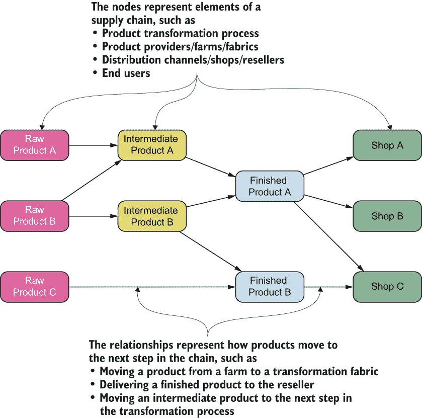

图 3.11 供应链网络

该模型代表了一种收集数据并以有机和均匀方式组织数据的重要方法，并为风险管理所需的分析类型提供了合适的表示。允许我们执行分析以揭示链中高风险元素的算法在 3.3.1 节中讨论。

### 3.2.4 推荐项目

假设你想要在电子商务商店中向用户推荐项目，使用你关于先前交互（点击、购买、评分等）的数据。图可以帮助你以加快访问速度的方式存储用户-项目数据集，并且在图中存储预测模型不仅便于预测，还允许你平滑地合并多个模型。

在机器学习中，图的最常见用例之一是推荐。我在 2012 年编写了第一个基于 Neo4j 构建的推荐引擎。这就是我的图学职业生涯的开始，也是为什么这个特定主题对我来说如此亲近。在这本书中，我们将通过多个示例发现使用图构建多模型推荐引擎的巨大优势，但在这里，我们将从一个简单的例子开始，考虑最基本实现。

可以使用多种方法来提供推荐。在这个特定例子中，选择的方法是基于一种称为*协同过滤*的技术。协同推荐方法的主要思想是利用现有用户社区过去的行为或意见信息来预测系统当前用户最可能喜欢或感兴趣的项目 [Jannach et al., 2010]。纯协同方法将任何类型的给定用户-项目交互矩阵（查看、过去购买、评分等）作为输入，并产生以下类型的输出：

+   一个（数值）预测，表示当前用户可能会喜欢或不喜欢某个特定项目的可能性（相关度得分）

+   根据预测值（从最有可能到最不可能）为用户提供的推荐项目的前 n 个项目的有序列表

相关度是通过一个基于用户反馈估计的效用函数 f 来衡量的 [Frolov and Oseledets, 2016]。更正式地说，相关度函数可以定义为

*f*: 用户 × 项目 → 相关度得分

其中 *用户* 是所有用户的集合，*项目* 是所有项目的集合。此函数可以用于计算所有无信息元素的关联得分。基于预测的数据可以直接由用户（通过评分、点赞/不喜欢等）或通过观察用户的行为（页面点击、购买等）隐式收集。可用的信息类型决定了可以用于构建推荐的技术类型。如果可以获取关于用户（配置文件属性、偏好）和项目（内在属性）的信息，则可以实现基于内容的推荐方法。如果只有隐式反馈可用，则需要采用协同过滤方法。

在预测所有未见过（或未购买）项目的相关性得分后，我们可以对它们进行排序，并向用户展示前 n 个项目，从而进行推荐。像往常一样，我们从可用的数据开始讨论。在这种情况下，数据源看起来像表 3.3（其中 1 表示低评分，5 表示用户对项目的评价很高）。

表 3.3 一个示例用户-项目数据集，以矩阵形式表示

| 用户 | 项目 1 | 项目 2 | 项目 3 | 项目 4 | 项目 5 |
| --- | --- | --- | --- | --- | --- |
| Bob | - | 3 | - | 4 | ? |
| 用户 2 | 3 | 5 | - | - | 5 |
| 用户 3 | - | - | 4 | 4 | - |
| 用户 4 | 2 | - | 4 | - | 3 |
| 用户 5 | - | 3 | - | 5 | 4 |
| 用户 6 | - | - | 5 | 4 | - |
| 用户 7 | 5 | 4 | - | - | 5 |
| 用户 8 | - | - | 3 | 4 | 5 |

这个表格是一个经典的用户-项目矩阵，包含了用户和项目之间的交互（在这个例子中，是评分）。带有符号-的单元格表示用户没有购买或评分该项目。在我们考虑的电子商务场景中，可能会有大量的用户和项目，因此生成的表格可能相当稀疏；每个用户只会购买一小部分可用的项目，因此生成的矩阵将有很多空单元格。在我们的示例表中，我们想要预测的用户 Bob 对未见过或未购买的项目 5 的兴趣。

从可用的数据（以描述的形状）和协同过滤的基本思想出发，存在多种实现这种预测的方法。为了本场景的目的，在本书的这一部分，我们将考虑基于项目的算法。基于项目的算法的主要思想是通过使用项目之间的相似度来计算预测。因此，我们将逐列考虑表格，每一列描述一个元素向量（称为评分向量），其中-符号被 0 值替换。让我们检查我们的用户-项目数据集，并为 Bob 预测第 5 个项目的评分。首先，我们比较其他所有项目的评分向量，寻找与项目 5 相似的项目。现在基于项目的推荐想法是查看 Bob 对这些相似项目的评分。基于项目的算法计算这些其他评分的加权平均值，并使用这个平均值来预测用户 Bob 对项目 5 的评分。

为了计算项目之间的相似度，我们必须定义一个相似度度量。余弦相似度是项目推荐方法中的标准度量：它通过计算两个向量之间角度的余弦值来确定两个向量之间的相似度[Jannach et al., 2010]。在机器学习应用中，这个度量通常用于比较两个表示为术语向量的文本文档；我们将在本书中经常使用它。

计算两个向量之间角度的余弦值以及因此两个项目 a 和 b 之间的相似度的公式如下：

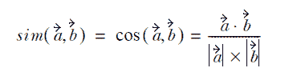

·符号表示两个向量的点积。|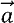|是向量的欧几里得长度，定义为向量与其自身点积的平方根。

图 3.12 展示了 2D 空间中余弦距离的表示。

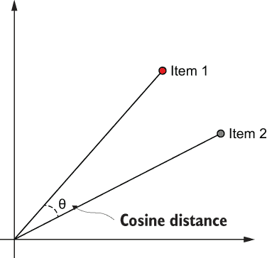

图 3.12 2D 空间中的余弦距离表示

为了进一步解释公式，让我们考虑第 5 个项目的余弦相似度，该项目的评分向量为[0, 5, 0, 3, 4, 0, 5, 5]，以及第 1 个项目的向量[0, 3, 0, 2, 0, 0, 5, 0]。计算如下：

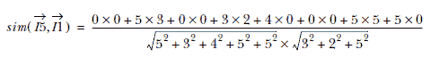

分子是两个向量之间的点积，由两个数字序列对应项的乘积之和计算得出。分母是两个向量的欧几里得长度的乘积。*欧几里得距离*是多维空间中两点之间的距离。图 3.13 在 2D 空间中说明了这一概念。

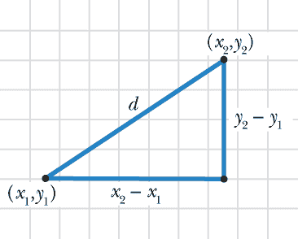

图 3.13 2D 空间中的欧几里得距离

公式如下：

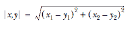

*欧几里得长度*是向量从空间原点（在我们的情况下是向量[0,0,0,0,0,0,0,0]）的欧几里得距离：

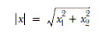

相似度值介于 0 和 1 之间，其中 1 表示最强的相似度。现在考虑我们必须为数据库中的每一对物品计算这种相似度，因此如果我们有 100 万种产品，我们需要计算 1M × 1M 个相似度值。我们可以将这个数字减半，因为相似度是可交换的——cos(a,b) = cos(b,a)，但我们仍然有很多计算要做。在这种情况下，图可以成为加速推荐机器学习算法的有价值助手。用户-物品数据集可以很容易地转换为如图 3.14 所示的图。

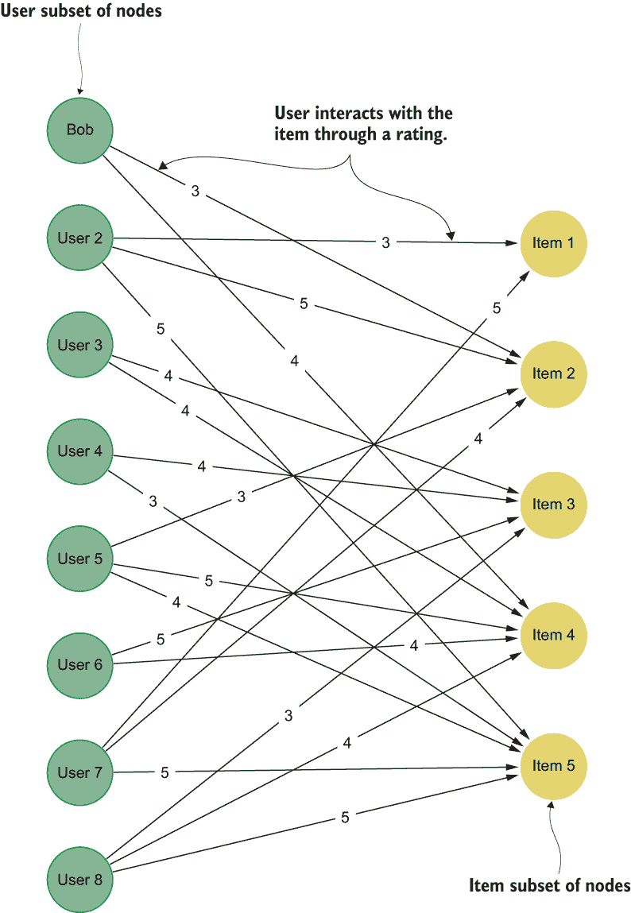

图 3.14 表示用户-物品数据集的二分图

在这种图表示中，所有用户都在左侧，所有物品都在右侧。关系仅从一个子集的节点到另一个子集的节点；同一集合的节点之间没有关系。这个图是一个*二分图*或*双图*的例子。更正式地说，一个*双图*是一种特殊的图，其顶点（节点）可以被分为两个不相交且独立的集合 U 和 V，使得每条边都连接 U 中的一个顶点到 V 中的一个顶点，反之亦然。顶点集 U 和 V 通常被称为图的“部分” [Diestel, 2017]。

如何通过二分图表示减少我们必须执行的相似度计算数量？为了理解这个概念，有必要更好地理解余弦相似度（尽管原理可以扩展到更广泛的相似度函数集）。余弦相似度度量两个 n 维向量之间的角度，因此当两个向量是*正交的*（垂直）时，它们的余弦相似度为 0。在我们的例子中，这种情况发生在两个物品之间没有重叠用户（对两个物品都进行评分的用户）时。在这种情况下，分数的分子将为 0。我们可以计算由向量[3, 5, 0, 0, 3, 0, 4, 0]描述的物品 2 和由向量[0, 0, 4, 4, 0, 5, 0, 3]描述的物品 3 之间的距离，如下所示：

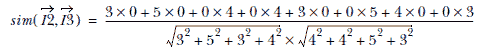

在这种情况下，相似度值将为 0（图 3.15）。在稀疏的用户-物品数据集中，正交性的概率相当高，因此无用的计算数量相应地很高。使用图表示法，使用简单的查询很容易找到至少有一个评分用户的所有物品。然后，只需在当前物品和重叠物品之间计算相似度，从而大大减少所需的计算数量。在原生图引擎中，搜索重叠物品的查询速度很快。

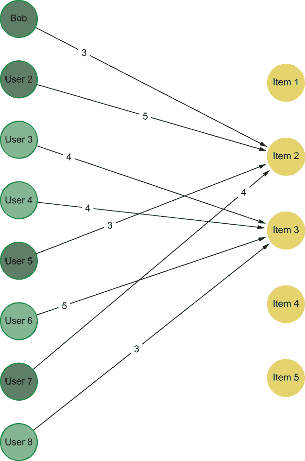

图 3.15 两个不重叠的项目。这些项目没有共同的评分用户，因此它们之间的余弦相似度为 0。

另一种方法是将二分图分成簇，并仅计算属于同一簇的项目之间的距离。

在本节所描述的场景中，图模型通过减少计算项目相似性所需的时间来帮助提高性能，从而提高推荐的效果。在 3.4 节中，我们将看到如何从这一图模型出发，存储相似性计算的结果以实现快速推荐。此外，余弦相似度将被用作图构建的技术。

## 3.3 算法

3.2 节描述了图模型在表示用于学习阶段的学习数据中的作用。这种对真相来源的表示具有多种优势，如前所述，无论学习算法是否基于图。

本节再次使用多个场景，描述了一些使用图算法实现项目目标的机器学习技术。我们将考虑两种方法：

+   作为主要学习算法的图算法

+   图算法作为更复杂算法管道中的促进者

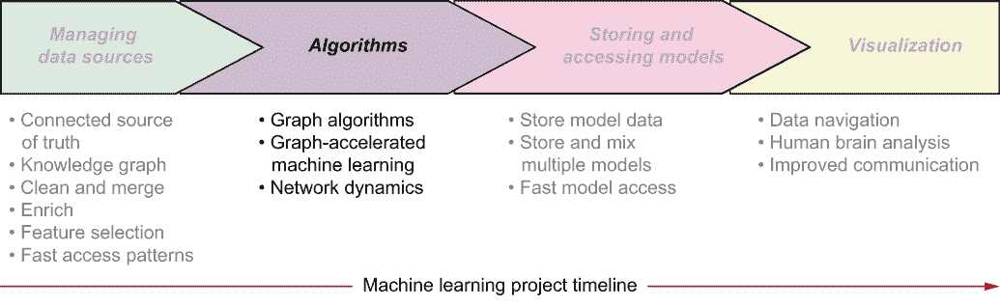

图 3.16 心理模型中的算法

图 3.16 突出了图算法在机器学习项目中的作用。

在本书的其余部分，详细描述了一个完整的算法目录，并提供了实现示例。在本章中，目的是突出图算法在向最终用户提供预测中的作用。与传统的相比，这些技术提供了解决机器学习用例提出的挑战性问题的替代和新颖的方法。在这里（以及本书的其余部分），重点是展示如何在现实世界应用中使用这些技术，但我们也会考虑引入的方法的设计，这些方法在性能和计算复杂度方面是互补或有益的。

### 3.3.1 识别供应链中的风险

供应链风险管理主要旨在确定供应链对中断的敏感性，也称为*供应链脆弱性* [Kleindorfer and Saad, 2005]。评估供应链生态系统的脆弱性具有挑战性，因为它不能直接观察或测量。单个节点的故障或过载可能导致整个网络发生级联故障。因此，供应链系统内部将发生严重损害。因此，脆弱性分析必须考虑整个网络，评估每个节点中断的影响。这种方法需要识别出比其他节点更能代表网络关键元素的节点。如果将供应链表示为网络，如图 3.17 所示，可以应用多种图算法来识别使其面临更大脆弱性的节点。

分析的目的是确定网络中最重要或中心节点。这种类型的分析将揭示供应链感兴趣的节点——最可能成为攻击目标以及需要最多保护的节点，因为任何对这些节点的中断都将严重影响整个供应链及其正常运行能力。例如，在图 3.17 中，原材料 B（B）的供应问题（中断可能发生在供应商端或连接处）将影响整个链条，因为它位于所有商店的路径上。

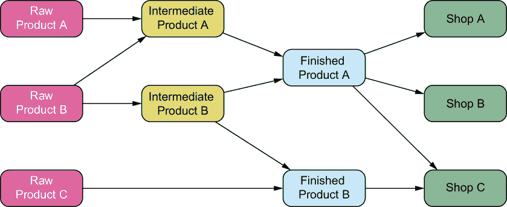

图 3.17 供应链网络

*重要性*有许多可能的定义；因此，可以用于网络的许多中心性度量。我们将考虑其中两种，不仅因为它们对供应链的具体场景有用，而且因为它们是本书后面多个示例中使用的强大技术：

+   *PageRank*——该算法通过计算一个节点到其他节点的边数和质量，对节点的重要性进行粗略估计。由谷歌创始人发明用于其搜索引擎的 PageRank 模型所实现的基本思想是投票或推荐。当一个节点通过边连接到另一个节点时，它基本上是在为该节点投票。一个节点收到的投票越多，它就越重要——但“投票者”的重要性也很重要。因此，与节点关联的*分数*是根据为其投下的投票以及投下这些投票的节点的分数来计算的。

+   *中间中心性*——该算法通过考虑节点在连接其他节点之间的最短路径上出现的频率来衡量节点的重要性。它适用于网络理论中的广泛问题。例如，在供应链网络中，具有更高中间中心性的节点将拥有对网络的更多控制权，因为更多的商品将通过该节点。

图 3.18 说明了这两种算法。

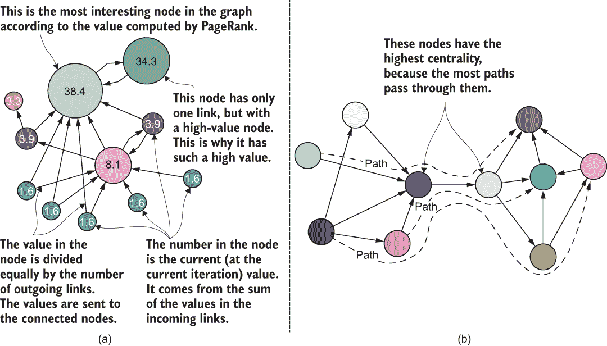

图 3.18 PageRank（a）和中间中心性（b）示例

在供应链脆弱性用例中，两种算法都可以用来确定供应链网络中最有趣的节点，但出发点不同：

+   *中间中心性*使我们能够通过它们控制通过的产品来识别在供应链中可能具有相当影响力的节点。具有最高中心性的节点也是那些从供应链网络中移除将最严重干扰产品流动的节点，因为它们位于产品采取的最大路径数量上。假设在供应链中，一家公司是所有产品基本组件的唯一供应商，或者一家公司作为特定产品的唯一分销商运营。在这两种情况下，该组件或产品的最大路径数量都通过它们，任何对这些节点的严重干扰都会影响整个供应链。

+   *PageRank*使我们能够识别节点，根据它们连接的节点的相对重要性，这些节点在网络中具有高价值。在这种情况下，破坏一个重要节点可能只会影响网络的一小部分，但破坏仍然可能是重大的。假设在供应链中，一个转换过程将产品转换为仅适合供应链中最大的最终客户之一的形式。在这种情况下，通过该过程的路径不多，因此节点的中间中心性相当低，但节点的价值很高，因为破坏它会影响链中的重要元素。

如这些示例所示，图算法为供应链网络提供了一种强大的分析机制。这种方法可以推广到许多类似场景，例如通信网络、社交网络、生物网络和恐怖主义网络。

### 3.3.2 在文档中查找关键词

假设你想自动识别一组最能描述文档或整个语料库的术语。使用基于图排序的模型，你可以通过无监督学习方法找到文本中最相关的话语或短语。

公司通常需要管理和处理大量数据，无论是为了向最终用户提供服务还是为了内部流程。其中大部分数据以文本形式存在。由于文本数据的非结构化特性，访问和分析这一庞大的知识来源可能是一项具有挑战性和复杂性的任务。关键词可以帮助识别主要概念，从而有效地访问大量文档。关键词提取还可以用于为文档集合构建自动索引、构建特定领域的词典或执行文本分类或摘要任务 [Negro 等人，2017]。

可以使用多种技术从语料库中提取关键词列表。最简单的方法是使用相对频率标准（识别出现频率最高的术语）来选择文档中的重要关键词——但这种方法缺乏复杂性，通常会导致较差的结果。另一种方法涉及使用监督学习方法，其中系统被训练根据词汇和句法特征来识别文本中的关键词——但需要大量的标记数据（手动提取相关关键词的文本）来训练一个足够准确以产生良好结果的模型。

图可以成为解决这类复杂问题的秘密武器，通过使用数据图的表示和图算法（如 PageRank）以无监督的方式从文本中提取关键词或句子。*TextRank* [Mihalcea and Tarau, 2004] 是一种基于图的排名模型，可用于此类文本处理。

在这种情况下，我们需要构建一个表示文本并使用有意义的关联将单词或其他文本实体相互连接的图。根据目的，提取的文本单元——可以是用于摘要的关键词、短语或整个句子——可以作为图中的节点添加。同样，最终范围定义了用于连接节点的关系的类型（词汇或语义关系、上下文重叠等）。无论添加到图中的元素类型和特征如何，将 TextRank 应用于自然语言文本的过程包括以下步骤 [Mihalcea and Tarau, 2004]：

1.  确定与当前任务相关的文本单元，并将它们作为节点添加到图中。

1.  确定连接文本单元的关系。节点之间的边可以是有向的或无向的，可以是加权的或无权的。

1.  迭代基于图的排名算法，直到收敛或达到最大迭代次数。

1.  根据最终得分对节点进行排序，使用这些得分进行排名/选择决策，并最终将两个或多个文本单元合并为一个（短语）关键词。

因此，节点是从文本中提取的一个或多个词汇单元的序列，它们是将被排名的元素。任何可以在两个词汇单元之间定义的关系都是可以在节点之间添加的潜在有用连接（边）。对于关键词提取，识别关系最有效的方法之一是共现。在这种情况下，如果两个节点都出现在最多 N 个单词（N-gram）的窗口内，则两个节点是连接的，N 通常在 2 到 10 之间。这种情况是使用共现图的一个例子（可能是最常见的例子之一）；图 3.19 显示了结果的一个示例。此外，还可以使用句法过滤器来选择特定词性的词汇单元（例如，仅名词、动词和/或形容词）。

图 3.19 TextRank 创建的共现图

当图构建完成后，可以在其上运行 TextRank 算法以识别最重要的节点。图中的每个节点最初被分配一个值为 1 的值，算法运行直到收敛到给定的阈值以下（通常为 20 到 30 次迭代，阈值为 0.0001）。为每个节点确定最终分数后，节点按分数降序排序，并对前 T 个节点（通常为 5 到 20 个）进行后处理。在此后处理过程中，文本中连续出现且都相关的单词合并成一个关键词。

这种无监督的基于图的算法所达到的准确性与任何监督算法相当 [Mihalcea and Tarau, 2004]。这一结果表明，使用图方法，可以避免监督算法在提供预标记数据时所需的相当大的努力，例如本节所描述的任务。

### 3.3.3 监控一个主题

让我们继续讨论如何通过使用蜂窝基站数据来监控主题的运动。在本章前面，我们讨论了如何将分布在不同塔或多个手机上并以表格格式存储的数据转换为同质图，称为 CTN（如图 3.20 所示）。正如第二章所述，图中具有最高总边权重的节点对应于最常被主题的手机看到的塔 [Eagle, Quinn, and Clauset, 2009]。

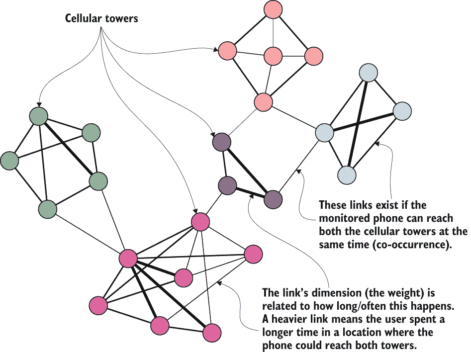

图 3.20 单个主题的 CTN 图表示

本章前面描述的图构建是一个初步任务，用于使用允许我们识别塔群组的图聚类算法。这里的逻辑是，通过大量加权边相互连接，并通过较少加权边与其他节点连接的一组节点应该对应于监控主题花费大量时间的位置。*图聚类*是一种无监督学习方法，旨在根据图中的边结构将图中的节点分组，使得每个簇内部应该有许多边，而簇之间的边相对较少 [Schaeffer, 2007]。为此目的存在多种技术和算法，并在本书的其余部分进行了广泛讨论。

当图被组织成多个子图以识别位置时，下一步是使用这些信息构建一个预测模型，该模型能够根据当前位置指示主题可能去往的下一个位置。之前识别出的塔群可以作为*动态模型*的状态。⁵ 给定一个主题访问的位置序列，算法学习主题行为中的模式，并能够计算主题在未来移动到不同位置的概率。这里用于建模的算法 [Eagle, Quinn, and Clauset, 2009] 是一个动态贝叶斯网络，它在与更简单的方法（马尔可夫链）一起在 3.4.2 节中介绍。

在前一种场景中，应用图算法（TextRank）是主要且唯一必要的操作，而在这里，由于问题更加复杂，图算法被用作更细致的学习流程的一部分，以创建一个高级预测模型。

## 3.4 存储和访问机器学习模型

工作流程的第三步涉及将预测结果交付给最终用户。学习阶段的输出是一个包含推理过程结果的模型，并允许我们对未见实例进行预测。该模型必须存储在永久存储或内存中，以便在需要新的预测时可以访问。我们可以访问模型的速度会影响预测性能。这一时间因素对于机器学习项目成功定义至关重要。如果最终模型的准确性很高，但预测需要很长时间，系统将无法正确完成任务。

图 3.21 总结了图如何贡献这一阶段。

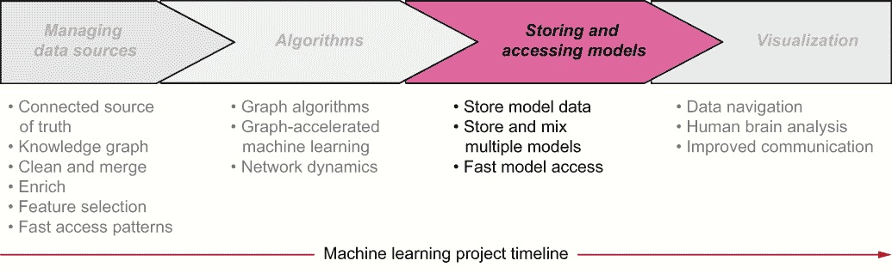

图 3.21 在心智模型中存储和访问模型

考虑电子商务网站的推荐场景。用户正在寻找某物，但没有具体的产品购买想法，因此他们从文本搜索开始导航，然后在结果列表中这里点击那里，浏览几个选项。在这个时候，系统开始根据导航路径和点击推荐项目给用户。所有这些都在瞬间完成：在有相当的网络条件下，用户可以快速导航，每 5 到 10 秒或更短的时间内从一个页面跳转到下一个页面。因此，如果推荐过程需要 10 秒或更长时间，那就毫无意义。

这个例子展示了拥有一个能够快速提供预测的系统的重要性。在这种情况下，提供快速访问模型是成功的关键，而且，图可以再次发挥重要作用。本节通过一些解释性场景，探讨了使用图存储预测模型并提供快速访问的方法。

### 3.4.1 推荐项目

基于物品（或基于用户）的协同过滤方法在学习阶段的结果是一个包含用户-物品数据集中每对物品之间相似度的物品-物品矩阵。生成的矩阵看起来像表 3.4。

表 3.4 相似度矩阵

|  | 物品 1 | 物品 2 | 物品 3 | 物品 4 | 物品 5 |
| --- | --- | --- | --- | --- | --- |
| 物品 1 | 1 | 0.26 | 0.84 | 0 | 0.25 |
| 物品 2 | 0.26 | 1 | 0 | 0.62 | 0.25 |
| 物品 3 | 0.84 | 0 | 1 | 0.37 | 0.66 |
| 物品 4 | 0 | 0.62 | 0.37 | 1 | 0.57 |
| 物品 5 | 0.25 | 0.25 | 0.66 | 0.57 | 1 |

确定了物品之间的相似性后，我们可以通过计算与物品 5 相似的物品的 Bob 的评分的加权总和来预测 Bob 对物品 5 的评分。形式上，我们可以预测用户 u 对产品 p 的评分如下[Jannach 等人，2010]：

在这个公式中，分子包含 Bob 对目标产品评分的每个产品的相似值与他对该产品的评分的乘积之和。分母包含 Bob 对目标产品评分的所有物品的相似值之和。

让我们只考虑表 3.5 中显示的用户-物品数据集的行（技术上，是用户-物品矩阵的一个切片）。

表 3.5 用户 Bob 的用户-物品切片

| 用户 | 物品 1 | 物品 2 | 物品 3 | 物品 4 | 物品 5 |
| --- | --- | --- | --- | --- | --- |
| Bob | - | 3 | - | 4 | ? |

上述公式将如下所示：

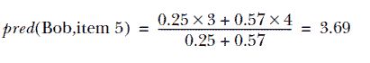

表 3.4 中的物品-物品相似度矩阵可以轻松存储在图中。从为存储用户-物品矩阵而创建的二部图开始，存储这个矩阵就是添加新的关系，这些关系将物品连接到其他物品（因此图将不再是二部图）。关系的权重是相似度的值，介于 0（在这种情况下，不存储任何关系）和 1 之间。生成的图看起来像图 3.22。

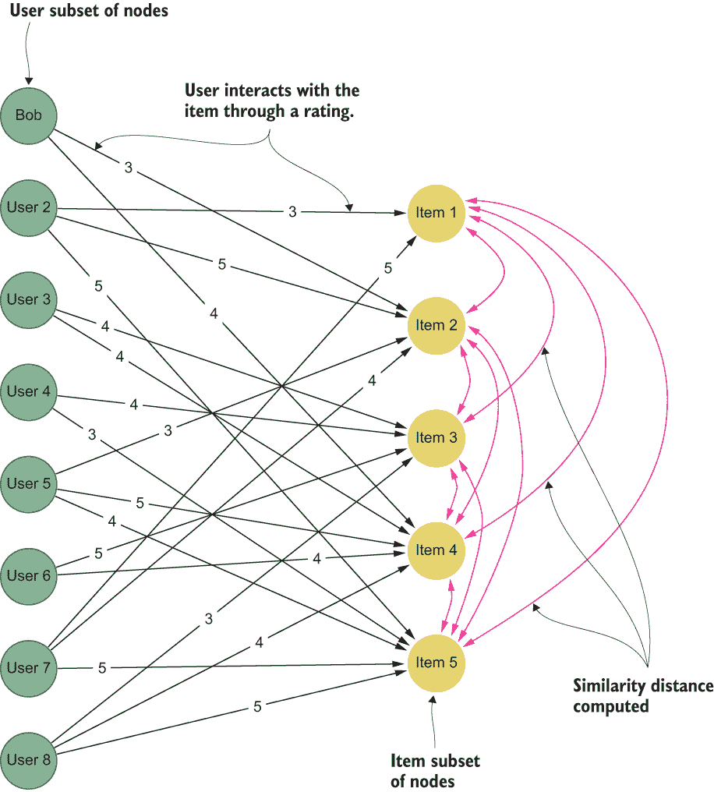

图 3.22 存储在原始二部图中的相似度距离模型

在此图中，为了减少连接节点的弧的数量，表示了项目之间的双向关系；在现实中，它们是两种不同的关系。此外，由于关系的数量是 N x N，从阅读和写作的角度来看，存储所有关系可能相当困难。典型的方法是只为每个节点存储前 K 个关系。当为每个项目计算所有相似性后，它们按降序排列，从最相似到最不相似，只存储前 K 个，因为在预测计算过程中，只使用前 K 个。以这种方式存储数据时，计算用户最感兴趣的项目只需在图中跳跃几次。根据公式，考虑了目标用户评价的所有项目（在我们的案例中，项目 2 和 4 与用户 Bob 相连），然后对每个项目，计算与目标项目（项目 5）的相似度。用于计算预测的信息是本地化的，因此使用所提出的图模型进行预测速度快。无需进行长时间的数据查找。

此外，在预测过程中，可以存储更多类型的关系，并同时导航它们，以基于多个相似性度量提供组合预测。这些预测可以基于除了纯协同过滤之外的方法。我们将在本书的第三部分讨论计算相似度或距离（从不同角度的相同概念）的其他技术。

### 3.4.2 监控一个主题

在主题监控场景中，在识别代表主题花费大量时间的地点的塔群之后，算法继续通过学习主题的行为模式。然后我们可以使用动态模型，如动态贝叶斯网络，来构建主题位置的预测模型。

*贝叶斯网络* 是一个有向图，其中每个节点都标注了定量概率信息（例如 50% 或 0.5，70% 或 0.7）。贝叶斯网络（又称 *概率图模型* 或 *信念网络*）代表了概率理论和图理论相结合的混合体，其中变量之间的依赖关系以图形方式表示。该图不仅有助于用户理解哪些变量影响哪些其他变量，而且还能有效地计算可能用于推理和学习的边缘概率和条件概率。完整的规范如下 [Russell and Norvig, 2009]:

*每个节点对应一个随机变量。这些变量可能是可观察的数量、潜在变量、未知参数或假设。*

*边代表条件依赖。如果从节点 X 到节点 Y 有边，则称 X 为 Y 的父节点。该图没有有向循环（因此是一个有向无环图，或 DAG）。没有连接的节点（在贝叶斯网络中变量之间没有路径）代表条件独立的变量。*

*每个节点 Xi 都有一个条件概率分布 P(Xi, Parents(Xi))，它量化了父节点对节点的影响。换句话说，每个节点都与一个概率函数相关联，该函数接受节点父变量的一组特定值作为输入，并给出节点所代表变量的概率，或适用的概率分布。*

为了使这个讨论更清晰，考虑一个简单的例子 [Russell and Norvig, 2009]:

*你在家里安装了一个新的防盗报警器。它相当可靠地检测到盗窃，但有时也会对轻微的地震做出反应……你还有两个邻居，约翰和玛丽，他们承诺在听到警报时给你打电话。约翰几乎每次听到警报都会打电话，但有时会把电话铃声误认为是警报，然后也会打电话。另一方面，玛丽喜欢很响的音乐，经常完全错过警报。根据谁打电话或没打电话的证据，我们想要估计盗窃的概率。*

与此例相关的贝叶斯网络如图 3.23 所示。盗窃和地震直接影响报警器发出警报的概率，这由连接顶部 Burglary 和 Earthquake 节点到 Alarm 节点的有向边表示。在底部，你可以看到约翰或玛丽是否打电话只取决于警报（由连接 Alarm 到 JohnCalls 和 MaryCalls 节点的边表示）。他们没有直接感知盗窃或注意到轻微的地震，并且在打电话之前没有进行协商。

在图 3.23 中，每个节点附近的表格是条件分布，表示为条件概率表（CPT）。*条件分布*是子群体的概率分布。CPT 中的每一行包含每个节点值的条件概率，给定父节点值的可能组合。P(B)代表发生盗窃的概率，例如，P(E)代表发生地震的概率。这些分布很简单，因为它们不依赖于任何其他事件。P(J)，约翰打电话的概率，和 P(M)，玛丽打电话的概率，依赖于警报。JohnCalls 的条件概率表表明，如果警报响起，约翰打电话的概率是 90%，而当他没有响起警报时（记住，约翰可能会把电话铃声误认为是警报）打电话的概率是 5%。Alarm 节点的 CPT 稍微复杂一些，它依赖于 Burglary 和 Earthquake 节点。在这里，当盗窃和地震同时发生时，P(A)（警报响起的概率）是 95%，但在盗窃与地震不同时发生的情况下是 94%，在没有盗窃的情况下发生地震时是 29%。误报很少见，概率为 0.1%。

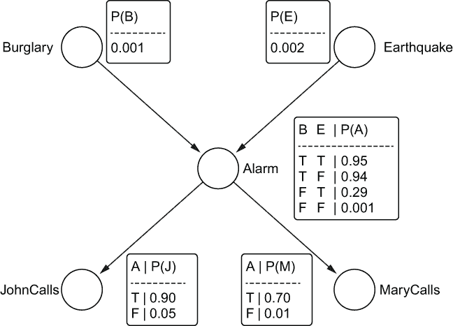

图 3.23 一个典型的贝叶斯网络，显示了拓扑结构和条件概率表

*动态贝叶斯网络*（DBN）是一种特殊的贝叶斯网络，它关联相邻时间步的变量。回到我们的主题监控场景，用于执行位置预测的最简单的 DBN 版本是*马尔可夫链*。图 3.24 中显示的例子是一个纯图，是贝叶斯网络更一般图表示的特殊情况。在这种情况下，节点代表 t 点的状态（在我们的例子中，是主题的位置），关系的权重代表 t+1 时间步状态转换的概率。

在图 3.24 中，如果某人在时间 t 处于家中，他们最有可能留在家里（45%）。他们移动到办公室的概率是 25%；他们去市场的可能性是 20%，他们去学校的可能性是 10%（可能是送孩子）。这个例子是观察到的模型表示。从这个模型开始，计算 t 步后的位置概率是在节点之间进行路径导航，其中每个节点可以出现多次。

图 3.24 一个简单的马尔可夫链。（最可能的移动用红色表示。）

这种方法可以进一步扩展。Eagle、Quinn 和 Clauset [2009] 注意到，实践中人们的移动模式取决于一天中的时间和一周中的某一天（例如周六晚上与周一早晨）。因此，他们基于*上下文马尔可夫链*（CMC）创建了一个扩展模型，其中主题位于某个位置的概率也取决于一天中的小时和一周中的某一天（这些代表上下文）。CMC 在此处不做详细描述，但图 3.25 展示了其背后的基本思想。

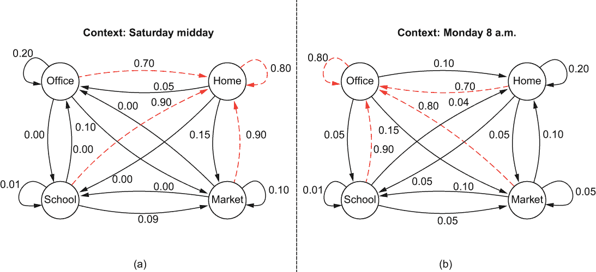

图 3.25 两个上下文值的一个简单上下文马尔可夫链：C = {中午，周末}（a），和 C = {早晨，工作日}（b）

考虑到一天中的时间，定义为“上午”、“下午”、“傍晚”或“夜间”，以及一周中的某一天，分为“工作日”或“周末”，来创建上下文。图 3.25 中的图表表示学习每个上下文的最大似然参数后的结果马尔可夫链。图 3.25(a)显示了周末中午的马尔可夫链，因此孩子们没有学校，办公室也没有工作。图 3.25(b)显示了工作日早晨相关的马尔可夫链。这样的图表使我们能够通过在图上简单查询，预测主题最有可能去的地方。

马尔可夫链、CMC 以及更一般地（动态）贝叶斯网络是适用于许多用例的预测模型。此处使用主题监控场景进行说明，但此类模型在许多类型的用户建模和尤其是在网络分析中积极用于预测用户意图。

## 3.5 可视化

机器学习的主要目标之一是理解数据并为最终用户提供某种预测能力（尽管如本章开头所述，数据分析通常旨在从原始数据源中提取知识、洞察力，最终是智慧，而预测只是可能用途的一小部分）。在本学习路径中，数据可视化起着关键作用，因为它使我们能够从不同的角度访问和分析数据。在我们对机器学习工作流程的心理地图（图 3.26）中，可视化位于流程的末尾，因为在对数据进行初步处理之后可视化数据要比直接可视化原始数据好得多，但数据可视化可以在工作流程的任何一点发生。

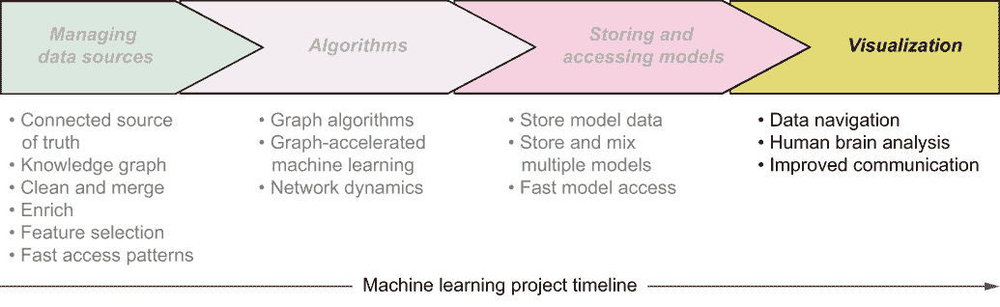

图 3.26 心理模型中的可视化

在这种情况下，图表方法再次扮演了基础角色。数据分析中的一个日益增长的趋势是将链接数据视为网络。网络分析师不仅关注数据的属性，还关注数据中的连接和结果结构。如果图表是组织数据以更好地理解和分析其中关系的有用方式，那么可视化有助于揭示这种组织，进一步简化理解。结合这两种方法有助于数据科学家理解他们拥有的数据。此外，成功的可视化在简单性上具有欺骗性，一眼就能为观众提供新的洞察和理解。

为什么将数据可视化，特别是以图表的形式，使其更容易分析？有几个原因：

+   人类天生是视觉生物。我们的眼睛是我们最强大的感官接收器，通过信息可视化展示数据可以最大限度地发挥我们的感知能力[Perer, 2010]。

+   今天，许多数据集太大，无法在没有便于处理和交互的计算工具的情况下进行检查。数据可视化结合了计算机的力量和人类大脑的力量，利用我们的模式识别能力，使我们能够高效且复杂地解释数据。如果我们能以图表的形式看到数据，就更容易发现模式、异常值和缺口[Krebs, 2016; Perer, 2010]。

+   图表模型揭示了可能隐藏在其他数据视图（如表格和文档）中的关系，并帮助我们挑选出重要细节[Lanum, 2016]。

另一方面，选择有效的可视化可能是一个挑战，因为不同的形式有不同的优点和缺点[Perer, 2010]：

*并非所有信息可视化都能突出分析师任务中重要的模式、缺口和异常值，而且并非所有信息可视化“强迫我们注意到我们从未预料到看到的东西”[Tukey, 1977]。*

此外，将大数据可视化需要投入大量的精力来进行筛选、组织和在屏幕上展示。尽管面临所有这些挑战，图表视图仍然对众多领域的科研人员具有吸引力。

社会网络分析师 Valdis Krebs 在其工作中展示了使用图表示法揭示人类行为洞察力的良好例子。Krebs 工作的一个有趣方面是，他能够从任何类型的来源（旧文档、报纸、数据库或网页）获取数据；将其转换为图表示法；进行一些网络分析；然后使用他自己的软件 InFlow 可视化结果。然后他分析图表并得出一些结论。一个例子，我们在第一章中看到的是他对 2003 年之前两次美国总统选举在 Amazon.com 上购买政治书籍的分析（图 3.27）。

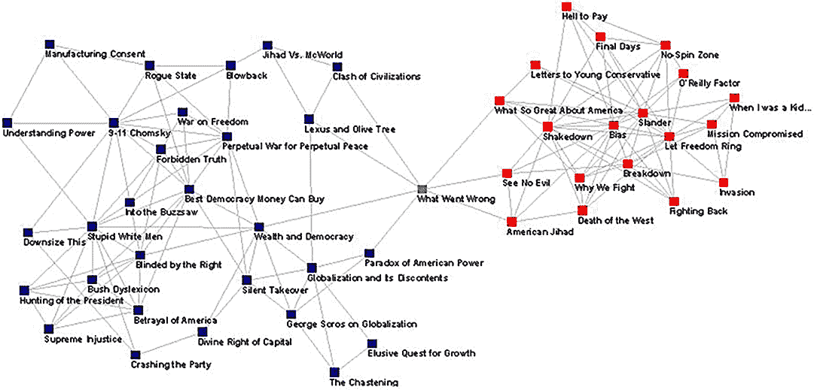

图 3.27 2003 年之前两次美国总统选举的政治书籍网络 [Krebs, 2016]

亚马逊提供了可以用来创建共现网络（我们在一些示例场景中之前看到过的一种图）的购买摘要数据。当一位顾客购买了这两本书时，两本书就连接在一起。购买这两件商品的顾客越多，它们之间的关联就越强，在“购买此商品的顾客还购买了”列表中出现的关联商品就越高。因此，通过使用亚马逊数据，可以生成一个网络，该网络可以提供对客户偏好和购买行为的深刻见解。正如 Krebs 所说：“通过一点数据挖掘和一些数据可视化，我们可以深入了解亚马逊顾客的习惯和选择——也就是说，我们可以了解一群人，而无需了解他们的个人选择。”

在图 3.27 中，可以识别出两个不同的政治集群：一个红色集群（在印刷版中为灰色），代表那些阅读右倾书籍的人；一个蓝色集群（在印刷版中为黑色），代表那些阅读左倾书籍的人。只有一本书将这两个集群连接在一起；具有讽刺意味的是，这本书的名字叫*出了什么问题*。这个图可视化提供了强有力的证据，证明了 2008 年政治选举期间美国公民是多么的极化。但是，对于机器学习算法来说，这个“证据”并不那么明显，因为它需要大量的上下文信息，而这些信息对于人类大脑来说更容易提供：书籍的政治倾向或作者的倾向，正在进行的政治选举的情况等等。

## 3.6 剩余：深度学习和图神经网络

机器学习是一个广泛且不断发展的领域。它如此庞大，以至于没有任何一本书能涵盖这些实践可能完成的全部任务和可能性。这本书也不例外。我们有意省略了很多话题。其中，有一个话题至少值得提及，因为在写作的时候，它在研究和应用中都显得非常突出：*深度学习*。让我简要介绍一下，以便您对它有一个高层次的理解，了解它在机器学习领域的位置，以及它如何应用于图。

如我们所见，并且我们将在整本书中讨论，机器学习算法的性能（从准确性的角度来说）在很大程度上取决于数据的质量以及它的表示方式。在表示中包含的每一项信息，以及在训练和预测过程中使用的信息，都被定义为*特征*。特征的例子包括用户购买的商品列表，用户花费时间的地方，以及文本中的标记。机器学习过程将这些特征作为输入，并推断出一个能够将这种输入映射到潜在输出的模型。在推荐的情况下，这个过程会考虑用户购买或评价的商品，并试图预测他们可能感兴趣的内容。在主题监控的情况下，考虑到之前的地点，算法预测用户在接下来的几小时或几天内可能在哪里。本书解释了如何使用图数据模型来表示这些特征，以及如何简化或改进映射。

不幸的是，对于许多任务来说，确定用于训练模型的特征提取并不是那么简单。假设你需要编写一个算法来识别图片中的面孔。一个人有一对眼睛，一些颜色的头发（不是所有头发），一个鼻子，一个嘴巴等等。用语言描述面孔很简单，但我们如何用像素来描述眼睛的形状呢？

解决这种表示问题的可能方法之一是使用机器学习来发现不仅是从表示到输出的映射，还包括表示本身。这种方法被称为*表示学习* [Goodfellow 等人，2016]。这种表示通常比手工挑选的特征有更好的性能。此外，因为机器能够从更简单的数据（例如，只有图像或一些文本）中学习表示，所以它能够以减少人力投入的方式快速适应新的任务。对于机器可能只需要几分钟或几天就能完成的事情，对于人类可能需要数十年的研究。

深度学习通过引入用其他更简单的表示表达表示来解决表示学习问题 [Goodfellow 等人，2016]。在深度学习中，机器在基础更简单概念之上构建多个越来越复杂的层次。人的图像概念可以通过结合角点和轮廓来表示，而这些角点和轮廓又可以用边缘来定义。图 3.28 描述了经典机器学习和深度学习子领域之间的差异。

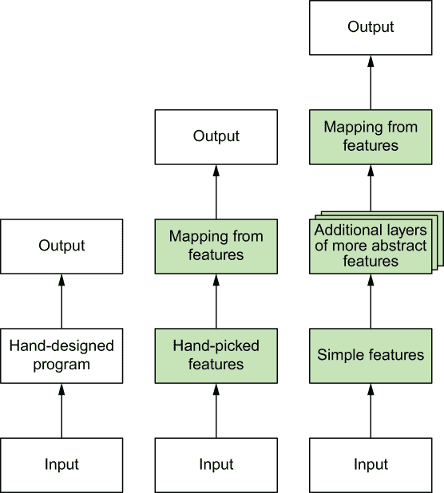

图 3.28 基于规则的算法、经典机器学习和深度学习之间的差异（受 Goodfellow 等人，2016 年启发）

在前面的例子中，我们提到了图像、文本等。这些数据类型被定义为欧几里得类型，因为它们可以在多维空间中表示。如果我们想在图上使用这种方法，比如识别社交网络中的节点是否为机器人，或者预测表示疾病的两个节点之间链接（以及因此产生的相关性）的形成？图 3.29 显示了图像和文本在欧几里得空间中的表示与难以在这样多维空间中表示的图。 (图下方左侧，TF-IDF 代表*词频-逆文档频率*。)

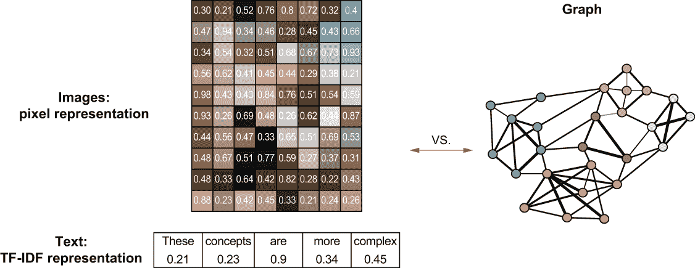

图 3.29 图像和文本的欧几里得表示与难以在多维空间中表示的图

具有多个节点类型和不同类型关系的图远非欧几里得空间。这项任务正是图神经网络（GNNs）的用武之地。*GNNs*是基于深度学习的方法，在图域上执行复杂任务，如节点分类（例如机器人示例）、链接预测（例如疾病示例）等。由于其令人信服的性能，GNN 已成为广泛应用的图分析方法。

图 3.30 展示了一个通用的编码函数，该函数能够将 d 维向量中的节点（或关系）进行转换。这个函数通常用作嵌入技术。当图元素已经迁移到欧几里得空间时，我们可以使用图像和文本的经典机器学习技术。这种表示学习质量影响后续任务的质量和准确性。

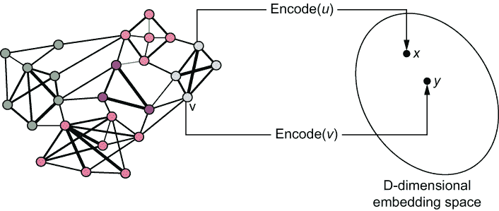

图 3.30 通用编码器示例

GNNs 能够生成依赖于图结构以及我们拥有的任何特征信息的节点表示。这些特征可能是节点的属性、关系类型和关系属性。这就是为什么 GNNs 能够推动最终任务达到更好的结果。这些嵌入代表了节点分类、链接预测和图分类等任务的输入。

这些概念更加复杂，需要更广泛地理解机器学习（特别是深度学习）和图，这就是为什么我更喜欢将这些主题留在这本书之外。新的技术，如深度学习和 GNNs，并没有使本书中介绍的内容失效；它们是建立在这些页面上的原则之上的，这些原则代表了事实真相。我确实认为这里介绍的概念为读者提供了一个理解更近期方法的思维模型，使他们能够评估何时使用每种类型。

## 概述

本章介绍了机器学习项目中图的综合应用案例。在本章中，你学习了

+   如何使用图和图模型来管理数据。设计合适的图模型允许将多个数据源合并为一个单一、连接良好且组织有序的真相来源。这种方法不仅因为它创建了一个单一的知识库——*知识图谱*，可以供多个项目共享，而且还因为它可以以适合要执行的分析方式组织数据。

+   如何使用图算法处理数据。图算法支持广泛的分析，可以单独使用或作为更复杂和细致的分析管道的一部分。

+   如何设计一个图，该图存储训练得到的预测模型，以简化预测阶段的数据访问并提高速度。

+   如何将数据以图形的形式可视化。数据可视化是预测分析的关键方面。图可以作为建模数据的模式，以便分析师以高效和有效的方式可视化；人脑可以完成剩余的部分。

+   深度学习和图神经网络是什么。

## 参考文献

[Diestel, 2017] Diestel, Reinhard. 《图论》。第 5 版。纽约：Springer，2017 年。

[Eagle, Quinn, and Clauset, 2009] Eagle, Nathan，John A. Quinn 和 Aaron Clauset. “连续蜂窝基站数据分析的方法。” 第 7 届国际普适计算会议论文集（2009 年）：342-353.

[Frolov and Oseledets, 2016] Frolov, Evgeny 和 Ivan Oseledets. “张量方法和推荐引擎。” GroundAI，2016 年 3 月 18 日。

[Goodfellow et al., 2016] Goodfellow, Ian，Yoshua Bengio 和 Aaron Courville. 《深度学习》。麻省理工学院出版社。2016 年。

[Jannach et al., 2010] Jannach, Dietmar，Markus Zanker，Alexander Felfernig 和 Gerhard Friedrich. 《推荐系统：入门》。英国剑桥：剑桥大学出版社，2010 年。

[Kleindorfer and Saad, 2005] Kleindorfer, Paul R. 和 Germaine H. Saad. “供应链中断风险的应对策略.” 生产与运营管理 14:1 (2005): 53-68.

[Krebs, 2016] Krebs, Valdis. 政治选择. T N T: 网络思想家，2016 年 1 月。[`www.thenetworkthinkers.com`](http://www.thenetworkthinkers.com).

[Lanum, 2016] Lanum, Corey L. 《可视化图数据》。纽约：Manning，2016 年。

[Mihalcea and Tarau, 2004] Mihalcea, Rada 和 Paul Tarau. “TextRank：将秩序带入文本。” 第 2004 年实证自然语言处理会议论文集（2004 年）：404-411.

[Negro et al., 2017] Negro, Alessandro，Vlasta Kus，Miro Marchi 和 Christophe Willemsen. “使用图进行高效的未监督关键词提取。” GraphAware，2017 年 10 月 3 日。[`mng.bz/w0Z7`](http://mng.bz/w0Z7).

[Perer, 2010] Perer, Adam. “在社交网络可视化混乱中寻找美丽的洞察力。” 见《美丽可视化》，由 Julie Steele 和 Noah Iliinsky 编著。加利福尼亚州塞巴斯蒂波利斯：O’Reilly，2010 年。157-173.

[Russel and Norvig, 2009] Russell, Stuart J. 和 Peter Norvig. *人工智能：现代方法*. 第 3 版. 新泽西州上萨德尔河：Pearson，2009.

[Schaeffer, 2007] Schaeffer, Satu Elisa. “调查：图聚类。”计算机科学评论 1:1 (2007): 27-64.

[Tukey, 1977] Tukey, John W. *探索性数据分析*. 麻省雷丁：Addison-Wesley，1977.

[Wirth and Hipp, 2000] Wirth, R. 和 J. Hipp. “CRISP-DM：数据挖掘的标准流程模型。”第四国际知识发现和数据挖掘实际应用会议论文集（2000）：29-39.

[Zhao and Silva, 2016] Zhao, Liang 和 Thiago Christiano Silva. *复杂网络中的机器学习*. 纽约：Springer，2016.

* * *

^(1.)[www.smrvl.com](http://www.smrvl.com/).

^(2.)详细信息请见附录 A。

^(3.)这个场景在第二章中出于不同的目的被引入。在这里，它被扩展并分割成构成我们心智模型的多项任务。请允许我为这种（但必要的）小重复表示歉意。

^(4.)与前例相同的原因，本章中从第二章有一些重复。在本章中，场景描述得更加详细。

^(5.)使用*动态模型*来表示或描述随时间变化状态的系统。
