# 4 基于内容的推荐

本章涵盖

+   为基于内容的推荐引擎设计合适的图模型

+   将现有的（非图）数据集导入设计的图模型

+   实现工作的基于内容的推荐引擎

假设你想为你的本地视频租赁店构建一个电影推荐系统。老式的 Blockbuster 风格的租赁店大多已被新的流媒体平台如 Netflix（[`mng.bz/0rBx`](https://shortener.manning.com/0rBx)）所取代，但还有一些仍然存在。在我的镇上就有一个。在我上大学的时候（很久以前），我经常和哥哥每个星期天去那里租一些动作电影。（记住这个偏好；它以后会很有用！）这里的一个重要事实是，这个场景本质上与更复杂的在线推荐系统有很多共同之处，包括以下内容：

+   *一个小型的用户群体*—用户或客户数量相当少。大多数推荐引擎，如我们稍后将要讨论的，需要大量的活跃用户（从交互次数的角度来看，如查看、点击或购买）才能有效。

+   *一组精心挑选的项目*—每个项目（在这种情况下，是一部电影）可以有很多相关的细节。对于电影，这些细节可能包括剧情描述、关键词、类型和演员。在其他场景中，这些细节并不总是可用，例如，当项目只有一个标识符时。

+   *了解用户偏好*—店主或店员几乎知道几乎所有客户的偏好，即使他们只租赁过几部电影或游戏。

在我们讨论技术细节和算法之前，花一点时间思考一下实体店铺。想想店主或店员为了成功都做了些什么。他们通过分析客户的先前租赁习惯和记住与他们交谈的内容来努力了解他们的客户。他们试图为每位客户创建一个档案，包含他们的品味（恐怖和动作电影而不是浪漫喜剧）、习惯（通常在周末或工作日租赁）、项目偏好（电影而不是电子游戏）等详细信息。他们随着时间的推移收集信息来建立这个档案，并使用他们创建的心理模型以有效的方式欢迎每位客户，建议可能对他们感兴趣的东西，或者当商店有吸引人的新电影时，也许会给他们发一条消息。

现在考虑一个虚拟店员，它欢迎网站的访客，建议他们租借电影或游戏，或者当有新商品上架可能引起兴趣时发送电子邮件。前面描述的条件排除了某些推荐方法，因为它们需要更多的数据。在我们考虑的情况中（无论是真实还是简化的虚拟商店），一个有价值的解决方案是*基于内容的推荐系统（CBRS）*。CBRSs 依赖于项目描述（内容）来构建项目表示（或项目档案）和用户档案，以建议与目标用户过去喜欢的项目相似的项目。（这类推荐系统也被称为*语义感知 CBRSs*。）这种方法允许系统在可用的数据量相当小的情况下提供推荐（即，有限数量的用户、项目或交互）。

生成基于内容的推荐的基本过程包括匹配目标用户档案中的属性，其中建模了偏好和兴趣，与项目的属性，以找到与用户过去喜欢的项目相似的项目。结果是相关性分数，它预测目标用户对那些项目的兴趣水平。通常，用于描述项目的属性是从与该项目相关的元数据中提取的特征或与项目相关的文本特征——描述、评论、关键词等。这些内容丰富的项目本身就包含大量信息，可用于比较或根据用户与之交互的项目列表推断用户的兴趣。因此，CBRSs 不需要大量数据就能有效。

图 4.1 显示了 CBRS 的高级架构，这是许多可能架构之一，也是本节中使用的架构。

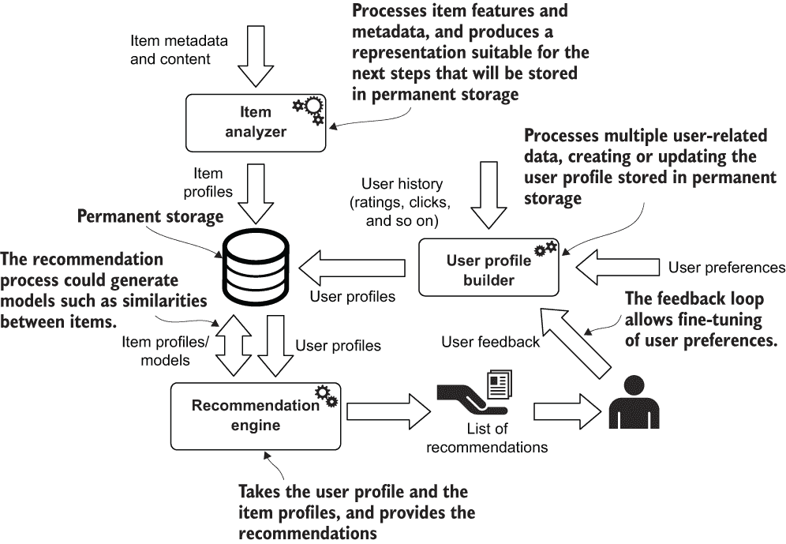

图 4.1 CBRS 的高级架构

此图将推荐过程分解为三个主要组成部分：

+   *项目分析器*——此组件的主要目的是分析项目，提取或识别相关特征，并以适合后续处理步骤的形式表示项目。它从一个或多个信息源中获取项目内容（如书籍或产品描述的内容）和元信息（如书籍的作者、电影中的演员或电影类型），并将它们转换为用于后续提供推荐的项模型。在本节中描述的方法中，这种转换产生图模型，可以是不同类型的。这种图表示用于向推荐过程提供数据。

+   *用户资料构建器*—此过程收集代表用户偏好的数据并推断用户资料。此信息集可能包括通过询问用户关于他们的兴趣收集到的显式用户偏好或通过观察和存储用户行为收集到的隐式反馈。结果是模型——具体来说，是表示用户对某些项目、项目特征或两者的兴趣的图模型。在图 4.1 所示的架构中，项目资料（在项目分析阶段创建）和用户资料（在此阶段创建）在同一个数据库中汇聚。此外，由于这两个过程都返回图模型，它们的输出可以组合成一个单一的、易于访问的图模型，用作下一阶段的输入。

+   *推荐引擎*—此模块通过匹配用户兴趣与项目特征来利用用户资料和项目表示，建议相关项目。在这个阶段，你构建一个预测模型并使用它为每个用户创建每个项目的相关性得分。这个得分用于对项目进行排序和排序，以向用户推荐。一些推荐算法预先计算相关值，例如项目相似度，以使预测阶段更快。在本方法中，这些新值被存储回图中，从而通过从项目资料中推断出的其他数据丰富了图。

在 4.1 节中，每个模块都进行了更详细的描述。具体来说，我描述了如何使用图模型来表示项目分析和资料构建阶段输出的项目和用户资料。这种方法简化了推荐阶段。

就像本章的其余部分以及从现在开始的大多数书籍一样，将展示真实示例，使用公开可用的数据集和数据源。MovieLens 数据集([`grouplens.org/datasets/movielens`](https://grouplens.org/datasets/movielens))包含真实用户提供的电影评分，是推荐引擎测试的标准数据集。然而，这个数据集并没有包含很多关于电影的信息，并且基于内容的推荐器需要内容才能工作。这就是为什么在我们的示例中，它与来自互联网电影数据库（IMDb）的数据结合使用，例如故事梗概、关键词、类型、演员、导演和编剧。

## 4.1 表示项目特征

在基于内容的推荐方法中，一个项目可以通过一组特征来表示。*特征*（也称为*属性*或*属性*）是该项目的具有重要性或相关性的特征。在简单的情况下，这些特征很容易发现、提取或收集。在电影推荐示例中，每部电影都可以通过使用以下特征来描述

+   类型或类别（恐怖、动作、卡通、戏剧等）

+   故事梗概

+   演员

+   手动（或自动）分配给电影的标签或关键词

+   制作年份

+   导演

+   编剧

+   制作人

考虑表 4.1 中提供的信息（来源：IMDb）。

表 4.1 电影相关数据示例

| 标题 | 类型 | 导演 | 编剧 | 演员 |
| --- | --- | --- | --- | --- |
| 低俗小说 | 动作，犯罪，惊悚 | 昆汀·塔伦蒂诺 | 昆汀·塔伦蒂诺，罗杰·阿维里 | 约翰·特拉沃尔塔，塞缪尔·杰克逊，布鲁斯·威利斯，乌玛·瑟曼 |
| 惩罚者（2004） | 动作，冒险，犯罪，剧情，惊悚 | 乔纳森·亨谢利 | 乔纳森·亨谢利，迈克尔·弗朗斯 | 托马斯·简，约翰·特拉沃尔塔，萨曼莎·玛瑟斯 |
| 杀戮比尔：第一卷 | 动作，犯罪，惊悚 | 昆汀·塔伦蒂诺 | 昆汀·塔伦蒂诺，乌玛·瑟曼 | 乌玛·瑟曼，刘玉玲，薇薇卡·A·福克斯 |

这些特征通常被定义为 *元信息*，因为它们实际上不是项目的内 容。不幸的是，有一些项目的类别，找到或识别特征并不容易，例如文档集合、电子邮件消息、新闻文章和图像。

文本型项目通常没有现成的特征集。尽管如此，它们的内容可以通过识别描述它们的特征集来表示。一种常见的方法是识别表征主题的单词。存在不同的技术来完成这项任务，其中一些在 12.4.2 节中有所描述；结果是特征列表（关键词、标签、相关单词），这些特征描述了项目的内 容。这些特征可以用来以与这里元信息相同的方式表示文本型项目，因此从现在开始描述的方法可以在元信息特征易于访问或需要从内容中提取特征时应用。从图像中提取标签或特征超出了本书的范围，但一旦提取了这些特征，方法与本章讨论的方法完全相同。

虽然在图中表示这样的特征列表——更确切地说，是一个 *属性图*²(#pgfId-1011891)——是直 接的，但在设计项目模型时，你应该考虑一些建模最佳实践。以一个简化的例子来说，考虑表 4.1 中电影的图模型，如图 4.2 所示，以及它们相关的特征。

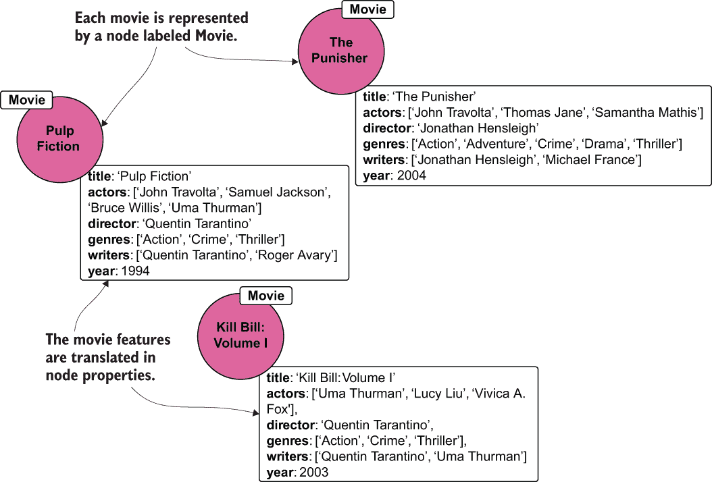

图 4.2 基于图的项目基本表示

在这个图中，使用了可能的最简单表示方式，包括相关的属性列表。对于每个项目，创建一个单独的节点，并将特征建模为节点的属性。列表 4.1 展示了用于创建三个电影的 Cypher 查询。（逐个运行查询）。请参考附录 B 获取关于 Neo4j 的基本信息、安装指南以及 Cypher 的快速介绍。你将在本书的其余部分学习到其他内容。

列表 4.1 创建电影表示基本模型的查询

```
CREATE (p:Movie {                                    ❶
    title: 'Pulp Fiction',                           ❷
    actors: ['John Travolta', 'Samuel Jackson', 'Bruce Willis', 'Uma Thurman'],
    director: 'Quentin Tarantino',
    genres: ['Action', 'Crime', 'Thriller'],
    writers: ['Quentin Tarantino', 'Roger Avary'],
    year: 1994                                       ❸
})                                                   ❹

CREATE (t:Movie {
    title: 'The Punisher',
    actors: ['Thomas Jane', 'John Travolta', 'Samantha Mathis'],
    director: 'Jonathan Hensleigh',
    genres: ['Action', 'Adventure', 'Crime', 'Drama', 'Thriller'],
    writers: ['Jonathan Hensleigh', 'Michael France'],
    year: 2004
})

CREATE (k:Movie {
    title: 'Kill Bill: Volume 1',
    actors: ['Uma Thurman', 'Lucy Liu', 'Vivica A. Fox'],
    director: 'Quentin Tarantino',
    genres: ['Action', 'Crime', 'Thriller'],
    writers: ['Quentin Tarantino', 'Uma Thurman'],
    year: 2003
})
```

❶ 每个 CREATE 语句创建一个带有 Movie 标签的新节点。

❷ 大括号定义了节点的键/值属性列表，从标题开始。

❸ 属性可以是不同类型：字符串、数组、整数、双精度浮点数等。

❹ 括号定义了创建的节点实例的边界。

在 Cypher 查询中，CREATE 允许你创建一个新的节点（或关系）。括号定义了创建的节点实例的边界，在这些情况下由 p、t 和 k 标识，并且每个新节点都被分配了一个特定的标签，即 Movie。标签指定了节点的类型或节点在图中所扮演的角色。使用标签不是强制性的，但它是组织图中节点的一种常见且有用的做法（并且比为每个节点分配类型属性更高效）。标签有点像旧式关系数据库中的表，标识节点类别，但在属性图数据库中，对属性列表没有约束（如关系模型中的列那样）。每个节点，无论分配给它什么标签，都可以包含任何一组属性或甚至没有任何属性。此外，一个节点可以有多个标签。属性图数据库的这两个特性——对属性列表没有约束和多个标签——使得结果模型非常灵活。最后，在花括号内指定了一组以逗号分隔的属性。

单节点设计方法的优势在于节点与具有所有相关属性的项目之间的一对一映射。通过有效的索引配置，通过特征值检索电影非常快。例如，检索由 Quentin Tarantino 执导的所有电影的 Cypher 查询看起来如下所示。

列表 4.2 查询以搜索由 Quentin Tarantino 执导的所有电影

```
MATCH (m:Movie)                            ❶
WHERE m.director = 'Quentin Tarantino'     ❷
RETURN m                                   ❸
```

❶ MATCH 子句定义了要匹配的图模式：在这种情况下是带有标签 Movie 的节点。

❷ WHERE 子句定义了过滤条件。

❸ RETURN 子句指定了要返回的元素列表。

在这个查询中，MATCH 子句用于定义要匹配的图模式。在这里，我们正在寻找所有的 Movie 节点。WHERE 子句是 MATCH 的一部分，并添加了约束——过滤器，就像关系 SQL 中的那样。在这个例子中，查询是通过导演的名字进行过滤的。RETURN 子句指定了要返回的内容。图 4.3 显示了从 Neo4j 浏览器运行此查询的结果。


图 4.3 Neo4j 浏览器对简单模型的查询结果

简单模型存在多个缺点，包括以下内容：

+   *数据重复*—在每个属性中，数据都是重复的。例如，导演的名字在所有由同一导演执导的电影中都是重复的，对于作者、类型等也是如此。数据重复在数据库所需的磁盘空间和数据一致性（我们如何知道“Q. Tarantino”和“Quentin Tarantino”是否相同？）方面是一个问题，并且它使得更改变得困难。

+   *易出错性*—尤其是在数据导入期间，此简单模型容易受到诸如拼写错误和属性名称等问题的影响。如果数据在每个节点中是孤立的，这些错误很难识别。

+   *难以扩展/丰富*—如果在模型的生命周期中需要扩展，例如分组流派以改进搜索能力或提供语义分析，这些功能很难提供。

+   *导航复杂性*—任何访问或搜索都是基于值比较，或者更糟糕的是，基于字符串比较。这种模型没有使用图的真实力量，图能够有效地导航关系和节点。

为了更好地理解为什么这种模型在导航和访问模式方面表现不佳，假设你想查询“在同一部电影中共同工作的演员”。此类查询可以写成如图表 4.3 所示。

列表 4.3 查询以找到共同工作的演员（简单模型）。

```
MATCH (m:Movie)                                          ❶
WITH m.actors as actors                                  ❷
UNWIND actors as actor                                   ❸
MATCH (n:Movie)
WHERE actor IN n.actors                                  ❹
WITH actor, n.actors as otherActors, n.title as title    ❺
UNWIND otherActors as otherActor                         ❻
WITH actor, otherActor, title                            ❼
WHERE actor <> otherActor                                ❽
RETURN actor, otherActor, title
ORDER BY actor                                           ❾
```

❶ 搜索所有电影。

❷ 将演员列表传递到下一步。

❸ 此 UNWIND 将演员列表转换为多行。

❹ 此第二个 MATCH 与 WHERE 过滤器搜索每个演员参演的所有电影。

❺ 将演员列表、该演员参演的每部电影中的演员列表（同电影中的合演者）以及电影标题传递。

❻ 将其他演员的列表转换为多行。

❼ 将演员对和共同参演的电影的标题传递。

❽ 过滤掉演员与自己配对的配对。

❾ 按对中第一个演员的姓名排序结果。

此查询的工作方式如下：

1.  第一个 MATCH 搜索所有电影。

1.  WITH 用于将结果传递到下一步。第一个 WITH 仅传递演员列表。

1.  使用 UNWIND，你可以将任何列表转换回单独的行。每部电影中的演员列表被转换成一系列演员。

1.  对于每个演员，下一个 MATCH 与 WHERE 条件一起找到他们参演的所有电影。

1.  第二个 WITH 传递本次迭代中考虑的演员、他们参演的每部电影中的演员列表以及电影标题。

1.  第二个 UNWIND 将其他演员的列表转换，并将演员-其他演员对以及他们共同参演的电影的标题一起传递。

1.  最后的 WHERE 过滤器过滤掉演员与自己配对的配对。

1.  查询返回每对中的姓名以及他们共同参演的电影的标题。

1.  结果按 ORDER BY 子句排序，即按对中第一个演员的姓名排序。

在此类查询中，所有比较都是基于字符串匹配，因此如果存在拼写错误或不同的格式（例如，“U. Thurman”而不是“Uma Thurman”），结果将是不正确或不完整的。图 4.4 显示了在我们创建的图数据库上运行此查询的结果。

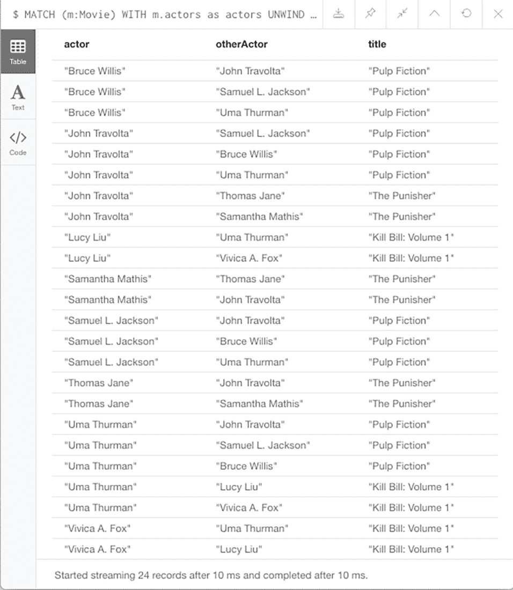

图 4.4 使用我们创建的示例数据库查询的结果。

一种更高级的表示物品的模型，对于这些特定目的来说更加有用和强大，它将重复出现的属性作为节点暴露出来。在这个模型中，每个实体，如演员、导演或类型，都有自己的表示——自己的节点。这些实体之间的关系由图中的边表示。边也可以包含一些属性来进一步描述关系。图 4.5 显示了新模型在电影场景中的样子。

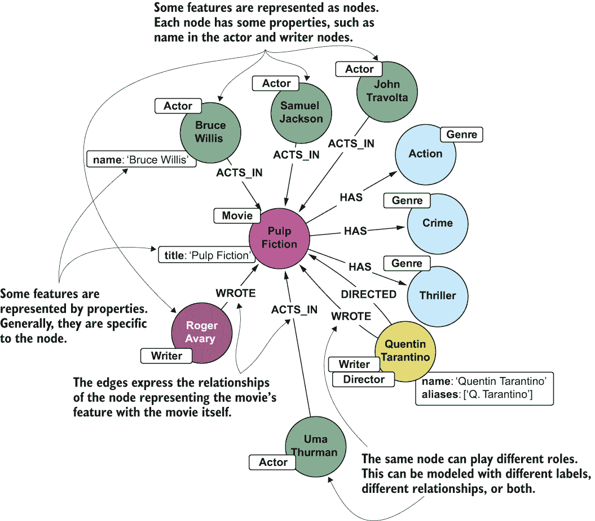

图 4.5 基于图的高级物品表示

在高级模型中，新节点出现以表示每个特征值，特征类型由标签如类型、演员、导演和编剧指定。某些节点可以有多个标签，因为它们可以在同一部电影或不同电影中扮演多个角色。每个节点都有一些属性来描述它，例如演员和导演的名字以及类型的类型。现在电影只有标题属性，因为这个属性是针对项目本身的特定属性；没有理由提取它并将其表示为单独的节点。创建此新图模型的电影示例的查询如下所示。³

列表 4.4 创建电影表示的高级模型的查询

```
CREATE CONSTRAINT ON (a:Movie) ASSERT a.title IS UNIQUE;                   ❶
CREATE CONSTRAINT ON (a:Genre) ASSERT a.genre IS UNIQUE;
CREATE CONSTRAINT ON (a:Person) ASSERT a.name IS UNIQUE;

CREATE (pulp:Movie {title: 'Pulp Fiction'})                                ❷
FOREACH (director IN ['Quentin Tarantino']                                 ❸
| MERGE (p:Person {name: director}) SET p:Director MERGE (p)-[:DIRECTED]->
➥ (pulp))                                                                 ❹
FOREACH (actor IN ['John Travolta', 'Samuel L. Jackson', 'Bruce Willis', 
➥ 'Uma Thurman']
| MERGE (p:Person {name: actor}) SET p:Actor MERGE (p)-[:ACTS_IN]->(pulp))
FOREACH (writer IN ['Quentin Tarantino', 'Roger Avary']
| MERGE (p:Person {name: writer}) SET p:Writer MERGE (p)-[:WROTE]->(pulp))
FOREACH (genre IN ['Action', 'Crime', 'Thriller']
| MERGE (g:Genre {genre: genre}) MERGE (pulp)-[:HAS]->(g))

CREATE (punisher:Movie {title: 'The Punisher'})
FOREACH (director IN ['Jonathan Hensleigh']
| MERGE (p:Person {name: director}) SET p:Director MERGE (p)-[:DIRECTED]->
➥ (punisher))
FOREACH (actor IN ['Thomas Jane', 'John Travolta', 'Samantha Mathis']
| MERGE (p:Person {name: actor}) SET p:Actor MERGE (p)-[:ACTS_IN]->
➥ (punisher))
FOREACH (writer IN ['Jonathan Hensleigh', 'Michael France']
| MERGE (p:Person {name: writer}) SET p:Writer MERGE (p)-[:WROTE]->
➥ (punisher))
FOREACH (genre IN ['Action', 'Adventure', 'Crime', 'Drama', 'Thriller']
| MERGE (g:Genre {genre: genre}) MERGE (punisher)-[:HAS]->(g))

CREATE (bill:Movie {title: 'Kill Bill: Volume 1'})
FOREACH (director IN ['Quentin Tarantino']
| MERGE (p:Person {name: director}) SET p:Director MERGE (p)-[:DIRECTED]->
➥ (bill))
FOREACH (actor IN ['Uma Thurman', 'Lucy Liu', 'Vivica A. Fox']
| MERGE (p:Person {name: actor}) SET p:Actor MERGE (p)-[:ACTS_IN]->(bill))
FOREACH (writer IN ['Quentin Tarantino', 'Uma Thurman']
| MERGE (p:Person {name: writer}) SET p:Writer MERGE (p)-[:WROTE]->(bill))
FOREACH (genre IN ['Action', 'Crime', 'Thriller']
| MERGE (g:Genre {genre: genre}) MERGE (bill)-[:HAS]->(g))
```

❶ 这些语句中的每一个都在数据库中创建一个唯一约束。

❷ 每个 CREATE 语句都只使用标题属性创建电影。

❸ FOREACH 循环遍历一个列表并对每个元素执行 MERGE 操作。

❹ MERGE 首先检查节点是否已经存在，在这种情况下使用导演名字的唯一性；如果不存在，则创建该节点。

虽然图数据库通常被称为无模式，但在 Neo4j 中可以在数据库中定义一些约束。在这种情况下，前三个查询分别创建三个约束，分别针对电影标题的唯一性、类型的值和人物的名字，从而防止例如同一个人（演员、导演或编剧）在数据库中多次出现。如前所述，在新模型中，想法是数据库中只有一个节点代表一个单一实体。这些约束有助于强制执行这种建模决策。

在创建约束之后，CREATE 子句（在示例中重复三次，每次针对一部电影）像以前一样工作，以创建每个新的电影，并将标题作为属性。然后 FOREACH 子句分别遍历导演、演员、编剧和类型，对于每个元素，它们搜索与电影节点连接的节点，如果需要则创建新的节点。在演员、编剧和导演的情况下，通过 MERGE 子句创建一个具有标签 Person 的通用节点。MERGE 确保提供的模式存在于图中，要么通过重用与提供的谓词匹配的现有节点和关系，要么通过创建新的节点和关系。在这种情况下，SET 子句根据需要为节点分配一个新的特定标签。FOREACH 中的 MERGE 检查（并在必要时创建）人与电影之间的关系。对于类型也采用类似的方法。整体结果如图 4.6 所示。

模型技巧

你可以为同一个节点使用多个标签。在这种情况下，这种方法既有用又必要，因为在模型中，我们希望每个人都能被独特地表示，无论他们在电影中扮演什么角色（演员、编剧或导演）。因此，我们选择使用 MERGE 而不是 CREATE，并为所有人使用一个共同的标签。同时，图模型为每个人扮演的每个角色分配一个特定的标签。一旦分配，标签就会分配给节点，这样运行查询如“找到所有制片人...”将会更容易和更高效。

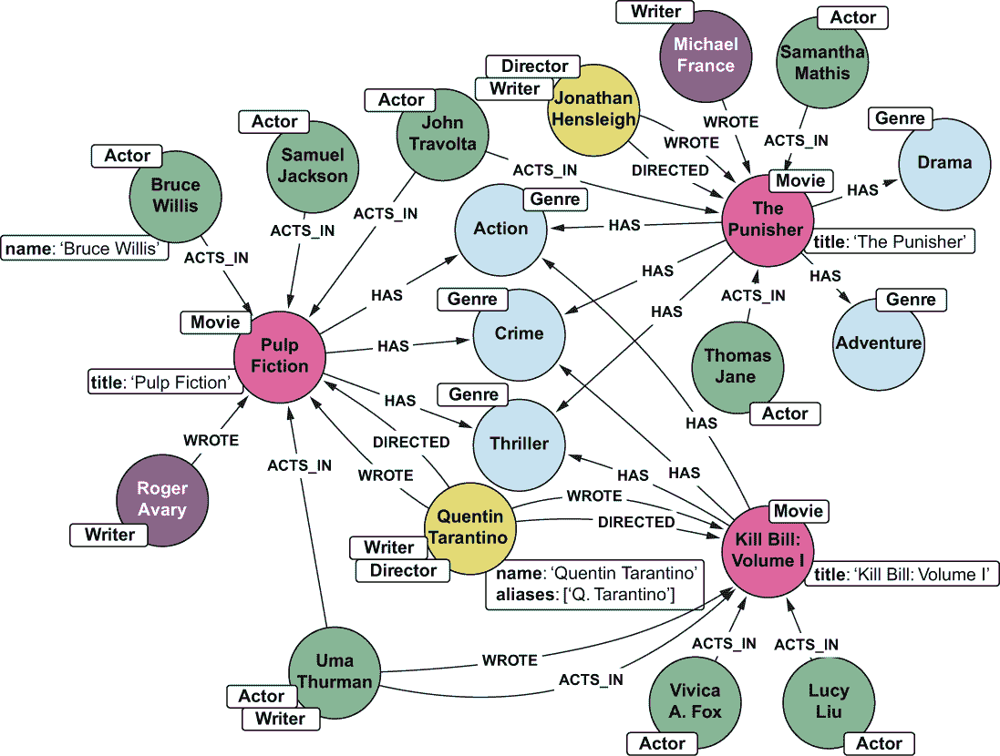

图 4.6 三部电影的高级基于图的项表示

新的描述性模型不仅解决了之前描述的所有问题，还提供了多个优势：

+   *无数据重复*—将每个相关实体（人物、类型等）映射到特定的节点可以防止数据重复。同一个实体可以扮演不同的角色并具有不同的关系。（乌玛·瑟曼不仅在《杀死比尔：卷一》中是女演员，还是编剧之一。）此外，对于每个项目，可以存储一个包含替代形式或别名的列表（“Q. Tarantino”，“Tarantino 导演”，“Quentin Tarantino”）。这种方法有助于搜索并防止同一概念在多个节点中表示。

+   *错误容错性*—防止数据重复保证了更好的对值错误的容错性。与之前模型不同，在之前的模型中，由于拼写错误作为属性分布在所有节点之间，很难被发现，这里信息集中在隔离且非重复的实体中，使得错误容易识别。

+   *易于扩展/丰富*—可以使用共同的标签或创建一个新的节点并将其连接到相关节点来对实体进行分组。这种方法可以提高查询性能或风格。我们可以在一个共同的戏剧节点下连接多个类型，如犯罪和惊悚。

+   *易于导航*——每个节点甚至每个关系都可以作为导航的入口点（演员、类型、导演等等），而在先前的模式中，唯一的入口点是节点中的特征。这种方法使得对数据的访问模式更加多样化和高效。

再次考虑“在同一部电影中共同工作的演员”的查询。在新模型中，构建此查询要容易得多，如下列所示。

列表 4.5 查询以找到所有共同工作的演员（高级模型）

```
MATCH (actor:Actor)-[:ACTS_IN]->(movie:Movie)<-[:ACTS_IN]-(otherActor:Actor)❶
WHERE actor <> otherActor                                                   ❷
RETURN actor.name as actor, otherActor.name as otherActor,
movie.title as title
ORDER BY actor
```

❶ 在这种情况下，MATCH 子句指定了一个更复杂的图模式。

❷ 标识对被移除。

列表 4.5 产生的结果与列表 4.4 完全相同，但它更简单、更清晰，甚至更快——显然是更好地使用了 MATCH 子句。在这里，查询描述的不是单个节点，而是我们正在寻找的整个图模式；我们正在寻找两位共同出演过同一部电影的电影演员，WHERE 子句过滤掉了原始演员。结果如图 4.7 所示。

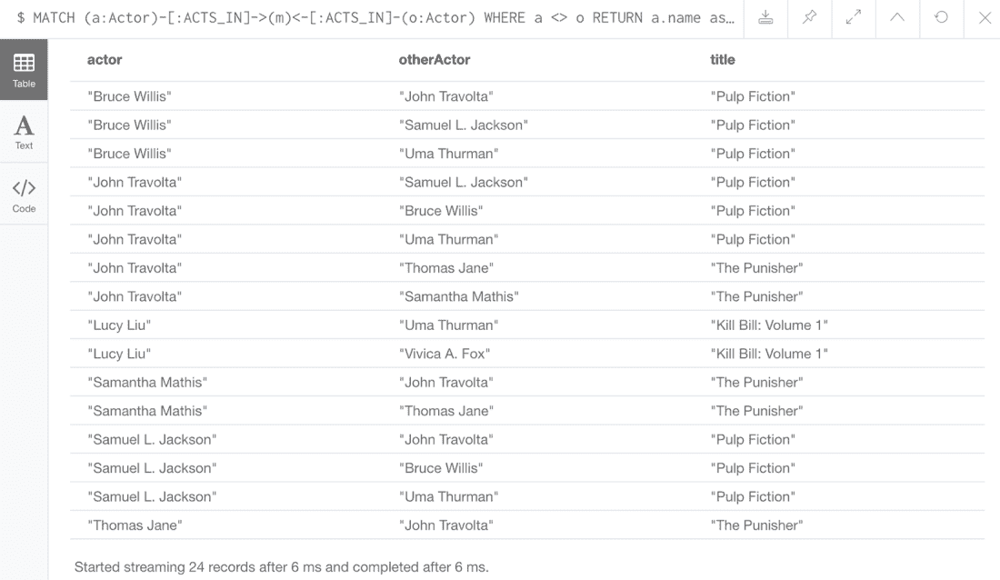

图 4.7 列表 4.5 的样本数据库创建结果

值得注意的是，这里没有字符串比较。此外，查询要简单得多，在一个更大的数据库中，它将执行得更快。如果您还记得我们关于原生图数据库（第 2.3.4 节）的讨论以及 Neo4j 如何实现节点关系的无邻接索引（附录 B），它将比列表 4.3 中必要的字符串索引查找要快得多。

我们已经设计了我们用于表示项目的最终图模型。在一个真实的机器学习项目中，下一步将是创建数据库，从一个或多个来源导入数据。如本节开头所述，MovieLens 数据集被选为测试数据集。您可以从 GroupLens（[`grouplens.org/datasets/movielens`](https://grouplens.org/datasets/movielens)）下载该数据集。代码仓库包含了在正确的目录下下载的说明和步骤，以及设置代码正确运行的流程。根据您愿意等待多长时间来查看第一个图数据库，您可以选择合适的数据集大小。（如果您不耐烦，请选择最小的。）数据集只包含关于每部电影的一点点信息，例如标题和一系列类型，但它还包含一个指向 IMDb 的引用，在那里可以访问有关电影的各类详细信息：剧情、导演、演员、编剧等等。这些数据正是我们所需要的。

列表 4.6 和 4.7 包含了从 MovieLens 数据集中读取数据、在图中存储第一个节点以及使用 IMDb 上可用的信息来丰富它们的 Python 代码。（您应该整理您的数据库，但这不是强制性的。）

列表 4.6 从 MovieLens 导入基本电影信息

```
def import_movies(self, file):
    with open(file, 'r+') as in_file:
        reader = csv.reader(in_file, delimiter=',')                           ❶
        next(reader, None)
        with self._driver.session() as session:                               ❷
            self.executeNoException(session, 
                "CREATE CONSTRAINT ON (a:Movie) ASSERT a.movieId IS UNIQUE; ")❸
            self.executeNoException(session,
                "CREATE CONSTRAINT ON (a:Genre) ASSERT a.genre IS UNIQUE; ")  ❸

            tx = session.begin_transaction()                                  ❹

            i = 0;
            j = 0;
            for row in reader:
                try:
                    if row:
                        movie_id = strip(row[0])
                        title = strip(row[1])
                        genres = strip(row[2])
                        query = """                                           ❺
                            CREATE (movie:Movie {movieId: $movieId, 
                            ➥ title: $title})
                            with movie
                            UNWIND $genres as genre
                            MERGE (g:Genre {genre: genre})
                            MERGE (movie)-[:HAS]->(g)
                        """
                        tx.run(query, {"movieId": movie_id, "title": title, 
                        ➥ "genres": genres.split("|")})
                        i += 1
                        j += 1
                    if i == 1000:                                        ❻
                        tx.commit()
                        print(j, "lines processed")
                        i = 0
                        tx = session.begin_transaction()
                except Exception as e:
                    print(e, row, reader.line_num)
            tx.commit()
            print(j, "lines processed") 
```

❶ 从 CSV 文件（movies.csv）读取值

❷ 启动一个新的会话连接到 Neo4j

❸ 为保证人和类型的唯一性创建约束。函数 executeNoException 包装了如果约束已存在时生成的异常。

❹ 开始一个新的事务，这将允许数据库操作的原子性（全部进入或全部退出）

❺ 创建电影和类型（MERGE 防止多次创建相同的类型）并将它们连接起来

❻ 高级技巧：为了避免在最后进行大量提交，此检查确保每处理 1,000 行数据就向数据库提交一次。

列表 4.7 使用 IMDb 上可用的详细信息丰富数据库

```
def import_movie_details(self, file):
    with open(file, 'r+') as in_file:
        reader = csv.reader(in_file, delimiter=',')
        next(reader, None)
        with self._driver.session() as session:
            self.executeNoException(session, "CREATE CONSTRAINT ON (a:Person) 
            ➥ ASSERT a.name IS UNIQUE;")                               ❶
            tx = session.begin_transaction()
            i = 0;
            j = 0;
            for row in reader:
                try:
                    if row:
                        movie_id = strip(row[0])
                        imdb_id = strip(row[1])
                        movie = self._ia.get_movie(imdb_id)             ❷
                        self.process_movie_info(movie_info=movie, tx=tx, 
                        ➥ movie_id=movie_id)                           ❸
                        i += 1
                        j += 1

                    if i == 10:
                        tx.commit()
                        print(j, "lines processed")
                        i = 0
                        tx = session.begin_transaction()
                except Exception as e:
                    print(e, row, reader.line_num)
            tx.commit()
            print(j, "lines processed")

def process_movie_info(self, movie_info, tx, movie_id):
    query = """ ❹
        MATCH (movie:Movie {movieId: $movieId}                                                        )
        SET movie.plot = $plot
        FOREACH (director IN $directors | MERGE (d:Person {name: director}) 
        ➥ SET d:Director MERGE (d)-[:DIRECTED]->(movie))
        FOREACH (actor IN $actors | MERGE (d:Person {name: actor}) SET 
        ➥ d:Actor MERGE (d)-[:ACTS_IN]->(movie))
        FOREACH (producer IN $producers | MERGE (d:Person {name: producer}) 
        ➥ SET d:Producer MERGE (d)-[:PRODUCED]->(movie))
        FOREACH (writer IN $writers | MERGE (d:Person {name: writer}) SET 
        ➥ d:Writer MERGE (d)-[:WROTE]->(movie))
        FOREACH (genre IN $genres | MERGE (g:Genre {genre: genre}) MERGE 
        ➥ (movie)-[:HAS]->(g))
    """
    directors = []
    for director in movie_info['directors']:
        if 'name' in director.data:
            directors.append(director['name'])

    genres = ''
    if 'genres' in movie_info:
        genres = movie_info['genres'
]
    actors = []
    for actor in movie_info['cast']:
        if 'name' in actor.data:
            actors.append(actor['name'])

    writers = []
    for writer in movie_info['writers']:
        if 'name' in writer.data:
            writers.append(writer['name'])

    producers = []
    for producer in movie_info['producers']:
        producers.append(producer['name'])

    plot = ''                                                           ❺
    if 'plot outline' in movie_info:                                    ❺
        plot = movie_info['plot outline']                               ❺

    tx.run(query, {"movieId": movie_id, "directors": directors, 
    ➥ "genres": genres, "actors": actors, "plot": plot,
                   "writers": writers, "producers": producers})
```

❶ 创建一个新的约束以使人物唯一

❷ 从 IMDb 获取电影详情

❸ 处理来自 IMDb 的信息并将其存储在图中

❹ 与列表 4.4 相同，但电影已经存在

❺ 从电影信息中提取剧情值以在节点上创建剧情属性

这段代码过于简化，需要花费很长时间才能完成，因为访问和解析 IMDb 页面需要时间。在本书的代码仓库中，除了完整的代码实现外，还有一个并行版本的函数 import_movie_details，其中创建了多个线程同时下载和处理多个 IMDb 页面。完成后，生成的图具有图 4.6 所描述的结构。

练习

在新创建的数据库中玩耍，并编写查询来完成以下操作：

1.  搜索在相同电影中工作的演员对。

    TIP 使用列表 4.3，但在查询末尾添加 LIMIT 50；否则，查询将产生大量结果。

1.  统计每个演员出演了多少部电影。

1.  获取一部电影（通过 movieId），并列出所有特性。

在本场景中，项目（电影）被正确建模并存储在真实的图数据库中。在第 4.2 节中，我们将对用户进行建模。

## 4.2 用户建模

在 CBRS 中，存在多种方法用于收集和建模用户配置文件。所选的设计模型将根据偏好的收集方式（隐式或显式）以及过滤策略或推荐方法的类型而有所不同。收集用户偏好的直接方法是询问用户。用户可能对特定类型或关键词、特定演员或导演感兴趣。

从高层次的角度来看，用户配置文件和定义的模型的目的在于帮助推荐引擎为每个项目或项目特性分配一个分数。这个分数有助于按从高到低的顺序对建议给特定用户的项目进行排序。因此，推荐系统属于机器学习领域中的“学习排序”领域。

我们可以通过为用户添加节点并将它们连接到感兴趣的特性来向正在设计的模型添加偏好或兴趣。生成的模式将类似于图 4.8。

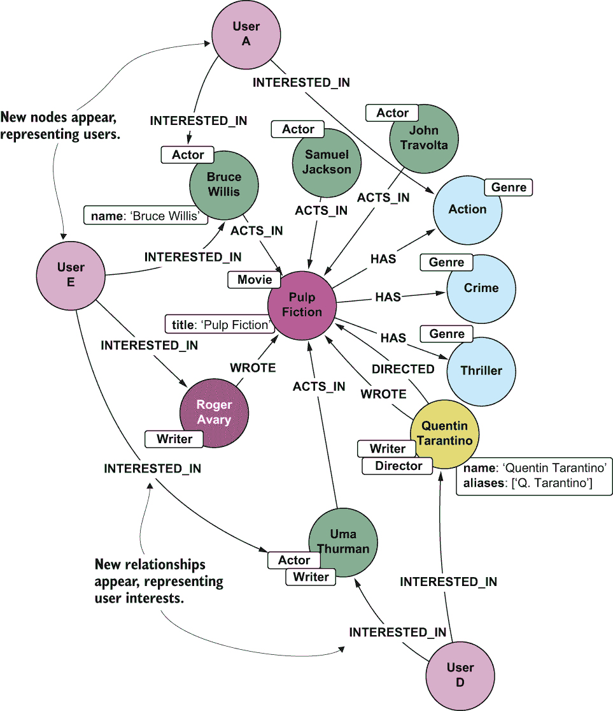

图 4.8 具有用户兴趣指向元信息的图模型

用于建模用户偏好的图模型扩展了之前为物品描述的模型，为每个用户添加了一个新节点，并将其连接到用户感兴趣的特征。

建模笔记

为物品设计的先进模型更适合这种场景，因为特征是图中的节点，因此可以通过边连接到用户——与更简单的模型相比，这种模型的另一个优点是，建模兴趣会困难得多，也更痛苦。

或者，系统可以明确要求用户对某些物品进行评分。最佳方法是选择那些能帮助我们最广泛地了解用户品味的物品。生成的图模型看起来像图 4.9。

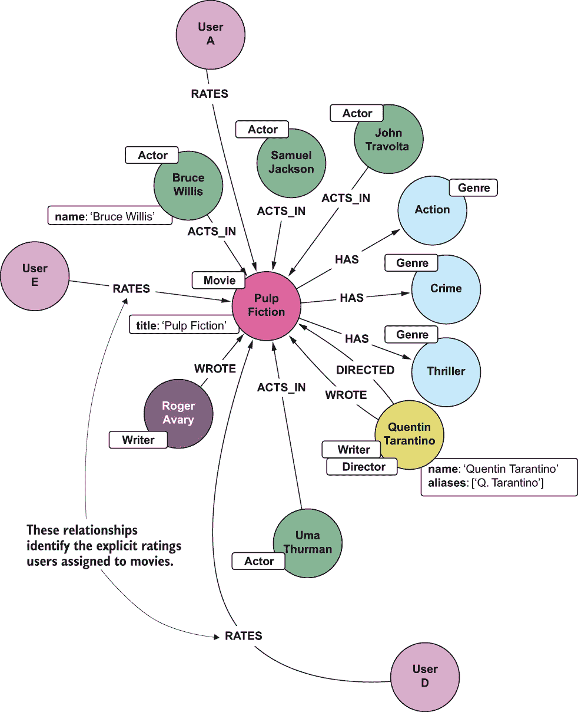

图 4.9 带有用户显式物品评分的图模型

在这种情况下，用户节点连接到电影。评分作为属性存储在边上。这些方法被称为*显式*，因为系统要求用户表达自己的品味和偏好。

在另一端，另一种方法是通过对每个用户与物品的交互进行隐式地推断用户的兴趣、品味和偏好。例如，如果我买了大豆奶，那么我可能对类似的产品，如大豆酸奶，感兴趣。在这种情况下，大豆是相关特征。同样，如果一个用户观看了《指环王》三部曲的第一集，那么他们很可能对其他两集或同一奇幻动作类型的其他电影感兴趣。生成的模型看起来像图 4.10。这个模型与图 4.9 中的模型相同；唯一的区别是图 4.10 中的系统收集并存储用户行为数据，以隐式地推断用户的兴趣。

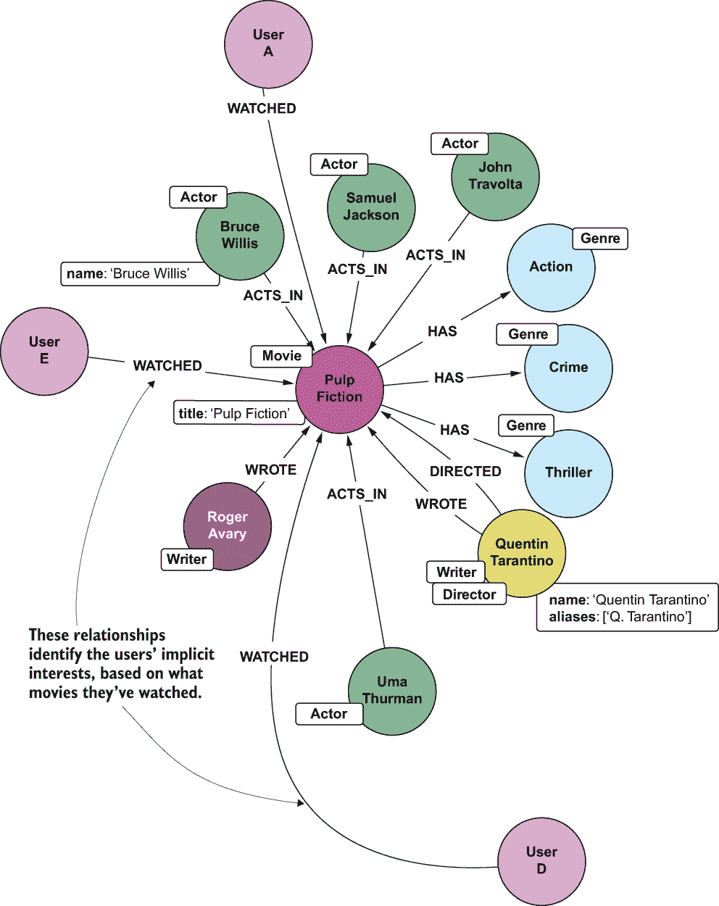

图 4.10 带有用户-物品交互的图模型

值得注意的是，当系统建模用户和物品之间的关系时，无论是否收集用户兴趣的信息是隐式还是显式，都可以通过不同的方法推断用户对特定物品特征的兴趣。从图 4.9 和 4.10 所示图中，列表 4.8 中的 Cypher 查询计算用户和特征之间新的关系，并通过在图中创建新的边来*物化*它们（存储为新关系以提高访问性能）。

列表 4.8 查询计算用户和物品特征之间的关系^(4)

```
MATCH (user:User)-[:WATCHED|RATED]->(movie:Movie)-
➥ [:ACTS_IN|WROTE|DIRECTED|PRODUCED|HAS]-(feature)      ❶
WITH user, feature, count(feature) as occurrences        ❷
WHERE occurrences > 2                                    ❸
MERGE (user)-[:INTERESTED_IN]->(feature)                 ❹
```

❶ | 允许你在 MATCH 模式中指定多个关系类型。

❷ WITH 子句聚合用户和特征，计算出现的次数。

❸ 这个 WHERE 子句允许你只考虑用户观看过的至少三部电影中出现的特征。

❹ 创建关系。使用 MERGE 而不是 CREATE 可以防止同一对节点之间有多个关系。

这个查询搜索所有表示用户观看或评分的所有电影的图模式（(u:User)-[:WATCHED|RATED]-> (m:Movie)）。它识别出用户和特征。

```
(movie:Movie)-[:ACTS_IN|WROTE|DIRECTED|PRODUCED|HAS]-(feature)
```

对于每个用户-特征对，WITH 的输出还表明用户观看具有该特定特征的电影的频率（该特征可能是演员、导演、类型等）。WHERE 子句过滤掉出现次数少于三次的所有特征，以保留最相关的特征，避免在图中填充无用的关系。最后，MERGE 子句创建关系，防止在相同的节点对之间存储多个关系（如果使用 CREATE 会发生这种情况）。生成的模型看起来像图 4.11。

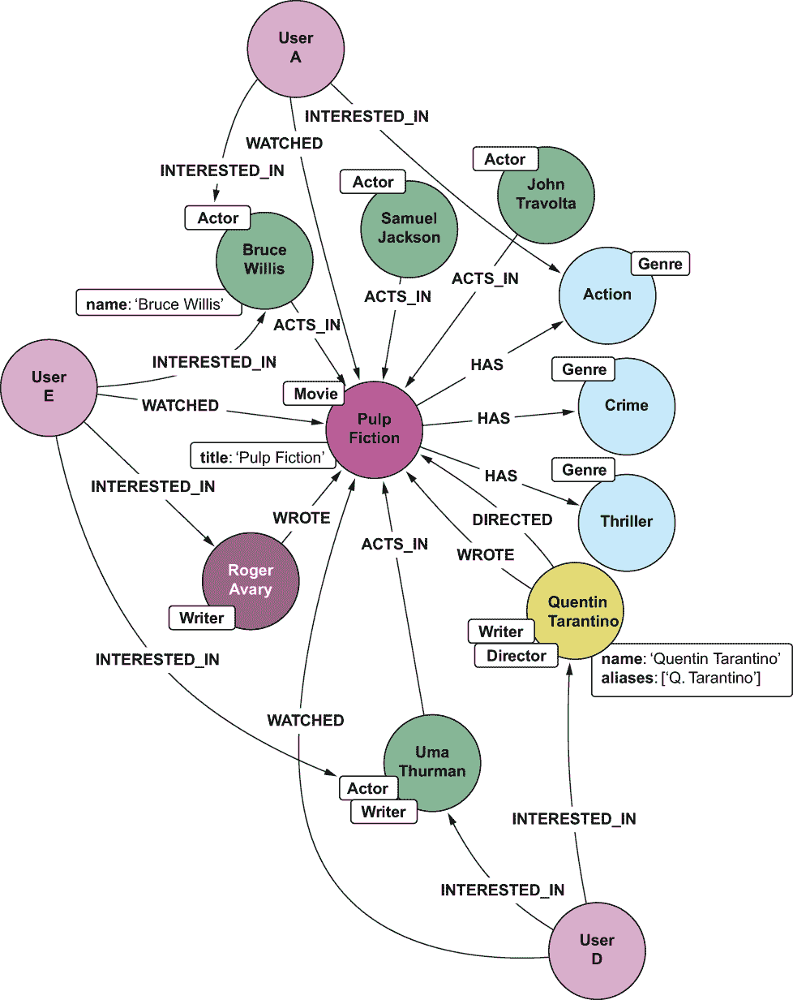

图 4.11 推断关系 INTERESTED_IN 后的图模型

图 4.11 中展示的模型包含以下关系之间的

+   用户和项目。（在建模示例中，我们使用了显式的观看关系，但同样适用于显式的评分。）

+   用户和特征。

第二种类型是从第一种类型开始计算的，使用一个简单的查询。这个例子展示了起始模型的另一种可能的扩展。在这种情况下，不是使用外部知识源，而是从图中本身推断新的信息。在这个特定的情况下，使用图查询来提炼知识并将其转换为新的关系，以实现更好的导航。

MovieLens 数据集包含基于用户评分的显式用户-项目对。（这些配对被认为是显式的，因为用户决定对项目进行评分。）在列表 4.9 中，使用评分来构建一个图，如图 4.10 所示，唯一的区别是 WATCHED 被 RATED 替换，因为它代表用户明确评分的内容。该函数从 CSV 文件中读取，创建用户，并将它们连接到他们评分的电影。

列表 4.9 从 MovieLens 导入用户-项目对

```
def import_user_item(self, file):
    with open(file, 'r+') as in_file:
        reader = csv.reader(in_file, delimiter=',')
        next(reader, None)
        with self._driver.session() as session:
            self.executeNoException(session, "CREATE CONSTRAINT ON (u:User) 
            ➥ ASSERT u.userId IS UNIQUE")                            ❶

            tx = session.begin_transaction()
            i = 0;
            for row in reader:
                try:
                    if row:
                        user_id = strip(row[0])
                        movie_id = strip(row[1])
                        rating = strip(row[2])
                        timestamp = strip(row[3])
                        query = """                                    ❷
                            MATCH (movie:Movie {movieId: $movieId})
                            MERGE (user:User {userId: $userId})
                            MERGE (user)-[:RATED {rating: $rating, 
                            ➥ timestamp: $timestamp}]->(movie)
                        """
                        tx.run(query, {"movieId":movie_id, "userId": user_id, 
                        ➥ "rating":rating, "timestamp": timestamp})
                        i += 1
                    if i == 1000: 
                        tx.commit()
                        i = 0
                        tx = session.begin_transaction()
                except Exception as e:
                    print(e, row, reader.line_num)
            tx.commit()
```

❶ 创建约束以保证用户唯一性

❷ 查询通过 movieId 搜索电影，如果不存在则创建用户，并将它们连接起来。

到目前为止，我们设计的图模型能够正确地表示项目和用户，并且能够适应多种变化或扩展，例如语义分析和隐式或显式信息。我们创建并填充了一个真实的图数据库，使用的是通过结合 MovieLens 数据集和 IMDb 信息获得的数据。

练习

在数据库中玩耍，并编写查询来完成以下操作：

1.  获取一个用户（通过 userId），并列出该用户感兴趣的所有特征。

1.  寻找具有共同兴趣的用户对。

第 4.3 节讨论了如何使用此模型在考虑的电影租赁场景中向最终用户提供推荐。

## 4.3 提供推荐

在推荐阶段，CBRS 使用用户档案来匹配用户与最有可能引起他们兴趣的物品。根据可用信息和为用户和物品定义的模型，可以为此目的使用不同的算法或技术。从之前描述的模型开始，本节描述了预测用户兴趣和提供推荐的几种技术，按复杂性和准确性的增加顺序呈现。

第一种方法基于图 4.12 中展示的模型，其中明确要求用户指出他们对特征的兴趣，或者从用户与物品的交互中推断出兴趣。

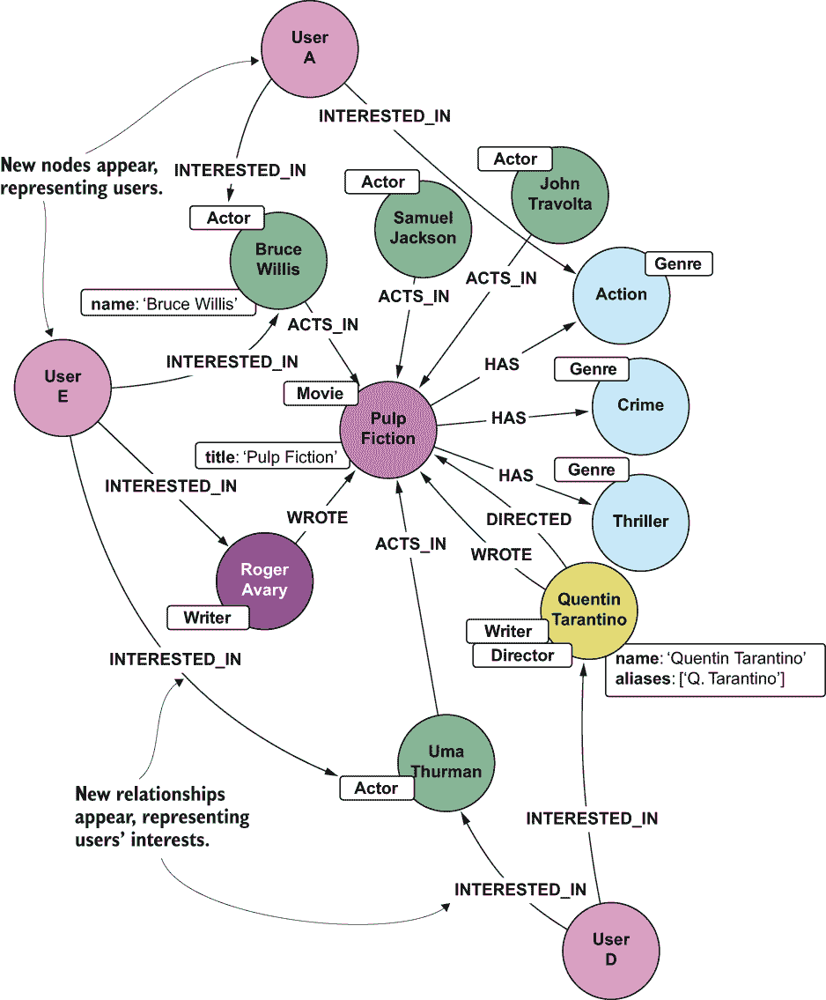

图 4.12 用户兴趣指向元信息的图模型

当适用时，这种方法是：

+   *物品*通过一个与物品相关的特征列表来表示，例如标签、关键词、类型和演员。这些特征可能是由用户手动（标签）或专业人士（关键词）创建的，或者通过某些提取过程自动生成。

+   *用户档案*通过将用户连接到他们感兴趣的特征来表示。这些连接以二进制形式描述：*喜欢*（在图中，用用户和特征之间的边表示）和*不喜欢/未知*（表示为用户和特征之间没有边）。当没有关于用户兴趣的明确信息时，可以从其他来源（明确或隐式）推断兴趣，如前所述，使用图查询。

这种方法对于电影租赁等场景非常相关，其中元信息可用且更好地描述了物品本身。在这个场景中的整个推荐过程可以总结如图 4.13 所示。

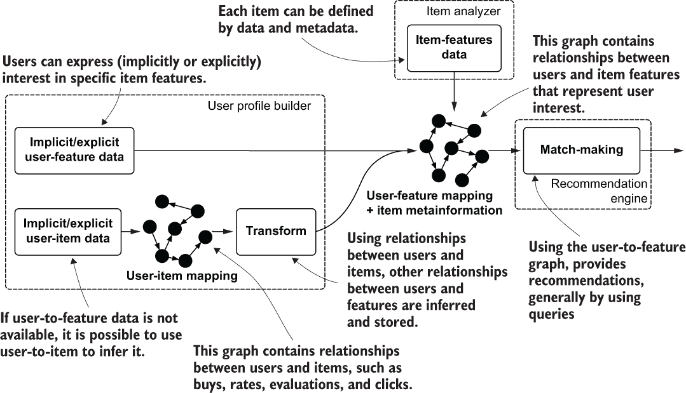

图 4.13 基于内容推荐器中第一个场景的推荐过程

这张高级图表突出了整个过程可以基于图来构建。这种方法不需要复杂或花哨的算法来提供推荐。有了合适的图模型，一个简单的查询就能完成任务。数据已经包含了足够的信息，图结构有助于计算分数并返回给用户排序后的列表，无需预先构建任何模型：*描述和预测模型重叠*。这种纯图基方法简单但有很多优点：

+   *它产生良好的结果*。考虑到这种方法所需的努力有限，推荐的品质相当高。

+   *它很简单*。它不需要复杂的计算或复杂的代码，在提供推荐之前读取和预处理数据。如果数据在图中建模得当，如前所述，就可以实时执行查询并响应用户。

+   *可扩展性*. 图可以包含其他信息，这些信息对于根据其他数据源或上下文信息细化结果可能很有用。查询可以轻松地更改以考虑新的方面。

通过像列表 4.10 中的查询这样的方式完成提供推荐的任务。

列表 4.10 为用户提供推荐查询

```
MATCH (user:User)-[i:INTERESTED_IN]->(feature)-[]-(movie:Movie)       ❶
WHERE user.userId = "<user Id>" AND NOT exists((user)-[]->(movie))    ❷
RETURN movie.title, count(i) as occurrences
ORDER BY occurrences desc                                             ❸
```

❶ 从一个用户开始，MATCH 子句搜索所有对该用户感兴趣的电影。

❷ NOT EXISTS() 过滤出用户已经观看或评分的所有电影。

❸ 逆序排序有助于将共享给选定用户的电影推到顶部。

这个查询从用户（WHERE 子句指定一个字符串形式的 userId）开始，识别用户感兴趣的所有特征，并找到包含这些特征的 所有电影。对于每部电影，查询计算重叠特征的数量，并根据这个值对电影进行排序：重叠特征的数量越多，项目可能对用户感兴趣的可能性就越高。

这种方法可以应用于我们之前创建的数据库。MovieLens 数据集包含用户和项目之间的连接，但没有用户与其感兴趣的特征之间的关系；这些特征在数据集中不可用。我们通过使用 IMDb 作为电影特征的知识来源，并应用列表 4.8，来丰富数据集，从而可以计算用户和项目特征之间缺失的关系。使用代码和查询来玩转图数据库并提供推荐。它可能不会很快，但会正常工作。图 4.14 显示了在导入的数据库上运行列表 4.7 的结果。值得注意的是，这里显示的示例中用户 598 已经对 *Shrek* 和 *Shrek 2* 进行了评分。

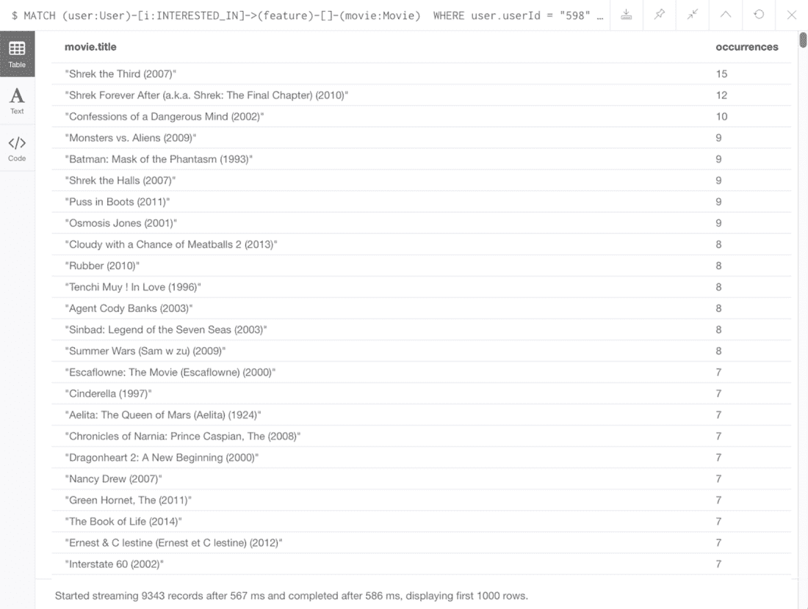

图 4.14 在导入的 MovieLens 数据库上运行列表 4.10 的结果

在本章和本书的后续部分，描述了提高性能的不同技术和方法；在这里，重点是不同的图建模技术和设计选项。

练习

将列表 4.10 重写为仅考虑特定类型或特定年份的电影。

小贴士：通过使用 EXISTS 添加条件到 WHERE 子句。

这种方法效果良好且简单，但通过一点努力，它可以得到极大的改进。第二种方法通过考虑两个主要方面来扩展前一种方法，这两个方面可以改进：

+   在用户配置文件中，对项目特征的兴趣由一个布尔值表示。这个值是 *二进制* 的，仅表示用户对特征感兴趣。它不赋予这种关系任何权重。

+   计算用户配置文件和项目之间的重叠特征是不够的。我们需要一个函数来计算用户兴趣和项目之间的相似性或共同点。

关于第一点，正如本书中经常提到的，模型是现实的表示，现实是我们在模拟一个可能对某些特征比对其他特征更感兴趣的（例如喜欢动作电影但喜欢杰森·斯坦森的电影）。这些信息可以提高推荐的质量。

关于第二点，与其计算重叠特征的数量，不如通过测量用户资料与项目特征之间的相似度来找到特定用户感兴趣的项目——越接近越好。这种方法需要

+   一个*函数*，用于测量相似度

+   一个*共同表示*，以便可以测量项目和用户资料的相似度

选定的函数定义了项目和个人资料所需的表示形式。有多种函数可供选择。其中最精确的函数之一是*余弦相似度*，在第三章中介绍：

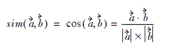

与大多数常见的相似度函数一样，此函数要求每个项目和每个用户资料被投影到共同的*向量空间模型 (VSM)*中，这意味着每个元素都必须由一个固定维度的向量表示。在这种情况下，整个推荐过程可以总结为图 4.15 中的高级图。

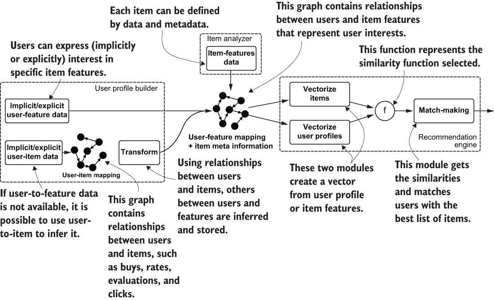

图 4.15 基于内容的推荐器第二场景的推荐过程

与先前的方法相比，在这种情况下，在推荐过程之前有一个中间步骤将项目投影，并将用户资料投影到 VSM 中。为了描述将项目和用户资料转换为 VSM 中的表示的过程，让我们考虑我们的电影推荐场景。假设我们的电影数据集如图 4.16 所示。

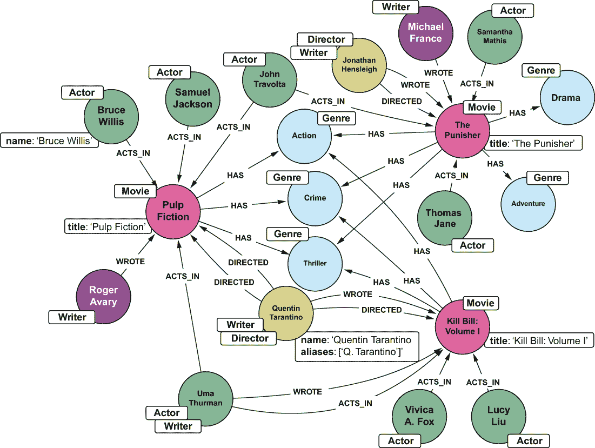

图 4.16 电影高级模型

考虑到元信息，如类型和导演，每个项目都可以表示为一个向量。（我们可以使用所有可用的元信息，但下一个表会太大。）在这种情况下，每个向量的维度由类型和导演的所有可能值的列表定义。表 4.2 显示了我们手动创建的简单数据集中这些向量的样子。

表 4.2 将项目转换为向量

|  | 动作 | 剧情 | 犯罪 | 惊悚 | 冒险 | 昆汀·塔伦蒂诺 | 乔纳森·亨斯莱 |
| --- | --- | --- | --- | --- | --- | --- | --- |
| 低俗小说 | 1 | 0 | 1 | 1 | 0 | 1 | 0 |
| 惩罚者 | 1 | 1 | 1 | 1 | 1 | 0 | 1 |
| 杀死比尔：第一卷 | 1 | 0 | 1 | 1 | 0 | 1 | 0 |

这些向量是布尔向量，因为值只能是 0，表示不存在，或者 1，表示存在。代表三部电影的向量是

*向量(低俗小说)* = [1, 0, 1, 1, 0, 1, 0]

*向量(惩罚者)* = [1, 1, 1, 1, 1, 0, 1]

*向量(杀死比尔：第一卷)* = [1, 0, 1, 1, 0, 1, 0]

这些二进制向量可以通过图 4.16 中的图模型通过以下查询提取。

列表 4.11 提取电影的布尔向量

```
MATCH (feature)                                                            ❶
WHERE "Genre" in labels(feature) OR "Director" in labels(feature)          ❶
WITH feature
ORDER BY id(feature)
MATCH (movie:Movie)                                                        ❷
WHERE movie.title STARTS WITH "Pulp Fiction"                               ❷
OPTIONAL MATCH (movie)-[r:DIRECTED|HAS]-(feature)                          ❸
RETURN CASE WHEN r IS null THEN 0 ELSE 1 END as Value,                     ❹
CASE WHEN feature.genre IS null THEN feature.name ELSE feature.genre END as 
➥ Feature                                                                 ❺
```

❶ 使用 labels 函数获取分配给节点的标签列表，搜索所有类型为导演或类型的特征。

❷ 搜索电影《低俗小说》。使用 STARTS WITH 比精确字符串比较更可取，因为电影通常在标题中有年份。

❸ 可选的 MATCH 允许我们考虑所有特征，即使它们与所选电影无关。

❹ 如果不存在关系，则此 CASE 子句返回 0，否则返回 1。

❺ 这个 CASE 子句返回导演或类型的名称。

查询首先寻找代表类型或导演的所有节点，并按节点标识符顺序返回它们。顺序很重要，因为在每个向量中，特定的类型或导演必须在相同的位置表示。然后查询通过标题查找特定电影，并使用可选的 MATCH 检查电影是否与特征相关联。与 MATCH 不同，MATCH 会过滤掉不匹配的元素，而可选的 MATCH 如果不存在关系则返回 null。在 RETURN 中，第一个 CASE 子句如果不存在关系则返回 0，否则返回 1；第二个返回导演或类型的名称。图 4.17 显示了针对从 MovieLens 导入的数据库运行的查询结果。

如图 4.17 中的截图所示，实际向量很大，因为有很多可能的维度。尽管这种完整表示可以通过这里讨论的实现来管理，但第五章介绍了一种表示这样长向量的更好方法。

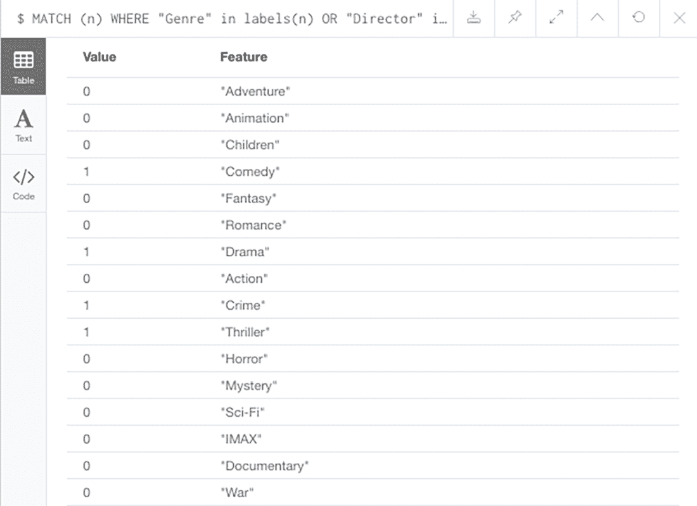

图 4.17 运行列表 4.11 在 MovieLens 数据集上的结果

添加索引

在 MovieLens 数据库上运行此查询可能需要很长时间。时间花费在过滤条件上，即 movie.title 以"Pulp Fiction"开头。添加索引可以大大提高性能。运行以下命令后，再尝试查询：

```
CREATE INDEX ON :Movie(title)
```

这不是快得多吗？

可以将这种向量方法推广到各种特征，包括具有数值的特征，例如我们电影场景中的平均评分。⁵在向量表示中，相关组件包含这些特征的精确值。在我们的例子中，三部电影的向量表示如下：

*《低俗小说》向量* = [1, 0, 1, 1, 0, 1, 0, 4]

*《惩罚者》向量* = [1, 1, 1, 1, 1, 0, 1, 3.5]

*《杀死比尔：卷一》向量* = [1, 0, 1, 1, 0, 1, 0, 3.9]

最后一个元素代表平均评分。向量中的一些分量是布尔值，而其他分量是实数值或整数值，这并不重要 [Ullman and Rajaraman, 2011]。仍然可以计算向量之间的余弦距离，尽管如果我们这样做，我们应该考虑对非布尔分量进行适当的缩放，以便它们既不主导计算，也不无关紧要。为此，我们将值乘以一个缩放因子：

*向量(低俗小说)* = [1, 0, 1, 1, 0, 1, 0, 4α]

*向量(惩罚者)* = [1, 1, 1, 1, 1, 0, 13.5α]

*向量(杀死比尔：第一卷)* = [1, 0, 1, 1, 0, 1, 0, 3.9α]

在这种表示中，如果α设置为 1，平均评分将主导相似度的值；如果设置为 0.5，效果将减半。缩放因子可以针对每个数值特征不同，并取决于该特征在结果相似度中的权重。

在手头有了物品的正确向量表示后，我们需要将用户配置文件投影到相同的 VSM 中，这意味着我们需要创建具有与物品向量相同的分量和顺序的向量，这些向量描述了用户的偏好。如第 4.2.2 节所述，在基于内容的案例中，有关用户偏好或喜好的信息可以是用户-物品对或用户-特征对。这两对都可以隐式或显式地收集。因为向量空间以特征值作为维度，投影的第一步是将用户-物品矩阵迁移到用户-特征空间（除非它已经可用）。可以使用不同的技术进行此转换，包括通过计算用户之前喜欢列表中每个特征的出现次数进行聚合⁶。此选项对于布尔值效果良好；另一种选项是计算数值特征的平均值。在电影场景中，每个用户配置文件可以表示如表 4.3 所示。

表 4.3 与电影相同的向量空间表示的用户配置文件

|  | 动作 | 剧情 | 犯罪 | 惊悚 | 冒险 | 昆汀·塔伦蒂诺 | 约翰·亨谢利 | 总计 |
| --- | --- | --- | --- | --- | --- | --- | --- | --- |
| 用户 A | 3 | 1 | 4 | 5 | 1 | 3 | 1 | 9 |
| 用户 B | 0 | 10 | 1 | 2 | 3 | 0 | 1 | 15 |
| 用户 C | 1 | 0 | 3 | 1 | 0 | 1 | 0 | 5 |

每个单元格表示用户观看具有该特定特征的电影数量。例如，用户 A 观看了三部昆汀·塔伦蒂诺执导的电影，但用户 B 没有观看他执导的任何电影。表中还包含一个新列，表示每个用户观看的电影总数；此值将在创建用于归一化值的向量时很有用。

这些用户-特征对及其相关计数很容易从我们迄今为止用于表示用户-项目交互的图模型中获得。为了简化下一步，我建议通过在图中正确存储这些值来实际化这些值。在一个属性图数据库中，表示用户对特定项目特征的兴趣程度的权重可以通过用户和特征之间的关系属性来建模。修改之前用于推断用户和特征之间关系的列表 4.8，可以提取此信息，创建新的关系，并将这些权重添加到边中。新的查询如下所示。

列表 4.12 查询提取用户和特征之间的加权关系

```
MATCH (user:User)-[:WATCHED|RATED]->(m:Movie)-
➥ [:ACTS_IN|WROTE|DIRECTED|PRODUCED|HAS]-(feature)
WITH user, feature, count(feature) as occurrence
WHERE occurrence > 2
MERGE (user)-[r:INTERESTED_IN]->(feature)
SET r.weight = occurrence                    ❶
```

❶ SET 在 INTERESTED_IN 关系上添加或修改权重属性。

在这个版本中，发生情况被存储为 INTERESTED_IN 关系上的一个属性，而在列表 4.8 中，它仅被用作过滤器。图 4.18 显示了结果模型。

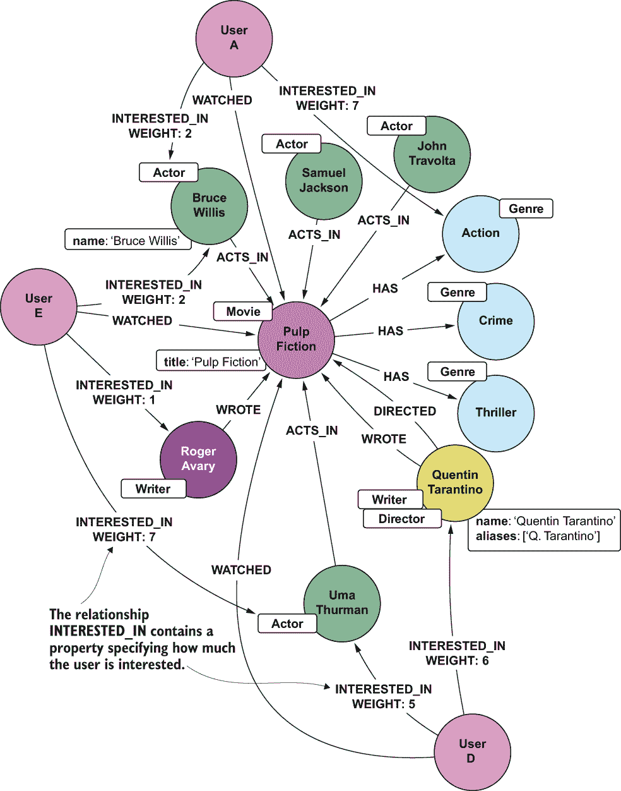

图 4.18 推断 INTERESTED_IN 关系后的图模型

仅凭表中的数字可能导致用户配置文件向量和项目向量之间相似性的错误计算。它们必须被归一化以更好地表示用户对特定特征的真正兴趣。例如，如果一个用户观看了 50 部电影，其中只有 5 部是剧情片，我们可能会得出结论，该用户对这个类型不如一个在总共 10 部电影中观看了 3 部剧情片的用户感兴趣，尽管第一个用户观看了更多类型的电影。

如果我们将表 4.3 中的每个值与用户观看的电影总数进行归一化，我们会看到第一个用户对剧情类型的兴趣为 0.1，而第二个为 0.6。表 4.4 显示了归一化的用户配置文件。

表 4.4 表 4.3 的归一化版本

|  | 动作 | 剧情 | 犯罪 | 惊悚 | 冒险 | 昆汀·塔伦蒂诺 | 约翰·亨谢利 |
| --- | --- | --- | --- | --- | --- | --- | --- |
| 用户 A | 0.33 | 0.11 | 0.44 | 0.55 | 0.11 | 0.33 | 0.11 |
| 用户 B | 0 | 0.66 | 0.06 | 0.13 | 0.2 | 0 | 0.06 |
| 用户 C | 0.2 | 0 | 0.6 | 0.2 | 0 | 0.2 | 0 |

建模技巧

我不建议将归一化过程的结果作为图中的权重存储，因为这些结果受到用户观看电影总数的影响。存储这些值将需要我们每次用户观看一部新电影时都重新计算每个权重。如果我们只将计数作为权重存储，当用户观看一部新电影时，只需更新受影响的功能。例如，如果用户观看了一部冒险电影，那么只需更新该类型的计数。

在显式场景中，可以通过要求用户为一系列可能的项目特征分配评分来收集此权重信息。相关值可以存储在用户和特征之间的边上的权重属性上。

在这个过程结束时，我们以共同和可比的方式表示了项目和用户档案。我们可以通过计算用户档案向量表示与每部尚未观看的电影之间的相似度来完成每个用户的推荐任务，从高到低排序，并返回前 N 个，其中 N 可以是 1、10 或应用所需的任何数字。在这种情况下，推荐任务需要复杂的操作，这些操作不能通过查询完成，因为它们需要复杂的计算、循环、转换等。

列表 4.13 展示了如何以图 4.18 所示的方式存储数据时提供推荐。完整的代码可在代码存储库中的 ch04/recommendation/content_based_recommendation_second_approach.py 找到。

列表 4.13 使用第二种方法提供推荐的方法

```
def recommendTo(self, userId, k):                                       ❶
    user_VSM = self.get_user_vector(userId)
    movies_VSM = self.get_movie_vectors(userId)
    top_k = self.compute_top_k (user_VSM, movies_VSM, k);
    return top_k

def compute_top_k(self, user, movies, k):                               ❷
    dtype = [ ('movieId', 'U10'),('value', 'f4')]
    knn_values = np.array([], dtype=dtype)
    for other_movie in movies:
        value = cosine_similarity([user], [movies[other_movie]])        ❸
        if value > 0:
            knn_values = np.concatenate((knn_values, np.array([(other_movie, 
            ➥ value)], dtype=dtype)))
    knn_values = np.sort(knn_values, kind='mergesort', order='value' )[::-1]
    return np.array_split(knn_values, [k])[0]

def get_user_vector(self, user_id):                                     ❹
    query = """
                MATCH p=(user:User)-[:WATCHED|RATED]->(movie)
                WHERE user.userId = $userId
                with count(p) as total
                MATCH (feature:Feature)
                WITH feature, total
                ORDER BY id(feature)                                    ❺
                MATCH (user:User)
                WHERE user.userId = {userId}
                OPTIONAL MATCH (user)-[r:INTERESTED_IN]-(feature)
                WITH CASE WHEN r IS null THEN 0 ELSE (r.weight*1.0f)/(total*1.0f) END as value
                RETURN collect(value) as vector
            """
    user_VSM = None
    with self._driver.session() as session:
        tx = session.begin_transaction()
        vector = tx.run(query, {"userId": user_id})
        user_VSM = vector.single()[0]
    print(len(user_VSM))
    return user_VSM;

def get_movie_vectors(self, user_id):                                   ❻
    list_of_moview_query = """                                          ❼
                MATCH (movie:Movie)-[r:DIRECTED|HAS]-(feature)<-
                ➥ [i:INTERESTED_IN]-(user:User {userId: $userId})
                WHERE NOT EXISTS((user)-[]->(movie)) AND EXISTS((user)-[]->
                ➥ (feature))
                WITH movie, count(i) as featuresCount
                WHERE featuresCount > 5
                RETURN movie.movieId as movieId
            """

    query = """                                                         ❽
                MATCH (feature:Feature)
                WITH feature
                ORDER BY id(feature)
                MATCH (movie:Movie)
                WHERE movie.movieId = {movieId} 
                OPTIONAL MATCH (movie)-[r:DIRECTED|HAS]-(feature)
                WITH CASE WHEN r IS null THEN 0 ELSE 1 END as value
                RETURN collect(value) as vector;
            """
    movies_VSM = {}
    with self._driver.session() as session:
        tx = session.begin_transaction()

        i = 0
        for movie in tx.run(list_of_moview_query, {"userId": user_id}):
            movie_id = movie["movieId"];
            vector = tx.run(query, {"movieId": movie_id})
            movies_VSM[movie_id] = vector.single()[0]
            i += 1
            if i % 100 == 0:
                print(i, "lines processed")
        print(i, "lines processed")
    print(len(movies_VSM))
    return movies_VSM
```

❶ 这个函数提供推荐。

❷ 这个函数计算用户档案向量和电影向量之间的相似度，并返回与用户档案最匹配的前 k 部电影。

❸ 我们使用 scikit-learn 提供的 cosine_similarity 函数。

❹ 这个函数创建用户档案；注意它如何通过单个查询提供并映射到向量。

❺ 排序至关重要，因为它允许我们拥有可比的向量。

❻ 这个函数提供了电影向量。

❼ 这个查询只为用户获取相关且尚未观看的电影，这加快了处理过程。

❽ 这个查询创建电影向量。

如果你为用户 598（与上一个场景中的用户相同）运行此代码，你会看到推荐的电影列表与上一个案例的结果没有太大不同，但就预测准确性而言，这些新结果应该更好。多亏了图表，可以轻松找到至少与用户档案有五个共同特征的电影。

还要注意，这个推荐过程需要一段时间才能产生结果。不要担心；这里的目的是以最简单的方式展示概念，书中稍后讨论了各种优化技术。如果你感兴趣，在代码存储库中你可以找到一个使用不同方法创建向量和计算相似度的优化版本的代码。

练习

考虑到 4.13 列表中的代码，

1.  将代码重写为使用不同的相似度函数，例如皮尔逊相关系数（[`libguides.library.kent.edu/SPSS/PearsonCorr`](https://libguides.library.kent.edu/SPSS/PearsonCorr)），而不是余弦相似度。

    小贴士：搜索 Python 实现，并用余弦相似度函数替换。

1.  查看代码存储库中的优化实现，并找出新向量是如何创建的。现在它有多快？第五章介绍了稀疏向量的概念。

我们将要考虑的基于内容的第三种推荐方法可以描述为“推荐与用户过去喜欢的项目相似的项目” [Jannach et al., 2010]。这种方法在一般情况下效果良好，并且当可以计算项目之间的相关相似度，但难以或不适当地以相同方式表示用户档案时，它是唯一的选择。

考虑我们的训练数据集，如图 4.9 和图 4.10 所示。用户偏好是通过将用户与项目连接而不是与项目的元信息连接来建模的。当每个项目的元信息不可用、有限或不相关时，这种方法可能是必要的，因此无法（或没有必要）提取关于用户对某些特征兴趣的数据。尽管如此，与每个项目相关的内容或内容描述以某种方式是可用的；否则，基于内容的方法将不适用。即使元信息可用，这种第三种方法在推荐准确性方面也大大优于前一种方法。这种被称为*基于相似度的检索*的技术，由于以下几个原因，是一种有价值的解决方案：

+   它在第三章中介绍。在这里，使用不同的项目表示来计算相似度。

+   相似度很容易存储在图中作为项目之间的关系。这个例子代表了一个完美的图建模用例，通过导航相似度关系可以提供快速推荐。

+   这是最常见且最强大的 CBRSs（内容基础推荐系统）方法之一。

+   它足够灵活和通用，可以在许多场景中使用，无论每个项目可用的数据/信息类型如何。

在这种场景中的整个推荐过程可以总结为图 4.19 中的高级示意图。

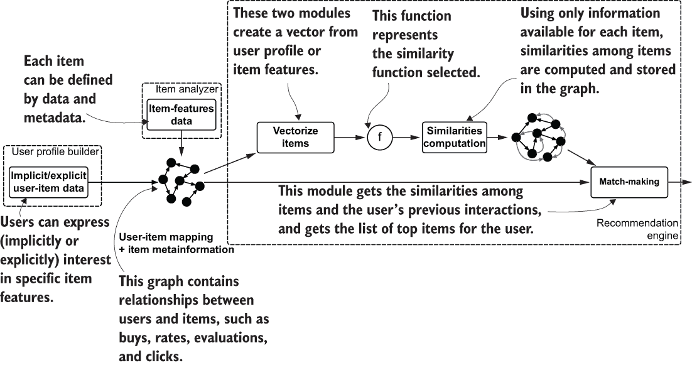

图 4.19 基于内容推荐器的第三种方法的推荐过程

值得注意的是，这与第五章中描述的协同过滤方法的最大区别在于，项目之间的相似度仅通过使用与项目相关的数据进行计算，无论是什么。用户-项目交互仅在推荐阶段使用。

根据图 4.19，在这个场景中需要三个关键元素：

+   *用户档案*——用户档案通过建模用户与项目之间的交互来表示，例如评分、购买或观看。在图中，这些交互表示为用户与项目之间的关系。

+   *项目表示/描述*——为了计算项目之间的相似度，有必要以可测量的方式表示每个项目。如何进行取决于用于测量相似度的函数选择。

+   *相似度函数*—我们需要一个函数，给定两个项目表示，计算它们之间的相似度。我们在第三章中描述了将余弦相似度指标应用于协同过滤的简化示例。在这里，更详细地描述了不同的技术，应用于基于内容的推荐。

与第二种方法一样，列出的前两个元素是严格相关的，因为每个相似度公式都需要特定的项目表示。相反，根据每个项目的可用数据，某些函数可以应用，而其他则不能。

一个典型的相似度指标，适用于多值特性，是 Dice 系数 [Dice, 1945]。它的工作原理如下。每个项目 I[i]由一组特征 *features*(I[i]) 描述——例如，一组关键词。Dice 系数衡量项目 I[i]和 I[j]之间的相似度如下

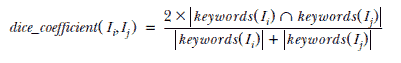

在这个公式中，关键词返回描述项目的关键词列表。在分子中，公式计算重叠/交集的关键词数量，并将结果乘以 2。在分母中，它计算每个项目中的关键词数量。这是一个简单的公式，其中关键词可以被任何东西替换——在我们的电影示例中，类型、演员等等（见图 4.20）。当计算相似度时，它们可以存储回图中，如图 4.21 所示。

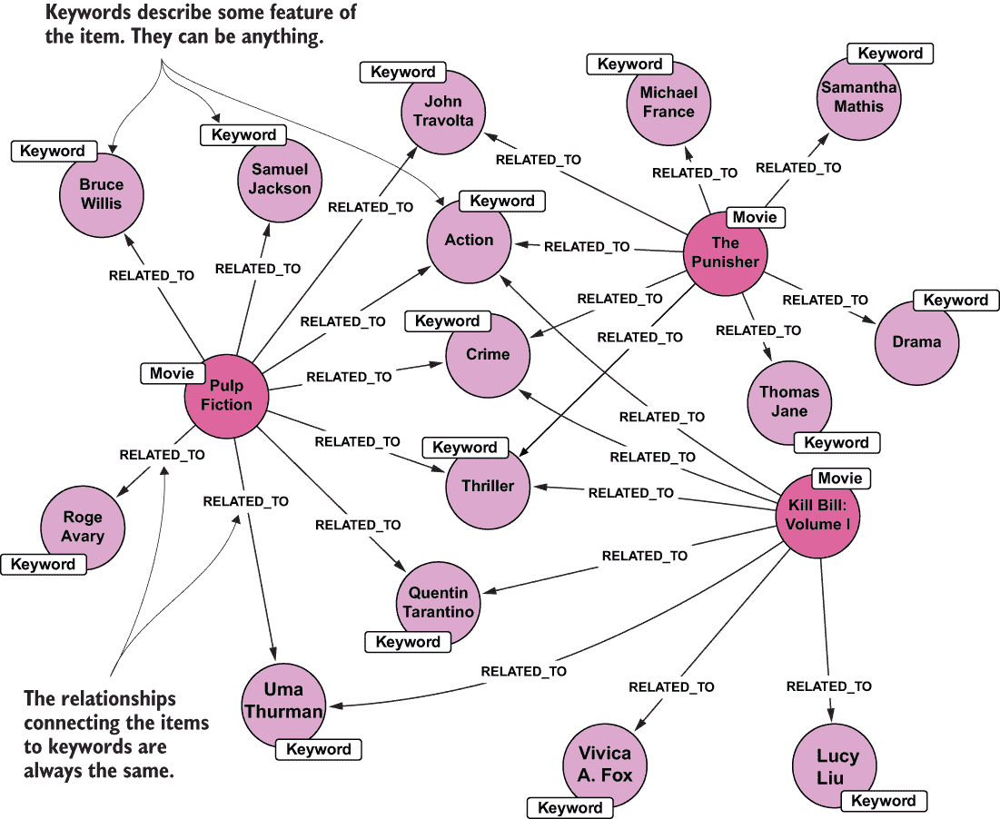


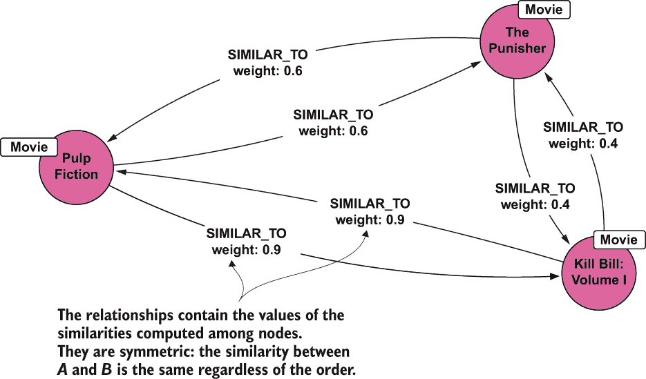

图 4.21 将相似度存储回图中

没有必要存储每对节点之间的邻居关系（尽管需要计算所有这些关系）。通常，只存储少量。你可以定义一个最小相似度阈值，或者你可以定义一个 k 值，只保留最相似的 k 个项目。因此，这种方法中描述的方法被称为 k-*最近邻* (k-*NN**) 方法，无论选择的相似度函数如何。

k-NN 方法在许多机器学习任务中使用，从推荐到分类。它们在数据类型方面具有灵活性，可以应用于文本数据以及结构化数据。在推荐中，k-NN 方法的优势在于相对简单易实现——尽管我们需要考虑计算相似度所需的时间（我们将在第 6.3 节和第 9.2 节中解决这个问题）——并且能够快速适应数据集的最新变化。

这些技术在整本书中都发挥着重要作用，不仅因为它们在机器学习领域的广泛应用，还因为它们很好地适应了图空间——作为一个在机器学习任务中有多种用途的常见模式，其中许多在本书中都有介绍。本部分的其余章节讨论了最近邻方法在推荐任务中的优势。在第九章中，类似的方法应用于欺诈检测。

在所有这些应用中，图提供了一个合适的数据模型来存储 k 个最相关的邻居。这样的图被称为 k-最近邻图（或网络），k-NN 技术在许多场景中用作网络形成方法。

从形式上看，这个图是在 v[i]和 v[j]之间创建一条边，如果 v[j]是 v[i]的 k 个最相似元素之一。k-NN 网络通常是一个有向网络，因为 v[j]可以是 v[i]的 k 个最近邻之一，但反之则不成立。（节点 v[j]可能有一组不同的邻居。）在预测或分析阶段会访问 k-NN 网络。

再看看图 4.21。当为每个相关节点确定了 k 个最相似的节点（例如推荐引擎中的项目或反欺诈系统中的交易）时，可以使用适当的关系类型将它们连接起来。相对相似度值存储在关系属性上。在推荐阶段使用生成的图。

Dice 系数很简单，但由于它使用少量信息来计算相似度，因此生成的推荐质量较差。计算项目之间相似度的一个更强大的方法是基于余弦相似度。项目可以精确地表示为第二种方法中的那样。区别在于，不是在用户配置文件和项目之间计算余弦相似度，而是余弦函数计算项目之间的相似度。这种相似度是对每一对项目进行计算的；然后，每个项目的 top k 匹配作为相似关系存储在图中。考虑表 4.5 中列出的相似度。

表 4.5 电影之间的余弦相似度

|  | 低俗小说 | 惩罚者 | 杀戮比尔：第一卷 |
| --- | --- | --- | --- |
| 低俗小说 | 1 | 0.612 | 1 |
| 惩罚者 | 0.612 | 1 | 0.612 |
| 杀戮比尔：第一卷 | 1 | 0.612 | 1 |

表的内容可以像图 4.21 所示的那样存储在图中。需要注意的是，与第一种和第二种方法不同，其中推荐过程使用原始数据，这里的推荐过程需要一个中间步骤：这个 k-NN 计算和存储。在这种情况下，描述性模型和预测模型不匹配。

列表 4.14 显示了一个用于计算 k-NN 并将这些数据存储回图中的 Python 脚本。它适用于我们从 MovieLens 数据集导入的图数据库。

列表 4.14 创建 k-NN 网络的代码

```
def compute_and_store_similarity(self):                                      ❶
    movies_VSM = self.get_movie_vectors()
    for movie in movies_VSM:
        knn = self.compute_knn(movie, movies_VSM.copy(), 10);
        self.store_knn(movie, knn)

def get_movie_vectors(self):                                                 ❷
    list_of_moview_query = """
                MATCH (movie:Movie)
                RETURN movie.movieId as movieId
            """

    query = """
                MATCH (feature:Feature)
                WITH feature
                ORDER BY id(feature)
                MATCH (movie:Movie)
                WHERE movie.movieId = $movieId
                OPTIONAL MATCH (movie)-[r:DIRECTED|HAS]-(feature)
                WITH CASE WHEN r IS null THEN 0 ELSE 1 END as value
                RETURN collect(value) as vector;
            """
    movies_VSM = {}
    with self._driver.session() as session:
        tx = session.begin_transaction()

        i = 0
        for movie in tx.run(list_of_moview_query):
            movie_id = movie["movieId"];
            vector = tx.run(query, {"movieId": movie_id})
            movies_VSM[movie_id] = vector.single()[0]
            i += 1
            if i % 100 == 0:
                print(i, "lines processed")
        print(i, "lines processed")
    print(len(movies_VSM))
    return movies_VSM

def compute_knn(self, movie, movies, k):                                     ❸
    dtype = [ ('movieId', 'U10'),('value', 'f4')]
    knn_values = np.array([], dtype=dtype)
    for other_movie in movies:
        if other_movie != movie:
            value = cosine_similarity([movies[movie]], [movies[other_movie]])❹
            if value > 0:
                knn_values = np.concatenate((knn_values, 
                ➥ np.array([(other_movie, value)], dtype=dtype)))
    knn_values = np.sort(knn_values, kind='mergesort', order='value' )[::-1]
    return np.array_split(knn_values, k)[0]

def store_knn(self, movie, knn):                                             ❺
    with self._driver.session() as session:
        tx = session.begin_transaction()
        test = {a : b.item() for a,b in knn}
        clean_query = """MATCH (movie:Movie)-[s:SIMILAR_TO]-()
            WHERE movie.movieId = $movieId
            DELETE s
        """
        query = """
            MATCH (movie:Movie)
            WHERE movie.movieId = $movieId
            UNWIND keys($knn) as otherMovieId
            MATCH (other:Movie)
            WHERE other.movieId = otherMovieId
            MERGE (movie)-[:SIMILAR_TO {weight: $knn[otherMovieId]}]-(other)
        """
        tx.run(clean_query, {"movieId": movie})                              ❻
        tx.run(query, {"movieId": movie, "knn": test})
        tx.commit()
```

❶ 执行所有电影任务的整体函数

❷ 此函数将 VSM 中的每部电影进行投影。

❸ 此函数计算每部电影的 k-NN。

❹ 在这里，它使用了 scikit 中可用的 cosine_similarity。

❺ 此函数将 k-NN 存储在图数据库中。

❻ 在存储新的相似性之前删除旧的

此代码可能需要一段时间才能完成。在这里，我展示了基本思想；在第 6.3 节和第 9.2 节中，我讨论了真实项目中的一些优化技术。此外，我想提到 Neo4j 提供了一个名为 Graph Data Science Library⁷（GDS）的数据科学插件，其中包含许多相似性算法。如果您使用 Neo4j，我建议使用这个库。前面的代码更通用，可以在任何情况下使用。

练习

当通过列表 4.14 中的代码计算了 k-NN 后，编写一个查询来完成以下操作：

1.  获取一部电影（通过 movieId），并获取最相似的 10 个物品列表。

1.  搜索最相似的 10 对物品。

在此第三种推荐流程的下一步，如图 4.19 所示，包括生成推荐，我们通过利用 k-NN 网络和用户对物品的隐式/显式偏好来实现这一点。目标是预测那些尚未看到/购买/点击的、可能对用户感兴趣的物品。

这个任务可以通过不同的方式完成。在最简单的方法[Allan, 1998]中，对于用户>u 尚未看到的物品 d 的预测基于一个投票机制，考虑与物品>d 最相似的 k 个物品（在我们的场景中是电影）。如果用户 u 观看了或评价了这些最相似的 k=5 个物品中的 4 个，例如，系统可能会猜测用户也会喜欢 d 的机会相对较高。

另一种更精确的方法是受协同过滤的启发，特别是受基于物品的协同过滤推荐[Sarwar et al., 2001, and Deshpande and Karypis, 2004]。这种方法涉及通过考虑目标物品与其他用户之前互动过的物品的所有相似性之和来预测用户对特定物品的兴趣：

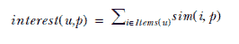

这里，*Items(u)* 返回用户已与之互动的所有物品（喜欢、观看、购买、点击）。返回的值可用于对所有尚未看到的物品进行排名，并将前 k 个推荐给用户。以下列表实现了最后一步：为这种第三种场景提供推荐。

列表 4.15 获取用户物品排名列表的代码

```
def recommendTo(self, user_id, k):                 ❶
    dtype = [('movieId', 'U10'), ('value', 'f4')]
    top_movies = np.array([], dtype=dtype)
    query = """                                    ❷
        MATCH (user:User)
        WHERE user.userId = $userId
        WITH user
        MATCH (targetMovie:Movie)
        WHERE NOT EXISTS((user)-[]->(targetMovie))
        WITH targetMovie, user
        MATCH (user:User)-[]->(movie:Movie)-[r:SIMILAR_TO]->(targetMovie)
        RETURN targetMovie.movieId as movieId, sum(r.weight)/count(r) as 
        ➥ relevance
        order by relevance desc
        LIMIT %s
    """
    with self._driver.session() as session:
        tx = session.begin_transaction()
        for result in tx.run(query % (k), {"userId": user_id}):
            top_movies = np.concatenate((top_movies, np.array([(result["movieId"], result["relevance"])], dtype=dtype)))

    return top_movies
```

❶ 此函数向用户提供推荐。

❷ 此查询返回推荐；它需要之前构建的模型。

当你运行这段代码时，你会注意到它运行得很快。当模型创建后，提供推荐只需几毫秒。

还可以使用其他方法，但它们超出了本章和本书的范围。这里的主要目的是展示，当你为物品、用户及其交互定义了适当的模型后，你可以使用多种方法来提供推荐，而无需更改定义的基本图模型。

练习

重新编写计算物品之间相似度的方法，使用与余弦相似度不同的函数，例如 Jaccard 指数([`mng.bz/qePA`](http://mng.bz/qePA))、Dice 系数或欧几里得距离([`mng.bz/7jmm`](http://mng.bz/7jmm))。

## 4.4 图方法的优势

在本章中，我们讨论了如何使用图和图模型创建 CBRS，用于存储在推荐过程的不同步骤中作为输入和输出的不同类型的信息。特别是，基于图的内容推荐方法的主要方面和优势是

+   有意义的信息必须作为唯一的节点实体存储在图中，以便这些实体可以在物品和用户之间共享。

+   当元信息可用且有意义时，将用户-物品数据转换为用户-特征数据是一项简单的任务；你需要一个查询来计算和实现它。

+   从同一个图模型中可以提取物品和用户配置文件的好几个向量表示。轻松提取多种类型的向量可以改善特征选择，因为它减少了尝试不同方法所需的努力。

+   使用不同的函数计算不同的相似度值，并将它们组合使用是可能的。

+   代码展示了在不同模型之间切换或甚至将它们结合起来的简便性，前提是它们由适当的图模型描述。

最大的优势是信息图表示的灵活性，它使得相同的数据模型可以通过小的调整服务于许多用例和场景。此外，所有场景都可以存在于同一个数据库中，这使数据科学家和数据工程师免于处理相同信息的多个表示。以下章节中描述的所有推荐方法都共享这些优势。

## 摘要

本章向您介绍了基于图的建模技术。在本主题的第一章中，我们专注于推荐引擎，探讨了如何建模用于训练的数据源，如何存储生成的模型，以及如何访问它以进行预测。

在本章中，你学习了

+   如何设计用于用户-物品以及用户-特征数据集的图模型

+   如何将数据从原始格式导入到您设计的图模型中

+   如何将用户配置文件和物品数据以及元数据投影到向量空间模型中

+   如何通过余弦相似度和其他函数计算用户和项目配置文件之间的相似度以及项目对之间的相似度

+   如何在图模型中存储项目相似度

+   如何查询生成的模型以执行预测和推荐

+   如何从头到尾设计和实现一个由图驱动的推荐引擎，使用不同复杂度的方法

+   k-NN 和 k-NN 网络在机器学习（一般）和基于图机器学习中的作用

## 参考文献

[Allan, 1998] Allan, James. “主题检测与跟踪试点研究最终报告。” *DARPA 广播新闻转录和理解研讨会论文集* (1998): 194-218.

[Deshpande and Karypis, 2004] Deshpande, Mukund, 和 George Karypis. “基于项目的 Top-*N*推荐算法。” *ACM 信息系统交易* 22:1 (2004): 143-177\. DOI: [`mng.bz/jB6x`](http://mng.bz/jB6x).

[Dice, 1945] Dice, Lee Raymond. “物种之间生态关联量的度量。” *生态学* 26:3 (1945): 297-302\. DOI: [`mng.bz/9N8l`](http://mng.bz/9N8l). JSTOR 1932409.

[Jannach et al., 2010] Jannach, Dietmar, Markus Zanker, Alexander Felfernig, 和 Gerhard Friedrich. *推荐系统：导论*. 英国剑桥：剑桥大学出版社，2010 年\. DOI: [`mng.bz/K4dK`](http://mng.bz/K4dK).

[Sarwar et al., 2001] Sarwar, Badrul, George Karypis, Joseph Konstan, 和 John Riedl. “基于项目的协同过滤推荐算法。” *第 10 届国际万维网会议论文集* (2001): 285-295\. [`mng.bz/Wrm0`](http://mng.bz/Wrm0).

[Ullman and Rajaraman, 2011], Ullman, Jeffrey David, 和 Anand Rajaraman. *大规模数据集挖掘*. 纽约：剑桥大学出版社，2011 年。

***

^（1）IMDb (https://www.imdb.com) 是一个包含与电影、电视节目、家庭录像、视频游戏和互联网流相关的信息的在线数据库，包括演员和制作团队、剧情简介、趣味知识和粉丝评论和评分的详细信息。

^（2）第二章中引入的属性图将数据组织为节点、关系和属性（存储在节点或关系上的数据）。

^（3）请使用 MATCH (n) DETACH DELETE n.整理您的数据库。

^（4）此查询只能在用户评分导入完成后执行，如列表 4.9 所示。

^（5）平均评分不是一个有价值的特征，但在我们的例子中它将起到作用。

^（6）*点赞*在这里意味着用户和项目之间的任何互动：观看、评分等。

^（7）[`neo4j.com/product/graph-data-science-library/`](https://neo4j.com/product/graph-data-science-library/).
