# 5 协同过滤

本章涵盖

+   为协同过滤方法设计合适的图模型

+   将现有的（非图）数据集导入为图模型设计

+   实现工作协同过滤推荐引擎

第四章中描述的基于内容的（也称为内容过滤或认知）推荐方法为用户和项目创建档案以描述它们。这些档案允许系统将用户与相关项目匹配。基于内容方法的一般原则是识别用户对获得正面反馈（如好评、购买、点击）的项目共有的特征，然后向该用户推荐具有这些特征的新项目。基于内容策略需要收集可能不易获得、难以收集或与内容直接相关的信息。

内容过滤的替代方案仅依赖于过去用户的行为，例如之前的交易或项目评分，或现有用户社区的意见，以预测用户最可能喜欢或感兴趣的项目，而无需根据项目特征为项目和用户创建显式的档案。这种方法被称为*协同过滤*，是由 Tapestry 的开发者（Goldberg 等人，1992 年）提出的，是第一个推荐系统。协同过滤分析用户之间的关系和项目之间的相互依赖性，以预测新的用户-项目关联。图 5.1 表示了考虑输入和输出的协同过滤推荐者的心智模型。

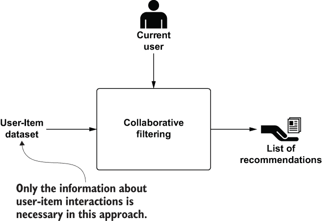

图 5.1 协同过滤心智模型

协同过滤的一个主要吸引力是它不受领域限制，并且不需要任何关于项目的详细信息。它可以应用于广泛的用例和场景，并且可以使用内容过滤难以描述的数据方面来解决问题。

尽管基于协同过滤的方法通常比基于内容的技术更准确，但由于其无法为新项目或用户或当有限交互数据可用时提供合理的（从准确性角度）推荐，因此协同过滤受到所谓的*冷启动问题*的影响。尽管如此，确实存在一些机制，通过使用不同的算法（如第 5.5 节中讨论的图方法）或其他知识来源（如社交网络）来减轻冷启动问题的影响。

协同过滤技术通常分为两种主要方法或领域：

+   *基于记忆的*—基于记忆的方法假设如果用户喜欢电影《拯救大兵瑞恩》，他们可能喜欢类似的电影，例如战争电影、斯皮尔伯格的电影和汤姆·汉克斯的电影 [Koren 等人，2009]。为了预测特定用户对《拯救大兵瑞恩》的评分，我们会寻找这位用户评价过的与这部电影最接近的邻居电影。或者，算法可以根据他们观看的电影集合寻找类似用户，并推荐当前用户尚未观看的内容。在这些方法中，存储的 User-Item 数据集直接用于预测物品的评分。

这些方法也被称为 *邻域方法*，因为它们集中在计算物品或用户之间的关系。*物品导向*的方法基于同一用户对邻近物品的评分来预测用户对物品的偏好。一个物品的邻居是那些在相同用户评分下倾向于获得相似评分的其他物品。相比之下，*用户导向*的方法识别出有共同观点的用户，他们可以互补彼此的评分。换句话说，在这种情况下，推荐过程包括寻找与当前用户相似的其他用户（对物品有相似的评分或购买了相同的东西），并推荐这些用户互动过的物品（评分、购买或点击）。

+   *基于模型的方法*—这些方法为用户和物品创建模型，通过一系列因素或特征以及这些特征对每个物品和每个用户的权重来描述他们的行为。在电影示例中，发现的因素可能衡量明显的维度，如类型（喜剧、剧情、动作）或对儿童的态度；不太明确的维度，如人物发展的深度或古怪性；或不可解释的维度。对于用户来说，每个因素都表达了用户对在相应因素上得分高的电影的喜爱程度。在这些方法中，原始数据（User-Item 数据集）首先在离线状态下进行处理，使用评分或之前的购买信息来创建这个预测模型。在运行时，在推荐过程中，只需要预先计算或学习到的模型来做出预测。潜在因素模型是这类方法中最常见的途径。它们试图通过在从评分模式中推断出的 20 到 100 个因素上对物品和用户进行特征化来解释评分。从某种意义上说，这些因素构成了计算机化的替代品，替代了在基于内容的推荐系统中遇到的人类创建的特征。

注意：尽管最近的调查表明，在预测评分的任务中，基于模型的方法在性能上优于基于邻域的方法 [Koren，2008，以及 Takács 等人，2007]，但一个理解正在出现，即仅仅好的预测精度并不能保证用户获得有效和满意的体验 [Herlocker 等人，2004]。

如第二部分引言所述，公司实施推荐引擎的一些主要原因是为了提高用户满意度和忠诚度，以及销售更多样化的商品。此外，向用户推荐他们最喜欢的导演执导的电影，如果用户之前不知道这部电影，则构成一种新颖的推荐，但用户可能自己会发现这部电影[Ning 等人，2015 年]。

此例展示了另一个被认定为在用户对推荐系统欣赏中扮演重要角色的相关因素：意外发现[Herlocker 等人，2004 年，以及 Sarwar 等人，2001 年]。意外发现通过帮助用户找到他们可能否则不会发现的有趣项目，扩展了新颖性的概念。这一方面的推荐增加了用户满意度，并帮助公司销售更多样化的商品。

这个例子说明了基于模型的方法在表征具有潜在因素的用户偏好方面的优势。在电影推荐系统中，这些方法可能确定某个用户是既搞笑又浪漫电影的粉丝，而无需定义“搞笑”和“浪漫”这些概念。因此，该系统将能够向用户推荐他们可能未曾知晓的浪漫喜剧。在预测准确度方面，这种方法可以提供最佳结果，但系统可能难以推荐一个与这种高级类型（如恐怖电影的搞笑模仿）不太吻合的电影。

另一方面，基于邻域的方法捕捉数据中的局部关联。因此，基于这种类型的方法的电影推荐系统可能会推荐一部与用户通常口味截然不同的电影，或者如果他们的一个最近邻（用户）给出了强烈的评分，可能会推荐一部不太知名的电影（如保留剧目电影）。这种推荐可能不会像浪漫喜剧那样保证成功，但它可能帮助用户发现一个新类型，或者一个新喜爱的演员或导演。基于邻域的方法具有许多优点，如下所述：

+   *简单性*——基于邻域的方法直观且相对容易实现。在其最简单形式中，只需要调整一个参数（用于预测中使用的邻居数量）。另一方面，基于模型的方法通常使用矩阵分解技术，这些技术通过优化算法实现以找到近似最优解。这些优化技术，如随机梯度下降¹（SGD）和交替最小二乘²（ALS），具有许多必须仔细调整的超参数，以避免陷入局部最小值。

+   *可解释性*——这些方法为计算出的预测提供了简洁直观的解释。在基于项目的推荐中，可以展示给用户邻近项目的列表以及用户对这些项目的评分，作为推荐的解释。这种解释可以帮助用户更好地理解推荐过程以及相关性是如何计算的，从而增加用户对推荐系统（及其提供平台）的信任。它还可以作为用户在选择在推荐中给予更大重要性的邻居时的交互式系统的基础 [Bell et al., 2007]。

+   *效率*——基于邻域的系统的一个显著优点是它们的效率。与大多数基于模型的系统相比，它们需要的昂贵训练阶段更少，这些阶段在大规模商业应用中需要频繁进行。这些系统可能需要在离线步骤中预先计算最近邻，但通常比基于模型的方法的模型训练便宜得多。此外，当有新信息可用时，可以识别出需要重新计算的小部分模型。这些特性有助于提供几乎瞬时的推荐。此外，存储这些最近邻需要很少的内存，使得这种方法可以扩展到拥有数百万用户和项目的应用。

+   *稳定性*——基于这种方法的推荐系统另一个有用的特性是，它们受到用户、项目和评分增加的影响很小，这在大型商业应用中通常观察到。当计算了项目相似度后，基于项目的系统可以轻松地向新用户推荐，而无需重新训练。此外，当为新项目输入少量评分时，只需计算此项目与系统中已有的项目之间的相似度。

+   *基于图的*——另一个与本书主题相关的重要优势是，原始数据集和最近邻模型可以轻松地映射到图模型中。由此产生的图在模型更新或预测期间的数据局部导航、可解释性和访问效率方面提供了巨大优势。它还有助于解决第 5.5 节中描述的冷启动问题。

由于这些优势，本章主要关注这类协同过滤推荐系统。尽管基于邻居的方法因其优势而受到欢迎，但它们也普遍存在覆盖范围有限的问题，导致某些商品从未被推荐。此外，该类传统方法也普遍对评分稀疏性和系统只有少量评分或对新用户和商品没有评分时的冷启动问题敏感。在第 5.5 节中，我将讨论缓解或解决冷启动问题的技术。最后，没有单一的推荐引擎方法可以适用于所有情况，这就是为什么在可投入生产的推荐引擎系统中通常使用混合方法。这些方法在第七章中进行了描述。

## 5.1 协同过滤推荐

在本节中，你将学习如何设计图模型及其算法，以实现一个用于电子商务网站的推荐系统，该系统采用协同过滤方法，温和地向用户推荐可能对他们感兴趣的商品。

该网站可能销售许多类型的商品，例如书籍、电脑、手表和服装。关于每个商品的详细信息未经精心整理；有些商品只有标题、一张或多张图片以及一小段无用的描述。供应商没有提供大量信息，由于商品数量和供应商数量众多，因此不可能有一个内部团队大规模地处理这项任务。³ 在网站上，用户只有在注册并登录后才能购买商品。多亏了 cookies，用户一旦到达网站就可以自动登录。关于每个用户的信息跟踪很少——只有支付和运输所必需的信息。

在这种情况下，类似于第四章中描述的内容方法不适用。通常，没有可用于创建用户或商品档案的有用数据。尽管如此，用户的活跃度是会被跟踪的。大多数时候用户都是登录状态，可以收集和存储用户与商品之间的大量互动（购买、点击、搜索和评分）。协同过滤方法使用这些数据向用户提供推荐。利用图模型的优势，整个推荐过程可以用图 5.2 中的高级架构进行总结。

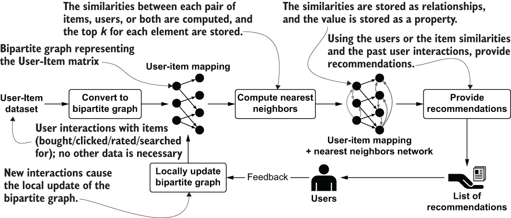

图 5.2：由图驱动的协同过滤推荐系统

此图展示了协同过滤推荐引擎的主要元素和任务，该引擎使用图作为用户-项目数据集和最近邻网络的表示。假设用户约翰从电子商务网站购买了两种书籍：关于机器学习和图的科技书籍。作为第一步，用户-项目矩阵被转换为一个二分图。在这种情况下，代表约翰的节点将与代表购买的两本书的两个节点相连。生成的图被用作输入，通过计算用户、项目或两者的相似性来创建最近邻网络，具体取决于所使用的推荐算法。因此，约翰与对图和机器学习感兴趣且购买了相同书籍集的用户相似。这两本书也与被同一组用户购买的其它书籍相似，可能是在同一主题下。然后，将每个元素（用户或项目）的前 k 个最近邻存储回原始图，该图通过这些新的用户、项目或两者之间的关系得到丰富。相似度值作为关系的属性存储，并为其分配权重。这个权重值越高，通过这种关系用户之间的相似度就越高。此时为用户提供推荐是一个使用他们之前交互和最近邻网络的问题。这个任务可以通过简单的图匹配查询来完成。然后，将推荐列表提供给用户。

进一步的交互可以被循环回系统中以更新模型。这个任务可以利用图模型提供的局部性；新的交互只会影响最近邻网络的一小部分。如果一个用户观看了一部新电影，将很容易找到受影响的电影（所有至少与受影响的用户共享一个用户的电影），并计算它们的新的相似度。这种方法还允许推荐引擎更容易地适应口味的变化。基于关系遍历的图导航也有助于这些更新以及推荐阶段。

考虑到高级架构，它也充当一个心理模型，以下章节将详细描述如何创建和导航一个二分图，如何计算最近邻网络，以及如何提供推荐。在这个场景中，使用一个具体的电子商务数据集作为示例。

## 5.2 创建用户-项目数据集的二分图

在第四章讨论的内容导向方法中，物品和用户都有大量可用信息，这些信息对于创建个人资料非常有用。我们使用图模型来表示这些个人资料，将每个物品与其特征连接，并将每个用户与其感兴趣的特征连接。甚至最近的邻域网络也是仅用这些信息构建的。另一方面，协同过滤方法依赖于用户和物品之间不同类型交互的数据。这类信息通常被称为*用户-物品数据集*。第三章中描述了一个此类数据集的例子；在这里，讨论得到了扩展和细化。图 5.3 突出了在推荐过程中从用户-物品数据集中创建二分图的过程。

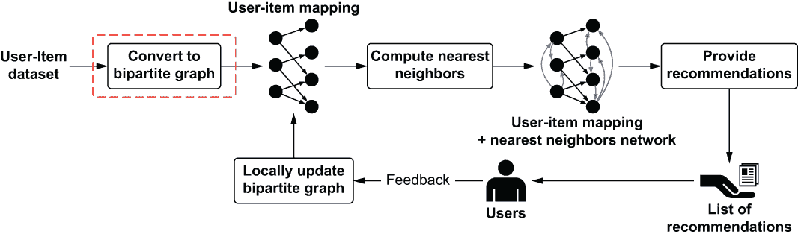

图 5.3 推荐过程中的二分图创建

表 5.1 展示了示例数据集。物品是不同用户购买的书。

表 5.1 电子商务场景的示例用户-物品数据集

|  | Fluent Python | Machine Learning: A Probabilistic Perspective | Graph Analysis and Visualization | Bayesian Reasoning | Fraud Analytics | Deep Learning |
| --- | --- | --- | --- | --- | --- | --- |
| **用户 A** | 1 | 1 | 1 | 1 | 1 | 1 |
| **用户 B** | 0 | 1 | 0 | 0 | 0 | 1 |
| **用户 C** | 1 | 0 | 0 | 0 | 0 | 0 |
| **用户 D** | 0 | 1 | 0 | 1 | 0 | 1 |

此表只包含关于一种类型交互的数据：购买。在不同的场景中，包括电子商务网站，有多种类型的交互可用（查看、点击、评分等），并且可以在推荐过程中使用。*多模态*推荐系统[da Costa and Manzato, 2014]结合多种交互类型来提供推荐。其中最好的方法之一是为每种交互类型创建一个独立的推荐系统，然后将这些交互在混合推荐系统中结合。因为这里的重点是协同过滤的数据建模和算法，我们将关注单一类型，但扩展到更多类型的讨论将在第 7.2 节中展开。

用户-物品数据集（在现实生活中将比这里展示的样本大得多）代表了协同过滤中推荐过程的输入。这些初始数据很容易获得。以下是一些例子：

+   在线商家会记录哪些客户购买了哪些产品，有时还会记录他们是否喜欢这些产品。

+   超市连锁店通常通过使用奖励卡来记录其常客的购买记录。

人们对于某些零售商销售的产品等事物的偏好可以用推荐网络中的图来表示[Newman, 2010]，并在推荐系统中使用。推荐网络的基本和最常见表示是二分图或双图。我们在第三章中讨论了这些图。图 5.4 展示了一个简单的、通用的二分图，其中节点是类型 U 或 V。

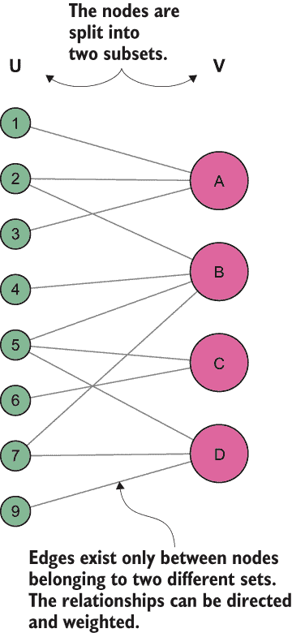

图 5.4 一个通用的二分图

让我们将这个简单的概念应用到我们的场景中，以及使用协同过滤方法的推荐系统中。在推荐网络中，一种顶点类型代表产品（或一般的项目），另一种类型代表用户。边连接用户与他们互动的项目（例如购买或喜欢）。也可以在边上表示强度或权重，以指示一个人购买某个项目的频率或他们有多喜欢它 [Newman, 2010]。

使用这个模型，可以将二分图中的用户-项目数据集转换。从我们表 5.1 中的简单电子商务网站数据集，可以创建图 5.5 中的图。

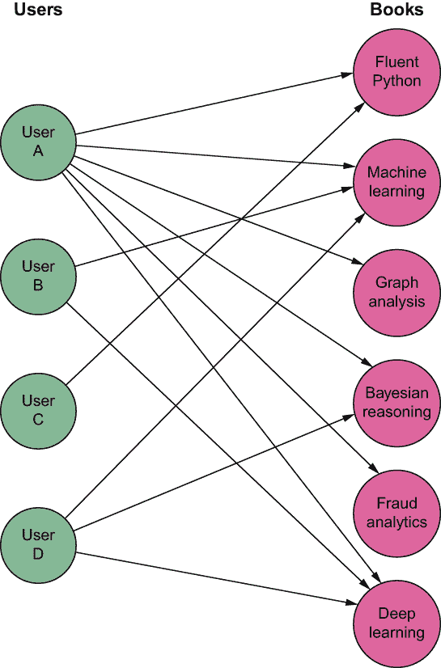

图 5.5 表示表 5.1 的二分图

尽管二分图可以表示整个推荐网络，但通常处理仅一种类型顶点之间的直接连接既方便又有用。从一个二分图中，可以推断出相同类型节点之间的连接，创建一个单模式投影。对于每个二分图可以生成两个投影。第一个投影连接 U 节点（用户），第二个连接 V 节点（书籍）。图 5.6 显示了从图 5.5 中的二分图计算出的两个投影。

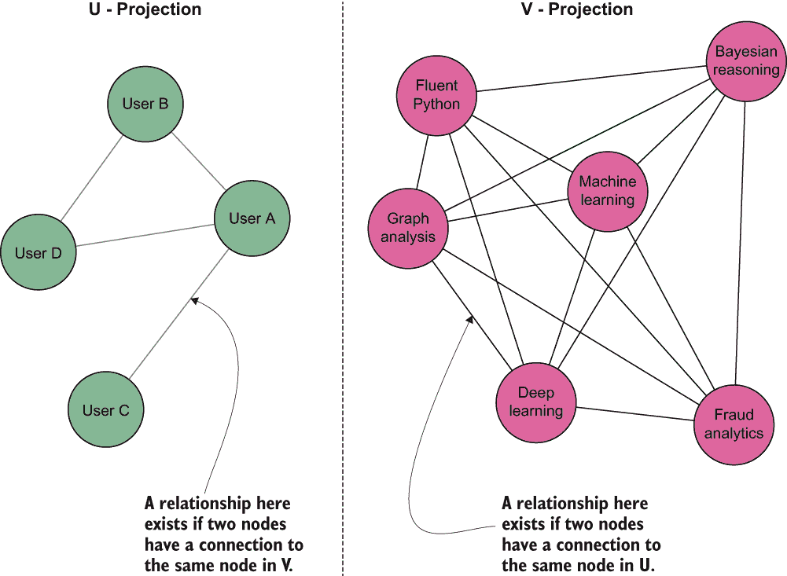

图 5.6 图 5.5 中的图的两个可能的投影

二分图的投影显示了做出相同购买的用户之间的关系，即使只有一次，以及被相同用户购买的书籍之间的关系，即使只有一次。这种单模式投影通常很有用且被广泛采用，但它的构建隐藏了原始二分图中的大量信息，因此在表示方面在某种程度上较弱。在项目和用户的情况下，它没有显示有多少用户购买了这两件商品。为了解决这个问题，可以在关系上添加一个属性，其值捕获这些信息，使这种投影加权。这种投影是一个共现网络（在第三章中描述），其来源是二分图。在用户-项目矩阵中，如果两个项目至少在一个用户的偏好中同时出现，它们在 V 模式投影中连接。

双边图的加权和无权投影以一种方式表示数据，这使得我们比使用原始格式更容易进行某些分析。因此，投影在推荐系统中被广泛使用 [Grujic´, 2008]。通常，在这些网络上执行图聚类分析（在第三部分讨论），以揭示通常一起购买的项目组，或者在另一个投影中，根据对某些特定项目集合的偏好来识别客户细分。投影也是强大的可视化技术，可以揭示在原始格式中难以发现或识别的模式。

回顾一下，用户-项目数据集的图模型，特别是双边图表示，的优势是

+   它以紧凑直观的方式表示数据。用户-项目数据集在本质上稀疏；通常，它有大量的用户和大量的项目，而用户只与可用项目的一小部分进行交互。表示这种交互的矩阵将包含大量的零和很少的有用值。图只包含表示有意义信息的关联。

+   从双边图派生出的投影信息丰富，允许进行不同类型的分析，包括图形分析（在可视化后）和通过算法（例如图聚类）。如客户细分和项目聚类等分析可以为本节讨论的经典推荐算法提供有价值的支持。

+   可以通过建模具有相同顶点集但使用不同边的多个双边图来扩展表示。这种扩展有助于我们表示作为多模态推荐引擎输入的数据。这些引擎使用多种类型的交互来提供更好的推荐。

+   如第 5.3 节所述，当计算最近邻网络时，它可以存储，共享双边图的用户和项目节点。这种方法通过提供一个包含用户偏好和最近邻网络的单个数据结构来简化推荐阶段。

现在你已经了解了描述用户-项目数据集的图模型，让我们来实际操作，创建一个真实的数据库。以下列表，类似于用于基于内容场景的列表，从 Retail Rocket⁴数据集([`retailrocket.net`](https://retailrocket.net))导入数据，将用户-项目矩阵转换为双边图。

列表 5.1 导入用户-项目数据集的代码

```
def import_user_item(self, file):
    with open(file, 'r+') as in_file:
        reader = csv.reader(in_file, delimiter=',')
        next(reader, None)
        with self._driver.session() as session:
            self.executeNoException(session, "CREATE CONSTRAINT ON (u:User) 
            ➥ ASSERT u.userId IS UNIQUE")                                 ❶
            self.executeNoException(session, "CREATE CONSTRAINT ON (u:Item) 
            ➥ ASSERT u.itemId IS UNIQUE")                                 ❶

            tx = session.begin_transaction()
            i = 0
            j = 0
            query = """ ❷
                MERGE (item:Item {itemId: $itemId})
                MERGE (user:User {userId: $userId})
                CREATE (user)-[:PURCHASES{ timestamp: $timestamp}]->(item)
            """
            for row in reader:
                try:
                    if row:
                        timestamp = strip(row[0])
                        user_id = strip(row[1])
                        event_type = strip(row[2])
                        item_id = strip(row[3])

                        if event_type == "transaction":                    ❸
                            tx.run(query, {"itemId":item_id, "userId": 
                            ➥ user_id,  "timestamp": timestamp})
                            i += 1
                            j += 1
                            if i == 1000:
                                tx.commit()
                                print(j, "lines processed")
                                i = 0
                                tx = session.begin_transaction()
                except Exception as e:
                    print(e, row, reader.line_num)
            tx.commit()
            print(j, "lines processed")
```

❶ 创建约束以防止重复。每个用户和项目必须是唯一的

❷ 查询使用 MERGE 在用户或项目不存在时创建它们。存储购买关系的 CREATE 存储每个购买的关联。

❸ 数据集包含多种事件类型（查看、添加到购物车等）。我们在这里只考虑完成的交易或实际购买。

导入完成后，这可能需要几秒钟，可以运行以下查询并可视化图形的一部分：

```
MATCH p=()-[r:PURCHASES]->() RETURN p LIMIT 25
```

从二分模型创建的图代表下一阶段的入口点，如图 5.2 中的过程心理模型所述。第 5.3 节描述了如何计算和存储最近邻网络。

练习

使用新创建的数据库，运行查询以执行以下操作：

+   寻找最佳卖家（购买次数最多的项目）。

+   寻找最佳买家（购买次数最多的用户）。

+   寻找重复购买（同一用户购买多次的项目）。

## 5.3 计算最近邻网络

推荐过程中的下一个任务是计算元素之间的相似性——用户或项目或两者——并构建最近邻网络。图 5.7 突出了在推荐过程中构建最近邻网络作为二分图的丰富化。

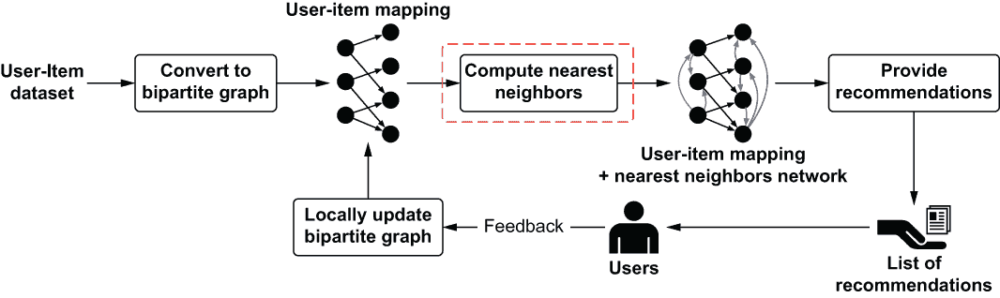

图 5.7 在推荐过程中计算最近邻网络

如前所述，基于内存的协同过滤推荐有两种可能的方法：

+   *基于项目*——相似性是基于与项目交互的用户计算的。

+   *基于用户*——相似性是基于用户与之交互的项目列表计算的。

重要的一点是，与基于内容的案例不同，在邻域方法中，用于计算相似性的信息仅与用户-项目数据集中可用的交互有关。每个项目和每个用户只能通过 ID（或一个没有任何相关属性与标识符不同的节点）来识别。这种方法的优势在于，即使没有关于项目和用户的详细信息，也可以创建模型。尽管如此，相似性计算的程序与基于内容的相同：

1.  识别/选择一个允许您计算图中同质元素之间距离的相似性函数（例如，用户或项目）。

1.  以适合所选相似性函数的方式表示每个元素。

1.  计算相似性，并将它们存储在图中。

图模型具有极大的灵活性，使我们能够轻松地提取用户或项目在各种函数选择下的各种表示。为了简单起见，并且因为它最适合我们的示例场景，我们再次使用余弦相似度。⁵ 不同之处在于如何在向量空间模型（VSM）中提取用于计算的向量。考虑一个简单的二分图，它表示一个更大的用户-项目数据集的简化版本，如图 5.8 所示。


图 5.8 表示缩小的用户-项目数据集的二分图

根据我们需要计算的相似度（用户之间的或项目之间的），可以从这个图中提取出两种向量表示。在这种情况下，向量创建过程与基于内容的近似方法基本相同。在那个例子中，为每个项目创建一个向量，考虑可能描述它的特征集。在这个例子中，对于每个项目，我们考虑对它感兴趣的用户集，同时考虑用户过去喜欢的项目。以下表格显示了如何完成这项任务。根据我们需要计算的相似度（用户之间的或项目之间的），可以从这个图中提取出两种向量表示。在这种情况下，向量创建过程与基于内容的近似方法基本相同。在这个例子中，对于每个项目，我们考虑对它感兴趣的用户集，同时考虑用户过去喜欢的项目。表 5.2 和 5.3 显示了如何完成这项任务。

表 5.2 图 5.8 中的用户向量表

|  | 流畅的 Python | 概率视角下的机器学习 | 图分析及可视化 | 贝叶斯推理 | 欺诈分析 | 深度学习 |
| --- | --- | --- | --- | --- | --- | --- |
| **用户 A** | 1 | 1 | 1 | 1 | 1 | 1 |
| **用户 B** | 0 | 1 | 0 | 0 | 0 | 1 |
| **用户 C** | 1 | 0 | 0 | 0 | 0 | 0 |
| **用户 D** | 0 | 1 | 0 | 1 | 0 | 1 |

在表 5.2 中，每一行代表一个用户，每一列代表一个项目（一本书）。在向量创建过程中，列的顺序必须始终相同；否则，两个向量无法比较。在这个例子中，向量是二进制或布尔型的：我们不是考虑用户和项目之间关系的*值*，只是它们存在的事实。这样的值可以模拟用户分配给书籍的评分、用户点击产品的次数等等，并在图模型中作为关系的属性表示。迁移到非二进制表示需要将 1 替换为用户和项目之间关系的实际权重值。

在 4.1 节中，我们看到了在相同的向量构造中混合二进制值与实数（整数、浮点数和双精度浮点数）是可能的。当我们需要为每个项目创建一个表示更多关系类型的向量时，这种方法很有用，例如在多模态推荐中。为了简化，这里没有考虑这种情况。

从表 5.2 中，我们可以提取出 VSM 中用户的以下压缩表示：

*向量(用户 A)* = [1, 1, 1, 1, 1, 1]

*向量(用户 B)* = [0, 1, 0, 0, 0, 1]

*向量(用户 C)* = [1, 0, 0, 0, 0, 0]

*向量(用户 D)* = [0, 1, 0, 1, 0, 1]

表 5.3 显示了项目向量。

表 5.3 项目向量表

|  | 用户 A | 用户 B | 用户 C | 用户 D |
| --- | --- | --- | --- | --- |
| 流畅的 Python | 1 | 0 | 1 | 0 |
| 概率视角下的机器学习 | 1 | 1 | 0 | 1 |
| 图分析与可视化 | 1 | 0 | 0 | 0 |
| 贝叶斯推理 | 1 | 0 | 0 | 1 |
| 欺诈分析 | 1 | 0 | 0 | 0 |
| 深度学习 | 1 | 1 | 0 | 1 |

此表采用与项目相同的方法。在这种情况下，每一行是一个项目，每一列代表不同的用户。在这里，列的顺序也很重要。结果向量表示看起来像这样：

*向量（流畅的 Python）* = [1, 0, 1, 0]

*向量（机器学习）* = [1, 1, 0, 1]

*向量（图分析）* = [1, 0, 0, 0]

*向量（贝叶斯推理）* = [1, 0, 0, 1]

*向量（欺诈分析）* = [1, 0, 0, 0]

*向量（深度学习）* = [1, 1, 0, 1]

在这两种情况下，都可以通过查询轻松地从图数据库中提取这些向量。这个例子再次表明，图不仅是一个适当的数据表示模型，可以以易于访问和导航的格式保持复杂数据，而且还提供了灵活性，可以以适合不同学习过程的数据格式导出数据。类似的模型可以同时为基于内容和邻域的方法提供数据，而且这些方法甚至可以在同一图中共存。而我们只是刚开始揭示图的力量！

在我们检查向量查询本身之前，让我们快速看一下一些可以帮助您在数据提取和处理方式上获得显著提升的考虑因素。以内存高效的方式表示向量和有效地访问它们的值是重要的机器学习任务。向量表示的最佳方法根据向量的性质及其使用方式而有所不同。在基于内容的场景中，项目向量的创建依赖于少量可能的向量维度。向量的稀疏性或密集性是最重要的考虑因素。图 5.9 显示了每种类型向量的示例。


图 5.9 密集和稀疏向量的示例（带有随机值）

如果您还记得我们关于基于预定义特征创建电影向量的讨论，可能的特征数量相对有限。考虑到所有可能的演员和导演以及所有类型等，特征的数量不会超过 10,000 或 20,000。使用文本创建向量也是如此。在这种情况下，向量的尺寸由语言词汇量或语言中使用的单词数量定义。尽管与向量的维度性相比非零值的数量较小，但总体而言，向量是小的。

与其大小相比，具有相对较多非零值的向量被称为*密集向量*。这样的向量可以通过存储在双精度浮点数组中的实现来表示。向量索引直接对应于数组索引。密集向量的优势在于速度：由于是数组支持的，因此快速访问和更新其任何值。

在光谱的另一端，一个典型的电子商务网站包含超过 100 万件商品，并且（对他们来说理想的情况）有数量相同级别的用户。每个用户，即使是患有强迫性在线购物症候群的用户（像我一样对书籍），也只能购买整体可能商品的一小部分。另一方面，每个商品——即使是畅销书——也只被相对较少的用户购买，因此相应向量中的非零值总数始终很小。这种总非零值百分比小的向量被称为*稀疏向量*。使用数组表示稀疏向量不仅浪费内存，而且使任何计算都变得昂贵。

可以用不同的方式表示稀疏向量以优化内存并简化操作。在 Java 中，Apache Mahout 提供了一些最常见的方法，⁶是一个用于创建可扩展高性能机器学习应用的分布式线性代数框架。对于相似度计算，我使用了一种不同的稀疏向量表示方法，该方法仍然使用浮点数或双精度浮点数数组作为基本数据结构。我首选的稀疏向量实现结构在图 5.10 中描述。

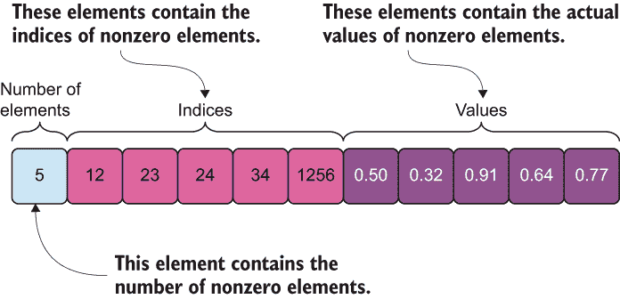

图 5.10 稀疏向量表示

图 5.10 展示了稀疏向量如何以紧凑的格式表示。第一个元素包含原始数组中非零值的数量。我们将它定义为 N。第二部分，从位置 1 开始（记住向量的索引从 0 开始）到位置 N 结束，包含非零值的索引。最后一部分，从 N+1 开始，一直延续到向量的末尾，包含实际的值。

这种表示方法的优势在于，使用单个小型数组，可以表示一个长而复杂的稀疏向量。这个数组需要的内存最小，并且可以轻松地作为节点的属性存储。当你需要处理大量数据时，这种优势是非常大的。我的个人 Java 实现可以在代码仓库的 ch05/java 目录中找到。

为了使本章内容保持一致，列表 5.2 包含了 Python 中稀疏向量的表示。在这种编程语言中，稀疏向量可以表示为一个字典，其中键是向量中元素的索引，值是有效的元素值。在这种情况下，非零元素的数量是字典的大小，使得表示足够简单。相关的代码可以在代码仓库的 util/sparse_vector.py 文件中找到。

列表 5.2 Python 中的稀疏向量实现

```
def convert_sparse_vector(numbers):    ❶
    vector_dict = {}
    for k, c in enumerate(numbers):    ❷
        if c:                          ❸
            vector_dict[k] = c
    return vector_dict

if __name__ == '__main__':
    print(convert_sparse_vector([1, 0, 0, 1, 0, 0])) #{0: 1, 3: 1}
    print(convert_sparse_vector([1, 1, 0, 0, 0, 0])) #{0: 1, 1: 1}
    print(convert_sparse_vector([1, 1, 0, 0, 0, 1])) #{0: 1, 1: 1, 5: 1}
```

❶ 从向量创建字典（稀疏向量）的函数

❷ 遍历向量，获取位置和值

❸ 检查值是否不为空或 0

对于使用稀疏向量而不是密集向量，没有真正的阈值需要考虑。通常，我更喜欢使用稀疏向量，因为它们优化了相似度计算。从现在起，本书中的大多数示例都将使用稀疏向量。

现在我们已经拥有了提取用户和项目向量以及计算它们之间相似度所需的所有元素。提取用户和项目每个向量非零元素的查询在接下来的两个列表中显示。

注意：在这些查询中，我们使用节点 ID 作为索引，但任何整数或长值都可以工作。我们可以使用任何识别项目的数字 ID，例如，如 itemId。

列表 5.3 查询提取用户稀疏向量

```
MATCH (u:User {userId: "121688"})-[:PURCHASES]->(i:Item)
return id(i) as index, 1 as value
order by index
```

列表 5.4 查询提取项目稀疏向量

```
MATCH (i:Item {itemId: "37029"})<-[:PURCHASES]-(u:User)
RETURN id(u) as index, 1 as value
ORDER BY index
```

在 MATCH 子句中，使用 PURCHASES 关系找到用户购买的所有项目或购买项目的所有用户。RETURN 子句提取结果向量的非零元素。因为没有值表示关系的权重，所以使用二进制方法，默认情况下，每个值分配为 1。

练习

将前面的查询更改为使用 itemId 和 userId 而不是节点 ID。

提示：考虑到查询存储为字符串，尽管它们是整数，并且记住我们需要一个数值作为索引。

下一步是计算和存储相似度。对于每个用户或项目，我们必须执行以下操作：

1.  计算与其他所有元素（均匀地：每个用户与其他用户以及每个项目与其他项目）的相似度。

1.  按降序排列相似度。

1.  仅保留前 k 个，其中 k 的值是预定义的。或者，设置一个阈值或最小相似度值，并仅保留高于该值的相似度。

1.  将前 k 个相似元素存储在图中作为用户或项目之间的新关系。

图 5.11 展示了推荐过程中的“计算最近邻”块，总结了前面的步骤序列。

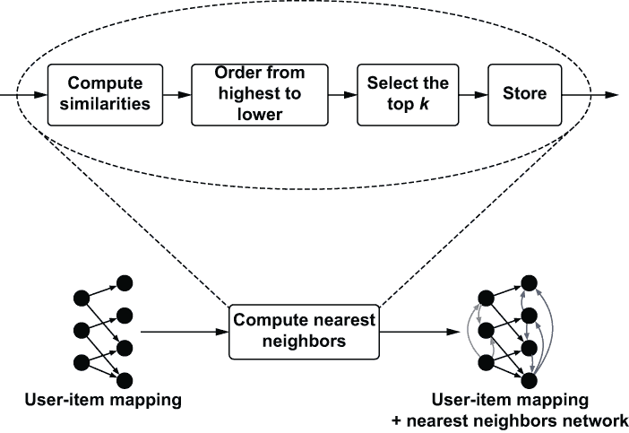

图 5.11 计算最近邻的细节

以下列表显示了此任务的 Python 实现，使用稀疏向量表示。代码位于 ch05/recommendation/collaborative_filtering/recommender.py 文件中。

列表 5.5 相似度计算

```
    label = "User"                                                        ❶
    property = "userId"                                                   ❶
    sparse_vector_query = """                                             ❷
        MATCH (u:User {userId: $id})-[:PURCHASES]->(i:Item)
        return id(i) as index, 1.0 as value
        order by index
    """

def compute_and_store_KNN(self, size: int) -> None:                       ❸
    print("fetching vectors")
    vectors = self.get_vectors()
    print(f"computing KNN for {len(vectors)} vectors")
    for i, (key, vector) in enumerate(vectors.items()):                   ❹
        # index only vectors
        vector = sorted(vector.keys())
        knn = FixedHeap(size)
        for (other_key, other_vector) in vectors.items():
            if key != other_key:
                # index only vectors
                other_vector = sorted(other_vector.keys())
                score = cosine_similarity(vector, other_vector)
                if score > 0:
                    knn.push(score, {"secondNode": other_key, "similarity":  
                    ➥ score})
        self.store_KNN(key, knn.items())
        if (i % 1000 == 0) and i > 0:
            print(f"{i} vectors processed...")
    print("KNN computation done")

def get_vectors(self) -> Dict:                                            ❺
    with self._driver.session() as session:
        tx = session.begin_transaction()
        ids = self.get_elements(tx)
        vectors = {id_: self.get_sparse_vector(tx, id_) for id_ in ids}
    return vectors

def get_elements(self, tx) -> List[str]:                                  ❻
    query = f"MATCH (u:{self.label}) RETURN u.{self.property} as id"
    result = tx.run(query).value()
    return result

def get_sparse_vector(self, tx: Transaction, current_id: str) -> Dict[int, 
➥ float]:                                                                ❼
    params = {"id": current_id}
    result = tx.run(self.sparse_vector_query, params)
    return dict(result.values())

def store_KNN(self, key: str, sims: List[Dict]) -> None:                  ❽
    deleteQuery = f"""                                                    ❾
        MATCH (n:{self.label})-[s:SIMILARITY]->()
        WHERE n.{self.property} = $id
        DELETE s"""

    query = f"""                                                          ❿
        MATCH (n:{self.label}) 
        WHERE n.{self.property} = $id 
        UNWIND $sims as sim
        MATCH (o:{self.label}) 
        WHERE o.{self.property} = sim.secondNode 
        CREATE (n)-[s:SIMILARITY {{ value: toFloat(sim.similarity) }}]->
        ➥ (o)"""

    with self._driver.session() as session:
        tx = session.begin_transaction()
        params = {
            "id": key,
            "sims": sims}
        tx.run(deleteQuery, params)
        tx.run(query, params)
        tx.commit()
```

❶ 为基于用户的相似度设置一些变量：节点的标签和具有元素 id 的属性。项目的变量在代码库中。

❷ 查询提取用户购买作为向量。每行返回的第一个元素是 itemId；第二个固定为 1，因为我们只对购买事件感兴趣，而不是比率或用户购买项目的次数。参见列表 5.3。

❸ 计算并存储所有用户相似度的入口点函数。更改变量，您将得到相同的项目结果。

❹ 遍历所有用户的稀疏向量字典，计算所有相似性，为每个节点保留 k 个最高值，并调用存储 k-NN 的函数

❺ 创建一个字典的函数，其中键是 userId，值是用户的稀疏向量

❻ 通过查询数据库返回元素（用户或物品）ID 的列表的函数

❼ 通过查询图数据库返回指定用户（或物品）的相关稀疏向量的函数

❽ 将 k-NN 存储到数据库中的函数

❾ 查询以删除节点的所有相似性

❿ 一次性存储所有相似性的查询

如前述代码所示，相似度计算需要执行 N × N 次计算，其中 N 是 |U| 或 |V|。当 N 较大时，此操作可能需要一段时间。

图 5.12 显示了当关系存储在图中时，结果图模型的外观。因为图较小，所以 k 值设置为 2。

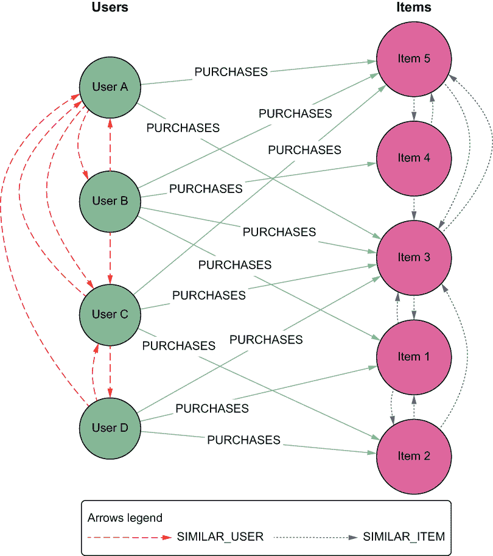

图 5.12 协同过滤的最终图模型

图 5.12 中的图不再是二分图，因为现在存在同一分区中元素之间的关系。但我们可以通过仅考虑节点和关系的子集来拥有同一图的多个子图，因此可以将图分为三个高度相关的子图：

+   以 U 和 I（U 代表所有用户，I 代表所有物品）为节点，并且只有购买关系的子图是我们之前提到的二分图。

+   以 U 为节点和相似性为关系的子图是 U 的最近邻网络（U 的 k-NN）。

+   以 I 为节点和相似性为关系的子图是 I 的最近邻网络（I 的 k-NN）。

在 5.4 节中，这些图被用作最后任务的输入，提供推荐，但重要的是要注意，这些图已经包含了很多信息。这个过程从二分图中提炼出新的知识，并以可以服务于除推荐之外多种目的的方式存储它。

+   *物品聚类*—通过在物品的最近邻网络上应用一些图聚类算法，可以识别（例如）通常一起购买的产品组或被同一组用户观看的电影。

+   *用户分割*—相同的聚类算法可以应用于用户的最近邻网络，结果将是一个用户组（*分割*），他们通常购买相同的产品或观看相同的电影。

+   *寻找相似产品*—物品的最近邻网络本身很有用。如果一个用户正在查看特定的产品，通过查询图，可以基于相似性关系显示一系列相似产品，并且这个操作将会很快。

图形方法不仅允许我们通过将信息存储在灵活的数据结构中来混合信息，而且还为我们提供了各种访问数据、揭示模式、提取知识和在统一数据环境中进行分析的机会。

建模技巧

本节和第四章中相应的部分描述了将不同类型的数据转换为图的技术。这些技术通常被称为*图构建技术*。在基于内容的情况下，数据由元数据和内容定义，例如演员、类型，甚至是电影的情节，而在协同过滤的情况下，数据是用户-物品矩阵。在这两种情况下，一个相似度函数和适当的数据转换为向量空间模型使我们能够创建一个比原始数据版本具有更多知识和更强沟通能力的图。

在机器学习的许多领域，图被用来模拟数据元素之间的局部关系，并从局部信息构建全局结构 [Silva and Zhao, 2016]。构建图有时是处理机器学习或数据挖掘应用中产生的问题所必需的，而在其他时候，它有助于管理数据。重要的是要注意，从原始数据到图数据表示的转换始终可以以无损的方式进行。反之则不然。因此，这里描述的技术和用例代表了如何执行这些图转换的具体示例；这些示例不仅适用于所描述的场景，而且也适用于许多实际用例。玩转你拥有的数据，并尝试将其转换为图。

到目前为止，我们一直使用余弦相似度作为计算相似性的基本函数。已经提出了其他度量标准——例如调整后的余弦相似度、斯皮尔曼秩相关系数、均方差异和皮尔逊系数——并且通常作为该函数的替代方案。具体来说，皮尔逊系数在基于用户的推荐中优于其他度量 [Herlocker et al., 1999]，而余弦相似度在基于物品的推荐中表现最佳。

在本书的这一部分，重点是数据建模，因此余弦相似度是参考函数。在本书的后面部分，当适用时，将描述其他解决方案。

练习

查询通过运行计算相似度的代码获得的图，以找到以下内容：

+   给定一个物品，相似物品列表

+   给定一个用户，相似用户列表

+   相似度的最高值（搜索数据库以了解原因）

## 5.4 提供推荐

推荐过程的最终任务是，在必要时或有价值时，向用户提供建议列表。图 5.13 突出了推荐过程中的推荐提供。

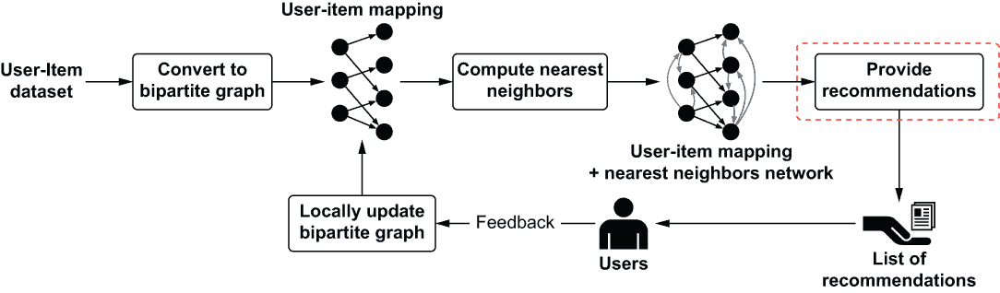

图 5.13 推荐过程的最后一步

在我们的场景中，当用户在电子商务网站上导航时，我们希望在某些框中提供针对该用户的定制化推荐。从高层次来看，推荐过程会产生以下类型的输出：

+   *相关性分数*——数值预测，表示当前用户对某个项目的喜好或厌恶程度。

+   *推荐*——一个包含 N 个推荐项目的列表。当然，这样的前 N 个列表不应包含当前用户已经购买的项目，除非这些购买是重复购买。

在协同过滤的邻域方法中，第一个输出——相关性分数——可以通过查看用户的最近邻网络（基于用户的方法）或项目的最近邻网络（基于项目的方法）来产生。让我们更详细地看看这两种方法。

基于用户的方法的基本思想是，给定当前用户作为输入，表示交互数据库的二元图和最近邻网络，对于用户尚未看到或购买的产品 p，基于同行用户（该用户最近邻网络中的用户）对 p 的评分进行预测。考虑图 5.14 中的图。

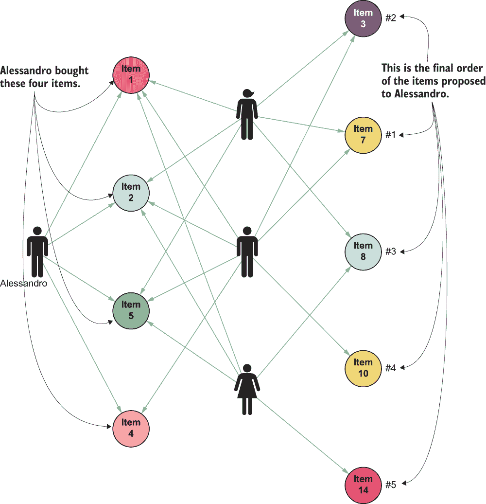

图 5.14 基于用户方法的协同过滤基本思想

亚历山德罗购买了左侧的四个产品。基于用户的方法的想法是找到也购买了这些产品的相似用户，然后找到他们购买但亚历山德罗尚未购买的其他产品。这类方法的潜在假设[Jannach, 等人，2010]是

+   如果两个用户在过去有相似的味道，他们将来也会有相似的味道。

+   用户的偏好随时间保持稳定和一致。

一些方法减轻了这些假设，但它们超出了我们考虑的场景的范围。

让我们将用文字和图像表达的想法转换为计算机可以理解的公式。可能有两种情况发生。在一种情况下，用户和项目之间的交互（点击、购买和查看）没有权重。这种情况称为*二元*或*布尔*模型。在第二种情况下，交互有权重（如评分）。这种情况的公式是

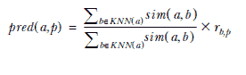

这个公式预测用户 a 会对项目 p 分配的评分。KNN(a)代表用户 a 的 k 个最近邻，r[b,p]代表用户 b 对产品 p 分配的评分。如果用户 b 没有对项目 p 进行评分，则该评分可以是 0。这个公式的某些变体存在，但它们超出了本章的范围。

布尔情况稍微复杂一些，因为在文献中，没有一种方法被公认为最佳方法。以下公式 [Sarwar et al., 2000] 在我看来是最合理的一个，并且在电子商务网站上得到了广泛应用：

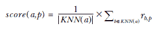

在这里，如果用户 b 购买了产品 p，则 r[b,p]将为 1，否则为 0，因此求和将返回有多少最近邻购买了产品 p。这个值将用 a 的最近邻数量（|KNN(a)|的值）进行归一化。

以下列表包含了一个使用之前创建的最近邻网络的 Python 示例实现。代码位于 ch05/recommendation/collaborative_filtering/recommender.py 文件中。

列表 5.6 通过基于用户的方法提供推荐

```
score_query = """                                                     ❶
    MATCH (user:User)-[:SIMILARITY]->(otherUser:User)
    WHERE user.userId = $userId
    WITH otherUser, count(otherUser) as size
    MATCH (otherUser)-[r:PURCHASES]->(target:Target)
    WHERE target.itemId = $itemId
    return (+1.0/size)*count(r) as score
"""

def get_recommendations(self, user_id: str, size: int) -> List[int]:  ❷
    not_seen_yet_items = self.get_not_seen_yet_items(user_id)
    recommendations = FixedHeap(size)
    for item in not_seen_yet_items:
        score = self.get_score(user_id, item)
        recommendations.push(score, item)
    return recommendations.items()

def get_not_seen_yet_items(self, user_id: str) -> List[int]:          ❸
    query = """
            MATCH (user:User {userId:$userId})
            WITH user
            MATCH (item:Item)
            WHERE NOT EXISTS((user)-[:PURCHASES]->(item))
            return item.itemId
    """
    with self._driver.session() as session:
        tx = session.begin_transaction()
        params = {"userId": user_id}
        result = tx.run(query, params).value()
    return result

def get_score(self, user_id: str, item_id: str) -> float:             ❹
    with self._driver.session() as session:
        tx = session.begin_transaction()
        params = {"userId": user_id, "itemId": item_id}
        result = tx.run(self.score_query, params)
        result = result.value() + [0.0]
    return result[0]
```

❶ 基于用户之间相似性对项目评分的查询

❷ 提供推荐的函数

❸ 提供尚未查看（在本例中为尚未购买）项目列表的函数

❹ 通过使用简单查询预测用户对项目的评分的函数。查询已在变量中指定。

尽管基于用户的方法在不同领域已经成功应用，但当涉及到需要处理数百万用户和数百万目录项目的大型电子商务网站时，仍然存在一些严重的挑战。特别是，由于需要扫描大量潜在邻居，即使使用图方法，实际上也无法实时计算预测。因此，大型电子商务网站通常使用不同的技术。基于项目的推荐是这些技术之一，因为它们允许在大型评分矩阵中对推荐进行实时计算 [Sarwar et al., 2001]。

基于项目的算法的主要思想是通过使用项目之间的相似性来计算预测，而不是用户。让我们通过一个具体的例子来使这个想法更清晰。考虑图 5.15 中的图数据库，并假设我们需要预测用户 Alessandro 对项目 5 的评分。

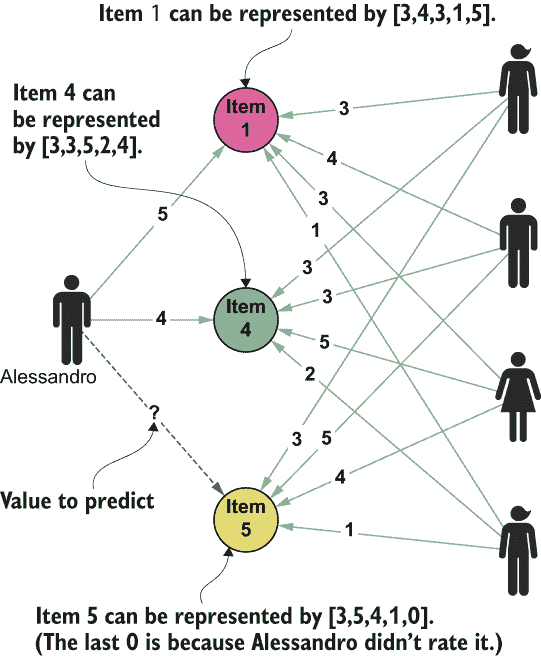

图 5.15 基于项目的协同过滤基本思想

首先，我们比较其他项目的评分向量，寻找与项目 5 评分相似的项（即与项目 5 相似）。在示例中，我们看到项目 5 的评分[3, 5, 4, 1, 0]与项目 1 的评分[3, 4, 3, 1, 5]相似（两个相同，两个相差 1，0 是因为 Alessandro 没有对项目 5 进行评分），并且与项目 4[3, 3, 5, 2, 4]有部分相似性（一个相同，三个相差 1）。基于项目的推荐想法是查看 Alessandro 对这些相似项目的评分。他给项目 1 评了 5 分，给项目 4 评了 4 分。基于项目的算法计算这些其他评分的加权平均值，并预测项目 5 的评分在 4 到 5 之间。

再次，为了将这些词转换成具体的公式以供计算机程序使用，我们需要考虑两种用例：带有显式评分和带有简单布尔值，表示用户是否与项目互动（购买、点击等）。在布尔值的情况下，目标不是预测评分（例如 0-5），而是预测项目 5 对 Alessandro 的兴趣程度，范围从 0 到 1（0 = 不感兴趣，1 = 最有可能感兴趣）。

如果原始用户-项目数据集包含评分值，预测数据集中尚未看到的产品的评分的公式是 [Sarwar et al., 2001]。

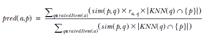

这个公式可以根据你决定如何导航数据来重写为不同的形式。在我们的情况下，

+   q ∈ ratedItem(a) 考虑用户 a 评过的所有产品。

+   对于每个 q，它乘以三个值：

+   +   q 与目标产品 p 之间的相似性。

    +   用户对 q 的评分。

    +   |KNN(q) ∩ {p}|，如果 p 是 q 的最近邻集合中的元素，则为 1，否则为 0。可以考虑只考虑 q 的最近邻，而不是所有相似性。

+   分母将值标准化，使其不超过评分的最大值。

考虑图 5.15 中的数据。这三个项目之间的相似性是

+   项目 1-项目 4：0.943

+   项目 1-项目 5：0.759

+   项目 4-项目 5：0.811

因为只有三个项目，所以我们考虑了最近邻中的所有相似性；因此，对于我们来说 |KNN(q) ∩ {p}| 总是 1。用户 Alessandro 给项目 1 评了 5 星，给项目 4 评了 4 星。预测 Alessandro 对项目 5 的兴趣/评分的公式是

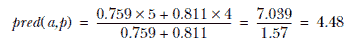

与基于用户的方法一样，对于布尔情况，没有接受的标准方法来计算分数，所以我将展示我最喜欢的其中一种 [Deshpande and Karypis, 2004]：

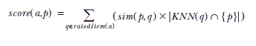

在这种情况下，我们没有评分，所以公式更简单。此外，它不返回预测，而是一个通用的分数。这样的分数可以通过不同的方式归一化，以方便比较。

以下列表展示了基于物品的邻域方法的示例实现。代码位于 ch05/recommendation/collaborative_filtering/recommender.py 文件中。

列表 5.7 使用基于物品的方法提供推荐

```
score_query = """                                                     ❶
    MATCH (user:User)-[:PURCHASES]->(item:Item)-[r:SIMILARITY]->(target:Item)
    WHERE user.userId = $userId AND target.itemId = $itemId
    return sum(r.value) as score
"""

def get_recommendations(self, user_id: str, size: int) -> List[int]: 

[... See Listing 5.6 ...]
```

❶ 从列表 5.6 中唯一需要更改的是 score_query 参数。在这里，该值是通过考虑先前用户购买与目标物品之间的相似性来计算的。

练习

运行前面列表中的代码（可在本书的代码仓库中找到），更改用户并观察推荐列表如何变化。然后使用查询检查图数据库，看看建议的物品是否与用户之前购买的物品一致。

## 5.5 处理冷启动问题

在我结束关于协同过滤的这一章之前，讨论一个问题对于影响协同过滤推荐系统非常重要：数据稀疏性。在现实世界的电子商务应用中，用户-物品矩阵往往很稀疏，因为客户通常只购买了目录中很小一部分的产品（或为产品提供了评分）。对于没有或很少互动的新用户或新物品，这个问题更为严重。这个问题被称为冷启动问题，它进一步说明了解决数据稀疏性问题的重要性。

通常，与冷启动问题相关的挑战是在相对较少的信息可用时计算良好的预测。处理这个问题的直接选择之一是利用关于用户的额外信息，例如性别、年龄、教育、兴趣或任何其他可以帮助分类用户的数据。其他方法也存在，例如创建混合推荐系统，将多种方法合并到单个预测机制中（第七章）。

这些方法不再是纯粹的合作式，关于如何获取额外信息以及如何结合不同分类器的新问题也随之产生。尽管如此，为了达到合作方法所需的临界用户数量，这些技术在新的推荐服务启动阶段可能有所帮助。

在过去几年中提出的各种方法中，基于图的方法 [Huang et al., 2004] 通过过去的交易和反馈探索消费者之间的传递性关联（相似性）。这种方法的主要思想是利用当消费者共享物品时客户口味假设的传递性。用户的偏好由物品及其与物品的互动来表示。

以下示例说明了在推荐系统中探索传递性关联的想法。假设我们有一个类似于表 5.4 中的简单用户-物品数据集。

表 5.4 用户-物品数据集样本

|  | 物品 1 | 物品 2 | 物品 3 | 物品 4 |
| --- | --- | --- | --- | --- |
| **用户 1** | 0 | 1 | 0 | 1 |
| **用户 2** | 0 | 1 | 1 | 1 |
| **用户 3** | 1 | 0 | 1 | 0 |

到这本书的这一部分，你应该能够轻松地将这个表格表示为二分图。结果应该看起来像图 5.16。

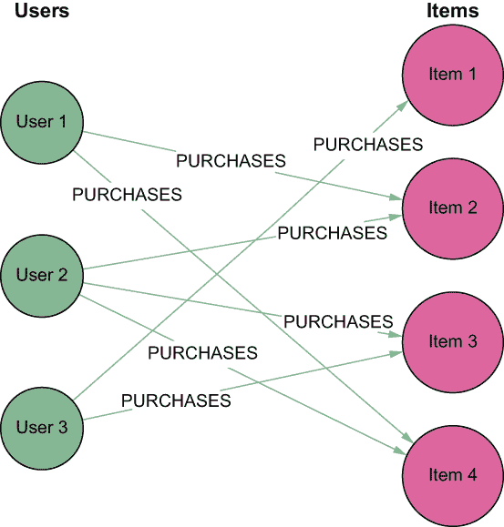

图 5.16 表 5.4 中用户-项目数据集的图表示

提出的方法使用这种表示方法来解决数据稀疏性问题。此外，可以给每条边分配一个权重，例如其对应评分的值。

假设推荐系统需要为用户 1 推荐项目。当我们使用标准的协同过滤方法时，用户 2 将被视为用户 1 的同伴，因为这两个用户都购买了项目 2 和项目 4。由于用户 2 也是用户 1 最近的邻居，并且也购买了或喜欢了项目 3，因此项目 3 将被推荐给用户 1。在用户 1 和用户 3 之间找不到强烈的相似性。

在传递关联方法中，推荐方法可以通过计算项目节点和用户节点之间的关联，在基于图的模型中轻松实现。推荐是由确定用户和项目之间的路径来确定的。标准的协同过滤方法，包括基于用户和基于项目的两种方法，只考虑长度等于 3 的路径。（作为提醒，路径长度是通过考虑路径中的边来计算的。）

考虑我们的小例子。在图 5.16 中的二分图中，用户 1 和项目 3 之间的关联由所有长度为 3 的连接用户 1 和项目 3 的路径确定。从图中很容易看出，有两条路径连接用户 1 和项目 3：用户 1-项目 2-用户 2-项目 3 和用户 1-项目 4-用户 2-项目 3。图 5.17 突出了图 5.16 中所有长度为 3 的路径。

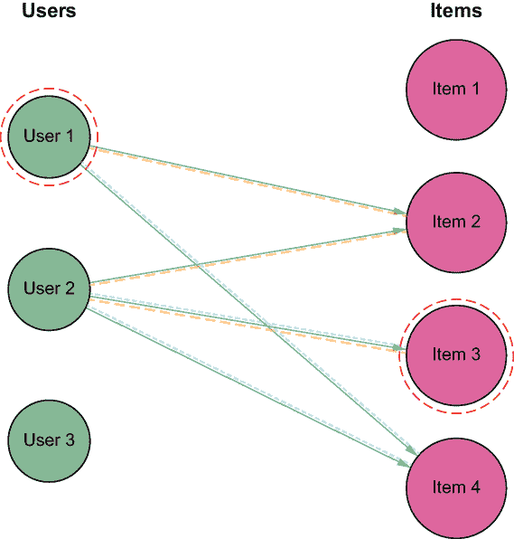

图 5.17 用户 1 和项目 3 之间的长度为 3 的路径

这种强烈的关联导致将项目 3 推荐给用户 1。连接项目节点和用户节点的唯一路径数量越多，这两个节点之间的关联就越强。

由于稀疏评分数据库中此类长度为 3 的路径数量很少，因此想法是也要考虑更长的路径——所谓的*间接关联*——来计算推荐。在基于图的模型中，将先前的方法扩展以探索和包含传递关联是直截了当的。

通过考虑长度超过 3 的路径，模型可以探索传递关联。例如，有两条长度为 5 的路径连接用户 1 和项目 1：用户 1-项目 2-用户 2-项目 3-用户 3-项目 1 和用户 1-项目 4-用户 2-项目 3-用户 3-项目 1。图 5.18 突出了图 5.16 中所有长度为 5 的路径。

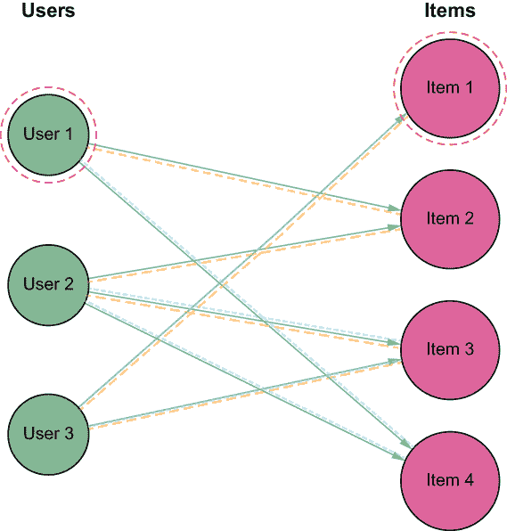

图 5.18 用户 1 和项目 1 之间的长度为 5 的路径

因此，在考虑传递关联时，可以将项目 1 推荐给用户 1。

即使采用这种方法，也需要定义一个评分机制来对推荐列表进行排序。在这种情况下，推荐是基于用户节点和项目节点对之间的关联进行的。给定一个用户节点 User t 和一个项目节点 Item j，它们之间的关联，即 score(User t, Item j)，定义为连接 User t 和 Item j 的所有独特路径的权重之和。

在这个公式中，只有长度小于或等于最大定义长度 M 的路径将被考虑。限制 M 是推荐系统设计者可以控制的参数。值得注意的是，M 必须是奇数，因为传递性关联在二分图中表示。

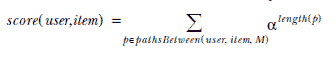

在这个公式中，`pathsBetween(user,item,M)` 返回所有长度为 x 且 x ≤ M 的从 *用户* 到 *项目* 的路径。路径的权重计算为 α^x，其中 α 是介于 0 和 1 之间的常数，确保较长的路径具有较小的影响。

α 的特定值可以根据底层应用领域的特性由系统设计者确定。在那些传递性关联可以作为消费者兴趣强预测的应用中，α 应取接近 1 的值，而在传递性关联很少传达信息的应用中，α 应取接近 0 的值。

让我们通过图 5.16 中的示例来说明这个计算。当 M 设置为 3（如标准协同过滤中所示）时，score(User 1, Item 3) = 0.5³ + 0.5³ = 0.25，而 score(User 1, Item 1) = 0。当 M 为 5 时，score(User 1, Item 3) = 0.5³ + 0.5³ = 0.25，而 score(User 1, Item 1) = 0.5⁵ + 0.5⁵ = 0.0625。对于消费者 User 1，上述分数计算会针对数据集中的所有项目重复进行。与之前的案例一样，项目会根据这个分数按降序排序。然后，将排序列表中的前 k 个项目（排除 User 1 过去购买的项目）推荐给 User 1。这种方法需要我们注意以下几个原因：

+   即使信息量很少，它也能生成高质量的推荐。

+   它使用本章迄今为止使用的相同的用户-项目数据集。

+   它纯粹基于图，并使用我们在示例中讨论的相同二分图模型。

此外，与标准基于用户和基于项目的算法进行比较表明，基于间接关系的建议技术可以显著提高推荐质量，特别是在评分矩阵稀疏的情况下。对于新用户，该算法与标准协同过滤技术相比，性能有可测量的提升。然而，当评分矩阵达到一定密度时，与标准算法相比，推荐质量可能会下降。

本节中描述的方法使用基于路径的相似性来计算推荐。其他基于图的方案使用更复杂的图算法。

## 5.6 图方法的优势

本章重点介绍了使用图和图模型创建协同过滤推荐引擎。特别是，它探讨了适合于图表示和基于图的数据导航的邻域方法。使用邻域方法实现的基于图的合作过滤推荐引擎的主要方面和优势如下：

+   用户-物品数据集可以很容易地表示为一个二分图，其中每个用户-物品对的权重被表示为关系的可选属性。

+   用户-物品数据集的二分图表示不仅具有只存储相关信息的优势——避免像矩阵表示那样存储无用的零，从而节省内存，而且还能在创建模型时通过仅关注可能相关的邻居来加速访问。

+   从同一个图模型中提取物品和用户的几个向量表示是可能的。

+   结果模型，由用户或物品或两者的相似性组成，可以自然地表示为连接用户和物品的新关系。结果的新图是最近邻（k-NN）网络。

+   基于相似性计算的算法，用于创建 k-NN 网络，代表了图构建中最强大和最广泛采用的技术之一。结果的网络不仅在推荐过程中易于导航，而且包含从现有的用户-物品数据集中提取的新知识，可用于从其他角度分析数据，例如物品聚类、客户细分等。

+   一种广泛采用的技术，用于解决数据稀疏问题和冷启动问题，基于图表示、导航和处理。图导航方法（如前面描述的路径查找示例）和图算法（如 PageRank）被应用于填补一些空白，并创建一个更密集的用户-物品数据集表示。

+   即使在这种情况下，也可以在单个图中混合多个推荐算法，并结合多种方法的力量来提供推荐。

## 摘要

本章继续我们关于数据建模的讨论，特别是通过介绍实现推荐引擎最常见的技术之一：协同过滤方法。

在本章中，你学习了

+   如何将用户-物品数据集以二分图的形式建模，以及如何将其投影到两个相关图中

+   如何仅使用与用户-物品交互相关的信息来计算用户和物品之间的相似性，而不是使用关于用户和物品的静态信息

+   如何在 k-NN 模型中存储这样的相似性

+   如何使用这样的相似性通过基于用户和基于物品的方法以及考虑二元和非二元值来向用户提供一个推荐列表

+   稀疏向量的优势是什么，何时使用它，以及如何实现它

+   如何使用基于图的技术来解决数据稀疏性问题，特别是冷启动问题

## 参考文献

[Bell 等人，2007] Bell, Yehuda Koren, 和 Chris Volinsky. “在多个尺度上建模关系以提高大型推荐系统的准确性。” *第 13 届 ACM SIGKDD 国际知识发现和数据挖掘会议论文集* (2007): 95-104.

[Börner，2010] Börner, Katy. *科学图谱：可视化我们所知*. 剑桥，MA: MIT Press, 2010.

[da Costa 和 Manzato，2014] da Costa, Arthur F., 和 Marcelo Garcia Manzato. “推荐系统中的多模态交互：一种集成方法。” *巴西智能系统会议论文集* (2014): 67-72.

[Deshpande 和 Karypis，2004] Deshpande, Mukund, 和 George Karypis. “基于物品的 Top-*N* 推荐算法。” *ACM 信息系统交易* 22:1 (2004): 143-177\. DOI: [`dx.doi.org/10.1145/963770.963776`](http://dx.doi.org/10.1145/963770.963776).

[Diestel，2008] Diestel, Reinhard. *图论（研究生数学教材）*. 第 5 版. 柏林: Springer, 2008.

[Go 等人，2007] Go, Kwang-Il Goh, Michael E. Cusick, David Valle, Barton Childs, Marc Vidal, 和 Albert-László Barabási. “人类疾病网络。” *PNAS* 104:21 (2007): 8685-8690\. DOI: [`doi.org/10.1073/pnas.0701361104`](https://doi.org/10.1073/pnas.0701361104).

[Goldberg 等人，1992] Goldberg, David, David Nichols, Brian M. Oki, 和 Douglas Terry. “使用协同过滤编织信息锦缎。” *ACM 通讯* 35:12 (1992): 61-70\. DOI: [`doi.acm.org/10.1145/138859.138867`](http://doi.acm.org/10.1145/138859.138867).

[Grujic´，2008] Grujic´, Jelena. “电影推荐网络作为二部图。” *第 8 届国际计算科学会议（第二部分）论文集* (2008): 576-583.

[Herlocker 等人，1999] Herlocker, Joseph A., Konstan, Loren G., Borchers, Al, 和 Riedl, John. “执行协同过滤的算法框架。” *第 22 届国际 ACM SIGIR 信息检索研究与发展年度会议论文集* (1999): 230-237\. DOI: [`dx.doi.org/10.1145/312624.312682`](http://dx.doi.org/10.1145/312624.312682).

[Herlocker 等人，2004] Herlocker, Joseph A., Konstan, Loren G., Terveen, Loren G., 和 Riedl, John T. “评估协同过滤推荐系统。” *ACM 信息系统交易* 22:1 (2004): 5-53\. DOI: [`dx.doi.org/10.1145/963770.963772`](http://dx.doi.org/10.1145/963770.963772).

[黄等，2004] 黄，赞，辛钦·陈，和丹尼尔·曾。“将关联检索技术应用于缓解协同过滤中的稀疏性问题。”*ACM 信息系统交易* 22:1（2004 年）：116-142 页。DOI: [`dx.doi.org/10.1145/963770.963775`](http://dx.doi.org/10.1145/963770.963775).

[詹纳奇等，2010] 詹纳奇，迪特马尔，马克斯·赞克尔，亚历山大·费尔费尼格，和格尔哈德·弗里德里希。《推荐系统：导论》。剑桥，英国：剑桥大学出版社，2010 年。DOI: [`dx.doi.org/10.1017/CBO9780511763113`](http://dx.doi.org/10.1017/CBO9780511763113).

[科伦，2008] 科伦，耶胡达。“因子分解与邻域相遇：一个多角度的协同过滤模型。”*第十四届 ACM SIGKDD 国际知识发现和数据挖掘会议论文集*（2008 年）：426-434 页。DOI: [`doi.org/10.1145/1401890.1401944`](https://doi.org/10.1145/1401890.1401944).

[科伦等，2009] 科伦，耶胡达，罗伯特·贝尔，和克里斯·沃尔辛斯基。“推荐系统中的矩阵分解技术。”*计算机* 42:8（2009 年）：30-37 页。DOI: [`dx.doi.org/10.1109/MC.2009.263`](http://dx.doi.org/10.1109/MC.2009.263).

[纽曼，2010] 纽曼，马克。《网络：导论》。牛津，英国：牛津大学出版社，2010 年。

[宁等，2015] 宁，夏，克里斯蒂安·德罗西耶，和乔治·卡里皮斯。“基于邻域的推荐方法综述。”见《推荐系统手册》，由弗朗西斯科·里奇，利奥尔·罗卡奇，和布拉查·沙皮拉编辑，第 37-76 页。纽约：斯普林格，2015 年。DOI: [`doi.org/10.1007/978-1-4899-7637-6`](https://doi.org/10.1007/978-1-4899-7637-6).

[萨瓦尔等，2000] 萨瓦尔，巴杜鲁，乔治·卡里皮斯，约瑟夫·康斯坦，和约翰·里德尔。“电子商务推荐算法分析。”*第二届 ACM 电子商务会议论文集*（2000 年）：158-167 页。DOI= [`dx.doi.org/10.1145/352871.352887`](http://dx.doi.org/10.1145/352871.352887).

[萨瓦尔等，2001] 萨瓦尔，巴杜鲁，乔治·卡里皮斯，约瑟夫·康斯坦，和约翰·里德尔。“基于物品的协同过滤推荐算法。”*第十届国际万维网会议论文集*（2001 年）285-295 页。DOI: [`doi.org/10.1145/371920.372071`](https://doi.org/10.1145/371920.372071).

[席尔瓦和赵，2016] 席尔瓦，蒂亚戈·C，和李昂·赵。《复杂网络中的机器学习》。纽约：斯普林格，2016 年。

[塔卡奇等，2007] 塔卡奇，加博尔，伊斯特万·皮拉斯齐，博蒂安·内梅特，和多米诺斯·蒂克。“重力推荐系统的主要组件。”*SIGKDD 探索通讯* 9:2（2007 年）：80-83 页。DOI: [`doi.org/10.1145/1345448.1345466`](https://doi.org/10.1145/1345448.1345466).

* * *

^（1.）随机梯度下降是机器学习中常见的优化技术。它试图通过迭代方法最小化目标函数（具体来说，是一个可微分的目标函数）。它被称为*随机*，因为样本是随机选择（或打乱顺序）的，而不是作为一个单一组（如标准梯度下降）或按照它们在训练集中出现的顺序。在协同过滤中，它用于矩阵分解。

^（2.）交替最小二乘法是另一种易于并行化的优化技术。

^（3.）在实际项目中，你可能会遇到这些类型的问题。内容策划问题在电子商务网站上很常见，我在很多我跟踪的项目中都见过这种情况。

^（4.）数据可通过 Kaggle 在[`mng.bz/8W8P`](https://shortener.manning.com/8W8P)获取。

^（5.）到这一点，你应该已经熟悉了公式，它总是与之前描述的所有用例中的公式相同，所以这里不再重复。如果你需要复习，请参阅第 4.2.3 节。

^（6.）例如，请参阅[`mng.bz/EVjJ`](http://mng.bz/EVjJ)或[`mng.bz/N8jD`](https://shortener.manning.com/N8jD)。
