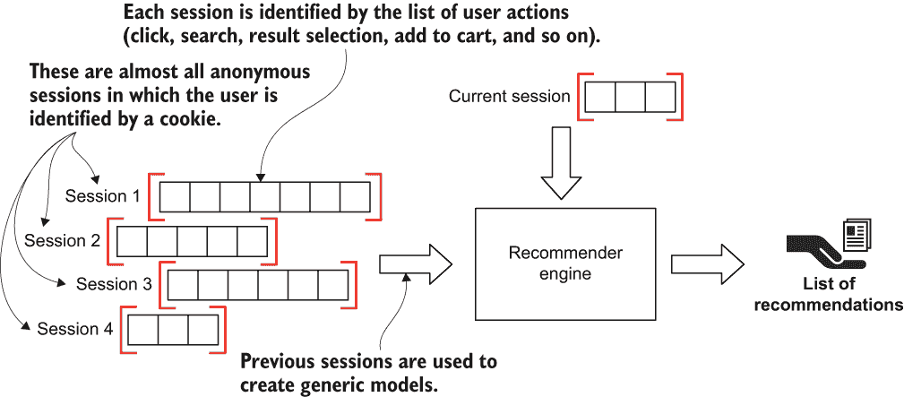
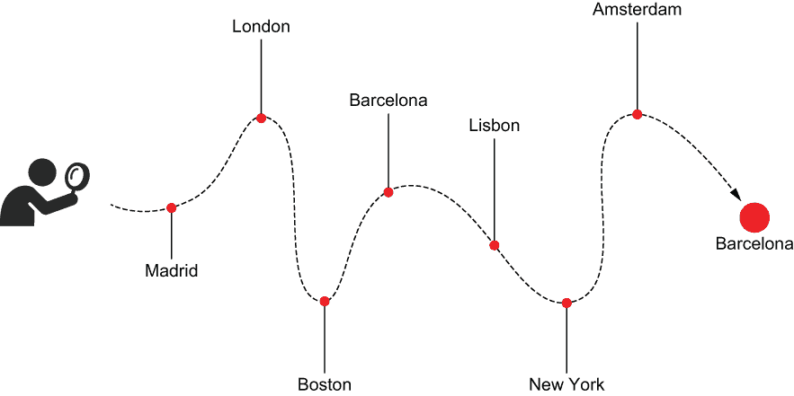
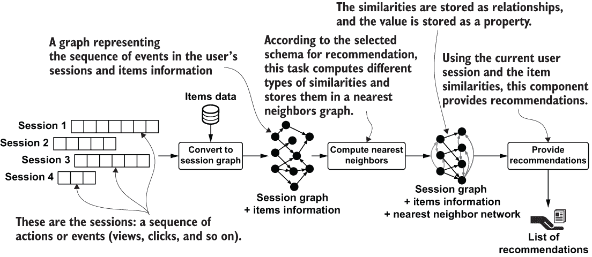
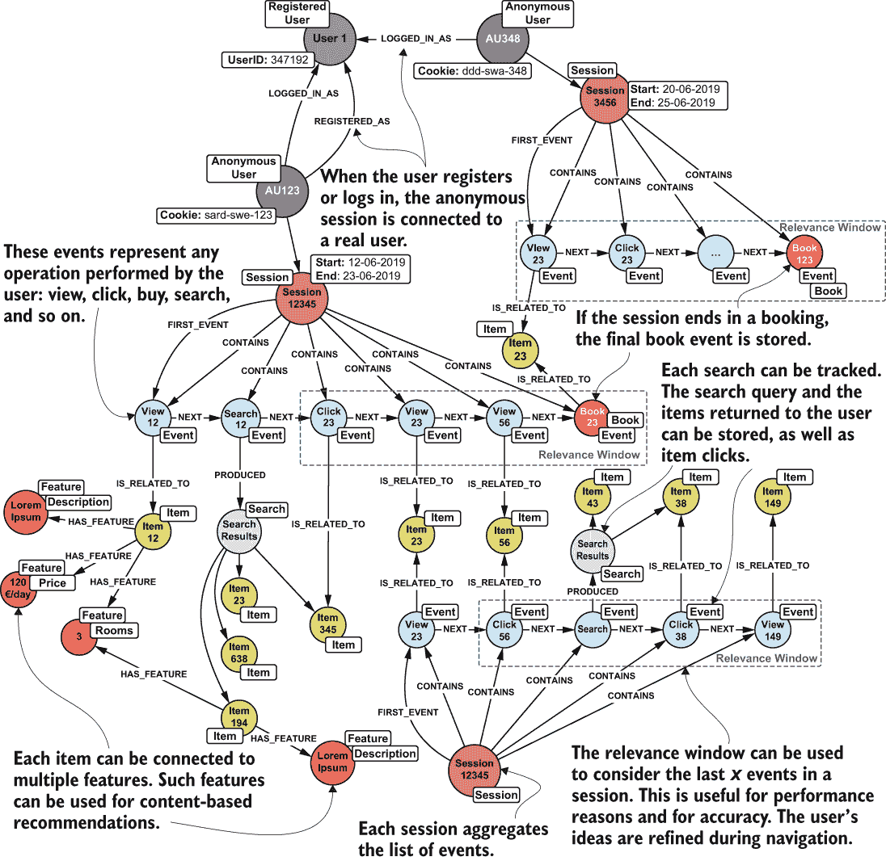
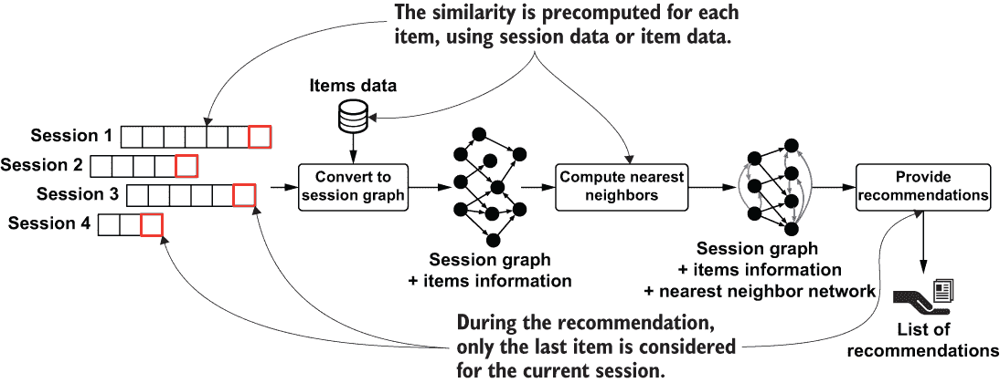
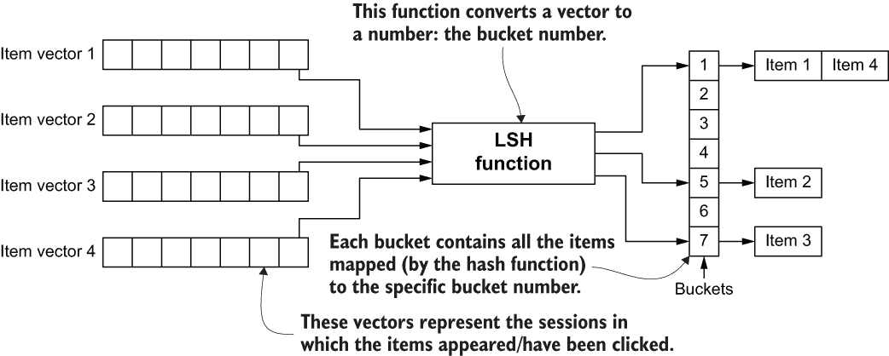
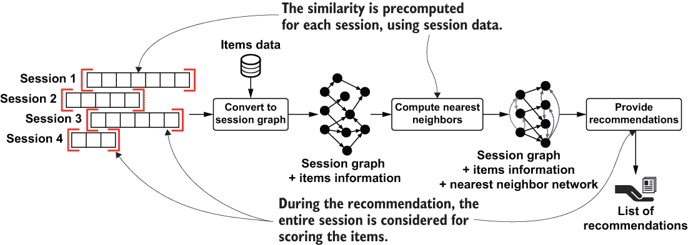
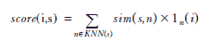

# 6 会话推荐

本章涵盖了

+   通过使用会话数据实现推荐系统

+   为基于会话的推荐引擎设计图模型

+   将现有数据集导入图模型

第四章和第五章介绍了实现推荐引擎的两种最常见方法：基于内容和协同过滤。每种方法的优点都得到了强调，但在讨论中也出现了几个缺点。值得注意的是，这些技术需要关于用户的信息，而这些信息并不总是可用。本章介绍了一种在难以或无法获取用户互动历史或其他用户细节时有用的推荐方法。在这种情况下，应用经典方法不会产生好的结果。

## 6.1 会话方法

假设你想为在线旅游网站构建一个推荐引擎。该网站提供住宿预订，但在流程的早期阶段不需要登录或注册。使用基于会话的推荐引擎，即使在用户信息很少的情况下，也可以提供推荐。

这种场景在预订住宿的网站上很常见。在这类网站上，以及在许多其他现实生活中的推荐场景中，用户通常不会登录或注册，直到选择过程的最后。只有在他们选择了住宿之后，用户才会登录或注册以完成预订。

传统的推荐方法依赖于从购买历史、显式评分或其他过去互动（如查看和评论）创建的用户资料。它们使用这些长期偏好模型来确定要向用户展示的项目。更具体地说，基于内容的推荐方法根据项目与用户资料中存在的项目的相似性推荐项目，而协同过滤方法基于具有相似资料的用户的选项进行预测。在这两种情况下，都假设可用的用户资料是信息丰富的。

然而，在许多推荐场景中，例如这里所描述的，由于大部分用户是首次访问者或未登录，因此他们没有可用的长期用户模型。在这种情况下，用户基本上是匿名的，所以我们之前考虑的推荐系统无法提供准确的结果。尽管有其他用户识别方法，如 cookies 和指纹技术，但由于它们的相对低可靠性和隐私问题，这些方法的适用性有限 [Tuan and Phuong, 2017]。此外，创建一个信息丰富的个人资料需要用户在过去与系统有足够的互动。

然而，提供能够捕捉当前用户兴趣和需求的有效推荐是提供高质量服务、提高用户满意度和吸引用户再次访问的关键。因此，必须根据其他类型的信息确定合适的推荐。尽管可用数据不是经典格式，但并非一切都已失去；可以使用用户与网站或应用的最新互动作为推荐的基础。在这种情况下，匿名、独特用户与系统之间的交互可以组织成会话。仅依赖于用户在当前会话中的行为并适应其推荐的推荐技术被称为*基于会话的推荐方法* [Quadrana 等人，2018]。图 6.1 描述了基于会话的推荐引擎的关键元素及其关系。



图 6.1 基于会话的推荐心智模型

*会话*是在给定时间段内发生的一系列交互。它可能跨越一天、几天、几周甚至几个月。会话通常有一个时间限制的目标，例如今晚找餐厅吃饭，听某种风格或情绪的音乐，或寻找下一个假期的地点。图 6.2 展示了用户在找到合适的地点之前如何改变主意。



图 6.2 用户搜索假日地点

根据用户会话中可用的信息，推荐系统应该为用户创建一个模型并做出预测。会话数据具有许多重要特征：

+   会话点击和导航本质上是顺序的。点击顺序以及导航路径可能包含关于用户意图的信息。

+   观看的项目通常具有诸如名称、类别和描述等元数据，这些信息提供了关于用户品味和他们在寻找什么的线索。

+   会话在时间和范围上都是有限的。一个会话有一个特定的目标，通常在目标达成时结束：为商务旅行租酒店，为浪漫约会找餐厅，等等。会话与特定项目（如最终预订的酒店或餐厅）相关的内在信息能力。

当会话推荐的使用既实用又合理时，会话推荐引擎可以提供高质量的推荐，以高精度预测用户的最终目标，缩短导航路径和满足用户特定需求所需的时间。

问题解决了吗？我们可以轻松提供推荐，即使用户是匿名的。太棒了！

不幸的是，情况并不那么简单。处理会话的问题在于，并不总是容易识别会话何时开始和结束（任务完成时或会话不再相关）。想想你自己的经历。你在工作休息期间有多少次开始考虑你可能在下一个假期去哪里？你开始查看你梦想中的某个地点的酒店；然后你必须回去工作。你可能几天或几周后回到任务，也许会有不同的想法想去哪里。对于一个系统来说，理解何时可以认为会话已经结束或不再相关是一个困难的任务。幸运的是，一些特定领域的最佳实践可以应用于识别搜索会话的结束，例如考虑不活跃的天数或酒店的成功预订。

本章的示例场景说明了实现基于会话的推荐引擎的一些方法。这些方法有助于你处理用户-物品交互数据不可用的情况。

在文献中，顺序推荐问题（以及因此的基于会话的推荐）通常被实现为预测下一个用户行为的任务。从算法的角度来看，早期的预测方法基于顺序模式挖掘技术。后来，基于马尔可夫模型更复杂的方法被提出并成功应用于该问题。最近，基于人工神经网络的深度学习方法的运用被探索作为另一种解决方案。循环神经网络（RNNs），¹ 能够从顺序排列的数据中学习模型，对于这个问题是一个自然的选择，最近文献中报道了此类算法预测精度的显著提高 [Devooght and Bersini, 2017; Hidasi and Karatzoglou, 2018; Hidasi et al., 2016 a, b; Tan et al., 2016]。

Ludewig 和 Jannach [2018] 以及之前的工作 [Verstrepen and Goethals, 2014; Jannach and Ludewig, 2017 a; Kamehkhosh et al., 2017] 展示的一些结果表明，在计算和概念上，基于最近邻的方法通常会导致与基于深度学习模型的当前技术相当准确，甚至更好的预测。存在不同的最近邻方案，并且它们都与基于图的数据建模和推荐方法很好地匹配。因此，本节重点介绍这些方法。图 6.3 描述了该场景的推荐过程。



图 6.3 一个基于图的会话推荐系统示意图

6.2 节描述了如何将会话数据建模为图的形式。6.3 节说明了构建预测模型和提供推荐的各种技术。

## 6.2 事件链和会话图

会话数据可以根据学习算法的类型和可用数据的性质以多种方式建模。首先，考虑一些基于会话的推荐引擎的期望属性[Tuan and Phuong, 2017]，这些属性与训练数据建模的方式相关：

+   数据表示应该能够模拟点击流中的顺序模式。最流行的方法之一，也是我们场景中选定的方法之一，是项目到项目的 *k*-NN 方法。这种方法基于项目的共现进行推荐，但忽略了点击的顺序。为了部分解决这个问题，我们可以引入时间衰减或相关性窗口，只考虑较长事件序列中的一小部分。

+   该方法应提供一种简单的方式来表示和组合项目 ID 与元数据。通常，一个项目与不同类型的特征相关联。例如，一个产品可能有一个 ID、一个名称和一个描述，它通常属于一个或多个类别（有时组织在类别层次结构中）。有一个通用的方式来表示不同的特征类型，并共同建模它们的交互，考虑到它们之间的关系和依赖性会更为方便。

+   用户兴趣和目标在导航过程中会演变。一步一步地，用户会专注于更具体的目标；他们的想法随着每一次点击而变得更加清晰。因此，在选择过程开始时点击的项目与后来点击的项目相比，相关性较低。时间必须得到适当的建模，以便为较新的项目分配比旧项目更多的价值。

图 6.4 中的图模型表示会话数据，考虑了所需的属性。



图 6.4 会话推荐方案的会话图

此模型满足所有要求，并支持不同类型的推荐算法。让我们更详细地描述它：

+   模型中的主要实体（节点）是会话、用户、项目和点击。这些元素代表了整个导航路径的步骤。

+   用户可以分为两类：匿名用户和注册/登录用户。这两种类型的用户都可以连接到一个会话，甚至可以同时连接，因为匿名用户必须登录或注册才能完成预订或购买。匿名用户和相关的注册用户之间的关系会被追踪，因此可以记录下用户在历史记录中点击的所有项目。此类信息对于在简单的用户-项目数据集上进行更传统的协同过滤方法非常有用。这些信息可能与发送定制电子邮件或其他类型的营销活动（如线下营销活动）相关。

+   会话是点击聚合器。所有点击都发生在与它们连接的特定会话中。每个会话属于一个用户。会话可以包含一些上下文信息，如开始时间、结束时间、位置和设备。这样的上下文信息对于提高推荐质量可能是相关的。

+   *项目*是一个广泛的概念，代表多个感兴趣元素，如页面、产品、搜索项和搜索查询。每个项目都包含一些描述特定特征的属性。与基于内容的方法类似，一些属性被建模为节点，然后连接到项目上；其他（特定于项目的，如 ID）被建模为项目节点的属性。

+   一个点击将一个会话与一个项目连接起来。它还包含一些信息，如时间和位置。点击流定义了一条路径，并包含极其有价值的信息。它不仅代表了一个导航路径，还代表了一个心理路径。在导航过程中，用户细化搜索，明确他们的目标并应用一些过滤器。这些信息很有价值，必须有效地进行建模。在图 6.4 所示的模型中，导航是通过使用 NEXT 关系来存储的，该关系将每个点击与下一个点击连接起来。出于性能考虑，还存储了一个与会话的连接。

+   用户在导航过程中细化他们的思考和目标；第一个点击的相关性不如最后一个点击。因此，在模型中（至少在概念上）模拟相关性衰减是很重要的。在学习和预测期间考虑时间因素有多种选择。考虑其中两种：

+   +   *时间衰减*—对较老的点击分配较低的权重。如果最后一个点击的权重为（相关性为）1.0，那么两个小时的点击可能的相关性为 0.8 或 0.5。根据算法应该多快忘记过去事件，可以定义不同的衰减函数，如线性或指数。

    +   *相关性窗口*—一个或多个仅包含最后 *N* 个（*N* 可配置）点击的滑动窗口，限制了在模型训练或预测期间考虑的数据量。

+   一个会话可以持续很长时间，包含大量的点击。可以定义一个阈值，以时间或点击次数来指定，以考虑仅相关的点击并丢弃其他点击。这种方法有助于减少数据库的大小，确保只存储相关信息，并保证长期的高性能。

+   最后一条相关信息是会话如何结束的——是否以购买或离开结束。在图表示法中，通过将最后一个项目标记为特定的标签 AddToCartItem 来模拟这一信息。最终决策不仅代表有价值的信息，因为它使我们能够识别一个成功的会话，而且，一些方法仅计算每个项目与标记为 AddToCartItem 的项目之间的距离。

值得注意的是，这里定义的模型不仅对基于会话的推荐目的有用，而且代表了一种建模任何顺序事件以促进进一步分析的方法。

既然我们已经定义了用于建模事件链的图，让我们考虑一个真实示例，我们将使用为我们的图数据库定义的模式导入它。我们将使用的数据集是在 ACM RecSys 2015 挑战赛² 的背景下提供的，包含六个月的记录点击序列（项目浏览和购买）。数据集由两个文件组成：

+   *yoochoose-clicks.dat*—点击事件。文件中的每个记录/行具有以下字段：

+   +   *会话 ID*—会话的 ID。一个会话可能包含一个或多个点击。

    +   *时间戳*—点击发生的时间。

    +   *项目 ID*—项目的唯一标识符。

    +   *类别*—项目的类别。

+   *yoochoose-buys.dat*—购买事件。文件中的每个记录/行具有以下字段：

+   +   *会话 ID*—会话的 ID。一个会话可能包含一个或多个购买事件。

    +   *时间戳*—购买发生的时间。

    +   *项目 ID*—项目的唯一标识符。

    +   *价格*—项目的价格。

    +   *数量*—购买此项目的单位数量。

在 yoochoose-buys.dat 文件中，会话 ID 总是存在于 yoochoose-clicks.dat 文件中；具有相同会话 ID 的记录一起形成用户在会话期间点击事件的序列。会话可能很短（几分钟）或很长（几小时），可能包含一个点击或数百个点击。一切取决于用户的活动。以下列表显示了根据迄今为止设计的模型创建会话数据的代码。

列表 6.1 从 yoochoose 文件导入会话数据

```
def import_session_data(self, file):
    with self._driver.session() as session:
        self.executeNoException(session,
"CREATE CONSTRAINT ON (s:Session) ASSERT s.sessionId IS UNIQUE")         ❶
        self.executeNoException(session,
"CREATE CONSTRAINT ON (i:Item) ASSERT i.itemId IS UNIQUE")               ❶
        query = """
            MERGE (session:Session {sessionId: $sessionId})              ❷
            MERGE (item:Item {itemId: $itemId, category: $category}) 
            CREATE (click:Click {timestamp: $timestamp})                 ❸
            CREATE (session)-[:CONTAINS]->(click)
            CREATE (click)-[:IS_RELATED_TO]->(item)
        """ 
        dtype = {"sessionID": np.int64, "itemID": np.int64, "category": 
        ➥ np.object}                                                    ❹
        j = 0;
        for chunk in pd.read_csv(file,
                                 header=0,
                                 dtype=dtype,
                                 names=['sessionID', 'timestamp', 'itemID', 
                                 ➥ 'category'],
                                 parse_dates=['timestamp'],
                                 chunksize=10**6):                       ❺
            df = chunk
            tx = session.begin_transaction()
            i = 0;
            for row in df.itertuples():                                  ❻
                try:
                    timestamp = row.timestamp
                    session_id = row.sessionID
                    category = strip(row.category)
                    item_id = row.itemID
                            tx.run(query, {"sessionId": session_id, "itemId": item_id, 
                    ➥ "timestamp": str(timestamp), "category": category})
                    i += 1
                    j += 1
                    if i == 10000:
                        tx.commit()
                        print(j, "lines processed")
                        i = 0
                        tx = session.begin_transaction()
                except Exception as e:
                    print(e, row)
            tx.commit()
            print(j, "lines processed")
        print(j, "lines processed")
```

❶ 创建约束以保证会话和项目的唯一性

❷ 检查会话和项目是否存在；否则，创建它们

❸ 创建点击以及项目、点击和会话之间的所有关系

❹ 定义导入 CSV 文件的类型（在 Pandas 中有助于防止类型转换问题）

❺ 以 10⁶ 行为单位读取 CSV 文件并分批提交以加快处理速度

❻ 遍历行并运行查询，为每个会话传递参数以创建新的点击

CSV 文件中的每一行都包含特定项目的点击。MERGE 子句允许我们只创建一次会话和项目；然后点击节点将会话连接到项目。以下列表向已结束购买的现有会话添加购买信息。

列表 6.2 从 yoochoose 文件导入购买数据

```
def import_buys_data(self, file):
    with self._driver.session() as session:
query = """
                MATCH (session:Session {sessionId: $sessionId})         ❶
                MATCH (item:Item {itemId: $itemId})
                CREATE (buy:Buy:Click {timestamp: $timestamp})          ❷
                CREATE (session)-[:CONTAINS]->(buy)
                CREATE (buy)-[:IS_RELATED_TO]->(item)
        """
        dtype = {"sessionID": np.int64, "itemID": np.int64, "price": 
        ➥ np.float, "quantity": np.int}                                ❸
        j = 0;
        for chunk in pd.read_csv(file,
                                 header=0,
                                 dtype=dtype,
                                 names=['sessionID', 'timestamp', 'itemID', 
                                 ➥ 'price', 'quantity'],
                                 parse_dates=['timestamp'],
                                 chunksize=10**6):                      ❹
            df = chunk
            tx = session.begin_transaction()
            i = 0;
            for row in df.itertuples():                                 ❺
                try:
                    timestamp = row.timestamp
                    session_id = row.sessionID
                    item_id = row.itemID
                    tx.run(query, {"sessionId": session_id, "itemId": 
                    ➥ item_id, "timestamp": str(timestamp)})
                    i += 1
                    j += 1
                    if i == 10000:
                        tx.commit()
                        print(j, "lines processed")
                        i = 0
                        tx = session.begin_transaction()
                except Exception as e:
                    print(e, row)
            tx.commit()
            print(j, "lines processed")
        print(j, "lines processed")
```

❶ 搜索会话和项目

❷ 创建购买（一种特殊的点击）以及项目、购买和会话之间的所有关系

❸ 定义导入 CSV 文件的类型（在 Pandas 中有助于防止类型转换问题）

❹ 以 10⁶ 行为单位读取 CSV 文件以加快处理速度

❺ 遍历行并运行查询，为每个会话传递参数以创建新的点击

虽然这段代码是正确的，但运行速度较慢。它易于理解且线性，这就是为什么在这里被优先选择，但它可能需要运行数小时。在本章的代码仓库中，你可以找到一个性能更好但也更复杂的不同版本。

无论你运行哪个版本，结果都将相同。以下查询允许你可视化导入的结果，考虑单个会话（ID 为 140837 的那个会话）。

列表 6.3 查询以显示与特定会话相关的子图

```
MATCH p=(s:Session {sessionId: 140837})-[:CONTAINS]->(c)
MATCH q=(c)-[:IS_RELATED_TO]->(item:Item)
return p,q
```

练习

尝试使用新的数据库，并编写查询以找到以下内容：

+   被点击最多的 10 个项目

+   购买量最多的 10 个商品（它们匹配吗？）

+   最长的会话（它是否包含购买？）

## 6.3 提供推荐

第 6.2 节设计的模型足够灵活，可以服务于不同的推荐方法。正如本章引言中所述，基于会话的推荐引擎在许多场景中都很有用。这个主题已经被广泛研究，已经提出了各种各样的解决方案，以提供尽可能好的推荐。

第一种自然的方法是使用协同过滤方法，具体来说，是使用 k 近邻方法，通过使用会话-项目数据代替用户-项目矩阵。尽管如此，由于事件链的顺序性质，一些研究人员提出了使用 RNN 或卷积神经网络（CNNs）³来揭示会话中的顺序模式，并使用它们来提供推荐[Jannach and Ludewig, 2017 a; Quadrana et al., 2018; Tuan and Phuong, 2017]。与基本忽略实际动作顺序的协同过滤方法相比，RNN 和 CNN 考虑了整体的导航路径，并且可以模拟会话点击的顺序模式。尽管已经证明这些方法可以提供高质量的推荐，但它们的实现相当复杂，并且需要大量数据进行适当的训练。此外，如果正确实现，*k*-NN 方法在效率和品质上都可以优于深度学习方法[Jannach and Ludewig, 2017 a; Ludewig and Jannach, 2018]。

由于这些原因，在本节中，我们将考虑不同的 *k*-NN 方法来解决基于会话推荐引擎中建议前-*N* 个项目的问题。多年来，已经提出了多种实现此类任务的方案。对我们场景和本节目的最相关的是[Ludewig and Jannach, 2018]。

+   *基于物品的 k-NN（Item-KNN）*—这种方法，由 Hidasi 等人[2016 a]提出，仅考虑给定会话（当前会话）中的最后一个元素，并推荐那些在其他会话中与其共现最相似的物品。如果用户当前正在查看比利亚尔巴的别墅，系统将建议其他在用户查看比利亚尔巴的同一别墅时也频繁出现的别墅。

+   *基于会话的 k-NN（SKNN）*—这种方法不是只考虑当前会话中的最后一个事件，而是将整个当前会话（或其重要部分，仅考虑最新的 N 次点击）与训练数据中的过去会话进行比较，以确定要推荐的物品[Bonnin 和 Jannach, 2014; Hariri 等人，2012; Lerche 等人，2016]。如果一个用户在比利亚尔巴、巴塞罗那和马德里看过别墅，算法将搜索类似会话（因为它们包含或多或少相同的条目）并计算建议物品的分数。

第二种方法比第一种方法更复杂一些，但它的准确度与更复杂的实现（如 RNNs 和 CNNs）相当，同时训练模型所需的数据更少。然而，基于物品的方法也能提供有价值的特征，因此以下章节将考虑这两种方法。

### 6.3.1 基于物品的 k-NN

假设你正在浏览鞋子。如果系统根据其他用户在到达与你相同的鞋子之前和之后查看的内容向你展示类似鞋子，这会有用吗？基于物品的*k*-NN 方法使用会话数据来计算成对物品之间的相似性。整体方法与基于物品的协同过滤案例相同；唯一的区别是，不是使用用户-物品矩阵，而是使用会话-物品数据。与经典方法一样，第一步是将物品表示为向量空间模型（VSM），其中每个元素对应一个会话，如果物品出现在会话中，则设置为 1。两个物品的相似度可以通过使用余弦相似度度量来确定，例如，邻居数量*k*隐式地由期望的推荐列表长度定义。整个过程在图 6.5 中展示。



图 6.5 使用 Item-KNN 的基于会话的推荐方案

从概念上讲，该方法实现了一种“购买了 . . . 的客户也购买了”的形式。使用余弦相似度指标使该方法对流行度偏差的敏感性降低。尽管项目到项目的方案相对简单，但它们在实践中被广泛使用，有时被认为是一个强大的基线 [Davidson 等人，2010；Linden 等人，2003]。值得注意的是，在这种情况下可以使用项目元数据信息，即使与会话数据结合使用，也可以计算项目之间的相似度。当您有一个没有历史记录的新项目时，这种技术非常有用。

在实现方面，所有相似度值都可以在训练过程中预先计算并排序，以确保在推荐时的快速响应。需要根据时间（每 *x* 小时）或会话量（每 *x* 次新的会话点击）进行更新。

考虑一个具有平凡数据示例，并逐步跟踪整个过程。假设我们有表 6.1 中描述的五个会话。

表 6.1 会话示例

| 会话编号 | 会话内容（项目 ID 的有序列表） |
| --- | --- |
| 1 | [项目 12, 项目 23, 项目 7, 项目 562, 项目 346, 项目 85] |
| 2 | [项目 23, 项目 65, 项目 12, 项目 3, 项目 9, 项目 248] |
| 3 | [项目 248, 项目 12, 项目 7, 项目 9, 项目 346] |
| 4 | [项目 85, 项目 65, 项目 248, 项目 12, 项目 346, 项目 9] |
| 5 | [项目 346, 项目 7, 项目 9, 项目 3, 项目 12] |

目标是在会话 5 中向用户推荐一些内容。当前项目是 12。第一步包括计算此项目与所有尚未查看的项目之间的距离。表 6.2（VSM 表示）有助于轻松提取项目的向量表示，正如我们在第五章中看到的。

表 6.2 表 6.1 的会话以 VSM 表示

| 会话编号 | 3 | 7 | 9 | 12 | 23 | 65 | 85 | 248 | 346 | 562 |
| --- | --- | --- | --- | --- | --- | --- | --- | --- | --- | --- |
| 1 | 0 | 1 | 0 | 1 | 1 | 0 | 1 | 0 | 1 | 1 |
| 2 | 1 | 0 | 1 | 1 | 1 | 1 | 0 | 1 | 0 | 0 |
| 3 | 0 | 1 | 1 | 1 | 0 | 0 | 0 | 1 | 1 | 0 |
| 4 | 0 | 0 | 1 | 1 | 0 | 1 | 1 | 1 | 1 | 0 |
| 5 | 1 | 1 | 1 | 1 | 0 | 0 | 0 | 0 | 1 | 0 |

重要的是要注意点击顺序已丢失。以下代码片段为您执行所有必要的计算。使用它比手动计算要容易，并且它引入了 sklearn⁴，这是一个强大的机器学习库。

列表 6.4 计算项目 12 与所有尚未查看的项目之间的相似度

```
from sklearn.metrics.pairwise import cosine_similarity

#Vector representation of the items
item3 = [0,1,0,0,1] 
item7 = [1,0,1,0,1]
item9 = [0,1,1,1,1]
item12 = [1,1,1,1,1]
item23 = [1,1,0,0,0]
item65 = [0,1,0,1,0]
item85 = [1,0,0,1,0]
item248 = [0,1,1,1,0]
item346 = [1,0,1,1,1]
item562 = [1,0,0,0,0]

# Compute and print relevant similarities
print(cosine_similarity([item12], [item23])) # 0.63245553
print(cosine_similarity([item12], [item65])) # 0.63245553
print(cosine_similarity([item12], [item85])) # 0.63245553
print(cosine_similarity([item12], [item248])) # 0.77459667
print(cosine_similarity([item12], [item562])) # 0.4472136
```

在此情况下，最相似的项目是项目 248。其他项目具有相同的相似度得分或甚至更高，例如项目 9 和 346，但根据我们的推荐策略，我们决定避免展示用户已经看到的项目。

现在过程已经清楚，让我们从平凡示例转移到我们的真实数据库。我们将过程分为两部分。第一部分将预先计算项目之间的相似度并存储最接近的 k 个邻居，第二部分将提供推荐。列表 6.5 显示了相似度预计算的代码。

列表 6.5 从图中提取项目向量；计算和存储相似度

```
def compute_and_store_similarity(self):                                    ❶
    items_VSM = self.get_item_vectors() 
    for item in items_VSM:
        knn = self.compute_knn(item, items_VSM.copy(), 20);
        self.store_knn(item, knn)

def get_item_vectors(self):                                                ❷
    list_of_items_query = """ 
                MATCH (item:Item)                                          ❸
                RETURN item.itemId as itemId
            """

    query = """                                                            ❹
                MATCH (item:Item)<-[:IS_RELATED_TO]-(click:Click)<- 
                ➥ [:CONTAINS]-(session:Session) 
                WHERE item.itemId = $itemId
                WITH session 
                ORDER BY id(session)
                RETURN collect(distinct id(session)) as vector;
            """
    items_VSM_sparse = {}
    with self._driver.session() as session:
        i = 0
        for item in session.run(list_of_items_query):
            item_id = item["itemId"];
            vector = session.run(query, {"itemId": item_id})
            items_VSM_sparse[item_id] = vector.single()[0]                 ❺
            i += 1
            if i % 100 == 0:
                print(i, "rows processed")
        print(i, " rows processed")
    return items_VSM_sparse

def compute_knn(self, item, items, k):                                     ❻
    dtype = [ ('itemId', 'U10'),('value', 'f4')]
    knn_values = np.array([], dtype=dtype)
    for other_item in items:
        if other_item != item:
            value = cosine_similarity(items[item], items[other_item])      ❼
            if value > 0:
                knn_values = np.concatenate((knn_values,    
                ➥ np.array([(other_item, value)], dtype=dtype)))
    knn_values = np.sort(knn_values, kind='mergesort', order='value' )[::-1]❽
    return np.split(knn_values, [k])[0]

def store_knn(self, item, knn):                                            ❾
    with self._driver.session() as session:
        tx = session.begin_transaction()
        knnMap = {a : b.item() for a,b in knn}
        clean_query = """                                                  ❿
            MATCH (item:Item)-[s:SIMILAR_TO]->()
            WHERE item.itemId = $itemId
            DELETE s
        """
        query = """                                                        ⓫
            MATCH (item:Item)
            WHERE item.itemId = $itemId
            UNWIND keys($knn) as otherItemId
            MATCH (other:Item)
            WHERE other.itemId = otherItemId
            MERGE (item)-[:SIMILAR_TO {weight: $knn[otherItemId]}]->(other)
        """
        tx.run(clean_query, {"itemId": item})
        tx.run(query, {"itemId": item, "knn": knnMap})
        tx.commit()
```

❶ 处理所有项目的入口点

❷ 搜索项目并为每个项目创建向量

❸ 获取项目列表的查询

❹ 根据所属会话提取每个项目的向量

❺ 处理所有项目的入口点

❻ 对于每个项目，计算所有其他项目中的前 k 个最近邻

❼ 计算两个稀疏向量之间的余弦相似度

❽ 根据相似度值对邻居进行排序

❾ 存储模型（k-NN）

❿ 清理节点的旧模型

⓫ 将新模型存储为当前项目与最相似的前 k 个项目的相似关系 SIMILAR_TO

注意，这段代码与我们用于基于项目的协同过滤方法中的代码相似。这样的代码需要定期执行以保持相似度值最新。

在继续之前，我想提到一个问题，你可能会遇到。尽管它是形式上正确的，但前面列表中的代码将需要一段时间（实际上是很长一段时间）才能完成。这个问题在处理最近邻时是常见的。到目前为止，我们一直在处理小数据集，所以这不是一个问题，但正如我一开始承诺的，这本书旨在成为一本具体的书，帮助你解决真正的机器学习问题，而不是简单的例子。计算最近邻需要你计算 N × N 的相似度，当你有很多项目时，这个过程可能需要很长时间。此外，考虑到你偶尔还需要更新最近邻网络以保持其与用户最新点击的一致性，前面的代码在可生产的项目中并不实用。

你可以使用不同的技术来解决此问题。如果你的目标是计算每一对的相似度，你无法做任何事情来减少工作量，尽管并行处理可以减少经过的时间。你可以使用用于大规模数据处理的分析引擎，如 Apache Spark⁵或 Apache Flink。⁶

另一种方法是只考虑 k-最近邻的近似版本。通常，我们只想找到最相似的成对或所有相似度高于某个下限的成对。在这种情况下，我们只需关注可能相似的成对，而不必调查每一对。存在不同的算法用于计算 k-NN 的近似版本。其中之一，如图 6.6 所示，被称为*局部敏感哈希（LSH）或近邻搜索* [Ullman and Rajaraman, 2011]。



图 6.6 解释 LSH 的心智模型

LSH 的一种通用方法是对项目进行多次哈希，使得相似的项目更有可能被哈希到同一个桶中，而不相似的项目则不太可能。然后我们考虑在任何时候被哈希到同一个桶中的任何一对作为候选对，并且只检查候选对以确定相似度。希望大多数不相似的对永远不会被哈希到同一个桶中，因此永远不会被检查。那些确实被哈希到同一个桶中的不相似对是假阳性；我们希望这些对只占所有对的一小部分。我们也希望大多数真正相似的对至少会哈希到同一个桶中一次。那些没有这样做的是假阴性，我们希望它们只占真正相似对的一小部分。使用这种技术的实现可以在代码仓库中找到，作为列表 6.5 的高级版本。

当每个项目的 k-NN 已经被预先计算后，推荐过程就是一个简单的查询，如下所示。

列表 6.6 使用项目 KNN 方法提供推荐的查询

```
MATCH (i:Item)-[r:SIMILAR_TO]->(oi:Item)
WHERE i.itemId = $itemId
RETURN oi.itemId as itemId, r.weight as score
ORDER BY score desc
LIMIT %s
```

这个查询在我的笔记本电脑上完成只需要 1 毫秒，因为所有内容都是预先计算的，导航相似度图非常快。

练习

在数据库中执行以下操作：

+   找到最接近的 10 个项目。

+   前一个查询的结果将显示，由于近似，很多项目的相似度值接近 1 甚至更高。导航这部分图，看看原因。

+   搜索最佳卖家项目和它们的邻居。它们也是最佳卖家吗？

通过查询，你会注意到导航图是多么简单。尝试自己从图中获取更多见解。

### 6.3.2 基于会话的 k-NN

与之前的方法相比，基于会话的方法的关键区别在于，它是计算会话之间的相似度，而不是项目之间的相似度。这些相似度以 k-NN 的形式存储在图中，用于评估项目并向用户返回推荐。整体方法在图 6.7 中描述。



图 6.7 使用 SKNN 的基于会话的推荐方案

在这个例子中，元数据，如标题、描述或特征列表，对于所选算法来说并不相关。这种方法另一个有趣的特点是它不需要太多信息就能有效。更详细地说，给定一个会话 s，推荐过程的结构如下：

1.  通过应用合适的会话相似度度量，如项目空间上的二进制向量上的 Jaccard 指数或余弦相似度，计算 k 个最相似的过去会话（邻居）。根据 Quadrana [2017]的研究，二进制余弦相似度度量能带来最佳结果。此外，正如 Jannach 和 Ludewig [2017 a]所展示的，使用 k = 500 作为考虑的邻居数量，对于许多数据集来说，能带来良好的性能结果。

1.  给定当前会话 s，其邻居 k 和相似度值，计算每个项目的分数，对它们进行排序，并返回前 N 个。

可以使用不同的公式作为评分函数。一个导致良好结果[邦宁和贾纳奇，2014]的函数是



其中

+   KNN(s)是 s 的 k 近邻网络。

+   sim(s,n)表示会话 s 和 n 之间的余弦相似度。

+   1n 是一个函数，如果会话 n 包含目标项目 i，则返回 1，否则返回 0。（此函数允许我们仅考虑包含目标项目的会话，过滤掉其他会话。）

为了理解公式和整体过程，请再次考虑表 6.1 中的示例会话及其 VSM 表示，为了您的方便，再次在表 6.3 中展示。

表 6.3 表 6.1 的会话以 VSM 表示

| 会话编号 | 3 | 7 | 9 | 12 | 23 | 65 | 85 | 248 | 346 | 562 |
| --- | --- | --- | --- | --- | --- | --- | --- | --- | --- | --- |
| 1 | 0 | 1 | 0 | 1 | 1 | 0 | 1 | 0 | 1 | 1 |
| 2 | 1 | 0 | 1 | 1 | 1 | 1 | 0 | 1 | 0 | 0 |
| 3 | 0 | 1 | 1 | 1 | 0 | 0 | 0 | 1 | 1 | 0 |
| 4 | 0 | 0 | 1 | 1 | 0 | 1 | 1 | 1 | 1 | 0 |
| 5 | 1 | 1 | 1 | 1 | 0 | 0 | 0 | 0 | 1 | 0 |

在这种情况下，我们感兴趣的是会话向量，我们可以通过逐行读取来提取它们。在下面的列表中，我们计算会话 5（我们的目标）与其他所有会话之间的距离。

列表 6.7 计算项目 12 与所有尚未查看的项目之间的相似度

```
from sklearn.metrics.pairwise import cosine_similarity

session1 = [0,1,0,1,1,0,1,0,1,1]
session2 = [1,0,1,1,1,1,0,1,0,0]
session3 = [0,1,1,1,0,0,0,1,1,0]
session4 = [0,0,1,1,0,1,1,1,1,0]
session5 = [1,1,1,1,0,0,0,0,1,0]

print(cosine_similarity([session5], [session1])) #0.54772256
print(cosine_similarity([session5], [session2])) #0.54772256
print(cosine_similarity([session5], [session3])) #0.8
print(cosine_similarity([session5], [session4])) #0.54772256
```

现在我们可以按照以下方式计算所有尚未查看项目的分数：

*score*(项目 23，会话 5) = 0.547 × 0 + 0.547 × 1 + 0.8 × 1 + 0.547 × 1 = 1.894

*score*(项目 65，会话 5) = 0.547 × 1 + 0.547 × 1 + 0.8 × 0 + 0.547 × 0 = 1.094

*score*(项目 85，会话 5) = 0.547 × 0 + 0.547 × 1 + 0.8 × 0 + 0.547 × 1 = 1.094

*score*(项目 248，会话 5) = 0.547 × 0 + 0.547 × 1 + 0.8 × 1 + 0.547 × 1 = 1.894

*score*(项目 562，会话 5) = 0.547 × 1 + 0.547 × 0 + 0.8 × 0 + 0.547 × 0 = 0.547

在这种情况下，最高分数由项目 23 和 248 获得。

在推荐阶段，时间限制意味着确定当前会话与数百万个过去会话之间的相似度，然后计算每个尚未查看项目的分数是不切实际的。可以实施各种方法来优化和加速此过程，其中许多方法可以使用图模型。我们在这里将考虑两种方法。

第一次优化

这种技术通过以下方式使用图模型提供优化：

+   k-*NN 预计算*——与上一个案例一样，可以预先计算（并保持更新）存储为会话之间关系的 k 近邻。后台进程可以根据某些标准，如时间或数量，更新这些关系。

+   *后过滤*——对于每个项目，我们已与其中出现该项目的所有会话建立了关系。这些关系可以用来过滤掉 k-NN(s)中不包含该项目的所有会话。

考虑为此场景设计的图模型，如图 6.4 所示，以下列表显示了如何预先计算所有会话之间的相似度。

列表 6.8 在图中计算和存储每个会话的 k-NN

```
def compute_and_store_similarity(self):                                  ❶
    sessions_VSM = self.get_session_vectors() 
    for session in sessions_VSM:
        knn = self.compute_knn(session, sessions_VSM.copy(), 20);
        self.store_knn(session, knn)

def compute_knn(self, session, sessions, k):                             ❷
    dtype = [ ('itemId', 'U10'),('value', 'f4')]
    knn_values = np.array([], dtype=dtype)
    for other_session in sessions:
        if other_session != session:
            value = cosine_similarity(sessions[session], 
            ➥ sessions[other_session])
            if value > 0:
                knn_values = np.concatenate((knn_values, 
                ➥ np.array([(other_session, value)], dtype=dtype)))
    knn_values = np.sort(knn_values, kind='mergesort', order='value' )[::-1]
    return np.split(knn_values, [k])[0]

def get_session_vectors(self):                                           ❸
    list_of_sessions_query = """
                MATCH (session:Session)
                RETURN session.sessionId as sessionId
            """

    query = """
                MATCH (item:Item)<-[:IS_RELATED_TO]-(click:Click)<-
                ➥ [:CONTAINS]-(session:Session)
                WHERE session.sessionId = $sessionId
                WITH item 
                ORDER BY id(item)
                RETURN collect(distinct id(item)) as vector;
            """
    sessions_VSM_sparse = {}
    with self._driver.session() as session:
        i = 0
        for result in session.run(list_of_sessions_query):
            session_id = result["sessionId"];
            vector = session.run(query, {"sessionId": session_id})
            sessions_VSM_sparse[session_id] = vector.single()[0]
            i += 1
            if i % 100 == 0:
                print(i, "rows processed")
                break
        print(i, " rows processed")
    print(len(sessions_VSM_sparse))
    return sessions_VSM_sparse

def store_knn(self, session_id, knn):
    with self._driver.session() as session:
        tx = session.begin_transaction()
        knnMap = {a : b.item() for a,b in knn}
        clean_query = """                                                ❹
            MATCH (session:Session)-[s:SIMILAR_TO]->()
            WHERE session.sessionId = $sessionId
            DELETE s
        """
        query = """                                                      ❺
            MATCH (session:Session)
            WHERE session.sessionId = $sessionId
            UNWIND keys($knn) as otherSessionId
            MATCH (other:Session)
            WHERE other.sessionId = toInt(otherSessionId)
            MERGE (session)-[:SIMILAR_TO {weight: $knn[otherSessionId]}]->
            ➥ (other)
        """
        tx.run(clean_query, {"sessionId": session_id})
        tx.run(query, {"sessionId": session_id, "knn": knnMap})
        tx.commit()
```

❶ 计算并存储所有会话的 k-NN 模型的入口点函数

❷ 计算相似度的函数

❸ 搜索会话并为每个基于点击的项目创建相关向量

❹ 清理当前会话现有模型的查询

❺ 创建新模型的查询

后过滤，它将帮助我们仅考虑包含当前项目的 k-NN 中的会话，可以通过以下查询实现。

列表 6.9 实现后过滤的查询

```
MATCH (target:Session)-[r:SIMILAR_TO]->(otherSession:Session)-[:CONTAINS]->
➥ (:Click)-[:IS_RELATED_TO]->(item:Item)
WHERE target.sessionId = 12547 AND item.itemId = 214828987
RETURN DISTINCT otherSession.sessionId
```

从这个查询开始，可以将其推广，以便我们可以使用定义的得分函数生成推荐列表。

列表 6.10 使用此优化进行推荐的推荐过程

```
def recommend_to(self, session_id, k):
    top_items = []
    query = """
        MATCH (target:Session)-[r:SIMILAR_TO]->(d:Session)-[:CONTAINS]->
        ➥ (:Click)-[:IS_RELATED_TO]->(item:Item) 
        WHERE target.sessionId = $sessionId 
        WITH DISTINCT item.itemId as itemId, r
        RETURN itemId, sum(r.weight) as score
        ORDER BY score desc
        LIMIT %s
    """
    with self._driver.session() as session:
        tx = session.begin_transaction()
        for result in tx.run(query % (k), {"sessionId": session_id}):
            top_items.append((result["itemId"], result["score"]))

    top_items.sort(key=lambda x: -x[1])
    return top_items
```

到目前为止，一切顺利，但如果使用样本数据集运行整个流程，将需要一段时间，并且需要大量的内存来计算 k-NN。计算完成后，推荐过程只需要几毫秒。通常，在代码仓库中，你可以找到一个高级版本，它使用一个名为 Annoy7（近似最近邻，是的）的 Python 库作为 LSH 的替代品。但是，对于包含 850,000 个会话的数据集，它仍然需要很长时间才能完成。

为了解决这些问题，我将提出第二种优化方法，该方法利用了数据存储的图方式。

第二种优化

这种技术以下列方式优化了过程：

+   k*-NN 元素采样*—从可能的邻居集中，通过随机选择或使用启发式方法提取 M 个会话的子样本。最有效的启发式方法之一是关注最近的会话，如果可用的话；关注最近趋势（会话）已被证明对电子商务中的推荐有效[Jannach 和 Ludewig，2017 b]，并且比考虑所有过去会话时得到的结果更好。从 M 个会话集中，提取当前会话 s 的 k 个最近邻居：k-NN(s)。

+   *得分计算预过滤*—从 k-NN(s)中出现的会话中提取推荐项目集 R，仅考虑这些项目。最后，算法使用之前描述的公式计算 R 集中项目的得分。

k-NN(s) 的变化很大，因为会话是持续创建的。因此，每个会话的 k-NN(s) 并不以图中的关系存储（它们是实时计算的），但在采样和预过滤过程中使用图表。第二次优化允许高效地进行相似度计算和最终预测。在 Jannach 和 Ludewig [2017 a] 报道的实验中，例如，只需要考虑几百万个现有会话中的前 1,000 个最新会话，就可以获得高质量的结果。

## 6.4 图形方法的优点

在本章中，我们讨论了如何创建一个使用最近邻方法的基于会话的推荐引擎。所提出的解决方案非常适合数据图表示，它为加快推荐过程提供了正确的索引结构。此外，不同的优化可以使用图方法来优化计算和准确性。具体来说，基于图的方法在实现最近邻方法的基于会话的推荐引擎中的主要方面和优势是

+   事件链，如会话中点击的顺序，在图模型中容易表示。

+   图表使得按顺序访问事件变得容易，可以专注于最近的事件，同时丢弃或降低旧事件和会话的优先级，从而简化删除策略的实施。

+   图表提供了必要的灵活性，可以添加与某些算法（如 CNNs）相关的项目元数据 [Tuan and Phuong, 2017]。

+   在推荐过程中，特别是对于本章中描述的算法，图表提供了一个自然的索引结构，使我们能够更快地访问相关信息。在非图方法中，通常需要创建索引和其他缓存数据结构以加快推荐过程。图表为算法提供了所需的所有数据访问模式，减少了其他工具的需求。

## 摘要

本章介绍了基于会话的推荐引擎。各种数据模型展示了图表的灵活性如何满足在训练数据和模型存储方面的许多需求。在本章中，你学习了

+   当用户大多匿名时，如何使用基于会话的方法实现推荐引擎

+   如何对基于会话的方法进行训练数据和模型建模

+   如何使用不同的方法通过会话数据提供推荐

+   如何通过使用不同的技术（如 LSH）优化 k-NN 计算

## 参考文献

[Bonnin and Jannach, 2014] Bonnin, Geoffray, and Dietmar Jannach. “Automated Generation of Music Playlists: Survey and Experiments.” *ACM Computing Surveys* 47:2 (2014): Article 26.

[Davidson et al., 2010] Davidson, James, Benjamin Liebald, Junning Liu, Palash Nandy, Taylor Van Vleet, Ullas Gargi, Sujoy Gupta, Yu He, Mike Lambert, Blake Livingston, 和 Dasarathi Sampath. “YouTube 视频推荐系统。” *第 4 届 ACM 推荐系统会议论文集* (2010): 293-296.

[Devooght and Bersini, 2017] Devooght, Robin, 和 Hugues Bersini. “基于循环神经网络的长期和短期推荐。” *第 25 届用户建模、自适应和个性化会议论文集* (2017): 13-21.

[Goodfellow et al., 2016] Goodfellow, Ian, Yoshua Bengio, 和 Aaron Courville. 2016\. *深度学习*。麻省理工学院出版社。

[Hariri et al., 2012] Hariri, Negar, Bamshad Mobasher, 和 Robin Burke. “基于潜在主题序列模式的上下文感知音乐推荐。” *第 6 届 ACM 推荐系统会议论文集* (2012): 131-138.

[Hidasi and Karatzoglou, 2018] Hidasi, Balázs, 和 Alexandros Karatzoglou. “基于 Top-k 增益的会话推荐循环神经网络。” *第 27 届 ACM 国际信息与知识管理会议论文集* (2018): 843-852.

[Hidasi et al., 2016 a] Hidasi, Balázs, Alexandros Karatzoglou, Linas Baltrunas, 和 Domonkos Tikk. “基于循环神经网络的会话推荐。” *第 4 届国际学习表示会议论文集* (2016).

[Hidasi et al., 2016 b] Hidasi, Balázs, Massimo Quadrana, Alexandros Karatzoglou, 和 Domonkos Tikk. “用于特征丰富会话推荐的并行循环神经网络架构。” *第 10 届 ACM 推荐系统会议论文集* (2016): 241-248.

[Jannach and Ludewig, 2017 a] Jannach, Dietmar, 和 Malte Ludewig. “循环神经网络与邻域在会话推荐中的应用。” *第 11 届 ACM 推荐系统会议论文集* (2017): 306-310.

[Jannach and Ludewig, 2017 b] Jannach, Dietmar, 和 Malte Ludewig. “从日志数据中确定成功推荐的特性：一个案例研究。” *应用计算研讨会论文集* (2017): 1643-1648.

[Kamehkhosh et al., 2017] Kamehkhosh, Iman, Dietmar Jannach, 和 Malte Ludewig. “基于频繁模式技术和深度学习方法的会话推荐比较。” *第 1 届推荐系统时间推理研讨会论文集* (2017): 50-56.

[Lerche et al., 2016] Lerche, Lukas, Dietmar Jannach, 和 Malte Ludewig. “电子商务推荐中提醒的价值。” *第 24 届用户建模、自适应和个性化会议论文集* (2016): 27-35.

[Linden et al., 2003] Linden, Greg, Brent Smith, 和 Jeremy York. “Amazon.com 推荐：物品到物品的协同过滤。” *IEEE 互联网计算* 7:1 (2003): 76-80.

[Ludewig and Jannach, 2018] Ludewig, Malte, and Dietmar Jannach. “基于会话的推荐算法评估。” arXiv 预印本 arXiv:1803.09587（2018 年）。

[Quadrana, 2017] Quadrana, Massimo. “序列感知推荐系统的算法。” 博士学位论文，米兰理工大学（2017 年）。

[Quadrana et al., 2017] Quadrana, Massimo, Alexandros Karatzoglou, Balázs Hidasi, and Paolo Cremonesi. “使用分层循环神经网络进行基于会话的推荐个性化。” *第 11 届 ACM 推荐系统会议论文集*（2017 年）：130-137。

[Quadrana et al., 2018] Quadrana, Massimo, Paolo Cremonesi, and Dietmar Jannach. “序列感知推荐系统。” *ACM 计算评论* 51:4（2018 年）：文章 66。

[Tan et al., 2016] Tan, Yong Kiam, Xinxing Xu, and Yong Liu. “用于基于会话推荐的改进循环神经网络。” *第 1 届深度学习推荐系统研讨会论文集*（2016 年）：17-22。

[Tuan and Phuong, 2017] Tuan, Trinh Xuan, and Tu Minh Phuong. “具有内容特征的基于会话的推荐的三维卷积网络。” *第 11 届 ACM 推荐系统会议论文集*（2017 年）：138-146。

[Ullman and Rajaraman, 2011] Ullman, Jeffrey David, and Anand Rajaraman. *大规模数据集挖掘*. 英国剑桥：剑桥大学出版社，2011 年。

[Verstrepen and Goethals, 2014] Verstrepen, Koen, and Bart Goethals. “统一最近邻协同过滤。” *第 8 届 ACM 推荐系统会议论文集*（2014 年）：177-184。

* * *

^（1.）循环神经网络（RNNs）是具有非线性动力学的分布式实值隐藏状态模型。在每个时间步，RNN 的隐藏状态是从序列中的当前输入和前一步的隐藏状态计算得出的。然后，隐藏状态用于预测序列中下一个项目的概率。循环反馈机制在 RNN 的隐藏状态中记住每个过去数据样本的影响，克服了马尔可夫链的基本限制。因此，RNN 非常适合模拟用户动作序列中的复杂动态[Quadrana et al., 2017]。

^（2.）[`recsys.acm.org/recsys15/challenge`](https://recsys.acm.org/recsys15/challenge)。

^（3.）卷积神经网络（CNNs）是专门用于处理具有已知网格拓扑结构的数据的神经网络，例如用户-物品矩阵或可以建模为一维矩阵的时间序列数据。名称“卷积”来自神经网络中使用的数学线性运算，卷积，它至少在它们的层中替代了通用的矩阵乘法[Goodfellow et al., 2016]。

^（4.）[`scikit-learn.org`](https://scikit-learn.org/)。

^（5.）[`spark.apache.org`](https://spark.apache.org/)。

^（6.）[`flink.apache.org`](https://flink.apache.org/)。

^（7.）[`github.com/spotify/annoy`](https://github.com/spotify/annoy)。
