# 7 上下文感知和混合推荐

本章涵盖

+   实现考虑用户上下文的推荐引擎

+   为上下文感知推荐引擎设计图模型

+   将现有数据集导入图模型

+   结合多种推荐方法

本章介绍了推荐场景中另一个先前方法忽略的变量：*上下文*。用户表达欲望、偏好或需求的具体条件对其行为和期望有强烈的影响。在推荐过程中考虑用户上下文存在不同的技术。我们将在本章中介绍主要的技术。 

此外，为了完成我们对推荐引擎模型和算法的概述，我们将看到如何使用一种混合方法，该方法结合了迄今为止所展示的不同类型系统。这种方法将使我们能够创建一个独特且强大的推荐生态系统，能够克服每种单独推荐方法的所有问题、局限性和缺点。

## 7.1 基于上下文的方法

假设你想实现一个提供影院观影推荐的电影移动应用；我们将称之为 Reco4.me。通过使用上下文感知技术，你将能够在推荐过程中考虑环境信息，例如，建议用户当前位置附近的影院正在上映的电影。

让我们通过一个具体的例子进一步细化场景。假设你在伦敦，你想要在附近的影院找一部电影来看。你拿出手机，打开 Reco4.me 应用，希望得到一些好的推荐。你期望什么样的推荐？你希望了解你附近影院正在上映的电影。理想情况下，你希望得到适合你偏好的推荐。我不知道你，但对我来说，上下文会改变我的偏好。当我独自在家时，我喜欢看动作或奇幻电影。当我和孩子在一起时，我更喜欢看卡通或家庭电影。当我和我妻子在一起时，“我们”更喜欢看浪漫喜剧或爱情喜剧。应用应该考虑这种环境信息，并提供适合用户当前上下文的准确推荐。

这个例子展示了在推荐系统中考虑环境信息是多么重要，因为它可能对用户行为和需求产生微妙但强大的影响。因此，考虑环境信息可以显著影响推荐的质量，将可能在某些情况下有用的建议转化为在其他情况下无用的建议。这种情况不仅适用于这里描述的场景，也适用于许多其他场景。例如，想想你如何使用像亚马逊这样的电子商务网站。你可能用它为自己买一本书，为你的未婚夫买一份礼物，或者为你的孩子买一个玩具。你有一个单独的账户，但你的行为和偏好是由你在浏览网站时特定的需求所驱动的。所以，尽管在寻找为你儿子买滑板的推荐时看到可能对你感兴趣的书是有用的，但得到基于你之前为孩子购买的礼物的当前需求的建议会更有效。

传统的推荐系统，如第四章和第五章中讨论的基于内容和协同过滤方法的系统，往往使用相当简单的用户模型。例如，基于用户的协同过滤模型将用户简单地视为项目评分的向量。随着对用户偏好的观察越来越多，用户模型得到扩展，并使用用户偏好的完整集合来生成推荐或做出预测。因此，这种方法忽略了“情境行为”的概念[Suchman, 1987]——即用户在特定情境或特定范围内与系统交互的事实，以及同一情境中项目偏好可能与另一情境不同。在许多应用领域，一个与环境无关的表示可能会失去预测能力，因为来自多个情境的有用信息被汇总。

更正式地说，用户与项目之间的交互表现出多方面的性质。用户偏好通常不是固定的，并且可能随着特定情况而变化。回到 Reco4.me 应用的例子，可能的上下文信息的简化模式在图 7.1 中展示。


图 7.1 Reco4.me 应用的环境信息

这个例子是可能考虑的环境信息类型的一个小子集。环境可能包括一年中的季节或星期几，用户正在使用的电子设备类型，用户的心情——几乎任何东西[Bazire 和 Brézillon, 2005; Doerfel 等，2016]。也值得提到的是，环境信息是由系统对特定条件下发生动作或交互的具体情况所知道或可以推测的内容来定义的。

在基于内容和协同过滤方法中，推荐问题被定义为预测问题，其中，给定一个用户配置文件（以不同的方式定义）和一个目标项目，推荐系统的任务是预测用户对该项目的评分或兴趣，反映用户对项目的偏好程度。具体来说，推荐系统试图估计一个评分函数：

*f*: 用户 × 项目 → 评分

这样的函数将用户-项目对映射到一个有序的分数值集合。请注意，f 可以被视为用户-项目对的一般用途（或偏好）度量。所有用户-项目对的评分都是未知的，因此必须推断出来，这就是我们为什么谈论*预测*的原因。当收集到一组初始评分（隐式或显式地）后，推荐系统试图估计尚未被用户评分的项目评分值。从现在起，我们将这些传统的推荐系统称为*二维*（2D），因为它们在推荐过程中只考虑用户和项目维度作为输入。

与此相反，*上下文感知*推荐系统试图结合或使用额外的环境证据（超出用户和项目信息）来估计用户对未见项目的偏好。当此类上下文证据可以作为推荐系统输入的一部分时，评分函数可以被视为多维的。在这个公式中，上下文代表一组进一步界定用户-项目对被分配特定评分条件的因素：

*f*: 用户 × 项目 × *上下文*[1] × *上下文*[2] × … × *上下文*[n] → 评分

这个扩展模型的潜在假设是，用户对项目的偏好不仅取决于项目本身，还取决于考虑项目时的上下文。

上下文信息代表一组显式变量，它们在底层领域（时间、位置、环境、设备、场合等）中建模上下文因素。无论上下文如何表示，上下文感知推荐者必须能够获取与用户活动（如购买或评分项目）相对应的上下文信息。在这种上下文感知推荐系统中，此类信息有两个方面的目的：

+   这是学习和建模过程的一部分（例如，用于发现规则、细分用户或构建回归模型）。

+   对于给定的目标用户和目标项目，系统必须能够识别特定上下文变量的值，作为用户与系统持续互动的一部分。这些信息用于确保在考虑上下文的情况下提供正确的推荐。

上下文信息可以通过多种方式获得，无论是显式还是隐式。显式上下文信息可能来自用户本身或来自设计用于测量特定物理或环境信息的传感器 [Frolov and Oseledets, 2016]。然而，在某些情况下，上下文信息必须从其他观察数据中推导或推断出来。以下是一些例子：

+   *显式*—应用程序可能要求寻找餐厅推荐的人指定他们是否在约会或与同事一起参加商务晚餐。

+   *显式/隐式*—如果餐厅推荐器是一个移动应用，可以通过设备的 GPS 和其他传感器获得关于位置、时间和天气条件等额外上下文信息。

+   *隐式*—一个电子商务系统可能尝试使用之前学习到的用户行为模型来区分（例如）用户是否可能为其配偶购买礼物或与工作相关的书籍。

隐式推断上下文信息的方法通常需要从历史数据中构建预测模型 [Palmisano et al., 2008]。

图 7.2 展示了上下文感知推荐引擎的心理模型。用户的动作——系统的输入——被上下文化并转换为图；然后可以开始构建模型和提供推荐的过程。

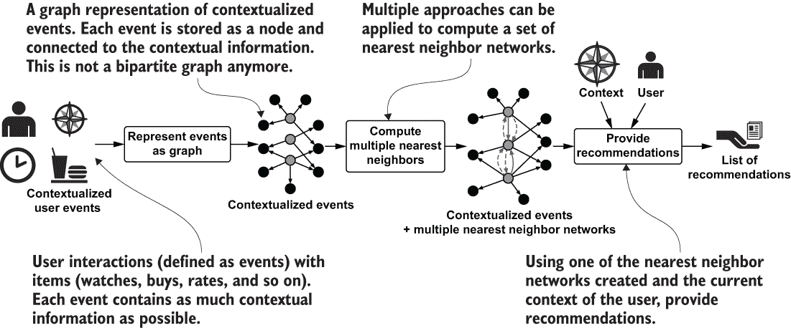

图 7.2 由图驱动的上下文感知推荐系统

### 7.1.1 表示上下文信息

在基于内容和协同过滤的方法中，用户-项目交互（购买、点击、查看、评分、观看等）被表示为一个二维矩阵，我们将其定义为用户 x 项目（U x I）数据集。这样的矩阵可以很容易地表示为一个二分图，其中一个顶点集代表用户，另一个顶点集代表项目。交互通过事件的用户（事件的主题）和项目（事件的客体）之间的关系来建模。

在上下文感知推荐系统中，每个交互事件都带来了更多的信息。它不仅由用户和项目描述，还包括所有环境信息，这些信息上下文化了特定行为。如果一个用户在晚上与孩子们在家看电影，上下文信息包括

+   *时间*—晚上，工作日

+   *公司*—儿童

+   *位置*—家

这个例子仅是描述“观看”这一事件的有关信息的子集。其他信息可能包括使用的设备、用户的情绪、观看者的年龄或场合（约会之夜、派对或孩子的睡前电影）。一些变量可能是离散的（具有定义好的值集的上下文信息，如设备和位置），而其他变量是连续的（如年龄这样的数值）。在后一种情况下，通常最好以某种方式对变量进行离散化。在年龄的情况下，你可能会有不同的年龄段——例如 0-5 岁、6-14 岁、15-21 岁、22-50 岁以及 50 岁以上——这取决于推荐引擎的具体要求。

代表推荐过程输入的结果数据集不能再表示为一个简单的二维矩阵。它需要一个 N 维矩阵，其中两个维度是用户和项目，其余维度代表上下文。在考虑的例子中，数据集将是一个五维矩阵：

dataset = 用户 × 项目 × 位置 × 公司 × 时间

每个交互或事件不能仅通过两个元素及其关系来简单描述。在最佳情况下，当所有上下文信息都可用时，还需要另外三个元素，因此我们不能使用简单的二元关系在二分图中表示一个事件。要表示五个顶点之间的关系，我们需要一个超图。在数学中，*超图*是图的推广，其中一条边可以连接任意数量的顶点。然而，在大多数图数据库（包括 Neo4j）中，无法表示 n 顶点的关系。

解决方案是将事件实体化为节点，并将每个事件节点与描述该事件的全部元素或维度相连接。结果将类似于图 7.3。


图 7.3 表示事件上下信息的 n 分图

由于我们拥有用户、项目、位置信息、时间信息和公司信息以及事件，新的图表示是一个 6 分图。此图表示了推荐过程中下一步的输入，如图 7.2 所示。

从二维表示过渡到 n 维表示（在我们的例子中 n=5）使得数据稀疏性成为一个更大的问题。很难找到在完全相同情况下发生的大量事件。当我们拥有详细上下文信息（n 的值更高）时，这个问题会加剧，但可以通过在上下文信息中引入层次结构来缓解。图 7.4 展示了考虑我们特定场景的一些上下文信息的可能层次结构示例——以图的形式表示。这些层次结构被定义为分类法。

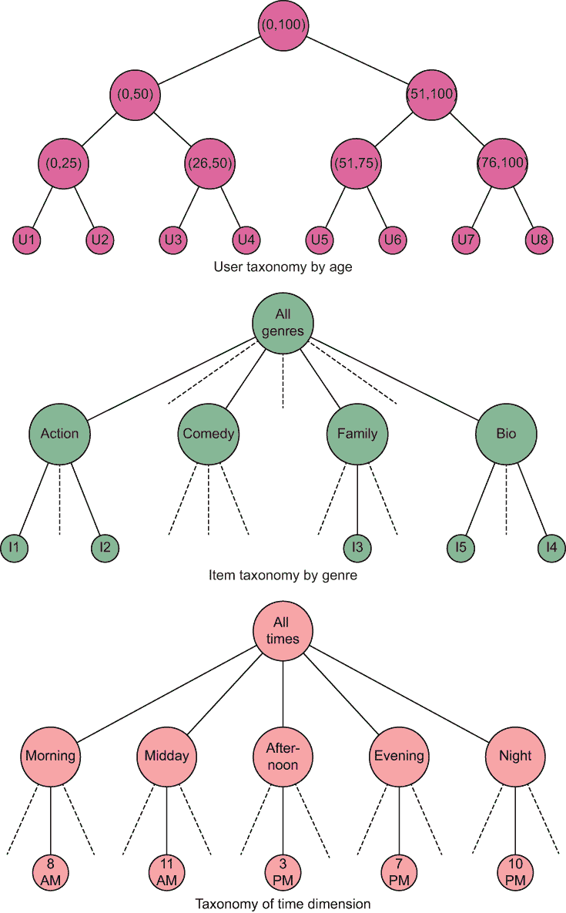

图 7.4 用户、项目和时间的分类法

这些分类法将在推荐阶段使用，以解决稀疏性问题，并使我们能够在没有太多关于当前用户特定上下文信息的情况下提供推荐。

在本节中，我们将使用 DePaulMovie 数据集¹ [Zheng et al., 2015]，该数据集包含从学生调查中收集的数据。它包含关于 97 个用户和 79 部电影的评分数据，这些评分在不同的上下文中进行（时间、地点和同伴）。这样的数据集完美符合我们的需求，并且经常用于进行上下文感知推荐系统的比较 [Ilarri et al., 2018]。

首先，让我们导入为这个示例选择的数据集 DePaulMovie 的数据。请使用一个全新的数据库运行代码；你可以清理它² 或者决定使用不同的数据库，并保留你在前几章中创建的数据库以进行进一步实验。

列表 7.1 从 DePaulMovie 数据集导入数据

```
    def import_event_data(self, file):                                   ❶
        with self._driver.session() as session: 
            self.executeNoException(session, "CREATE CONSTRAINT ON (u:User) 
            ➥ ASSERT u.userId IS UNIQUE") #B
            self.executeNoException(session, "CREATE CONSTRAINT ON (i:Item) 
            ➥ ASSERT i.itemId IS UNIQUE") #B
            self.executeNoException(session, "CREATE CONSTRAINT ON (t:Time) 
            ➥ ASSERT t.value IS UNIQUE") #B
            self.executeNoException(session, "CREATE CONSTRAINT ON 
            ➥ (l:Location) ASSERT l.value IS UNIQUE")                   ❷
            self.executeNoException(session, "CREATE CONSTRAINT ON 
            ➥ (c:Companion) ASSERT c.value IS UNIQUE")                  ❷

            j = 0;
            with open(file, 'r+') as in_file:
                reader = csv.reader(in_file, delimiter=',')
                next(reader, None)
                tx = session.begin_transaction()
                i = 0;
                query = """                                              ❸
                        MERGE (user:User {userId: $userId}) 
                        MERGE (time:Time {value: $time})
                        MERGE (location:Location {value: $location})
                        MERGE (companion:Companion {value: $companion})
                        MERGE (item:Item {itemId: $itemId})
                        CREATE (event:Event {rating:$rating})
                        CREATE (event)-[:EVENT_USER]->(user)
                        CREATE (event)-[:EVENT_ITEM]->(item)
                        CREATE (event)-[:EVENT_LOCATION]->(location)
                        CREATE (event)-[:EVENT_COMPANION]->(companion)
                        CREATE (event)-[:EVENT_TIME]->(time)
                    """

                for row in reader:
                    try:
                        if row:
                            user_id = row[0]
                            item_id = strip(row[1])
                            rating = strip(row[2])
                            time = strip(row[3])
                            location = strip(row[4])
                            companion = strip(row[5])
                            tx.run(query, {"userId": user_id, "time": time, 
                            ➥ "location": location, "companion": companion, 
                            ➥ "itemId": item_id, "rating": rating})
                            i += 1
                            j += 1
                            if i == 1000:
                                tx.commit()
                                print(j, "lines processed")
                                i = 0
                                tx = session.begin_transaction()
                    except Exception as e:
                        print(e, row)
                tx.commit()
                print(j, "lines processed")
            print(j, "lines processed")
```

❶ 从 CSV 文件导入数据的入口点

❷ 创建数据库中的约束以防止重复并加快访问速度的查询

❸ 一次性创建事件并将它们与相关维度连接的查询

在代码仓库的完整版本中，你会注意到我还导入了一些关于电影的信息。这些信息将有助于了解结果，也适用于以下练习。

练习

在导入数据后，尝试操作图数据库。以下是一些可以尝试的事情：

+   寻找最频繁的上下文信息——例如，观看电影的最频繁时间。

+   寻找最活跃的用户，并检查他们上下文信息的变异性。

+   尝试添加一些分类法，看看先前查询的结果是否会有所改变。

+   搜索在周内普遍观看的电影或类型，以及周末更常观看的电影。

### 7.1.2 提供推荐

经典推荐系统通过使用对用户偏好的有限了解（即用户对某些项目子集的偏好）来提供推荐，这些系统的输入数据通常是基于形式为 <用户，项目，评分> 的记录。如前几章所述，推荐过程通常使用 U x I 矩阵来创建模型，并仅基于用户交互和偏好提供推荐。

相比之下，上下文感知推荐系统通常处理形式为 <用户, 项目, 上下文 1, 上下文 2, ..., 评分> 的数据记录，其中每个记录不仅包括特定用户对某个项目的喜好程度，还包括用户与项目交互时所处的条件上下文信息（context1 = 星期六，context2 = 妻子，等等）。这种“丰富”的信息被用于构建模型。此外，用户当前上下文的信息可以在推荐过程的各个阶段被使用，从而产生几种上下文感知推荐系统的方法。从算法的角度来看，绝大多数上下文感知推荐方法都执行以下操作：

+   以形式 U × I × C[1] × C[2] × ... × C[n] 的上下文化（扩展）用户 × 项目数据集作为输入，其中 C[i] 是一个额外的上下文维度。

+   为每个用户 u 根据用户的当前上下文生成一个上下文推荐列表 i[1]，i[2]，i[3]，...

根据上下文信息、当前用户和当前项目在推荐过程中的使用情况，上下文感知推荐系统可以采取图 7.5 中所示的三种形式之一。

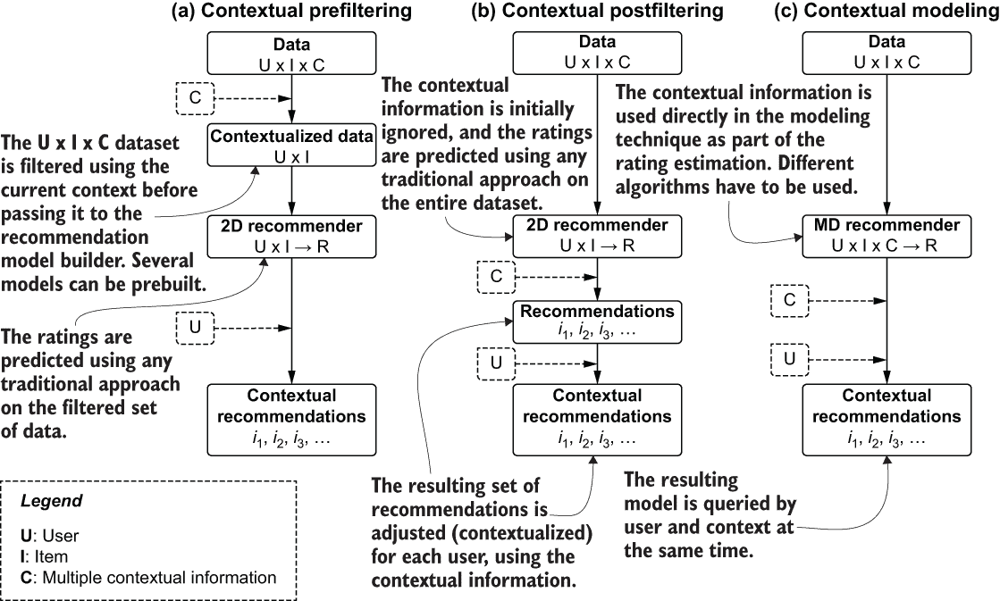

图 7.5 上下文感知推荐系统的三种形式

三种类型的上下文感知推荐系统是 [Ilarri et al., 2018]

+   *上下文预过滤（或推荐输入的上下文化）*—在这个范例中，当前上下文 c 的信息仅用于选择相关数据集，并且通过在所选数据上使用任何传统的二维推荐系统来预测评分。为了提高效率，必须预先计算几个模型，考虑到上下文最可能的组合。

+   *上下文后过滤（或推荐输出的上下文化）*—在这个范例中，上下文信息最初被忽略，并且使用任何传统的二维推荐系统在整个数据集上预测评分。然后，使用上下文信息调整（上下文化）生成的推荐集，针对每个用户。只构建了一个模型，因此更容易管理，并且上下文信息仅在推荐阶段被使用。

+   *上下文建模（或推荐函数的上下文化）*—在这个范例中，上下文信息直接作为模型构建的一部分被用于建模技术。

以下几节将更详细地描述这三种范例，并突出每种范例中图方法的作用（尤其是前两种）。

上下文预过滤

如图 7.6 所示，上下文预过滤方法使用上下文信息来选择最相关的用户 × 项目矩阵，并从这些矩阵中创建模型；然后通过推断的模型生成推荐。

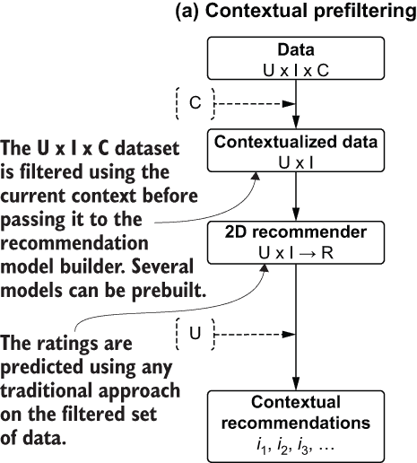

图 7.6 上下文预过滤

当提取用户 × 项目数据集时，可以使用文献中提出的任何众多传统推荐技术（如第四章和第五章中讨论的方法）来构建模型并提供推荐。这种技术代表了上下文感知推荐引擎第一种方法的最大优势之一。

注意，预过滤方法与在机器学习和数据挖掘中基于最相关上下文信息组合构建多个局部模型的任务相关。而不是使用所有可用的评级来构建全局评级估计模型，预过滤方法（在实际场景中是预先构建的）构建了一个局部评级估计模型，该模型仅使用与用户指定的推荐标准（如周六或工作日）相关的评级。

在这种方法中，上下文 c 实际上充当了一个过滤器，用于选择相关的评级数据。以下是一个电影推荐系统上下文数据过滤器的示例：如果某人想在周六看电影，则只使用周六的评级数据来推荐电影。提取相关数据集、构建模型和提供推荐当然需要时间，尤其是如果数据集很大。因此，预先计算了多个版本，使用最相关的上下文信息组合。

在图方法中，考虑图 7.3 中所示模型，执行此类预过滤包括通过运行如下查询来选择相关事件。

列表 7.2 基于相关上下文信息过滤事件

```
MATCH (event:Event)-[:EVENT_ITEM]->(item:Item)
MATCH (event)-[:EVENT_USER]->(user:User)
MATCH (event)-[:EVENT_TIME]->(time:Time)
MATCH (event)-[:EVENT_LOCATION]->(location:Location)
MATCH (event)-[:EVENT_COMPANION]->(companion:Companion)
WHERE time.value = "Weekday"
AND location.value = "Home"
AND companion.value = "Alone"
RETURN user.userId, item.itemId, event.rating
```

在这个查询中，我们只考虑在家庭中仅在工作日发生的事件。输出是我们多维矩阵的一个切片。如果我们想获取 <周末，电影院，伙伴> 的用户 × 项目矩阵，查询将如下所示。

列表 7.3 基于不同上下文信息过滤事件

```
MATCH (event:Event)-[:EVENT_ITEM]->(item:Item)
MATCH (event)-[:EVENT_USER]->(user:User)
MATCH (event)-[:EVENT_TIME]->(time:Time)
MATCH (event)-[:EVENT_LOCATION]->(location:Location)
MATCH (event)-[:EVENT_COMPANION]->(companion:Companion)
WHERE time.value = "Weekend"
AND location.value = "Cinema"
AND companion.value = "Partner"
RETURN user.userId, item.itemId, event.rating
```

结果矩阵将不同。

当然，没有必要指定所有上下文信息。某些维度可以被忽略。例如，我们可能有一个包含 <电影院，伙伴> 的上下文，其中时间维度可能是不相关的。在这种情况下，查询看起来如下。

列表 7.4 仅考虑两个上下文信息项过滤事件

```
MATCH (event:Event)-[:EVENT_ITEM]->(item:Item)
MATCH (event)-[:EVENT_USER]->(user:User)
MATCH (event)-[:EVENT_LOCATION]->(location:Location)
MATCH (event)-[:EVENT_COMPANION]->(companion:Companion)
WHERE location.value = "Cinema"
AND companion.value = "Partner"
RETURN user.userId, item.itemId, event.rating
```

图模型非常灵活。如前所述，数据过滤后，任何经典方法都可以应用于构建模型并提供推荐。假设我们想使用协同方法——具体来说，是最近邻方法。我们必须计算项目、用户或两者的相似度。结果相似度可以存储为项目与/或用户之间简单的关系，但预过滤条件的信息将会丢失。可以在关系中添加一个属性来跟踪用于计算它们的信息来源，但这很难查询；更重要的是，这种方法没有使用图的能力来加速通过节点和关系的导航。

在这种情况下，最佳建模选择是使用节点来具体化相似度，并将它们连接到用于计算它们的相应上下文信息：预过滤条件。结果图模型将类似于图 7.7。

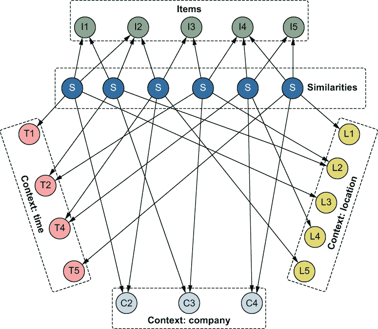

图 7.7 计算后相似节点图模型

在推荐过程中，此模型易于导航。我们可以为每一组上下文信息分配一个 ID，以便查询更简单；这个 ID 不是强制的，但它很有帮助，因为它允许更快、更简单的访问。我们可以通过以下查询获取特定上下文的 k-NN。³

列表 7.5 获取特定上下文信息的 k-NN 的查询

```
MATCH p=(n:Similarity)-->(i)
WHERE n.contextId = 1          ❶
RETURN p
limit 50
```

❶ 将 ID 分配给特定的上下文信息集合，使我们能够通过上下文 ID 进行查询。

以下列表允许您创建这样的图模型。

列表 7.6 预过滤方法中计算和存储相似度的代码

```
def compute_and_store_similarity(self, contexts):                         ❶
    for context in contexts:
        items_VSM = self.get_item_vectors(context)
        for item in items_VSM:
            knn = self.compute_knn(item, items_VSM.copy(), 20);           ❷
            self.store_knn(item, knn, context)

def get_item_vectors(self, context):                                      ❸
    list_of_items_query = """
                MATCH (item:Item)
                RETURN item.itemId as itemId
            """
    context_info = context[1].copy()
    match_query = """
                MATCH (event:Event)-[:EVENT_ITEM]->(item:Item)
                MATCH (event)-[:EVENT_USER]->(user:User)
            """
    where_query = """
                WHERE item.itemId = $itemId 
            """

    if "location" in context_info:                                        ❹
        match_query += "MATCH (event)-[:EVENT_LOCATION]->(location:Location) "
        where_query += "AND location.value = $location "

    if "time" in context_info:
        match_query += "MATCH (event)-[:EVENT_TIME]->(time:Time) "
        where_query += "AND time.value = $time "

    if "companion" in context_info:
        match_query += "MATCH (event)-[:EVENT_COMPANION]->
        ➥ (companion:Companion) "
        where_query += "AND companion.value = $companion "

    return_query = """
                WITH user.userId as userId, event.rating as rating
                ORDER BY id(user)
                RETURN collect(distinct userId) as vector 
            """

    query = match_query + where_query + return_query
    items_VSM_sparse = {}
    with self._driver.session() as session:
        i = 0
        for item in session.run(list_of_items_query):
            item_id = item["itemId"];
            context_info["itemId"] = item_id
            vector = session.run(query, context_info)
            items_VSM_sparse[item_id] = vector.single()[0]
            i += 1
            if i % 100 == 0:
                print(i, "rows processed")
        print(i, "rows processed")
    print(len(items_VSM_sparse))
    return items_VSM_sparse

def store_knn(self, item, knn, context):
    context_id = context[0]
    params = context[1].copy()
    with self._driver.session() as session:
        tx = session.begin_transaction()
        knnMap = {a: b for a, b in knn}
        clean_query = """                                                 ❺
            MATCH (s:Similarity)-[:RELATED_TO_SOURCE_ITEM]->(item:Item)
            WHERE item.itemId = $itemId AND s.contextId = $contextId
            DETACH DELETE s
        """

        query = """                                                       ❻
            MATCH (item:Item)
            WHERE item.itemId = $itemId
            UNWIND keys($knn) as otherItemId
            MATCH (other:Item)
            WHERE other.itemId = otherItemId
            CREATE (similarity:Similarity {weight: $knn[otherItemId], 
            ➥ contextId: $contextId})
            MERGE (item)<-[:RELATED_TO_SOURCE_ITEM]-(similarity)
            MERGE (other)<-[:RELATED_TO_DEST_ITEM ]-(similarity)
        """

        if "location" in params:                                          ❼
            query += "WITH similarity MATCH (location:Location 
            ➥ {value: $location}) "
            query += "MERGE (location)<-[:RELATED_TO]-(similarity) "

        if "time" in params:
            query += "WITH similarity MATCH (time:Time {value: $time}) "
            query += "MERGE (time)<-[:RELATED_TO]-(similarity) "

        if "companion" in params:
            query += "WITH similarity MATCH (companion:Companion 
            ➥ {value: $companion}) "
            query += "MERGE (companion)<-[:RELATED_TO]-(similarity) "

        tx.run(clean_query, {"itemId": item, "contextId": context_id})
        params["itemId"] = item
        params["contextId"] = context_id
        params["knn"] = knnMap
        tx.run(query, params)
        tx.commit()

def compute_knn(self, item, items, k):
    knn_values = []
    for other_item in items:
        if other_item != item:
            value = cosine_similarity(items[item], items[other_item])
            if value > 0:
                knn_values.append((other_item, value))
    knn_values.sort(key=lambda x: -x[1])
    return knn_values[:k]
```

❶ 预过滤中计算相似度的入口点。上下文参数指定上下文信息。此函数必须多次运行，以处理多个上下文信息的组合。

❷ 计算相似度。余弦函数与第 4、5、6 章多次使用的是同一个。

❸ 根据相关上下文信息预过滤数据集，并返回带有相关稀疏向量的常规项目列表

❹ 根据上下文信息更改查询的 if 语句

❺ 清理先前存储模型的查询

❻ 创建新的相似度节点并将它们连接到相关项目和上下文的查询

❼ 根据过滤条件修改查询的 if 语句

如前所述，确切上下文可能过于狭窄。例如，考虑周六与伴侣在电影院看电影的情况——或者更正式地，c = <Partner, Cinema, Saturday>。使用这个确切上下文作为数据过滤查询可能有问题，因为可能没有足够的数据来进行准确的评分预测。为了解决这个问题，Adomavicius 和 Tuzhilin [2005]建议通过聚合较窄的上下文细节来泛化过滤条件，这些细节可能并不重要。这些泛化是我们之前讨论的分类法，其中一些例子在图 7.4 中展示过。例如，周六可以成为周末，而周一到周五被认为是工作日。不仅容易在图中表示这样的层次结构或聚合，而且还可以查询它们。在过滤数据时使用更广泛的概念可以提供更好的结果。

当考虑预滤波方法时，重要的是确定它生成的局部（特定于某些上下文信息）模型是否优于传统的 2D 技术的全局模型，该模型忽略了与上下文维度相关的所有信息。在这种情况下，可能最好使用上下文预滤波来推荐周末在电影院观看的电影，而使用传统的 2D 技术（忽略上下文信息）来推荐按需在家观看的电影。在这种情况下计算未知评分时的权衡是在以下方面：

+   使用更具体（在上下文信息较窄的意义上）但相关的数据（预滤波）

+   使用所有可用的数据（传统的 2D 推荐）

没有简单的规则可以帮助我们在这两种计算之间做出选择；哪种方法更成功取决于许多因素，例如上下文信息类型、应用领域、用户行为以及可用数据的数量和稀疏性。因此，预滤波推荐方法在某些上下文中可能优于传统的 2D 推荐技术，但在其他上下文中则不然。基于这一观察，Adomavicius 和 Tuzhilin [2005]提出，在没有进行过滤的情况下，将上下文预滤波与传统的 2D 技术相结合。

上下文后滤波

如图 7.8 所示，上下文后滤波方法在模型生成过程中忽略了上下文信息。

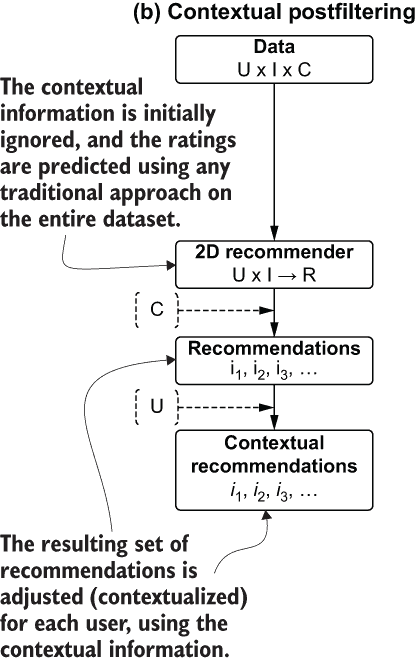

图 7.8 上下文后滤波

此外，无论上下文如何，都会计算所有候选项目的排序列表。后滤波方法在后续阶段使用上下文信息来调整每个用户的推荐列表。对前 N 个项目的调整可以有两种方式：

+   过滤掉给定上下文中不相关的推荐

+   调整列表中推荐的排序

在我们的电影推荐应用 Reco4.me 中，如果用户在周末只看喜剧，推荐系统可能会过滤掉周末观看推荐列表中的所有非喜剧，或者通过降低它们的评分来惩罚它们。

哪种方法更可取将取决于应用。Panniello 等人[2009]对精确（即非泛化）预过滤方法与他们称为 Weight 和 Filter 的后过滤方法进行了实验比较，使用了几个现实世界的电子商务数据集。他们的结果显示，Weight 后过滤方法优于精确预过滤方法，而后者又优于 Filter 方法。然而，根据您的应用，结果可能会有所不同。

过滤或调整排名的方法可以分为基于启发式或基于模型。启发式后过滤方法侧重于在给定上下文中（例如，在电影院观看周六电影时喜欢的演员）为给定用户找到共同的项目特征（属性），然后使用这些属性来调整推荐。这种方法需要存储每个项目的元数据并搜索用户偏好的共同模式。

在图模型中，表示项目元数据是直接的，前几章（特别是对于基于内容的策略）已经介绍了多种建模技术。将这些模型与用户×项目×上下文图表示混合是一个简单的练习；图 7.9 展示了可能的结果。

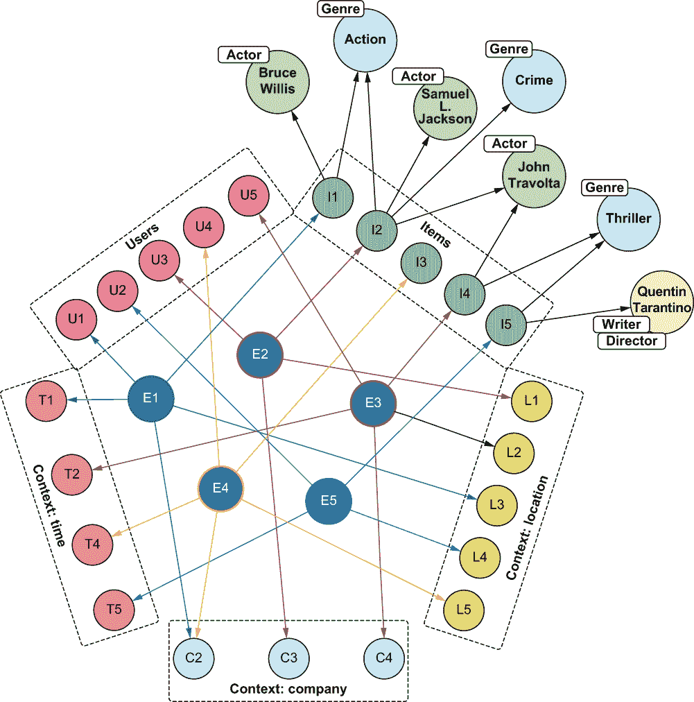

图 7.9 表示事件上下文信息以及项目属性的 n 分图

DePaulMovie 数据集包含每部电影的 IMDb ID 引用，因此我们可以重用第四章中实现的代码来从 IMDb 获取和添加信息。该代码在本书的仓库中的文件 import_depaulmovie.py 中展示。

导入后，可以使用以下查询来根据上下文信息计算用户的共同点。请注意，这里显示的查询专注于特定用户以证明概念。查询仅考虑所有可能组合中的两个上下文：<Cinema, Partner>和<Home, Alone>。我们将从<Cinema, Partner>上下文（列表 7.7）开始。

列表 7.7 查询获取上下文<Cinema, Partner>的用户资料

```
MATCH (user:User)<-[:EVENT_USER]-(event:Event)
MATCH (event)-[:EVENT_ITEM]->(item:Item)-[]-(feature:Feature)
MATCH (event)-[:EVENT_LOCATION]->(location:Location)
MATCH (event)-[:EVENT_COMPANION]->(companion:Companion)
WHERE user.userId = "1032"
AND location.value = "Cinema"
AND companion.value = "Partner"
RETURN CASE 'Genre' IN labels(feature)
    WHEN true THEN feature.genre
    ELSE feature.name END AS feature, count(event) as occurrence
ORDER BY occurrence desc
```

列表 7.7 的结果显示在图 7.10 中。

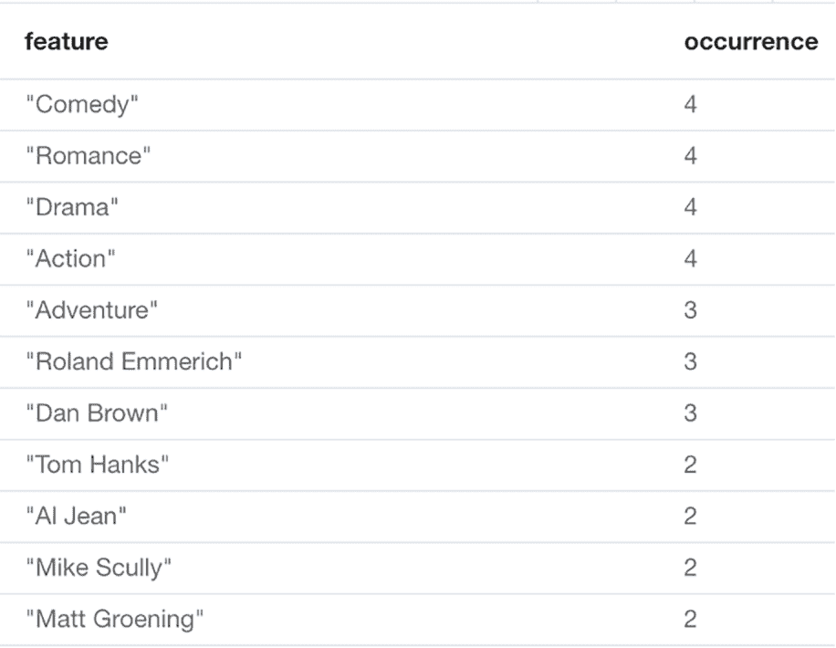

图 7.10 列表 7.7 的结果

从结果来看，当这位用户与伴侣在电影院看电影时，用户更喜欢喜剧、浪漫、戏剧和动作电影。喜欢的演员/导演遵循相同的逻辑。现在让我们看看<Home, Alone>上下文（列表 7.8）。

列表 7.8 查询获取上下文<Home, Alone>的用户偏好/资料

```
MATCH (user:User)<-[:EVENT_USER]-(event:Event)
MATCH (event)-[:EVENT_ITEM]->(item:Item)-[]-(feature:Feature)
MATCH (event)-[:EVENT_LOCATION]->(location:Location)
MATCH (event)-[:EVENT_COMPANION]->(companion:Companion)
WHERE user.userId = "1032"
AND location.value = "Home"
AND companion.value = "Alone"
RETURN CASE 'Genre' IN labels(feature)
    WHEN true THEN feature.genre
    ELSE feature.name END AS feature, count(event) as occurrence
ORDER BY occurrence desc
```

本查询的结果显示在图 7.11 中。

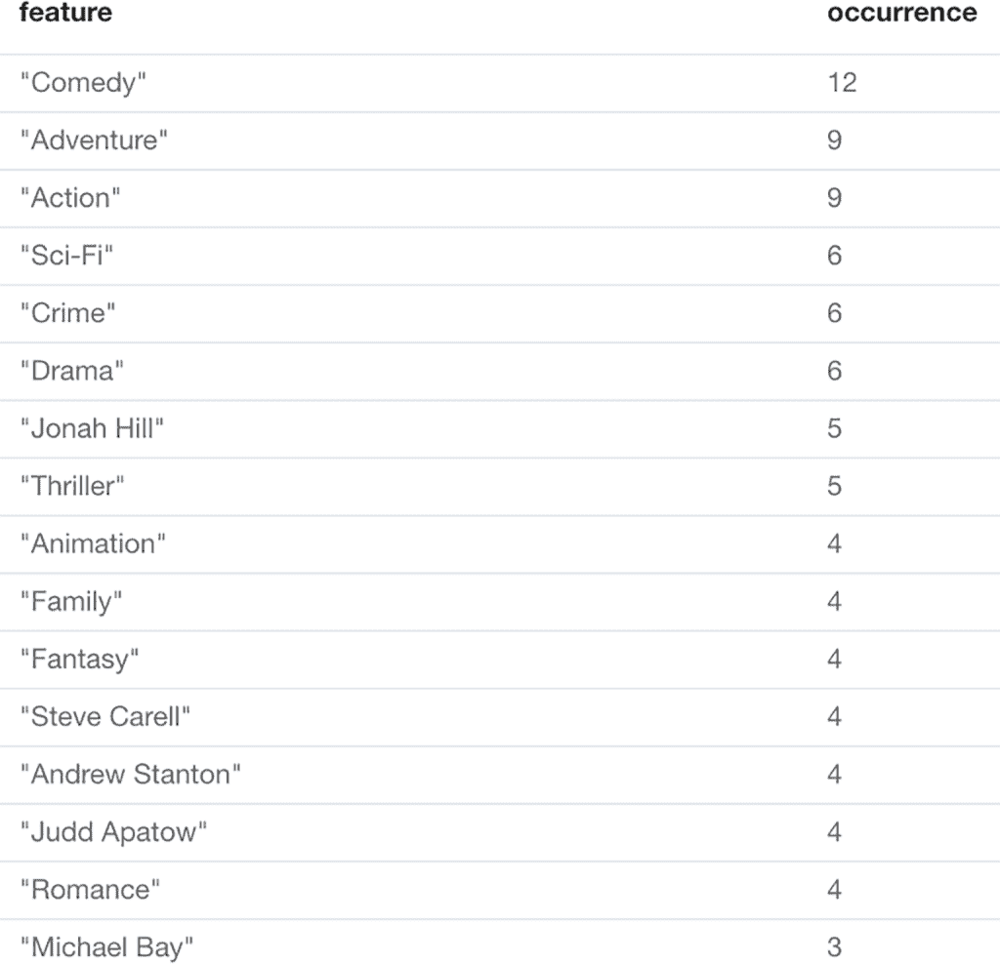

图 7.11 列表 7.8 的结果

这个用户和之前的是同一个吗？这里的结果不同，显示了上下文在用户偏好中扮演的角色。以这种方式获得的结果可以用于后过滤或微调传统协同过滤方法的结果。基于上下文的偏好可以预先计算并存储回我们的图模型中。结果将类似于图 7.12。

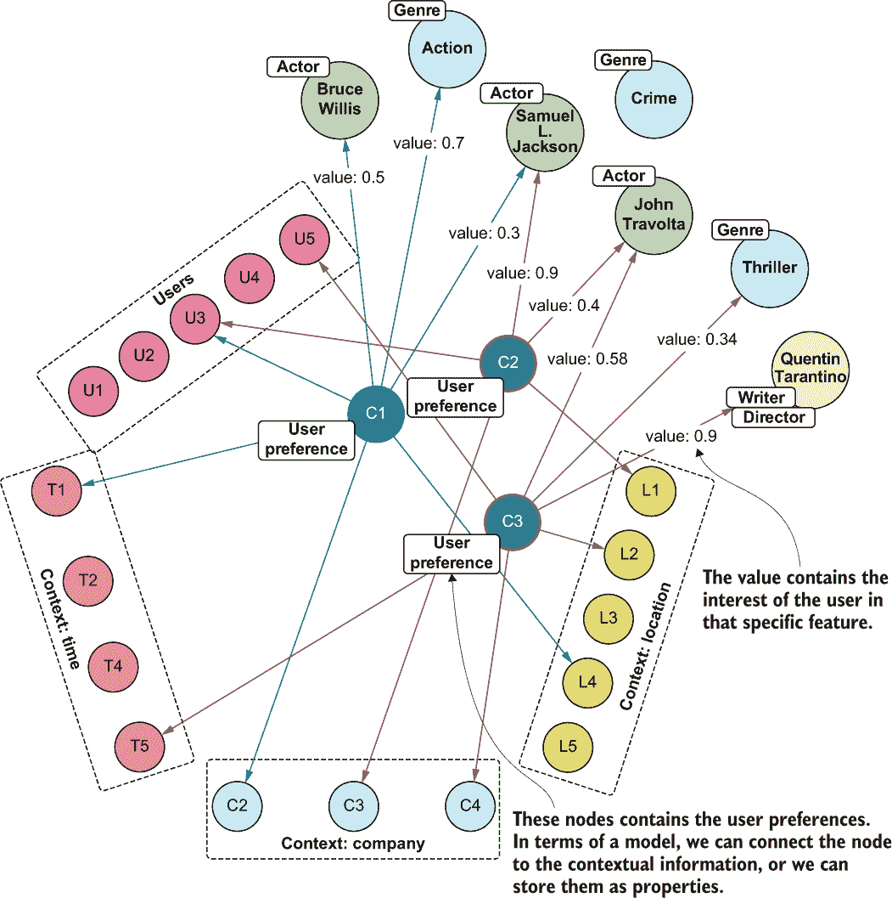

图 7.12 上下文化用户偏好的图模型

图 7.12 中模型中展示的节点和关系类型可以通过运行以下查询来创建。

列表 7.9 创建用户偏好的查询

```
MERGE (userPreference:UserPreference {userId: "1032", location:"Home", 
➥ companion: "Alone"})
WITH userPreference
MATCH (user:User)<-[:EVENT_USER]-(event:Event)
MATCH (event)-[:EVENT_LOCATION]->(location:Location)
MATCH (event)-[:EVENT_COMPANION]->(companion:Companion)
WHERE user.userId = userPreference.userId
AND location.value = userPreference.location
AND companion.value = userPreference.companion
WITH userPreference, user, collect(distinct event) as events
MERGE (userPreference)<-[:HAS_PREFERENCE]-(user)
WITH userPreference, events, size(events) as size
UNWIND events as event
MATCH (event)-[:EVENT_ITEM]->(item:Item)-[]-(feature:Feature)
WITH feature, userPreference, 1.0f*count(event)/(1.0f*size) as 
➥ preferenceValue
MERGE (userPreference)-[:RELATED_TO {value: preferenceValue}]->(feature)
```

值得注意的是，此查询使用属性来表示用户偏好的上下文信息。这个例子与图 7.12 中所示的模型设计略有不同，但它是一个有效的选项。在接下来的练习中，你将被邀请创建一个与模型完全匹配的等效查询。

练习

以列表 7.9 为基础，创建以下查询：

+   不同上下文下的相同查询

+   使用关系代替属性来指定上下文的等效查询

+   仅针对演员的查询

+   仅针对导演的查询

+   仅针对编剧的查询

+   仅针对类型的查询

在推荐过程中，我们可以使用有关用户偏好的信息来确定如何调整第一个方法获得的结果。获取此信息的查询很简单，如列表 7.10 所示。

列表 7.10 获取特征提升因素的查询

```
MATCH (user:User)-[:HAS_PREFERENCE]->(userPreference:UserPreference)-
➥ [r:RELATED_TO]->(feature:Feature)
WHERE user.userId = "1032"
AND userPreference.location = "Home"
AND userPreference.companion = "Alone"
RETURN CASE 'Genre' IN labels(feature)
    WHEN true THEN feature.genre
    ELSE feature.name END AS feature, r.value
```

此查询返回的值可以用作在经典方法中获取第一个通用推荐列表之后作为提升因素的值。与后过滤的启发式方法相比，基于模型的方法是另一种选择。在这里，我们构建预测模型，这些模型计算用户在特定情境下选择某种类型项目的概率（例如，独自在家时选择特定类型的电影的可能性），然后使用这个概率来调整推荐。计算概率的算法超出了本章的范围，但一旦计算出来，它们可以像图 7.12 中所示的那样存储在图模型中。

需要注意的是，与上下文预过滤的情况一样，上下文后过滤方法的最大优势是它允许使用任何传统的推荐技术。

上下文建模

第三种上下文感知推荐系统是基于上下文建模的。这种方法如图 7.13 所示，在模型创建过程中直接使用上下文信息，从而产生了真正多维的推荐函数，这些函数代表预测模型（如决策树和回归）或结合上下文信息（除用户和项目数据外）的启发式计算。

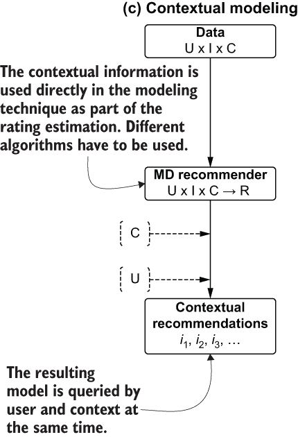

图 7.13 上下文建模

在过去几年中，基于各种启发式方法和预测建模技术的推荐算法大量开发。其中一些技术可以被认为是将二维扩展到多维推荐设置中的扩展。Frolov 和 Oseledets[2016]展示了如何将用户 × 项目 × 上下文数据集表示为多维矩阵或张量。⁴这样一个张量可以如图 7.14 所示表示，其中每个事件代表一个元素，上下文、用户和项目代表维度。在这种表示中，对张量的某些操作，如切片，可以通过简单的查询轻松完成。

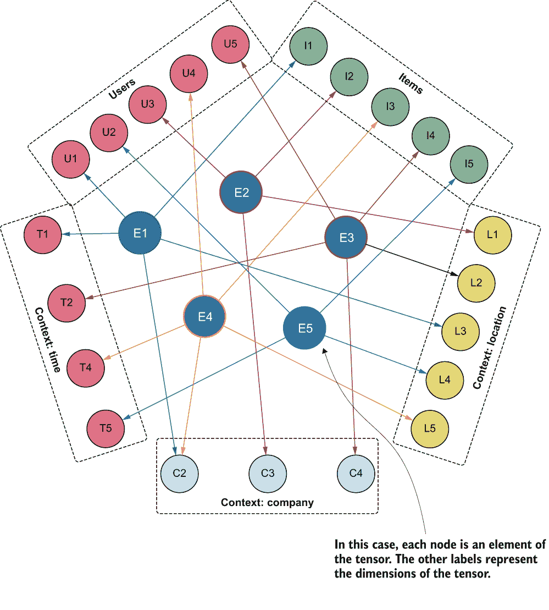

图 7.14 图模型中的张量表示（作为一个多部分图）

其他研究人员已经使用纯图方法来解决上下文建模的任务，将上下文感知推荐视为一个搜索问题，即在所谓的上下文图中找到对用户感兴趣的项目[Wu 等人，2015]。之前提出的创建图的方法在这种情况下将不起作用，因为模型设计不同。相反，图是按照以下方式创建的。给定上下文图 G = {V, E}，顶点和边被定义为如下：

+   顶点集 V 被划分为几个不同的集合，例如用户集 U、项目集 I、属性集 A 和上下文集 C。C 代表节点中上下文信息的组合。《家庭，独自，工作日》是一个节点，例如。节点 A 代表用户或项目的静态特征或属性——与上下文信息不同，这些信息不会因不同的评分而改变。

+   边集 E 由笛卡尔积的现有连接组成：V × V。具有不同类型的边具有不同的语义。U × A 将用户及其属性（用户兴趣）连接起来，U × I 将用户与其交互过的项目连接起来（旧的 User × Item 数据集），U × C 将用户与上下文连接起来。存储社交网络信息的子矩阵 U × U 可能存在也可能不存在。

上下文图 G 可以表示为一个邻接矩阵，其中所有子矩阵都配置为对称的（例如，UI^T 是 UI 的转换矩阵），如表 7.1 所示。

表 7.1 用户-项目交互的邻接矩阵表示

|  | 用户 | 项目 | 上下文 | 属性 |
| --- | --- | --- | --- | --- |
| 用户 | UU | UI | UC | UA |
| 项目 | UIT | 0 | IC | IA |
| 上下文 | UCT | ICT | 0 | 0 |
| 属性 | UAT | IAT | 0 | 0 |

结果图显示在图 7.15 中。

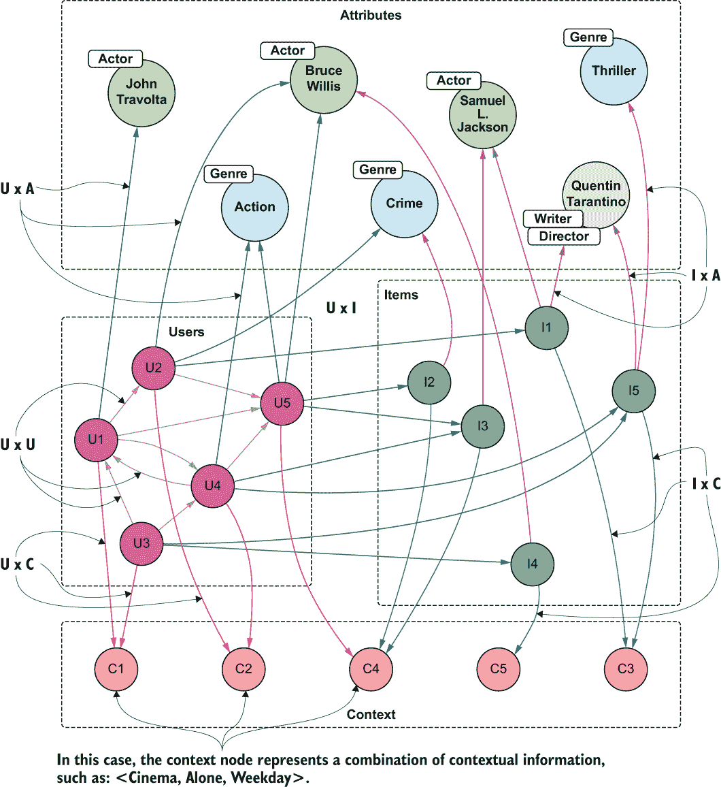

图 7.15 上下文图的表示

为了避免过多的细节，使用随机游走方法（特别是个性化 PageRank 或带重启的 PageRank 算法）来计算图中节点的相关性。推荐过程使用这些相关性分数来估计未看到的项 i 被用户 u 访问的可能性。有关详细描述，请参阅 Wu 等人[2015]。

优缺点

对于所讨论的基于上下文的推荐的三种技术，每种都有其优势和劣势：

+   预过滤

+   +   *优点*—这种方法不仅易于实现，还允许你使用任何传统的推荐技术。如果用户当前上下文的相关数据可用，它可以提供相当准确的结果。

    +   *缺点*—数据稀疏性问题在这里很常见，因为对于某些上下文，可能没有足够的数据来进行准确的推荐。此外，为了性能，这种方法要求你预先构建大量模型并保持它们全部更新。

+   后过滤

+   +   *优点*—这种方法甚至更容易实现：你使用传统的技术（如协同过滤）来生成推荐，然后对结果应用过滤器。

    +   *缺点*—后过滤会过滤掉或减少与用户当前上下文不相关的元素的评分。预测准确性几乎与上下文无关，并且主要与传统方法一致。数据稀疏性在这里也是一个问题，正如传统方法中那样；可能所有生成的元素都与当前上下文无关。

+   上下文建模

+   +   *优点*—这一类的方法是最新的，往往也是最准确的。先前方法的主要缺点是上下文没有紧密集成到推荐算法中，这阻止了你充分利用各种用户-项目组合和上下文值之间的关系。上下文建模从一开始就考虑上下文，使得可以创建精确的模型，并使用用户、项目和上下文信息进行查询。

    +   *缺点*—大多数可用的上下文建模方法实现起来都很复杂，创建和更新模型需要大量的计算能力。

技术的选择取决于权衡这些优缺点。更具体地说，选择取决于可用数据的类型和数量、新数据的频率以及模型应与当前数据多么紧密地一致。

### 7.1.3 图方法的优势

在本节中，我们讨论了创建上下文感知推荐引擎的不同方法：预过滤、后过滤和上下文建模。这里介绍的所有方法和算法都可以使用 User × Item × Contexts 数据集的图表示，这简化了访问和导航这些复杂数据。具体来说，基于图的方法在上下文感知推荐系统中的主要方面和优势包括

+   表示任何此类系统输入的 User × Item × Contexts 多维矩阵可以通过一个实体化交互事件的图来表示。这种数据模型加速了过滤阶段，并防止了数据稀疏性问题，这在当前场景中可能是个问题。

+   一个合适的图模型可以存储上下文预过滤的多模型结果。具体来说，在预过滤的最近邻方法中，这会导致项目或用户之间不同的相似性集合，图可以通过实体化相似性节点来存储多个模型的结果。

+   在推荐阶段，图访问模式简化了基于当前用户和当前上下文选择相关数据的过程。

+   在上下文建模方法中，图提供了一种适合存储张量、简化某些操作的方法。此外，一些特定的方法不仅使用数据（如前所述的上下文图）的图表示，还使用图算法，如随机游走和 PageRank 来构建模型并提供推荐。

## 7.2 混合推荐引擎

本书讨论的推荐方法利用不同的信息来源和遵循不同的范式来做出推荐。尽管它们基于接收者的假设兴趣产生个性化的结果，但在不同的应用领域中，它们的成功程度各不相同。协同过滤利用用户模型中的一种特定类型的信息（项目评分）来推导推荐，而基于内容的推荐方法则依赖于产品特征和文本描述以及用户配置文件。基于会话的方法使用匿名用户的点击流，而上下文感知方法则使用上下文信息以及项目评分来根据用户的当前需求微调推荐。

这些方法各有优缺点（在本章和前几章中详细说明），包括处理数据稀疏性和冷启动问题的能力，以及获取和处理内容或上下文所需的工作量。

图 7.16 概述了一个推荐系统作为黑盒，它将输入数据转换为输出项的排序列表。潜在的输入，基于这里讨论的方法，包括用户模型和上下文信息，以及会话数据和项目数据；其他输入，由其他推荐模型所需，也可以包括在内。然而，没有任何基本方法能够充分利用所有这些输入。因此，构建结合不同算法和模型优势的混合系统，以克服上述一些缺点和问题，已成为最近研究的目标。

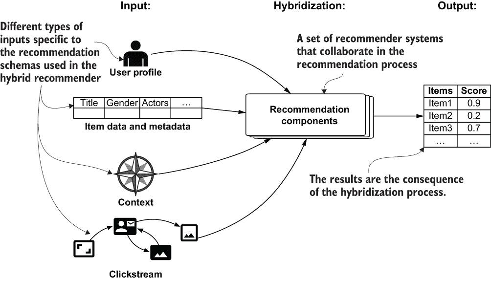

图 7.16 混合推荐系统作为黑盒

混合推荐系统是结合多个算法或推荐组件的技术实现。Burke 的[2002]分类法区分了七种混合策略。从更一般的角度来看，这七个变体可以抽象为三种基本设计：

+   *单体*—这种混合化设计在一个算法实现中结合了多种推荐策略的方面。几个推荐者几乎贡献了虚拟的，因为混合使用了针对另一个推荐算法的特定输入数据，或者输入数据通过一种技术增强，实际上被另一种技术利用。特征组合和特征增强策略可以归为此类。*特征组合*使用多种多样的输入数据。它可以结合协作特征，如用户的喜好和不喜欢，与目录项目的特征内容。*特征增强*应用复杂的转换步骤。贡献的推荐系统通过预处理其知识源来增强实际推荐系统的特征空间。见图 7.17 a。

+   *并行化*—这种方法需要至少两个独立的推荐系统实现，随后将它们组合在一起（见图 7.17 b）。并行化混合推荐系统相互独立运行，并产生单独的推荐列表。在随后的混合化步骤中，它们的输出被组合成最终的推荐集。根据 Burke 的分类法，加权、混合和切换策略要求推荐组件并行工作。

+   *流水线*—在这种情况下，多个推荐系统以流水线架构（见图 7.17 c）连接在一起。一个推荐系统的输出成为后续一个推荐系统的输入。可选地，后续的推荐系统组件也可能使用原始输入数据的一部分。Burke 定义的级联和元级混合架构就是此类架构的例子。

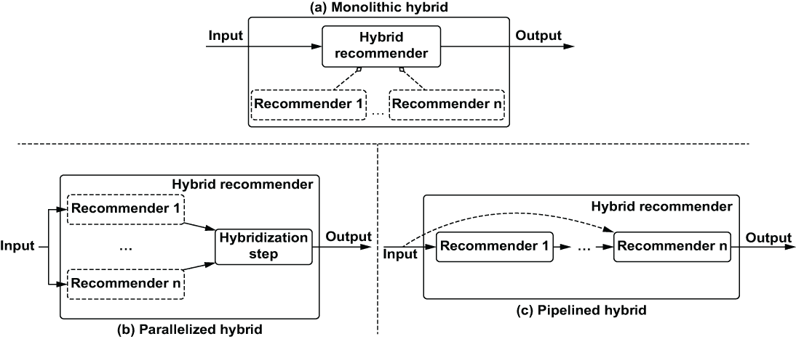

图 7.17 混合设计技术

在本章中，我们将重点关注并行化混合技术，它允许多个推荐系统并行运行，每个系统使用自己的输入并产生自己的输出模型。结果模型必须存储在某个地方，以便在推荐阶段可以轻松访问和混合或合并。在这种情况下，图提供了

+   一种适合存储在单一、同质和连通的数据源中，以满足每个推荐系统所需的所有不同信息集的表示

+   一种用于存储训练过程结果的模型，以便可以并行查询，然后根据混合策略合并

### 7.2.1 多模型，单图

让我们更详细地看看并行化混合方法（图 7.18）。假设你有两种类型的推荐系统需要混合：一种是基于内容的，如第四章中描述的，另一种是基于协作的，如第五章中描述的。这种情况很常见：通常很有用将这两种类型的推荐系统合并，因为每种都可以解决另一种的问题。基于内容的方案可以缓解数据缺失时出现的冷启动问题，例如在新的用户、项目或新平台的情况下，而基于协作过滤的方法则提供更准确的结果，并且在没有用户和项目信息或元数据的情况下也能工作。

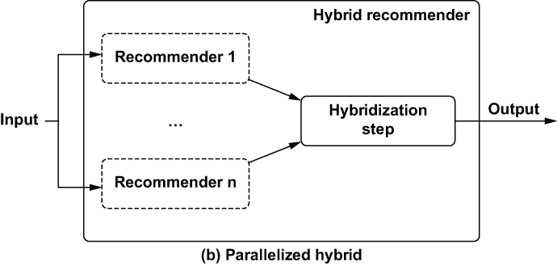

图 7.18 并行化方法

作为并行化混合推荐系统输入的图，该系统使用这两种类型的推荐器作为输入，看起来像图 7.19。

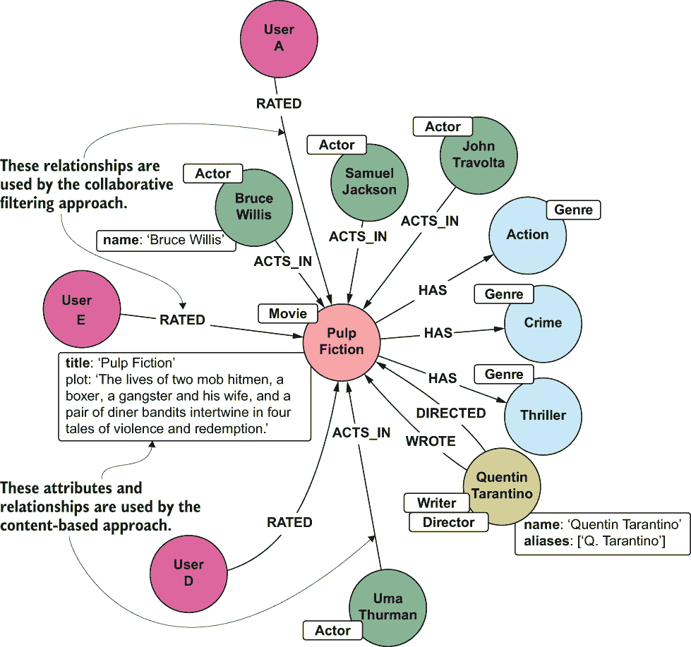

图 7.19 示例图模型，结合了协作过滤和基于内容的方案

在这种情况下，重要的是要注意两个推荐系统如何以不同的方式使用评分连接。在协作过滤方法中，它用于创建用户-项目数据集；在基于内容的方法中，它用于访问用户感兴趣的特征。当模型被计算后，它们可以存储回图中，如图 7.20 所示。

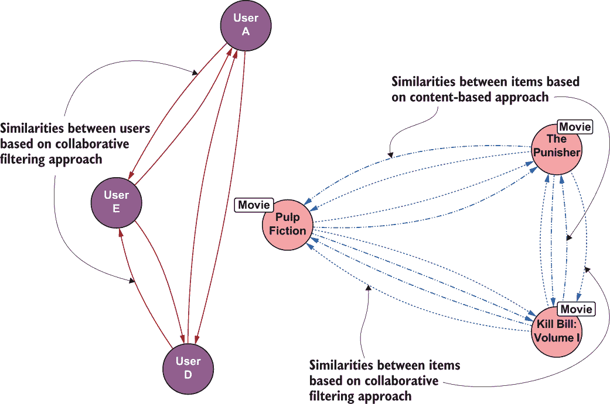

图 7.20 在同一图中混合多个推荐模型

### 7.2.2 提供推荐

现在我们已经构建了模型并将它们存储在图中，我们可以结合它们的输出以获得一个独特的推荐项目列表（有时是多个列表）以推荐给用户。如前所述，并行化混合设计并排使用多个推荐器，并使用特定的混合机制来聚合它们的输出。混合机制定义了向用户提供推荐的战略。根据 Burke 的[2002]分类，可以应用三种主要策略：混合、加权以及切换。对于多个推荐列表，如多数投票方案等附加组合策略也可能适用。

混合

*混合*混合策略在用户界面级别结合不同推荐系统的结果。不同技术的结果一起呈现；因此，用户 u 的推荐结果是一系列项目列表。

每个推荐器的得分最高的项目并排显示给用户，通常指定每个项目的标准。有时在混合方法中，需要某种类型的冲突解决来防止多个列表中重叠过多。

加权

一种*加权*混合策略通过计算两个或多个推荐系统得分的加权总和来结合它们的推荐。图 7.21 是一个图形模型，展示了其工作原理。

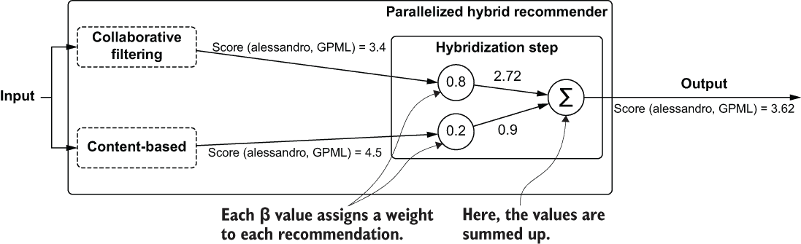

图 7.21 使用图形模型解释加权方法

因此，给定 n 个不同的推荐函数 scorek 及其相关的相对权重β[k]，最终得分将根据以下公式计算

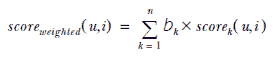

其中 n 是需要混合的推荐器输出的数量。此外，项目得分需要限制在所有推荐器中相同的范围内，并且所有β[k]的总和必须为 1。这种方法简单直接，因此是结合不同推荐技术预测能力的加权方式的一种流行策略。

值得注意的是，β[k]的值可以是动态的，在推荐系统的一生中发生变化，例如在早期由于缺乏足够的信息而无法有效应用协同过滤时，优先考虑基于内容的推荐方法，然后在收集到更多数据后逐渐增加其权重。此外，这些值可以针对每个用户动态变化，将较高的β[k]值分配给基于内容的推荐，直到系统收集到足够的数据，使得协同过滤方法变得有效。可以应用不同的技术来评估如何设置并演变权重的值。

切换

*切换* 混合推荐系统需要一个预言机来决定在特定情况下应使用哪个推荐器，这取决于用户配置文件和/或推荐结果的质量。图 7.22 是一个描述其工作原理的图形模型。

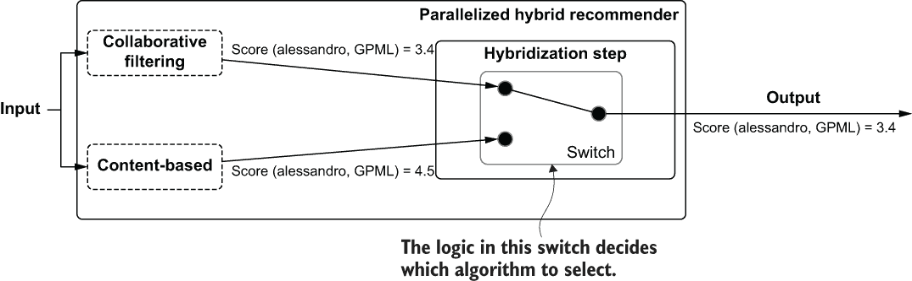

图 7.22 通过图形模型解释的切换方法

这样的评估可以按照以下方式进行，

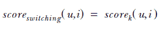

其中 k 由切换条件确定。为了克服冷启动问题，基于内容和协作的切换混合推荐系统可以最初基于内容进行推荐，直到有足够的评分数据可用。当协同过滤组件可以提供具有足够置信度的推荐时，推荐策略可以切换。在极端情况下，可以实施动态权重调整作为切换混合。除了动态选择的单个推荐器外，所有其他推荐器的权重都设置为 0，而单个剩余推荐器的输出被分配一个权重为 1。

### 7.2.3 图方法的优势

在本节中，我们讨论了如何创建一个混合推荐引擎，重点关注并行化混合方法：混合、加权以及切换。这里提出的所有方法都可以利用数据图表示，无论是训练还是生成的模型。基于图混合方法的主要方面和优势是

+   各种信息集可以在相同的数据结构中共存，这使得更容易满足混合推荐系统的数据管理需求。

+   每个推荐器产生的独立模型可以一起存储，并在推荐阶段轻松访问。

## 摘要

本章介绍了使用上下文信息实现推荐引擎的最新高级技术，并展示了如何结合不同的方法以产生更大的效果。各种数据模型说明了图在满足不同训练数据和模型存储需求方面的有用性和灵活性。在本章中，你学习了

+   如何通过在模型和相关图模型中嵌入上下文信息来提高推荐质量

+   如何使用图来为上下文感知设计方法提供数据：预/后过滤和上下文建模

+   如何在一个推荐引擎中结合多个算法

+   如何在一个大图中混合不同的训练数据集和模型

## 参考文献

[Adomavicius and Tuzhilin, 2005] Adomavicius, Gediminus, 和 Alexander Tuzhilin. “迈向下一代推荐系统：对现有技术和可能扩展的综述。” *IEEE 知识和数据工程杂志* 17(6): 734-749.

[巴齐尔和布雷松，2005] 巴齐尔，玛丽，帕特里克·布雷松。 “在使用上下文之前理解上下文。” *第 5 届国际和跨学科建模与使用上下文会议论文集* (2005): 29-40。

[伯克，2002] 伯克，罗宾。 “混合推荐系统：调查和实验。” *用户建模与用户自适应交互* 12:4 (2002): 331-370。

[多费尔等，2016] 多费尔，斯蒂芬，罗伯特·雅施克，格德·斯特姆。 “在社交书签系统中推荐基准测试中核心的作用。” *ACM 智能系统与技术研究* 7:3 (2016): 文章 40。

[弗罗洛夫和奥谢列茨，2016] 弗罗洛夫，叶夫根尼，伊万·奥谢列茨。 “张量方法和推荐系统。” arXiv 预印本 arXiv:1603.06038 (2016)。

[伊拉里等，2018] 伊拉里，塞戈里奥，拉奎尔·特里略-拉多，拉蒙·赫尔莫索。 “面向上下文感知推荐系统的数据集：当前上下文和可能的方向。” *IEEE 第 34 届国际数据工程研讨会论文集* (2018)。

[帕尔米萨诺等，2008] 帕尔米萨诺，科西莫，亚历山大·图齐林，米歇尔·戈戈利奥内。 “在个性化应用中使用上下文来改进客户预测建模。” *知识数据工程杂志* 20:11 (2008): 1535-1549。

[帕尼内洛等，2009] 帕尼内洛，翁贝托，亚历山大·图齐林，米歇尔·戈戈利奥内，科西莫·帕尔米萨诺，安托·佩多内。 “在上下文感知推荐系统中，预先过滤和后过滤方法的实验比较。” *第 3 届 ACM 推荐系统会议论文集* (2009): 265-268。

[萨奇曼，1987] 萨奇曼，露西。 *计划和情境行动*。 英国剑桥：剑桥大学出版社，1987。

[吴等，2015] 吴，浩，岳坤，刘晓欣，裴一建，李波。 “基于图上下文建模和后过滤的上下文感知推荐。” *国际分布式传感器网络杂志* - 关于大数据和知识提取的网络安全物理系统特刊 (2015): 文章 16。

[郑等，2015] 郑勇，班沙德·莫巴舍，罗宾·伯克。 “CARSKit：一个基于 Java 的上下文感知推荐引擎。” *第 15 届 IEEE 国际数据挖掘会议（ICDM）研讨会论文集* (2015): 1668-1671。

* * *

^(1.)[`mng.bz/D1jE`](https://shortener.manning.com/D1jE).

^(2.)为了清理现有的数据库，你可以运行 MATCH (n) DETACH DELETE n，但这可能需要更长的时间。另一个选择是停止数据库并清除数据目录。

^(3.)在代码完成创建 k-NN 之后可以运行查询。在这里，目的是展示如何查询模型。

^(4.)一个 *矩阵* 是一个二维数字网格。一个 *张量* 是矩阵概念的推广，可以具有任意数量的维度：0（一个单独的数字）、1（一个向量）、2（一个传统矩阵）、3（一个数字立方体）或更多。这些高维结构难以可视化。张量的维度被称为其 *秩*（也称为 *阶* 或 *度*）。
