# 8 种基于图的数据欺诈检测基本方法

本章涵盖

+   不同领域欺诈类型的介绍

+   图在建模数据以更快、更轻松地揭示欺诈中的作用

+   使用简单的图模型来对抗欺诈

根据 Van Vlasselaer 等人[2017]的研究：

*欺诈是一种罕见、经过深思熟虑、随时间演变、精心组织和难以察觉的犯罪，以许多不同类型和形式出现。*

这个定义突出了与开发欺诈检测系统相关的挑战的六个欺诈特征：

+   *罕见*——在几乎所有类型的欺诈和各个领域，只有极小部分可用的数据与（或被认为与）欺诈相关。检测欺诈很困难，从历史案例中学习也是如此（在训练阶段）。

+   *经过深思熟虑*——欺诈是经过仔细考虑的计划，不是偶然发生的。

+   *精心组织*——欺诈通常是有组织的犯罪。欺诈者通常以大型团队的形式运作，具有明确的角色。此外，某些类型的欺诈，如洗钱，涉及复杂的结构，可能需要数年才能建立。

+   *难以察觉的隐藏*——欺诈者投入大量精力隐藏欺诈本身，并应用技术使其识别变得困难。

+   *以多种形式出现*——欺诈者在各个领域采用广泛的技术和方法。许多经济活动都容易受到欺诈的影响。

+   随时间演变——欺诈者使用的技巧随着时间的推移而演变，以应对用于对抗他们的欺诈检测方法，双方都在试图领先一步。需要不断开发新的检测方法来应对新的欺诈类型。

因此，对抗欺诈对于机器学习从业者来说是一项具有挑战性的任务，但与此同时，它也非常吸引人。这些考虑也意味着本部分中介绍的技巧、约束和算法与第二部分中介绍的相比有许多不同的特点。

为什么在关于图的书中包含欺诈检测这一主题？Akoglu 等人[2014]认为，图对于异常检测是“至关重要且必要的”，原因如下：

+   *数据的相互依存性*——数据对象通常是相关的，并表现出依赖性。在各种各样的数据集和场景中，数据实例之间存在强大的关系，包括生物数据（如蛋白质-蛋白质相互作用网络）、金融数据（如信用卡交易）、零售网络和社会网络。

+   *强大的表示能力*——图通过关系（链接或边）自然地表示相关对象（节点）之间的相互依存性，这些关系捕捉了长距离相关性。此外，图表示允许通过结合节点和边的属性或类型来表示丰富的数据集。

+   *问题域的关系性*——异常通常具有关系性。欺诈往往是由一组相关主体在紧密合作下实施的。另一个例子，与欺诈无关，可以在系统监控领域找到：一台机器的故障可能导致依赖它的其他机器出现故障，或者由于环境条件，它可能成为其他物理上接近的机器故障概率增加的指标。

+   *稳健的机制*——图是具有对抗鲁棒性的，因为它们可以提供整个网络的全球视角。欺诈者或其他对手可能能够更改或伪造某些行为线索，例如登录时间或 IP 地址，但他们很可能无法消除或隐藏图揭示的数据中连接的所有迹象。当数据以图结构组织时，检查和导航变得更加容易。

在打击欺诈的背景下，图可视化可以在欺诈检测和欺诈调查中发挥关键作用。交易系统越自治，揭露欺诈就越困难，这就是图可视化的用武之地。它为专家提供了通过快速查看可视化并评估单个交易或许多交易的机会，使他们能够发现可疑行为并进一步调查。

## 8.1 欺诈预防和检测

打击欺诈有一些独特的特点，这些特点因领域而异，包括数据的类型、数据的维度和多样性，以及欺诈者的最终目标。尽管如此，我们可以识别出两个主要组成部分，它们是任何有效打击欺诈策略的必要部分 [Bolton and Hand, 2002]：

+   *欺诈预防*指的是可以采取的措施来预防或减少欺诈，例如在纸币上使用荧光纤维、层压金属条和全息图；银行卡的个人识别码；信用卡交易的互联网安全系统；移动电话的 SIM 卡和指纹传感器；以及计算机系统和电话银行账户的密码。这些方法在易受攻击性、有效性、成本和/或对客户的便利性方面都有缺点。需要在利弊之间找到权衡。

+   *欺诈检测*指的是识别或发现欺诈的能力。当欺诈预防失败时，它就会发挥作用，但由于这种情况并不总是显而易见，因此必须始终使用欺诈检测措施。我们可以尽最大努力预防信用卡欺诈，但如果卡的详细信息被盗，我们需要能够尽快检测到欺诈性使用。

值得注意的是，为了防止欺诈而采取的预防措施会导致欺诈者调整他们使用的策略，这反过来又会影响检测欺诈所使用的策略的有效性。所实施的欺诈类型是动态的，因此现行的欺诈减少系统也应该是动态的。尽管欺诈检测和预防是互补的，但必须将它们作为一个整体来考虑，而不是作为独立且无关的系统。

令人惊讶的是，欺诈检测最常见的方法是经典的基于专家的方法，它依赖于欺诈分析师的经验、领域知识、直觉和个人技能。这些方法几乎完全是手动和基于人类的。专家对可疑案件进行手动调查，通常由其他人（如客户投诉被收取未发起的交易费用）引起。

这种分析的结果可能是发现欺诈者正在使用的一种新的欺诈机制。当发现这种机制时，它会被进一步分析和调查，以扩展现有的欺诈检测和预防机制，这通常是通过基于规则的引擎实现的。这个引擎由一系列规则组成，通常以 if-then 语句的形式，应用于每个交易或一系列交易，并在匹配时触发警报或信号。图 8.1 展示了这种方法的思维模型。

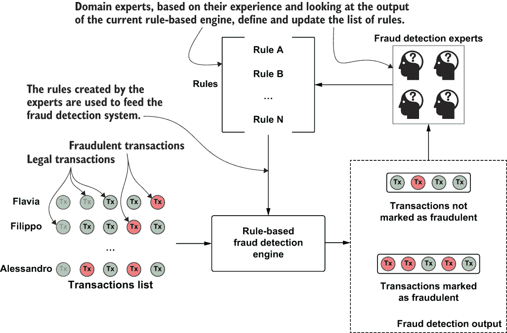

图 8.1 基于规则的引擎思维模型

可以定义一个简单但有效的信用卡欺诈检测规则集如下：¹

*如果*

+   上一次交易金额不到$15

+   上一次交易发生时间不到 2 小时前

+   当前交易金额超过$500

*那么*

+   将状态设置为拒绝

+   在小额交易后设置通知为大额

尽管这种基于专家的方法在许多领域都有用且仍然很常见，但它有几个缺点：

+   基于规则的引擎通常很复杂，因此建造成本很高，因为它们需要欺诈专家的高级手动输入。

+   这种复杂性使得它们难以维护和管理。

+   规则必须保持最新，因为欺诈者不断演变他们的方法，并提出新的方法。一旦他们发现了欺诈减少系统背后的规则，他们就会改变行为以避免被识别。

+   在大多数情况下，这些系统需要进一步的人工跟进、分析和调查。

这种方法的最大缺点是，因为它涉及到大量的人类干预，包括专家输入、分析、评估和监控，它过度依赖难以共享和维护的个人贡献。欺诈检测系统的有效性与特定知识的人的可用性有关。那么当这些人休假或退休时会发生什么呢？

近年来，一种以数据驱动、统计和机器学习为基础的欺诈检测方法正在兴起。与之前提到的以及以下原因一样，自动化的方法比纯粹基于人类的方法更可取：

+   *精确度*——一个自主的系统可以处理大量数据，揭示人类无法识别的欺诈模式。

+   *运营效率*——想想信用卡发行商每天、每分钟和每秒钟需要处理的交易数量。在正常运营所需的时间限制内，让人类实时检查所有交易是不可能的，但计算机可以轻松处理这项任务。此外，基于机器的方法可以通过预筛选、分析每一笔交易/操作，然后将最相关或可疑的交易发送给人类进行进一步调查来支持基于人类的方法。

+   *成本效率*——如前所述，基于专家的欺诈检测系统难以实施和维护。更自动化、数据驱动且因此更有效的方法更受欢迎。

+   *适应效率*——一些自主的数据驱动方法是无监督的（将在这些章节中突出显示）。这一方面不仅使它们在运营和成本上效率高，而且还能随着时间的推移适应欺诈行为和欺诈者行为的演变特征。

为了更好地说明欺诈检测背后的基本思想，让我们考虑一个来自 Fawcett 和 Provost [1997]的简单示例，如表 8.1 所示。

表 8.1 电信异常检测示例

| 通话序列 | 日期和时间 | 星期 | 持续时间 | 起始地 | 目的地 | 欺诈 |
| --- | --- | --- | --- | --- | --- | --- |
| 1 | 2019-01-01 10:05:01 | Mon | 13 mins | 布鲁克林，纽约 | 斯坦福，康涅狄格州 |  |
| 2 | 2019-01-05 14:53:10 | Fri | 5 mins | 布鲁克林，纽约 | 格林威治，康涅狄格州 |  |
| 3 | 2019-01-08 09:42:15 | Mon | 3 mins | 布朗克斯，纽约 | 怀特普莱恩斯，纽约 |  |
| 4 | 2019-01-08 15:01:34 | Mon | 9 mins | 布鲁克林，纽约 | 布鲁克林，纽约 |  |
| 5 | 2019-01-09 15:06:54 | Tue | 5 mins | 曼哈顿，纽约 | 斯坦福，康涅狄格州 |  |
| 6 | 2019-01-09 16:28:20 | Tue | 53 sec | 布鲁克林，纽约 | 布鲁克林，纽约 |  |
| 7 | 2019-01-10 01:45:29 | Wed | 35 sec | 波士顿，马萨诸塞州 | 切尔西，马萨诸塞州 | True |
| 8 | 2019-01-10 01:46:35 | Wed | 34 sec | 波士顿，马萨诸塞州 | 杨克斯，纽约 | True |
| 9 | 2019-01-10 01:50:54 | Wed | 39 sec | 波士顿，马萨诸塞州 | 切尔西，马萨诸塞州 | True |
| 10 | 2019-01-10 11:23:20 | Wed | 24 sec | 怀特普莱恩斯，纽约 | 康格斯，纽约 |  |
| 11 | 2019-01-11 22:00:58 | Thu | 37 sec | 波士顿，马萨诸塞州 | 东波士顿，马萨诸塞州 | True |
| 12 | 2019-01-11 22:04:00 | Thu | 37 sec | 波士顿，马萨诸塞州 | 东波士顿，马萨诸塞州 | True |

骗子电话被标记为欺诈。这些电话是由客户标记的，因为他们抱怨这些电话是他们没有打的。

如果你仔细查看表格，你会注意到这些电话有一些特征，使它们与真实号码所有者打出的电话不同。特别是，它们更短，发生在夜间，源和目的地异常。基于异常检测的欺诈检测方法在这里非常有价值，尤其是与专家系统技术（手动方法）相比：它允许自动检测大量欺诈案例，因为这些案例与从历史示例中明显可见的正常行为不同。

与欺诈检测相关的一大挑战是数据管理。这些问题在书中多次提及，与大数据相关；包括数据量、速度、多样性和真实性。回想一下书中第一部分使用的图表，这里重复展示在图 8.2 中。

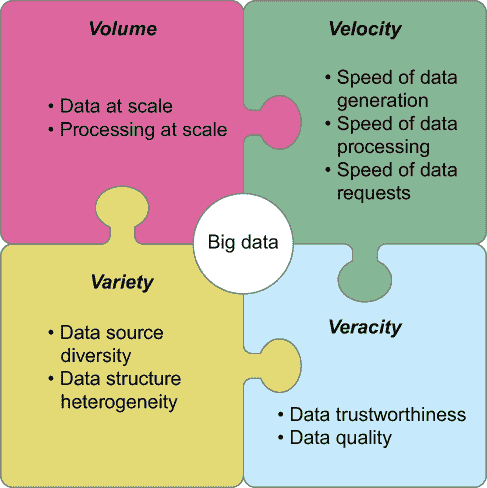

图 8.2 大数据的四个 V（Volume, Velocity, Variety, Veracity）也适用于欺诈检测的上下文。

在这个案例中，还有一些额外的挑战需要处理，例如流数据和数据复杂性。用于欺诈检测过程的数据集内容丰富且复杂，包括用户人口统计信息、兴趣和角色，以及关系类型。整合这些额外的信息源使得数据表示变得复杂。因此，能够扩展到大型数据集、随时间变化更新其估计并有效整合所有可用和有用数据源的方法对于异常检测至关重要。

图数据模型和分析提供了一套处理此类复杂性的宝贵工具。模式灵活性允许来自各种数据源的数据被存储，并提供多种易于扩展的访问模式，即使数据集很大也是如此。图辅助或基于图的算法使得发现、分析和调查事件之间的关系变得更加容易。在欺诈检测的上下文中，图提供的优势在 8.2 节中得到了强调，并在本章的剩余部分以及第九章和第十章中进一步探讨。

因为打击欺诈就像任何一场所有各方都试图使用他们能找到的任何可能的技术来取得优势的战斗一样，分析师必须使用他们可用的所有工具。重要的是要认识到这些技术不是相互排斥的：它们可以组合在一个综合系统中，以便更容易、更快、更有效地达到目标。

## 8.2 图在打击欺诈中的作用

图形为捕捉相互依赖的数据对象之间的长期相关性提供了强大的建模和分析工具，这使得它们非常适合反欺诈场景。我们的银行账户和信用卡交易遵循与我们行为、居住地、喜欢购买的东西等相关联的逻辑。此外，欺诈很少孤立发生：任何欺诈背后都有一套涉及准备的计划，这通常需要多个欺诈者的合作。

为了更好地理解图形在数据表示（以及我们稍后将看到的分析）方面的价值，让我们考虑一个简单的例子。看看表 8.2 中信用卡欺诈系统的交易数据源。

表 8.2 信用卡交易数据示例

| 信用卡 | 商户 | 商户类别 | 国家 | 金额 | 日期 | 接受 | 欺诈 |
| --- | --- | --- | --- | --- | --- | --- | --- |
| 77777783427 | 207005 | 服装店 | 美国 | 120.00$ | 2019-01-11 00:12:01 | TRUE | FALSE |
| 47559798454 | 105930 | 加油站 | 意大利 | 50.00€ | 2019-03-12 08:01:30 | TRUE | FALSE |
| 25548837225 | 105930 | 加油站 | 意大利 | 20.56€ | 2019-04-23 10:10:20 | TRUE | FALSE |
| 18560530742 | 11525 | 餐厅 | 比利时 | 50.00€ | 2019-05-01 15:00:12 | TRUE | FALSE |
| 37960598819 | 323158 | 在线商店 | 美国 | 300.00$ | 2019-05-02 01:00:00 | TRUE | TRUE |
| 16307358365 | 11525 | 餐厅 | 比利时 | 40.00€ | 2019-05-03 20:45:00 | TRUE | FALSE |

在这个表中，每一行代表两个行为者之间的资金转移：信用卡持卡人和商户。第五笔交易在最右侧列中被标记为欺诈，因为卡主对此提出了投诉。

在这种表示中，数据存储为行列表，难以捕捉持卡人和商户之间的关系。现实生活中的数据源包含数十亿笔交易，这使得手动提取相关性以及有用的见解变得不可能。图 8.3 展示了这种数据在图模型中的可能表示。

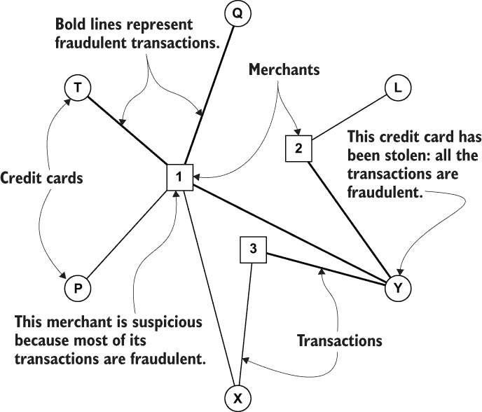

图 8.3 信用卡交易数据的图形表示

在这个图中，圆圈代表信用卡，正方形代表商家。连接信用卡和商家的关系代表交易。粗线代表欺诈交易。在这个表示中，很明显信用卡 Y 被盗，商家 1 行为可疑（处理大量欺诈交易）。这个简单的例子清楚地说明了图如何提供一种强大的工具，使原本在原始格式中隐藏且难以识别的信息更加明显，更容易解释和理解。检查图的视觉表示可以是预处理阶段的一个宝贵部分：它使分析师熟悉数据，并可以迅速得出初步发现和见解。此外，数据简单易查询和分析；我们将在 8.3 节中看到具体的例子。然后，在后处理阶段，图可以提供一种有用的表示，用于验证获得的结果并理解其背后的原因。

这些方法在 8.3 节中有所介绍。其目的是强调图表示的实用性和灵活性；一个简单的表示可以服务于不同的目的。

之前的例子是转换数据的一种可能方式——具体来说，是将交易数据转换为图模型。一种截然相反的方法是，将每一笔交易表示为一个节点，并根据某种逻辑连接这些节点。最常见的方法是基于相似性。以下例子将这种方法解释得更清楚。考虑我们之前看到的通话数据，再次在表 8.3 中展示。

表 8.3 电信异常检测示例

| 通话序列 | 日期和时间 | 星期 | 持续时间 | 起点 | 目的地 | 欺诈 |
| --- | --- | --- | --- | --- | --- | --- |
| 1 | 2019-01-01 10:05:01 | Mon | 13 mins | Brooklyn, NY | Stamford, CT | False |
| 2 | 2019-01-05 14:53:10 | Fri | 5 mins | Brooklyn, NY | Greenwich, CT | False |
| 3 | 2019-01-08 09:42:15 | Mon | 3 mins | Bronx, NY | White Plains, NY | False |
| 4 | 2019-01-08 15:01:34 | Mon | 9 mins | Brooklyn, NY | Brooklyn, NY | False |
| 5 | 2019-01-09 15:06:54 | Tue | 5 mins | Manhattan, NY | Stamford, CT | False |
| 6 | 2019-01-09 16:28:20 | Tue | 53 sec | Brooklyn, NY | Brooklyn, NY | False |
| 7 | 2019-01-10 01:45:29 | Wed | 35 sec | Boston, MA | Chelsea, MA | True |
| 8 | 2019-01-10 01:46:35 | Wed | 34 sec | Boston, MA | Yonkers, NY | True |
| 9 | 2019-01-10 01:50:54 | Wed | 39 sec | Boston, MA | Chelsea, MA | True |
| 10 | 2019-01-10 11:23:20 | Wed | 24 sec | White Plains, NY | Congers, NY | False |
| 11 | 2019-01-11 22:00:58 | Thu | 37 sec | Boston, MA | East Boston, MA | True |
| 12 | 2019-01-11 22:04:00 | Thu | 37 sec | Boston, MA | East Boston, MA | True |

使用前几章讨论的图构建技术，可以将此类表格数据转换为图表示。在生成的图模型中，如图 8.4 所示，每个调用表示为一个节点，所有相关细节都显示为相关属性。


图 8.4 从表 8.3 中的数据创建的第一个图

使用属性和相关值，我们可以将每个节点表示为一个向量。表 8.4 详细展示了这个过程。

表 8.4 将通话数据转换为向量的示例表

| 序列 | 星期 | 持续时间（分钟） | 来源（城市/区域） |
| --- | --- | --- | --- |
|  | 星期一 | 星期二 | 星期三 | 星期四 | 星期五 | [0, 1) | [1, 5) | >=5 | 布鲁克 | 布朗克斯 | 曼哈顿 | 波士顿 | W. P. |
| 1 | 1 | 0 | 0 | 0 | 0 | 0 | 0 | 1 | 1 | 0 | 0 | 0 | 0 |
| 2 | 0 | 0 | 0 | 0 | 1 | 0 | 0 | 1 | 1 | 0 | 0 | 0 | 0 |
| 3 | 1 | 0 | 0 | 0 | 0 | 0 | 1 | 0 | 0 | 1 | 0 | 0 | 0 |
| 4 | 1 | 0 | 0 | 0 | 0 | 0 | 0 | 1 | 1 | 0 | 0 | 0 | 0 |
| 5 | 0 | 1 | 0 | 0 | 0 | 0 | 0 | 1 | 0 | 0 | 1 | 0 | 0 |
| 6 | 0 | 1 | 0 | 0 | 0 | 1 | 0 | 0 | 1 | 0 | 0 | 0 | 0 |
| 7 | 0 | 0 | 1 | 0 | 0 | 1 | 0 | 0 | 0 | 0 | 0 | 1 | 0 |
| 8 | 0 | 0 | 1 | 0 | 0 | 1 | 0 | 0 | 0 | 0 | 0 | 1 | 0 |
| 9 | 0 | 0 | 1 | 0 | 0 | 1 | 0 | 0 | 0 | 0 | 0 | 1 | 0 |
| 10 | 0 | 0 | 1 | 0 | 0 | 1 | 0 | 0 | 0 | 0 | 0 | 0 | 1 |
| 11 | 0 | 0 | 0 | 1 | 0 | 1 | 0 | 0 | 0 | 0 | 0 | 1 | 0 |
| 12 | 0 | 0 | 0 | 1 | 0 | 1 | 0 | 0 | 0 | 0 | 0 | 1 | 0 |

每个属性（原始表格的每一列）都已被分解为可能的值，就像我们为文本生成基于内容的推荐那样。对于标量属性（在这种情况下，持续时间），我们定义了多个范围。每个节点的这种向量表示用于计算相似度，例如使用余弦相似度。以下列表展示了如何使用 scikit-learn 进行计算。

列表 8.1 计算向量之间相似性的代码

```
from sklearn.metrics.pairwise import cosine_similarity

call_01 =       [1, 0, 0, 0, 0, 0, 0, 1, 1, 0, 0, 0, 0]
call_02 =       [0, 0, 0, 0, 1, 0, 0, 1, 1, 0, 0, 0, 0]
call_03 =       [1, 0, 0, 0, 0, 0, 1, 0, 0, 1, 0, 0, 0]
call_04 =       [1, 0, 0, 0, 0, 0, 0, 1, 1, 0, 0, 0, 0]
call_05 =       [0, 1, 0, 0, 0, 0, 0, 1, 0, 0, 1, 0, 0]
call_06 =       [0, 1, 0, 0, 0, 1, 0, 0, 1, 0, 0, 0, 0]
call_07_fraud = [0, 0, 1, 0, 0, 1, 0, 0, 0, 0, 0, 1, 0]
call_08_fraud = [0, 0, 1, 0, 0, 1, 0, 0, 0, 0, 0, 1, 0]
call_09_fraud = [0, 0, 1, 0, 0, 1, 0, 0, 0, 0, 0, 1, 0]
call_10 =       [0, 0, 1, 0, 0, 1, 0, 0, 0, 0, 0, 0, 1]
call_11_fraud = [0, 0, 0, 1, 0, 1, 0, 0, 0, 0, 0, 1, 0]
call_12_fraud = [0, 0, 0, 1, 0, 1, 0, 0, 0, 0, 0, 1, 0]

calls = {'call_01': call_01,
         'call_02': call_02,
         'call_03': call_03,
         'call_04': call_04,
         'call_05': call_05,
         'call_06': call_06,
         'call_07_fraud': call_07_fraud,
         'call_08_fraud': call_08_fraud,
         'call_09_fraud': call_09_fraud,
         'call_10': call_10,
         'call_11_fraud': call_11_fraud,
         'call_12_fraud': call_12_fraud}

print("....")
processed = []
for i in list(calls):

    for j in list(calls):
        if {'source': j, 'dest': i} not in processed and i != j:
            print("similarity between", i, j, cosine_similarity([calls[i]], 
            ➥ [calls[j]]))
            processed += [{'source': j, 'dest': i}]
            processed += [{'source': i, 'dest': j}]
```

输出如下所示，为了简洁起见，省略了尾随零。

列表 8.2 列表 8.1 的输出

```
similarity between call_01 call_02 [[0.66666667]]
similarity between call_01 call_03 [[0.33333333]]
similarity between call_01 call_04 [[1.]]
similarity between call_01 call_05 [[0.33333333]]
similarity between call_01 call_06 [[0.33333333]]
similarity between call_02 call_04 [[0.66666667]]
similarity between call_02 call_05 [[0.33333333]]
similarity between call_02 call_06 [[0.33333333]]
similarity between call_03 call_04 [[0.33333333]]
similarity between call_04 call_05 [[0.33333333]]
similarity between call_04 call_06 [[0.33333333]]
similarity between call_05 call_06 [[0.33333333]]
similarity between call_06 call_07_fraud [[0.33333333]]
similarity between call_06 call_08_fraud [[0.33333333]]
similarity between call_06 call_09_fraud [[0.33333333]]
similarity between call_06 call_10 [[0.33333333]]
similarity between call_06 call_11_fraud [[0.33333333]]
similarity between call_06 call_12_fraud [[0.33333333]]
similarity between call_07_fraud call_08_fraud [[1.]]
similarity between call_07_fraud call_09_fraud [[1.]]
similarity between call_07_fraud call_10 [[0.66666667]]
similarity between call_07_fraud call_11_fraud [[0.66666667]]
similarity between call_07_fraud call_12_fraud [[0.66666667]]
similarity between call_08_fraud call_09_fraud [[1.]]
similarity between call_08_fraud call_10 [[0.66666667]]
similarity between call_08_fraud call_11_fraud [[0.66666667]]
similarity between call_08_fraud call_12_fraud [[0.66666667]]
similarity between call_09_fraud call_10 [[0.66666667]]
similarity between call_09_fraud call_11_fraud [[0.66666667]]
similarity between call_09_fraud call_12_fraud [[0.66666667]]
similarity between call_10 call_11_fraud [[0.33333333]]
similarity between call_10 call_12_fraud [[0.33333333]]
similarity between call_11_fraud call_12_fraud [[1.]]
```

图 8.5 显示了如果我们定义相似度阈值为 0.5 并将关系存储在之前的图中，结果将如何。

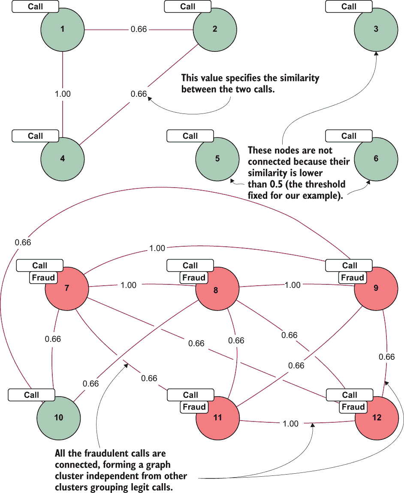

图 8.5 通过图构建技术获得的通话图

观察节点之间的距离，我们发现欺诈电话比正常电话更接近其他欺诈电话。在这个时候，可以使用图聚类算法，如社区检测，将欺诈电话分组，然后使用这种模型根据分类模型创建的组来分类新的电话是否为欺诈，考虑它们与这些组之间的距离。这些方法在第 8.3 节中更详细地介绍，与之前章节中介绍的 k-NN 方法相似。这种反复出现的“模式”再次表明，基于图的技术——在这种情况下，基于最近邻方法的图构建——是通用的，可以服务于不同的分析目的。您可以在需要分析具有类似于表 8.3 的结构的数据时应用这种思维模式。

在进行欺诈分析时，一个基本问题就是检测模型是否可能从社交网络上的复杂网络分析中受益[Baesens 等人，2015]。换句话说，人与人之间的关系在欺诈中是否扮演着重要角色，欺诈是否在网络上具有传染性？欺诈者是否在社交网络中随机分布，或者可观察到的效应表明欺诈是一种社会现象？也就是说，欺诈者是否倾向于聚集在一起？正如之前所述，欺诈很少由单个个体实施；复杂和高级的方案需要许多人的合作，欺诈者通常利用他们的社交网络（朋友、同事等）来进行欺诈。因此，社交网络分析有助于发现欺诈者群体或组织。

欺诈者可能因为参加相同的活动/事件、涉及相同的犯罪、使用相同的资源集，或者有时是同一个人（例如在身份盗窃的情况下）而相互关联。第十章探讨了社交网络分析作为欺诈检测的辅助技术。

这里介绍的概念是表示数据为图以执行欺诈检测的几种可能方式之一。更高级的方法在第九章中介绍。

## 8.3 热身：基本方法

让我们从考虑一些简单易懂且易于实施的方法开始我们的欺诈之战。尽管这些技术很简单，但它们在提到的情况下允许有效的分析，并且很好地适应图空间。

### 8.3.1 寻找信用卡欺诈的源头

假设你希望通过识别信用卡盗贼来打击信用卡欺诈。这个场景是欺诈检测示例中的经典案例，尤其是在图空间中。在这种情况下，用户（信用卡所有者）使用他们的卡进行多次购买，在某个时刻，他们的信用卡详细信息被盗。欺诈者使用被盗的凭证购买商品或在不同账户之间转账。他们通常会通过以低廉的价格购买商品来测试卡详情，然后在消失之前进行几次大额购买。这种欺诈的架构总结在图 8.6 中。

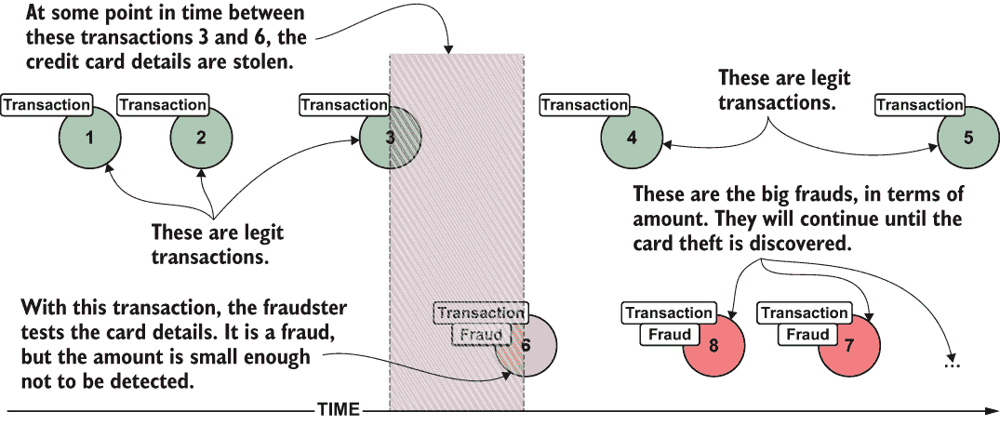

图 8.6 信用卡欺诈架构

值得注意的是，信用卡详细信息被盗的地方可能是一个实体店或电子商务网站。在后一种情况下，网络攻击通常会打开一个漏洞，并复制所有注册用户的信用卡详细信息。

本场景的目标是在多个用户的一系列交易中确定信用卡详细信息被盗的点。我借鉴了这种方法以及第 8.3.2 节中的方法，来源于 Max DeMarzi 撰写的几篇博客文章。²我喜欢这些想法，因为它们既有效又简单。此外，它们展示了如何通过使用正确的图数据模型，在传统数据库中看似困难的分析只需要在图上进行几个查询。第九章中的例子更为复杂，但正如本节标题所暗示的，本节中的例子将有助于作为热身。

仅考虑特定用户及其交易，很难发现盗贼行动的点。那次交易被接受且有效；问题（欺诈交易）发生在之后。幸运的是，如果我们考虑大量用户的交易序列，我们可以识别共性——商店或电子商务网站——并开始更深入的调查。图 8.7 说明了这个概念。

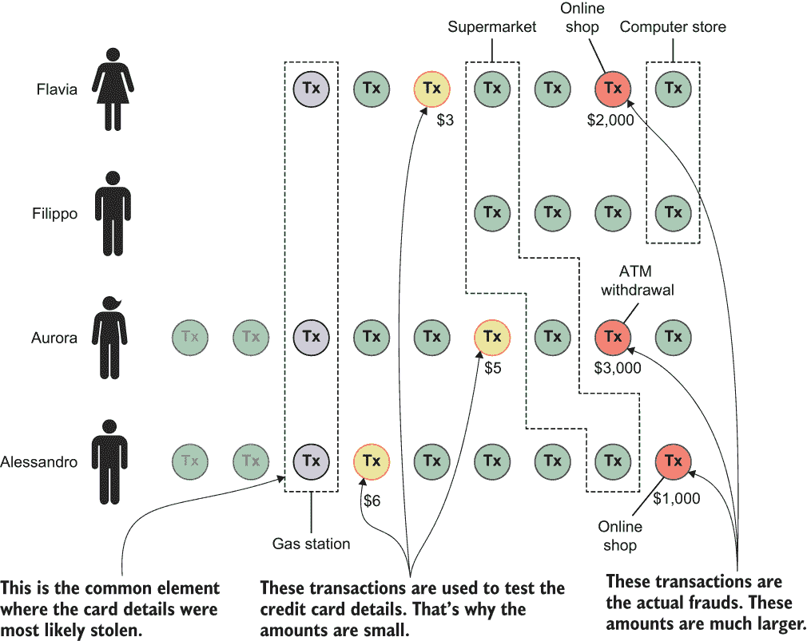

图 8.7 结合多个信用卡交易数据以识别共性

所有经历过信用卡问题的用户都在同一个加油站使用过他们的卡。很可能盗窃就发生在那里。此外，很明显，这些卡通过小额购买来验证详情。因此，设计一个能够使这些事实明显并促使进一步调查的图模型非常重要。

我们如何使用图模型来发现欺诈交易的起源？让我们从本书中我总是建议的可用数据开始，这些数据可能看起来像表 8.5。

表 8.5 信用卡交易示例

| 信用卡 | 商家 | 商家类别 | 国家 | 金额 | 日期 | 接受 | 欺诈 |
| --- | --- | --- | --- | --- | --- | --- | --- |
| 77777783427 | 207005 | 衣服店 | 美国 | 120.00 美元 | 2019-01-11 00:12:01 | 是 | 否 |
| 47559798454 | 105930 | Gas Station | ITA | 50.00€ | 2019-03-12 08:01:30 | TRUE | FALSE |
| 25548837225 | 105930 | Gas Station | ITA | 20.56€ | 2019-04-23 10:10:20 | TRUE | FALSE |
| 18560530742 | 11525 | Restaurant | BEL | 50.00€ | 2019-05-01 15:00:12 | TRUE | FALSE |
| 37960598819 | 323158 | Online Shop | USA | 300.00$ | 2019-05-02 01:00:00 | TRUE | TRUE |
| 16307358365 | 11525 | Restaurant | BEL | 40.00€ | 2019-05-03 20:45:00 | TRUE | FALSE |

这些数据是信用卡持卡人执行的交易样本（足以说明概念）。交易根据用户是否对那些购买提出投诉而标记为欺诈或不欺诈，因此大多数情况下这些信息是可用且准确的。我们希望从表中捕获的关键元素是

+   用户进行的交易，包括金额和日期等详细信息

+   信用卡标识符

+   进行购买的商家的标识符

+   关于商家类型的信息（虽然不是必需的，但对简化我们的讨论很有用）

为此场景设计图模型的第一次尝试如图 8.8 所示。

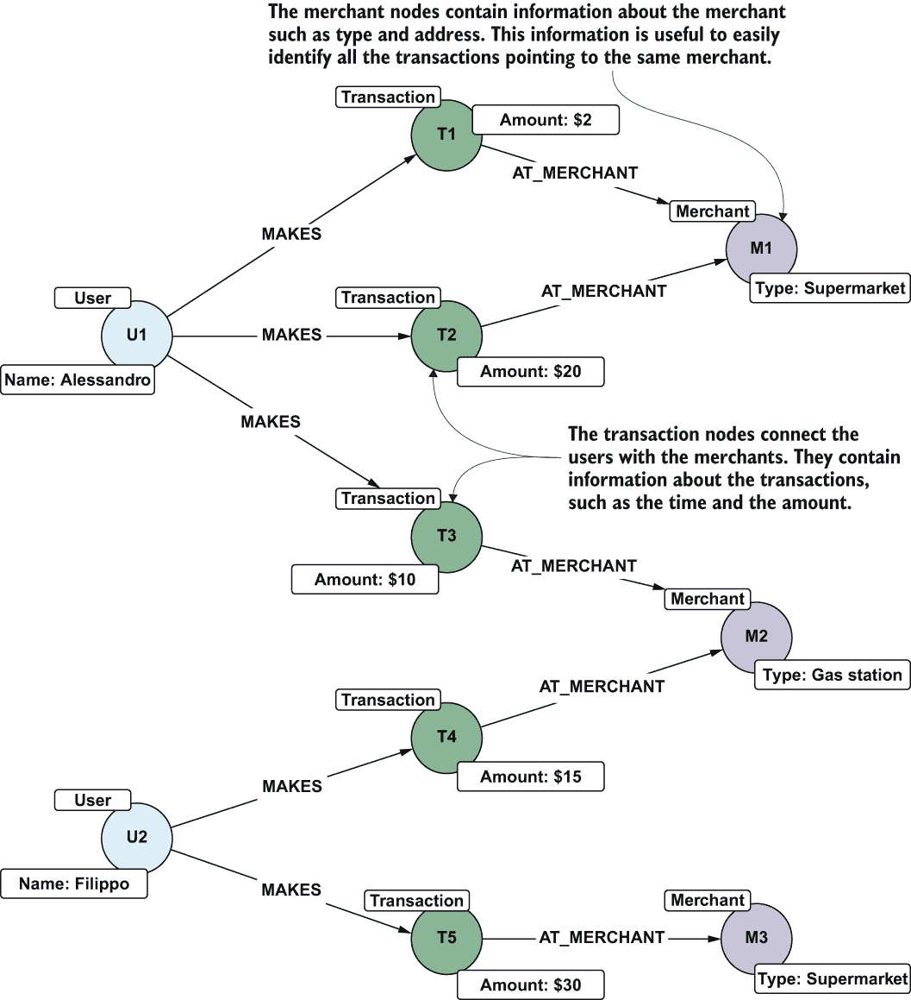

图 8.8 我们交易的第一个基本模型

架构肯定是正确的。缺少的是每个用户的交易顺序。如图 8.7 所示，我们需要考虑交易的顺序，将它们与其他用户关联起来，以找到信用卡详细信息被盗的点。我们可以通过使用时间戳信息来对交易进行排序，但这种方法会使导航变得困难，并且难以找到共同的模式。因此，下一步建模步骤是添加交易之间的关系，以显式存储它们之间的顺序。扩展模型如图 8.9 所示。此模型考虑了每个用户的交易序列。

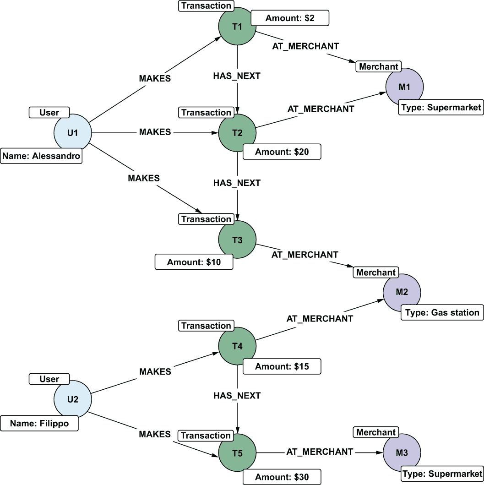

图 8.9 基本模型的扩展

现在我们有了我们的模型，我们可以通过检查它是否可以回答我们的问题来验证它：信用卡详细信息是在哪里被盗的？为了跟随这个例子，你需要一个样本数据集。在代码仓库中有一个 Cypher 文件（ch08/queries/simple_fraud_dataset.cypher），其中包含一个查询，用于创建一个简单的数据集，你可以用于此目的。在第九章中，你将看到如何创建和导入更复杂的数据集，但为了简单起见，我们将从一个小的开始，找到过去一周内所有关于欺诈交易的投诉，并查看这些用户在过去两周内进行了哪些其他交易。我们可以使用 HAS_NEXT 关系链向后导航并找到所有交易。

列表 8.3 可视化导致欺诈的交易

```
MATCH p = (fraud:Fraudulent)<-[:HAS_NEXT*]-(tx:Transaction)
WHERE fraud.date > datetime() - duration('P7D') AND
NONE (tx IN nodes(p) WHERE COALESCE(tx.date, datetime()) <= datetime() - 
➥ duration('P14D'))
RETURN p
```

此查询仅显示导致已知欺诈的交易序列。结果看起来像图 8.10。³

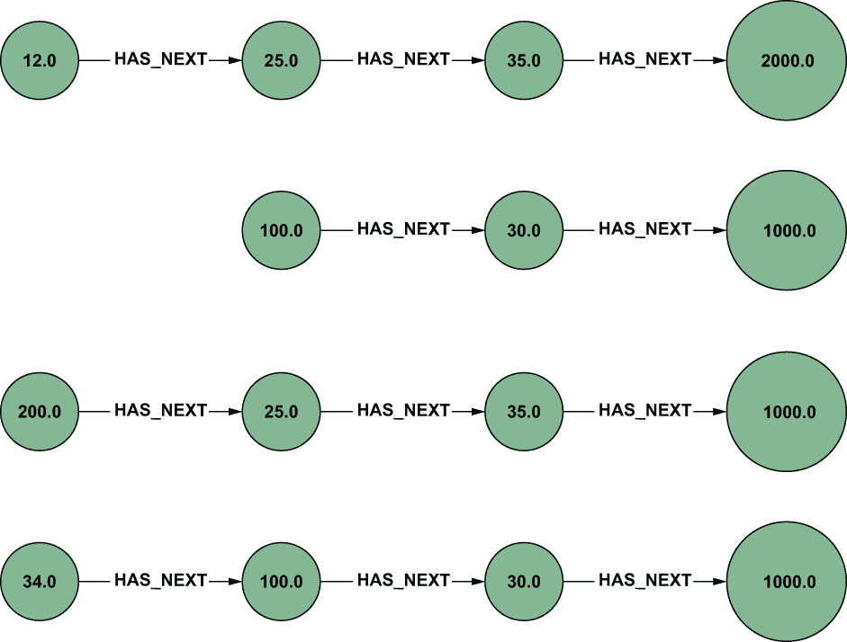

图 8.10 最大的节点是欺诈交易。

下一步是识别这些序列中的共同元素（模式）。为此，我们可以稍微扩展查询以找到这些交易发生的商店，并计算每个商店出现的频率。

列表 8.4 欺诈交易链中前五名常见商家

```
MATCH p = (fraud:Fraudulent)<-[:HAS_NEXT*]->(tx)
WHERE fraud.date > datetime() - duration('P7D')
  AND NONE (tx IN nodes(p)
            WHERE COALESCE(tx.date, datetime()) <= datetime() - 
➥ duration('P14D'))
WITH nodes(p) AS transactions
UNWIND transactions AS tx
WITH DISTINCT tx
MATCH (tx)-[:AT_MERCHANT]->(merchant)
RETURN merchant.name, COUNT(*) AS txCount
ORDER BY txCount DESC
LIMIT 5
```

结果显示在图 8.11 中。

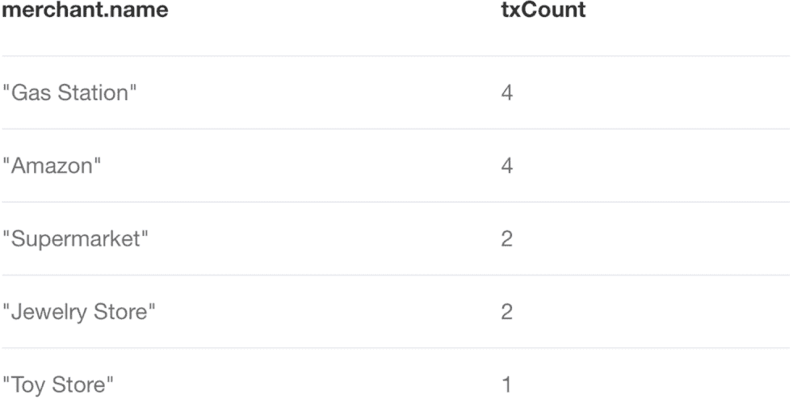

图 8.11 查询 8.2 的结果

这些结果还不错，但它们并不是我们想要的；一些众所周知、每个人都购买商品的在线商店出现在列表中。我们需要小心：不加批判地看待这些结果，我们可能会倾向于说欺诈者正在亚马逊上操作，但由于该网站的安全措施，这种情况极不可能发生。相反，我们需要关注我们选择的交易集中不寻常的常见商店，因为它们更有可能与欺诈有关。

我们可以采取不同的方法来实现这个目标。例如，我们可以将这些结果与全球交易列表中的顶级商家进行比较，并将两个列表中都出现在顶部的所有商店标记为“不相关”。相反，我们将使用更复杂、更有趣（以及更强大）的方法。我们需要考虑这两组交易：

+   包含所有交易数据的全局集，而不仅仅是成为欺诈受害者的人的交易。这个数据集是我们的背景集。我们将获取该集中商家的出现频率统计信息，并在我们的公式中使用这些信息。

+   投诉欺诈性收费的人的最近交易集。这个数据集是我们的前景集，代表我们的真实目标。

考虑到这两组交易，我们的目标可以明确地表述如下：在前景数据集中找到与背景数据集相比不寻常地常见的商家。这种方法用于搜索引擎⁵中揭示搜索结果中的显著术语，我们将借用相关的公式⁶。

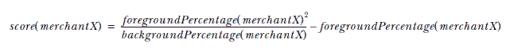

通过将此公式应用于我们之前获得的商家列表，我们可以揭示在欺诈受害者集的交易中比平常更频繁出现的商家。这个公式很简单，因此我们可以将查询转换为使用它。

列表 8.5 使用显著性分数查询以揭示欺诈点

```
MATCH (t:Transaction)
WITH count(t) as txCount                                              ❶
MATCH p = (fraud:Fraudulent)<-[:HAS_NEXT*]-(tx)
WHERE fraud.date > datetime() - duration('P7D')
  AND NONE (tx IN nodes(p)
            WHERE COALESCE(tx.date, datetime()) <= datetime() - 
            ➥ duration('P14D'))
WITH txCount, count(distinct tx) as txForegoundCount                  ❷
MATCH p = (fraud:Fraudulent)<-[:HAS_NEXT*]-(tx)
WHERE fraud.date > datetime() - duration('P7D')
  AND NONE (tx IN nodes(p)
            WHERE COALESCE(tx.date, datetime()) <= datetime() - 
            ➥ duration('P14D'))
WITH txCount, nodes(p) AS nodes, txForegoundCount                     ❸
UNWIND nodes AS tx
WITH DISTINCT txCount, txForegoundCount, tx
MATCH (tx)-[:AT_MERCHANT]->(merchant)
WITH merchant, txCount, 1.0f*COUNT(tx)/txForegoundCount AS 
➥ foregroundPercentage                                               ❹
MATCH (t:Transaction)-[:AT_MERCHANT]->(merchant)
with merchant, 1.0f*count(t)/txCount as backgroundPercentage, 
➥ foregroundPercentage                                               ❺
RETURN merchant.name, backgroundPercentage, foregroundPercentage, 
➥ (foregroundPercentage*foregroundPercentage/backgroundPercentage) - 
➥ foregroundPercentage as score                                      ❻
ORDER BY score DESC
LIMIT 5
```

❶ 计算数据库中的总交易数量。我们也可以考虑过去 14 天的总交易数量，因为我们在分析中考虑了这一范围，但在这个小型数据库中这并不重要。这个值用于计算背景百分比。

❷ 计算属于欺诈受害者（欺诈链）的交易总数。这个值用于计算前景百分比。

❸ 获取欺诈链中的节点列表

❹ 对于欺诈链中的每个商家，计算其前景百分比（它们在我们前景集中出现的频率）

❺ 计算背景百分比

❻ 计算得分

查询结果如图 8.12 所示。

结果不同且意义重大。从这个列表中，很明显可以看出欺诈者在哪里操作并窃取信用卡详细信息。

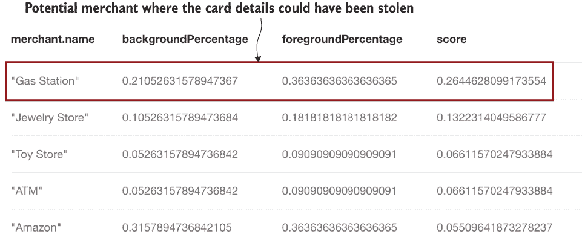

图 8.12 查询结果

当我们有与欺诈有关的相关商家的列表时，我们可以使用这些信息来获取一个名单，包括过去 14 天内在该地点使用的任何信用卡，以及可能处于风险中的人或信用卡。

列表 8.6 获取潜在受害者的查询

```
MATCH (merchant:Merchant {name:"Gas Station"})<-[:AT_MERCHANT]-(tx)<-
➥ [:MAKES]-(user)
WHERE tx.date > datetime() - duration('P14D')
RETURN user.name
```

当我们确定了有风险的信用卡后，可以将其锁定并通知持卡人，或者可以更密切地监控它们，以检查是否出现其他信号，例如与其他商家的小额交易来测试卡片。

需要注意的是，如果交易数量很高，这里提出的方法将无法扩展。特别是，你可能会有很多与某些商家相关的交易，使得他们的相关节点密集。可以应用一些技术来减轻这些问题，例如将密集节点拆分为多个节点，创建时间特定的关系（例如 AT_MERCHANT_ON_2019_08_19），等等。在第九章中，我们将考虑可以扩展的技术。

然而，首先值得提及另一种场景，在这种场景中，图模型提供了一个简单、强大且高效的表示，可以识别特定类型的欺诈。即使在这种情况下，分析也可以通过在定义的图模型上使用查询来完成。

### 8.3.2 识别欺诈团伙

我们将考虑的特定欺诈方案的步骤总结如下列表：

1.  在金融机构（为实施欺诈而创建的真实账户）中创建了大量的合成客户账户。

1.  很长时间以来，这些账户表现得像普通客户一样。

1.  随着时间的推移，他们要求更高的信用额度，并按时偿还，这使得他们能够在银行中获得信誉和信任。

1.  实际上，资金是在同一组账户之间转移，通过多个和不同的跳转来避免被识别。

1.  在某个时候，他们都要求他们能得到的最大信用额度，取出钱后消失。

这种特定的欺诈类型被称为*欺诈团伙*，因为账户、它们的详细信息以及资金围绕同一组人形成一个圈。在洗钱方面，这种类似的技术被用于更大规模。在这种情况下，资金从一个账户转移到另一个账户，通常在不同的国家，以清洗来自非法来源的资金，避免缴纳税款，或资助恐怖分子或其他非法组织。让我们看看我们如何应对这种类型的欺诈，首先从定义场景开始。

假设你希望尽快识别欺诈团伙的形成，在欺诈行为实施之前。目标是揭示团伙的形成，以免为时已晚。为了理解团伙的形成，考虑表 8.6 中的样本账户持有人详情。

表 8.6 账户持有人详情

| 账户 ID | 用户名 | 邮箱 | 电话号码 | 全名 | 地址 |
| --- | --- | --- | --- | --- | --- |
| 49295987202 | alenegro | mpd7xg@tim.it | 580-548-1149 | 希尔达·J·沃马克 | 奥克拉荷马州恩尼德 4093 科迪岭路 |
| 45322860293 | jimjam | jam@mail.com | 504-262-8173 | 梅根·S·布鲁巴格 | 奥克拉荷马州恩尼德 4093 科迪岭路 |
| 45059804875 | drwho | mpd7xg@tim.it | 504-262-8173 | 约翰·V·丹尼尔森 | 威斯康星州霍普山 4985 玫瑰大道 |
| 41098759500 | robbob | bob@google.com | 352-588-9221 | 罗伯特·C·安图内斯 | 佛罗里达州圣安东尼奥 2041 贝格尔大道 |

与账户相关的产品列在表 8.7 中。（关系数据库将更复杂；此示例仅用于说明。）

表 8.7 监控账户所属的产品

| 账户 ID | 产品类型 | 产品 ID |
| --- | --- | --- |
| 49295987202 | 信用卡 | 793922 |
| 49295987202 | 银行账户 | 896857 |
| 49295987202 | 贷款 | 885398 |
| 45322860293 | 信用卡 | 482513 |
| 45322860293 | 银行账户 | 305693 |
| 45059804875 | 信用卡 | 631264 |
| 45059804875 | 银行账户 | 171215 |
| 45059804875 | 贷款 | 432775 |
| 41098759500 | 银行账户 | 377703 |
| 41098759500 | 贷款 | 859916 |

如果我要求你以图的形式对这些表格进行建模，到这本书的这一部分你应该能够做到，你很可能会得到类似于图 8.13 的东西。

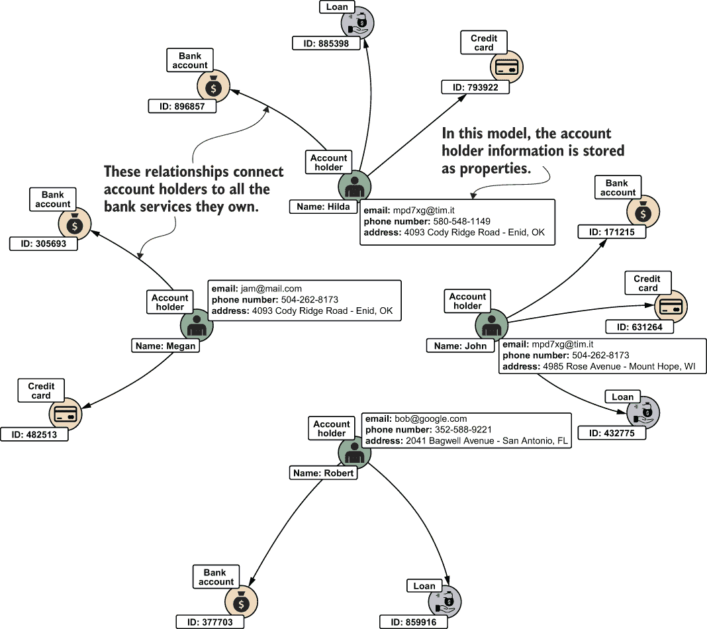

图 8.13 银行账户持有人详情的第一图模型

这个模型是完美的，特别是考虑到到目前为止讨论的指南，但为了识别团伙，我们需要尽可能多地爆炸信息到单独的节点中。使用这种方法，你可能会创建一个如图 8.14 所示的图。

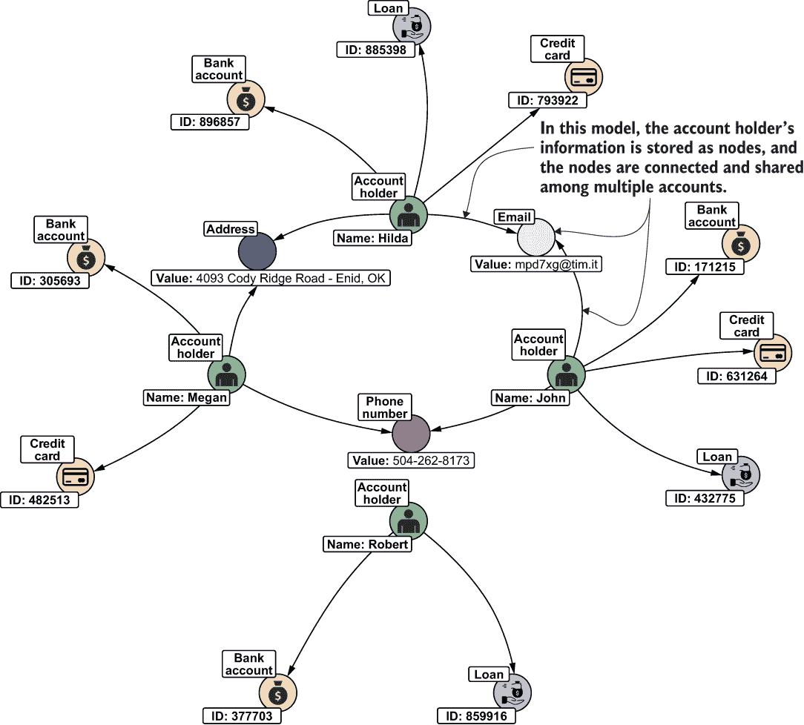

图 8.14 第二个模型，将关键用户属性转换为节点。（仅可视化相关节点。）

显然，这些银行账户有些奇怪；图表清楚地表明它们之间联系紧密。数据库当然很小，所以链接很容易被发现，但有一个机制允许我们检查任何大小的图表并搜索连接组件。如果一个图中的任何一对节点都通过路径连接（如果它是定向的，则称为强连接），则认为该图是连接的 [Diestel, 2017]。在任何图（包括未连接的图）中，都可能存在一组称为最大连接子图的连接组件。

幸运的是，我们不需要自己在 Neo4j 中实现这样的算法，因为它已经被实现并作为插件提供。⁷ 要尝试它，你需要一个简单的图；创建一个图的 Cypher 查询可以在 ch08/queries/simple_ring_fraud.cypher 中找到。⁸ 执行查询，并在 Neo4j 中安装插件。⁹ 到那时，你可以执行以下查询。第一个查询将属性分区分配给每个用户，指定用户属于哪个簇。

列表 8.7 识别环并将用户分配给它们的查询

```
CALL gds.wcc.write(
  {nodeQuery: "MATCH (p:User) RETURN id(p) as id",
  relationshipQuery: "MATCH (p1:User)--()--(p2:User) RETURN id(p1) as source, 
  ➥ id(p2) as target",
  writeProperty: "partition"}
)
YIELD
  componentCount,
  createMillis,
  computeMillis,
  writeMillis
```

下一个查询显示了每个簇的组成部分。

列表 8.8 查询以可视化每个用户属于哪个簇

```
MATCH (n:User)
RETURN n.partition, COUNT(*) AS members, COLLECT(n.name) AS names
ORDER BY members DESC
```

结果显示在图 8.15 中。

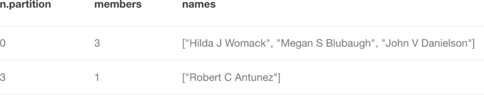

图 8.15 两个先前查询的结果

这些查询显示的正是我们已知的内容：Hilda、Megan 和 John 形成一个簇，因为他们通过一个或多个属性（如电子邮件地址、电话号码和邮寄地址）连接在一起。

看起来 Rob 已经出局了，但现实情况略有不同：Rob 是这个组织的头目。（为了这个场景的目的，我们可以假设我们是从其他来源知道这个信息的。）但他不使用与其他所有人共有的任何信息。聪明人！我们如何在环中捕捉他的关系？

如前所述，图的一个优点是我们可以使用图来合并来自不同数据源的数据。银行账户和信用卡为用户提供连接在线银行服务的可能性。这个系统捕捉了关于用户浏览器、IP 地址、设备等很多我们未使用的细节。让我们只考虑 IP 信息。表 8.8 显示了这些信息可能的样子。

表 8.8 账户连接信息

| 账户 ID | IP | 日期 |
| --- | --- | --- |
| 41098759500 | 166.184.50.48 | 2020-01-21 |
| 45059804875 | 166.184.50.48 | 2020-01-21 |
| 41098759500 | 208.125.140.154 | 2020-01-19 |
| 45059804875 | 74.248.71.164 | 2020-01-17 |
| 45322860293 | 208.125.140.154 | 2020-01-19 |

如果我们将这个数据源添加到我们的图中，我们得到图 8.16 的结果。

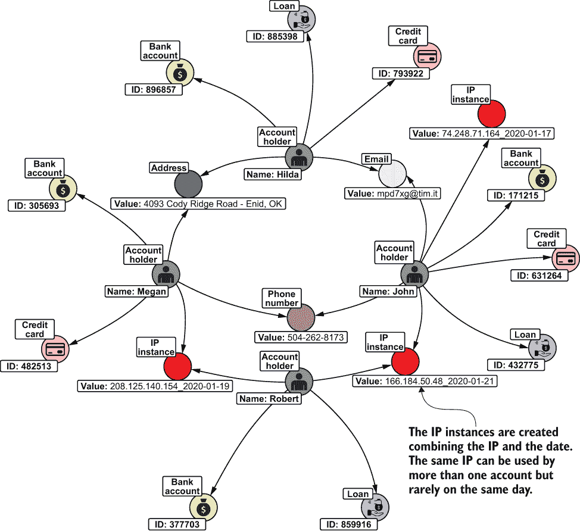

图 8.16 第三种捕捉用户连接到在线银行平台 IP 地址信息的模型

图 8.16 说明了我们的论点：Rob 在操纵一切。他作为不同账户持有人从同一地点连接。让我们通过使用 ch08/queries/simple_ring_fraud_IP.cypher 中可用的查询来扩展我们的数据库。重新运行列表 8.7 中的查询，我们得到图 8.17 的结果。

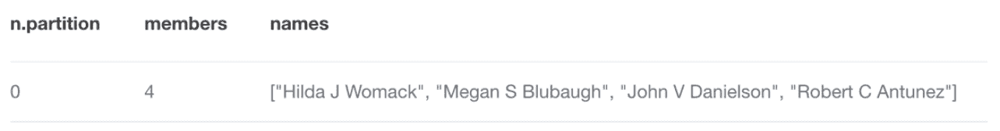

图 8.17 合并 IP 信息后的结果

从这些结果来看，显然 Rob 与其他所有账户都有很好的联系。现在，人类分析师可以进行更深入的调查，关闭欺诈账户，并将账户背后的个人报告给当局，禁止他们在该国开设任何其他银行账户。问题解决。

值得注意的是，环检测方法可以用于金融欺诈以外的其他环境，例如用于识别网站上的同一用户的多个账户。这个问题在多种场景中都很常见，如下所示：

+   被禁止的用户试图获取新账户

+   在一个拍卖网站上，同一用户使用多个账户出价以增加物品的价格

+   在一个扑克室里，同一用户在同一桌面上与其他玩家使用多个账户进行游戏

+   在像亚马逊这样的市场上，商家支付人们或其他公司发布虚假评论以增加其产品可信度的行为

在所有这些情况下，找到环状结构有助于我们发现潜在问题或发现可疑行为，并正确地应对它们。

### 8.3.3 图方法的优势

本节介绍了一些简单而强大的欺诈检测技术。所提出的场景非常适合图模型：正如你所看到的，通过适当的模型和查询，我们可以找到关于我们数据的洞察性信息。如果这些关系没有明确表示，这些细节在一个大型数据库中很难找到。具体来说，在信用卡欺诈的情况下，通过图查询，我们能够识别出一组交易中不寻常的常见模式，这些交易最终导致了欺诈。在环状示例中，图显示了人与人、账户之间的联系，这在关系型数据库中是无法捕捉到的。

## 摘要

本章介绍了与欺诈以及更广泛的异常检测相关的基本概念。介绍了不同的方法，其中图的作用对于提供高质量的分析结果和可扩展到实际生产就绪解决方案的基础设施至关重要。更详细地说，你学习了

+   欺诈类型以及如何处理最关键的欺诈

+   如何设计一个能够识别用户信用卡详细信息可能被盗位置的图模型

+   如何根据提供的个人详细信息以及用户用于访问在线银行系统的多个接触点收集的信息来识别银行账户中的环

## 参考文献

[Akoglu et al., 2014] Akoglu, Leman, Hanghang Tong, and Danai Koutra. “基于图的异常检测和描述：综述。” arXiv 预印本 arXiv:1404.4679 (2014)。

[Baesens et al., 2015] Baesens, Bart, Veronique Van Vlasselaer, and Wouter Verbeke. *使用描述性、预测性和社交网络技术的欺诈分析：数据科学在欺诈检测中的应用指南*。Hoboken, NJ: Wiley, 2015。

[Bolton 和 Hand，2002] Bolton, Richard J., 和 David J. Hand. “统计欺诈检测：综述.” *统计科学* 17:3 (2002): 235-255.

[Diestel，2017] Diestel, Reinhard. *图论*. 纽约：Springer，2017.

[Fawcett 和 Provost，1997] Fawcett, Tom, 和 Foster Provost. “自适应欺诈检测.” *数据挖掘与知识发现* 1:3 (1997): 291-316.

[Van Vlasselaer 等人，2017] Van Vlasselaer, Véronique, Tina Eliassi-Rad, Leman Akoglu, Monique Snoeck, 和 Bart Baesens. “GOTCHA! 基于网络的社保欺诈检测.” *管理科学* 63:9 (2017): 3090-3110.

* * *

^(1.)受 [`mng.bz/dmYQ`](https://shortener.manning.com/dmYQ) 启发。

^(2.)参见 [`mng.bz/rmMX`](https://shortener.manning.com/rmMX) 和 [`mng.bz/VG65`](https://shortener.manning.com/VG65).

^(3.)如果在查询后未在 Neo4j 浏览器中看到值，请在查询下方选择标签 Transaction；然后选择金额作为要可视化的属性。

^(4.)[`www.elastic.co/blog/significant-terms-aggregation`](https://www.elastic.co/blog/significant-terms-aggregation)

^(5.)[`mng.bz/A17W`](https://shortener.manning.com/A17W)

^(6.)[`mng.bz/ZYvZ`](https://shortener.manning.com/ZYvZ)

^(7.)[`github.com/neo4j/graph-data-science`](https://github.com/neo4j/graph-data-science)

^(8.)使用常规的 MATCH (n) DETACH DELETE n 命令整理数据库。

^(9.)附录 B 包含安装和配置插件的说明。
