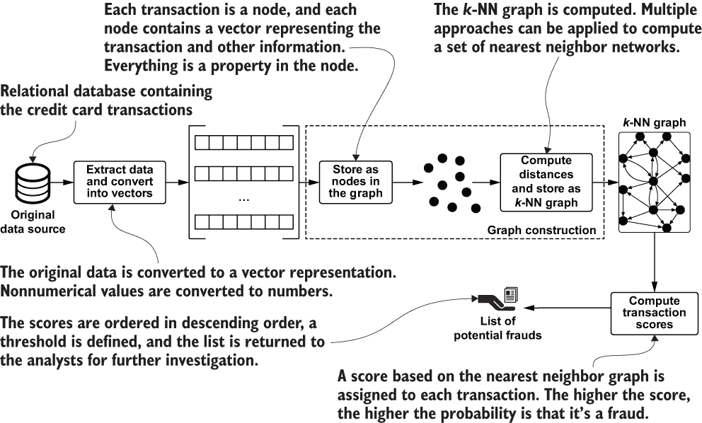
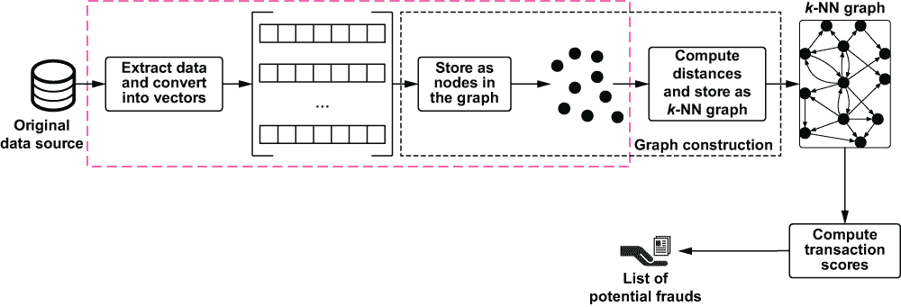
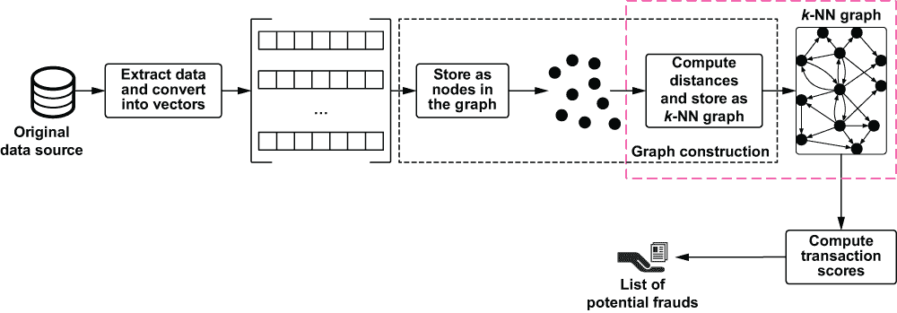
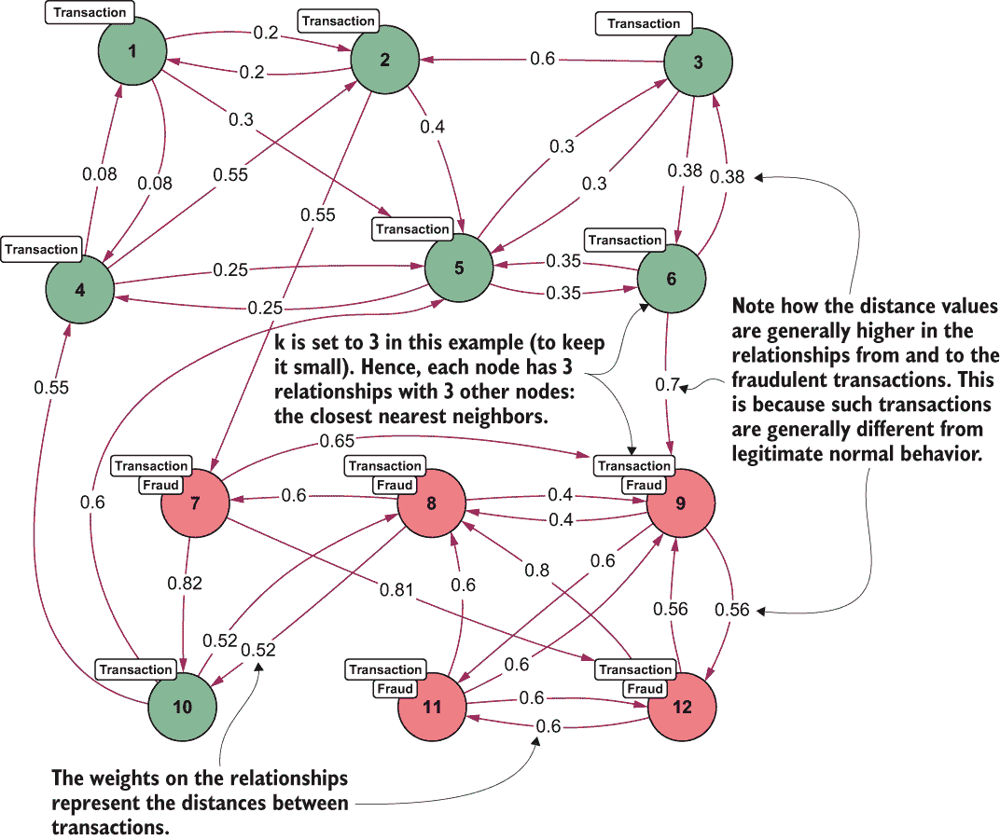
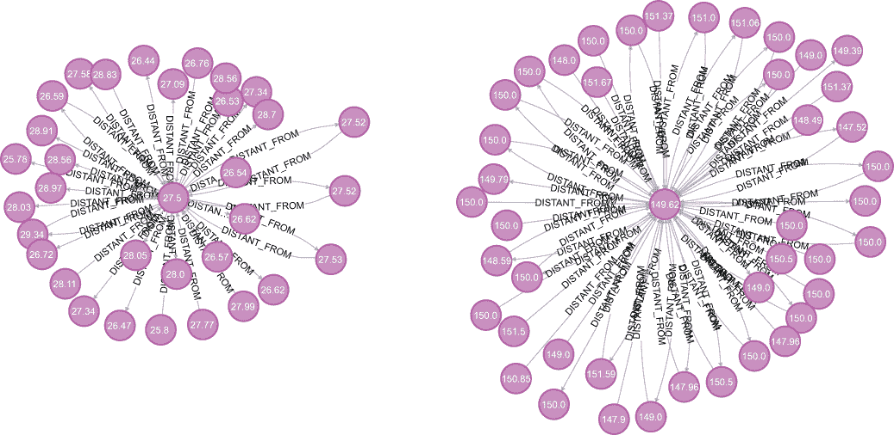
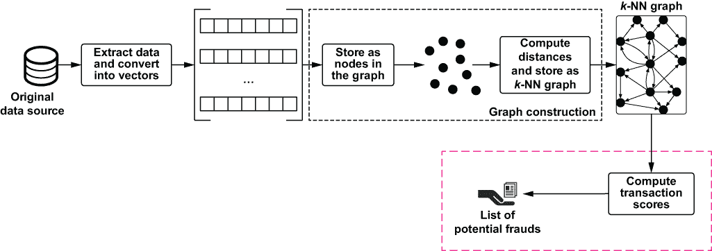
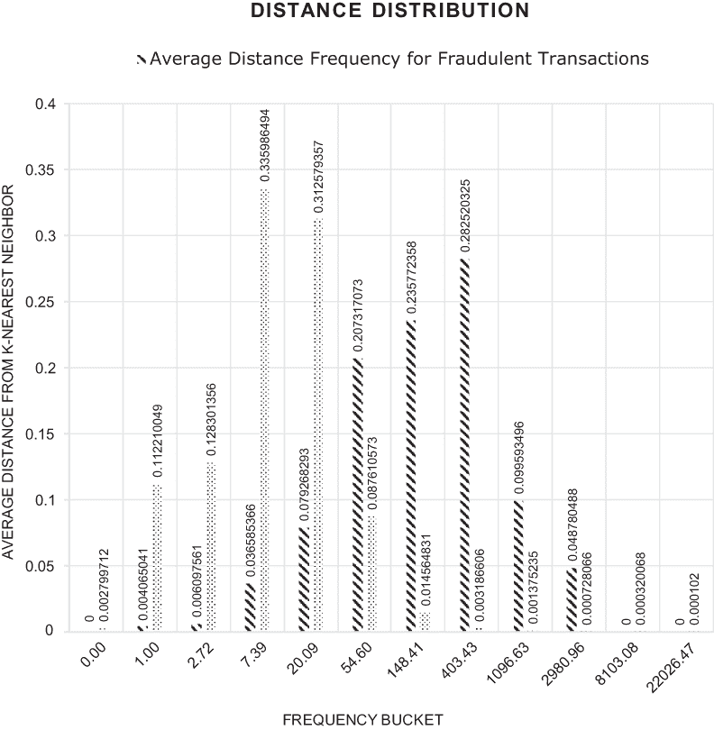

# 9 基于邻近度的算法

本章涵盖

+   基于异常检测的高级算法对抗欺诈

+   使用图存储和分析交易的 k-NN

+   识别异常交易

第八章通过展示基于识别数据中显式关系的两种方法介绍了欺诈检测技术。在第一种情况下，每笔交易将持卡人与使用卡的商家连接起来。在第二种情况下，银行或信用卡账户通过所有者的个人或访问详情（电话号码、地址、IP 等）连接起来。但在大多数情况下，这种关系并不明显，在这些情况下，我们需要做更多的工作来推断或发现数据项之间的连接或关系，以检测和对抗欺诈。

本章探讨了用于对抗欺诈的高级算法，这些算法借鉴了异常检测理论，能够在看似独立的大型交易数据集中识别异常项。正如我在第八章中提到的，异常检测是数据挖掘的一个分支，涉及在数据集中发现罕见事件或异常值。当你分析大型且复杂的数据集时，确定数据中的突出点至少与了解其一般结构一样重要和有趣。

为了解决异常检测问题，已经开发了许多技术和算法 [Akoglu et al. 2014]，主要关注在非结构化的多维数据点集合中检测异常——即每个数据点都可以用一个向量表示的数据集。这些技术将数据对象视为位于多维空间中的独立点，但现实情况是，在许多场景中，它们可能表现出应考虑在异常检测过程中的相互依赖性。在广泛的学科领域——如物理学、生物学、社会科学和信息系统——数据实例实际上本质上相关。正如我们所见，图提供了一种强大的工具，可以有效地捕捉相互依赖数据对象之间的长期相关性。

本章继续我们关于在异常检测领域使用图来对抗欺诈的研究。首先，我们将使用图构建技术来创建一个图；然后，我们将分析这个图以揭示异常交易。这里使用的算法并不新颖，但示例清晰地展示了图如何帮助我们更好地可视化和导航数据，简化分析过程。

## 9.1 基于邻近度的算法：简介

假设你想要识别可疑的信用卡交易以避免客户被收取未经授权的付款。在分析运营数据时，你需要识别偏离正常用户行为的交易并将它们标记为可能欺诈。

在这个阶段，场景应该是清晰的：你被分配的任务是在信用卡操作列表中识别欺诈或至少异常的交易。目标是浏览数据并编制一份需要进一步检查的交易清单。相反，当请求新的交易时，系统应该评估是否接受或拒绝它。值得注意的是，在这种情况下，可用的数据与我们在第八章中考虑的场景不同。在这里，我们有一个巨大的特征集，每个交易都有很多特征，而之前我们只有几个。这种场景更现实，因为通常信用卡公司会收集每个交易的大量信息，以便尽可能准确地将其分类为欺诈。

即使目的在这里也有所不同。之前，我们试图确定用户信用卡详细信息被盗或购买发生的地点，以测试被盗凭证。在这种情况下，我们的目标是识别异常交易。当系统将交易标记为可疑时，卡片将被锁定，直到进行进一步的调查和分析。

显然，这种场景需要不同的方法。可用的数据是以一系列交易的形式存在的，通过一系列属性来描述，如卡 ID、时间、金额、位置、商户 ID 以及信用卡系统收集的其他信息。关于个人用户和商户的信息很少或没有。此外，与早期示例相比，数据量很大。

由于数据量很大且缺乏明确的关系，我们在第八章中探讨的技术不能在这里应用。相反，本章介绍了一种新的欺诈检测技术，它使用来自异常检测领域的定义良好的方法：*基于邻近度的方法*。我们还将使用图表示来建模和导航数据，以提高分析和性能。你会发现用于从数据建模图的方法是熟悉的，因为它使用了本书前面讨论的一些图构建技术。本章展示了这种方法的灵活性以及它们如何适应多个上下文和用例。我将快速介绍这些选项，然后将其中最合适的一个应用到我们的场景中。

基于邻近度的技术将数据点定义为异常值，当它与其他数据点距离异常遥远时。更复杂地说，它的局部性（或邻近度）是稀疏的。不同的算法使用不同的机制来定义数据点的邻近度。这些方法在细节上有所不同，但它们背后的概念足够相似，值得将它们统一为几个组。用于定义异常分析中邻近度的最常见方法是由 Aggarwal 在 2016 年提出的。

+   *基于聚类的*—使用最合适的技巧将数据点划分为聚类，考虑到元素如何表示以及算法应该有多精确。通过使用数据点在任意聚类中的非成员资格、与其他聚类的距离、最近聚类的尺寸或这些因素的组合来计算异常值得分。点属于聚类或应被视为异常值。

+   *基于密度的*—为每个数据点定义一个局部区域（可能基于网格位置），并使用该区域中其他点的数量来定义一个局部密度值。此值可以转换为异常值得分，得分较高的元素被认为是异常值。基于密度的异常值检测方法的基本假设是，非异常对象周围的局部密度与其邻居周围的局部密度相似，而异常对象周围的局部密度与其邻居周围的局部密度显著不同。与基于聚类的方 法划分数据点不同，基于密度的方法划分数据空间。

+   *基于距离的*—对于每个数据点，计算 k-近邻（k-NN）网络（是的，就是之前用于推荐的同一个网络）。通过使用数据点到其 k-近邻的距离来计算异常值得分；具有最大 k-NN 距离的数据点被标记为异常值。基于距离的算法通常比这里介绍的其他方法表现更好，因为它们具有更高的粒度。在基于聚类和密度的方法中，在异常值分析之前，通过划分点或数据空间来聚合数据，并将单个数据点与这些分布进行比较以进行分析。在基于距离的方法中，异常值得分基于原始数据点到 k-NN 的距离。这种更高的粒度通常伴随着显著的计算成本，但可以通过使用图和一些其他技术来减轻这种成本。

所有这些技术都是基于某种邻近度（或相似度，或距离）的概念，并且密切相关。主要区别在于定义此距离的详细程度。

我们将重点关注基于距离的机制，因为与其它方法相比，它们更准确。此外，它们不仅适用于图空间，还适用于我迄今为止介绍的技术。尽管本章重点讨论多维数值数据，如信用卡交易，但这些方法已被推广到许多其他领域，例如分类数据、文本数据、时间序列数据和序列数据。

本章的另一个要点是使用 k-NN 网络进行不同于推荐的任务，这展示了该技术在分类目的上的强大能力。在本书的早期，我们探讨了 k-NN 网络在解决不同问题时的不同用途和内在灵活性。本章完成了概述。

## 9.2 基于距离的方法

为了说明基于距离的异常值检测方法的使用，我们将使用 Kaggle 上可用的匿名信用卡交易数据集。¹ 该数据集包含 2013 年 9 月两日内欧洲持卡人进行的信用卡交易。总共有 284,807 笔交易，其中 492 笔是欺诈交易。该数据集高度不平衡：正类（欺诈）占所有交易的 0.172%。数据集仅包含数值输入变量，这些变量是经过统计转换以使其不相关，以更好地适应我们的场景。由于保密问题，Kaggle 无法提供原始特征和更多关于数据的背景信息。唯一未转换的特征是时间和金额。时间特征包含每个交易与数据集中第一个交易之间的秒数。金额特征是交易金额。类别特征是响应变量；在欺诈的情况下取值为 1，否则为 0。图 9.1 中的模式显示了使用基于距离的方法在这样一份交易列表中识别异常值所需的高级工作流程。



图 9.1 由图驱动的基于距离的方法

第一部分由两个子任务（提取数据和将其存储为图中的节点）组成，这是一种经典的图构建技术。我们在书中已经多次使用它，所以到现在你应该已经很熟悉了。这一步创建了一个如图 9.2 所示的图。


图 9.2 图中存储的交易

让我们更仔细地看看这里涉及的内容。

### 9.2.1 将交易存储为图

我们首先从原始格式 CSV 中摄取我们的数据，作为图中的节点。你可以在代码仓库的 ch09/import/creditcard 目录下找到导入数据的 Python 脚本和所需依赖。这一步开始了将交易存储为图中的节点的过程，如图 9.3 所示。



图 9.3 我们在心理模型中的位置

下一个列表，来自代码仓库，展示了如何从 Kaggle 摄取数据集并将交易数据转换为向量。

列表 9.1 导入交易的代码

```
def import_transactions(self, directory):
    transactions = pd.read_csv(os.path.join(directory,  "creditcard.csv")) ❶
    for k in range(50):                                                    ❷
        writing_thread = threading.Thread(target = self.write_transaction)
        writing_thread.daemon = True
        writing_thread.start()

j = 0; 
    for index, row in transactions.iterrows():                             ❸
        j += 1
        transaction = {
            'transactionId': j,
            'isFraud': row['Class'],
            'transactionDt': row['Time'],
            'transactionAmt': row['Amount']}
        vector = self.normalize(row, ['Time', 'Class'])                    ❹
        transaction['vector'] = vector;
        self._transactions.put(transaction);                               ❺
        if j % 10000 == 0:
            print(j, "lines processed") 
    print(j, "lines processed")
    self._transactions.join()                                              ❻
    print("Done")

def write_transaction(self):                                               ❼
    query = """
        WITH $row as map
        CREATE (transaction:Transaction {transactionId: map.transactionId})
        SET transaction += map
    """
    i = 0
    while True:
        row = self._transactions.get()
        with self._driver.session() as session:
            try:
                session.run(query, {"row": row})
                i += 1
                if i % 2000 == 0:
                    with self._print_lock:
                        print(i, "lines processed on one thread")
            except Exception as e:
                print(e, row)
        self._transactions.task_done() 
```

❶ 使用 pandas 从交易.csv 文件中读取

❷ 启动 50 个写入线程。在这种情况下，因为每个交易节点是独立的，所以不会出现任何并发问题。

❸ 遍历文件，创建参数映射

❹ 通过删除无用列并将离散/非数值数据转换为数字（对于这个特定数据集不是必需的，因为数据已经标准化）来创建交易向量。请参阅代码存储库以获取完整实现。

❺ 将交易对象添加到存储元素的队列中

❻ 这个连接等待所有元素被处理。

❼ 通过将每个交易作为数据库中的一个节点存储来处理队列元素

列表中的代码应该很容易理解；它与我们在其他示例中所做的是相似的。唯一相关的区别是，每个节点的向量不需要后来计算，因为它已经在提供的数据中可用。代码提取一些数据（如时间、是否欺诈等）并将其作为交易节点的专用属性。其余的输入数据被放在相同的节点中，作为向量属性，包含浮点向量，这样我们就不需要自己计算它了。

警告：重要的是指出，使用多个线程写入 Neo4j 的使用。这种方法是常见的，但请注意：只有在查询不会引起任何冲突的情况下（换句话说，当查询作用于不同的、不重叠的图部分时），才能安全地使用。这种“隔离”将防止任何与序列化相关的问题，或者更糟糕的是，死锁。第一种问题可以通过延迟重试来解决，但第二种问题并不那么简单，需要更新操作以写入的方式，即使它们并行运行，也会按相同的顺序锁定节点。

在数据摄取结束时，这应该只需要几秒钟，你的数据库将包含 284,807 个节点和没有关系。

练习

在摄取数据后，在 Neo4j（通过 Neo4j 浏览器）上运行一些查询，以查看摄取是否成功。这里有一些建议：

+   计算被标记为“Transaction”的交易数量。这个数字符合你的预期吗？

+   计算被标记为欺诈的交易数量。这个数字符合你的预期吗？

+   从节点获取 10 个向量。你能找到每个向量的维度吗？

+   获取按金额排序的前 10 笔交易。

### 9.2.2 创建 k 最近邻图

第二步（图 9.4）是通过使用表示它们之间距离的关系连接节点来创建 k-NN 图。



图 9.4 我们在心理模型中的位置

在本书中之前构建的推荐系统中，我们使用了相似度的概念，因为我们正在寻找相似的项目或用户。在这里，我们正在考虑距离，因为我们正在寻找远离合法交易的异常值。这种变化并不大，因为距离通过以下简单的公式与相似度相关联：²

*距离* = 1 – *相似度*

公式表明，当两个数据点完全相同的时候，它们的相似度是最高可能的：1。因此，它们的距离是 0。另一方面，如果它们完全不同（如果你喜欢，可以认为是垂直的），相似度是 0。在这种情况下，距离将是最高可能的：1。

当 k-NN 图已经计算并存储后，就可以找到异常值——在我们的案例中，是欺诈交易。基于距离的邻近方法通常以分数的形式产生输出，这些分数代表预测一个数据点（在这种情况下，是一个事务）是异常值的概率。通过设置一个阈值，我们可以做出二元决策：每当分数高于固定的阈值时，该交易就被认为是异常值。

到目前为止，一切顺利，但正如我们在本书前面探索的场景中一样，魔鬼在于细节。计算 k-NN 图是计算密集型的，需要 O(N²)的时间。幸运的是，一些技术可以使它更快；在适当的时候，我们将看到其中的一些。

现在我们已经将数据库中的所有事务作为一个节点集，我们必须创建 k-NN 图。为此，我们必须使用我们创建的向量属性计算每个节点与其他所有节点的距离。这些距离是有序的，并且只有前 k 个距离被存储为图中的关系。每个关系还包含距离值作为其权重属性。这个过程的结果如图 9.5 所示。



图 9.5 使用向量信息获得的 k-NN 图

如前所述，正如我们在推荐场景中看到的那样，计算 k-NN 图是一项繁琐的任务，因为它需要计算每对事务之间的距离或相似度。这就是为什么当有大量数据项（事务、呼叫等）时，基于距离的方法使用得较少。创建 k-NN 图并将其持久化为真实图（前一个图的扩展）在访问和分析数据方面有很多优点，但在计算相似度时并不会有所帮助。我想强调这一点，因为正如我在本书开头所说，本书的目标不仅仅是解决玩具示例。数据科学家和数据工程师必须解决需要考虑时间、磁盘/内存空间和结果质量的真实问题。

在第六章中，我们探索了几种技术——局部敏感哈希（LSH）和 Spotify 的 Annoy³——来计算一个近似最近邻（ANN）图，并取得了良好的结果。现在我们将探索另一种比这两种技术表现更好的有趣 ANN 方法。为了清晰起见，由于数据的大小和特定场景对结果质量的要求，其他方法在我们使用它们的场景中表现良好。在欺诈检测用例中，我们需要处理大量的密集向量，近似的质量将影响欺诈检测结果的质量。我建议在这种情况下采用不同的、更复杂的方法来处理 ANN。

与精确的 k-NN 搜索相比，后者搜索其他元素以找到 k 个最近的元素，ANN 搜索通过允许少量错误来放宽条件。它在包含用于搜索的特定向量的元素最接近的子集中进行搜索。

ANN 搜索在过去几十年中一直是一个热门话题，并为许多应用提供了基本支持，从通用数据挖掘到推荐，从数据库索引到信息检索。对于稀疏离散数据（如文档），最近邻搜索可以在高级索引结构（如倒排索引[Manning et al., 2008] ⁴）上有效地进行。对于密集连续向量，如我们欺诈用例中的向量，已经提出了各种解决方案，包括基于树结构的方法、基于哈希的方法（如第六章中描述的 LSH 方法）、基于量化的方法、基于图的方法等。为了减少索引复杂性，已经提出了基于近似传统图的方法。最近，这些方法在百万规模数据集上展示了革命性的性能[Fu et al., 2019]。这些方法不仅因为它们基于图，因此与本书相关，而且因为从性能的角度来看，它们代表了当前的最佳水平。⁵ 不深入细节，我可以描述这些方法背后的基本思想分为两大步：

1.  创建基于图的索引结构。在这个阶段，创建一个邻近图（或邻居图）。在这个图中，节点是多维空间中的向量，节点之间的边是通过使用基于特定距离函数的逻辑和导航标准创建的。如果根据使用的距离函数，两个节点可能是邻居，则它们之间连接。

1.  搜索邻居。给定一个特定的向量或搜索查询，根据算法的不同，通过不同的方式在邻近图中导航，以找到输入向量的最近邻居候选。

我选择了分层可导航小世界（HNSW）实现[Malkov and Yashunin, 2016]作为此场景的 ANN 方法。根据 Erik Bernhardsson 网站和 Aumüller 等人[2018]提供的基准，它是其中最好的之一，Python 包装器⁶的使用非常简单。以下列表展示了如何计算和存储 k-NN 图。

列表 9.2 计算和存储距离

```
def compute_and_store_distances(self, k, exact, distance_function, 
➥ relationship_name):                                                  ❶
    start = time.time()
    data, data_labels = self.get_transaction_vectors()                  ❷
    print("Time to get vectors:", time.time() - start)
    start = time.time()

    if exact:                                                           ❸
        ann_labels, ann_distances = self.compute_knn(data, data_labels, k, 
        ➥ distance_formula)
    else:
        ann_labels, ann_distances = self.compute_ann(data, data_labels, k, 
        ➥ distance_formula)

    print("Time to compute nearest neighbor:", time.time() - start)

    start = time.time()
    self.store_ann(data_labels, ann_labels, ann_distances, relationship_name)
    print("Time to store nn:", time.time() - start)

def store_ann(self, data_labels, ann_labels, ann_distances, label):     ❹
    clean_query = """
        MATCH (transaction:Transaction)-[s:{}]->()
        WHERE transaction.transactionId = $transactionId
        DELETE s
    """.format(label)

    query = """
        MATCH (transaction:Transaction)
        WHERE transaction.transactionId = $transactionId
        UNWIND keys($knn) as otherSessionId
        MATCH (other:Transaction)
        WHERE other.transactionId = toInteger(otherSessionId) and 
        ➥ other.transactionId <> {transactionId}
        MERGE (transaction)-[:{} {{weight: $knn[otherSessionId]}}]->(other)
    """.format(label)

    with self._driver.session() as session:
        i = 0;
        for label in data_labels:
            ann_labels_array = ann_labels[i]
            ann_distances_array = ann_distances[i]
            i += 1
            knnMap = {}
            j = 0
            for ann_label in ann_labels_array:
                value = np.float(ann_distances_array[j]);
                knnMap[str(ann_label)] = value
                j += 1
            tx = session.begin_transaction()
            tx.run(clean_query, {"transactionId": label})
            tx.run(query, {"transactionId": label, "knn": knnMap})
            tx.commit()

            if i % 1000 == 0:
                print(i, "transactions processed")
```

❶ 用于根据参数集计算和存储距离的函数

❷ 创建在距离计算期间使用的向量的函数

❸ 在精确和近似 k-NN 之间切换

❹ 存储 k-NN 图的函数

此代码已实现，允许创建 ANN 和 k-NN 图。信用卡数据集足够小，可以在 k-NN 方法中管理，因此为了测试不同的解决方案，我使用了列表 9.2 中的代码，使用了不同的距离函数和两种方法：近似和精确。表 9.1 包含了函数的简要描述。

表 9.1 测试期间使用的不同距离函数

| 名称 | 公式 |
| --- | --- |
| 平方 L2 | L2（也称为欧几里得）距离是欧几里得空间中两点之间的直线距离。平方 L2（L2 的平方形式）在估计统计模型的参数中具有核心重要性，在其中它被用于最小二乘法，这是一种标准的回归分析方法。 |
| 马氏距离⁷ | 马氏距离是一个点到分布的距离，而不是两个不同点之间的距离。它实际上是欧几里得距离的多变量等效。它在多元异常检测、高度不平衡数据集的分类、单类分类以及更多不常见用例中具有出色的应用。 |

列表 9.3 和 9.4 详细展示了近似和精确最近邻计算的实施方式。切换是通过在列表 9.2 中的 compute_and_store_distances 函数中设置精确参数来实现的。

列表 9.3 计算近似最近邻的函数

```
def compute_ann(self, data, data_labels, k, distance_function):
    dim = len(data[0])
    num_elements = len(data_labels)
    p = hnswlib.Index(space=distance_function, dim=dim)                  ❶
    p.init_index(max_elements=num_elements, ef_construction=400, M=200)  ❷
    p.add_items(data, data_labels)
    p.set_ef(200)                                                        ❸
    labels, distances = p.knn_query(data, k = k)                         ❹
    return labels, distances
```

❶ 声明索引

❷ 初始化索引。应事先知道元素的最大数量，以便在要加载的数据上计算索引。

❸ 设置查询时间精度/速度权衡，定义 ef 参数，该参数应始终大于 k 且小于 num_elements。ef 指的是最近邻动态列表的大小（在搜索期间使用）。更高的 ef 导致搜索更精确但更慢。

❹ 查询数据集，k 个最近元素（返回 2 个 numpy 数组）

列表 9.4 计算精确最近邻的函数

```
def compute_knn(self, data, data_labels, k, distance_function):
    pre_processed_data = [np.array(item) for item in data]
    nbrs = NearestNeighbors(n_neighbors=k, algorithm='brute', metric= 
    ➥ distance_function, n_jobs=-1).fit(pre_processed_data)
    knn_distances, knn_labels = nbrs.kneighbors(pre_processed_data)
    distances = knn_distances
    labels = [[data_labels[element] for element in item] for item in 
    ➥ knn_labels]
    return labels, distances
```

在执行列表 9.2 中的代码（完整代码可在代码仓库中找到）并使用表 9.2 中的参数后，你将得到你的近似最近邻图。

表 9.2 创建近似最近邻图所使用的参数值

| 参数 | 值 |
| --- | --- |
| 精确 | False |
| k | 25 |
| 距离函数 | L2 |
| 关系名称 | DISTANT_FROM |

你可以从 Neo4j 浏览器运行一个简单的查询来检查新的图数据库。

列表 9.5 可视化 KNN（近似）图的一部分

```
MATCH p=(:Transaction)-[:DISTANT_FROM]-(:Transaction)
RETURN p
LIMIT 100
```

查询的结果将类似于图 9.6，这是从 Neo4j 浏览器中截取的屏幕截图。



图 9.6 列表 9.5 的结果

在继续之前，分析近似最近邻图和精确最近邻图之间的差异是值得的。通过在列表 9.2 中运行 Python 脚本⁸，并使用表 9.3 中的参数，你可以得到一个精确最近邻图。

表 9.3 创建精确最近邻图所使用的参数值

| 参数 | 值 |
| --- | --- |
| 精确 | True |
| k | 25 |
| 距离函数 | L2 |
| 关系名称 | DISTANT_FROM_EXACT |

执行脚本的结果是一个包含近似和精确最近邻图的图。（近似图是使用之前的运行计算的。）现在比较这些图不再比对其运行简单查询更复杂。以下列表显示了比较图的查询。

列表 9.6 比较最近邻图

```
MATCH (t:Transaction) with t
MATCH (t)-[r:DISTANT_FROM]->(ot:Transaction)
WITH t, r.weight as weight, ot.transactionId as otherTransactionId
ORDER BY t.transactionId, r.weight
WITH t, collect(otherTransactionId) as approximateNearestNeighbors
MATCH (t)-[r: DISTANT_FROM_EXACT]->(ot:Transaction)
WITH t.transactionId as transactionId, approximateNearestNeighbors, r.weight 
➥ as weight,  ot.transactionId as otherTransactionId
ORDER BY t.transactionId, r.weight
WITH transactionId, collect(otherTransactionId) = approximateNearestNeighbors 
➥ as areNeighborsSimilar
WHERE areNeighborsSimilar = true
RETURN count(*)
```

如果你不想等待创建第二个图并亲自进行实验，我可以透露这个查询将返回超过 230,000（总共有 284,807 笔交易）的计数，这意味着准确率高于 80%。这个结果是近似最近邻计算产生的邻居列表与精确列表匹配的百分比。如果你检查剩余的 20%左右，你会发现差异很小。不是最小的是计算精确最近邻图所需的时间，这需要 N × N 的距离计算。ANN 方法（特别是 HNSW 提供的基于图的 ANN 实现）不仅在准确性方面表现良好，而且显著减少了计算最近邻图所需的时间。因此，这里提出的方法可以在具有真实数据集的生产环境中使用。

### 9.2.3 识别欺诈交易

最后一步（图 9.7）是识别欺诈交易。基于距离的方法——特别是我们在此处详细讨论的最近邻方法——如果一个观察值（在我们的场景中是一个交易）的邻居很远，那么它被认为是一个异常值，或者可能的欺诈。因此，可以通过使用节点与其最近邻的距离来计算异常度量的异常分数：分数越高，异常的可能性就越高。



图 9.7 我们在心理模型中的位置

存在多种方式来衡量每个观察值的分数，这些分数基于其 k-NN。这种评分机制的两种简单变体如下：

+   *精确 k 近邻分数*——任何数据观察值的异常值分数等于其与第 k 个最近邻的距离。因此，如果 k = 5，且 ID 为 32 的交易的 k-NN 为 [45: 0.3, 34: 0.45, 67:0.6, 50: 0.75, 21: 0.8]，则第二个最近邻的分数是 0.45（列表中第二个节点的距离），第三个最近邻的分数将是 0.6，依此类推。

+   *平均 k 近邻分数*——任何观察值的异常值分数等于其到其 k 个最近邻的平均距离。因此，在前面的例子中，ID 为 32 的交易的分数将是 0.58（(0.3 + 0.45 + 0.6 + 0.75 + 0.8) / 5）。

一般而言——相信我，这个事实也让我感到惊讶——如果我们知道正确的 k 值，查看精确的 k-NN 分数往往比平均 k-NN 分数给出更好的结果。然而，在无监督问题如异常值检测中，我们无法知道任何特定算法应使用的正确 k 值，分析师可能会使用一系列的 k 值。此外，当数据集中包含具有不同密度的多个簇时，定义一个单一的理想 k 值是一个复杂（如果不是不可能）的任务。

在这个阶段，因为 k-NN 图已存储在我们的图数据库中，计算分数和评估此处提出的方法的性能只需运行几个查询。重点应放在识别可能欺诈的交易并将它们传递给分析师进行进一步验证。

在开始更深入的分析之前，让我们评估整个数据集中节点与其 k 个最近邻的平均距离的分布情况。再次强调，图形表示——特别是，使用 APOC⁹ 插件的 Neo4j——可以极大地帮助。使用以下查询，可以导出一个包含交易和每个交易与其 k 个最近邻的平均距离的 .csv 文件。查询展示了如何为被识别为可能和不太可能欺诈的交易分别执行此操作。

列表 9.7 创建欺诈交易的平均距离 .csv 文件

```
CALL apoc.export.csv.query('MATCH (t:Transaction)-[r:DISTANT_FROM]->
➥ (other:Transaction)
WHERE t.isFraud = 1
RETURN t.transactionId as transactionId, avg(r.weight) as weight', 
➥ 'fraud.csv',
{batchSize:1000, delim: '\t', quotes: false, format: 'plain', header:true})
```

列表 9.8 创建非欺诈交易的平均距离 .csv 文件

```
CALL apoc.export.csv.query('MATCH (t:Transaction)-[r: DISTANT_FROM]->
➥ (other:Transaction)
WHERE t.isFraud = 0
RETURN t.transactionId as transactionId, avg(r.weight) as weight', 
➥ 'noFraud.csv',
{batchSize:1000, delim: '\t', quotes: false, format: 'plain', header:true})
```

结果已使用 Microsoft Excel（文件位于代码仓库的 ch09/analysis/analysis.xlsx 目录下）进行分析，并在图 9.8 中展示。条形图比较了两个数据集（欺诈交易与非欺诈交易）的平均距离分布。一般来说，我们预计欺诈交易的平均距离将高于非欺诈交易。在图中，欺诈交易应位于右侧（距离更大）且左侧（距离更小）的值更高。



图 9.8 比较欺诈和非欺诈交易的平均距离分布图

在这种情况下，现实符合我们的预期：表示非欺诈交易的虚线柱状图在左侧更高，表示欺诈交易的斜线条纹柱状图在右侧更高。直到平均距离约为 20 时，非欺诈柱状图高于欺诈柱状图，从下一个值（54.6）开始，趋势逆转。虚线柱状图的峰值在约 7 处，我们有 33%的值（即大约 284,000 笔合法交易中有三分之一的交易的平均 k-NN 距离在 2.72 到 7.39 之间）。大约 78%的这些交易的平均分数在 2.72 到 20.09 之间。斜线条纹柱状图的峰值在 403 处，我们可以看到 72%的欺诈交易的平均 k-NN 距离在 54 到 403 之间。这个结果意味着非欺诈交易与最近邻的平均距离在统计上低于欺诈交易与最近邻的平均距离。

现在我们确信我们使用的距离度量标准表现良好，并且数据的行为符合我们的预期，让我们继续进行更深入的分析。为此目的提出的第一个查询是按 k 最近邻的最小距离对交易进行排序，这意味着在 k-NN 分数机制中 k=1。

列表 9.9 按最小距离计算潜在的欺诈交易

```
MATCH (t:Transaction)-[r:DISTANT_FROM]->(:Transaction)
WITH t, min(r.weight) as score, t.isFraud as fraud
ORDER BY score DESC
LIMIT 1000
WHERE fraud = 1
RETURN COUNT(distinct t)
```

此查询返回 118 个计数，¹⁰，这意味着在按降序分数排序的前 1000 笔交易中，有 11.8%是欺诈的。这个值可能看起来很低，但实际上并不是。回想一下，在总共 284,807 笔交易的数据集中有 492 笔欺诈交易，这意味着只有 0.17%的交易是欺诈的。这个结果加强了我们这样的直觉：交易与其最近邻的距离越远，交易是欺诈的可能性就越高。这个距离是从列表 9.9 开始定义的分数，以及相关的描述中的分数。它将以不同的方式计算，但在所有情况下，分数越高，交易是欺诈的可能性就越高。以下是一个更通用的查询，你可以更改 k 的值，考虑你喜欢的最近邻列表中的任何元素。

列表 9.10 按四邻域距离计算潜在的欺诈交易

```
MATCH (t:Transaction)-[r:DISTANT_FROM]->(:Transaction)
WITH t.transactionId as transactionId, r.weight as weight, t.isFraud as fraud
ORDER BY transactionId ASC, weight
WITH transactionId, fraud, collect(weight)[3] as score     ❶
ORDER BY score DESC
LIMIT 1000
WHERE fraud = 1
RETURN COUNT(distinct transactionId)
```

❶ 3 可以是小于 k 的任何值。（collect 生成的向量从 0 开始，所以 k=1 是 0 处的元素，k=2 是 1 处的元素，依此类推。）

在这个查询中，我们将向量位置固定为 3（这意味着我们的 KNN 中的第四个元素，因为 collect 创建了一个基于 0 的向量）。因此，在这个查询中，我们根据每笔交易到其自身 KNN 中第四个元素的距离来分配分数。提醒一下，我们将 k（要考虑的最近邻数量）设置为 25（见表格 9.2 和 9.3）；这个值可以是小于 25 的任何值。

在这种情况下，查询返回 111，这意味着结果列表中有 11.1% 的交易是欺诈的。这个结果略低于之前，但仍然远高于 0.17%——这是整个数据集中欺诈交易的比例。

这些查询生成的结果很好。为了证明，运行以下查询，它生成一个随机分数。

列表 9.11 生成 1,000 笔交易的随机列表

```
MATCH (t:Transaction)-[r:DISTANT_FROM]->(:Transaction)
WITH t, rand() as score, t.isFraud as fraud
ORDER BY score desc
LIMIT 1000
WHERE fraud = 1
RETURN COUNT(distinct t)
```

查询为每笔交易分配一个随机分数，无论其与 KNN 中任何元素的距离如何。由于交易列表是随机生成的，这个查询的结果可能会有所不同，但你应该发现查询通常返回 2 或 3，这相当于 0.2% 到 0.3%。这个结果与整体数据集中欺诈交易分布相一致，即 0.17%。

这个实验设定了我们的基线。让我们尝试更多的实验。使用以下查询，我们通过使用所有 k 个最近邻的平均距离来分配分数，而不是像之前那样选择一个邻居的距离。

列表 9.12 使用平均距离计算交易的分数

```
MATCH (t:Transaction)-[r:DISTANT_FROM]->(:Transaction)
WITH t, avg(r.weight) as score, t.isFraud as fraud
ORDER BY score DESC
LIMIT 1000
WHERE fraud = 1
RETURN COUNT(distinct t)
```

结果是 86——比列表 9.9 的结果更差，在列表 9.9 中，用于排序的分数是基于到 k 个最近邻的最小距离，在我们的测试中是 118。这个结果是预期的，因为我之前提到，对于大多数数据集来说，查看精确 k-NN 分数通常比近似 k-NN 给出更好的结果。尽管如此，这种技术比随机选择交易表现得要好得多。

图可以帮助进行深入分析，我们可以利用这个机会来发现更多关于可用选项的见解。一个有趣的可能是通过使用精确 k-NN 图来测试列表 9.9 和列表 9.12。以下列表展示了如何进行。

列表 9.13 使用精确 k-NN 图和最小距离计算分数

```
MATCH (t:Transaction)-[r:DISTANT_FROM_EXACT]->(:Transaction)
WITH t, min(r.weight) as score, t.isFraud as fraud
ORDER BY score DESC
LIMIT 1000
WHERE fraud = 1
RETURN COUNT(distinct t)
```

列表 9.14 使用精确 k-NN 图和平均距离计算分数

```
MATCH (t:Transaction)-[r: DISTANT_FROM_EXACT]->(:Transaction)
WITH t, avg(r.weight) as score, t.isFraud as fraud
ORDER BY score DESC
LIMIT 1000
WHERE fraud = 1
RETURN COUNT(distinct t)
```

这些查询分别返回 81 和 72，因此精确方法的结果比近似方法更差，这可能是因为 HNSW 提供的基于图的大致近似去除了数据中的部分噪声。

练习

尝试调整参数值（k、精确值、距离函数和关系名称）并执行不同的查询，看看你是否能获得比这里展示的更好的结果。我自己也进行了这个实验，并发现了一些有趣的结果。例如，以下查询考虑了第 24 个最近邻的得分（k = 23），使用精确方法和 Mahalanobis 距离度量。

列表 9.15 使用 Mahalanobis 精确 24-NN 距离计算得分

```
MATCH (t:Transaction)-[r:DISTANT_FROM_EXACT_MAHALANOBIS]->(:Transaction)
WITH t.transactionId as transactionId, r.weight as weight, t.isFraud as fraud
ORDER BY transactionId ASC, weight ASC
WITH transactionId, fraud, collect(weight)[23] as weight
ORDER BY weight DESC
LIMIT 1000
WHERE fraud = 1
RETURN COUNT(distinct transactionId)
```

查询返回 147，这意味着前 14.7%的结果可能是欺诈交易。这个例子再次表明，在考虑的数据库中，k-最近邻方法比平均距离得分表现更好，至少在当前的 k 值（25）和当前的距离度量（Mahalanobis）下是这样。我使用表 9.4 中的参数进行了另一个有趣的测试，以查看增加 k 值会有什么影响。

表 9.4 用于计算精确 400-NN 的 Mahalanobis 参数值

| 参数 | 值 |
| --- | --- |
| 精确值 | True |
| k | 400 |
| 距离函数 | MAHALANOBIS |
| 关系名称 | DISTANT_FROM_EXACT_400_MAHALANOBIS |

运行 Python 脚本会花费更长的时间，因为需要额外的时间来在图中存储 k-NN，但现在我们可以考虑每个交易的 400 个最近邻，而不是 25 个。以下查询使用每个交易的 400 个邻居列表的平均得分来生成列表。

列表 9.16 使用 Mahalanobis（k = 400）计算平均距离得分

```
MATCH (t:Transaction)-[r:DISTANT_FROM_EXACT_400_MAHALANOBIS]->(:Transaction)
WITH t.transactionId as transactionId, avg(r.weight) as score, t.isFraud as 
➥ fraud
ORDER BY score desc
LIMIT 1000
WHERE fraud = 1
RETURN COUNT(distinct transactionId)
```

结果是 183，这意味着前 18.3%的结果被分类为欺诈——这无疑是迄今为止最好的结果！我还测试了 L2 和近似最近邻方法，结果是 2。这个例子展示了参数如何影响你分析的结果。

你可能认为这些结果并不那么好；你希望看到更高的精确度，大约 80%，这是完全合理的。最初我也有同样的想法。但是，重要的是要考虑数据集的不平衡性。我们有超过 280,000 笔交易，其中只有 492 笔是欺诈的。在这些条件下，我们的查询表现不会更好。然而，我们可以使数据集更加平衡，使得欺诈交易的数量与合法交易的数量相同。这种方法使我们能够更好地评估迄今为止使用的评分机制的质量。以下查询通过随机选择所有可用的合法交易中的 492 笔（欺诈交易的数量）并添加到数据集中，创建了一个平衡的数据集。数据集是通过标记数据集中的所有交易来创建的。

列表 9.17 生成与欺诈集大小相同的随机交易集

```
MATCH (t:Transaction)
WHERE t.isFraud = 0
WITH t, rand() as rand
ORDER BY rand
LIMIT 492
SET t:Test1
```

列表 9.18 将欺诈交易分配到相同的测试集

```
MATCH (t:Transaction)
WHERE t.isFraud = 1
SET t:Test1
```

之前的查询可以重复运行以创建多个测试数据集（将 Test1 改为 Test2、Test3 等）。每种情况的结果都是一个大小为 984 的同质数据集，欺诈交易和合法交易的数目平衡。现在，使用类似的查询，让我们看看使用平均距离如何帮助我们捕捉到欺诈交易。

列表 9.19 为小数据集分配分数

```
MATCH (t:Test1)-[r:DISTANT_FROM]->(:Test1)
WITH t.transactionId as transactionId, avg(r.weight) as score, t.isFraud as 
➥ fraud
ORDER BY score desc
LIMIT 100
WHERE fraud = 1
RETURN COUNT(distinct transactionId)
```

结果是 100。按分数降序排列的前 100 笔交易是欺诈交易。

所有这些证据——图 9.8 的图表、按平均和其他指标排序的前 1,000 笔交易的测试，以及这个在减少但平衡的数据集上的最后测试——展示了基于距离的方法如何能够识别欺诈交易。请记住，所谓的合法交易是指尚未证明为欺诈的交易，因此结果的质量可能比这里展示的还要高。

练习

我邀请您调整参数以找到适合您数据集的最佳配置。具体来说，距离函数和 k 参数的大小会影响最终结果。从这个意义上说，图方法将使您的分析工作变得愉快且简单。您可以存储和比较解决方案，就像我们在本节中做的那样。在同一个图中玩多个 k-NN 是令人兴奋的——至少对我来说是这样的！

这种基于分数的方法可以轻松地转换为产生二进制输出。在这种情况下，我们不再有一个表示交易欺诈可能性的分数，而是一个二进制输出，表示“欺诈”或“非欺诈”。将基于分数的机制转换为二进制机制是一个简单的任务。为此目的，已经提出了两种主要方法

+   *基于分数阈值的距离异常值* [Knorr 和 Ng，1998]——一个观察（在我们的情况下，是一笔交易）是异常值，如果至少有 f 部分对象在完整数据集中位于距离 β 以上的位置。如果数据集有 100 笔交易，f = 0.1（10%）且 β = 0.5，那么一笔交易是异常值，如果至少有 10 笔其他交易的距离高于 0.5。请注意，参数 f 在实际中相当于使用 k-NN 分数中的 k 参数。我们可以通过设置 k = ⌈ N × (1 − f) ⌉ 来使用确切的第 k 个最近邻距离，而不是使用分数 f。在这种情况下，我们可以将条件重新表述如下：数据集中的观察值是异常值，如果其确切的第 k 个最近邻距离至少是 β。参见列表 9.20。

+   *基于排名阈值的距离异常值* [Ramaswamy 等人，2000]——这个第二个定义是基于 top-r 阈值而不是分数绝对值的阈值。这正是我们在先前的查询中所做的，我们将阈值设置为 1,000。观察值（在我们的案例中是交易）按精确 k-NN 距离或平均 k-NN 距离的降序排列。这些 top-r 数据点被报告为异常值。因此，阈值是在距离排名而不是距离值上。参见列表 9.21。

值得注意的是，这两种变体都与基于距离的方法相关。唯一改变的是计算异常值的分数或排名的方式：基础邻域图仍然是计算的基础图。之前使用的查询可以很容易地调整，以返回基于排名阈值的异常值，如下所示。

列表 9.20 基于排名阈值的查询

```
MATCH (t:Transaction)-[r:SIMILAR_TO_EXACT_400_MAHALANOBIS]->(:Transaction)
WITH t.transactionId as transactionId, avg(r.weight) as score, t.isFraud as 
➥ fraud
ORDER BY score desc
LIMIT 100
WHERE fraud = 1
RETURN transactionId
```

在这个查询中，阈值（r 值）被设置为 100，但它可以是任何您喜欢的值。关于基于分数阈值的异常值，之前的查询可以按以下方式调整。

列表 9.21 基于分数阈值的查询

```
MATCH (t:Transaction)-[r:DISTANT_FROM_EXACT]->(:Transaction)
WITH t.transactionId as transactionId, r.weight as weight, t.isFraud as fraud
ORDER BY transactionId ASC, weight ASC
WITH transactionId, fraud, collect(weight)[23] as weight
WHERE weight > 10
WITH transactionId, fraud, weight
ORDER BY weight DESC
LIMIT 100
WHERE fraud = 1
RETURN transactionId
```

如前所述，k-NN（精确或近似）图允许您在几乎不费力和最小磁盘空间的情况下，在同一个数据库上使用多种方法。

### 9.2.4 图方法的优势

本节介绍了用于欺诈检测的最强大的基于邻近度的技术之一。我们看到了单个图模型如何能够为多个算法/方法提供有效的支持。特别是，图使我们能够做到以下几点：

+   通过提供对每个 k 近邻的直接访问来正确索引 k-NN 图

+   通过使用不同的距离函数和关系类型存储多个 k-NN 图，精确和近似，使比较和分析变得简单

+   探索和评估多种分数机制（多亏了查询和访问机制提供的灵活性），以便能够识别最佳方案并将其用于进一步分析

+   使用标签标记不同的节点集，并使用它们来计算创建的模型的准确性

基于邻近度的技术是异常检测中确立的技术，本章中的例子展示了如何将这些经典技术与图结合，使它们更加强大且易于使用。

## 摘要

本章介绍了一种用于欺诈检测和分析的高级技术。图构建技术和异常检测的结合突出了图模型在支持数据调查和深度分析中的价值。介绍了不同的方法，其中图的作用对于提供高质量的分析结果以及一个能够扩展到实际生产就绪解决方案的基础设施至关重要。您学习了

+   如何从事务中构建 k-NN 图，以及如何将这些技术应用于新领域中的不同任务。

+   如何在基于距离的异常值检测方法中使用图模型

+   如何同时使用多个距离度量以及多种方法，并通过不同的关系将结果合并到单个图中

+   如何通过不同的查询识别图中的异常节点

本章中的示例和代码展示了从数据导入到分析最终结果的端到端方法，使用来自异常值分析理论的算法。

## 参考文献

[Aggarwal, 2016] Aggarwal, Charu C. *Outlier Analysis*. New York: Springer, 2016.

[Akoglu et al., 2014] Akoglu, Leman, Hanghang Tong, and Danai Koutra. “Graph-Based Anomaly Detection and Description: A Survey.” arXiv preprint arXiv:1404.4679 (2014).

[Aumüller et al., 2018] Aumüller, Martin, Erik Bernhardsson, and Alexander Faithfull. “ANN-Benchmarks: A Benchmarking Tool for Approximate Nearest Neighbor Algorithms.” arXiv preprint arXiv:1807.05614 (2018).

[Fu et al., 2019] Fu, Cong, Chao Xiang, Changxu Wang, and Deng Cai. “Fast Approximate Nearest Neighbor Search with the Navigating Spreading-out Graph.” *Proceedings of the VLDB Endowment* (2019): 461-474.

[Knorr and Ng, 1998] Knorr, Edwin M., and Raymond T. Ng. “Algorithms for Mining Distance-Based Outliers in Large Datasets.” *Proceedings of the 24th International Conference on Very Large Data Bases* (1998): 392-403.

[Malkov and Yashunin, 2016] Malkov, Yu. A., and D. A. Yashunin. “Efficient and Robust Approximate Nearest Neighbor Search Using Hierarchical Navigable Small World Graphs.” arXiv preprint arXiv:1603.09320 (2016).

[Manning et al., 2008] Manning, C. D., P. Raghavan, H. Schutze, et al. *Introduction to Information Retrieval*. Cambridge, UK: Cambridge University Press, 2008.

[Ramaswamy et al., 2000] Ramaswamy, Sridhar, Rajeev Rastogi, and Kyuseok Shim. “Efficient Algorithms for Mining Outliers from Large Data Sets.” *ACM SIGMOD Record* 29:2 (2000), 427-438.

* * *

^ (1.)[`www.kaggle.com/mlg-ulb/creditcardfraud`](https://www.kaggle.com/mlg-ulb/creditcardfraud).

^ (2.)可以将公式用作相似度值在[0, 1]范围内的情况。否则，必须通过例如使用*相似度*/*max*(*相似度值*)来归一化相似度值。

^ (3.)[`github.com/spotify/annoy`](https://github.com/spotify/annoy).

^ (4.)倒排索引数据结构是所有典型搜索引擎索引算法的核心组件。一个*倒排索引*包括所有出现在任何文档中的唯一单词列表，以及对于每个单词，一个列出它出现的文档列表。这种数据结构也是信息检索过程中最常用的一个。

^ (5.)[`mng.bz/veDM`](https://shortener.manning.com/veDM).

^ (6.)[`github.com/nmslib/hnswlib`](https://github.com/nmslib/hnswlib).

(7.)一篇关于马氏距离重要性和功能性的有趣文章可在[`mng.bz/4MEV`](https://shortener.manning.com/4MEV)找到。

(8.)根据你运行脚本的硬件，完成可能需要很长时间。

(9.)[`mng.bz/Q26j`](https://shortener.manning.com/Q26j)。附录 B 展示了如何安装和配置它。

(10.)结果可能会根据在人工神经网络中使用的方法略有不同。
