# 10 社交网络分析对抗欺诈

本章涵盖

+   使用社交网络分析（SNA）对欺诈者和欺诈风险进行分类

+   描述基于社交网络分析（SNA）的欺诈分析的不同图算法

+   使用真实的图数据库执行适当的社交网络分析

在本章中，你将了解从不同角度应对欺诈的技术。第八章和第九章中介绍的欺诈斗争技术使用不同的图构建方法，根据交易本身和/或用户账户中可用的信息创建网络。在第八章中，我们通过使用交易信息创建了一个连接用户和商家的图，并探讨了基于重叠信息连接节点（例如，使用相同电子邮件地址的两个账户）。在第九章中，你学习了如何通过计算成对观察之间的距离（每个观察都已被转换为节点）并存储前 k 个关系来构建一个图（k-NN 图）。

在本章中，我们将考虑以下情况：一个图——具体来说，是一个社交网络——要么隐含地，要么明确地存在于我们为欺诈分析收集的数据中。正如你在本书的第一部分所学，如果一个图中的节点是人，而边表示人与人之间的关系（友谊、家庭、工作联系等），那么这个图被认为是社交网络。这样的网络可以从现有的显式社交网络中导入，例如 Facebook、LinkedIn 和 Twitter，或者可以从内部数据中创建。例如，电信提供商拥有大量的交易数据库，其中记录了他们客户之间的通话。假设关系更强的人比相对陌生的人更频繁地互相通话，那么可以使用此类信息来创建社交网络，并根据通话的频率和/或持续时间分配人与人之间联系的力量。其他可以推断出社交网络的例子包括互联网基础设施提供商收集的数据（来自同一 IP 地址的人连接）、银行（人们之间周期性的重复交易）、零售组织（一个人向另一个人的地址发送送货）以及在线游戏行业（人们从同一地址或同一团队定期玩游戏）。

无论社会网络是隐式创建还是显式创建，问题在于我们的欺诈检测模型是否可能从社会网络分析（SNA）或复杂网络分析（CNA）中受益。换句话说，人与人之间的关系在欺诈中是否扮演着重要角色，欺诈是否是网络中的传染效应？欺诈者是否在社会网络中随机分布，或者是否存在可观察的效果表明社会联系在欺诈尝试中发挥作用？我们应该假设某人是否会犯欺诈取决于他们所联系的人吗？如果约翰·史密斯有五个是欺诈者的朋友，你会怎么说他 [Baesens et al., 2015]？目标是确定从社会网络中提取的哪些类型的非结构化网络信息（与 SNA 和 CNA 相关的技术）可以转化为有用的和有意义的主题特征（在我们的案例中是欺诈者），以及如何转化。

社会网络分析（SNA）——以及作为提高欺诈检测系统质量工具的链接分析——在欺诈斗争软件行业中是一个热门话题。Gartner 集团欺诈分析师 Avivah Litan [2012]建议采用一种五层方法¹进行欺诈检测和预防，如图 10.1 所示。

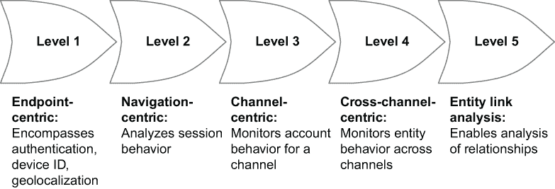

图 10.1 Gartner 提出的欺诈检测五层方法

在这个模型中，每个层级代表一种特定的客户活动和行为类型：

+   *Level 1* 以端点为中心，包括用户身份验证、设备和地理位置信息。它包括为不同的客户访问渠道添加一组身份验证选项。对于低风险场景，所有银行都提供双因素身份验证，例如硬件或软件 ID 与个人识别码（PIN）的组合，或者用户 ID 和密码。对于高风险场景，三因素身份验证（添加来自第三类身份凭证，如生物识别）更安全，但也不太方便。带外身份验证，它要求为身份验证和访问使用单独的信息通道，被广泛接受为防止中间人攻击的防御措施。这些控制听起来很基础，但许多机构即使在这一点上监控也很薄弱 [Barta and Stewart, 2008]。

+   *Level 2* 以导航为中心，这意味着在特定会话期间分析客户行为是否存在异常。分析包括对在线客户和账户活动的实时、动态捕获。这些信息用于构建客户档案，以确定对这位客户而言什么是正常或异常，从而提供对客户/账户的更全面视角，并为实时决策奠定基础。

+   *第三级* 是以渠道为中心的。它侧重于分析账户活动的异常情况。想法是拥有一个端到端的企业平台，可以针对特定渠道，并在渠道之间提供可扩展性。在银行环境中，欺诈预防系统可能会专注于自动清算所（ACH）交易。如果客户通常每月只进行一到两次此类交易，那么一天内发生 30 笔 ACH 交易将被视为异常。

+   *第四级* 是跨产品和跨渠道；它包括监控实体在账户、产品和渠道之间的行为。最初看似合法的交易，当与其他区域的活动相关联时，可能会显得可疑。银行可以监控通过电话银行、在线、支票和移动设备进行的信用卡账户支付。这种广泛的交易监控方法（而不是像以渠道为中心的方法那样只关注来自单一来源的交易子集）很重要，因为它提供了对主体行为的全局视角。欺诈者会通过小额或零额交易尝试进行大量系统测试，这些测试可能会被抽样遗漏。

+   *第五级* 是关于实体链接分析，或评估不同用户或交易之间的联系。在这一级别，分析超越了交易和客户视角，以分析相关实体网络（如共享人口统计数据或交易模式的客户，或人们之间的一般关系）内的活动和关系。实体链接分析通过识别仅在跨相关账户或实体查看时才显得可疑的行为模式，或通过发现与可疑账户、实体或个人相关的网络，以确定案件是否仅限于孤立的个人，还是属于犯罪阴谋的一部分，从而帮助检测和预防欺诈。在汽车保险行业，欺诈检测系统可能通过识别可疑模式或重叠，如一个人在一个案例中是投保人，在另一个案例中是乘客，或投保人和索赔人有相同的电话号码，或反复使用相同的汽车修理厂和医疗专业人员，来揭露安排的交通事故或虚假索赔。

在这个框架中，第五级——最先进的一级——专注于使用图分析作为对抗欺诈的有力工具。第八章中提出的场景，其中使用图根据提供的信息在人们之间建立联系，也属于这一类别。在这种情况下，网络分析通过人口统计属性（如地址、电话号码、雇主、账户所有权、IP 地址和设备 ID）将实体连接起来。

本章重点介绍社会网络分析（SNA），它涉及探索用户之间的显式或隐式联系，作为进行欺诈检测和预防的基础。我们将考虑从可用数据中构建社会网络的各种技术，以及识别欺诈者或评估人们成为欺诈受害者风险的技术。

## 10.1 社会网络分析概念

从一般意义上来说，我们可以认为网络效应是强大的。这个说法通常被认为是正确的，并且得到了大量具体证据的证实。人们倾向于与他们认为在某些方面与自己相似的其他人交往[Newman, 2010]，例如种族、宗教、政治派别、爱好、社会经济地位或性格。因此，了解网络中某些节点（如“诚实”和“不诚实”）的某些特征，将给我们一个相当大的机会来猜测其他节点的特征[Koutra et al., 2011]。

这个概念用“同质性”这个术语来表达，它归结为“物以类聚”的表达方式。友谊大多基于相似的兴趣、起源或经历——包括，可能地，共同倾向于进行欺诈。关系决定了哪些人会受到谁的影响，以及他们之间信息交流的程度。

重要的是要注意，并非所有的社交网络都是同质性的。有不同方式来正式计算一个网络有多少同质性，但总的来说，我们可以这样说：如果一个网络中的节点 X（欺诈者、纽约客、医生等）与其他带有标签 X 的节点有更大的连接程度，那么这个网络就是同质性的。在欺诈检测的背景下，

*如果一个网络是同质性的，那么欺诈节点与其他欺诈节点有显著更多的连接，因此，合法节点与其他合法节点有显著更多的连接[Baesens et al., 2015]。*

更具体地说，假设 l 是网络中合法节点的比例，计算为合法节点数除以总节点数，f 是网络中欺诈节点的比例，计算为欺诈节点数除以总节点数。在一个纯粹随机的网络中——在这种网络中，边是在节点之间随机创建的，没有任何内部或外部影响——两个不同标签节点之间连接的预期概率可以表示为 2 × l × f。这些边被称为*交叉标签边*。一个网络是同质性的，如果交叉标签边的比例（r），即交叉标签边数与总边数的比率，显著低于预期的概率 2 × l × f。考虑图 10.2 所示的社交网络。

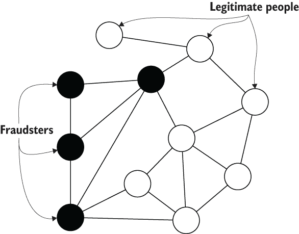

图 10.2 社会网络的一个玩具示例

黑色节点是欺诈者，白色节点代表合法的人。该网络由 11 个节点组成，其中 7 个是合法的，4 个是欺诈的。在这个例子中，l 的分数是 7/11，f 的分数是 4/11。在随机网络中，交叉标记边的比例应该是

2 × *l* × *f* = 2 × 7/11 × 4/11

2 × 7/11 × 4/11 = 0.462

该网络有 4 个交叉标记的边，5 个欺诈节点之间的边，以及 9 个合法节点之间的边，总共有 18 条边。因此，r（观察到的交叉标记边的比例）的值为 4/18（0.222），这显著小于（实际上，小于随机网络预期值的一半）。因此，我们可以说图 10.2 中的网络是同质的。用公式来说，如果一个网络是同质的，那么

H: 2 × 1 × f ≈ r

在市场营销中，同质性的概念经常被用来评估个人如何相互影响，以及确定哪些人可能对营销激励措施做出反应，并应该成为目标。例如，如果亚历山德罗的所有朋友都使用电信运营商 X，那么亚历山德罗很可能与同一家运营商签订合同。

在欺诈的背景下，同样的推理也是适用的。我们定义同质网络为一个网络，其中欺诈者更有可能与其他欺诈者相连，而合法的人更有可能与其他合法的人相连。图 10.3 展示了这样一个网络可能的样子。

灰色节点代表欺诈者，白色节点代表合法的人。很容易看出灰色节点聚集成了群体；这个网络有一个大子图和一个小子图，包含三个节点。在欺诈分析的情况下，这样的一群欺诈者被称为*欺诈网络*。合法节点也聚集在一起。然而，正如你所看到的，网络并不是完全同质的：欺诈节点不仅与其他欺诈节点相连，还与合法节点相连。通过观察这个网络，我们可以识别出那些有很高可能性成为欺诈尝试受害者的合法节点，因为它们是与欺诈网络相连的节点。

练习

使用前面给出的公式来确定图 10.3 中的网络是否是同质的。到目前为止，我们一直在观察社交网络的快照，但社交网络本质上是动态的，并且迅速演变。为了进行适当的分析，我们的技术必须考虑这个维度——也就是说，我们必须考虑网络随时间的变化。网络中同时出现几个欺诈节点可能表明新欺诈网络的产生；包含许多欺诈节点的子图可能表明更成熟的系统。防止新网络的成长和现有网络的扩张是欺诈检测模型中需要解决的重要挑战。

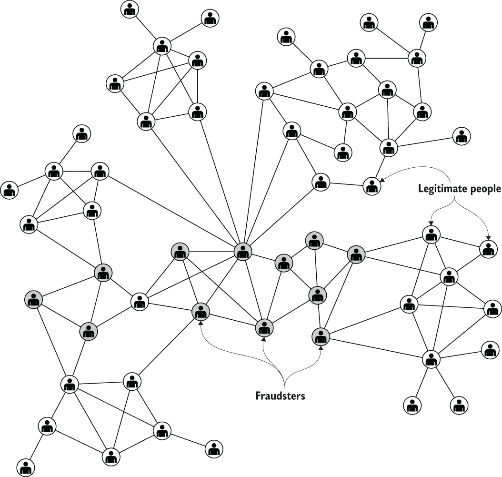

图 10.3 欺诈网络

从前面的讨论中可以看出，社会网络分析在打击欺诈方面的相关性是明显的。使用适当的公式，我们能够识别社会网络是否表现出同质行为。在这个阶段，我们可以探索我们可用的 SNA 和 CNA 方法。

假设我们拥有或可以创建一个社会网络，我们验证它是一个同质网络，并有一些关于真实或潜在欺诈者的信息。我们如何使用 SNA 来提高我们的欺诈检测能力？

欺诈者通常因为参加相同的活动和事件、参与相同的犯罪、使用相同的资源集合或是一个人（如通过共享的个人信息的证据）而相互联系。基于关联的罪责方法结合可用的弱信号以推导出更强的信号，并在许多环境中被广泛用于异常检测和分类（如会计欺诈、网络安全、信用卡欺诈等）。因此，我们可以寻找欺诈者通过使用社会结构交换如何进行欺诈的知识。我们可以使用两种类型的方法和技术：

+   *基于分数*——我们逐个分析社会网络节点，使用考虑直接邻居和节点在网络中角色的指标（例如，有多少最短路径通过它）为每个节点分配分数。

+   *基于聚类*——考虑关系，我们将社会网络分割成多个节点集群（社区），试图从这些群体中推导出一些知识。

我们将首先检查基于分数的方法。

## 10.2 基于分数的方法

基于分数的社会网络分析（SNA）方法使用指标来衡量社会环境对感兴趣节点的影響。这些指标被分配给每个节点，可以是单独的，也可以是组合的，并进行分析以确定未标记的节点是否可能存在欺诈。得到的分数表示一个人（由社会网络中的节点表示）可能成为欺诈目标或可能成为欺诈者的概率或风险。如图 10.4 所示，将一组指标分配给每个节点的这种想法被称为*特征化*。

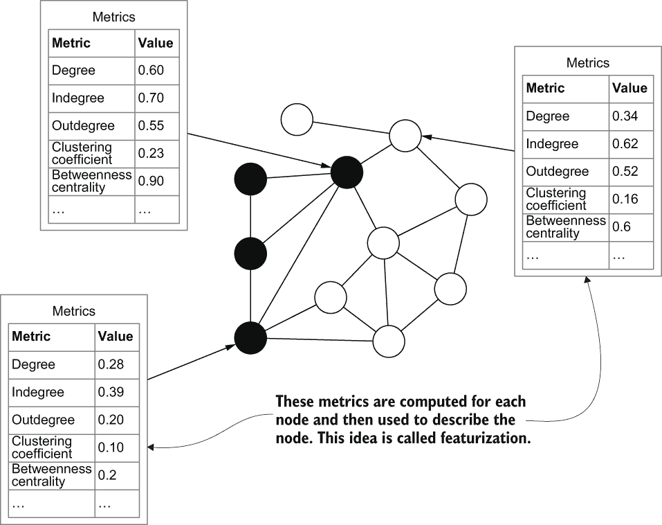

图 10.4 特征化

可以从网络中提取多种类型的指标，其中一些比其他指标更相关，这取决于具体情况。我们使用的网络分析技术可以分为三大类[Baesens et al., 2015]：

+   *邻域指标*——邻域指标基于节点的直接连接来表征节点，考虑节点周围的 n 阶邻域（由距离该节点 n 跳的节点组成）。由于可扩展性问题，检测模型通常仅整合从节点及其直接联系人推导出的特征，称为节点的*一阶邻域*。

+   *中心性度量*—中心性度量旨在量化节点（在此，社交网络中的个人）的重要性 [Boccaletti 等人，2006]。这些度量通常基于子图或整个网络结构。

+   *集体推理算法*—给定一个已知欺诈节点的网络，集体推理算法试图确定这些节点对网络中未标记节点的影响。目标是计算一个节点被暴露于欺诈并因此受到影响（使得该节点所标识的人更有可能成为欺诈者或欺诈的受害者）的概率。

为了说明这些方法中的每一个，我们将使用一个真实的社会网络和 Neo4j 中可用的图算法 ²。要深入了解这些算法，请参阅 Mark Needham 和 Amy Hodler 所著的 *Graph Algorithms: Practical Examples in Apache Spark and Neo4j*（O’Reilly，2019）。

由于（显然的原因）没有公开可用的欺诈者社交网络，我们将使用 GitHub 社交网络³进行分析。GitHub 是一个由 GitHub 开发者组成的大型社交网络，于 2019 年 6 月从公共 API 中收集 [Rozemberczki 等人，2019]。节点是那些至少标记了 10 个 GitHub 仓库（在界面中点击星号按钮以保存或“收藏”它们）的开发者，边是相互关注的关联。节点根据职位或描述进行标记，并标记为 Web 开发者或机器学习从业者。这里使用的度量、它们的计算方式以及产生的分数是有效且适用于真实场景的。

为了本章的目的，我们需要一个两个用户类别相互作用的社交网络。我们将把机器学习从业者视为目标类别（扮演欺诈者的角色）。这样，讨论和结果可以直接应用于欺诈者社交网络。

由于维度，我们不需要为导入数据集创建 Python 脚本；我们可以使用 Neo4j 中的 LOAD CSV 功能。首先，我们需要按照以下查询导入节点（在将数据集移动到 Neo4j 安装目录的导入目录之后）。

列表 10.1 创建约束

```
CREATE CONSTRAINT ON (g:GitHubUser) ASSERT (g.id) IS UNIQUE;
```

列表 10.2 导入节点 4

```
USING PERIODIC COMMIT 1000⁴
LOAD CSV WITH HEADERS FROM 'file:///git_web_ml/musae_git_target.csv' AS row
CREATE (user:GitHubUser {id: row.id, name: row.name, machine_learning: 
➥ toInteger(row.ml_target)})
```

接下来，我们必须导入关系。

列表 10.3 导入关系

```
USING PERIODIC COMMIT 1000
LOAD CSV WITH HEADERS FROM 'file:///git_web_ml/musae_git_edges.csv' AS row
MATCH (userA:GitHubUser {id: row.id_1})
MATCH (userB:GitHubUser {id: row.id_2})
CREATE (userA)-[:FOLLOWS]->(userB)a
```

几秒钟（或几分钟，取决于你电脑的功率），图数据库就准备好了。正如我之前已经提到好几次的，图的一个优点是它们允许我们通过视觉检查来洞察数据。因此，在使用图之前，我们应该用特定的标签（GitHub 用户）标记节点——WebDeveloper 和 MLDeveloper——这样我们就可以通过视觉来识别它们。以下查询用于此目的，使我们能够轻松识别节点，并简化以下分析。

列表 10.4 标记 Web 开发者

```
MATCH (web:GitHubUser {machine_learning: 0})
SET web:WebDeveloper
```

列表 10.5 标记机器学习开发者

```
MATCH (ml:GitHubUser {machine_learning: 1})
SET ml:MLDeveloper
```

结果图如图 10.5 所示。蓝色节点代表网页开发者，红色节点代表机器学习开发者。

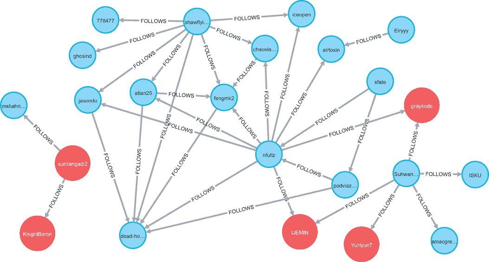

图 10.5 导入后的图数据库

在这里使用标签，而不是机器学习属性的值，将提高后续查询的结果，在这些查询中，我们必须区分机器学习开发者和网页开发者。

选定的社交网络似乎具有我们需要的特征：机器学习开发者（我们的目标）在图中相对较少，并且通常与类似开发者相连。现在我们可以计算我们需要的度量。

### 10.2.1 邻域度量

邻域度量使用节点的直接连接和 n 跳邻域来表征节点本身。我们可以考虑不同的度量，但在欺诈的背景下，为了本章的目的，我们将考虑度数、三角形和局部聚类系数。

节点的*度数*正式定义为节点拥有的连接数。度数本身不考虑关系的方向，但相关的入度和出度度量则考虑。*入度*计算进入的连接数，*出度*计算出去的连接数。节点的度数总结了节点有多少邻居。在欺诈检测的背景下，区分节点拥有的欺诈邻居和合法邻居的数量也是有用的。我们可以将这些度量称为*欺诈度数*和*合法度数*。为了澄清，考虑一个带有和不带有关系方向的简单社交网络（图 10.6）。在这个图中，红色节点（D 和 G）是欺诈的。

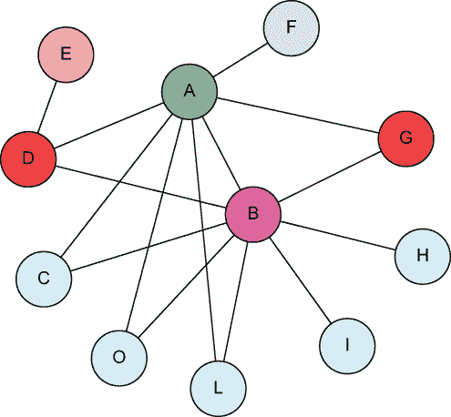

图 10.6 两个示例图，一个无向（左）和一个有向（右），包含两个欺诈节点（D 和 G）

左侧的无向图告诉我们节点 B 的度数为 8，这是网络中最大的度数。如果我们考虑方向，我们可以看到节点 B 的入度为 6，出度为 3。

我们还可以分析图中欺诈节点和合法节点之间的联系。节点 A 和 B 各自有 2 个欺诈度（G 和 D 都与它们相连），因此是受欺诈影响最大的节点。每个节点的度数列在表 10.1 中。

表 10.1 图 10.6 中节点的度数（考虑到 D 和 G 是欺诈的）

| 节点 | 度数 | 入度 | 出度 | 欺诈度数 | 合法度数 |
| --- | --- | --- | --- | --- | --- |
| A | 8 | 7 | 1 | 2 | 6 |
| B | 9 | 6 | 3 | 3（节点 G 计算了两次） | 6 |
| C | 2 | 0 | 2 | 0 | 0 |
| D | 3 | 1 | 2 | 0 | 3 |
| E | 1 | 1 | 0 | 1 | 0 |
| F | 2 | 1 | 1 | 0 | 2 |
| G | 3 | 1 | 2 | 0 | 3 |
| H | 1 | 0 | 1 | 0 | 1 |
| I | 1 | 0 | 1 | 0 | 1 |
| L | 2 | 0 | 2 | 0 | 2 |
| O | 2 | 0 | 2 | 0 | 2 |

让我们通过查询来计算真实网络的相同指标。以下列表显示了如何计算节点的度（这里，GitHub 用户 amueller）。

列表 10.6 计算节点的度

```
MATCH (m:MLDeveloper {name: "amueller"})-[:FOLLOWS]-(o:GitHubUser)
return count(distinct o) as degree
```

注意，我们在计算度时没有使用带箭头的-[:FOLLOWS]-（<- 或 ->），因为我们不关心关系的方向。在有向网络中，我们可以区分入度和出度。入度指定了多少个节点指向感兴趣的靶点，而出度描述了可以从感兴趣的靶点到达的节点数量。以下查询显示了如何计算这些指标。

列表 10.7 计算节点的入度

```
MATCH (m:MLDeveloper {name: "amueller"})<-[:FOLLOWS]-(o:GitHubUser)
return count(distinct o) as indegree
```

列表 10.8 计算节点的出度

```
MATCH (m:MLDeveloper {name: "amueller"})-[:FOLLOWS]->(o:GitHubUser)
return count(distinct o) as outdegree
```

我们可以通过以下查询轻松地计算一个节点的欺诈度（在我们的数据集中，与 MLDeveloper 的关联）和合法度（在我们的数据集中，与 WebDeveloper 的关联）。在（在我们的网络中，意义略有不同，但概念是相同的）。

列表 10.9 计算节点的欺诈（MLDeveloper）度

```
MATCH (m:MLDeveloper {name: "amueller"})-[:FOLLOWS]-(o:MLDeveloper)
return count(distinct o) as degree
```

列表 10.10 计算节点的合法（WebDeveloper）度

```
MATCH (m:MLDeveloper {name: "amueller"})-[:FOLLOWS]-(o:WebDeveloper)
return count(distinct o) as degree
```

对于这个用户，欺诈度（MLDeveloper）为 305，合法度（WebDeveloper）为 173。这个结果并不令人惊讶：GitHub 用户 amueller 是《Python 机器学习入门：数据科学家指南》（O’Reilly，2016）的作者之一，因此很明显，他是一名机器学习开发者，我们预计他与其他机器学习开发者的联系会比与网络开发者的联系更多。我们可以通过以下查询轻松地检查这个规则是否普遍适用。

列表 10.11 计算所有机器学习开发者的度

```
MATCH (ow:WebDeveloper)-[:FOLLOWS]-(m:MLDeveloper)-[:FOLLOWS]-
➥ (om:MLDeveloper)
WITH m.name as name, 
count(distinct om) as mlDegree, 
count(distinct ow) as webDegree
RETURN name, mlDegree, webDegree, mlDegree + webDegree as degree
ORDER BY degree desc
```

结果表明，对于网络中的所有机器学习开发者也是如此。因此，似乎数据集表现出我们描述的欺诈社交网络的特征。

网络的**度分布**描述了网络中度的概率分布。在现实生活中的网络中，它通常遵循幂律：也就是说，许多节点只与其他少数节点相连，而网络中只有少数节点与其他许多节点相连。下一个查询允许我们计算节点度的分布。

列表 10.12 计算节点度的分布

```
MATCH (m:GitHubUser)-[:FOLLOWS]-(om:GitHubUser)
RETURN m.name as user, count(distinct om) as degree
```

结果可以下载为 CSV 文件并可视化，如第九章所述。图 10.7 显示了分布将看起来是什么样子。（Excel 文件可在代码存储库的 ch10/analysis/DegreeAnalysis.xlsx 中找到。）

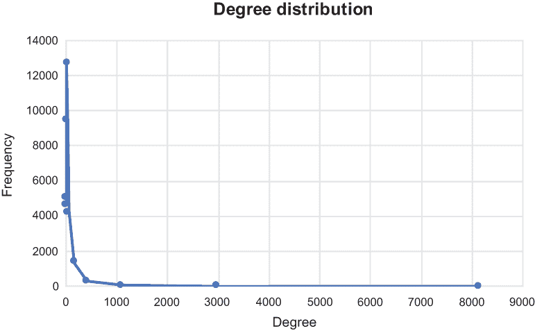

图 10.7 示例网络中的度分布

如您所见，大多数节点的度小于 100。大多数值介于 7 和 20 之间。

练习

通过调整列表 10.6 到 10.11 来探索你创建的图数据库，将它们改为考虑网页开发者而不是机器学习开发者。为这些实验识别一些有趣的网页开发者。

我们将要考虑的第二个邻域度量是*三角形数量*：由三个节点组成的完全连接子图的数量。图 10.8 展示了完全连接子图或三角形的例子。

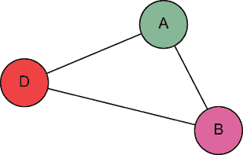

图 10.8 三角形的例子

观察三角形是研究紧密相连的人群群体影响力的方法之一。它与*三角闭合*原则相关，这是一种建立新联系[拉波波特，1953]的机制。在社会网络中，这可以表达为这样的观点：如果两个人有一个共同的朋友，那么这两个人将来成为朋友的可能性会增加。这个术语来源于这样一个事实，如果我们有一个像图 10.9 那样的简单网络，D-B 边就具有闭合这个三角形第三边的效果（如图 10.8 所示）。

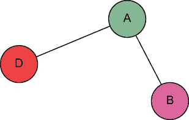

图 10.9 一个三角形的一边是开放的简单网络

如果我们在两个不同时间点观察一个社交网络，我们通常会发现在较晚的时间点，由于这种三角形闭合操作，形成了大量新的边，因为具有共同邻居的人之间建立了联系[艾斯利和克莱因伯格，2010]。

属于一个群体的节点会受到该群体其他成员的影响。在社会网络中，这种影响扩展到群体的其他成员的信仰、兴趣、观点等。因此，在欺诈者网络中，如果一个节点是许多三角形的组成部分，而其他两个节点是欺诈的，那么这个节点有很高的可能性会受到欺诈本身的影响（即参与欺诈或成为欺诈的受害者）。为了计算这种风险，我们可以区分合法三角形和欺诈三角形。如果三角形中的另外两个节点都是欺诈的，我们说这个三角形是欺诈的。如果两个节点都是合法的，我们说这个三角形是合法的。如果只有其中一个节点是欺诈的，这个三角形就是半欺诈的。考虑图 10.10 中的玩具网络。


图 10.10 示例欺诈者网络

表 10.2 列出了网络中每个至少属于一个三角形的节点的三角形度量。

表 10.2 图 10.10 中网络的三角形度量

| 节点 | 三角形 | 欺诈三角形 | 合法三角形 | 半欺诈三角形 |
| --- | --- | --- | --- | --- |
| A | 6 | 1 | 3 | 2 |
| B | 6 | 1 | 3 | 2 |
| C | 1 | 0 | 1 | 0 |
| D | 3 | 0 | 1 | 2 |
| G | 3 | 0 | 1 | 2 |
| L | 1 | 0 | 1 | 0 |
| O | 1 | 0 | 1 | 0 |

Neo4j 在其图数据科学库中提供了一个简单的计算图或特定节点相关所有三角形的程序。附录 B 解释了如何安装和配置它。以下查询演示了如何操作。

列表 10.13 计算节点的三角形

```
CALL gds.triangleCount.stream({
  nodeProjection: 'GitHubUser',
  relationshipProjection: {
    FOLLOWS: {
      type: 'FOLLOWS',
      orientation: 'UNDIRECTED'
    }
  },
  concurrency:4
})
YIELD nodeId, triangleCount
RETURN gds.util.asNode(nodeId).name AS name,
gds.util.asNode(nodeId).machine_learning as ml_user, triangleCount
ORDER BY triangleCount DESC
```

三元闭合在社会网络中的基本作用激发了简单社会网络度量的制定，以捕捉其普遍性。其中一种度量是*局部聚类系数*。节点 A 的聚类系数定义为随机选择 A 的两个朋友成为彼此朋友的可能性。换句话说，A 的朋友对之间通过边的连接比例。让我们通过再次考虑我们的玩具网络（图 10.11）来更清楚地说明这一点。

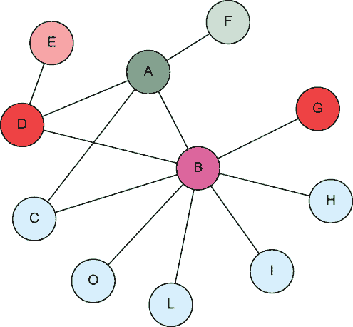

图 10.11 示例图

节点 A 的聚类系数为 2/6，或 0.333，因为在六个可能的朋友对（B-D，B-C，B-F，C-D，C-F 和 D-F）中，C-B 和 D-B 之间存在边。一般来说，节点的聚类系数范围从 0（当节点的朋友之间没有一个是朋友时）到 1（当节点的所有朋友都是朋友时），并且节点周围的三元闭合作用越强，聚类系数往往会越高。在欺诈场景中，这个度量很重要，因为如果一个节点的局部聚类系数与网络的平均聚类系数相比较低，那么这个节点连接到属于独立群体的人。这种异常情况可能揭示潜在的欺诈风险，因为欺诈者正在加入人群以实施犯罪。确定节点局部聚类系数的公式看起来像这样：

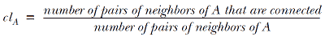

以下查询允许您计算我们网络中每个节点的聚类系数，并将它们存储为节点的属性。

列表 10.14 计算聚类系数

```
CALL gds.localClusteringCoefficient.write ({
  nodeProjection: 'GitHubUser',
  relationshipProjection: {
    FOLLOWS: {
      type: 'FOLLOWS',
      orientation: 'UNDIRECTED'
    }
  },
  concurrency:4,
  writeProperty:'clusteringCoefficient'
})
YIELD createMillis, computeMillis, writeMillis, nodeCount, 
➥ averageClusteringCoefficient
RETURN createMillis, computeMillis, writeMillis, nodeCount, 
➥ averageClusteringCoefficient
```

当您运行此查询并查看结果时，您会发现平均聚类系数较低：大约为 0.167。

练习

探索图，检查一些系数为 0 或 1 的节点的三角形。您可以使用查询来找到一两个这样的节点，然后使用 Neo4j 浏览器来导航它们。作为一个建议，我会创建查询以避免只有一两个追随者的平凡节点。

### 10.2.2 中心性度量

中心性度量揭示了图或子图中的中心节点——即可能对其他节点有强烈影响的节点——通过为每个节点分配一个分数来表示它在通过图进行通信中的中心程度[Fouss 等人，2016]。在社会网络中，中心性度量帮助我们回答以下问题：

+   在一个社区中，哪个节点最具代表性？

+   给定节点在通过网络信息流动方面有多重要？

+   哪些节点是最外围的？

这些指标在反欺诈场景中很有用；它们可以通过识别欺诈网络中的关键行动者来防止未来欺诈活动的扩展，该行动者可能作为中心节点并大量参与有关欺诈组织的沟通。与只考虑节点直接连接的邻里指标相比，这些类型的指标考虑了整个图（或其大部分）。因此，它们考虑了人在整个网络中的作用，而不仅仅是他们在自我网络中的作用。⁵

我们将考虑的指标包括最短路径、接近中心性和中介中心性。为了演示目的，就像邻里指标一样，我们将使用 GitHub 网络作为我们假设的欺诈者社交网络的代理。

**最短路径**是从目标节点到达节点所需的最小跳数（测地距离）。在计算这些距离时，算法可以考虑到每条关系的权重，这在您使用此指标寻找从一地到另一地的最佳路线时特别有用。在其他场景中，例如在我们的场景中，每条关系都有相同的权重：1。在这种情况下，最短路径是通过计算您需要通过多少节点（或关系）从源节点到达目标节点来确定的。图 10.12 展示了示例，识别了从节点 A 到节点 G、I 和 L 的最短路径。

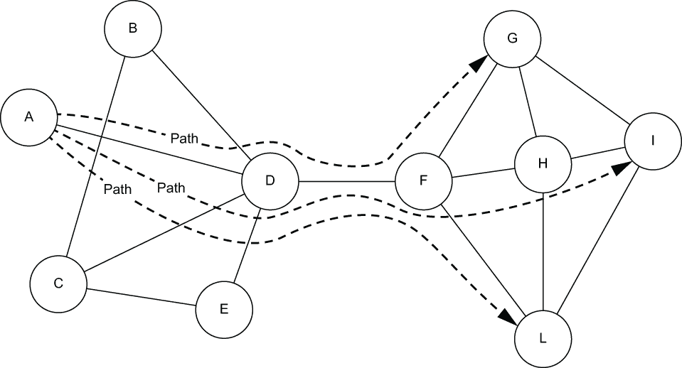

图 10.12 最短路径示例

在欺诈背景下，潜在目标与欺诈者之间的测地距离可以揭示他们成为受害者的风险。合法节点与欺诈节点越近，它成为目标的可能性就越大。了解欺诈节点与合法节点之间存在多少路径也很有趣：路径越多，欺诈影响最终到达目标节点的可能性就越高。换句话说，如果一个欺诈节点在一个潜在目标的直接子图（邻域）中，它被影响的可能性就更大。相反，考虑这些距离可以揭示特定欺诈者的欺诈潜力：那个人直接或间接地接触到不同受害者有多容易。假设在我们的样本网络中，某些节点已被识别为欺诈，如图 10.13 所示。

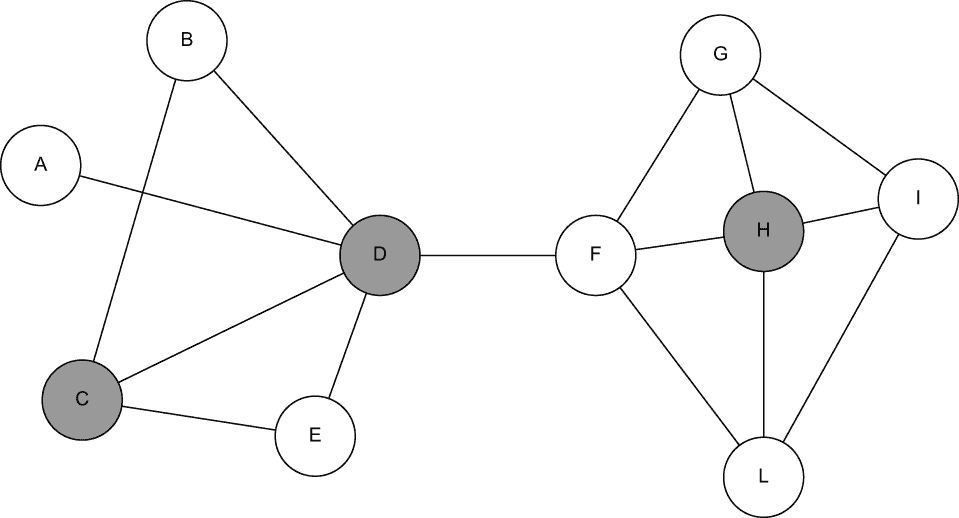

图 10.13 欺诈用例中的最短路径示例。深色节点是欺诈节点。

通过查看此图，我们可以提取表 10.3 中的信息来分析网络中合法节点的风险水平。为了计算风险，我们将考虑到欺诈节点的最短路径长度（列 2）以及该节点与任何欺诈节点之间的 n 跳路径——换句话说，在 n 跳内我们可以从该节点到达多少个欺诈节点。（如果通过不同的路径可达，则同一欺诈节点会被计算多次。）

表 10.3 到欺诈节点的测地距离摘要

| 节点 | 测地路径 | 1 跳路径 | 2 跳路径 | 3 跳路径 |
| --- | --- | --- | --- | --- |
| A | 1 | 1 | 2 | 5 |
| B | 1 | 2 | 2 | 7 |
| E | 1 | 2 | 4 | 7 |
| F | 1 | 2 | 5 | 9 |
| G | 1 | 1 | 4 | 7 |
| I | 1 | 1 | 3 | 8 |
| L | 1 | 1 | 4 | 7 |

许多算法和技术可以计算两个节点之间的最短路径，但这个主题超出了本书的范围。Neo4j 提供了许多开箱即用的解决方案，并且各种库提供了针对此类知名任务的超级优化算法。以下查询显示了如何使用 Neo4j 图算法库计算导入数据库的最短路径。

列表 10.15 查找两个节点之间的最短路径

```
MATCH (start:MLDeveloper {name: "amueller"})
MATCH (end:MLDeveloper {name: "git-kale"})
CALL gds.beta.shortestPath.dijkstra.stream({
nodeProjection: 'MLDeveloper',
relationshipProjection: {
FOLLOWS: {
type: 'FOLLOWS',
orientation: 'UNDIRECTED'
}
},
sourceNode: id(start),
targetNode: id(end)
})
YIELD index, nodeIds, costs
WITH index,
[nodeId IN nodeIds | gds.util.asNode(nodeId).name] AS nodeNames,
costs
ORDER BY index
LIMIT 1
UNWIND range(0, size(nodeNames) - 1) as idx
RETURN nodeNames[idx] as name, costs[idx] as cost
```

本查询的结果显示在图 10.14 中。成本是从起始节点 (amueller) 到特定节点所需跳数的数量。

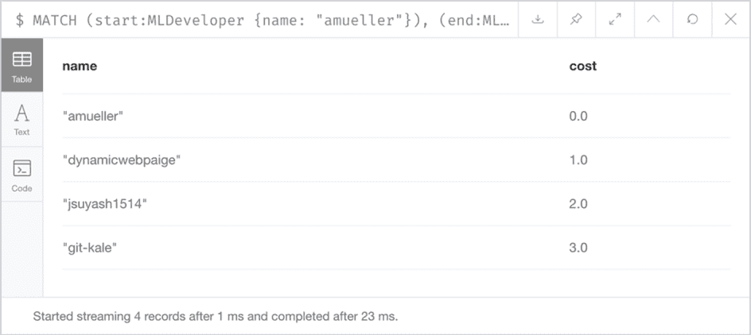

图 10.14 列表 10.15 的结果

*接近中心性* 是通过考虑连接节点的所有最短路径长度来确定的。形式上，它是节点从网络中所有可达节点到该节点的平均距离的倒数。网络 G 中具有 n 个节点的节点 a 的接近中心性 cca 计算如下

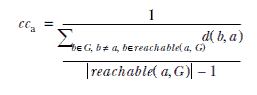

其中

+   d(b,a) 是节点 a 和节点 b 之间的测地距离。

+   reachable(a,G) 是从节点 a 可达的 G 的子图。

+   |reachable(a,G)| 是 a 可达的节点数。

分母是节点 a 从 a 可达的所有节点的平均距离。高接近中心性值表示该节点可以轻松地到达网络中的许多其他节点，因此对其他节点有很强的影响。我们可以这样理解中心性的逻辑：如果一个人不是中心人物（具有低接近中心性值），他们必须依赖他人通过网络为他们传递消息或到达其他人。相反，一个中心人物（具有高接近中心性值）可以轻松地在网络中传播消息或直接到达其他人，而无需（或很少）中间人稀释他们的影响力。

在欺诈用例中，如果一个（子）图中的欺诈节点具有高接近中心性值，欺诈可能很容易通过（子）网络传播并污染其他节点。能够独立地接触到大量其他节点扩展了该节点的覆盖范围。此外，接近中心性在作为衡量一个人在社会网络中独立性的指标之外还有用。研究人员还将这个指标与一个人在网络中轻松获取信息的能力、权力和影响力联系起来。所有这些方面都可能在一个欺诈者的欺诈能力中发挥关键作用。

我们不必担心自己计算接近中心性值，因为 Neo4j 和其他库提供了对该任务的支持。以下查询显示了如何计算整个图的接近中心性并将值存储在每个节点中，以供进一步分析。

列表 10.16 计算和存储接近中心性

```
CALL gds.alpha.closeness.write({
  nodeProjection: 'GitHubUser',
  relationshipProjection: 'FOLLOWS',
  writeProperty: 'closeness'
}) YIELD nodes, writeProperty
```

我们可以通过接近中心性对节点进行排序，以找到具有最高值的机器学习开发者。

列表 10.17 获取具有最高接近中心性的前 20 名 ML 开发者

```
MATCH (user:MLDeveloper)
RETURN user.name, user.closeness
ORDER BY user.closeness desc
LIMIT 20
```

这个查询的结果显示在图 10.15 中。

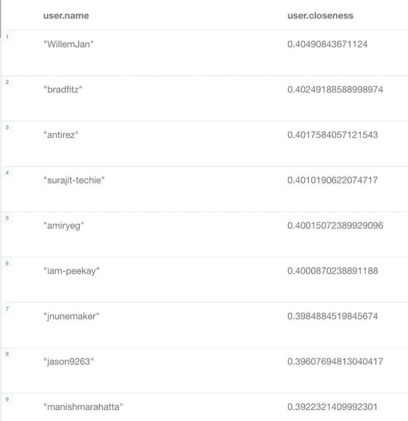

图 10.15 列表 10.17 的结果

看到结果，你会注意到一些用户是杰出的用户，他们拥有很多粉丝，并且正在从事高度相关的开源项目。但在我们的数据集中，一些顶级用户可能不会被考虑为有影响力。第一个是 WillemJan，他只有很少的粉丝，但关注了 33,000 个 GitHub 用户，这使得他在接近中心性堆栈中名列前茅。这个例子表明，接近中心性受到你知道多少人（或者你关注了多少人）的影响。

*中介中心性*衡量一个节点在网络中连接任何两个节点最短路径的程度。这个指标可以解释为通过这个节点传递的信息量的一个指标。具有高中介中心性的节点可能连接社区（网络中的子图）。考虑图 10.16 中显示的例子。

在这个图中，中心节点 B 连接了几乎独立的子图。值得注意的是，该节点具有低接近中心性值；它直接连接到图中很少的节点，要到达其他节点，它必须通过长路径。但它具有高中介中心性值，因为它位于最多的路径中。

这个例子有助于理解这两个中心性概念之间的区别。而接近中心性衡量一个人知道多少人或他们能在几步之内接触到多少人，而中介中心性则考虑一个人在整个网络中的位置。在通信网络中，中介中心性衡量一个节点对通信流量的潜在控制程度。

这个例子让我们了解到在分析社交网络以打击欺诈时这些指标的价值。如果图 10.16 中的节点 B 被一个社区感染了欺诈，欺诈可以轻易地传播到其他社区。为了防止这种污染发生，一个选择是将这个节点从网络中移除。

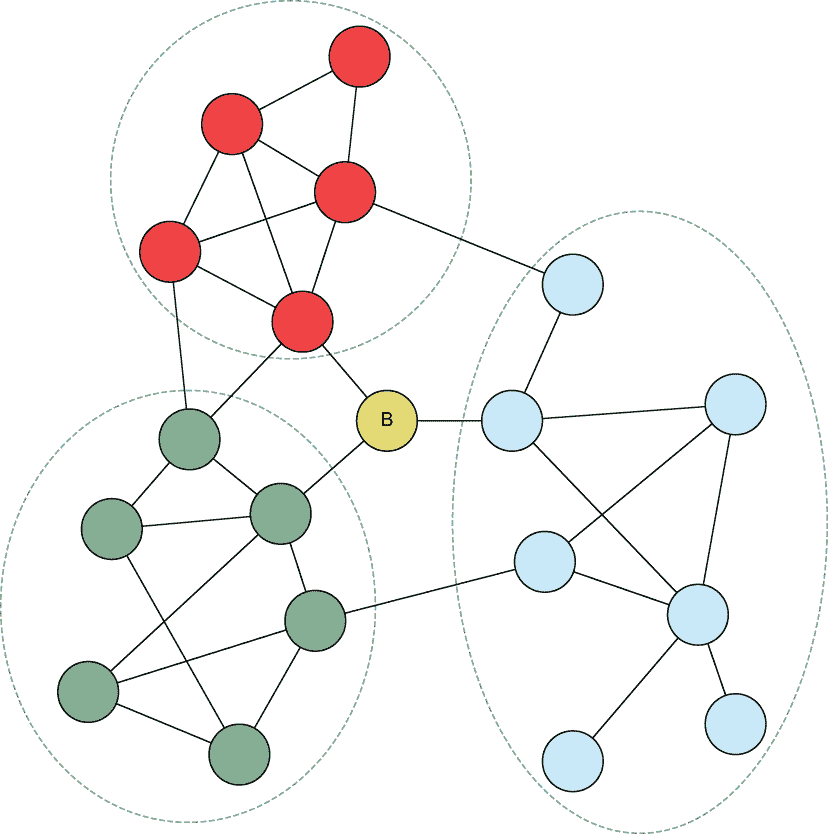

图 10.16 具有三个几乎不同的集群通过一个中心节点连接的示例图

介数中心性是多个领域中的一个强大度量。也许一个更直观的例子是疾病的传播。在一个大型人群中，具有高介数中心性的节点有很大可能性将疾病从不同的社区传播给很多人。通过识别和隔离这些节点，可以减少疾病爆发的范围。同样，在恐怖主义网络中，具有最高介数中心性的节点是传递信息、资金、武器等跨多个细胞或集群的关键人物。通过识别他们，可以识别更多的集群，通过阻断他们，我们可以影响整个网络运作的能力。

计算节点 a 的介数中心性的公式考虑了每对节点通过 a 的最短路径的百分比，并将所有这些百分比相加。数学上，

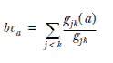

where

+   gjk 是从 *j* 到 k 通过 a 的最短路径的数量。

+   g[jk] 是从 *j* 到 k 的总最短路径数。

与接近度中心性一样，这个度量在 Neo4j 和许多其他库中得到了全面的支持。在我们的数据库中，我们可以通过以下查询轻松计算介数中心性。

列表 10.18 计算节点的介数中心性

```
CALL gds.betweenness.write({
  nodeProjection: 'GitHubUser',
  relationshipProjection: 'FOLLOWS',
  writeProperty: 'betweenness'
}) YIELD nodePropertiesWritten, minimumScore, maximumScore, scoreSum
```

然后，我们可以根据介数中心性对节点进行排序，以找到具有最高值的机器学习开发者。

列表 10.19 获取具有最高介数中心性的前 20 个 ML 开发者

```
MATCH (user:MLDeveloper)
RETURN user.name, user.betweenness
ORDER BY user.betweenness desc
LIMIT 20
```

这个查询的结果要重要得多。几乎列表中的所有人都是高度相关的：他们是著名书籍的作者，或者他们在机器学习领域贡献了很多开源项目。在这种情况下，介数中心性比接近度中心性更好地捕捉了人们在网络中的重要性。它代表了一个人在整个网络中的影响力，而不仅仅是他们的朋友圈。

练习

在先前的查询中，我们只考虑了机器学习开发者来分析他们的影响力。运行查询以搜索顶级网络开发者，考虑介数和接近度中心性，然后查看他们在 GitHub 上的个人资料。

### 10.2.3 集体推理算法

在本章所考虑的场景中，一种集体推理过程通过考虑节点之间可以相互影响的事实以及这种推理效果传播的比例与节点的重要性成正比，来推断一个节点可能受到欺诈的影响——要么成为欺诈者，要么成为欺诈的受害者。我们将重点关注 PageRank，这是一种强大的集体推理算法，我们在本书早期已经看到其应用。

PageRank [Page et al., 1998]——谷歌著名搜索引擎算法排名网页的基础——可能是今天最流行的声望计算技术。它为图中的每个节点 *j* 分配一个声望分数。直观地讲，如果一个节点连接到很多本身很重要的节点，那么这个节点的声望分数必须更高。当然，在欺诈的情况下，这种“声望”也可以从另一个角度来理解。如果一个节点连接到很多声望很高的欺诈者（在我们的半标记网络中被标记为这样的知名欺诈者），那么这个节点卷入欺诈（无论是作为实施者还是受害者）的可能性很高。

我们的起点是一个半标记网络，其中包含一些标记为合法和欺诈的节点以及许多未标记的节点。图 10.17 代表我们的玩具欺诈者网络。观察这个图，如果我们假设 G 和 D 是欺诈者，我们能推断出节点 A 是欺诈者或欺诈受害者的概率是多少？

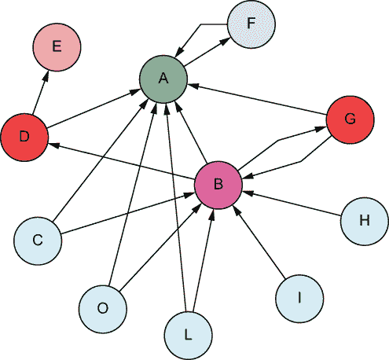

图 10.17 一个简单的有向欺诈网络，其中 D 和 G 是欺诈者

让我们从 PageRank 最初被引入的场景开始分析，忽略标签，将所有节点视为平等。现在假设节点是网页，并且一个冲浪者只能通过查看他们当前正在查看的页面上的链接来浏览页面。图显示网页 A 有七个进入链接。一个正在查看网页 B 的冲浪者接下来访问网页 A 的概率是 1/3，即 33%，因为网页 B 有三个指向其他网页的链接，其中一个是网页 A。同样，如果一个冲浪者正在查看网页 C 或 D，那么在这两种情况下，他们接下来访问网页 A 的概率都是 50%。一个网页被访问的概率被称为该网页的*页面排名*。为了确定网页 A 的页面排名，我们需要知道网页 B、C、D、F、G、L 和 O（链接到 A 的七个页面）的页面排名。

这个过程是集体推理：一个网页的排名取决于链接到它的其他网页的排名，其中一个网页排名的变化可能会以级联的方式影响所有其他网页的排名。具体来说，主要思想是重要的网页（出现在搜索结果顶部）来自其他重要网页的链接很多。以下是针对任何给定网页进行页面排名的基本方法：

+   指向该页面的网页的排名

+   从该页面链接出的页面的出度

节点的初始页面排名值设置为随机漫游者从该节点开始导航的概率——即，1/*<页面数量>*。然后它迭代直到满足某些停止标准，通常是在每次迭代的排名变化变得微不足道或达到定义的最大迭代次数时。图 10.18 通过一个具体示例总结了该算法。

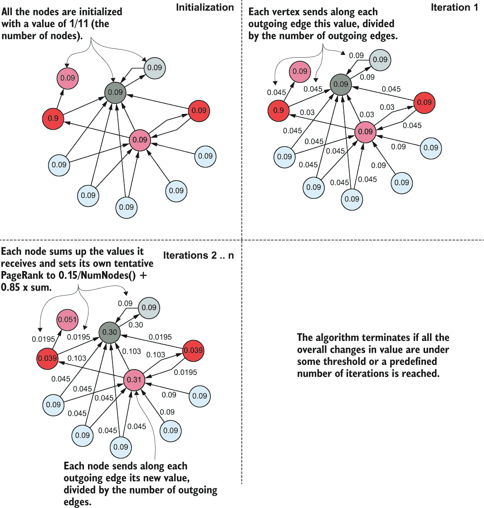

图 10.18 PageRank 初始化和迭代

在每次迭代 i 中，我们可以说节点 A 的页面排名值 PR(i,A) 是这样计算的

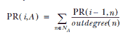

其中

+   PR(i -1,n) 是节点 n 在前一次迭代的页面排名值。

+   NA 是节点 A 的所有邻居。

PR(0,n) 是每个节点的初始值，表示随机漫游者从该节点开始导航的概率。当然，随机漫游者只通过在当前查看的网页上随机跟随链接来访问页面这一假设并不现实。漫游者的行为更加随机：他们可能不会跟随网页上的链接，而是随机访问其他页面。因此，一个更复杂的 PageRank 算法必须包括随机漫游者模型，该模型假设漫游者经常感到无聊并随意跳转到另一个网页。

假设 α 是漫游者跟随当前查看的网页上的链接的概率，而 (1 - α) 是漫游者访问随机其他网页的概率，一个更高级的公式是

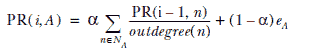

其中 (1 - α) 是 *重启概率*，e[A] 是网页 A 的 *重启值*，通常在所有网页中均匀分布。

从这个高级版本开始，Page 等人通过个性化搜索扩展了 PageRank 算法。这种个性化是通过将重启值从所有节点的均匀分布更改为针对用户搜索兴趣量身定制的版本来实现的。页面 X 的更高重启值对应于用户对该页面的更高兴趣。

这个最后的版本非常适合我们的最终用例：推断欺诈者对未标记节点的影响（这意味着我们不知道该节点所标识的人是否是欺诈者或欺诈的受害者）。在这种情况下，PageRank 算法可以被视为通过标记网络传播节点影响。 （在我们的案例中，我们知道一些节点是欺诈的。）我们通过以下方式在网络中注入欺诈：

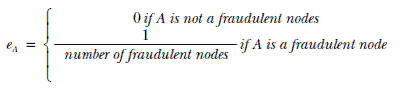

在 PageRank 计算结束时，排名最高的节点是最受欺诈影响的节点。我们可以将这些想法应用到我们的图数据库中。有很多个性化的 PageRank 实现，Neo4j 也有自己的实现。以下查询计算了所有用户的个性化 PageRank，将机器学习开发者作为起始值（在此指定为源节点）。

列表 10.20 为机器学习开发者计算个性化 PageRank

```
MATCH (mlUser:MLDeveloper)
with collect(mlUser) as mlUsers #A
CALL gds.pageRank.write({
  nodeProjection: 'GitHubUser', #B
  relationshipProjection: 'FOLLOWS',
  maxIterations: 20,
  dampingFactor: 0.85,
  sourceNodes: mlUsers,
  writeConcurrency: 4,
  writeProperty: 'pagerank'
})
YIELD ranIterations, didConverge
RETURN ranIterations, didConverge
#A Computing the list of starting nodes, since we would like to consider the 
➥ effect of this nodes on the network.
#B The page rank is computed on all the GitHubUsers
```

在这个查询中，dampingFactor 是我们的**α**，sourceNodes 是用于重启向量的节点。当分数计算完成后，我们可以使用以下查询按 PageRank 值从高到低对网络开发者进行排序。

列表 10.21 按 PageRank 排序以找到受影响最严重的用户

```
MATCH (user:GitHubUser)
RETURN user.name, user.pagerank, labels(user)
ORDER BY user.pagerank desc
LIMIT 20
```

之前查询返回的列表顶部被最有可能受到机器学习开发者影响的网络开发者占据。如果您想进一步调查，可以使用以下查询来计算特定机器学习开发者关注者的 PageRank 值总和。

列表 10.22 计算开发者的 PageRank 总和

```
MATCH (user:GitHubUser {name: "dalinhuang99"})<-[:FOLLOWS]-(follower)
WITH user, follower, follower.machine_learning as machine_learning,
CASE follower.machine_learning = 0
WHEN true THEN 0
WHEN false THEN follower.pagerank
END as mlpagerank,
CASE follower.machine_learning = 1
WHEN true THEN 0
WHEN false THEN follower.pagerank
END as webpagerank
RETURN user.pagerank, count(follower), sum(machine_learning), 
➥ sum(mlpagerank), sum(webpagerank)
```

这个查询的结果显示，这个用户有 1,000 名机器学习开发者关注他们，总共有超过 7,000 名关注者，但这些开发者的 PageRank 值总和高于网络开发者的排名总和。这个结果表明，机器学习开发者对这位用户的影响大于网络开发者，证明了 PageRank 算法可以用来确定网络对主题的影响。回到我们的欺诈场景，那么，PageRank 值可以衡量一个节点（人）受到欺诈（参与其中或被作为受害者）影响的概率。

练习

再次运行最后两个查询，将机器学习开发者和网络开发者互换，并探索结果。

## 10.3 基于聚类的算法

社交网络是通过网络中的链接揭示人与人之间关系的强大工具。在第 10.2 节中，我们的分析侧重于逐个节点地提取或计算特征，在大多数情况下考虑直接连接的邻近节点或通过每个节点的路径。在这种类型的分析中，每个节点都是单独考虑的，关注它在网络中的作用及其紧密连接的集合。这些结果指标是有用的，但要全面理解社交网络对节点（或相反，节点对网络的影响），重要的是将节点视为节点组的一部分，而不是单独考虑。由于网络的动态性，可以合理地认为，行为相同或持有相同观点或信念的社区（网络内的节点组）对网络的影响可能比单个人更大，在信息交换方面具有更大的影响力。在欺诈用例中，一组共同工作的欺诈者可能比单独行动的欺诈者具有更大的影响力。

在图论中，一个**社区**是网络中的一个子图或簇，其节点之间的连接比它们与网络中任何其他随机子图中的节点之间的连接更强、更密集。社区的所有成员都可以通过同一社区的其他成员轻松地到达（*连通性*）。同时，我们期望属于社区的节点与其他社区成员的链接概率高于不属于同一社区的节点（*局部密度*）。因此，我们可以更正式地将社区定义为网络中的一个局部密集连接子图 [Barabási and Pósfai, 2016]。例如，图 10.19 中的图可以被划分为三个社区，在每个社区中，社区内的节点之间有许多连接，而社区外则没有或很少。

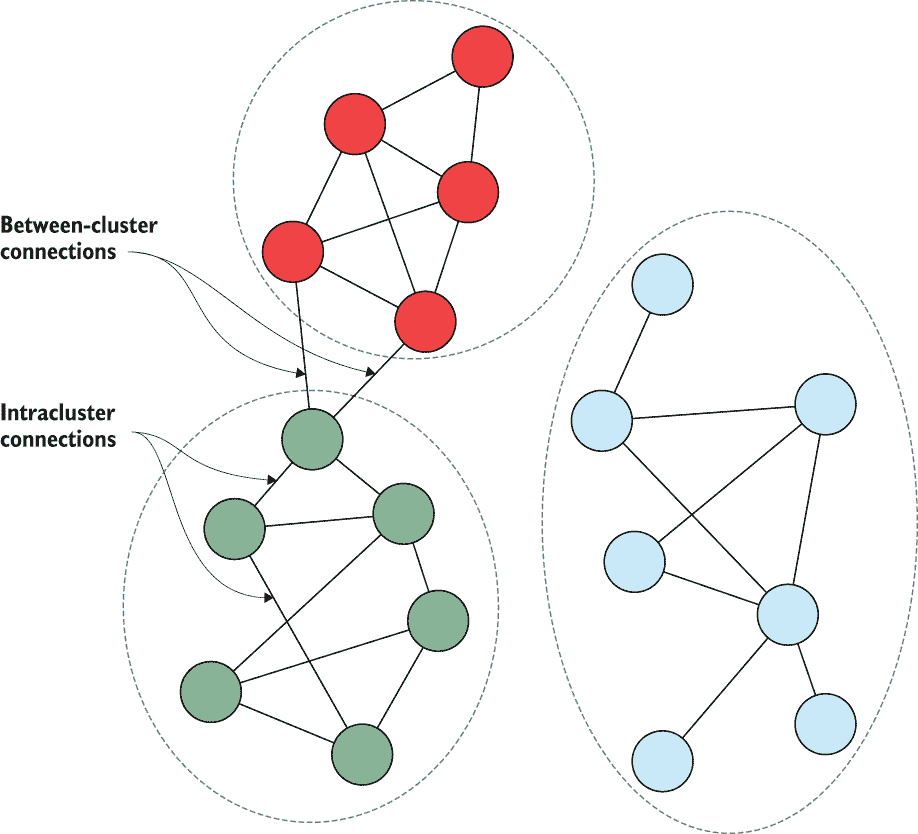

图 10.19 一个示例图，已聚类

欺诈者通常以小组的形式合作，分享、强化和提出关于如何实施欺诈的互补想法。此外，成为欺诈者群体的一员会影响人们的行为，增加他们参与欺诈的风险（工作场所的同伴压力）。在这种情况下，社区挖掘旨在识别网络中的欺诈者群体，以确定欺诈比图的其他部分更可能发生的子图。这些信息有助于检测隐藏的欺诈结构。考虑到人们如果受到整个社区的影响而不是单个欺诈者的诱惑，更有可能进行欺诈，因此，这也是识别可能被卷入欺诈活动的人的有用方法，从而遏制欺诈群体的增长 [Baesens et al., 2015]。

社区是识别常见行为模式的有力机制，即使节点在经典社交网络中没有连接。图 10.20 是一个二部图，其中的节点是商店和信用卡。商店通过欺诈交易与信用卡相连。

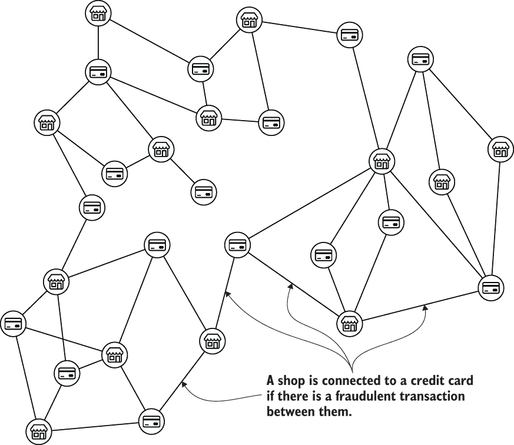

图 10.20 一个由欺诈交易连接的商店和信用卡的二部图

如第九章所述，欺诈者倾向于坚持相同的行为模式。他们可能会在相同的商店反复使用被盗的信用卡，可能是因为那些商店的员工参与了欺诈，或者可能是因为之前的尝试在那里是成功的。我们可以将先前的二部图投影到一个商店图中，如果两个节点在二部表示中连接到相同的信用卡节点，则它们之间相连。结果将类似于图 10.21。

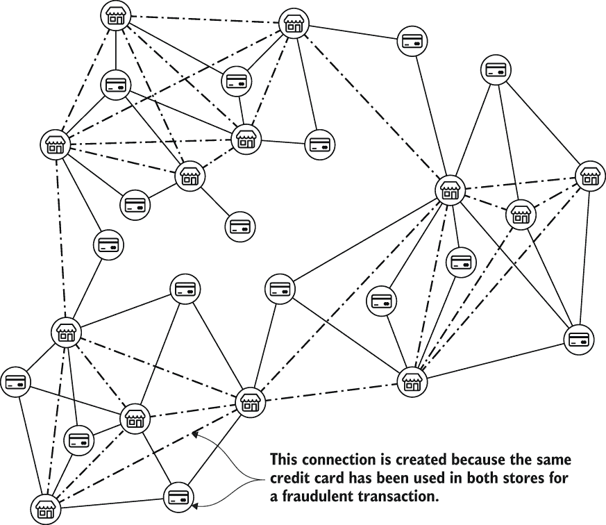

图 10.21 向二部图添加投影关系

很容易看出，一些可疑的商店社区通常被欺诈者使用（图 10.22）。发现这样的社区表明，一些商店比其他商店更容易成为欺诈的受害者，这是一个信号，表明这些商店可能自己参与了欺诈，或者可能需要加强他们的安全措施。

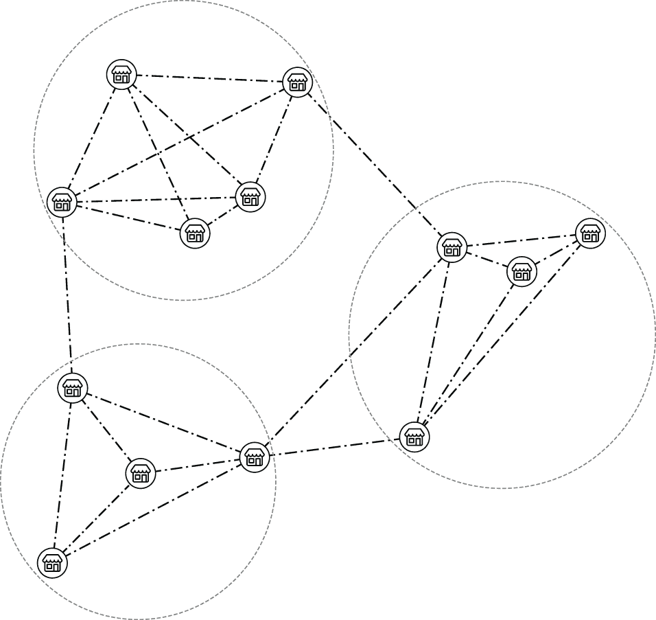

图 10.22 二部图投影中的聚类

在信用卡欺诈中，一个已知的模式是被盗的卡在许多商店进行小额交易。在这种情况下，社区挖掘可以立即揭示哪些商店经常与同一被盗信用卡相关——这是在单个商店层面实施欺诈检测实践所无法揭示的。在这些商店中的多个商店使用一张卡，或者在其中的某些商店多次使用，可以用作相关信号，表明该卡（详情）已被盗。在许多应用和环境中，通过社会网络分析发现这样的社区可以帮助检测欺诈结构或遏制欺诈团伙。

社区挖掘的一个常见技术是*图分区*，也称为*节点聚类*。目的是通过优化社区内和社区间边的比率，将图分割成预定的若干个集群。可以使用不同的算法来确定分割图的最佳方式。其中，我想提到两种相反的方法：

+   *自上而下*或*分裂*——这些方法也称为*分区*或*分割*，从一个所有节点都被视为一个单一集群的初始情况开始。这个集群通过迭代分割成小块，试图最小化集群间的连通性，直到达到一个稳定点，在这个点上无法获得显著的改进。

+   *自下而上*或*聚类*——这些方法以相反的方式进行操作：它们首先将每个节点视为一个独立的簇，然后递归地尝试将最相似或高度互联的节点合并到簇中。

对于我们的目的，我们将考虑第二种方法，这种方法也适用于检测密集（高度互联）的区域。具体来说，下一个示例中使用的算法是 Blondel 等人[2008]引入的 Louvain 方法。这种方法通常用于检测大型网络中的社区。根据 Neo4j 文档⁷

*它最大化每个社区的模块度得分，其中模块度量化了将节点分配给社区的质量。这意味着评估社区内节点之间的连接密度与它们在随机网络中连接密度的差异。Louvain 算法是一种层次聚类算法，它递归地将社区合并成一个节点，并在凝聚图上执行模块度聚类。*

为了完整性，通常使用的实现是 Lu 等人[2015]引入的并行版本，该版本引入了一些启发式方法来打破内部顺序屏障。

您不需要担心此算法的实现，除非您特别想自己实现它，因为 Neo4j 和其他库中都提供了此算法。以下查询将在我们的示例网络上执行 Louvain 社区检测。

列表 10.23 在 GitHub 图上执行 Louvain 社区检测

```
CALL gds.louvain.write({
    nodeProjection: 'GitHubUser',
    relationshipProjection: {
        FOLLOWS: {
            type: 'FOLLOWS',
            orientation: 'undirected',
            aggregation: 'NONE'
        }
    },
    writeProperty: 'community'
}) YIELD nodePropertiesWritten,  communityCount, modularity
RETURN nodePropertiesWritten,  communityCount, modularity
```

与前述案例一样，算法将在每个节点中存储一个新的属性，称为社区，其中包含节点所属社区的 ID。以下查询将给出 Louvain 如何将我们的网络分割成社区的想法。

列表 10.24 获取前 5 个 Louvain 社区

```
MATCH (g:GitHubUser)
RETURN g.community,
count(g) as communitySize,
sum(g.machine_learning) as mlDevCount
ORDER BY communitySize desc
LIMIT 5
```

结果将类似于图 10.23。

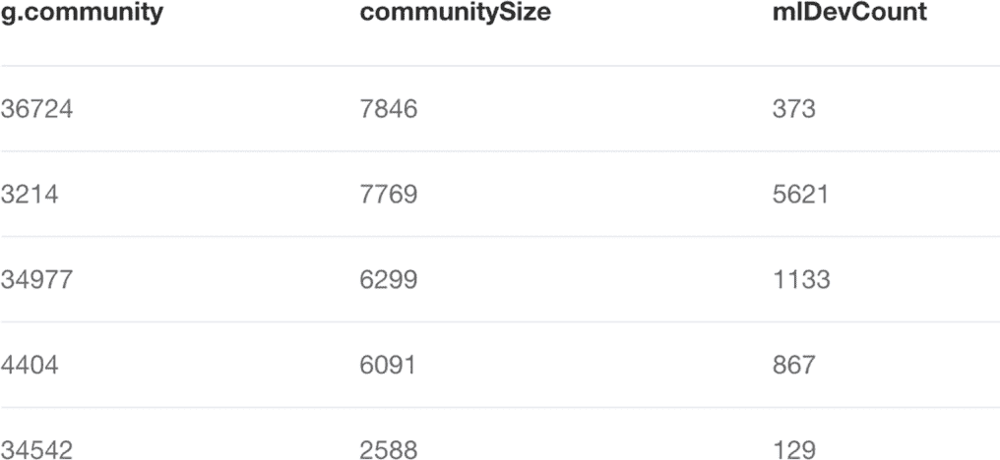

图 10.23 顶级五 Louvain 社区。（由于某些随机初始化，结果可能略有不同。）

看看前两个社区中机器学习开发者的数量。第一个群体显然是一个网络开发者社区（只有 373 名成员是机器学习开发者），第二个群体显然是一个机器学习开发者社区。算法似乎很好地识别了具有相似兴趣的人群组。

## 10.4 图的优势

在这种情况下，我们无法讨论使用图相对于其他方法的优势，因为图——特别是社交网络——是本章描述的方法的核心元素。但我们可以回顾使用社交网络（因此，使用图方法）进行欺诈检测和预防的优势：

+   社交网络为探索和调查欺诈提供了极好的知识来源。

+   图是表示社交网络的最佳方式。

+   使用不同的算法，社会网络分析（SNA）提供了一系列关于欺诈和欺诈者影响范围和影响力的见解。

+   图算法是提取图见解和进行社交网络深度分析的优秀工具集，使我们能够识别网络中的关键人物、人群或节点。

## 摘要

尽管关于这个主题还可以说很多，但本章完成了我们对使用图方法进行欺诈检测技术的概述。在这里，我们关注的是社交网络，特别是社会网络分析（SNA）在分析网络中欺诈者行为和影响中的作用。在本章中，你学习了

+   如何从不同类型的数据源创建社交网络

+   如何使用 SNA 方法探索网络中欺诈和欺诈者影响力的网络

+   如何将一组与网络结构相关的特征分配给每个节点

+   如何使用各种图算法从网络中提取见解（找到关键影响者，计算聚类系数，计数三角形等）

+   如何将节点分组到社区中

值得注意的是，在本章中，我们仅使用 Neo4j 和查询就完成了所有分析，使用可用的插件而没有编写任何代码。这一事实证明了图方法和现有库的强大功能和灵活性。

## 参考文献

[Baesens et al., 2015] Baesens, Bart, Veronique Van Vlasselaer, 和 Wouter Verbeke. *使用描述性、预测性和社会网络技术进行欺诈分析：欺诈检测的数据科学指南*. 新泽西州霍布肯：Wiley 和 SAS 商业系列，2015 年。

[Barabási and Pósfai, 2016] Barabási, Albert-László, 和 Mártin Pósfai. *网络科学*. 剑桥，英国：剑桥大学出版社，2016 年。

[Barta and Stewart, 2008] Barta, Dan, 和 David Stewart. 2008. “欺诈检测与预防的分层方法：使用网络分析提高调查员效率.” SAS 结论论文。

[Blondel et al., 2008] Blondel, Vincent D., Jean-Loup Guillaume, Renaud Lambiotte, 和 Etienne Lefebvre. “大型网络中社区的快速展开.” *统计力学：理论与实验杂志* (2008): P10008.

[Boccaletti et al., 2006] Boccaletti, Stefano, Vito Latora, Yamir Moreno, Mario Chavez, 和 Dong-Uk Hwang. “复杂网络：结构与动力学.” *物理报告* 424:4-5 (2006): 175-308.

[Easley and Kleinberg, 2010] Easley, David, 和 Jon Kleinberg. *网络、群体与市场：高度连接世界的推理*. 纽约：剑桥大学出版社，2010 年。

[Fouss et al., 2016] Fouss, François, Marco Saerens, 和 Masashi Shimbo. 2016. *网络数据与链接分析算法和模型*. 纽约，剑桥大学出版社，2016 年。

[库特拉等，2011] 库特拉，丹尼，泰-尤·凯，U. 康，杜恩·霍恩格（波洛）赵，辛格-库欧·肯尼思·赵，和克里斯托斯·法洛特索斯。 “统一关联归咎方法：定理和快速算法。” *欧洲机器学习与知识发现数据库会议论文集* (2011): 245-260.

[利坦，2012] 利坦，阿维瓦。 “企业欺诈和滥用管理市场中的谁是谁，什么是何。” Gartner 资源 ID G00230076 (2012)。

[卢等，2015] 卢，浩，马哈特什·哈拉帕纳瓦，和安南特·卡利扬拉曼。 “可扩展社区检测的并行启发式方法。” *并行计算* 47: 19-37.

[尼德汉姆和霍德勒，2019] 尼德汉姆，马克，和艾米·E·霍德勒。 *图算法：Apache Spark 和 Neo4j 中的实用示例*。 塞巴斯蒂波利斯，CA：奥雷利媒体，2019。

[纽曼，2010] 纽曼，马克。 *网络：导论*。 纽约：牛津大学出版社，2010。

[佩奇等，1998] 佩奇，拉里，谢尔盖·布林，拉杰夫·莫特瓦尼，和特里·温格拉德。 “PageRank 引文排名：为网络带来秩序。” *斯坦福信息实验室技术报告*。

[拉波波特，1953] 拉波波特，阿纳托尔。 “通过具有社会结构偏差的群体的信息传播 I：传递性的假设。” *数学生物物理学通报* 15:4 (1953): 523-533.

[罗兹门奇克等，2019] 罗兹门奇克，本德克，卡尔·艾伦，和里克·萨卡尔。 “多尺度属性节点嵌入。” arXiv 预印本 arXiv:1909.13021 (2019).

* * *

(1.)[`www.gartner.com/en/documents/1912615`](https://www.gartner.com/en/documents/1912615).

(2.)[`github.com/neo4j/graph-data-science`](https://github.com/neo4j/graph-data-science).

(3.)[`snap.stanford.edu/data/github-social.html`](https://snap.stanford.edu/data/github-social.html).

(4.)如果你使用 Neo4j 桌面版或社区版，你需要在 USING（此处和下一个查询）之前加上：auto，因为 Neo4j 桌面版使用显式事务处理器，这会导致与“周期性提交”语句冲突。使用：auto，你可以强制 Neo4J 桌面版使用自动提交选项而不是显式事务处理器。下一个查询也适用。

(5.)*自我网络*是由一个节点（一个人，自我）和所有与之直接相连的其他节点（人）组成的社会网络。

(6.)回顾第五章，我们可以推断出二分图中相同类型节点之间的联系，从而创建一个投影。

(7.)[`mng.bz/XYy6`](https://shortener.manning.com/XYy6).
