# 11 基于图的自然语言处理

本章涵盖

+   一种将文本分解并存储在图中的简单方法

+   如何通过自然语言处理提取非结构化数据的隐藏结构

+   一种用于驯服文本的高级图模型

让我们从考虑最常见的一些应用开始，这些应用处理自然语言（以不同格式）为最终用户提供服务。你可能每天都在使用它们，可能甚至没有意识到它们的复杂性和实用性。

第四章处理文本以实现一个推荐引擎，该引擎使用与项目相关的信息，例如产品的描述或电影情节。在这种情况下，这些数据被用来比较项目或用户配置文件，找出用户或项目之间的共同点（特别是相似性），并利用这些共同点向当前用户推荐可能感兴趣的内容。图 11.1 展示了第四章中摘取的内容推荐引擎的高级结构。


图 11.1 如第四章所述的内容推荐引擎

项目分析器和用户配置文件构建器处理文本，以便在推荐阶段使其可用。他们的分析结果以易于在模型生成和推荐过程中访问和查询的方式存储。

近年来，搜索引擎可能一直是处理文本的最关键类型的应用，在用户寻找某物时提供相关结果。想想谷歌和雅虎！如果没有像这两个搜索引擎这样的工具，互联网可能就不会是现在这样；将没有一种有效的方法来发现新内容或访问互联网提供的巨大资源宝库，结果可能是它永远无法发展到现在的规模。搜索是我们用来与各种内容来源（新闻网站、零售网站、数据库等）互动的最常见技术。它帮助我们以直观和有效的方式获取相关数据。图 11.2 展示了搜索引擎的一个简化架构[Turnbull 和 Berryman，2016]。

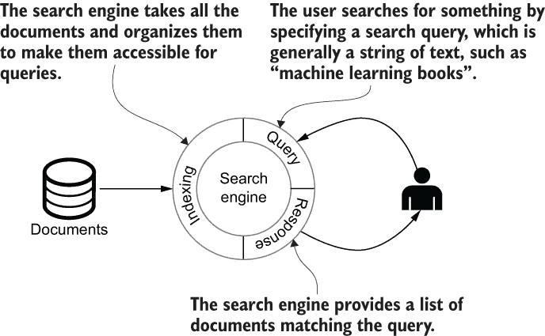

图 11.2 搜索引擎的一个过于简化的架构

搜索引擎与文档存储库相连。它以这种方式索引存储库中的文档，即用户的查询将快速执行，结果将准确无误。

当一个应用收到一个自然语言问题并提供回复或以某种方式与用户互动时，会出现一个更复杂的场景。我们大多数人都有使用数字语音助手的经验。你以“Siri . . . ，”“Okay Google . . . ，”或“Alexa . . . ，”开始一句话，并要求助手执行一些简单任务，比如“找到最近的餐厅”，“播放一首浪漫的歌曲”，或“告诉我天气预报”。由于对这项新技术感到兴奋，你可能已经尝试得更多，要求它执行更复杂的任务，并尝试不同格式的不同问题。很可能会因为代理无法处理超出预定义技能集的查询而感到沮丧。

这些应用正在尽力而为，但他们试图实现的目标是困难和复杂的。如图 11.3 所示，回答甚至一个简单的问题也需要完成一系列的任务。

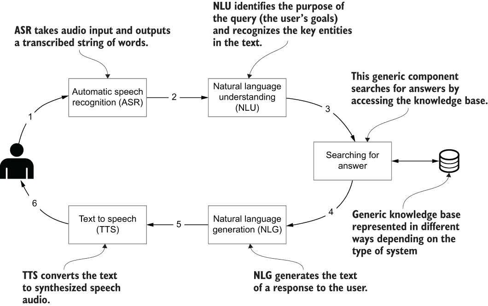

图 11.3 对话式代理执行的任务集示例

这些任务在表 11.1 中有详细描述。

表 11.1 对话式代理执行的任务

| 任务/组件 | 描述 |
| --- | --- |
| 自动语音识别 (ASR) | ASR 从用户那里接收音频（语音）输入，并输出代表查询的转录单词字符串。 |
| 自然语言理解 (NLU) | NLU 组件的目标是从用户的表述中提取三件事。第一项任务是领域分类。用户（例如）是在谈论预订航班、设置闹钟还是处理日历？这种 1-of-*n* 分类任务对于只关注，比如说，日历管理的单领域系统是不必要的，但多领域对话系统是现代标准。第二项任务是用户意图识别。用户试图完成什么一般任务或目标？任务可能是查找电影、显示航班或删除日历预约。最后，实体提取涉及从用户的表述中提取用户意图系统应理解的具体概念。这些实体用于具体化意图：他们想在哪里预订航班？他们在日历中寻找哪个事件？ |
| 搜索答案 | 这一步是整个过程的精髓。系统在接收到领域、意图和实体后，访问某些知识库并确定可能的答案集。然后它必须对答案进行排序并将它们作为输入提供给后续步骤。在某些情况下，这个过程意味着在文档中查找段落；在另一些情况下，意味着检索将用于生成适当答案的信息。在此背景下，知识库可以由来自多个数据源的结构化和非结构化数据创建。在对话代理中，此组件还会考虑用户先前的问题，以缩小当前问题的上下文。 |
| 自然语言生成 (NLG) | （可选）接下来，NLG 组件生成对用户的响应文本。在信息状态架构中，NLG 的任务通常分为两个阶段：内容规划（说什么）和句子实现（如何说）。此组件是可选的。在大多数情况下，句子直接从知识库中的现有文档中提取。 |
| 文本转语音 (TTS) | TTS 将答案转换为用户可以听到的音频，而不是阅读。 |

由于此场景的复杂性，它代表了机器学习中最激动人心和最活跃的研究领域之一。在未来，我们只需使用我们的声音就能与周围的所有设备进行交互，但到目前为止，这种交互仍然是一个梦想。

尽管推荐代理、搜索引擎和对话代理似乎不同，但它们有共同的关键方面。基本要求可以总结如下：

+   使用文本构建知识库。

+   +   推荐引擎使用项目描述来创建推荐模型（例如，识别项目之间的相似性）。

    +   搜索引擎通过索引对文档进行预处理。

    +   聊天机器人和对话代理使用非结构化数据（文档和先前问题）来创建知识库。

+   适当的知识表示存储了应用范围内所需的所有信息，并提供对其的高效访问。

+   与用户的交互，这在大多数情况下是通过自然语言进行的。

以下章节和第十二章处理这些关键元素，提出不同的基于图的方法来完成这些任务或解决一些相关问题。

## 11.1 基本方法：存储和访问单词序列

如常，让我们从一个基本的图模型开始，以说明基于图的自然语言处理的高级概念和主要问题。在本章的后续部分，从第 11.2 节开始，我们将讨论更高级的技术和模型。

值得注意的是，每个图模型都应该根据应用的目的来设计。尽管这些模型很简单，但在这个案例中设计的模型非常适合本节所述场景的范围。这些模型将适当地发挥作用，而不会过于复杂，展示了图建模的一个关键方面：从简单开始，并在必要时通过引入新的概念和复杂性来适应。话虽如此，现在是时候开始我们的旅程了。

假设你想实现一个支持消息编写、在输入时建议下一个单词的工具。此外，假设你希望这个工具能够从你或特定的文档集中学习。这样的工具不仅可以帮助提供消息编写辅助，还可以支持拼写检查、提取常用短语、总结等功能。

第一步是将输入拆分为单词。在西方语言中，最简单的方法是使用空格。（其他语言，如中文，需要不同的方法。）当它们被提取出来时，这些单词必须以某种方式存储，以跟踪它们在原始文本中的顺序。这里概述的基本方法受到了 Michael Hunger 的一篇博客文章¹的启发。一个合适的图模型将类似于图 11.4（使用示例短语“你将不能”）。

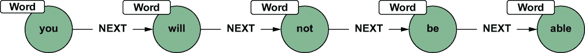

图 11.4 应用到短语“你将不能”的基本方案

在这个方案中，单词本身被认为是唯一的，但单词之间的关系则不是，因此如果某些单词在其他句子中也被使用，它们不会被复制；相反，会创建新的关系。如果我们也处理短语“你将能够”，生成的图将类似于图 11.5。

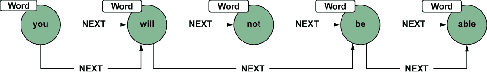

图 11.5 我们对短语“你将能够”应用的方案

由于新的输入创建了新的关系，但没有创建新的单词，因为我们已经存储了所有这些单词。这种模型和我们在每个句子中保持单词唯一并创建新关系的方法既有优点也有缺点，我们将对其进行探讨和分析。在某些情况下，这个模型可能很有用，但在其他情况下则不然。这个例子将说明，在你的项目发展中，你可以改变对解决方案某些方面的看法。你的需求可能会变化，需要你开发一个更适合它们的新的方案。图对于这个目的很有帮助，因为它们是灵活的数据结构，可以根据你项目的变化约束和要求进行演变。以下 Cypher 查询显示了如何处理文本并获得预期的图数据库。

列表 11.1 使用空格拆分句子并存储它

```
WITH split("You will not be able to send new mail until you upgrade your 
➥ email."," ") as words
UNWIND range(0, size(words)-2) as idx
MERGE (w1:Word {value:words[idx]})
MERGE (w2:Word {value:words[idx+1]})
CREATE (w1)-[:NEXT]->(w2);
```

在这个查询中，开头的 WITH 子句为下一个查询语句提供了数据。注意，split() 函数根据空白字符定义了分词过程，这被指定为第二个参数中的分隔符。range() 函数创建一个数字范围，在这种情况下是从 0 到句子的大小——通过在文本上使用 size() 函数获得——减去 2。UNWIND 子句将范围集合转换为具有索引值的结果行，以获取正确的单词。MERGE 子句，如通常一样，帮助我们避免创建相同的节点（在这种情况下是相同的单词）两次。最后，我们使用 CREATE 来存储两个连续单词之间的关系。作为旁注，为了使 MERGE 高效工作，你希望在图中创建一个约束，如下面的查询所示。

列表 11.2 为单词的值创建唯一约束

```
CREATE CONSTRAINT ON (w:Word) ASSERT w.value IS UNIQUE;
```

如果你想要探索这个第一个图，下一个查询将显示路径。

列表 11.3 返回图的路径

```
MATCH p=()-[r:NEXT]->() RETURN p
```

结果将看起来像图 11.6。

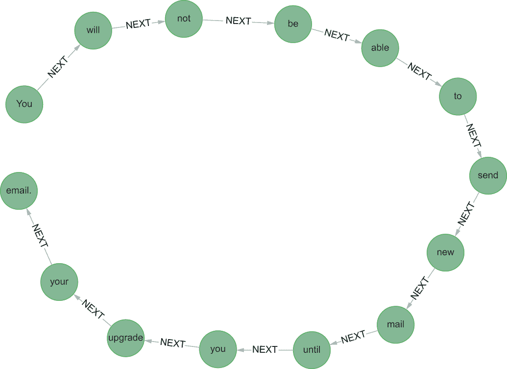

图 11.6 处理句子“在你升级电子邮件之前，你将无法发送新邮件”后的结果图

到目前为止，一切顺利——这个结果正是我们预期的。但是，模型可以改进。如前所述，同一个单词可以在不同的句子中后面跟多个其他单词。通过遵循所描述的模型，列表 11.1 由于最后的 CREATE 子句，在相同的两个单词之间产生了多个关系。如果我们摄入一个新句子，如“他说比尔·克林顿和希拉里·克林顿送他们的孩子去私立学校是可以的”，生成的图将看起来像图 11.7。

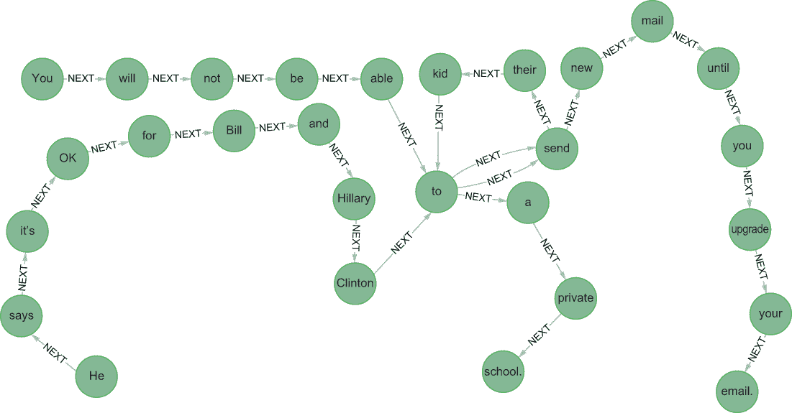

图 11.7 也处理“他说比尔·克林顿和希拉里·克林顿送他们的孩子去私立学校是可以的”后的结果图

注意，我们在 *to* 和 *send* 之间有多个关系。这个结果是正确的，并且在某些情况下肯定是有用的，但在这个案例中，我们想要优先考虑最有可能与当前单词相邻的单词。这个架构要求我们计算当前单词出现在每个单词组合中的关系数量。

我们可以通过在两个单词之间的关系上添加权重并使其在连接相同的两个单词时唯一来修改我们的图模型。结果架构如图 11.8 所示。

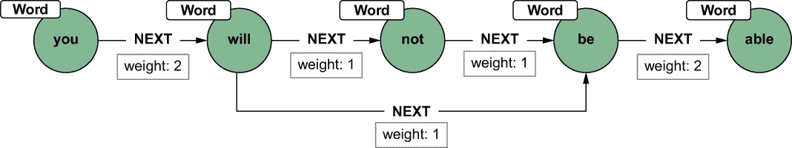

图 11.8 在关系上具有权重属性的新架构模型

新架构通过在连接单词的关系上添加权重属性来消除了多个关系的需要。这种架构的变化需要在查询中做小的修改。

列表 11.4 存储词对频率

```
WITH split("You will not be able to send new mail until you upgrade your 
➥ email."," ") as words
UNWIND range(0,size(words)-2) as idx
MERGE (w1:Word {value:words[idx]})
MERGE (w2:Word {value:words[idx+1]})
MERGE (w1)-[r:NEXT]->(w2)
  ON CREATE SET r.weight = 1
  ON MATCH SET r.weight = r.weight + 1;
```

注意，最后的 CREATE 已经被 MERGE 替换，它要么在创建时（ON CREATE）创建，要么在匹配时（ON MATCH）更新 NEXT 关系上的权重属性。

练习

尝试使用之前的句子运行新的查询，并检查生成的图。请记住先清理您的数据库。² 检查 *to* 和 *send* 之间关系的权重。

拥有一个合适的模型在手，我们现在可以接近我们的原始问题。因为我们现在很难用我们个人的信息来训练一个模型，所以让我们使用包含一些文本的通用数据集。我们将使用手动注释子语料库（MASC）数据集，³ 这是一个从开放美国国家语料库（OANC）中抽取的包含 50 万个单词的书面文本和转录语音的平衡子集。表 11.2 显示了数据集中的一些文档示例。由于空间原因，我只复制了关键列。

表 11.2 MASC 数据集的样本项目

| 文件名 | 内容 |
| --- | --- |
| [MASC]/data/written/110CYL200.txt | 这需要一些时间和努力，但在 Goodwill 的帮助下，Jerry 能够与检察官办公室协商出一个付款计划，找到住处，并进行更彻底的求职。 |
| [MASC]/data/written/111348.txt | 我得到了上面的那份文件作为我的份额，为了隐藏这种钱，这对我来说成了问题，所以在我这里与联合国合作的英国联系人（他的办公室享有某些豁免权）的帮助下，我能够将包裹安全地送到一个完全远离麻烦的地方。 |
| [MASC]/data/written/111364.txt | 我非常清楚这封信可能会让你感到惊讶，我是 Dagmar，一个决定将我所拥有的一切捐给教堂、清真寺或你所在社区的任何慈善组织的垂死之人，通过你的帮助，因为在这里我的社区里我无法做到这一点，原因我稍后会向你解释。 |
| [MASC]/data/written/111371.txt | 想象一下，从你自己的家庭工作室中向北美和其他地区的数百万人们提供你的机会和产品的感觉。 |

我们将只使用文件 masc_sentences.tsv 中可用的制表符分隔的句子数据集。对于以下查询，请将此文件复制到您的 Neo4j 安装中的导入目录。为了导入文件中的所有句子并将它们分解，您需要运行以下查询（请记住先清理您的数据库）。

列表 11.5 导入 MASC 数据集并处理其内容

```
:auto USING PERIODIC COMMIT 500
LOAD CSV FROM "file:///masc_sentences.tsv" AS line
FIELDTERMINATOR '\t'
WITH line[6] as sentence
WITH split(sentence, " ") as words
FOREACH ( idx IN range(0,size(words)-2) |  
MERGE (w1:Word {value:words[idx]})
MERGE (w2:Word {value:words[idx+1]})
MERGE (w1)-[r:NEXT]->(w2)
  ON CREATE SET r.weight = 1
  ON MATCH SET r.weight = r.weight + 1)
```

高级技巧 为了遍历句子中的单词，这个查询将 UNWIND 替换为 FOREACH（使用相同的索引范围）。UNWIND 子句将范围集合转换为结果行，在这种情况下返回大量数据。相反，FOREACH 执行 MERGE 操作而不返回任何内容。这个子句简化了执行并显著提高了性能。

让我们快速查看数据库。我们可以通过以下查询搜索最常见的 10 个单词组合。

列表 11.6 查找最常见的 10 个词对

```
MATCH (w1:Word)-[r:NEXT]->(w2)
RETURN w1.value as first, w2.value as second, r.weight as frequency
ORDER by r.weight DESC
LIMIT 10
```

结果如图 11.9 所示。

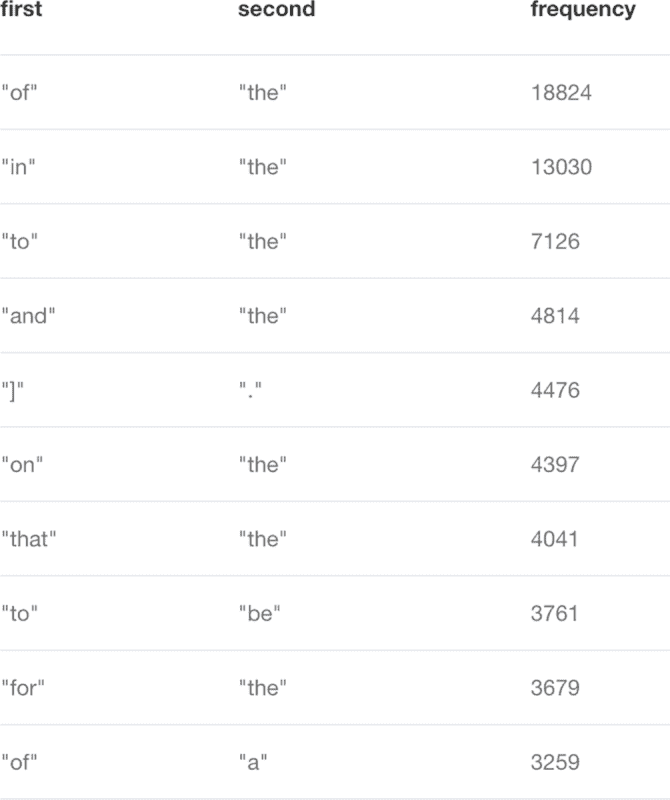

图 11.9 MASC 数据集中最常见的 10 个单词对

现在我们已经拥有了满足我们最初要求的所有组件：实现一个支持消息编写并建议下一个单词的工具。想法是取当前单词并查询我们的新图，以找到三个最可能的后继单词，使用关系上的权重。

列表 11.7 建议最可能单词的查询

```
MATCH (w:Word {value: "how"})-[e:NEXT]->(w2:Word)
RETURN w2.value as next, e.weight as frequency
ORDER BY frequency desc
LIMIT 3
```

这个查询将给我们展示在图 11.10 中的结果。

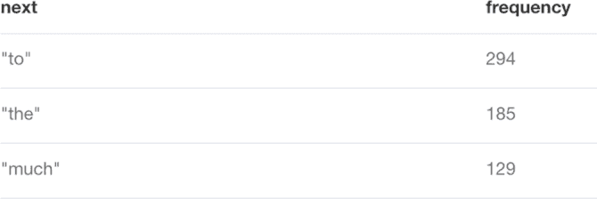

图 11.10 接下来最可能跟随“how”的单词

显然，对于以*how*作为最后一个单词的用户，建议的前三个最佳单词是*to*、*the*和*much*。不错！

练习

在数据库中尝试其他单词的结果。它们对您有意义吗？

如您从目前获得的结果中看到，结果相当不错，但我们还可以做得更好。我们不仅考虑最后一个单词，还可以考虑前两个甚至三个单词。这种方法将给我们提供提高建议质量的机会，但我们需要稍微改变数据库的结构。

再次强调，改变主意并随着解决方案的开发而细化数据库模型并没有什么不好。这种情况很常见：你心中有一个想法；相应地设计你的模型；然后意识到通过小小的改变，你可以得到更好或更快的成果，所以你改变模型并测试。你应该始终遵循这个过程；你不应该认为你的模型是最终的。在这方面，图提供了你需要的一切灵活性。在某些情况下，你甚至可以在不重新摄入所有内容的情况下调整你的模型。

让我们通过考虑用户写的最后两个（或三个）单词而不是一个单词来尝试这种模型细化。通过考虑两个（或三个）前一个单词来提高推荐质量的想法可以形式化为以下内容：

1.  取用户最后写的两个（或三个）单词。

1.  在数据库中搜索所有包含这些单词以相同顺序出现的句子。

1.  找出下一个可能出现的单词。

1.  将单词分组并计算每个单词的频率。

1.  按频率（降序）排序。

1.  推荐前三名。

这个过程在图 11.11 中得到了说明。

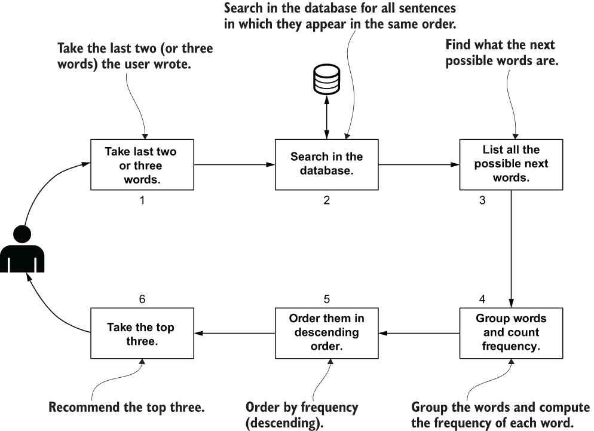

图 11.11 提高下一个单词推荐质量的模式

新模型应该允许我们重建句子，以便我们可以确定在哪些句子中单词以我们想要的特定顺序出现。当前模型无法做到这一点，因为它合并了句子，只更新了权重。原始信息丢失了。

到目前为止，我们有一些选择。一个选择是移除 Word 上的唯一约束，并在每次出现时复制所有单词（以及关系），但这种解决方案需要大量的磁盘空间，而不会增加任何具体的价值。我们可以通过使用图 11.12 中的模型做得更好。

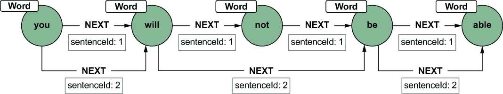

图 11.12 我们模式的第三个版本

此模型保持了单词的唯一性，但通过在关系上添加一个 ID 来创建每个句子特有的关系。这样，通过通过 sentenceId 过滤关系，就有可能重建原始句子。这种方法比复制单词使用的磁盘空间更少，并且获得的结果将完全相同。因此，让我们清理我们的数据库，并使用新的模型重新加载。清理数据库的查询如下。

列表 11.8 使用 APOC 的 iterate 程序清理数据库

```
CALL apoc.periodic.iterate(
"MATCH (p:Word) RETURN p",
"DETACH DELETE p", {batchSize:1000, parallel:true})
```

在这种情况下，最好使用 apoc.periodic.iterate，因为数据库相当大；在单个事务中删除它可能需要一段时间，并且事务可能会失败。APOC 插件中的 iterate() 函数允许您将大提交拆分成更小的提交，并且操作可以并行执行，这将更快。当图数据库为空时，我们可以重新导入并处理文本。

列表 11.9 使用句子标识符的新导入查询

```
:auto USING PERIODIC COMMIT 100
LOAD CSV FROM "file:///masc_sentences.tsv" AS line
FIELDTERMINATOR '\t'
WITH line[6] as sentence, line[2] as sentenceId
WITH split(sentence," ") as words, sentenceId
FOREACH ( idx IN range(0,size(words)-2) |  
MERGE (w1:Word {value:words[idx]})
MERGE (w2:Word {value:words[idx+1]})
CREATE (w1)-[r:NEXT {sentence: sentenceId}]->(w2))
```

如您所见，用于创建单词之间关系的 MERGE 已被第一个示例中的 CREATE 替换。但在这个情况下，一个新的属性，即句子，包含了一个句子标识符。如果您现在查看图，您会看到几乎每个节点都有很多关系进出。另一方面，现在您可以使用以下查询来根据当前和前面的单词建议下一个单词。

列表 11.10 考虑最后两个单词来建议下一个单词的查询

```
MATCH (w2:Word {value: "know"})-[r:NEXT]->(w3:Word {value: "how"})-[e:NEXT]->
➥ (w4:Word)
WHERE r.sentence = e.sentence
RETURN w4.value as next, count(DISTINCT r) as frequency
ORDER BY frequency desc
LIMIT 3
```

要根据最后三个单词建议一个单词，您可以使用以下查询。

列表 11.11 考虑最后三个单词来建议下一个单词的查询

```
MATCH (w1:Word {value: "you"})-[a:NEXT]->(w2:Word {value: "know"})-[r:NEXT]->
➥ (w3:Word {value: "how"})-[e:NEXT]->(w4:Word)
WHERE a.sentence = r.sentence AND r.sentence = e.sentence
RETURN w4.value as next, count(DISTINCT r) as frequency
ORDER BY frequency desc
LIMIT 3
```

如预期的那样，建议的质量要高得多，但代价是数据库更大、更复杂。最后两个查询在数据库中搜索特定的模式。在这种情况下，Cypher 语言帮助您在较高层次上定义您正在寻找的图模式；引擎将返回所有匹配该模式的节点和关系。

值得注意的是，我们最后定义的最后一个模式有一个微小的缺点。单词节点是唯一的，所以如果你有数百万个句子，这个模式将创建超级节点——即有数百万个关系进入、出去或两者都有的节点。在大多数情况下，这些密集节点代表了所谓的*停用词*：在大多数文本中频繁出现的词语，如冠词（a，*the*）、代词（*he*，*she*）和助动词（*do*，*does*，*will*，*should*）。如前所述，这样的密集节点在查询执行期间可能会成为一个问题，因为遍历它们所需的时间很高。对于本场景和本节中提出的解决方案，这种情况不会是一个大问题，但在第 11.2 节中，我们将探讨如何正确识别和处理这些词语。

### 11.1.1 图方法的优势

第一个场景展示了如何将文本表示为图的形式。句子被分割成简单的标记，这些标记由节点表示，而单词的顺序则由关系来维持。

尽管其简单性，最终设计的图模型完美地实现了我们心中的目的。你也看到了如何使你的模型适应新的需求或满足新的约束。

最后几个查询展示了如何在图中搜索特定的模式——这是通过像 Cypher 这样的适当图查询语言提供的图的一个极其强大的功能。使用其他方法，例如关系数据库，表达相同的概念将会复杂得多。简单性、灵活性（适应变化的能力）和强大：这些图特性在这个简单场景中表现得非常明显。

## 11.2 自然语言处理和图

在第 11.1 节中讨论的基本方法有很多局限性，其中一些我们在讨论过程中已经提到了。它很好地服务于建议下一个词基于用户先前输入的预期目的，但它不适合需要详细分析和理解文本的高级场景，例如本章引言中提到的对话代理、聊天机器人和高级推荐引擎。前例中未考虑的一些方面包括

+   词语没有被归一化到其基本形式（例如去除复数或考虑动词的变位的基本形式）。

+   我们没有考虑词语之间的依赖关系（例如形容词和名词之间的联系）。

+   一些词语放在一起更有意义，因为它们代表了一个单一实体。（例如，*Alessandro Negro* 是一个人，应该被视为一个单独的标记。）

+   停用词没有被正确识别和（最终）移除以防止密集节点。给出了一些例子，但基于语言和领域，有可用的列表。

+   仅使用空白字符进行分割通常是不够的。（例如，考虑像 *can’t* 这样的词以及可能附加在句子最后一个词上的所有类型的标点符号。）

本节描述了需要高级 NLP 任务的高级场景。它探讨了分解和正确分析文本数据的各种技术和工具，以及存储此类分析结果的图模型。这一阶段代表了在之上可以完成更高级任务的基本步骤。

文本通常被认为是无结构数据，但自由文本有很多结构。困难在于，大部分这种结构都不是显式的，这使得在文本中搜索或分析信息变得困难 [Grishman, 2015]。NLP 使用来自计算机科学、人工智能和语言学的概念来分析自然语言，目的是从文本中提取有意义的和有用的信息。

*信息提取（IE**）* 是理解文本和构建复杂、引人入胜的机器学习应用过程中的第一步。它可以描述为分析文本、分解它，并识别其中语义定义的实体和关系的过程，目的是使文本的语义结构明确。这种分析的结果可以记录在数据库中以便查询和推理，或者用于进一步分析。

IE 是一个多步骤的过程，涉及几个分析组件的组合，以从文本中提取最有价值的信息，使其可用于进一步处理。以下是一些主要任务，其中一些我们将在本节剩余部分详细讨论：

+   分词、词性标注（PoS）、词干提取/词形还原和停用词去除

+   命名实体识别（NER）

+   实体关系提取（ERE）

+   语法分析

+   共指消解

+   语义分析

这个列表并不是详尽的——其他任务也可以被认为是核心信息提取过程的一部分——但这些项目是最常见的，而且就信息量、结构和知识而言，我认为它们是最有价值且最有用的。每个 IE 任务的结果都必须被适当组织和存储，以便它们对其他过程和分析有用，或者可以查询。用于存储这些结果的模型至关重要，因为它会影响后续操作的性能。

在本节中，我们将探讨图如何为驯服文本提供一个完美的数据模型，因为它们允许我们组织文本中的结构和信息，以便它们可以立即用于查询、分析或提取其他过程所需的特征集。对于每个任务，都提出了一个图模型来正确存储结果。所提出的模型将从第一个任务持续增长到最后一个任务，并且生成的图将包含从文本中提炼出的所有可能的知识，并以统一的数据结构呈现。

为了简化描述并使其更具体，我将通过描述一个需要该技术的真实场景来描述这些任务中的几个。这个过程将是逐步的：在每一个阶段，新的信息将被添加到图中，到最后，我们将拥有处理过的完整语料库，结构化、可访问，并准备好进行下一步。让我们开始我们的旅程！

假设你想要将文本分解为其主要元素（最终将它们归一化到基本形式），获取文本中每个实体的角色，删除无用的单词，并以便于导航和查询搜索目的或进一步分析的方式存储结果。

这种场景相当常见，因为几乎所有信息提取（IE）过程的第一个步骤都是将内容分解成小的、可用的文本块，这些文本块被称为*标记*。这个过程被称为*分词*。通常，标记代表单个单词，但正如你很快就会看到的，构成一个小而可用的块可以针对特定应用。如第 11.1 节所述，对英语文本进行分词的最简单方法是基于空白（如空格和换行符）的出现来分割字符串，正如我们的简单分词器所做的那样。使用这种方法对以下句子进行处理

*我简直不敢相信自己的眼睛，当我看到我最喜欢的球队赢得 2019-2020 赛季的奖杯时。*

得到以下列表：

[“我”， “couldn’t”， “believe”， “my”， “eyes”， “when”， “I”， “saw”， “my”， “favorite”， “team”， “winning”， “the”， “2019-2020”， “cup.”]

这种方法正是我们之前使用的方法，但显然，这还不够。为了获得更好的分词效果，我们需要处理诸如标点符号、缩写、电子邮件地址、URL 和数字等问题。如果我们应用一个更复杂的分词方法，该方法使用诸如字母、数字和空白等标记类，输出应该类似于以下这样：

[“我”， “couldn”， “’”， “t”， “believe”， “my”， “eyes”， “when”， “I”， “saw”， “my”， “favorite”， “team”， “winning”， “the”， “2019”， “-”， “2020”， “cup”， “.”]

太好了！

在这个例子中，我们考虑了一个单独的句子，但在许多情况下，首先将文档分解成句子是相关的。在英语中，我们可以通过考虑诸如句号和问号之类的标点符号来完成这项任务。分词和句子分割受到几个因素的影响，其中两个最关键的因素是

+   *语言*—不同的语言有不同的规则。这些规则可以显著影响你执行甚至像分词这样简单的任务的方式。例如，中文中没有短语之间的空格，所以像英语中那样基于空格分割可能不起作用。

+   *领域*—某些领域有特定的元素，这些元素具有特定的结构。例如，在化学领域，考虑像 *3-(furan-2-yl)-[1,2,4]triazolo[3,4-b][1,3,4]thiadiazole* 这样的分子名称，以及在家庭装修零售领域的大小，如 *60 in. X 32 in.*。

即使使用更复杂的方法，单独的分词在大多数情况下也不够。当你有了标记列表时，你可以应用多种技术来获得更好的表示。最常见的技巧 [Farris 等人，2013] 是

+   *大小写更改*—这项任务涉及将标记的大小写更改为通用大小写，以便标记是一致的。然而，这个过程通常比将所有内容转换为小写要复杂得多：一些标记应该首字母大写，因为它们出现在句子的开头，而其他标记应该大写，因为它们是专有名词（如人名或地点名）。适当的案例更改会考虑这些因素。请注意，这项任务是特定于语言的；例如，在阿拉伯语中，没有小写或大写。

+   *停用词去除*—这项任务会过滤掉诸如 *the*、*and* 和 *a* 这样的常见词汇。这类经常出现的词汇通常对不依赖句子结构的应用程序价值不大（注意，我说的是 *little* 价值，而不是 *no* 价值）。这个停用词列表也是特定于应用程序的。如果你在处理像这样一本书，你可能想过滤掉那些对内容价值最小但出现频率较高的其他词汇，例如 *chapter*、*section* 和 *figure*。

+   *扩展*—一些标记可以通过添加同义词或扩展标记流中的缩写和缩写词来进一步扩展或澄清。这项任务可以使应用程序能够处理来自用户的替代输入。

+   *词性标注*—这项任务的目的在于识别一个词的词性——比如它是名词、动词还是形容词等。这项任务非常有价值，因为它在后续处理过程中被用来提高结果的质量。词性标注可以帮助确定文档中的重要关键词，例如（我们将在本节后面看到），或者支持正确的首字母大写（例如，*Will* 作为专有名词与 *will* 作为情态动词的区别）。

+   *词形还原* 和 *词干提取*——假设你想要在一组文档中搜索动词 *take*。简单的字符串匹配将不起作用，因为正如你所知，这样的动词可以以多种形式出现，如 *take*、*took*、*taken*、*taking* 和 *takes*。这些形式被称为 *表面形式*。动词是相同的，但它根据它在文本中扮演的角色和其他句法规则以不同的方式进行屈折。词形还原和词干提取是允许我们将单词还原到其根或基本形式的任务，例如通过将 *take* 的所有表面形式转换为它们的根形式。词形还原和词干提取之间的区别在于产生单词根形式的方法以及产生的单词。一般来说，词干提取使用语法规则，而词形还原使用基于字典的方法。因此，词干提取更快但准确性较低；词形还原较慢但更精确。

关于进一步阅读，我推荐本章末尾参考文献部分提到的这些主题的优秀实用书籍 [Lane 等人，2019；Farris 等人，2013]。这些书籍广泛涵盖了此处概述的步骤，并提供了具体的示例。

图 11.13 展示了前面列表中描述的一些任务应用于简单句子的情况。

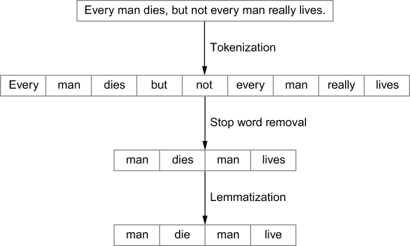

图 11.13 对示例句子应用分词、停用词去除和词形还原

许多任务似乎都涉及信息提取，但现实是（除非你想实施大量自定义），各种编程语言的许多软件和库可以为你执行所有这些任务。以下示例演示了用于此类目的最常用的库之一：spaCy⁵ Python 库。

列表 11.12 使用 spaCy 进行基本文本处理

```
import spacy

class BasicNLP(object):

    def __init__(self, language):
        spacy.prefer_gpu()                                            ❶

    def tokenize(self, text):
        nlp = spacy.load("en_core_web_sm")                            ❷
        doc = nlp(text)                                               ❸
        i = 1
        for sentence in doc.sents:                                    ❹
            print("-------- Sentence ", i,  "-----------")
            i += 1
            for token in sentence:                                    ❺
                print(token.idx, "-", token.text, "-", token.lemma_)  ❻

if __name__ == '__main__':
    basic_nlp = BasicNLP(language="en")
    basic_nlp.tokenize("Marie Curie received the Nobel Prize in Physics in 
    ➥ 1903\. She became the first woman to win the prize.")
```

❶ 在可能的情况下优先使用 GPU（因为它更快）

❷ 加载英语语言模型

❸ 处理文本

❹ 遍历句子

❺ 遍历标记

❻ 打印索引（标记起始位置）、文本本身和词形还原版本

此列表⁶ 实现了一个基本示例，打印出分词的结果，如下所示：

```
-------- Sentence 1 -----------
0 - Marie - Marie - NNP
6 - Curie - Curie - NNP
12 - received - receive - VBD
21 - the - the - DT
25 - Nobel - Nobel - NNP
31 - Prize - Prize - NNP
37 - in - in - IN
40 - Physics - Physics - NNP
47 - in - in - IN
50 - 1903 - 1903 - CD
54 - . - . - .
-------- Sentence 2 -----------
56 - She - -PRON- - PRP
60 - became - become - VBD
67 - the - the - DT
71 - first - first - JJ
77 - woman - woman - NN
83 - to - to - TO
86 - win - win - VB
90 - the - the - DT
94 - prize - prize - NN
99 - . - . - .
```

我们应该如何在图模型中存储这个第一步的结果？通常情况下，没有唯一的正确答案；答案取决于你打算如何使用它。我将要介绍的是我们在 GraphAware Hume 中使用的方案，它已经证明足够灵活，可以覆盖大量场景而不会遇到任何特别困难。唯一的问题是它相当冗长，从某种意义上说，它存储了有时并不需要的大量数据。正如你将看到的，它提供了一个起点；你可以修剪一些部分或添加其他部分。

首先提出的方案是满足大量场景和需求所需的最小方案。此模型以下方面对于许多应用和使用至关重要：

+   *句子节点*—主文本被分割成句子，这是大多数文本分析用例（如摘要和相似度计算）中的关键元素。

+   *标签出现节点*—这些节点包含有关标签在文本中如何出现的信息，例如起始和结束位置、实际值和词元（词性值）。

+   HAS_NEXT *关系*—标签出现节点之间存在类型为 HAS_NEXT 的关系，其范围与第 11.1 节中相同。通过这种方式，这个新架构结合并大量扩展了之前生成的架构，以便可以使用这个新模型解决之前的场景。

图 11.14 展示了架构。其中的注释应该能帮助你正确阅读，即使它可能看起来很复杂。

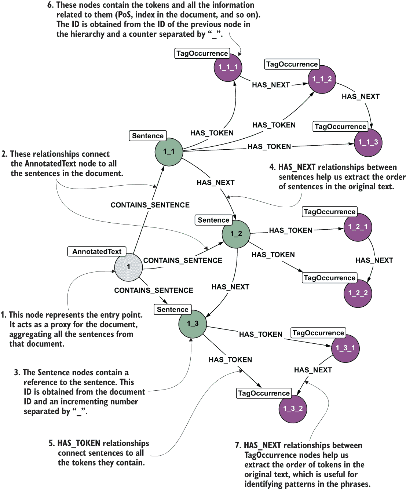

图 11.14 处理文本的正确第一个架构

通过添加标签节点来表示词元的归一化版本，可以略微改进此架构。这些节点是唯一的；它们只存储一次，包含此类标签的所有句子都通过标签出现节点指向它们。

由于前面提到的原因，常见单词可以生成密集节点。为了减轻这个问题，只有非停用词被存储为标签节点。结果模型将类似于图 11.15。

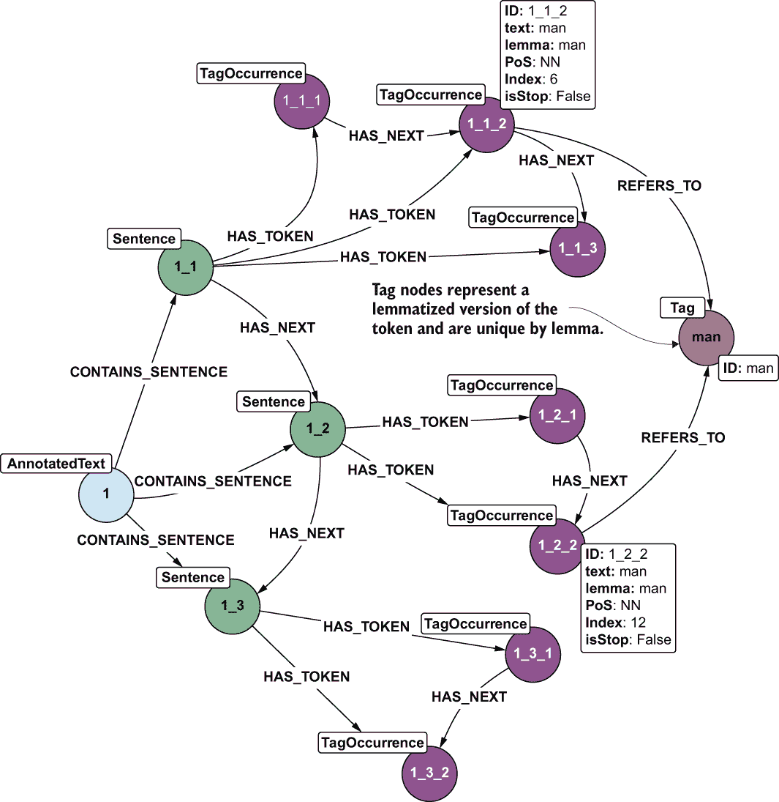

图 11.15 带有标签节点的扩展架构

当你想使用一些关键术语作为入口点来访问图数据库时，标签节点简化了导航。例如，你可以通过在标签节点上直接进行查询并使用关系来访问标签出现节点来实现这个任务。因为这些节点对我们来说不是关键，所以我们将忽略它们在架构、示例和练习中的内容，以使图更容易阅读，但请记住它们作为特定访问模式的选择。

拥有这个新模型后，我们可以扩展我们的文本处理代码并将其存储在图中。下面的列表比列表 11.12 更为复杂，它通过使用图 11.11 和 11.12 中描述的模型将文本转换为图。

列表 11.13 创建文本的第一个图

```
def tokenize_and_store(self, text, text_id, storeTag):
    docs = self.nlp.pipe([text], disable=["ner"])                          ❶
    for doc in docs:                                                       ❷
        annotated_text = self.create_annotated_text(doc, text_id)
        i = 1
        for sentence in doc.sents: 
            sentence_id = self.store_sentence(sentence, annotated_text, 
            ➥ text_id, i, storeTag)                                       ❸
            i += 1

def create_annotated_text(self, doc, id):                                  ❹
    query = """MERGE (ann:AnnotatedText {id: $id}) 
        RETURN id(ann) as result
    """                                                                    ❺
    params = {"id": id}
    results = self.execute_query(query, params)                            ❻
    return results[0]

def store_sentence(self, sentence, annotated_text, text_id, sentence_id, 
➥ storeTag):                                                              ❼
    sentence_query = """MATCH (ann:AnnotatedText) WHERE id(ann) = $ann_id
        MERGE (sentence:Sentence {id: $sentence_unique_id})
        SET sentence.text = $text
        MERGE (ann)-[:CONTAINS_SENTENCE]->(sentence)
        RETURN id(sentence) as result 
    """                                                                    ❽

    tag_occurrence_query = """MATCH (sentence:Sentence) WHERE id(sentence) = 
    ➥ $sentence_id
        WITH sentence, $tag_occurrences as tags
        FOREACH ( idx IN range(0,size(tags)-2) |
        MERGE (tagOccurrence1:TagOccurrence {id: tags[idx].id})
        SET tagOccurrence1 = tags[idx]
        MERGE (sentence)-[:HAS_TOKEN]->(tagOccurrence1)
        MERGE (tagOccurrence2:TagOccurrence {id: tags[idx + 1].id})
        SET tagOccurrence2 = tags[idx + 1]
        MERGE (sentence)-[:HAS_TOKEN]->(tagOccurrence2)
        MERGE (tagOccurrence1)-[r:HAS_NEXT {sentence: sentence.id}]->
        ➥ (tagOccurrence2))
        RETURN id(sentence) as result 
    """                                                                    ❾
  tag_occurrence_with_tag_query = """MATCH (sentence:Sentence) WHERE 
       ➥ id(sentence) = $sentence_id
        WITH sentence, $tag_occurrences as tags
        FOREACH ( idx IN range(0,size(tags)-2) |
        MERGE (tagOccurrence1:TagOccurrence {id: tags[idx].id})
        SET tagOccurrence1 = tags[idx]
        MERGE (sentence)-[:HAS_TOKEN]->(tagOccurrence1)
        MERGE (tagOccurrence2:TagOccurrence {id: tags[idx + 1].id})
        SET tagOccurrence2 = tags[idx + 1]
        MERGE (sentence)-[:HAS_TOKEN]->(tagOccurrence2)
        MERGE (tagOccurrence1)-[r:HAS_NEXT {sentence: sentence.id}]->
        ➥ (tagOccurrence2))
        FOREACH (tagItem in [tag_occurrence IN {tag_occurrences} WHERE 
        ➥ tag_occurrence.is_stop = False] |
        MERGE (tag:Tag {id: tagItem.lemma}) MERGE 
        ➥ (tagOccurrence:TagOccurrence {id: tagItem.id}) MERGE (tag)<-
        ➥ [:REFERS_TO]-(tagOccurrence))
        RETURN id(sentence) as result 
    """                                                                    ❿

    params = {"ann_id": annotated_text, "text": sentence.text, 
    ➥ "sentence_unique_id": str(text_id) + "_" + str(sentence_id)}
    results = self.execute_query(sentence_query, params)                   ⓫
    node_sentence_id = results[0]
    tag_occurrences = []
    for token in sentence:                                                 ⓬
        lexeme = self.nlp.vocab[token.text]
        if not lexeme.is_punct and not lexeme.is_space:                    ⓭
            tag_occurrence = {"id": str(text_id) + "_" + str(sentence_id) + 
            ➥ "_" + str(token.idx),
                              "index": token.idx,
                              "text": token.text,
                              "lemma": token.lemma_,
                              "pos": token.tag_,
                              "is_stop": (lexeme.is_stop or lexeme.is_punct 
                              ➥ or lexeme.is_space)}
            tag_occurrences.append(tag_occurrence)
    params = {"sentence_id": node_sentence_id, 
    ➥ "tag_occurrences":tag_occurrences}
    if storeTag:
        results = self.execute_query(tag_occurrence_with_tag_query, params)⓮
    else:
        results = self.execute_query(tag_occurrence_query, params)         ⓯
    return results[0]
```

❶ 不使用 NER 处理文本（提高性能）

❷ 遍历处理过的文档。管道接受文档列表并返回处理过的文档列表。

❸ 遍历句子，对每个句子调用存储函数

❹ 这个函数创建带有标签 AnnotatedText 的主要节点，所有其他节点都将连接到它。

❺ 创建 AnnotatedText 节点的查询很简单，只存储一个 ID 来标识原始文档。

❻ 这个常用函数执行代码中的所有查询。它需要查询和参数，并在事务中执行查询。

❺ 这个函数存储句子以及标签出现和标签。

❽ 此查询通过 id 搜索创建的 AnnotatedText 节点，创建一个句子，并将其连接到 AnnotatedText 节点。

❾ 此查询存储 TagOccurrence 节点，将它们连接到句子和彼此。

❿ 此查询存储 TagOccurrence 节点，将它们连接到句子和彼此以及 Tag 节点。它用作存储 Tag 节点的替代方案，用于之前的 tag_occurrence_ 查询。

⓫ 运行查询以存储句子

⓬ 遍历为每个句子提取的标记，并创建一个字典数组，用作存储句子的查询参数

⓭ 此过滤器避免存储标点和空格。

⓮ 使用 Tag 执行查询

⓯ 不使用 Tag 执行查询

在此代码中，通过一个参数（storeTag），可以决定是否存储 Tag 节点。因为 Tag 节点在本节的其余部分中不是必需的，所以此标志设置为 false，这将导致数据库更加简洁，并帮助我们避免密集节点问题。

分词是根据特定的分割规则来拆分文本的，这些规则通常比使用空格和标点符号要复杂一些。尽管如此，你可能希望从文本中获得更多信息。句子中的标记不是孤立的组件；它们通过语言关系相互关联。例如，句法关系可以捕捉一个词在句子中改变其他词语义的角色，并有助于确定主语和谓语。在前面使用的例子中，

*当我看到我最喜欢的队伍赢得 2019-2020 赛季的奖杯时，我简直不敢相信自己的眼睛。*

*I* 与 *believe* 在句法上相关，因为它是这个动词的主语。捕捉这些类型的依赖关系对于进一步理解文本至关重要：它们允许我们在管道的后续步骤中确定语义关系（谁对谁做了什么）。一般来说，这一阶段的丰富分析简化了后续的语义分析。

因此，让我们扩展我们之前的场景，添加一个新的要求：你希望识别文本中的关键句法元素（如动词及其主语和谓语），以改善对文本的理解，以便进行进一步分析。在迄今为止提出的各种解析方法中，关注于识别文本中依赖结构的依赖解析受到了最多的关注。图 11.16 显示了通过使用 CoreNLP 测试服务为我们示例句子获得的依赖解析。7

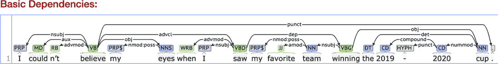

图 11.16 通过 corenlp.run 获得的标记之间的依赖关系

我希望到这本书的这一部分，你能够立即识别出哪里可以应用图。在这种情况下，它是一种特殊类型的图：一棵树。在依存句法分析中，每个句子都表示为一棵树，其根是句子的主要谓语或标记为根的虚拟节点，该虚拟节点以主要谓语作为其唯一的子节点 [Mihalcea and Radev, 2011]。边用于将每个词与其依存父节点连接起来。在句子“John likes green apples”中，谓语是 *likes*。它有两个论元：喜欢者（*John*）和被喜欢者（*apples*）。单词 *green* 修饰 *apples*，因此它被添加到树中作为 *apples* 的子节点。最终的树如图 11.17 所示。

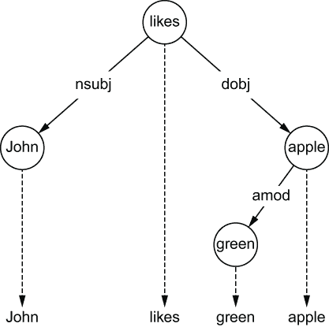

图 11.17 依赖树的示例

将这些新的句法关系到我们的图模型中是直接的。图 11.18 展示了它是如何工作的。

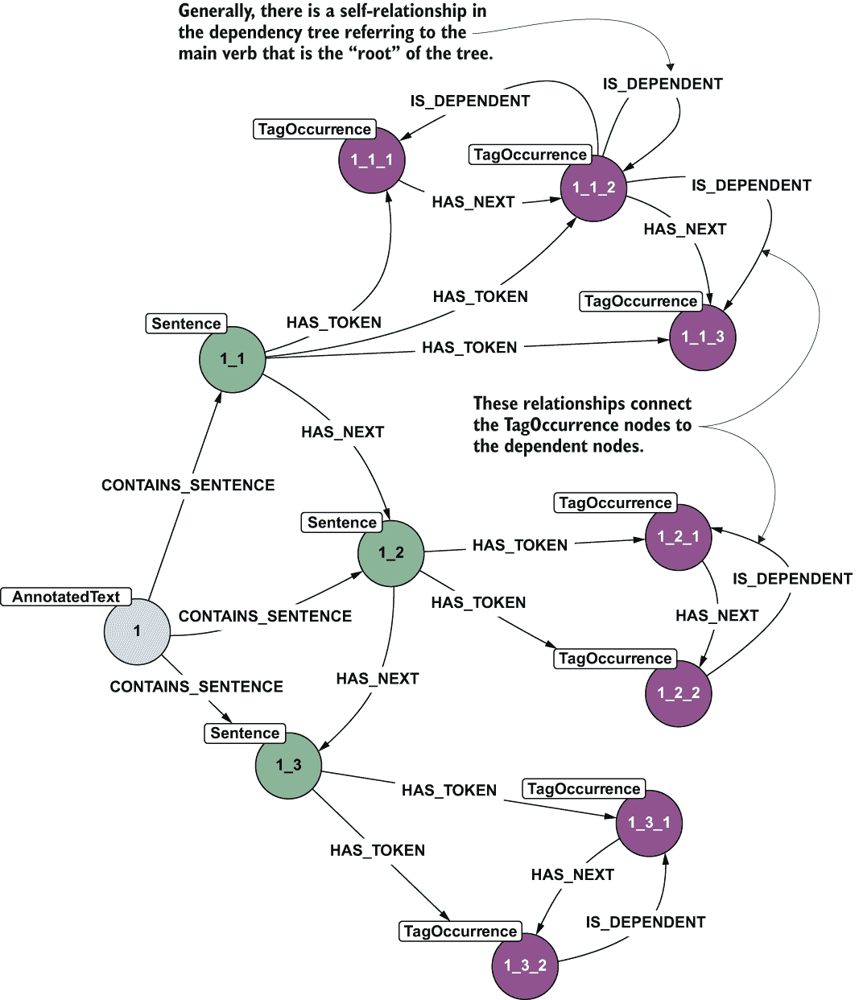

图 11.18 带有依赖关系的扩展模式

在生成的图模型中，新的关系将连接 TagOccurrence 节点与依赖节点。这种连接是必要的，因为同一个标签在不同的句子中可能具有不同的关系（例如，“John”可能在某些句子中是主语，在其他句子中是宾语），而 TagOccurrence 代表特定句子上下文中的标签，并且只能具有特定的角色。关系的方向遵循图 11.14 中的模式，依赖树的根（主动词）可以通过自环识别。以下列表是提取和存储图中的依赖关系的代码。

列表 11.14 提取和存储依赖关系

```
def store_sentence(self, sentence, annotated_text, text_id, sentence_id, 
➥ storeTag):

[... the same code as before ...] 

    params = {"ann_id": annotated_text, "text": sentence.text, 
    ➥ "sentence_unique_id": str(text_id) + "_" + str(sentence_id)}
    results = self.execute_query(sentence_query, params)
    node_sentence_id = results[0]
    tag_occurrences = []
    tag_occurrence_dependencies = []
    for token in sentence:                                               ❶
        lexeme = self.nlp.vocab[token.text]
        if not lexeme.is_punct and not lexeme.is_space:
            tag_occurrence_id = str(text_id) + "_" + str(sentence_id) + "_" + 
            ➥ str(token.idx)
            tag_occurrence = {"id": tag_occurrence_id,
                              "index": token.idx,
                              "text": token.text,
                              "lemma": token.lemma_,
                              "pos": token.tag_,
                              "is_stop": (lexeme.is_stop or lexeme.is_punct 
                              ➥ or lexeme.is_space)}
            tag_occurrences.append(tag_occurrence)
            tag_occurrence_dependency_source = str(text_id) + "_" + 
            ➥ str(sentence_id) + "_" + str(token.head.idx)
            dependency = {"source": tag_occurrence_dependency_source, 
            ➥ "destination": tag_occurrence_id, "type": token.dep_}     ❷
            tag_occurrence_dependencies.append(dependency)
    params = {"sentence_id": node_sentence_id, 
    ➥ "tag_occurrences":tag_occurrences}
    if storeTag:
        results = self.execute_query(tag_occurrence_with_tag_query, params)
    else:
        results = self.execute_query(tag_occurrence_query, params)

    self.process_dependencies(tag_occurrence_dependencies)               ❸
    return results[0]

def process_dependencies(self, tag_occurrence_dependencie):
    tag_occurrence_query = """UNWIND $dependencies as dependency
        MATCH (source:TagOccurrence {id: dependency.source})
        MATCH (destination:TagOccurrence {id: dependency.destination})
        MERGE (source)-[:IS_DEPENDENT {type: dependency.type}]->(destination)
            """                                                         ❹
    self.execute_query(tag_occurrence_query, {"dependencies": 
    ➥ tag_occurrence_dependencie})
```

❶ 受存储依赖关系更改影响的代码片段

❷ 准备包含依赖信息的字典，并将其附加到依赖关系列表中。

❸ 在创建 TagOccurrence 节点之后，会调用一个特定函数来存储它们之间的依赖关系。

❹ 查询通过依赖关系进行，搜索 TagOccurrence 节点，并将它们连接起来。

在这个阶段，生成的图包含句子、标记（词形还原、标记为停用词，并带有词性信息）以及描述它们在句子中角色的标记之间的关系。这是一些可以服务于广泛用例的大量信息，例如以下内容：

+   *下一词建议*——与 11.1 节中的下一个模式模型一样，考虑到当前词或任何数量的前一个词，可以建议下一个词。

+   *高级搜索引擎*——当我们有了关于词的顺序以及它们之间依存关系的信息时，我们可以实现高级搜索功能，除了检查词的精确顺序外，还可以考虑目标词之间有一些词的情况，并提供一些建议。具体示例如下。

+   *基于内容的推荐*——通过将文本分解成组件，我们可以比较项目描述（电影、产品等）。这一步是提供基于内容推荐的第一步要求。在这种情况下，如果已经实现了词干提取和其他规范化（如停用词去除、标点符号处理等），将使比较更加准确。

带着模式和手头的代码，让我们尝试完成一个具体任务。假设你有以下三个句子：

1.  “John likes green apples.”

1.  “Melissa picked up three small red apples.”

1.  “That small tree produces tasty yellow apples.”

练习

使用列表 11.13 和 11.14 将三个句子导入图表。要查找包含单词 *apples* 的所有文档，可以使用以下查询。

列表 11.15 搜索包含单词 apples 的文档

```
WITH  "apples" as searchQuery
MATCH (t:TagOccurrence)<-[*2..2]-(at:AnnotatedText)
WHERE t.lemma = searchQuery OR t.text = searchQuery
RETURN at
```

虽然这可以用任何搜索引擎完成，但现在让我们考虑一个更复杂的使用案例：搜索 *小苹果*。使用搜索引擎，你有两种选择：按特定顺序搜索这些词，或者搜索文档中这两个词的任何顺序。在前一种情况下，你将不会得到任何结果（因为 *red* 出现在这两个词之间），而在后一种情况下，你将得到两个文档（因为这两个词也出现在第三个文档中）。这种场景正是我们创建的图模型显示其力量的地方。以下是执行此搜索的查询。

列表 11.16 搜索小苹果

```
WITH  "small" as firstWord, "apples" as secondWord
MATCH (t0:TagOccurrence)-[:HAS_NEXT*..2]-(t1:TagOccurrence)
WHERE (t0.lemma = firstWord or t0.text = firstWord) AND (t1.lemma = 
➥ secondWord or t1.text = secondWord)
MATCH (t1)-[:IS_DEPENDENT]->(t0)<-[*2..2]-(at:AnnotatedText)    ❶
return at
```

❶ 这一行检查两个标记之间是否存在句法依存关系。

练习

通过图表，我们可以用与在搜索引擎中相同的方式表达查询。编写查询以找到包含确切短语 *小苹果* 的文档，以及找到包含这两个词以任何顺序出现的文档。

让我们再来看一个例子，这个例子展示了自然语言处理（NLP）与图表方法的结合力量。正如以下查询所展示的，我们可以使用图表来回答甚至更复杂的问题，这为信息检索、聊天机器人和对话平台等应用奠定了基础。

列表 11.17 回答问题“苹果是什么样的？”

```
WITH  "apples" as searchQuery
MATCH (t0:TagOccurrence)
WHERE (t0.lemma = searchQuery or t0.text = searchQuery)
MATCH (t0)-[:IS_DEPENDENT {type: "amod"}]->(t1:TagOccurrence)
return t1.text
```

图形能够无需任何人工训练努力回答复杂问题。分解文本并建立适当的图结构使我们能够做很多事情。第十二章通过构建适当的知识图来扩展这一想法，该知识图为更复杂的场景提供支持。

### 11.2.1 图形方法的优点

本节清楚地展示了自然语言处理（NLP）和图如何很好地协同工作。由于 NLP 任务产生数据的强连接性，将这些结果存储在图模型中似乎是一个逻辑上合理的、理性的选择。在某些情况下，例如与句法依赖关系一样，关系作为 NLP 任务的输出生成，图模型只需存储它们。在其他情况下，模型被设计为同时服务于多个范围，提供易于导航的数据结构。

这里提出的图模型不仅存储了信息提取过程中提取的主要数据和关系，还允许通过在后期处理阶段添加新信息进行扩展：相似度计算、情感提取等。因此，我们只需付出相对较小的努力，就可以服务于词建议用例以及更复杂的搜索需求，甚至问答（“苹果是什么样的？”）。

在第十二章中进一步扩展了此模型，包括从文本和后处理结果中提取的更多信息，使其能够服务于更多场景和应用。

## 摘要

本章介绍了与 NLP 和知识表示相关的关键概念，将它们与图和图模型相匹配。主要观点是，图不仅可以存储文本数据，还可以提供处理文本的概念工具集，并通过最小努力提供高级功能——例如，使复杂的搜索场景成为可能。

涵盖的主题包括

+   如何以最简单的方式存储文本，通过将其分解成易于导航的块

+   如何从文本中提取有意义的信息集

+   如何设计一个强大的图模型来存储文本并在不同的应用程序中访问它

+   如何根据不同的目的查询图，例如搜索、问答和词建议

## 参考文献

[Farris et al., 2013] Farris, Andrew L., Grant S. Ingersoll, 和 Thomas S. Morton. *文本驯服：如何查找、组织和操作它*. 纽约州舍托岛：Manning, 2013。

[Grishman, 2015] Grishman, Ralph. “信息提取。” *IEEE 智能系统* 30:5 (2015): 8-15.

[Lane et al., 2019] Lane, Hobson, Cole Howard, 和 Hannes Hapke. *自然语言处理实战*. 纽约州舍托岛：Manning, 2019。

[Mihalcea and Radev, 2011] Mihalcea, Rada, 和 Dragomir Radev. *基于图的自然语言处理和信息检索*. 纽约：剑桥大学出版社，2011。

[Turnbull and Berryman, 2016] Turnbull, Doug, 和 John Berryman. *相关搜索：适用于 Solr 和 Elasticsearch 的应用*. 纽约州舍托岛：Manning, 2016。

* * *

(1.)[`mng.bz/y9Dq`](https://shortener.manning.com/y9Dq).

(2.)使用 MATCH (n) DETACH DELETE n.

(3.)文件可以在此处下载：[`mng.bz/MgKn`](https://shortener.manning.com/MgKn).

(4.)我明确搜索了一个复杂名称，并在这里找到了它：[`mng.bz/aKzB`](https://shortener.manning.com/aKzB).

[`spacy.io`](https://spacy.io).

代码可在本书的仓库中找到，位于 ch11/basic_nlp_examples/01_spacy_basic_nlp_tasks.py。

[`corenlp.run`](http://corenlp.run).
