# 12 知识图谱

本章涵盖

+   介绍知识图谱及其应用

+   从文本中提取实体和关系以创建知识图谱

+   在知识图谱之上使用后处理技术：语义网络

+   自动提取主题

在本章中，我们将继续第十一章开始的工作：将文本分解成一组有意义的 信息并将其存储在图中。在这里，我们有一个明确的目标：构建知识图谱。

这样，我们将完成 11 章前开始的旅程，即通过使用图作为核心技术和心理模型来管理和处理数据。知识图谱代表了整本书讨论内容的顶峰。在前面的章节中，你学习了如何存储和处理用户-项目交互数据以提供不同形式和形状的推荐，如何处理交易数据和社会网络以打击欺诈，等等。现在，我们将深入探讨如何从非结构化数据中提取知识。

本章比其他章节要长一些，内容也相当密集。你需要通读全文，才能理解不仅如何从文本数据中构建知识图谱，而且如何利用它来构建高级服务。通过图表和具体示例，我试图使本章更容易阅读和理解；请在阅读时仔细查看它们，以确保你掌握了关键概念。

## 12.1 知识图谱：简介

在第三章中，我介绍了利用知识将数据转化为洞察和智慧的概念，使用图 12.1 中的系列图像。正如你所见，整个过程都是关于连接信息，而图是理想的表示方式。


图 12.1 由 David Somerville 绘制，基于 Hugh McLeod 的原始作品

知识图谱以一种无与伦比的方式解决了机器学习中知识表示的反复问题（想想我在本书中所有关于知识表示的讨论！），并为知识推理提供了最佳工具，例如从表示的数据中得出推论。

当谷歌在 2012 年一篇开创性的博客文章¹中宣布其知识图谱将使用户能够搜索“事物，而不是字符串”时，知识图谱进入了公众视野。该文章解释说，当用户搜索“Taj Mahal”时，这个字符串被分成两个同等重要的部分（单词），搜索引擎试图将它们与所有文档匹配。但实际情况是，用户并不是在搜索两个独立的单词，而是在搜索一个具体的“事物”，无论是位于阿格拉的美丽纪念碑、一家印度餐厅，还是获得格莱美奖的音乐家。名人、城市、地理特征、事件、电影——这些都是用户在搜索特定对象时希望得到的结果类型。返回与查询真正相关的信息，极大地改变了搜索过程中的用户体验。

谷歌将这种方法应用于其核心业务——网络搜索。从用户的角度来看，最引人注目的功能之一是除了由关键词（基于字符串）搜索产生的按排名排列的网页列表之外，谷歌还显示了一个结构化的知识卡片——一个包含关于可能与搜索词相对应的实体（如图 12.2）的总结信息的盒子。


图 12.2 当前对于字符串“taj mahal”的结果。注意右边的盒子。

搜索只是开始。在谷歌发布博客文章后的几年里，知识图谱开始进入信息检索领域：数据库、语义网、人工智能（AI）、社交媒体和企业信息系统 [Gomez-Perez et al., 2017]。多年来，各种倡议扩展和发展了谷歌最初引入的概念。引入了额外的功能、新的想法和见解，以及一系列应用，因此，知识图谱的概念已经变得非常广泛，包括新的方法和技术。

但什么是知识图谱？什么使一个普通图成为知识图谱？没有黄金标准，普遍接受的定义，但我最喜欢的是 Gomez-Perez 等人给出的定义：“知识图谱由一组相互连接的具有类型的实体及其属性组成。”

根据这个定义，知识图谱的基本单元是实体的表示，例如人、组织或地点（如泰姬陵的例子），或者可能是体育赛事、书籍或电影（如在推荐引擎的情况下）。每个实体可能有各种属性。对于人来说，这些属性可能包括姓名、地址、出生日期等。实体通过关系相互连接。例如，一个人可能“为”一家公司工作，或者用户喜欢一个页面或关注另一个用户。关系也可以用来连接两个不同的知识图谱。

与其他以知识为导向的信息系统相比，知识图谱的特点在于其独特的组合

+   知识表示结构和推理，例如语言、模式、标准词汇表以及概念之间的层次结构

+   信息管理流程（信息如何被摄取并转换为知识图谱）

+   访问和处理模式，例如查询机制、搜索算法以及预处理和后处理技术

正如我们在整本书中所做的那样，我们将使用标签属性图（LPG）来表示知识图谱——这与常规做法不同，因为知识图谱通常使用资源描述框架（RDF）数据模型来表示。RDF 是 W3C 的互联网数据交换标准，设计为一种表示关于网络资源信息（如网页的标题、作者和修改日期，或关于网络文档的版权和许可信息）的语言。但通过泛化网络资源的概念，我们也可以使用 RDF 来表示关于其他事物（如在线商店可用的商品或用户对信息传递的偏好）的信息 [RDF 工作组，2004]。

RDF 中任何表达式的底层结构是一组三元组，每个三元组由一个主语、一个谓语和一个宾语组成。每个三元组可以表示为一个节点-弧-节点链接，也称为*RDF 图*，其中*主语*是一个资源（图中的一个节点），*谓语*是弧（一个关系），*宾语*是另一个节点或一个字面值。图 12.3 显示了这种结构的外观。

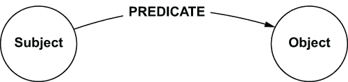

图 12.3 简单的 RDF 图

RDF 旨在处理其编码的信息需要由应用程序处理的情况，而不是仅向人们展示。它提供了一个通用的框架来表示此类信息，以便在没有意义损失的情况下在应用程序之间交换。这个框架使得它比 LPG（通过使用具有属性的关系和节点以紧凑的方式存储复杂图而设计的）更冗长，对人类来说可读性较差。请参考图 12.4 中的示例，这是耶稣·巴拉斯在一篇博客文章²中的内容。

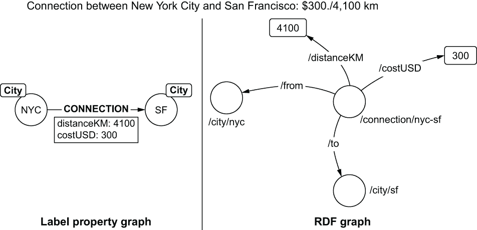

图 12.4 LPG 与 RDF 图对比

LPG 在表示知识图谱方面比 RDF 图更灵活、更强大。值得注意的是，本章重点介绍如何构建和访问由文本数据创建的知识图谱。从结构化数据构建知识图谱绝对是一个更简单的任务，这是我们已经在之前多个场景中完成过的。

当从文本中获取知识图谱时，使用本章将要探讨的技术，它会被后处理或增强以提取洞察和智慧。图 12.5 展示了整个过程，我们将在本章中详细探讨。

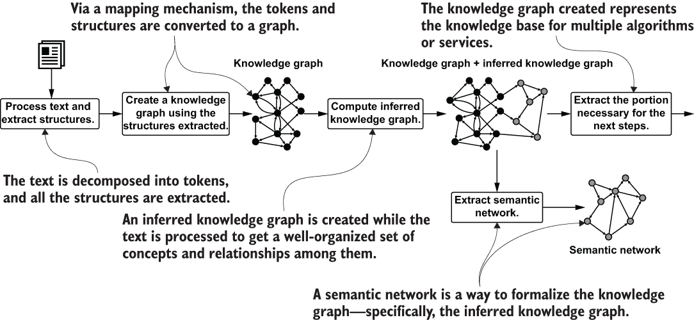

图 12.5 整个过程的心智地图

从文本中提取结构的技术将通过识别关键实体及其之间的关系得到扩展。这些技术对于知识图谱的创建至关重要。因为相同的实体和关系往往在特定领域语料库的文档中反复出现，因此推断一个代表这种信息的通用模型非常重要，该模型从文本中出现的实例中抽象出来。这个模型被称为**推断知识图谱**。此过程的结果代表了一个知识库，它可以用于多种高级机器学习技术，或者更普遍地说，用于 AI 应用。表示知识库最常见的方法之一是通过**语义网络**：一组概念及其之间预定义的连接。

## 12.2 知识图谱构建：实体

从文本数据构建知识图谱的一个关键元素是识别文本中的实体。假设你有一组文档（例如来自维基百科），你被要求在这些文档中找到与你领域相关的人或其他实体的名称，如地点、组织等。当提取此信息时，你必须通过图使其易于访问，以便进一步探索。

命名实体识别（NER）的任务涉及在文本中找到每个命名实体（NE）的提及并标记其类型[Grishman and Sundheim, 1996]。NE 类型的构成取决于领域；人物、地点和组织是常见的，但 NE 可以包括各种其他结构，例如街道地址、时间、化学公式、数学公式、基因名称、天体名称、产品以及品牌——简而言之，任何与您应用相关的信息。用通用术语来说，我们可以将 NE 定义为任何可以用适当名称指代且与我们要考虑的分析领域相关的东西。例如，如果您正在处理用于某些医疗用例的电子病历，您可能希望识别患者、疾病、治疗方法、药物、医院等等。正如前面的例子所暗示的，许多命名实体具有超语言结构，这意味着它们是根据与通用语言规则不同的规则组成的。这个术语也通常被扩展到包括不是实体本身的东西：数值（如价格）、日期、时间、货币等等。每个 NE 都与一个特定类型相关联，该类型指定了其类别，例如 PERSON、DATE、NUMBER 或 LOCATION。领域至关重要，因为同一个实体可以根据领域与不同的类型相关联。

当一个文本中的所有命名实体（NE）都被提取出来后，它们可以与对应于现实世界实体的集合相链接，这使我们能够推断，例如，“United Airlines”和“United”的提及指的是同一家公司[Jurafsky and Martin, 2019]。假设您有以下文档：

**Marie Curie，Pierre Curie 的妻子，于 1911 年获得了诺贝尔化学奖。她之前在 1903 年获得了诺贝尔物理学奖**。

需要提取的实体集合将根据您分析目标的相关实体而变化，但假设我们对所有实体都感兴趣，一个合适的命名实体识别（NE）结果应该能够识别并将“Marie Curie”和“Pierre Curie”识别为人物名称，将“Nobel Prize in Chemistry”和“Nobel Prize in Physics”识别为奖项名称，以及将“1911”和“1903”识别为日期。这项任务对人类来说很简单，但对机器来说并不那么简单。您可以通过使用像开源 displaCy 这样的 NE 可视化器来尝试它。³ 如果您粘贴前面的文本并选择所有实体标签，您将得到类似于图 12.6 的结果。


图 12.6 displaCy NE 可视化器对我们样本文本的结果

有趣的是，无需任何调整，该服务就能识别句子中的所有实体（尽管奖项被分类为“艺术品”）。

将 NER 任务添加到图模型中很简单。如图 12.7 所示，最佳解决方案是添加带有标签 NamedEntity 的新节点，其中包含从文档中提取的实体。这些节点链接到任何相关的 TagOccurrence 节点（例如，“Marie Curie”是一个由两个 TagOccurrence 节点“Marie”和“Curie”组成的单个名称）。为文本中实体的每个出现创建 NamedEntity 节点，因此“Marie Curie”可以以不同的节点出现多次。在本节稍后，我们将看到如何将它们链接到一个表示“Marie Curie”作为人的特定实体的公共节点。

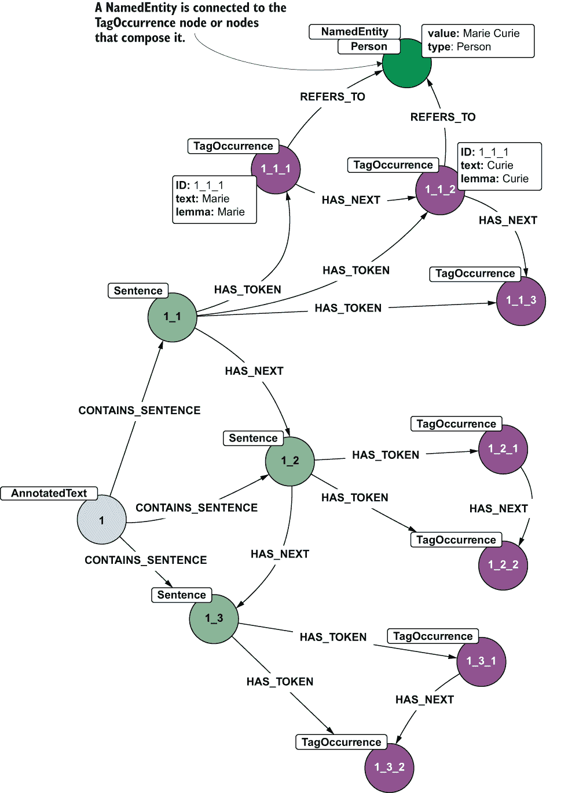

图 12.7 带有 NER 的扩展模式

从第十一章扩展我们的数据模型以在图中存储 NER 任务的输出相当简单。以下列表包含从文本中提取 NE 并存储所需的更改。完整代码位于 ch12/04_spacy_ner_schema.py 和 ch12/text_processors.py 文件中。

列表 12.1 将 NER 任务添加到模型中

```
def tokenize_and_store(self, text, text_id, storeTag):
    docs = self.nlp.pipe([text])
    for doc in docs:
        annotated_text = self.__text_processor.create_annotated_text(doc, 
        ➥ text_id)
        spans = self.__text_processor.process_sentences(annotated_text, doc, 
        ➥ storeTag, text_id)
        nes = self.__text_processor.process_entities(spans, text_id)   ❶

def process_entities(self, spans, text_id):                            ❷
    nes = []
    for entity in spans: 
        ne = {'value': entity.text, 'type': entity.label_, 'start_index': 
        ➥ entity.start_char,
              'end_index': entity.end_char}
        nes.append(ne)
    self.store_entities(text_id, nes)
    return nes

def store_entities(self, document_id, nes):                            ❸
    ne_query = """                                                     ❹
        UNWIND $nes as item
        MERGE (ne:NamedEntity {id: toString($documentId) + "_" + 
        ➥ toString(item.start_index)})
        SET ne.type = item.type, ne.value = item.value, ne.index = 
        ➥ item.start_index
        WITH ne, item as neIndex
        MATCH (text:AnnotatedText)-[:CONTAINS_SENTENCE]->(sentence:Sentence)-
        ➥ [:HAS_TOKEN]->(tagOccurrence:TagOccurrence)
        WHERE text.id = $documentId AND tagOccurrence.index >= 
        ➥ neIndex.start_index AND tagOccurrence.index < neIndex.end_index
        MERGE (ne)<-[:PARTICIPATES_IN]-(tagOccurrence)
    """
    self.execute_query(ne_query, {"documentId": document_id, "nes": nes})
```

❶ 添加新的步骤以提取和存储命名实体

❷ 该函数接收 NLP 处理的结果并提取命名实体。

❸ 函数将实体存储在图中。

❹ 查询遍历实体，并为每个实体创建一个新节点，并将其链接到组成 NE 的标签。

如您所见，所需的更改在管道和保存 NER 任务结果的代码方面都很小。spaCy 有自己的基本 NE 模型，这是我们在这段代码中使用过的，但它还提供了通过传递标注句子样本来训练新的 NER 模型的机会。请参阅 spaCy 文档⁴ 了解详情。

在书面和口语语言中，如果提到一个人、一个地点或其他相关实体多次，后续提及通常不会重复完整的名称。因此，在前面给出的例子中，我们可能会看到缩写名称（“Mme. Curie”）、代词（“她”）或描述性短语（“著名的科学家”）。此时的问题是如何识别这些关系并将它们从普通文本中提取出来。

我们可以通过添加另一个要求来进一步开发我们的场景。假设您想通过考虑所有命名实体的提及来改进您的访问模式。作为一个具体的例子，在以下文本中，我们希望将“她”与“Marie Curie”连接起来：

*玛丽·居里在 1903 年获得了诺贝尔物理学奖。她成为了第一个获奖的女性，也是第一个两次获奖的人—无论是男性还是女性。*

在自然语言处理（NLP）中，这个任务是通过*共指消解*来完成的，它被定义为识别文本中实体引用之间关系的问题，无论它们是否由名词或代词表示[Mihalcea 和 Radev, 2011]。解决代词引用涉及约束和偏好的组合：先行词必须与代词匹配（在数量、性别等方面），并且作为先行词，我们更倾向于主语而不是宾语，文本中离代词更近的词，以及可能在代词语境中出现的词[Grishman, 2015]。典型的共指消解算法试图通过使用基于规则的系统来识别引用链，尽管最终标准是基于对语料库中大量文本的统计或使用机器学习分类器。

链接一般的共指名词短语是一个更困难的任务。一些简单的情况使用相同的名词多次，但大多数例子需要一些世界知识，基于观察在其他地方用来指代特定实体的短语。这种方法允许我们将“著名的波兰科学家”解析为“玛丽·居里”，或将“奖项”解析为“诺贝尔奖”。

提出的基于图的方法用于共指消解[Nicolae 和 Nicolae, 2006; Ng, 2009]使用图割算法来近似文本中实体引用的正确分配，但这些方法超出了本书的范围，因为我们在代码库中使用的 NLP 库有自己的共指实现。这里的重点是讨论如何建模此类任务的结果并充分利用它。

考虑我们的示例文本。图 12.8 显示了使用第十一章中提到的斯坦福 CoreNLP 测试服务获得的结果。

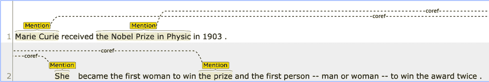

图 12.8 共指结果

我们可以通过将代词和其他引用链接到它们所指向的真实实体来在我们的图模型中表示这些连接。图 12.9 显示了扩展到包括共指消解的模型。通常，图提供了必要的灵活性，以最小的努力适应新的需求，同时保持先前的访问模式有效运行。

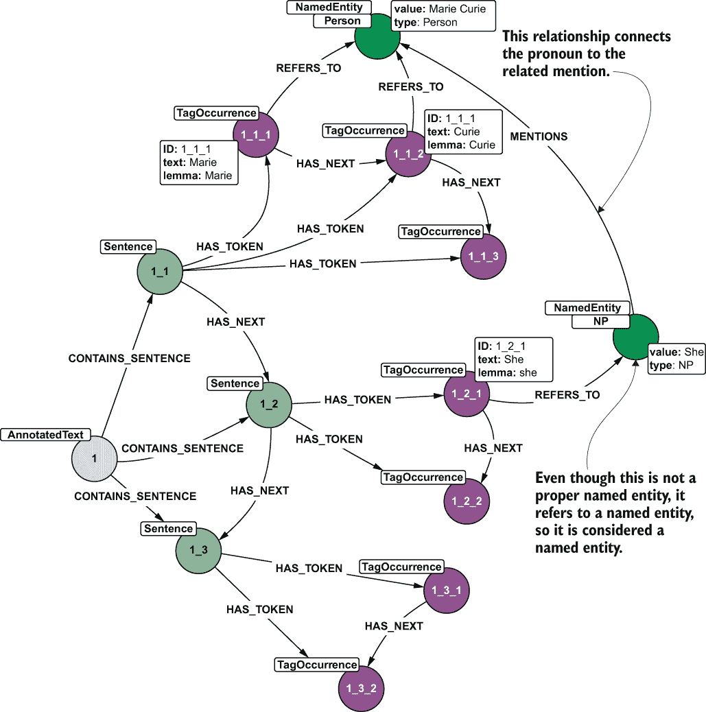

图 12.9 带有共指消解的图模型

扩展的图模型通过使用 MENTIONS 关系连接命名实体节点。以下列表显示了存储新共指的代码更改。完整代码位于 ch12/05_spacy_coref_schema.py 和 ch12/text_processors.py。

列表 12.2 提取共指

```
def __init__(self, language, uri, user, password):
    spacy.prefer_gpu()
    self.nlp = spacy.load('en_core_web_sm')
    coref = neuralcoref.NeuralCoref(self.nlp.vocab)
    self.nlp.add_pipe(coref, name='neuralcoref');                         ❶
    self._driver = GraphDatabase.driver(uri, auth=(user, password), 
    ➥ encrypted=0)
    self.__text_processor = TextProcessor(self.nlp, self._driver)
    self.create_constraints()

def tokenize_and_store(self, text, text_id, storeTag):
    docs = self.nlp.pipe([text])
    for doc in docs:
        annotated_text = self.__text_processor.create_annotated_text(doc, 
        ➥ text_id)
        spans = self.__text_processor.process_sentences(annotated_text, doc, 
        ➥ storeTag, text_id)
        nes = self.__text_processor.process_entities(spans, text_id)
        coref = self.__text_processor.process_co-reference(doc, text_id)  ❷

def process_co-reference(self, doc, text_id): 
    coref = []
    if doc._.has_coref:                                                   ❸
        for cluster in doc._.coref_clusters:
            mention = {'from_index': cluster.mentions[-1].start_char, 
            ➥ 'to_index': cluster.mentions[0].start_char}
            coref.append(mention)
        self.store_coref(text_id, coref)
    return coref

def store_coref(self, document_id, corefs):
    coref_query = """                                                     ❹
            MATCH (document:AnnotatedText)
            WHERE document.id = $documentId 
            WITH document
            UNWIND $corefs as coref  
            MATCH (document)-[*3..3]->(start:NamedEntity), (document)-
            ➥ [*3..3]->(end:NamedEntity) 
            WHERE start.index = coref.from_index AND end.index = 
            ➥ coref.to_index
            MERGE (start)-[:MENTIONS]->(end)
    """
    self.execute_query(coref_query,
                       {"documentId": document_id, "corefs": corefs})
```

❶ 在 spaCy 的 NLP 管道中添加一个新的共指元素，这是一个共指消解的神经网络实现（见[`github.com/huggingface/neuralcoref`](https://github.com/huggingface/neuralcoref)）。

❷ 提取共指并将它们存储在图中

❸ 在文档中找到的共指上进行循环，并为在图中存储它们创建字典

❹ 查询通过 MENTIONS 将命名实体连接起来。

共指关系对于将所有关键 NE 的提及与来源连接起来很有用，即使它们的规范名称没有被使用。

NEs 和共指在知识图谱构建中扮演着重要角色。它们都是一等对象，代表文本中相关实体及其相互关系的发生。但为了提高从图中提取知识的质量，有必要从这些文本发生中抽象出来，并识别出在文本中被多次提及的关键实体。自然语言理解系统（以及人类）根据*话语模型* [Karttunen, 1969]来解释语言表达——这是一个系统在处理语料库（或人类听者的情况，来自对话）中的文本时逐步构建的心理模型，其中包含文本中提及的实体的表示，以及实体的属性和它们之间的关系 [Jurafsky and Martin, 2019]。我们说如果两个提及与同一实体相关联，则它们是共指的。

话语模型的概念可以应用于知识图谱用例中，以简化并改进对其所体现知识的访问。如图 12.10 所示，我们可以构建知识图谱的补充——本章引言中提到的推断知识图谱——它包含处理文本中提及的实体的唯一表示，以及它们的属性和它们之间的关系。

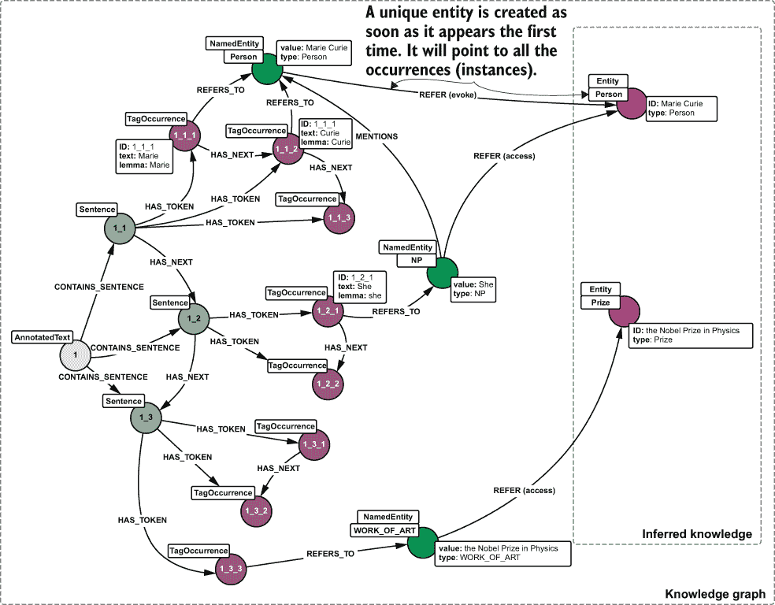

图 12.10 包含推断知识的知识图谱

虽然知识图谱的主体包含语料库中文本的分解，并最终在图模型中重新组织为结构化数据，但这一部分——与第一部分相连——提炼了关键元素和关系，以回答不同的问题并支持多种服务，消除了导航整个图的需要。这个*推断知识图谱*包含一个易于共享的知识表示，它不直接连接到从中提取此知识的特定实例（文档）。

下面的列表显示了在共指消解任务之后如何应用此推断来逐步构建知识图谱的第二部分。该函数在 ch12/text_processors.py 中调用，来自 ch12/06_spacy_entity_relationship_extraction.py。

列表 12.3 创建推断知识图谱

```
def build_entities_inferred_graph(self, document_id):     ❶
    extract_direct_entities_query = """                   ❷
        MATCH (document:AnnotatedText)
        WHERE document.id = $documentId
        WITH document
        MATCH (document)-[*3..3]->(ne:NamedEntity)
        WHERE NOT ne.type IN ['NP', 'NUMBER', 'DATE']
        WITH ne
        MERGE (entity:Entity {type: ne.type, id:ne.value})
        MERGE (ne)-[:REFERS_TO {type: "evoke"}]->(entity)
    """

    extract_indirect_entities_query = """                 ❸
        MATCH (document:AnnotatedText)
        WHERE document.id = $documentId
        WITH document
        MATCH (document)-[*3..3]->(ne:NamedEntity)<-[:MENTIONS]-(mention)
        WHERE NOT ne.type IN ['NP', 'NUMBER', 'DATE']
        WITH ne, mention
        MERGE (entity:Entity {type: ne.type, id:ne.value})
        MERGE (mention)-[:REFERS_TO {type: "access"}]->(entity)
    """
    self.execute_query(extract_direct_entities_query, {"documentId": 
    ➥ document_id})
    self.execute_query(extract_indirect_entities_query, {"documentId": 
    ➥ document_id})
```

❶ 从先前创建的图中提取推断图的步骤

❷ 第一个查询从主要命名实体创建实体。

❸ 第二个查询通过使用图中可用的共指连接通过 MENTIONS 创建到主要实体的连接。

使用列表 12.3 中的代码，我们有了从文本中提取命名实体和共指的所有必要代码，以及创建知识图谱的第二层。在此阶段，通过使用 ch12/07_process_larger_corpus.py 中可用的代码，您可以导入并处理第十一章中使用的 MASC 语料库，并开始从中获得更多见解。

练习

使用我们创建的图数据库，可以通过查询执行以下操作：

+   找出创建的命名实体的不同类型。

+   计算每种类型的出现次数，按降序排列，并取前三个。

+   计算推断知识图谱中组织实体的出现次数。应该更少，因为系统在创建推断图时应将它们聚合。

## 12.3 知识图谱构建：关系

当实体被识别后，下一步是辨别检测到的实体之间的关系，这在很大程度上提高了知识图谱的质量，包括您可以从中提取的见解和可用的访问模式。这一步在从文本创建有意义的图谱中至关重要，因为它允许您在实体之间建立联系并正确导航。您可以执行的查询类型以及因此可以回答的问题类型将显著增加。

为了更好地分解文本并使其更易于机器和人类理解，假设您想识别提取实体之间的关系，以突出它们之间的联系——例如，奖项与其获得者之间的关系，或公司与为其工作的人之间的关系。

回答诸如根据患者症状最可能的诊断或谁获得了物理学诺贝尔奖等问题，需要您不仅识别特定实体，还要识别它们之间的关系。存在不同的技术来完成这项任务；有些比其他技术更复杂，有些需要监督（标记样本关系以创建训练集）。最早且至今仍常用的关系抽取算法基于词汇句法模式。它涉及将一些上述标记或特定标签序列之间的句法关系映射到一组与关键命名实体相关的（对于用例）关系。

这个任务可能看起来很复杂，在某些情况下确实如此，但拥有图模型有很大帮助。可以通过一组语义分析规则获得一个粗略的简单近似，每个规则将句法图的子图（例如包含与关键实体相关句法关系的图的一部分）映射到数据库关系，这些关系应用于相应的实体。以下是一个具体的例子：

*玛丽·居里在 1903 年获得了物理学诺贝尔奖*。

句法分析确定“received”的主语是“玛丽·居里”，宾语是“诺贝尔物理学奖”。这些依存关系可以用以下代码轻松可视化。

列表 12.4 可视化依存关系

```
import spacy
nlp = spacy.load('en_core_web_sm')
doc = nlp(u"Marie Curie received the Nobel Prize in Physics")   ❶
options = {"collapse_phrases": True}                            ❷
spacy.displacy.serve(doc, style='dep', options=options)         ❸
```

❶ 注释一个简单句子

❷ 此选项允许我们将“玛丽·居里”等合并为可视化中的单个实体。

❸ 创建一个服务器实例，这将允许我们可视化结果

结果将类似于图 12.11。

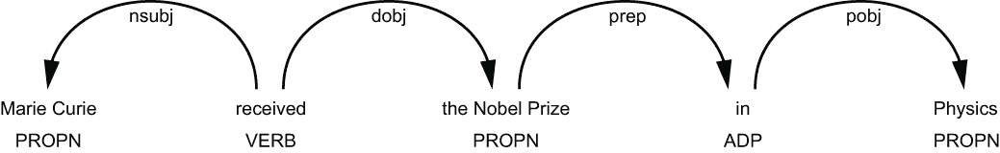

图 12.11 使用 spaCy 可视化的句法依存关系

一个可能的模式将把这个句法结构映射到语义谓词

```
(verb: receive, subject: p:Person, object: a:Prize) → (relationship: 
➥ RECEIVE_PRIZE, from: p, to:a)
```

在这里，“receive”（在词形还原版本中考虑）是一个英语动词，而 RECEIVE_PRIZE 是一个关系类型（一个语义关系）。使用像 Cypher 这样的适当基于图的查询语言表达这些类型的模式是直接的。作为一个练习，我们将推导出我们拥有的图。我们拥有的代码处理的句子产生了图 12.12 中所示的结果。

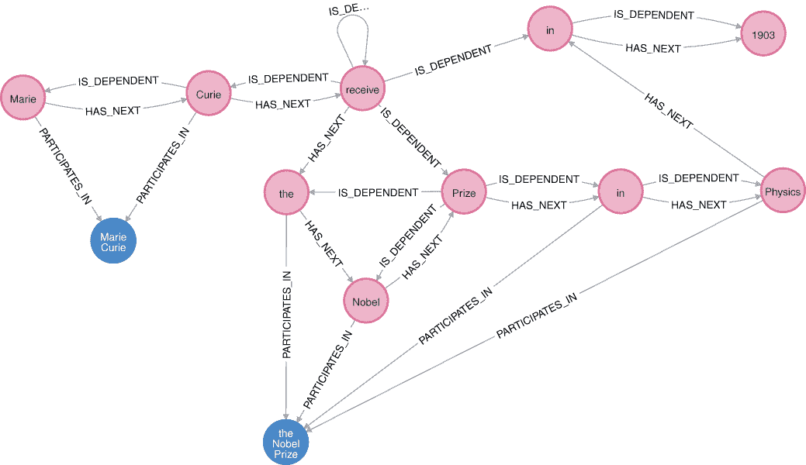

图 12.12 处理句子“玛丽·居里在 1903 年获得了诺贝尔物理学奖”后的结果图

使用以下查询可以执行寻找所有符合我们寻找模式的子图的任务。

列表 12.5 搜索符合我们寻找模式的子图

```
MATCH (verb:TagOccurrence {pos: "VBD", lemma:"receive"})
WITH verb
MATCH p=(verb)-[:IS_DEPENDENT {type:"nsubj"}]->(subject)-[:PARTICIPATES_IN]->
➥ (person:NamedEntity {type: "PERSON"})
MATCH q=(verb)-[:IS_DEPENDENT {type:"dobj"}]->(object)-[:PARTICIPATES_IN]->
➥ (woa:NamedEntity {type: "WORK_OF_ART"})
RETURN verb, person, woa, p, q
```

我们知识图谱中的结果将类似于图 12.13。

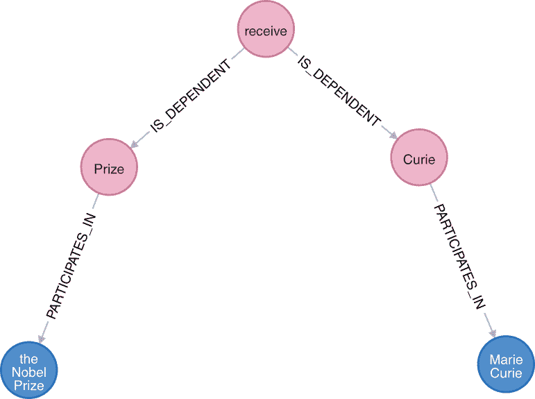

图 12.13 列表 12.5 的结果

注意，模式必须指定主语和宾语的语义类型——即实体类型，例如以 Person 作为主语，Prize 作为宾语。（在我们的例子中，类型是“艺术品”；拥有更好的 NER 模型会有所帮助。）但是，“receive”传达了许多关系，我们不希望涉及其他类型参数的“receive”实例被翻译成 RECEIVE_PRIZE 关系。另一方面，需要大量的替代模式来捕捉传达此类信息的广泛表达方式，例如

```
(relationship: "win", subject: p:Person, object: a:Prize) ®
  (relationship: RECEIVE_PRIZE, from: p, to:a)
(relationship: "award", indirect-object: p:Person, object: a:Prize) ®
  (relationship: RECEIVE_PRIZE, from: p, to:a)
```

注意，在后一个例子中，获奖者作为间接宾语出现（“委员会将奖项授予玛丽·居里。”）。如果我们没有包括将被动句转换为主动句的句法正则化步骤，我们还需要一个被动形式的模式（“奖项被授予玛丽·居里。”）：

```
(relationship: "was awarded", object: a:Prize, indirect-object: p:Person) ®
  (relationship: RECEIVE_PRIZE, from: p, to: a)
```

当这些关系被提取出来后，它们必须存储在我们设计的图模型中。图 12.14 显示了添加新信息所需的模式更改。

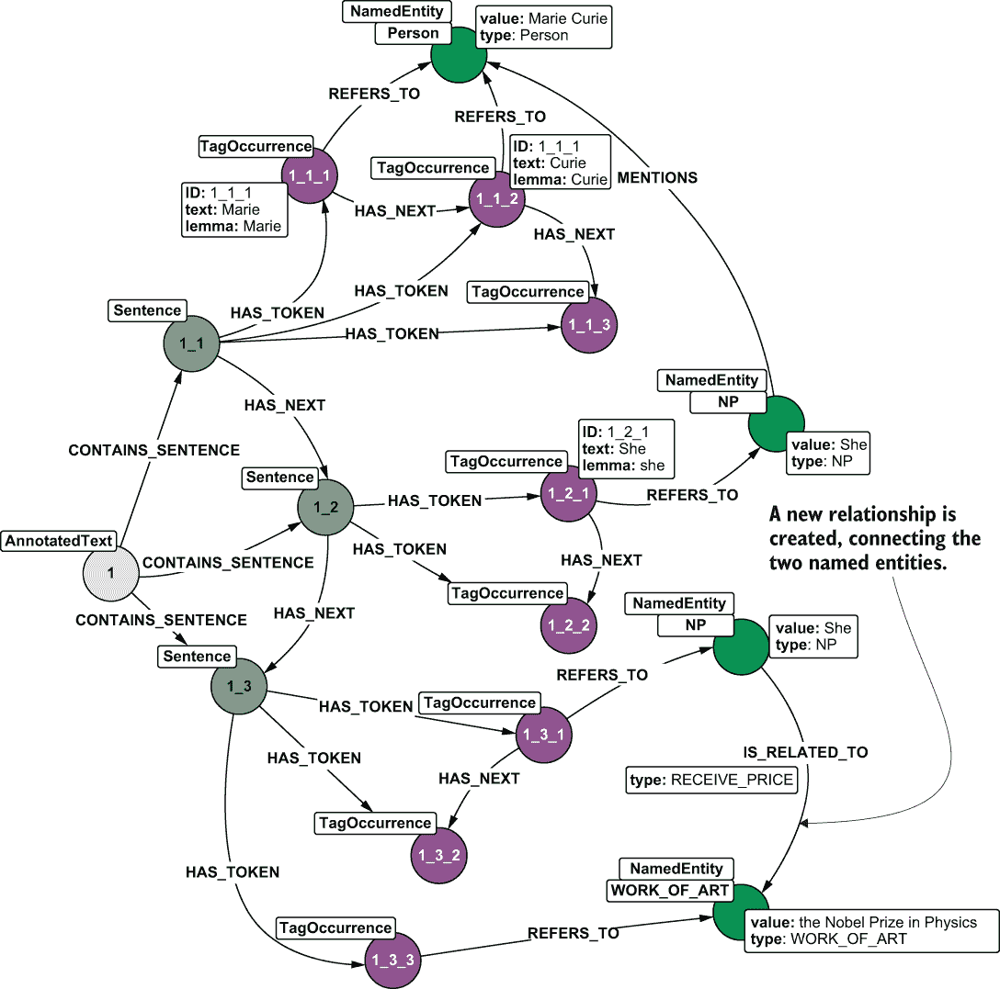

图 12.14 带有关系的扩展模型

以下列表展示了为了收集句法关系、将它们转换为感兴趣的关系并存储到我们的图模型中所需的更改。完整的代码位于 ch12/06_spacy_entity_relationship_extraction.py 和 ch12/text_processors.py 中。

列表 12.6 从类型依存关系提取关系

```
def tokenize_and_store(self, text, text_id, storeTag):
    docs = self.nlp.pipe([text])
    for doc in docs:
        annotated_text = self.__text_processor.create_annotated_text(doc, 
        ➥ text_id)
        spans = self.__text_processor.process_sentences(annotated_text, doc, 
        ➥ storeTag, text_id)
        nes = self.__text_processor.process_entities(spans, text_id)
        coref = self.__text_processor.process_co-reference(doc, text_id)
        self.__text_processor.build_inferred_graph(text_id)
        rules = [
            {
                'type': 'RECEIVE_PRIZE',
                'verbs': ['receive'],
                'subjectTypes': ['PERSON', 'NP'],
                'objectTypes': ['WORK_OF_ART']
            }
        ]                                                            ❶
        self.__text_processor.extract_relationships(text_id, rules)  ❷

def extract_relationships(self, document_id, rules):
    extract_relationships_query = """                                ❸
        MATCH (document:AnnotatedText)
        WHERE document.id = $documentId
        WITH document
        UNWIND $rules as rule
        MATCH (document)-[*2..2]->(verb:TagOccurrence {pos: "VBD"})
        MATCH (verb:TagOccurrence {pos: "VBD"})
        WHERE verb.lemma IN rule.verbs
        WITH verb, rule
        MATCH (verb)-[:IS_DEPENDENT {type:"nsubj"}]->(subject)-
        ➥ [:PARTICIPATES_IN]->(subjectNe:NamedEntity)
        WHERE subjectNe.type IN rule.subjectTypes
        MATCH (verb)-[:IS_DEPENDENT {type:"dobj"}]->(object)-
        ➥ [:PARTICIPATES_IN]->(objectNe:NamedEntity {type: "WORK_OF_ART"})
        WHERE objectNe.type IN rule.objectTypes
        WITH verb, subjectNe, objectNe, rule
        MERGE (subjectNe)-[:IS_RELATED_TO {root: verb.lemma, type: 
        ➥ rule.type}]->(objectNe)
    """

    self.execute_query(extract_relationships_query, {"documentId": 
    ➥ document_id, "rules":rules})
```

❶ 可能定义的可能规则示例

❷ 基于定义的规则从现有图中提取关系的步骤

❸ 查询通过图进行，导航 NE 和参与者标签之间的关系，并提取所需的关系。

如代码所示，将语义关系转换为感兴趣的关系的规则必须列出，但列举这些模式提出了双重问题：

+   语义关系可以通过多种方式表达，这使得单独列出模式难以获得良好的覆盖率。

+   这些规则可能无法捕捉到特定领域特定谓词所需的所有区别。例如，如果我们想收集关于军事攻击的文档，我们可能希望在关于冲突的文本中包括“strike”和“hit”的实例，但不包括在体育故事中。我们还可能要求某些论点是必需的，而其他论点则是可选的。

为了解决这些问题，可以使用其他机制。其中大部分方法都是监督式的，这意味着它们需要人类支持来学习。最常见的方法是基于分类器，它确定 NE 之间关系（或无关系）的类型。这可以通过使用不同的机器学习或深度学习算法来实现，但这样的分类器应该输入什么？

训练分类器需要一个标注了实体和关系的语料库。首先，我们在每个文档中标记实体；然后，对于句子中每一对实体，我们记录连接它们的关系的类型，或者记录它们之间没有关系。前者是正训练实例，后者是负训练实例。在训练了分类器之后，我们可以通过将其应用于同一句子中出现的所有实体提及对来提取新测试文档中的关系 [Grishman, 2015]。尽管这种方法有效，但它有一个与训练过程中所需数据量相关的重大缺点。

第三种方法结合了基于模式的方法和监督方法，使用基于模式的方法作为引导过程：关系自动从模式中推断出来，这些模式用于训练分类器。

无论您使用哪种方法来提取关系，当它们作为表示文本的知识图中 NE（命名实体）之间的连接存储时，可以将这些关系投影到之前讨论的推断知识图上。在这种情况下，关系应连接实体。

在模型的定义中，重要的是要记住，有必要追溯为什么创建了那种关系。一个问题是在今天大多数可用的图数据库中，包括 Neo4j，关系只能连接两个节点。但在这个情况下，我们希望连接更多，以追溯到关系的源头。这个问题有两个解决方案：

+   在关系中添加一些信息作为属性，这将使我们能够追溯两个实体之间连接的起源，例如表示连接的 NEs 的 ID 列表。

+   添加表示关系的节点。我们无法连接到关系，但这些关系节点将实体之间的连接具体化，我们将能够将它们连接到其他节点。

第一种方案在节点数量方面不那么冗长，但导航起来要复杂得多，这就是为什么提出的模式（图 12.15）遵循第二种方法。

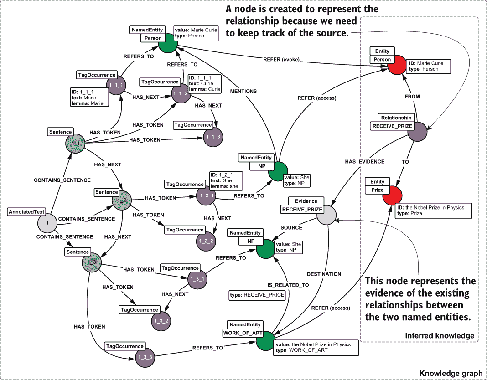

图 12.15 扩展的推断模式以包括关系

推断知识图的创建对图的可导航性和它支持的访问模式类型有很大影响。假设你已经处理了一个像我们例子中关于居里夫人的大量文本语料库，并且你想知道谁获得了诺贝尔物理学奖。

以下列表显示了如何扩展我们已有的代码，从文本中提取实体，并在推断的知识图中推断实体之间的关系。完整的代码在 ch12/text_processors.py 中，从 ch12/06_spacy_entity_relationship_extraction.py 中调用。

列表 12.7 从推断知识图中提取关系并将其存储

```
def build_relationships_inferred_graph(self, document_id):  ❶
    extract_relationships_query = """                       ❷
        MATCH (document:AnnotatedText)
        WHERE document.id = $documentId
        WITH document
        MATCH (document)-[*2..3]->(ne1:NamedEntity)
        MATCH (entity1:Entity)<-[:REFERS_TO]-(ne1:NamedEntity)-
        ➥ [r:IS_RELATED_TO]->(ne2:NamedEntity)-[:REFERS_TO]->
        ➥ (entity2:Entity)
        MERGE (evidence:Evidence {id: id(r), type:r.type})
        MERGE (rel:Relationship {id: id(r), type:r.type})
        MERGE (ne1)<-[:SOURCE]-(evidence)
        MERGE (ne2)<-[:DESTINATION]-(evidence)
        MERGE (rel)-[:HAS_EVIDENCE]->(evidence)
        MERGE (entity1)<-[:FROM]-(rel)
        MERGE (entity2)<-[:TO]-(rel)
    """
    self.execute_query(extract_relationships_query, {"documentId": 
    ➥ document_id})
```

❶ 提取推断知识图关系的新的步骤

❷ 查询提取在先前步骤中创建的关系列表，并在推断的知识图中创建证据和关系。

在此阶段，文本经过处理并按描述存储后，获取所需结果的查询将看起来如下。

列表 12.8 获取诺贝尔物理学奖获得者

```
MATCH (nodelPrize:Entity {type:"WORK_OF_ART"})<-[:TO]-(rel:Relationship 
➥ {type: "RECEIVE_PRIZE"})-[:FROM]->(winner:Entity {type: "PERSON"})
WHERE nodelPrize.id CONTAINS "the Nobel Prize in Physics"
RETURN winner
```

从 rel 节点，也可以找到所有使这种关系显而易见的文本。

我们构建的知识图以使原始内容在处理过的语料库中可用，并使多种类型的搜索和不同的访问模式及问答成为可能。当我们使用原始格式的文本时，大多数这些操作都是不可能的。识别 NEs 及其之间的关系使得查询成为可能，否则这些查询是不可能的，推断知识图创建了一个第二层，其中提炼的知识更容易导航。图是一个抽象，它代表了文本中的关键概念。

## 12.4 语义网络

我们迄今为止构建的知识图谱包含大量从文本中提取并转换为可用于使用的知识的信息。具体来说，推断出的知识图谱代表了在处理越来越多的文本时提取的浓缩知识。在此阶段，研究如何具体地使用这个知识图谱为最终用户提供新的高级服务是相关的。

知识图谱是在知识库之上构建的表示，其上可以构建多种类型的自动化推理和有趣的功能。知识表示和推理是符号人工智能的一个分支，旨在设计能够基于感兴趣领域的机器可解释表示进行推理（类似于人类）的计算机系统。在这个计算模型中，符号作为物理对象、事件、关系和其他领域实体的替身 [Sowa, 2000]。

表示此类知识库最常见的方法之一是使用*语义网络*——节点代表概念，弧代表这些概念之间关系的图。语义网络提供了关于感兴趣领域陈述的结构表示，或者“一种从自然语言中抽象出来的方法，以更适合计算的形式表示文本中捕获的知识” [Grimm et al., 2007]。

通常，概念被选择来表示此类文本中名词的意义，关系被映射到动词短语。让我们考虑我们之前使用的一个具体例子。句子

*玛丽·居里，这位著名的科学家，在 1903 年获得了诺贝尔物理学奖。*

应生成图 12.16 所示的语义网络。

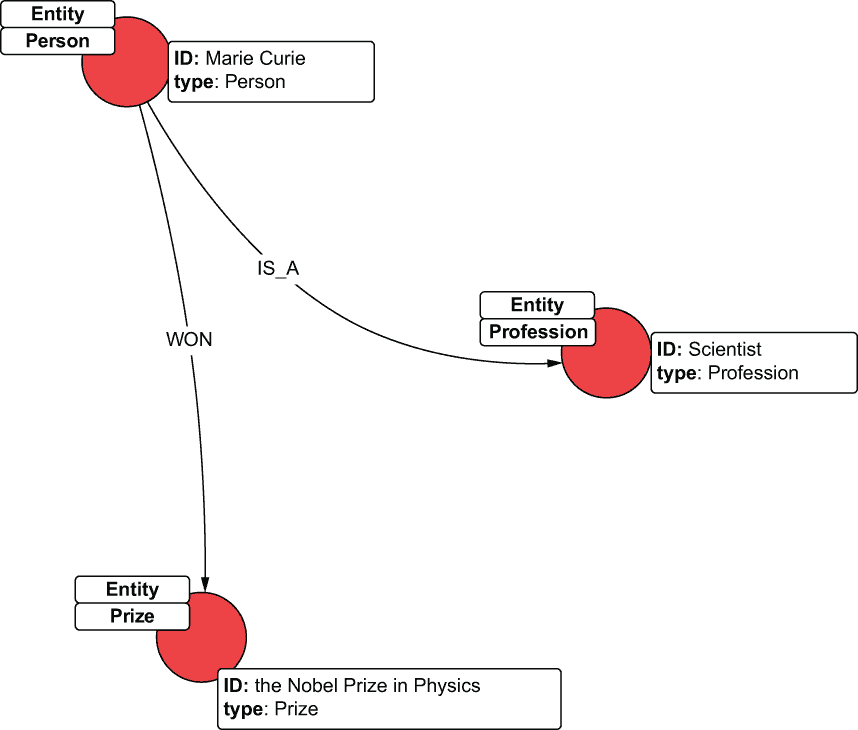

图 12.16 一个简单的语义网络

这个结构正是为推断出的知识图谱所创建的。唯一的区别是我们将关系实体化以跟踪来源，这在想要知道为什么创建这些关系时是必要的。因此，推断出的知识图谱是一个语义网络——因为在我们模式中，我们将关系实体化以跟踪每个推断关系的来源，这是一个简化的版本。

因此，在我们的心智图中，我们将从推断出的知识图谱中提取语义网络视为一个特定的过程（如图 12.17 所示），移除所有与关系映射到来源相关的开销，仅保留相关的概念和关系，例如通过考虑它们在原始语料库中出现的频率。

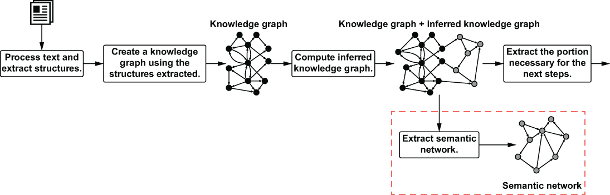

图 12.17 心智图：提取语义网络

语义网络的内容取决于与感兴趣领域和应用程序应提供的特定服务相关的概念和关系。在我们的案例中，语义网络是从当前的大图中提取的推断知识图谱。在这个过程中，可以稍微简化一下图，例如通过删除关系节点并用适当的关系来替换它们。

有时候，使用你拥有的语料库不足以构建一个能够满足所有需求的有效语义网络。幸运的是，存在可公开获取的通用语义网络。其中最广泛使用的是 ConceptNet 5⁵，其创造者将其描述为“一个知识表示项目，提供了一个大型语义图，描述了普遍的人类知识和它在自然语言中的表达方式” [Speer and Havasi, 2013]。图中表示的知识来自各种来源，包括专家创建的资源、众包和游戏。ConceptNet 的目标是通过使它们能够更好地理解人们使用词语背后的含义来改善自然语言应用[Speer et al., 2017]。图 12.18，来自网站，展示了它是如何工作的。


图 12.18 ConceptNet 5 如其在网站上的描述

ConceptNet 5 API 的使用非常简单。例如，如果你想了解更多关于玛丽·居里的信息，你可以调用以下 URL

```
http://api.conceptnet.io/c/en/marie_curie/
```

并得到以下答案：

```
{
    "@id": "/a/[/r/Synonym/,/c/en/marie_curie/n/wn/person/,
    ➥ /c/en/marya_sklodowska/n/wn/person/]",
    "@type": "Edge",
    "dataset": "/d/wordnet/3.1",
    "end": {
        "@id": "/c/en/marya_sklodowska/n/wn/person",
        "@type": "Node",
        "label": "Marya Sklodowska",
        "language": "en",
        "sense_label": "n, person",
        "term": "/c/en/marya_sklodowska"
    },
    "license": "cc:by/4.0",
    "rel": {
        "@id": "/r/Synonym",
        "@type": "Relation",
        "label": "Synonym"
    },
    "sources": [
        {
            "@id": "/s/resource/wordnet/rdf/3.1",
            "@type": "Source",
            "contributor": "/s/resource/wordnet/rdf/3.1"
        }
    ],
    "start": {
        "@id": "/c/en/marie_curie/n/wn/person",
        "@type": "Node",
        "label": "Marie Curie",
        "language": "en",
        "sense_label": "n, person",
        "term": "/c/en/marie_curie"
    },
    "surfaceText": "[[Marie Curie]] is a synonym of [[Marya Sklodowska]]",
    "weight": 2.0
}
```

这个答案立即告诉你玛丽·居里的另一个名字是玛丽亚·斯克洛多夫斯卡。

在这一章的这个点上研究 ConceptNet 有几个原因：

+   它是以与文本中描述的完全相同的方式创建的，这验证了我们迄今为止的路径。如图 12.18 中的架构所示，它集成了所有关键概念：知识图谱、语义网络、人工智能、自然语言处理等等。

+   如果你没有足够的信息在你的语料库中构建一个适当的知识图谱，而你参考的领域是一个常见的领域，你可以使用 ConceptNet 来填补空白。如果你正在处理来自在线来源的新闻文章，并且你只得到文本中的城市名称，例如“洛杉矶”，你可以查询 ConceptNet 来找到这些城市所在的州（在这种情况下，“加利福尼亚”）。⁶

+   我喜欢它。这是一个理解文本和扩展知识图谱的好资源，我在很多项目中经常使用它。它简单易用，免费，而且相当快：为了获得最佳速度，你可以下载它，或者更好的是，将其导入 Neo4j 实例中。

图 12.19，来自 Speer 和 Havasi [2013]的论文，介绍了 ConceptNet 的最新迭代，描述了主要关系及其如何连接文本中的不同组件。它清楚地表明，这种方法与本书中提出的方法相似。在此图中，*NP*代表*名词短语*，*VP*代表*动词短语*，*AP*代表*形容词短语*。


图 12.19 来自 Speer 和 Havasi [2013]的表格，展示了 ConceptNet 5 中哪些关键关系是可用的

通过 Python 访问 ConceptNet 5 非常简单，如下面的列表所示。你可以使用 requests 库来获取内容。

列表 12.9 通过 Python 访问 ConceptNet

```
import requests

obj = requests.get('http://api.conceptnet.io/c/en/marie_curie').json()
print(obj['edges'][0]['rel']['label'] + ": " + 
➥ obj['edges'][0]['end']['label'])
```

练习

在列表 12.9 中的代码上稍作实验，以查看不同的处理结果。这里给出的示例只是一个建议。

## 12.5 无监督关键词提取

命名实体识别（NER）并不是识别文本中关键元素的唯一方法。任何文本都有一些特定的单词和短语——并不总是与命名实体（NEs）相关——它们比其他单词和短语更重要，因为它们表达了与整个文档、段落或句子内容相关的关键概念。这些单词和短语通常被称为*关键词*，它们在处理大型语料库时提供了巨大的支持。

任何规模的公司都必须管理和访问大量数据，以向最终用户提供高级服务或处理其内部流程。这些数据的大部分通常以文本的形式存储。处理和分析这一巨大知识来源的能力代表了一种竞争优势，但通常，由于文本数据的非结构化性质和问题规模，即使提供简单有效的访问也是一个复杂任务。

假设你希望通过识别主要概念、组织索引和提供适当的可视化来有效地访问大量文档（电子邮件、网页、文章等）。*关键词提取*——识别和选择最能描述文档的单词和小短语的过程——对于这项任务至关重要。除了构成构建语料库索引的有用条目外，你提取的关键词还可以用于对文本进行分类，在某些情况下还可以作为给定文档的简单摘要。用于自动识别文本中重要术语的系统可用于多种目的，例如

+   识别训练好的 NER 模型无法识别的命名实体

+   创建特定领域的词典（在这种情况下，也使用提取的 NEs）

+   通过频繁和重复的关键词以及与实体的连接扩展推断出的知识图谱

+   创建索引并使用关键术语在用户查找特定关键词时提升结果

关键词在构建知识图谱的过程中起着重要作用，提高了最终结果的质量（从知识和访问模式的角度来看）。那么，如何获取它们呢？当使用本节讨论的无监督技术时，关键词提取的任务甚至不需要人工支持！

本节描述了一种用于关键词提取 7 的方法，该方法使用一个表示文档中标签或概念之间关系的图模型。解决方案从基于图的无监督技术 TextRank 开始。此后，通过使用类型依赖图和其他技巧（用于过滤掉无意义的短语，或用形容词和名词扩展关键词以更好地描述文本）大大提高了提取关键词的质量。值得注意的是，尽管提出的方法是无监督的，但最终结果的质量与监督方法达到的质量相当。本书中偏好使用此算法有几个原因：

+   它完全基于我们之前讨论过的图技术和算法，例如 PageRank。

+   它使用了我们在第十一章中详细分析的句法依赖关系。

+   结果的质量非常出色，即使与监督算法相比也是如此。

Mihalcea 和 Tarau 于 2004 年提出的 TextRank 算法是一种相对简单的无监督文本摘要方法，它可以直接应用于主题提取任务。其目标是通过对单词共现构建图并使用 PageRank 算法对单个单词的重要性进行排序，检索关键词并构建最能描述给定文档的关键短语。图 12.20 显示了这种共现图是如何创建的。

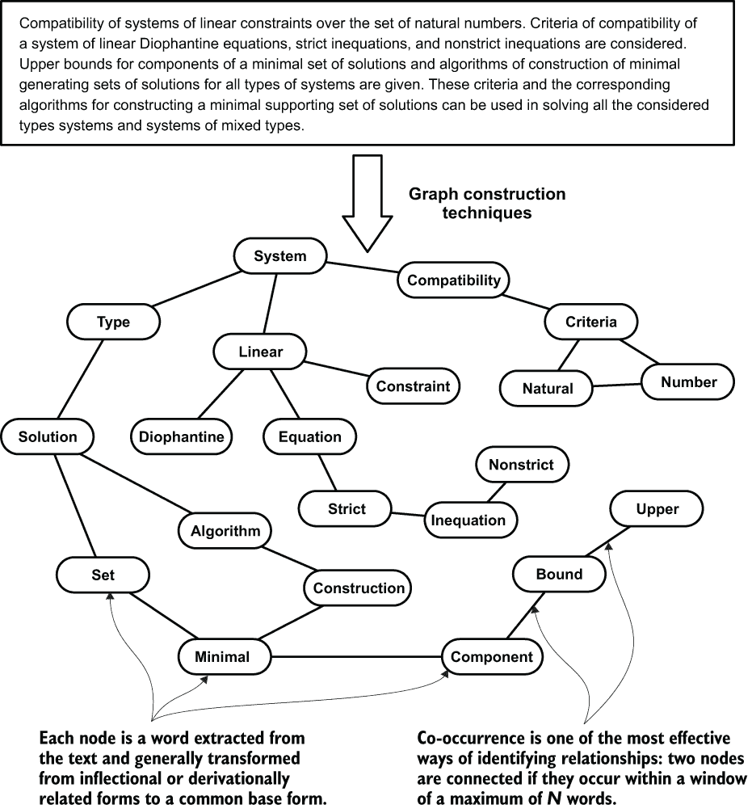

图 12.20 TextRank 的关键概念：将文本转换为共现图

Mihalcea 和 Tarau 提出的算法结构总结在图 12.21 中。

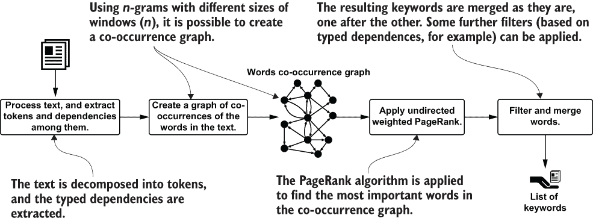

图 12.21 TextRank 算法的关键步骤

算法的关键步骤如下：

1.  从 NLP 标注文本中预选相关词汇。每个文档都被分词并标注。这些处理过的词汇是基本的词汇单位，或称为标签。应用一个可配置的停用词列表和句法过滤器来细化选择，以获得最相关的词汇单位。句法过滤器仅选择名词和形容词，遵循 Mihalcea 和 Tarau 的观察，即即使是人工标注者也倾向于使用名词而不是动词短语来总结文档。

1.  *创建标签共现的图*。过滤后的标签根据它们在文档中的位置排序，并在相邻标签之间建立共现关系，遵循文本中的自然词流。这一步将文档的句法元素之间的关系引入到图中。默认情况下，只有相邻出现的标签才能有共现关系。在句子“Pieter eats fish”中，没有创建共现边，因为“eats”是一个没有通过句法过滤的动词。但如果将共现窗口的大小从默认的 2 改为 3，则“Pieter”和“fish”将连接起来。最后，每个共现边都分配一个权重属性，表示两个标签在给定文档中共现的次数。此时得到的图看起来像图 12.20。

1.  *运行无向加权 PageRank*。在加权共现关系上运行无向 PageRank 算法，根据节点（标签）在图中的重要性对它们进行评分。无加权 PageRank 的实验表明，权重对于将重要关键词提前是有用的。

1.  *将前三分之一的标签保存为关键词并识别关键短语*。标签根据 PageRank 评分排序；然后取前三分之一（可配置）作为最终关键词。如果这些选定的标签中的一些是相邻的，它们将被合并成一个关键短语。

在这个过程结束时，通过关键词节点和 AnnotatedText 节点之间的 DESCRIBES 关系，将识别出的关键词和关键短语保存到图数据库中。得到的图将类似于图 12.22。

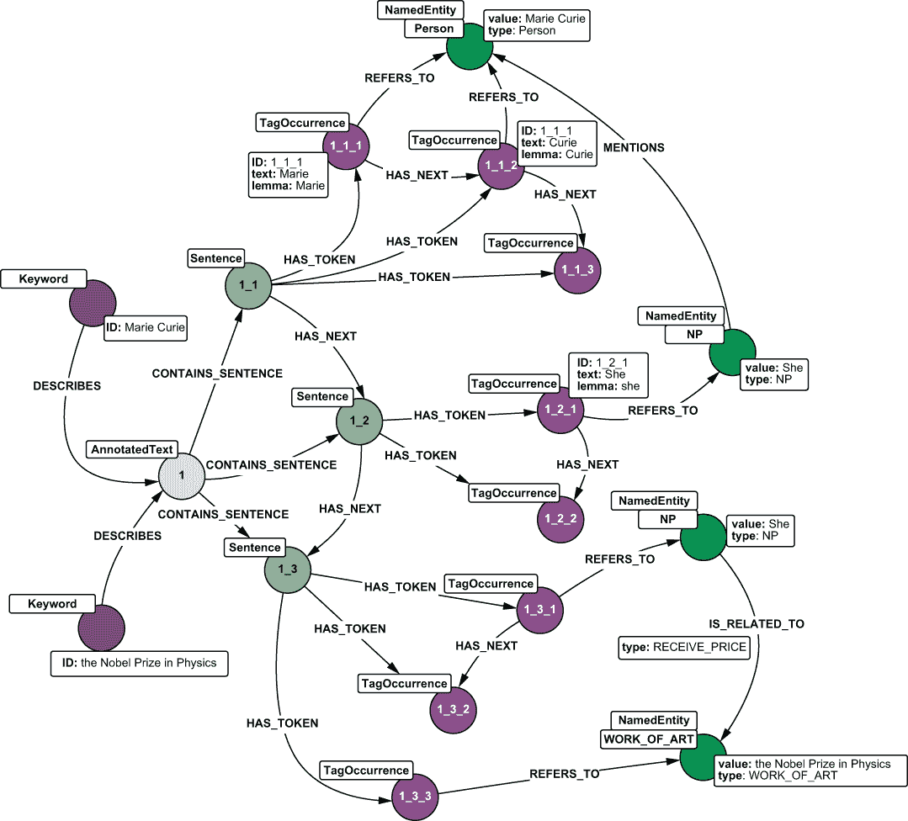

图 12.22 带有关键词扩展的图模型

从包含迄今为止描述的所有算法和技术的新版本代码开始，以下列表显示了如何将这个新算法添加到我们不断增长的项目中。完整代码位于 ch12/text_processors.py 和 ch12/08_spacy_textrank_extraction.py。

列表 12.10 应用 TextRank

```
def tokenize_and_store(self, text, text_id, storeTag):
    docs = self.nlp.pipe([text])
    for doc in docs:
        annotated_text = self.__text_processor.create_annotated_text(doc,  
        ➥ text_id)
        spans = self.__text_processor.process_sentences(annotated_text, doc, 
        ➥ storeTag, text_id)
        self.__text_processor.process_entities(spans, text_id)
        self.__text_processor.process_textrank(doc, text_id)      ❶

def process_textrank(self, doc, text_id):                         ❷
    keywords = []
    spans = []
    for p in doc._.phrases:
        for span in p.chunks:                                     ❸
            item = {"span": span, "rank": p.rank}
            spans.append(item)
    spans = filter_extended_spans(spans)                          ❹
    for item in spans:
        span = item['span'
        lexme = self.nlp.vocab[span.text];
        if lexme.is_stop or lexme.is_digit or lexme.is_bracket or "-PRON-" in 
        ➥ span.lemma_:
            continue

        keyword = {"id": span.text, "start_index": span.start_char, 
        ➥ "end_index": span.end_char}
        if len(span.ents) > 0:
            keyword['NE'] = span.ents[0].label_
        keyword['rank'] = item['rank']
        keywords.append(keyword)
    self.store_keywords(text_id, keywords)

def store_keywords(self, document_id, keywords):
    ne_query = """                                                ❺
        UNWIND $keywords as keyword
        MERGE (kw:Keyword {id: keyword.id})
        SET kw.NE = keyword.NE, kw.index = keyword.start_index, kw.endIndex = 
        ➥ keyword.end_index
        WITH kw, keyword
        MATCH (text:AnnotatedText)
        WHERE text.id = $documentId
        MERGE (text)<-[:DESCRIBES {rank: keyword.rank}]-(kw)
    """
    self.execute_query(ne_query, {"documentId": document_id, "keywords": 
    ➥ keywords})
```

❶ 添加提取关键词的新步骤

❷ 该函数处理注释文档，识别关键词并将它们存储起来。

❸ 在文档中找到的关键词循环，称为块

❹ 过滤重叠的关键词并取最长的那个

❺ 创建新的关键词节点并将它们通过 DESCRIBES 关系连接到文档

上一段代码使用了 spaCy 的一个现有插件，名为 pytextrank，⁸，它正确地实现了 TextRank 算法。对于这个句子，

*委员会将诺贝尔物理学奖授予玛丽·居里*。

它返回以下关键词列表（括号中的数字是 TextRank 算法分配的排名）：

+   委员会（0.15）

+   玛丽·居里（0.20）

+   诺贝尔物理学奖（0.14）

还不错，尤其是考虑到我们只处理一个句子。TextRank 在较长的文档上表现更好，因为它可以考虑到特定单词出现的频率。

使用 TextRank 获得的初始结果相当有希望，但可以通过使用更多关于文本的见解来提高质量。在 GraphAware，我们还实现了一个 TextRank 算法，可在我们的开源 NLP 插件 Neo4j 中使用。⁹ 基本算法已被修改，以利用 Stanford CoreNLP 提供的类型化依赖关系图。

为了提高自动关键词提取的质量，扩展算法考虑了类型化的依赖关系*amod*和*nn*。一个名词短语（NP）的形容词修饰语（*amod*）是指任何用于修饰 NP 意义的形容词短语：

```
"Sam eats red meat" -> amod(meat, red)
"Sam took out a 3 million dollar loan" -> amod(loan, dollar)
"Sam took out a $ 3 million loan" -> amod(loan, $)
```

一个名词复合修饰语（*nn*）是指任何用于修饰中心名词的名词：

```
"Oil price futures" -> nn(futures, oil), nn(futures, price)
```

这些类型化的依赖关系可以用来改进 TextRank 算法的结果。考虑一个具体的例子。以下关键短语是通过使用标准方法由 TextRank 提取的：

```
personal protective
```

显然，这个短语没有意义，因为两个词都是形容词；缺少一个名词。在这种情况下，名词是*装备*。这种遗漏可能是因为该名词在考虑的文档中的排名低于三分之一的最顶部单词的阈值，并且在合并过程中，这些单词被忽略。因此，讨论相同主题——“*个人防护装备*”——的文档没有被分配任何共同的关键短语。

在这种情况下，amod 依赖关系可以帮助。在文本“个人防护装备”中，三个词之间存在 amod 依赖关系：

```
amod(equipment, personal)
amod(equipment, protective)
```

指定这些依赖关系意味着在合并阶段我们还需要考虑“装备”，因为它与出现在结果顶部三分之一的单词相关联。类型化依赖关系不仅可以用以补充缺少标签的现有关键短语，还可以删除没有 COMPOUND 或 amod 类型相互关系的短语。因此，改进的 TextRank 算法引入了两个新的原则：

+   关键短语候选中的所有标签都必须通过 COMPOUND 或 amod 依赖关系相关联。

+   如果一个相邻的标签由于排名不够高而没有被原始 TextRank 算法包含在关键短语中，但它通过 COMPOUND 或 amod 类型的依赖关系与一个或多个得分最高的词相关联，那么这个标签将被添加。

后者原则负责处理之前提到的缺点，并增加了更高的细节级别。

通过这些小的变化（以及这里未提及的几个其他变化，例如基于标签词性的后过滤或考虑 NEs 等），得到的结果类似于许多人类标注者用来描述给定文档的关键短语。

由于其高精度，关键词提取支持不同类型的分析，可以揭示关于语料库的大量信息。提取的关键词可以用不同的方式来发现关于语料库中文档的新见解，包括提供索引或甚至文档内容的摘要。

为了证明这一概念，让我们尝试使用维基百科电影情节数据集。¹⁰ 该数据集包含来自世界各地的 34,886 部电影描述，包括它们情节的摘要。您可以使用 ch12/08_spacy_textrank_ extraction.py 中的代码导入完整的数据集。由于数据集很大，处理和存储结果将需要一些时间。然后，您可以使用以下查询获取最频繁的关键词列表。

列表 12.11 获取 100 个最频繁关键词的列表

```
MATCH (n:Keyword)-[:DESCRIBES]->(text:AnnotatedText)
RETURN n.id as keywords, count(n) as occurrences
order by occurrences desc
limit 100
```

结果如图 12.23 所示。

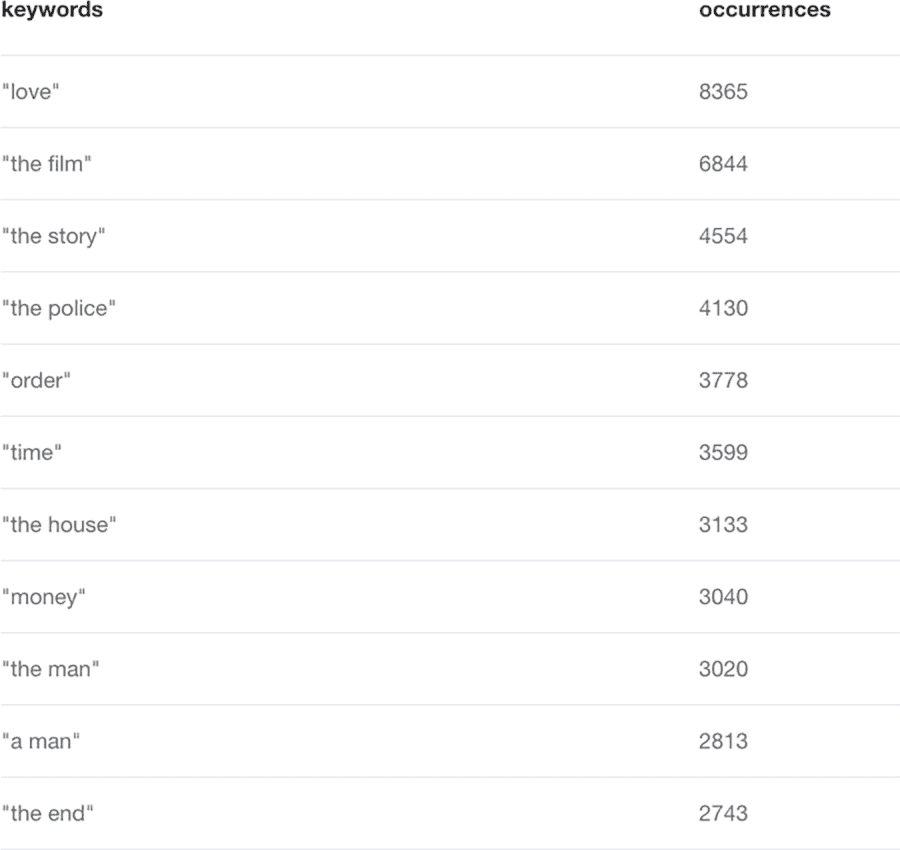

图 12.23 执行列表 12.11 在数据库上的结果

即使是考虑语料库中关键词出现次数的这样一个简单查询，我们也能从数据集的内容中提取出大量信息：

+   *主要*主题是“love”，这在许多情节摘要中作为关键词出现。这一事实可能反映了浪漫作为主题的统治地位以及用户对所描述电影的热情。

+   *“film”* 和 “*story*” 这些术语出现得相当频繁，这是可以预料的，因为它们在描述电影情节时被广泛使用。

+   第二常见的关键词是“*police*”，这表明关于犯罪的电影相当常见。

+   另一个有趣的观察是，“man”似乎作为情节的关键组成部分出现得更为频繁；“*woman*”在排名中则要低得多。

这个简单的例子让您了解，仅通过考虑关键词，就可以从语料库中提取出多少信息。在 12.5.1 节中，我们将进一步发展这一想法，但首先考虑以下练习。

练习

在数据集上玩耍，不仅使用关键词，还要使用从文本中提取的 NE（命名实体）。通过使用 NamedEntity 节点而不是 Keyword 节点执行相同的查询。（注意，这并不是您在查询中必须做出的唯一更改。）您可以从数据中得出哪些观察？

### 12.5.1 关键词共现图

关键词本身提供了大量的知识，但通过考虑它们的组合，我们可以进一步扩展它们的价值。通过考虑它们共同出现的文档，关键词可以通过关系连接起来。这种方法生成了一个关键词共现图（其中我们只有关键词类型的节点以及它们之间的连接）。

共现图的概念已被用作在其他场景中（特别是推荐章节）构建图的技巧。生成的图充满了可用于分析原始图本身的信息。在我们考虑的情况中——关键词——这个图将看起来像图 12.24。

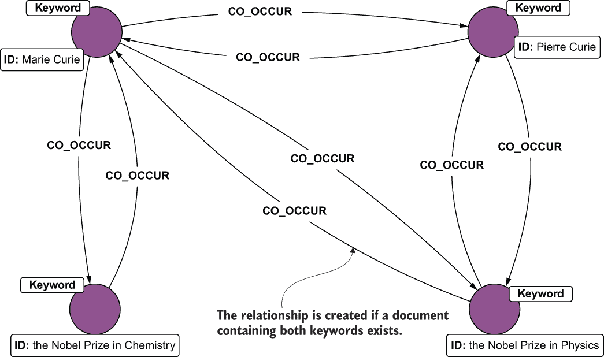

图 12.24 关键词共现图

通过在原始图上运行特定查询可以获得这样的图。再次强调，图以及可用的插件和库允许你避免为重复性任务编写代码。在以下示例中，我们使用的是已经广泛使用的 APOC 库。

列表 12.12 创建共现图

```
CALL apoc.periodic.submit('CreateCoOccurrence',                ❶
'CALL apoc.periodic.iterate("MATCH (k:Keyword)-[:DESCRIBES]->
➥ (text:AnnotatedText)
WITH k, count(DISTINCT text) AS keyWeight
WHERE keyWeight > 5
RETURN k, keyWeight",
"MATCH (k)-[:DESCRIBES]->(text)<-[:DESCRIBES]-(k2:Keyword)
WHERE k <> k2
WITH k, k2, count(DISTINCT text) AS weight, keyWeight
WHERE weight > 10
WITH k, k2, k.value as kValue, k2.value as k2Value, weight, 
➥ (1.0f*weight)/keyWeight  as normalizedWeight
CREATE (k)-[:CO_OCCUR {weight: weight, normalizedWeight: normalizedWeight}]->
➥ (k2)", {batchSize:100, iterateList:true, parallel:false})')
```

❶ 根据图的大小，此操作可能需要很长时间。因此，我使用了 apoc.periodic.submit，因为它允许你将以下查询作为后台作业提交。你可以通过使用“CALL apoc.periodic.list()”来检查状态。

在这个查询中，请注意提交过程和迭代过程的组合，这导致查询在后台执行，与浏览器请求断开连接，并且允许你定期提交结果以避免单个大事务。你可以通过使用“CALL apoc.periodic.list”来检查后台作业的状态。

注意，我们正在过滤掉不相关的关键词（那些出现次数少于 5 次的关键词，如 WHERE keyWeight > 5 所指定的）并且只有当关键词对至少一起出现 10 次时（WHERE weight > 10）我们才考虑这些连接。这种方法使我们能够创建一个合适的共现图，其中相关信息更加明显。

练习

当查询完成后，通过检查关键词的连接来探索结果知识图。你会注意到图要密集得多。

### 12.5.2 关键词聚类和主题识别

共现图包含大量可用于从文本中提取知识的新信息。在我们的案例中，目标是提取处理过的文本（情节摘要）的见解。我们已经使用关键词频率来获取关于我们数据集内容的一些见解，但通过关键词共现图，我们将能够更好地识别文档中的主题。图 12.25 提供了获取主题列表所需步骤的概述。

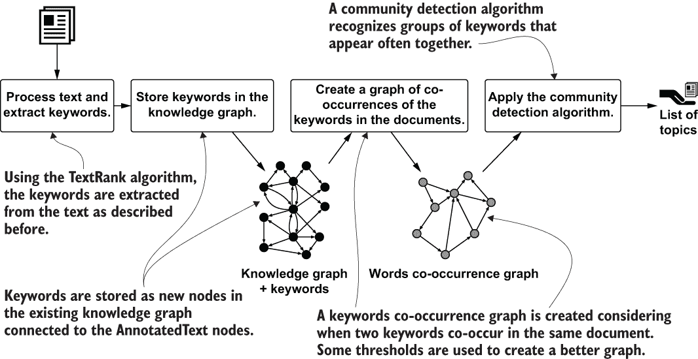

图 12.25 使用关键词提取和社区检测提取主题的步骤

共现图连接了在同一图中一起出现的关键词，因此它能够将多个关键词聚合到代表相同类型电影的组中。至少，我们希望证明这个想法。我们用于创建共现图的过滤器（相关关键词和相关连接）在这个阶段是有帮助的，因为它们很好地隔离了共现图中的关键词。

在第十章中，我介绍了一种识别社交网络中人群社区的方法：Louvain 算法。该算法在识别聚类方面表现出高度的准确性以及高速率。这种方法也可以应用于共现图，以查看哪些关键词聚类是最相关的。

在这种情况下，为了简化运行 Louvain 算法的查询，我们将操作分为两部分。第一个查询创建了一个虚拟图，我们只指定我们感兴趣的图的部分：共现图。（记住，我们确实拥有完整的知识图谱！）这样，我们可以指定在哪里执行社区检测算法，忽略所有其他部分。

列表 12.13 在知识图谱中创建虚拟图

```
CALL gds.graph.create(
    'keywordsGraph',
    'Keyword',
    {
        CO_OCCUR: {
            orientation: 'NATURAL'
        }
    },
    {
        relationshipProperties: 'normalizedWeight'
    }
)
```

拥有表示仅包含共现图的虚拟图后，可以使用以下简单查询运行 Louvain 算法。

列表 12.14 通过 Louvain 揭示社区

```
CALL gds.louvain.write('keywordsGraph', {
    relationshipWeightProperty: 'normalizedWeight',
    writeProperty: 'community'
}) YIELD nodePropertiesWritten,  communityCount, modularity
RETURN nodePropertiesWritten,  communityCount, modularity
```

由于在第十章中讨论过，这个算法性能惊人，Neo4j 实现高度优化，因此这个查询应该相当快。每个关键词分配的社区作为相关节点中的社区属性保存；它包含社区的标识符。在这个过程结束时，可以使用以下查询来探索结果。

列表 12.15 获取社区和每个社区的顶级 25 个关键词

```
MATCH (k:Keyword)-[:DESCRIBES]->(text:AnnotatedText)
WITH k, count(text) as weight
WHERE weight > 5
with k.community as community, k.id as keyword, weight
order by community, weight desc
WITH community, collect(keyword) as communityMembers
order by size(communityMembers) desc
RETURN community as communityId, communityMembers[0..25] as topMembers, 
➥ size(communityMembers) as size
```

查询首先根据社区（由社区标识符，communityId）和频率对关键词进行排序，然后按社区标识符分组，并只取每个社区的顶级 25 个关键词（由于它们的频率而最相关）。社区的大小用于对最终结果进行排序，这些结果在图 12.26 中显示。它们可能会让你感到惊讶！

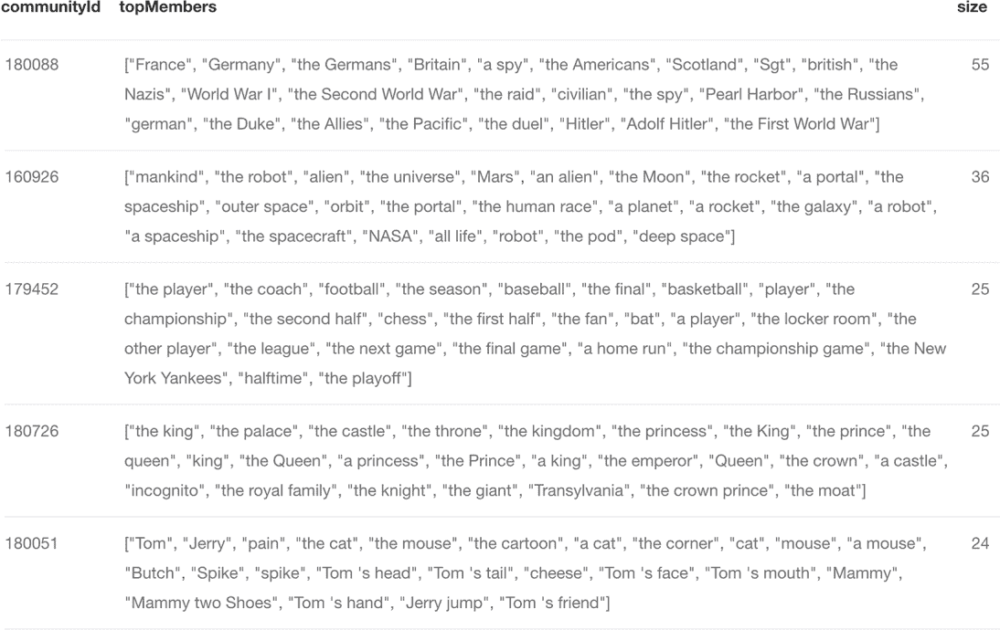

图 12.26 应用在共现图上的社区检测算法的结果

这个例子只是一个摘录，但它清楚地展示了结果的质量。在每一个簇中，很容易识别主题：关于世界大战的电影、科幻电影、与体育相关的电影、中世纪电影，最后是汤姆和杰瑞电影。

练习

运行列表 12.15，并探索完整的结果列表。你能否识别所有结果的主题？

## 12.6 图方法的优势

本章提出的解决方案——知识图谱——不能存在于图模型之外，因此我们实际上无法谈论图方法相对于其他可用方法的优点。但是，正如你所看到的，以图的形式表示数据和信息通过使探索数据中隐藏的知识变得容易，从而赋予了一系列解决方案和服务。这种方法是提供 AI 解决方案的最佳方式。

特别是，知识图谱是表示文本格式数据的自然方式，通常被认为是非结构化的，因此难以处理。当数据以这种方式存储时，可以从中提取的知识量和可以对数据进行的分析类型是无限的。

我们看到如何在提取的关系或提及之间导航是多么简单，如何在语义网络中创建概念层次，以及如何使用共现图中的自动关键词提取从我们的数据集中的电影情节中提取主题。这些概念同样适用于任何其他类型的语料库。

## 摘要

本章是本书的最后一章；其目的是展示本书中提出的内容如何在知识图谱中达到顶峰。在这种情况下，图不是可能的解决方案，而是驱动力，它允许信息结构化、访问模式以及类型分析和操作，这些在其他情况下是不可行的。

结构化和非结构化数据和信息可以共存于这种强大的知识表示中，这可以用来为你的机器学习项目提供比其他情况下更多的先进服务。语义网络开辟了一整系列新的可能性。

在本章中，你学习了

+   如何从文本中提取命名实体（NEs）并将其适当地存储在图模型中

+   如何从命名实体（NEs）中提取关系并在图中对其进行建模

+   如何从文本的不同实例中推断关键实体和关系，并创建一个强大的知识表示：语义网络

+   如何使用基于图的算法以无监督的方式从文本中提取关键词并将它们存储在你创建的知识图谱中

+   如何创建关键词共现图并对其进行处理

+   如何仅使用图技术识别语料库中的关键主题

我想以这样的说法结束：这本书不是你旅程的终点——只是新旅程的开始。现在你有了在许多情况下正确使用图的主要概念工具。当然，这本书不可能回答你关于图可能有的所有问题，但我希望它已经为你提供了必要的心理模式，以便从不同的角度接近机器学习项目。

## 参考文献

[Gomez-Perez et al., 2017] Gomez-Perez, Jose Manuel, Jeff Z. Pan, Guido Vetere, 和 Honghan Wu. “企业知识图谱：简介.” 在 *Exploiting Linked Data and Knowledge Graphs in Large Organisations* 中. 瑞士：Springer, 2017: 1-14.

[Grishman, 2015] Grishman, Ralph. “信息提取.” *IEEE Intelligent Systems* 30:5 (2015): 8-15.

[Grishman and Sundheim, 1996] Grishman, Ralph, 和 Beth Sundheim. “消息理解会议 - 6：简史.” *第 16 届国际计算语言学会议论文集* (1996): 466-471.

[Grimm et al., 2007] Grimm, Stephan, Pascal Hitzler, 和 Andreas Abecker. “知识表示和本体.” 在 *Semantic Web Services: Concepts, Technology and Applications* 中. 柏林，海德堡：Springer, 2007: 51-106.

[Jurafsky 和 Martin，2019] Jurafsky, Dan, 和 James H. Martin. *语音和语言处理：自然语言处理、计算语言学和语音识别导论*. 新泽西州上萨德尔河：Prentice Hall，2019（第 3 版草案，可在 [`web.stanford.edu/~jurafsky/slp3`](https://web.stanford.edu/~jurafsky/slp3/) 获取）.

[Karttunen，1969] Karttunen, Lauri. “话语指称.” *第 1969 年计算语言学会议论文集* (1969): 1-38.

[Mihalcea 和 Radev，2011] Mihalcea, Rada, 和 Dragomir Radev. *基于图的自然语言处理和信息检索*. 纽约：剑桥大学出版社，2011.

[Mihalcea 和 Tarau，2004] Mihalcea, Rada, 和 Paul Tarau. 2004 年 7 月. “TextRank: 将秩序带入文本.” *自然语言处理实证方法会议论文集* (2004): 404-411.

[Ng，2009] Ng, Vincent. 2009. “基于图割的共指消解指代性确定.” *人语言技术会议：北美计算语言学协会分会会议* (2009): 575-583.

[Nicolae 和 Nicolae，2006] Nicolae, Cristina, 和 Gabriel Nicolae. “BESTCUT: 用于共指消解的图算法.” *第 2006 年自然语言处理实证方法会议论文集* (2006): 275-283.

[RDF 工作组，2004] “RDF 入门：W3C 建议书，2004 年 2 月 10 日.” [`www.w3.org/TR/rdf-primer`](https://www.w3.org/TR/rdf-primer/).

[Sowa，2000] Sowa, John F. *知识表示：逻辑、哲学和计算基础*. 加利福尼亚州太平洋 Grove: Brooks Cole, 2000.

[Speer 和 Havasi，2013] Speer, Robyn, 和 Catherine Havasi. “ConceptNet 5: 一个大型语义关系知识网络.” 见 Iryna Gurevych 和 Jungi Kim 编著的 *人民的网络与自然语言处理：协作构建的语言资源*. 柏林，海德堡：Springer，2013: 161-176.

[Speer 等人，2017] Speer, Robyn, Joshua Chin, 和 Catherine Havasi. “ConceptNet 5.5: 一个开放的多语言通用知识图.” *第 31 届 AAAI 人工智能会议论文集* (2017): 4444-4451.

* * *

^（1.）[`mng.bz/gxDE`](https://shortener.manning.com/gxDE).

^（2.）[`mng.bz/eMjv`](https://shortener.manning.com/eMjv).

^（3.）[`explosion.ai/demos/displacy-ent`](https://explosion.ai/demos/displacy-ent).

^（4.）[`spacy.io/usage`](https://spacy.io/usage).

^（5.）[`conceptnet.io`](http://conceptnet.io).

^（6.）在此示例中，要使用的查询是 [`api.conceptnet.io/query?start=/c/en/los_angeles&rel=/r/PartOf`](http://api.conceptnet.io/query?start=/c/en/los_angeles&rel=/r/PartOf).

^（7.）[`mng.bz/pJD8`](https://shortener.manning.com/pJD8).

^（8.）[`github.com/DerwenAI/pytextrank`](https://github.com/DerwenAI/pytextrank).

^（9.）[`github.com/graphaware/neo4j-nlp`](https://github.com/graphaware/neo4j-nlp).

^（10.）[`mng.bz/O1jR`](https://shortener.manning.com/O1jR).
