# 附录 B. Neo4j

在本书中，示例、代码和练习都是基于特定的图数据库：Neo4j。尽管如此，所有的理论、算法甚至代码都可以轻松地适应与市场上现在和（在良好近似下）将来的任何图数据库一起工作。我选择这个数据库是因为

+   我过去 10 年一直在使用这个数据库（并且对其了如指掌）。

+   它是一个原生的图数据库（它带来的所有后果，如本书中所述）。

+   它拥有广泛的专家社区。

根据 DB-Engines 的数据，Neo4j 已经连续几年是最受欢迎的图数据库管理系统（DBMS）([`mng.bz/YAMB`](https://shortener.manning.com/YAMB); 图 B.1)。¹

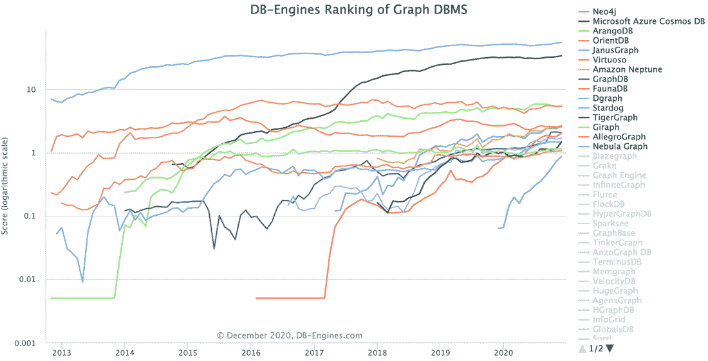

图 B.1 图数据库管理系统（DBMS）的 DB-Engines 排名

本附录包含启动 Neo4j 所需的最基本信息，包括对 Neo4j 的通用介绍、安装说明、Cypher 语言（用于查询数据库的语言）的描述，以及示例中使用的某些插件的配置。

## B.1 Neo4j 简介

Neo4j 作为 GPL3 许可的开源社区版提供。Neo4j Inc.还根据封闭源代码的商业条款，以企业级功能（包括备份、扩展和其它企业级特性）许可企业版。Neo4j 是用 Java 实现的，可以通过事务 HTTP 端点或二进制 Bolt 协议在网络中访问。² 我们将在本书中使用 Neo4j 作为我们的图数据库参考实现。

Neo4j 因其以下原因被广泛采用：

+   它实现了带标签的属性图数据库。³

+   它使用基于无索引邻接的原生图存储。⁴

+   它提供了原生的图查询和相关语言 Cypher⁵，该语言定义了图数据库如何描述、计划、优化和执行查询。

+   每个架构层——从使用 Cypher 的查询到磁盘上的文件——都针对存储和检索图数据进行了优化。

+   它提供了一个易于使用的开发者工作台，带有图可视化界面。

Neo4j 旨在提供全功能的工业级数据库。事务支持是其优势之一，使其与大多数 NoSQL 解决方案区分开来。Neo4j 提供了完整的 ACID 支持 [Vukotic et al., 2014]：

+   *原子性（A）*——您可以在单个事务中包装多个数据库操作，并确保它们都是原子性地执行的。如果其中一个操作失败，整个事务将被回滚。

+   *一致性（C）*——当您将数据写入 Neo4j 数据库时，您可以确信随后访问数据库的每个客户端都将读取最新更新的数据。

+   *隔离性 (I)*—您可以确信单个事务内的操作将相互隔离，因此一个事务中的写入不会影响另一个事务中的读取。

+   *耐用性 (D)*—您可以确信您写入 Neo4j 的数据将被写入磁盘，并在数据库重启或服务器崩溃后仍然可用。

ACID 支持使得习惯于传统关系数据库保证的任何人都能轻松过渡到 Neo4j，并且使得处理图数据既安全又方便。除了 ACID 事务支持外，在选择适合架构堆栈的数据库时还应考虑以下特性：

+   *可恢复性*—这一特性与数据库在失败后恢复事物的能力有关。数据库，就像所有其他软件系统一样，“容易受到其实施中的错误、运行其上的硬件以及该硬件的电力、冷却和连接性的影响。尽管勤勉的工程师们试图最小化所有这些失败的可能性，但最终数据库崩溃是不可避免的。当失败的服务器恢复操作时，它必须不向用户提供损坏的数据，无论崩溃的性质或时间如何。在从未清理的关闭中恢复时，可能是由于故障或甚至是一个过于热情的操作员，Neo4j 会检查最近的活跃事务日志，并重新播放它发现的任何事务。可能有些事务已经应用到存储中，但由于重新播放是一个幂等操作，最终结果是相同的：恢复后，存储将与失败前成功提交的所有事务保持一致” [Robinson 等人，2015]。此外，Neo4j 提供了一个在线备份程序，允许您在原始数据丢失时恢复数据库。在这种情况下，恢复到最后提交的事务是不可能的，但比丢失所有数据要好 [Robinson 等人，2015]。

+   *可用性*——除了恢复性和增加恢复机会之外，“一个好的数据库需要具有高度的可用性，以满足数据密集型应用程序日益复杂的需求。数据库在崩溃后能够识别并（如果需要）修复实例的能力意味着数据可以快速恢复，无需人工干预。当然，更多的活动实例会增加数据库处理查询的整体可用性。在典型的生产场景中，通常不希望有单独的断开连接的数据库实例。更常见的是，我们为了高可用性而集群数据库实例。Neo4j 使用主/从集群配置来确保每个机器上存储了图的一个完整副本。写入操作会频繁地从主节点复制到从节点。在任何时候，主节点和一些从节点将拥有图的一个完全最新的副本，而其他从节点正在追赶（通常，它们将落后几毫秒）”[Robinson 等人，2015]。

+   *容量*——另一个关键方面与数据库中可以存储的数据量有关——在我们的特定案例中，是一个图数据库。得益于 Neo4j 3.0 及以后版本中动态大小指针的采用，数据库可以扩展到运行任何可想象大小的图工作负载，上限“在万亿级别”的节点[Woodie，2016]。

关于这个主题有两本优秀的书籍，分别是《Neo4j 实战》（Vukotic 等人，2014 年）和《图数据库》（Robinson 等人，2015 年）。在撰写本文时，可用的最新版本是 4.2.x，因此代码和查询都是与该版本进行测试的。

## B.2 Neo4j 安装

Neo4j 有两种版本：社区版和企业版。社区版可以从 Neo4j 网站免费下载，并且可以在 GPLv3 许可证下无限期地用于非商业目的。⁶ 企业版可以下载并试用一定时间，并受到特定约束（因为它要求你购买适当的许可证）。本书的代码已经调整为与社区版完美兼容；我建议使用它，这样你就有足够的时间。你也可以使用作为 Docker 镜像打包的 Neo4j。

另一个选择是使用 Neo4j Desktop，⁷，这是一种 Neo4j 的开发者环境。你可以管理你喜欢的任意数量的项目和数据库服务器，并且也可以连接到远程的 Neo4j 服务器。Neo4j Desktop 附带了 Neo4j 企业版的免费开发者许可证。从 Neo4j 下载页面，你可以选择要下载和安装的版本。

### B.2.1 Neo4j 服务器安装

如果你决定下载 Neo4j 服务器（社区版或企业版），安装过程很简单。对于 Linux 或 macOS，请确保你已经安装了 Java 11 或更高版本，然后按照以下步骤操作：

1.  打开你的终端/壳。

1.  使用 tar xf <filecode>（例如 tar xf neo4j-community-4.2.3-unix.tar.gz）提取存档内容。

1.  将提取的文件放置在服务器上的永久主目录。顶级目录是 NEO4J_HOME。

1.  要以控制台应用程序运行 Neo4j，请使用 <NEO4J_HOME>/bin/neo4j console。

1.  要在后台进程运行 Neo4j，请使用 <NEO4J_HOME>/bin/neo4j start。

1.  在您的网络浏览器中访问 http://localhost:7474。

1.  使用默认用户名 neo4j 和密码 neo4j 连接。您将被提示更改密码。

在 Windows 机器上，过程类似；解压缩下载的文件，然后继续操作。

在过程结束时，当您在浏览器中打开指定的链接时，您应该看到类似于图 B.2 的内容。

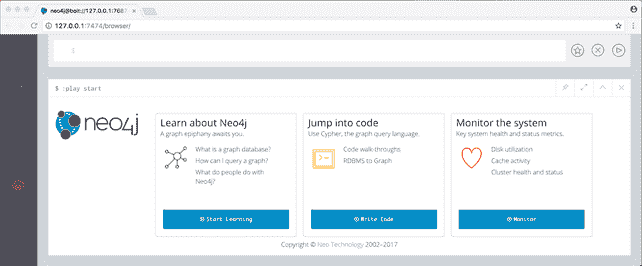

图 B.2 Neo4j 浏览器

Neo4j 浏览器是一个简单的基于网络的 Web 应用程序，允许用户与 Neo4j 实例交互，提交查询，并执行基本配置。

### B.2.2 Neo4j Desktop 安装

如果您决定安装 macOS 的桌面版本，请按照以下步骤快速安装和运行：⁸

1.  在下载文件夹中，找到并双击您下载的 .dmg 文件以启动 Neo4j Desktop 安装程序。

1.  通过将 Neo4j Desktop 图标拖到该文件夹中（图 B.3），将应用程序保存到应用程序文件夹（无论是全局的还是您特定的用户文件夹）。

    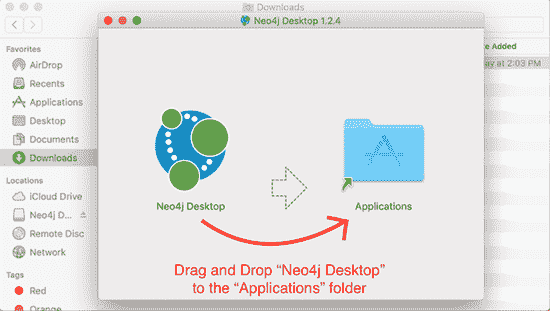

    图 B.3 在 macOS 中安装 Neo4j Desktop

1.  双击 Neo4j Desktop 图标以启动它（图 B.4）。

    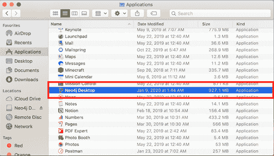

    图 B.4 启动 Neo4j Desktop

1.  第一次启动 Neo4J Desktop 时，您将被要求输入在下载软件时收到的激活码。将代码复制并粘贴到激活密钥框中。或者，您可以通过填写屏幕右侧的表单（图 B.5）在应用程序内部生成密钥。

    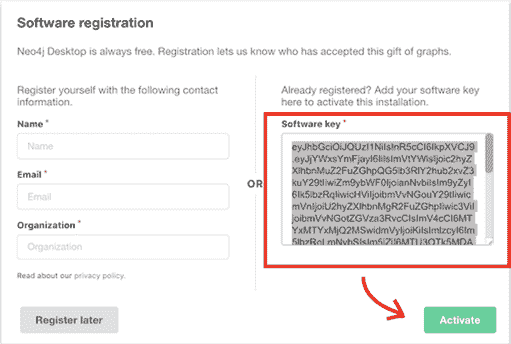

    图 B.5 在 Neo4j Desktop 中激活许可证

1.  当产品被激活（图 B.6）时，点击“添加图”按钮。

    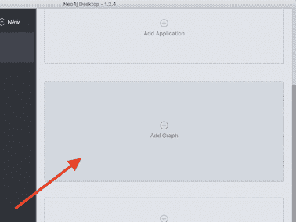

    图 B.6 将图添加到 Neo4j Desktop

1.  选择创建本地图（图 B.7）。

    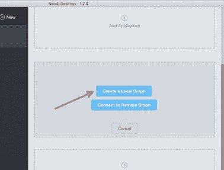

    图 B.7 创建新的本地图

1.  输入数据库名称和密码，然后点击“创建”按钮（图 B.8）。

    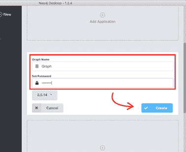

    图 B.8 在创建新的本地图时，创建一个管理员密码。

1.  通过点击“启动”按钮（图 B.9）启动新图。

    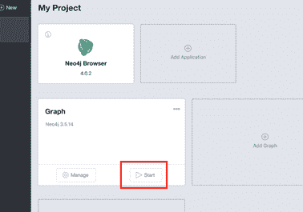

    图 B.9 启动新创建的数据库实例。

1.  点击“管理”按钮（图 B.10）。

    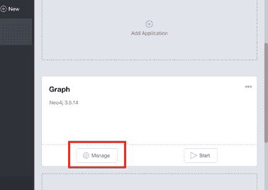

    图 B.10 点击“管理”来操作图数据库。

1.  在下一屏，点击“打开浏览器”以在新窗口中打开 Neo4j 浏览器（图 B.11）。

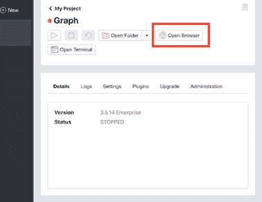

图 B.11 打开 Neo4j 浏览器的“打开浏览器”按钮。

你将能够访问浏览器，你可以从中与 Neo4j 进行交互。

如果你想要避免所有这些努力，Neo4j 有一个名为 Aura 的云版本。⁹ 在撰写本文时，如果你想在跳入之前稍微尝试一下，有一个免费层版本可用。但请注意，然而，对于本书中的练习和学习周期，最好是在你的机器上或你能够运行 Python 代码的地方安装 Neo4j。

## B.3 Cypher

Neo4j 使用的查询语言是 Cypher。¹⁰ 与 SQL（它受到了它的启发）一样，Cypher 允许用户从图数据库中存储和检索数据。Cypher 容易学习、理解和使用，同时它提供了其他标准数据访问语言的力量和功能。

Cypher 是一种使用 ASCII-Art 语法描述图中的视觉模式的声明性语言。通过使用其语法，你可以以直观、逻辑的方式描述图模式。以下是一个简单的示例，用于在图中查找所有类型为 Person 的节点：

```
MATCH (p:Person)
RETURN p
```

这种模式可以用来在图中搜索节点和关系，或者创建它们。它允许你声明你想要从你的图数据中选择、插入、更新或删除的内容，而不必描述如何确切地执行它。

除了被 Neo4j 使用外，Cypher 还已成为开源。openCypher¹¹ 项目提供了一个开放的语言规范、技术兼容性套件以及 Cypher 的解析器、规划器和运行时的参考实现。该项目由数据库行业中的几家公司在背后支持，允许数据库和客户端的实现者自由地从 openCypher 语言的开发中受益、使用和贡献。

在本书中，你将通过示例和练习学习这门语言。如果你想了解更多关于 Cypher 的信息，我推荐 Neo4j 的指南；¹² 它是一个很好的参考，充满了示例。

## B.4 插件安装

Neo4j 的一个优点是它很容易扩展。Neo4j 允许开发者以多种方式对其进行定制。你可以在查询图时使用新的过程和函数来丰富 Cypher 语言。你可以通过身份验证和授权插件来定制安全性。你还可以通过服务器扩展启用在 HTTP API 中创建新的表面。

此外，你可以下载、配置和使用许多现有的插件。其中最相关的是由 Neo4j 开发的，并且得到整个社区的支持，因为它们是开源的。为了本书的目的，我们将考虑其中的两个：

+   *Cypher 上的神奇程序 (APOC)*——APOC 库是一个标准的实用程序库，包含常见的程序和函数。它包含超过 450 个程序，并提供从 JDBC 源或 JSON 读取数据、转换、图更新等功能。在大多数情况下，函数和程序都得到了良好的支持和稳定性。

+   *图数据科学 (GDS) 库*——这个程序库实现了许多常见的图算法，如 PageRank、几个中心度度量、相似度以及更近期的技术，如节点嵌入和链接预测。因为这些算法在 Neo4j 引擎内部运行，所以在分析前对节点和关系的读取以及结果的存储进行了优化。这一特性使得这个库能够在数十亿个节点上快速计算结果。

下两个部分将描述如何下载、安装和配置这些插件。我建议在您开始使用第四章中的 Cypher 查询之前完成所有这些操作。

### B.4.1 APOC 安装

在 Neo4j 中安装插件很简单。让我们从 APOC 库开始。如果您安装了服务器版本，请从相关的 GitHub 发布页面下载插件¹³（使用 *-all.jar 获取完整库，并选择与您的 Neo4j 版本匹配的版本），并将其复制到 NEO4J_HOME 文件夹内的插件目录中。此时，通过调整或添加以下行来编辑配置文件 conf/neo4j.conf：

```
dbms.security.procedures.unrestricted=apoc.*
dbms.security.procedures.allowlist=apoc.*
```

重启 Neo4j，并打开浏览器。运行以下程序来检查是否一切就绪：

```
CALL dbms.procedures() YIELD name 
WHERE name STARTS WITH "apoc" 
RETURN name
```

您应该能看到 APOC 程序的列表。

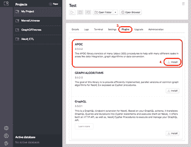

图 B.12 Neo4j Desktop 中的 APOC 安装

如果您使用的是 Neo4j Desktop 版本，过程会更简单。在创建数据库后，打开管理屏幕，点击插件选项卡，点击 APOC 框中的安装，等待看到已安装的消息（图 B.12）。有关更详细的信息和解释，请参阅官方 APOC 安装指南。¹⁴

### B.4.2 GDS 库

您可以遵循类似的步骤来安装 GDS 库。如果您安装了服务器版本，请从相关的 GitHub 发布页面下载插件¹⁵（使用 *-standalone .jar），并将其复制到 NEO4J_HOME 文件夹内的插件目录中。此时，通过调整或添加以下行来编辑配置文件 conf/neo4j.conf：

```
dbms.security.procedures.unrestricted=apoc.*,gds.*
dbms.security.procedures.allowlist=apoc.*,gds.*
```

重启 Neo4j，打开浏览器，并运行以下程序来检查是否一切就绪：

```
RETURN gds.version()
```

您应该能够看到您下载的 GDS 版本。

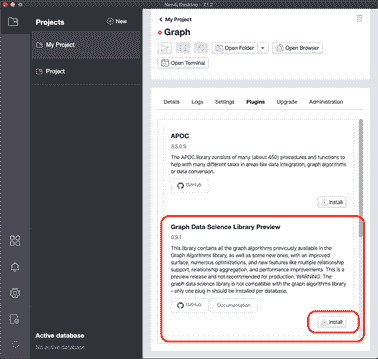

图 B.13 从 Neo4j Desktop 安装 GDS

如果您使用 Neo4j Desktop，过程会更加简单。在创建数据库后，打开管理屏幕，点击插件标签，点击 Graph Data Science Library 中的安装，等待看到已安装的消息（图 B.13）。完成这些步骤后，您就可以享受 Neo4j 的乐趣，并运行书中的所有示例和练习。

## B.5 清理

有时，您需要清理数据库。您可以通过将安装到数据库中的 APOC 库中的函数来完成这项工作。要删除所有内容：

```
CALL apoc.periodic.iterate('MATCH (n) RETURN n', 'DETACH DELETE n', 
➥ {batchSize:1000})
```

要删除所有约束：

```
CALL apoc.schema.assert({}, {})
```

## 参考文献

[Robison 等人，2015] Robinson, Ian, Jim Webber, 和 Emil Eifrem. 《图数据库》。第 2 版。Sebastopol, CA: O’Reilly, 2015.

[Vukotic 等人，2014] Vukotic, Aleksa, Dominic Fox, Jonas Partner, Nicki Watt, 和 Tareq Abedrabbo. 《Neo4j 实战》。Shelter Island, NY: Manning, 2014.

[Woodie, 2016] Woodie, Alex. “Neo4j Pushes Graph DB Limits Past a Quadrillion Nodes.” *Datanami*，2016 年 4 月 26 日。[`mng.bz/0rJN`](https://shortener.manning.com/0rJN).

* * *

(1.) 评分考虑了多个因素，例如数据库在网站上的提及次数、Stack Overflow 和 Database Administrators Stack Exchange 上的技术问题频率、工作机会以及在社会网络中的相关性。

(2.) [Bolt 协议](https://boltprotocol.org).

(3.) 如果您还没有阅读第二章，请参阅 2.3.5 节以获取有关标签属性图的详细信息。

(4.) 请参阅附录 D。

(5.) [OpenCypher](https://www.opencypher.org).

(6.) [GNU 通用公共许可证 v3.0](https://www.gnu.org/licenses/gpl-3.0.en.html).

(7.) [Neo4j 开发者桌面](https://neo4j.com/developer/neo4j-desktop/).

(8.) 安装过程取自安装指南，该指南在您下载软件时可用。请参考该安装指南以获取您操作系统的说明。

(9.) [Neo4j 云服务 Aura](https://neo4j.com/cloud/aura).

(10.) [Neo4j 开发者 Cypher](https://neo4j.com/developer/cypher).

(11.) [OpenCypher](https://www.opencypher.org)

(12.) [Neo4j 开发者 Cypher](https://neo4j.com/developer/cypher)

(13.) [`mng.bz/G6mv`](https://shortener.manning.com/G6mv)

(14.) [APOC 安装](https://neo4j.com/labs/apoc/4.2/installation).

(15.) [`mng.bz/zGDB`](https://shortener.manning.com/zGDB).
