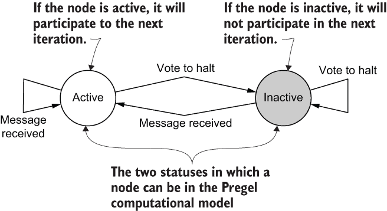
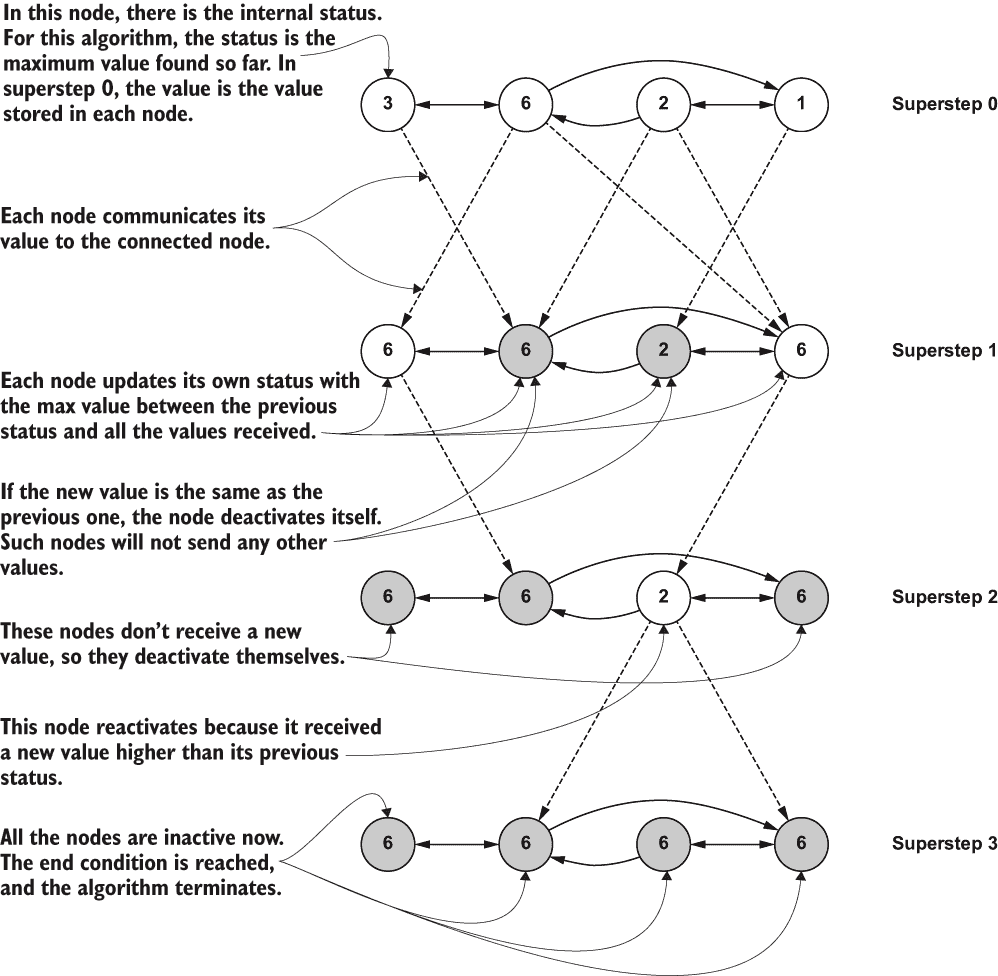
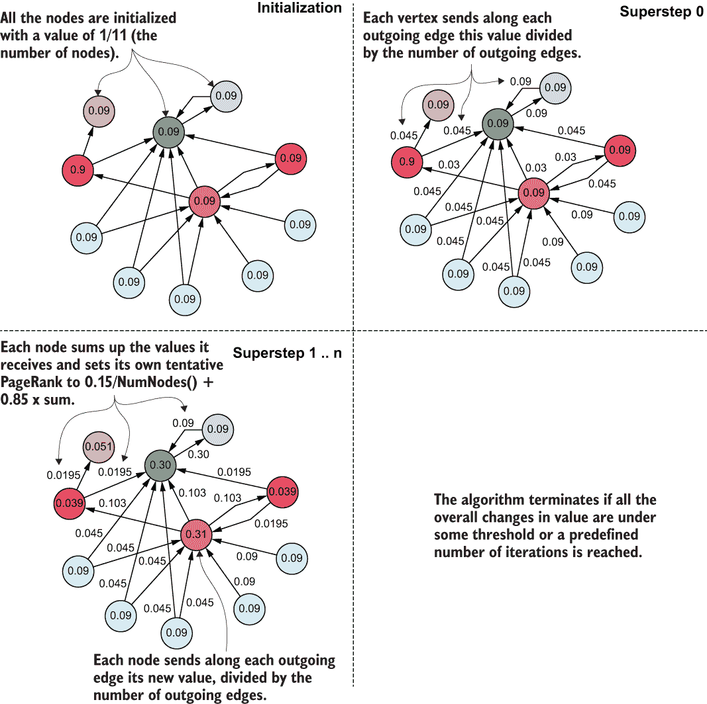
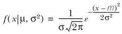
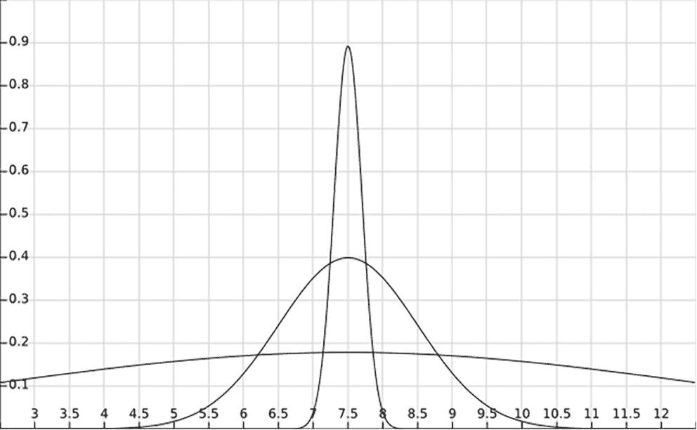
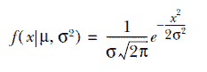
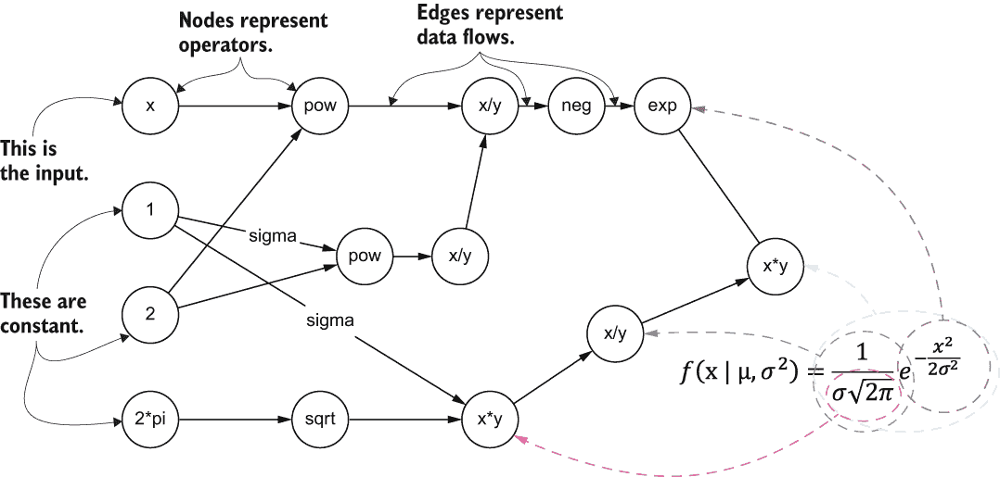

# 附录 C. 用于处理模式和流程的图

在许多机器学习项目中，包括本书中描述的许多项目，生成的图都是大的。这些图的规模使得高效处理它们变得困难。为了应对这些挑战，已经出现了各种分布式图处理系统。在本附录中，我们将探讨这些系统之一：Pregel，这是第一个用于处理大规模图的计算模型（并且仍然是使用最广泛的模型之一）。¹ 这个主题适合附录的目的主要有两个原因：

+   它定义了一个处理模型，这对于提供本书中讨论的一些算法的替代实现（基于图和非基于图）非常有用。

+   它展示了图的表达能力，并提出了基于信息图表示的计算的替代方法。

## C.1 Pregel

假设你想要在一个大图上执行 PageRank 算法，比如整个互联网。如第 3.3.1 节所述，PageRank 算法是由 Google 的创始人为其搜索引擎开发的，因此算法的原始目的是相同的。我们在第三章中探讨了算法的工作原理，现在让我们专注于如何解决一个具体问题：处理如此大规模图的 PageRank 值。由于节点（网页）和边（网页之间的链接）数量众多，这项任务将非常复杂，需要分布式方法。

Pregel 计算输入是一个有向图，其中每个节点都有一个唯一的标识符，并关联一个可修改的、用户定义的值，该值以某种方式初始化（也是输入的一部分）。每条有向边都与

+   一个源节点标识符

+   一个目标节点标识符

+   一个可修改的、用户定义的值

在 Pregel 中，程序被表示为一串迭代（称为超级步），由全局同步点分隔，直到算法终止并产生其输出。在每一个超级步 S 中，一个节点可以完成以下任务之一，概念上是在并行进行的 [Malewicz et al., 2010]：

+   接收在上一迭代、超级步 S - 1 发送给它的消息

+   向其他节点发送将在超级步 S + 1 读取的消息

+   修改自己的状态和其出度边的状态，或突变图拓扑

消息通常沿着输出边（到直接连接的节点）发送，但可以向任何已知标识符的节点发送消息。在超级步 0 时，每个节点都是活跃的；所有活跃节点都参与任何给定超级步的计算。在每个迭代的末尾，一个节点可以通过投票停止来决定自己停止活动。此时它变为非活动状态，并且除非它从另一个节点收到消息，否则它将不会参与后续的超级步，此时它将被重新激活。在重新激活后，想要停止的节点必须再次显式地停止活动。这个简单的状态机在图 C.1 中进行了说明。当所有节点都投票停止时，达到迭代的终止条件，因此在下一个超级步中不再进行任何工作。

图 C.1 根据 Pregel 计算模型显示的节点状态

在将 Pregel 框架应用于我们的 PageRank 用例之前，让我们考虑一个更简单的例子：给定一个强连通图，其中每个节点包含一个值，找到节点中存储的最高值。这个算法的 Pregel 实现工作方式如下：

+   图和每个节点的初始值代表输入。

+   在超级步 0 时，每个节点将其初始值发送给所有邻居。

+   在每个后续的超级步 S 中，如果一个节点在超级步 S - 1 收到的消息中学习到一个更大的值，它将把这个值发送给所有它的邻居；否则，它将停止活动并停止投票。

+   当所有节点都停止活动并且没有进一步的变化时，算法终止。

这些步骤在图 C.2 中用具体数字进行了展示。

图 C.2 Pregel 实现寻找节点中存储的最高值

Pregel 使用纯消息传递模型，原因有两个：

+   消息传递对于图算法来说已经足够表达；不需要远程读取（从处理集群中的其他机器读取数据）或其他模拟共享内存的方式。

+   通过避免从远程机器读取值并以批量异步发送消息，可以降低延迟，从而提高性能。

虽然 Pregel 的以节点为中心的模型易于编程，并且已被证明对许多图算法很有用，但值得注意的是，这种模型隐藏了分区信息，从而阻止了许多针对特定算法的优化，这通常会导致由于过度的网络负载而执行时间更长。为了解决这一限制，存在其他方法。这种方法可以定义为一种以图为中心的编程范式。在这个以图为中心的模型中，分区结构对用户开放，并且可以被优化，以便分区内的通信可以绕过繁重的消息传递[Tian 等人，2013]。

现在模型已经明确，优势和劣势已经突出，让我们回到我们的场景，并检查使用 Pregel 实现 PageRank 算法的逻辑步骤，这可能会像图 C.3 所示。

图 C.3 使用 Pregel 框架实现的 PageRank

图 C.3 中的模式可以进一步描述如下：

+   图的初始化方式是，在超级步 0 中，每个节点的值为 1/ NumNodes()。每个节点通过每个出边发送这个值除以出边的数量。

+   在每个后续的超级步中，每个节点将收到的消息中的值加到 sum 中，并将自己的临时 PageRank 设置为 0.15/NumNodes() + 0.85 × sum。然后它通过每个出边发送自己的临时 PageRank 除以出边的数量。

+   如果所有整体价值的变化都低于某个阈值，或者达到预定义的迭代次数，算法将终止。

Pregel 实现的 PageRank 算法在互联网场景中的有趣之处在于，我们有一个基于自然的数据集（互联网链接），一个纯图算法（PageRank），以及一个基于图的计算范式。

## C.2 用于定义复杂处理工作流程的图

在机器学习项目中，图模型不仅可以用于表示复杂的数据结构，使其易于存储、处理或访问，而且还可以有效地描述复杂的处理工作流程——完成更大任务所需的子任务序列。图模型使我们能够可视化整个算法或应用，简化问题的识别，并使得即使通过自动化过程也能轻松实现并行化。尽管本书不会详细介绍这种特定的图应用，但介绍它是很重要的，因为它展示了图模型在表示与机器学习不必要相关联的复杂规则或活动中的价值。

数据流是一种编程范式（通常称为 *DFP*，即 *数据流编程*），它使用有向图来表示复杂的应用，并且在并行计算中被广泛使用。在数据流图中，节点代表计算单元，边代表计算消耗或产生的数据。TensorFlow² 使用这些图来表示计算，这些计算基于单个操作之间的依赖关系。

## C.3 数据流

假设你正在期待一个宝宝的出生，在你最后一次访问时，医生预测新生儿的体重为 7.5 磅。你可能会想知道这可能与婴儿的实际测量体重有何不同。

让我们设计一个函数来描述新生儿所有可能体重的可能性。你可能会想知道 8 磅是否比 10 磅更可能，例如[Shukla, 2018]。对于这种预测，通常使用高斯（也称为正态）概率分布函数。这个函数接受一个数字和一些其他参数作为输入，并输出一个非负数，描述观察输入的概率。正态分布的概率密度由以下方程给出

其中

+   μ是分布的均值或期望（也是它的中位数和众数）。

+   σ是标准差。

+   σ²是方差。

这个公式指定了如何计算 x（在我们的场景中是重量）的概率，考虑到中位数μ（在我们的例子中，是 7.5 磅）和标准差（它指定了与平均值的差异）。中位数不是随机的；它是北美新生儿实际的平均体重。³ 这个函数可以用 XY 图表表示，如图 C.4 所示。

图 C.4 正态分布曲线（钟形曲线）

根据σ（标准差）的值，曲线可以是更高的或更胖的，而根据μ（均值）的值，它可以移动到图表的左侧或右侧。图 C.4 将均值的值定为中心 7.5。根据标准差的值，最近值的概率分布可能更多或更少。较高的曲线具有 0.2 的方差，而较胖的曲线具有 5 的方差。方差较小的值意味着最可能值最接近均值（在两侧）。

在任何情况下，图表呈现的结构相似，因此非正式地被称为*钟形曲线*。这个公式及其相关表示意味着曲线尖端附近的事件比曲线两侧的事件更有可能发生。在我们的例子中，如果新生儿的预期平均体重是 7.5 磅，且已知方差，我们可以使用这个函数来获取 8 磅与 10 磅体重的概率。这个函数在机器学习中经常出现，并且在 TensorFlow 中很容易定义；它只使用乘法、除法、取反和一些其他基本运算符。

要将此类函数转换为数据流中的图形表示，可以通过将均值设置为 0 和标准差设置为 1 来简化它。使用这些参数值，公式变为

这个新函数有一个特定的名称：*标准正态分布*。转换为图形格式需要以下步骤：

+   每个运算符都成为图中的一个节点，因此我们将有表示乘法、幂、取反、平方根等的节点。

+   操作符之间的边表示数学函数的组合。

从这些简单的规则开始，结果的高斯概率分布的图形表示如图 C.5 所示。

图 C.5 数据流编程中正态分布的图形表示（σ = 1）

图的简单部分代表简单的数学概念。如果一个节点只有一个入边，它是一个*一元*操作符（一个操作单个输入的操作符，如否定或加倍），而一个有两个入边的节点是一个*二元*操作符（一个操作两个输入变量的操作符，如加法或指数）。在图 C.5 中，将 8 磅（我们希望考虑的新生儿的重量）作为公式的输入将提供这个重量的概率。该图清楚地显示了函数的不同分支，这意味着可以很容易地识别可以并行处理的公式部分。

在 TensorFlow 中，这种方法使得即使是看似相当复杂的算法的可视化和处理也变得容易。尽管在某些场景中非常有用，但 DFP 范式通常被遗忘，但 TensorFlow 通过展示图形表示在复杂过程和任务中的力量而使其复兴。DFP 方法的优势可以总结如下 [Johnstonet et al., 2004; Sousa, 2012]:

+   它提供了一种具有简化界面的可视化编程语言，这使得某些系统的快速原型设计和实现成为可能。我们已讨论过视觉感知和图形作为更好地理解复杂数据结构的方法的重要性。DFP 能够在保持简单易懂和易于修改的同时，表示复杂的应用程序和算法。

+   它隐式地实现了并发性。数据流研究最初的动机是利用大规模并行性。在数据流应用程序中，内部每个节点都是一个独立的处理块，它独立于所有其他节点工作，并且不会产生副作用。这种执行模型允许节点在数据到达时立即执行，而不会产生死锁的风险，因为系统中没有数据依赖。数据流模型的重要特性可以显著提高在多核 CPU 上执行的应用程序的性能，而无需程序员进行任何额外的工作。

数据流应用程序是图形在将复杂问题分解为易于可视化、修改和并行化的子任务方面的表达能力的另一个例子。

## 参考文献

[Malewicz, 2010] Malewicz, Grzegorz, Matthew H. Austern, Aart J. C. Bik, James C. Dehnert, Ilan Horn, Naty Leiser, and Grzegorz Cjajkowski. “Pregel: A System for Large-Scale Graph Processing.” *Proceedings of the 2010 ACM SIGMOD International Conference on Management of Data* (2010): 135-146.

[Tianet al., 2013] Tian, Yuanyuan, Andrey Balmin, Severin Andreas Corsten, Shirish Tatikonda, 和 John McPherson. “从‘像顶点一样思考’到‘像图一样思考’。” *VLDB 奖励会议论文集* 7:3 (2013): 193-204.

[Johnston et al., 2004] Johnston, Wesley M., J. R. Paul Hanna, 和 Richard J. Millar. “数据流编程语言的发展。” *ACM 计算评论* (CSUR) 36:1 (2004): 1-34.

[Sousa, 2012] Sousa, Tiago Boldt. “数据流编程：概念、语言和应用。” *信息工程博士研讨会* (2012).

[Shukla, 2018] Shukla, Nishant. *TensorFlow 机器学习*. 避风岛，纽约：Manning，2018.

* * *

^(1.)其名称是为了纪念莱昂哈德·欧拉；启发欧拉定理的柯尼斯堡大桥横跨普雷格尔河 [Malewicz, 2010].

^(2.)[`www.tensorflow.org`](https://www.tensorflow.org).

^(3.)[`www.uofmhealth.org/health-library/te6295`](https://www.uofmhealth.org/health-library/te6295).
