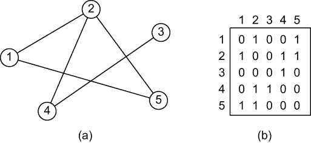
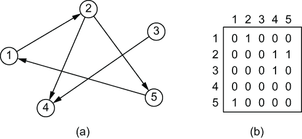

# 附录 D. 表示图

在合适的方式下表示图 G = (V, E) 的两种标准方法：作为邻接表的集合或作为邻接矩阵。每种方法都可以应用于有向、无向和非加权图 [Cormen 等人，2009]。

图 G = (V, E) 的邻接表表示由一个数组 Adj 的列表组成，每个列表对应 V 中的一个顶点。对于 V 中的每个顶点 u，邻接表 Adj[u] 包含所有存在边 E[uv] 连接 u 和 v 的顶点 v。换句话说，Adj[u] 包含 G 中与 u 相邻的所有顶点。

图 D.1(b) 是图 D.1(a) 中无向图的邻接表表示。顶点 1 有两个邻居，2 和 5，因此 Adj[1] 是列表 [2,5]。顶点 2 有三个邻居，1、4 和 5，因此 Adj[2] 是 [1,4,5]。其他列表以相同的方式创建。值得注意的是，由于关系没有顺序，列表中也没有特定的顺序；因此，Adj[1] 可以是 [2,5] 也可以是 [5, 2]。

图 D.1 一个无向图 (a) 和相关的邻接表表示 (b)

类似地，图 D.2(b) 是图 D.2(a) 中有向图的邻接表表示。这种列表被可视化为一个链表，其中每个条目都包含对下一个条目的引用。在节点 1 的邻接表中，第一个元素是节点 2；它也包含对下一个元素的引用，即节点 5 的元素。这种方法是存储邻接表中最常见的方法之一，因为它使得添加和删除等操作变得高效。在这种情况下，我们只考虑出边关系，但我们可以用入边关系做同样的处理；重要的是在创建邻接表时选择一个方向并保持一致性。在这里，顶点 1 只有一个出边关系，与顶点 2，因此 Adj[1] 将是 [2]。顶点 2 有两个出边关系，与 4 和 5，因此 Adj[2] 是 [4,5]。顶点 4 没有出边关系，因此 Adj[4] 是空的 ([]).

图 D.2 一个有向图 (a) 和相关的邻接表表示 (b)

如果 G 是一个有向图，所有邻接表长度的总和是 |E |。因为每条边只能沿一个方向遍历，所以 E[u]v 只会出现在 Adj[u] 中。如果 G 是一个无向图，所有邻接表长度的总和是 2 × |E |，因为如果 E[uv] 是无向边，E[uv] 会出现在 Adj[u] 和 Adj[v] 中。有向或无向图的邻接表表示所需的内存与 |V | + |E | 成正比。

邻接表可以通过在 Adj[u] 中存储边 E[uv] 的权重 w 来轻松地适应表示加权图。邻接表表示也可以类似地修改以支持许多其他图变体。

这种表示方法的一个缺点是，它没有提供比在邻接表 Adj[u] 中搜索 v 更快的方法来确定给定的边 E[uv] 是否存在于图中。图的邻接矩阵表示法可以弥补这一缺点，但代价是使用渐增更多的内存。

对于图 G = (V, E) 的邻接矩阵表示，我们假设顶点以某种任意方式编号为 1,2,...,|V|，并且在邻接矩阵的生命周期内保持这些编号的一致性。那么，图 G 的邻接矩阵表示由一个 |V| × |V| 矩阵 A = (a[uv]) 组成，其中 a[uv] = 1 如果 E[uv] 在图中存在，否则 a[uv] = 0。

图 D.3(b) 是图 D.3(a) 中表示的无向图的邻接矩阵表示。例如，第一行与顶点 1 相关。矩阵中的这一行在第 2 列和第 5 列有 1，因为它们代表与顶点 1 相连的顶点。所有其他值都是 0。与顶点 2 相关的第二行在第 1 列、第 4 列和第 5 列有 1，因为这些顶点是连接顶点。

图 D.3 一个无向图（a）及其作为邻接矩阵的相关表示（b）

图 D.4(b) 是图 D.4(a) 中表示的有向图的邻接矩阵表示。至于邻接表，在创建矩阵时必须选择一个方向并使用它。在这种情况下，矩阵的第一行在第 2 列有 1，因为顶点 1 与顶点 2 有一个出边关系；所有其他值都是 0。矩阵表示的一个有趣特点是，通过查看列，可以查看入边关系。例如，第 4 列显示顶点 4 有两个入边连接：来自顶点 2 和 3。

图 D.4 一个有向图（a）及其作为邻接矩阵的相关表示（b）

图的邻接矩阵所需的内存与 |V| × |V| 成正比，与图中边的数量无关。在一个无向图中，得到的矩阵沿主对角线是对称的。在这种情况下，可以只存储矩阵的一半，将存储图所需的内存几乎减半。

与图的邻接表表示法一样，邻接矩阵可以表示加权图。如果 G = (V, E) 是一个加权图，并且 w 是边 E[uv] 的权重，则 a[uv] 将被设置为 w 而不是 1。

尽管邻接表表示在空间效率上至少与邻接矩阵表示相当，但邻接矩阵更简单，因此当图相对较小时，你可能更倾向于使用它们。此外，对于无权图，邻接矩阵还有一个额外的优势：每个条目只需要一个比特。因为邻接表表示提供了一种紧凑的方式来表示*稀疏*图——即边数少于顶点数的图——所以它通常是首选的方法。但是，当图是密集的——即|E|接近|V| × |V|时——或者当你需要快速判断两个给定顶点之间是否存在边时，你可能更喜欢邻接矩阵表示。

## 参考文献

[Cormen et al., 2009] Cormen, Thomas H., Charles E. Leiserson, Ronald L. Rivest, and Clifford Stein. *算法导论*. 第 3 版. 波士顿，马萨诸塞州：麻省理工学院出版社，2009。
