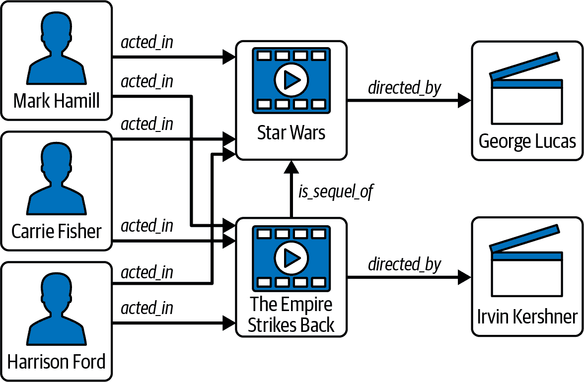
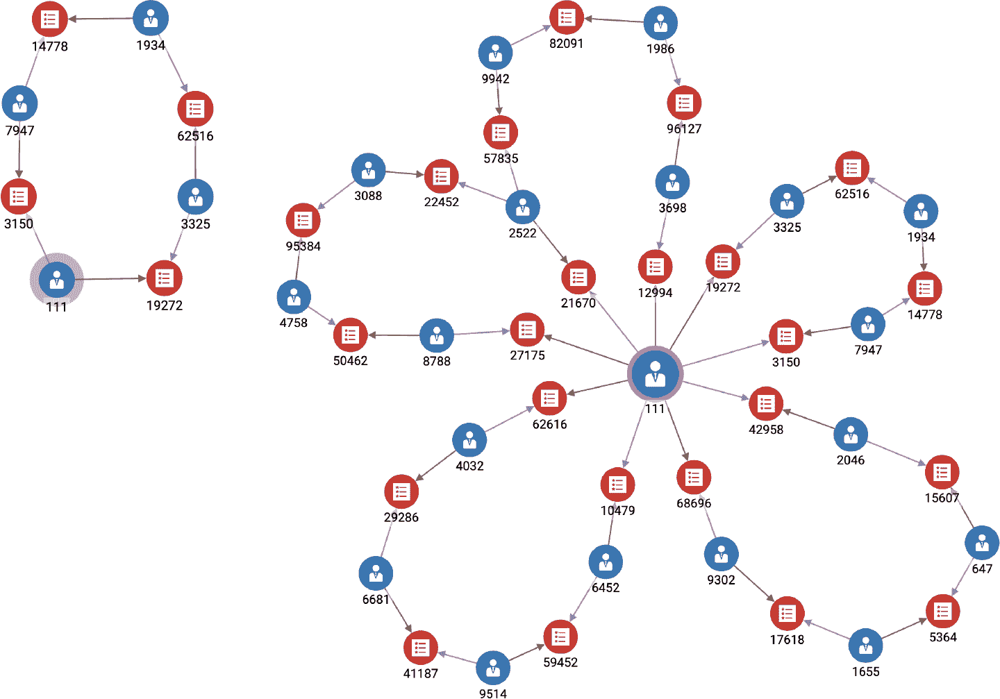
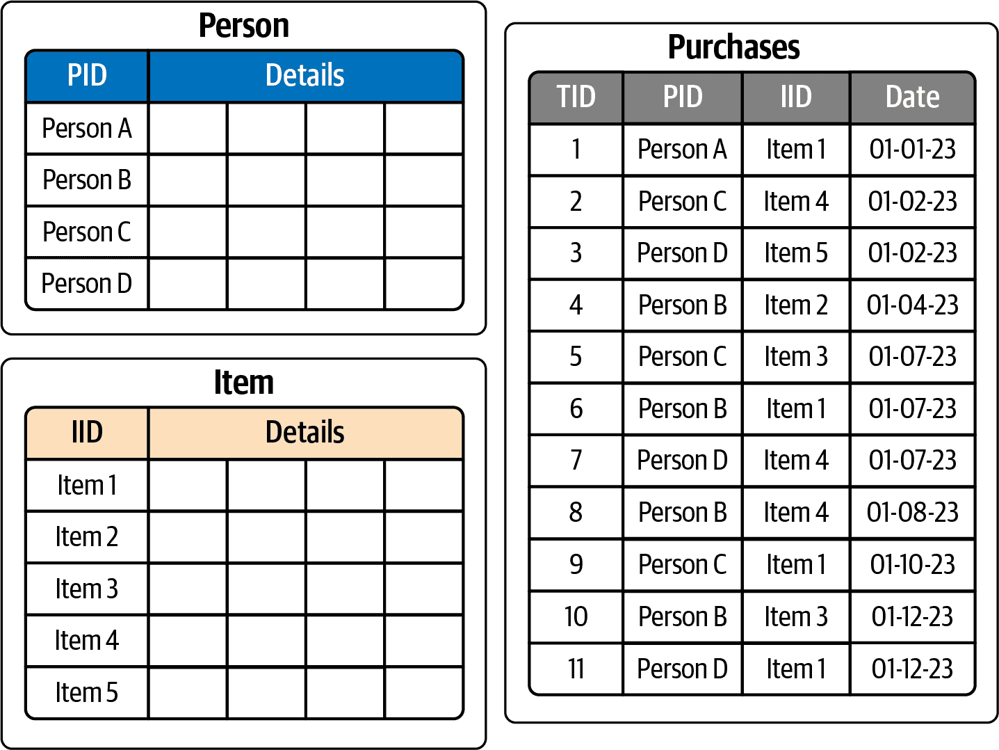
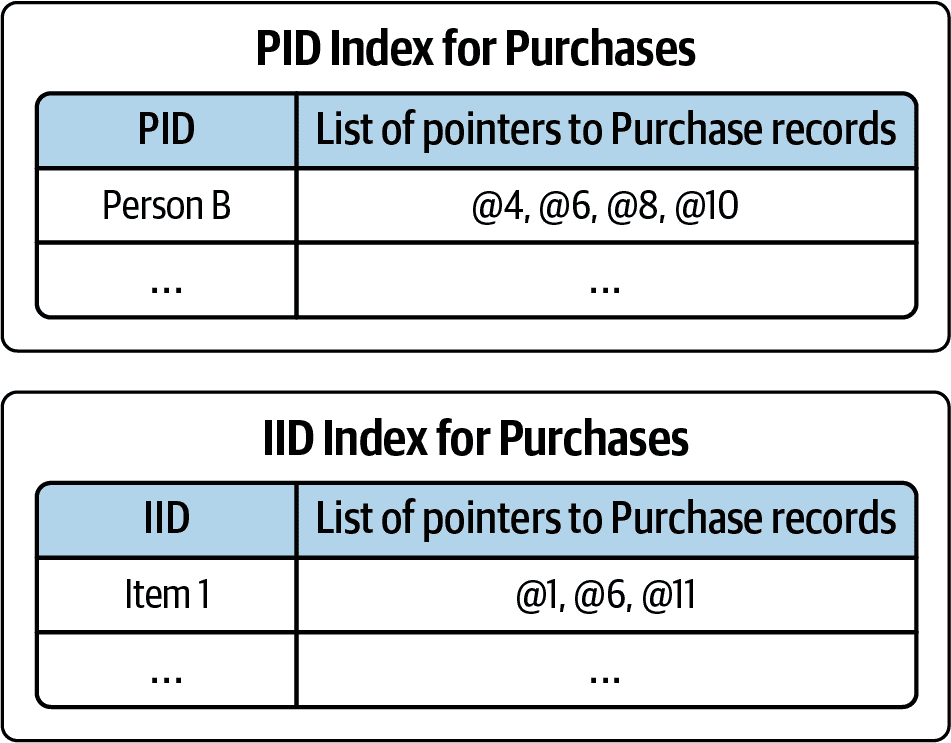
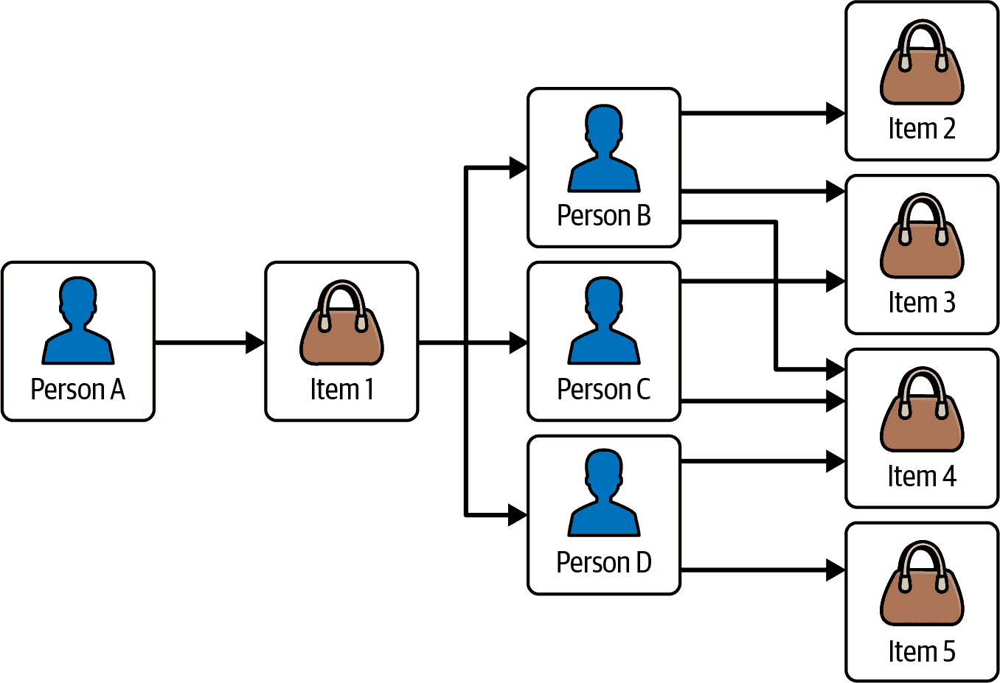

# 第一章：连接至关重要

> 从一个极端观点来看，世界只能看作是连接，别无其他。我们把词典视为意义的存储库，但它仅通过其他词语来定义单词。我喜欢这样一个想法，即信息片段实际上仅由它所关联的内容以及它们之间的关系来定义。意义实际上没有太多其他内容。结构就是一切。
> 
> 蒂姆·伯纳斯-李，《编织网络：万维网的原始设计与终极命运》（1999），第 14 页

20 世纪展示了我们通过电子表格和关系数据库能够取得的成就。表格数据占据主导地位。21 世纪已经向我们展示，这还不够。表格使我们的视角变得扁平，只显示二维连接。然而在现实世界中，事物之间相互关联和连接着无数其他事物，这些关系决定了现在和将来会发生的事情。要全面理解，我们需要建模这些连接。

个人电脑在 1970 年代问世，但直到它们找到了第一个杀手级应用程序才真正起飞：财务电子表格。在苹果 II 上的 VisiCalc，然后在 IBM PC 上的 Lotus 1-2-3，自动化了从写作和算术发明以来会计员们一直手工进行的繁琐且容易出错的计算工作：加总行和列的数字，然后可能执行更复杂的统计计算。

1970 年，E.F.科德发表了他关系数据库模型的开创性论文。在数据库的早期阶段，有几种模型在流传，包括网络数据库模型。科德的关系模型建立在每个人都能认同且易于编程的东西之上：表格。

此外，矩阵代数和许多统计方法也已经准备好与表格一起工作。物理学家和业务分析师都使用矩阵来定义和找到一切从核反应堆设计到供应链管理的最优解。表格适合并行处理；只需垂直或水平地划分工作负载。电子表格、关系数据库和矩阵代数：表格化方法似乎是解决所有问题的方案。

然后互联网发生了，一切都改变了。

# 连接改变一切。

Web 不仅仅是互联网。互联网始于 20 世纪 70 年代初，是一种数据连接网络，连接了美国的选定研究机构。由 CERN 研究员蒂姆·伯纳斯-李在 1989 年发明的万维网，是一组在互联网之上运行的技术，使得发布、访问和连接数据变得更加容易，以便人类消费和交互。浏览器、超链接和网址也是 Web 的标志。与 Web 同时发展的是，各国政府放松了对互联网的控制，允许私营公司扩展它。现在我们有数十亿个相互连接的网页，以全球范围连接人们、多媒体、事实和观点。拥有数据还不够，数据的结构如何也很重要。

## 什么是图形？

随着“网络”一词开始具有新的内涵，“图”一词也开始如此。对于大多数人来说，“图”与能够显示诸如股票价格随时间变化等内容的折线图是同义词。然而，数学家对这个词有另一种含义，随着网络和连接开始对商业世界变得重要，数学上的含义也开始显现。

图形是一种由*顶点*（或*节点*）和顶点之间的连接称为*边*的抽象数据结构。就是这样。图形是网络的概念，由这两种类型的元素构建而成。这种抽象允许我们研究一般的网络（或图形），发现它们的属性，并设计算法来解决一般任务。图论和图分析为组织提供了他们需要利用大量连接数据的工具。

在图 1-1 中，我们可以看到《星球大战》（1977 年）和《帝国反击战》（1980 年）中演员和导演之间关系的网络。这可以很容易地建模为一个图形，不同类型的边连接不同类型的顶点。演员和电影可以由一个`acted_in`顶点连接，电影和其他电影可以由一个`is_sequel_of`顶点连接，电影和导演可以有一个`directed_by`边连接。

###### 图 1-1\. 显示早期《星球大战》电影中一些关键人物和联系的图形

## 为什么图形很重要

互联网向我们展示，有时候我们通过拥有各种各样互联的数据，完成的事情比试图将所有数据合并到几个僵化的表格中要多。它还向我们展示了，连接本身就是一种信息。我们有无限数量的关系类型：父母-子女、购买者-产品、朋友-朋友等等。正如伯纳斯-李所观察到的，我们从连接中获得意义。当我们知道某人是父母时，我们可以推断出他们经历了某些生活经历，拥有某些关切。我们还可以根据父母和子女之间的关系做出合理的猜测。

然而，互联网仅仅突显了一个一直存在的真理：在表示数据和分析数据时，数据关系是重要的。图表比表格更能体现关系的信息内容。这种丰富的数据格式更擅长表示复杂信息，在分析时也能产生更有洞察力的结果。面向商业的数据分析师们欣赏看到关系以图形化形式展现的直观性，而数据科学家则发现，更丰富的内容能够产生更准确的机器学习模型。作为一个额外的好处，图数据库在处理涉及多层次连接搜索（或多个*跳跃*）的任务时，通常比关系型数据库运行得更快。

### 结构很重要

谷歌的创始人们认识到，互联网将变得太大，以至于任何人都无法完全掌握。我们需要工具来帮助我们搜索和推荐网页。谷歌早期成功的一个关键组成部分是 PageRank，这是一个将互联网建模为一组相互连接的页面的算法，基于页面之间的连接模式来决定哪些页面最具影响力或权威性。

多年来，搜索引擎在推断我们的查询内容上变得越来越好，能够准确了解我们真正想知道的内容和我们会觉得有用的信息。谷歌的一个工具是其知识图谱，这是一个从更广泛的互联网中收集的、相互连接的分类和标签化的事实和概念集合。在分析用户的查询时，谷歌不仅理解表面的单词，还理解其中的隐含类别和目标，然后在其知识图谱中搜索最匹配的事实，并以格式良好的侧边栏呈现它们。只有图形才具有足够的灵活性和表达力，才能使这个事实宇宙变得有意义。

### 社区很重要

Facebook 最初是面向大学生的社交应用程序；它已发展成为全球最大的在线社交网络。显而易见，Facebook 关心网络和图形。从每个用户的角度来看，有自己和一组朋友。虽然我们是单独行动的，但人们自然倾向于聚集成社区，这些社区像活体一样发展并具有影响力。社区对我们接收信息的方式和形成观点具有强大的影响力。企业利用社区行为来推广其产品。人们也利用社交网络来推广政治议程。检测这些社区对于理解社会动态至关重要，但在表格视图中是看不到这些社区的。

### 连接的模式很重要

相同的信息可以以表格形式或图形形式呈现，但图形形式显示了表格所掩盖的内容。想象一棵家族树。我们可以在表格中列出所有的父子关系，但表格可能会忽略跨越多个关系的重要模式：家庭、孙辈、堂兄弟姐妹。

更不明显的例子是财务交易的图形。金融机构和供应商寻找特定的交易模式，这些模式可能暗示可能存在的欺诈或洗钱活动。一个模式是大笔资金从一方转移到另一方，其中高比例的资金返回到原点：一个闭环。图 1-2 展示了这样的循环，从包含数百万笔交易的图数据库中提取，来自我们在 第五章 中的财务欺诈示例。其他模式可以是线性或 Y 形；一切皆有可能。模式取决于数据的性质和感兴趣的问题。

###### 图 1-2\. 图搜索结果显示了闭环中的交易序列（请查看此图的更大版本：[`oreil.ly/gpam0102`](https://oreil.ly/gpam0102)）

模式不仅取决于形状，还取决于顶点类型和边缘类型。图 1-2 有两种顶点类型：账户和交易（是的，交易是顶点，而不是边缘）。如果我们选择，我们可以将人和账户分开为单独的实体。一个人可以与多个账户关联。像这样分解使我们能够分析一个人的行为，而不仅仅是一个账户。将重要概念建模为顶点类型使我们能够拥有更丰富的搜索分析能力，这将在后面的章节中看到。

## 边缘优于表连接

将顶点表示为表，将边表示为表是真的。关于图实际上有什么不同，以及我们为什么声称它在多跳操作中更快？首先，图不仅仅是可视化。我们为了人类方便而可视化数据，但计算机根本不需要这种视觉方面。

图的性能优势归结为在关系型数据库与图数据库中实际进行连接搜索和利用的机制。在关系型数据库中，直到运行查询之前，表之间没有链接。是的，如果您在一个表中声明并强制执行了外键以引用另一个表，那么您知道外键列的值将对应于其相关表中的主键值。这仅意味着两个不同的表存储重复数据，但您仍然必须寻找那些匹配记录。

考虑一个简单的跟踪客户购买的数据库。我们有三张表：Person（人员）、Item（物品）和 Purchases（购买），如图 1-3 所示。假设我们想知道 Person B 做过的所有购买。Purchases 表按日期组织，而不是按人员组织，所以看来我们需要扫描整个表才能找到 Person B 的购买记录。对于大型数据库，这非常低效。

###### 图 1-3\. Person-Purchases-Item 数据库的关系表结构

这是一个常见的问题，因此关系型数据库已经提出了解决方案：次要索引。就像参考书的索引可以告诉您某些关键主题出现的页码一样，表索引告诉您某些列值出现的行地址。图 1-4 草绘了 Purchases 表的 PID（人员 ID）和 IID（物品 ID）列的索引概念。现在我们知道了 Person B 的购买记录分别在表的第 4、6、8 和 10 行。然而，仍然存在一些权衡。创建索引及随数据库演化而维护索引需要时间和存储空间，而且与直接访问具有所需内容的数据行相比，仍然需要额外步骤访问索引。索引本身就是一张表。我们能多快地找到所有人中的 Person B 呢？

没有索引：

1.  阅读 Purchases 表中的每一行（速度慢且不可扩展）。

有索引：

1.  转到 Purchases 表的次要索引。

1.  找到感兴趣的行（可能很快）。

1.  使用索引。

###### 图 1-4\. Purchases 表的次要索引

图数据库或图分析平台消除了通过表搜索和构建索引来查找连接的问题：连接已经存在。

在图中，边缘直接指向其端点顶点。无需阅读表格，也无需构建额外的索引结构。虽然单个连接的速度差异可能不大，但当您需要在连接链中重复执行此操作并且需要连接多个数据记录时，例如整个表时，图可能会快上百倍。例如，假设我们想回答这个问题：“查找由购买了您刚刚购买的物品的人也购买的物品。” 图 1-5 正是这样显示的，其中“您”是人员 A：

1.  人员 A 购买了物品 1。

1.  人员 B、C 和 D 也购买了物品 1。

1.  人员 B、C 和 D 也购买了物品 2、3、4 和 5。

###### 图 1-5\. Person-Purchase-Item 数据库的图结构

这是一个三跳查询，对于图来说相当简单。我们总共遍历了 9 个顶点和 11 条边来回答这个问题。

在基于表的系统中，这将需要三个表连接。良好的查询优化和索引将减少工作量，使其接近非常高效的图模型，但代价是在数据表和索引之间来回跳转，并执行索引查找。图不需要为此查询建立索引，因为连接已经内置并优化。

一个警示：完全的性能优势仅在“本地”图上实现，这些图是从头开始设计的。可以在表格数据库之上构建图系统。这种组合会像图一样运作，但性能不会像图那样高效。

# 图分析与机器学习

图结构化数据最大的好处也许在于它如何改进分析结果和性能。我们收集和存储数据有许多原因。有时我们只想精确地回忆一段特定的信息，就像它被记录下来的那样。例如，信用卡公司记录了每一笔交易。每个月，它会向您发送一份对账单，列出每一笔交易和付款。数据表对于这种简单的列表和求和就足够了。

当今企业需要利用数据不仅限于基本任务。他们需要发现并利用更多的收入机会，减少欺诈和浪费，降低风险。在数据中看到模式可以帮助满足所有这些需求。例如，你的信用卡消费模式如何随时间变化？他们是否能够将你与具有相似模式的其他人分类？企业如何利用社交网络关系来服务其利益，比如通过推荐促进业务或基于家庭关系预测行为？企业从多个来源获取客户信息。数据差异如拼写错误、允许字符的不同、姓名或地址变更以及客户有意使用不同的在线角色，这些差异使他们看起来像是多个不同的人。企业能否利用分析技术检测并整合这些记录？你是否在进行信用卡欺诈，或者有人盗用了你的卡号？

分析就是看见模式。模式是按照某种方式结构化的关系集合，这也正是图的本质。一个模式可以有结构化和数量化的两个方面，比如“每个家庭平均有 1.4 只宠物”。结构部分（定义家庭的住房关系，以及某些动物与家庭之间的关系）可以被编码为图模式查询。当然，图数据库和图分析平台也可以进行数量分析。本书的第二部分将帮助您理解和应用图分析。

## 增强型机器学习

机器学习是利用过去的数据来检测可能有助于预测未来活动的模式。由于图是表示、存储和分析模式的自然方式，因此图有助于我们做出更好的预测是合理的。

传统的监督式机器学习对数据进行了一些假设，简化了分析，并且与表格数据很好地配合。首先，我们假设每个数据点是孤立存在的：数据集中的每条记录在统计上是相互独立的。其次，我们假设在创建监督式机器学习模型时，数据点是同分布的。因此，我们认为每个样本来自相同的分布。这两个假设的概念被称为*独立同分布（i.i.d.）*。然而，现实生活中，并不总是符合独立同分布的现象。

要获得最准确的机器学习模型，我们需要考虑数据点之间的关系。例如，在建模社交网络时，与其他人有共同朋友的人更有可能互相联系。图允许我们明确利用数据点之间的关系，因为我们建模了这些关系而不仅仅是独立的节点。

图数据可以通过多种方式改进机器学习。一种方法是使用选定的图算法或其他图查询来评估数据点（顶点）的关系特性。例如，在交易图中，PageRank 分数帮助预测欺诈者。您可以利用这些基于图的特征丰富您现有的特征集，同时保留现有的模型训练方法。

与传统的机器学习方法不同，在特征工程阶段设计和手动选择特征，您可以通过学习图的结构自动生成特征。这种所谓的*图表示学习*减轻了对特征工程的依赖。它不像依赖分析师领域知识来设计有意义的特征，而是遵循数据驱动的方法。图表示学习有两种风格：嵌入和图神经网络。嵌入技术为每个数据点产生关联的向量。我们可以将这些嵌入向量传递到任何下游机器学习算法中，以包含它们在我们的预测任务中。图神经网络（GNNs）类似于传统神经网络，但在训练过程中考虑了图的连接。可以说，GNNs 做其他神经网络所做的事情，但具有更好的潜力。本书的第三部分专注于图增强机器学习。

# 章节总结

在本章中，我们学习到图是一个由顶点和连接这些顶点的边组成的抽象数据结构。图使我们能够将数据连接在一起，比关系数据库更好地发现模式和社区。边比表连接表现更好，因为边直接连接顶点到它们的端点，无需读取表格并构建额外的索引结构。

图分析非常强大，因为它高效地探索和识别数据中的模式。图分析可以提高分析性能，并发现其他方法未曾发现的内容。

最后，我们已经看到，图结构化数据帮助我们使用机器学习模型做出更好的预测。图允许我们明确地利用数据点之间的关系，使我们的模型更接近我们正在研究的自然现象。以这种方式建模关系将使我们能够学习图表示，从而自动从图中生成特征，而不是在特征工程阶段手工选择特征。

在下一章中，我们将扩展您对图概念和术语的理解，并帮助您开始通过图形形状的透镜看世界。

¹ “杀手级应用”，维基百科，最后更新于 2023 年 5 月 14 日，[*https://zh.wikipedia.org/wiki/%E6%9D%80%E6%89%8B%E7%BA%A7%E5%BA%94%E7%94%A8*](https://zh.wikipedia.org/wiki/%E6%9D%80%E6%89%8B%E7%BA%A7%E5%BA%94%E7%94%A8*)
