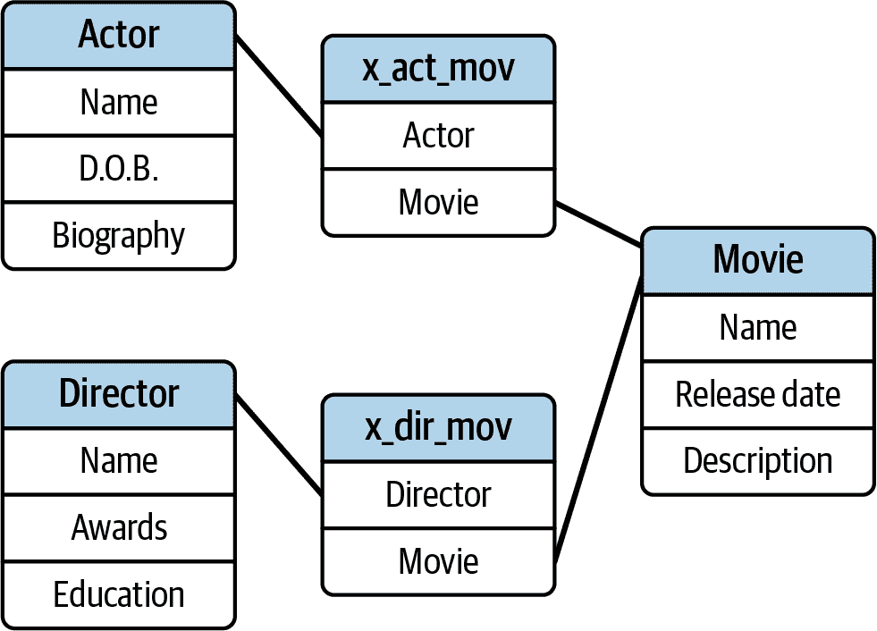
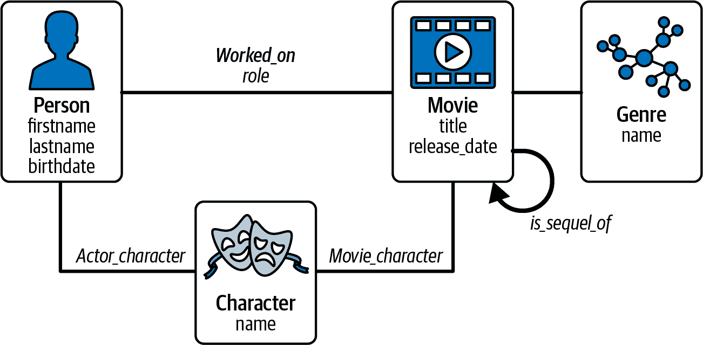

# 第二章：连接和探索数据

在第一章中，我们展示了图分析和机器学习在人类和商业活动中的潜力，并且我们提出分三个阶段介绍细节：连接数据的力量，图分析的力量以及图机器学习的力量。在本章中，我们将深入探讨第一个阶段：连接数据的力量。

在我们深入探讨连接数据的强大之前，我们需要先打下一些基础。我们从介绍图数据模型的概念和术语开始。如果你已经熟悉图，你可能想略过这一部分，确保我们在术语上达成一致。除了图本身，我们还将涵盖图模式和图遍历的重要概念。遍历是我们在图中搜索数据和连接的方式。

在此过程中，我们还将讨论图与关系数据库之间的区别，以及如何使用图分析提出问题和解决问题，在关系数据库中是不可行的。

从对图的基础理解开始，我们进一步展示图的*力量*，通过展示图数据提供比表格数据更多洞察力和分析能力的六种方式。

完成本章后，您应该能够：

+   使用描述图的标准术语

+   理解图模式和图实例之间的区别

+   从头或从关系数据库模型创建基本图模型或模式

+   应用“遍历”这个隐喻来搜索和探索图数据

+   理解图数据赋予您知识和分析能力的六种方式

+   阐述实体解析问题，并展示图如何解决这个问题

# 图结构

在第一章中，我们向您介绍了图的基本概念。在本节中，我们将更深入地讨论。首先，我们将确立本书其余部分将使用的术语。然后，我们将更多地讨论图模式的概念，这是制定数据结构计划和意识的关键。

## 图论术语

假设您正在组织关于电影、演员和导演的数据。也许您在 Netflix 或其他流媒体服务公司工作，或者您只是一位影迷。

让我们从一个电影开始，*星球大战：新希望*，它的三位主要演员以及它的导演。如果你在关系数据库中构建这个，你可以在单个表中记录这些信息，但是表会迅速增长并变得难以管理。我们甚至如何记录一部电影的细节，50 名演员出演以及每位演员职业生涯的细节，都放在一个表中呢？

在设计关系数据库的最佳实践中，建议将演员、电影和导演分别放入单独的表中，但这也意味着要添加交叉引用表来处理演员与电影之间以及电影与导演之间的多对多关系。

因此，总共需要五个表来在关系数据库中表示这个例子，就像图 2-1 中所示。

将不同类型的内容分别存储在不同的表中是组织数据的正确答案，但是要查看一条记录如何与另一条记录相关联，我们必须重新连接数据。一个查询，比如询问哪些演员与哪些导演合作，将涉及在内存中构建一个临时表，称为连接表，其中包括您调用的所有表的所有可能组合的行，这些行满足查询的条件。连接表在内存和处理器时间方面都是昂贵的。

###### 图 2-1\. 一个简单电影数据库的关系表的图示

正如我们从图 2-2 中看到的那样，在这个连接表中有很多冗余数据。对于非常大或复杂的数据库，您希望考虑优化连接表的方式来组织数据和查询。

###### 图 2-2\. 从关系数据库查询创建的临时表，显示三位演员如何通过电影星球大战与乔治·卢卡斯相关联

然而，如果我们将其与图表方法进行比较，正如图 2-3 所示，一个事情立即变得清楚：表格和图表的区别在于，图表可以直接显示一个数据元素如何与另一个相关联。也就是说，数据点之间的关系已经构建到数据库中，不需要在运行时构建。因此，图表和关系数据库之间的一个关键区别是，在图数据库中，数据点之间的关系是*显式*的。

###### 图 2-3\. 显示关于星球大战的基本信息的图表

每个演员、电影和导演被称为*节点*或*顶点*（复数：*vertices*）。顶点代表事物，无论是物理的还是抽象的。在我们的例子中，图有五个顶点。顶点之间的连接称为*边*，描述了顶点之间的关系。边也被视为数据元素。这个图有四条边：三条用于演员展示他们如何与电影相关（`acted_in`），以及一条用于导演展示他们与电影的关系（`directed_by`）。在其最简单的形式中，*图*是顶点和边的集合。我们将使用通用术语*对象*来指代顶点或边。

使用这个图，我们可以回答一个基本问题：哪些演员与导演乔治·卢卡斯一起工作过？从乔治·卢卡斯开始，我们查看他执导的电影，包括*星球大战*，然后我们查看该电影中的演员，包括马克·哈米尔、凯丽·费雪和哈里森·福特。

区分边的方向可能是有用的，甚至是必要的。在图数据库中，边可以是*有向*或*无向*的。*有向边*具有特定的方向性，从源顶点到目标顶点。我们将有向边画成箭头。

通过添加有向边，我们还可以显示层次结构，即*帝国反击战*是*星球大战*的续集（图 2-4）。

###### 图 2-4\. 带有有向边的多电影图。这展示了我们如何通过添加额外的电影和制作人员逐步构建数据库。请注意有向边`is_sequel_of`，它提供了背景，显示帝国是星球大战的续集而不是反过来。

要对图进行更多有用的工作，我们需要为每个顶点或边添加更多细节，比如演员的出生日期或电影的流派。

本书描述了属性图。*属性图*是一种图，其中每个顶点和每条边都可以具有提供有关个别元素详细信息的属性。如果我们再次看关系数据库，属性就像表中的列。属性使得图变得真正有用。它们为数据添加了丰富性和上下文，这使我们能够开发更加细致的查询，提取我们所需的数据。图 2-5 展示了带有一些额外功能的*星球大战*图。

###### 图 2-5\. 带有属性的图

图形为我们建模属性提供了另一种选择。与其将电影类型作为电影的属性处理，我们可以将每种类型单独建模为一个独立的顶点。为什么这么做呢？当属性是分类的时候，我们预计会有许多其他顶点具有相同的属性值（例如，有许多科幻电影）。所有的科幻电影都将链接到`Sci-fi`顶点，这样就非常容易搜索它们或收集关于它们的统计信息，比如“最卖座的科幻电影是什么？”所有非科幻电影已经被过滤掉了。图结构不仅可以模拟您的核心数据，还可以充当搜索索引。

我们希望将属性建模为顶点的另一个原因是为了改善规范化或数据的丰富性。*规范化*是一种分解表以消除冗余和更新复杂性的方法。此外，将其分解为更多的顶点类型意味着我们有更多可以拥有属性的东西。

在我们的电影数据库示例中，我们可能希望创建一个名为**`Character`**的新类型的顶点，以便展示谁扮演了什么角色。图 2-6 展示了我们的*星球大战*图，增加了**`Character`**顶点。当然，有趣的是达斯·维达由两个人扮演：戴维·普罗斯（穿着装备）和詹姆斯·厄尔·琼斯（配音）。幸运的是，我们的数据库可以通过最小的修改来表示这个现实。

###### 图 2-6\. 带有**`Actor`**和**`Character`**类型的电影图。此模式的灵活性使我们能够轻松展示两位演员扮演同一角色。

我们可以用这个图做什么？嗯，它足够灵活，可以让我们添加几乎每个参与电影制作的人员——从导演和演员到化妆师、特效艺术家、主摄像师，甚至最佳助理。每个为电影做出贡献的人都可以用一个称为`worked_on`的边和一个称为`role`的边属性连接起来，其中可能包括`director`、`actor`、`voice actor`、`camera operator`、`key grip`等等。

如果我们扩展我们的数据库，包括成千上万部电影和所有参与其制作的人员，我们可以使用图算法回答像“某些导演最喜欢与哪些演员合作？”这样的问题。通过图数据库，您可以回答像“谁是科幻特效的专家？”或“某些导演最喜欢与哪些照明技术人员合作？”这样不那么明显的问题。对于销售图形软件或照明设备的公司来说，这些都是有趣的问题。

通过图数据库，您可以连接多个数据源，提取所需的顶点数据，并针对组合数据集运行查询。如果您可以访问用于各种电影项目的照明设备数据库，您可以将其连接到您的电影数据库，并使用图查询来询问哪些照明技术人员具有何种设备的经验。

表 2-1 总结了我们介绍的关键图术语。

表 2-1\. 关键图术语表

| 术语 | 定义 |
| --- | --- |
| 图 | 用于表示连接数据并支持语义查询的顶点、边和属性的集合。 |
| 顶点^(a) | 用于表示对象或物体的图对象。复数形式：顶点。 |
| 边 | 连接两个顶点的图对象，通常用于表示两个对象或物体之间的关系。 |
| 属性 | 与顶点或边相关联的变量，通常用于描述它。 |
| 模式 | 包括顶点和边类型及相关属性的数据库计划，将定义数据的结构。 |
| 有向边 / 无向边 | 有向边表示一个具有明确语义方向的关系，从源顶点到目标顶点。无向边表示一个没有方向暗示的关系。 |
| ^(a) 另一个常用的替代名称是*节点*。这是个人偏好的问题。已经提出，下一代 ISO 标准的属性图查询语言将接受 VERTEX 或 NODE 的任一术语。 |

## 图模式

在前一节中，我们有意从一个非常简单的图开始，并通过添加更多的顶点、边和属性以及新的*顶点*和*边*类型来增加复杂性。要有效地对图进行建模和管理，特别是在商业环境中，规划数据类型和属性是至关重要的。

我们称这个计划为图*模式*，或图*数据模型*，类似于关系数据库的模式或实体-关系模型。它定义了我们的图将包含的顶点和边的类型，以及与这些对象相关联的属性。

你可以通过仅添加任意顶点和边来创建一个没有模式的图，但很快你会发现它很难处理，也很难理解。另外，例如，如果你想搜索数据中的所有电影，知道它们实际上都被称为“电影”，而不是“电影”或“电影”，将非常有帮助！

确定每种对象类型的标准属性集也是有帮助的。如果我们知道所有电影顶点都具有相同的核心属性，如标题、类型和发布日期，那么我们可以轻松自信地对这些属性进行分析。

图 2-7 展示了电影图数据库的可能模式。它系统地处理了随着数据库中电影增多而产生的几种数据复杂性。

###### 图 2-7\. 电影数据库的图模式

让我们来看看模式的特点：

+   **`Person`** 顶点类型表示现实世界中的人物，如 `George Lucas`。

+   **`Worked_on`** 边类型连接一个 **`Person`** 到一个 **`Movie`**。它有一个属性来描述人的角色：`director`、`producer`、`actor`、`gaffer` 等。通过将角色作为属性，我们可以支持任意数量的角色，只需一个人员顶点类型和一个工作在电影上的边类型。如果一个人有多个角色，那么图可以有多个边。¹ 模式只显示每种类型的一个对象。

+   **`Character`** 顶点类型与 **`Person`** 顶点类型分开。一个 **`Person`** 可能扮演多个 **`Character`**（例如 Tyler Perry 在 *Madea* 系列电影中），或者多个 **`Person`** 可能扮演一个 **`Character`**（例如 David Prowse、James Earl Jones 和 Sebastian Shaw 在 *The Return of the Jedi* 中扮演 Darth Vader）。

+   **`Movie`** 顶点类型非常直观。

+   **`Is_sequel_of`** 是一个有向边类型，告诉我们源头 **`Movie`** 是目标 **`Movie`** 的续集。

+   如前所述，我们选择将电影的 **`Genre`** 建模为一个顶点类型，而不是作为属性，以便更容易通过流派对电影进行筛选和分析。

理解模式的关键在于拥有一致的对象类型集合，使得数据更易于解释。

# 遍历图

遍历图是搜索图和收集分析数据的基本隐喻。想象图像为一组互相连接的踏脚石路径，其中每个踏脚石代表一个顶点。有一个或多个代理人在访问图。要读取或写入一个顶点，代理人必须站在其踏脚石上。从那里，代理人可以跨越边缘到达相邻的石头/顶点。从其新位置，代理人可以再次迈出一步。记住：如果两个顶点直接连接，这意味着它们之间有关系，因此遍历是跟随关系链。

## 跳跃和距离

遍历一个边也称为进行一次*跳跃*。遍历图的类比是移动游戏板上的移动，就像 图 2-8 中所示的那样。图是一个奇特的游戏板，你遍历图就像你在游戏板上移动一样。

###### 图 2-8\. 遍历图就像在游戏板上移动

在许多棋盘游戏中，轮到你时，你要掷骰子来确定要走多少步或跳数。在其他游戏中，你可能要穿越棋盘，直到到达某种类型的空间。这与搜索特定顶点类型的图形遍历完全相同。

图跳跃和距离在其他现实世界的情况中也会出现。你可能听说过“六度分隔”的说法。这指的是相信每个美国人都通过至多六次关系连接到其他每个人。或者，如果你使用 LinkedIn 商业社交应用程序，你可能已经看到，当你查看一个人的个人资料时，LinkedIn 会告诉你他们是否直接与你连接（一跳），通过两跳或三跳。

在图数据库中进行搜索也是如何进行搜索的。有两种基本方法：要么在继续到下一级邻居顶点之前访问每个邻居顶点（广度优先搜索），要么在尝试备选路径之前，沿着单条连接链到达尽头（深度优先搜索）。我们将在第六章中详细介绍这些搜索类型。

## 广度和深度

有两种基本方法可以系统地遍历图形以进行搜索。广度优先搜索（BFS）意味着在继续到下一级邻居之前，访问您的每个直接邻居，下一级邻居，依此类推。具有并行处理能力的图数据库可以通过同时进行多个遍历来加速 BFS。

深度优先搜索（DFS）意味着在回溯尝试其他路径之前，沿着单条连接链尽可能远地进行。无论是 BFS 还是 DFS，最终都将访问每个顶点，除非因为找到了所需的内容而停止。

# 图模型

现在你知道了图和图模式是什么。但是如何设计出一个好的图模型呢？

首先要问自己这些问题：

+   我关心的主要对象或实体是什么？

+   我关心的关键关系是什么？

+   我想要过滤掉的实体的主要属性是什么？

## 模式选项与权衡

正如我们所看到的，良好的图模式设计以自然的方式表示数据和关系，使我们能够遍历顶点和边，就像它们是真实世界的对象一样。与任何一组真实世界的东西一样，我们可以以许多方式来组织我们的集合，以优化搜索和提取所需的内容。

在设计图数据库时，影响设计的两个考虑因素是我们输入数据的格式和我们的查询用例。正如我们将在本节中看到的那样，一个关键的权衡是我们是想要优化模式以节省内存，还是使查询运行更快。

### 顶点、边还是属性？

如果您将表格数据转换为图形，自然的做法似乎是将每个表转换为顶点类型，将每个表列转换为顶点属性。实际上，一列可以映射到顶点、边缘、顶点的属性或边缘的属性。

实体和抽象概念通常映射到顶点，您可以将它们视为名词，例如前面示例中的*movie*或*actor*。关系通常映射到边缘，您可以将它们视为动词，例如*directs*或*acts*。描述符类似于形容词和副词，根据上下文和查询用例，可以映射到顶点或边缘属性。

乍一看，将对象属性尽可能靠近对象存储（即作为属性）似乎会提供最优的解决方案。然而，考虑一个需要优化产品颜色搜索的用例。颜色通常是作为顶点属性找到的质量，但是搜索蓝色对象将需要查看每个顶点。

在图中，您可以通过定义一个称为**`color`**的顶点类型并通过无向边缘将**`color`**顶点和**`product`**顶点连接起来来创建搜索索引。然后，要查找所有`blue`对象，您只需从**`color`**顶点`blue`开始，并找到所有链接的**`product`**顶点。这可以加快查询性能，但折衷是增加了复杂性和内存使用。

### 边缘方向性

较早时我们介绍了边缘方向性的概念，并指出您可以在设计模式中将边缘类型定义为有向或无向。在本节中，我们将讨论每种类型的优缺点。我们还将讨论 TigerGraph 数据库中的混合选项。

这是如此有用，以至于您可能认为您可以一直使用它，但在计算的所有事物中，您在边缘类型选择时都会有优缺点。

无向边缘

连接任意两个定义类型的顶点，没有方向性暗示。它们易于在创建链接时使用，并且在任何方向上遍历也很容易。例如，如果用户和电子邮件地址都是顶点类型，您可以使用无向边缘找到某人的电子邮件，但也可以找到使用相同电子邮件地址的所有用户——这是使用有向边缘无法实现的。

无向边缘的折衷之处在于它不提供层次结构等上下文信息。例如，如果您有一个企业图，并且想找到母公司，您无法使用无向边缘，因为没有层次结构。在这种情况下，您需要使用有向边缘。

有向边缘

表示具有明确语义方向的关系，从源顶点到目标顶点。有向边的好处是它提供更多的上下文信息，很可能比无向边更高效地存储和处理。然而，需要权衡的是，如果需要，您无法向后追溯。

与逆向有向边配对

如果您定义两种有向边类型，分别表示两个方向，您可以同时享有方向语义的优点以及双向遍历的便利。例如，要实现一个家谱，您可以定义一个**`child_of`**边类型来向下遍历树，以及一个**`parent_of`**边类型来向上遍历树。然而，需要权衡的是，您需要维护两种边类型：每次插入或修改一个边时，您都需要插入或修改其配对边。TigerGraph 数据库通过允许您一起定义这两种类型，并编写处理这两种类型数据摄入作业来简化这一过程。

如您所见，您选择的边类型将受到您需要运行的查询类型以及操作开销（如内存、速度和编码）的影响平衡。

###### 提示

如果源顶点和目标顶点类型不同，例如**`Person`**和**`Product`**，通常可以选择无向边，并让顶点类型提供方向上下文。只有当两个顶点类型相同且您关心方向时，您必须使用有向边。

### 边类型的粒度

您需要多少不同的边类型，并且如何优化您对边类型的使用？理论上，您可以只有一种边类型——无向边类型，它连接您模式中的每种顶点类型。其好处是简单性——只需要记住一种边类型！然而，需要权衡的是，您需要边属性的数量以获取上下文，并且查询性能可能会变慢。

在另一个极端，您可以为每种关系类型定义不同的边类型。例如，在社交网络中，您可以为**`coworker`**、**`friend`**、**`parent_of`**、**`child_of`**等关系分别定义不同的边类型。如果您只想查找一种关系类型，比如专业网络，这种遍历方式非常高效。然而，需要权衡的是，您需要定义新的边类型来表示新的关系类型，并且代码的抽象性会降低——也就是说，代码复杂性会增加。

### 建模交互事件

在许多应用程序中，我们希望跟踪实体之间的交互，例如一个财务交易，其中一个财务账户向另一个账户转移资金。您可能会考虑将交易（资金转移）表示为两个**`Account`**顶点之间的边。如果发生多次，会有多个边吗？虽然这看起来很容易构想（图 2-9），但在数学理论和现实世界的数据库领域中，并非如此简单。

###### 图 2-9\. 多个事件表示为多条边

在数学中，对于给定顶点对之间有多条边的情况，超越了普通图的定义，进入了多边和多重图的范畴。由于这种复杂性，并非所有的图数据库都支持这种情况，即使支持，也没有一个方便的方法来引用组中的特定边。另一种处理方法是将每个交互事件建模为一个顶点，并使用边将事件与参与者连接起来（图 2-10a）。将事件建模为顶点提供了最大的灵活性，可以将其链接到其他顶点并设计分析。第三种方法是在两个实体之间创建单条边，并将所有交易聚合到边属性中（图 2-10b）。

###### 图 2-10\. 多个事件的两种替代建模方法：(a) 事件作为顶点，和 (b) 带有包含事件发生列表的单条事件边

表 2-2 总结了每种方法的利弊。最简单的模型并不总是最佳选择，因为应用要求和数据库性能问题可能更加重要。

表 2-2\. 比较多次交互建模选项

| 模型 | 利益 | 权衡 |
| --- | --- | --- |
| 多条边 | 简单模型 | 数据库支持并非普遍 |

| 与相关顶点链接的顶点 | 基于顶点属性的过滤 分析社区和事件相似度的易用性

高级搜索树集成 | 使用更多内存 需要更多步骤来遍历 |

| 带有记录事件详细信息的单条边属性 | 使用更少的内存 减少用户之间遍历的步骤 | 交易搜索效率较低 更新/插入属性较慢 |
| --- | --- | --- |

### 根据用例调整设计模式

假设您正在创建一个用于跟踪 IT 网络事件的图数据库。我们假设您需要以下顶点类型：**`event`**、**`server`**、**`IP`**、**`event type`**、**`user`**和**`device`**。但是您想要分析什么关系，需要什么边呢？设计将取决于您希望关注的内容，您的模式可以以事件为中心或以用户为中心。

对于以事件为中心的模式（图 2-11a），其关键优势在于所有相关数据距离**`event`**顶点只有一个跳数。这使得查找事件社区、找到处理特定类型事件最多的服务器以及查找被任何给定 IP 访问的服务器变得简单。然而，从用户的角度来看，用户距离**`device`**或**`IP`**顶点有两个跳数的权衡。

###### 图 2-11\. 安排相同顶点类型的两种选项：（a）以事件为中心，（b）以用户为中心

我们可以通过使我们的模式以用户为中心来解决这个问题，但这样会使事件与 IP 和服务器之间的距离增加到两个跳数，并且事件类型与设备、服务器和 IP 之间的距离增加到三个跳数（图 2-11b）。然而，这些缺点可能值得权衡，因为可以进行有用的以用户为中心的分析，例如查找与给定用户共享相同设备/IP/服务器的所有用户或者对被阻止的用户进行分析，试图预测谁应该被进一步阻止。

## 将表转换为图形

您并不总是从头开始创建图数据库。通常，您会获取已经存储在表中的数据，然后将数据移动或复制到图中。但是，您应该如何将数据重新组织成图形呢？

将数据从关系数据库迁移到图数据库是将表和列映射到图数据库架构的过程。为了将数据从关系数据库映射到图数据库，我们在列和图对象之间创建一一对应关系。表 2-3 展示了将银行交易数据从关系数据库映射到图数据库的简单示例。

表 2-3\. 将关系数据库中的映射表映射到图数据库中的顶点、边和属性的示例

| 源：关系数据库 | 目标：图数据库 |
| --- | --- |
| 表：`Customers`—包括 `customer_id`, `first_name`, `last_name`, `DOB` 等多列 | 顶点类型：**`Customer`**—对应的属性为 `cust⁠omer_id`, `first_name`, `last_name`, `DOB` |
| 表：`Banks`—列 `bank_id`, `bank_name`, `routing_code`, `address` | 顶点类型：**`Bank`**—属性 `bank_name`, `routing_code`, `address` |
| 表：`Accounts`—列 `bank_id`, `cus⁠tomer_id` | 顶点类型：**`Account`**—属性 `bank_id`, `customer_id` |

| 表：`Transactions`—列`source_account`、`destination_account`、`amount` | 顶点类型：**`Transaction`**—属性`source_account`、`destination_account`、`amount` 或

有向边：**`Transaction`**—属性`source_account`、`destination_account`、`amount` |

图模式如 图 2-12 所示。

###### 图 2-12\. 一个简单的银行数据库的图模式，交易作为单独的顶点

在创建数据模式时的一个关键决策是决定哪些列需要映射到它们自己的顶点。例如，人们通常是理解任何现实情况的关键因素——无论他们是客户、员工还是其他人——因此它们通常会映射到它们自己的顶点。

理论上，关系数据库中的每一列都可以成为模式中的一个顶点，但这是不必要的，并且很快变得难以管理。与构建关系数据库结构类似，优化图数据库涉及理解数据的真实结构及其使用意图。

在图数据库中，关系数据库的关键列变成顶点，而上下文或支持数据成为这些顶点的属性。边通常映射到外键和交叉引用表中。

一些图数据库具有工具，可以便于导入表和将外键映射到顶点和边的 ID。

与关系数据库一样，结构良好的图数据库消除了冗余或重复的数据。这不仅确保了计算资源的有效使用，而且更重要的是，通过确保数据在不同位置不以不同形式存在，确保了数据的一致性。

### 优化映射选择

简单地将列映射到顶点和顶点属性可能有效，但可能无法充分利用图中可用的连接丰富性，实际上通常需要根据不同的搜索用例调整映射选择。

例如，在联系人数据库的图数据库中，手机号码和电子邮件地址是个人的属性，通常作为该顶点的属性表示。

但是，如果您试图使用银行应用程序来检测欺诈，您可能希望将电子邮件地址和电话号码视为单独的顶点，因为它们对于链接人员和金融交易非常有用。

当来自多个表的信息映射到一个顶点或边类型时，这并不少见。当数据来自多个源时，每个源提供了同一现实世界实体的不同视角时，这种情况尤其常见。同样，一个表可以映射到多个顶点和边类型。

## 模型演变

大多数情况下，您的数据会随着时间的推移而发展，您将需要调整模式以考虑新的业务结构和外部因素。这就是为什么模式设计为灵活的：允许系统随时间适应，而无需从头开始。

例如，如果我们看看银行业，金融机构不断进入新市场，无论是通过地理扩展还是引入新类型的产品。

举个简单的例子，假设我们有一家一直在单一国家运营的银行。因此，其所有客户的居住国家是隐含的。然而，进入第二个国家将需要更新数据库以包括国家数据。可以为每个相关的顶点类型添加国家属性，或者创建一个名为**`country`**的新顶点类型，并为银行在每个国家的运营地创建顶点。

使用灵活的模式，可以通过添加新的顶点类型然后将顾客顶点链接到新的国家顶点来更新模式。

尽管这只是一个简单的例子，但它展示了建模数据可以是一个进化过程。您可以从一个初始模型开始，也许它与之前的关系数据库模型非常相似。在使用图形数据库一段时间后，您可能会发现一些模型更改可以更好地满足您的需求。两个常见的更改是将顶点属性转换为独立的顶点类型，以及添加额外的边类型。

适应不断变化的数据可以很简单。添加属性、顶点类型或边类型很容易。连接两个不同的数据集也很容易，只要我们知道它们之间的关系。我们可以添加边缘来连接相关实体，甚至可以合并来自代表同一现实世界实体的两个来源的实体。

# 图力量

我们已经看到如何构建图形，但需要回答的最重要的问题是*为什么*构建图形？有什么优势？图形可以为您做到其他数据结构无法做到的事情是什么？我们称之为图形技术的集合能力和优势为*图形力量*。

接下来是图力量的关键方面。我们谦逊地承认，这既不是完整的，也不是可能的最佳清单。我们怀疑其他人提出了更完整、数学上更精确的清单。然而，我们的目标不是提出理论，而是建立人类之间的联系：将 resonance 的想法分享给您，让您能够理解和体验图形力量。

## 连接点

*图形构成了可操作的知识体系*。

正如我们所见，连接点是图形力量在其最基本的层面上。无论是将演员和导演与电影联系起来，还是将金融交易与涉嫌欺诈者联系起来，图形都能让您描述一个实体与另一个实体之间的关系跨越多个跳跃。

图的力量来自于能够描述连接网络、检测模式并从这些模式中提取智能。虽然单个顶点可能不包含我们正在寻找的智能，但它们一起可能使我们能够发现在多个顶点之间关系的模式，从而揭示新信息。

有了这些知识，我们可以开始从数据中推断和预测，就像侦探在调查谋杀案时连接线索一样。

在每个侦探故事中，调查员收集了一系列事实、可能性、线索和怀疑。但这些孤立的碎片并非答案。侦探的魔力在于将这些碎片缝合成隐藏的真相。他们可能利用已知或可疑的连接模式来预测他们未被告知的关系。

当侦探解决了谜团，他们可以展示一系列或网络的连接，将嫌疑人与犯罪联系起来，包括手段、机会和动机。他们也可以表明，对于任何其他嫌疑人，不存在足够强大的连接序列。

那些侦探知道他们在进行图分析吗？可能不知道，但我们每天都在不同方面的工作、家庭或朋友网络中做这种工作。我们不断地连接各种线索，以理解人与人、人与物、人与思想等之间的联系。

图作为一种数据范式的力量在于，它密切地模拟了这一过程，使得图的使用更加直观。

## 360 度视角

*360 度图形视图消除了盲点。*

各种规模的组织都在抱怨它们的数据孤岛。每个部门都希望另一个在需要时提供其数据，同时却未意识到自身无法在同样的基础上开放。问题在于，商业流程及其支持的系统积极阻碍了数据的开放共享。

例如，两个部门可能使用两种不同的数据管理系统。尽管两者都可能将数据存储在关系型数据库中，但每个系统的数据架构对另一个系统来说却是如此陌生，以至于几乎没有希望将它们链接起来以实现共享。

如果你从微观的角度来看待问题，问题可能并不明显。例如，如果你正在为客户 X 编制记录，那么了解存储客户数据的两个系统的分析师将能够轻松地从两个系统中提取数据，手动合并或协调两条记录，并呈现客户报告。但是，当你需要重复这个过程十万次或百万次时，问题就来了。

只有通过全面、整合的方式共享数据，企业才能消除阻碍其全面了解的局限性。

“客户 360”这个术语描述了一种数据架构，将来自多个来源和领域的客户数据汇集到一个数据集中，从而使您能够全面和全面地了解每位客户。

使用关系数据库，最明显的解决方案是将这两个部门数据库合并为一个。许多企业尝试过大规模的数据整合项目，但通常以失败告终，因为虽然合并数据带来了显著的好处，但也需要进行权衡，这导致丢失上下文细微差别和功能性。让我们面对现实：通常有一个原因，为什么某个软件包的创建者选择以特定方式构建其数据模式，并试图迫使其符合另一个系统的模式或新的混合模式，将至少破坏其中一个系统。

图形允许您以自然直观的方式连接数据库，而不会干扰原始表。首先授予图形应用程序访问每个数据库的权限，然后创建一个图形模式，以逻辑方式链接每个数据库中的数据点。图形数据库映射数据点之间的关系并进行分析性的重活，使源数据库可以继续完成它们之前的工作。

如果你想看到你的全部环境，你需要一个可以俯瞰每个角度的视野——即 360 度。如果你想理解你的整体业务或操作环境，你需要跨越所有你知道的数据之间的数据关系。

这是我们将在第三章更深入地研究的内容，我们将展示一个涉及客户旅程的用例。

在前两点中，我们已经看到如何设置数据，现在在接下来的四点中，我们将探讨如何从中提取有意义的智能。

## 深入探索更多洞察力

在图形中深入搜索可以揭示大量连接信息。

20 世纪 60 年代，斯坦利·米尔格拉姆进行的“六度分离”实验表明，仅通过追踪个人联系（并知道目标人物在波士顿），在内布拉斯加州奥马哈随机选择的人可以通过不超过六个人际关系连接到神秘的目标人物。

自那时以来，更严格的实验表明，许多图形都是所谓的小世界图形，意味着源顶点可以在非常少的跳数内到达数百万甚至数十亿其他顶点。

在社交图形中不仅如此，在知识图形中也能够在很少的跳数内访问如此多的信息。访问这么多信息的能力，并理解这些事实之间的关系，无疑是一种超能力。

假设你有一个图，其中包含两种类型的顶点：人物和专业领域，就像 图 2-13 中的那样。该图展示了你认识谁以及你擅长什么。每个人的直接连接代表了他们头脑中的内容。

###### 图 2-13\. 展示了谁认识谁及其专业领域的图表

从这里，我们很容易看出 A 是两个专家，天文学和人类学，但通过询问 B 和 C 知道什么，再走一步，A 就可以接触到四个更多的专业。

现在，假设每个人都有 10 个专业领域和 100 个人际关系。考虑一下你的朋友的朋友能联系到多少人和多少专业领域。有 100 × 100 = 10,000 个人际关系，每个关系涉及 10 个专业领域。有可能独特的人数并不是 10,000 —— 你和你的朋友可能认识一些相同的人。尽管如此，在图中的每一步中，你都会接触到指数级增长的信息量。寻找答案？想进行分析？想要理解全局？四处打听一下，你会找到认识认识的人。

我们经常谈论“更深入地看”，但在图表中，这意味着一种特定的方式来搜索信息，并理解这些事实如何相关。更深入地看包括基于广度的搜索，考虑从当前位置可访问的内容。然后遍历到一些邻近顶点以获取深度，并查看从这些新位置可访问的内容。无论是进行欺诈调查还是优化决策，深入图表中查找可以揭示出否则未知的事实和关联。

正如我们在 “连接点” 中所看到的，单独一个关系可能并不引人注目，并且可能没有任何信息显示一个给定顶点中的坏意图，但是成千上万的顶点和边被综合考虑时，可以开始揭示新的见解，进而导致可操作的智能。

## 观察和发现模式

*图表现出一个新的视角，揭示了易于解释的隐藏数据模式。*

正如我们所看到的，图是一组顶点和边，但在顶点和关系的集合内部，我们可以开始检测到模式。

一个*图模式*是一小组连接的顶点和边，可以作为搜索具有类似配置的顶点和边组的模板。

最基本的图模式是数据三元组：顶点 → 边 → 顶点。数据三元组有时被认为是语义关系，因为它与语言的语法相关，并可以读作“主语 → 谓语 → 宾语”。例如，Bob → 拥有 → 船。

我们还可以使用图形模式描述我们心中的高级对象或关系。例如，根据模式，一个人可以与包含地址、电话和电子邮件等个人数据的多个顶点相关联。虽然它们是单独的顶点，但它们都与那个人相关。另一个例子是洗售，这是两个证券交易的组合：以亏损出售证券，然后在 30 天内购买相同或基本相似的证券。

图案有不同的形状。我们已经看过的最简单的图案是两个顶点之间的线性关系跨越一系列跳跃。另一个常见的模式是星形：许多边和顶点从一个中心顶点辐射出去。

图案可以是 Y 形的，当两个顶点汇合在第三个顶点上时，就会出现这种模式，这个第三个顶点与第四个顶点相关。我们还可以有圆形或递归模式等等。

与关系数据库相比，图形数据易于可视化，图形数据模式易于解释。

设计良好的图形为顶点和边类型命名，反映它们的含义。如果正确完成，您几乎可以查看一系列连接的顶点和边，并像读句子一样阅读这些名称。例如，请参考图 2-14，显示了购买人员的物品。

###### 图 2-14\. 购买物品 1 及其它商品的人

从左边开始，我们看到 A（您）购买了物品 1。向右移动，我们看到另一组人，B、C 和 D，他们也购买了物品 1。最后，我们看到这些人购买了更多物品。因此，我们可以说：“您购买了物品 1。其他购买物品 1 的人也购买了物品 2、3、4 和 5。”听起来熟悉吗？

进一步分析表明，物品 4 是最受欢迎的物品，三位购买者中的所有人都购买了该物品。物品 3 紧随其后（被两人购买），物品 2 和 5 最不受欢迎。有了这些信息，我们可以优化我们的推荐。

许多零售商使用图形分析进行推荐分析，通常还会更深入，根据其他客户属性（如性别、年龄、地点和时间）对购买进行分类。如果我们发现客户晚上更有可能购买奢侈品，早上更倾向于购买实用品，我们甚至可以根据每天的时间来做出推荐。

如果我们还分析购买顺序，我们可以得出关于客户的一些高度个人化的信息。一家大型零售商曾经通过关注 25 种产品的购买情况来准确判断哪些客户怀孕及预产期。然后，该零售商能够在客户孩子出生时发送定向的促销优惠。

## 匹配和合并

*图形是最直观和高效的匹配和合并记录的数据结构。*

正如我们之前讨论的，组织希望全方位了解他们的数据，但这背后的一个大障碍是数据的不明确性。数据不明确性的一个例子是有多个版本的客户数据，去重数据的挑战对许多组织而言是众所周知的。

重复有时是企业系统的繁殖导致的，这些系统将您的客户视图分散到许多数据库中。例如，如果您在几个数据库中拥有客户记录——例如 Salesforce（客户服务数据库）、订单处理系统和会计软件包——客户的视图将分散在这些系统中。

要创建客户的联合视图，您需要查询每个数据库并将每个客户的记录连接在一起。

然而，并不总是那么简单，因为客户可能在您的数据库中使用不同的参考 ID 进行注册。姓名可能拼写不同。个人信息（姓名、电话号码、电子邮件地址等）可能会更改。如何匹配正确的记录呢？

实体解析根据被假定为唯一的实体属性来匹配记录。在个人记录的情况下，这些属性可能是电子邮件地址和电话号码，但也可以是属性的聚合。例如，我们可以将姓名、出生日期和出生地作为唯一标识符，因为全世界任何两个人拥有相同这三样东西的几率有多大呢？

在关系数据库中进行实体解析是具有挑战性的，因为为了比较实体，您需要比较相似的内容。如果您只处理一个表，您可以说相似的列中的相似值表示匹配，从而将两个实体解析为一个实体，但在多个表中，列可能不匹配。您可能还需要构建复杂的表连接以在分析中包含交叉参考的数据。

相比之下，在图中进行实体解析则较为容易。相似的实体共享相似的邻域，这使得我们能够使用诸如余弦相似度和 Jaccard 相似度等相似性算法来解析它们。

在实体解析中，我们实际上做了两件事：

1.  通过测量其属性和邻域的相似度来计算实体对的匹配可能性分数。

1.  合并具有足够高匹配可能性分数的实体。

当涉及到合并记录时，我们有几个选项：

1.  将记录 B 的数据复制到记录 A，重定向原本指向 B 的边使其指向 A，并删除 B。

1.  在记录 A 和 B 之间创建一个名为 `same_as` 的特殊链接。

1.  创建一个名为 C 的新记录，将数据从 A 和 B 复制过来，重定向从 A 和 B 指向 C 的链接，最后创建 `same_as` 边从顶点 C 指向顶点 A 和 B。

哪个更好？第二种更快执行，因为只涉及一步操作——添加一条边——但图查询同样可以执行第一种和第三种选项。就结果而言，哪种选项更好取决于您的搜索用例。例如，您是更看重数据的丰富性还是搜索效率？它还可能取决于您在数据库中期望进行的匹配和合并程度。

我们将在 第十一章 中通过一个实例演示和讨论实体解析。

## 加权和预测

*具有加权关系的图让我们能够轻松地建模和分析复杂的成本结构。*

正如我们所展示的，图是分析关系的强大工具，但需要考虑的一点是关系不一定是二进制的、开或关、黑或白。边代表顶点之间的关系，可以加权表示关系的强度，例如距离、成本或概率。

如果我们对边进行加权，路径分析就不仅仅是追踪节点之间的链接，还需要进行计算工作，例如聚合它们的值。

然而，加权边也使得图分析变得更加复杂。除了计算工作之外，在具有加权边的图中找到最短路径算法上也比在无权图中更为困难。即使你已经找到了一条到达某个顶点的加权路径，你也无法确定它是否是最短路径。可能存在另一条你尚未尝试的更长路径，但其总权重较低。

另一方面，边的加权并不总是会导致工作量显著增加。在 PageRank 算法中，该算法计算每个顶点对所有其他顶点的影响时，边的加权几乎没有影响，只是从引用邻居接收的影响被边的权重乘以，这对算法增加了最小的计算开销。

有许多问题可以通过边的加权来解决。例如，与地图相关的任何事物都适合边的加权。每条边可以有多个权重。考虑地图示例，这些权重可以包括常数权重，如距离和速度限制，以及变量权重，如当前旅行时间，以考虑交通状况。

我们可以利用航线和价格的图表来计算乘客的最佳行程，不仅基于他们的行程安排，还考虑他们的预算限制。他们是要找最快的行程，不管价格，还是愿意接受更长的行程，可能有更多停留，以换取更低的价格？在这两种情况下，你可能会使用相同的算法——最短路径——但会优先考虑不同的边权重。

有了正确的数据访问权限，我们甚至可以计算成功旅程的概率。例如，我们的航班准时起飞和到达的概率是多少？对于单程跳跃，我们可能接受航班晚点不超过一个小时的 80%的机会，但对于两程跳跃，第二程不晚点的概率为 85%，延误的组合风险为 68%。

同样地，我们可以看一下供应链模型，并问一下，我们完成产品的生产会不会严重延误？如果我们假设有六个步骤，每个步骤的可靠性为 99%，那么组合可靠性约为 94%。换句话说，有 6%的机会出现问题。我们可以对数百个互连过程建模，并使用最短路径算法找到满足一系列条件的“最安全”路线。

# 章节总结

在本章中，我们看了图结构以及如何使用图数据库将数据表示为一系列数据节点和链接。在图中，我们称这些为顶点和边，它们不仅能够以直观的方式表示数据——并更有效地查询数据——还可以使用强大的图函数和算法遍历数据并提取有意义的智能信息。

属性图是一种图形，其中每个顶点和边（我们统称为对象）都可以持有描述该对象的属性。边的一个属性是方向，我们讨论了在指示层次结构和顺序时不同有向边类型的优缺点。

我们看了什么是遍历图以及“跳跃”和“距离”的含义。遍历图有两种方法：广度优先搜索和深度优先搜索，每种方法都有其自身的优点和权衡。

我们讨论了使用图模式定义数据库结构的重要性，一致的对象类型集使您的数据更易于解释，并且它能够与现实世界紧密相关。

在设计过程中，特别是在搜索用例和将关系数据库的列映射到图数据库时，仔细考虑了不同的方法，这会影响查询时间和编码的复杂性。

实施图数据库的关键步骤之一是将关系数据库中的列映射到图中，因为图的一个常见用例是在不同数据库之间建立关系。您需要做出的决策之一是将哪些列映射到它们自己的对象，以及哪些包含为其他对象的属性。

随着时间的推移，我们审视了数据库的演变，以及为什么灵活的模式对确保数据库保持最新状态至关重要。

在设计数据库模式时，无论是关系型数据库还是图数据库，都需要权衡利弊，我们探讨了其中一些，包括是否将列映射为对象或将其作为对象的属性的选择。我们还考虑了边的方向性选择和边类型的粒度。

记录同一两个实体之间的多个事件和跟踪 IT 网络中的事件也需要权衡取舍。

最后，我们探讨了“图力量”的含义，包括首先为什么使用图？我们看了一些常见的用例，包括：

+   连接各种知识点：图如何形成可操作的知识体系

+   360 度视角：如何通过 360 度图视图消除盲点

+   深入寻找更多见解：深度图搜索如何揭示大量连接信息

+   观察和发现模式：图如何呈现新的视角，揭示易于解释的隐藏数据模式

+   匹配和合并：为什么图是匹配和合并记录的最直观和高效的数据结构

+   权衡和预测：带有加权关系的图如何轻松建模和分析复杂的成本结构

¹ 一些图数据库通过一个名为`Worked_on`的单一边来处理多个角色，其角色属性接受角色列表。
