# 第三章：更好地了解您的客户和业务：360 图

本章将运用一些真实的用例来说明我们在上一章讨论的六个图形功能中的两个：“连接点”和“360 视图”。图提供的 360 视图帮助企业和机构更全面地看待他们的数据，从而实现更好的分析能力。在第一个用例中，我们建立一个客户 360（C360）图，使公司能够跟踪和理解售前客户旅程。在第二个案例中，我们建立了一个药物相互作用 360 图，以便研究人员可以开发更安全的药物疗法。

完成本章后，您应能够：

+   定义术语*C360*并解释其价值主张

+   知道如何在图中建模和分析客户旅程

+   知道如何使用图分析来计数和过滤属性和关系

+   使用 GraphStudio 设置和运行 TigerGraph Cloud Starter Kit

+   阅读并理解基本的 GSQL 查询

# 案例 1：追踪和分析客户旅程

没有销售就没有业务。销售，无论是面向消费者（B2C）还是其他企业（B2B），不仅成为一门艺术，也成为一门科学。企业分析他们与潜在客户（潜在客户）从开始到结束的每个阶段的互动，希望最终能够实现销售。根据 Gartner 的数据，2018 年全球客户关系管理（CRM）软件支出增长了 15.6%，达到 2020 年的 482 亿美元。¹ Salesforce 已经确立了作为 CRM 软件市场领导者的地位，市场份额约为 20%。²

将销售过程视为潜在客户在时间上的一系列事件体验是考虑的关键方式。某人如何何时参与企业及其商品？绘制与销售前景的互动称为*追踪客户旅程*。

客户旅程模型是销售和营销的重要工具。首先，它采用客户的视角，因为他们是最终决策者。其次，通过意识到客户可能需要通过阶段，企业可以制定出他们认为将会吸引并确保许多成功业务交易的吸引力旅程。第三，通过查看个体旅程，我们可以看到它们的进展如何，一个旅程是否停滞不前，变慢或改变方向。第四，通过分析收集的旅程集合，企业可以看到模式和趋势，并将其与其目标行为进行比较。用户是否实际上按照设计的旅程进行？特定的参与是否成功推动潜在客户向前发展？

需要一个有效且可扩展的数据系统，可以收集客户旅程中的混合数据类型，并支持对个体和聚合旅程的分析。

# 解决方案：客户 360 + 旅程图

CRM 系统似乎提供了解决方案，但它们并没有完全满足企业对客户旅程分析的需求。设计用于手动输入数据或数字化摄取数据，CRM 主要以表格形式记录和呈现数据。挑战在于不同类型的参与行为（观看视频、参加演示、下载试用软件）具有不同的特征。将这种混合数据存储在一个表中并不奏效，因此数据必须分布在多个表中。真正的挑战在于建模旅程的顺序。遵循顺序的唯一方法要么是通过一系列昂贵的表连接，要么是筛选与某个人相关的所有参与行为，然后按时间排序这些参与行为。

另一方面，使用图形，我们可以直接使用边轻松建模顺序，如在图 3-1 中所示。所有潜在客户的旅程可以存储在一个图形中。个别旅程将彼此相似并交叉，因为个人参加相同的事件或从事类似的活动。

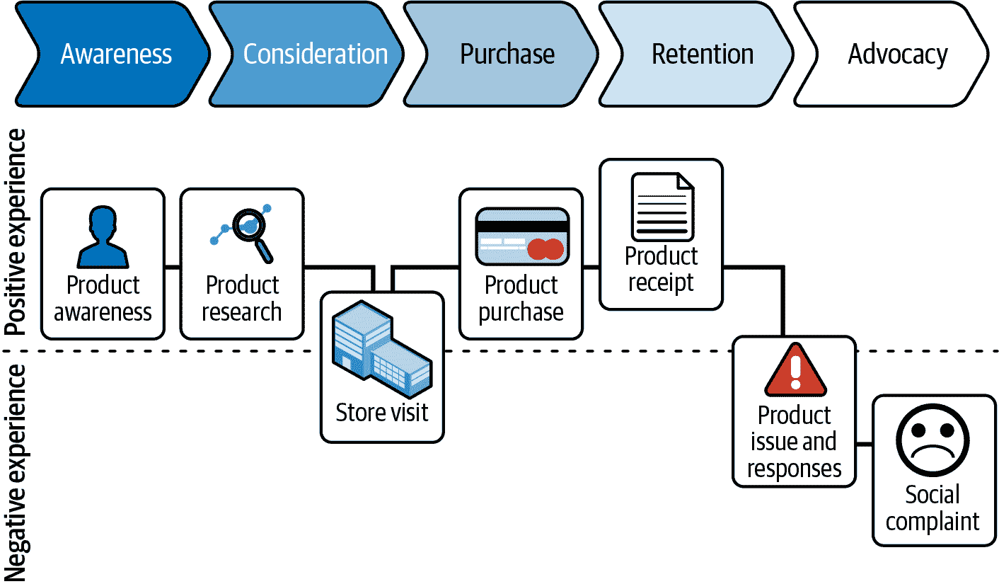

###### 图 3-1. 客户旅程：一般阶段和一个特定客户的旅程的图形显示

企业不仅希望绘制客户旅程，还希望使其更成功：提高客户满意度，增加以销售结束的旅程比例，增加销售价值，缩短旅程。为了做到这一点，企业需要了解每个客户及其决策的背景。这就是 360 度视图发挥作用的地方。360 度视图是我们在前一章中讨论的图形的独特力量之一。

*客户 360（C360）*是通过集成多个来源的数据创建的客户（或任何感兴趣的实体）的综合视图，正如在图 3-2 中建议的那样。像客户旅程一样，客户 360 非常适合图形和图形分析。图形可以支持一个顶点（客户）与其他实体之间无限数量的关系。这些实体不仅可以描述旅程（冷呼叫、网络研讨会、宣传册、产品演示或网站互动），还可以描述客户的背景（当前和过去的职务头衔、任期、雇主、地点、技能、兴趣和教育）。一个好的 360 数据库还将包括关于雇主和行业的信息（规模、倡议、新闻等）。

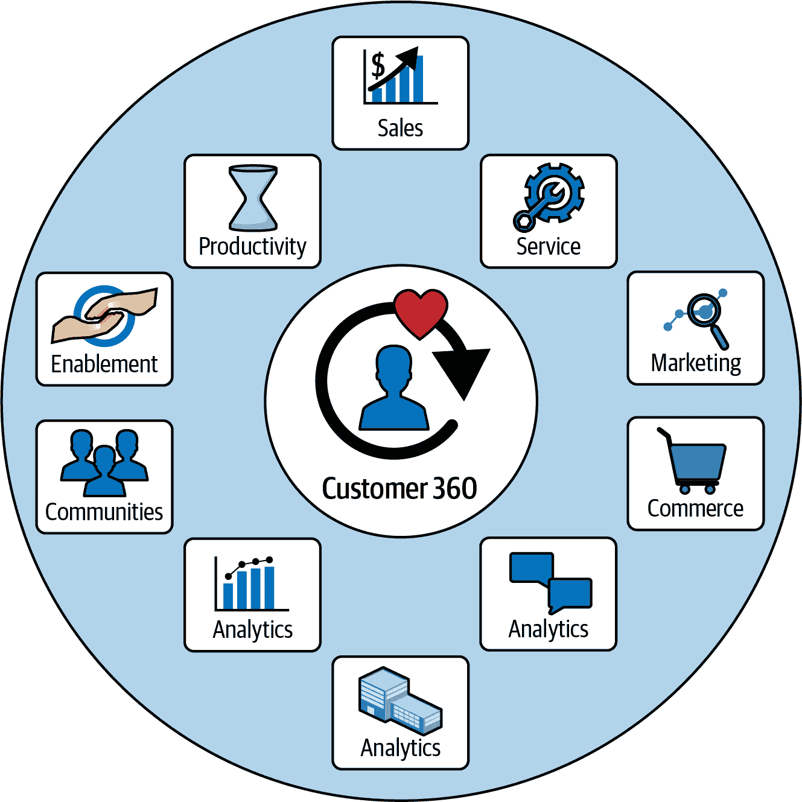

###### 图 3-2. 连接以形成客户 360 图的全面视图的单个个体信息

结合 360°数据和旅程分析，企业能够清晰地看到销售过程中发生的情况，无论是个体还是整体水平，了解这些行动的背景，看到哪里需要改进，并评估销售改进所带来的影响。

我们提议的解决方案是开发一个数据模型，使得检查和分析客户旅程变得简单。数据模型还应该包括描述和与客户相关的数据，以生成客户 360 视图。该模型应支持关于客户旅程包含或不包含哪些事件以及这些事件的时间的查询。

# 实施 C360 + Journey Graph：GraphStudio 教程

我们在下文中提供的 C360 和客户旅程图实施方案作为 TigerGraph Cloud Starter Kit 提供。起始套件是实践演示，教你如何使用图分析来处理不同的使用案例。每个套件都有一个图模式、示例数据和查询。如果这是你第一次使用 TigerGraph Cloud，不用担心。我们将向你展示如何注册一个免费账户并部署一个免费的起始套件。或者，如果你已经在自己的机器上安装了 TigerGraph，我们将告诉你如何将起始套件导入到系统中。然后，我们将同时指导你设计 C360 图和总体上的 GraphStudio。

图 3-3 描述了设置起始套件的两条路径。在接下来的章节中，我们将首先告诉你如何创建 TigerGraph Cloud 账户。然后我们将指导你完成获取和加载起始套件的步骤，首先是针对 TigerGraph Cloud 用户，然后是针对 TigerGraph 自建用户。

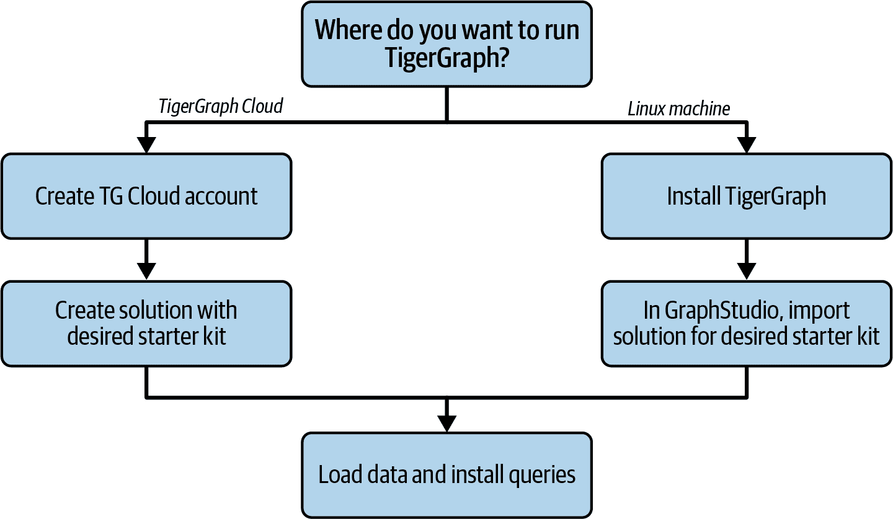

###### 图 3-3\. 设置 TigerGraph Starter Kit

## 创建 TigerGraph Cloud 账户

如果这是你第一次使用 TigerGraph Cloud，你需要设置一个账户。这很简单并且免费：

1.  在网页浏览器中，访问 [*tgcloud.io*](https://tgcloud.io)。

1.  点击“注册”按钮并填写表单。注册表单可能要求你创建一个组织。一个组织可以包含和管理多个用户和多个数据库在同一个账户下。

1.  当你提交表单后，TigerGraph Cloud 将要求你去你的电子邮件验证你的账户。你现在拥有了一个 TigerGraph Cloud 账户！

在下一节中，我们将告诉你如何创建 TigerGraph Cloud 数据库，并选择起始套件。

## 获取并安装客户 360 起始套件

我们将使用名为“客户 360 – 归因和参与图”的起始套件。如果你是 TigerGraph Cloud 用户，你可以作为新数据库部署的一部分获取起始套件。如果你在自己的计算机上运行 TigerGraph，你可以从[TigerGraph 网站](http://www.tigergraph.com)下载起始套件文件，然后将它们上传到你的 TigerGraph 实例中。

接下来的两个部分详细介绍了这两个选项的细节。

### 部署带有起始套件的云实例

登录 TigerGraph Cloud 时，第一个可见的页面是我的集群页面。集群是一个 TigerGraph 数据库部署，具有或不具有图架构或数据。单击创建集群按钮，这将带您进入创建集群页面（如图 3-4 所示）。

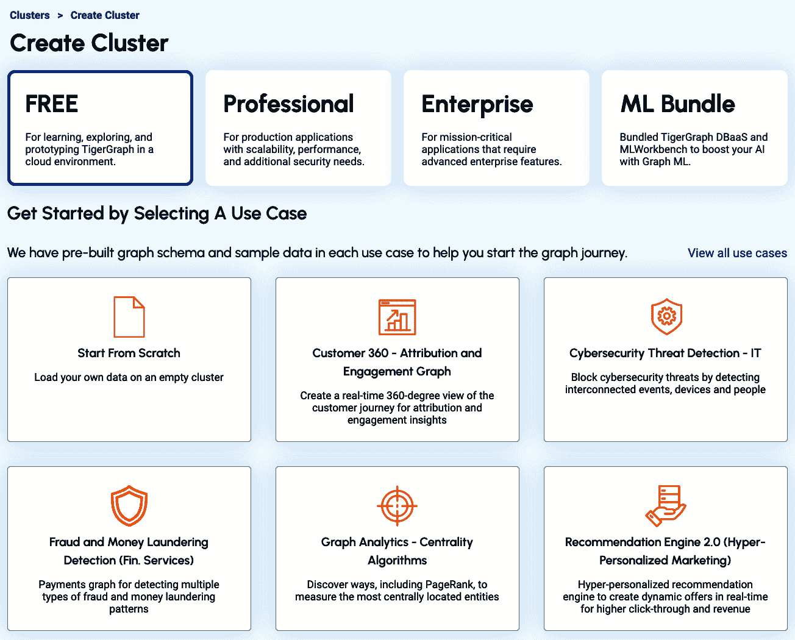

###### 图 3-4. TigerGraph Cloud 创建集群菜单

然后按照以下步骤操作：

1.  确认您集群的服务层级。在创建集群页面上，默认为免费层级。较大和更强大的集群会产生按小时计费。对于本书中的练习，免费大小应该足够。您可以在部署后升级集群，如果需要的话。

1.  选择一个用例的起始套件。如果您想要的套件未显示，请单击“查看所有用例”以查看更多选择。在本例中，是“Customer 360 – Attribution and Engagement Graph”。对于免费层级，就是这样。几分钟后，您的数据库实例将准备就绪。

1.  如果您决定创建付费层级实例，则需要做更多选择：云平台提供商、实例大小、区域、磁盘大小和集群配置。您可以使用所有这些默认值按照本教程操作。

1.  一旦您的集群实例准备就绪，它将显示在我的集群页面上。单击其工具按钮。从显示的菜单中，选择 GraphStudio。

1.  继续到“加载数据并安装起始套件的查询”。

### 另选项：将起始套件导入到您的 TigerGraph 实例中

如果您在自己的机器上安装了 TigerGraph 软件，请按照以下步骤获取起始套件：

1.  前往[*www.tigergraph.com/starterkits*](http://www.tigergraph.com/starterkits)。

1.  查找 Customer 360—Attribution and Engagement Graph。

1.  下载与您的 TigerGraph 平台版本对应的数据集和解决方案包。

1.  启动您的 TigerGraph 实例。前往 GraphStudio 主页。

1.  单击导入现有解决方案，并选择您下载的解决方案包。

1.  继续到“加载数据并安装起始套件的查询”。

###### 警告

导入 GraphStudio 解决方案将删除您现有的数据库。如果您希望保存当前设计，请执行 GraphStudio 导出解决方案，并按照[TigerGraph 文档站点](https://oreil.ly/LoDnj)上的说明备份数据库。

### 加载数据并安装起始套件的查询

还需要三个额外步骤来完成起始套件的安装。如果您了解 GraphStudio，只想知道如何安装起始套件，请按照以下步骤操作：

1.  前往设计模式页面。在左侧菜单中，从全局视图切换到起始套件的本地图视图。可能称为 MyGraph，或者可能具有像 AntiFraud 这样的自定义名称。

1.  转到加载数据页面。等待大约五秒，直到顶部菜单左端的“加载数据”按钮变为活动状态。点击按钮，等待数据加载完成。您可以在右下角的时间轴显示中跟踪加载进度。

1.  转到编写查询页面。在查询列表上方，点击“安装所有查询”按钮，并等待安装完成。

## GraphStudio 概述

TigerGraph 的 GraphStudio 是一个完整的图解决方案开发工具包，涵盖了从开发图模型到运行查询的整个过程中的每个阶段。它被组织为一系列视图或页面，每个页面用于开发过程中的不同任务。

因为这是我们首次一起使用 GraphStudio，我们将通过所有五个阶段：设计架构、映射数据到图、加载数据、探索图和编写查询。在每个阶段，我们将解释页面的一般目的，并指导您完成我们正在使用的特定起始套件的详细信息。在未来的章节中，我们将跳过大部分的概括，只讨论起始套件的细节。

如果我们从空数据库开始，我们需要进行额外的设计工作，例如创建图模型。有了起始套件，您可以跳过大部分工作，直接探索和查询示例数据集。

###### 注意

如何在 GraphStudio 中创建图模型只是 TigerGraph 在线文档中涵盖的众多主题之一，详细信息请访问[*docs.tigergraph.com*](https://docs.tigergraph.com)。TigerGraph 官方 YouTube 频道也是教程的宝贵资源。

## 设计图架构

起始套件预装了基于 Salesforce 和类似 CRM 软件中常用数据对象的图模型。此起始套件中图的名称为*MyGraph*。启动 GraphStudio 时，您最初位于全局图级别。您还没有在特定图上工作。在 TigerGraph 数据库中，全局级别用于定义可能对所有用户和所有图表可用的数据类型。请参阅图 3-5 中标记为“全局类型”的部分。然后数据库可以托管一个或多个图。图可以包含本地类型，并且可以包含某些或所有全局类型。请参阅图中的 G1 和 G2。

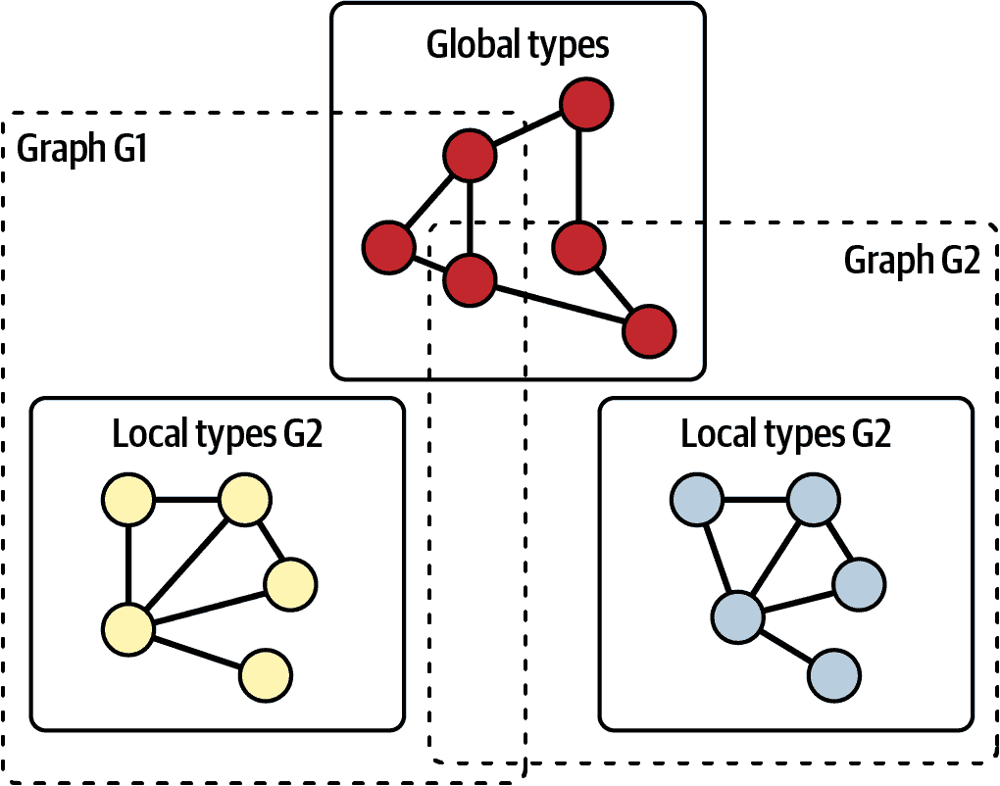

###### 图 3-5。TigerGraph 数据库中的全局类型、本地类型和图表

要处理图表，您需要选择图表，这将使您从全局级别移动到本地图表级别。要切换到本地图表，请点击左上角的圆形图标。会弹出一个下拉菜单，显示可用的图表，并允许您创建一个新图表。点击“MyGraph”（步骤 2）。在下面稍微低一点的地方，点击“设计架构”，确保我们从正确的位置开始。

现在您应该在主显示面板上看到一个类似于图 3-6 的图模型或模式。

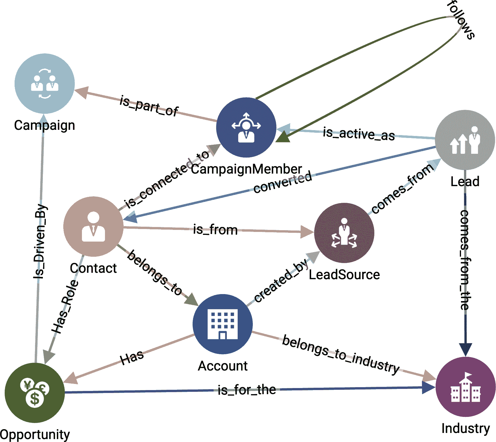

###### 图 3-6\. CRM 数据的图模式（在[`oreil.ly/gpam0306`](https://oreil.ly/gpam0306)查看更大的版本）

数据库的图模式定义了要存储的*数据对象类型*。如果图模式在视觉上呈现，那么每种数据类型只显示一次。此模式有 8 种顶点类型和 14 种边类型。

中心顶点类型是`**联系人**`，这是产品的潜在买家。然而，一个`**联系人**`不仅仅是任何潜在买家，这反映了一个代表公司购买 B2B 产品的人并非一时冲动的决定。相反，这个人通过购买过程的各个阶段进行过渡。我们称之为这个人在购买过程中的流程为*客户旅程*。

在数据库中，一个真实的人可能会出现多次。如果供应商进行了营销**`活动`**，那么对该活动作出反应的人将显示为**`营销活动成员`**顶点。此外，如果第三方，即`**潜在客户来源**`，提供了潜在买家的联系信息，则潜在买家将显示为一个`**潜在客户**`。一位`**销售人员**`与一个`**潜在客户**`进行接触，看看是否存在实际的销售可能性。如果存在，那么`**潜在客户**`的信息将复制到一个称为`**联系人**`的新顶点类型中。这个`**联系人**`及其来源的`**潜在客户**`代表同一个物理人，但处于客户旅程的不同阶段。

表 3-1 包含所有八种顶点类型的描述。在某些情况下，一个顶点类型的描述讨论它如何与另一个顶点类型相关。例如，一个**`账户`**是“一个`**联系人`**所属的组织”。查看图 3-6，您可以看到`**账户**`和`**联系人**`之间的边类型称为**`属于`**。图中还有其他 13 种边类型。这些边类型有描述性的名称，因此如果理解了顶点类型，您应该能够理解边的含义。

表 3-1\. Salesforce Customer 360 图模型中的顶点类型

| 顶点类型 | 描述 |
| --- | --- |
| `**账户**` | **`联系人`**所属的组织 |
| `**营销活动**` | 旨在产生**`潜在客户`**的营销举措 |
| `**营销活动成员**` | 响应**`营销活动`**的一个角色 |
| `**联系人**` | 现在与销售**`机会`**相关联的一个**`潜在客户`** |
| `**行业**` | **`账户`**的业务部门 |
| `**潜在客户**` | 一个有可能购买产品但尚未与一个`**销售机会**`相关联的人 |
| `**潜在客户来源**` | 一个**`潜在客户`**了解产品的渠道 |
| `**销售机会**` | 一个潜在的销售交易，以货币金额为特征 |

## 数据加载

在 TigerGraph 的入门套件中，数据已包含在内，但尚未加载到数据库中。要加载数据，请切换到加载数据页面（第 1 步，参见 图 3-7），等待几秒钟，直到主面板左上角的加载按钮变为活动状态，然后单击它（第 2 步）。您可以在右侧的实时图表中观察加载的进度（未显示）。在 TGCloud 的免费实例上加载 34K 个顶点和 105K 条边应该需要两分钟；在付费实例上速度更快。

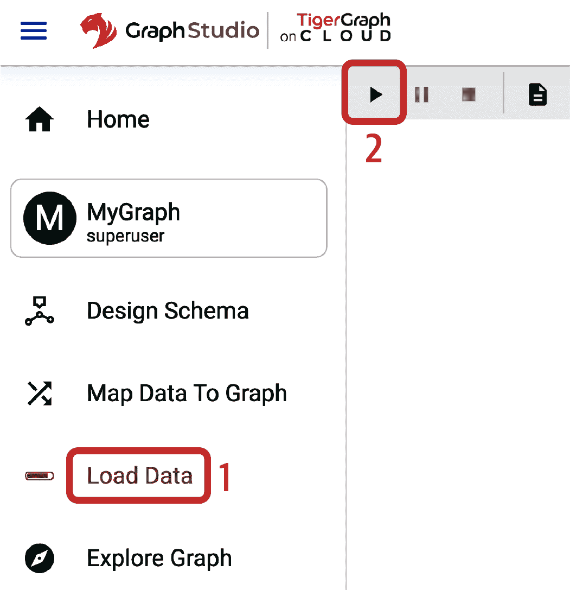

###### 图 3-7\. 在入门套件中加载数据

## 查询与分析

我们将通过组合和执行 GSQL 中的查询来分析图并运行图算法，GSQL 是 TigerGraph 的图查询语言。在第一次部署新的入门套件时，您需要安装查询。切换到编写查询页面（第 1 步，参见 图 3-8）。然后点击查询列表右上角的“全部安装”图标（第 2 步）。

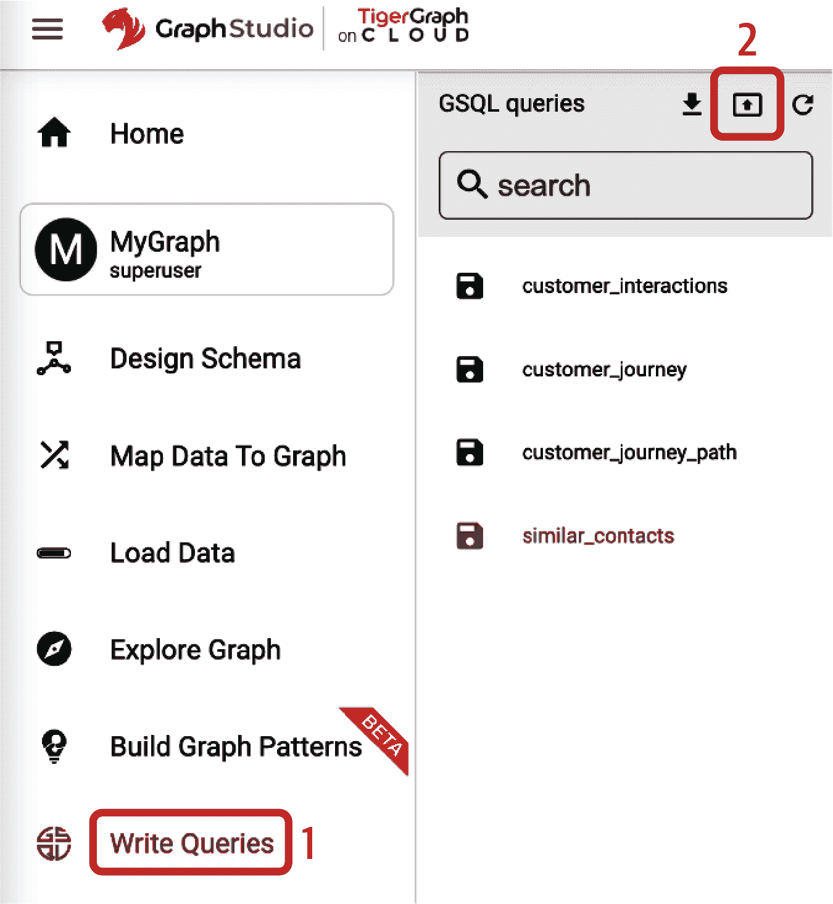

###### 图 3-8\. 安装查询

# 学习和使用 GSQL

本书中的 GSQL 示例旨在向您展示一些表达图数据库信息和分析查询技术的方法。虽然示例是用 GSQL 编写的，但您不必精通这门语言，我们也不会试图以严格的方式教授它。如果您了解基本的 SQL 并熟悉像 Python 这样的通用语言，我们相信您将能够稍加努力地理解我们对查询的解释。当我们想要强调 GSQL 语言的某一点时，我们会使用如此的提示框。

对于我们的 Customer 360 使用案例，我们将讨论三个查询：

客户互动子图

此查询生成一个子图，为我们提供客户旅程的全面视图。子图体现了客户与公司广告活动的互动。查询从类型为`**Contact**`的给定客户开始。然后，它收集客户与之互动过的`**Account**`、`**Opportunity**`和`**CampaignMember**`顶点。此外，对于每个`**CampaignMember**`元素，也选择了一个`**Campaign**`。最后，查询返回生成的客户互动子图。

客户旅程

此查询查找在某个时间段内与客户互动过的所有`**CampaignMember**`元素。查询从给定的`**Contact**`开始，并过滤出在开始时间和结束时间之间与`**Contact**`有过联系的所有`**CampaignMember**`元素。与第一个查询不同的是，我们不返回连接`**Contact**`和`**CampaignMember**`之间的子图。在这里，我们返回一个按`**CampaignMember**`顶点排序的列表。

相似联系人

此查询返回与给定`**Contact**`类似的联系人。如果给定的`**Contact**`成功转化为付费客户，此查询可以找到其他潜在的转化候选人。此查询在 GSQL 中实现了 Jaccard 相似度测量，用于计算给定`**Contact**`与共享相似`**Campaign**`的其他`**Contact**`顶点之间的相似性。然后返回相似度得分最高的联系人。

对于这三个查询中的每一个，我们将提供一个高层次的解释，在 TigerGraph 的 GraphStudio 中运行它们的指南，预期的结果以及对查询中一些 GSQL 代码的更详细的查看。

### 客户互动子图

`customer_interactions`查询需要一个参数：作为`**Contact**`自然人类型的客户。首先，我们选择所有属于给定`**Contact**`的`**Account**`身份。然后，我们找到与`**Contact**`连接的所有`**Opportunity**`顶点。此外，`**Contact**`顶点与一个或多个属于`**Campaign**`的`**CampaignMember**`有连接。图 3-9 说明了此查询发现的关系。

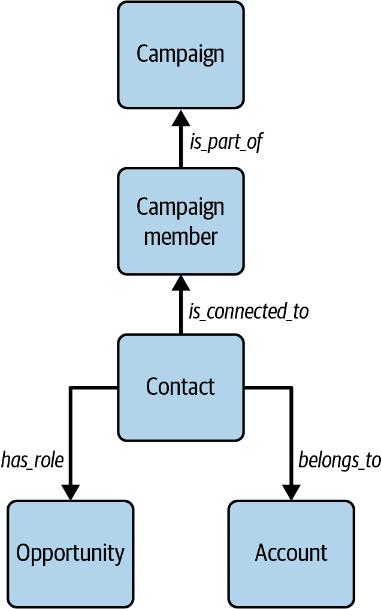

###### 图 3-9\. **Contact** 顶点和边缘

进行：通过从列表中选择查询名称（图 3-10 中的步骤 1）并点击代码面板上方的运行图标（步骤 2）来运行 GSQL 查询`customer_interaction`。此查询有一个输入参数：字段“Contact”让我们填入客户的姓名。如果您查看查询代码窗格（图 3-10），您将看到一个建议的`Contact`示例值的注释：`Sam-Eisenberg`。


###### 图 3-10\. 运行`customer_interaction`查询

###### 提示

使用鼠标从代码窗口复制并粘贴值到查询参数输入框中。

输出将显示在查询编辑面板下方的结果面板中。初始时，图可能看起来很混乱。要清理外观，请点击输出右下角的“更改布局（force）”按钮，然后选择 force。然后输出应该类似于图 3-11。


###### 图 3-11\. 查询结果`customer_interaction`，输入为`Sam-Eisenberg`（请查看此图的大图版本 [`oreil.ly/gpam0311`](https://oreil.ly/gpam0311)）

现在我们来看看 GSQL 查询`cust_journey_subgraph`的工作原理。请参考随后的代码块：

```
CREATE QUERY customer_interactions(VERTEX<Contact> customer) { 
/*
  Finds the Account, Opportunity, CampaignMembers, and Campaigns
  connected to the given customer.

  Sample input:
    customer: Sam-Eisenberg
*/
    SetAccum<EDGE> @@edges_to_display; // accumulator declaration(s) 

    cust = { customer }; // make into a vertex set  

    // Get the customer's connected Accounts  
    accts = SELECT t FROM cust:s -(belongs_to>:e)- Account:t
        ACCUM @@edges_to_display += e;

    // Get the customer's connected Opportunities  
    opps = SELECT t FROM cust:s -(Has_Role>:e)- Opportunity:t 
        ACCUM @@edges_to_display += e;

    // Get the customer's connected CampaignMembers  
    campMems = SELECT t FROM cust:s -(is_connected_to>:e)- CampaignMember:t
        ACCUM @@edges_to_display += e;

    // Get the Campaigns connects to those CampaignMembers  
    campaigns = SELECT t FROM campMems:s -(is_part_of>:e)- Campaign:t
        ACCUM @@edges_to_display += e;

    // Print (display) the collected vertices and connecting edges. 
    interactions = accts UNION opps UNION campMems UNION campaigns;
    PRINT cust, interactions;
    PRINT @@edges_to_display;
}
```

在第一行中，我们定义了查询的名称及其输入参数。为了查找客户子图，我们需要一个客户参数，类型为 `**Contact**` 的顶点。接下来我们声明了一些变量。在  处，我们定义了一个名为 `@@edges_to_display` 的边集变量。

# GSQL 查询结构

一个 GSQL 查询是一个命名的可参数化过程。其主体是一系列 `SELECT` 语句，一次或多次遍历和分析图形。`SELECT` 语句的输入和输出是顶点集变量。整个查询的输出通过 `PRINT` 语句明确声明。

要开始遍历图形，我们需要定义一个包含我们的起始点或起始点的顶点集。在  处，我们创建了一个名为 `cust` 的顶点集，其中包含输入参数中的 `**Contact**`。然后在  处，我们使用一个 `SELECT` 语句开始收集客户的交互。子句 `FROM cust:s -(belongs_to:e)- Account:t` 意味着从 `cust` 沿着 `**belongs_to**` 边遍历到 `**Account**` 顶点。符号 `:e` 和 `:t` 分别为边和目标顶点定义了别名变量。`ACCUM` 子句像 `FOREACH` 一样作用于别名变量。实际上，符合 `FROM` 模式的每个 `e` 边都会被添加到 `@@edges_to_display` 累加器中。最后，初始子句 `accts = SELECT t` 意味着此语句返回一个名为 `accts` 的顶点集，其中包含别名顶点 `t`。

# GSQL 累加器

*累加器* 是 GSQL 语言的一个独特特性，是具有特殊操作 *accumulate* 的数据对象，由 `+=` 运算符表示。`+=` 的确切含义取决于累加器类型，但它总是用于接受额外的输入数据以更新累加器的外部值。累加器可以接受多个异步累积操作，因此它们非常适合并发/并行处理。`@@` 前缀表示全局累加器。`@` 前缀表示一组本地（也称为顶点附加）累加器。本地意味着查询中的每个顶点都有其自己独立的累加器实例。例如，`@interact_size` 是类型为 `SumAccum<INT>` 的本地累加器。`SumAccum<INT>` 通常用于计数。

在处我们执行类似操作，但在此处我们选择顾客在创建`**Opportunity**`时的顶点和边缘。所选的顶点存储在变量`Opps`中；所选的边缘添加到`@@edges_to_display`中。接下来，在处，我们找到与顾客连接的`**CampaignMember**`顶点，并再次用结果更新`@@edges_to_display`。然后，我们从前一步骤中选择的`campaign_members`开始(`FROM campMems`)，并找到每个是`**Campaign**`一部分的`**CampaignMember**`的顶点和边缘，然后在处再次用结果更新`@@edges_to_display`。在处，我们将步骤、、和中选择的顶点合并为一个名为`interactions`的变量。最后，我们打印（输出）输入的客户、其互动以及它们的连接边缘(`@@_edges_to_display`)。当输出包含顶点或边缘时，GraphStudio 将在代码窗格下方的面板中以图形方式显示它们。输出窗格的菜单中有将输出格式化为 JSON 或表格的选项。

### 客户旅程

`customer_journey`查询显示了在给定时间段内与客户有关系的所有`**CampaignMember**`和`**Account**`顶点。在这里，我们不仅想看到客户的市场互动，还想看到活动的顺序。让我们看看 GSQL 的实现。

此 GSQL 查询使用四个参数：

```
CREATE QUERY customer_journey(VERTEX<Contact> customer,
    SET<STRING> campaign_type_set, DATETIME start_time, DATETIME end_time) {
```

第一个参数是类型为`**Contact**`的顶点，表示我们感兴趣的客户。第二个参数是要包括的活动类型列表。如果留空将包括所有活动类型。第三和第四个参数是`DATETIME`类型，并且我们使用这些参数来确定查询应该执行的时间窗口。

接下来我们利用本地累加器来充当顶点类的实例变量。我们将为每个选择的`**CampaignMember**`添加三个字符串属性：

```
SumAccum<STRING> @cam_type, @cam_name, @cam_desc;
```

首先我们选择目标客户所属的`**Account**`：

```
    start = { customer };
    account = SELECT t FROM start -(belongs_to>)- Account:t;
```

然后我们选择所有与给定时间窗口内的客户连接的`**CampaignMember**`顶点：

```
campaign_members =
        SELECT c
        FROM start-(is_connected_to>)- CampaignMember:c
        WHERE c.CreatedDate >= start_time
            AND c.CreatedDate <= end_time;
```

接下来，我们检查每个这些`**CampaignMembers**`是否属于输入参数中指定的某个活动类型。为此，我们需要从每个`**CampaignMember**`到其`**Campaign**`进行遍历。在此过程中，我们从`**Campaigns**`复制一些信息：

```
    CM =
        SELECT c FROM campaign_members:c -(is_part_of>)- Campaign:t
        WHERE campaign_type_set.size() == 0 
        OR t.Campaign_Type IN campaign_type_set
        ACCUM c.@cam_type = t.Campaign_Type,
            c.@cam_name = t.Name,
            c.@cam_desc = t.Description
        ORDER BY c.FirstRespondedDate;
```

`ORDER BY`子句最后按其生效日期对所选`**CampaignMember**`顶点进行排序。

查询开头的注释建议尝试一些输入。单击“运行查询”按钮，然后将建议的输入复制并粘贴到左侧的参数文本框中。对于 `campaign_type_set`，单击 `+` 符号以添加一个值到集合中。对于日期时间参数 `start_time` 和 `end_time`，请注意 GraphStudio 接受 YYYY-MM-DD 格式的值。如有必要，请向下滚动到达“运行查询”按钮。输出应包括 `**Contact**` `Sam-Eisenberg`、`**Account**` `VRG-Payments` 和七个 `**CampaignMember**` 元素。这些是 Sam 在给定时间段内的客户旅程的组成部分。

要查看旅程的时间顺序，请切换到 JSON 或表格视图输出模式。或者您可以运行 `customer_journey_path` 查询，其输出显示在 Figure 3-12 中。它与 `customer_journey` 查询相同，除了几行额外的 GSQL 代码，这些代码插入了从一个 `**CampaignMember**` 顶点到下一个顶点的有向边。这本书的早期部分的代码有点复杂，所以我们不会详细描述它的工作原理。还要注意，您需要运行 `customer_journey_path` 两次：一次用于创建路径边，再次用于查看它们。

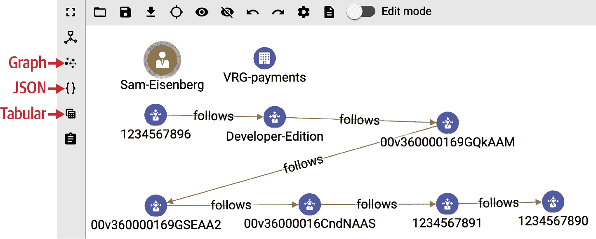

###### 图 3-12\. `Sam-Eisenberg` 的 `customer_journey_path` 查询输出（在 [`oreil.ly/gpam0312`](https://oreil.ly/gpam0312) 上查看更大的版本）

### 相似的客户

在我们实施相似性度量之前，我们需要首先确定要计算相似性的属性。在我们的情况下，我们希望根据参与类似市场活动集的客户来计算相似性。为了衡量这一点，我们使用 Jaccard 相似性。Jaccard 相似性不仅适用于图结构数据。它是一种衡量两个集合相似度的方法，基于属于一个集合的项同时属于另一个集合的数量，除以两个集合中出现的所有不同项的总数。在图的情况下，每个顶点都有一组邻居顶点。因此，基于图的 Jaccard 相似性衡量了一个顶点的邻居集与另一个顶点的邻居集之间的重叠程度。换句话说，共同邻居的数量相对于总邻居数是多少？

我们的情况稍微复杂一些，因为我们想要评估与活动关联的相似性；然而，**`活动`**与**`联系人`**之间相距两步，而不是直接连接。此外，我们允许用户按活动类型进行筛选以计数。

让我们浏览`similar_contacts`查询的 GSQL 代码。此查询接受三个参数。第一个参数`source_customer`是类型为 **`Contact`** 的顶点，代表我们要找到类似客户的客户。第二个参数是用户希望考虑的活动类型（字符串）集合。第三个参数是确定我们要返回多少个类似客户的整数值：

```
CREATE QUERY similar_contacts(VERTEX<Contact> source_customer,
                              SET<STRING> campaign_types, INT top_k = 5) {
```

我们从声明四个累加器开始。前三个是整数计数：输入客户的活动数(`@@size_A`)，每个候选联系人的活动数(`@size_B`)，以及它们共同的活动数(`@size_intersection`)。只有一个输入，所以`@@size_A`是全局累加器。其他三个是附加到顶点的本地累加器。我们还有一个`FLOAT`类型的本地累加器来存储计算出的相似度值：

```
    SumAccum<INT> @@size_A, @size_B, @intersection_size;
    SumAccum<FLOAT> @similarity;
```

然后我们使用`outdegree()`函数来获取`@@size_A`的值，指定边类型 **`is_connected_to`**：

```
 A = SELECT s
        FROM A:s
        ACCUM @@set_size_A += s.outdegree("is_connected_to");
```

现在我们从`source_customer`跨越两个跳到首先到`**Campaign​Mem⁠⁠ber**`，然后到`**Campaign**`顶点。这对应于 Figure 3-13 中的步骤 1 和 2。注意用于检查活动类型的`WHERE`子句：

```
    campaign_mem_set =
      SELECT t
      FROM A:s -(is_connected_to>:e)- CampaignMember:t;

    campaign_set =
      SELECT t
      FROM campaign_mem_set:s -(is_part_of>:e)- Campaign:t
      WHERE campaign_types.size() == 0 OR (t.Campaign_Type IN campaign_types);
```

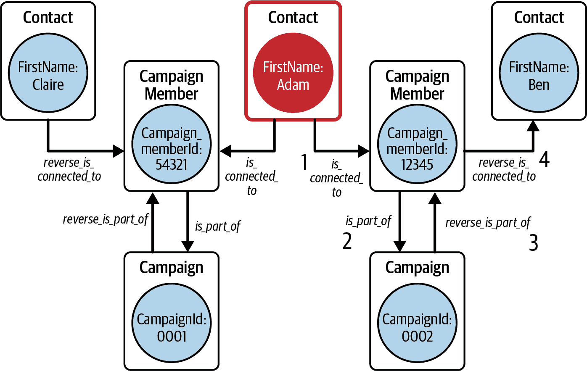

###### 图 3-13。选择计算 Jaccard 相似度分数的相似客户步骤概览

下一个阶段是分析的基于图的方法的一个很好的示例。此查询的任务是“查找所有具有与联系人 A 类似关系的联系人 B”。而不是搜索所有可能的 **`Contacts`**，然后比较它们的关系，我们去到 A 的相关实体，然后从那里向候选 **`Contacts`** 后退。这些是 Figure 3-13 中的步骤 3 和 4。推理是这种前进然后后退跨关系遍历会自动过滤掉没有共同点的候选者。如果我们聪明的话，在遍历时我们可以测量相似度的程度。

比较步骤 3 的 GSQL 代码与步骤 2 的代码。注意有向边的方向性指示符从 > 后缀变为 < 前缀：

```
    rev_campaign_mem_set =
        SELECT t
        FROM campaign_set:s -(<is_part_of:e)- CampaignMember:t;
```

最后一跳更复杂，因为它包含 Jaccard 计算。跳跃本身如预期那样，有一个`WHERE`子句来排除回到我们的`source_customer`：

```
    B = SELECT t
        FROM rev_campaign_mem_set:s -(<is_connected_to:e)- Contact:t
        WHERE t != source_customer
```

回想一下，`ACCUM`子句就像是在满足前面的`FROM-WHERE`子句的每条路径上迭代的`FOREACH`块。以下代码逐步计算 A 和 B 活动集之间的交集大小，并为此特定的 **`Contact`** 设置`@size_B`：

```
        ACCUM t.@intersection_size += 1,
            t.@size_B = t.outdegree("is_connected_to")
```

现在我们可以计算 Jaccard 相似性了。顾名思义，`POST-ACCUM`子句通常在`ACCUM`子句之后执行。关于`POST-ACCUM`有两条最重要的规则：1）它可以使用前面`ACCUM`子句的累加器结果，2）它只能使用顶点变量，不能使用边变量。我们使用了 Jaccard 相似性的一个标准公式。分母等于集合 A 和 B 中唯一项的数量。分子中的 1.0 是为了执行浮点运算而不是整数运算。

```
        POST-ACCUM t.@similarity = t.@intersection_size*1.0/
                                 (@@size_A + t.@size_B - t.@intersection_size)
```

最后，我们按照相似性得分从高到低排序，并只取`top_k`个结果进行打印：

```
        ORDER BY t.@similarity DESC
        LIMIT top_k;

    PRINT @@size_A;
    PRINT B[B.FirstName, B.LastName, B.@similarity, B.@size_B];
```

我们通过实现 Jaccard 相似性来展示一些图算法在 GSQL 中的易实现性，同时帮助您理解该方法，以便如果您想编写自己的查询和分析时可以使用。TigerGraph 提供了一个广泛的预写图数据科学算法库，我们将在本书的后面介绍。

# 案例 2：分析药物不良反应

在我们的第二个使用案例中，我们试图分析药物治疗的不良反应。

今天的医疗系统涵盖了全球数据量的 30%，其复合年增长率预计到 2025 年将达到 36%。³ 这些数据来源于美国食品药品监督管理局（FDA）和国家数据库医学协会等外部来源，以及来自健康保险公司的私有数据集。组织利用这些数据获取有价值的洞见，创建针对性的内容和参与活动，改善健康保险计划，并开发药物。开发更好的医疗疗法是我们此用例的重点。

在开发药物时，清楚地了解药物的组成、它们如何相互作用以及可能引起的副作用至关重要。因此，FDA 要求每家药品制造商监控其药物与其他药物的使用情况，并报告任何不良反应。

分析师和研究人员希望找出各种药物、使用这些药物的患者以及可能的副作用之间的关系。医生是否会给同一个邮政区域的人开同一种药物，或者他们的评估主要建立在去同一所大学的患者基础上？当患者报告对某种药物有不良反应时，其他患者可能也面临危险，因为他们的药物相互作用历史。如果没有了解这些药物相互作用发生的方式以及给予这些药物处方的对象，该领域的研究将变得困难，并且当药物和副作用之间的重要联系被忽视时，可能会对公共健康构成威胁。

# 解决方案：药物交互 360 图

日益增长的医疗数据量带来了在大规模结合外部和内部数据源并以有意义的方式展示这些数据的挑战。这个领域的应用需要一种方法，既能处理这么大量的数据，又能在各种数据源中找到隐藏的模式。

图数据库是发现和分析药物相互作用的理想数据平台。通过图数据库，我们可以形成关键实体的 360 视图，并连接这些关键实体以揭示患者之间的所有可能相关性，以及这些药物的制造商。

相比之下，关系数据库和 NoSQL 数据库将数据存储在单独的表中，并依赖于分析师的领域专业知识来选择要连接的表，每次连接都是一次昂贵的操作。发现相互作用和相关性仅限于分析师检查的特定情况，形成特定表连接序列。对于这种情况，表格结构不如图结构有利于科学发现。

# 实施

为了说明一个药物相互作用 360 图，我们将使用名为“Healthcare Graph（Drug Interaction/FAERS）”的 TigerGraph Cloud Starter Kit。要跟进，请查看之前的说明，了解如何部署 TigerGraph Cloud Starter Kit，加载数据并安装查询。

我们用于此用例的数据来自美国 FDA 公开可用的数据。它包括 FDA 不良事件报告系统（FAERS）的季度数据，包括药品的人口统计和行政信息，患者结果以及案例报告中的反应。FDA 将数据发布为七个表格。文档包括一个实体关系图，表明了一个双中心 360 图的可能性。然而，使用关系数据库技术调查这些数据将需要创建许多连接表。使用图数据库，我们可以更轻松地遍历这些关系。

## 图模式

为了提高数据的可见性和分析能力，我们建议将这七个表格转换为 10 种顶点类型和 10 种边类型。我们将`**Drug**`表格分成`**Drug**`和`**DrugSequence**`顶点类型，将`Demographic`表格分成`**ReportedCase**`、`**Patient**`和`**PharmaCompany**`表格。这些分割使我们能够根据需要调整焦点，并更容易地看到不同因素之间的相互作用。对于每个`**ReportedCase**`，我们可以找到关于患者、药品制造商、患者反应、报告来源、结果以及患者正在服用的各种药物的信息。对于每个`**DrugSequence**`，我们可以找到相关药品、指示以及患者的疗法。

表格 3-2 描述了 10 种顶点类型，而 图 3-14 显示了它们的连接方式。起始套件包含一个日历季度的数据。总计有 1.87M 个顶点和 3.35M 条边。

表格 3-2\. 药品信息模型中的顶点类型

| 顶点类型 | 描述 | 实例数 |
| --- | --- | --- |
| `**药品序列**` | 一系列 `**药品**` 元素 | 689,312 |
| `**药品**` | 作为 `**药品序列**` 一部分的药物 | 40,622 |
| `**适应症**` | 可以用 `**药品序列**` 治疗的适应症（医疗状况） | 422,145 |
| `**治疗**` | 使用 `**药品序列**` 的治疗方法 | 268,244 |
| `**报告病例**` | 副作用的报告案例 | 211,414 |
| `**患者**` | 报告案例的人 | 211,414 |
| `**结果**` | 对 `**报告病例**` 进行评估后的结果 | 7 |
| `**报告来源**` | 用于 `**报告病例**` 的来源类型 | 9 |
| `**反应**` | 从 `**报告病例**` 得到的反应 | 9,791 |
| `**制药公司**` | 生产 **`药品`** 的制药公司 | 7,740 |

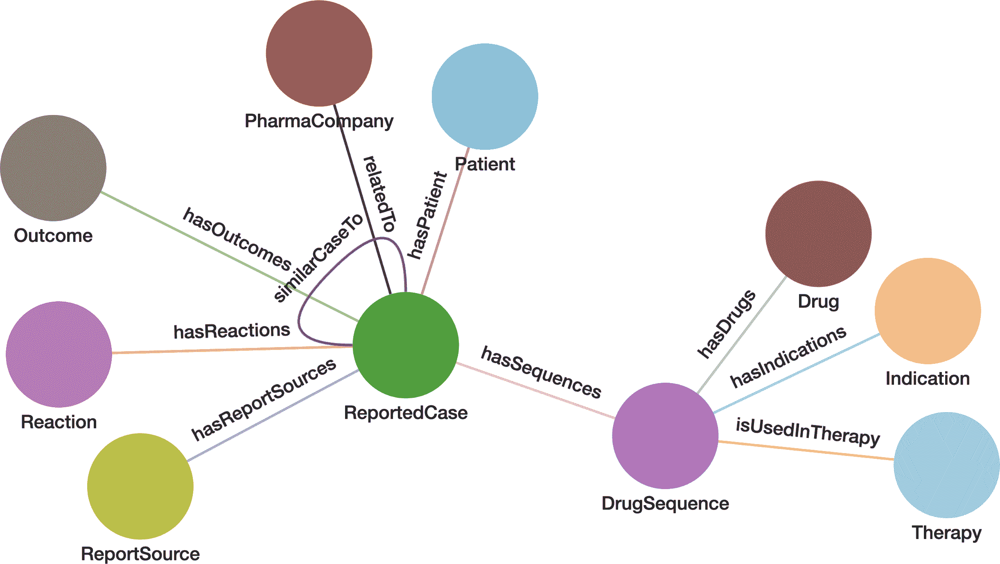

###### 图 3-14\. 药品信息数据的图模式（在 [`oreil.ly/gpam0314`](https://oreil.ly/gpam0314) 查看更大的版本）

## 查询和分析

药物相互作用起始套件提供了三个示例，用于药物相互作用分析。通过这些示例，勤奋的分析师可以看到如何构建其他查询，甚至更复杂的查询。

基于反应查找类似报告案例

寻找具有类似反应集的案例可以帮助理解根本原因。该查询从给定的报告案例开始，计算其与其他案例的相似性，基于患者反应的相似性。然后返回得分最高的类似案例。

公司报告的大多数药物

制药公司想知道他们的药物中哪些收到了最多的不良反应报告。政府监管机构也可能对此感兴趣。此查询为他们执行此计算。

最常见的顶级药物副作用

制药公司和监管机构想要知道报告的不仅仅是哪些药物，还想知道最常见的副作用是什么。该查询选择给定 `**公司**` 的最高 `**药品**` 类型，并计算该药物的每种 `**反应**` 被报告的次数。

### 寻找类似的报告案例

拥有相似特征的事物是相似的，但究竟如何度量？您必须决定哪些特征重要以及如何评估相似性的强度。在图中，实体的特征不仅包括其属性，还包括其关系。查看 图 3-14，您可以看到 `**ReportedCase**` 周围与其他六种顶点类型的关系，这些都是潜在的相似性因素。它还有一种边缘类型 `**similarCaseTo**`，可以在那里存储相似性计算的结果。

查询实现基于关系的相似度评分：`jaccard_nbor_reaction`。查询的第一个参数 `source` 是感兴趣的 `**ReportedCase**`。`etype` 参数指定要考虑的关系类型。`top_k` 参数确定查询返回的报告案例数，而 `sampSize` 如果每个 `**Reaction**` 实例有超过此阈值的相关案例则调用抽样。

一旦我们指定要考虑的特征，仍然需要应用一个用于测量相似性的公式。此查询使用 Jaccard 相似度，当属性是分类而不是数值时，这是最常用的测量方法。我们只知道反应是否发生，而不知其强度，因此数据是分类的。

```
CREATE QUERY jaccard_nbor_reaction(VERTEX source, STRING etype
  ="hasReactions", INT top_k=100, INT sampSize=100) FOR GRAPH faers { 
  //example: ReportedCase=100640876
/*
Calculates the Jaccard Similarity between a given vertex and every other
vertex. A simplified version of the generic purpose algorithm
jacccard_nbor_ss in the GSQL Graph Data Science Library
https://github.com/tigergraph/gsql-graph-algorithms
*/
    SumAccum<INT> @intersection_size, @@set_size_A, @set_size_B;
    SumAccum<FLOAT> @similarity;
    SumAccum<INT> @@t_Size;

    Start (ANY) = {source}; 
    Start = SELECT s
        FROM Start:s
        ACCUM @@set_size_A += s.outdegree(etype); 

    Neighbors = SELECT t 
        FROM Start:s-(etype:e)-:t;
```

类似于我们第一个案例示例中的第一个查询，我们需要定义从哪些顶点开始遍历。我们在  处进行此操作。然后，为了计算 Jaccard 计算，我们需要源顶点的邻居集大小，我们通过应用 `out_degree` 函数并在  处指定 `etype` 来获取此信息。在  处，我们通过从 `Start` 到每个 `etype` 边缘的遍历来收集 `**Neighbors**`。

表达式 `Start:s-(etype:e)-:t` 在图中表示遍历模式，位于 。此特定模式意味着：

1.  以集合成员 `Start` 开始。

1.  连接到类型为 `etype` 的边缘。

1.  通过该边缘，到达任何目标顶点。

该表达式还为模式的三个部分定义了三个别名：`s`、`e` 和 `t`。`FROM` 子句的结果是满足模式的元组集合 (`s`, `e`, `t`)。别名 `t` 表示目标顶点集的成员。这些别名是局部的，只能在此 `SELECT` 块内使用。它们与其他 `SELECT` 块中的别名无关。

在  处，我们选择其他顶点。我们通过检查 `etype` 是否为 `reactionTo` 来执行此操作；然后 `Neighbors` 将包括给定源 `**ReportedCase**` 的所有 `**Reactions**`。然后我们通过再次遍历 `etype` 边，从 `Neighbors` 构建一组 `**ReportedCases**`。如果邻居的出度大于 `sampSize`，我们只遍历连接边的一个样本。我们在  处排除源顶点的选择。

```
 Others = SELECT t 
        FROM Neighbors:s -(:e)- :t 
        SAMPLE sampSize EDGE when s.outdegree(etype) > sampSize
        WHERE t != source 
        ACCUM t.@intersection_size += 1,
            t.@set_size_B = t.outdegree(etype)
        POST-ACCUM t.@similarity = t.@intersection_size*1.0/ 
                  (@@set_size_A + t.@set_size_B - t.@intersection_size),
            @@tSize += 1
        ORDER BY t.@similarity DESC 
        LIMIT top_k;

    PRINT Others;
    PRINT @@t_Size, Others.size();
```

###### 提示

这种模式（遍历邻居，沿着相同的边类型返回遍历，排除起始顶点）是一种常见的技术，用于查找与起始实体有共同点的实体。这是基于图的协同过滤推荐的技术。

在  处，我们计算源顶点与每个 `Others` 成员之间的 Jaccard 相似性分数。给定两个集合 A 和 B，*Jaccard*(A, B) 定义为：

> (A 和 B 的交集) / (A 的大小 + B 的大小 - A 和 B 的交集)

高效的 GSQL 实现略微复杂。我们不会逐行详细说明，但我们会指出两种范例：

+   在我们的情况下，集合由 A 和 B 的邻居组成。我们不是从集合 A 和 B 开始计算它们的交集，而是从 A 开始，然后进入其邻居，再进入它们的邻居。这样可以找到所有的 B 集合，使得 intersection(A, B) 不为空。

+   我们使用分布式处理同时对一组成员执行操作。在 GSQL 中，`ACCUM` 和 `POST-ACCUM` 子句是隐式的 `FOREACH` 循环，指定了对每个迭代集的操作。迭代顺序未指定。TigerGraph 计算引擎可以同时处理多个迭代。

`ACCUM` 子句在满足前面的 `FROM/SAMPLE/WHERE` 子句的连接顶点和边的每组模式元组上充当 `FOREACH` 循环的角色。在这个 `SELECT` 块中，`s` 表示 `Neighbors` 的成员，它是一个 `**Reaction**`，而 `t` 表示具有该 `**Reaction**` 的 `**ReportedCase**`。`POST-ACCUM` 子句是另一个 `FOREACH` 循环，但它只能在一个顶点别名上操作（例如 `s` 或 `t`）。

在  处，我们按照降序相似性分数对 `Others` 顶点进行排序，然后将集合修剪为仅包括 `top_k` 个顶点。最后，我们打印 `Others` 中的所有顶点以及 `@@t_Size` 的值。

通过使用建议的源案例 `100640876` 运行查询，然后以表格形式查看结果，我们发现三个具有完美相似度分数 1 的 `**ReportedCase**` 实例：`103126041`、`101749293` 和 `102852841`。然后还有一些其他的相似度分数为 0.5 的实例。

### 公司报告的最多的药物

`most_reported_drugs_for_company`查询有三个参数。 第一个参数`company_name`选择要查找其最多报道药物的公司。 第二个参数`k`确定我们希望返回多少种药物类型。 最后一个参数用于过滤具有给定`role`值的`DrugSequence`元素：

```
CREATE QUERY most_reported_drugs_for_company(
   STRING company_name="PFIZER",INT k=5, STRING role="PS") { 
    // Possible values for role: PS, SS, I, C
    // PS = primary suspect drug, SS = secondary suspect drug
    // C = concomitant, I = interacting

    // Keep count of how many times each drug is mentioned.
    SumAccum<INT> @num_Cases;
```

反思“公司的最*报道药物*”。 我们可以推断出这个查询必须遍历`**ReportedCase**`、`**Drug**`和`**PharmaCompany**`顶点。 回顾一下图 3-14 看看这些顶点类型是如何连接的：

> `**药物 – DrugSequence – ReportedCase – 制药公司**`

从`**药物**`到`**制药公司**`有三个跳跃；我们的查询将分三个阶段完成其工作。将 GSQL 组合为多阶段过程而不是多个单独的查询，可以使用累加器作为临时存储值，既提高性能又增强功能性。

首先，我们找到与输入参数中给定公司相关的所有`**ReportedCase**`顶点。 深入挖掘：我们构建一个包含所有`**Company**`顶点的顶点集，因为 GSQL 要求图遍历从一个顶点集开始。 然后，我们选择所有链接到`**Company**`顶点的`**ReportedCase**`顶点，只要该公司的名称与`company_name`参数匹配：

```
// 1\. Find all cases where the given pharma company is the 'mfr_sndr'
    Company = {PharmaCompany.*};
    Cases = SELECT c
        FROM Company:s -(relatedTo:e)- ReportedCase:c
        WHERE s.mfr_sndr == company_name;
```

然后，我们从上面收集的选定的**`ReportedCase`**顶点开始遍历到其关联的`**DrugSequence**`顶点。 然后，我们过滤`**DrugSequence**`集合，只包括其角色与查询的`role`参数匹配的那些：

```
// 2\. Find all drug sequences for the selected cases.
    DrugSeqs = SELECT ds
        FROM Cases:c -(hasSequences:e)- DrugSequence:ds
        WHERE (role == "" OR ds.role_cod == role);
```

在代码的最后部分，我们将第二部分中选择的`**DrugSequence**`顶点与其相关的`**Drug**`顶点连接起来。 当然，我们不仅仅是查找药物。 我们统计了特定药物出现的案例数，然后按出现次数降序排序，并选择出现频率最高的`k`种药物：

```
// 3\. Count occurrences of each drug mentioned in each drug sequence.
    TopDrugs = SELECT d
        FROM DrugSeqs:ds -(hasDrugs:e)-> Drug:d
        ACCUM d.@num_Cases += 1
        ORDER BY d.@num_Cases DESC
        LIMIT k;

    PRINT TopDrugs;     
}
```

使用默认输入值（`company_name="PFIZER", k=5, role="PS"`）运行此查询，我们得到 Lyrica、Lipitor、Chantix、Celebrex 和 Viagra 这些药物。 查看 JSON 或表格输出，我们可以看到案例数分别为 2682、1259、1189、1022 和 847。

### 最受欢迎的药物的顶部副作用

查询`top_side_effects_for_top_drugs`返回给定`**公司**`最多报道的`**药物**`的顶部副作用*.* 与之前的查询类似，它还想找到公司的最多报道药物，但也额外工作来计算副作用。 其参数列表与`most_reported_drugs_for_company`相同，但这里`k`不仅指最多报道的药物，还指最频繁的副作用：

```
CREATE QUERY top_side_effects_for_top_drugs(STRING company_name="PFIZER",
  INT k=5, STRING role="PS") FOR GRAPH faers SYNTAX v2 { 
    // Possible values for role: PS, SS, I, C
    // PS = primary suspect drug, SS = secondary suspect drug
    // C = concomitant, I = interacting

    // Define a heap which sorts the reaction map (below) by count.
    TYPEDEF TUPLE<STRING name, INT cnt> tally;
    HeapAccum<tally>(k, cnt DESC) @top_Reactions;

    // Keep count of how many times each reaction or drug is mentioned.
    ListAccum<STRING> @reaction_List;
    SumAccum<INT> @num_Cases;
    MapAccum<STRING, INT> @reaction_Tally;
```

就像我们为上一个查询所做的那样，让我们看一下查询的名称和描述，以了解我们必须遍历哪些顶点和边类型。我们可以看到，我们需要包括`**ReportedCase**`、`**Drug**`和`**PharmaCompany**`，以及`**Reaction**`（副作用）。这建立了一个 Y 形图遍历模式：

```
Drug – DrugSequence – ReportedCase – PharmaCompany
                                \– Reaction
```

这个查询有五个阶段。这个查询的第 1、3 和 4 阶段与`most_reported_drugs_for_company`查询中的第 1、2 和 3 阶段相同或略有增强。

第 1 阶段与`most_reported_drugs_for_company`中的第 1 阶段相同——查找与作为输入参数给定的公司相关的所有`**ReportedCase**`顶点：

```
 // 1\. Find all cases where the given pharma company is the 'mfr_sndr'
    Company = {PharmaCompany.*};
    Cases = SELECT c
        FROM Company:s -(relatedTo:e)- ReportedCase:c
        WHERE s.mfr_sndr == company_name;
```

第 2 阶段是新的：现在我们有了一组`**ReportedCase**`顶点，我们可以计算它们关联的**`Reactions`**。我们遍历所有`**ReportedCase**` `**–**` `**Reaction**`边，并将每个病例`c`的反应类型`r.pt`添加到附加到该病例`c`的字符串列表中：

```
// 2\. For each case, attach a list of its reactions.
    Tally = SELECT r
        FROM Cases:c -(hasReactions:e)- Reaction:r
        ACCUM c.@reaction_List += r.pt;
```

在第三阶段，我们从第一阶段选择的`**ReportedCase**`顶点开始遍历它们关联的`**DrugSequence**`顶点。我们首先执行遍历，然后过滤`**DrugSequence**`集合，仅包括其角色与查询的`role`参数匹配的部分。之后，我们将附加到`**ReportedCase**`顶点的反应列表复制到其关联的`**DrugSequences**`。这最后一步是一种 GSQL 技术，用于将数据移动到我们需要的位置：

```
// 3\. Find all drug sequences for the selected cases, and transfer
    //    the reaction list to the drug sequence.
    DrugSeqs = SELECT ds
        FROM Cases:c -(hasSequences:e)- DrugSequence:ds
        WHERE (role == "" OR ds.role_cod == role)
        ACCUM ds.@reaction_List = c.@reaction_List;
```

在第 4 阶段，我们将第 2 阶段选择的`**DrugSequence**`顶点与其关联的`**Drug**`顶点连接起来。除了计算药物的病例数之外，我们还计算每个`**Reaction**`的发生次数：

```
// 4\. Count occurrences of each drug mentioned in each drug sequence.
    //    Also count the occurrences of each reaction.
    TopDrugs = SELECT d
        FROM DrugSeqs:ds -(hasDrugs:e)- Drug:d
        ACCUM d.@num_Cases += 1,
            FOREACH reaction in ds.@reaction_List DO
                d.@reaction_Tally += (reaction -> 1)
           END
        ORDER BY d.@num_Cases DESC
        LIMIT k;
```

最后，在第 5 阶段，我们只取前`k`个副作用。我们通过计数`tally`中的每个`reaction`，按降序排序，并返回前几个：

```
// 5\. Find only the Top K side effects for each selected Drug.
    TopDrugs = SELECT d
         FROM TopDrugs:d 
         ACCUM
             FOREACH (reaction, cnt) IN d.@reaction_Tally DO
                 d.@top_Reactions += tally(reaction,cnt)
             END
         ORDER BY d.@num_Cases DESC;

    PRINT TopDrugs[TopDrugs.prod_ai, TopDrugs.@num_Cases,
                   TopDrugs.@top_Reactions];
}
```

如果您使用默认输入运行此查询（与上一个查询相同），则视觉输出看起来相同。区别在于`TopDrugs.@top_Reactions`累加器。最好的方法是查看 JSON 输出。对于来自辉瑞的最多报告的药物 Lyrica，我们有以下数值：

```
          "TopDrugs.@top_Reactions": [
            { "cnt": 459,"name": "Pain"},
            { "cnt": 373, "name": "Drug ineffective" },
            { "cnt": 167, "name": "Malaise" },
            { "cnt": 145, "name": "Feeling abnormal" },
            { "cnt": 145, "name": "Pain in extremity" }
          ],
```

# 章节总结

在本章中，我们深入研究了两个用例，以展示图形的强大之处，帮助用户更清晰、更全面地看到其数据中的关系。我们介绍了 TigerGraph Starter Kits——预先安装在 TigerGraph Cloud 实例上的演示数据库和查询，展示了各种不同用例的基础知识。我们演示了获取和安装 Customer 360 starter kit 的过程。同时，我们还演示了使用 GraphStudio 的前几个步骤。

我们还向您介绍了 GSQL，这是 TigerGraph 图数据库使用的类 SQL 过程化图查询语言。了解 SQL 和传统编程语言的读者应该可以轻松学习 GSQL。为了展示 GSQL 如何在我们的图分析中发挥作用，我们深入探讨了两个用例。在第一个用例中，我们定义了一个客户旅程，并描述了销售团队如何通过记录和分析客户旅程来获益。然后，我们展示了 Customer 360 图如何提供一个强大而灵活的集成客户数据的方式，然后可以将其表示为客户旅程。我们详细介绍了三个 GSQL 查询，这些查询用于探索和分析客户旅程。在第二个用例中，我们展示了如何使用 360 图显示用于医疗治疗的药物之间所有可能的交互和相关性。这样的分析对于检测并采取有害副作用非常重要。

¹ “CRM Market Share—Salesforce Bright Future in 2020,” Nix United，2020 年 2 月 19 日，[*https://nix-united.com/blog/crm-market-share-salesforce-bright-future-in-2020*](https://nix-united.com/blog/crm-market-share-salesforce-bright-future-in-2020)。

² “Market Share of CRM Leading Vendors Worldwide 2016–2020,” Statista，2022 年 6 月 13 日，[*https://www.statista.com/statistics/972598/crm-applications-vendors-market-share-worldwide*](https://www.statista.com/statistics/972598/crm-applications-vendors-market-share-worldwide)。

³ “The Healthcare Data Explosion,” RBC Capital Markets，访问日期为 2023 年 5 月 21 日，[*https://www.rbccm.com/en/gib/healthcare/episode/the_healthcare_data_explosion*](https://www.rbccm.com/en/gib/healthcare/episode/the_healthcare_data_explosion)。
