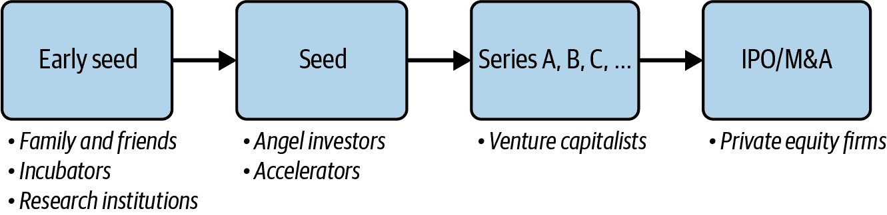
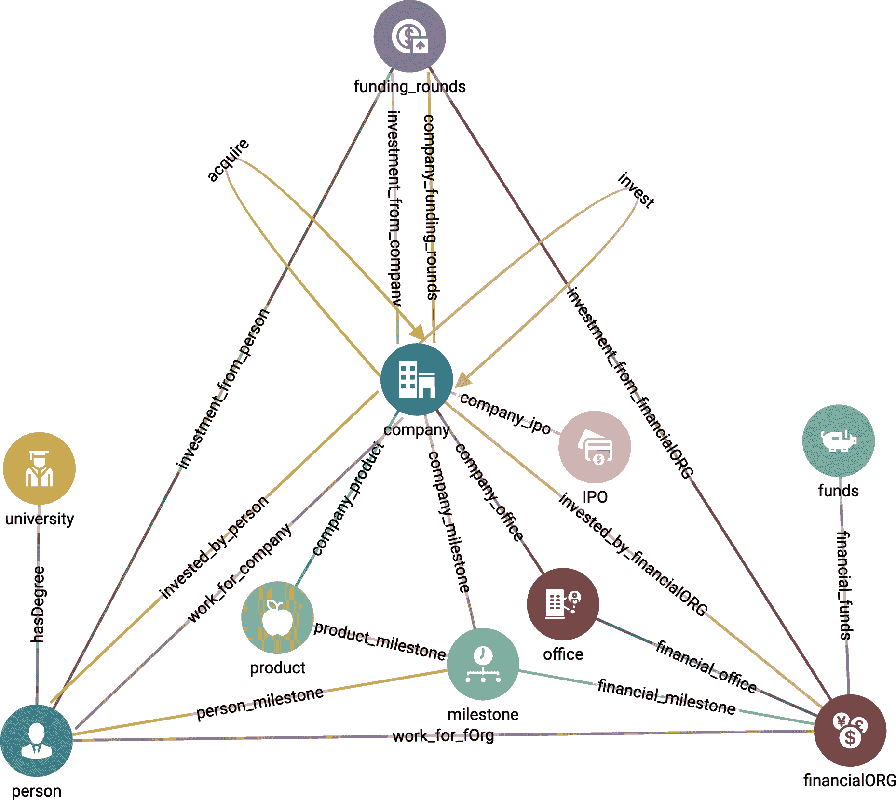
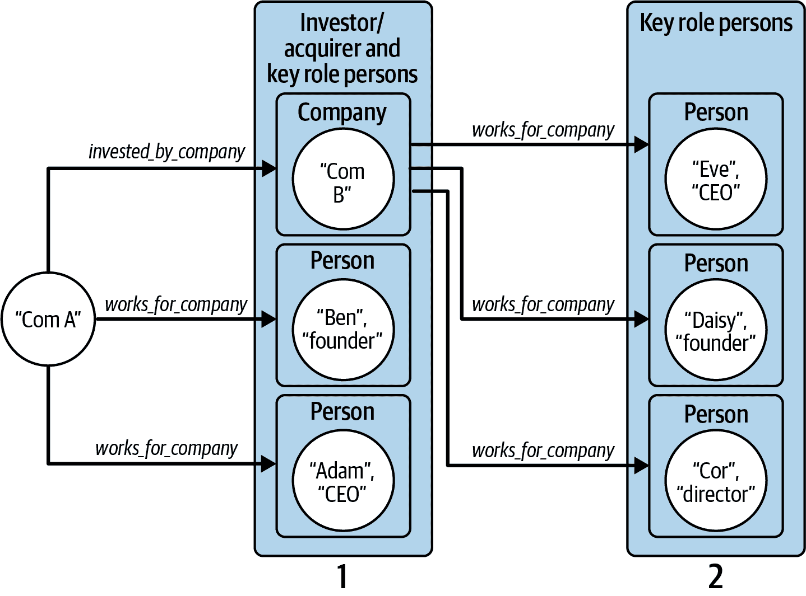
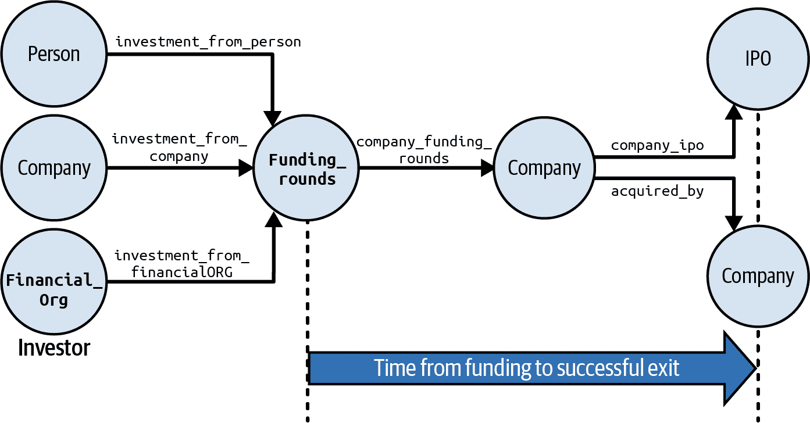
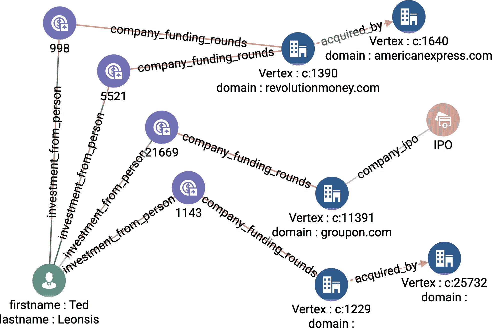
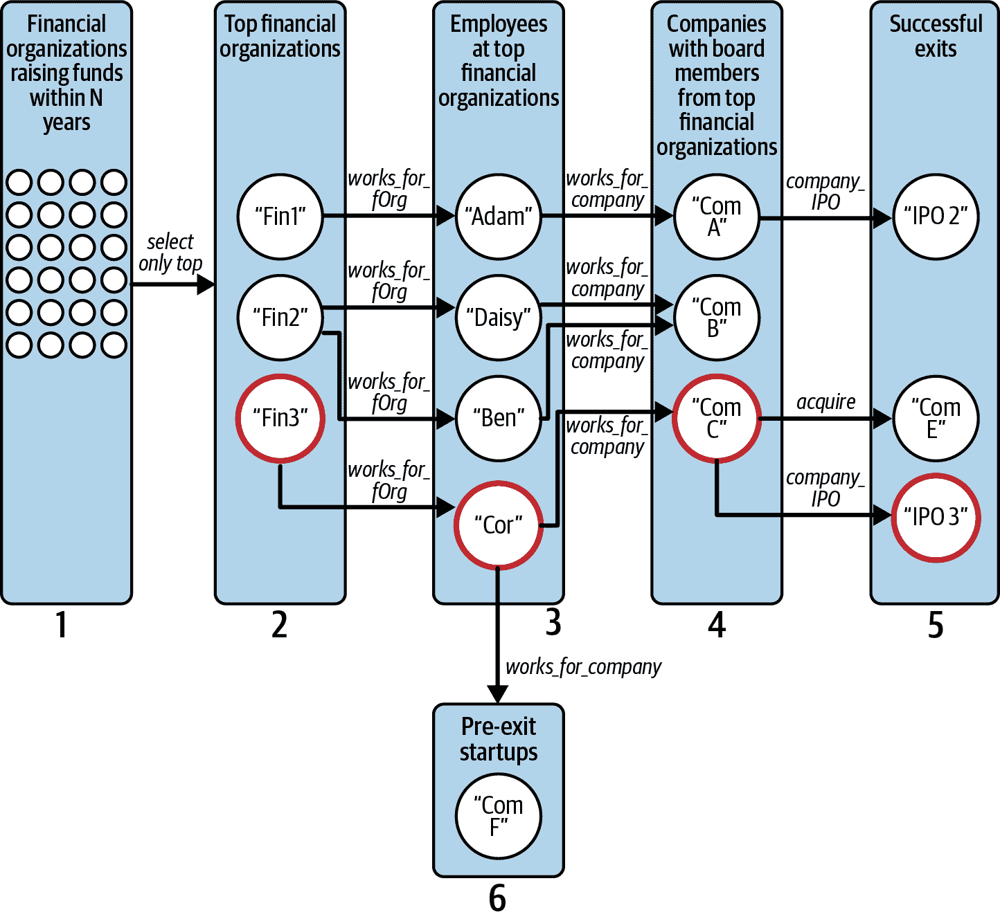
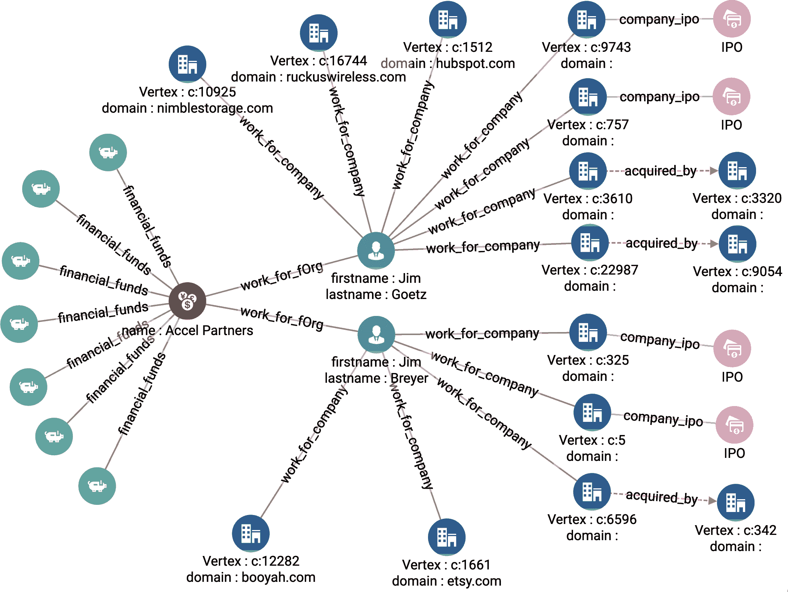
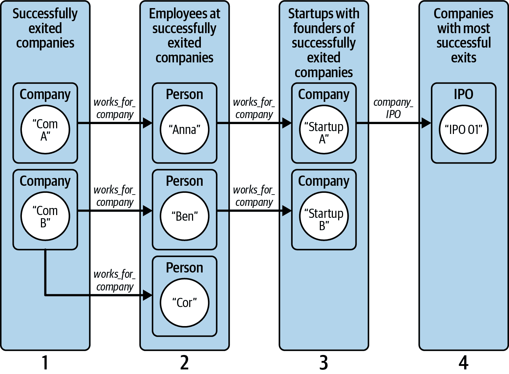
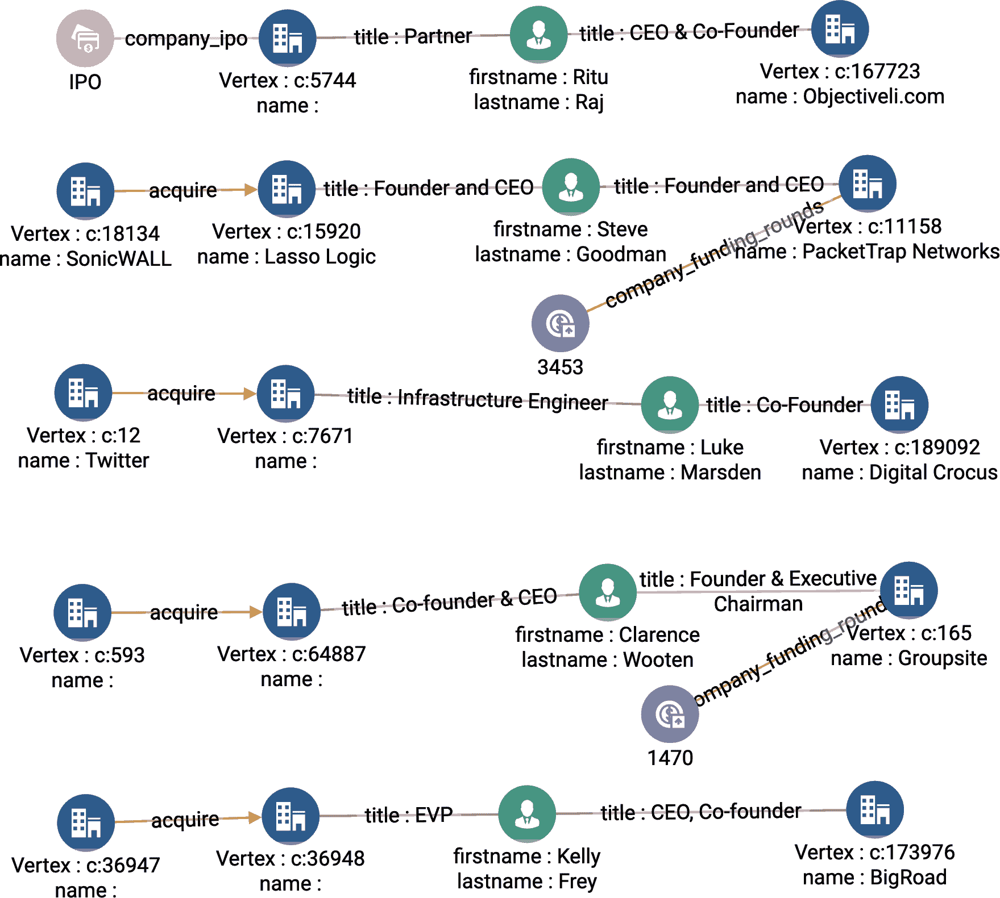

# 第四章：研究初创投资

在本章中，我们将深入探讨初创投资领域。这个现实生活中的用例向我们展示了六种图谱力量中的三种如何帮助我们揭示高潜力的投资机会。第一种图谱力量，连接各种角色，让我们可以看到投资景观中各种角色是如何相互连接的。第二种图谱力量，深入观察，为投资者提供了一种方法，通过我们的分析包含有关这些角色的连接信息。第三种图谱力量，权衡和预测，使我们能够利用过去的资金事件和投资组合来预测未来投资的成功率。

完成本章后，您应该能够：

+   解释连接各种角色、深入观察和权衡预测如何解决搜索和分析需求

+   对初创投资机会进行建模和分析

+   遍历多跳关系以过滤更深层次的连接信息

+   阅读和理解更高级的 GSQL 查询

# 目标：寻找有前途的初创公司

投资初创公司是一种既令人兴奋又有利可图的财富积累方式。2020 年，投资者在美国初创公司中投入超过 1560 亿美元。这些初创公司产生了超过 2900 亿美元的流动性[¹]。然而，十分之九的初创公司将会失败，只有 40%的公司变得盈利，这让正确押注变得非常具有挑战性[²]。

初创公司从成立团队开始，团队成员仅有少数几人。随着时间的推移，随着初创公司经历不同的发展阶段，其产品得到改进，团队也在壮大。为了资助这些发展，初创公司需要来自投资者的资金。从投资的角度来看，识别哪家初创公司适合融资的一种方法是看初创团队及其组织的构成。在其组织中拥有正确的人员的初创公司通常有更高的成功机会。因此，由具有积极创业历程的创始人领导的初创公司，在其他公司中也更有可能取得成功。评估投资机会的另一种方式是观察初创公司的现有投资者。投资组合回报率高的投资者表明他们能够看到早期阶段初创公司的潜力，并帮助它们发展成为更有利可图的企业。

投资初创公司是一个风险高、评估复杂的过程，需要理解其试图进入的产品和市场，以及推动其发展的人员和组织。投资者需要了解这些方面之间的关系概况，以帮助支持对初创公司潜力的分析。

# 解决方案：一种初创投资图谱

用于支持投资评估的数据主要是非结构化的，因为它来自不同的来源。其中一个例子是 Crunchbase 数据集。该数据集包含有关投资轮次、创始人、公司、投资者和投资组合的信息。然而，该数据集是原始格式，这意味着数据没有结构化以回答我们对与初创企业相关的实体的问题。除非我们显式查询数据，否则关于初创企业及其当前状态的实体的数据对我们而言是隐藏的。使用图表，我们可以形成以我们要调查的目标初创企业为中心的模式，并查看其他实体对该初创企业的影响。

投资初创企业发生在一系列融资事件中，如图 4-1 所示。初创企业通常希望在每个后续融资阶段从更广泛的投资者组合中筹集更多资金。了解这些融资阶段的时间和顺序对验证成功的投资互动至关重要。通过搜索多跳事件链，图表可以提供投资网络的完整概述。通过这样做，我们可以通过不同的融资阶段连接天使投资者和风险投资家，并逐步展示他们投资组合的成功率。



###### 图 4-1\. 初创企业融资阶段和每个阶段的投资者类型

传统的关系型数据库查询为我们提供了事件的快照和单个时间点上每个实体的状态。然而，在评估投资组合时，我们需要理解投资者与他们投资的公司之间的关系以及这些关系如何发展。图表通过使用多跳查询展示投资组合作为一系列事件。我们还可以使用多跳执行复杂的搜索和过滤，比如“找到那些拥有来自顶级风投公司的董事会成员，并且曾在有成功退出的初创公司董事会上任职的公司”。

例如，我们想知道一个成功投资者的同事现在投资哪些初创企业。这种洞察力允许我们利用成功投资者基于他们过去的投资的专业知识和网络。通过多跳查询，首先选择一个或多个成功的投资者来实现这一目标。我们可能已经有一些人选，或者我们可以通过计算每个投资者的成功投资者数量来找到他们；这将是一次跳跃。第二次跳跃选择投资者所在的所有金融机构。第三次跳跃查询选择这些金融机构的同事，第四次跳跃选择这些同事参与的其他融资事件。

# 实施初创企业投资图和查询

TigerGraph 云为初创公司投资分析用例提供了一个入门套件。在本章的其余部分，我们将描述如何使用图模式对初创公司及其融资进行建模。然后我们将看看四种不同的图分析，这些分析可能帮助投资者选择有前途的初创公司。

## Crunchbase 入门套件

使用您在第三章中创建的 TigerGraph 云账户来部署一个新的用例，并选择“企业知识图谱（Crunchbase）”。安装了这个入门套件之后，按照第三章的“加载数据和安装查询的入门套件”部分的步骤进行操作。

## 图模式

入门套件包含了 Crunchbase 在 2013 年收集的初创公司投资的实际数据。它具有超过 575K 个顶点和超过 664K 条边，包括 10 种顶点类型和 24 种边缘类型。图表 4-2 展示了该入门套件的图模式。我们可以立即看到，`**公司**`是一个作为枢纽的顶点类型，因为它连接到许多其他顶点类型。



###### 图 4-2\. 企业知识图谱（Crunchbase）的图模式（请查看更大版本的图表：[`oreil.ly/gpam0402`](https://oreil.ly/gpam0402)）

此外**，**还有两种类型的自环。一个`**公司**`可以`**收购**`另一个`**公司**`，而一个`**公司**`也可以投资于另一个`**公司**`。另一方面，`**人**`类型的顶点没有自环，这意味着社交连接总是通过另一个顶点类型进行，例如`**大学**`、`**金融机构**`、`**融资轮次**`或`**公司**`。例如，如果一个`**人**`为一家公司工作，这种类型的关系将通过`**work_for_company**`边类型来表示。

在表格 4-1 中，我们描述了入门套件中的 10 种顶点类型。从描述中我们可以看到，`**公司**`顶点与许多其他顶点类型有潜在的关系。有些甚至有多个连接到`**公司**`的关系类型。例如，一个`**人**`可以投资于一个`**公司**`，但也可以为一个`**公司**`工作。

表格 4-1\. Crunchbase 入门套件中的顶点类型

| 顶点类型 | 描述 |
| --- | --- |
| `**公司**` | 一家公司 |
| `**融资轮次**` | 一次公司投资或获得资金的事件 |
| `**人**` | 为`**公司**`工作或投资的自然人 |
| `**大学**` | 一个大学机构 |
| `**金融机构**` | 对`**公司**`进行投资的金融机构 |
| `**资金**` | 一笔金融投资 |
| `**办公室**` | 一家`**公司**`的实体办公室 |
| `**IPO**` | `**Company**`的首次公开发行 |
| `**产品**` | `**Company**`的产品或服务 |
| `**里程碑**` | `**Company**`已完成的里程碑 |

## 查询和分析

让我们来看看企业知识图谱（Crunchbase）入门套件中的查询。此入门套件中有四个查询。每个查询都设计为回答潜在投资者或雇主可能提出的问题。

关键角色发现

此查询查找在给定`**Company**`及其母公司中担任关键角色的所有人。对于`**Person**`来说，关键角色定义为担任其工作的`**Company**`的创始人、CEO、CTO、董事或高管。

投资者成功退出

针对特定投资者，此查询找出在投资者投资后的若干年内成功退出的初创企业。成功退出是指公司进行了 IPO 或被其他公司收购。查询的可视输出是给定投资者的子图，其中包括其与所有`**IPO**`和收购`**Company**`元素的关系。投资者可以是任何类型为`**Person**`、`**Financial_Org**`或`**Company**`的元素。

基于董事会的顶尖初创公司

此查询基于当前董事会成员在顶级投资公司(`**Financial_Org**`)工作，并且此前还是具有成功退出记录的前一个初创企业的董事会成员的次数对初创公司进行排名。投资公司根据它们在过去*N*年中投资的金额排名。根据其成功退出数量对董事会成员进行评分。此外，该查询还会过滤输出超过某一融资轮次阶段的初创公司。

基于领导者的顶尖初创公司

此查询基于其创始人之一先前在另一家`**Company**`早期阶段工作的次数，该公司随后取得了成功退出的次数对初创公司进行排名。搜索结果被过滤以仅查看特定行业部门。

### 关键角色发现

`key_role_discovery`查询有两个参数。第一个参数，`com⁠pany​_​name`，是我们要查找在其或父公司中担任关键角色的人的目标`**Company**`。第二个参数`k`确定我们从起始`company_name`开始搜索父公司的跳数。由于`k`跳参数，此查询与图模型非常自然地契合。图 4-3 展示了两个跳的部分图遍历。从公司 Com A 开始，我们可以找到与父公司 Com B 和两位关键人物 Ben 和 Adam 的连接。然后，我们查看 Com B 是否有关键人物或另一个母公司。

现在我们来介绍一下 GSQL 的实现方式。在您的入门套件中，请查找名为`key_role_discovery`的查询。选择它，以便您可以看到代码。

首先，我们声明一些累加器³，用于收集我们的输出对象`@@output_vertices`和`@@output_edges`。我们还声明`visited`来标记查询已经遇到的顶点，以避免重复计数或循环搜索。在这个数据集中，如果时间变量没有真实值，则设置为代码 0，即转换为 1970 年 1 月 1 日。我们将`TNULL`声明为这种情况的更具描述性的名称：

```
    OrAccum @visited; 
    SetAccum<VERTEX> @@output_vertices;
    SetAccum<EDGE> @@output_edges;
    DATETIME TNULL = to_datetime("1970-01-01 00:00:00");
```



###### 图 4-3\. 查找在公司及其母公司中拥有关键角色的员工的图遍历模式

接下来，我们选择所有公司元素，其`name`属性与输入参数`company_name`匹配。函数`lower(trim())`删除任何前导或尾随空格，并将所有字母转换为小写，以便不区分大小写。每个名称匹配的顶点都添加到`@@output_vertices`集合中，并标记为`@visited`：

```
    Linked_companies (ANY) = SELECT tgt 
        FROM Company:tgt
        WHERE lower(trim(tgt.name)) == lower(trim(company_name))
        ACCUM @@output_vertices += tgt
        POST-ACCUM tgt.@visited = TRUE;
```

现在，我们开始一个`WHILE`循环，以查找高达`k`层深度的关键人物和母公司。在每次迭代中，我们选择所有具有**`invested_by_company`**、**`acquired_by`**或**`work_for_company`**边缘连接到公司或个人的**`Company`**元素。这是选择顶点和边缘描述性名称重要性的很好示例：

```
    WHILE TRUE LIMIT k DO 
        Linked_companies = SELECT tgt
            FROM Linked_companies:s
                - ((invested_by_company> | acquired_by> | work_for_company):e) 
                - (Company | Person):tgt
```

此`SELECT`块还有更多内容。其**WHERE**子句对所选公司和个人执行额外的过滤。首先，为了确保我们在正确的方向上遍历公司到个人的边缘，我们要求源顶点（使用别名`s`）是公司。我们还要求在之前未访问过目标顶点（`NOT tgt.@visited`）。然后，如果边缘类型是**`work_for_company`**，则职位标题必须包含“founder”、“CEO”、“CTO”、“[b]oard [of] directors”或“[e]xecutive”：

```
            WHERE s.type == "Company" AND tgt.@visited == FALSE AND
              (e.type == "work_for_company" AND
                (e.title LIKE "%founder%" OR e.title LIKE "%Founder%" OR
                 e.title LIKE "%CEO%" OR e.title LIKE "% ceo%" OR
                 e.title LIKE "%CTO%" OR e.title LIKE "% cto%" OR
                 ((e.title LIKE "%oard%irectors%" OR e.title LIKE "%xecutive%")
                   AND datetime_diff(e.end_at, TNULL) == 0))
                ) OR
                 e.type != "work_for_company"
```

然后，我们将选定的顶点和边缘添加到我们的累加器`@@output_vertices`和`@@output_edges`中，并标记顶点为`visited`。

最后，我们以图形和 JSON 数据的形式显示所选公司和个人及其相互连接的边缘。行`Results = {@@output_vertices}`从`SetAccum<VERTEX>`创建一个顶点集。如果直接打印`@@output_vertex`，只会看到顶点的 ID。像`Results`这样打印顶点集将显示所有顶点的属性：

```
IF @@output_vertices.size() != 0 THEN
    Results = {@@output_vertices}; // conversion to output more that just id
    PRINT Results;
    PRINT @@output_edges;
ELSE
    PRINT "No parties with key relations to the company found within ", k,
        " steps" AS msg;
```

# GSQL: 打印顶点

为了效率起见，包含顶点的累加器仅存储它们的 ID。要打印顶点属性，请将累加器复制到常规顶点集中并打印顶点集。

在图 4-4 中，我们展示了`company_name` `= LuckyCal` `and` `k = 3`时的输出。虽然中心公司的名称缺失，但根据创始人列表，包括马克·扎克伯格，我们可以看到它是 Facebook。


###### 图 4-4\. 当`company_name` = `LuckyCal`和`k` = 3 时的关键角色发现（请在[`oreil.ly/gpam0404`](https://oreil.ly/gpam0404)查看此图的更大版本）

### 投资者成功退出

查询`investor_successful_exits`查找给定投资者的成就，其中成就由导致 IPO 和收购的投资数量衡量。它接受三个参数。`investor_name`是我们想要了解成就的目标投资者的名称，而`investor_type`是投资者的类型，可以是`**Company**`、`**Person**`或`**Financial_Org**`。我们使用`year`来测试资金注入后是否很快发生了退出。我们可以通过以下图遍历模式来回答此查询，如图 4-5 所示。从选定的投资者顶点（`investor_name`）开始：

1.  跳到投资者参与的融资轮次。

1.  跳到这些轮次资助的公司。

1.  跳到退出事件（**`acquired_by`**或**`company_ipo`**边缘）。



###### 图 4-5\. 寻找具有成功退出的投资者的图遍历模式（请在[`oreil.ly/gpam0405`](https://oreil.ly/gpam0405)查看此图的更大版本）

我们将向您展示`investor_successful_exits`查询的 GSQL 代码的关键部分。

我们首先声明几个变量。我们想展示从投资者到成功退出的路径。当我们通过图遍历时，`@parent_vertex_set`和`@parent_edge_set`充当面包屑。在访问每个新顶点时，我们使用它们记录我们到达那里的方式。在达到结尾后，我们使用这些累加器找到回溯的路径。在回溯过程中，我们将所有这些路径上的顶点和边缘收集到全局累加器`@@result_vertex_set`和`@@result_edge_set`中：

```
    SetAccum<VERTEX> @parent_vertex_set;
    SetAccum<EDGE> @parent_edge_set;
    SetAccum<VERTEX> @@result_vertex_set;
    SetAccum<EDGE> @@result_edge_set;
```

首先，我们使用`CASE`语句和`investor_type`参数来创建`Start`顶点集，以选择用户指定的投资者类型：

```
    Start (ANY) = {}; 
    CASE lower(trim(investor_type))
        WHEN "person"    THEN Start = {Person.*};
        WHEN "company"    THEN Start = {Company.*};
        WHEN "financialorg"  THEN Start = {Financial_Org.*};
    END;
```

我们通过找到拥有`investor_name`的个体投资者来完成前期工作。如果投资者是`**Person**`，我们检查称为`fullname`的属性；否则，我们检查称为`name`的属性：

```
     Investor (ANY) = SELECT inv
        FROM Start:inv
        WHERE ( inv.type == "Person"
              AND lower(trim(inv.fullname)) == lower(trim(investor_name))
         ) OR lower(trim(inv.name)) == lower(trim(investor_name));
```

现在我们开始我们的图遍历。首先，我们选择所有与投资者相关联的`**Funding_Rounds**`。在每个选定的`**Funding_Rounds**`顶点，我们存储到达那里的顶点和边缘的标识。这一跳的目标顶点存储在名为`Funding_rounds`的变量中：

```
    Funding_rounds = SELECT tgt
        FROM Investor:s - ((investment_from_company | investment_from_person | 
            investment_from_financialORG):e) - Funding_Rounds:tgt
        ACCUM
            tgt.@parent_vertex_set += s, 
            tgt.@parent_edge_set += e;
```

现在我们从所选的融资轮次再跳到它们投资的公司。一个投资者可以在一家公司的多个融资轮次投资。例如，在图 4-6 中，我们看到 Ted Leonsis 在 Revolution Money 的 B 轮和 C 轮都有投资。投资者的成功应该从他们的第一笔投资开始评估。每个`**Funding_Rounds**`顶点将其`funded_at`参数值发送到`MinAccum @min_invested_time`，以记住给定的最小值：

```
    Invested_companies = SELECT tgt
        FROM Funding_rounds:s - ((company_funding_rounds):e) - Company:tgt
        ACCUM
            tgt.@parent_vertex_set += s,
            tgt.@parent_edge_set += e,
            tgt.@min_invested_time += s.funded_at;
```

最后，对于每家接受投资的公司，我们查看是否在所需的时间窗口内有成功的退出。**`company_ipo`**或**`acquired_by`**边缘表示退出。如果是 IPO，我们检查 IPO 日期（`public_at`属性）是否晚于投资日期，但不超过`years`值。如果是收购事件，则对`acquired_at`属性执行类似的检查：

```
    IPO_acquired_companies = SELECT tgt 
        FROM Invested_companies:s - ((company_ipo | acquired_by>):e) -:tgt
        ACCUM
            tgt.@parent_vertex_set += s,
            tgt.@parent_edge_set += e,
            // See if IPO occurred within `years` after Investor's investment
            IF (e.type == "company_ipo"
                AND datetime_diff(tgt.public_at, s.@min_invested_time) > 0
                AND datetime_diff(
                tgt.public_at, s.@min_invested_time) <= years * SECS_PER_YR)
            // See if Acquisition occurred within `years` of investment
            OR (e.type == "acquired_by"
                AND datetime_diff(e.acquired_at, s.@min_invested_time) > 0
                AND datetime_diff(
                e.acquired_at, s.@min_invested_time) <= years * SECS_PER_YR)
            THEN @@result_vertex_set += tgt
            END;
```



###### 图 4-6。当`investor_name` = Ted Leonsis 和`years` = 3 时的投资者成功退出（请在[`oreil.ly/gpam0406`](https://oreil.ly/gpam0406)查看更大的版本）

如果我们只想知道我们的投资者有多少成功退出，或者这些退出的公司详细信息，我们可能已经完成了。然而，通过图形方式展示从投资者→融资→公司→退出的路径是有趣的，就像在图 4-6 中那样。为了收集这些信息，我们从退出顶点向后遍历到投资者，使用我们之前设置的面包屑（`@parent_vertex_set`和`@parent_edge_set`）：

```
    Children = {@@result_vertex_set};
    PRINT Children.size() as Num_Successful_Exits;
    WHILE(Children.size() > 0) DO
        Start = SELECT s
            FROM Children:s
            ACCUM
                @@parents += s.@parent_vertex_set,
                @@result_edge_set += s.@parent_edge_set;

        @@result_vertex_set += @@parents;
        Children = {@@parents};
        @@parents.clear();
```

### 基于董事会的顶级创业公司

`top_startups_based_on_board`查询通过两种排名方式增加了一些复杂性：表现最佳的投资公司和这些投资公司中表现最佳的领导者。首先，它识别了近年来投资最多资金的`**Financial_Org**`实体。然后，我们根据这些组织中他们在创业公司`**Company**`董事会上的次数及其指导成功退出的情况来排名`**Persons**`。然后，我们显示任何目前拥有这些成功高管作为董事会成员的退出前公司`**Companies**`。

`top_startups_based_on_board`查询有四个输入参数：

`k_orgs`

我们希望在我们的选择范围内包括顶级金融机构的数量

`num_persons`

选择顶级董事会成员的数量

`max_funding_round`

将最终有希望的创业公司列表的过滤器排除掉那些在`max_funding_round`之后接受过投资的公司

`past_n_years`

设置由`**Financial_Org**`投资的时间窗口

我们可以根据以下步骤实现这个查询，其中大部分对应于图遍历；这些步骤在 图 4-7 中有详细说明：

1.  计算过去 *N* 年中每个 `**Financial_Org**` 进行了多少次 `**Funding_Rounds**` 投资 [Hop 1].

1.  按照投资金额对 `**Financial_Org**` 进行排名，并选取前 `k_orgs` 名。

1.  找到在前 k 个 `**Financial_Org**`（来自步骤 2）工作的 `**Persons**` [Hop 2].

1.  找到这些 `**Persons**`（来自步骤 3）在哪些公司担任董事会成员 [Hop 3].

1.  按照以下步骤排名 `**Persons**`（来自步骤 3），根据他们在成功退出之前在 `**Company**` 董事会上任职的次数进行排名 [Hop 4].

1.  找到在成功退出之前有顶级董事会成员 `**Person**` 的 `**Company**` 顶点（来自步骤 5）。通过资金轮次截止日期筛选这些公司 [Hop 5].

这个查询声明了几个累加器和其他变量来辅助进行这个计算。还有两个有趣的数据准备步骤。一个是将一些货币汇率存储在查找表中。另一个是制作一个包含所有资金轮次代码 `@@allowed_funding_rounds` 的列表，直到我们的 `max_cutoff_round`。



###### 图 4-7\. 基于成功的董事会成员从顶级金融机构中找到有前途的创业公司的图遍历模式

我们的第一个图遍历也是一个数据准备步骤。我们的 Crunchbase 图模式在边上存储了公司的 IPO 或收购日期。复制这些数据，使其也可用于公司本身：

```
    Comp = SELECT c
        FROM (Company):c - ((company_ipo|acquired_by>):e) - (IPO|Company):x
        ACCUM
            CASE WHEN
              e.type == "company_ipo" AND datetime_diff(x.public_at, T0) != 0
            THEN
              c.@t_exit += x.public_at
            END,
            CASE WHEN
              e.type == "acquired_by" AND datetime_diff(e.acquired_at,T0) != 0
            THEN
              c.@t_exit += e.acquired_at
            END;
```

在下一步中，我们将 `**Financial_Org**` 顶点与它们在过去 *n* 年中的投资 `**Funds**` 进行连接，然后统计投资，并选取前 k 个组织。`WHERE` 子句根据所需时间范围进行过滤。为了选取前 k 个，GSQL 提供了 `ORDER BY` 和 `LIMIT` 子句，就像 SQL 中一样：

```
    Top_orgs = SELECT org 
        FROM (Financial_Org):org - (financial_funds:e) - Funds:f
        WHERE datetime_diff(END_2013, f.funded_at) <= past_n_years*SECS_PER_YR
        ACCUM org.@amount +=
            (f.raised_amount / @@currency2USD.get(f.raised_currency_code)),
            f.@visited = TRUE
        ORDER BY org.@amount DESC 
        LIMIT k_orgs;
```

高级 GSQL 用户有时会选择使用 `HeapAccum` 而不是 `ORDER BY/LIMIT`，因为对一个小堆进行排序比 `ORDER BY` 执行的全局排序消耗的计算机内存少。

接下来，我们选择在这些顶级金融机构（来自前一步骤的 `Top_org` 顶点集合）工作的所有员工（`**Person**` who `**work_for_fOrg**`）：

```
  Persons_at_top_orgs = SELECT p
      FROM Top_orgs:o - (work_for_fOrg:e) - Person:p;
```

从这些 `Persons_at_top_orgs` 中，我们想要选择那些满足以下条件以帮助领导成功退出的人：

+   他们的职位包括“董事会”。

+   公司已经退出 (`c.@t_exit.size() != 0`)。

+   该人有一个有效的工作开始日期（`datetime_diff(w.start_at, T0) != 0`）。

+   公司的退出是在董事成员加入之后发生的。

下面的代码执行了这个选择：

```
    Top_board_members = SELECT p
        FROM Persons_at_top_orgs:p - (work_for_company:w) - Company:c
        WHERE (w.title LIKE "%Board%" OR w.title LIKE "%board%")
            AND c.@t_exit.size() != 0 AND datetime_diff(w.start_at, T0) != 0
            AND datetime_diff(c.@t_exit.get(0), w.start_at) > 0
```

找到这些成功初创企业董事会成员后，我们建立了这些成功初创企业的列表（`@@comp_set`）。我们还记录每个这样的 `**Company**` 记录其关键董事成员 (`c@board_set`)，并统计每个关键人物的成功退出次数 (`p.@amount += 1`)。最后，我们取最多产的董事成员（通过 `ORDER BY` 和 `LIMIT`）：

```
        ACCUM
            @@comp_set += c,
            c.@board_set += p,
            p.@amount += 1
        ORDER BY p.@amount DESC 
        LIMIT num_persons;
```

然后，我们找到所有具有 `**Company**` 实体且具有 `top_board_member` 的前退出公司：

```
    Top_startups = SELECT c 
        FROM Top_board_members:s - (work_for_company:w) - Company:c
        WHERE (w.title LIKE "%Board%" OR w.title LIKE "%board%")
            AND w.start_at != T0
            AND c.status == "operating" AND c.@t_exit.size() == 0;
```

最后，我们仅包括那些 `**Funding_Rounds**` 早期足够满足 `max_cutoff_round` 限制的前退出公司：

```
    Top_early_startups = SELECT r
        FROM Top_startups:s - (company_funding_rounds:e) - Funding_Rounds:r
        ACCUM 
            s.@visited += TRUE,
            IF @allowed_funding_rounds.contains(r.funding_round_code) THEN
                r.@visited = TRUE
            ELSE
                s.@early += FALSE
            END;
```

查询的其余部分用于从顶级董事成员追溯显示他们工作过的公司及其成功退出情况。

图 4-8 展示了当我们设置 `k_orgs` = 10, `num_persons` = 2, `max_funding_round` = b，并且 `past_n_years` = 10 时的结果。两位关键董事成员分别是吉姆·戈茨和吉姆·布雷尔，他们都在 Accel Partners 工作。戈茨有四次成功退出，而布雷尔有三次。推荐的初创企业是与戈茨或布雷尔相关联但尚未退出的公司：Nimble Storage、Ruckus Wireless、HubSpot、Booyah 和 Etsy。⁴



###### 图 4-8\. 基于董事会成员的顶级初创企业图输出（请在 [`oreil.ly/gpam0408`](https://oreil.ly/gpam0408) 查看此图的更大版本）

### 基于领导者的顶级初创企业

在这个入门套件中的最后一个查询与前一个类似，只是不是寻找顶级董事会成员，而是寻找创始人。此查询包含三个参数。`max_funding_round` 是资金轮次截止时间，意味着我们只选择其投资轮次早于 `max_funding_round` 的初创企业。`return_size` 是我们要从查询中检索的顶级初创企业的数量，`sector` 是我们要筛选结果的行业领域。

图 4-9 说明了我们如何将此查询构建为一系列图遍历操作：

1.  找到所有已经上市或被收购的公司 [Hop 1]。

1.  找到在第 1 步 [Hop 2] 中对这些公司做出贡献的员工。

1.  找到创始人也是第 2 步 [Hop 3] 中关键员工的初创企业。根据截止轮次和行业领域筛选初创企业。

1.  找到创始人具有最成功连接的公司。



###### 图 4-9\. 根据成功创始人查找有潜力的初创企业的图遍历模式

此查询介绍了一些我们以前没有见过的数据结构：`TUPIL`和`HeapAccum`。GSQL 元组是由一组基本现有类型组成的用户定义数据类型。`Company_Score`元组由一个**`Company`**顶点和一个整数组成。`HeapAccum`管理一个按照其分数值排序的元组列表，最多可以包含`return_size`个公司：

```
    TYPEDEF TUPLE<VERTEX<Company> company, INT score> Company_Score;
    HeapAccum<Score_Results>(return_size, score DESC) @@top_companies_heap;
```

我们还定义了两个嵌套的`MapAccums`。映射就像是一个查找表。查看`@@person_company_leave_date_map`的结构定义，这意味着对于给定的人员，我们记录了该人员何时离开了给定的公司。对于`@@person_company_employment_map`，我们记录了`Person`和`Company`之间的就业关系：

```
    // Declare map to store when an employee left which company
    MapAccum<VERTEX<Person>,
        MapAccum<VERTEX<Company>, DATETIME>> @@person_company_leave_date_map;
    MapAccum<VERTEX<person>,
        MapAccum<VERTEX<Company>, EDGE>> @@person_company_employment_map;
```

现在我们找出所有进行了 IPO 或被其他公司收购的公司。为了更清晰的代码，一个代码块找到了 IPO 公司，另一个专注于收购，然后我们合并这两组公司。对于 IPO，我们从**`IPO`**顶点遍历到**`Company`**顶点。我们检查 IPO 是否具有有效的`public_at`属性。一旦选择，我们将每个**`Company`**与回到**`IPO`**顶点的路径以及`public_at`日期标记起来。我们将该公司标记为不再处于创业阶段：

```
    IPO_companies = SELECT c
        FROM IPO:i - (company_ipo:e) - Company:c
        //Filter out companies with null acquisition time (not yet acquired)
        WHERE datetime_diff(i.public_at, TNULL) != 0
        ACCUM
            c.@parent_vertex_set += i,
            c.@parent_edge_set += e,
            c.@min_public_date = i.public_at,
            c.@is_still_startup += FALSE;
```

类似的代码块找到了`acquired_companies`。边的类型不同（**`acquire`**而不是**`company_ipo`**），有效数据属性也不同（`acquired_at`而不是`public_at`）。

然后我们将这两个块的输出集合合并：

```
    IPO_acquired_companies = IPO_companies UNION Acquired_companies;
```

接下来，我们选择所有曾在成功退出公司工作过的人员。对于每个这样的人员，我们将他们的相关信息存储到前面描述的嵌套映射中。注意使用`->`运算符指定映射的`key -> value`对：

```
Startup_employees = SELECT p
     FROM IPO_acquired_companies:c - (work_for_company:e) - Person:p
      WHERE datetime_diff(e.start_at, TNULL) != 0
        AND datetime_diff(e.end_at, TNULL) != 0
        AND datetime_diff(e.start_at, c.@min_public_date) < 0
      ACCUM
            @@person_company_employment_map += (p -> (c -> e)),
            @@person_company_leave_date_map += (p -> (c -> e.end_at));
```

现在我们找出那些成功退出员工目前是创始人的初创公司，按行业进行筛选。在`WHERE`子句中执行初创公司状态和创始人状态的检查：

```
    New_startups = SELECT c
        FROM startup_employees :p - (work_for_company :e) - Company :c
        WHERE c.@is_still_startup 
            AND c.@early_startup
            AND c.status != "acquired"
            AND c.status != "ipo"
            AND e.title LIKE "%ounder%"
            AND lower(trim(c.category_code)) == lower(trim(sector))
            AND datetime_diff(e.start_at, TNULL) != 0
            AND datetime_diff(e.end_at, TNULL) != 0
```

在选择这些初创公司之后，我们统计了创始人的过去成功经历：

```
        ACCUM
        // Tally the founder:past-success relationships per new company
            FOREACH (past_company, leave_date)
            IN @@person_company_leave_date_map.get(p) DO
                IF datetime_diff(e.start_at, leave_date) > 0 THEN
                    p.@parent_edge_set +=
                      @@person_company_employment_map.get(p).get(past_company),
                    p.@company_list += past_company,
                    c.@parent_vertex_set += p,
                    c.@parent_edge_set += e,
                    c.@sum_ipo_acquire += 1
                END
            END
        HAVING c.@sum_ipo_acquire > 0;
```

选择那些创始人与成功退出公司具有最多关系的公司。我们使用之前描述的`HeapAccum`来根据创始人成功退出的次数对公司进行排名：

```
    Top_companies = SELECT c
        FROM Startups_from_employees:c
        ACCUM @@top_score_results_heap += Score_Results(c, c.@sum_ipo_acquire);
    PRINT @@top_score_results_heap;

    FOREACH item IN @@top_score_results_heap DO
        @@output_vertex_set += item.company;
    END;
```

图 4-10 显示了当输入参数为`max_funding_round` = c，`return_size` = 5，`sector` = software 时的结果。右侧列出了五个选定的初创公司。查看顶部第二家公司时，我们从右向左阅读：Packet Trap Networks 之所以被选中，是因为创始人 Steve Goodman 曾是 Lasso Logic 的创始人/CEO，后者被 SonicWALL 收购。



###### 图 4-10\. 基于领导者的顶级初创企业的图表输出（请查看此图的更大版本：[`oreil.ly/gpam0410`](https://oreil.ly/gpam0410)）

# 章节总结

在本章中，我们看到如何利用图分析来回答重要问题，并获得关于初创企业投资的宝贵见解。查看 Crunchbase 数据的图模式，我们发现这些数据高度互连。在投资建议的情况下，我们经常将过去的表现作为可能未来结果的指标。因此，我们寻找一种模式（过去的成功）并看看是否存在重复这种模式的潜力。这种类型的模式搜索或相似性搜索是图分析的典型应用。

我们在本章讨论了四个查询，以识别可以帮助我们调查投资机会的模式。第一个查询识别出在公司内担任关键角色的所有人员。第二个查询标识了投资者成功退出的成功初创企业。第三个查询显示了拥有成功董事会成员的初创企业的排名。第四个查询显示了拥有成功创始人的初创企业的排名。每个查询都展示了如何利用多跳来增强我们的分析。

本章演示了几个 GSQL 语言的特性和技术，例如：

+   使用`WHILE`循环深入搜索多个级别

+   使用布尔累加器标记访问过的顶点

+   在多步遍历期间，使用`parent_vertex`和`parent_edge`标记顶点作为面包屑，以便稍后恢复路径

+   在`SELECT`块中使用`ORDER BY`和`LIMIT`子句来查找排名靠前的顶点，类似于在 SQL 中选择排名靠前的记录

¹ Alex Wilhelm，“在 2020 年，风险投资公司每天向总部位于美国的初创企业投资 4.28 亿美元”，TechCrunch，2021 年 1 月 19 日，[*https://techcrunch.com/2021/01/19/in-2020-vcs-invested-428m-into-us-based-startups-every-day*](https://techcrunch.com/2021/01/19/in-2020-vcs-invested-428m-into-us-based-startups-every-day)。

² Sandeep Babu，“初创企业统计数据——您需要了解的数字”，Small Business Trends，2023 年 3 月 28 日，[*https://smallbiztrends.com/2022/12/startup-statistics.html*](https://smallbiztrends.com/2022/12/startup-statistics.html)。

³ 累加器在第三章中有描述。

⁴ 我们正在分析 Crunchbase 的 2013 年数据。其中一些初创企业取得了成功，而其他一些则没有。
