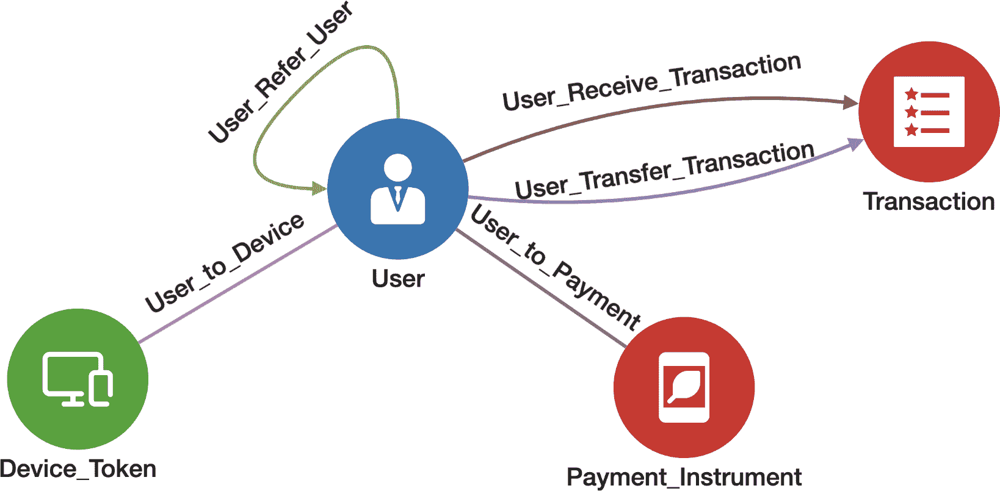
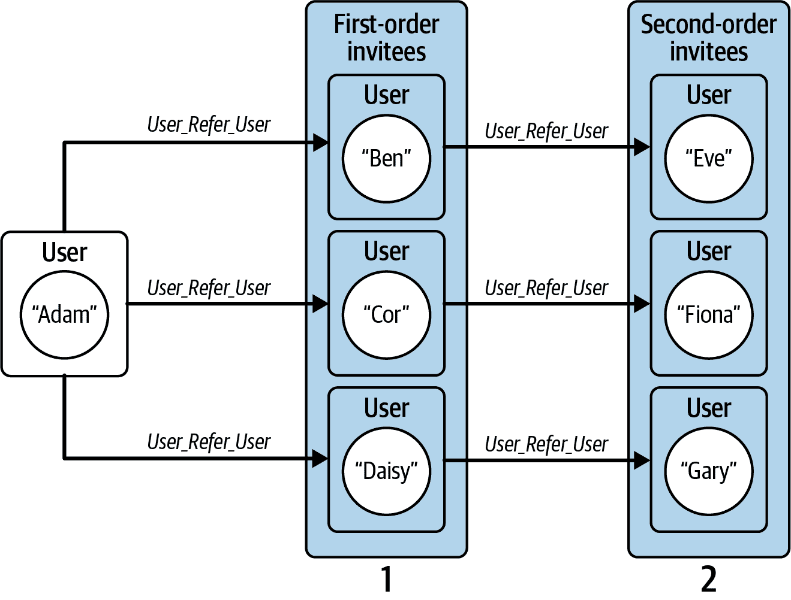
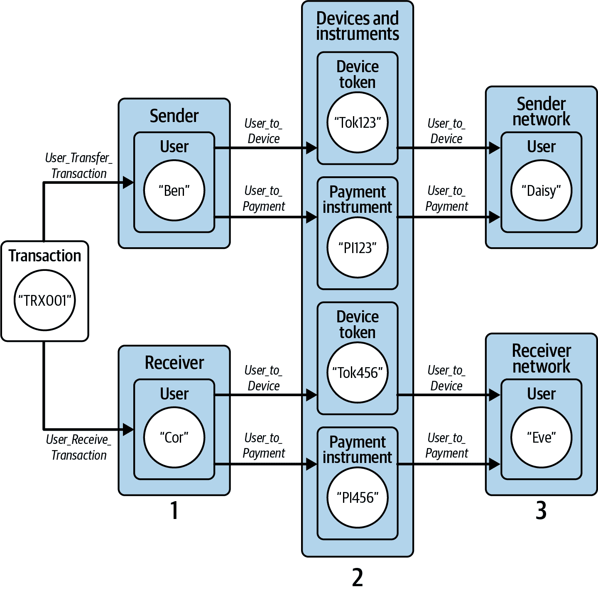
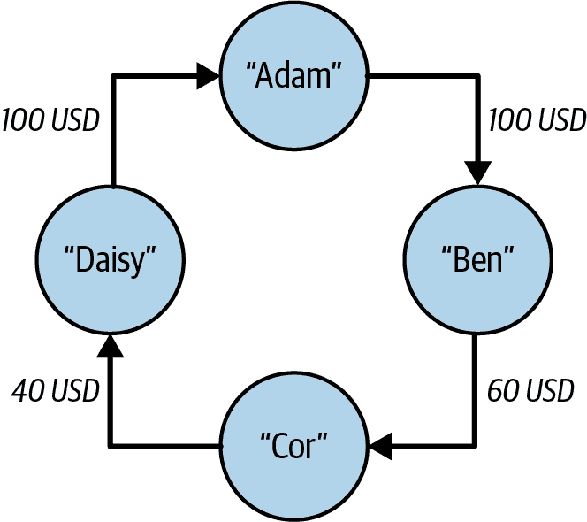

# 第五章：检测欺诈和洗钱模式

在本章中，我们面对严重的欺诈和洗钱问题。欺诈通常由一个或多个方参与作为一个多步骤的过程进行。有时，区分欺诈或洗钱活动与合法活动的唯一方法是检测活动的特征或异常模式。通过图模型化活动和关系，我们能够检测到这些模式，并检查它们的频率以便发现可疑活动。

完成本章后，您应能够：

+   描述多方协调活动在图模式方面的表现

+   使用多跳或迭代单跳图遍历执行深度搜索

+   描述双向搜索及其优势

+   理解时间戳的使用以找到时间顺序

# 目标：检测金融犯罪

金融机构负责通过经济基础设施防止犯罪资金流动。根据《金融行动特别工作组》（FATF）的数据，非法资金占全球 GDP 的 3.6%。¹ 一种众所周知的犯罪活动是洗钱，即通过非法手段赚取的资金的来源掩盖。根据 FATF 的数据，全球 GDP 的 2.7% 每年被洗钱。银行有法律义务调查客户的支付行为，并报告任何可疑活动。

其他类型的金融欺诈包括身份盗窃，即某人未经许可使用他人账户，以及庞氏骗局，其特征是资金从新投资者流向早期投资者，而并未真正进入外部企业。

银行已将各种应用程序和程序整合到其日常运营中，以识别和检测金融犯罪。总体而言，这些技术可以分为两个领域。

第一个调查领域，了解您的客户（KYC），研究客户概况。就像我们在第三章中看到的客户 360 应用案例一样，分析师需要进行客户尽职调查。这种客户风险评估可以在客户生命周期的多个阶段进行，比如在新客户接管（NCTO）期间或定期审查期间。

第二个调查领域，交易监控，主要关注通过银行交易识别犯罪行为。在这里，分析师试图识别发送方和受益方之间的异常支付模式。尽管这两个调查领域在银行运营和风险管理水平上经常重叠，但本章主要关注交易监控。

交易监控涉及对表现出可疑支付行为的实体进行彻底调查。分析员从被标记为可疑的实体开始这些调查，然后从那里探索高风险交互。因此，分析员不知道资金流动的完整图景，也没有看到被标记实体在整个资金路径中的可见性。为了获得这种可见性，他们必须逐步查询下一个支付交互，以构建支付网络的完整图景。因此，分析员需要一种帮助他们检索一组连续支付和参与其中支付方的方法。

# 解决方案：将金融犯罪建模为网络模式

传统交易监控依赖于基于规则的系统，其中客户行为与固定的风险指标进行检查。例如，这样的风险指标可能是，客户账户中收到了 15000 美元现金，并立即将这笔钱发送到多个第三方账户。这可能是正常的收入和支出活动，也可能是称为`分层`的洗钱技术的一部分。它表明一种可疑活动，因为它围绕着大量现金，并且那笔钱移动到多个第三方账户，使其更难追溯其来源。

依赖基于规则的风险指标存在两个主要问题。首先，分析师仍然需要对标记客户进行深入跟进调查，这涉及查询不同客户之间的连续支付。其次，由于从表格数据中提取深层模式的挑战，基于规则的风险指标在其复杂性方面存在限制。

当将这个问题建模成网络时，通过图数据模型直观地展示资金流动，更容易识别高风险模式。这样做能让我们看到资金在网络中的流动方式，以及参与这些支付交互的各方。这种图形方法解决了第一个问题，因为图形模式搜索将为分析员发现连续支付。它还解决了第二个问题，因为网络将揭示涉及方之间的所有关系，包括分析员没有明确查询的那些关系。

本书后面我们将看到，图机器学习可以更好地检测金融犯罪模式。

# 实施金融犯罪模式搜索

TigerGraph 提供了一个欺诈和洗钱检测的入门套件。请按照第三章的安装步骤安装入门套件。安装完成后，我们将使用入门套件设计我们的洗钱网络，并探索如何在该网络上检测可疑的支付交互。

## 欺诈和洗钱检测入门套件

使用 TigerGraph Cloud，在云中部署一个新的集群，并选择“欺诈和洗钱检测”作为用例。一旦安装了这个入门套件，按照章节“加载数据并安装入门套件的查询”中的步骤进行操作。

## 图模式

欺诈和洗钱检测入门套件包含超过 4.3M 个顶点和 7M 条边，具有四种顶点类型和五种边类型的模式。图 5-1 展示了此入门套件的图模式。



###### 图 5-1\. 欺诈和洗钱检测入门套件的图模式（在[`oreil.ly/gpam0501`](https://oreil.ly/gpam0501)上查看更大的版本）

在表 5-1 中描述了四种顶点类型。`**User**`在支付交互中扮演着核心角色，可以接收和发送支付。`**Transaction**`是支付本身。`**Device_Token**`是指用于支付的设备的唯一 ID 号码，而`**Payment_Instrument**`则指支付所使用的工具类型。

表 5-1\. 欺诈和洗钱检测入门套件中的顶点类型

| 顶点类型 | 描述 |
| --- | --- |
| `**User**` | 参与支付的人 |
| `**Transaction**` | 一笔支付 |
| `**Device_Token**` | 用于执行`**Transaction**`的唯一 ID 号码 |
| `**Payment_Instrument**` | 执行支付的工具 |

`**User**`和`**Transaction**`之间有两种关系类型。`**User**`可以接收交易，用`**User_Receive_Transaction**`表示，或者`**User**`可以发送交易，用`**User_Transfer_Transaction**`标记。`**User**`可以引用另一个`**User**`，这由`**User_Refer_User**`表示。边类型`**User_to_Payment**`连接了`**User**`和用于进行交易的`**Payment_Instrument**`（支票、现金、票据等）。最后，边类型`**User_to_Device**`将`**User**`连接到用于电子支付时使用的`**Device_Token**`。

## 查询与分析

此入门套件中包含的查询展示了如何利用图来帮助分析师检测高风险支付行为，以打击欺诈和洗钱活动。我们首先提供每个查询所查找的模式的高级描述，以及这如何与交易欺诈或洗钱相关联。然后我们深入研究其中的三个查询，以便更好地了解它们的实现方式。

圆检测

此查询检测资金在循环流动时。它选择形成时间序列的`**Transaction**`元素，从输入的`**User**`开始，然后返回到该`**User**`。如果回来的金额接近出去的金额，可能表明存在洗钱行为。

邀请用户行为

此查询寻找`**User_Refer_User**`行为的可疑模式，可能表明一个**`User`**正在与其他方合作以收集推荐奖金。它查看源**`User`**周围两跳内的推荐数以及这些用户进行的交易数。

多次交易

此查询展示了两个`**User**`元素网络之间的支付。从输入的`**Transaction**`开始，第一组是与发送方相关的`**User**`元素网络。第二组是来自接收方的`**User**`元素网络。查询可视化了两个网络及其之间的资金流动。

重复用户

此查询发现向相同接收者发送资金的`**User**`元素之间是否存在连接。它从接收资金的输入`**User**`开始，并选择所有向该输入`**User**`发送资金的其他`**User**`元素。然后，它使用`**Device_Token**`、`**Payment_Instrument**`和`**User**`检查这些发送者之间是否存在路径。

同一接收者发送者

此查询检测`**User**`是否使用假账户向自己发送资金。给定一个`**Transaction**`，如果接收者和发送者可以通过`**Device_Token**`和`**Payment_Instrument**`相互关联，则此查询返回真。

转账金额

此查询在给定的时间窗口内查找从与源`**User**`几跳相连的**`Users`**转出的总金额。虽然不直接可疑，但大量资金可能有助于建立反洗钱分层的案件。

现在我们更详细地查看了邀请用户行为、多次交易和圈子检测查询。

### 邀请用户行为

此模式假设一个**`User`**可以通过引荐许多新的**`User`**来赚取分层推荐奖金，用于电子支付服务。此查询包含了一个双跳遍历实现，如图 5-2 所示。我们从给定的`input_user`开始遍历。第一跳选择所有由此`input_user`邀请的**`User`**元素。然后，通过第二跳，收集所有一级受邀者邀请的**`User`**元素。然后我们聚合这些被邀请者的交易金额。如果直接转账金额很高，而来自二级被邀请者的聚合金额很低或为零，则`input_user`是一个欺诈的**`User`**。其背后的直觉是`input_user`有很多虚假的推荐，通过推荐奖金来推动自身进行大量交易。



###### 图 5-2\. 图遍历模式，用于检测执行活动以赚取推荐奖金的欺诈用户

首先，我们声明一些累加器变量来存储我们聚合的数据：

```
  SumAccum<INT> @@num_invited_persons;
  SumAccum<FLOAT> @@total_amount_sent;
  SetAccum<EDGE> @@edges_to_display;
```

`SumAccum` `@@num_invited_persons` 计算二级受邀者的数量。`SumAccum` `@@total_amount_sent` 聚合了来自一级受邀者的所有交易金额。`SumAccum` `@@edges_to_display` 收集了输入**`User`** 和引荐**`User`** 之间的所有边（`User_Ref_User`），以便可视化系统知道如何显示它们。

然后，我们找到由源**`User`**引荐的一级受邀者。我们将`Start` **`User`** 和一个受邀者之间的每条边保存在`@@display_edge_set`中：

```
    Start = {input_user};

    First_invitees = SELECT t
        FROM Start:s -(User_Refer_User>:e)- :t
        ACCUM @@edges_to_display += e;
```

###### 注意

在`FROM`子句中，我们不需要指定我们要针对哪种类型的顶点，因为边的类型（**`User_Refer_User`**）只允许一个类型的目标顶点（**`User`**）。

接下来，我们累加这些一级受邀者发送出去的金额。每个**`Transaction`**都有一个名为`amount`的属性：

```
    Trans = SELECT t
        FROM First_invitees:s -(User_Transfer_Transaction>:e)- :t
        ACCUM
            @@total_amount_sent += t.amount,
            @@edges_to_display += e;
```

最后，我们得到了由一级受邀者引荐的额外受邀者：

```
    Second_invitees = SELECT t
        FROM First_invitees:s -(User_Refer_User>:e)- :t
        WHERE t != input_user
        ACCUM @@edges_to_display += e
        POST-ACCUM (t) @@num_invited_persons += 1;
```

这个搜索看起来非常像第一跳，但有两个额外的步骤：

1.  我们检查我们没有回到源**`User`**。

1.  我们计算二级受邀者的数量。

如果您用三个建议的输入用户（115637、25680893、22120362）运行算法，您会发现他们推荐了一个或少数用户，这些用户又没有推荐用户。查看 JSON 结果，您会看到总支付金额在 0 美元到 709 美元之间。

### 多次交易

分析人员认为，犯罪分子经常在两个网络之间转移资金。以下查询展示了这一直觉。给定任何输入事务，第一个网络由该事务的发送方的相关账户组成，第二个网络由接收方的相关账户组成。然后，我们查找这两个网络中所有方的支付活动。该查询通过图 5-3 中说明的执行流程组装这些网络，并查找它们之间的任何交互。



###### 图 5-3. 从发送方和接收方找到事务网络的图遍历模式

我们首先通过遍历`**User_Transfer_Transaction**`或`**User_Receive_Transaction**`边类型来选择给定`**Transaction**`的发送方和接收方`**User**`元素：

```
  Sender_receiver (ANY) = SELECT t 
        FROM Start:s
            -((<User_Receive_Transaction|<User_Transfer_Transaction):e)- :t
```

###### 注意

在`FROM`子句中，我们从`**Transaction**`（`source_transaction`）到`**User**`元素进行遍历，这是`**User_Receive_Transaction**`和`**User_Transfer_Transaction**`边的反向方向。这就是为什么方向箭头指向左侧并位于边类型名称的左侧。或者，如果这些边有定义反向边类型，我们可以使用它们的反向边代替（并使用向右的箭头）。

我们使用用例来确定`**User**`是`**Transaction**`的接收方还是发送方。如果一个`**User**`通过`**User_Receive_Transaction**`连接到一个`**Transaction**`，我们将`@from_receiver`设置为 true，并将该`**User**`添加到`@@receiver_set`中。在其他情况下，`**User**`是`**Transaction**`的发送方，因此我们将`@from_sender`设置为 true，并将此`**User**`添加到`@@sender_set`中：

```
            CASE WHEN e.type == "User_Receive_Transaction" THEN
                t.@from_receiver += TRUE,
                @@receiver_set += t
            ELSE
                t.@from_sender += TRUE,
                @@sender_set += t
```

现在我们知道了发送方和接收方，我们找到属于接收方或发送方的`**User**`元素。也就是说，我们遍历`**User_to_Device**`或`**User_to_Payment**`边，并将`**User**`元素添加到`@@sender_set`或`@@receiver_set`（如果它们在四个跳跃内存在（`WHILE Start.size() > 0 LIMIT MAX_HOPS DO`）。因为完成一笔交易需要两个跳跃（发送方 → 事务 → 接收方），四个跳跃等于两个交易的链：

```
    WHILE Sender_receiver.size() > 0 LIMIT MAX_HOPS DO
        Sender_receiver = SELECT t 
        FROM Sender_receiver:s -((User_to_Device|User_to_Payment):e)- :t
        WHERE t.@from_receiver == FALSE AND t.@from_sender == FALSE
        ACCUM 
            t.@from_receiver += s.@from_receiver,
            t.@from_sender += s.@from_sender,
            @@edges_to_display += e
        POST-ACCUM
            CASE WHEN t.type == "User" AND t.@from_sender == TRUE THEN
                @@sender_set += t
            WHEN t.@from_receiver == TRUE THEN
                @@receiver_set += t
```

如果我们最终到达一个`**User**`顶点类型，并且该`**User**`是发送方，我们将该`**User**`添加到`@@sender_set`中。如果`t.@from_receiver`为 true，则`**User**`属于接收方，我们将该`**User**`添加到`@@receiver_set`中。

形成发送方和接收方组后，我们现在寻找除源事务之外连接发送方和接收方组的其他事务。首先，我们查找与接收方集合相邻的事务：

```
    Receivers = {@@receiver_set};
    Receivers = SELECT t 
        FROM Receivers:s
            -((User_Receive_Transaction>|User_Transfer_Transaction>):e)- :t
        ….
```

然后，我们查找与发送方集合相邻的事务：

```
    Senders = {@@sender_set};
    Connecting_transactions = SELECT t 
        FROM Senders:
            -((User_Receive_Transaction>|User_Transfer_Transaction>):e)- :t
        WHERE t != input_transaction
        ACCUM
            t.@from_sender += s.@from_sender,
            @@edges_to_display += e
        HAVING t.@from_receiver AND t.@from_sender;
```

`HAVING`子句检查事务是否被视为接收组和发送组的一部分。

运行使用建议的任一交易 ID（32、33 或 37）的查询时，输出看起来像是一个连接的社区，因为除了输入交易之外，还有至少一笔交易将发送方社区与接收方社区连接在一起。尝试不同的输入 ID，输出很可能看起来像是两个独立的社区，仅通过输入交易连接在一起。

### 圆圈检测

洗钱的本质是在足够多的参与者之间转移资金，使得追踪其起源成为一个挑战。罪犯有几种路由模式来掩盖其非法资金的来源。一个流行的转移模式是通过各种中介最终返回到其中一个发件人的资金。在这种情况下，资金以循环模式传播。循环资金流动本身并不是犯罪。使其成为犯罪的是意图以及其中任何一个过渡本身是否属于欺诈行为。循环流动的特征——循环的大小、转移的资金金额、返回给发送者的资金百分比、交易之间的时间延迟以及多少个个别交易是不寻常的——也是有用的指标。

在图形中，我们可以比传统数据库更容易地检测到这种循环模式，因为我们可以从一个交易跳到下一个，直到一个交易到达发起者。正如我们在第二章中所解释的那样，图的跳跃在计算上比关系数据库中的表连接要便宜得多。

在图 5-4 中，我们看到这样的循环资金流动。在这个例子中，亚当是发起者，向本发送了$100。本发送了$60 给科尔，她向黛西发送了$40，后者又向亚当发送了$100。我们在这个例子中展示，本、科尔和黛西没有把他们收到的金额完全发送给链条中的下一个人。罪犯这样做是为了通过使起始金额分散到各种中间人中，增加另一层噪音，使得查明起始者及洗钱金额更加困难。



###### 图 5-4\. 示例循环资金流动

查询 `circle_detection` 查找从给定的**`User`**（`source_id`）开始的所有循环交易链，每个循环最多有一定数量的交易（`max_transactions`）。由于每个交易有两次跳跃（发送者 → 交易 → 接收者），因此每个循环可以有多达两次跳跃。要成为有效的循环，循环中的交易序列必须在时间上向前移动。例如，为了使这个循环有效： 

```
    source_id → txn_A → txn_B → txn_C → source_id
```

然后 `txn_A.ts < txn_B.ts < txn_C.ts`，其中 `ts` 是交易的时间戳。

由于有很多可能的路径需要检查，查询的实现采用了几种性能和过滤技术。第一种是双向搜索，从起点向前搜索同时从终点向后搜索。进行两个半长度的搜索比进行一个全长度的搜索要快。当两个搜索相交时，就找到了一条完整的路径。

第二种技术过滤掉不能满足向前时间旅行要求的路径。

```
  Seed = {source_id};
  Seed = SELECT src
      FROM Seed:src - ((User_Transfer_Transaction>|User_Receive_Transaction>):e)
                    - Transaction:tgt
      ACCUM
          CASE WHEN 
            e.type == "User_Transfer_Transaction" 
          THEN 
            @@min_src_send_time += tgt.ts
          ELSE
            @@max_src_receive_time += tgt.ts
          END
      …
      HAVING @@max_src_receive_time >= @@min_src_send_time;
```

从`source_id`开始，向前一步（`**User_Transfer_Transaction**`）和向后一步（`**User_Receive_Transaction**`）。找到`source_id`发送的任何交易的最早时间（`@@min_src_send_time`）和接收的最晚时间（`@@max_src_receive_time`）。检查确保`@@max_src_receive_time >= @@min_src_send_time`。这些全局限制也将用于稍后检查其他交易的合理性，这些交易是循环路径的候选者。

然后我们开始搜索的第一阶段。从`source_id`开始，向前走两步（相当于一次交易）。以图 5-4 为例，这将从 Adam 到 Ben。同时向后走两步（Adam 到 Daisy）。迭代这种步骤的组合，向前（或向后）移动，直到每个方向都绕过一个最大大小的圆圈的一半。表 5-2 显示了如果我们考虑图 5-4 的图表，则会遍历的路径。

表 5-2\. 使用图 5-4 的图表的前向和后向路径

| 迭代 | 1 | 2 | 3 |
| --- | --- | --- | --- |
| 前向 | Adam→Ben | Ben→Cor | Cor→Daisy |
| 反向 | Adam→Daisy | Daisy→Cor | Cor→Ben |

下面的代码片段显示了前向遍历的一个简化版本的一次迭代。为简洁起见，省略了时间和步骤约束的检查：

```
          Fwd_set = SELECT tgt
              FROM Fwd_set:src - (User_Transfer_Transaction>:e) - Transaction:tgt
              WHERE tgt.ts >= @@min_src_send_time 
                  AND src.@min_fwd_dist < GSQL_INT_MAX 
                  AND tgt.@min_fwd_dist == GSQL_INT_MAX
              ACCUM tgt.@min_fwd_dist += src.@min_fwd_dist + 1
              … // POST-ACCUM clause to check time and step constraints
              ;

          Fwd_set = SELECT tgt
              FROM Fwd_set:src - (<User_Receive_Transaction:e) - User:tgt
              WHERE src.@min_fwd_dist < GSQL_INT_MAX 
                  AND tgt.@min_fwd_dist == GSQL_INT_MAX
              ACCUM tgt.@min_fwd_dist += src.@min_fwd_dist + 1               
          … // POST-ACCUM clause to check time and step constraints
              HAVING tgt != source_id;
```

从表 5-2 可以看出，在第二次迭代后，前向路径和后向路径在一个共同点 Cor 相遇。我们有一个圆圈！但是等等。如果 Ben→Cor 的时间戳晚于 Cor→Daisy 的时间戳怎么办？如果是这样，那么它就不是一个*有效*的圆圈。

在查询的第二阶段，我们通过以下方式发现并验证循环路径。对于前向搜索，继续沿着在反向方向先前遍历过的路径前进，而且时间上是向前的。在我们的例子中，如果`max_transactions` = 2，因此第一阶段已经走到了 Ben→Cor，那么第二阶段可以继续到 Cor→Daisy，但只有因为我们在第一阶段已经遍历了 Daisy→Cor，并且时间戳继续增加：

```
          Fwd_set = SELECT tgt
              FROM Fwd_set:src - (User_Transfer_Transaction>:e) - Transaction:tgt
              // tgt must have been touched in the reverse search above
              WHERE tgt.@min_rev_dist < GSQL_INT_MAX
                  AND tgt.ts >= @@min_src_send_time 
                  AND src.@min_fwd_dist < GSQL_INT_MAX 
                  AND tgt.@min_fwd_dist == GSQL_INT_MAX
              ACCUM tgt.@min_fwd_dist += src.@min_fwd_dist + 1               
              POST-ACCUM
                  CASE WHEN 
                    tgt.@min_fwd_dist < GSQL_INT_MAX 
                    AND tgt.@min_rev_dist < GSQL_INT_MAX
                    AND tgt.@min_fwd_dist + tgt.@min_rev_dist
                        <= 2 * STEP_HIGH_LIMIT
                  THEN
                    tgt.@is_valid = TRUE
                  END;

          Fwd_set = SELECT tgt
              FROM Fwd_set:src - (<User_Receive_Transaction:e) - User:tgt
              //tgt must have been touched in the reverse search above
              WHERE tgt.@min_rev_dist < GSQL_INT_MAX
                  AND src.@min_fwd_dist < GSQL_INT_MAX 
                  AND tgt.@min_fwd_dist == GSQL_INT_MAX
              ACCUM tgt.@min_fwd_dist += src.@min_fwd_dist + 1               
              POST-ACCUM
                  CASE WHEN 
                    tgt.@min_fwd_dist < GSQL_INT_MAX 
                    AND tgt.@min_rev_dist < GSQL_INT_MAX
                    AND tgt.@min_fwd_dist + tgt.@min_rev_dist
                        <= 2 * STEP_HIGH_LIMIT
                  THEN
                    tgt.@is_valid = TRUE
                  END
              HAVING tgt != source_id;
```

在第 2 阶段后，我们找到了我们的圈子。有第 3 阶段遍历这些圈子，并标记顶点和边缘，以便它们可以被显示出来。图 5-5 和图 5-6 展示了来自圈检测的示例结果，最大圈子大小为四、五和六个交易。随着圈子大小限制的增加，找到的圈子也越多。


###### 图 5-5\. 当 `source_id` = 111 和 `max_transactions` 分别为 4 和 5 时的圈检测结果（请在 [`oreil.ly/gpam0505`](https://oreil.ly/gpam0505) 查看更大的版本）

s

###### 图 5-6\. 当 `source_id` = 111 和 `max_transactions` = 6 时的圈检测结果（请在 [`oreil.ly/gpam0506`](https://oreil.ly/gpam0506) 查看更大的版本）

# 章节总结

金融欺诈是大多数企业和所有金融机构必须面对的严重和昂贵的问题。我们需要更好和更快的技术来检测和阻止欺诈。我们展示了图数据建模和图查询是检测可能被忽视的可疑活动模式的强大方法。图建模使得能够轻松应对搜索模式的三个关键阶段：描述搜索、执行搜索和检查结果。在本书的后续部分，我们将展示图机器学习如何提供更复杂和准确的欺诈检测。

更具体地说，我们已经讨论了三个查询来检测和打击欺诈和洗钱。第一个查询展示了如何检测资金是否呈循环流动。第二个查询展示了如何通过图形在推荐计划中发现可疑的用户行为。第三个查询展示了两个人群网络之间的资金流动。第四个查询展示了如何找出将资金发送给同一人的人之间的连接。第五个查询检测是否有人使用假账户向自己发送资金。我们讨论的最后一个查询是关于检测向某人进行大量资金转移的情况。

在下一章中，我们将提供一种系统化的方法来分析图形。特别是，我们将深入探讨图形度量和图形算法的丰富世界。

¹ “什么是洗钱？” fatf-gafi，访问于 2023 年 5 月 22 日，[*https://www.fatf-gafi.org/en/pages/frequently-asked-questions.html#tabs-36503a8663-item-6ff811783c-tab*](https://www.fatf-gafi.org/en/pages/frequently-asked-questions.html#tabs-36503a8663-item-6ff811783c-tab)。
