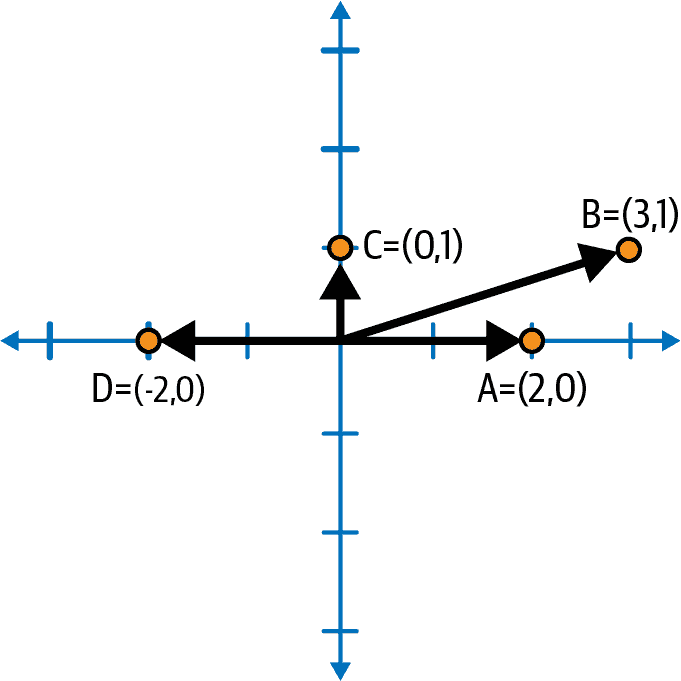

# 第六章：分析连接以获得更深入的洞察

在前面的章节中，我们了解到将数据表示为图表使我们能够更深入、更广泛地查看数据，从而能够更准确和更有洞察力地回答问题。我们看了几个用例，以了解如何将数据建模为图表以及如何查询它。现在我们希望更系统地查看图分析。当我们说图分析时，我们指的是什么？我们可以使用哪些具体的技术来进行图分析？

完成本章后，您应能够：

+   定义图分析并描述其与一般数据分析的区别

+   理解图分析的要求和一些关键方法，包括广度优先搜索和并行处理

+   定义几种对分析有用的图算法类别

+   列出每个类别中的几种算法，并举例说明其在现实世界中的用途

# 理解图分析

让我们从一般定义数据分析开始。*数据分析*是对数据集进行有用观察并得出结论，以帮助人们理解数据的重要性。分析将数据转化为有用的见解。图分析也是如此，只不过数据的结构影响我们将检查哪些数据以及以何种顺序检查。连接是一种数据形式，连接驱动分析的进程。

图分析的另一个显著特点是它非常适合回答关于连接的问题。在表格数据集中，您可以询问客户 A 和客户 B 之间的最短连接链路是什么，但如果您的数据是图形式式的，您将更好地完成这种分析。我们可以总结我们的思考如下：

> 图分析是对连接数据进行观察和得出结论的过程。

## 分析要求

要对数据集作出观察，显然我们必须检查所有数据或相关子集，并且这将涉及某种形式的计算。如果我们的数据集包含某一年的所有销售交易，简单的分析可以是计算每个月的总销售额，然后查看销售趋势是上升、下降还是以更复杂的方式移动。如果数据组织成表格，那么我们可以想象扫描表格，逐行阅读。我们还需要一个地方来保存结果——每月销售额。事实上，当我们阅读每一行并将其销售额添加到一个月总额时，我们可能希望保持一个累计总数。

图分析有类似的要求：阅读所有相关数据，对每个数据点执行计算和决策，保存临时结果，并报告最终结果。图分析与表格分析的主要区别在于，图的连接不仅影响数据项的性质，还影响我们扫描数据的顺序。还有一些方法论或架构的选择可以使计算和内存存储更加高效。

## 图遍历方法

在图分析中，我们跟随连接从一个数据点到下一个数据点。用图作为行走路径网络的比喻，我们常说我们*走*或*遍历*图。起初，看起来你可能想要跟随一系列连接，就像一个人会走的方式。然而，当你看看你要完成的任务时，结果可能更合理的是依次探索当前位置的直接连接，然后再跟随连接的连接。跟随一系列连接称为*深度优先搜索（DFS）*，在移动到下一个层级连接之前查看所有直接连接称为*广度优先搜索（BFS）*。我们在第二章中简要提到了这些。

以下工作流程解释了 BFS 和 DFS。区别在于处理工作的顺序，反映在`Places_to_Explore`列表中顶点的顺序：

1.  将源顶点放入名为`Places_to_Explore`的处理列表中。作为列表，它有一个顺序，从前到后。

1.  从`Places_to_Explore`列表的前端移除第一个顶点。如果该顶点已标记为`Already_Visited`，则跳过步骤 3 和 4。

1.  执行你希望对每个顶点执行的任何工作，比如检查一个值是否匹配你的搜索查询。现在将顶点标记为`Already_Visited`。

1.  从当前顶点获取所有连接边的列表。如果是 BFS，则将该列表添加到`Places_to_Explore`列表（队列）的*末尾*。如果是 DFS，则将该列表添加到`Places_to_Explore`列表（栈）的*前面*。

1.  重复步骤 2 到 4，直到`Places_to_Explore`列表为空为止。

使用 BFS 时，我们遵循一个“公平”的系统，即每遇到的新顶点都排到队列的尾部。因此，顶点逐级处理，从源顶点开始的一跳所有顶点，然后是两跳顶点，依此类推。使用 DFS 时，我们遵循一个“贪婪”的系统，处理源的一个子节点，然后将其邻居放在列表的前面而不是后面。¹ 这意味着在第三步中，一个幸运的距离源三跳的顶点将得到关注。在图 6-1 中，我们看到 BFS 和 DFS 的示例。最初，只有顶点 1 有一个数字。其他数字按访问顺序分配。

###### 图 6-1\. 广度优先搜索（BFS）与深度优先搜索（DFS）方法概述

当你希望尽可能接近地面真实最佳答案时，BFS 更为优越。最短路径算法使用 BFS。如果期望答案为多跳并且存在满足任务的许多路径，则 DFS 可能更合适。

如果我们打算探索整个图并且只有一个工作者来处理信息，那么 BFS 和 DFS 的效率大致相当。然而，如果有并行处理可用，则几乎每次都是 BFS 胜出。

## 并行处理

*并行处理*是能够同时执行两个或更多任务以减少延迟，即从开始到完成的总时间。要从并行处理中受益，整体任务需要能够分解成多个可以独立执行的子任务（“可并行化”），并且必须有多个处理器。此外，还需进行一些管理工作，以了解如何分割任务，然后将分开的结果合并成最终结果。

BFS 和并行处理很好地结合在一起。大多数使用 BFS 的图分析任务可以通过并行处理更有效地执行。想象一下，你想创建一个道路网络的详细地图。你有一队勘测员（多个处理器），他们都从点 A 开始。在每个路口，你分开你的队伍以更快地完成工作（BFS 与并行处理）。在软件中，你比物理世界更有优势。当一个处理器完成当前任务后，它可以跳到数据网络中任何需要进行下一个任务的地方。

## 聚合

在分析中的一个基本任务是*聚合*：获取一组值，对它们进行某些操作，并产生一个描述该集合的单一结果。最常见的聚合函数包括计数、求和和平均值。

考虑购买行为分析：在给定**`客户-购买-产品`**图中，找出在产品 X 购买后一周内购买的三种最常购买的与产品 X 同一产品家族的产品。以下是我们如何使用图分析解决这个问题：

1.  从代表产品 X 的顶点开始。

1.  沿着**`购买`**边遍历，找到所有购买了产品 X 的**`客户`**。在每条这样的遍历路径上，记录购买日期。

1.  从每个**`客户`**那里，扫描他们其他**`购买`**边，查找从那次购买日期开始的一周时间窗口内符合条件的每个**`产品`**，并将其添加到一个全局数据结构中，允许添加新项目并更新这些项目的计数。

1.  对全局计数进行排序，找到三种最受欢迎的后续购买。

让我们分析一下工作流程和所需的内容：

+   从单个顶点开始，我们使用 BFS 进行两次跳数，通过第一次跳数确定的日期范围过滤第二次跳数。BFS 需要记账（前面提到的 `Places_to_Explore` 列表）。在之前的章节中，您已经看到了 GSQL 语言如何内置支持，使用 `SELECT-FROM-ACCUM` 语句并将一级遍历的结果保存为该语句的顶点集结果。

+   每个 BFS 的路径都需要临时跟踪自己的时间窗口。数学很简单：在给定时间戳上加七天。GSQL 提供了本地变量，可以执行临时保存数据以供后续分析的任务。

+   主要的聚合工作是收集后续购买，并找出其中最受欢迎的三个。我们需要一个全局的数据结构，每个处理代理都可以访问以添加新项。最简单的数据结构可能是一个列表，可以保存相同项目的重复实例。在查找后续购买完成后，我们需要遍历列表，看每个项目被提及的次数，并对计数进行排序以获取前三名。更复杂的方法是使用一个 *映射*，它保存数据对：productID:count。这将需要支持两个操作：插入新的 productID 和增加计数。如果我们想使用并行 BFS，我们需要支持并发插入和增加操作。获取最终计数后，我们需要排序以获取前三名。

GSQL 语言提供了对并行聚合的内置支持，使用称为累加器的对象。累加器可以是全局的或每个顶点的。累加器可以保存标量值，如总和或平均值，也可以保存集合，如列表、集合、映射或堆。对于查找最受欢迎的后续购买的示例，一个全局的 `MapAccum` 将满足大部分工作需求。

# 使用图算法进行分析

一些分析任务需要编写定制的数据库查询：所提出的问题在数据集和用例中是独特的。在其他情况下，分析问题是相当常见的。拥有一套标准分析工具库，可以根据特定数据集和任务进行调整，这将非常有用。对于图分析，我们有这样一套工具包；它是一个 *图算法库* 或 *图数据科学库*，有时也被称为。在本书的早期章节中，我们描述了图算法作为图查询的一种类型，使用了相似度算法，并提到了一些其他算法类型，如最短路径。直到本章，我们才有意保持它们的使用最少。

## 作为工具的图算法

首先，让我们定义术语*算法*。算法是一个明确的、逐步的、有限的指令集，用于执行特定的任务。把算法想象成一个精确的配方。当你有一个任务的算法时，你知道这个任务是可以完成的。对于一个称为*确定性算法*的子类，相同的输入总是产生相同的输出，无论是谁执行算法或何时执行。算法不仅仅是用于分析。例如，有一个算法用于存储您电子阅读器的颜色和字体大小偏好，以及一个伴随算法，每次启动阅读器时应用您的偏好。这些虽然不是真正的分析任务，但它们也是任务。

然而，当我们说*图算法*时，它不仅仅是指“关于图的算法”。首先，该术语通常意味着通用算法，这些算法设计用于处理整个类别的图，比如任何带有无向边的图，而不仅仅是具有特定模式和语义细节的图，例如银行交易图。其次，术语*图算法*通常指解决*分析*任务的解决方案。

通过专注于通用分析任务，图算法成为图分析的优秀工具。多年来，理论家和数据分析师已经确定了一些常见和通用的图分析任务，并开发了执行这些任务的算法。图算法库是一组精心设计的图算法，能够执行各种不同的任务。该库的收藏被制作以跨越广泛的有用功能，因此它是一个工具包。

就像木工或汽车维修等熟练工艺一样，数据分析需要训练和经验才能熟练使用工具。作为图算法用户，你需要学习每种算法可以执行的任务类型，它设计用于什么类型的材料（数据），如何正确使用它，以及何时不使用它。随着你的专业水平提高，你会更好地理解执行类似功能的算法之间的权衡。你还会看到使用算法的创新方法以及如何结合使用多个算法来执行比任何单一算法更复杂和精密的任务。

因为我们谈论的是软件和数据，数据分析师在使用锻造钢工具处理木材和金属材料的工匠之上有一个优势：我们的工具和材料非常易于塑形。作为算法用户，了解算法如何运作虽然有帮助但并非必须。类比而言，你不需要知道如何设计电压表就能测量电池的电压。然而，如果你想修改一个算法以更好地适应你的情况，那么至少在某种程度上了解该算法是必要的。

任何使用图算法的用户都需要注意一点：仅将算法应用于与您所需分析的语义相关的顶点和边。大多数现实世界的图包含多种类型的顶点和边，每种都有其自己的语义角色。例如，我们可能有 **`书籍`** 和 **`读者`** 的顶点以及 **`购买`**，**`阅读`** 和 **`评论`** 的边。虽然您可以在整个图上运行 PageRank，但结果可能毫无意义，因为将 **`书籍`** 和 **`读者`** 放在同一尺度上并没有意义。由于它们的通用性质，大多数图算法忽略语义类型。当忽略类型时，您的分析是否有意义是您需要决定的事情。

到目前为止，我们已经涵盖了许多重要的概念，所以让我们总结一下：

+   图分析利用数据连接来深入了解数据。

+   广度优先搜索、并行处理和聚合是有效图分析的关键要素。

+   图算法作为常见图分析任务的工具。

+   通过组合使用它们可以执行更复杂的任务。

+   使用图算法是一种工艺。你对工具和材料了解得越多，你的工艺水平就越高。

表 6-1 展示了本章介绍的数据分析和算法的关键术语。

表 6-1\. 图分析和算法术语表

| 术语 | 定义 |
| --- | --- |
| 数据分析 | 使用统计方法分析数据以获得洞察 |
| 图分析 | 专注于分析图中实体之间关系的数据分析子集 |
| 算法 | 一组明确的、逐步的和有限的指令，用于执行特定任务 |
| 确定性算法 | 一类算法，其相同输入将始终产生相同结果 |
| 图算法 | 一类通用于图类和分析图结构的算法子集 |
| 遍历/穿越图 | 探索图中顶点和边的过程，按照特定顺序从当前位置进行 |

## 图算法类别

再考虑几个图分析任务的例子：

社区排名

在社交网络中，根据每位成员每周的平均新讨论次数对子社区进行排名。

相似患者档案

给定某患者的特定症状、个人背景和迄今为止的治疗，找到类似的患者，以便比较成功和挫折，从而实现更好的整体护理。

第一个任务假设我们有明确定义的社群。在某些情况下，我们希望社群不是通过标签定义，而是通过实际的社交行为定义。我们有图算法来基于连接和关系行为来找到社群。第二个任务假设我们有一种衡量相似度的方法。还有一类基于图的相似度算法。

本节概述了今天图分析中最常见的图算法和算法类别。我们将看到五类：

+   路径和树

+   中心性

+   社群

+   相似度

+   分类和预测

### 路径和树算法

最经典的基于图的任务之一是从一个顶点到另一个顶点找到*最短路径*。知道最短路径不仅有助于找到最佳的传递和通信路线，还有助于查看个人或流程是否紧密相关。这个人或组织是否与关注的方面密切相关？我们还可以使用最短路径分析来检查文档或其他产品的谱系或来源。

这个任务看起来可能很简单，但请考虑这个例子：假设你想联系一个著名但是很私人的人，比如基努·里维斯。这是一件私人事务，所以你只能通过个人联系，中间联系越少越好。你不知道你的熟人中谁可能认识这个人。因此，你询问所有人是否认识里维斯先生。没有人认识他，所以请他们问问他们的熟人？每个联系人都请他们的熟人检查，直到最终有人认识基努·里维斯个人。

这种连接-连接的过程正是我们在无权图中找到最短路径的方式。事实上，这就是广度优先搜索。你可以看到并行处理是合适的。你的所有熟人可以同时工作，检查他们的熟人。

图 6-2 给出了一个例子。在第一轮中，你（顶点 A）检查所有直接连接（B、C 和 D）。它们每个都被标记为 1\. 在第二轮中，每个新访问的顶点检查它们的连接。B 有两个连接（A 和 E），但只有 E 是新的。C 有三个连接，但只有 F 是新的。D 没有未被访问过的连接。因此，E 和 F 是我们的新的“前沿”顶点，并被标记为 2\. 在第三轮中，G 和 H 是我们的前沿顶点。事实上，H 就是基努·里维斯，所以我们完成了。请注意，存在两条路径：A-B-E-H 和 A-C-F-H。还请注意，虽然我们正在寻找通往基努·里维斯的路径，但我们也找到了通往中间顶点如 E 和 F 的路径。

###### 图 6-2\. 无权最短路径

要得到我们的答案需要多少计算工作？这取决于我们的目标离起点有多近。计算机科学家通常考虑最坏情况或平均情况的工作量。由于我们的算法找到中间顶点的路径，如果我们改变任务：从一个起点到每个目标的路径，我们应该能够得到我们的答案。实际上，我们可能需要遍历两次：最初，我们尝试 A→B，然后稍后 B→A 并发现我们已经到达了 A。我们需要标记每个顶点是否已访问，设置一个距离，稍后检查是否已访问。所以我们有一些活动与边的数量 (E) 成比例，一些与顶点的数量 (V) 成比例。因此，总工作量大致为 E + V。在标准符号中，我们说它是 O(E + V)，读作“大 O E 加 V”。在一个连通图中，E 至少与 V 一样大，我们关心最大的因素，所以我们可以简化为 O(E)。

如果有些连接比其他连接更好怎么办？例如，从你家到商店可能有三个街区，但有些街区比其他街区长。这是加权图中的 *最短路径* 问题。当边被赋权值时，我们必须更加小心，因为步数更多的路径可能仍然是成本较低的路径。在 图 6-3 中，我们给边赋权值，并展示了修改后的搜索算法的前两轮，这个算法归功于计算机科学先驱艾兹格·迪克斯特拉。首先，我们初始化每个顶点的最佳路径长度。因为我们还不知道任何路径（除了从 A 到 A），所以每个距离最初都被设为无穷大。然后在第一轮中，我们从 A 遍历到每个邻居顶点。我们用穿过的边的实际长度加上该边从源顶点回到起点的距离来标记它们。例如，要到达 B，总距离是边 A-B 的权重加上从源点 A 返回起点的距离，即 distance(A,A) = 2 + 0 = 2。

###### 图 6-3\. 加权最短路径

在接下来的轮次中，我们从前沿顶点遍历到它们 *所有* 的邻居。这里我们看到与无权路径算法的差异。我们考虑从 D 到 C 的路径，即使 C 之前已经被访问过。我们看到路径 A-D-C 的总长度为 weight(A,D) + distance(D,C) = 2 + 1 = 3。这比路径 A-C = 4 的长度要小。C 将被标记为到目前为止找到的 *最短* 路径及其长度。在加权图中，即使找到了一条路径，我们可能需要继续搜索，看看是否有更多跳数但总权重更少的路径。因此，在加权图中找到最短路径比在无权图中需要更多的计算工作。

我们将考虑另一个路径任务，即*最小生成树*（MST）问题。在图论中，树是一组 N 个顶点和恰好 N−1 条连接这些顶点的边。一个有趣的副作用是树中将会有一条确切的路径从每个顶点到其他每个顶点。在加权图中，最小生成树是具有最小总边权重的树。MST 的一个用途是以最低总成本提供连接性，例如铺设最少的道路或配置最少的网络电缆。

解决 MST 问题有几种类似效率的算法。Prim 算法可能是最简单的描述。我们将以图 6-4 为例：

1.  制作一个按权重排序的所有边的列表。

1.  选择最小权重的边（C-D）。我们选择的每条边都成为我们树的一部分。

1.  选择具有一个端点在部分树中的最轻的边：(A-D)。

1.  重复步骤 3，直到我们总共有 N−1 条边。

###### 图 6-4\. 最小生成树

根据这些规则，下一个选择的边将是 A-B，B-E，E-F 和 F-H。然后我们有一个平局。E-G 和 H-G 的权重都是 3，所以可以使用任何一个来完成我们的树。

### 中心度算法

在图中哪个顶点位置最中心？这取决于我们如何定义中心度。TigerGraph 图数据科学（GDS）库有超过 10 种不同的中心度算法。

*接近中心度*根据顶点到图中每个其他顶点的平均距离评分。通常我们倒转这个平均距离，以便在距离更短时得到更高的分数。接近中心度对于希望选择最佳位置的组织至关重要，无论是零售店、政府办公室还是配送中心。如果他们希望最小化顾客或包裹需要行进的平均距离，他们就会使用接近中心度。我们如何测量距离？最短路径算法可以做到这一点。虽然有更有效的方法来测量平均距离，而不是计算每个单独的最短路径，但原则仍然成立：算法可以作为解决更复杂问题的基本组成部分。有针对有向图和加权图的接近中心度变体。

让我们计算图 6-4 中加权图的一些中心度。顶点 E 和 F 看起来可能靠近中心。对于 E，我们需要计算到 A、B、C、D、F、G 和 H 的最短路径距离。通过目测，我们可以看到距离为 4 + 2 + 5 + 6 + 2 + 3 + 4 = 26\. 对于 F，我们需要计算到 A、B、C、D、E、G 和 H 的距离，距离分别为 6 + 4 + 3 + 4 + 2 + 5 + 2 = 26，所以它们平局。

*谐度中心性*是接近中心性的一个小变种。谐度中心性不是平均距离的倒数，而是距离的倒数的平均（或总和）。谐度中心性的一个优点是，它可以通过将它们的距离视为无穷来处理未连接的顶点，其倒数值简单地为零。这带来了选择算法时的一个关键点：您是否需要处理未连接的顶点？

*介数中心性*提出了一个不同的情境：假设您考虑图中所有顶点之间的最短路径，从每个顶点到其他每个顶点。如果存在多条最短路径（正如我们在图 6-2 中看到的），则考虑所有这些路径。哪个顶点位于最多的路径上？具有高介数的顶点不一定是目的地，但它将获得大量的通过流量。无论您是要找出最佳的加油站位置还是评估哪些网络路由器最为关键，介数都可能是一个关键的度量。再次看到，一个算法（最短路径）是另一个算法（介数）的基础构件。

也许让你惊讶的是，PageRank 可以被归类为中心性算法。PageRank 旨在找出互联网上最重要的网页。更准确地说，PageRank 衡量的是*引用权威*，即如果更多的页面指向某页面或者这些页面的权威性更高，则该页面的重要性会增加。另一种看待它的方式是*随机冲浪者*模型。

想象有人在互联网上冲浪。他们从一个随机页面开始。每分钟，冲浪者转到另一个页面。大多数时候，他们会点击页面上的链接转到另一页；每个链接被选择的概率相等。还有一小部分固定的概率不会跟随链接，而是直接转到另一个随机页面。经过很长时间后，随机冲浪者会在特定页面的概率是多少？这个概率就是该页面的 PageRank 分数。由于图的连接模式，被访问频率更高的页面被认为具有更高的中心性。PageRank 的数学魔力在于，排名不受开始随机行走的位置影响。请注意，PageRank 是针对有向图设计的，而我们迄今看到的大多数任务对有向或无向图都是合理的。

### 社区算法

图的另一个有意义的分析是理解顶点之间的隐式分组，基于它们如何相互连接。高水平的互动意味着高水平的影响力、韧性或信息传递，这对于理解和预测市场细分、欺诈者行为、群体韧性以及思想或生物传播的病毒性传播等方面非常有用。

定义社区的方法有多种，每种方法都对应一个或多个算法。我们可以根据加入社区所需的连接数量将它们排序。在谱的低端，当仅需要一个连接即可被视为社区的一部分时，我们称之为*连通分量*，或简称*组件*。在连接性的高端，当每个顶点都与每个其他社区成员直接连接时，这被称为*完全子图*。完全子图的顶点构成*团*。在这两个极端之间是 k 核心。*k 核心*是一个子图，其中每个顶点与 k 个或更多其他成员有直接连接。

###### 注意

连通分量是 k 核心，其中 k = 1\. 包含 c 个顶点的团是 k 核心，其中 k = (c –1)，这是 k 的最大可能值。

图 6-5 展示了应用于同一图的这三类社区。在左图中，每个顶点都是三个连通分量中的一个成员。在中心图中，我们有两个 k = 2 的 k 核心，但有四个顶点被排除在外。在右图中，我们有两个小团；许多顶点不符合资格。

###### 图 6-5\. 通过连接密度分类的社区类型

所有这些定义都可以强制边的方向性；对于连通分量，我们甚至有相应的名称。如果边是无向的（或者我们忽略方向性），那么我们称之为*弱连接组件*（WCC）。如果边是有向的，并且每个顶点可以通过跟随有向路径到达每个其他顶点，那么它是*强连接组件*（SCC）**。**在图 6-6 中，我们为我们的示例图的边添加了方向性，并看到这如何排除一些顶点。

###### 图 6-6\. 弱连接组件和强连接组件

上述社区的定义都有严格的定义，但在一些现实应用中，需要更灵活的定义。我们希望社区*相对*连接良好。为了解决这个问题，网络科学家提出了一种称为*模块度*的度量方法，它考虑了相对密度，比较社区内的密度与社区间连接的密度。这就像看城市内街道的密度与城市之间道路密度一样。现在想象一下，城市边界未知；你只能看到道路。如果你提出一组城市边界，模块度将评估你在最大化“内部密集；外部不密集”目标方面的表现。模块度是一个评分系统，而不是一个算法。基于模块度的社区算法找到产生最高模块度分数的社区边界。

要测量模块度（Q），我们首先将顶点分成一组社区，使得每个顶点属于一个社区。然后，考虑每条边作为一个案例，我们计算一些总数和平均数：

> Q = [落在一个社区内的实际边的分数]
> 
> 减去[如果边是随机分布的话，期望的边的分数]

“期望”在统计学上有特定含义。如果你抛硬币很多次，你期望头和尾的概率是 50/50。模块度可以通过使用权重而不是简单计数来处理加权边：

> Q = [落在一个社区内的边的平均权重]
> 
> 减去[如果边是随机分布的话，期望的边的权重]

注意，平均数是在总边数上取的。从一个社区到另一个社区的边对分子没有贡献，但对分母有贡献。设计成这样是为了使跨社区的边影响你的平均数并降低模块度得分。

“随机分布”是什么意思呢？每个顶点 *v* 都有若干条连接到它的边：顶点的 *度* 定义为 *d*(*v*) = *v* 的边的总数（或总权重）。想象一下，这些 *d*(*v*) 条边中的每一条都随机选择一个目标顶点。顶点 *v* 的度越大，其随机边与特定目标顶点建立连接的可能性越大。顶点 *v*1 和 *v*2 之间的期望（即统计平均）连接数可以计算为：

> <math alttext="upper E Subscript r a n d Baseline left-bracket w t left-parenthesis v Baseline 1 comma v Baseline 2 right-parenthesis right-bracket equals StartFraction d left-parenthesis v Baseline 1 right-parenthesis d left-parenthesis v Baseline 2 right-parenthesis Over 2 m EndFraction"><mrow><msub><mi>E</mi> <mrow><mi>r</mi><mi>a</mi><mi>n</mi><mi>d</mi></mrow></msub> <mrow><mo>[</mo> <mi>w</mi> <mi>t</mi> <mrow><mo>(</mo> <mi>v</mi> <mn>1</mn> <mo>,</mo> <mi>v</mi> <mn>2</mn> <mo>)</mo></mrow> <mo>]</mo></mrow> <mo>=</mo> <mfrac><mrow><mi>d</mi><mo>(</mo><mi>v</mi><mn>1</mn><mo>)</mo><mi>d</mi><mo>(</mo><mi>v</mi><mn>2</mn><mo>)</mo></mrow> <mrow><mn>2</mn><mi>m</mi></mrow></mfrac></mrow></math>

其中 *m* 是图中总边数。对于数学倾向的人，模块度 *Q* 的完整公式如下：

> <math alttext="upper Q equals StartFraction 1 Over 2 m EndFraction sigma-summation Underscript i comma j element-of upper G Endscripts left-bracket w t left-parenthesis i comma j right-parenthesis minus StartFraction d left-parenthesis i right-parenthesis d left-parenthesis j right-parenthesis Over 2 m EndFraction right-bracket delta left-parenthesis c o m m left-parenthesis i right-parenthesis comma c o m m left-parenthesis j right-parenthesis right-parenthesis"><mstyle displaystyle="true" scriptlevel="0"><mrow><mi>Q</mi> <mo>=</mo> <mfrac><mn>1</mn> <mrow><mn>2</mn><mi>m</mi></mrow></mfrac> <munder><mo>∑</mo> <mrow><mi>i</mi><mo>,</mo><mi>j</mi><mo>∈</mo><mi>G</mi></mrow></munder> <mfenced close="]" open="" separators=""><mi>w</mi> <mi>t</mi> <mrow><mo>(</mo> <mi>i</mi> <mo>,</mo> <mi>j</mi> <mo>)</mo></mrow> <mo>-</mo> <mfrac><mrow><mi>d</mi><mo>(</mo><mi>i</mi><mo>)</mo><mi>d</mi><mo>(</mo><mi>j</mi><mo>)</mo></mrow> <mrow><mn>2</mn><mi>m</mi></mrow></mfrac></mfenced> <mi>δ</mi> <mrow><mo>(</mo> <mi>c</mi> <mi>o</mi> <mi>m</mi> <mi>m</mi> <mrow><mo>(</mo> <mi>i</mi> <mo>)</mo></mrow> <mo>,</mo> <mi>c</mi> <mi>o</mi> <mi>m</mi> <mi>m</mi> <mrow><mo>(</mo> <mi>j</mi> <mo>)</mo></mrow> <mo>)</mo></mrow></mrow></mstyle></math>

其中 *wt*(*i*,*j*) 是顶点 *i* 和 *j* 之间边的权重，*comm*(*i*) 是顶点 *i* 的社区 ID，<math alttext="delta left-parenthesis a comma b right-parenthesis"><mrow><mi>δ</mi> <mo>(</mo> <mi>a</mi> <mo>,</mo> <mi>b</mi> <mo>)</mo></mrow></math> 是克罗内克 δ 函数，当 *a* 和 *b* 相等时等于 1，否则等于 0。

有多种算法试图有效地搜索能产生最高模块度的社区分配方案。图 6-7 展示了两种可能的社区分组，但可能的分组数量呈指数增长。因此，算法采取一些捷径和假设，以有效地找到一个非常好的答案，即使不是最佳答案。

![相同图的两种可能社区着色方案###### 图 6-7\. 相同图的两种可能社区着色方案最常用的模块化优化算法是*Louvain 算法*，以卢汶大学命名。卢汶算法首先将每个单独的顶点视为一个社区。然后，它测试每个顶点，看看通过将其与相邻社区之一合并并将合并后的社区视为单个顶点是否会提高全局模块度。完成一轮合并后，它会使用新的较大社区集合重复此过程。当合并不再改善模块度时，算法停止。已经提出了多项改进以提高 Louvain 算法的速度和聚类质量。*Leiden 算法*整合了其中许多改进。### 相似性算法什么使得两个事物相似？通常我们通过观察或已知的属性来识别相似性：颜色、大小、功能等等。乘用车和摩托车之所以相似是因为它们都是为一名或少数乘客提供机动交通的机动车辆。摩托车和自行车之所以相似是因为它们都是两轮车辆。但我们如何决定摩托车更类似于汽车还是自行车？在此之外，对于一组人员、产品、医疗条件或财务交易，我们如何做出这样的决定？我们需要就如何衡量相似性达成一致的系统。有没有一种方法可以让图本身建议如何测量相似性？图可以为我们提供上下文信息，帮助我们确定如何确定相似性。考虑以下公理：> 实体由其属性、关系和邻域来描述。因此，如果两个顶点具有相似的属性、相似的关系和相似的邻居，则它们应该是相似的。那么什么是相似邻域？我们从一个更简单的情况开始——完全相同的邻域：> 如果两个实体连接到相同的邻居，则它们是相似的。在图 6-8 中，人员 A 和人员 B 有三种相同类型的边缘（**`Purchased`**，**`hasAccount`**和**`Knows`**），分别连接到三个完全相同的顶点（手机型号 Y，银行 Z 和人员 C）。然而，并不需要包含所有类型的关系，也不需要赋予它们相同的权重。例如，如果您关心社交网络，可以只考虑朋友关系。如果您关心财务事务，可以只考虑财务关系。

###### 图 6-8\. 两人共享相同邻居

为了重申社区和相似性之间的区别：在图 6-8 中的所有五个实体都是称为*社区*的连通分量的一部分。然而，我们不会说这五个实体互相*相似*。这些关系所暗示的唯一相似性情况是人员 A 与人员 B 相似。

### 邻域相似性

很少能找到两个确切相同邻居的实体。我们希望有一种方法来衡量和排名邻域的相似度。排名邻域相似度的两种最常见的方法是 Jaccard 相似度和余弦相似度。其他一些方法包括重叠相似度和皮尔逊相似度。

### Jaccard 相似度

*Jaccard 相似度* 用于衡量两个通用集合之间的相对重叠。假设您经营“梦想清单旅行顾问”，您希望根据顾客所访问的目的地来比较他们。Jaccard 相似度是您可以使用的一种好方法；两个集合将是被比较顾客所访问的目的地。为了在一般情况下阐述 Jaccard 相似度，假设这两个集合分别是 *N*(*a*)，顶点 *a* 的邻域，和 *N*(*b*)，顶点 *b* 的邻域。那么 *a* 和 *b* 的 Jaccard 相似度为：

<math display="block"><mtable class="tml-jot tml-align" columnalign="left right left right" displaystyle="true" style="width:100%;"><mtr><mtd style="text-align:-webkit-right;"><mrow><mi>j</mi><mi>a</mi><mi>c</mi><mi>c</mi><mi>a</mi><mi>r</mi><mi>d</mi><mo form="prefix" stretchy="false">(</mo><mi>a</mi><mo separator="true">,</mo><mi>b</mi><mo form="postfix" stretchy="false">)</mo></mrow></mtd><mtd style="text-align:-webkit-left;"><mrow><mo>=</mo><mstyle displaystyle="true" scriptlevel="0"><mfrac><mrow><mi>n</mi><mi>u</mi><mi>m</mi><mi>b</mi><mi>e</mi><mi>r</mi><mi>_</mi><mi>o</mi><mi>f</mi><mi>_</mi><mi>s</mi><mi>h</mi><mi>a</mi><mi>r</mi><mi>e</mi><mi>d</mi><mi>_</mi><mi>n</mi><mi>e</mi><mi>i</mi><mi>g</mi><mi>h</mi><mi>b</mi><mi>o</mi><mi>r</mi><mi>s</mi></mrow><mrow><mi>s</mi><mi>i</mi><mi>z</mi><mi>e</mi><mo form="prefix" stretchy="false">(</mo><mi>N</mi><mo form="prefix" stretchy="false">(</mo><mi>a</mi><mo form="postfix" stretchy="false">)</mo><mo form="postfix" stretchy="false">)</mo><mo>+</mo><mi>s</mi><mi>i</mi><mi>z</mi><mi>e</mi><mo form="prefix" stretchy="false">(</mo><mi>N</mi><mo form="prefix" stretchy="false">(</mo><mi>b</mi><mo form="postfix" stretchy="false">)</mo><mo form="postfix" stretchy="false">)</mo><mo>−</mo><mi>n</mi><mi>u</mi><mi>m</mi><mi>b</mi><mi>e</mi><mi>r</mi><mi>_</mi><mi>o</mi><mi>f</mi><mi>_</mi><mi>s</mi><mi>h</mi><mi>a</mi><mi>r</mi><mi>e</mi><mi>d</mi><mi>_</mi><mi>n</mi><mi>e</mi><mi>i</mi><mi>g</mi><mi>h</mi><mi>b</mi><mi>o</mi><mi>r</mi><mi>s</mi></mrow></mfrac></mstyle></mrow></mtd></mtr><mtr><mtd style="text-align:-webkit-left;"><mrow><mo>=</mo><mstyle displaystyle="true" scriptlevel="0"><mfrac><mrow><mi>n</mi><mi>u</mi><mi>m</mi><mi>b</mi><mi>e</mi><mi>r</mi><mi>_</mi><mi>o</mi><mi>f</mi><mi>_</mi><mi>s</mi><mi>h</mi><mi>a</mi><mi>r</mi><mi>e</mi><mi>d</mi><mi>_</mi><mi>n</mi><mi>e</mi><mi>i</mi><mi>g</mi><mi>h</mi><mi>b</mi><mi>o</mi><mi>r</mi><mi>s</mi></mrow><mrow><mi>n</mi><mi>u</mi><mi>m</mi><mi>b</mi><mi>e</mi><mi>r</mi><mi>_</mi><mi>o</mi><mi>f</mi><mi>_</mi><mi>u</mi><mi>n</mi><mi>i</mi><mi>q</mi><mi>u</mi><mi>e</mi><mi>_</mi><mi>n</mi><mi>e</mi><mi>i</mi><mi>g</mi><mi>h</mi><mi>b</mi><mi>o</mi><mi>r</mi><mi>s</mi></mrow></mfrac></mstyle></mrow></mtd></mtr><mtr><mtd style="text-align:-webkit-left;"><mrow><mo>=</mo><mstyle displaystyle="true" scriptlevel="0"><mfrac><mrow><mi>|</mi><mi>N</mi><mo form="prefix" stretchy="false">(</mo><mi>a</mi><mo form="postfix" stretchy="false">)</mo><mo>∩</mo><mi>N</mi><mo form="prefix" stretchy="false">(</mo><mi>b</mi><mo form="postfix" stretchy="false">)</mo><mi>|</mi></mrow><mrow><mi>|</mi><mi>N</mi><mo form="prefix" stretchy="false">(</mo><mi>a</mi><mo form="postfix" stretchy="false">)</mo><mo>∪</mo><mi>N</mi><mo form="prefix" stretchy="false">(</mo><mi>b</mi><mo form="postfix" stretchy="false">)</mo><mi>|</mi></mrow></mfrac></mstyle></mrow></mtd></mtr></mtable></math>

最大可能的分数是 1，即如果 *a* 和 *b* 恰好有相同的邻居。最小分数是 0，如果它们没有共同的邻居。

考虑以下例子：三位旅行者 A、B 和 C，他们去过以下在 表 6-2 中显示的地方。

表 6-2\. Jaccard 相似度示例的数据集^(a)

| 目的地 | A | B | C |
| --- | --- | --- | --- |
| 巴西亚马逊雨林 | ✔ | ✔ |   |
| 美国大峡谷 | ✔ | ✔ | ✔ |
| 中国长城 | ✔ |   | ✔ |
| 秘鲁马丘比丘 | ✔ | ✔ |   |
| 法国巴黎 | ✔ |   | ✔ |
| 埃及的金字塔 |   | ✔ |   |
| 肯尼亚的野生动物园 |   | ✔ |   |
| 印度泰姬陵 |   |   | ✔ |
| 澳大利亚乌鲁鲁 |   | ✔ |   |
| 意大利的威尼斯 | ✔ |   | ✔ |
| ^(a) 在我们的小例子中使用表格可能暗示不需要图结构。我们假设您已经决定将数据组织为图。表格是解释 Jaccard 相似度的简单方法。 |

我们可以使用表中的数据来计算每对旅行者的 Jaccard 相似度：

+   A 和 B 有三个共同的目的地（亚马逊、大峡谷和马丘比丘）。他们共同去过九个目的地：jaccard(A, B) = 3/9 = 0.33。

+   B 和 C 只有一个共同的目的地（大峡谷）。他们共同去过十个目的地：jaccard(B, C) = 1/10 = 0.10。

+   A 和 C 有三个共同的目的地（大峡谷、巴黎和威尼斯）。他们共同去过七个目的地：jaccard(A, C) = 3/7 = 0.43。

在这三个人中，A 和 C 是最相似的。作为业主，您可能建议 C 参观 A 曾经去过的一些地方，例如亚马逊和马丘比丘。或者您可以尝试安排一次团体旅行，邀请他们两个去他们都没有去过的地方，比如澳大利亚的乌鲁鲁。

### 余弦相似度

余弦相似度测量两个数值特征序列的对齐程度。其名称来源于几何解释，其中数值序列是实体在空间中的坐标。图中网格上的数据点（另一种“图”类型）在图 6-9 中说明了这一解释。

###### 图 6-9。数值数据向量的几何解释

点 A 代表一个实体，其特征向量为(2,0)。B 的特征向量为(3,1)。现在我们明白为什么把属性值列表称为“向量”了。A 和 B 的向量有些对齐。它们之间夹角的余弦值就是它们的相似度分数。如果两个向量指向完全相同的方向，它们之间的角度为 0；它们的余弦值为 1。cos(A,C)等于 0，因为 A 和 C 是垂直的；向量(2,0)和(0,2)没有共同之处。cos(A,D)等于–1，因为 A 和 D 指向相反的方向。因此，cos(*x*,*y*) = 1 表示两个完全相似的实体，等于 0 表示两个完全不相关的实体，等于–1 表示两个完全反相关的实体。

假设您对一组实体的几个类别或属性有评分。这些评分可以是产品的各个特性、员工、账户等的评级。让我们继续以 Bucket List Travel Advisors 为例。这一次，每位客户对他们喜欢的目的地进行了评分，评分范围是 1 到 10，因此我们有数值，不只是是或否，显示在表 6-3 中。

表 6-3。余弦相似度示例数据集

| 目的地 | A | B | C |
| --- | --- | --- | --- |
| 巴西亚马逊雨林 | 8 |   |   |
| 美国大峡谷 | 10 | 6 | 8 |
| 中国长城 | 5 |   | 8 |
| 秘鲁马丘比丘 | 8 | 7 |   |
| 法国巴黎 | 9 |   | 4 |
| 埃及金字塔 |   | 7 |   |
| 肯尼亚的野生动物园 |   | 10 |   |
| 印度泰姬陵 |   |   | 10 |
| 澳大利亚乌鲁鲁 |   | 9 |   |
| 意大利威尼斯 | 7 |   | 10 |

这里是使用此表格计算旅行者对之间余弦相似度的步骤：

1.  列出所有可能的邻居并定义列表的标准顺序，以便我们可以形成向量。我们将使用从亚马逊到威尼斯的自上而下顺序在表 6-3 中的顺序。

1.  如果每个顶点有 D 个可能的邻居，这给了我们长度为 D 的向量。对于表 6-3，D = 10。向量中的每个元素是边的权重，如果该顶点是邻居，或者是空值分数，如果它不是邻居。

1.  确定正确的空值分数是必要的，以确保您的相似性分数意味着您希望它们意味的内容。如果 0 表示某人绝对讨厌一个目的地，那么如果某人没有访问过目的地，赋予 0 是错误的。更好的方法是*标准化*分数。您可以通过实体（旅行者）、邻居/特征（目的地）或两者同时进行标准化。其思想是用默认分数替换空单元格。您可以将默认值设置为平均目的地，或者您可以将其设置为略低于平均值，因为不访问某个地方相当于对该地方的投票弱。为简单起见，我们不会标准化分数；我们将使用 6 作为默认评分。那么旅行者 A 的向量是*Wt*(A) = [8, 10, 5, 8, 9, 6, 6, 6, 6, 7]。

1.  然后，应用余弦相似度：

    > <math alttext="c o s i n e left-parenthesis a comma b right-parenthesis equals StartFraction upper W t left-parenthesis a right-parenthesis dot upper W left-parenthesis b right-parenthesis Over double-vertical-bar upper W t left-parenthesis a right-parenthesis double-vertical-bar double-vertical-bar upper W t left-parenthesis b right-parenthesis double-vertical-bar EndFraction"><mrow><mi>c</mi> <mi>o</mi> <mi>s</mi> <mi>i</mi> <mi>n</mi> <mi>e</mi> <mrow><mo>(</mo> <mi>a</mi> <mo>,</mo> <mi>b</mi> <mo>)</mo></mrow> <mo>=</mo> <mfrac><mrow><mi>W</mi><mi>t</mi><mo>(</mo><mi>a</mi><mo>)</mo><mo>·</mo><mi>W</mi><mo>(</mo><mi>b</mi><mo>)</mo></mrow> <mrow><mo>∥</mo><mi>W</mi><mi>t</mi><mo>(</mo><mi>a</mi><mo>)</mo><mo>∥</mo><mo>∥</mo><mi>W</mi><mi>t</mi><mo>(</mo><mi>b</mi><mo>)</mo><mo>∥</mo></mrow></mfrac></mrow></math>
    > 
    > <math alttext="equals StartFraction sigma-summation Underscript i equals 1 Overscript upper D Endscripts upper W t left-parenthesis a right-parenthesis Subscript i Baseline upper W t left-parenthesis b right-parenthesis Subscript i Baseline Over StartRoot sigma-summation Underscript i equals 1 Overscript upper D Endscripts upper W t left-parenthesis a right-parenthesis Subscript i Superscript 2 Baseline EndRoot StartRoot sigma-summation Underscript i equals 1 Overscript upper D Endscripts upper W t left-parenthesis b right-parenthesis Subscript i Superscript 2 Baseline EndRoot EndFraction"><mrow><mo>=</mo> <mfrac><mrow><msubsup><mo>∑</mo> <mrow><mi>i</mi><mo>=</mo><mn>1</mn></mrow> <mi>D</mi></msubsup> <mi>W</mi><mi>t</mi><msub><mrow><mo>(</mo><mi>a</mi><mo>)</mo></mrow> <mi>i</mi></msub> <mi>W</mi><mi>t</mi><msub><mrow><mo>(</mo><mi>b</mi><mo>)</mo></mrow> <mi>i</mi></msub></mrow> <mrow><msqrt><mrow><msubsup><mo>∑</mo> <mrow><mi>i</mi><mo>=</mo><mn>1</mn></mrow> <mi>D</mi></msubsup> <mi>W</mi><mi>t</mi><msubsup><mrow><mo>(</mo><mi>a</mi><mo>)</mo></mrow> <mi>i</mi> <mn>2</mn></msubsup></mrow></msqrt> <msqrt><mrow><msubsup><mo>∑</mo> <mrow><mi>i</mi><mo>=</mo><mn>1</mn></mrow> <mi>D</mi></msubsup> <mi>W</mi><mi>t</mi><msubsup><mrow><mo>(</mo><mi>b</mi><mo>)</mo></mrow> <mi>i</mi> <mn>2</mn></msubsup></mrow></msqrt></mrow></mfrac></mrow></math>

*Wt*(*a*) 和 *Wt*(*b*) 分别是 *a* 和 *b* 的邻居连接权重向量。分子逐元素在向量中进行，将来自 *a* 的权重乘以来自 *b* 的权重，然后将这些乘积相加。权重越接近，得到的总和就越大。分母是一个缩放因子，向量 *Wt*(*a*) 的欧几里得长度乘以向量 *Wt*(*b*) 的长度。

让我们再看一个使用案例，评分电影的人，来比较 Jaccard 相似性和余弦相似性的工作方式。在图 6-10，我们有两个人，A 和 B，他们各自评价了三部电影。他们都评价了两部相同的电影，*黑豹*和*冰雪奇缘*。

###### 图 6-10\. 评分电影的人的相似性

如果我们只关心人们看过哪些电影，而不关心评分，那么 Jaccard 相似性就足够了，并且更容易计算。如果分数不可用或者关系不是数值的话，这也将是您的选择。Jaccard 相似性是（重叠的大小）/（总集大小）= 2 / 4 = 0.5。这看起来像是一个中等分数，但如果可能有数百或数千部可能看过的电影，那么这将是一个非常高的分数。

如果我们想考虑电影评分来看 A 和 B 的品味有多相似，我们应该使用余弦相似度。假设空分数为 0，那么 A 的邻居分数向量为[5, 4, 3, 0]，B 的为[4, 0, 5, 5]。对于余弦相似度，分子为[5, 4, 3, 0] ⋅ [4, 0, 5, 5] = (5)(4)+(4)(0)+(3)(5)+(0)(5) = 35。分母 = <math alttext="StartRoot 5 平方加 4 平方加 3 平方加 0 平方 EndRoot StartRoot 4 平方加 0 平方加 5 平方加 5 平方 EndRoot equals StartRoot 50 EndRoot StartRoot 66 EndRoot equals 57.446"><mrow><msqrt><mrow><msup><mn>5</mn> <mn>2</mn></msup> <mo>+</mo> <msup><mn>4</mn> <mn>2</mn></msup> <mo>+</mo> <msup><mn>3</mn> <mn>2</mn></msup> <mo>+</mo> <msup><mn>0</mn> <mn>2</mn></msup></mrow></msqrt> <msqrt><mrow><msup><mn>4</mn> <mn>2</mn></msup> <mo>+</mo> <msup><mn>0</mn> <mn>2</mn></msup> <mo>+</mo> <msup><mn>5</mn> <mn>2</mn></msup> <mo>+</mo> <msup><mn>5</mn> <mn>2</mn></msup></mrow></msqrt> <mo>=</mo> <msqrt><mn>50</mn></msqrt> <msqrt><mn>66</mn></msqrt> <mo>=</mo> <mn>57</mn> <mo>.</mo> <mn>446</mn></mrow></math>。最终结果为 0.60927。这似乎是一个合理不错的分数——并非强相似度，但远比随机匹配好得多。

###### 提示

当感兴趣的特征是是/否或分类变量时，请使用 Jaccard 相似度。

当您有数值变量时，请使用余弦相似度。如果您两种都有，您可以使用余弦相似度，并将您的是/否变量视为值 1/0。

### 角色相似性

之前我们说过，如果两个顶点具有相似的属性、相似的关系和相似的邻居，那么它们应该是相似的。我们首先研究了邻居包含完全相同成员的情况，但让我们看看更一般的情况，即个体邻居不是*相同*的，只是相似的。

考虑一个家庭关系图。一个人，乔丹，有两个活着的父母，并且与一个出生在另一个国家的人结婚，他们共同有三个孩子。另一个人，金，也有两个活着的父母，并且与一个出生在另一个国家的人结婚，他们共同有四个孩子。乔丹和金在共同的邻居实体（父母、配偶或子女）方面没有任何共同点。孩子的数量相似但不完全相同。尽管如此，乔丹和金因为有相似的关系而相似。这被称为*角色相似性*。

此外，如果乔丹的配偶和金的配偶相似，那就更好了。如果乔丹的孩子和金的孩子在某种方式上（年龄、爱好等）相似，那就更好了。你明白了吧。这些可以不是人，而是产品、供应链或电力分布网络中的组件，或者金融交易。

> 如果两个实体对实体有相似的关系，并且这些实体本身有相似的角色，则它们具有相似的角色。

这是一个递归定义：如果它们的邻居相似，那么 A 和 B 就是相似的。它何时停止？我们可以确定两者相似的基本情况是什么？

### SimRank

在他们的 2002 年论文中，Glen Jeh 和 Jennifer Widom 提出了 SimRank²，通过使得从 A 和 B 的等长路径同时到达同一个个体来衡量相似性。例如，如果 Jordan 和 Kim 共享一个祖父母，那就会增加它们的 SimRank 分数。SimRank 的正式定义是：

> <math alttext="s i m r a n k left-parenthesis a comma b right-parenthesis equals StartFraction upper C Over StartAbsoluteValue upper I n left-parenthesis a right-parenthesis upper I n left-parenthesis b right-parenthesis EndAbsoluteValue EndFraction sigma-summation Underscript u element-of upper I n left-parenthesis a right-parenthesis Endscripts sigma-summation Underscript v element-of upper I n left-parenthesis b right-parenthesis Endscripts s i m r a n k left-parenthesis upper I n left-parenthesis u right-parenthesis comma upper I n left-parenthesis v right-parenthesis right-parenthesis"><mrow><mi>s</mi> <mi>i</mi> <mi>m</mi> <mi>r</mi> <mi>a</mi> <mi>n</mi> <mi>k</mi> <mrow><mo>(</mo> <mi>a</mi> <mo>,</mo> <mi>b</mi> <mo>)</mo></mrow> <mo>=</mo> <mfrac><mi>C</mi> <mrow><mo>|</mo><mi>I</mi><mi>n</mi><mo>(</mo><mi>a</mi><mo>)</mo><mi>I</mi><mi>n</mi><mo>(</mo><mi>b</mi><mo>)</mo><mo>|</mo></mrow></mfrac> <munder><mo>∑</mo> <mrow><mi>u</mi><mo>∈</mo><mi>I</mi><mi>n</mi><mo>(</mo><mi>a</mi><mo>)</mo></mrow></munder> <munder><mo>∑</mo> <mrow><mi>v</mi><mo>∈</mo><mi>I</mi><mi>n</mi><mo>(</mo><mi>b</mi><mo>)</mo></mrow></munder> <mi>s</mi> <mi>i</mi> <mi>m</mi> <mi>r</mi> <mi>a</mi> <mi>n</mi> <mi>k</mi> <mrow><mo>(</mo> <mi>I</mi> <mi>n</mi> <mrow><mo>(</mo> <mi>u</mi> <mo>)</mo></mrow> <mo>,</mo> <mi>I</mi> <mi>n</mi> <mrow><mo>(</mo> <mi>v</mi> <mo>)</mo></mrow> <mo>)</mo></mrow></mrow></math>
> 
> <math alttext="s i m r a n k left-parenthesis a comma a right-parenthesis equals 1"><mrow><mi>s</mi> <mi>i</mi> <mi>m</mi> <mi>r</mi> <mi>a</mi> <mi>n</mi> <mi>k</mi> <mo>(</mo> <mi>a</mi> <mo>,</mo> <mi>a</mi> <mo>)</mo> <mo>=</mo> <mn>1</mn></mrow></math>

*In*(*a*) 和 *In*(*b*) 分别是顶点 *a* 和 *b* 的入邻居集合；*u* 是 *In*(*a*) 的成员；*v* 是 *In*(*b*) 的成员；*C* 是一个介于 0 和 1 之间的常数，用于控制邻居影响随距离从源顶点增加而减少的速率。较小的 *C* 值意味着更快的减少。SimRank 计算一个 N × N 的相似性分数数组，每对顶点都有一个。这与余弦相似度和 Jaccard 相似度不同，后者根据需要计算单个对的分数。需要计算完整的 SimRank 分数数组，因为 SimRank(*a*,*b*)的值取决于它们邻居对的 SimRank 分数（例如 SimRank(*u*,*v*)），而后者又取决于它们的邻居，依此类推。为了计算 SimRank，初始化数组使得如果 *a* = *b*，则 SimRank(*a*,*b*) = 1；否则为 0。然后，通过应用 SimRank 方程计算修订后的分数集，其中右侧的 SimRank 分数来自先前的迭代。请注意，这类似于 PageRank 的计算，不同之处在于我们有 N × N 的分数而不仅仅是 N 个分数。SimRank 有一些弱点。它仅在两个实体最终找到某个顶点相同时才找到相似性。这对某些情况来说太严格了。对于 Jordan 和 Kim 来说，除非我们的图包含它们的共同亲属，否则它将不起作用。

### RoleSim

为了解决这些缺点，Ruoming Jin、Victor E. Lee 和 Hui Hong 在 2011 年引入了 RoleSim³。RoleSim 从这样一个（过于）估计开始，即任意两个实体之间的相似性是它们邻居规模的比率。RoleSim(Jordan, Kim)的初始估计将是 5/6。然后 RoleSim 利用它们邻居当前的估计相似性来进行下一轮的改进猜测。RoleSim 定义如下：

> <math alttext="r o l e s i m left-parenthesis a comma b right-parenthesis equals"><mrow><mi>r</mi> <mi>o</mi> <mi>l</mi> <mi>e</mi> <mi>s</mi> <mi>i</mi> <mi>m</mi> <mo>(</mo> <mi>a</mi> <mo>,</mo> <mi>b</mi> <mo>)</mo> <mo>=</mo></mrow></math> <math alttext="left-parenthesis 1 minus beta right-parenthesis max Underscript upper M left-parenthesis a comma b right-parenthesis Endscripts StartFraction sigma-summation Underscript left-parenthesis u comma v right-parenthesis element-of upper M left-parenthesis a comma b right-parenthesis Endscripts r o l e s i m left-parenthesis u comma v right-parenthesis Over m a x left-parenthesis StartAbsoluteValue upper N left-parenthesis u right-parenthesis EndAbsoluteValue comma StartAbsoluteValue upper N left-parenthesis v right-parenthesis EndAbsoluteValue right-parenthesis EndFraction plus beta"><mrow><mrow><mo>(</mo> <mn>1</mn> <mo>-</mo> <mi>β</mi> <mo>)</mo></mrow> <munder><mo form="prefix" movablelimits="false">max</mo> <mrow><mi>M</mi><mo>(</mo><mi>a</mi><mo>,</mo><mi>b</mi><mo>)</mo></mrow></munder> <mfrac><mrow><msub><mo>∑</mo> <mrow><mo>(</mo><mi>u</mi><mo>,</mo><mi>v</mi><mo>)</mo><mo>∈</mo><mi>M</mi><mo>(</mo><mi>a</mi><mo>,</mo><mi>b</mi><mo>)</mo></mrow></msub> <mi>r</mi><mi>o</mi><mi>l</mi><mi>e</mi><mi>s</mi><mi>i</mi><mi>m</mi><mrow><mo>(</mo><mi>u</mi><mo>,</mo><mi>v</mi><mo>)</mo></mrow></mrow> <mrow><mi>m</mi><mi>a</mi><mi>x</mi><mo>(</mo><mo>|</mo><mi>N</mi><mo>(</mo><mi>u</mi><mo>)</mo><mo>|</mo><mo>,</mo><mo>|</mo><mi>N</mi><mo>(</mo><mi>v</mi><mo>)</mo><mo>|</mo><mo>)</mo></mrow></mfrac> <mo>+</mo> <mi>β</mi></mrow></math>
> 
> <math alttext="r o l e s i m 0 left-parenthesis a comma b right-parenthesis equals StartFraction m i n left-parenthesis StartAbsoluteValue upper N left-parenthesis u right-parenthesis EndAbsoluteValue comma StartAbsoluteValue upper N left-parenthesis v right-parenthesis EndAbsoluteValue right-parenthesis Over m a x left-parenthesis StartAbsoluteValue upper N left-parenthesis u right-parenthesis EndAbsoluteValue comma StartAbsoluteValue upper N left-parenthesis v right-parenthesis EndAbsoluteValue right-parenthesis EndFraction"><mrow><mi>r</mi> <mi>o</mi> <mi>l</mi> <mi>e</mi> <mi>s</mi> <mi>i</mi> <msub><mi>m</mi> <mn>0</mn></msub> <mrow><mo>(</mo> <mi>a</mi> <mo>,</mo> <mi>b</mi> <mo>)</mo></mrow> <mo>=</mo> <mfrac><mrow><mi>m</mi><mi>i</mi><mi>n</mi><mo>(</mo><mo>|</mo><mi>N</mi><mo>(</mo><mi>u</mi><mo>)</mo><mo>|</mo><mo>,</mo><mo>|</mo><mi>N</mi><mo>(</mo><mi>v</mi><mo>)</mo><mo>|</mo><mo>)</mo></mrow> <mrow><mi>m</mi><mi>a</mi><mi>x</mi><mo>(</mo><mo>|</mo><mi>N</mi><mo>(</mo><mi>u</mi><mo>)</mo><mo>|</mo><mo>,</mo><mo>|</mo><mi>N</mi><mo>(</mo><mi>v</mi><mo>)</mo><mo>|</mo><mo>)</mo></mrow></mfrac></mrow></math>

参数 <math alttext="beta"><mi>β</mi></math> 类似于 SimRank 的 *C*。主要区别在于函数 *M*。*M*(*a*,*b*) 是 *a* 和 *b* 的邻域之间的 *二分图匹配*。这就像试图将乔丹的三个孩子与金的四个孩子配对。*M*(乔丹, 金) 将包含三对（还有一个孩子单身）。此外，有 24 种可能的匹配方式。为了计算方便（并非实际的社会动态），假设乔丹的最大孩子选择金的一个孩子；有四个选择。接下来，乔丹的下一个孩子从金的剩下三个孩子中选择，而第三个孩子可以从金的剩下两个孩子中选择。这会产生 (4)(3)(2) = 24 种可能性。方程中的最大项意味着我们选择产生三对配对的 RoleSim 分数总和最高的匹配。如果你把 RoleSim 视为兼容性分数，那么我们正在寻找使合作伙伴的总兼容性最高的配对组合。可以看出，这比 SimRank 更需要计算工作，但是得到的分数具有更好的性质：  

1.  不要求 *a* 和 *b* 的邻域必须相遇。

1.  如果*a*和*b*的邻域“看起来”完全相同，因为它们具有相同的大小，并且每个邻居都可以成对地进行匹配，以便它们的邻域看起来相同，依此类推，则它们的 RoleSim 分数将是完美的 1。从数学上讲，这种相似性水平称为*自同构等价*。

### 分类和预测算法

不仅可以通过图算法计算描述性属性如中心性或相似性，它们还可以承担数据科学的预测方面。图分析中最受需求的用途之一是使用顶点分类方法预测特定交易是否存在欺诈行为。我们将通过查看几种与图相关的预测任务算法来结束本章：预测顶点的类别和预测关系的未来成功或当前存在。（参见 4）。我们常常将预测与猜测未来联系起来，但同样重要的应用是尝试预测关于当前世界的事实，承认我们的数据库并不知道所有事情。

人类通过不断进行实体分类来导航世界。每当我们遇到以前没有见过的东西时，我们的大脑会尝试将其归类为我们已知事物类别之一。我们甚至对人进行分类，这会影响我们如何看待他们。在我们的头脑中，我们有成千上万种物品类别，每种类别由一些关键特征定义。然后我们在潜意识中执行鸭子测试：如果它看起来像鸭子，游泳像鸭子，并且嘎嘎叫像鸭子，那么它就是鸭子。如果我们采取更量化的方法，并说我们试图在某些已知类别的属性与这个新项目之间找到最多匹配，我们刚刚描述了 Jaccard 相似性。

在图中执行分类和预测的自然方法是利用基于图的相似性。通过应用诸如余弦或 Jaccard 相似性的公式，计算待定顶点与其他顶点之间的相似性。如果我们先前进行了某种建模，这样我们就为每个类别有了代表性的示例，那么我们只需要将其与这些示例进行比较。训练机器学习模型是获取这些示例的一种方法。如果我们尚未执行此建模，我们仍然可以进行分类。我们只需要查看更多数据，以发现存在哪些类别及其特征。一种流行的方法是*k-最近邻*，简称 kNN。

这里是 kNN 的基本工作流程：

1.  计算查询顶点与已知类别顶点之间的相似分数。如果一个项目的类别已知，我们称其为*标记*。如果有太多已标记的顶点，我们可以选择它们的随机样本。

1.  选择 k 个最相似的顶点，其中 1 < k < N。

1.  统计 k 个最近顶点中每个类别的出现次数。选择出现最多的类别。

例如，如果在与 Kim 最相似的 10 人中，有 7 人更喜欢*星际迷航*而不是*星球大战*，那么我们预测 Kim 更喜欢*星际迷航*。

并没有普遍理想的 k 值。太小的值对噪声过于敏感，而太大的值则忽略了接近性的重要性。一个启发式方法是<math alttext="k equals StartRoot upper N EndRoot"><mrow><mi>k</mi> <mo>=</mo> <msqrt><mi>N</mi></msqrt></mrow></math>。另一个方法是对一系列值执行预测，然后从众多预测中选择最频繁的预测。

在图 6-11 中，查询顶点位于中心，顶点与中心之间的距离表示该顶点与查询顶点之间的距离（逆相似度）。被阴影覆盖的顶点有已知类别。我们有两类：深色和浅色。如果 k = 6，那么这六个中有两个是深色的，其他四个是浅色的。因此，我们预测查询顶点的类别是浅色的。

###### 图 6-11. 使用 kNN 对顶点进行分类

链接预测还可以利用基于图的相似性。这个任务通常比节点分类更复杂。首先，我们处理的是两个顶点（端点），而不是一个。此外，链接可能是有方向性的。对于一般情况，我们假设，“如果从与 A 相似的顶点到与 B 相似的顶点通常有类型为 L 的边，那么从顶点 A 到顶点 B 可能存在类型为 L 的边”。我们可以对我们的顶点应用余弦或杰卡德相似度，然后计算我们看到的类似顶点对之间边的频率。如果两个端点是相同类型的顶点，则任务更简单：我们只需要研究一种顶点类型。

不同类型的关系可能与不同类型的相似性相关。例如，假设我们试图预测友谊关系。友谊通常以*同质性*为特征：有很多共同点的人倾向于彼此喜欢。杰卡德相似度可能是适当的。如果同质性是一个重要特征，我们可以跳过寻找现有边例子的步骤，仅基于两个顶点足够相似来进行预测。对于其他类型的关系，例如相互认识或共同做生意，属于同一个社区的两个顶点可能是最终建立直接关系的一个良好预测因素。

除了杰卡德和余弦之外，在链接预测服务中测量顶点相似性的其他方式包括：

共同邻居

计算共同邻居的数量。这个数字高吗？

总邻居

计算共同邻居的数量，对于深度为 D 跳的邻域。这个数字高吗？

同一个社区

两个顶点已经在同一个社区里吗？

使用原始计数可能存在问题。足够多是多少？杰卡德相似度通过将共同邻居的计数除以它们中的不同邻居总数来标准化计数。另一种标准化方法是考虑每个共同邻居拥有多少邻居。假设 A 和 B 都与 C 为朋友。如果 C 只有三个朋友，那么你们两个与 C 的友谊对 C 来说非常重要。如果 C 有一千个朋友，那么他们共同拥有 C 并不那么重要。阿达米克和阿达尔提出了一种相似性指数⁵，它通过邻居的对数倒数来缩放每个共同邻居的贡献。邻居越少，对相似性的贡献越大：

> *S(A,B)* = ∑_(*u ∈ N(A)* ∩ *N(B)* ) 1/(*log N(u)*)

所有这些相似性算法都包含在 TigerGraph 的 GDS 库的拓扑相似性类别中。

# 章节总结

在本章中，我们阐述了图分析的定义，讨论了图分析的计算要求，并深入审视了图算法，这是图分析的工具集。图分析是对连接数据进行观察和得出结论，图分析可以帮助您对数据进行更深入的洞察，这是通过传统表格分析难以实现或不切实际的。

图算法是处理标准分析任务的便利工具。用于分析的图算法的主要类别包括最短路径、中心性、社区、相似性、节点分类和链接预测。与任何技艺一样，将图算法作为工具使用需要一些学习和实践，以知道如何最好地利用它们。

¹ DFS 优先级别类似于遗传称号的长子继承权，即长子有优先继承权。

² Glen Jeh 和 Jennifer Widom，“SimRank: 结构上下文相似性的度量”，*KDD ’02: 第八届 ACM SIGKDD 国际知识发现和数据挖掘会议*（2002 年 7 月）：538–543，[*https://dl.acm.org/doi/10.1145/775047.775126*](https://dl.acm.org/doi/10.1145/775047.775126)。

³ Ruoming Jin, Victor E. Lee, 和 Hui Hong，“网络角色相似性的公理化排名”，*KDD ’11: 第 17 届 ACM SIGKDD 国际知识发现和数据挖掘会议*（2011 年 8 月）：922–930，[*https://doi.org/10.1145/2020408.2020561*](https://doi.org/10.1145/2020408.2020561)。

⁴ 在图数据科学的学术文献中，这两个任务通常被称为*节点分类*和*链接预测*。

⁵ Lada A. Adamic 和 Eytan Adar，《Web 上的朋友与邻居》，*社交网络* 25, no. 3 (2003 年 7 月): 211–230，[*https://doi.org/10.1016/S0378-8733(03)00009-1*](https://doi.org/10.1016/S0378-8733(03)00009-1).
