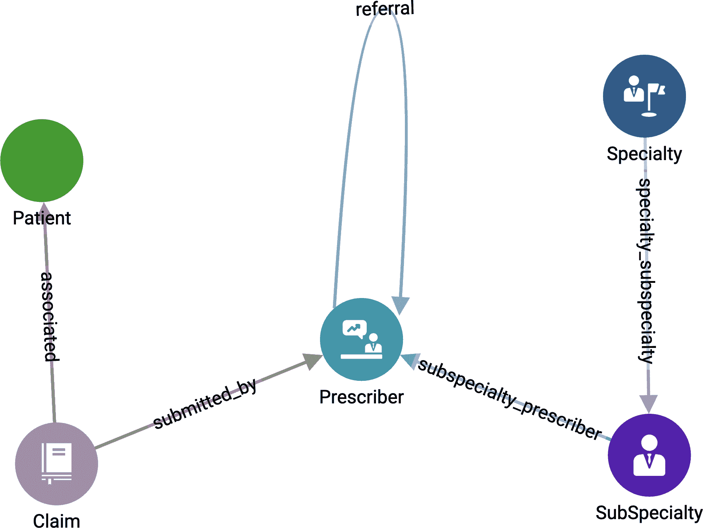
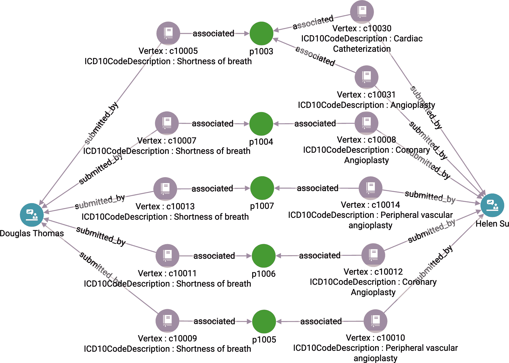
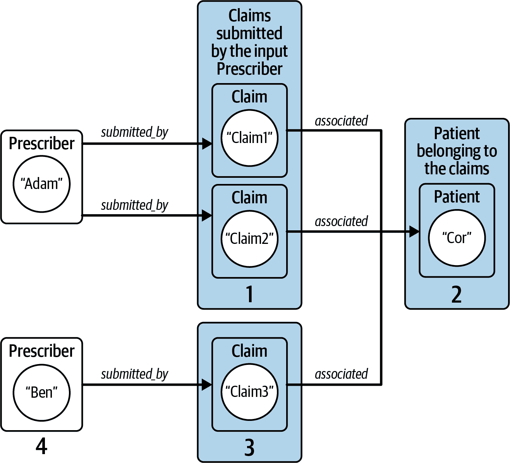
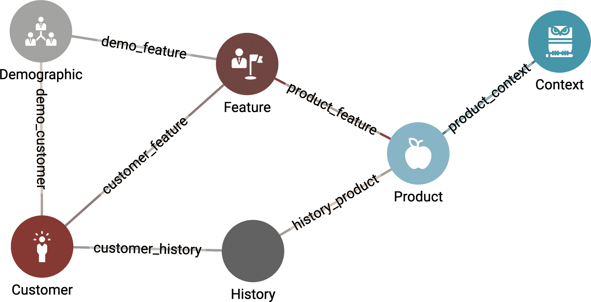
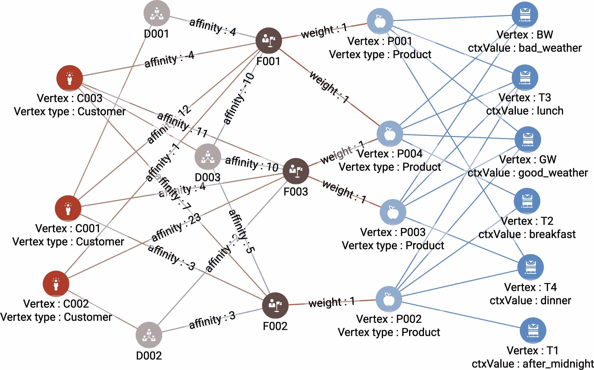
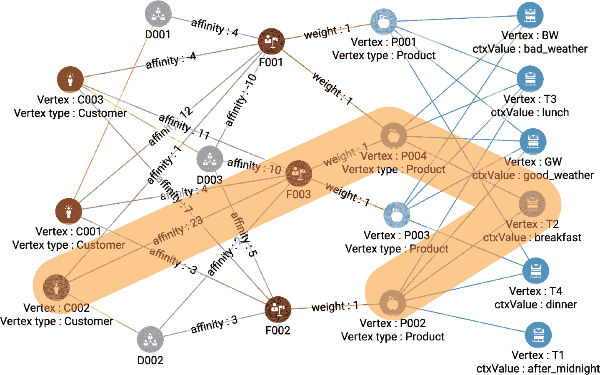
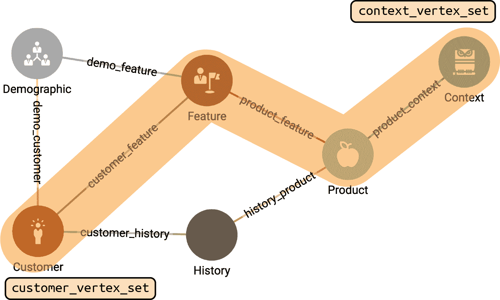
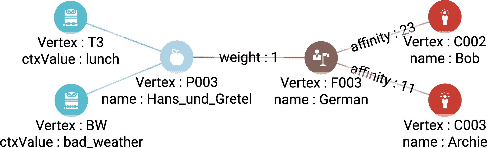
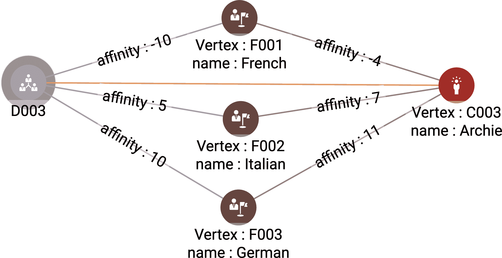

# 第七章：更好的推荐和推荐

本章将展示如何使用图分析从网络中检索信息，以便更好地进行推荐和推荐，使用两个真实的用例。在第一个用例中，我们将建立一个患者和医疗专家之间的推荐网络。我们将看到如何确定哪些医生是最有影响力的，以及他们之间的相互关系如何形成社区。第二个用例涉及使用基于客户、上下文因素、产品和特征之间连接和亲和力的特征来构建更好的推荐引擎。在本章结束时，您应该能够：

+   了解图连接如何提供上下文

+   应用多种技术分析上下文，以便进行推荐和推荐

+   知道如何建模和分析推荐网络

+   知道如何使用图分析建模和分析推荐引擎

+   解释高 PageRank 分数的含义，使用转诊和权威的概念

# 案例 1：改善医疗转诊

今天的医疗保健行业已发展到包括许多专业和专家。这在许多领域推进了技术进步，并使患者有可能接受专家护理。当患者的情况超出一般执业医生提供的常规护理时，一般执业医生可能会将患者转诊给专家。可能会有后续的转诊到其他专家。在许多医疗系统中，患者无权在没有转诊的情况下看专家；需要一个医生对另一个医生的正式转诊，以管理医疗成本和效率。

了解推荐行为对医生、他们的患者、医疗服务提供机构和保险公司都很重要。希望扩展业务和客户基础的医疗专家必须建立和维护强大的推荐水平。根据 2020 年的市场研究，每位医生每年因未能提供转诊而流失的收入高达 90 万美元。¹ 在这方面，医疗从业者类似于律师、体育教练、家庭装饰师和许多其他部分依赖于推荐来建立业务的服务提供者。患者可能想知道推荐是否由于护理质量或某些经济因素。保险公司可以研究推荐数据，看看是否存在可疑的模式，这可能构成一种欺诈形式。提供者是否在医疗必要范围外引导转诊？

要回答这些问题，我们需要能够看到全局图景并分析多层次的医生之间进行推荐的情况，这可能是一系列的推荐链，甚至有时是一个循环。该行业讨论推荐*网络*的结构。这些提供者-患者推荐网络的结构非常适合进行图分析。

# 解决方案：形成和分析转诊图

转诊网络的目标是通过将患者发送到正确的专科实践中来确保患者的医疗质量，方法是通过透明且对所有利益相关者有效的患者、医生和医疗专家之间的简化沟通来实现。

了解转诊网络的动态对个体参与者以及像健康保险提供者这样希望全面管理网络的组织都是有价值的。对转诊网络的深入分析可以揭示系统中的低效。例如，医生可能会经常将具有特定症状的患者转诊给特定专家，而不知道该专家倾向于再次将这些患者转诊给另一专家。如今的医疗提供者忙于立即处理面前的患者问题，可能无法看到更全面的系统级视角。能够访问转诊网络分析的医生或管理员可以识别这些模式，并根据数据调整其转诊方案。

一般来说，医生将其患者转诊给其他医疗专家有三个原因：第一，寻求专家在诊断或治疗上的建议；第二，将专家添加到为患者提供服务的医疗提供者团队中；第三，当原始医生由于经验差距或其他个人因素不适合时，将患者转移。在转诊网络中，顶点代表医生、患者和医疗专家。医生向医疗专家转诊患者的行为表示为有向边。在适当的时间做出正确的转诊是提供优质和高效医疗的重要组成部分。我们可以分析生成的有向网络以识别重要的医生和专家。

# 实施医疗专家转诊网络

TigerGraph 提供了一个入门套件，用于建模医疗转诊网络。我们使用这个入门套件来探索和分析医疗专家、患者和医生的转诊网络。你可以按照 第三章 中的步骤进行安装。

## 医疗转诊网络入门套件

部署一个新的 TigerGraph 云实例，选择“医疗 - 转诊网络、中心和社区检测”作为入门套件。安装成功后，你可以按照 “加载数据和安装入门套件的查询” 小节在 第三章 中列出的步骤加载数据。

## 图谱模式

医疗转诊网络入门套件包括超过 11K 个顶点和超过 40K 条边。有五种不同的顶点类型和五种有向边类型。² 该入门套件的模式显示在图 7-1 中。



###### 图 7-1\. 医疗保健 - 转诊网络、枢纽和社区检测入门套件的图模式（请参阅该图的更大版本：[`oreil.ly/gpam0701`](https://oreil.ly/gpam0701)）

我们在表 7-1 中描述了五种顶点类型。`**处方者**`是一个医生或护士从业者，执行医疗服务，然后提交与`**患者**`相关联的`**索赔**`。每个`**处方者**`都有一个`**专科**`和`**亚专科**`。

五种边类型中有四种非常直接；`**转诊**`边类型值得特别关注。`**处方者**`可能向另一`**处方者**`推荐，以便`**患者**`可以接受额外的护理。然而，如果您查看加载数据页面上的图统计表，您将看到没有转诊边缘！源数据没有指定任何转诊。我们将运行的一个查询将使用图中的数据来推断转诊。链接推断，也称为链接预测，是图分析提供的最有价值的能力之一。

表 7-1\. 医疗转诊图模型中的顶点类型

| 顶点类型 | 描述 |
| --- | --- |
| `**处方者**` | 能够诊断并开药的医疗从业者 |
| `**索赔**` | 由处方者执行的可计费医疗服务的描述，与患者相关联 |
| `**患者**` | 接受医疗服务的人 |
| `**专科**` | 医疗实践的一个分支，专注于一类生物系统、障碍、治疗或患者 |
| `**亚专科**` | 专科的一个子类别 |

## 查询和分析

医疗转诊网络入门套件包含众多查询。我们将专注于展示图分析技术如何提供医疗保健转诊网络行为洞察的四个查询。以下是这四个查询的简要描述。然后我们将深入探讨每个查询的工作细节。

获取共同的患者

给定两位医生，找出这些医生共同的所有患者。

推断转诊网络

源数据并未明确指定转诊。这项分析通过查找一个`**患者**`由一个`**处方者**`提交了一个`**索赔**`，然后由另一个不同的`**处方者**`在有限的时间内提交了另一个`**索赔**`来推断转诊。

查找有影响力的医生

易于看出哪些医生接收了最多的转诊，但哪些医生影响力最大？影响力比仅仅转诊数量更加微妙。有多种方法来定义**影响力**。本分析使用 PageRank 算法的影响力概念来找出最具影响力的**`处方医师`**。

查找转诊社群

将转诊图看作社交网络，我们能看到哪些社群？也就是说，哪些**`处方医师`**由于转诊关系而紧密联系？该分析不仅考虑一对一关系的存在，还考虑了如何将提供者组合紧密联系在一起。

### 获取共同的患者

查询`get_common_patients`以两个**`处方医师`**顶点作为输入参数，并找到每个具有这两位医生`**声明**`的`**患者**`。例如，如果我们使用建议的输入，即处方医师道格拉斯·托马斯和海伦·苏，图 7-2 说明了查询的输出。该查询不仅发现他们有五名共同患者，还显示了患者为何看这两位医生。请注意，我们不要求这反映转诊关系。一个人可能因为溃疡和骨折等不相关的原因看这两位医生。尽管如此，这些信息对几个原因都很有帮助。提供者可以比较共同患者的数量与他们的预期。他们还可以查看共同患者群体的整体特征。这些共同患者的人口统计学或健康状况是否有显著或不寻常的地方？是否存在间接转诊，即没有转诊边缘，但如果进行直接转诊，患者可能会得到更好的护理？



###### 图 7-2。道格拉斯·托马斯和海伦·苏医生之间的常见患者（请查看该图更大的版本：[`oreil.ly/gpam0702`](https://oreil.ly/gpam0702)）

`get_common_patients`查询实施了六个步骤。前四步找到共同患者，最后两步收集连接的顶点和边，以便我们可以显示连接性。在我们计算步骤时，参考这个图可能会有所帮助。

第一步是通过遍历`submitted_by`边类型收集与第一个**处方医师**相关联的所有声明。为了记住我们已经遍历过的顶点，我们对每个已访问的**声明**标记`@visited`为`true`：

```
 claims1 = SELECT t
    FROM Pre1:s -(<submitted_by:e)- Claim:t
    ACCUM t.@visited += true;
```

在我们的例子中，如果道格拉斯·托马斯是**处方医师 1**，那么`claims1`将包括顶点 c10005、c0007、c0009、c10011 和 c10013。可能会包括更多。这些其他顶点将在后期阶段被过滤掉。

然后，在下一步中，我们为每个`**Claim**`找到链接的`**Patient**`元素。同样，我们使用`@visited`来标记我们使用的顶点。在这种情况下，这些是`**Patient**`顶点：

```
patients1 = SELECT t
    FROM claims1:s -(associated>:e)- Patient:t
    ACCUM t.@visited += true;
```

继续我们的例子，对于 Douglas Thomas，这一步会找到`**Patient**` p1003, p1004, p1005, p1006 和 p1007。可能会找到更多，但稍后会被过滤掉。

在第三步中，我们与第一步相同，但现在收集第二个`**Prescriber**`的`**Claim**`元素。这会找到图 7-2 下部分的六个索赔：

```
claims2 = SELECT t
    FROM Pre2:s -(<submitted_by:e)- Claim:t
    ACCUM t.@visited += true;
```

在第四步中，我们与第二步相同，但现在我们从第三步中找到的`**Claim**`元素开始遍历，并使用`WHERE`条件仅包括之前已访问过的`**Patient**`顶点。任何之前已访问过的`**Patient**`必定是第一个`**Prescriber**`的患者，因此我们知道这个`**Patient**`是共同患者。这是我们之前提到的过滤阶段：

```
common_patient = SELECT t
    FROM claims2:s -(associated>:e)- Patient:t
    WHERE t.@visited == true;
PRINT common_patients;s
```

在第五步中，我们从通用的`**Patient**`元素中选择每个`**Claim**`，并使用`**associated**`边类型来收集它们的边。我们将这些边存储在`@@edges_to_display`中。在最后一步中，我们会收集更多的边：

```
claims = SELECT t
    FROM common_patients:s -(<associated:e)- Claim:t
    WHERE t.@visited == true
    ACCUM @@edges_to_display += e;
PRINT claims;
```

最后，我们收集在第五步中找到的`**Claim**`元素与两个`**Prescriber**`元素之间的所有边。我们将这些边存储在`@@edges_to_display`中并打印它们：

```
claims = SELECT s
    FROM claims:s -(submitted_by>:e)- :t
    ACCUM @@edges_to_display += e;
PRINT @@edges_to_display;
```

### 推断转诊网络

源数据没有明确包含**`referral`**边，因此我们创建一个查询来推断何时有转诊，然后将一个**`referral`**边插入图中。如果患者在时间点 A 访问了 Prescriber 1，然后在稍后的时间点 B 访问了 Prescriber 2，这可能是由于转诊。查询参数`max_days`设置了两次医生访问之间被视为转诊的最大天数上限，默认值为 30 天。

有几个原因可能导致这种时间顺序*不是*由转诊引起：

+   Prescriber 1 和 Prescriber 2 都在治疗患者相同病症的不同方面，但 Prescriber 1 没有建议患者去看 Prescriber 2。

+   对于 Prescriber 2 的访问与对 Prescriber 1 的访问无关。

要区分真实转诊和错误转诊需要比我们数据集中拥有的更多信息。

查询`infer_all_referrals`仅仅调用`infer_referrals`，每次对每个`**Pre⁠scriber**`顶点调用一次。`infer_referrals`才是真正的工作：

```
    SumAccum<INT> @@num_referrals_created;

    all_prescribers = SELECT s FROM Prescriber:s
        ACCUM
            @@num_referrals_created += infer_referrals(s, max_days);

    PRINT @@num_referrals_created;
```

图 7-3 展示了在`infer_referrals`查询中进行图遍历的示例流程。从`input_prescriber` D1 到另一个`**Prescriber**` D2 需要四次跳转。这对应于图 7-3 中描述的四个`SELECT`语句。



###### 图 7-3\. `infer_referrals` 查询的图遍历示例

`infer_referrals` 查询接受两个输入参数：`input_prescriber`，类型为 `**Prescriber**` 的顶点；以及整数值 `max_days`。从 `input_prescriber` 开始，查询通过遍历边类型 **`submitted_by`** 选择与输入开药人相关的所有 `**Claim**` 元素。从那里，它通过选择边类型 `**associated**` 找到所有属于那个 `**Claim**` 集合的 `**Patient**` 顶点。在 Figure 7-3 中，这两个步骤对应于从 Adam（输入开药人）到 `**Patient**` Cor。

注意，患者 Cor 从同一个开药人（Adam）那里有多个索赔。索赔的日期是决定是否有转诊的关键因素，因此我们需要注意每个单独的日期。以下的 GSQL 代码片段展示了从 `input_prescriber` 到他们的患者的前两跳，包括收集每个患者索赔日期的 `@date_list` 累加器：

```
    Start = {input_prescriber};

    my_claims = SELECT t FROM Start:s -(<submitted_by:e)- :t
        POST-ACCUM t.@visited = true;
    my_patients = SELECT t FROM my_claims:s -(associated>:e)- :t
           // A Patient may have multiple claims; save each date
        ACCUM t.@date_list += s.rx_fill_date;
```

现在我们想要找出其他开药人为这些患者提出的索赔。以下代码中的 `WHERE t.@visited == false` 子句确保这些其他索赔与我们之前查看过的不同。然后我们比较此步骤中遇到的索赔日期与患者的 `@date_list` 中的索赔日期。如果时间差小于 `max_days`，我们将此新索赔标记为转诊（在查询的前面，我们将 `max_days` 转换为 `max_seconds`）：

```
    other_claims = SELECT t FROM my_patients:s -(<associated:e)- :t
        WHERE t.@visited == false
        ACCUM
               FOREACH date IN s.@date_list DO
                CASE WHEN datetime_diff(date, t.rx_fill_date)
                        BETWEEN 0 AND max_seconds THEN
                    t.@is_referred_claim = true
                END
            END
        HAVING t.@is_referred_claim == true;
```

接下来，我们查找与标记索赔相关的 `**Prescriber**` 顶点，并使用 `INSERT` 语句创建边。出于信息目的，我们使用 `@@num_referrals_created` 累加器计算插入的边数。在 GSQL 中，图更新直到查询结束前才会提交。因此，在此查询中直接计算 `**referral**` 边的数量是行不通的。我们只能在随后的查询中执行这样的计数：

```
 other_prescribers = SELECT t FROM other_claims:s -(submitted_by>:e)- :t
     POST-ACCUM
         INSERT INTO referral VALUES(input_prescriber, t, 1),
         @@num_referrals_created += 1;
```

最后，我们使用 `RETURN @@num_referrals_created` 将数据发送回调用此查询的查询。调用者查询（`infer_all_referrals`）为每个 `**Prescriber**` 返回的每个返回值相加，以计算整个图中创建的边的总数。

# GSQL 中的子查询

可以通过在头部使用 `RETURNS` `(<data_type>)` 并在查询末尾使用 `RETURN <value>` 来定义查询作为子查询。除了返回值之外，子查询还可以具有图修改的副作用（例如插入边）。子查询中的 `PRINT` 语句不会打印到控制台；一个替代方法是使用 `PRINTLN` 或 `LOG` 将内容写入文件。更多详细信息，请参阅 TigerGraph 的 [GSQL 语言参考](https://oreil.ly/Q7U-D)。

### 找出有影响力的医生

此查询查找最具影响力的专家。一个具有影响力的专家被视为权威。他们不仅接受了很多转诊，而且处理重要病例。如果他们突然从图中退出，影响将是显著的。相对影响力分析可以帮助医生了解他们的相对重要性，并看看是否可以提高它。医疗管理人员可以全面考虑，看看是否可以减少对个人的过度依赖，并为患者提供更平衡的护理，同时降低成本。流行病学家、制药公司和医疗设备供应商也可能想知道哪些医生最具影响力。

幸运的是，一个著名的图算法通过这种方式衡量影响力，考虑了传入边的数量和相对重要性。由 Google 创始人 Larry Page 和 Sergey Brin 开发的*PageRank* *算法*根据指向它的其他页面数量和这些其他页面的等级来排名网页。我们可以类似地查看转诊网络中医生的影响力。如果医生接收的转诊更多，或者这些转诊者的影响力增加，医生的影响力就会增加。

TigerGraph 的 GDS 库中包含了*PageRank*算法（`tg_pagerank`）的实现。这个算法包含在这个起始套件中以方便使用，但将库算法安装到您的数据库实例中是一个简单的过程。与我们看到的其他为特定图架构和特定起始套件编写的 GSQL 算法不同，这个算法是通用的。它有 10 个输入参数（在表 7-2 中显示），但其中 8 个具有默认值。我们只需要设置前两个。在我们的案例中，我们设置`v_type` `=` `**Prescriber**`和`e_type` `=` `**referral**`。

###### Tip

在 GraphStudio 中，GSQL GDS 库可在新查询窗口中使用。选择一个图后，在左侧边栏中选择“编写查询”，然后点击绿色的⨁按钮将新查询添加到已安装和已保存查询列表中。在新弹出的窗口中点击“从库中选择”。将鼠标悬停在任何查询旁边的问号图标上，可以简要了解其目的。

表 7-2\. `tg_pagerank`库算法的输入参数

| 参数 | 默认值 | 描述 |
| --- | --- | --- |
| `v_type` |   | 要使用的顶点类型的名称。 |
| `e_type` |   | 要使用的边类型的名称。 |
| `max_change` | 0.001 | 当中间 PageRank 分数稳定时（变化小于 0.001）停止迭代。 |
| `max_iter` | 25 | 如果我们已经计算了这么多次的中间 PageRank 分数，则停止迭代。 |
| `damping` | 0.85 | 相邻节点相对于随机移动（在未连接顶点之间）的相对重要性。对于稳定性来说，需要一些随机移动。 |
| `top_k` | 100 | 在输出中打印的前 K 个分数的数量。 |
| `print_accum` | TRUE | 以 JSON 格式打印输出。 |
| `result_attr` | FALSE | 将结果存储为顶点属性。 |
| `file_path` | *空字符串* | 将结果以表格格式写入此文件。 |
| `display_edges` | FALSE | 在输出中包含感兴趣的边缘。如果在 GraphStudio 上运行该算法，并选择此选项，会导致更好的视觉显示。 |

在`e_type`之后的三个参数是 PageRank 特有的。最后五个参数是通用的，并且出现在 GDS 库中许多或大多数算法中。它们处理查询输出在控制台打印和/或导出到文件的方式。`result_attr`是一种将 PageRank 结果存储为图的顶点属性的方式，以便稍后的查询可以在其自己的计算中使用该算法的结果。`display_edges`参数指定输出是否应包含有助于可视化结果的边。例如，如果`get_common_patients`查询要添加此参数，它将指定是否应执行步骤 5 和 6。

如果您使用`v_type =` `**Prescriber**`，`e_type =` `**referral**`和`top_k` `= 5`设置运行 PageRank，您应该得到以下输出：

```
[ {
    "@@top_scores_heap": [
       {"Vertex_ID": "pre16", "score": 2.72331},
       {"Vertex_ID": "pre61", "score": 2.5498},
       {"Vertex_ID": "pre58","score": 2.20136},
       {"Vertex_ID": "pre52","score": 2.08101},
       {"Vertex_ID": "pre69","score": 1.89883}
    ]
  } ]
```

### 寻找推荐社区

此查询检测推荐网络中的社区。社区是一组高度相互连接的顶点，与图的其余部分之间的关系稀疏。在推荐网络中，社区通过医生、患者和医疗服务提供者之间的密集连接而产生，当它们相互作用时形成一个组。它们因为彼此之间的许多互动而形成一个群体。检测社区可以帮助医生识别他们在网络中推荐的传播，并为他们的患者做出更好的推荐。医疗管理人员可以调查社区以评估当地的医疗系统。

一种广受欢迎的检测社区的图算法是 Louvain 算法，我们在第六章中提到过。这种算法由洛汉大学的 Vincent Blondel 开发，通过优化社区内边的相对密度（称为*模块*）与模块外边的边来选择图社区。Louvain 方法的一个关键特点是它没有固定的输入参数来检测社区数量，这使得它在实际应用中具有优势，例如在那些初始时不知道要检测的社区数量的情况下。它从检测小模块开始，然后在能够提高模块性评分时将它们组合成较大的模块。

包含在健康护理-转诊网络，枢纽和社区检测入门套件中的 Louvain 算法（`tg_louvain`）。它有八个输入参数（在表 7-3 中显示）。顶点类型（**Prescriber**）和边类型（**referral**，在正向和反向方向上）已经硬编码到查询中。无需调整任何参数，尽管您可以尝试增加`output_level`。

表 7-3. `tg_louvain`库算法的输入参数

| 参数 | 默认值 | 描述 |
| --- | --- | --- |
| `iter1` | 10 | 移动的最大迭代次数。 |
| `iter2` | 10 | 合并的最大迭代次数。 |
| `iter3` | 10 | 优化的最大迭代次数。 |
| `split` | 10 | 数据批次数，以减少内存峰值消耗。`split`=1 一次处理整个图。`split`=10 将图分为 10 批次处理。 |

| `output_level` | 0 | 如果为 0：JSON 输出是有关社区的统计信息。如果为 1：还输出按群集大小索引的社区 ID。

如果为 2：还输出每个社区的成员资格。

| `print_accum` | TRUE | 以 JSON 格式打印输出。 |
| --- | --- | --- |
| `result_attr` | FALSE | 将结果存储为顶点属性。 |
| `file_path` | *空字符串* | 将结果以表格格式写入此文件。 |

使用默认设置运行查询。超过 11,000 个顶点，难以可视化结果，因此我们将检查 JSON 输出。JSON 输出的前三个部分如下所示。第一部分告诉我们算法将顶点分组为 17 个社区。第二部分显示最大的社区有 11,055 个成员。第二大的社区只有 10 名成员。第三部分显示`id`=0 的社区是具有 11,055 名成员的社区，68157440 号社区有 6 名成员，等等。由于这是一种启发式算法，可能会得到略有不同的社区大小和质量。社区 ID 可能会有所不同：

```
[
  {"num_of_clusters": 17},
  {"@@largest_clusters": [
      {"csize": 11055,"number": 1},
      {"csize": 10,"number": 1},
      {"csize": 9,"number": 1},
      {"csize": 8,"number": 4},
      {"csize": 7,"number": 3},
      {"csize": 6,"number": 2},
      {"csize": 4,"number": 4},
      {"csize": 3,"number": 1}
    ]
  },
  {
    "@@cluster_sizes": {
      "0": 11055,
      "68157440": 6,
      "68157441": 8,
      "71303168": 9,
      "71303169": 10,
      "71303170": 8,
      "72351746": 3,
      "72351747": 7,
      "73400320": 8,
      "75497473": 4,
      "77594625": 6,
      "77594628": 8,
      "79691776": 4,
      "81788928": 4,
      "84934657": 7,
      "84934658": 4,
      "88080385": 7
    }
]
```

# 情况 2：个性化推荐

今天的消费者通常有太多选择。他们很难知道有什么可用并做出决定，而供应商也很难确保他们被注意到并满足消费者的需求。推荐引擎越来越重要，用于引导用户穿过这些产品的丛林。推荐引擎旨在防止用户信息过载，并为他们提供更个性化的信息，使解决方案的用户体验更高效。像亚马逊这样的在线零售商可能在同一类别中拥有数十万个单独的产品。在线零售商提供许多产品，因此受益于推荐引擎，因为它有助于购物者更快速、更轻松地找到感兴趣的产品。重复业务也来自于对个性化体验满意的客户，其他零售商没有提供这种体验。

传统的推荐引擎根据用户的历史行为和相似用户的行为向用户提供产品、内容或服务的建议。然而，这种方法存在一些问题。首先，新用户没有历史记录，因此我们无法在开始时向他们提供正确的建议。这被称为“冷启动问题”。其次，当仅查看用户的历史行为时，我们仅限于重复推荐同类型的内容。用户可能会错过供应商提供的其他产品、内容和服务。最后，制定高度个性化的建议不容易扩展，因为随着用户基数和细节级别的增长，要考虑的人数、产品和因素也会相应增长，随着时间的推移需要指数级别的更多比较。

为了解决这些问题，我们需要一个推荐引擎，能够几乎实时地维护和处理最新的信息，且不依赖批处理。另一个要求是速度快且能够扩展到数百万用户和产品。

# 解决方案：使用图进行基于多关系的推荐

应用程序向用户推荐产品，本质上是发现连接或相似性。购买产品是消费者和产品之间的一种连接，而消费者、产品及其特征之间也存在连接。如果两个人有相似的喜好，那么这种相似性就是一种连接，经常一起购买的产品也分享同样的连接。这些连接是用户与应用程序互动后产生的，推荐是分析这些连接的一种形式。总体而言，这些连接形成了一个图。通过将数据建模为图，我们可以直接在图结构数据上进行查询，而无需在批处理数据上进行大型连接操作。因此，图是表示这些连接的一种自然且灵活的方式。以这种方式组织关系使得添加、修改和删除数据变得简单，并使应用程序具有高可扩展性。

使用图进行推荐引擎的另一个好处是避免用户的冷启动问题。因为图模型是一个单一的互连系统，我们可以使用混合的推荐技术来填充初始用户体验：与新用户的人口统计信息相关联的内容；基于内容的、协同过滤的推荐；以及供应商促销。在图中，这些技术可以通过模式匹配和相似性评分来实现。此外，增加更多数据、建立更多关系和修订推荐方案都变得非常简单。

# 实施多关系推荐引擎

TigerGraph 提供了一个入门套件，展示了如何利用图分析生成客户产品推荐。可以通过按照第三章中的步骤安装这个入门套件。

## 推荐引擎 2.0 入门套件

部署一个新的 TigerGraph Cloud 实例，选择“推荐引擎 2.0（超个性化营销）”作为入门套件。按照第三章的“加载数据和安装查询入门套件”中的步骤加载数据。

## 图模式

图 7-4 展示了这个入门套件的图模式，包含六种顶点类型和七种边类型。



###### 图 7-4\. 推荐引擎 2.0 的图模式（查看此图的更大版本，请访问[`oreil.ly/gpam0704`](https://oreil.ly/gpam0704)）

表 7-4 描述了顶点类型。`**人口统计学**`顶点指的是`**顾客**`的人口统计属性。`**顾客**`是我们网店中有账户的自然人。此外，每个`**顾客**`都有购买`**产品**`的`**历史**`。`**特征**`可以是`**人口统计学**`、`**顾客**`或`**产品**`顶点的特征。通过`**上下文**`，我们为我们的查询添加了一个具有时间约束或天气条件的上下文层。

表 7-4\. 推荐引擎 2.0 图模型中的顶点类型

| 顶点类型 | 描述 |
| --- | --- |
| `**顾客**` | 一个自然人 |
| `**人口统计学**` | 一个`**顾客**`的人口统计属性 |
| `**历史**` | 一个`**顾客**`的购买历史 |
| `**产品**` | 一个产品 |
| `**特征**` | 一个`**顾客**`的特征 |
| `**上下文**` | 一个上下文约束 |

在我们简化的示例中，每个`**上下文**`顶点都有一个 ID 值，这是描述其特征的单词或短语。在真实世界的示例中，模式可能会将数据分类到不同类型的上下文中，例如位置、日期、天气等，但我们将它们全部 lumped 到一个属性中。

一些边类型具有权重属性。`**产品特征**`边类型有一个称为`weight`的属性。高`weight`意味着该特征是该产品的重要方面。`**顾客特征**`边类型具有一个称为`affinity`的属性。高亲和力意味着该特征与顾客的需求之间有很强的关联。我们可以使用这些权重来计算顾客对产品的偏好程度，即基于特征的推荐。一个标准的方法是将`**产品特征**`的`weight`乘以`**顾客特​_​fea⁠ture**`的`affinity`。

这个入门套件中的图表故意设计得非常小，以便于跟踪计算。整个图表在图 7-5 中显示。从上到下，顶点类型分别为`**顾客**`、`**人口统计学**`、`**特征**`、`**产品**`和`**上下文**`。



###### 图 7-5\. 推荐图（请查看此图的更大版本：[`oreil.ly/gpam0705`](https://oreil.ly/gpam0705)）

## 查询与分析

推荐引擎 2.0 入门套件包括三个查询，展示了如何使用图分析改进推荐引擎。它们允许我们选择考虑 **上下文** 和 **特征** 元素的排名前列产品。

按特征和上下文推荐

在考虑 `weather` 和 `time_of_day` 的情况下，为 `source_customer` 返回 `top_k` 产品。

根据客户和上下文推荐产品

在考虑天气和一天中的时间的情况下，向客户推荐评分最高的产品。

获取顶级人口统计数据

显示与其顾客之间的平均亲和力最高的人口统计数据，并显示与该人口统计数据相关的特征。

### 按特征和上下文推荐

针对一组上下文条件和一个客户，`recommend_by_​fea⁠tures​_​and_context` 查询返回满足上下文条件且在其特征与客户偏好特征之间具有最强匹配的产品。此查询接受四个输入参数。第一个参数 `source_customer` 指定我们想要了解其顶级产品的 **客户**。然后，使用 `weather` 和 `time_of_day` 指定我们选择的 **上下文**，使用 `top_k` 设置我们想要返回的顶级产品数量。

查询从将顶点集 `start` 初始化为 `source_customer` 开始。接下来，计算用户想要应用的上下文过滤器数量。如果用户不希望按照输入因素（`time_of_day` 或 `weather`）进行过滤，则应将该输入参数留空。以下代码计算激活的上下文过滤器数量：

```
IF time_of_day != "" THEN min_filters = min_filters + 1; END;
IF weather != "" THEN min_filters = min_filters + 1; END;
```

接下来，我们找出满足我们上下文过滤器的产品。我们首先将 `candidate_products` 初始化为所有产品，并将 `filtered_context` 初始化为所有上下文。然后，如果 `min_filters` 不为零，则表示已设置了 **上下文**，因此我们执行第一个 `SELECT` 语句，将 `filtered_context` 缩小到仅匹配 `time_of_day` 或 `weather` 的元素：

```
    IF min_filters != 0 THEN
        filtered_context = SELECT c FROM Context:c 
        WHERE c.id == weather OR c.id == time_of_day; // filter for context
```

我们使用另一个 `SELECT` 语句来将 `candidate_products` 细化到仅链接到所有 `filtered_context` 的产品：

```
        candidate_products = SELECT p 
            FROM filtered_context:c -(product_context:pc)- Product:p
            ACCUM p.@filters += 1        // count # matching filter properties
            HAVING p.@filters >= min_filters; // must match all context filters
```

`ACCUM` 子句计算每个产品进行了多少次上下文匹配。`HAVING` 子句将最终选择过滤为仅包括在所有指定上下文参数上匹配的产品。参考 图 7-5，如果设置参数 `weather` `= "BW"` 和 `time_of_day` `= "T2"`，则 `candidate_products` 将为 {P004}，即唯一连接到两个 `filtered_context` 顶点的产品。

现在我们可以计算客户和产品之间的总体推荐得分。我们使用两跳路径来查找给定的`**Customer**`和候选`**Product**`节点之间的连接，`**Feature**`作为中介。对于每个连接到感兴趣特征的选择产品，我们将`**prod⁠uct​_​feature**`权重乘以`**customer_feature**`亲和力，并加到累加器`@max_score`中。

添加所有相关特征的贡献来计算总分数是一个有效的方法，但这并不是我们实际正在做的。`@max_score`被定义为`MaxAccum`，因此它保留了给定的最高值。换句话说，我们寻找最重要的单一特征，并仅使用该特征进行评分。⁴ 然后我们使用类似 SQL 的`ORDER BY`和`LIMIT`子句与`@max_score`一起选择具有最高推荐得分的`top_k`产品：

```
    recomm_products = SELECT p 
        FROM start:s -(customer_feature:cf)- Feature:f
             -(product_feature:pf)- candidate_products:p     
        ACCUM p.@max_score += pf.weight*cf.affinity  // compute score
        ORDER BY p.@max_score DESC
        LIMIT top_k;
```

假设我们设置`weather = "GW"`和`time_of_day = "T2"`。那么`candidate_products`将为{P004, P002}，如图 7-6 中所示（因为`"GW"`连接到每个产品，它没有过滤效果）。如果`source_customer = C002`，则只有一条`Customer-Feature-Product`路径到**`candidate_products`**，权重为 23。



###### 图 7-6\. 推荐路径按特征和上下文分析（查看此图的更大版本，请访问[`oreil.ly/gpam0706`](https://oreil.ly/gpam0706)）。

要查看分数，请切换到 JSON 输出。现在假设我们设置`source_customer = C001`，`weather = GW`，`time_of_day = T``2`，以及`top_k = 2`。想想从`C001`到`GW`和`T``2`在图 7-6 中可以看到的路径，从而导致以下推荐得分：

```
      {
        "attributes": {
          "@max_score": 12,
        },
        "v_id": "P004",
        "v_type": "Product"
      },
      {
        "attributes": {
          "@max_score": -3,
        },
        "v_id": "P002",
        "v_type": "Product"
      }
```

### 推荐产品根据客户和上下文。

针对一组上下文条件和一组客户，此查询返回满足上下文条件且其特征与客户偏好特征最匹配的产品。此查询的基本任务与我们的第一个查询非常相似，即按特征和上下文推荐，但存在一些有趣的差异。第一个差异是此查询接受任意上下文值列表（`input_context_set`），而不是询问一个天气条件和一个时间条件。第二个差异是它可以处理多个输入客户（`input_customer_set`），而不是单个客户。这两个变化使得它更加通用。第三个差异是它仅返回一个产品。这是因为此查询显示了导致推荐的`**Customer**`和`**Context**`节点的所有连接的视觉表示。如果选择了前 k 个产品，则视觉表示将不那么容易解释。

查询从定义元组类型和多个累加器开始。前四个定义是为了通过它们与客户的平均亲和力来排序产品。`HeapAccum`将自动排序给定给它的元组。在我们有了`HeapAccum`之后，我们将需要将其转换为顶点集以进行进一步处理：

```
    TYPEDEF TUPLE<VERTEX<product> v, DOUBLE avg_score> Product_Score_Tuple;
    AvgAccum @product_avg_score;
    HeapAccum<Product_Score_Tuple>(1, avg_score DESC) @@top_product_heap;
    SetAccum<VERTEX<product>> @@top_product_vertex_set;
```

###### 提示

堆是从非常大的列表中获取前 k 个元素的更可伸缩的方法，因为堆具有固定且通常较小的大小。虽然`ORDER BY`和`LIMIT`在语法上更简单，但它们将构建一个临时表来排序所有元素。

最后七个累加器仅用于收集要显示的顶点和边缘。虽然我们选择为每种类型单独使用容器，但您可以将它们合并为一个顶点集和一个边集：

```
    SetAccum<VERTEX<customer>> @@final_customer_vertex_set;
    SetAccum<VERTEX<feature>> @@final_feature_vertex_set;
    SetAccum<VERTEX<product>> @@final_product_vertex_set;
    SetAccum<VERTEX<context>> @@final_context_vertex_set;
    SetAccum<EDGE> @@final_context_feature_edge_set;
    SetAccum<EDGE> @@final_product_feature_edge_set;
    SetAccum<EDGE> @@final_product_context_edge_set;
```

我们首先选择与`customer_vertex_set`中的`**Customer**`顶点共享`**Feature**`的所有`**Product**`顶点，并且还链接到`context_vertex_set`中输入`**Context**`顶点之一的顶点。在像 GSQL 这样的图查询语言中，您通过搜索构成这些连接的路径来执行此选择。图 7-7 显示了之前在图 7-4 中看到的图模式，突出显示了搜索路径和指定的顶点集。



###### 图 7-7. 选择由某些客户评价的特征的产品并满足某些上下文约束的图路径（在[`oreil.ly/gpam0707`](https://oreil.ly/gpam0707)上查看此图的较大版本）

在 GSQL 中，有两种语法选项来描述此路径：作为由逗号分隔的三个一跳路径或作为一个多跳路径。虽然多跳路径通常更优雅，但单独的路径可以在需要性能调优时更好地控制查询的执行方式。请注意多跳`FROM`子句如何与图中突出显示的路径完全对应：

```
    product_vertex_set = SELECT p
        FROM customer_vertex_set:c -(customer_feature:cf)- feature:f
        -(product_feature:pf)- product:p
        -(product_context:pctx)- context_vertex_set:ctx
```

每个`**Customer-Feature-Product**`路径都有一个得分：`cf.affinity * pf.weight`。我们计算所有路径得分，并在`AvgAccum`累加器（`@product_avg_scor``e`）中累加它们，以获得每个产品的平均得分。然后，我们将每个产品及其得分插入`HeapAccum`（`@@order_product_heap`），对其进行排序。由于我们将堆的大小设置为 1，因此我们最终得到了得分最高的单个产品：

```
    ACCUM p.@product_avg_score += (cf.affinity * pf.weight)
    POST-ACCUM
        @@order_product_heap += Order_Product_Tuple(p, p.@product_avg_score);
```

在一个`SELECT`语句中，我们执行了我们的推荐分析。

最终的`SELECT`语句的目的是可视化我们想在图表中显示的元素。我们沿用之前的路径，使用几乎相同的`FROM`子句，只有一个改变：我们只包括我们的顶级产品，而不是所有产品。我们从顶点类型中的`@@final_customer_vertex_set`、`@@final_feature_vertex_set`、`@@final_product_vertex_set`和`@@final_context_vertex_set`累加器中添加所有元素，然后打印这些累加器：

```
    product_vertex_set = SELECT p
        FROM customer_vertex_set:c -(customer_feature:cf)- Feature:f
          -(product_feature:pf)- product_vertex_set:p
          -(product_context:pctx)- context_vertex_set:ctx
        ACCUM @@final_context_feature_edge_set += cf,
          @@final_product_feature_edge_set += pf,
          @@final_product_context_edge_set += pctx
        POST-ACCUM @@final_customer_vertex_set += c
        POST-ACCUM @@final_feature_vertex_set += f
        POST-ACCUM @@final_product_vertex_set += p
        POST-ACCUM @@final_context_vertex_set += ctx;
```

图 7-8 展示了输入客户为`C002`和`C003`，输入上下文为`BW`（恶劣天气）和`T3`（午餐）时的输出结果。决定此选择的权重显示在图中。



###### 图 7-8\. `recomm_by_customer_and_context`的示例查询结果（请参阅此图的更大版本：[`oreil.ly/gpam0708`](https://oreil.ly/gpam0708)）

### 获取顶级人口统计数据

查询`display_top_demographic`找到具有其成员中最高平均亲和力分数的`**Demographic**`元素，并显示连接到此`**Demographic**`的`**Customer**`和`**Feature**`元素。这里的直觉是，具有高亲和力的`**Demographic**`应该有相似的成员，因此您应该能够更好地预测他们的偏好。这个查询的结构与按客户和上下文推荐产品的结构非常相似。我们根据其与连接的`**Customer**`元素之间基于特征的平均亲和力评分每个`**Demographic**`元素。这告诉我们，我们是否有一个强烈联系的`**Demographic**`组，还是一个仅仅松散联系的组。

与之前的查询不同，这个查询没有输入参数，因为它在没有给定`**Context**`的情况下计算整个数据集的顶级`**Demographic**`。我们从定义元组类型和累加器开始，以对`**Demographic**`顶点进行评分和排序：

```
TYPEDEF TUPLE<VERTEX<demographic> v, DOUBLE score> Top_Demographic_Tuple;
AvgAccum @demographic_avg_score;
HeapAccum<Demographic_Score_Tuple>(1, score DESC) @@top_product_heap;
SetAccum<VERTEX<Demographic>> @@top_demographic_vertex_set;
```

我们还定义了六个累加器来收集要显示的顶点和边。

我们使用`SELECT – FROM`来找到连接`**Demographic**`到`**Customer**`通过`**Feature**`的路径。图 7-9 说明了这种选择。


###### 图 7-9\. 连接**`Demographic`**到**`Customer`**通过**`Feature`**的图路径。在找到路径之后，我们通过乘以它们的边权重来对它们进行评分。（请参阅此图的更大版本：[`oreil.ly/gpam0709`](https://oreil.ly/gpam0709)）

然后，我们使用`ACCUM`语句来计算每个**人口统计**元素的平均`人口统计`分数，方法是将`cf.affinity`的属性乘以`df.affinity`，并将该分数添加到`@@demographic_avg_score`中。我们为每个**人口统计**创建一个`Top_Demographic_Tuple`，并将其添加到`@@top_product_heap`中：

```
    demographic_vertex_set = SELECT d
        FROM Demographic:d -(demo_feature:df)- Feature:f
          -(customer_feature:cf)- Customer:c
          // Score each demographic by its avg affinity to customers
        ACCUM d.@demographic_avg_score += (cf.affinity * df.affinity) 
        // Pick the top scoring demographic
        POST-ACCUM @@top_product_heap += Demographic_Score_Tuple(
                                              d, d.@demographic_avg_score);
```

将堆转换为简单顶点集需要几行代码。

```
    WHILE (@@top_product_heap.size() > 0) DO
        @@top_demographic_vertex_set += @@top_product_heap.pop().v;
    END;
    demographic_vertex_set = { @@top_demographic_vertex_set }; // top product
```

第二个`SELECT`语句的目标是显示找到的顶级**人口统计**及其连接的**客户**和**特征**元素。我们还希望直接显示连接**客户**到**人口统计**的边，因此这次`FROM`子句中的路径遍历稍微长一些。在这些遍历过程中，我们使用累加器将所有边存储在`@@final_demo_customer_edge_set`、`@@final_demo_feature_edge_set`和`@@final_context_feature_edge_set`中。通过`POST-ACCUM`，我们将所有访问过的顶点存储在`@@final_demographic_vertex_set`、`@@final_customer_vertex_set`和`@@final_feature_vertex_set`中。最后，我们使用这些变量来显示图形：

```
    demographic_vertex_set = SELECT d
        FROM demographic_vertex_set:d -(demo_customer:dc)- customer:c,
          demographic_vertex_set:d -(demo_feature:df)- feature:f,
          customer:c -(customer_feature:cf)- feature:f
        ACCUM @@final_demo_customer_edge_set += dc,
          @@final_demo_feature_edge_set += df,
          @@final_context_feature_edge_set += cf
        POST-ACCUM @@final_demographic_vertex_set += d
        POST-ACCUM @@final_customer_vertex_set += c
        POST-ACCUM @@final_feature_vertex_set += f;
```

图 7-10 展示了运行`display_top_demographic`的结果。由于与所有连接的**客户**元素的亲和路径的平均权重，选择了**Old_Cruisers**人口统计。由于这个样本数据集非常小，所以只有一个连接的**客户**。



###### 图 7-10 的输出。显示`display_top_demographic`查询的结果（在[`oreil.ly/gpam0710`](https://oreil.ly/gpam0710)查看更大版本）。

# 章节总结

在本章中，我们研究了使用图技术识别网络中重要顶点的方法。通过一个真实的用例，我们定义了一个医生、患者和专家的推荐网络，展示了分析其结构如何帮助医生更有效地进行适当的推荐。

我们还展示了如何利用上下文信息网络来改进客户推荐。我们提出的解决方案包括一个客户、人口统计、特征和产品网络。我们发现分析这些实体之间的连接使得推荐更加自然和可扩展。这种方法还帮助我们避免了使用传统数据库数据结构时经常遇到的冷启动问题。

在下一章中，我们将展示如何在网络安全领域中使用图分析技术。我们将展示如何检测和缓解针对防火墙和用于 DDoS 攻击的设备的网络攻击。

¹ “医疗中医生转诊网络的重要性”，JournoMed，2020 年 8 月 18 日，[*https://journomed.com/importance-of-physician-referral-network-in-healthcare*](https://journomed.com/importance-of-physician-referral-network-in-healthcare)。

² 实际上，在这个模式中，每条有向边还有一个对应的反向边，因此共有 10 种边类型。

³ 没有已知的算法能够在不消耗随数据规模呈指数增长的计算资源的情况下找到最优解。Louvain 算法以时间高效的方式有效地找到一个“好”的答案。

⁴ 通过将累加器类型从`MaxAccum`修改为`SumAccum`（总亲和力）或`AvgAccum`（平均亲和力），您可以轻松修改评分方案。
