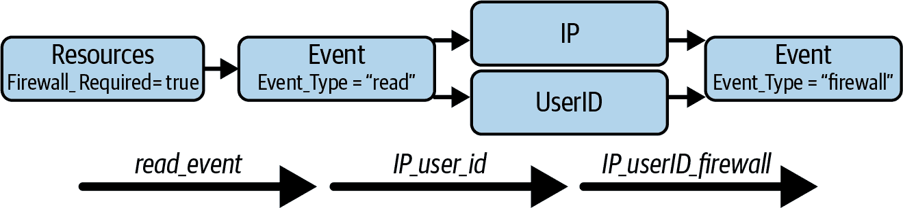

# 第八章：加强网络安全

在本章中，我们将描述图形分析如何加强网络安全系统。我们将展示图形分析如何识别报警的根本原因，检测防火墙的绕过，发现洪水攻击和足迹扫描等异常行为。我们还将展示图形如何找到与可疑 IP 地址的连接，这些地址可能是攻击的来源。完成本章后，您应该能够：

+   在网络安全领域应用图形概念的理解

+   构建图形查询以追踪微服务

+   构建图形查询以检测统计异常

# 网络攻击的成本

我们依赖技术，这些技术不断受到网络攻击的挑战，这些攻击旨在损害、破坏或恶意控制我们的 IT 基础设施或敏感数据。根据 2019 年 Ponemon 研究所的一项调查，66%的中小型企业在过去 12 个月内经历过网络攻击。¹ 这些网络攻击已经成为我们社会运作的日常威胁。例如，2016 年美国总统选举前，俄罗斯黑客协调攻击民主党成员，试图操控选举结果。根据美国国家安全局（NSA）的说法，与希拉里·克林顿竞选活动及其他民主党组织有关的 300 多人的电子邮件账户遭到攻击。² 这些攻击导致信息泄露，旨在损害克林顿的竞选活动。更近期的例子是 2022 年 2 月，一组黑客对全球最大的半导体公司之一 NVIDIA 进行了大规模网络攻击。攻击者泄露了公司的凭证和员工信息。肇事者声称他们可以访问超过 1TB 的公司数据，如果 NVIDIA 不满足他们的赎金要求，他们将会公开这些数据。

网络攻击可能会损害政府和商业组织以及个人，导致政治混乱和财务损失。根据 Ponemon 研究所和 IBM 对数据泄露成本的研究，全球单一数据泄露的平均成本为 386 万美元。美国在这一领域排名首位，单一泄露的平均成本为 864 万美元。最大的挑战之一是尽早发现这些损害。研究人员声称，当在不到 200 天内检测到数据泄露时，组织可以节省 112 万美元。然而，他们也指出，对恶意数据泄露进行检测和遏制的平均时间仍然长达 315 天。³ 数据泄露的平均成本预计在 2023 年将达到 500 万美元。⁴

理解攻击者的操作方式对于构建有效的网络安全系统至关重要。《通用攻击模式枚举和分类》（CAPEC）⁵ 项目提供了一套标准的网络攻击模式类别和描述，分析员、开发人员和 IT 架构师可以利用这些来增强防御能力。CAPEC 将这些攻击模式分为九类。例如，“滥用现有功能”是一种攻击模式，对手利用应用程序的功能来达到原本不被预期的恶意输出或耗尽资源以影响功能。攻击模式“收集和分析信息”侧重于获取、收集和窃取信息。该类别中使用的方法包括主动查询和被动观察。2016 年美国总统选举的案例属于这一类别。攻击模式“注入意外项目”包括专注于控制或干扰应用程序行为的攻击模式。这些攻击模式通过利用目标应用程序的输入来安装和执行恶意代码。

# 问题。

一个关键挑战是监控信息流，以便漏洞可见并快速报告攻击。假设一个微服务触发另一个微服务引发警报，那么系统必须能够支持深度链接分析以追溯根本原因，或者进行模式匹配以检测异常行为。随着存储、处理和修改的数据量不断增长，从中实时高效地管理和提取相关信息变得更加困难。

上述信息显示，网络安全攻击检测需要：

+   必须处理大量数据。

+   尽快识别威胁并触发警报。

+   必须帮助找出原始故障点。

+   是许多企业急需但尚未满足的紧迫且增长迅速的业务需求。

# 解决方案

网络安全旨在确保信息的保密性、完整性和可用性，并保护网络、设备和数据免受未经授权的访问或犯罪性使用。⁶ 图表是模拟数字系统和检测攻击的自然选择，因为互联网本身及其基础设施和设备构成了一个互连网络。攻击模式可以被分析为一系列事件的链条，或者是图中由个别过程组成的路径。一个过程可以是一个对象或不同对象之间的互动，这取决于我们想要模型化的内容。

通常情况下，大量攻击是由相对较少的肇事者完成的。DDoS 攻击即是如此。在图模型中，这反映为一个中心结构。基于图的网络安全系统可以寻找并分析意外的中心点。

在构建基于图的网络攻击防御系统时，我们必须考虑四个方面。首先，我们在组织内收集的数据本身就是一个网络，但我们必须将其过程、资产和操作建模为统一的实时图。其次，我们必须监控图中的关键操作和易受攻击的位置。因此，我们可以使用已知的攻击模式在我们的图中表达这些，并围绕它们构建我们的防御。第三，当实际攻击发生时，图可以帮助我们。它可以帮助识别攻击发生在图中的位置，并追溯攻击的上游和下游影响。最后，我们从组织中收集历史数据，并将其与来自第三方（如 McAfee 或 Norton 的匿名数据集）的数据合并，并将其馈入机器学习模型以预测未来的攻击。

网络安全系统必须能够集成多个数据源并实时处理它们。例如，我们需要集成服务信息，以了解在我们的操作中调用哪些微服务，或者服务器信息，以了解我们的应用程序部署在哪里，并查看我们的虚拟机的状态。另一个包括的常见数据源是用户信息，涉及权限和授权。图可以将这些多种数据类型集成为单一视图，其中服务、数据库和用户与互联的网络安全解决方案相链接。

# 实施网络安全图

使用 TigerGraph Cloud 的一个入门套件，我们将展示如何实施一个网络攻击检测系统。

## 网络安全威胁检测入门套件

使用 TigerGraph Cloud，部署一个新的云实例，并选择“网络安全威胁检测”作为入门套件。安装了这个入门套件后，按照第三章的“加载数据和安装查询入门套件”部分中列出的步骤加载数据。

## 图模式

**网络安全威胁检测入门套件**的模式有九种顶点类型，以**`Event`**作为中心顶点类型。总共有 1,325 个顶点和 2,692 条边。这个入门套件的模式如图 8-1 所示。


###### 图 8-1\. 网络安全威胁检测入门套件的图模式（在[`oreil.ly/gpam0801`](https://oreil.ly/gpam0801)查看此图的更大版本）

六种事件类型包括：认证、防火墙、登录、请求、读取和写入。如果事件是由人或网络设备引起的，则可能与 `**用户 ID**`、`**设备**` 或 `**IP**` 地址相关联。`**事件**` 可能是涉及 `**服务**`、`**服务器**` 或 `**资源**` 的动作。`**服务**` 或 `**服务器**` 可能会报告 `**警报**`，而 `**警报**` 则具有 `**警报类型**`。这些顶点类型在 Table 8-1 中有描述。

Table 8-1\. Cybersecurity Threat Detection 图模型中的顶点类型

| 顶点类型 | 描述 |
| --- | --- |
| `**事件**` | 系统中动作触发的事件 |
| `**IP**` | 参与 **`事件`** 的 IP 地址 |
| `**用户 ID**` | 与 `**事件**` 相关的用户 ID |
| `**服务**` | 执行 **`事件`** 动作的微服务 |
| `**警报**` | 由 **`服务`** 在 **`服务器`** 上触发的警报 |
| `**警报类型**` | **`警报`** 的警报类型 |
| `**服务器**` | 发生 `**事件**` 的服务器 |
| `**资源**` | 在 **`事件`** 中使用的资源 |
| `**设备**` | **`事件`** 中使用的设备 |

一个 `**事件**` 可能与 `**设备**`、`**IP**` 或 `**用户 ID**` 相关联。这些关联由边类型 **`From_Device`**、**`Has_ip`** 和 `user_event` 表示。我们使用两种边方向来表示 `**事件**` 与 `**服务**` 之间的关系。如果我们想知道哪些 `**服务**` 属于一个 `**事件**`，我们使用 **`To_Service`**，或者如果我们想知道属于 `**服务**` 的 `**事件**`，我们使用 **`From_Service`**。类似地，我们可以找到属于 `**事件**` 的 `**服务器**` 元素及其相反关系，分别使用边 **`To_Server`** 和 **`From_Server`**。通过边 **`Output_To_Resource`** 和 **`Read_From_Resource`**，我们可以找出哪些 `**事件**` 是由 `**资源**` 触发的，以及哪些 `**资源**` 参与了 `**事件**`。我们使用 **`Service_Alert`** 和 **`Server_Alert`** 来指示哪些 `**服务**` 和 `**服务器**` 与报告的 `**警报**` 相关联。而要找出每个 `**警报**` 的 `**警报类型**`，我们使用边类型 **`Alert_Has_Type`**。

## 查询与分析

此起始套件中包含的查询展示了使用基于图的查询和分析可以检测到的几种不同的网络攻击模式示例。其中三种对应于 CAPEC 描述的攻击模式类别：功能绕过、足迹探测和指纹识别。

检测防火墙绕过

检测通过防火墙保护的资源但某种方式逃避防火墙的用户。

可疑 IP 检测

给定一个 IP 地址，查找与一定跳数内所有连接到被禁止 IP 地址的连接。

洪水检测

检测基于对服务的异常高请求数的异常情况。返回负责洪水事件的用户。

足迹检测

检测基于短时间内对服务端点的异常高调用次数的异常情况。返回负责足迹事件的用户。

追溯警报源头

追踪导致损坏文件警报的用户元素和 IP 地址。

一些查询会显示从感兴趣的事件或 IP 返回到相关实体的路径。其他查询通过查看表格结果最容易理解。

### 检测绕过防火墙的行为

功能绕过攻击是访问服务的一种方式，同时绕过意图提供系统保护的功能。[⁷]如果某一资源的访问受到防火墙的保护，那么每次读取访问都应该先成功通过防火墙事件，如图 8-2 中所示（从右向左读取）。`firewall_bypass_detection` 查询用于检测某些用户或 IP 地址如何逃避防火墙保护并读取受保护资源。它使用图遍历和集合代数将用户分成四个不同的类别。我们首先选择所有 `**Resource**` 元素，其中 `Firewall_required == TRUE`。从这些资源中，我们首先遍历到所有读取 `**Event**` 顶点。这对应于 8-2 图中显示的第一跳。



###### 图 8-2\. `firewall_bypass_detection` 查询的遍历路径和前两个用户集

然后我们识别四组用户。在这种情况下，我们将考虑 `**UserID**` 和 `**IP**` 地址都作为“用户”。第一组用户是所有与读取防火墙保护资源相关联的用户：

```
    ip_userid = SELECT t // set of all users accessing the events
        FROM read_events:s -((Has_IP|User_Event):e)- :t
        ACCUM t.@read_time += s.Start_Date;
```

第二组是那些同时也与防火墙事件相关联的用户的子集：

```
    ip_userid_firewall = SELECT s  // set of all users accessing with firewall
        FROM ip_userid:s -((Has_IP|User_Event):e)- :event
        WHERE event.Event_Type == "firewall"
        ACCUM s.@firewall_time += event.Start_Date;
```

第三组是那些仅进行读取而没有参与防火墙事件的用户。我们可以通过从第一组中减去第二组来获得此集合：

```
    ip_userid_no_firewall = ip_userid MINUS ip_userid_firewall;
```

我们的第四组也是最后一组用户是那些既有读取事件又有防火墙事件（第二组），但读取事件发生在防火墙事件之前，这意味着防火墙被绕过：

```
    ip_userid_bypass_firewall = SELECT s 
        FROM ip_userid_firewall:s
        WHERE s.@read_time.size() > s.@firewall_time.size();
```

表视图是查看这些结果的最佳选项。您将在 `IP_userID_no_firewall` 类别中找到九个 ID，以及在 `IP_userID_bypass_firewall` 组中找到一个 IP。在实际用例中，用户可能会随着时间的推移拥有许多读取和防火墙事件，因此应使用时间戳、会话 ID 或其他机制来确定哪些事件属于同一会话。

### 可疑 IP 检测

虽然与不受欢迎的实体紧密连接并不意味着有错，但这是更深入调查的正当理由。`suspicious_ip_detection`查询检测与给定输入 IP 地址在一定跳数内连接的禁止 IP 地址。该查询使用`WHILE`循环和 GSQL 的`ACCUM`子句进行广度优先搜索，以有效地发现最短路径。它返回给定跳数内的禁止 IP 地址数量以及到这些禁止 IP 地址的最短路径数量。

查询有三个参数：`input_ip`是要调查的 IP 地址，`depth`是我们希望从`input_ip`出发前进的跳数（默认为 3），`display_paths`是一个布尔指示器，指定是否可视化到禁止 IP 地址的路径：

```
    CREATE QUERY suspicious_ip_detection(VERTEX<IP> input_ip, INT depth=3,
        BOOL diplay_paths=FALSE) {
```

实现遵循经典的广度优先非加权最短路径搜索方法。每个顶点都有两个累加器来跟踪从`input_ip`到自身的最短路径信息。我们初始化一个顶点集（称为`start`），其初始值为`input_ip`，并将其累加器`@num_shortest_paths`初始化为 1（因为从`input_ip`到自身有一条路径）。然后，使用一个`WHILE`循环，重复以下步骤。

首先，我们从`start`到所有未访问的邻居顶点。我们知道顶点`t`之前未被访问过，如果`t.@num_shortest_paths == 0`。

```
    start = SELECT t             // (1) Step to unvisited neighbors
        FROM start:s -(:e)- :t 
        WHERE t.@num_shortest_paths == 0
```

其次，我们考虑最短路径。当我们到达以前未访问的邻居顶点`t`时，这必然是沿着最短路径进行的。因此，我们更新`t`到自身的最短路径计数(`t.@num_shortest_paths`)以及它的边集合以显示这些路径(`t.@edge_list`)：

```
    ACCUM                        // (2) record # shortest paths
        t.@num_shortest_paths += s.@num_shortest_paths, 
        t.@edge_list += e,
        t.@edge_list += s.@edge_list
```

第三，我们检查邻居是否被标记为禁止 IP。如果是，我们更新三个全局累加器。首先，我们将该邻居添加到`@@nearby_banned_IPs`中。其次，我们将到`t`的最短路径数(`t.@num_shortest_paths`)添加到`@@num_paths_to_banned_IPs`中。第三，我们将路径本身(`t.@edge_list`)附加到`@@paths_to_banned_IPs`中：

```
    POST-ACCUM CASE WHEN t.banned == TRUE THEN
        // (3) Track the banned IPs. Tally the paths to banned IPs
        @@nearby_banned_IPs += t,
        @@num_paths_to_banned_IPs += t.@num_shortest_paths,
        @@paths_to_banned_IPs += t.@edge_list
```

然后我们更新顶点集`start`为目标集`t`。我们重复以上三个步骤，这次从上一轮新访问的顶点开始遍历。我们进行深度轮次以确保我们离输入 IP 地址移动那么多步，或者直到我们用完未访问的顶点(`WHILE start.size() > 0 LIMIT depth DO`)。

使用建议的输入 `input_ip` = 188.117.3.237 和 `depth` = 4，我们发现了 18 个可疑 IP 地址，如图 8-3 所示。增加深度将找到更多，但是距离增加可能会降低违规行为的可能性。


###### 图 8-3\. 与给定禁止 IP 地址相连接的 IP 地址，在深度为 4 内（请参见此图的更大版本[`oreil.ly/gpam0803`](https://oreil.ly/gpam0803)）

### 洪水检测

接下来的两个查询专注于检测可能的网络攻击异常。*Flooding*攻击会向目标发送大量服务请求，试图使其超负荷。⁸ `flooding_detection`查询检测一个服务是否接收到比通常多得多的请求。这个查询是 GSQL 支持算法编程和累加器的良好示例，使得可以轻松计算统计数据，如平均值和标准偏差，并根据这些值执行过滤。

查询包括一个参数`n_sigma`，其中`sigma`表示标准偏差。默认值为 3.0，这意味着如果 IP 的登录事件数量超过平均值三个标准偏差，那么该 IP 被视为异常值。此参数使用户能够轻松调整警报阈值。

此查询的整体流程包括四个单一的跳跃，最终我们将计算每个 IP 的服务请求次数，并与所有其他 IP 的平均值进行比较，以确定它是否是异常值。图 8-4 展示了一个样本图表，以及该查询如何聚合事件。


###### 图 8-4\. 在`flooding_detection`查询中的累积

在第一个跳跃中，我们通过**`IP`**到**`Event`**的**`Has_IP`**边遍历选择每个 IP 地址的所有登录事件。子句`WHERE event.Event_Type == "login"`将选择过滤为仅包括登录事件。然后我们计算每个 IP 地址的登录次数：`@count_map += (i->1)`。该语句中的`i->1`表示我们针对每个 IP 地址`i`添加 1。在接下来的几个跳跃中，我们将从这一步开始传输或重新分组计数，以计算按用户、请求事件和服务计算的小计：

```
    login_events = SELECT event 
        FROM IPs:i -(Has_IP)- :event
        WHERE event.Event_Type == "login"
        ACCUM event.@count_map += (i->1);
```

在第二个跳跃中，我们将登录事件数量与用户关联起来。这是通过在**`User_Events`**边上从`login_events`到**`User`**的遍历完成的。我们使用`user.@count_map += le.@count_map`来按用户对先前计算的事件进行分组。在图 8-4 中，我们看到 User1 从 IP1 登录了两次：

```
    users = SELECT user 
        FROM login_events:le -(User_Event)- :user
        ACCUM user.@count_map += le.@count_map;
```

在第三个跳跃中，我们链接到我们在第二个跳跃中找到的用户的请求事件。子句`WHERE event.Event_Type == "request"`检查我们是否仅包括请求事件。然后我们将我们之前的计数复制到请求事件中：

```
    events = SELECT event 
        FROM users:u -(User_Event:e)- :event
        WHERE event.Event_Type == "request"
        ACCUM event.@count_map += u.@count_map;
```

在第四和最后一跳中，我们将上一跳的请求事件链接到**`Service`**元素。我们还累积我们正在进行的计数，并按**`Service`**进行分组。在图 8-4 中，我们看到 Service1 共有四个来自 IP1 的登录事件，两个通过 User1 和两个通过 User3。现在我们可以计算最终的统计数据，以确定 IP 是否触发了异常数量的请求。我们通过三个步骤来完成此操作。在第一步中，我们使用`AvgAccum`累加器轻松计算所有 IP 之间的平均计数：

```
                FOREACH (ip,cnt) in s.@count_map DO
                    s.@mean += cnt   // @mean is an AvgAccum
                END,
```

在第二步中，我们计算标准差（使用第一次传递中的`@mean`）：

```
                FOREACH (ip,cnt) in s.@count_map DO
                    s.@stdev += pow(cnt - s.@mean, 2)
                END,
                s.@stdev = sqrt(s.@stdev/(s.@count_map.size()-1)),
```

最后，我们通过将每个登录次数与平均值和标准差进行比较来检查异常值。如果计数大于平均值加上`n_sigma`（我们在参数中设置的阈值）乘以标准差，那么该 IP 的登录行为就是异常的：

```
                CASE WHEN s.@stdev != 0 THEN
                    // calculate the outlier
                    FOREACH (ip,cnt) in s.@count_map DO
                        CASE WHEN cnt-s.@mean > n_sigma*s.@stdev THEN
                            @@outlier_list += Result_Tuple(
                                                  ip,s,cnt,s.@mean,s.@stdev)
                        END
                    END
                END
```

为了简单起见，我们没有包含每次登录和请求事件的时间方面。在实际情况中，登录事件必须先于其关联的请求事件发生，并且请求事件必须在足够短的时间窗口内发生，以被视为攻击。在这个例子中，我们保持简单，仅演示了如何通过整个网络获取事件触发器来计算各个统计数据。

运行带有`n_sigma` = 3 的查询，在表视图中两次列出 IP 216.61.220.149，一次用于服务 11 的高使用率，一次用于服务 12。

### 足迹检测

另一种类型的网络攻击是足迹侦测。`Footprinting`会在短时间内调用服务的许多端点，试图了解其配置、行为和漏洞。⁹ `footprinting_detection`查询展示了我们如何检测执行这些操作的用户。其实现与洪泛检测查询非常相似，因为它计算平均值、标准差和异常值来检测`**Users**`的异常行为。

此查询有三个参数：`n_sigma`设置确定异常值的阈值，而`start_date`和`end_date`确定我们希望检测足迹的时间窗口。

首先，我们选择所有类型为**`Events`**的“请求”，并且发生在`start_date`和`end_date`之间：

```
    events = SELECT s 
        FROM events:s 
        WHERE s.Start_Date > start_date AND s.Start_Date < end_date
          AND s.Event_Type == "request";
```

然后，我们记录每个用户的所有端点请求。我们通过从**`Events`**到**`User`**使用**`User_Event`**边类型进行这样做。我们将用户调用的每个端点都添加到`event.@api_map`中。因为这些映射附加到每个事件，每个事件将具有单个映射条目：

```
    events = SELECT event 
        FROM events:event -(User_Event)- :user
        ACCUM event.@api_map += (user -> event.Endpoint); // make map
```

然后，我们从**`Events`**到**`Service`**进行遍历，将端点请求按服务分组：

```
    services = SELECT s 
        FROM events:ev -(To_Service)- :s
        ACCUM s.@api_map += ev.@api_map
```

然后，我们计算异常值统计，与洪水检测查询中的操作类似。在洪水检测中，`MapAccum`的值类型为`SumAccum<INT>`，它已经是一个总和。在足迹检测中，`MapAccum`的值类型为`SetAccum<STRING>`：一个端点名称的集合。要计算平均值，我们需要知道每个集合中有多少个端点，因此使用`cnt.size()`：

```
                FOREACH (user,cnt) IN s.@api_map DO
                    s.@mean += cnt.size()
                END,
```

标准差和异常值计算与洪水检测查询中的计算完全类似。使用默认输入值运行查询显示，用户 1 对服务 13 和 14 的使用异常高。

### 追踪警报来源

在我们的最后一个示例中，已经触发了一个警报，我们沿着图中的路径跟踪用户及其可能导致警报的 IP 地址。我们将要跟踪的路径在图 8-5 中有所说明。我们从最近的特定`**Alert_Type**`的`**Alert**`开始，然后向后追溯到其原因。从`**Alert**`开始，我们跟随到引发`**Alert**`的`**Service**`。如果`**Alert_Type**`是文件数据损坏，那么在文件读取`**Event**`期间会注意到`**Alert**`，因此我们追溯到那时。写入`**Event**`会导致损坏，因此我们追溯到那时。最后，我们追溯到执行该写入的`**UserID**`和`**IP**`。这个查询的整体流程是直线上的八次跳跃。在传统关系数据库中，这将是八次连接，速度非常慢。相比之下，通过直接遍历图模型，我们可以实时获取这些洞察。


###### 图 8-5\. 追踪警报来源的路径遍历

`alert_source_tracing`查询有三个输入参数：`alert_type`是要追踪的警报类型；`num_days`是从警报被触发时开始往回查看的天数；`top_ip`是查询将返回的 IP 地址的数量。

```
    CREATE QUERY alert_source_tracking(STRING alert_type="Data Corrupted",
        INT num_days=8, INT top_ip=20) {
```

两个`MaxAccum`累加器`@latest_alert_time`和`@latest_read_time`分别计算并记录了最近一次警报和导致警报的最近读取事件的时间。`SumAccum<INT> @count`统计每个用户或 IP 的写入事件数量，以便了解哪些 IP 地址最为频繁。`ListAccum<EDGE> @path_list`收集了从输入的`alert_type`到触发这些警报的**IP**顶点的路径所需的所有边。

我们将八次跳跃分组为四个两跳阶段。在第一阶段，我们获取给定`alert_type`的`**Alerts**`，然后追溯到受影响的`**Service**`。每个**`Alert`**的日期都添加到其`**Service**`的`@latest_alert_time`累加器中。因为它是`MaxAccum`，它自动保留最近的警报日期。到目前为止，我们遍历的两个跳的边缘被添加到我们遍历路径的端点的`@path_list`累加器中：

```
    service = SELECT serv 
        FROM alert_types:s -(Alert_Has_Type:e1)- :alert
                           -(Service_Alert:e2)- :serv
        ACCUM
            serv.@latest_alert_time += alert.Alert_Date,
            serv.@path_list += e1, serv.@path_list += e2;
```

在第二阶段，我们从这些服务回溯到被读取并触发警报的文件。我们再进行两次跳跃，从这些`**Services**`通过读取`**Event**`回到文件`**Resource**`。我们只考虑在警报前一天内合理触发警报的事件：

```
    resource = SELECT res 
        FROM service:s -(From_Service:e1)- :event
                       -(Read_From_Resource:e2)- :res
        WHERE datetime_diff(s.@latest_alert_time,event.Start_Date) 
          BETWEEN 0 AND 3600*24
          AND event.Event_Type == "read"
```

在选择适当的文件读取事件之后，我们执行两项任务。首先，记录每个文件最近读取的时间：

```
          res.@latest_read_time += event.Start_Date,
```

其次，我们将第一跳的部分路径传输到`**Resource**`顶点，并使用连接**`Service`**到**`Resource`**的边扩展路径：

```
          res.@path_list += s.@path_list,
        res.@path_list += e1, res.@path_list += e2;
```

在第三阶段，我们从这些文件追溯到写入这些文件的用户。这种双跳遍历在结构上与第二阶段的遍历类似。该阶段从`**Resource**`顶点到`**User**`顶点开始，使用**`Output_To_Resource`**和**`User_Event`**边。它接受那些在最新读取前`num_days`天内发生的写入事件。此外，我们增加`user.@count`来存储用户写入文件的次数，然后再次传输和扩展路径：

```
    users = SELECT user 
        FROM resource:s -(Output_To_Resource:e1)- :event
                        -(User_Event:e2)- :user
        WHERE datetime_diff(s.@latest_read_time, event.Start_Date) 
          BETWEEN 0 AND 3600*24*num_days
          AND event.Event_Type == "write"
        ACCUM user.@count += 1, // Tally writes per user
          user.@path_list += s.@path_list,
          user.@path_list += e1, user.@path_list += e2;
```

在查询的最后阶段，我们从用户顶点追溯回那些引发警报的 IP 地址。我们从`**User**`顶点开始遍历，并使用**`User_Event`**和**`Has_IP`**边进行双跳。我们使用累加器传输和扩展路径一次。路径现在的长度为 8，从`**Alert_Type**`到`**IP**`。我们还计算用户每个 IP 地址写入文件的次数。最后，我们按写入计数对 IP 地址列表进行排序，并仅获取`top_ip`地址返回：

```
    login_IP = SELECT ip 
        FROM users:s -(User_Event:e1)- :event
                     -(Has_IP:e2)- :ip
        WHERE event.Event_Type == "login"
        ACCUM ip.@count += s.@count, // Tally user-writes per IP
          ip.@path_list += s.@path_list,
          ip.@path_list += e1, ip.@path_list += e2
        ORDER BY ip.@count DESC
        LIMIT top_ip;
```

使用默认输入值（`alert_type` = `"Data Corrupted"`，`num_days` = 7，`top_ip` = 3），我们发现文件损坏的前三个 IP 来源分别为 31、18 和 11 个事件，表示用户在时间窗口内写入最终损坏的文件。路径的可视化显示解释了我们如何得出这些总数。

# 章节总结

在本章中，我们展示了图如何加强网络安全。网络攻击遵循模式，这些模式可以表示为图查询。我们展示了针对三种攻击类型的检测查询，一种风险评估查询，该查询测量与禁止 IP 的接近程度，以及源追踪查询，查看是谁以及什么导致了警报。

¹ Ponemon Institute，《2019 年中小型企业全球网络安全状况报告》，2019 年，[*https://www.cisco.com/c/dam/en/us/products/collateral/security/ponemon-report-smb.pdf*](https://www.cisco.com/c/dam/en/us/products/collateral/security/ponemon-report-smb.pdf)。

² Mark Mazzetti 和 Katie Benner，《穆勒调查中起诉的 12 名俄罗斯特工》，*纽约时报*，2018 年 7 月 13 日，[*https://www.nytimes.com/2018/07/13/us/politics/mueller-indictment-russian-intelligence-hacking.html*](https://www.nytimes.com/2018/07/13/us/politics/mueller-indictment-russian-intelligence-hacking.html)。

³ IBM Security，《2020 年数据泄露成本报告》，2020 年，[*https://www.ibm.com/downloads/cas/QMXVZX6R*](https://www.ibm.com/downloads/cas/QMXVZX6R)。

⁴ Acronis，《Acronis 网络保护运营中心报告：2022 年下半年的网络威胁——数据遭受攻击》，2022 年，[*https://dl.acronis.com/u/rc/White-Paper-Acronis-Cyber-Protect-Cloud-Cyberthreats-Report-Year-End-2022-EN-US-221212.pdf*](https://dl.acronis.com/u/rc/White-Paper-Acronis-Cyber-Protect-Cloud-Cyberthreats-Report-Year-End-2022-EN-US-221212.pdf)。

⁵ “CAPEC 列表版本 3.9”，CAPEC，最后更新于 2021 年 10 月 21 日，[*https://capec.mitre.org/data/index.html*](https://capec.mitre.org/data/index.html)。

⁶ “什么是网络安全？”网络安全与基础设施安全局，2021 年 2 月 1 日，[*https://www.cisa.gov/news-events/news/what-cybersecurity*](https://www.cisa.gov/news-events/news/what-cybersecurity)。

⁷ “CAPEC-554：功能绕过”，CAPEC，最后更新于 2021 年 10 月 21 日，[*https://capec.mitre.org/data/definitions/554.html*](https://capec.mitre.org/data/definitions/554.html)。

⁸ “CAPEC-125：洪水攻击”，CAPEC，最后更新于 2021 年 10 月 21 日，[*https://capec.mitre.org/data/definitions/125.html*](https://capec.mitre.org/data/definitions/125.html)。

⁹ “CAPEC-169：足迹”，CAPEC，最后更新于 2021 年 10 月 21 日，[*https://capec.mitre.org/data/definitions/169.html*](https://capec.mitre.org/data/definitions/169.html)。
