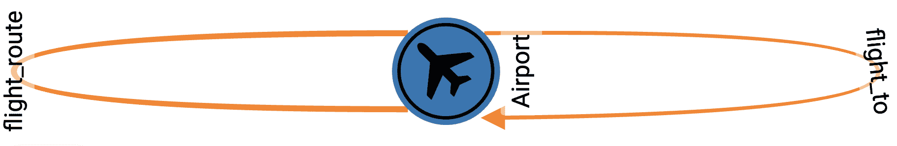
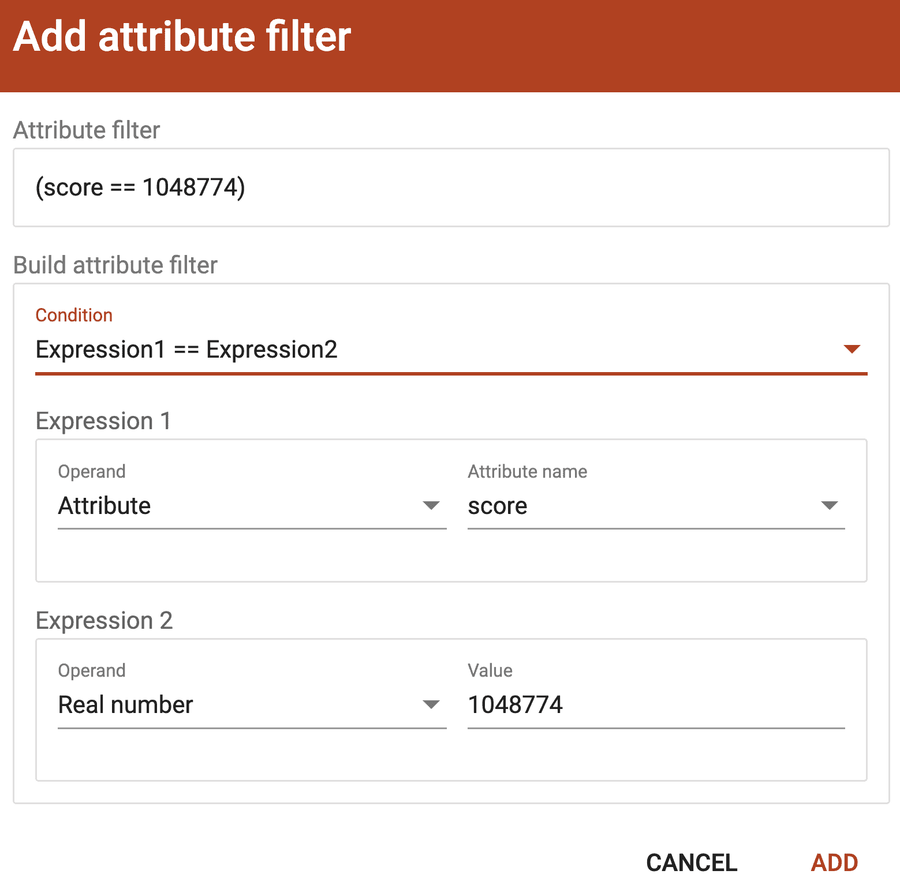
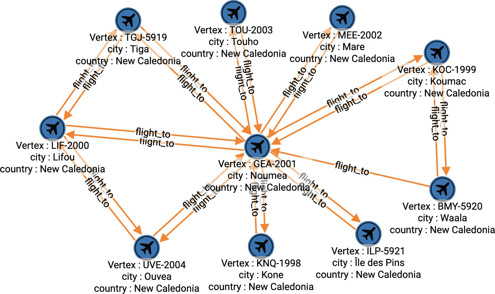

# 第九章：分析航空公司航线

图算法是进行图分析的必要工具。虽然人们可以从教科书中学习算法本身，但从业者需要获得使用图算法库并将算法应用于真实用例的实践经验。本章将使用图算法来分析全球航线网络。我们将应用三类算法：最短路径、中心性和社区检测。

完成本章后，您应能够：

+   安装并运行 TigerGraph GDS 算法

+   设置算法的必需和可选参数

+   修改 GSQL 算法或其他查询，以制作定制版本

+   使用“探索图”功能显示选定的顶点和边，包括创建属性过滤器

+   理解最短路径、中心性和社区算法在路由网络中的应用

# 目标：分析航空公司航线

阿姆斯特丹的史基浦机场位于相对较小的荷兰国家。尽管荷兰只有 1700 万居民，但它最大的机场是 2021 年转运了超过 2500 万乘客和 160 万吨货物的顶级枢纽。（1）要达到这样的壮举，像史基浦这样的机场面临着为数千次航班安排上百架飞机的挑战。史基浦机场在 2019 年新冠疫情爆发前几乎有 5 亿次航空交通运输。机场是一个时间敏感的业务，它在复杂的后勤约束条件下运作，比如为每条航线提供飞行连通性。机场的目标是通过以最节约成本的方式安排这些航线，最大化总利润。

一旦航空公司建立了他们的航班时间表，乘客就需要选择对他们最有意义的航线。对于一些航线，乘客可以选择多种选项。乘客可能希望选择最少连接的航线，或者他们可能希望选择最短的航线。今天，乘客可以使用在线搜索工具，这些工具可以整合每次航班的利弊，比如最短航线。就像 PageRank 算法是 Google 网络搜索实用程序的起点一样，最短路径算法是航空公司航班搜索工具的核心。一些乘客寻求对航班网络的进一步分析。那些经常飞往各种目的地的人，比如销售人员和顾问，可能想知道哪些机场是最佳枢纽。

一些行业可能会从寻找连接的机场社区中受益，尤其是那些与整体机场网络连接较少的地方。例如，野生动物摄影旅行社可能有兴趣销售偏远地区的套餐旅游。如果该地区与大型枢纽的连接较少，那么它可能更为偏远，因此更受摄影师欢迎，他们希望走"少有人走的路"。理想情况下，该偏远地区将拥有自己的本地航线社区，以便于前往不同的目的地。另一个例子可能是一家航空公司顾问寻找未开发的航线。图表明相对于世界其他地方而言，哪些社区相对孤立，可能是提出开通新航线建议的起点。

# 解决方案：航班路由网络上的图算法

航班流量形成了一个由航班连接的机场网络。因此，图分析是可视化和分析路线及其对机场业务影响的一种自然方式。我们可以使用有向图来结合每个航班的出发地和目的地，并使用边属性来包括距离、时间或碳排放等成本。仅通过构建图形，我们可以轻松地进行基本观察，如一个机场的进出航班数量。然而，通过使用图算法，我们可以进行更复杂的分析，如识别最有影响力的机场和最经济的路径。

我们可以使用边属性定义我们用例的最有效路径。例如，如果我们寻找最短的路径，我们可以将航程距离作为属性包含进去。在其他情况下，如果我们寻找最便宜的航班，我们可以包含每个机场之间的航班价格，或者如果我们有兴趣找到最可持续的飞行选项，则可以在每个边属性中包含二氧化碳排放。

# 实施机场和航班路由分析器

现在我们展示一些这些图算法的实际操作，使用另一个 TigerGraph Cloud 入门套件。

## 图算法入门套件

使用 TigerGraph Cloud，部署一个新的云数据库实例，并选择“图算法 - 中心性算法”作为用例。一旦安装了这个入门套件，按照第三章中“加载数据和安装查询的入门套件”一节中列出的步骤加载数据。

## 图模式和数据集

此数据集代表约 2014 年从 [OpenFlights.org](http://openflights.org) 获取的实际机场和航班路线。只有一种顶点类型，`**Airport**`，带有 ID、名称、城市、国家、IATA 代码、³ 纬度和经度等属性。还包括一个称为分数的附加属性，作为存储算法结果的通用占位符。例如，如果我们在图上运行 PageRank，那么会为每个顶点生成一个 PageRank 分数。我们可以将这些值存储在这个属性中。共有 7,935 个机场的数据。拥有单一顶点类型使得这个图适合使用标准化的图算法进行直接分析，其中大多数算法假设图具有单一顶点类型。

两种边类型，`**flight_route**` 和 `**flight_to**`，来自同一来源文件 *routes.dat*，这是一个计划的商业服务航班列表，从一个机场到另一个机场。该表中每条航线表示一个航空公司提供的两个城市之间的直达服务，不考虑频率。`**flight_to**` 边是有向的。`**flight_route**` 边是无向的，意味着这些城市之间有直达服务，但忽略方向。共有 19,268 条 `**flight_route**` 边和 37,606 条 `**flight_to**` 边，几乎是 `**flight_route**` 边的两倍，表明直达服务通常是双向的。图 9-1 中的模式的简单性提醒我们模式复杂性（这里是一个顶点类型和两种边类型）与数据复杂性（大约 8,000 个顶点和 57,000 条边）之间的差异是一个好的例子。



###### 图 9-1\. 航班路线数据集的模式（请在 [`oreil.ly/gpam0901`](https://oreil.ly/gpam0901) 查看此图的较大版本）

## 安装 GDS 库中的算法

图算法的美妙之处之一是它们具有标准定义，并且可以在满足其条件的任何图上运行。例如，对于非加权边的最短路径算法应该在*任何*图上工作。截至 2023 年 5 月，TigerGraph GDS（图数据科学）库包含超过 55 种算法，可在 GitHub 上获取。⁴ 为了让用户在便利性和性能之间做选择，它们以两种格式提供：无模式和模板。

无模式算法被编写为开源的 GSQL 查询，其中顶点类型、边类型和相关的顶点或边的属性是运行时参数。它们只需安装一次，然后就可以用于任何图。模板算法以 proto-GSQL 编写。用户不需要执行显式安装操作。模板算法使用 `CALL` 而不是 `INSTALL` 和 `RUN` 运行。如果 `CALL` 语句指定了之前未使用过的模式详细信息（顶点类型、边类型和属性），则数据库会安装带有这些模式详细信息硬编码的优化版本的模板查询。然后 `CALL` 运行这个特定于模式的算法。如果 `CALL` 语句使用了之前已使用过的模式详细信息，则数据库跳过安装并直接运行已安装的算法。表 9-1 对比了这两种类型。

表 9-1\. 比较无模式和模板算法

|   | 无模式算法 | 模板算法 |
| --- | --- | --- |
| **   | **安装** | 一次 | 每个组合（顶点类型、边类型、图属性）在 `CALL` 中使用时需要一次 |
| **运行时性能** | 较慢，可能使用更多内存 | 优化：更快速，内存占用更少 |
| **命令** | `INSTALL`、`RUN` | `CALL` |
| **用户定制** | 简单，就像 GSQL 查询一样 | 间接，由于模板的性质 |

我们将使用无模式算法。按照以下步骤安装我们将用于分析飞行路线网络的无模式算法：

1.  在 GraphStudio 的写查询页面上，查找并点击 GSQL 查询窗格底部的添加新查询按钮（一个带有 + 符号的黑色圆圈）。

1.  一个面板将弹出。

1.  点击从库中选择。

将出现一个包含算法类别列表的新面板。点击 Centrality 右侧的箭头。选择 Betweenness Centrality 和 Closeness Centrality 旁边的框。还选择 Community → Connected Components 和 Path → Shortest Path。然后点击 INSTALL。安装过程需要几分钟。

## 查询和分析

这个入门套件涵盖了三类图算法，它们都提供关于航线的有用答案和分析。此外，还有一些实用查询，可以帮助准备数据以检查各个记录。

实用查询

计算飞行距离

+   原始数据集没有告诉我们旅行距离。此查询使用纬度和经度计算两个机场之间直接航班的长度。⁵

搜索顶点

+   数据集中并非每个机场都有 IATA 代码。为了识别一个机场，我们可能需要根据城市或机场名称进行搜索。此查询提供了一个通用的顶点搜索功能。

路径算法

许多旅行者希望找到连接最少、行驶距离最短或成本最低的路线。最短路径算法将找到从一个顶点到另一个顶点的路线，其中段数最少。加权最短路径算法处理每个边具有数值权重的数据，该权重可以代表实际因素，如时间、距离或金钱。它找到从一个顶点到另一个顶点的路径，其总权重最小。

中心性算法

该套件使用接近度中心性和介数中心性以两种不同的方式对机场的路由重要性进行排名。

社区检测算法

在路由网络中，有更多的路由选项可供在一个社区内旅行，而在社区之间旅行则较少。我们运行强连通分量算法，以查看它对全球航空路线网络的揭示。

### 计算路线长度

使用此起始套件的第一步是运行`calculate_route_length`查询。该查询根据机场的纬度和经度计算每条路线的长度，使用 haversine 公式考虑地球的曲率。每条路线的弧长存储在每个顶点的名为`miles`的属性中。

运行查询时，您需要指定边类型。请分别使用边类型`**flight_to**`和`**flight_route**`运行查询两次。若您在 GSQL 命令行 shell 中运行此查询，命令和输出将如下所示：

```
RUN QUERY calculate_route_length("flight_to", True)
[
  {
    "@@dontChangeList": [],
    "@@numChanged": 37606
  }
]

RUN QUERY calculate_route_length("flight_route", True)
[
  {
    "@@dontChangeList": [],
    "@@numChanged": 38535
  }
]
```

### 测量和分析中心性

哪些机场有最多的中转航班？哪些机场对于希望方便地旅行到任何地方的个人或公司来说是最佳基地？如果这是您想了解的内容，请使用中心性算法。中心性是根据顶点在网络中的相对位置来衡量其重要性的指标。有几种方式来定义中心性；截至 2022 年 10 月，TigerGraph GDS 算法库共有 12 种。我们将尝试两种，即接近度和介数，比较它们的定义和结果。

顶点*v*的接近度中心性分数是从*v*到图中其他顶点的最短路径距离的倒数。例如，在一个四顶点图中，如果*v*到另外三个顶点的最短路径距离分别为 1、1 和 2，则接近度(*v*) = 1/(1+1+2) = 0.25。在航空路线网络中，机场的高接近度中心性分数意味着它具有大量直达和一站式路线到其他机场。小型地区机场通常因直接可达目的地数量较少而具有较低的接近度中心性。

在查询选择窗格中，单击 `tg_closeness_cent` 算法查询。表 9-2 列出了 TigerGraph GDS 算法的全部参数集。这些参数中的许多是 TigerGraph GDS 算法的标准功能，因此我们将花一些时间在这里进行回顾。

表 9-2\. `tg_closeness_cent` 算法的参数

| 参数 | 描述 | 默认值 |
| --- | --- | --- |
| `SET<STRING> v_type` | 要使用的顶点类型 | （空字符串集合） |
| `SET<STRING> e_type` | 要使用的边类型 | （空字符串集合） |
| `SET<STRING> rev_e_type` | 要使用的反向边类型 | （空字符串集合） |
| `INT max_hops` | 如果 >=0，则只查看距离每个顶点这么远的内容 | 10 |
| `INT top_k` | 仅输出这么多分数（分数始终按从高到低排序） | 100 |
| `BOOL wf` | 是否对多组件图使用瓦特斯曼-福斯特标准化 | True |
| `BOOL print_results` | 如果为真，则将 JSON 输出到标准输出 | True |
| `STRING result_attr` | 如果不为空，则将中心性值存储为浮点格式到此顶点属性 | （空字符串） |
| `STRING file_path` | 如果不为空，则以 CSV 格式将输出写入此文件 | （空字符串） |
| `BOOL display_edges` | 如果为真，则在 JSON 输出中包含图的边缘，以便可以显示完整的图形 | False |

前三个参数（`v_type`、`e_type`、`rev_e_type`）指定算法应在图的哪些顶点和边上运行。一些算法设计用于有向边，而一些则用于无向边。重要的是查阅文档⁶，了解首选或允许的边类型。图中可能存在反向边，也可能不存在；这是模式设计者的选择。

接下来的三个参数（`max_hops`、`top_k`、`wf`）是专门针对 `closeness_centrality` 的，尽管 `max_hops` 和 `top_k` 在几个其他算法中也出现过。对于接近中心性，距离超过 `max_hops` 限制的顶点将不会被考虑在平均距离计算中。`top_k` 适用于产生可以视为排名的结果的算法。`wf` 参数允许在由不同大小的断开子图组成的图中标准化分数的修改测度。

这四个参数（`print_results`、`result_attr`、`file_path`、`display_edges`）是用户指定结果传递方式的标准参数。默认情况下，将 JSON 文本流式传输到标准输出。

使用 `v_type = Airport`、`e_type = flight_to` 和 `rev_e_type = reverse_flight_to` 运行 `tg_closeness_cent`。其他参数可以保持默认值。

结果显示，前 10 名机场是 FRA、CDG、LHR、DXB、AMS、LAX、JFK、YYZ、IST 和 ORD，对应法兰克福、巴黎戴高乐、伦敦希思罗、多莫杰多沃、阿姆斯特丹、洛杉矶、纽约肯尼迪、多伦多、伊斯坦布尔和芝加哥奥黑尔。这些机场被广泛认可为世界上最繁忙和最重要的枢纽机场，因此结果看起来合乎逻辑。

我们接下来计算介数中心性。一个顶点的介数中心性定义为通过它的最短路径数量除以图的总最短路径数量。高介数的一个例子是巴拿马运河。它是连接大西洋港口和太平洋港口之间海上旅行的一部分，因此它的介数中心性很高，尽管巴拿马本身很少作为旅程的起点或终点。加油站通常也放置在介数中心性高的交叉路口。虽然它们通常不是旅程的起点或终点，但对于加油站而言，沿着许多旅行者的路线是有用的，每个旅行者的起点和终点路线不同。

接下来，使用与`tg_closeness_cent`相同的参数设置运行`tg_betweenness_cent`。由于介数中心性考虑从任何地方到任何地方的路径，所以运行时间较长，而接近中心性只考虑一个中心顶点。

###### 提示

所有算法并非同质。查看您的算法库文档，了解运行算法所需的预期时间和资源。

对于介数中心性，前 10 名机场是多莫杰多沃、北京、芝加哥奥黑尔、伊斯坦布尔、波哥大、丹佛、亚特兰大、马尼拉、布宜诺斯艾利斯和达拉斯-沃斯堡。这些结果相当不同，也许令人惊讶。请记住，介数中心性高分给像巴拿马运河这样的瓶颈或门户。我们可以推测波哥大和布宜诺斯艾利斯对南美地区的区域机场非常重要。马尼拉可能对菲律宾和东南亚发挥类似作用。

此外，标准介数算法认为所有最短路径同等重要，因此从洛杉矶到纽约的路径和从 Sale (Australia)到 QGQ (Attu, Greenland)的路径同样重要。我们没有考虑乘客数量或航班数。如果我们有这些数据，我们将修改算法以计算加权介数分数。由于 TigerGraph GDS 算法是用 GSQL 编写的，因此可以由 GSQL 用户修改。在下一节中，我们将尝试自定义算法。

### 查找最短路径

首先，我们将使用无权边的最短路径算法；这将告诉我们哪些航线中转最少。然后，我们将运行带有正边权重的最短路径算法，这将告诉我们哪些航线最少飞行里程。当然，可能存在多条具有相同路径长度的路径。一些算法找到*一条*最短路径，而一些找到*所有*最短路径。在加权图中，要确保算法找到绝对最短路径，必须遍历图中的每条边。因此，图库中的最短路径算法是一源到所有目标的类型。

我们需要知道源顶点的 ID。不幸的是，选择一个所有人都知道的机场 ID 系统很困难。城市名称是不够的，因为一些城市有多个机场，而许多旅行者知道像 LAX 这样的 IATA 代码，但这个数据库包括没有 IATA 代码的小型机场。OpenFlights.org 的数据表使用他们自己设计的数字 ID。例如，LAX 的 ID 是 3484。为了妥协，我们的图数据库将 IATA 代码与 OpenFlights.org 的 ID 连接起来，因此我们对 LAX 的 ID 是 LAX-3484。

为了帮助用户找到机场的 ID，起始套件包含一个名为 `_search_for_vertex` 的查询。它有三个参数：顶点类型，该顶点类型的属性名称以及您要查找的值。该查询返回所有匹配顶点的 ID 和名称。例如，如果我们想找到克利夫兰主要机场的 ID，我们将运行以下查询：

```
RUN QUERY _search_for_vertex("Airport","city","Cleveland")
```

我们找到了三个匹配的机场。克利夫兰霍普金斯国际机场是主要的一个，所以让我们使用 CLE-3486。在 GraphStudio 的表视图中查看，您将看到类似 Table 9-3 的输出。

表 9-3\. 克利夫兰机场的搜索结果

| v_id | v_type | Result.id | Result.name |
| --- | --- | --- | --- |
| HDI-8793 | 机场 | HDI-8793 | 哈德威克场 |
| CLE-3486 | 机场 | CLE-3486 | 克利夫兰霍普金斯国际机场 |
| BKL-8544 | 机场 | BKL-8544 | 伯克湖滨机场 |

现在用以下参数运行最短路径算法 `tg_shortest_ss_no_wt`：

```
    source = CLE-3486
    v_type = Airport
    e_type = flight_to
```

查看 JSON 或表格输出。这是大量数据（记住我们有将近 8000 个机场），而且许多机场 ID 都不熟悉。Table 9-4 展示了最短路径之一。尽管数据可能对数据库是正确和有用的，但对人类不太友好。

表 9-4\. 从 CLE 到其他机场的最短路径示例

| v_id | v_type | ResultSet.@min_dis | ResultSet.@path_list |
| --- | --- | --- | --- |

| ZQZ-10940 | 机场 | 4 | [ “CLE-3486”,

“YYZ-193”，

“TPE-2276”，

“SJW-6347”，

“ZQZ-10940”

] |

在下一节中，我们将修改算法以提供更可读的输出，并且仅显示距离源顶点一定距离的结果，使用边权重。

### 修改 GSQL 算法以自定义输出

让我们对输出进行两次更改以进行定制。首先，在 GSQL 代码窗口上方的菜单栏中点击“另存为”图标。将复制的算法命名为*tg_shortest_ss_modified*。我们只输出不超过三跳的路径，并将城市名称作为输出的另一个字段添加进去。我们在四个地方进行编辑：

1.  找到行：

    ```
    ListAccum<VERTEX> @path_list;
    ```

    在其下插入另一行：

    ```
    ListAccum<STRING> @city_list;
    ```

    这定义了用于保存城市列表的数据结构。

1.  大约在其下 10 行处，找到行：

    ```
    s.@path_list = s;
    ```

    在其上插入这一行：

    ```
    s.@city_list = s.city,
    ```

    重要的是在上方插入此行，以获得正确的标点符号。也就是说，我们希望得到以下结果：

    ```
    s.@city_list = s.city, // Added
    s.@path_list = s;
    ```

1.  找到另一行更新`@path_list`的行：

    ```
    t.@path_list = s.@path_list + [t],
    ```

    在其下插入另一行：

    ```
    t.@city_list = s.@city_list + [t.city],
    ```

1.  找到接近末尾打印路径的行：

    ```
    PRINT ResultSet[ResultSet.@min_dis, ResultSet.@path_list];
    ```

    修改并扩展它，使其变成：

    ```
    PRINT ResultSet[ResultSet.@min_dis, ResultSet.@path_list, 
      ResultSet.@city_list]
      WHERE ResultSet.@path_list.size() <= 3;
    ```

保存并安装此算法。使用与之前相同的输入参数运行它。现在你应该看到一些可识别的路径，例如表 9-5 中的示例。

表 9-5。最短路径示例，包含城市名称的添加

| v_id | v_type | ResultSet.@city_list | ResultSet.@min_dis | ResultSet.@path_list |
| --- | --- | --- | --- | --- |

| LAR-5746 | 机场 | [ “克利夫兰”，

“丹佛”，

“拉勒米”

] | 2 | [ “CLE-3486”，

“DEN-3751”，

“LAR-5746”

] |

| BQK-5725 | 机场 | [ “克利夫兰”，

“亚特兰大”，

“布伦瑞克”

] | 2 | [ “CLE-3486”，

“ATL-3682”，

“BQK-5725”

] |

现在让我们运行正权重的最短路径算法。这个版本更适合希望最小化行程距离的旅行者。如果我们的权重是 CO[2]排放而不是英里数，那么我们将会最小化碳排放。

虽然起始套件可能已经有一个算法，但让我们去 GitHub 代码库中的算法库查找最新版本。在网络浏览器中，前往[*https://github.com/tigergraph/gsql-graph-algorithms/blob/mas⁠ter/algorithms*](https://github.com/tigergraph/gsql-graph-algorithms/blob/master/algorithms)。从那里，深入几个类别和子类别——*路径 → 最短路径 → 加权 → 正向 → 回溯*——最终找到*tg_shortest_ss_pos_wt_tb.gsql*。

如果你在 GraphStudio 中还没有*tg_shortest_ss_pos_wt_tb*查询，请在 GraphStudio 查询选择窗格中点击“创建查询”（+符号）按钮。命名新查询为*tg_shortest_ss_pos_wt_tb*。从 GitHub 代码库中复制*tg_shortest_ss_pos_wt_tb.gsql*中的文本，并将其用于替换 GraphStudio 中现有查询文本。保存并安装查询。使用以下设置运行算法：

```
    Vertex_id = CLE-3486
    v_type = Airport
    e_type = flight_to
    wt_attr = miles
    wt_type = INT
    output_limit = 10000
```

有人可能认为里程最少与连接最少会有很好的相关性，但在结果中，你会看到一些有 8 甚至 10 个跳数的路径。为了缩小结果范围，让我们对算法进行一次修改：只显示总行程距离小于 3,000 的路径（表示总行程距离短于三千英里）。这将限制结果在北美地区。

查找打印输出的行：

```
    PRINT tmp[tmp.@min_path_heap.top().cost as cost, tmp.@path_list as p];
```

添加 `WHERE` 子句（并移动分号），将它们改为：

```
    PRINT tmp[tmp.@min_path_heap.top().cost as cost, tmp.@path_list as p]
        WHERE tmp.@min_path_heap.top().cost < 3000;
```

这些较短的结果仍然有一些长路径。例如，可以通过五个跳数从克利夫兰到 ZKE（安大略省卡舍丘安小镇，仅可通过机场和季节性冰路到达），经过 YYZ（多伦多）、YTS（蒂米斯）、YMO（穆森尼）、和 YFA（阿尔巴尼堡），全程只有 820 英里。这条五跳路径是一条相当直通的北上路径。由于北部城镇非常小且航空服务有限，它需要多次跳转。

### 查找并分析社区

我们预计全球机场网络将高度互联，但世界上一些地区仅由较小的地区机场提供服务。社区检测算法会指出这些地点吗？

在有向图中，强连通分量（SCC）是指最大的顶点集合，使得组件中的每个顶点都可以到达组件中的任何其他顶点。在航空网络中，如果航空公司在两个机场之间提供双向直达服务，则满足 SCC 要求很容易。在一些需求较少的地区，直达服务不是双向的。这就是我们可能会找到一个断点的地方，将图分隔为单独的 SCC。

使用以下参数设置运行 `tg_scc`：

```
    v_type_set = Airport
    e_type_set = flight_to
    rev_e_type_set = reverse_flight_to
    top_k_dist = 100
    print_limit = 10000
    result_attr = score
```

`top_k_dist` 确定输出多少个社区，而 `output_limit` 确定输出多少个单独的顶点。每个顶点的社区 ID 将存储在名为 `score` 的顶点属性中。

将输出切换为表格结果。有两个表需要显示。在 `@@cluster_dist_heap` 表中（见 表 9-6），我们得知最大的社区包括 3,354 个机场。然后有一个包括 10 个机场的社区，一个包括 8 个机场，三个包括 4 个机场，三个包括 2 个机场，以及 4,545 个单独的机场。

表 9-6. 机场社区大小和计数

| csize | num |
| --- | --- |
| 3,354 | 1 |
| 10 | 1 |
| 8 | 1 |
| 4 | 3 |
| 2 | 3 |
| 1 | 4,545 |

输出还包括所有顶点及其社区 ID 的完整列表。具有相同社区 ID 的所有顶点属于同一社区。扫描八千个顶点的列表不方便，因此让我们对算法进行另一次修改以获得更友好的输出。

使用“另存为”创建算法查询的副本，称为 `tg_scc_modified`。进行以下三个编辑：

1.  在包含 `Accum` 声明的顶部部分，添加以下声明：

    ```
    MapAccum<INT, ListAccum<VERTEX>> @@cluster_member_map;
    ```

    这种数据结构将记录属于每个社区的顶点列表。

1.  接近结尾处，在输出结果部分和几个`clear()`语句之后，找到以下块：

    ```
    v_all = SELECT s
      FROM v_all:s 
      POST-ACCUM
        @@cluster_size_map += (s.@sum_cid -> 1);
    ```

    在`POST-ACCUM`子句中插入一行额外的代码，并在此后添加五行的`FOREACH`块：

    ```
    v_all = SELECT s
      FROM v_all:s 
      POST-ACCUM
        @@cluster_member_map += (s.@sum_cid -> s), //added
        @@cluster_size_map += (s.@sum_cid -> 1);
    FOREACH (cid, member_list) IN @@cluster_member_map DO
      IF member_list.size() == 1 OR member_list.size() > 50 THEN
        @@cluster_member_map.remove(cid);
      END;
    END;
    ```

    `POST-ACCUM`块中的代码构建成员列表，并且`FOREACH`块删除我们感兴趣的列表中过小或过大的列表。

1.  找到以下行：

    ```
    PRINT @@cluster_dist_heap;
    ```

    在此之后添加以下行：

    ```
    PRINT @@cluster_member_map; // added
    ```

保存并安装`tg_scc_modified`算法查询。使用以下设置运行。这次，我们将排除个别顶点的列表：

```
    v_type_set = Airport
    e_type_set = flight_to
    rev_e_type_set = reverse_flight_to
    top_k_dist = 100
    print_limit = 10000
print_results = false
result_attr = score
```

查看`@@cluster_member_map`的表视图结果。结果显示一个包含四名成员的社区 1048630：[“AKB-7195”, “DUT-3860”, “KQA-6134”, “IKO-7196”]，以及一个包含八名成员的社区 3145861：[“CXH-5500”, “LKE-6457”, “WSX-8173”, “RCE-8170”, “FBS-8174”, “LPS-6136”, “YWH-4106”, “DHB-9540”]。你看到的社区 ID 值可能有所不同，但成员组合应保持一致。

让我们来可视化一个包含 10 名成员及其航班连接的社区。注意社区 ID：1048774。前往探索图表页面。

你应该在搜索顶点（放大镜图标）工作界面上。按照以下步骤进行：

1.  在搜索配置窗格中，紧挨着`**机场**`，点击筛选器图标以打开“添加属性筛选器”弹出窗口。

1.  在条件下拉菜单中，选择 Expression1 == Expression2。

1.  对于 Expression1，设置 Operand = 属性，属性名称 = score。

1.  对于 Expression2，设置 Operand = 实数，值 = 1048774。现在你的窗口应该看起来像 图 9-2。

1.  点击添加。

1.  回到搜索配置窗格，确保选择顶点按钮旁边的顶点数至少为 10。

1.  点击选择顶点按钮。



###### 图 9-2。添加筛选器以选择属于社区 1048774 的顶点

在探索模式垂直菜单中，点击第二个图标，“从顶点扩展”。在边类型列表中，取消选中`**航班路线**`，以便只包括`**航班至**`边。确保每个顶点的边数至少为 10。点击扩展按钮。

现在你应该看到顶点之间有边。为了整理显示，点击图表显示窗格右下角的布局模式按钮。选择 force。你现在应该看到一个星形图案，如 图 9-3。我们希望了解更多关于这些顶点的信息，因此点击顶部菜单中的设置（齿轮形状）按钮。选择`**机场**`顶点类型后，勾选城市和国家的框，并点击底部的应用按钮。这会在图表视图中添加城市和国家的标签。

我们可以看到，这个航班网络局限于南太平洋的新喀里多尼亚群岛。其枢纽是首都努美阿。此外，当我们执行“从顶点扩展”的步骤时，如果有任何飞往新喀里多尼亚以外机场的航班，它们会显示出来。显然，我们的数据库中没有这样的航班。这可能不符合现实。OpenFlights.org 数据集可能缺少一些航班，但它仍然证明是一个用来揭示事实和见解的有趣工具。



###### 图 9-3\. 覆盖新喀里多尼亚的孤立航线社区（请在[`oreil.ly/gpam0903`](https://oreil.ly/gpam0903)上查看该图的更大版本）

# 章节总结

在本章中，我们探讨了如何使用图算法分析航空网络的方法。我们使用了 GDS 库中包含的内置 GSQL 算法来进行路径查找、中心性计算和社区检测操作。此外，我们修改了现有的查询算法来过滤数据，并为我们提供了更易读和有用的结果。最后，我们进一步探索了 GraphStudio 中的探索图窗口的功能，仅需几秒钟就创建了一个视觉上吸引人的图表，并具有易于阅读的标签。

¹ “我们最重要的交通和运输数据”，斯希普霍尔，访问时间 2023 年 5 月 24 日，[*https://www.schiphol.nl/en/schiphol-group/page/traffic-review*](https://www.schiphol.nl/en/schiphol-group/page/traffic-review)。

² “航空公司、机场和航线数据”，[OpenFlights.org](http://openflights.org)，访问时间 2023 年 5 月 24 日，[*https://openflights.org/data.html*](https://openflights.org/data.html)。

³ 国际航空运输协会为每个主要机场分配一个三个字母的代码，如 AMS 代表阿姆斯特丹斯希普霍尔机场，CDG 代表巴黎戴高乐机场。顶点属性`ID`是仅在此数据集中使用的内部编号。

⁴ “tigergraph / gsql-graph-algorithms”，GitHub，访问时间 2023 年 5 月 24 日，[*https://github.com/tigergraph/gsql-graph-algorithms*](https://github.com/tigergraph/gsql-graph-algorithms)。

⁵ 在现实生活中，航班通常会选择稍微绕道以利用风流或避开受限制的空域。

⁶ “TigerGraph 图数据科学库”，TigerGraph，访问时间 2023 年 5 月 24 日，[*https://docs.tigergraph.com/graph-ml/current/intro*](https://docs.tigergraph.com/graph-ml/current/intro)。
