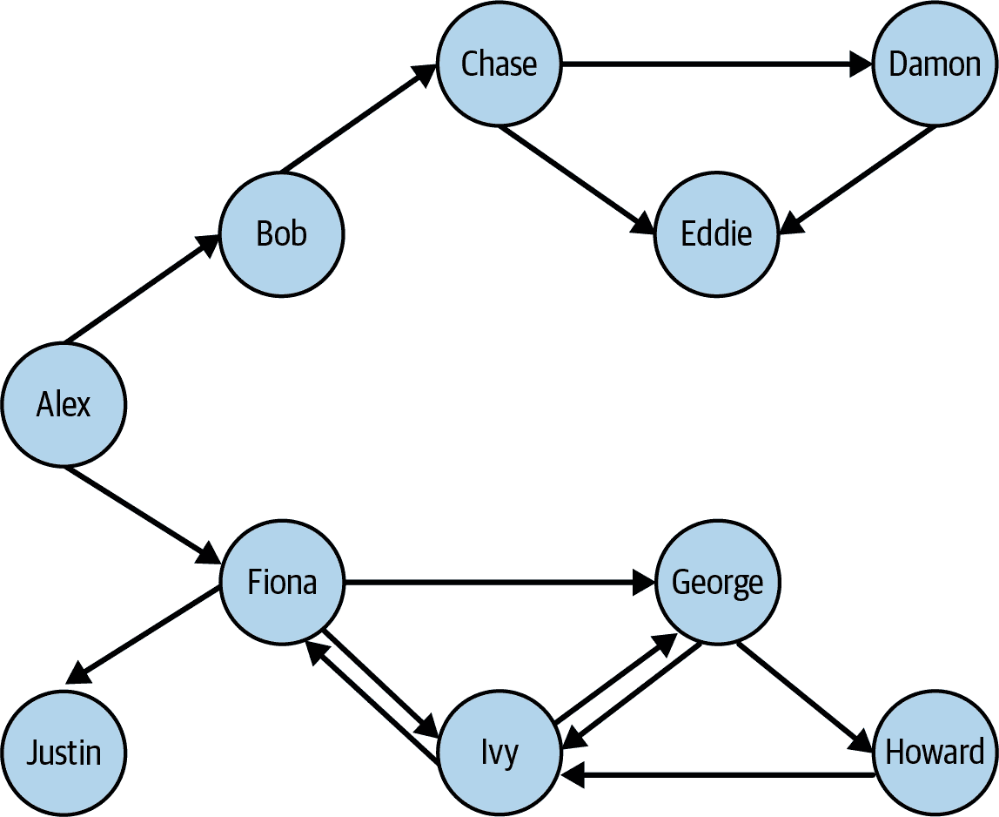
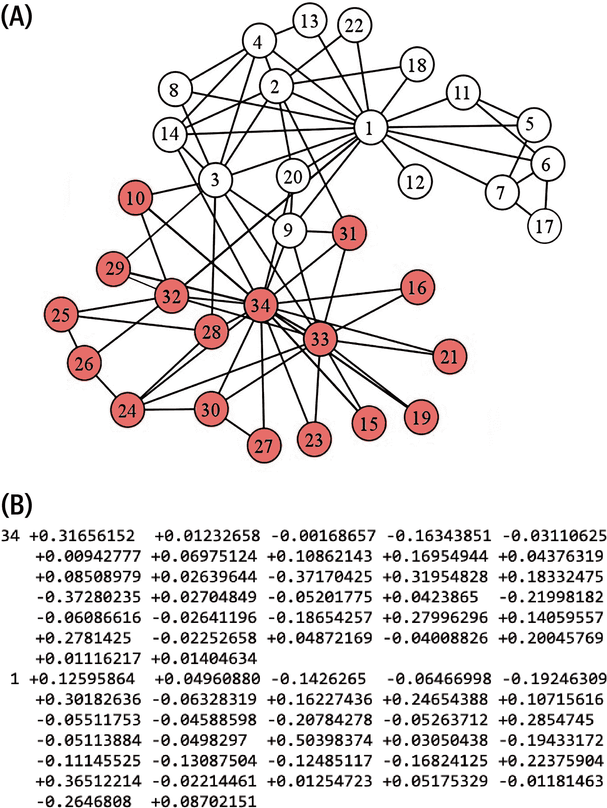
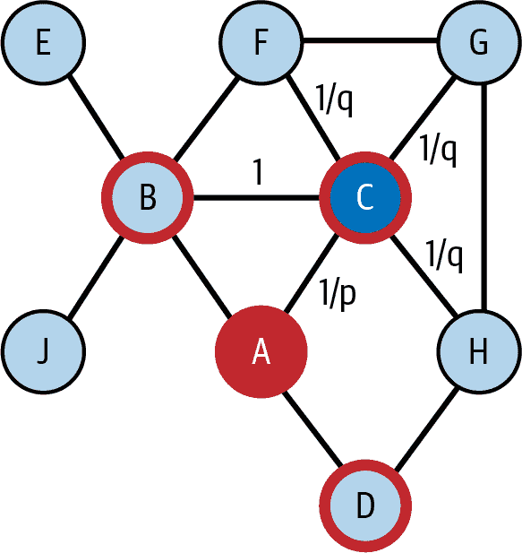

# 第十章：基于图的机器学习方法

完成本章后，你将能够：

+   列出图数据和分析如何改进机器学习的三种基本方式

+   指出哪些图算法在无监督学习中已被证明是有价值的

+   提取图特征以丰富你的训练数据，用于监督机器学习。

+   描述神经网络如何扩展到图上进行学习

+   提供使用案例和示例，以说明基于图的机器学习。

+   选择适合你的基于图的机器学习类型

现在我们开始书中的第三个主题：学习。也就是说，我们要认真对待机器学习的核心：模型训练。图 10-1 展示了一个简单的机器学习流程的各个阶段。在本书的第一部分中，我们探讨了连接主题，这符合流程的前两个阶段：数据获取和数据准备。图数据库使得从多个来源提取数据到一个连接的数据库中，并执行实体解析变得更加容易。


###### 图 10-1\. 机器学习流程

在本章中，我们将展示图如何增强流程的核心阶段：特征提取和至关重要的模型训练。特征简单地说就是数据实体的特性或属性，比如一个人的年龄或一件衣服的颜色。图提供了一整套基于实体如何与其他实体连接的特征，这些独特的面向图的特征增强了机器学习的原始材料，使其能够建立更好的模型。

本章包括四个部分。前三个部分分别描述了图如何增强机器学习的不同方式。首先，我们将从使用图算法进行无监督学习开始，因为这与我们在第二部分讨论的技术类似。其次，我们将转向用于监督和无监督机器学习的图特征提取。第三，我们以直接在图上进行模型训练结束，包括聚类、嵌入和神经网络的技术。第四部分回顾了各种方法，以便比较它们，并帮助您决定哪些方法能够满足您的需求。

# 使用图算法进行无监督学习

无监督学习是监督学习和强化学习的姊妹，它们共同构成机器学习的三大分支。如果你希望你的 AI 系统学会如何执行任务，按照你的类别分类事物，或者进行预测，你会选择使用监督学习和/或强化学习。然而，无监督学习有一个巨大的优势，即自给自足且准备就绪。不像监督学习，有些情况下你不需要已经知道正确答案。不像强化学习，你不必在通过试错学习时耐心和宽容。无监督学习只是获取你拥有的数据并报告其所学到的内容。

一个无监督学习算法可以查看你的客户和销售网络，并识别你实际的市场细分，这可能不符合年龄和收入的简单观念。无监督学习算法可以通过从你的数据而不是你的先入之见中确定“正常”来指出异常或远离正常的客户行为。例如，异常值可以指出哪些客户可能会流失（即停止使用你的产品或服务）。

我们将从图数据中学习的第一种方式是应用图算法来发现数据的模式或特征。在第六章中，我们详细介绍了五种算法类别。在本节中，我们将讨论哪些算法适合无监督学习。我们还将介绍另一个图分析任务：频繁模式挖掘。

## 通过相似性和社区结构学习

在第六章中介绍的五种算法类别中，最后一种——分类和预测——通常被数据科学家认为属于机器学习领域。特别是分类通常是监督学习。预测有各种各样的形式。正如我们之前指出的那样，这两个任务都依赖于某种度量相似性的方法。因此，相似性算法是机器学习的关键工具之一。

如果你找到所有具有高 Jaccard 相似性的顶点，可能感觉不像在做机器学习。你可以再进一步：找到的相似顶点数量是比你预期的要高还是低？你可以根据顶点通常具有的连接数以及两个随机顶点有共同邻居的可能性来建立你的期望。这些特征可以告诉你关于图表及其所代表的现实世界事物的重要信息。例如，假设一个大公司在图表中映射出其员工和各种与工作相关的数据。经理可以搜索是否有其他具有与其当前团队相似工作资格的员工。结果对于员工交叉培训、弹性和工作力量中的冗余有何影响？

当一个图的结构由许多个体玩家而不是中央规划决定时，它的社区结构不是事先已知的；我们必须分析图来发现结构。结构反映了实体及其相互关系，因此学习结构告诉我们一些关于实体及其动态的信息。基于模块性的算法如 Louvain 和 Leiden 是自学习的良好示例：通过查看图的自身连接相对密度来确定社区成员资格。递归定义的 SimRank 和 RoleSim 度量也符合无监督学习的自学习特征。那么 PageRank 难道不也是无监督学习的一种形式吗？

这些算法也非常有价值。许多金融机构发现，将中心性和社区算法应用于交易图表中有助于更好地识别金融犯罪。

## 查找频繁模式

正如本书所述，图表非常棒，因为它们可以轻松发现和分析基于连接的多重连接模式。在第二部分：分析中，我们讨论了查找特定模式，并且在本章稍后将回到这个话题。在无监督学习的背景下，这是目标：

> 发现所有频繁发生的模式。

计算机科学家称这为*频繁子图挖掘*任务，因为连接的模式只是一个子图。这个任务特别适用于理解自然行为和结构，比如消费者行为、社会结构、生物结构甚至软件代码结构。然而，它也提出了一个更为困难的问题。“任何和所有”大图中的模式意味着要检查大量可能的出现。阈值参数 T 是挽救的一线希望。要被视为频繁，模式必须至少出现 T 次。选择一个好的 T 值很重要。我们希望它足够高，以过滤掉小的、不重要的模式—我们过滤得越多，我们需要做的总体工作就越少—但不要过高以至于排除有趣的模式。选择一个好的阈值可以成为一个机器学习任务。

有许多高级方法尝试加快频繁子图挖掘的速度，但基本方法是从一边的模式开始，保留至少出现 T 次的模式，然后尝试连接这些模式以形成更大的模式：

1.  根据它们的类型和端点顶点的类型对所有边进行分组。例如，**`Shopper-(bought)-Product`**是一个模式。

1.  计算每个模式出现的次数。

1.  保留所有频繁模式（至少有 T 个成员）并且丢弃其余模式。例如，我们保留`Shopper-(lives_in)-Florida`但是排除`Shopper-(lives_in)-Guam`因为它不频繁。

1.  考虑每对具有兼容顶点类型的组（例如，组 1 和 2 都有一个**`Shopper`**顶点），并查看组 1 中有多少个单独顶点也在组 2 中。将这些单独的小模式合并以形成更大模式的新组。例如，我们合并在频繁模式`Shopper-(bought)-Blender`中相同人物也在频繁模式`Shopper-(lives_in)-Florida`中的情况。

1.  重复步骤 2 和 3（过滤频率）针对这些新形成的大模式。

1.  使用扩展的模式集重复步骤 4。

1.  当没有新的频繁模式建立时停止。

在计数中存在一个复杂性（步骤 2）。这个复杂性是*同构性*，也就是说，相同的顶点和边集如何以多种方式适配模板模式。考虑模式 A-(friend_of)-B。如果 Jordan 是 Kim 的朋友，这暗示 Kim 也是 Jordan 的朋友，这是一个实例还是两个实例？现在假设模式是“找到朋友 A 和 B 的成对，他们都和第三个人 C 是朋友”。这形成一个三角形。假设 Jordan，Kim 和 Logan 形成一个友谊三角形。我们可以有六种可能的方式将 Jordan，Kim 和 Logan 分配给变量 A，B 和 C。您需要事先决定是否应将这些类型的对称模式分开计数，然后确保您的计数方法是正确的。

图算法可以对图数据进行无监督机器学习。本节的关键收获如下：

+   几种类别的图算法符合无监督学习的自学习理念：相似性、社区检测、中心性、预测以及频繁模式挖掘。

+   无监督学习的好处在于提供见解，而无需事先分类。无监督学习还可以根据数据自身的上下文进行观察。

# 提取图特征

在前一节中，我们展示了如何使用图算法进行无监督机器学习。在大多数示例中，我们分析整个图以发现一些特征，例如社区或频繁模式。

在本节中，您将了解图如何提供额外和有价值的特征，以描述和帮助您理解您的数据。*图特征*是基于图中连接模式的特征。特征可以是局部的——归因于单个顶点或边的邻域——或全局的——涉及整个图或子图。在大多数情况下，我们对顶点特征感兴趣：顶点周围邻域的特征。这是因为顶点通常代表我们想要用机器学习建模的现实世界实体。

当一个实体（现实世界物体的一个实例）有多个特征，并且我们按照标准顺序排列这些特征时，我们称之为*特征向量*。本节我们将讨论的一些方法提供单个特征，其他方法则生成整套特征。您可以将一个顶点的实体属性（那些不基于连接的属性）与从本节讨论的一个或多个方法中获得的图特征连接起来，以制作更长、更丰富的特征向量。我们还将看一种特殊的特征向量称为*嵌入*，它总结了顶点的整个邻域。

这些特征可以直接提供见解，但它们最强大的用途之一是丰富监督机器学习的训练数据。特征提取是机器学习管道中的关键阶段之一（请参考图 10-1）。对于图形数据来说，这尤为重要，因为传统的机器学习技术设计用于向量，而不是图形。因此，在机器学习管道中，特征提取也是将图形转换为不同表示的地方。

在接下来的章节中，我们将讨论三个关键主题：领域无关特征、领域相关特征以及图嵌入的激动人心的发展。

## 领域无关特征

如果图特征对您来说是新的，理解它们的最佳方法是查看适用于任何图的简单示例。因为这些特征可以用于我们建模的任何类型的数据，我们称它们为*领域无关*。考虑图中的图 10-2。我们看到一个友谊网络，并计算一些简单的领域无关图特征的出现次数。



###### 图 10-2\. 带有有向友谊边的图（请在 [`oreil.ly/gpam1002`](https://oreil.ly/gpam1002) 查看此图的更大版本）

表 10-1 展示了四个选定顶点（亚历克斯、查斯、菲奥娜、贾斯汀）和四个选定特征的结果。

表 10-1\. 来自图图 10-2 的领域无关特征示例

|   | 入邻居数量 | 出邻居数量 | 两个前向跳跃内的顶点数量 | 三角形数量（忽略方向） |
| --- | --- | --- | --- | --- |
| **亚历克斯** | 0 | 2 (鲍勃、菲奥娜) | 6 (B、C、F、G、I、J) | 0 |
| **查斯** | 1 (鲍勃) | 2 (达蒙、埃迪) | 2 (D、E) | 1 (查斯、达蒙、埃迪) |
| **菲奥娜** | 2 (亚历克斯、艾维) | 3 (乔治、艾维、贾斯汀) | 4 (G、I、J、H) | 1 (菲奥娜、乔治、艾维) |
| **贾斯汀** | 1 (菲奥娜) | 0 | 0 | 0 |

您可以通过查看超过一到两个跳点的示例，考虑顶点或边的通用权重属性，并通过计算更复杂的方式（计算平均值、最大值或其他函数）轻松生成更多特征。因为这些是领域无关的特征，我们不考虑“人”或“朋友”的含义。我们可以将对象类型更改为“计算机”和“发送数据至”。但是，如果存在许多具有非常不同含义的边类型，则领域无关特征可能不适合您。

### 图元

另一种提取与领域无关特征的选择是使用图元。¹ *图元* 是小型子图模式，已经系统地定义，以包括每个可能的配置，直到最大顶点数。图 10-3 展示了所有最多五个顶点（或节点）的 72 种图元。请注意，图中显示了两种类型的标识符：形状 ID（G0、G1、G2 等）和图元 ID（1、2、3 等）。形状 G1 包含两种不同的图元：当参考顶点位于三顶点链的末端时是图元 1，当参考顶点位于中间时是图元 2。

统计围绕给定顶点的每个图案图形的出现次数，提供了一个标准化的特征向量，可以与任何图中的其他顶点进行比较。这种通用签名让您可以基于其邻域结构对实体进行聚类和分类，适用于诸如预测一个国家的世界贸易动态²或动态社交网络如 Facebook 的链接预测³等应用。


###### 图 10-3\. 最多五个顶点（或节点）的图形图案⁴（请在 [`oreil.ly/gpam1003`](https://oreil.ly/gpam1003) 查看此图的较大版本）

图形图案的一个关键规则是它们是感兴趣图中一组顶点的*诱导*子图。诱导意味着它们包括选定顶点集之间的*所有*边缘。该规则使得每个特定的顶点集最多匹配一个图形图案模式。

例如，在 图 10-2 中考虑 Fiona、George、Howard 和 Ivy 这四人。如果有的话，它们匹配哪种形状和图形图案？它是形状 G7，因为这四人形成一个带有一个交叉连接的矩形。它们不匹配形状 G5，即方形，因为 George 和 Ivy 之间有交叉连接。当我们谈论那个交叉连接时，请仔细查看形状 G7 的两个图形图案，图形图案 12 和 13\. 图形图案 13 的源节点位于交叉连接的一端，正如 George 和 Ivy 所在的位置。这意味着图形图案 13 是它们的图形图案之一。Fiona 和 Howard 位于方形的另外两个角落，它们没有交叉连接。因此，它们在其图形图案合集中具有图形图案 12。

显然，我们最初讨论的特征之间存在一些重叠（例如邻居数量）和图形图案之间。假设顶点 A 有三个邻居 B、C 和 D，如 图 10-4 所示。然而，我们不知道任何其他连接。关于顶点 A 的图形图案我们了解到什么？

1.  它展示了图形图案 0 模式三次。计算其出现次数非常重要。

1.  现在考虑包含三个顶点的子图。我们可以定义包含 A 的三种不同子图：(A, B, C), (A, B, D), 和 (A, C, D)。这些三元组中的每一个都满足图形图案 2 或 3\. 如果不知道 B、C 和 D 之间的连接（图中虚线边），我们就无法更加具体地判断。

1.  考虑所有四个顶点，我们可能会说它们匹配图形图案 7\. 由于 B、C 和 D 之间可能存在其他连接，实际上可能是不同的图形图案。是哪一个？如果有一个外围连接，则为图形图案 11；如果有两个连接，则为图形图案 13；如果有所有三种可能的连接，则为图形图案 14。


###### 图 10-4\. 直接邻居和图形图案的影响

图图特征的优点在于它们是彻底和有条理的。检查所有大小为五节点的图图相当于考虑源顶点四跳邻域的所有细节。您可以运行自动化的图图计数器，而不必花费时间和金钱来设计定制特征提取。图图的缺点在于它们可能需要大量的计算工作，而且可能更有成效地专注于更有选择性的领域相关特征。我们很快将介绍这些特征类型。

### 图算法

这里有第三种提取领域无关图特征的选项：图算法！特别是在第二部分讨论过的中心性和排名算法，因为它们系统地查看每个顶点周围的所有内容，并为每个顶点产生一个评分。图 10-5 和 图 10-6 分别展示了早期展示的图的 PageRank 和接近中心度⁵分数。例如，Alex 的 PageRank 分数为 0.15，而 Eddie 的 PageRank 分数为 1\. 这告诉我们，Eddie 比 Alex 受到同行更多的重视。Eddie 的排名不仅取决于连接的数量，还取决于边的方向。像 Eddie 一样有两个连接且位于图形粗略的“C”形末端的 Howard，只有 0.49983 的 PageRank 分数，因为一条边进入，另一条边出去。


###### 图 10-5\. 友谊图的 PageRank 分数（请在[`oreil.ly/gpam1005`](https://oreil.ly/gpam1005)上查看此图的更大版本）

图 10-6 中的接近中心度分数讲述了一个完全不同的故事。Alex 因为位于“C”形中心而获得了 0.47368 的最高分。Damon 和 Howard 的分数接近或接近底部——分别为 0.11111 和 0.22222，因为他们位于“C”形的末端。


###### 图 10-6\. 友谊图的接近中心度分数（请在[`oreil.ly/gpam1006`](https://oreil.ly/gpam1006)上查看此图的更大版本）

领域无关特征提取的主要优势在于其普遍性：通用提取工具可以事先设计和优化，并可立即应用于任何数据。然而，其未导向的方法可能使其成为一种粗糙的工具。

领域无关特征提取有两个主要缺点。因为它不关注考虑的边和顶点类型，它可能会将形状相同但含义完全不同的出现物组合在一起。第二个缺点是它可能会浪费资源计算和分类没有实际重要性或逻辑意义的特征。根据您的用例，您可能希望专注于更有选择性的领域相关特征集。

## 领域相关特征

少量领域知识可以大大提升您的特征提取智能和效率。

在提取领域相关特征时，首先要注意图中的顶点类型和边类型。查看图的模式显示非常有帮助。一些模式将信息分层地分解为图路径，例如`City-(IN)-State-(IN)-Country`或`Day-(IN)-Month-(IN)-Year`。这是按位置或日期对数据进行图导向索引和预分组的方式。这在南韩 COVID-19 接触追踪数据的图模型中有所体现⁶，如 Figure 10-7 所示。虽然`城市到国家`和`日到年`各自都是两跳路径，但这些路径只是基线信息，不具有像`Patient-(INFECTED_BY)-Patient-(INFECTED_BY)-Patient`这样的两跳路径的重要性。

您可以看到当混合边类型时，图形途径方法和其他领域无关方法可能会提供令人困惑的结果。一个简单的解决方案是通过在查找特征时仅考虑某些顶点类型和边类型来采取领域半独立方法。例如，如果要查找图形模式，您可能希望忽略`**Month**`顶点及其连接边。您可能仍然关心患者的出生年份和他们旅行的确切日期，但不需要图告诉您每年包含 12 个月。


###### 图 10-7。南韩 COVID-19 接触追踪数据的图模式（查看此图的更大版本：[`oreil.ly/gpam1007`](https://oreil.ly/gpam1007)）

使用这种顶点和边类型的认知，您可以优化一些与领域无关的搜索。例如，尽管可以在任何图上运行 PageRank，但只有当所有边具有相同或相似的含义时，得分才有意义。在整个 COVID-19 接触追踪图上运行 PageRank 是没有意义的，因为我们无法将所有不同的顶点类型和边类型排在同一尺度上。然而，仅考虑`**Patient**`顶点和`**INFECTED_BY**`边是有意义的。然后，PageRank 将告诉您在引起感染方面谁是最有影响力的患者：可以说是零号患者。

在这种情况下，您还希望应用您对领域的理解来考虑具有两个或更多特定类型边缘的小模式，这些边缘表明某种意义。对于这种 COVID-19 接触追踪方案，最重要的事实是感染状态（InfectionCase）、谁（Patient）、在哪里（City 和 TravelEvent）以及何时（Day_）。连接这些路径是重要的。一个可能的特征是“患者 P 在 2020 年 3 月的旅行事件数”。一个更具体的特征是“在 2020 年 3 月，与患者 P 相同城市的感染患者数量”。这第二个特征是我们在第二部分提出的问题类型：分析。您将在 TigerGraph Cloud Starter Kit for COVID-19 中找到基于顶点和边缘类型特定 PageRank 和领域相关模式查询的示例。

让我们停顿一分钟，思考一下您提取这些特征的即时目标。您是否希望这些特征直接指出可操作的情况，还是正在构建一个供机器学习系统使用的模式集合？机器学习系统可以确定哪些特征重要，程度如何，以及以什么组合。如果是后者，这也是我们本章的重点，那么您无需构建过于复杂的特征。相反，专注于基础特征。尝试包含一些提供数字的特征（例如，多少个旅行事件）或在几种可能性之间进行选择的特征（例如，最常访问的城市）。

为了更多地激发使用基于图的特征的灵感，这里有一些现实世界系统中使用的领域相关特征的例子，以帮助检测金融欺诈：

+   贷款申请人与已知欺诈者之间有多少条最短路径，最大路径长度为上限（因为非常长的路径代表风险微乎其微）？

+   贷款申请人的邮寄地址、电子邮件地址或电话号码已被不同名称的申请人使用了多少次？

+   特定信用卡在过去 10 分钟内产生了多少次消费？

虽然很容易看出任何这些指标的高值更可能涉及金融不端行为，但我们的目标是选择正确的特征和正确的阈值。对欺诈的正确测试可以减少假阴性（错过真实欺诈案例）和假阳性（将一个本不是欺诈的情况标记为欺诈）。假阳性有双重伤害。它们伤害企业，因为它们拒绝了一个诚实的商业交易，也伤害了被不公正地标记为骗子的客户。

## 图嵌入：一个全新的世界

我们最后一种特征提取的方法是图嵌入，这是最近研究和讨论的热门话题。一些权威人士可能觉得我们将图嵌入分类为一种特征提取有些不寻常。图嵌入不是一种降维吗？它不是表示学习吗？它不是一种机器学习本身吗？这些说法都是正确的。让我们首先定义一下图嵌入。

*嵌入* 是将一个拓扑对象表示为特定系统中的表示，使得我们关心的属性被保持（或者被很好地近似）。最后一部分，保持我们关心的属性，正是我们使用嵌入的核心原因。选择适当的嵌入使得我们更方便地看到我们想要看到的内容。

这里有几个例子来帮助说明嵌入的含义：

+   地球是一个球体，但我们在平面纸上印制世界地图。地球在纸上的表示就是一种嵌入。地球有几种不同的标准表示或嵌入作为地图。图 10-8 展示了一些例子。

+   在 2010 年代末之前，当有人提到“图嵌入”时，他们可能指的是像地球这样的东西。要表示图中所有的连接而不让边相交，通常需要三个或更多维度。每当你在一个平面上看到一个图时，它都是一个嵌入，如图 10-9 所示。此外，除非你的数据指定了顶点的位置，否则即使是三维表示也是一个嵌入，因为它是关于顶点放置的特定选择。从理论上讲，实际上需要 *n − 1* 维度来表示具有 *n* 个顶点的图。

+   在自然语言处理（NLP）中，词嵌入是给定单词的一系列分数（即特征向量）。对于个别分数没有自然解释，但是机器学习程序设置这些分数，以便在训练文档中经常在一起出现的单词具有相似的嵌入。例如，“机器”和“学习”可能具有相似的嵌入。词嵌入对人类使用并不方便，但对需要计算机方式理解单词相似性和分组的计算机程序非常方便。


###### 图 10-8\. 地球表面的三种嵌入到二维空间的表示⁷


###### 图 10-9\. 一些图可以在二维空间中嵌入，而不会有交叉边。


###### 图 10-10\. 词嵌入

近年来，图嵌入（graph embedding）已经获得了新的含义，类似于词嵌入（word embedding）。我们计算一个或多个特征向量来近似图的邻域结构。实际上，当人们说“图嵌入”时，他们通常指的是*顶点嵌入*：计算图中每个顶点的特征向量。顶点的嵌入告诉我们有关它如何连接到其他顶点的信息。然后，我们可以使用顶点嵌入的集合来近似表示整个图，不再需要考虑边。还有方法将整个图汇总为一个嵌入，这对比较不同图很有用。在本书中，我们将重点讨论顶点嵌入。

Figure 10-11 展示了图例子（a）及其部分顶点嵌入（b）的示例。每个顶点的嵌入（32 个数字的系列）描述了其邻域的结构，而不直接提到任何邻居。



###### 图 10-11\. (a) Karate 俱乐部图⁸ 和 (b) 其中两个顶点的 64 元素嵌入

让我们回到分类图嵌入的问题。图嵌入给我们的是一组特征向量。对于一个拥有百万个顶点的图，一个典型的嵌入向量可能只有几百个元素，远少于一百万维的上限。因此，图嵌入代表了一种降维的形式。如果我们使用图嵌入来获取特征向量，它们也是一种特征提取的形式。正如我们将看到的，生成嵌入的方法符合机器学习的定义，因此它们也是表示学习的一种形式。

任何特征向量都能够作为嵌入吗？这取决于你选择的特征是否告诉了你想知道的信息。由于它们系统地分解了邻域关系，图小片段是我们即将研究的学习嵌入的最接近模型。

### 基于随机游走的嵌入

图嵌入中最著名的方法之一是使用随机游走来获取围绕每个顶点 *v* 的邻域的统计样本。随机游走是在图 *G* 中连接的跳跃序列。游走从某个顶点 *v* 开始。然后选择 *v* 的一个随机邻居并移动到那里。它重复选择随机邻居直到被告知停止。在无偏的游走中，选择任何一条出边的概率都是相等的。

随机游走非常适合，因为它们易于操作且能够高效地收集大量信息。我们之前看到的所有特征提取方法都要求遵循如何遍历图的精确规则；图小片段特别严格，因为它们具有非常精确的定义和彼此的区别。随机游走则毫不在意，随便走。

对于图 10-12 中的示例图，在 Figure 10-12 中假设我们从顶点 A 开始随机行走。有三分之一的概率我们会下一步到达顶点 B、C 或 D 中的一个。如果你从顶点 E 开始行走，则下一步将百分百地到达顶点 B。有随机行走规则的变化，可能停留在原地，反转上一步，跳回起点或跳转到随机顶点。


###### 图 10-12 普通图，适合悠闲行走

每次行走可以记录为顶点列表，按访问顺序排列。A-D-H-G-C 是可能的一次行走。你可以将每次行走看作是一个签名。这些签名告诉我们什么呢？假设行走 W1 从顶点 5 开始，然后到达 2\. 行走 W2 从顶点 9 开始，然后也到达 2\. 现在它们都在 2\. 从这里开始，它们在剩余行走中的概率完全相同。这些单独的行走不太可能相同，但是如果有一个“典型行走”的概念，通过对多次行走进行采样平均，那么，是的，顶点 5 和 9 的签名会相似。这一切都因为 5 和 9 共享了邻居 2\. 此外，顶点 2 本身的“典型行走”也会相似，只是偏移了一个步骤。

结果表明，这些随机行走以与 SimRank 和 RoleSim 类似的方式收集邻域信息。不同之处在于，那些角色相似性算法考虑了 *所有* 路径（通过考虑所有邻居），这在计算上是昂贵的。让我们看看两种基于随机行走的图嵌入算法，它们使用了完全不同的计算方法，其中一种是从神经网络中借鉴过来的。

### DeepWalk

DeepWalk 算法⁹ 对图中每个顶点收集长度为 *λ* 的 *k* 个随机行走。如果你了解 word2vec 算法¹⁰，其余的就简单了。将每个顶点看作一个词，每次行走看作一句话。选择窗口宽度 *w* 用于 *skip-grams*，以及长度 *d* 用于嵌入。你将得到每个顶点长度为 *d* 的嵌入（潜在特征向量）。DeepWalk 的作者发现，在他们的测试图中，设置行走计数 *k* = 30，行走长度 *λ* = 40，窗口宽度 *w* = 10，嵌入长度 *d* = 64 效果很好。你的结果可能会有所不同。图 10-13 (a) 展示了一个从顶点 C 开始长度为 16 的随机行走示例，即距起点 15 步或跳跃。当我们解释 *skip-grams* 时，这些阴影将会被解释。


###### 图 10-13 (a) 随机行走向量及其对应的 *skip-gram*

我们假设您不了解 word2vec，因此我们将提供一个高层次的解释，足以让您理解正在发生的事情。这是概念模型。实际的算法通过许多统计技巧加快了工作速度。首先，我们构建了一个简单的神经网络，有一个隐藏层，如图 10-14 所示。输入层接受长度为*n*的向量，其中*n* = 顶点数。隐藏层的长度为*d*，嵌入长度，因为它将学习嵌入向量。输出层的长度也为*n*。


###### 图 10-14\. DeepWalk 的神经网络

每个顶点都需要在输入层和输出层中分配一个位置。例如，顶点 A 位于位置 1，顶点 B 位于位置 2，依此类推。在层与层之间有两个*n* × *d*连接的网格，从一个层的每个元素到下一个层的每个元素。每条边最初具有随机权重，但我们将逐渐调整第一个网格的权重。

从一个起始顶点开始进行一次行走。在输入时，我们使用*one-hot 编码*表示顶点。与起始顶点对应的向量元素设置为 1；所有其他元素设置为 0。我们将训练这个神经网络来预测给定输入顶点的邻域。

将第一个网格中的权重应用于我们的 one-hot 输入，我们得到隐藏层中的加权顶点。这是输入顶点嵌入的当前猜测。将隐藏层中的值乘以第二个网格的权重以获得输出层的值。现在你有一个具有随机权重的长度为*n*的向量。

我们将比较这个输出向量与步行的 skip-gram 表示。这是我们使用窗口参数*w*的地方。对于图中的每个顶点，在输入顶点*v*的前后*w*步内出现的次数。我们将跳过标准化过程，但您的最终 skip-gram 向量表达了在这次行走中每个*n*个顶点靠近顶点*v*的相对可能性。现在我们将解释图 10-13 的结果。顶点 C 是随机行走的起点；我们用深色标记了每次踏上顶点 C 的情况。浅色显示了距离顶点 C*w* = 2 步的每一步。然后，我们在(b)中形成 skip-gram，通过计算在阴影区域内每个顶点被踏足的次数。例如，顶点 G 被踏足了两次，因此 skip-gram 在 G 的位置有 2。这是在一个小图上的长步行，因此大多数顶点都在窗口内被踏足。对于大图上的短步行，大多数值将为 0。

我们的输出向量应该是这个 skip-gram 的预测。比较两个向量中每个位置的值，如果输出向量的值高于 skip-gram 的值，则减少输入网格中相应的权重。如果值较低，则提高相应的权重。

你已经处理了一次遍历。重复这个过程，对每个顶点进行第二次遍历，直到你调整了*k* × *n*次权重。完成了！第一个*n* × *d*网格的权重是您*n*向量的长度-*d*嵌入。第二个网格呢？奇怪的是，我们从来不打算直接使用输出向量，所以我们没有费心调整它的权重。

下面是如何解释和使用顶点嵌入的方法：

+   对于神经网络来说，通常无法指出潜在特征向量中各个元素的明确现实世界含义。

+   基于我们如何训练网络，我们可以从 skip-gram 逆推，这些 skip-gram 表示顶点周围的邻居：具有相似邻域的顶点应该具有相似的嵌入。

+   如果您记得之前关于两条路径偏移一个步骤的例子，请注意，这两条路径的 skip-gram 应该非常相似。因此，彼此接近的顶点应该具有相似的嵌入。

对 DeepWalk 的一个批评是它的均匀随机游走过于随机。特别是在从源顶点远离之前，可能会漫步到足够接近源的邻域的样本。解决这个问题的一种方法是通过包括重置漫步的概率，神奇地传送回源顶点，然后再次进行随机步骤，如[Zhou, Wu, and Tan](https://oreil.ly/3YiLc)所示。这被称为“带重启的随机游走”。

### Node2vec

随机游走的一个有趣扩展是[node2vec](https://oreil.ly/GoPWK)。它使用与 DeepWalk 相同的 skip-gram 训练过程，但它给用户两个调整参数来控制游走的方向：走得更远（深度）、走到侧面（广度）、或者后退一步。远和后退看起来很明显，但侧面到底意味着什么呢？

假设我们从图中的顶点 A 开始，图示见图 10-15。它的邻居是顶点 B、C 和 D。由于我们刚开始，选择任何一个都会向前移动。让我们去顶点 C。在第二步中，我们可以从顶点 C 的邻居中选择：A、B、F、G 或 H。



###### 图 10-15\. 说明带有内存的偏向随机游走在 node2vec 中使用

如果我们记得上一步中的选择，我们可以将当前的邻居分成三组：后向、侧向和前向。我们还为每个连接的边分配一个权重，代表选择该边的未标准化概率。

后向

在我们的例子中：顶点 A。边的权重 = 1/*p*。

侧面

这些是在上一步中可用的顶点，并且在本步中也可用。它们代表了访问先前所在位置的不同邻居的第二次机会。在我们的示例中：顶点 B。边权重=1。

正向

所有不返回或侧向的顶点。在我们的示例中：顶点 F、G 和 H。边权重=1/*q*。

如果我们设置*p* = *q* = 1，则所有选择的概率相等，因此我们回到了一个无偏的随机游走。如果*p* < 1，则返回比侧向更有可能。如果*q* < 1，则每个前向（深度）选项比侧向（广度）更有可能。返回还使步行保持在家附近（例如，类似于广度优先搜索），因为如果您向后走，然后随机向前走，您正在尝试前一邻域中的不同选项。

调整步行路径使得 node2vec 比 DeepWalk 更加灵活，这在许多情况下产生了更好的模型，但是以更高的计算成本为代价。

除了随机游走方法之外，还有几种其他的图嵌入技术，各有优缺点：矩阵因子分解、边重建、图核函数和生成模型。[FastRP](https://oreil.ly/QhbWl) 和 [NodePiece](https://oreil.ly/r6FZ5) 展示了在现实世界中效率和准确性之间有一个有前途的平衡。虽然已经有些过时，但是**蔡宏运**、**郑卫华**和**张晓川**的[*图嵌入综述：问题、技术和应用的全面调查*](https://oreil.ly/bIKdV) 提供了一个详尽的概述，并附有几个易于理解的表格，比较了不同技术的特点。**伊利亚·马卡罗夫**、**德米特里·基谢列夫**、**尼基塔·尼基金斯基**和**洛夫罗·苏贝尔**最近进行了一项[关于图嵌入的调查](https://oreil.ly/3FxLA)。

图可以提供额外和有价值的特征来描述和理解您的数据。本节的主要收获如下：

+   图特征是基于图中连接模式的特征。

+   图小片和诸如中心性等的图算法为任何图提供了领域独立的特征。

+   应用一些领域知识来指导您的特征提取将产生更有意义的特征。

+   机器学习可以生成顶点嵌入，这些嵌入使用紧凑的特征向量编码顶点的相似性和接近性。

+   随机漫步是采样顶点邻域的简单方法。

# 图神经网络

在流行媒体中，如果没有使用神经网络，那就不是 AI；如果没有使用深度学习，那就不是机器学习。神经网络最初是为了模拟人类大脑的工作原理而设计的，但它们已经发展到可以处理计算机和数学的能力。主流模型假定您的输入数据是一个矩阵或张量；目前尚不清楚如何呈现和训练具有相互连接顶点的神经网络。但是有基于图的神经网络吗？是的！

图神经网络（GNN）是传统神经网络加入图形特性的变体。就像神经网络有几种变体一样，GNN 也有几种变体。将图本身包含到神经网络中的最简单方式是通过卷积。

## 图卷积网络

在数学中，*卷积* 是指两个函数以特定方式相互作用时对结果的影响。它通常用于模拟一个函数描述主要行为，而另一个函数描述次要效应的情况。例如，在图像处理中，卷积考虑到相邻像素以改善边界识别并添加人工模糊。在音频处理中，卷积用于分析和合成房间混响效果。卷积神经网络（CNN）是在训练过程中包含卷积的神经网络。例如，你可以用 CNN 进行人脸识别。CNN 会系统地考虑相邻像素，在分析数字图像时是至关重要的职责。

图卷积网络（GCN）是在学习过程中使用图遍历作为卷积函数的神经网络。虽然早期有一些相关工作，但第一个将图卷积的本质提炼为简单而强大的神经网络模型是由 Thomas Kipf 和 Max Welling 于 2017 年提出的“[使用图卷积网络进行半监督分类](https://oreil.ly/b14rL)”。

对于图形，我们希望每个顶点的嵌入包含关于与其他顶点关系的信息。我们可以使用卷积原理来实现这一点。图 10-16 显示了一个简单的卷积函数，顶部是一个通用模型，底部是一个更具体的例子。


###### 图 10-16\. 使用顶点邻居的卷积

在图中的部分（a），主要函数是 Features(*v*)：给定顶点 *v*，输出其特征向量。卷积将 *v* 的特征与所有邻居 *u1, u2,...,u*N* 的特征结合起来。如果特征是数值的，简单的卷积操作可以是加法。结果是 *v* 的新卷积特征。在部分（b），我们设定 *v* = D，来自图 10-15。顶点 D 有两个邻居，A 和 H。在求和特征向量之后，我们再插入一步：除以主顶点的度。顶点 D 有 2 个邻居，所以我们除以 2。这样可以使输出值规范化，以防止它们不断增大。（是的，严格来说我们应该除以 deg(*v*) + 1，但更简单的版本似乎已经足够好了。）

让我们做一个快速的例子：

```
features0 = [3, 1 ,4, 1]
features0 = [5, 9, 2, 6]
features0 = [5, 3, 5, 8]
features1 = [6.5, 6.5, 5.5, 7.5]
```

通过让邻居分享其特征值，这个简单的卷积函数执行选择性信息共享：它决定了什么是被分享的（特征）以及由谁来分享（邻居）。使用这种卷积函数的神经网络往往会按照以下准则演变：

+   共享许多邻居的顶点往往会相似。

+   共享相同初始特征值的顶点往往会相似。

这些特性让人联想到随机游走图嵌入。

如何将这种卷积操作集成到神经网络中？请看图 10-17。


###### 图 10-17. 两层图卷积网络

这个两层网络从左向右流动。输入是图中所有顶点的特征向量。如果特征向量水平排列，顶点垂直堆叠，则得到一个*n* × *f*矩阵，其中*f*是特征数。接下来，我们应用基于邻接矩阵的卷积。然后我们应用一组随机化权重（类似于随机游走图嵌入网络中所做的），将特征合并并减少到大小为*h1*的嵌入。通常*h1 < *f*。在将值存储到嵌入矩阵之前，我们应用一个激活函数（圆圈中的方块“S”表示），它作为滤波器/放大器。低值被推低，高值被推高。激活函数在大多数神经网络中都有使用。

因为这是一个两层网络，我们重复相同的步骤。唯一的区别在于这个嵌入可能具有不同的大小，通常*h2 ≤ h1*，以及这个权重网格具有不同的随机权重集。如果这是最后一层，那么它被视为输出层，并输出结果。通过有两层，每个顶点的输出嵌入考虑了两个跳之内的邻居。您可以添加更多层来考虑更深的邻居。通常两到三层提供最佳结果。层数过多时，每个顶点邻域的半径变得如此大，以至于即使与不相关顶点的邻域也有显著的重叠。

我们的例子展示了如何在无监督学习模式下使用 GCN。我们没有提供训练数据或目标函数；我们只是将顶点的特征与其邻居的特征合并。令人惊讶的是，无监督、未经训练的 GCN 也能产生有用的结果。GCN 的作者们尝试了一个三层未经训练的 GCN，使用了著名的 Karate Club 数据集。他们将输出层的嵌入长度设置为二，这样他们可以将这两个值解释为坐标点。绘制时，输出数据点显示出与 Zachary 的 Karate Club 中已知社区匹配的社区聚类。

GCN 架构足够通用，可用于无监督、监督、半监督甚至强化学习。GCN 和普通前馈神经网络唯一的区别在于添加向量特征与邻居特征聚合的步骤。图 10-18 展示了神经网络如何调整权重的通用模型。GCN 中的图卷积仅影响标有前向传播层的块。所有其他部分（输入值、目标值、权重调整等）决定了你正在进行的学习类型。也就是说，学习类型独立于你使用图卷积决定。


###### 图 10-18\. 神经网络中响应式学习的通用模型

注意力神经网络使用更高级的反馈和调整形式。这本书的范围之外详细介绍，但图注意力神经网络（GATs）可以调整每个邻居的权重（即聚焦注意力）并将它们相加进行卷积。也就是说，GAT 执行加权求和而不是邻居特征的简单求和，并且 GAT 会自我训练以学习最佳权重。当应用于相同的基准测试时，GAT 稍微优于 GCN。

## GraphSAGE

基本 GCN 模型的一个限制是它仅对顶点加邻居特征做简单平均。我们似乎希望对这种卷积进行更多控制和调整。此外，不同顶点的邻居数量大幅变化可能导致训练困难。为了解决这一限制，William Hamilton、Rex Ying 和 Jure Leskovec 在他们的论文“[大规模图上的归纳表征学习](https://oreil.ly/YTlH9)”中于 2017 年提出了 GraphSAGE。像 GCN 一样，这种技术也结合了邻居的信息，但做法有所不同。为了标准化邻居的学习，GraphSAGE 从每个顶点中采样固定数量的邻居。图 10-21 展示了 GraphSAGE 的块图，包括采样的邻居。


###### 图 10-21\. GraphSAGE 的块图

在 GraphSAGE 中，邻居的特征根据选择的聚合函数进行组合。这个函数可以是加法，就像 GCN 中一样。可以使用任何无序的聚合函数；长短期记忆（LSTM）在随机顺序和最大池化中工作良好。与 GCN 不同，源顶点不包含在聚合中；相反，聚合特征向量和源顶点的特征向量被串联起来形成双倍长度的向量。然后我们应用一组权重来混合这些特征，应用激活函数，并存储为顶点下一层的表示。这一系列集合构成神经网络中的一层，以及每个顶点一跳内信息的收集。GraphSAGE 网络有 k 层，每层都有自己的权重集合。GraphSAGE 提出了一个损失函数，如果附近的顶点具有相似的嵌入，就奖励它们，并且如果它们具有不相似的嵌入，则奖励远距离的顶点。

与 GCN 一样，在整个图上训练，你可以只用顶点及其邻域的一部分来训练 Graph SAGE。GraphSAGE 的聚合函数使用等大小的邻域样本，这意味着输入的排列方式并不重要。这种排列自由度使你可以使用一个样本进行训练，然后使用不同的样本进行测试或部署。因为它基于这些泛化的图邻域属性构建模型，GraphSAGE 执行 *归纳学习*。也就是说，该模型可以用来预测原始数据集中不存在的新顶点。相比之下，GCN 直接使用邻接矩阵，这强制它使用特定顺序排列的完整图。使用完整数据进行训练，并仅针对该数据学习模型是 *传导学习*。

在你的特定图中，从样本学习是否有效取决于你的图的结构和特征是否遵循全局趋势，这样一个随机子图看起来就像另一个大小相似的子图。例如，森林的一部分可能看起来很像另一部分森林。举个图的例子，假设你有一个包含客户与销售团队、网站和活动的所有互动、他们的购买以及你能获取的所有其他个人资料信息的客户 360 图。去年的客户根据其购买总金额和频率进行评级。合理地预期，如果你使用 GraphSAGE 和去年的图来预测客户评级，它应该能够很好地预测今年客户的评级。Table 10-2 总结了我们提出的 GCN 和 GraphSAGE 之间所有的相似性和差异。

Table 10-2\. GCN 和 GraphSAGE 特性比较

|   | GCN | GraphSAGE |
| --- | --- | --- |
| **聚合邻居** | 所有 | *n* 个邻居样本 |
| **聚合函数** | 平均 | 几个选项 |
| **聚合顶点与邻居？** | 与其他聚合 | 与其他连接 |
| **需要学习权重吗？** | 对于无监督的转导模型不需要 | 对于归纳模型需要 |
| **监督？** | 是 | 是 |
| **自监督？** | 经过修改 | 经过修改 |
| **可以对顶点样本进行训练吗？** | 否 | 是 |

基于图的神经网络使图在机器学习中变得主流。本节的关键收获如下：

+   图卷积神经网络在学习过程中通过平均每个顶点的邻居的特征向量与自己的特征进行增强，从而提升了基本神经网络的能力。

+   GraphSAGE 对基本的 GCN 进行了两个关键改进：顶点和邻域采样，并在学习过程中保持向量特征与其邻居的特征分离。

+   GCN 以转导方式学习（仅使用全数据学习该数据的信息），而 GraphSAGE 以归纳方式学习（使用数据样本学习可以应用于其他数据样本的模型）。

+   神经网络和图增强的模块化特性意味着 GCN 和 GraphSAGE 的思想可以转移到许多其他类型的神经网络中。

# 比较图机器学习方法

本章介绍了许多从图数据中学习的不同方法，但只是皮毛。我们的目标不是提供详尽的调查，而是提供一个框架，供您继续成长。我们概述了图驱动机器学习的主要类别和技术，描述了它们的特征和区别，并提供了简单的示例来说明它们的运作方式。简要回顾这些技术是值得的。我们的目标不仅是总结，还包括为您选择正确的技术提供指导，帮助您从连接的数据中学习。

## 机器学习任务的用例

表 10-3 汇集了每个主要学习任务的用例示例。这些是您可能在任何数据上执行的基本数据挖掘和机器学习任务，但这些示例对图数据特别相关。

表 10-3. 图数据学习任务的用例

| 任务 | 用例示例 |
| --- | --- |
| **社区检测** | 描绘社交网络 |
| 发现一个金融犯罪网络 |
| 发现生物生态系统或化学反应网络 |
| 发现意外依赖组件或过程的网络，例如软件流程或法律法规 |
| **相似性** | 物理接近的抽象，距离的倒数 |
| 聚类、分类和链接预测的先决条件 |
| 实体解析：找到两个在线身份，可能指的是同一个现实世界的人 |
| 产品推荐或建议行动 |
| 识别在不同但类似网络中执行相同角色的人员 |
| **发现未知模式** | 识别你的网站或应用中最常见的“客户旅程” |
| 一旦识别出当前的模式，就开始注意变化 |
| **链接预测** | 预测某人未来的购买或购买意愿 |
| 预测企业或个人关系的存在，即使这些关系未记录在数据中 |
| **特征提取** | 通过图特征丰富你的客户数据，从而使得你的机器学习训练在分类和建模客户方面更加成功 |
| **嵌入** | 将大量特征转换为更紧凑的集合，以进行更高效的计算 |
| 在没有设计特定特征提取查询的情况下，全面捕获邻居的特征签名 |
| **分类（预测类别）** | 根据过去欺诈案例创建用于识别新欺诈案例的模型 |
| 预测未来疫苗接种者的分类结果，基于过去患者的测试结果 |
| **回归（预测数值）** | 基于过去参与者的结果预测减重效果 |

一旦确定您想要执行的任务类型，请考虑可用的基于图的学习技术，它们提供的内容以及它们的主要优势和差异。

## 模式发现和特征提取方法

表 10-4 列出了我们在本章和第六章中遇到的图算法和特征提取方法。

表格 10-4\. 图中的模式发现和特征提取方法

| 任务 | 基于图的学习方法 | 评论 |
| --- | --- | --- |
| **社区检测** | 连通分量 | 一个连接到社区就足够了 |
| k-核 | 至少与其他社区成员有 k 个连接 |
| 模块性优化（例如，Louvain） | 社区内连接的密度相对较高 |
| **相似性** | Jaccard 邻域相似性 | 计算共同关系的数量，适用于非数值数据 |
| 余弦邻域相似性 | 比较数值或加权关系向量 |
| 角色相似性 | 递归地定义为具有相似邻居 |
| **发现未知模式** | 频繁模式挖掘 | 从小模式开始构建到大模式 |
| **领域无关特征提取** | 图子结构 | 所有可能的邻域配置的系统列表 |
| 页面排名 | 排名基于同类型顶点之间的入度和排名 |
| 接近中心性 | 接近度 = 到任何其他顶点的平均距离 |
| 中介中心性 | 顶点在任意两个顶点之间的最短路径上出现的频率；计算速度较慢 |
| **领域相关特征提取** | 搜索与您领域相关的模式 | 需要具有领域知识的人的定制努力 |
| **降维和嵌入** | DeepWalk | 如果向量具有类似的随机游走，则嵌入将类似，考虑接近性和角色；比 SimRank 更高效 |
| node2vec | 具有随机游走方向调整的 DeepWalk，用于更高的调整 |

## 图神经网络：总结和用途

本章介绍的图神经网络不仅在许多情况下直接有用，而且还是向更高级数据科学家展示如何在训练中包含图连接的模板。关键在于卷积步骤，该步骤考虑了相邻顶点的特征。所展示的所有 GNN 方法都可以用于无监督或监督学习。表 10-5 比较了图神经网络方法。

表 10-5\. 三种图神经网络类型的总结

| 名称 | 描述 | 用途 |
| --- | --- | --- |
| 图卷积网络（GCN） | 卷积：邻居特征的平均 | 特定图上的聚类或分类 |
| GraphSAGE | 卷积：邻居特征样本的平均 | 在样本图上学习代表性模型，除了聚类或分类 |
| 图注意力神经网络（GAT） | 卷积：邻居特征的加权平均 | 聚类、分类和模型学习；通过学习卷积权重增加调整和复杂性 |

# 章节总结

图及基于图的算法对机器学习流程的几个阶段有贡献：数据获取、数据探索和模式发现、数据准备、特征提取、降维和模型训练。正如数据科学家所知，没有金票，没有一种单一的技术可以解决所有问题。相反，你努力获取工具箱中的工具，发展使用这些工具的技能，并了解何时使用它们。

¹ Graphlets 最早由 Nataša Pržulj, Derek G. Corneil, 和 Igor Jurisi 在“建模相互作用组：无标度还是几何？”*生物信息学* 20, no. 18 (2004 年 12 月): 3508–3515 中提出, [*https://doi.org/10.1093/bioinformatics/bth436*](https://doi.org/10.1093/bioinformatics/bth436).

² Anida Sarajlić, Noël Malod-Dognin, Ömer Nebil Yaveroğlu, and Nataša Pržulj，“基于图元的有向网络特征化”，*科学报告* 6 (2016), [*https://www.nature.com/articles/srep35098*](https://www.nature.com/articles/srep35098).

³ Mahmudur Rahman 和 Mohammad Al Hasan，“使用图小结进行动态网络中的链接预测”，收录于《数据库中的机器学习与知识发现》第一部分，由 Paolo Frasconi、Niels Landwehr、Giuseppe Manco 和 Jilles Vreeken 编辑（意大利瑞瓦德尔加达：欧洲会议 ECML PKDD，2016 年），394–409 页。

⁴ Tijana Milenković 和 Nataša Pržulj，“通过图小结度量揭示生物网络功能”，*癌症信息学* 6 卷，第 10 期（2008 年 4 月），[*https://www.researchgate.net/publication/26510215_Przulj_N_Uncovering_Biological_Network_Function_via_Graphlet_Degree_Signatures*](https://www.researchgate.net/publication/26510215_Przulj_N_Uncovering_Biological_Network_Function_via_Graphlet_Degree_Signatures)。

⁵ 这些算法首次出现在第二部分：“分析”。

⁶ “[NeurIPS 2020] COVID-19 的数据科学 (DS4C)，” Kaggle，访问于 2023 年 5 月 25 日，[*https://www.kaggle.com/datasets/kimjihoo/coronavirusdataset*](https://www.kaggle.com/datasets/kimjihoo/coronavirusdataset)。

⁷ 来自 John P. Snyder 和 Philip M. Voxland 的《地图投影集锦》，第二版（美国地质调查专业论文 1453 号，1994 年），[*https://pubs.usgs.gov/pp/1453/report.pdf*](https://pubs.usgs.gov/pp/1453/report.pdf)。

⁸ 这种可视化的分区来自于“Zachary's Karate Club”，维基百科，2017 年 4 月 5 日，[*https://en.wikipedia.org/wiki/File:Zachary%27s_karate_club.png*](https://en.wikipedia.org/wiki/File:Zachary%27s_karate_club.png)。

⁹ 参见 Perozzi、Al-Rfou 和 Skiena 的文章 [*https://dl.acm.org/doi/abs/10.1145/2623330.2623732*](https://dl.acm.org/doi/abs/10.1145/2623330.2623732)。

¹⁰ 参见 Mikolov、Sutskever、Chen、Corrado 和 Dean 的文章 [*https://arxiv.org/abs/1310.4546*](https://arxiv.org/abs/1310.4546)。
