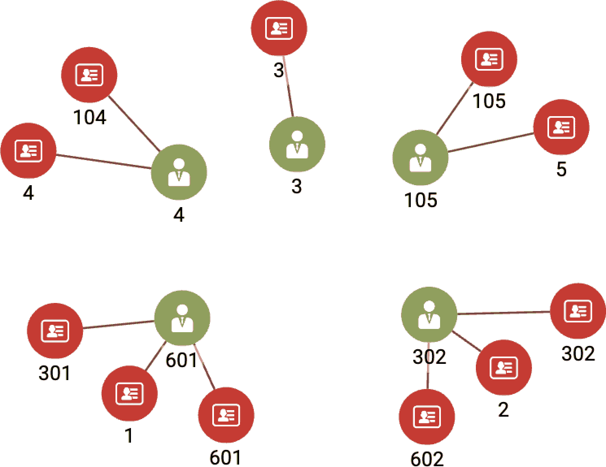

# 第十一章：实体解析再访

本章以流媒体视频服务的实体解析为例，介绍了无监督机器学习和图算法。完成本章后，您将能够：

+   列举适用于实体解析的无监督学习图算法类别

+   列出评估实体相似性的三种不同方法

+   理解参数化权重如何使实体解析成为监督学习任务

+   解释简单的 GSQL `FROM`子句，并对`ACCUM`语义有一般了解

+   设置和运行 TigerGraph Cloud 入门套件，使用 GraphStudio

# 问题：识别现实世界用户及其喜好

流媒体视频点播（SVoD）市场规模庞大。全球市场规模的准确估算并不容易，但最保守的估计可能是 2020 年约 500 亿美元¹，而年增长率在未来五年左右将介于 11%²到 21%³之间。电影制片厂、电视网络、通讯网络和科技巨头一直在进行合并并重塑自己，希望成为娱乐消费的新首选格式的领导者：即时数字娱乐，适用于任何视频设备。

要成功，SVoD 提供商需要有内容来吸引和保留数百万订阅者。传统视频技术（电影院和广播电视）限制提供商每次只能在一个场所或广播区域播放一个节目。观众的选择非常有限，而提供商则选择能够吸引大众的内容。VHS 磁带和 DVD 的家庭视频引入了个性化。任何个人设备上的无线数字视频点播把权力交到了消费者手中。

提供商不再需要迎合大众。相反，成功的关键是微分割：为每个人提供一些内容。SVoD 巨头正在汇集大量现有内容的目录，同时在新内容上投入数十亿美元。这么多选择量产生了几个数据管理问题。有了这么多节目可供选择，用户很难浏览。提供商必须对内容进行分类、对用户进行分类，然后向用户推荐节目。良好的推荐可以提高观众收视率和满意度。

尽管预测客户的兴趣已经足够困难，但流媒体视频行业还需要克服一个多方面的*实体解析*问题。实体解析，您可能记得，是识别数据集中指向同一现实世界实体的两个或多个实体，然后将它们链接或合并在一起的任务。在今天的市场上，流媒体视频提供商面临至少三个实体解析挑战。首先，每个用户可能有多个不同的授权方案，每种设备都有一个。其次，企业合并很常见，需要合并组成公司的数据库。例如，Disney+结合了 Disney、Pixar、Marvel 和 National Geographic Studios 的目录。Max 汇集了 HBO、Warner Bros.、DC Comics 和 Discovery。第三，SVoD 提供商可能与另一家公司进行促销、附属或合作关系：客户可能因为是某些其他服务 B 的客户而能够访问流媒体服务 A。例如，Verizon 互联网服务的客户可以免费使用 Disney+、Hulu 和 ESPN+服务。

# 解决方案：基于图的实体解析

在我们设计解决方案之前，让我们从清晰地陈述我们想要解决的问题开始。

# 问题陈述

每个现实世界的用户可能有多个数字身份。我们的目标是发现这些数字身份之间的隐藏联系，然后将它们链接或合并在一起。通过这样做，我们将能够将所有信息连接起来，形成用户的更完整的画像。特别是，我们将知道一个人观看过哪些视频，从而更好地理解他们的个人喜好并提供更好的推荐。

现在我们已经明确了问题陈述，让我们考虑一个潜在的解决方案：实体解析。实体解析分为两部分：确定哪些实体可能相同，然后解析实体。让我们依次看看每个部分。

## 学习哪些实体是相同的

如果我们有幸拥有显示实际上是相同实体的示例的训练数据，我们可以使用监督学习来训练机器学习模型。在这种情况下，我们没有训练数据。相反，我们将依赖数据本身的特征，查看相似性和社区以执行无监督学习。

要做好这项工作，我们希望积累一些领域知识。一个人有多个在线身份的情况是什么，数据中有什么线索？以下是一些人可能创建多个账户的原因：

+   用户创建第二个账户是因为他们忘记了或忘记了如何访问第一个账户。

+   用户在两个不同的流媒体服务中都有账户，并且这些公司进入了合作或合并关系。

+   一个人可能有意设立多个不同的身份，也许是为了利用多个会员奖励，或者为了分开他们的行为配置文件（例如，在不同账户上观看不同类型的视频）。个人信息可能会有很大差异，但设备 ID 可能是相同的。

每当同一人在不同时刻创建两个不同账户时，由于琐碎或无害的原因，某些细节可能会有所不同。人们可能决定使用昵称，选择缩写城市或街道名称，误输入，有多个电话号码和电子邮件地址可供选择，但他们出于无特定原因做出了不同选择。随着时间的推移，地址、电话号码、设备 ID 甚至用户姓名可能会发生更大的变化。

尽管有多种情况导致一个人拥有多个在线身份，但我们似乎可以将我们的数据分析集中在只有两种模式上。在第一种模式中，大部分个人信息将相同或类似，但可能会有少量属性不同。即使两个属性不同，它们可能仍然相关。例如使用昵称或地址拼写错误。在第二种模式中，大部分信息不同，但一个或多个关键部分仍然相同，例如家庭电话号码或生日，以及行为线索（例如喜欢什么类型的视频以及观看它们的时间）。这些线索可能表明两个身份属于同一人。

要构建我们的解决方案，我们需要使用一些相似度算法，以及社区检测或聚类算法将相似的实体分组在一起。

## 解决实体

一旦我们使用适当的算法识别出我们认为相同的一组实体，我们将如何处理？我们希望更新数据库以反映这些新知识。有两种可能的方法可以实现这一点：将组合并为一个实体，或以一种特殊方式链接这些实体，以便每当我们查看组中的一个成员时，我们将立即看到其他相关的身份。

当考虑到一些在线身份信息不正确时，合并实体是有意义的，因此我们希望消除它们。例如，假设客户因姓名拼写错误或忘记已有账户而拥有两个在线账户。业务所有者和客户都希望消除一个账户，并将所有记录（购买历史、游戏得分等）合并到一个账户中。要确定删除哪个账户需要更多的具体案例知识，超出了我们的示例范围。

或者，可以简单地将实体链接在一起。具体来说，利用图中的两种实体类型：一个表示数字身份，另一个表示真实世界实体。解析后，数据库将显示一个真实世界实体与其各个数字身份之间有边，如图 11-1 所示。


###### 图 11-1\. 解析后与真实世界实体链接的数字实体

# 实施基于图的实体解析

我们将介绍的基于图的实体解析的实现可作为 TigerGraph 云起始套件使用。与往常一样，我们将专注于使用 GraphStudio 可视化界面。所有必要的操作也可以从命令行界面执行。

## 数据库内实体解析起始套件

使用 TigerGraph Cloud，部署一个新的云实例，并选择“数据库内机器学习用于大数据实体解析”作为用例。一旦安装了这个起始套件，按照第三章中“加载数据并安装查询的起始套件”一节中列出的步骤加载数据。

## 图模式

查看图模式，如图 11-2 所示，您可以看到**`账户`**、**`用户`**和**`视频`**是中心顶点，从它们辐射出多条边。其他顶点代表用户的个人信息和视频的特征。我们想比较不同用户的个人信息。遵循面向图形的分析的良好实践，如果我们想查看两个或更多实体是否共享某个特征（例如电子邮件地址），我们将该特征建模为一个顶点，而不是作为顶点的属性。


###### 图 11-2\. 视频客户账户的图模式（在[`oreil.ly/gpam1102`](https://oreil.ly/gpam1102)上查看更大版本的此图）

表 11-1 简要解释了图模型中每个顶点类型。虽然起始套件的数据包含大量有关视频的数据，但我们在本次练习中不会专注于视频本身。我们将专注于**`账户`**的实体解析。

表 11-1\. 图模型中的顶点类型

| 顶点类型 | 描述 |
| --- | --- |
| **`账户`** | 一个 SVoD 用户的账户，一个数字身份 |
| **`用户`** | 一个真实世界的人。一个**`用户`**可以链接到多个**`账户`** |
| **`IP`**，**`电子邮件`**，**`姓`**，**`电话`**，**`地址`**，**`设备`** | **`账户`**的关键属性，表示为顶点以便链接共享共同属性的**`账户`**/**`用户`** |
| **`视频`** | 由 SVoD 提供的视频标题 |
| **`关键词`**，**`类型`** | **`视频`**的属性 |
| **`Video_Play_Event`** | 特定**`Account`**观看特定**`Video`**的时间和持续时间。 |
| **`Weight`** | 相似性模型参数 |

## 查询和分析

对于我们的实体解析用例，我们有一个需要三个或更多查询的三阶段计划：

1.  初始化：对于每个**`Account`**顶点，创建一个**`User`**顶点并将它们链接起来。**`Accounts`**是在线身份，**`Users`**代表现实世界的人物。我们从每个**`Account`**都是一个真实人物的假设开始。

1.  相似性检测：应用一个或多个相似性算法来衡量**`User`**顶点之间的相似性。如果我们认为一对足够相似，那么我们会创建一个连接它们的链接，使用图 11-2 中显示的**`SameAs`**边类型。

1.  合并：查找链接的**`User`**顶点的连通分量。选择其中一个作为主要顶点。将其他社区成员的所有边转移到主要顶点。删除其他社区顶点。

出于我们在讨论合并时将解释的原因，您可能需要重复步骤 2 和 3，直到相似性检测步骤不再创建任何新的连接。

我们将为我们的用例展示两种不同的实体解析方法。第一种方法使用 Jaccard 相似度（详见第六章）来计算相邻顶点的精确匹配，并将每个相邻顶点视为同等重要。合并将使用简单的连通分量算法。第二种方法更为高级，建议一种处理属性值的精确和近似匹配的方法，并包括权重以调整关系的相对重要性。近似匹配是处理小错误或使用缩写名称的一种良好方法。

## 方法 1：Jaccard 相似度

对于每个阶段，我们将提供一个高层次解释，操作 TigerGraph 的 GraphStudio 指南，期望的结果描述以及对查询中某些 GSQL 代码的更详细查看。

### 初始化

在我们的模型中，**`Account`**是数字身份，**`User`**是真实人物。原始数据库仅包含**`Accounts`**。初始化步骤创建一个与每个**`Account`**关联的唯一临时**`User`**。对于从**`Account`**到属性顶点（**`Email`**、**`Phone`**等）的每条边，我们创建一个从**`User`**到相同属性顶点集的对应边。图 11-3 显示了一个示例。左侧的三个顶点及连接它们的两条边属于原始数据。初始化步骤创建了**`User`**顶点和三条虚线边。因此，每个**`User`**从其**`Account`**开始具有相同的属性邻域。


###### 图 11-3\. 在初始化步骤中创建的用户顶点和边

执行 GSQL 查询`initialize_users`。

此查询没有输入参数，因此将立即运行，无需用户额外步骤。以下代码块显示了`initialize_users`的前 20 行。开头的注释列出了包括的六种属性顶点类型：

```
CREATE QUERY initialize_users()  FOR GRAPH Entity_Resolution SYNTAX v2 { 
// Create a User vertex for each Account, plus edges to connect attributes
// (IP, Email, Device, Phone, Last_Name, Address) of the Account to the User 

  // Initialize each account with a user 
  Accounts = SELECT s FROM Account:s
    WHERE s.outdegree("Has_Account")==0
    ACCUM 
      INSERT INTO User VALUES(s.id),
      INSERT INTO Has_Account VALUES(s.id, s);

  // Connect the User to all the attributes of their account
  IPs = SELECT attr FROM Accounts:s -(Has_IP:e)- IP:attr
    ACCUM
      INSERT INTO User_IP VALUES(s.id, attr);

  Emails = SELECT attr FROM Accounts:s -(Has_Email:e)- Email:attr
    ACCUM
      INSERT INTO User_Email VALUES(s.id, attr);

  // Remaining code omitted for brevity
}
```

在第一个`SELECT`块中，对于每个尚未具有相邻**`User`**的**`Account`**，我们使用`INSERT`语句创建一个**`User`**顶点，并创建一个**`Has_Account`**边连接此**`User`**到**`Account`**。别名`s`表示一个**`Account`**；我们为新的**`User`**赋予与其对应的**`Account`**相同的 ID：`s.id`。

下一个块处理**`IP`**属性顶点：如果从**`Account`**到**`IP`**顶点存在一个**`Has_IP`**边，则插入一条从相应**`User`**顶点到同一**`IP`**顶点的边。本节的最后一个块类似地处理**`Email`**属性顶点。出于简洁起见，剩余四种属性类型（**`Device`**、**`Phone`**、**`Last_Name`**和**`Address`**）的代码已被省略。

### 相似度检测

Jaccard 相似度计算两个实体共有多少属性，除以它们之间的总属性数。每个属性比较都有是/否答案；失误也不可小觑。图 11-4 展示了一个例子，其中用户 A 和用户 B 各自有三个属性；其中两个匹配（Email 65 和 Device 87）。因此，A 和 B 共有两个属性。


###### 图 11-4\. Jaccard 相似度示例

他们总共有四个不同的属性（Email 65、Device 87、Phone 23 和 Phone 99）；因此，Jaccard 相似度为 2/4 = 0.5。

执行带有默认参数值的`connect_jaccard_sim`查询。

此查询为每对顶点计算此相似度分数。如果分数达到或超过给定阈值，则创建一个**`Same_As`**边连接这两个**`User`**。默认阈值为 0.5，但您可以调高或调低。Jaccard 分数的范围从 0 到 1。图 11-5 展示了使用 Jaccard 相似度和 0.5 阈值连接**`User`**顶点 1、2、3、4 和 5 的情况。对于这五个顶点，我们发现的社区大小从一个单独的顶点（**`User`** 3）到三个顶点（**`Users`** 1 和 2）不等。


###### 图 11-5\. 使用 Jaccard 相似度和阈值 0.5 连接**`User`**顶点 1、2、3、4 和 5（详见此图的大版本：[`oreil.ly/gpam1105`](https://oreil.ly/gpam1105)）


###### 图 11-6\. 在探索图页面上选择顶点


###### 图 11-7\. 从探索图页面上的顶点扩展

我们将会讨论`connect_jaccard_sim`的几部分 GSQL 代码，以解释它的工作原理。在下面的代码片段中，我们统计了每对**`Users`**之间共同属性的数量，使用单个`SELECT`语句。该语句使用模式匹配描述了如何连接两个这样的**`Users`**，然后使用累加器来计算出现的次数：

```
Others = SELECT B FROM
  Start:A -()- (IP|Email|Phone|Last_Name|Address|Device):n -()- User:B
    WHERE B != A
    ACCUM
      A.@intersection += (B -> 1), // tally each path A->B,
      @@path_count += 1;           // count the total number of paths
```

###### 注意

GSQL 的`FROM`子句描述了一个从顶点到顶点经由边的从左到右路径。符合要求的每个顶点和边序列形成结果临时“表”的一行，传递给`ACCUM`和`POST-ACCUM`子句进行进一步处理。

这个`FROM`子句呈现了一个两跳图路径模式来搜索：

```
    FROM User:A -()- (IP|Email|Phone|Last_Name|Address|Device):n
                -()- User:B
```

子句的组成部分如下：

+   `User:A`表示从一个**`User`**顶点开始，别名为`A`。

+   `-()-`表示通过任何边类型。

+   `(IP|Email|Phone|Last_Name|Address|Device):n`表示到达这六种顶点类型之一，别名为`n`。

+   `-()-`表示通过另一种类型的边。

+   `User:B`表示到一个**`User`**顶点，别名为`B`。

`WHERE B != A`确保我们跳过 A = B 的情况。下一行宣布了`ACCUM`子句的开始。在`ACCUM`子句内部，`(``A.@intersection += (B -> 1), // tally each path A->B``)是 GSQL 支持并行处理和聚合的一个很好的例子：对于从 A 到 B 的每条路径，附加一个（键→值）记录附加到 A。记录是（B，+=1）。也就是说，如果这是将 B 与 A 关联的第一条记录，则将值设置为 1。对于 B 是 A 目标的每个额外记录，则将值增加 1。因此，我们正在计算从 A 到 B 的连接次数，通过六种指定的边类型之一。这一行以逗号结尾，所以下一行`@@path_count += 1`仍然是`ACCUM`子句的一部分。为了记账目的，`@@path_count`计算我们找到了多少这样的路径。

让我们看看另一个代码块——Jaccard 相似度的最终计算，并在**`Users`**之间创建连接：

```
Result = SELECT A FROM User:A
  ACCUM FOREACH (B, overlap) IN A.@intersection DO
    FLOAT score = overlap*1.0/(@@deg.get(A) + @@deg.get(B) - overlap),
    IF score > threshold THEN
      INSERT INTO EDGE SameAs VALUES (A, B, score), // FOR Entity Res
      @@insert_count += 1,
      IF score != 1 THEN
        @@jaccard_heap += SimilarityTuple(A,B,score)
      END
    END 
  END;
```

这个`SELECT`块执行以下操作：

1.  对于每个**`User`** A，迭代其类似**`Users`** B 的记录集合，以及 B 的共同邻居数，别名为`overlap`。

1.  对于每对（A，B），使用`overlap`以及 A 和 B 的合格邻居数（`(``@@deg.get(A)`和`@@deg.get(B)``)）计算 Jaccard 分数，这些先前计算过。

1.  如果分数大于阈值，在 A 和 B 之间插入一个**`SameAs`**边。

1.  `@@insert_count`和`@@jaccard_heap`用于报告统计数据。

## 合并

在我们的第三个和最后一个阶段，我们合并了在前一步中创建的**`User`**顶点的连接社区。对于每个社区，我们将选择一个顶点作为生存者或领导者。剩余成员将被删除；从一个**`Account`**到非领导者的所有边将被重定向指向领导**`User`**。

运行`merge_connected_users`查询。阈值参数的值应始终与`connect_jaccard_sim`使用的值相同。

查看 JSON 输出。注意它是否说`converged = TRUE`或`FALSE`。图 11-8 显示了帐户 1、2、3、4 和 5 的用户社区。每个用户社区已经减少到一个单一的**`User`**（真实人物）。每个这些**`Users`**链接到一个或多个**`Accounts`**（数字身份）。我们已经实现了实体解析。



###### 图 11-8。使用 Jaccard 相似度实现的实体解析（在[`oreil.ly/gpam1108`](https://oreil.ly/gpam1108)可以查看此图的大图版本）

`merge_connected_users`算法有三个阶段：

1.  在每个组件中，选择一个主要的**`User`**。

1.  在每个组件中，将其他**`Users`**的属性连接重定向到主要的**`User`**。

1.  删除不是主要**`User`**的**`Users`**和所有**`Same_As`**边。

让我们更仔细地看一下 GSQL 代码。对于每组由**`Same_As`**边连接的相似**`Users`**，我们将选择具有最小 ID 值的那个作为主要的**`User`**。我们使用名为`@min_user_id`的`MinAccum`来比较顶点的内部 ID 值。每当您向`MinAccum`输入新值时，它保留其当前值和新输入值的较小值。我们首先将每个顶点的`@min_user_id`初始化为其自身：

```
Updated_users = SELECT s FROM Users:s
  POST-ACCUM s.@min_user_id = s;
```

然后，我们对以下过程进行迭代：对于每对连接的**`Users`** `s → t`（`FROM`子句），顶点`t`更新`@min_user_id`，以较小的两个顶点内部 ID 为准（`ACCUM`子句）：

```
WHILE (Updated_users.size() > 0) DO
  Updated_users = SELECT t
    FROM Updated_users:s -(SameAs:e)- User:t
      // Propagate the internal IDs from source to target vertex
    ACCUM t.@min_user_id += s.@min_user_id // t gets the lesser of t & s ids
    HAVING t.@min_user_id != t.@min_user_id' // tick' means accum's previous val
    ;
  iteration = iteration + 1;
END;
```

`HAVING`子句是一个筛选器，用于决定是否将特定的`t`包括在`Updated_users`输出集中。注意行末的撇号（`'`）；这是对累加器`t.@min_user_id`的修饰符。它表示“在执行`ACCUM`子句之前的累加器值”。对于像这样的循环过程，此语法允许我们将先前的值与当前值进行比较。如果`t.@min_user_id`的值与其先前的值相同，则`t`不包括在`Updated_users`中。当没有顶点更改其`@min_user_id`时，我们可以退出`WHILE`循环。

看起来通过三个步骤——初始化、连接相似实体和合并连接实体——应该足够了。然而，合并可能会创建一种情况，其中产生新的相似性。请查看图 11-9，该图描述了在将用户 2 和用户 602 合并为用户 302 后用户 302 的属性连接。账户 2、302 和 602 保持分开，因此您可以看到每个账户如何贡献一些属性。因为用户 302 拥有比以前更多的属性，所以现在可能与一些其他用户（可能是新合并的用户）更相似。因此，我们应该运行另一轮相似性连接和合并。重复这些步骤，直到不再出现新的相似性。


###### 图 11-9\. 实体解析后具有更多属性的用户（请查看此图的大尺寸版本，网址为 [`oreil.ly/gpam1109`](https://oreil.ly/gpam1109)）

作为提醒，这是使用 Jaccard 相似度进行简单实体解析的查询顺序：

1.  运行 `initialize_users`.

1.  运行 `connect_jaccard_sim`.

1.  运行 `merge_connected_users`.

1.  重复步骤 2 和 3，直到 `merge_connected_users` 的输出显示 `converged = TRUE`。

### 重置

完成后，或随时，您可能希望将数据库恢复到其原始状态。如果要重新运行实体解析过程，您需要这样做。查询 `util_delete_users` 将删除所有**`User`**顶点及其所有相关边。请注意，您需要将输入参数 `are_you_sure` 从 `FALSE` 更改为 `TRUE`。这是为了安全起见而进行的手动操作。

###### 警告

删除批量顶点（`util_delete_users`）或创建批量顶点（`initialize_users`）可能需要几秒钟才能生效，即使查询显示已完成。请转到“加载数据”页面，检查**`User`**顶点和**`User`**相关边的实时统计信息，以查看创建或删除是否已完成。

## 方法 2: 计分精确和近似匹配

前一节展示了一个基于图的实体解析技术，简单易行，但对于实际应用来说过于基础。它依赖于属性值的精确匹配，而我们需要允许几乎相同的值，这些值可能来自无意和有意的拼写变化。我们也希望某些属性比其他属性更重要。例如，如果你有出生日期信息，你可能会对这个属性的精确匹配要求严格。尽管个人可以移动并拥有多个电话号码和电子邮件地址，但他们只能有一个出生日期。在这一节中，我们将引入权重来调整不同属性的相对重要性。我们还将提供一种字符串值的近似匹配技术。

###### 注意

如果您已经使用起始工具包运行了方法 1，请务必进行重置。 (参见方法 1 结尾的 “重置” 部分。)

### 初始化

我们仍然使用相同的图模型，其中**`User`**顶点代表真实人物，**`Account`**顶点代表数字账户。因此，我们仍然使用`initialize_users`查询来设置一组初始**`User`**顶点。

我们将查询`util_set_weights`添加为另一个初始化步骤。此查询接受六个属性（`IP`、`Email`、`Phone`、`Address`、`Last_Name`和`Device`）的权重并将其存储。如果这是关系数据库，我们将把这些权重存储在表中。由于这是一个图形数据库，我们将把它们存储在一个顶点中。我们只需要一个顶点，因为一个顶点可以有多个属性。然而，我们要更加精致。我们将使用映射类型属性，其中将有六个键 → 值条目。这使我们可以像查找表一样使用映射：告诉我键的名称（属性名称），我会告诉你值（权重）。

如果我们有一些地面真相训练数据（例如，知道哪些帐户真正属于同一个用户），我们可以使用机器学习来学习哪些属性权重值在预测两个帐户是否属于同一真实人物方面表现良好。由于我们没有任何训练数据，设置最佳权重的工作留给用户的经验和判断。

执行：运行`initialize_users`。检查 Load Data 页面上的图统计信息，确保所有 901 个**`User`**顶点和相关边已经创建。运行`util_set_weights`。这个查询的输入参数是六个属性的权重。默认包含了权重，但如果您愿意，可以进行更改。如果想要查看结果，运行`util_print_vertices`。

### 计分加权精确匹配

我们将在两个阶段进行相似性比较和链接。在第一阶段中，我们仍然检查精确匹配，因为精确匹配比近似匹配更有价值；然而，这些连接将被加权。在第二阶段中，我们将检查我们具有字母值的两个属性`Last_Name`和`Address`的近似匹配。

在加权精确匹配中，我们在**`Users`**之间创建加权连接，其中更高的权重表示更强的相似性。连接的净权重是每对共享相同**`Users`**的属性贡献之和。图 11-10 展示了加权匹配计算。在初始化阶段早期，您已经为每个感兴趣的属性建立了权重。在图中，我们使用`wt_email`和`wt_phone`来表示与匹配`Email`和`Phone`属性相关的权重。


###### 图 11-10\. 加权匹配的两阶段计算

加权匹配计算分为两步。在第 1 步中，我们寻找从**`Users`**到**`Attributes`**的连接，并在每个**`User`**的连接上记录权重。User A 和 User B 都连接到 Email 65，因此 Email 65 记录了`A:wt_email`和`B:wt_email`。每个**`User`**的权重需要分别记录。Phone 99 也连接到 Users A 和 B，因此它记录了类似的信息。

在步骤 2 中，我们寻找相同的连接，但是在另一个方向上，以**`Users`**作为目的地。 Email 65 和 Phone 99 都与 User A 相连接。 User A 从步骤 1 中汇总了他们的记录。注意，其中一些记录是指向 User A 的。User A 忽略了这些记录，因为它对与自身的连接不感兴趣！在这个例子中，最终记录了`B:(wt_email + wt_phone)`。我们使用这个值在 Users A 和 B 之间创建一个加权的**`Same_As`**边缘。你可以看到 User B 对于 User A 有着等效的信息。

执行`connect_weighted_match`查询。

图 11-11 展示了`connect_weighted_match`生成的一个社区。这个特定社区包含了用户/帐户 5。图中还显示了与两个属性`Address`和`Last_Name`的连接。其他属性如`Email`在评分中使用但未显示，以避免混乱。


###### 图 11-11。精确加权匹配后包含帐户 5 的用户社区（在 [`oreil.ly/gpam1111`](https://oreil.ly/gpam1111) 上查看此图的更大版本）

**`Same_As`**边缘的厚度显示了连接的强度。屏幕底部 Users 505 和 805 之间的连接最为强大。事实上，我们可以看到七个成员中最大社区中的三个用户子社区：

+   顶部的 Users 5、105 和 205。Users 5 和 105 之间的连接略微更强，原因未显示。他们三人有相同的姓氏。他们有类似的地址。

+   在中间的 Users 305 和 405。他们的姓和地址不同，因此某些未显示的属性必定是他们相似性的原因。

+   底部的 Users 505 和 805。他们共享相同的姓和地址，以及其他属性。

### 评分近似匹配

我们可以在图 11-11 中看到一些**`Users`**具有类似的姓名（Ellsworth 与 Ellesworth）和相似的地址（Eagle Creek Center 与 Eagle Crest Ctr）。一个只查找完全匹配的评分系统对这些近似情况不予考虑。实体解析系统理想情况下能够评估两个文本字符串的相似度并为其分配一个分数。它们是否仅有一个字母不同，例如 Ellsworth 和 Ellesworth？是否有字母位置颠倒，例如 Center 和 Cneter？计算机科学家喜欢考虑两个文本字符串之间的*编辑距离*：需要多少单字母值或位置变换来将字符串 X 转换为字符串 Y？

我们将使用 Jaro-Winkler（JW）相似度⁴来衡量两个字符串之间的相似度，这是 Jaro 相似度的改进版本。给定两个字符串*s*1 和*s*2，它们具有*m*个匹配字符和*t*个转换步骤，它们的 Jaro 相似度定义为：

<math alttext="upper J a r o left-parenthesis s Baseline 1 comma s Baseline 2 right-parenthesis equals one-third left-parenthesis StartFraction m Over StartAbsoluteValue s Baseline 1 EndAbsoluteValue EndFraction plus StartFraction m Over StartAbsoluteValue s Baseline 2 EndAbsoluteValue EndFraction plus StartFraction m minus t Over m EndFraction right-parenthesis"><mrow><mi>J</mi> <mi>a</mi> <mi>r</mi> <mi>o</mi> <mrow><mo>(</mo> <mi>s</mi> <mn>1</mn> <mo>,</mo> <mi>s</mi> <mn>2</mn> <mo>)</mo></mrow> <mo>=</mo> <mrow><mfrac><mn>1</mn> <mn>3</mn></mfrac> <mrow><mo>(</mo> <mfrac><mi>m</mi> <mrow><mo>|</mo><mi>s</mi><mn>1</mn><mo>|</mo></mrow></mfrac> <mo>+</mo> <mfrac><mi>m</mi> <mrow><mo>|</mo><mi>s</mi><mn>2</mn><mo>|</mo></mrow></mfrac> <mo>+</mo> <mfrac><mrow><mi>m</mi><mo>-</mo><mi>t</mi></mrow> <mi>m</mi></mfrac> <mo>)</mo></mrow></mrow></mrow></math> .

如果字符串完全相同，则*m* = |*s*1| = |*s*2|，而*t* = 0，因此方程简化为(1 + 1 + 1)/3 = 1\. 另一方面，如果没有共同的字母，则分数为 0\. JW 相似度从 Jaro 相似度出发，并在每个字符串的开头完全匹配时额外奖励。

两个属性值的净相似度分数是它们的 JW 相似度乘以属性类型的权重。例如，如果属性的权重为 0.5，并且 JW 相似度分数为 0.9，则净分数为 0.5 × 0.9 = 0.45。

执行`score_similar_attributes`查询。

`score_similar_attributes`查询考虑已经通过`Same_As`边缘连接的**`User`**对。它计算了`Last_Name`和`Address`属性的加权 JW 相似性，并将这些分数添加到现有的相似性分数中。我们选择了`Last_Name`和`Address`，因为它们是字母顺序而不是数字顺序。这是一个应用决策而不是技术决策。图 11-12 显示了在添加近似匹配分数后的结果。


###### 图 11-12\. 包括帐户 5 在精确和近似加权匹配后的用户社区（在[`oreil.ly/gpam1112`](https://oreil.ly/gpam1112)可以查看这个图的更大版本）

比较图 11-11 和图 11-12，我们注意到以下变化：

+   Users 1、105 和 205 之间的联系因为他们有相似的地址而加强了。

+   用户 305 因为姓氏相似而与上述三人更紧密地联系在一起。

+   305 和 405 之间的联系由于他们有相似的地址而加强了。

+   用户 405 由于名字 Hunter 与 Brunke 有一些字母相同，因此与用户 505 和 805 更紧密地连接在一起。这个影响可能被认为是 JW 相似性度量不像人工评估者那样慎重的副作用。

比较两个字符串是一个通用的函数，不需要图遍历，因此我们将其实现为 GSQL 中的简单字符串函数。由于它还不是 GSQL 语言的内置功能，我们利用了 GSQL 接受用户提供的 C++函数作为用户定义函数（UDF）的能力。本启动套件包含了`jaroDistance(s1, s2)`和`jaroWinklerDistance(s1, s2)`的 UDF。您可以在 GSQL 查询中的任何地方调用它们，就像调用内置字符串函数一样。当然，任何其他字符串比较函数都可以在此处实现，以取代 JW。

以下代码片段显示了我们如何对`Address`特征执行近似匹配和评分：

```
connected_users = SELECT A
  // Find all linked users, plus each user's address
  FROM Connected_users:A -(SameAs:e)- User:B,
       User:A -()- Address:A_addr,
       User:B -()- Address:B_addr
  WHERE A.id < B.id    // filter so we don't count both (A,B) & (B,A)
  ACCUM @@addr_match += 1,
  // If addresses aren't identical compute JaroWinkler * weight
    IF do_address AND A_addr.val != B_addr.val THEN
      FLOAT sim = jaroWinklerDistance(A_addr.id,B_addr.id) * addr_wt,
      @@sim_score += (A -> (B -> sim)),
      @@string_pairs += String_pair(A_addr.id, B_addr.id),
      IF sim != 0 THEN @@addr_update += 1 END
    END
```

第一个`FROM`子句中的行是*合取路径模式*的示例，即由多个单独模式组成的复合模式，用逗号分隔。逗号的作用类似于布尔 AND。这个合取模式意味着“找到与用户 A 连接的用户 B，找到与 A 连接的`Address`，并找到与 B 连接的`Address`”。接下来的`WHERE`子句过滤了 A = B 的情况，并防止对一对（A，B）进行两次处理。

`IF` 语句过滤掉 A 和 B 不同但地址相同的情况。如果它们的地址相同，那么在运行 `connect_weighted_match` 时我们已经给予了它们完全的信用。然后我们使用 `jaroWinklerDistance` 函数和 `Address` 的权重计算加权得分，将分数存储在一个 `FLOAT` 变量 `sim` 中，该变量暂时存储在查找表中。`IF` 语句中的最后两行仅用于记录我们的活动，以便在最后输出时提供信息。

### 合并相似实体。

在方法 1 中，我们有一个简单的方案来决定是否合并两个实体：如果它们的 Jaccard 分数大于某个阈值，则创建一个 **`Same_As`** 边缘。决定合并所有具有 **`Same_As`** 边缘的内容。现在我们希望采用更细致的方法。我们的评分具有可调整的权重，并且 **`Same_As`** 边缘记录了我们的评分。我们可以使用另一个阈值分数来决定要合并哪些 **`Users`**。

我们只需要对 `merge_connected_users` 进行两个小改动，以让用户设置一个阈值：

1.  将 `merge_connected_users` 的一个副本保存为名为 `merge_similar_users` 的新查询。

1.  在查询标题中添加一个阈值参数：

    ```
    CREATE QUERY merge_similar_users(FLOAT threshold=1.0, BOOL verbose=FALSE)
    ```

1.  在查找连接的 **`Users`** 的 `SELECT` 块中，添加一个 `WHERE` 子句来检查 **`Same_As`** 边缘的相似性值：

    ```
    WHILE (Updated_users.size() > 0) DO
      IF verbose THEN PRINT iteration, Updated_users.size(); END;
      Updated_users = SELECT t
        FROM Updated_users:s -(SameAs:e)- User:t
        WHERE e.similarity > threshold
          // Propagate the internal IDs from source to target vertex
        ACCUM t.@min_user_id += s.@min_user_id   // t gets the lesser of t & s ids
        HAVING t.@min_user_id != t.@min_user_id' // accum' is accum's previous val
        ;
      iteration = iteration + 1;
    END;
    ```

运行 `merge_similar_users`。选择一个阈值，并查看您是否得到了预期的结果。

对于在 图 11-12 中显示的社区，图 11-13 展示了三种不同的合并结果，阈值分别为 1.0、2.5 和 3.0。


###### 图 11-13\. 使用不同阈值级别进行实体解析（请查看该图的更大版本：[`oreil.ly/gpam1113`](https://oreil.ly/gpam1113)）。

这就是我们第二种更细致的实体解析方法的总结。

回顾一下，这里是使用加权精确和近似匹配进行实体解析时运行的查询序列：

1.  运行 `initialize_users`。

1.  运行 `util_set_weights`。

1.  运行 `connect_weighed_match`。

1.  运行 `score_similar_attributes`。

1.  运行 `merge_similar_users`。

1.  重复步骤 3、4 和 5，直到 `merge_similar_users` 的输出显示 `con⁠verged = TRUE`。

# 章节总结

在本章中，我们看到了如何使用图算法和其他图技术进行复杂的实体解析。相似性算法和连接组件算法起着关键作用。我们考虑了几种评估两个实体相似性的方案：Jaccard 相似性、精确匹配的加权和以及用于比较文本字符串的 Jaro-Winkler 相似性。

这些方法如果有训练数据，可以轻松扩展到监督学习。有许多模型参数可以学习，以提高实体解析的准确性：每个属性的得分权重用于精确匹配，调整近似匹配的评分以及合并相似 **`Users`** 的阈值。

在 GSQL 查询中，我们看到了 `FROM` 子句通过表示路径或模式来选择图中的数据。我们还看到了 `ACCUM` 子句的示例以及累加器被用来计算和存储信息，例如顶点之间的共同邻居、一个计数、累积分数，甚至是逐步演变的 ID 值，标记顶点作为特定社区的成员。

本章向我们展示了基于图的机器学习如何提高企业看清数据背后的真相的能力。在下一章中，我们将把图机器学习应用到其中一个最受欢迎和重要的用例之一：欺诈检测。

¹ “2030 年视频流媒体市场规模预计达到 4168.4 亿美元”，Grand View Research，2023 年 3 月，[*https://www.grandviewresearch.com/press-release/global-video-streaming-market*](https://www.grandviewresearch.com/press-release/global-video-streaming-market)。

² “视频流媒体（SVoD）- 全球”，Statista，2023 年 5 月 26 日访问，[*https://www.statista.com/outlook/dmo/digital-media/video-on-demand/video-streaming-svod/worldwide*](https://www.statista.com/outlook/dmo/digital-media/video-on-demand/video-streaming-svod/worldwide)。

³ “2030 年视频流媒体市场规模预计达到 4168.4 亿美元”，Grand View Research。

⁴ 还存在更高级的相似性算法，能够融合字符串之间的语义相似性以及编辑距离。在本例中，为了速度和简单说明，我们使用了一个相对简单的算法。
