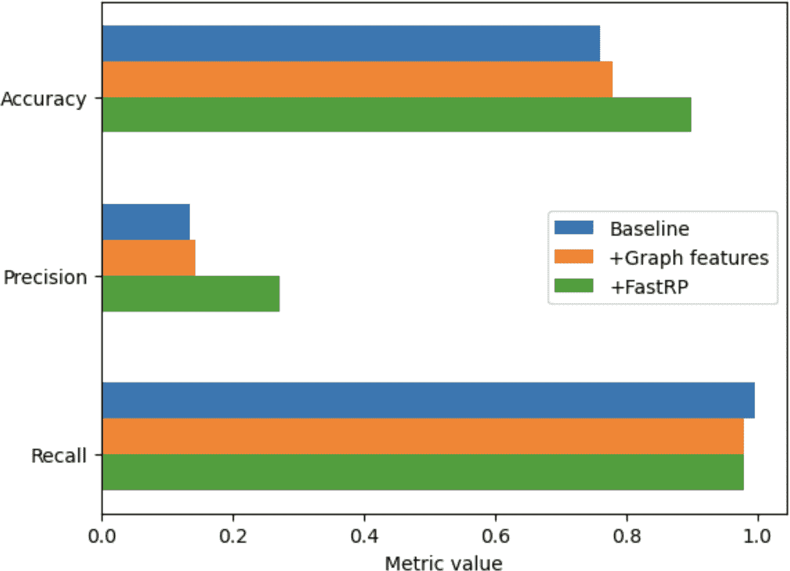

# 第十二章：改进诈骗检测

在早期的一章中，我们通过设计图查询来处理诈骗检测问题，这些查询寻找某些行为模式，这些模式可能是可疑的。本章将应用机器学习方法来改进诈骗检测。机器学习可以通过异常检测或者通过训练软件识别基于已知诈骗案例的方法来帮助我们。无论哪种情况，图结构化数据都是感知异常（异常）或提供数据特征（用于构建预测模型）的宝贵资产。没有绝对完美的方法，但机器学习通常可以检测到人类会忽略的模式和异常。传统方法只遵循专家规定的规则。通过在图上应用机器学习，我们可以检测到数据中未明确标记为诈骗案例的模式，这使其更适应于变化中的诈骗策略。

完成本章后，您应能够：

+   部署并使用 TigerGraph 机器学习工作台

+   使用基于图的特征来丰富数据集的特征向量，然后将带有图特征和不带图特征的模型精度进行比较。

+   为节点预测准备数据并训练图神经网络——在本例中是诈骗预测

# 目标：改进诈骗检测

诈骗是为了个人利益而使用欺骗手段。诈骗者可能会破坏系统及其用户，但最终目的是为了个人利益。欺诈活动的例子包括身份盗窃、虚假或夸大的保险索赔以及洗钱。诈骗检测是一组活动，旨在防止诈骗者成功地进行此类活动。在许多情况下，诈骗者希望从他们的努力中获取金钱。因此，诈骗检测是金融机构中常见的实践，但在持有有价值资产和财产的组织中，如保险、医疗、政府和主要零售组织中也很普遍。

诈骗是一个重大的商业风险，越来越难以应对。根据 LexisNexis 的一项研究，对于美国电子商务和零售部门的公司，每 1 美元的诈骗成本为公司带来 3.75 美元的损失，这是自 2019 年以来增加了 19.8%。[¹] 这些诈骗成本来自于因身份欺诈而产生的欺诈交易，其中包括对被盗身份或个人信息的误用。由于欺诈者可以操作的渠道越来越多，诈骗检测变得更加具有挑战性。例如，一个令人担忧的趋势是，通过移动智能手机进行的诈骗成本激增。在 COVID-19 大流行期间，消费者被推动进行更多的数字交易。许多这类交易依赖于智能手机，这为诈骗者提供了欺骗人们的新途径。

加密货币是欺诈者流行的交易媒介。与由政府或央行发行和监管的货币不同，加密货币是在账户持有人之间传递的数字资产，通常使用开放和分布式账本。这项技术让每个人都能参与交易，而无需通过中央机构进行身份识别，使洗钱、诈骗和盗窃更具吸引力。2021 年，犯罪分子窃取了价值 140 亿美元的加密货币，与 2020 年相比，与加密货币有关的犯罪案件增加了 79%。²

# 解决方案：利用关系建立更智能的模型

如果能够收集更多有关参与方和活动的事实，并将它们联系在一起，欺诈行为就能被发现。例如，假设我们发现异常的交易行为，比如在短时间内在账户之间转移大量资金。统计上，这种行为的一定比例是由于欺诈。然而，如果这些账户与中央机构制裁的实体有关联，那么欺诈案的可能性就变得更大。换句话说，在孤立使用交易数据时，我们只能看到案件的有限方面，但当我们将这些数据连接到另一个识别受制裁实体的数据集时，就可以考虑参与方与受制裁实体之间的路径长度。利用不同数据集之间的关系比各部分之和更重要。

图是发现这些关系和模式的绝佳方式。在早前的章节中，我们看到了如何使用 GSQL 查询来检测感兴趣的特定模式。然而，依赖调查员事先了解这些模式是有限的。一个更强大的方法是利用机器学习确定哪些模式表明欺诈。

大多数机器学习方法都分析向量或矩阵。每个向量是一个数字特征或*特征*列表，表示某种类型实体（如个人）。机器学习方法寻找这些特征之间的模式。数据科学家为系统提供了一组实际欺诈（和非欺诈）案例的代表样本，供机器学习系统分析。机器学习系统的任务是提取一个*模型*，表明：“当你有*这些*特征数值时，很可能发生欺诈。”

这种方法在打击欺诈行为方面是一个强大的工具，但并非完美。一个局限性是模型只能像提供的训练数据那样好。如果我们的特征向量只描述实体的直接特征，那么我们就会错过可能有价值的更深层次的基于图的关系。通过结合可通过图形分析获得的更深入见解，我们可以丰富输入或训练数据，从而产生更准确的机器学习模型。

在下面的实例中，我们将使用 TigerGraph 机器学习 Workbench 来帮助我们自动提取图特征，以丰富训练数据，并运行图神经网络（GNN）。

# 使用 TigerGraph 机器学习 Workbench

对于此集中练习，重点是机器学习，我们将使用 TigerGraph 机器学习 Workbench，简称 ML Workbench。基于开源的面向 Python 数据科学家的 JupyterLab IDE，并包含 TigerGraph 的 Python 库 pyTigerGraph，ML Workbench 可以简化开发包含图数据的机器学习流程。

## 设置 ML Workbench

首先，我们将在 TigerGraph 云服务上获取 ML Workbench 的一个实例，然后将其连接到数据库实例。

### 创建 TigerGraph 云 ML Bundle

设置 ML Workbench 的最简单方法是部署 TigerGraph 云 ML Bundle，它将 ML Workbench 添加为可用于 TigerGraph 云数据库实例的工具之一：

1.  使用 ML Bundle 需要支付少量费用，因此您需要在您的帐户上设置付款信息。

1.  在 TigerGraph 云帐户的集群屏幕上，单击创建集群按钮。

1.  在创建集群页面的顶部，选择右侧的 ML Bundle 选项。

1.  选择一个实例大小。此练习中可用的最小大小即可。

1.  我们将使用内置于 ML Workbench 中的数据集和查询，因此您在此处选择的用例并不重要。完成设置其他选项，然后在页面底部单击创建集群。

集群需要几分钟来配置。

### 创建并复制数据库凭据

ML Workbench 包括一系列强大的示例 Jupyter 笔记本，使用 pyTigerGraph 下载数据集并在您的集群中创建图表。但在此之前，它必须首先使用您提供的凭据访问 TigerGraph 数据库：

1.  您应该仍然在 TigerGraph 云的集群页面上。对于您刚创建的集群，请单击访问管理。

1.  单击数据库访问选项卡，然后单击添加数据库用户。

1.  输入用户名和密码。请务必记住这两者，因为稍后在 ML Workbench 中会用到它们。

1.  转到数据库访问旁边的角色管理选项卡。

1.  选择您的新用户旁边的复选框，将角色设置为全局设计师，然后单击保存。

1.  转到详细信息选项卡。复制域名，以 *i.tgcloud.io* 结尾。

### 将 ML Workbench 连接到您的图数据库

1.  转到此数据库实例的 GraphStudio。

1.  在右上角，单击工具菜单图标（一个 3 × 3 网格图标），然后选择 ML Workbench。

1.  在工作台打开后，在左侧面板中找到 *config.json* 并双击进行编辑。

1.  用您复制的域名值替换 `host` 的 URL 值。结果值仍应以 *https://* 开头，并以 *i.tgcloud.io* 结尾。

1.  更改 `username` 和 `password` 的值为您创建的新用户的用户名和密码。

虽然这个过程涉及几个步骤，但一旦您习惯了 TigerGraph Cloud 和 ML Workbench 的界面，将会变得很容易通过一个新的数据库用户为 ML Workbench 授予访问您的集群的权限。

## 使用 ML Workbench 和 Jupyter Notes

双击 ML Workbench 左侧面板的 *README.md*，如 图 12-1 所示，以获取有关 pyTigerGraph 和 ML Workbench 组件的一般结构和功能的概述。


###### 图 12-1\. ML Workbench 和 README 文件

您刚刚完成了设置部分。滚动到学习部分。在这里，您将看到教程和示例笔记本的列表，用于入门、图算法、GNN 和端到端应用程序。

此部分剩余内容介绍 *Datasets.ipynb* 笔记本，供不熟悉 Jupyter 的用户参考。如果您熟悉 Jupyter，您仍应快速浏览以验证数据库连接是否正常。

打开 *Datasets.ipynb* 笔记本，位于 *Basics* 文件夹中。这个文件是一个 Jupyter 笔记本，结合了 Python 代码片段和解释性评论。Python 代码块被编号为 [1]、[2] 等等。左侧的厚蓝条突出显示要执行的下一部分。单击顶部命令菜单上的右箭头将执行下一个代码块：

1.  点击箭头直到块 [1] 下载数据集 开始运行。

    当它正在运行时，方括号中的数字将变成一个星号 (*)。当完成时，星号将再次变成数字。注意任何输出中的信息或错误消息。

    ###### 注

    运行 ML Workbench 笔记本时，请确保您的数据库处于活动状态（非暂停状态）。如果它被暂停了，那么当您尝试运行一个代码块时，方括号将包含一个空格 [ ] 而不是一个星号 [*]。

1.  运行接下来的三个 Python 代码块：创建连接、导入数据和可视化模式。

如果您在创建连接时遇到问题，则可能没有正确设置 *config.json* 文件。导入数据步骤将需要几秒钟的时间。最后一步应该通过显示一个简单模式的图像来结束，其中包括 **`Paper`** 顶点和 **`Cite`** 边。回顾代码块，我们看到我们使用了两个 pyTigerGraph 库（`datasets` 和 `visualization`）以及一些类和方法：`TigerGraphConnection.ingestDataset` 和 `visualization.drawSchema`。

笔记本的其余部分导入另一个数据集，IMDB。这两个数据集被一些其他笔记本使用。

## 绘制模式和数据集

对于我们的图机器学习示例，现在我们将转向 *applications* 文件夹内的 `fraud_detection` 笔记本。这里使用的数据是以太坊平台上的交易数据；以太币是按市值计算第二大的加密货币。这些交易形成一个图形，其中顶点是平台上的钱包（即账户），边是账户之间的交易。数据集包含 32,168 个顶点和 84,088 条从发送账户到接收账户的有向边。数据集源自梁晨等人在“以太坊交易网络中的网络钓鱼骗局检测”[³] 中的研究，可从 XBlock[⁴] 获取。有向边告诉我们资金如何流动，这对于任何金融分析（包括欺诈检测）都非常重要。

每个账户顶点都有一个 `is_fraud` 参数。数据集中有 1,165 个被标记为欺诈的账户。这些账户被报告为参与网络钓鱼骗局的账户，这是加密货币社区中最常见的欺诈形式之一。

在加密经济中，典型的网络钓鱼骗局是指攻击者建立一个网站，承诺以小额投资获得巨大回报，通常宣称受害者早早参与了一个会带来巨大收益的计划。然而，这些承诺从未兑现，最初的投资永远丧失。

由于这些骗子在短时间内接受许多小额交易，然后将资金以较大笔移至其他账户，他们的交易活动通常与典型合法加密货币用户的活动模式不匹配。数据集中的顶点具有七个参数，详细说明见表 12-1，对应陈等人描述的特征。

重要的是，加载数据集时，这些图形特征实际上并不包含在内。数据集只包含顶点（账户）的 ID 和 `is_fraud` 标志，以及边（交易）上的金额和时间戳。在教程演示过程中，我们使用给定的信息生成图形特征。

表 12-1\. 以太坊交易数据集的基于图形的特征

| 特征 | 描述 |
| --- | --- |
| FT1 | 入度，或账户顶点的入向交易数 |
| FT2 | 出度，或账户顶点的外向交易数 |
| FT3 | 度数，或涉及账户的总交易数 |
| FT4 | 入度，即所有入向交易的总金额 |
| FT5 | 出度，即所有外向交易的总金额 |
| FT6 | 强度，或涉及账户的所有交易的总金额 |
| FT7 | 邻居数量 |
| FT8 | 反向交易频率：账户第一笔和最后一笔交易之间的时间间隔除以 FT3 |

欺诈账户往往具有特征 4、5 和 6 的较高值，而特征 8 的较小值。网络钓鱼攻击者通过许多较小的交易总体上窃取了大量资金。

FT7（邻居数量）不同于 FT3（交易数量），因为一个邻居可能负责多个交易。当我们将数据加载到 TigerGraph 时，我们将一对账户之间的所有交易合并为单个边缘，因此我们不使用 FT7。尽管如此简化，我们仍然取得了良好的结果，很快将进行演示。在类似数据集中的其他特征可能会进一步改善性能。虽然银行用于欺诈检测的确切图特征既依赖于数据又是商业机密，但普遍认为像 PageRank 这样的中心性算法和像 Louvain 这样的社区检测算法通常是有帮助的。

虽然这些指标提供了对网络钓鱼攻击行为的快速直观查看，但传统的机器学习方法和 GNN 能够找出所有特征之间更精确的关系，以区分用于网络钓鱼和合法用途的账户。在本章中，我们将比较这两种方法的方法和结果。

检查`fraud_detection`笔记本中的第一个代码块，确保它具有您在*config.json*中设置的相同连接和凭据信息。运行`fraud_detection`笔记本的数据库准备步骤，以创建图模式并加载数据。

## 图特征工程

您现在应该在标题为“图特征工程”的部分。正如笔记本上所说，我们使用一个名为 pyTigerGraph 的`featurizer`对象来生成特征：两个来自内置算法（PageRank 和介数中心性）的特征，以及两个来自我们自己的 GSQL 查询。Featurizer 提供了一个高级简化的过程，用于生成和存储基于图的特征。GDS 库中的算法对 Texturizer 自动可用；用户只需指定一些参数。

我们称我们的对象为`f`。运行代码块 4 以创建它：

```
[4] :     f = conn.gds.featurizer()
```

在 PageRank 部分，我们使用预安装的 Featurizer 算法集中包含的`tg_pagerank`算法。PageRank 衡量了图中顶点的影响力。如果一个顶点被许多其他顶点指向，而这些顶点本身又被许多顶点指向，它将获得高的 PageRank 分数。每种算法都使用一组输入参数。您可以查看[TigerGraph GDS Library](https://oreil.ly/2TAhH)的文档，了解特定算法的参数。在 PageRank 代码块中，我们指定一个 Python 字典，包含要传递给 PageRank 的参数及其值。由于此图架构非常简单，顶点和边类型的选择由系统决定。我们将排名值存储在每个顶点的`pagerank`属性下，然后返回排名值最高的五个顶点。还有一个类似的代码块生成介数中心性作为顶点特征。介数中心性是一个较慢的算法，请耐心等待。

接下来，我们基于其度（FT3 在特征图表中）和金额（FT6，也称为强度）计算交易的特征。这些使用可以在笔记本的*GraphML/applications/fraud_detection/gsql*文件夹中找到的自定义查询。运行“Degree Features”和“Amount Features”下的代码块。每个代码块大约需要 10 到 20 秒。

查看查询以检查您对 GSQL 的理解。`amounts`查询为图中的每个顶点设置四个顶点属性：最小接收量、总接收量、最小发送量和总发送量。`degrees`查询更简单，只检查接收到的交易数量（入度）和发送到其他顶点的数量（出度）。

现在，我们在每个顶点上有一组与图相关的特征，包括它们是否为欺诈账户的真实情况，我们可以使用传统的监督学习方法尝试预测欺诈。

运行下一个代码块以获取快速 RP⁵嵌入。[FastRP](https://oreil.ly/PgE0O)是一种基于随机投影（RP）原理进行降维的顶点嵌入算法。对于像这样的相对小数据集，它提供了非常好的性能，而且资源成本合理。

运行 Check Labels 块以检查数据集中欺诈和正常账户的数量。您应该得到关于标记账户的以下统计信息：

```
Fraud accounts: 1165 (3.62%%)
Normal accounts: 31003 (96.38%%)
```

在 Train/Test Split 代码块中，我们使用`vertexSplitter`函数将顶点分为 80%的训练数据和 20%的验证数据。笔记本中包含的`vertexSplitter`函数为每个顶点分配两个布尔特征`is_training`和`is_validation`，然后随机分配`true`或`false`值以创建 80-20 的分割。

接下来，我们创建两个顶点加载器，将所有顶点批量加载到机器学习服务器上。我们传递一个包含的属性列表；这些属性都是我们最近几步创建的，但不包括 `is_fraud` 标签。我们显示每组中的前五个顶点，以确保它们已正确加载。

## 使用图特征训练传统模型

现在我们准备训练我们的欺诈检测模型。我们将使用 XGBoost，这是一种用于表格数据的流行分类算法。我们从 `xgboost` 库导入 `XGBClassifier` 类，并创建一个名为 `tree_model` 的分类器实例，如“创建 xgboost 模型”代码块所示。

接下来，我们使用三组不同的特征训练 XGBoost 模型，以便比较它们的结果。对于每种情况，我们创建一个列表，其中包含所选的图特征，但不包括 `is_fraud`。然后我们使用 `tree_model.fit()` 来说，“使用我们的训练数据的特征，尝试预测属性 `is_fraud`。”训练每个模型后，另一个代码块使用 `pyTigerGraph` 中的 `Accuracy`、`BinaryPrecision` 和 `BinaryRecall` 模块评估每个模型。

运行第一个案例，仅使用非图特征。您的模型应该达到大约 75%的准确率，12%的精确度和 100%的召回率。请记住，大约 3.6%的交易是欺诈的。100%的召回率意味着我们的模型将捕捉到所有真实的欺诈案例。由于总体准确率为 75%，这意味着模型错误地将大约 25%的正常账户分类为欺诈者。

运行下一个案例，现在包括 PageRank 和介数中心性。您应该看到准确率和精确度提高了几个百分点，而召回率降至约 98%。最后，运行第三个案例，将 FastRP 嵌入添加到特征集中。您应该看到准确率和精确度显著提高。图 12-2 比较了三个案例的预测性能。



###### 图 12-2\. 带有图特征和图嵌入的预测性能（请查看此图的更大版本：[`oreil.ly/gpam1202`](https://oreil.ly/gpam1202)）

运行下一个单元格，在“解释模型”部分下创建一个类似图 12-3 的图表，显示 Case 2 的特征重要性，包括图算法，但不包括我们的训练中的图嵌入。注意，`pagerank` 是预测欺诈的第二重要特征，仅次于 `send_amount`。


###### 图 12-3\. XGBoost 模型中图算法的特征重要性（请查看此图的更大版本：[`oreil.ly/gpam1203`](https://oreil.ly/gpam1203)）

接下来，在“解释模型”下方运行后续单元，以查看嵌入式特征的重要性。在这里，嵌入式的所有维度被汇总为一个特征重要性分数。图 12-4 显示，嵌入式对模型的性能贡献很大。


###### 图 12-4\. 使用 FastRP 嵌入式的 XGBoost 模型特征重要性（请查看此图的更大版本：[`oreil.ly/gpam1204`](https://oreil.ly/gpam1204)）

## 使用图神经网络

在下一节中，我们将设置一个图神经网络，试图更精确地预测欺诈账户。

在 GNN 部分的第一个块中，我们设置了一些超参数。我们已经选择了产生高度准确结果的良好超参数值。然而，微调超参数是机器学习的一门艺术，因此在完成本节后，请回到此阶段并尝试调整这些值。

就像在上一节中一样，我们设置了两个加载器来将数据加载到两个大块中：训练和验证。然而，这些加载器使用的是 `neighborLoader` 方法，而不是 `vertexLoader`。在 GNN 中，每个顶点都受其相邻顶点的影响。因此，当我们加载数据时，我们不仅加载单个顶点，还加载围绕每个顶点中心的邻域。正如您所看到的，这些加载器的语法大致等同于 xgboost 部分的加载器，尽管这些加载器还包含一些超参数。

现在我们的数据已经准备好了，我们可以创建和训练 GNN。此笔记本使用了 pyTorch Geometric GDS 库，它提供了几个 GNN 模型。ML 工作台足够灵活，可以使用其中任何一个；它还假定了 DGL 和 TensorFlow 图机器学习库。一些更常见的模型已经内置到 pyTigerGraph 中，以便更方便地使用。

我们将使用图注意力网络（在 pyTorch Geometric 库中的 `GAT`），它结合了注意力模型的细粒度建模和图邻域卷积。我们将网络运行 10 个时期。

这比非图形 XGBoost 模型稍微花费更多时间。部分原因是神经网络与决策树模型相比的复杂性。在免费的云实例层中，每个时期大约需要五秒钟。企业级数据集通常在更强大的硬件上运行，利用 GPU 大大加快了进程，远远超过使用 CPU 的可能性。

然而，额外的等待是值得的。当最后一个时期完成时，请查看返回的值：我们达到了超过 90% 的准确率！

运行下面的几个单元格，可以实时查看随时间的训练情况。在解释模型部分，我们随机选择一个可疑顶点来查看其网络情况。由于我们没有完全准确的模型，这个单元格有时可能显示连接很少或没有连接的顶点。然而，如果多次运行这个单元格，你可能会看到更接近图 12-5 的顶点邻域。


###### 图 12-5\. 针对顶点 311 的预测的视觉解释（请在 [`oreil.ly/gpam1205`](https://oreil.ly/gpam1205) 查看更大版本的图像）

在这种情况下，该顶点从其他顶点接收大量交易，然后向更多顶点进行大额交易。如果这确实是一个诈骗者，他们可能会接收许多支付，然后将资金转移到另一组他们也能访问的账户。

运行最后的代码块后，我们得到了另一个关于特征重要性的图表，类似于 [图 12-6](https://oreil.ly/gpam1206)。我们可以看到，在我们更准确的 GNN 模型中，重要的特征往往与 XGBoost 模型中被识别为重要的特征不同。在这里，与欺诈检测相关的特征中，PageRank 并不像收到的金额、发送的金额和收到的交易数那样重要。然而，请记住，GNN 模型的邻域卷积已经考虑了关系的影响，因此像 PageRank 这样的图特征可能是多余的。


###### 图 12-6\. GNN 模型预测顶点 311 欺诈特征的重要性（请在 [`oreil.ly/gpam1206`](https://oreil.ly/gpam1206) 查看更大版本的图像）

最后，运行最后的代码块后，我们得到了 [图 12-7](https://oreil.ly/gpam1207)，显示了三个模型的综合性能。在这里，我们看到我们的 GNN 在准确率和精度上甚至比 XGBoost 和嵌入都要好。GNN 达到的召回率比其他两个模型低。然而，它仍然很好，特别是与没有嵌入的 XGBoost 相比。


###### 图 12-7\. XGBoost 对比 XGBoost + FastRP 对比 GNN 的性能（请在 [`oreil.ly/gpam1207`](https://oreil.ly/gpam1207) 查看更大版本的图像）

# 章节总结

在本章中，我们研究了一个特定的机器学习问题，并比较了三种增强图方法来解决它。我们的平台是 TigerGraph ML Workbench，包括可在 TigerGraph Cloud 实例上使用的示例笔记本和数据集。

我们首先使用了传统的决策树机器学习库 XGBoost，通过包含 PageRank 和度等基于图的特征的数据，将以太坊交易数据集分类为普通账户和涉嫌欺诈的账户。在这里，图数据，图分析甚至图机器学习都为数据准备阶段做出了贡献。

接着，我们使用了 GNN 进行相同的预测，在训练阶段考虑了图关系，结果比 XGBoost 能实现的模型具有更高的精度。

# 与您建立联系

我们希望我们的书能与您建立联系，无论是信息的形式，洞察力，甚至一些灵感。我们热爱图形和图形分析，因此我们希望这种热爱能够显现出来。我们的使命是帮助您将数据视为连接实体，从连接数据的视角学习数据搜索和分析，并通过使用案例起始套件开始开发解决方案以完成您自己的任务。

从我们作为数据分析师，作家和教育工作者的经验来看，我们知道并非一切在第一次就能讲清楚。通过使用 TigerGraph 的入门套件或其他教程进行一些实际操作是帮助您串联思路并亲自了解下一步可能是什么的最佳方式。此外，这个领域仍在快速增长和发展，正如 TigerGraph 产品一样。我们将在[*https://github.com/TigerGraph-DevLabs/Book-graph-powered-analytics*](https://github.com/TigerGraph-DevLabs/Book-graph-powered-analytics)上发布书籍、补充材料和常见问题的更正和更新。

我们很乐意收到您的反馈。您可以通过 gpaml.book@gmail.com 联系我们。

谢谢您，祝您探索愉快！

¹ “发现欺诈的真正成本”，LexisNexis，访问于 2023 年 5 月 29 日，[*https://risk.lexisnexis.com/insights-resources/research/us-ca-true-cost-of-fraud-study*](https://risk.lexisnexis.com/insights-resources/research/us-ca-true-cost-of-fraud-study)。

² 麦肯齐·希加洛斯，“加密骗子在 2021 年创下纪录，窃取了 140 亿美元”，CNBC，2022 年 1 月 6 日，[*https://www.cnbc.com/2022/01/06/crypto-scammers-took-a-record-14-billion-in-2021-chainalysis.html*](https://www.cnbc.com/2022/01/06/crypto-scammers-took-a-record-14-billion-in-2021-chainalysis.html)。

³ 李昂·陈等，“以太坊交易网络中的网络钓鱼检测”，《ACM 互联网技术期刊》第 21 卷，第 1 期（2021 年 2 月）：1–16，doi: 10.1145/3398071。

⁴ 李昂·陈等，“以太坊网络中的网络钓鱼交易”，XBlock，访问于 2023 年 5 月 29 日，[*https://xblock.pro/#/dataset/13*](https://xblock.pro/#/dataset/13)。

⁵ 由于图机器学习是一个快速发展的领域，笔记本中的算法可能在您获取它时已经更新。
