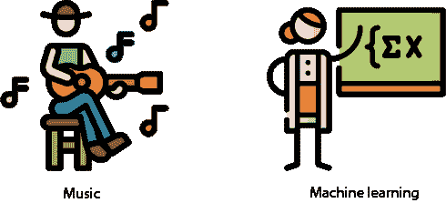

# 前言

## 前言

你认为机器学习复杂且难以掌握吗？不是！读这本书吧！

路易斯·塞拉诺在用简单的英语解释事物方面是一位大师。我第一次遇见他是在他在 Udacity 教授机器学习时。他让我们的学生感觉到所有机器学习就像加减数字一样简单。最重要的是，他让材料变得有趣。他为 Udacity 制作的视频非常吸引人，并且仍然是该平台上最受欢迎的内容之一。

这本书更好！即使是最害怕的人也会喜欢书中呈现的材料，因为塞拉诺揭开了机器学习界一些最被保守的秘密。他一步一步地引导你了解该领域每个关键算法和技术。即使你不喜欢数学，你也可以成为机器学习的爱好者。塞拉诺最大限度地减少了我们这些硬核学者所喜爱的数学“kauderwelsch”，而是依靠直觉和实用的解释。

这本书的真正目标是赋予你掌握这些方法的能力。因此，书中充满了有趣的练习，让你有机会亲自尝试那些神秘（而现在已被揭秘）的技术。你更愿意沉迷于最新的 Netflix 电视剧，还是愿意花时间将机器学习应用于计算机视觉和自然语言理解的问题？如果是后者，这本书就是为你准备的。我无法表达用最新的机器学习技术玩耍是多么有趣，看到你的电脑在你的监督下施展魔法是多么令人兴奋。

由于机器学习是过去几年涌现的最热门的技术之一，你现在将能够利用你新获得的能力在工作中发挥作用。几年前，《纽约时报》宣称世界上只有 10,000 名机器学习专家，有数百万个空缺职位。这种情况至今仍然如此！通过这本书的学习，你将成为一名专业的机器学习工程师。你将保证拥有当今世界上最受欢迎的技能之一。

通过这本书，路易斯·塞拉诺出色地解释了复杂的算法，并使它们几乎对每个人来说都易于理解。但他并没有妥协深度。相反，他通过一系列启发性的项目和练习，专注于通过赋予读者能力。从这个意义上说，这不是一个被动的阅读。要充分利用这本书，你必须付出努力。在 Udacity，我们有一句话：你看别人锻炼是不会减肥的。要真正理解机器学习，你必须学会将其应用于现实世界的问题。如果你准备好了，这本书就是你的——无论你是谁！

西班牙语：Sebastian Thrun，博士

Udacity 创始人

斯坦福大学客座教授

## 前言

未来已经到来，而这个未来的名字就是机器学习。它在几乎每个行业中都有应用，从医学到银行，从自动驾驶汽车到订购我们的咖啡，对机器学习的兴趣每天都在迅速增长。但机器学习究竟是什么呢？

大多数时候，当我阅读机器学习书籍或参加机器学习讲座时，我看到的要么是一片复杂的公式海洋，要么是一片代码的海洋。长期以来，我以为这就是机器学习，而且机器学习似乎只属于那些对数学和计算机科学都有扎实知识的人。

然而，我开始将机器学习与其他学科进行比较，比如音乐。音乐理论和实践是复杂的学科。但当我们想到音乐时，我们不会想到乐谱和音阶；我们会想到歌曲和旋律。然后我开始思考，机器学习是否也是如此？它真的只是一堆公式和代码，还是它背后也有一个旋律？

**图 FM.1** 音乐不仅仅是音阶和音符。在所有技术细节的背后，都有一个旋律。同样，机器学习不仅仅是公式和代码。也有一个旋律，在这本书中，我们就是唱出这个旋律。

带着这样的想法，我开始了理解机器学习旋律的旅程。我盯着公式和代码看了几个月。我画了许多图表。我在餐巾纸上乱涂乱画，并向我的家人、朋友和同事展示。我在大小不同的数据集上训练模型。我进行了实验。过了一段时间，我开始聆听机器学习的旋律。突然之间，一些非常漂亮的画面开始在脑海中形成。我开始编写与所有机器学习概念相符的故事。旋律、画面、故事——这就是我享受学习任何主题的方式，而这本书中分享的就是这些旋律、这些画面和这些故事。我的目标是让每个人都能完全理解机器学习，这本书就是这一旅程中的一步——一个我很高兴你能和我一起迈出的步伐！

## 致谢

首先和最重要的是，我要感谢我的编辑，玛琳娜·迈克尔斯，没有她这本书就不可能存在。她的组织、细致的编辑和宝贵的意见帮助塑造了《掌握机器学习》。我要感谢玛兰·巴塞、伯特·贝茨和曼宁团队的其他成员，感谢他们的支持、专业精神、好主意和耐心。我要感谢我的技术校对员，雪莉·亚普和卡尔滕·斯特罗贝克；我的技术发展编辑，克里斯·阿蒂；以及那些给予我宝贵反馈和纠正我许多错误的书评人。我要感谢生产编辑凯里·黑尔斯，校对员帕梅拉·亨特，图形编辑詹妮弗·休尔，校对员贾森·埃弗雷特，以及整个生产团队，感谢他们使这本书成为现实。我要感谢劳拉·蒙特亚亚，她在包容性语言和 AI 伦理方面给予了我帮助，感谢迭戈·赫南德斯，他为代码添加了宝贵的贡献，以及克里斯蒂安·皮克翁，他在仓库和软件包的技术方面给予了巨大的帮助。

我感谢塞巴斯蒂安·特鲁恩，他为民主化教育做出了卓越的工作。优达学城是我第一次有机会向全世界发声教授的地方，我要感谢我在那里遇到的优秀同事和学生。我要感谢亚历杭德罗·佩尔多莫和 Zapata Computing 团队，是他们带我进入了量子机器学习的世界。还要感谢我在谷歌和苹果遇到的许多优秀领导和同事，他们在我的职业生涯中发挥了关键作用。特别感谢罗伯托·奇帕尼和 Paper Inc.团队，让我成为他们大家庭的一员，并感谢他们在教育社区中所做的出色工作。

我要感谢我的许多学术导师，他们塑造了我的职业生涯和我的思维方式：玛丽·法尔克·德·洛萨达和她在哥伦比亚数学奥林匹克团队的工作，我在那里第一次爱上了数学，有机会遇到伟大的导师，并建立了持续一生的友谊；我的博士导师，谢尔盖·福明，他在我的数学教育和我的教学方法上发挥了关键作用；我的硕士导师，伊恩·古尔登；南特尔和弗朗索瓦·贝热龙、布鲁斯·萨甘和费德里科·阿尔迪拉，以及我有机会与之共事的许多教授和同事，特别是在滑铁卢大学、密歇根大学、蒙特利尔的魁北克大学和约克大学；最后，我要感谢理查德·霍西诺和 Quest 大学团队以及学生，他们帮助我测试和改进这本书中的材料。

向所有书评人致谢：阿尔·佩泽夫斯基、阿尔伯特·诺古斯·萨巴特、阿米特·兰巴、比尔·米切尔、博尔科·久尔科维奇、达尼埃莱·安德烈斯、埃里克·萨珀、郝刘、杰里米·R·洛斯切德、胡安·加布里埃尔·博诺、凯·恩格尔哈特、克日什托夫·卡米切克、马修·马戈利斯、马蒂亚斯·布施、迈克尔·布莱特、米拉德·达格多尼、波利娜·凯塞尔曼、托尼·霍尔德罗伊德和瓦莱丽·帕哈姆-汤普森，你们的建议帮助使这本书变得更好。

我要感谢我的妻子，卡罗琳娜·拉索，她在这一过程中的每一步都给予了我爱和关怀；我的母亲，塞西莉亚·埃雷拉，她用爱抚养我长大，并总是鼓励我追随我的激情；我的奶奶，玛鲁亚，她是我从天堂俯瞰我的天使；我的挚友，亚历杭德罗·莫拉莱斯，他总是支持我；以及那些照亮我人生道路、丰富我生活的朋友们，我衷心感谢你们，并用我全部的心爱你们。

YouTube、博客、播客和社交媒体给了我机会与世界各地的成千上万的杰出灵魂建立联系。好奇心旺盛、对学习充满无尽热情的人，慷慨分享知识和见解的同行教育工作者，组成一个每天激励我并给我继续教学和学习能量的电子部落。对于那些与世界分享知识或每天努力学习的人，我感谢你们。

我要感谢任何努力使这个世界变得更加公平和平静的人。对于那些为正义、和平、环境和地球上每个人的平等机会而奋斗的人，无论他们的种族、性别、出生地、条件还是选择，我由衷地感谢你们。

最后，但同样重要的是，本书献给你，读者。你选择了学习的道路，提升的道路，在不适中感到舒适的道路，这是值得赞扬的。我希望这本书是你追随激情、创造更美好世界道路上的一个积极步骤。

## 关于本书

本书教你两件事：机器学习模型及其使用方法。机器学习模型有多种类型。其中一些返回确定性答案，例如是或否，而另一些则返回概率答案。一些使用方程式；另一些使用条件语句。它们共同的一点是，它们都会返回一个答案或预测。包含返回预测的模型的机器学习分支被称为**预测机器学习**。这正是本书所关注的机器学习类型。

本书组织结构：路线图

### 章节类型

本书有两种类型的章节。其中大多数（第 3、5、6、8、9、10、11 和 12 章）每章包含一种机器学习模型。每章中对应的研究都相当详细，包括例子、公式、代码和练习题供你解决。其他章节（第 4、7 和 13 章）包含用于训练、评估和改进机器学习模型的有用技术。特别是，第十三章包含一个基于真实数据集的端到端示例，你将能够应用在前几章中获得的所有知识。

### 推荐学习路径

你可以使用两种方式来使用这本书。我推荐的方式是按顺序逐章阅读，因为你会发现学习模型和学习训练这些模型的技巧之间的交替是很有成效的。然而，另一种学习路径是首先学习所有模型（第 3、5、6、8、9、10、11 和 12 章），然后学习训练这些模型的技巧（第 4、7 和 13 章）。当然，因为我们都以不同的方式学习，你也可以创建自己的学习路径！

### 附录

这本书包含三个附录。附录 A 包含了每章练习的解答。附录 B 包含了一些有用的正式数学推导，但比本书的其他部分更技术性。附录 C 包含了一些建议的参考资料和资源，如果你想要进一步加深理解的话。

### 要求和学习目标

本书为你提供了一个预测机器学习的坚实基础框架。为了最大限度地利用本书，你应该有一个视觉思维和良好的基础数学理解，例如直线图、方程和基本概率。如果你知道如何编码，特别是 Python，这将很有帮助（尽管不是必需的），因为本书中你将有机会在真实数据集上实现和应用多个模型。阅读完本书后，你将能够做到以下几件事情：

+   描述预测机器学习中最重要的模型及其工作原理，包括线性回归和逻辑回归、朴素贝叶斯、决策树、神经网络、支持向量机和集成方法。

+   识别它们的优点和缺点以及它们使用的参数。

+   识别这些模型在现实世界中的应用，并制定将机器学习应用于你想要解决的任何特定问题的潜在方法。

+   学习如何优化这些模型，比较它们，并改进它们，以构建我们能够构建的最好的机器学习模型。

+   编写模型代码，无论是手动编写还是使用现有的包，并使用它们在真实数据集上进行预测。

如果你有一个特定的数据集或问题在心中，我邀请你思考如何将本书中学到的知识应用到它上面，并以此作为起点来实施和实验你自己的模型。

我非常兴奋能够与你一起开始这段旅程，我希望你也会同样兴奋！

### 其他资源

本书是自包含的。这意味着除了前面描述的要求之外，我们需要的每个概念都在书中介绍。然而，我包含了许多参考文献，如果你想要更深入地理解这些概念或想要探索更广泛的话题，我建议你查阅这些参考文献。这些参考文献都在附录 C 中，也可以通过这个链接访问：[`serrano.academy/grokking-machine-learning`](http://serrano.academy/grokking-machine-learning)。

尤其是这本书的材料中包含了我的几项资源。在我的个人页面[`serrano.academy`](http://serrano.academy)上，你可以找到很多以视频、帖子、代码等形式存在的材料。这些视频也发布在我的 YouTube 频道[www.youtube.com/c/LuisSerrano](https://www.youtube.com/c/LuisSerrano)上，我推荐你查看。实际上，这本书的大部分章节都有相应的视频，我建议你在阅读章节时观看。

### 我们将编写代码

在这本书中，我们将用 Python 编写代码。然而，如果你的计划是在不编写代码的情况下学习概念，你仍然可以忽略代码而跟随本书。不过，我建议你至少浏览一下代码，以便熟悉它。

这本书附带了一个代码仓库，大多数章节都会给你机会从头开始编写算法或使用一些非常流行的 Python 包来构建适合给定数据集的模型。GitHub 仓库是[www.github.com/luisguiserrano/manning](https://www.github.com/luisguiserrano/manning)，我在书中链接了相应的笔记本。在仓库的 README 中，你可以找到成功运行代码所需的安装包说明。

我们在这本书中使用的主要 Python 包如下：

+   **NumPy**：用于存储数组并执行复杂的数学计算

+   **Pandas**：用于存储、操作和分析大型数据集

+   **Matplotlib**：用于绘图

+   **Turi Create**：用于存储、操作和训练机器学习模型

+   **Scikit-Learn**：用于训练机器学习模型

+   **Keras (TensorFlow)**：用于训练神经网络

关于代码

这本书包含了许多与普通文本并行的源代码示例。在两种情况下，源代码都以`固定宽度字体`如这样`this`格式化，以将其与普通文本区分开来。有时代码也会**`加粗`**以突出显示与章节中先前步骤不同的代码，例如当新功能添加到现有代码行时。

在许多情况下，原始源代码已经被重新格式化；我们添加了换行并重新调整了缩进，以适应书中的可用页面空间。此外，当代码在文本中描述时，源代码中的注释通常也会从列表中移除。代码注释伴随着许多列表，突出显示重要概念。

这本书中的示例代码可以在 Manning 网站([`www.manning.com/books/grokking-machine-learning`](https://www.manning.com/books/grokking-machine-learning))和 GitHub([www.github.com/luisguiserrano/manning](https://www.github.com/luisguiserrano/manning))上下载。

liveBook 讨论论坛

购买《Grokking Machine Learning》包括免费访问由 Manning Publications 运营的私人网络论坛，您可以在论坛中就本书发表评论、提出技术问题，并从作者和其他用户那里获得帮助。要访问论坛，请访问 [`livebook.manning.com/#!/book/grokking-machine-learning/discussion`](https://livebook.manning.com/#!/book/grokking-machine-learning/discussion)。您还可以在 [`livebook.manning.com/#!/discussion`](https://livebook.manning.com/#!/discussion) 了解更多关于 Manning 的论坛和行为准则。

Manning 对读者的承诺是提供一个场所，让读者之间以及读者与作者之间可以进行有意义的对话。这并不是对作者参与特定数量活动的承诺，作者对论坛的贡献是自愿的（且未付费）。我们建议您尝试向作者提出一些挑战性的问题，以免他的兴趣转移！只要本书有售，论坛和先前讨论的存档将可通过出版社的网站访问。

## 关于作者

|  | **路易斯·G·塞拉诺**是 Zapata Computing 量子人工智能领域的科研人员。他之前曾在谷歌担任机器学习工程师，在苹果公司担任首席人工智能教育者，并在 Udacity 担任人工智能和数据科学内容总监。路易斯在密歇根大学获得数学博士学位，在滑铁卢大学获得数学学士和硕士学位，并在加拿大魁北克省蒙特利尔大学的组合与数学信息实验室担任博士后研究员。路易斯维护了一个关于机器学习的流行 YouTube 频道，拥有超过 85,000 名订阅者，观看次数超过 400 万次，并且是人工智能和数据科学会议的常客演讲者。 |
| --- | --- |
