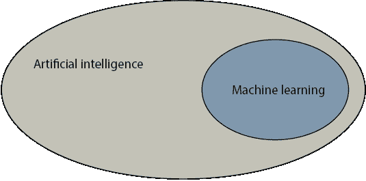
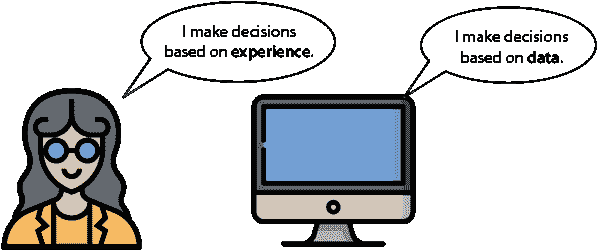
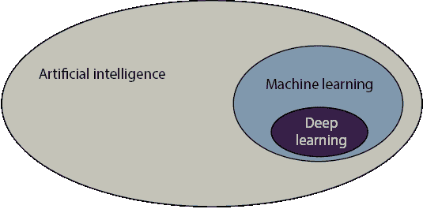
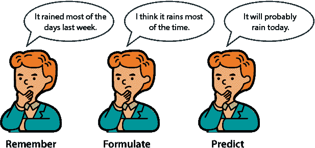
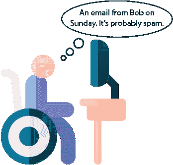
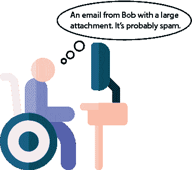
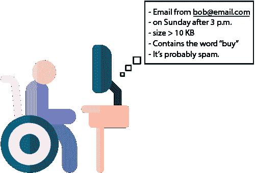

# 1 什么是机器学习？它只是由计算机完成的常识

本章内容

+   什么是机器学习

+   机器学习难吗？（剧透：不难）

+   我们在这本书中学到了什么

+   人工智能是什么，它与机器学习有何不同

+   人类是如何思考的，我们如何将这些想法注入到机器中

+   一些现实生活中的基本机器学习实例

我非常高兴能与你一起踏上学习之旅！

欢迎来到这本书！我非常高兴能与你一起加入理解机器学习的旅程。从高层次来看，机器学习是一个计算机以类似于人类的方式解决问题和做出决策的过程。

在这本书中，我想给你传达一个信息：机器学习很简单！你不需要有深厚的数学和编程背景就能理解它。你确实需要一些基本的数学知识，但主要成分是常识、良好的视觉直觉，以及将学习这些方法应用于你热爱的任何事物并希望在世界中做出改进的愿望。我写这本书时非常开心，因为我喜欢增长对这个主题的理解，我希望你在阅读它并深入研究机器学习时也能感到兴奋！

机器学习无处不在

机器学习无处不在。这句话似乎每天都在变得更加真实。我很难想象生活中有任何方面不能通过机器学习以某种方式得到改善。对于任何需要重复操作或查看数据并得出结论的工作，机器学习都能提供帮助。在过去的几年里，由于计算能力的提升和数据收集的普遍性，机器学习经历了巨大的增长。仅举几个机器学习的应用实例：推荐系统、图像识别、文本处理、自动驾驶汽车、垃圾邮件识别、医疗诊断……这个列表还在继续。也许你有一个目标或一个你想要产生影响（或者你可能已经做到了！）的领域！很可能，机器学习可以应用于那个领域——也许这正是你来到这本书的原因。让我们一起来看看吧！

## 我需要深厚的数学和编程背景来理解机器学习吗？

No. 机器学习需要想象力、创造力和视觉思维。机器学习是关于捕捉世界中出现模式，并使用这些模式来对未来进行预测。如果你喜欢寻找模式和发现相关性，那么你可以从事机器学习。如果我要告诉你我已经戒烟，并且开始多吃蔬菜和锻炼，你预测我的健康状况在一年后会发生什么？或许会变好。如果我要告诉你我已经从穿红色毛衣换成了绿色毛衣，你预测我的健康状况在一年后会发生什么？或许变化不会很大（可能会，但不是基于你提供的信息）。发现这些相关性和模式正是机器学习的内容。唯一的区别在于，在机器学习中，我们将公式和数字附加到这些模式上，以便让计算机发现它们。

进行机器学习需要一些数学和编码知识，但你不需要成为专家。如果你在任何一个领域或两个领域都是专家，你的技能肯定会得到回报。但如果你不是，你仍然可以学习机器学习，并在学习过程中掌握数学和编码。在这本书中，我们会在需要的时候介绍我们需要的所有数学概念。至于编码，你在机器学习中需要编写多少代码取决于你。机器学习的工作范围从整天编码的人到完全不编码的人都有。许多软件包、API 和工具帮助我们用最少的编码来进行机器学习。每天，机器学习对世界上每个人来说都更加容易获得，我很高兴你加入了这趟列车！

将公式和代码视为一种语言时，它们变得很有趣

在大多数机器学习书籍中，算法都是通过公式、导数等方式进行数学解释的。虽然这些方法的精确描述在实践中效果很好，但一个单独的公式可能比说明性更强。然而，就像音乐乐谱一样，一个公式可能隐藏在混乱背后的美丽旋律。例如，让我们看看这个公式：Σ[i]⁴[=1]*i*。乍一看，它看起来很丑，但它代表一个非常简单的求和，即 1 + 2 + 3 + 4。那么关于Σ[i]^n[=1]*w*[i]呢？这仅仅是许多(*n*)个数的总和。但当我想到许多数的总和时，我更愿意想象像 3 + 2 + 4 + 27 这样的东西，而不是 1 Σ[i]^n[=1]*w*[i]。每次我看到一个公式，我立刻就得想象一个它的小例子，然后我的脑海中画面就更加清晰了。当我看到像*P*(*A*|*B*)这样的东西时，我脑海中会想什么？那是一个条件概率，所以我想到一些类似“在另一个事件 B 已经发生的情况下，事件 A 发生的概率”的句子。例如，如果 A 代表今天的雨，B 代表居住在亚马逊雨林，那么公式*P*(*A*|*B*) = 0.8 就简单地意味着“在我们居住在亚马逊雨林的情况下，今天下雨的概率是 80%。”

如果你确实喜欢公式，不用担心——这本书中仍然有它们。但它们将出现在说明它们的示例之后。

同样的现象也发生在代码上。如果我们从远处看代码，它可能看起来很复杂，我们可能很难想象有人能把所有这些内容都装进脑子里。然而，代码只是一系列步骤，通常每个步骤都很简单。在这本书中，我们将编写代码，但我们会将其分解成简单的步骤，并且每个步骤都会通过示例或插图进行仔细解释。在前几章中，我们将从头开始编写我们的模型代码，以了解它们是如何工作的。然而，在后面的章节中，模型会变得更加复杂。对于这些，我们将使用 Scikit-Learn、Turi Create 或 Keras 等包，这些包已经以清晰和强大的方式实现了大多数机器学习算法。

## 好吧，那么机器学习究竟是什么呢？

要定义机器学习，首先让我们定义一个更广泛的概念：人工智能。

人工智能是什么？

*人工智能*（AI）是一个通用术语，我们将其定义为以下内容：

人工智能：计算机可以做出决策的所有任务的集合

在许多情况下，计算机通过模仿人类决策的方式做出这些决策。在其他情况下，它们可能模仿进化过程、遗传过程或物理过程。但总的来说，每次我们看到计算机通过自己解决问题时，无论是开车、在两点之间找到路线、诊断病人还是推荐电影，我们都在看到人工智能。

机器学习是什么？

机器学习类似于人工智能，并且它们的定义经常被混淆。机器学习（ML）是人工智能的一部分，我们将其定义为以下内容：

机器学习 是计算机可以基于数据做出决策的所有任务的集合

这是什么意思？让我用图 1.1 中的图表来解释。

图 1.1 机器学习是人工智能的一部分。

让我们回顾一下人类是如何做决定的。一般来说，我们通过以下两种方式来做决定：

+   通过使用逻辑和推理

+   通过使用我们的经验

例如，想象一下我们正在尝试决定买什么车。我们可以仔细查看汽车的特征，如价格、油耗和导航，并试图找出最适合我们预算的最佳组合。这就是使用逻辑和推理。如果我们向所有朋友询问他们拥有的汽车以及他们喜欢和不喜欢的地方，我们就会形成一份信息列表，并使用这份列表来做决定，那么我们就是在使用经验（在这种情况下，我们的朋友的经历）。

机器学习代表了第二种方法：使用我们的经验来做决定。在计算机术语中，*经验*的术语是*数据*。因此，在机器学习中，计算机基于数据做决定。因此，每次我们让计算机仅使用数据解决问题或做决定时，我们就是在做机器学习。通俗地说，我们可以这样描述机器学习：

机器学习是常识，只是由计算机来完成。

从使用任何必要手段解决问题到仅使用数据解决问题，对于计算机来说可能感觉像是一小步，但对于人类来说却是一大步（图 1.2）。曾经，如果我们想让计算机执行一项任务，我们必须编写一个程序，即一系列计算机需要遵循的指令。这个过程对于简单任务来说是好的，但有些任务对于这个框架来说太复杂了。例如，考虑识别图像中是否包含苹果的任务。如果我们开始编写一个计算机程序来开发这个任务，我们很快就会发现这很困难。

图 1.2 机器学习涵盖了所有计算机基于数据做出决策的任务。就像人类基于以往的经验做决定一样，计算机也可以基于以往的数据做决定。

让我们退一步，提出以下问题。作为人类，我们是如何学会苹果的外观的呢？我们学习大多数单词的方式并不是通过有人向我们解释它们的意思；我们是通过重复来学习的。在我们童年时期，我们看到了许多物体，成年人会告诉我们这些物体的名称。为了学习苹果是什么，我们在多年间看到了许多苹果，同时听到“苹果”这个词，直到有一天它突然明白了，我们就知道了苹果是什么。在机器学习中，这就是我们让计算机去做的事情。我们向计算机展示许多图像，并告诉它哪些图像包含苹果（这构成了我们的数据）。我们重复这个过程，直到计算机捕捉到构成苹果的正确模式和属性。在过程的最后，当我们向计算机提供一张新图像时，它可以使用这些模式来确定图像中是否包含苹果。当然，我们仍然需要编程计算机以便它能够捕捉到这些模式。为此，我们有几种技术，这些技术我们将在本书中学习。

现在我们已经进入这个话题了，那么什么是深度学习呢？

与机器学习是人工智能的一部分一样，深度学习是机器学习的一部分。在上一节中，我们了解到我们有几种技术用来让计算机从数据中学习。其中一种技术表现非常出色，因此它有一个自己的研究领域，称为“深度学习”（DL），我们如下定义，如图 1.3 所示：

深度学习 使用称为“神经网络”的某些对象的机器学习领域

神经网络是什么？我们将在第十章中学习它们。深度学习可以说是最常用的机器学习类型，因为它效果非常好。如果我们正在查看任何前沿应用，例如图像识别、文本生成、玩围棋或自动驾驶汽车，那么我们很可能以某种方式看到了深度学习。

图 1.3 深度学习是机器学习的一部分。

换句话说，深度学习是机器学习的一部分，而机器学习又是人工智能的一部分。如果这本书是关于交通的，那么 AI 就是车辆，ML 就是汽车，DL 就是法拉利。

## 我们如何让机器通过数据做出决策？记住-制定-预测框架

在上一节中，我们讨论了机器学习是由一系列技术组成的，我们使用这些技术让计算机根据数据做出决策。在本节中，我们将学习根据数据做出决策的含义以及一些这些技术是如何工作的。为此，让我们再次分析人类用来根据经验做出决策的过程。这就是所谓的“记住-制定-预测框架”，如图 1.4 所示。机器学习的目标是教会计算机以相同的方式、遵循相同的框架进行思考。

人类是如何思考的？

当我们作为人类需要根据我们的经验做出决定时，我们通常使用以下框架：

1.  我们**记住**过去类似的情况。

1.  我们**制定**一个一般规则。

1.  我们使用这个规则来**预测**未来可能发生的事情。

例如，如果问题是，“今天会下雨吗？”，做出猜测的过程如下：

1.  我们**记住**上周大部分时间都在下雨。

1.  我们**制定**在这个地方，大部分时间都在下雨。

1.  我们**预测**今天会下雨。

我们可能对或错，但至少我们是在尝试根据我们所拥有的信息做出尽可能准确的预测。

图 1.4 记住-制定-预测框架是我们在这本书中使用的主体框架。它包括三个步骤：（1）我们记住以前的数据；（2）我们制定一个一般规则；（3）我们使用这个规则对未来做出预测。

一些机器学习术语——模型和算法

在我们深入探讨更多说明机器学习中使用的技术示例之前，让我们定义一些在这本书中经常使用的有用术语。我们知道在机器学习中，我们让计算机通过数据学习如何解决问题。计算机解决问题的方法是通过使用数据来构建一个*模型*。什么是模型？我们定义模型如下：

模型：一组规则，代表我们的数据，可以用来做出预测

我们可以将模型视为使用一组规则来模拟现实，尽可能接近地模仿现有数据。在上一个章节中关于下雨的例子中，模型是我们对现实的表示，这是一个大部分时间都在下雨的世界。这是一个只有一个规则的简单世界：大部分时间都在下雨。这种表示可能准确或不准确，但根据我们的数据，这是我们能够构建的现实的最准确表示。我们后来使用这个规则来对未见数据做出预测。

*算法*是我们用来构建模型的过程。在当前示例中，这个过程很简单：我们观察了多少天下雨，并意识到这是多数情况。当然，机器学习算法可能比这复杂得多，但最终，它们总是由一系列步骤组成。我们关于算法的定义如下：

算法：用于解决问题或执行计算的过程或一系列步骤。在这本书中，算法的目标是构建一个模型。

简而言之，模型是我们用来做出预测的工具，算法是我们用来构建模型的方法。这两个定义很容易混淆，并且经常被互换使用，但为了保持它们清晰，让我们看看一些例子。

人类使用的模型的一些例子

在本节中，我们关注机器学习的一个常见应用：垃圾邮件检测。在下面的例子中，我们将检测垃圾邮件和非垃圾邮件。非垃圾邮件也被称为*ham*。

垃圾邮件和正常邮件*垃圾邮件*是用于垃圾邮件或不受欢迎的电子邮件的常用术语，例如连锁信件、促销等。这个术语来自 1972 年蒙提·派森的一个喜剧片段，其中餐厅菜单上的每一项都包含斯帕姆作为配料。在软件开发者中，术语*正常邮件*用于指非垃圾邮件。

示例 1：一个令人烦恼的电子邮件朋友

在这个例子中，我们的朋友鲍勃喜欢给我们发邮件。他发的大部分邮件都是垃圾邮件，形式为连锁信件。我们开始对他有点烦恼。现在是星期六，我们刚刚收到鲍勃发来的邮件通知。在不看邮件的情况下，我们能猜出这封邮件是垃圾邮件还是正常邮件吗？

为了找出这一点，我们使用记住-制定-预测的方法。首先，让我们**记住**，比如说，我们从鲍勃那里收到的最后 10 封电子邮件。这是我们数据。我们记住其中 6 封是垃圾邮件，其余 4 封是正常邮件。从这个信息中，我们可以**制定**以下模型：

**模型 1**：鲍勃发送给我们的每 10 封电子邮件中有 6 封是垃圾邮件。

这条规则将成为我们的模型。请注意，这条规则不一定需要是正确的。它可能是极其错误的。但鉴于我们的数据，这是我们所能想到的最好的，所以我们将接受它。在这本书的后面部分，我们将学习如何评估模型并在需要时改进它们。

现在我们有了我们的规则，我们可以用它来**预测**邮件是否是垃圾邮件。如果鲍勃的 10 封电子邮件中有 6 封是垃圾邮件，那么我们可以假设这封新邮件有 60%的可能性是垃圾邮件，40%的可能性是正常邮件。根据这个规则判断，认为这封邮件是垃圾邮件会更安全。因此，我们预测这封邮件是垃圾邮件（图 1.5）。

再次，我们的预测可能是错误的。我们打开邮件后可能会意识到它是一封正常邮件。但我们已经尽我们所能做出了预测。这正是机器学习的全部内容。

你可能会想，我们能做得更好吗？我们似乎是以相同的方式判断鲍勃的每一封电子邮件，但可能有更多的信息可以帮助我们区分垃圾邮件和正常邮件。让我们尝试更深入地分析电子邮件。例如，让我们看看鲍勃发送邮件的时间，看看是否能找到某种模式。

图 1.5 一个非常简单的机器学习模型

示例 2：一个季节性的令人烦恼的电子邮件朋友

让我们更仔细地看看鲍勃上个月发送给我们的电子邮件。更具体地说，我们将查看他发送邮件的日期。以下是带有日期和垃圾邮件或正常邮件信息的电子邮件：

+   星期一：正常邮件

+   星期二：正常邮件

+   星期六：垃圾邮件

+   星期日：垃圾邮件

+   星期日：垃圾邮件

+   星期三：正常邮件

+   星期五：正常邮件

+   星期六：垃圾邮件

+   星期二：正常邮件

+   星期四：正常邮件

现在情况不同了。你能看到某种模式吗？似乎鲍勃在星期内发送的每一封邮件都是正常邮件，而在周末发送的每一封邮件都是垃圾邮件。这很有道理——也许在工作日他发送的是工作邮件，而在周末，他有时间发送垃圾邮件，并决定自由地漫游。因此，我们可以**制定**一个更明智的规则或模型，如下所示：

**模型 2**：鲍勃在工作日发送的每一封邮件都是正常邮件，而在周末发送的邮件都是垃圾邮件。

现在，让我们看看今天是星期几。如果今天是星期天，而我们刚刚收到了鲍勃的邮件，那么我们可以非常有信心地**预测**他发送的邮件是垃圾邮件（图 1.6）。我们做出这个预测，并且不看邮件就把它送到垃圾桶，继续我们的日子。

图 1.6 一个稍微复杂一些的机器学习模型

示例 3：事情变得越来越复杂了！

现在，假设我们继续使用这个规则，有一天我们在街上看到鲍勃，他问，“你为什么没来参加我的生日派对？”我们不知道他在说什么。结果上上周日他给我们发了一份生日派对的邀请，我们错过了！我们为什么错过了？因为他是在周末发的，我们假设它会是垃圾邮件。看起来我们需要一个更好的模型。让我们回到鲍勃的邮件上——这是我们**记住**的步骤。让我们看看我们是否能找到一种模式。

+   1 KB：正常邮件

+   2 KB：正常邮件

+   16 KB：垃圾邮件

+   20 KB：垃圾邮件

+   18 KB：垃圾邮件

+   3 KB：正常邮件

+   5 KB：正常邮件

+   25 KB：垃圾邮件

+   1 KB：正常邮件

+   3 KB：正常邮件

我们看到了什么？看起来大邮件往往是垃圾邮件，而小邮件往往是正常邮件。这很有道理，因为垃圾邮件通常有大的附件。

因此，我们可以**制定**以下规则：

**模型 3**：任何大小为 10 KB 或更大的邮件是垃圾邮件，任何小于 10 KB 的邮件是正常邮件。

现在我们已经制定了规则，我们可以做出**预测**。我们查看今天收到的鲍勃的邮件，大小是 19 KB。因此，我们得出结论，它是垃圾邮件（图 1.7）。

图 1.7 另一个稍微复杂一些的机器学习模型

这就是故事的结尾吗？远远不是。

但在我们继续之前，请注意，为了做出我们的预测，我们使用了星期几和邮件的大小。这些都是特征的例子。特征是本书中最重要概念之一。

特征 模型可以用来做出预测的数据的任何属性或特征

你可以想象，还有很多其他特征可以用来判断一封邮件是垃圾邮件还是正常邮件。你能想到更多吗？在接下来的段落中，我们将看到更多特征。

示例 4：更多？

我们的两种分类器都很好，因为它们排除了大邮件和周末发送的邮件。每一个都恰好使用这两个特征中的一个。但如果我们想要一个同时使用这两个特征的规则呢？以下规则可能有效：

**模型 4**：如果一封邮件的大小大于 10 KB 或者它是在周末发送的，那么它被分类为垃圾邮件。否则，它被分类为正常邮件。

**模型 5**：如果邮件是在工作日发送的，那么它的大小必须大于 15 KB 才能被分类为垃圾邮件。如果它是在周末发送的，那么它的大小必须大于 5 KB 才能被分类为垃圾邮件。否则，它被分类为正常邮件。

或者我们可以变得更复杂。

**模型 6**：考虑星期几的数字，其中星期一是 0，星期二是 1，星期三是 2，星期四是 3，星期五是 4，星期六是 5，星期天是 6。如果我们加上星期几和电子邮件的大小（以 KB 计），并且结果是 12 或更多，那么电子邮件会被归类为垃圾邮件（图 1.8）。否则，它会被归类为正常邮件。

图 1.8 一个更复杂的机器学习模型

所有这些都是有效的模型。我们可以通过增加复杂层或查看更多特征来创建更多和更多的模型。现在的问题是，哪个是最好的模型？这正是我们需要计算机帮助的地方。

机器使用的模型的一些例子

目标是让计算机以我们的思维方式思考，即使用记忆-制定-预测框架。简而言之，以下是计算机在每个步骤中执行的操作：

**记住**：查看一个巨大的数据表。

**制定**：通过许多规则和公式创建模型，并检查哪个模型最适合数据。

**预测**：使用模型对未来数据进行预测。

这个过程与我们之前章节中做的不太一样。这里的重大进步是，计算机可以通过遍历许多公式和规则的组合，快速构建模型，直到找到一个与现有数据很好地匹配的模型。例如，我们可以构建一个具有以下特征的垃圾邮件分类器：发件人、日期和时间、单词数量、拼写错误数量，以及诸如 *buy* 或 *win* 这样的特定单词的出现。一个模型可能看起来像以下逻辑陈述：

**模型 7**：

+   如果邮件有两个或更多的拼写错误，那么它会被归类为垃圾邮件。

+   如果它有一个大于 10 KB 的附件，它会被归类为垃圾邮件。

+   如果发件人不在我们的联系名单中，它会被归类为垃圾邮件。

+   如果它包含 *buy* 和 *win* 这两个词，它会被归类为垃圾邮件。

+   否则，它会被归类为正常邮件。

它也可能看起来像以下公式：

**模型 8**：如果 (大小) + 10 (拼写错误数量) – (“mom”一词的出现次数) + 4 (“buy”一词的出现次数) > 10，那么我们将消息归类为垃圾邮件（图 1.9）。否则，我们将其归类为正常邮件。

图 1.9 一个由计算机发现的更复杂的机器学习模型

现在的问题是，哪个是最好的规则？快速的答案是那个最适合数据的规则，尽管真正的答案是那个最好推广到新数据的规则。最终，我们

可能会得到一个复杂的规则，但计算机可以制定它并快速使用它进行预测。我们的下一个问题是，我们如何构建最好的模型？这正是本书的主题。

## 摘要

+   机器学习很简单！任何人都可以学习并使用它，无论他们的背景如何。所需的一切就是学习的愿望和伟大的实施想法！

+   机器学习非常有用，并且它被广泛应用于各个学科。从科学到技术，再到社会问题和医学，机器学习正在产生影响，并将继续这样做。

+   机器学习是常识，由计算机完成。它模仿人类思考的方式，以便快速且准确地做出决策。

+   就像人类根据经验做出决策一样，计算机可以根据之前的数据做出决策。这正是机器学习的核心所在。

机器学习使用记住-制定-预测框架，如下所示：

+   **记住**：查看之前的数据。

+   **制定**：基于这些数据构建一个模型或规则。

+   **预测**：使用模型对未来数据进行预测。
