# 机器学习的两种类型

在本章中

+   三种不同的机器学习类型：监督学习、无监督学习和强化学习

+   标签数据和未标记数据之间的区别

+   回归和分类之间的区别以及它们的使用方法

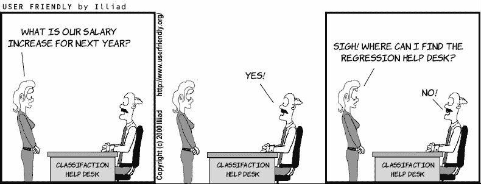

正如我们在第一章中学到的，机器学习对计算机来说是常识。机器学习大致模仿了人类根据经验做出决策的过程，即基于以往的数据做出决策。自然地，编程计算机模仿人类思维过程是具有挑战性的，因为计算机被设计用来存储和处理数字，而不是做出决策。这正是机器学习旨在解决的问题。机器学习根据要做出的决策类型分为几个分支。在本章中，我们将概述这些分支中最重要的一些。

机器学习在许多领域都有应用，例如以下：

+   根据房屋的大小、房间数量和位置预测房价

+   根据昨天的股价和市场其他因素预测今天的股市价格

+   根据电子邮件中的文字和发件人检测垃圾邮件和非垃圾邮件

+   根据图像中的像素识别图像为面孔或动物

+   处理长文本文档并输出摘要

+   向用户推荐视频或电影（例如，在 YouTube 或 Netflix 上）

+   构建与人类互动并回答问题的聊天机器人

+   训练自动驾驶汽车自行在城市中导航

+   诊断患者为生病或健康

+   根据地理位置、购买力和兴趣将市场划分为相似的群体

+   玩像象棋或围棋这样的游戏

尝试想象我们如何在每个这些领域中应用机器学习。注意，这些应用虽然不同，但可以用类似的方法解决。例如，预测房价和预测股价可以使用类似的技术。同样，预测一封电子邮件是否为垃圾邮件以及预测信用卡交易是否合法或欺诈也可以使用类似的技术。那么，根据用户的相似性对应用程序的用户进行分组呢？这听起来与预测房价不同，但可以类似地根据主题对报纸文章进行分组。那么下棋呢？这听起来与所有其他先前应用都不同，但可能像下围棋一样。

根据它们操作的方式，机器学习模型被分为不同的类型。机器学习模型的主要三个家族是

+   *监督学习*，

+   *无监督学习*，

+   *强化学习*。

在本章中，我们概述了所有三个概念。然而，在这本书中，我们只关注监督学习，因为它是最自然的学习起点，并且可以说是目前最常用的。查阅文献中的其他类型，并了解它们，因为它们都很有趣且很有用！在附录 C 的资源中，你可以找到一些有趣的链接，包括作者创建的几个视频。

## 标记数据和未标记数据有什么区别？

什么是数据？

我们在第一章中讨论了数据，但在我们进一步讨论之前，让我们首先明确我们在这本书中提到的*数据*的定义。数据仅仅是信息。每次我们有一个包含信息的表格时，我们就有数据。通常，我们表格中的每一行都是一个数据点。比如说，我们有一个宠物数据集。在这种情况下，每一行代表不同的宠物。表格中的每个宠物都由该宠物的某些特征来描述。

那么什么是特征？

在第一章中，我们将特征定义为数据的属性或特征。如果我们的数据在一个表格中，特征就是表格的列。在我们的宠物例子中，特征可能是大小、名字、类型或重量。特征甚至可以是宠物图像中像素的颜色。这就是描述我们的数据的内容。尽管如此，一些特征是特殊的，我们称它们为*标签*。

标签？

这个问题稍微有点复杂，因为它取决于我们试图解决的问题的上下文。通常，如果我们试图根据其他特征预测一个特定的特征，那么这个特征就是标签。如果我们试图根据宠物的信息预测宠物的类型（例如，猫或狗），那么标签就是宠物的类型（猫/狗）。如果我们试图根据症状和其他信息预测宠物是否生病或健康，那么标签就是宠物的状态（生病/健康）。如果我们试图预测宠物的年龄，那么标签就是年龄（一个数字）。

预测

我们一直在使用自由预测的概念，但现在让我们将其明确下来。预测机器学习模型的目标是猜测数据中的标签。模型做出的猜测称为*预测*。

既然我们已经知道了标签是什么，我们可以理解主要有两种类型的数据：*标记*数据和*未标记*数据。

标记和未标记数据

标记数据是带有标签的数据。未标记数据是没有任何标签的数据。标记数据的例子是一个带有记录邮件是否为垃圾邮件或工作相关的列的电子邮件数据集。未标记数据的例子是一个没有我们感兴趣预测的特定列的电子邮件数据集。

在图 2.1 中，我们看到包含宠物图像的三个数据集。第一个数据集有一列记录宠物的类型，第二个数据集有一列指定宠物的重量。这两个是标记数据的例子。第三个数据集仅包含图像，没有标签，因此是无标签数据。

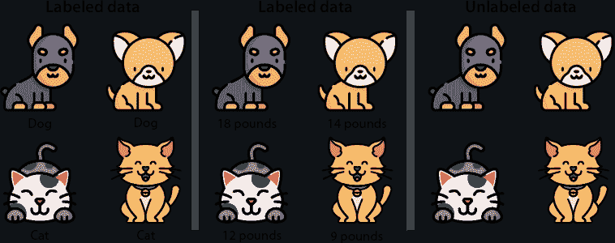

图 2.1 标记数据是带有标签或标记的数据。这个标签可以是类型或数字。无标签数据是没有标签的数据。左侧的数据集是标记的，标签是宠物的类型（狗/猫）。中间的数据集也是标记的，标签是宠物的重量（以磅为单位）。右侧的数据集是无标签的。

当然，这个定义包含一些歧义，因为根据问题，我们决定一个特定的特征是否可以作为标签。因此，确定数据是否标记或无标签，很多时候取决于我们试图解决的问题。

标记和无标签数据产生了两种不同的机器学习分支，称为**监督学习**和**无监督学习**，这些将在接下来的三个部分中定义。

## 监督学习：与标记数据一起工作的机器学习分支

我们可以在当今一些最常见应用中找到监督学习，包括图像识别、各种形式的文本处理和推荐系统。监督学习是一种使用标记数据的机器学习类型。简而言之，监督学习模型的目标是预测（猜测）标签。

在图 2.1 的示例中，左侧的数据集包含狗和猫的图像，标签是“狗”和“猫”。对于这个数据集，机器学习模型将使用先前数据来预测新数据点的标签。这意味着，如果我们引入一个没有标签的新图像，模型将猜测该图像是狗还是猫，从而预测数据点的标签（图 2.2）。

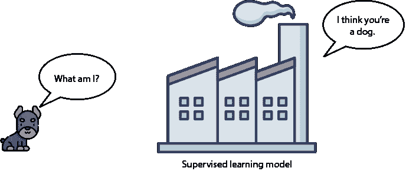

图 2.2 一个监督学习模型预测新数据点的标签。在这种情况下，数据点对应于狗，监督学习算法被训练来预测这个数据点确实对应于狗。

如果您还记得第一章中我们学习用于做决策的框架是“记住-制定-预测”。这正是监督学习的工作方式。模型首先**记住**狗和猫的数据集。然后它**制定**一个模型或规则，即它认为构成狗和猫的特征。最后，当一个新的图像进来时，模型对它认为的图像标签做出**预测**，即狗或猫（图 2.3）。

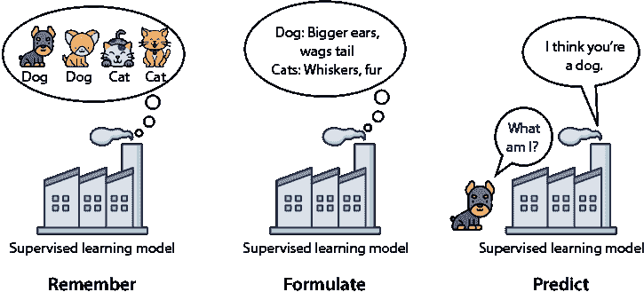

图 2.3 一个监督学习模型遵循第一章中提到的“记住-制定-预测”框架。首先，它记住数据集。然后，它制定构成狗和猫的规则。最后，它预测新的数据点是否是狗或猫。

现在，请注意在图 2.1 中，我们有两种类型的标记数据集。在中间的数据集中，每个数据点都标记了动物的重量。在这个数据集中，标签是数字。在左侧的数据集中，每个数据点都标记了动物的类型（狗或猫）。在这个数据集中，标签是状态。数字和状态是我们将在监督学习模型中遇到的两种类型的数据。我们称第一种类型为**数值数据**，第二种类型为**分类数据**。

**数值数据**是任何使用数字的数据类型，例如 4、2.35 或-199。数值数据的例子包括价格、大小或重量。

**分类数据**是任何使用类别或状态的类型的数据，例如男/女或猫/狗/鸟。对于这类数据，我们有一个有限集合的类别可以与每个数据点关联。

这导致了以下两种类型的监督学习模型：

回归模型是预测**数值数据**的模型类型。回归模型的输出是一个**数字**，例如动物的重量。

分类模型是预测**分类数据**的模型类型。分类模型的输出是一个**类别**，或一个**状态**，例如动物的类型（猫或狗）。

让我们看看两个监督学习模型的例子，一个是回归，一个是分类。

**模型 1：房价模型** **（回归）**。在这个模型中，每个数据点是一栋房屋。每栋房屋的标签是它的价格。我们的目标是，当一栋新的房屋（数据点）上市时，我们希望预测其标签，即它的价格。

**模型 2：电子邮件垃圾邮件检测模型** **（分类）**。在这个模型中，每个数据点是一封电子邮件。每封电子邮件的标签是垃圾邮件或非垃圾邮件。我们的目标是，当一封新的电子邮件（数据点）进入我们的收件箱时，我们希望预测其标签，即它是垃圾邮件还是非垃圾邮件。

注意模型 1 和模型 2 之间的区别。

+   房价模型是一个可以从许多可能性中返回数字的模型，例如$100、$250,000 或$3,125,672.33。因此，它是一个**回归**模型。

+   与此相反，垃圾邮件检测模型只能返回两件事：垃圾邮件或非垃圾邮件。因此，它是一个**分类**模型。

在接下来的小节中，我们将更详细地介绍回归和分类。

回归模型预测数字

正如我们之前讨论的，回归模型是我们想要预测的标签是一个数字的模型。这个数字是基于特征预测的。在房屋的例子中，特征可以是描述房屋的任何东西，例如大小、房间数量、距离最近学校的距离或社区的犯罪率。

其他可以使用回归模型的地方包括：

+   **股市**：根据其他股票价格和其他市场信号预测某只股票的价格

+   **医学**：根据患者的症状和病史预测患者的预期寿命或预期恢复时间

+   **销售**：根据客户的人口统计信息和过去的购买行为预测客户预期的消费金额

+   **视频推荐**：根据用户的人口统计信息和用户观看的其他视频预测用户预期观看视频的时间

用于回归的最常见方法是线性回归，它使用线性函数（直线或类似对象）根据特征进行预测。我们在第三章中学习了线性回归。其他用于回归的流行方法包括决策树回归，我们在第九章中学习，以及几种集成方法，如随机森林、AdaBoost、梯度提升树和 XGBoost，我们在第十二章中学习。

分类模型预测一个状态

分类模型是那些我们想要预测的标签属于有限状态集合的模型。最常见的分类模型预测“是”或“否”，但许多其他模型使用更大的状态集合。我们在图 2.3 中看到的例子是分类的一个例子，因为它预测宠物的类型，即“猫”或“狗”。

在电子邮件垃圾邮件识别的例子中，模型根据电子邮件的特征预测电子邮件的状态（即垃圾邮件或正常邮件）。在这种情况下，电子邮件的特征可以是邮件上的单词、拼写错误的数量、发件人或任何描述电子邮件的其他内容。

另一个常见的分类应用是图像识别。最流行的图像识别模型将图像中的像素作为输入，并输出对图像内容的预测。两个最著名的图像识别数据集是 MNIST 和 CIFAR-10。MNIST 包含大约 60,000 张 28×28 像素的黑白手写数字图像，这些图像被标记为 0 到 9。这些图像来自多个来源的组合，包括美国人口普查局和美国高中生手写数字的存储库。MNIST 数据集可以在以下链接找到：[`yann.lecun.com/exdb/mnist/`](http://yann.lecun.com/exdb/mnist/)**。** CIFAR-10 数据集包含 60,000 张 32×32 像素的不同事物的彩色图像。这些图像被标记为 10 个不同的对象（因此其名称中的 10），即飞机、汽车、鸟类、猫、鹿、狗、青蛙、马、船只和卡车。该数据库由加拿大高级研究研究所（CIFAR）维护，可以在以下链接找到：[`www.cs.toronto.edu/~kriz/cifar.html`](https://www.cs.toronto.edu/~kriz/cifar.html)**。**

分类模型的一些其他强大应用如下：

+   **情感分析**：根据评论中的词语预测电影评论是正面还是负面

+   **网站流量**：根据用户的 demographics 和他们与网站的过往互动预测用户是否会点击链接

+   **社交媒体**：根据用户的 demographics、历史和共同朋友预测用户是否会成为朋友或与另一个用户互动

+   **视频推荐**：根据用户的 demographics 和他们观看的其他视频预测用户是否会观看视频

本书的大部分内容（第 5、6、8、9、10、11 和 12 章）涵盖了分类模型。在这些章节中，我们学习了感知器（第五章）、逻辑分类器（第六章）、朴素贝叶斯算法（第八章）、决策树（第九章）、神经网络（第十章）、支持向量机（第十一章）和集成方法（第十二章）。

## 无监督学习：与无标签数据一起工作的机器学习分支

无监督学习也是一种常见的机器学习类型。它与监督学习的不同之处在于数据是无标签的。换句话说，机器学习模型的目标是从没有标签或预测目标的数据集中提取尽可能多的信息。

这样的数据集可能是什么，我们能用它做什么？原则上，我们可能比使用有标签的数据集能做的少一些，因为我们没有标签来预测。然而，我们仍然可以从无标签的数据集中提取大量信息。例如，让我们回到图 2.1 最右侧数据集上的猫和狗的例子。这个数据集由猫和狗的图像组成，但没有标签。因此，我们不知道每张图像代表哪种宠物类型，所以无法预测新图像是否对应狗或猫。然而，我们还可以做其他事情，例如确定两张图片是否相似或不同。这是无监督学习算法所做的事情。无监督学习算法可以根据相似性对图像进行分组，即使不知道每个组代表什么（图 2.4）。如果做得恰当，算法可以将狗图像与猫图像分开，甚至可以根据品种将它们各自分组！

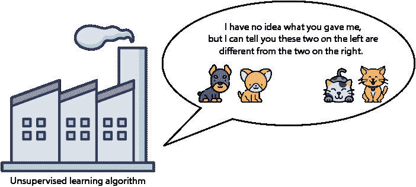

图 2.4 无监督学习算法仍然可以从数据中提取信息。例如，它可以把相似元素分组在一起。

事实上，即使标签存在，我们仍然可以在我们的数据上使用无监督学习技术进行预处理，并更有效地应用监督学习方法。

无监督学习的主要分支是聚类、维度约简和生成学习。

聚类算法 根据相似性将数据分组到簇中的算法

维度约简算法 简化我们的数据，并用更少的特征忠实描述它的算法

生成算法 可以生成与现有数据相似的新数据点的算法

在接下来的三个小节中，我们将更详细地研究这三个分支。

聚类算法将数据集分割成相似组

正如我们之前所述，聚类算法是将数据集分割成相似组的算法。为了说明这一点，让我们回到“监督学习”部分中的两个数据集——住房数据集和垃圾邮件数据集——但想象一下它们没有标签。这意味着住房数据集没有价格，而邮件数据集没有关于邮件是否为垃圾邮件或非垃圾邮件的信息。

让我们从住房数据集开始。我们能用这个数据集做什么？这里有一个想法：我们可以以某种方式根据相似性对房屋进行分组。例如，我们可以根据位置、价格、大小或这些因素的组合来分组。这个过程被称为*聚类*。聚类是无监督机器学习的一个分支，它包括将我们的数据集中的元素分组到簇中的任务，其中所有数据点都是相似的。

现在，让我们看看第二个例子，邮件数据集。因为数据集没有标签，我们不知道每封邮件是否为垃圾邮件。然而，我们仍然可以对我们数据集应用一些聚类。聚类算法根据邮件的不同特征将我们的图像分割成几个不同的组。这些特征可能是信息中的单词、发件人、附件的数量和大小，或者邮件内部的链接类型。聚类数据集后，一个人（或人与监督学习算法的组合）可以根据“个人”、“社交”和“促销”等类别对这些簇进行标记。

例如，让我们看看表 2.1 中的数据集，其中包含九封我们想要聚类的邮件。数据集的特征是邮件的大小和收件人数量。

表 2.1 包含大小和收件人数量的邮件表

| 邮件 | 大小 | 收件人 |
| --- | --- | --- |
| 1 | 8 | 1 |
| 2 | 12 | 1 |
| 3 | 43 | 1 |
| 4 | 10 | 2 |
| 5 | 40 | 2 |
| 6 | 25 | 5 |
| 7 | 23 | 6 |
| 8 | 28 | 6 |
| 9 | 26 | 7 |

用肉眼来看，我们似乎可以根据收件人数量将邮件分组。这将导致形成两个簇：一个包含两个或更少收件人的邮件，另一个包含五个或更多收件人的邮件。我们也可以尝试根据大小将它们分成三个组。但你可以想象，随着表格越来越大，用眼睛识别组变得越来越困难。如果我们绘制数据呢？让我们在图表中绘制邮件，其中水平轴记录大小，垂直轴记录收件人数量。这给我们带来了图 2.5 中的图表。

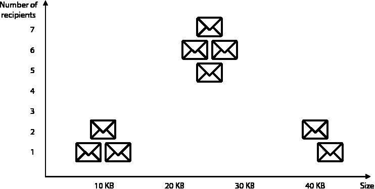

图 2.5  邮件数据集的图表。水平轴对应邮件的大小，垂直轴对应收件人数量。我们可以在这个数据集中看到三个定义良好的簇。

在图 2.5 中，我们可以看到三个定义良好的簇，这些簇在图 2.6 中被突出显示。

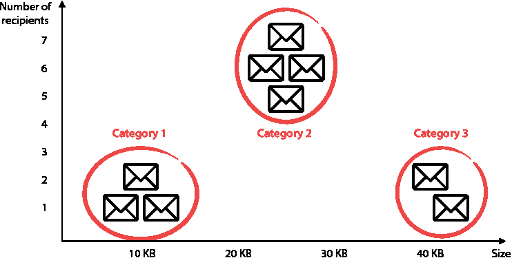

图 2.6 我们可以根据大小和收件人数量将电子邮件聚类成三类。

最后这一步就是聚类的全部内容。当然，对于我们人类来说，一旦有了图表，很容易就能目测出三个组。但对于计算机来说，这项任务并不容易。此外，想象一下，如果我们的数据包含数百万个点，有数百或数千个特征。当特征超过三个时，人类无法看到簇，因为它们会处于我们无法可视化的维度。幸运的是，计算机可以为具有多行和多列的巨大数据集进行此类聚类。

聚类的一些其他应用如下：

+   **市场细分**：根据人口统计和以往购买行为将客户分成组，为这些组创建不同的营销策略

+   **遗传学**：根据基因相似性将物种聚类成组

+   **医学成像**：将图像分割成不同的部分以研究不同类型的组织

+   **视频推荐**：根据人口统计和以往观看的视频将用户分成组，并据此向用户推荐其组中其他用户观看的视频

更多关于无监督学习模型

在本书的其余部分，我们不涉及无监督学习。然而，我强烈建议您自学。以下是一些最重要的聚类算法。附录 C 列出了更多（包括一些我的视频）的算法，您可以在其中详细了解这些算法。

+   **K-均值聚类**：此算法通过选择一些随机质心并将它们移动到越来越接近点的位置来分组点，直到它们处于正确的位置。

+   **层次聚类**：此算法首先将最近的点分组在一起，并继续这种方式，直到我们有一些定义良好的组。

+   **基于密度的空间聚类（DBSCAN**）：此算法从高密度区域开始将点分组在一起，同时将孤立点标记为噪声。

+   **高斯混合模型**：此算法不会将一个点分配给一个簇，而是将点的分数分配给现有的每个簇。例如，如果有三个簇，A、B 和 C，那么算法可以确定一个特定点的 60%属于组 A，25%属于组 B，15%属于组 C。

维度降低简化数据而不丢失太多信息

维度降低是一个有用的预处理步骤，我们可以将其应用于大量简化我们的数据，然后再应用其他技术。例如，让我们回到住房数据集。想象一下，特征如下：

+   尺寸

+   卧室数量

+   卫生间数量

+   社区犯罪率

+   到最近学校的距离

这个数据集有五个数据列。如果我们想将数据集转换成一个列更少、信息损失不多的简单数据集，会怎么样呢？让我们通过常识来做这件事。仔细看看这五个特征。你能看到任何简化它们的方法——也许是将它们分组到一些更小、更一般的类别中？

仔细观察后，我们可以发现前三个特征是相似的，因为它们都与房屋的大小有关。同样，第四和第五个特征彼此相似，因为它们与社区的素质有关。我们可以将前三个特征浓缩成一个大的“大小”特征，第四和第五个特征浓缩成一个大的“社区素质”特征。我们如何浓缩大小特征呢？我们可以忽略房间和卧室的数量，只考虑大小，我们可以加上卧室和浴室的数量，或者可能取这三个特征的某种组合。我们也可以以类似的方式浓缩区域素质特征。降维算法将找到好的方法来浓缩这些特征，尽可能减少信息损失，同时尽可能保持我们的数据完整，以便在简化数据的同时便于处理和存储（图 2.7）。

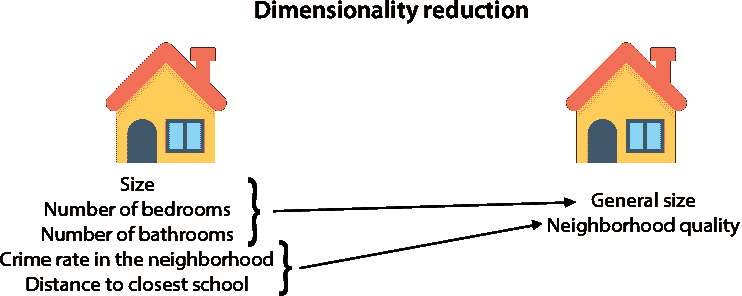

图 2.7 降维算法帮助我们简化数据。在左侧，我们有一个具有许多特征的房屋数据集。我们可以使用降维来减少数据集中的特征数量，同时损失的信息很少，并得到右侧的数据集。

如果我们只是在减少数据中的列数，为什么称之为降维？数据集中列数的术语是*维度*。想想看：如果我们的数据有一列，那么每个数据点就是一个数字。一组数字可以绘制成一条线上的点集，这条线恰好是一维的。如果我们的数据有两列，那么每个数据点由一对数字组成。我们可以想象一对数字的集合就像一个城市中的点集，第一个数字是街号，第二个数字是大道。地图上的地址是二维的，因为它们在平面上。当我们的数据有三列时会发生什么？在这种情况下，每个数据点由三个数字组成。我们可以想象，如果我们的城市中的每个地址都是一个建筑，那么前两个数字是街道和大道，第三个数字是建筑中的楼层。这看起来更像是一个三维城市。我们可以继续这样想。四个数字呢？好吧，现在我们真的无法可视化它，但如果我们可以，这个点集将看起来像四维城市中的地方，以此类推。想象四维城市最好的方式是通过想象一个有四列的表格。那么一百维城市呢？这将是一个有 100 列的表格，其中每个人都有一个由 100 个数字组成的地址。当我们思考高维时，我们可以在图 2.8 中看到这种心理图像。因此，当我们从五维降到二维时，我们将五维城市简化为二维城市。这就是为什么称之为降维。

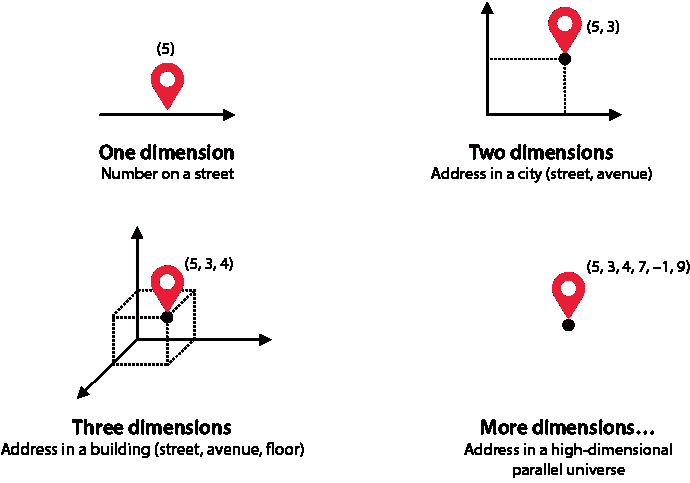

图 2.8 如何想象高维空间：一维就像一条街道，其中每栋房子只有一个号码。二维就像一个平面城市，其中每个地址有两个号码，一个街道和一个大道。三维就像一个有建筑的城市，其中每个地址有三个号码：一个街道，一个大道和一个楼层。四维就像一个有四个号码的想象中的地方。我们可以将高维想象为另一个想象中的城市，其中地址有我们需要的那么多坐标。

简化我们数据的其他方法：矩阵分解和奇异值分解

看起来聚类和降维完全不同，但实际上它们并不那么不同。如果我们有一个充满数据的数据表，每一行对应一个数据点，每一列对应一个特征。因此，我们可以使用聚类来减少数据集中的行数，使用降维来减少列数，如图 2.9 和 2.10 所示。

图 2.9 通过将多个行分组为一个，聚类可以用来简化我们的数据，减少数据集中行的数量。

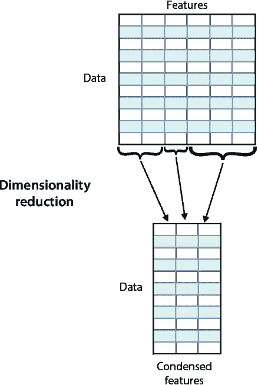

图 2.10 可以通过减少数据集中列的数量来简化我们的数据，从而进行降维。

你可能想知道，我们是否可以同时减少行和列？答案是肯定的！我们可以通过两种常见的方法来实现这一点：*矩阵分解*和*奇异值分解*。这两个算法将大数据矩阵表示为较小矩阵的乘积。

类似 Netflix 这样的地方广泛使用矩阵分解来生成推荐。想象一个大的表格，其中每一行对应一个用户，每一列对应一部电影，矩阵中的每个条目都是用户对电影的评分。通过矩阵分解，可以提取某些特征，例如电影类型、电影中的演员等等，并能够根据这些特征预测用户对电影的评分。

奇异值分解用于图像压缩。例如，黑白图像可以看作是一个大数据表，其中每个条目包含对应像素的强度。奇异值分解使用线性代数技术简化这个数据表，从而允许我们简化图像，并使用更少的条目存储其简化版本。

生成式机器学习

*生成式* *机器学习*是机器学习中最令人惊讶的领域之一。如果你看到过计算机生成的超逼真的人脸、图像或视频，那么你就看到了生成式机器学习的实际应用。

生成学习领域包括一些模型，这些模型在给定一个数据集的情况下，可以输出看起来像原始数据集样本的新数据点。这些算法被迫学习数据的外观以产生相似的数据点。例如，如果数据集包含人脸图像，那么算法将产生看起来逼真的面孔。生成算法已经能够创造出极其逼真的图像、绘画等等。它们还生成了视频、音乐、故事、诗歌以及许多其他奇妙的事物。最受欢迎的生成算法是生成对抗网络（GANs），由伊恩·古德费洛及其合作者开发。其他有用且流行的生成算法包括由 Kingma 和 Welling 开发的变分自编码器，以及由杰弗里·辛顿开发的受限玻尔兹曼机（RBMs）。

如你所想，生成学习相当困难。对于人类来说，确定一张图片是否显示了一只狗比画一只狗要容易得多。这项任务对计算机来说同样困难。因此，生成学习中的算法很复杂，需要大量的数据和计算能力才能使它们工作得很好。因为这本书是关于监督学习的，所以我们不会详细讨论生成学习，但在第十章中，我们将了解一些这些生成算法是如何工作的，因为它们倾向于使用神经网络。附录 C 包含了一些资源推荐，包括作者的一个视频，如果你想进一步探索这个话题的话。

## 什么是强化学习？

强化学习是一种不同类型的机器学习，其中没有提供数据，我们必须让计算机执行一个任务。不是数据，模型接收一个环境和应该在这个环境中导航的智能体。智能体有一个目标或一系列目标。环境有奖励和惩罚，引导智能体做出正确的决策以达到其目标。这一切听起来可能有点抽象，但让我们看看一个例子。

示例：网格世界

在图 2.11 中，我们看到一个网格世界，其中有一个机器人在左下角。那就是我们的智能体。目标是到达网格右上角的宝箱。在网格中，我们还可以看到一个山丘，这意味着我们不能通过那个方块，因为机器人不能爬山。我们还看到一个龙，如果机器人敢降落在它的方块上，龙将会攻击机器人，这意味着我们的目标之一是不降落在那里。这就是游戏。为了给机器人提供如何进行的信息，我们记录一个分数。分数从零开始。如果机器人到达宝箱，我们就获得 100 分。如果机器人遇到龙，我们就会失去 50 分。为了确保我们的机器人移动得快，我们可以这样说，对于机器人每走一步，我们就失去 1 分，因为机器人走路时会消耗能量。

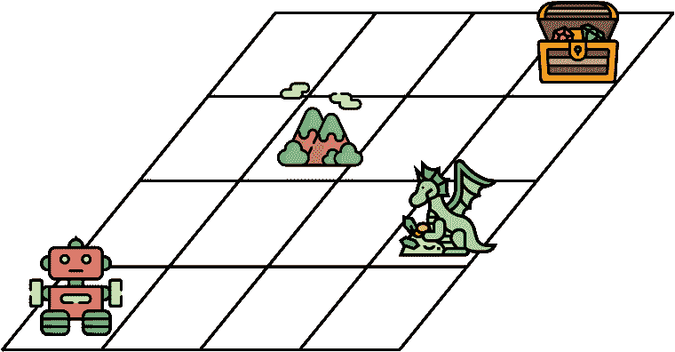

图 2.11 展示了我们的智能体是一个机器人的网格世界。机器人的目标是找到宝箱，同时避开龙。山丘代表机器人无法通过的地方。

训练这个算法的方法，非常粗略地说，是这样的：机器人开始四处走动，记录它的分数并记住是什么步骤带它到那里。在某个时候，它可能会遇到龙，失去很多分数。因此，它学会了将龙方块及其附近的方块与低分数联系起来。在某个时候，它也可能击中宝箱，并学会将那个方块及其附近的方块与高分数联系起来。经过长时间玩这个游戏，机器人将很好地了解每个方块的好坏，并且它可以沿着跟随方块直到宝箱的路径前进。图 2.12 展示了

a possible path, although this one is not ideal, because it passes too close to the dragon. Can you think of a better one?

图 2.12 这里是机器人可能采取的寻找宝箱的路径。

当然，这是一个非常简短的说明，强化学习还有很多其他内容。附录 C 推荐了一些进一步学习的资源，包括一个深度强化学习的视频。

强化学习有许多尖端应用，包括以下内容：

+   **游戏**：最近在教计算机如何赢得游戏（如围棋或象棋）的进步，使用了强化学习。此外，已经教会代理赢得像*Breakout*或*超级马里奥*这样的 Atari 游戏。

+   **机器人技术**：强化学习被广泛用于帮助机器人执行拾取箱子、打扫房间或甚至跳舞等任务！

+   **自动驾驶汽车**：强化学习技术被用来帮助汽车执行许多任务，例如路径规划或在特定环境中行为。

## 摘要

+   存在几种机器学习类型，包括监督学习、无监督学习和强化学习。

+   数据可以是标记的或未标记的。标记数据包含一个特殊特征或标签，我们旨在预测。未标记数据不包含此特征。

+   监督学习用于标记数据，并包括构建模型来预测未见数据的标签。

+   无监督学习用于未标记的数据，并包括简化我们的数据而不丢失大量信息的算法。无监督学习通常用作预处理步骤。

+   两种常见的监督学习算法被称为回归和分类。

    +   回归模型是那些答案可以是任何数字的模型。

    +   分类模型是那些答案属于某种类型或类别的模型。

+   两种常见的无监督学习算法是聚类和维度约简。

    +   聚类用于将数据分组到相似的簇中，以提取信息或使其更容易处理。

    +   维度约简是一种通过合并某些相似特征并尽可能少地丢失信息来简化我们的数据的方法。

    +   矩阵分解和奇异值分解是其他可以通过减少行和列的数量来简化我们的数据的算法。

+   生成式机器学习是一种创新的无监督学习类型，它由生成与我们的数据集相似的数据组成。生成模型可以绘制逼真的面孔，创作音乐，并写诗。

+   强化学习是一种机器学习类型，其中代理必须在一个环境中导航并达到目标。它在许多尖端应用中得到了广泛的应用。

## 练习

练习 2.1

对于以下每个场景，说明它是一个监督学习还是无监督学习的例子。解释你的答案。在模糊的情况下，选择一个，并解释你为什么选择它。

1.  在社交网络上的推荐系统，向用户推荐潜在的朋友

1.  在新闻网站上，将新闻分为主题的系统

1.  Google 自动补全功能的句子

1.  在在线零售商上的推荐系统，根据用户的过去购买历史向用户推荐购买商品

1.  一家信用卡公司中用于捕捉欺诈交易的系统

练习 2.2

对于以下机器学习的应用，你会使用回归还是分类来解决它？解释你的答案。在存在歧义的情况下，选择一个，并解释你为什么选择它。

1.  在线商店预测用户在其网站上将花费多少钱

1.  语音助手解码语音并将其转换为文本

1.  从特定公司买卖股票

1.  YouTube 向用户推荐视频

练习 2.3

你的任务是构建一辆自动驾驶汽车。至少给出三个你必须解决的机器学习问题来构建它。在每个例子中，解释你是否使用监督学习/无监督学习，如果是监督学习，是否使用回归或分类。如果你使用其他类型的机器学习，解释是哪一种，以及为什么。
