# 3 画一条接近我们点的线：线性回归

在本章

+   什么是线性回归

+   通过一组数据点拟合一条线

+   在 Python 中编写线性回归算法

+   使用 Turi Create 构建线性回归模型以预测真实数据集中的房价

+   什么是多项式回归

+   通过非线性数据拟合更复杂的曲线

+   讨论线性回归在现实世界中的应用实例，例如医疗应用和推荐系统

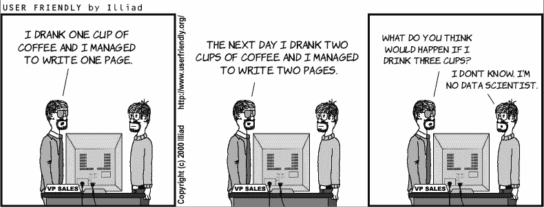

在本章中，我们将学习线性回归。线性回归是一种强大且广泛使用的方法，用于估计值，例如房屋价格、某种股票的价值、个人的预期寿命，或者用户观看视频或花费在网站上的时间。你可能之前已经见过线性回归，它包括许多复杂的公式，如导数、方程组和行列式。然而，我们也可以以更图形化和更少公式化的方式看待线性回归。在本章中，为了理解线性回归，你只需要具备可视化点和线移动的能力。

假设我们有一些点，它们大致看起来像是在形成一条线，如图 3.1 所示。

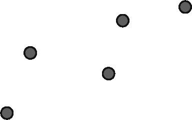

图 3.1 一些看起来大致形成一条线的点

线性回归的目标是画出尽可能接近这些点的线。你会画一条什么样的线来接近这些点？图 3.2 中的那条线怎么样？

将这些点想象成镇上的房子，我们的目标是建造一条穿过镇子的路。我们希望这条线尽可能接近这些点，因为镇上的居民都希望住在靠近路的地方，我们的目标是尽可能满足他们的需求。

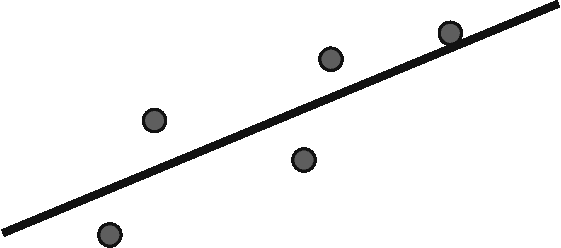

图 3.2 一条经过点的线

我们也可以想象这些点为固定在地板上的磁铁（因此它们不能移动）。现在想象在它们上面扔一根直金属棒。棒会移动，但由于磁铁的吸引，它最终会达到一个平衡位置，尽可能接近所有点。

当然，这可能会导致很多歧义。我们是要一条大致靠近所有房子的路，还是可能真的靠近一些房子而远离其他房子？以下是一些随之而来的问题：

+   我们所说的“大致形成一条线的点”是什么意思？

+   我们所说的“经过点非常接近的线”是什么意思？

+   我们如何找到这样的线？

+   这在现实世界中有什么用？

+   这为什么是机器学习？

在本章中，我们将回答所有这些问题，并构建一个线性回归模型来预测真实数据集中的房价。

您可以在以下 GitHub 仓库中找到本章的所有代码：[`github.com/luisguiserrano/manning/tree/master/Chapter_3_Linear_Regression`](https://github.com/luisguiserrano/manning/tree/master/Chapter_3_Linear_Regression).

## 问题：我们需要预测房子的价格

假设我们是负责销售新房子的房地产经纪人。我们不知道价格，但想通过与其他房子的比较来推断它。我们查看可能影响价格的房屋特征，如大小、房间数量、位置、犯罪率、学校质量和距离商业区。最终，我们希望得到一个公式，包含所有这些特征，从而给出房子的价格，或者至少是一个良好的估计。

## 解决方案：为房价构建回归模型

让我们尽可能使用一个简单的例子。我们只看一个特征——房间数量。我们的房子有四个房间，附近有六座房子，分别有一、二、三、五、六和七个房间。它们的价格显示在表 3.1 中。

表 3.1 房屋表格，包含房间数量和价格。房屋 4 是我们试图推断价格的房屋。

| 房间数量 | 价格 |
| --- | --- |
| 1 | 150 |
| 2 | 200 |
| 3 | 250 |
| 4 | ? |
| 5 | 350 |
| 6 | 400 |
| 7 | 450 |

你会给房屋 4 一个什么价格，仅基于这个表格上的信息？如果你说是 300 美元，那么我们做出了相同的猜测。你可能注意到了一个模式，并利用它来推断房子的价格。你在脑海中做的事情是线性回归。让我们更深入地研究这个模式。你可能已经注意到，每次增加一个房间，房子的价格就会增加 50 美元。更具体地说，我们可以将房子的价格视为两个东西的组合：一个基础价格为 100 美元，以及每个房间的额外费用 50 美元。这可以总结为一个简单的公式：

价格 = 100 + 50(房间数量)

我们在这里做的是提出一个由公式表示的模型，它根据特征（即房间数量）给出房价的*预测*。每间房的价格称为该相应特征的*权重*，基础价格称为模型的*偏差*。这些都是机器学习中的重要概念。我们在第一章和第二章中学习了一些，但让我们通过从这个问题的角度来定义它们来刷新我们的记忆。

特征：数据点的特征是我们用来进行预测的属性。在这种情况下，特征是房子的房间数量、犯罪率、房子的年龄、大小等。在我们的案例中，我们决定使用一个特征：房子的房间数量。

标签：这是我们尝试从特征中预测的目标。在这种情况下，标签是房子的价格。

模型：机器学习模型是一个规则或公式，它从特征中预测标签。在这种情况下，模型是我们找到的价格方程。

预测：预测是模型的输出。如果模型说，“我认为四间房的房子将花费 300 美元”，那么预测就是 300。

权重：在对应于模型的公式中，每个特征都乘以一个相应的因子。这些因子是权重。在之前的公式中，唯一的特征是房间数，其相应的权重是 50。

偏差：正如你所见，对应于模型的公式有一个与任何特征都不相连的常数。这个常数被称为偏差。在这个模型中，偏差是 100，它对应于房子的基础价格。

现在的问题是，我们是如何得出这个公式的？或者更具体地说，我们是如何让计算机得出这个权重和偏差的？为了说明这一点，让我们看看一个稍微复杂一点的例子。因为这是一个机器学习问题，我们将使用我们在第二章中学到的记住-制定-预测框架来处理它。更具体地说，我们将*记住*其他房子的价格，*制定*一个价格模型，并使用这个模型来*预测*新房子的价格。

记忆步骤：查看现有房子的价格

为了更清楚地看到这个过程，让我们看看一个稍微复杂一些的数据集，比如表 3.2 中的数据集。

表 3.2 房屋及其房间数和价格的一个稍微复杂的数据集

| 房间数 | 价格 |
| --- | --- |
| 1 | 155 |
| 2 | 197 |
| 3 | 244 |
| 4 | ? |
| 5 | 356 |
| 6 | 407 |
| 7 | 448 |

这个数据集与之前的一个类似，但现在价格并不遵循一个很好的模式，即每个价格比前一个高 50 美元。然而，它离原始数据集并不远，因此我们可以预期一个类似的模式应该很好地近似这些值。

通常，当我们得到一个新的数据集时，我们首先做的事情是绘制它。在图 3.3 中，我们可以看到一个坐标系统中的点，其中水平轴代表房间数，垂直轴代表房子的价格。

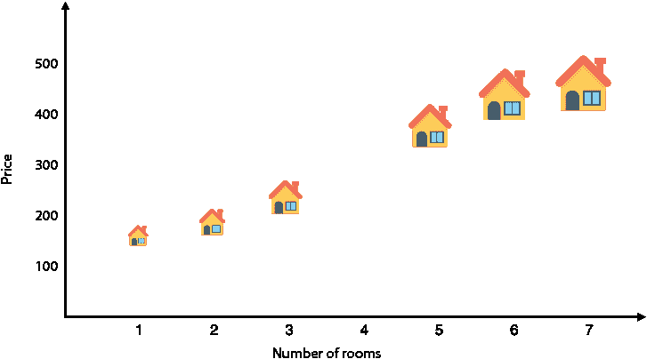

图 3.3 表 3.2 中数据集的散点图。水平轴代表房间数，垂直轴代表房子的价格。

公式步骤：制定一个估算房价的规则

表 3.2 中的数据集与表 3.1 中的数据集非常接近，所以目前我们可以安全地使用相同的公式来计算价格。唯一的区别是，现在的价格并不完全符合公式，我们有一个小的误差。我们可以将方程写成以下形式：

价格 = 100 + 50(房间数) + (小误差)

如果我们想要预测价格，我们可以使用这个方程。尽管我们不确定我们会得到实际值，但我们知道我们很可能会接近。现在的问题是，我们是如何找到这个方程的？最重要的是，计算机是如何找到这个方程的？

让我们回到图表，看看方程在这里的含义。如果我们查看所有垂直（*y*）坐标是 100 加上 50 倍水平（*x*）坐标的点会发生什么？这组点形成了一条斜率为 50，*y*截距为 100 的直线。在我们展开前面的陈述之前，这里有一些斜率、*y*截距和直线方程的定义。我们将在“斜率和*y*截距快速入门”部分更详细地探讨这些内容。

斜率 直线的斜率是衡量其陡峭程度的度量。它是通过将上升量除以运行量（即上升了多少单位，除以向右移动了多少单位）来计算的。这个比率在整个直线上是恒定的。在机器学习模型中，这是相应特征的权重，它告诉我们当我们增加一个单位的特征值时，我们期望标签值上升多少。如果直线是水平的，那么斜率为零，如果直线向下倾斜，那么斜率为负。

*y*截距 直线的*y*截距是直线与垂直（*y*）轴交叉的高度。在机器学习模型中，它是偏差，告诉我们当所有特征都精确为零的数据点中的标签值是什么。

线性方程 这是一条直线的方程。它由两个参数给出：斜率和*y*截距。如果斜率是*m*，*y*截距是*b*，那么直线的方程是*y* = *mx* + *b*，直线由满足该方程的所有点(*x,y*)形成。在机器学习模型中，*x*是特征的值，*y*是标签的预测。模型的权重和偏差分别是*m*和*b*。

现在，我们可以分析这个方程了。当我们说直线的斜率是 50 时——这意味着每次我们给房子增加一个房间，我们估计房子的价格将上涨 50 美元。当我们说直线的*y*截距是 100 时，这意味着一个（假设的）零房间房子的价格估计将是基础价格 100 美元。这条直线在图 3.4 中绘制。

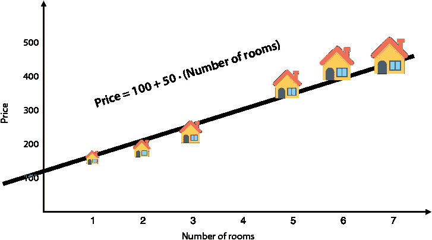

图 3.4 我们构建的模型是尽可能接近所有房子的直线。

现在，在所有可能的直线（每条直线都有自己的方程）中，我们为什么选择这条特定的直线？因为它接近这些点。可能还有更好的选择，但至少我们知道这条直线是好的，而不是一条根本不接近这些点的直线。现在我们回到了原始问题，我们有一组房子，我们想要建造一条尽可能靠近它们的路。

我们如何找到这条直线？我们将在本章后面讨论这个问题。但就目前而言，让我们假设我们有一个水晶球，给定一些点，找到最接近它们的直线。

预测步骤：当市场上出现一栋新房子时，我们该怎么办？

现在，让我们使用我们的模型来预测四间房的房屋价格。为此，我们将数字四作为特征代入公式，得到以下结果：

价格 = 100 + 50 · 4 = 300

因此，我们的模型预测这所房子的价格为$300。这也可以通过图 3.5 中的线图来直观地看出。

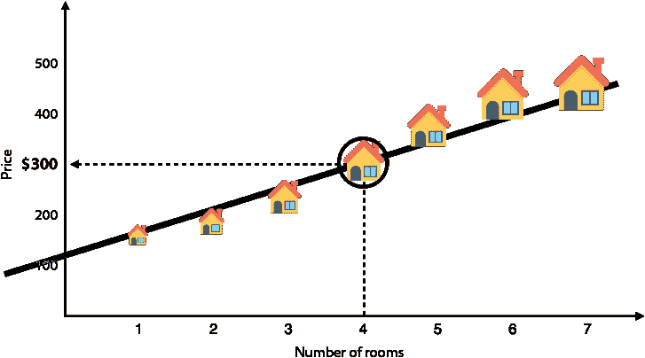

图 3.5 我们现在的任务是预测四间房房屋的价格。使用模型（线），我们推断出这所房子的预测价格为$300。

如果我们有更多变量怎么办？多元线性回归

在前面的章节中，我们学习了一个基于一个特征（房间数量）预测房屋价格的模型。我们可以想象许多其他有助于预测房屋价格的特征，例如面积、邻居区的学校质量以及房屋年龄。我们的线性回归模型能否容纳这些其他变量？当然可以。当唯一的特征是房间数量时，我们的模型通过将特征乘以它们的对应权重并加上偏差来预测价格。如果我们有更多特征，我们只需要将它们乘以它们的对应权重并将它们加到预测价格上。因此，房屋价格的模型可能看起来像这样：

价格 = 30（房间数量）+ 1.5（面积）+ 10（学校质量）- 2（房屋年龄）+ 50

在这个方程中，为什么除了房屋年龄对应的权重外，所有权重都是正的？原因是其他三个特征（房间数量、面积和学校质量）与房屋价格呈**正相关**。换句话说，因为大房子和位置好的房子价格更高，这个特征值越高，我们预计房屋价格也越高。然而，因为我们想象到老房子通常更便宜，所以年龄特征与房屋价格呈**负相关**。

如果一个特征的权重为零怎么办？这种情况发生在特征与价格无关时。例如，想象一个测量邻居姓氏以字母“A”开头的数量的特征。这个特征对房屋价格的影响主要不大，因此我们预计在合理的模型中，对应这个特征的权重要么是零，要么非常接近零。

以类似的方式，如果一个特征的权重非常高（无论是正还是负），我们将其解释为模型在告诉我们这个特征在确定房屋价格方面很重要。在前一个模型中，似乎房间数量是一个重要的特征，因为它的权重最大（绝对值）。

在第二章的“降维简化数据而不丢失太多信息”部分中，我们将数据集的列数与数据集所在的维度联系起来。因此，具有两列的数据集可以表示为平面上的点集，具有三列的数据集可以表示为三维空间中的点集。在这样的数据集中，线性回归模型对应于一条线，而不是一个尽可能接近点的平面。想象一下，房间里有很多苍蝇在静止状态下飞来飞去，我们的任务是尽可能接近所有苍蝇通过一张巨大的纸板。这是具有三个变量的多元线性回归。对于具有更多列的数据集，问题变得难以可视化，但我们总是可以想象一个具有许多变量的线性方程。

在本章中，我们主要处理只有一个特征的线性回归模型的训练，但如果有更多特征，程序是相似的。我鼓励你在心中记住这个事实，并想象你如何将我们接下来的每个陈述推广到具有多个特征的情况。

一些出现的问题和一些快速回答

好吧，你的脑海中可能充满了许多问题。让我们解决一些（希望是所有）它们！

1.  如果模型出错会怎样？

1.  你是如何想出预测价格的公式的？如果我们不是有六套房屋，而是有成千上万套房屋，我们会怎么做？

1.  假设我们已经构建了这个预测模型，然后市场上开始出现新的房屋。有没有一种方法可以用新信息更新模型？

本章回答了所有这些问题，但这里有一些快速回答：

1.  **如果模型出错会怎样？**

    该模型正在估算房屋的价格，因此我们预计它几乎每次都会犯一个小错误，因为很难击中确切的价格。训练过程包括找到在数据点处使错误最小的模型。

1.  **你是如何想出预测价格的公式的？如果我们不是有六套房屋，而是有成千上万套房屋，我们会怎么做？**

    是的，这正是我们在本章中要解决的主要问题！当我们只有六套房屋时，绘制一条接近它们的线的问题很简单，但如果我们有成千上万的房屋，这项任务就变得困难了。在本章中，我们为计算机设计了一个算法或程序，以便找到一条好的线。

1.  **假设我们已经构建了这个预测模型，然后市场上开始出现新的房屋。有没有一种方法可以用新信息更新模型？**

    绝对！我们将构建一个模型，使其在出现新数据时可以轻松更新。这始终是机器学习中要寻找的东西。如果我们构建的模型需要每次新数据到来时都重新计算整个模型，那么它将不会很有用。

## 如何让计算机绘制这条线：线性回归算法

现在我们来探讨本章的主要问题：我们如何让计算机绘制一条非常接近点的线？我们这样做的方式与我们在机器学习中做很多事情的方式相同：一步一步。从一个随机的线开始，找出一种方法，通过将其移近点来稍微改进这条线。重复这个过程多次， voilà，我们就得到了想要的线。这个过程被称为线性回归算法。

这个步骤可能听起来很愚蠢，但它确实非常有效。从一个随机的线开始。在数据集中选择一个随机点，并将线稍微移近这个点。重复这个过程多次，每次都在数据集中选择一个随机点。以这种几何方式查看线性回归算法的伪代码如下。图 3.6 展示了该图示。

线性回归算法（几何）的伪代码

**输入**：平面上的点数据集

**输出**：一条通过点的线

步骤：

+   选择一条随机线。

+   重复多次：

    +   选择一个随机数据点。

    +   将线稍微移近那个点。

+   **返回**你得到的线。

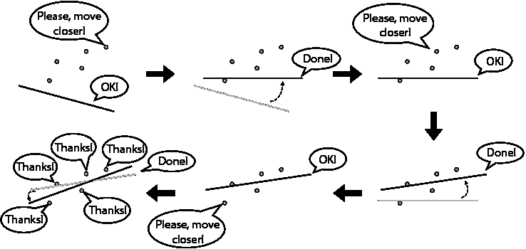

图 3.6 线性回归算法的示意图。我们从左上角的一个随机线开始，最终在左下角得到一条很好地拟合数据集的线。在每一个阶段，都会发生两件事：（1）我们选择一个随机点，（2）这个点要求线靠近它。经过多次迭代，线将处于良好的位置。这个图只有三个迭代，用于说明目的，但在现实生活中，需要更多的迭代。

那是高级概述。为了更详细地研究这个过程，我们需要深入了解数学细节。让我们首先定义一些变量。

+   *p*: 数据集中房屋的价格

+   ：房屋的预测价格

+   *r*: 房间数量

+   *m*: 每间房的价格

+   *b*: 房屋的基本价格

为什么预测价格上方的帽子，？在本书中，帽子表示这是我们模型预测的变量。这样，我们可以从预测价格中区分出数据集中房屋的实际价格。

因此，预测价格为基础价格加上每间房的价格乘以房间数量的线性回归模型方程是

 = *mr* + *b*.

这是一种公式化的说法

预测价格 = (每间房的价格)(房间数量) + 房屋的基本价格。

为了了解线性回归算法，想象我们有一个模型，其中每间房的价格是 40 美元，房屋的基本价格是 50 美元。这个模型使用以下公式预测房屋的价格：

 = 40 · *r* + 50

为了说明线性回归算法，想象一下在我们的数据集中有一所两居室的房子，价格为 150 美元。这个模型预测房子的价格是 50 + 40 * 2 = 130 美元。这不是一个糟糕的预测，但它低于房子的价格。我们如何改进这个模型？看起来模型的错误在于认为房子太便宜。也许模型的基础价格低，或者每间房子的价格低，或者两者都低。如果我们都稍微增加一点，我们可能会得到更好的估计。让我们将每间房子的价格增加 0.50 美元，基础价格增加 1 美元。（我随机选择了这些数字）。新的方程如下：

 = 40.5 * r + 51

新预测的房价为 40.5 * r + 51 = 132。因为 132 比 150 更接近，所以我们的新模型对这个房子的预测更好。因此，它对这个数据点是一个更好的模型。我们不知道它是否对其他数据点也是一个更好的模型，但现在我们不必担心这一点。线性回归算法的想法是重复前面的过程多次。线性回归算法的伪代码如下：

线性回归算法的伪代码

**输入**：一组数据点集

**输出**：一个适合该数据集的线性回归模型

程序：

+   选择一个具有随机权重和随机偏差的模型。

+   重复多次：

    +   选择一个随机数据点。

    +   稍微调整权重和偏差，以改善该特定数据点的预测。

+   **返回**你获得的模型。

你可能会有一些疑问，比如以下：

+   我应该如何调整权重？

+   我应该重复算法多少次？换句话说，我如何知道何时完成？

+   我如何知道这个算法是有效的？

我们在本章中回答了所有这些问题。在“平方技巧”和“绝对技巧”部分，我们学习了一些有趣的技巧来找到调整权重的良好值。在“绝对误差”和“平方误差”部分，我们看到了误差函数，它将帮助我们决定何时停止算法。最后，在“梯度下降”部分，我们介绍了一种称为梯度下降的强大方法，它证明了为什么这个算法是有效的。但首先，让我们从在平面上移动线开始。

斜率和 y 轴截距的快速课程

在“公式步骤”部分，我们讨论了直线的方程。在本节中，我们学习如何操作这个方程来移动我们的线。回想一下，直线的方程有两个组成部分：

+   斜率

+   y 轴截距

斜率告诉我们线的陡峭程度，y 轴截距告诉我们线的位置。斜率定义为上升量除以运行量，y 轴截距告诉我们线与 y 轴（垂直轴）相交的位置。在图 3.7 中，我们可以看到一个例子。这条线的方程如下：

y = 0.5 * x + 2

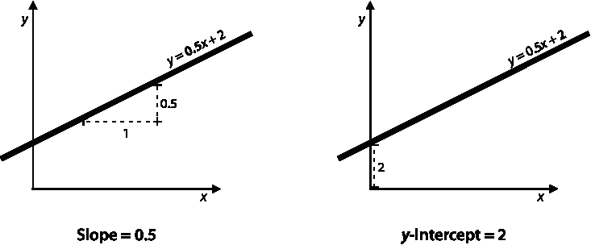

图 3.7 方程式为 y = 0.5x + 2 的线具有斜率 0.5（左侧）和 y 截距 2（右侧）。

这个方程式意味着什么？这意味着斜率是 0.5，而 y 截距是 2。

当我们说斜率是 0.5 时，这意味着当我们沿着这条线行走时，每向右移动一个单位，我们向上移动 0.5 个单位。如果完全不向上移动，斜率可以是零；如果向下移动，斜率可以是负数。垂直线的斜率是未定义的，但幸运的是，这些在线性回归中不太可能出现。许多线条可以具有相同的斜率。如果我画出与图 3.7 中的线平行的任何线条，这条线在向右移动一个单位时也会上升 0.5 个单位。这就是 y 截距的作用所在。y 截距告诉我们线在哪里切割 y 轴。这条线在高度 2 处切割 x 轴，这就是 y 截距。

换句话说，线的斜率告诉我们线指向的方向，而 y 截距告诉我们线的位置。请注意，通过指定斜率和 y 截距，线就被完全确定了。在图 3.8 中，我们可以看到具有相同 y 截距的不同线条，以及具有相同斜率的不同线条。

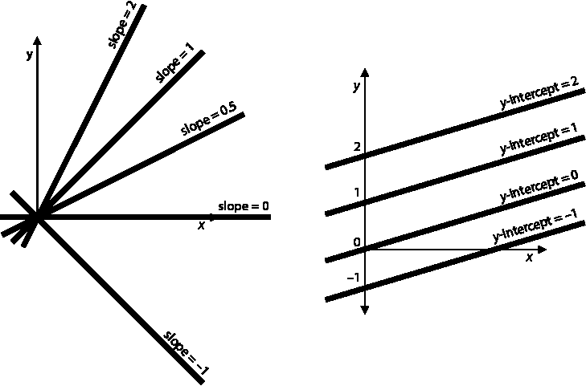

图 3.8 斜率和 y 截距的一些示例。在左侧，我们看到几条具有相同截距但斜率不同的线条。请注意，斜率越高，线越陡峭。在右侧，我们看到几条具有相同斜率但 y 截距不同的线条。请注意，y 截距越高，线所在的位置越高。

在我们当前的住房示例中，斜率代表每间房的价格，而 y 截距代表房屋的基准价格。让我们记住这一点，当我们操作这些线条时，思考这对我们的房价模型做了什么。

从斜率和 y 截距的定义中，我们可以得出以下结论：

**改变斜率**：

+   如果我们增加一条线的斜率，这条线将逆时针旋转。

+   如果我们减少一条线的斜率，这条线将顺时针旋转。

这些旋转是在图 3.9 中显示的枢轴上进行的，即线和 y 轴的交点。

**改变** y**截距**：

+   如果我们增加一条线的 y 截距，这条线将向上平移。

+   如果我们降低一条线的 y 截距，这条线就会向下平移。

图 3.9 说明了这些旋转和平移，当我们想要调整我们的线性回归模型时，这些将很有用。

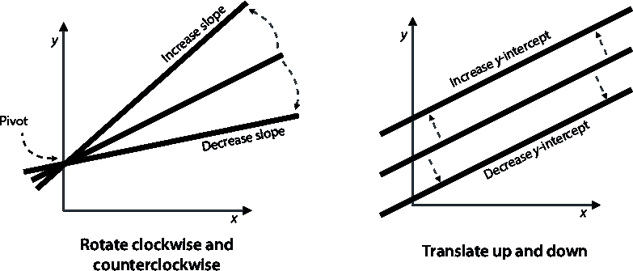

图 3.9 左侧：增加斜率会使线逆时针旋转，而减少斜率会使线顺时针旋转。右侧：增加 y 截距会使线向上平移，而减少 y 截距会使线向下平移。

如前所述，一般来说，直线的方程写作 *y* = *mx* + *b*，其中 *x* 和 *y* 分别对应水平和垂直坐标，*m* 对应斜率，*b* 对应 *y* 轴截距。在本章中，为了与符号一致，我们将方程写作  = *mr* + *b*，其中  对应预测价格，*r* 对应房间数量，*m*（斜率）对应每间房的价格，*b*（*y* 轴截距）对应房屋的基准价格。

将直线移近一组点的一个简单技巧，一次移动一个点

回想一下，线性回归算法由重复一个步骤组成，即我们移动直线使其更接近一个点。我们可以通过旋转和平移来实现这一点。在本节中，我们学习了一个称为 *简单技巧* 的技巧，该技巧包括稍微旋转并平移直线，使其朝向点的方向移动，从而使其更接近（图 3.10）。

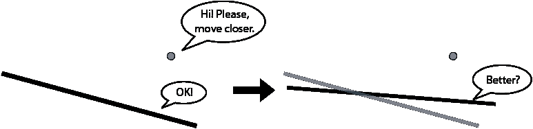

图 3.10 我们的目标是通过旋转和平移直线一小量，使其更接近点。

正确移动直线到点的技巧是确定点相对于直线的位置。如果点在直线上方，我们需要将直线向上平移，如果点在直线下方，我们需要将直线向下平移。旋转稍微困难一些，但由于旋转中心是直线与 *y* 轴的交点，我们可以看到如果点在直线上方且在 *y* 轴右侧，或者点在直线下方且在 *y* 轴左侧，我们需要将直线逆时针旋转。在其他两种情况下，我们需要将直线顺时针旋转。这些情况总结在以下四个案例中，如图 3.11 所示：

**案例 1**：如果点位于直线上方且在 *y* 轴右侧，我们将直线逆时针旋转并将其向上平移。

**案例 2**：如果点位于直线上方且在 *y* 轴左侧，我们将直线顺时针旋转并将其向上平移。

**案例 3**：如果点位于直线下方且在 *y* 轴右侧，我们将直线顺时针旋转并将其向下平移。

**案例 4**：如果点位于直线下方且在 *y* 轴左侧，我们将直线逆时针旋转并将其向下平移。

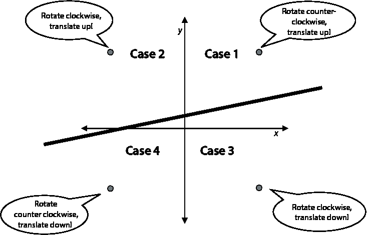

图 3.11 四种情况。在这些情况中，我们必须以不同的方式旋转并平移直线，以使直线更接近相应的点。

现在我们有了这四种情况，我们可以编写简单技巧的伪代码。但首先，让我们明确一些符号。在本节中，我们一直在谈论方程为 *y* = *mx* + *b* 的直线，其中 *m* 是斜率，*b* 是 *y* 轴截距。在房屋示例中，我们使用了以下类似的符号：

+   坐标为 (*r, p*) 的点对应有 *r* 间房且价格为 *p* 的房屋。

+   斜率 *m* 对应每间房的价格。

+   *y* 轴截距 *b* 对应房屋的基准价格。

+   预测值  = *mr* + *b* 对应于房屋的预测价格。

简单技巧的伪代码

输入：

+   斜率为 *m*、*y* 截距为 *b*、方程为  = *mr* + *b* 的线

+   坐标为 (*r*, *p*) 的点

输出：

+   方程为  = *m**'**r* + *b* 的线，该线更接近点

程序：

选择两个非常小的随机数，并称它们为 *η*[1] 和 *η*[2]（希腊字母 *eta*）。

**情况 1**：如果点位于线上且在 *y* 轴的右侧，我们将线逆时针旋转并向上平移：

+   将 *η*[1] 加到斜率 *m* 上。得到 *m**'* = *m* + *η*[1]。

+   将 *η*[2] 加到 *y* 截距 *b* 上。得到 *b**'* = *b* + *η*[2]。

**情况 2**：如果点位于线上且在 *y* 轴的左侧，我们将线顺时针旋转并向上平移：

+   从斜率 *m* 中减去 *η*[1]。得到 *m**'* = *m* – *η*[1]。

+   将 *η*[2] 加到 *y* 截距 *b* 上。得到 *b**'* = *b* + *η*[2]。

**情况 3**：如果点位于线下且在 *y* 轴的右侧，我们将线顺时针旋转并向下平移：

+   从斜率 *m* 中减去 *η*[1]。得到 *m**'* = *m* – *η*[1]。

+   从 *y* 截距 *b* 中减去 *η*[2]。得到 *b**'* = *b* – *η*[2]。

**情况 4**：如果点位于线下且在 *y* 轴的左侧，我们将线逆时针旋转并向下平移：

+   将 *η*[1] 加到斜率 *m* 上。得到 *m**'* = *m* + *η*[1]。

+   从 *y* 截距 *b* 中减去 *η*[2]。得到 *b**'* = *b* – *η*[2]。

**返回**：方程为  = *m**'**r* + *b**'**.* 的线

注意，对于我们的例子，向斜率中添加或减去一个小数意味着增加或减少每间房的价格。同样，向 *y* 截距中添加或减去一个小数意味着增加或减少房屋的基本价格。此外，因为 *x* 坐标是房间数，这个数永远不会是负数。因此，在我们的例子中，只有情况 1 和 3 是重要的，这意味着我们可以用口语化的语言总结简单技巧如下：

简单技巧

+   如果模型给出的房价低于实际价格，则将每间房的价格和房屋的基本价格中加上一个小随机数。

+   如果模型给出的房价高于实际价格，则从每间房的价格和房屋的基本价格中减去一个小随机数。

这个技巧在实践中取得了一些成功，但离最佳移动线的方法还远。可能会出现一些问题，例如以下问题：

+   我们能否为 *η*[1] 和 *η*[2] 选择更好的值？

+   我们能否将四个情况合并为两个，或者可能是一个？

两个问题的答案都是肯定的，我们将在接下来的两个部分中看到这一点。

平方技巧：将我们的线移近其中一个点的一个更巧妙的方法

在本节中，我将向您展示一种有效的方法，使直线更接近一个点。我称这个技巧为 *square trick*。回想一下，简单技巧基于四个基于点相对于直线位置的场景。square trick 将这四个场景简化为一个，通过找到正确的符号（+或-）的值来添加到斜率和 *y*-截距，使直线始终更接近点。

我们从 *y*-截距开始。注意以下两个观察结果：

+   **观察 1**：在简单技巧中，当点在直线上方时，我们向 *y*-截距添加一小部分。当它在直线下方时，我们减去一小部分。

+   **观察 2**：如果一个点在直线上方，值 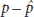（价格与预测价格的差值）是正的。如果它在直线下方，这个值就是负的。这个观察结果在图 3.12 中得到了说明。

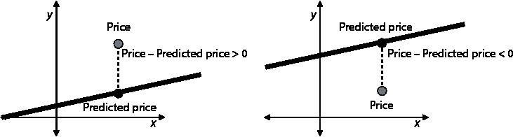

图 3.12 左：当点在直线上方时，价格大于预测价格，因此差值是正的。右：当点在直线下方时，价格小于预测价格，因此差值是负的。

将观察 1 和观察 2 结合起来，我们得出结论，如果我们把差值  添加到 *y*-截距，直线将始终朝向点移动，因为当点在直线上方时这个值是正的，当点在直线下方时这个值是负的。然而，在机器学习中，我们总是希望采取小步骤。为了帮助我们做到这一点，我们引入了机器学习中的一个重要概念：学习率。

学习率 在训练模型之前我们选择的一个非常小的数字。这个数字帮助我们确保通过训练，我们的模型以非常小的量发生变化。在这本书中，学习率将用 *η*，希腊字母 *eta* 表示。

由于学习率很小，因此 *η*() 的值也很小。这是我们添加到 *y*-截距的值，以使直线朝着点的方向移动。

需要添加到斜率中的值类似，但稍微复杂一些。注意以下两个观察结果：

+   **观察 3**：在简单技巧中，当点处于场景 1 或 4（在垂直轴上方且在直线上方，或在垂直轴下方且在直线下方）时，我们逆时针旋转直线。否则（场景 2 或 3），我们顺时针旋转。

+   **观察 4**：如果一个点 (*r*, *p*) 在垂直轴右侧，那么 *r* 是正的。如果点在垂直轴左侧，那么 *r* 是负的。这个观察结果在图 3.13 中得到了说明。注意，在这个例子中，*r* 从不会是负的，因为它代表的是房间数。然而，在一般例子中，一个特征可能是负的。

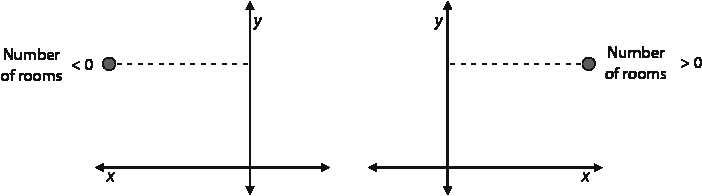

图 3.13 左：当点在 **y**-轴左侧时，房间数是负的。右：当点在 **y**-轴右侧时，房间数是正的。

考虑值 *r*(). 当 *r* 和  都为正或都为负时，此值是正的。这正是情况 1 和 4 中发生的情况。同样，*r*() 在情况 2 和 3 中为负。因此，根据观察 4，这是我们需要添加到斜率中的量。我们希望这个值很小，所以再次，我们将其乘以学习率，并得出结论，将 *η**r*() 添加到斜率中，将始终使线向点的方向移动。

我们现在可以编写平方技巧的伪代码如下：

平方技巧的伪代码

输入：

+   斜率为 *m*，*y*-截距 *b*，方程为  = *mr* + *b*

+   坐标为 (*r*, *p*) 的点

+   一个小的正值 *η*（学习率）

输出：

+   方程为  = *m**'**r* + *b**'* 且更接近点的线

程序：

+   将 *η**r*() 添加到斜率 *m*。得到 *m**'* = *m* + *η**r*()（这会旋转线）。

+   将 *η*() 添加到 *y*-截距 *b*。得到 *b**'* = *b* + *η*()（这会平移线）。

**返回**：方程为  = *m**'**r* + *b**'* 的线

我们现在准备好用 Python 编写这个算法！本节的代码如下：

+   **注意**：Coding_linear_regression.ipynb

    +   [`github.com/luisguiserrano/manning/blob/master/Chapter_3_Linear_Regression/Coding_linear_regression.ipynb`](https://github.com/luisguiserrano/manning/blob/master/Chapter_3_Linear_Regression/Coding_linear_regression.ipynb)

下面是平方技巧的代码：

```
def square_trick(base_price, price_per_room, num_rooms, price, learning_rate):
    predicted_price = base_price + price_per_room*num_rooms           ❶
    base_price += learning_rate*(price-predicted_price)               ❷
    price_per_room += learning_rate*num_rooms*(price-predicted_price) ❸
    return price_per_room, base_price
```

❶ 计算预测值

❷ 翻译该行

❸ 旋转线

绝对技巧：另一个有用的技巧，用于将线移得更接近点

平方技巧是有效的，但另一个有用的技巧，我们称之为 *绝对技巧*，是简单技巧和平方技巧之间的中间技巧。在平方技巧中，我们使用了两个量，（价格 - 预测价格）和 *r*（房间数），帮助我们把这四种情况简化为一种。在绝对技巧中，我们只使用 *r* 来帮助我们把这四种情况简化为两种。换句话说，这里是绝对技巧：

绝对技巧的伪代码

输入：

+   斜率为 *m*，*y*-截距 *b*，方程为  = *mr* + *b*

+   坐标为 (*r*, *p*) 的点

+   一个小的正值 *η*（学习率）

输出：

+   方程为  = *m**'**r* + *b**'* 且更接近点的线

程序：

**情况 1**：如果点在线上方（即，如果 *p* > ）：

+   将 *η**r* 添加到斜率 *m*。得到 *m**'* = *m* + *η**r*（如果点在 y 轴右侧，则使直线逆时针旋转，如果点在 y 轴左侧，则使直线顺时针旋转）。

+   将 *η* 添加到 y 截距 *b*。得到 *b**'* = *b* + *η*（这使直线向上移动）。

**情况 2**：如果点在直线下方（即，如果 *p* < ）：

+   从斜率 *m* 中减去 *η**r*。得到 *m**'* = *m* – *η**r*（如果点在 y 轴右侧，则使直线顺时针旋转，如果点在 y 轴左侧，则使直线逆时针旋转）。

+   从 y 截距 *b* 中减去 *η*。得到 *b**'* = *b* – *η*（这使直线向下移动）。

**返回**：方程  = *m**'**r* + *b**'*

这是绝对值技巧的代码：

```
def absolute_trick(base_price, price_per_room, num_rooms, price, learning_rate):
    predicted_price = base_price + price_per_room*num_rooms
    if price > predicted_price:
        price_per_room += learning_rate*num_rooms
        base_price += learning_rate
    else:
        price_per_room -= learning_rate*num_rooms
        base_price -= learning_rate
    return price_per_room, base_price
```

我鼓励你验证添加到每个权重中的数量确实具有正确的符号，就像我们使用平方技巧所做的那样。

线性回归算法：重复使用绝对值或平方技巧多次，使直线更接近点

现在我们已经完成了所有艰苦的工作，我们准备开发线性回归算法！这个算法以一系列点作为输入，并返回一条很好地拟合这些点的直线。这个算法包括从随机值开始为我们的斜率和 y 截距，然后重复多次使用绝对值或平方技巧来更新它们的步骤。以下是伪代码：

线性回归算法的伪代码

输入：

+   房屋数量和价格的数据集

输出：

+   模型权重：每间房的价格和基础价格

程序：

+   以斜率和 y 截距的随机值开始。

+   重复多次：

    +   随机选择一个数据点。

    +   使用绝对值或平方技巧更新斜率和 y 截距。

每次循环迭代被称为一个*epoch*，我们在算法开始时设置这个数字。简单的技巧主要用于说明，但如前所述，它并不非常有效。在现实生活中，我们使用绝对值或平方技巧，这要有效得多。事实上，尽管两者都常用，但平方技巧更受欢迎。因此，我们将使用这个技巧，但如果你更喜欢，也可以使用绝对值技巧。

这是线性回归算法的代码。请注意，我们使用了 Python 随机包来生成随机数作为我们的初始值（斜率和 y 截距）以及在选择循环内的点：

```
import random ❶
def linear_regression(features, labels, learning_rate=0.01, epochs = 1000):
    price_per_room = random.random()
    base_price = random.random() ❷
    for epoch in range(epochs):  ❸
        i = random.randint(0, len(features)-1) ❹
        num_rooms = features[i]
        price = labels[i]
        price_per_room, base_price = square_trick(base_price,
                                                  price_per_room,
                                                  num_rooms,
                                                  price,
                                                  learning_rate=learning_rate) ❺
    return price_per_room, base_price
```

❶ 导入随机包以生成（伪）随机数

❷ 为斜率和 y 截距生成随机值

❸ 多次重复更新步骤

❹ 在我们的数据集上随机选择一个点

❺ 应用平方技巧将直线移动到我们的点附近

下一步是运行这个算法来构建一个适合我们数据集的模型。

加载数据并绘制它

在本章中，我们使用 Matplotlib 和 NumPy 这两个非常有用的 Python 包加载数据和绘制模型图。我们使用 NumPy 存储数组并执行数学运算，而使用 Matplotlib 进行绘图。

我们首先将数据集的特征和标签编码到表 3.2 中，如下所示：

```
import numpy as np
features = np.array([1,2,3,5,6,7])
labels = np.array([155, 197, 244, 356, 407, 448])
```

接下来我们绘制数据集。在仓库中，我们有一些用于绘制文件的函数[utils.py](http://utils.py)，你可以查看一下。数据集的绘图显示在图 3.14 中。注意点确实看起来接近形成一条线。

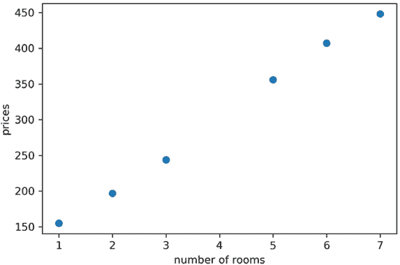

图 3.14 表 3.2 中点的绘图

在我们的数据集中使用线性回归算法

现在，让我们将算法应用于拟合这些点的线条。以下代码行运行算法，使用特征、标签、学习率为 0.01，epoch 数为 10,000。结果是图 3.15 中显示的绘图。

```
linear_regression(features, labels, learning_rate = 0.01, epochs = 10000)
```

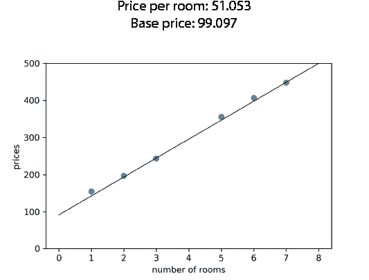

图 3.15 表 3.2 中点的绘图以及我们用线性回归算法获得的线条

图 3.15 显示了每间房（四舍五入）的价格为 51.05 美元，基础价格为 99.10 美元的线条。这并不远于我们在本章早期用肉眼估算的 50 美元和 100 美元。

为了可视化这个过程，让我们更详细地看看进度。在图 3.16 中，你可以看到一些中间线条。注意线条开始时离点很远。随着算法的进行，它逐渐缓慢地更好地拟合每次。注意在最初（前 10 个 epoch），线条快速地向好的解决方案移动。在第 50 个 epoch 之后，线条很好，但仍然没有完美地拟合点。如果我们让它运行整个 10,000 个 epoch，我们会得到一个非常好的拟合。

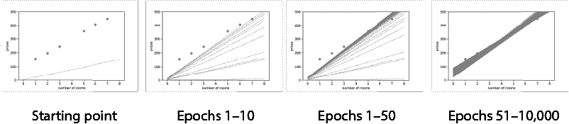

图 3.16 展示了我们算法中一些线条的绘制，随着我们接近更好的解决方案。第一幅图显示了起点。第二幅图显示了线性回归算法的前 10 个 epoch。注意线条是如何逐渐靠近拟合点的。第三幅图显示了前 50 个 epoch。第四幅图显示了第 51 个 epoch 到第 10,000 个 epoch（最后一个 epoch）。

使用模型进行预测

现在我们有一个闪亮的线性回归模型，我们可以用它来做出预测！回想一下本章开头，我们的目标是预测四间房的房子的价格。在上一节中，我们运行了算法，得到了斜率（每间房的价格）为 51.05 和*y*截距（房子的基础价格）为 99.10。因此，方程如下：

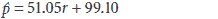

模型对有*r* = 4 个房间的房子的预测是

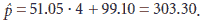

注意 303.30 并不远于我们在本章开头用肉眼估算的 300 美元！

通用线性回归算法（可选）

这一节是可选的，因为它主要关注用于通用 dataset 的更抽象算法的数学细节。然而，我鼓励你阅读它，以便熟悉在大多数机器学习文献中使用的符号。

在前面的章节中，我们概述了针对只有一个特征的 dataset 的线性回归算法。但正如你可以想象的那样，在现实生活中，我们将处理具有许多特征的 dataset。为此，我们需要一个通用算法。好消息是通用算法与我们在本章中学到的特定算法没有太大区别。唯一的区别是每个特征都是按照斜率更新的方式更新的。在住房示例中，我们有一个斜率和一个 *y*-截距。在一般情况中，可以想象有许多斜率，但仍然只有一个 *y*-截距。

一般情况将包含一个包含 *m* 个点和 *n* 个特征的 dataset。因此，该模型有 *m* 个权重（可以将其视为斜率的推广）和一个偏差。符号如下：

+   数据点是 *x*^((1))，*x*^((2))，…，*x*^(^m^)。每个点都是 *x*^(^i^) = (*x*[1]^(^i^)，*x*[2]^(^i^)，…，*x*[n]^(^i^)) 的形式。

+   相应的标签是 *y*[1]，*y*[2]，…，*y*[m]。

+   模型的权重为 *w*[1]，*w*[2]，…，*w*[n]。

+   模型的偏差为 *b*。

一般平方技巧的伪代码

输入：

+   方程为 *ŷ* = *w*[1]*x*[1] + *w*[2]*x*[2+] + … + *w*[n]*x*[n] + *b* 的模型

+   坐标为 (*x*, *y*) 的点

+   一个小的正值 *η*（学习率）

输出：

+   一个方程为 *ŷ* = *w*[1]*'**x*[1] + *w*[2]*'**x*[2] + … + *w*[n]*'**x*[n] + *b**'* 的模型，该模型更接近点

程序：

+   将 *η*(*y* – *ŷ*) 添加到 *y*-截距 *b*。得到 *b**'* = *b* + *η*(*y* – *ŷ*)。

+   对于 *i* = 1, 2, …, *n*：

    +   将 *η**x*(*y* – *ŷ*) 添加到权重 *w*[i]。得到 *w*[i]*'* = *w*[i]+ *η**r*(*y* – *ŷ*)。

**返回**：方程为 *ŷ* = *w*[1]*'**x*[1] + *w*[2]*'**x*[2] + … + *w*[n]*'**x*[n] + *b**' 的模型

一般线性回归算法的伪代码与“线性回归算法”部分中的相同，因为它包含对一般平方技巧的迭代，所以我们将其省略。

## 我们如何衡量我们的结果？误差函数

在前面的章节中，我们开发了一种直接的方法来找到最佳拟合线。然而，很多时候使用直接方法来解决机器学习中的问题是很困难的。一种更间接但更机械的方法是使用*误差函数*。误差函数是一个指标，告诉我们我们的模型表现如何。例如，看看图 3.17 中的两个模型。左边的是一个不好的模型，而右边的是一个好的模型。误差函数通过给左边的坏模型分配一个大的值，给右边的好模型分配一个小的值来衡量这一点。误差函数有时在文献中也被称为*损失函数*或*代价函数*。在这本书中，我们除了在某些更常用的名称需要的情况下，通常称之为误差函数。

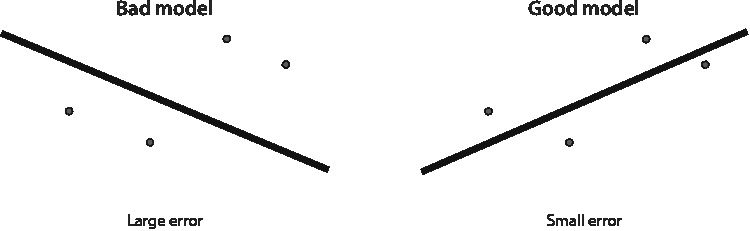

图 3.17 两个模型，一个不好的（在左边）和一个好的（在右边）。不好的模型被分配了一个大的误差，而好的模型被分配了一个小的误差。

现在的问题是，我们如何为线性回归模型定义一个好的误差函数？我们有两种常见的方法来做这件事，称为*绝对误差*和*平方误差*。简而言之，绝对误差是数据集中点到直线的垂直距离之和，平方误差是这些距离的平方之和。

在接下来的几节中，我们将更详细地了解这两个误差函数。然后我们看看如何使用称为梯度下降的方法来减少它们。最后，我们绘制其中一个

在我们现有的例子中查看误差函数，看看梯度下降法如何快速帮助我们减小它。

绝对误差：一个通过添加距离来告诉我们模型好坏的指标

在本节中，我们来看绝对误差，这是一个衡量我们模型好坏的指标。绝对误差是数据点与直线之间的距离之和。为什么叫绝对误差？为了计算每个距离，我们取标签与预测标签之间的差值。这个差值可以是正的或负的，取决于点是在直线上方还是下方。为了将这个差值转换成一个始终为正的数，我们取它的绝对值。

根据定义，一个好的线性回归模型是线接近点的模型。在这种情况下，“接近”是什么意思？这是一个主观问题，因为接近一些点的线可能离其他点很远。在这种情况下，我们更愿意选择一个对一些点非常接近而对其他点较远的线，还是尝试选择一个对所有点都有些接近的线？绝对误差帮助我们做出这个决定。我们选择的线是使绝对误差最小化的线，即每个点到线的垂直距离之和最小的线。在图 3.18 中，你可以看到两条线，它们的绝对误差被描绘为垂直线段的总和。左侧的线绝对误差较大，而右侧的线绝对误差较小。因此，在这两条线之间，我们会选择右侧的那条线。

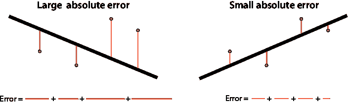

图 3.18 绝对误差是点与线之间的垂直距离之和。注意，左侧的坏模型绝对误差较大，而右侧的好模型绝对误差较小。

平方误差：一个度量，通过添加距离的平方来告诉我们我们的模型有多好

平方误差与绝对误差非常相似，除了我们不是取标签和预测标签之间差异的绝对值，而是取平方。这总是将数字转换为正数，因为平方一个数字总是使其变为正数。这个过程在图 3.19 中得到了说明，其中平方误差被描绘为点与线之间长度的平方的面积之和。你可以看到左侧的坏模型平方误差较大，而右侧的好模型平方误差较小。

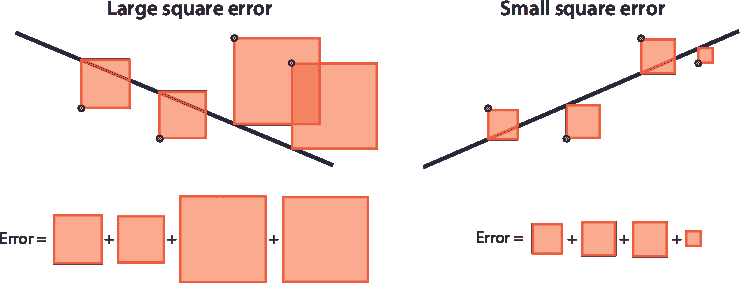

图 3.19 平方误差是点与线之间垂直距离的平方之和。注意，左侧的坏模型平方误差较大，而右侧的好模型平方误差较小。

如前所述，在实践应用中，平方误差比绝对误差使用得更普遍。为什么？因为平方的导数比绝对值要平滑得多，这在训练过程中非常有用。

在现实生活中，平均绝对误差和（根）均方误差更为常见

在本章中，我们使用绝对误差和平方误差进行说明。然而，在实践中，*平均绝对误差*和*平均平方误差*使用得更为普遍。它们的定义方式类似，只是我们计算的是平均值而不是总和。因此，平均绝对误差是点到线的垂直距离的平均值，平均平方误差是这些距离平方的平均值。为什么它们更常见呢？想象一下，如果我们想使用两个数据集来比较误差或模型，一个有 10 个点，另一个有 100 万个点。如果误差是每个点的数量之和，那么在 100 万个点的数据集中，误差可能要高得多，因为我们正在添加更多的数字。如果我们想正确比较它们，我们就在误差的计算中使用平均值，以获得一条线与每个点平均距离的度量。

为了说明目的，另一个常用的错误是**均方根误差**，或简称为*RMSE*。正如其名所示，这是均方误差的平方根。它用于匹配问题中的单位，并帮助我们更好地了解模型在预测中产生的误差有多大。为什么会这样呢？想象以下场景：如果我们试图预测房价，那么价格和预测价格的单位，例如，是美元（$）。平方误差和均方误差的单位是美元的平方，这不是一个常见的单位。如果我们取平方根，那么我们不仅得到正确的单位，而且还能更准确地了解模型每套房子偏离多少美元。比如说，如果均方根误差是$10,000，那么我们可以预期模型在每次预测中都会产生大约$10,000 的误差。

梯度下降：如何通过缓慢下降从山上减少误差函数

在本节中，我将向您展示如何使用类似于我们缓慢下降从山上使用的方法来减少任何之前的误差。这个过程使用导数，但好消息是：您不需要理解导数。我们已经在之前的“平方技巧”和“绝对技巧”部分中使用了它们。每次我们“在这个方向上移动一小步”，我们都在后台计算误差函数的导数，并使用它来给我们一个移动线的方向。如果您喜欢微积分并且想看到使用导数和梯度的整个算法推导，请参阅附录 B。

让我们退一步，从远处看看线性回归。我们想要做什么？我们想要找到最适合我们数据的线。我们有一个称为误差函数的度量，它告诉我们一条线离数据有多远。因此，如果我们能尽可能减少这个数字，我们就能找到最佳拟合线。这个过程在数学的许多领域都很常见，被称为“最小化函数”，即找到函数可能返回的最小可能值。这就是梯度下降发挥作用的地方：它是一种很好的最小化函数的方法。

在这种情况下，我们试图最小化的函数是模型误差（绝对值或平方值）。一个小小的警告是，梯度下降并不总是找到函数的精确最小值，但它可能会找到非常接近的值。好消息是，在实践中，梯度下降在找到函数值较低的点方面既快又有效。

梯度下降是如何工作的？梯度下降相当于从山上下来。假设我们发现自己站在一个名叫埃罗斯特的高山上。我们希望下山，但雾很大，我们只能看到大约一米的距离。我们该怎么办？一个好方法是环顾四周，找出我们能够迈出一步的方向，这样我们就能下降得最多。这个过程在图 3.20 中得到了说明。

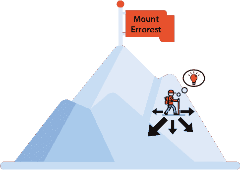

图 3.20 我们站在埃罗斯特山顶上，希望到达底部，但我们看得不是很远。一种下山的办法是看看我们能够迈出一步的所有方向，并找出哪一个能让我们下降得最多。这样我们就离底部更近了一步。

当我们找到这个方向时，我们迈出一小步，因为这一步是在最大下降方向上迈出的，所以很可能会下降一小段距离。我们只需要重复这个过程很多次，直到我们（希望）到达底部。这个过程在图 3.21 中得到了说明。

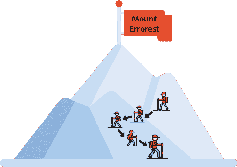

图 3.21 从山上下来的方法是朝着让我们下降最多的方向迈出那一步，并且长时间地继续这样做。

为什么我说“希望”呢？因为这个过程有很多注意事项。我们可能会到达底部，或者我们可能会到达一个山谷，然后我们就无处可去了。我们现在不处理这个问题，但我们有一些技术可以减少这种情况发生的概率。在附录 B“使用梯度下降训练神经网络”中，概述了一些这些技术。

在这里，我们故意忽略了很多数学内容，这些内容在附录 B 中有更详细的解释。但我们在本章中做的是精确的梯度下降。为什么会这样呢？梯度下降的工作原理如下：

1.  从山上某个地方开始。

1.  找到迈出这一小步的最佳方向。

1.  走出这一小步。

1.  重复步骤 2 和 3 多次。

这可能看起来很熟悉，因为在“线性回归算法”部分中，在定义绝对值和平方技巧之后，我们以以下方式定义了线性回归算法：

1.  从任何一条线开始。

1.  使用绝对值或平方技巧找到移动我们的线一点的最佳方向。

1.  在这个方向上稍微移动这条线。

1.  重复步骤 2 和 3 多次。

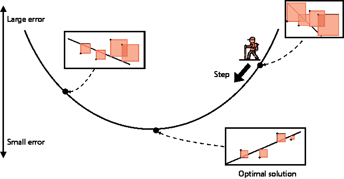

图 3.22 每个山上的点都对应一个不同的模型。下面的点代表误差小的良好模型，而上面的点代表误差大的不良模型。目标是下山。下山的方式是从某个地方开始，并持续采取使我们下山的步骤。梯度将帮助我们决定采取哪个方向的步骤可以帮助我们最大限度地下降。

这种心理图示如图 3.22 所示。唯一的区别是，这个误差函数看起来更像一个山谷而不是一座山，我们的目标是下降到最低点。山谷中的每个点都对应于一些试图拟合我们的数据的模型（线）。这个点的高度是由该模型给出的误差。因此，不良模型在顶部，良好模型在底部。我们试图尽可能低。每一步都使我们从一个模型到一个稍微好一点的模型。如果我们采取这样的步骤很多次，我们最终会得到最好的模型（或者至少，相当不错的一个！）。

绘制误差函数和知道何时停止运行算法

在本节中，我们看到的是我们在“使用线性回归算法在我们的数据集中”部分中较早进行的训练的误差函数图。这个图为我们提供了关于训练此模型的有用信息。在存储库中，我们还绘制了在“平均绝对值和（根）均方误差...”部分中定义的均方根误差函数（RMSE）。计算 RMSE 的代码如下：

```
def rmse(labels, predictions):
    n = len(labels)
    differences = np.subtract(labels, predictions)
    return np.sqrt(1.0/n * (np.dot(differences, differences)))
```

点积 为了编码 RMSE 函数，我们使用了点积，这是一种轻松地写出两个向量中对应项乘积之和的方法。例如，向量（1,2,3）和（4,5,6）的点积是 1 · 4 + 2 · 5 + 3 · 6 = 32。如果我们计算一个向量与自身的点积，我们得到该向量元素平方和。

我们误差的图示如图 3.23 所示。注意它在大约 1,000 次迭代后迅速下降，之后变化不大。这个图为我们提供了有用的信息：它告诉我们，对于这个模型，我们只需要运行训练算法 1,000 或 2,000 次，而不是 10,000 次，仍然可以得到相似的结果。

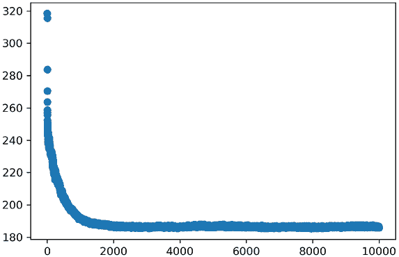

图 3.23 我们运行示例的均方根误差的图。注意算法在超过 1,000 次迭代后成功减少了这个误差。这意味着我们不需要运行这个算法 10,000 次，因为大约有 2,000 次就能完成任务。

通常，误差函数为我们提供了足够的信息来决定何时停止运行算法。通常，这个决定是基于我们可用的时间和计算能力。然而，在实际应用中，通常还会使用其他有用的基准，如下所示：

+   当损失函数达到我们预先设定的某个值时

+   当损失函数在几个时期内没有显著下降时

我们是一次训练一个点还是多个点？随机和批量梯度下降

在“如何让计算机绘制这条线”的部分，我们通过重复执行一个步骤多次来训练线性回归模型。这个步骤包括选择一个点并将线移动到该点。在“我们如何衡量我们的结果”的部分，我们通过计算误差（绝对值或平方值）并使用梯度下降来减少它来训练线性回归模型。然而，这个误差是在整个数据集上计算的，而不是逐点计算。为什么是这样？

事实上，我们可以通过逐点迭代或对整个数据集进行迭代来训练模型。然而，当数据集非常大时，这两种选择都可能很昂贵。我们可以练习一种有用的方法，称为 *小批量学习**，它包括将我们的数据分成许多小批量。在线性回归算法的每次迭代中，我们选择一个小批量，然后调整模型权重以减少该小批量中的误差。在每个迭代中使用一个点、一个小批量点或整个数据集的决定产生了三种类型的梯度下降算法。当我们每次使用一个点时，它被称为 *随机梯度下降*。当我们使用小批量时，它被称为 *小批量梯度下降*。当我们使用整个数据集时，它被称为 *批量梯度下降*。这个过程在附录 B “使用梯度下降训练模型”中进行了更详细的说明。

## 真实应用：使用 Turi Create 预测印度房价

在本节中，我将向你展示一个真实的应用案例。我们将使用线性回归来预测印度海得拉巴的房价。我们使用的数据集来自 Kaggle，这是一个流行的机器学习竞赛网站。本节的代码如下：

+   **笔记本**：House_price_predictions.ipynb

    +   [`github.com/luisguiserrano/manning/blob/master/Chapter_3_Linear_Regression/House_price_predictions.ipynb`](https://github.com/luisguiserrano/manning/blob/master/Chapter_3_Linear_Regression/House_price_predictions.ipynb)

+   **数据集**：Hyderabad.csv

这个数据集有 6,207 行（每行代表一栋房子）和 39 列（特征）。正如你所想象的，我们不会手动编写算法。相反，我们使用 Turi Create，这是一个流行的且非常有用的包，其中实现了许多机器学习算法。在 Turi Create 中存储数据的主要对象是 SFrame。我们首先使用以下命令将数据下载到 SFrame 中：

```
data = tc.SFrame('Hyderabad.csv')
```

表格太大，但你可以看到表 3.3 中的前几行和列。

表 3.3 海得拉巴房价数据集的前五行和七列

| 价格 | 面积 | 卧室数量 | 二手房 | 维护人员 | 健身房 | 游泳池 |
| --- | --- | --- | --- | --- | --- | --- |
| 30000000 | 3340 | 4 | 0 | 1 | 1 | 1 |
| 7888000 | 1045 | 2 | 0 | 0 | 1 | 1 |
| 4866000 | 1179 | 2 | 0 | 0 | 1 | 1 |
| 8358000 | 1675 | 3 | 0 | 0 | 0 | 0 |
| 6845000 | 1670 | 3 | 0 | 1 | 1 | 1 |

在 Turi Create 中训练线性回归模型只需要一行代码。我们使用来自线性回归包的 create 函数。在这个函数中，我们只需要指定目标（标签），即价格，如下所示：

```
model = tc.linear_regression.create(data, target='Price')
```

训练可能需要一些时间，但训练完成后，它会输出一些信息。其中之一是均方根误差。对于这个模型，RMSE 的数量级为 3,000,000。这是一个较大的 RMSE，但这并不意味着模型做出了糟糕的预测。它可能意味着数据集中有许多异常值。正如你可以想象的那样，房价可能取决于数据集中没有的其他许多特征。

我们可以使用这个模型来预测面积为 1,000 平方米，有三个卧室的房子的价格如下：

```
house = tc.SFrame({'Area': [1000], 'No. of Bedrooms':[3]})
model.predict(house)
Output: 2594841
```

模型输出，面积为 1,000 平方米，有三个卧室的房子的价格为 2,594,841。

我们也可以使用较少的特征来训练模型。create 函数允许我们输入作为数组想要使用的特征。以下代码行训练了一个名为 simple_model 的模型，它使用面积来预测价格：

```
simple_model = tc.linear_regression.create(data, features=['Area'], target='Price')
```

我们可以使用以下代码行来探索这个模型的权重：

```
simple_model.coefficients
```

输出给出了以下权重：

+   斜率：9664.97

+   *y*-截距：-6,105,981.01

截距是偏差，面积系数是当我们在面积和价格上绘制时线的斜率。点的绘制与相应模型的关系如图 3.24 所示。

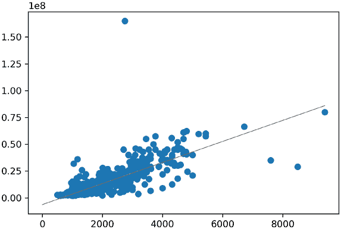

图 3.24 针对面积和价格限制的海得拉巴房价数据集。这条线是我们仅使用面积特征来预测价格所得到的模型。

我们可以在这个数据集中做很多事情，我邀请你继续探索。例如，通过查看模型的权重来探索哪些特征比其他特征更重要。我鼓励你查看 Turi Create 文档（[`apple.github.io/turicreate/docs/api/`](https://apple.github.io/turicreate/docs/api/）），了解你可以执行的其他函数和技巧来改进这个模型。

## 如果数据不是线性的呢？多项式回归

在前面的章节中，我们学习了如何在数据接近直线的情况下找到最佳拟合线。但如果我们发现数据并不呈线性呢？在本节中，我们将学习一种称为**多项式回归**的强大扩展，它帮助我们处理数据更复杂的情况。

一种特殊的曲线函数：多项式

要学习多项式回归，首先我们需要了解什么是多项式。*多项式*是一类在模拟非线性数据时很有用的函数。

我们已经看到过多项式了，因为每条线都是 1 次多项式。抛物线是 2 次多项式的例子。形式上，多项式是一个可以表示为该变量幂的倍数之和的函数。变量*x*的幂是 1，*x*，*x*²，*x*³，……。请注意，前两个是*x*⁰ = 1 和*x*¹ = *x*。因此，以下都是多项式的例子：

+   *y* = 4

+   *y* = 3*x* + 2

+   *y* = *x*² – 2*x* + 5

+   *y* = 2*x*³ + 8*x*² – 40

我们定义多项式的*次数*为多项式表达式中最高次幂的指数。例如，多项式*y* = 2*x*³ + 8*x*² – 40 的次数是 3，因为 3 是变量*x*被提升到的最高指数。请注意，在例子中，多项式的次数是 0，1，2 和 3。0 次多项式始终是一个常数，1 次多项式是我们在本章之前看到的线性方程。

多项式的图像看起来很像振荡几次的曲线。振荡的次数与多项式的次数有关。如果一个多项式的次数是*d*，那么该多项式的图像是一条最多振荡*d* – 1 次（对于*d* > 1）的曲线。在图 3.25 中，我们可以看到一些多项式示例的图像。

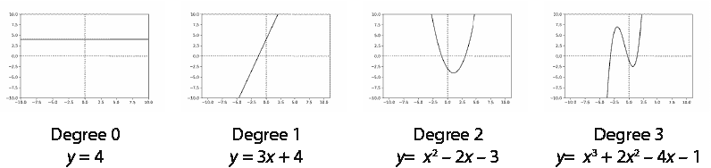

图 3.25 多项式是有助于我们更好地模拟数据的函数。以下是 0 到 3 次多项式的图像。请注意，0 次多项式是一条水平线，1 次多项式是任何一条直线，2 次多项式是抛物线，而 3 次多项式是一条振荡两次的曲线。

从图中可以看出，0 次多项式是平坦的直线。1 次多项式是斜率不为 0 的直线。2 次多项式是二次函数（抛物线）。3 次多项式看起来像是一条振荡两次的曲线（尽管它们可能振荡的次数更少）。一个 100 次多项式的图像会是什么样的呢？例如，*y* = *x*¹⁰⁰ – 8*x*⁶² + 73*x*²⁷ – 4*x* + 38 的图像？我们得画出来才能知道，但可以肯定的是，它是一条最多振荡 99 次的曲线。

非线性数据？没问题：让我们尝试将其拟合到多项式曲线上

在本节中，我们来看一下如果我们的数据不是线性的（即，看起来不像形成一条线），并且我们想要将其拟合到多项式曲线上会发生什么。假设我们的数据看起来像图 3.26 的左侧。无论我们尝试多少次，我们都无法真正找到一个适合这些数据的良好直线。没问题！如果我们决定拟合一个 3 次多项式（也称为三次多项式），那么我们就会得到图 3.26 右侧的曲线，它比数据拟合得更好。

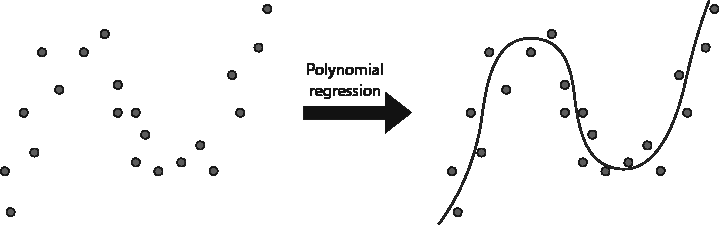

图 3.26 多项式回归在建模非线性数据时很有用。如果我们的数据看起来像图中的左侧部分，那么很难找到一条很好地拟合它的线。然而，正如你可以从图的右侧部分看到的那样，一条曲线可以很好地拟合数据。多项式回归帮助我们找到这条曲线。

训练多项式回归模型的过程与训练线性回归模型的过程类似。唯一的区别是我们需要在应用线性回归之前向我们的数据集中添加更多列。例如，如果我们决定将图 3.26 中的数据拟合到 3 次多项式，我们需要添加两列：一列对应特征的平方，另一列对应特征的立方。如果您想更详细地研究这个问题，请查看第四章中的“使用 Turi Create 进行多项式回归、测试和正则化”部分，其中我们学习了一个在抛物线数据集中进行多项式回归的例子。

在训练多项式回归模型时有一个小的注意事项，那就是我们必须在训练过程之前决定多项式的度数。我们如何决定这个度数？我们想要一条线（度数 1）、一个抛物线（度数 2）、一个立方（度数 3），还是某个 50 度的曲线？这个问题很重要，我们将在第四章中处理它，当我们学习过拟合、欠拟合和正则化时！

## 参数和超参数

参数和超参数是机器学习中一些最重要的概念，在本节中，我们将学习它们是什么以及如何区分它们。

正如我们在本章中看到的，回归模型由其权重和偏差定义——即模型的**参数**。然而，在训练模型之前，我们可以调整许多其他旋钮，例如学习率、迭代次数、度（如果考虑多项式回归模型），以及许多其他。这些被称为**超参数**。

在本书中，我们学习的每个机器学习模型都有一些定义良好的参数和超参数。它们往往容易混淆，所以区分它们的经验法则是：

+   在训练过程之前设置的任何数量都是超参数。

+   在训练过程中创建或修改的任何数量都是参数。

## 回归的应用

机器学习的影响不仅在于其算法的强大，还在于其有用应用的广泛性。在本节中，我们将看到线性回归在现实生活中的应用。在每个例子中，我们概述问题，学习一些特征来解决它，然后让线性回归施展其魔法。

推荐系统

机器学习被广泛应用于生成一些最知名应用中的良好推荐，包括 YouTube、Netflix、Facebook、Spotify 和 Amazon。在这些推荐系统中，回归扮演着关键角色。因为回归预测一个数量，我们生成良好推荐所需要做的只是找出哪个数量最能指示用户互动或用户满意度。以下是一些更具体的例子。

视频和音乐推荐

生成视频和音乐推荐的方法之一是预测用户将观看视频或听歌曲的时间长度。为此，我们可以创建一个线性回归模型，其中数据的标签是每个用户观看每首歌曲的分钟数。特征可以是关于用户的统计数据，例如他们的年龄、位置和职业，但它们也可以是行为数据，例如他们点击或与之互动的其他视频或歌曲。

产品推荐

商店和电子商务网站也使用线性回归来预测其销售额。一种方法是预测顾客在商店的花费。我们可以使用线性回归来完成这项工作。要预测的标签可以是用户花费的金额，特征可以是人口统计和行为数据，类似于视频和音乐推荐。

医疗保健

回归在医疗保健中有许多应用。根据我们想要解决的问题，预测正确的标签是关键。以下是一些例子：

+   基于患者的当前健康状况预测其寿命

+   根据当前症状预测住院时间长度

## 摘要

+   回归是机器学习的一个重要部分。它包括使用标签数据训练算法，并使用它来对未来（未标记）数据进行预测。

+   标签数据是带有标签的数据，在回归的情况下，这些标签是数字。例如，这些数字可以是房价。

+   在数据集中，特征是我们用来预测标签的性质。例如，如果我们想预测房价，特征就是描述房屋并可能决定价格的一切，例如大小、房间数量、学校质量、犯罪率、房屋年龄以及到高速公路的距离。

+   用于预测的线性回归方法在于为每个特征分配一个权重，并将相应的权重乘以特征，再加上一个偏差。

+   从图形上看，我们可以将线性回归算法视为尝试通过一条线尽可能接近一组点。

+   线性回归算法的工作方式是先从一个随机的线开始，然后逐渐将其移动到每个被错误分类的点附近，以尝试正确分类它们。

+   多项式回归是线性回归的推广，其中我们使用曲线而不是直线来模拟我们的数据。这在我们的数据集是非线性的情况下特别有用。

+   回归有众多应用，包括推荐系统、电子商务和医疗保健。

## 练习

练习 3.1

一个网站已经训练了一个线性回归模型来预测用户将在网站上花费的分钟数。他们获得的公式是

*t̂* = 0.8*d* + 0.5*m* + 0.5*y* + 0.2*a* + 1.5

其中 *t̂* 是预测的分钟数，而 *d*，*m*，*y* 和 *a* 是指示变量（即，它们只取 0 或 1 的值），定义如下：

+   *d* 是一个变量，表示用户是否在台式电脑上。

+   *m* 是一个变量，表示用户是否在移动设备上。

+   *y* 是一个变量，表示用户是否年轻（21 岁以下）。

+   *a* 是一个变量，表示用户是否为成年人（21 岁或以上）。

示例：如果用户 30 岁且使用台式电脑，则*d* = 1，*m* = 0，*y* = 0，*a* = 1。

如果一个 45 岁的用户从手机上查看网站，他们预计会在网站上花费多少时间？

练习 3.2

假设我们在一个医学数据集上训练了一个线性回归模型。该模型预测患者的预期寿命。对于数据集中的每个特征，模型都会分配一个权重。

a) 对于以下数量，说明你认为附加到该数量的权重是正数、负数还是零。注意：如果你认为权重是一个非常小的数，无论是正数还是负数，你可以说零。

1.  患者每周锻炼的小时数

1.  患者每周吸烟的数量

1.  有心脏问题的家庭成员数量

1.  患者的兄弟姐妹数量

1.  患者是否曾住院

b) 该模型也有偏差。你认为偏差是正数、负数还是零？

练习 3.3

以下是一个包含房屋尺寸（平方英尺）和价格（美元）的数据集。

|  | 尺寸 (s) | 奖金 (p) |
| --- | --- | --- |
| 房屋 1 | 100 | 200 |
| 房屋 2 | 200 | 475 |
| 房屋 3 | 200 | 400 |
| 房屋 4 | 250 | 520 |
| 房屋 5 | 325 | 735 |

假设我们已经训练了模型，其中基于尺寸预测房价如下：

 = 2*s* + 50

1.  计算此模型在数据集上的预测结果。

1.  计算此模型的平均绝对误差。

1.  计算此模型的均方根误差。

练习 3.4

我们的目标是使用本章学到的技巧将方程 *ŷ* = 2*x* + 3 的线移动得更接近点 (*x*, *y*) = (5, 15)。对于以下两个问题，使用学习率 *η* = 0.01。

1.  将上面的线通过绝对值技巧修改得更接近点。

1.  将上面的线通过平方技巧修改得更接近点。
