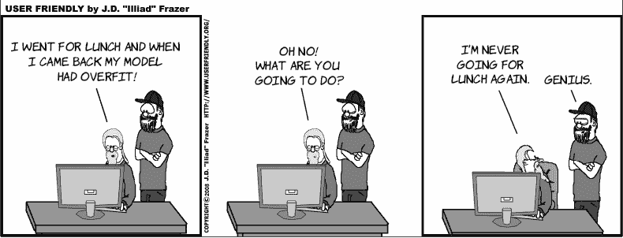
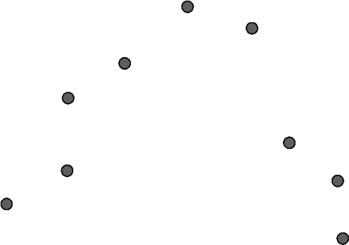
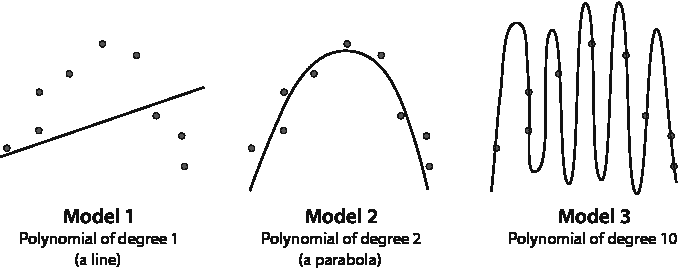
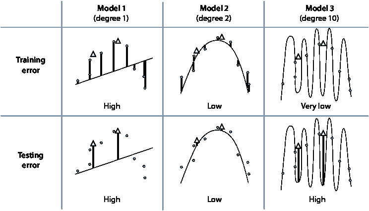
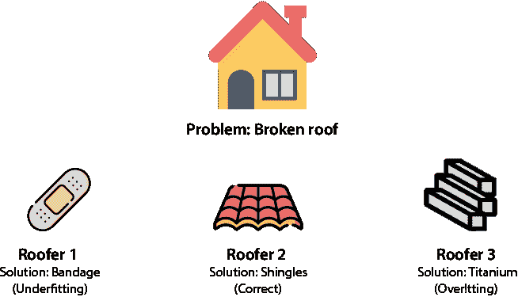
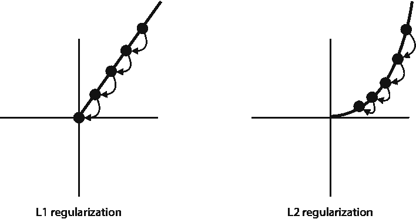
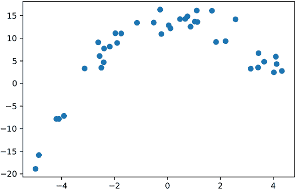

# 4 优化训练过程：欠拟合、过拟合、测试和正则化

在本章中

+   什么是欠拟合和过拟合

+   避免过拟合的一些解决方案：测试、模型复杂度图和正则化

+   使用 L1 和 L2 范数计算模型的复杂度

+   在性能和复杂度方面选择最佳模型



本章与本书中的大多数章节不同，因为它不包含特定的机器学习算法。相反，它描述了机器学习模型可能遇到的一些潜在问题以及有效的实际解决方法。

想象一下，你已经学习了一些优秀的机器学习算法，并且准备将它们应用到实践中。你作为一名数据科学家开始工作，你的第一个任务是针对客户数据集构建一个机器学习模型。你构建了模型并将其投入生产。然而，一切都不顺利，模型在预测方面表现不佳。发生了什么？

结果表明，这个故事很常见，因为我们的模型可能会出现很多问题。幸运的是，我们有几种技术来改进它们。在本章中，我向你展示了在训练模型时经常出现的两个问题：欠拟合和过拟合。然后，我展示了避免欠拟合和过拟合模型的一些解决方案：测试和验证、模型复杂度图和正则化。

让我们用以下类比来解释欠拟合和过拟合。假设我们必须为考试做准备。在学习过程中可能会出现很多问题。也许我们没有学习足够的内容。这是无法修复的，我们很可能会在考试中表现不佳。如果我们学习了很多，但方式错误呢？例如，我们决定逐字逐句地记住整本教科书，而不是专注于学习。我们会在考试中表现得好吗？很可能会不好，因为我们只是简单地记住了所有内容而没有真正学习。当然，最好的选择是以正确的方式为考试做准备，并且以能够回答我们之前没有见过的关于该主题的新问题。

在机器学习中，*欠拟合*很像考试前没有学习足够的内容。它发生在我们试图训练一个过于简单的模型，而这个模型无法学习数据。*过拟合*则很像为了考试而记住整本教科书而不是学习。它发生在我们试图训练一个过于复杂的模型，而这个模型只是记住数据而不是真正学习它。一个好的模型，既不过拟合也不欠拟合，就像考试前已经很好地学习了。这对应于一个能够正确学习数据并在未见过的新的数据上做出良好预测的好模型。

另一种思考欠拟合和过拟合的方式是当我们有一个任务在手。我们可以犯两个错误。我们可以过度简化问题，并提出一个过于简单的解决方案。我们也可以过度复杂化问题，并提出一个过于复杂的解决方案。

想象一下，如果我们的任务是杀死图 4.1 中所示的哥斯拉，而我们只带着苍蝇拍来战斗。这是一个*过度简化*的例子。这种方法对我们来说不会顺利，因为我们低估了问题，并且没有做好准备。这就是欠拟合：我们的数据集很复杂，而我们只带着一个简单的模型来建模。该模型将无法捕捉数据集的复杂性。

相比之下，如果我们任务是杀死一只小苍蝇，而我们使用火箭筒来完成这项工作，这就是一个*过度复杂化*的例子。是的，我们可能会杀死苍蝇，但也会摧毁所有手头的东西，并使自己处于危险之中。我们高估了问题，我们的解决方案并不好。这就是过拟合：我们的数据很简单，但我们试图将其拟合到一个过于复杂的模型中。该模型将能够拟合我们的数据，但它会记住它而不是学习它。我第一次学习过拟合时，我的反应是，“嗯，这没什么问题。如果我使用一个过于复杂的模型，我仍然可以对我的数据进行建模，对吧？”正确，但过拟合的真正问题是试图让模型对未见过的数据进行预测。预测结果可能会非常糟糕，正如我们在本章后面看到的。


图 4.1 欠拟合和过拟合是在训练我们的机器学习模型时可能出现的两个问题。左：当我们将手头的问题过度简化，并试图用简单的解决方案来解决它时，就会发生欠拟合，例如试图用苍蝇拍杀死哥斯拉。右：当我们过度复杂化问题的解决方案，并试图用极其复杂的解决方案来解决它时，就会发生过拟合，例如试图用火箭筒杀死一只苍蝇。

正如我们在第三章的“参数和超参数”部分中看到的，每个机器学习模型都有超参数，这些是我们训练模型之前可以旋转和调整的旋钮。为我们的模型设置正确的超参数至关重要。如果我们设置了一些错误的参数，我们很容易出现欠拟合或过拟合。本章中介绍的技术有助于我们正确调整超参数。

为了使这些概念更清晰，我们将通过一个数据集和几个不同的模型来举例说明，这些模型是通过改变一个特定的超参数创建的：多项式的度数。

你可以在以下 GitHub 仓库中找到本章的所有代码：[`github.com/luisguiserrano/manning/tree/master/Chapter_4_Testing_Overfitting_Underfitting`](https://github.com/luisguiserrano/manning/tree/master/Chapter_4_Testing_Overfitting_Underfitting)。

## 使用多项式回归的欠拟合和过拟合的例子

在本节中，我们看到了同一数据集中过拟合和欠拟合的例子。仔细观察图 4.2 中的数据集，并尝试拟合一个多项式回归模型。

（见第三章“如果数据不在一条线上怎么办？”部分）。让我们思考一下什么样的多项式可以拟合这个数据集。会是直线、抛物线、三次多项式，或者可能是 100 阶多项式？回想一下，多项式的次数是最高次幂。例如，多项式 2*x*¹⁴ + 9*x*⁶ – 3*x* + 2 的次数是 14。



图 4.2 在这个数据集中，我们训练了一些模型，并展示了训练问题，如欠拟合和过拟合。如果你要拟合这个数据集的多项式回归模型，你会使用什么类型的多项式：直线、抛物线，还是其他？

我认为这个数据集看起来很像一个开口向下的抛物线（一个悲伤的面孔）。这是一个二阶多项式。然而，我们是人类，我们只能凭肉眼判断。计算机无法做到这一点。计算机需要尝试多项式次数的许多值，并从中选择最佳的一个。假设计算机将尝试用一阶、二阶和十阶多项式来拟合它。当我们用一阶（直线）、二阶（二次）和十阶（最多振荡九次）多项式拟合这个数据集时，我们得到了图 4.3 中所示的结果。



图 4.3 将三个模型拟合到同一数据集。模型 1 是一阶多项式，即一条直线。模型 2 是二阶多项式，或称二次多项式。模型 3 是十阶多项式。哪一个看起来像是最佳拟合？

在图 4.3 中，我们看到三个模型，模型 1、模型 2 和模型 3。注意，模型 1 过于简单，因为它试图用一条直线拟合一个二次数据集。我们不可能找到一条好的直线来拟合这个数据集，因为这个数据集根本不像一条直线。因此，模型 1 是欠拟合的一个明显例子。相比之下，模型 2 很好地拟合了数据。这个模型既不过拟合也不欠拟合。模型 3 非常完美地拟合了数据，但它完全错过了重点。数据集应该看起来像一个带有一些噪声的抛物线，而该模型绘制了一个非常复杂、十次方的多项式，它设法通过了每一个点，但没有捕捉到数据的本质。模型 3 是过拟合的一个明显例子。

为了总结前面的推理，这里有一个我们在本章以及本书许多其他章节中使用的观察结果：非常简单的模型往往欠拟合。非常复杂的模型往往过拟合。目标是找到一个既不太简单也不太复杂，并且能够很好地捕捉我们数据本质的模型。

我们即将进入挑战性的部分。作为人类，我们知道最佳拟合由模型 2 提供。但计算机看到的是什么？计算机只能计算误差函数。你可能还记得第三章中我们定义了两个误差函数：绝对误差和平方误差。为了视觉清晰，在这个例子中我们将使用绝对误差，即点到曲线的距离绝对值的总和的平均值，尽管相同的论点也可以用于平方误差。对于模型 1，点远离模型，因此这个误差很大。对于模型 2，这些距离很小，所以误差很小。然而，对于模型 3，距离为零，因为所有点都落在实际曲线上！这意味着计算机将认为完美的模型是模型 3。这并不好。我们需要一种方法告诉计算机最佳模型是模型 2，而模型 3 是过度拟合。我们该如何做呢？我鼓励你在几分钟内放下这本书，自己思考一些想法，因为这个问题有几种解决方案。

## 我们如何让计算机选择正确的模型？通过测试

确定一个模型是否过度拟合的一种方法是通过测试，这正是我们在本节中要做的。测试一个模型包括从数据集中选择一小部分点，并选择不使用它们来训练模型，而是用来测试模型的表现。这个点集被称为*测试集*。剩余的点集（大多数），我们用它来训练模型，被称为*训练集*。一旦我们在训练集上训练了模型，我们就使用测试集来评估模型。这样，我们确保模型擅长泛化到未见过的数据，而不是记住训练集。回到考试的类比，让我们想象以这种方式进行培训和测试。假设我们为考试准备的书中最后有 100 个问题。我们选择 80 个来训练，这意味着我们学习

仔细阅读，查找答案，并学习它们。然后我们使用剩下的 20 个问题来测试自己——我们尝试在不看书的情况下回答它们，就像在考试环境中一样。

现在，让我们看看这种方法在我们的数据集和模型中是如何表现的。请注意，模型 3 的真正问题不在于它不拟合数据；而在于它对新数据的泛化能力不好。换句话说，如果你在数据集上训练了模型 3，并且出现了新的点，你会信任模型用这些新点做出良好的预测吗？可能不会，因为模型只是记住了整个数据集而没有抓住其本质。在这种情况下，数据集的本质是它看起来像向下开口的抛物线。

在图 4.4 中，我们在我们的数据集中画了两个白色三角形，代表测试集。训练集对应的是黑色圆圈。现在让我们详细检查这个图，看看这三个模型在训练集和测试集上的表现如何。换句话说，让我们检查模型在这两个数据集中产生的误差。我们将这两个误差称为*训练误差*和*测试误差*。

图 4.4 的顶部行对应于训练集，底部行对应于测试集。为了说明误差，我们从点到模型画了垂直线。平均绝对误差就是这些线长度的平均值。看顶部行，我们可以看到模型 1 有大的训练误差，模型 2 有小的训练误差，而模型 3 有极小的训练误差（实际上为零）。因此，模型 3 在训练集上做得最好。



图 4.4 我们可以使用这个表格来决定我们希望模型有多复杂。列代表三个模型，分别是 1 次、2 次和 10 次方的模型。列代表训练误差和测试误差。实心圆圈是训练集，白色三角形是测试集。每个点的误差可以看作是从点到曲线的垂直线。每个模型的误差是这些垂直长度的平均值给出的平均绝对误差。注意，随着模型复杂度的增加，训练误差会下降。然而，测试误差在增加后会下降然后再上升。从这个表中，我们得出结论，在这三个模型中，最好的一个是模型 2，因为它给我们带来了低的测试误差。

然而，当我们到达测试集时，情况发生了变化。模型 1 仍然有大的测试误差，这意味着这只是一个坏模型，在训练集和测试集上都表现不佳：它欠拟合。模型 2 有小的测试误差，这意味着它是一个好模型，因为它很好地拟合了训练集和测试集。然而，模型 3 却产生了大的测试误差。因为它在拟合测试集上做得如此糟糕，而在拟合训练集上做得如此好，我们得出结论，模型 3 过拟合了。

让我们总结一下到目前为止我们已经学到的内容。

模型可以

+   欠拟合：使用一个对我们数据集来说过于简单的模型。

+   良好拟合数据：使用一个对我们数据集来说复杂度合适的模型。

+   过拟合：使用一个对我们数据集来说过于复杂的模型。

在训练集中

+   欠拟合模型表现不佳（训练误差大）。

+   良好的模型表现良好（训练误差小）。

+   过拟合模型表现非常好（训练误差非常小）。

在测试集中

+   欠拟合模型表现不佳（测试误差大）。

+   良好的模型表现良好（测试误差小）。

+   过拟合模型表现不佳（测试误差大）。

因此，判断一个模型是否欠拟合、过拟合或表现良好，是查看训练集和测试集的错误。如果两个错误都高，那么它欠拟合。如果两个错误都低，那么它是一个好的模型。如果训练错误低而测试错误高，那么它过拟合。

我们如何选择测试集，它应该有多大？

这里有一个问题。我从哪里得到这两个新点？如果我们在一个数据始终流动的生产环境中训练模型，那么我们可以选择一些新点作为我们的测试数据。但如果我们没有获取新点的方法，而我们只有 10 个点的原始数据集呢？当这种情况发生时，我们就牺牲一些数据，将其用作测试集。需要多少数据？这取决于我们有多少数据以及我们希望模型做得有多好，但在实践中，任何从 10%到 20%的值似乎都工作得很好。

我们可以使用测试数据来训练模型吗？不可以。

在机器学习中，我们始终需要遵循一个重要的规则：当我们把数据分成训练集和测试集时，我们应该使用训练数据来训练模型，而且在训练模型或对模型的超参数做出决策时，绝对不应该触碰测试数据。未能这样做很可能会导致过拟合，甚至

如果人类没有注意到。在许多机器学习竞赛中，团队提交了他们认为很棒的模型，但它们在测试一个秘密数据集时却惨败。这可能是因为训练模型的数据科学家（可能是无意中）使用了测试数据来训练它们。事实上，这条规则非常重要，我们将把它作为本书的金科玉律。

金科玉律 你绝不应该使用你的测试数据来训练。

现在，这似乎是一个容易遵循的规则，但正如我们将看到的，这是一个很容易意外违反的规则。

实际上，我们在本章中已经违反了金科玉律。你能告诉我在哪里吗？我鼓励你回去找到我们违反规则的地方。我们将在下一节中看到。

## 我们在哪里违反了金科玉律，以及我们如何纠正它？验证集

在本节中，我们看到我们违反了金科玉律，并学习了一种称为验证的技术，它将帮助我们解决问题。

我们在“我们如何让计算机选择正确的模型”这一节中违反了金科玉律。回想一下，我们有三个多项式回归模型：一个是 1 次方，一个是 2 次方，还有一个是 10 次方，我们不知道该选择哪一个。我们使用训练数据来训练这三个模型，然后使用测试数据来决定选择哪个模型。我们不应该使用测试数据来训练我们的模型或对其或其超参数做出任何决策。一旦我们这样做，我们就有可能过拟合！每次我们构建一个过度适应数据集的模型时，我们都有可能过拟合。

我们能做什么？解决方案很简单：我们将数据集进一步分割。我们引入一个新的集合，即*验证集*，然后我们使用它来对我们的数据集做出决策。总的来说，我们将数据集分割成以下三个集合：

+   **训练集**：用于训练所有我们的模型

+   **验证集**：用于决定使用哪个模型

+   **测试集**：用于检查我们的模型表现如何

因此，在我们的例子中，我们会增加两个用于验证的点，查看验证错误应该有助于我们决定使用最佳的模型是模型 2。我们应在最后使用测试集来查看模型的表现。如果模型不好，我们应该丢弃一切，从头开始。

在测试集和验证集的大小方面，通常使用 60-20-20 分割或 80-10-10 分割——换句话说，60%用于训练，20%用于验证，20%用于测试，或者 80%用于训练，10%用于验证，10%用于测试。这些数字是任意的，但它们通常效果不错，因为它们为训练保留了大部分数据，但仍然允许我们在足够大的数据集上测试模型。

## 决定模型复杂度的数值方法：模型复杂度图

在前面的章节中，我们学习了如何使用验证集来帮助我们决定在三个不同的模型中哪个是最好的。在本节中，我们将了解一个称为*模型复杂度图*的图表，它帮助我们决定在更多模型中的选择。想象一下，我们有一个不同且复杂得多的数据集，我们正在尝试构建一个多项式回归模型来拟合它。我们想要决定模型度数在 0 到 10（包含）之间的哪个数值。正如我们在前面的章节中看到的，决定使用哪个模型的方法是选择具有最小验证错误的模型。

然而，绘制训练和测试错误图可以给我们提供一些有价值的信息，并帮助我们检查趋势。在图 4.5 中，你可以看到一个图表，其中水平轴代表模型中多项式的度数，垂直轴代表错误的值。菱形代表训练错误，圆圈代表验证错误。这就是模型复杂度图。


图 4.5 模型复杂度图是帮助我们确定模型理想复杂度的有效工具，以避免欠拟合和过拟合。在这个模型复杂度图中，水平轴表示几个多项式回归模型的程度，从 0 到 10（即模型的复杂度）。垂直轴表示错误，在这种情况下是由平均绝对误差给出的。请注意，随着我们向右移动，训练错误开始很大，然后减小。这是因为我们的模型越复杂，它就能更好地拟合训练数据。然而，验证错误开始很大，然后减小，然后再次增加——非常简单的模型无法很好地拟合我们的数据（它们欠拟合），而非常复杂的模型可以拟合我们的训练数据，但不能拟合我们的验证数据，因为它们过拟合。中间的一个快乐点是我们模型既不欠拟合也不过拟合，我们可以使用模型复杂度图找到它。

注意，在图 4.5 中的模型复杂度图中，验证错误的最低值出现在程度 4 处，这意味着对于这个数据集，最佳拟合模型（在我们考虑的模型中）是一个四次多项式回归模型。查看图的左侧，我们可以看到当多项式的程度较小时，训练和验证错误都很大，这表明模型欠拟合。查看图的右侧，我们可以看到训练错误越来越小，但验证错误越来越大，这表明模型过拟合。最佳点发生在大约 4 的位置，这是我们选择的模型。

模型复杂度图的优点之一是，无论我们的数据集有多大，或者我们尝试了多少不同的模型，它总是看起来像两条曲线：一条始终下降（训练错误）和一条下降后再次上升（验证错误）。当然，在一个大而复杂的数据集中，这些曲线可能会波动，行为可能更难发现。然而，模型复杂度图始终是数据科学家寻找图中良好位置并决定模型复杂度以避免欠拟合和过拟合的有用工具。

为什么我们需要这样的图表，如果我们只需要选择具有最低验证错误的模型呢？这种方法在理论上是正确的，但在实践中，作为一名数据科学家，你可能对你的问题、约束条件和基准有更深入的了解。例如，如果你看到具有最小验证错误的模型仍然相当复杂，而有一个更简单的模型，其验证错误仅略高，你可能更倾向于选择后者。一位伟大的数据科学家能够将理论工具与他们对用例的知识相结合，构建出最佳且最有效的模型。

## 避免过拟合的另一种替代方案：正则化

在本节中，我们讨论另一种有用的技术，用于避免模型过拟合，而无需测试集：*正则化*。正则化依赖于我们在“使用多项式回归的欠拟合和过拟合示例”部分中做出的相同观察，我们得出结论，简单模型往往欠拟合，而复杂模型往往过拟合。然而，在先前的方法中，我们测试了多个模型，并选择了性能和复杂性最佳平衡的那个模型。相比之下，当我们使用正则化时，我们不需要训练多个模型。我们只需训练一次模型，但在训练过程中，我们不仅要提高模型性能，还要降低其复杂性。做到这一点的关键是同时衡量性能和复杂性。

在我们深入细节之前，让我们讨论一个用于思考衡量模型性能和复杂性的类比。想象我们有三座房子，它们都存在相同的问题——屋顶漏水（图 4.6）。三位屋顶工来修理，每人修理一座房子。第一位屋顶工使用绷带，第二位使用屋顶瓦片，第三位使用钛。从我们的直觉来看，似乎第二位屋顶工是最好的，因为第一位屋顶工过于简化了问题（欠拟合），而第三位屋顶工过于复杂化（过拟合）。



图 4.6 欠拟合和过拟合的类比。我们的问题是一个破损的屋顶。我们有三位可以修理它的屋顶工。屋顶工 1 带着绷带来，屋顶工 2 带着屋顶瓦片来，屋顶工 3 带着一块钛。屋顶工 1 过于简化了问题，因此代表欠拟合。屋顶工 2 使用了良好的解决方案。屋顶工 3 过于复杂化了解决方案，因此代表过拟合。

然而，我们需要用数字来做出决定，所以让我们做一些测量。衡量屋顶工性能的方法是他们在修理屋顶后漏水量有多少。他们的评分如下：

性能（以漏水量计）

Roofer 1: 1000 mL 水

Roofer 2: 1 mL 水

Roofer 3: 0 mL 水

看起来屋顶工 1 的表现很糟糕，因为屋顶仍在漏水。然而，在屋顶工 2 和 3 之间，我们选择哪一个？也许屋顶工 3，因为他的表现更好？性能指标还不够好；它正确地排除了屋顶工 1，但它错误地告诉我们选择屋顶工 3，而不是屋顶工 2。我们需要一个衡量他们复杂性的指标来帮助我们做出正确的决定。衡量他们复杂性的一个好指标是他们修理屋顶所收取的费用，以美元计。价格如下：

复杂性（以价格计）

Roofer 1: $1

Roofer 2: $100

Roofer 3: $100,000

现在我们可以看出屋顶工 2 比屋顶工 3 更好，因为他们有相同的表现，但屋顶工 2 收费更低。然而，屋顶工 1 是最便宜的——为什么我们不选择这个呢？看起来我们需要做的是结合性能和复杂度的度量。我们可以加上屋顶漏水的量和价格，得到以下结果：

性能 + 复杂度

屋顶工 1：1001

屋顶工 2：101

屋顶工 3：100,000

现在很明显，屋顶工 2 是最好的，这意味着同时优化性能和复杂度可以得到既好又尽可能简单的结果。这就是正则化的目的：用两个不同的误差函数来衡量性能和复杂度，并将它们相加得到一个更鲁棒的误差函数。这个新的误差函数确保我们的模型表现良好且不太复杂。在接下来的章节中，我们将更详细地介绍如何定义这两个误差函数。但在那之前，让我们看看另一个过拟合的例子。

另一个过拟合的例子：电影推荐

在本节中，我们学习了一种更微妙的方式，模型可能会过拟合——这次与多项式的度数无关，而是与特征的数量和系数的大小有关。想象一下，我们有一个电影流媒体网站，我们正在尝试构建一个推荐系统。为了简单起见，假设我们只有 10 部电影：M1, M2, …, M10。一部新电影 M11 出现了，我们希望基于之前的 10 部电影构建一个线性回归模型来推荐电影 11。我们有一个 100 个用户的数据库。对于每个用户，我们有 10 个特征，这些特征是用户观看每部原始 10 部电影的时间（以秒为单位）。如果用户没有观看电影，那么这个量就是 0。每个用户的标签是用户观看电影 11 的时间量。我们希望构建一个适合这个数据集的模型。鉴于模型是线性回归模型，预测用户将观看电影 11 的时间的方程是线性的，它看起来如下：

*ŷ* = *w*[1]*x*[1] + *w*[2]*x*[2] + *w*[3]*x*[3]+ *w*[4]*x*[4] + *w*[5]*x*[5] + *w*[6]*x*[6] + *w*[7]*x*[7] + *w*[8]*x*[8] ++ *w*[9]*x*[9] + *w*[10]*x*[10] + *b*，

其中

+   *ŷ* 是模型预测用户将观看电影 11 的时间量，

+   *x*[i] 是用户观看电影 *i* 的时间量，对于 *i* = 1, 2, …, 10，

+   *w*[i] 是与电影 *i* 相关的权重，并且

+   *b* 是偏差。

现在我们来测试我们的直觉。在以下两个模型（由它们的方程给出）中，哪一个（或哪几个）看起来可能存在过拟合？

**模型 1**：*ŷ* = 2*x*[3] + 1.4*x*[7] – 0.5*x*[7] + 4

**模型 2**：*ŷ* = 22*x*[1] – 103*x*[2] – 14*x*[3] + 109*x*[4] – 93*x*[5] + 203*x*[6] + 87*x*[7] – 55*x*[8] + 378*x*[9] – 25*x*[10] + 8

如果你像我一样思考，模型 2 似乎有点复杂，它可能是过度拟合的。这里的直觉是，用户观看电影 2 的时间乘以-103 然后加到其他数字上以获得预测是不太可能的。这可能很好地拟合数据，但它肯定看起来像是在记忆数据而不是学习数据。

相比之下，模型 1 看起来要简单得多，并且它提供了一些有趣的信息。从大多数系数为零的事实来看，除了电影 3、7 和 9 的系数外，它告诉我们与电影 11 相关的只有这三部电影。此外，从电影 3 和 7 的系数为正的事实来看，模型告诉我们，如果一个用户观看了电影 3 或电影 7，那么他们很可能也会观看电影 11。因为电影 9 的系数为负，所以如果一个用户观看了电影 9，他们不太可能观看电影 11。

我们的目标是拥有像模型 1 这样的模型，并避免像模型 2 这样的模型。但不幸的是，如果模型 2 产生的误差比模型 2 小，那么运行线性回归算法将选择模型 2。我们该怎么办？这正是正则化发挥作用的地方。我们首先需要的是一个告诉我们模型 2 比模型 1 复杂得多的度量。

衡量模型复杂度的方法：L1 和 L2 范数

在本节中，我们学习了两种衡量模型复杂度的方法。但在那之前，让我们看看上一节中的模型 1 和模型 2，并尝试找出一些对模型 1 低而对模型 2 高的公式。

注意到具有更多系数或系数值更高的模型往往更复杂。因此，任何符合这一点的公式都可以工作，例如以下公式：

+   系数的绝对值之和

+   系数的平方和

第一个被称为*L1 范数*，第二个被称为*L2 范数*。它们源自一个更一般的*L*^P 空间理论，该理论以法国数学家亨利·勒贝格的名字命名。我们使用绝对值和平方来消除负系数；否则，大负数会与大的正数相抵消，我们可能会得到一个非常复杂模型的小值。

但在我们开始计算范数之前，有一个小技术问题：模型中的偏差不包括在 L1 和 L2 范数中。为什么？好吧，模型中的偏差正是我们期望用户在观看前 10 部电影都没有观看的情况下观看电影 11 的秒数。这个数字与模型的复杂度无关；因此，我们让它保持原样。模型 1 和 2 的 L1 范数计算如下。

回想一下，模型的方程如下：

**模型 1**：*ŷ* = 2*x*[3] + 1.4*x*[7] – 0.5*x*[7] + 8

**模型 2**：*ŷ* = 22*x*[1] – 103*x*[2] – 14*x*[3] + 109*x*[4] – 93*x*[5] + 203*x*[6] + 87*x*[7] – 55*x*[8] + 378*x*[9] – 25*x*[10] + 8

L1 范数：

+   **模型 1**: |2| + |1.4| + |–0.5| = 3.9

+   **模型 2**: |22| + |–103| + |–14| + |109| + |–93| + |203| + |87| + |–55| + |378| + |–25| = 1,089

L2 范数:

+   **模型 1**: 2² + 1.4² + (–0.5)² = 6.21

+   **模型 2**: 22² + (–103)² + (–14)² + 109² + (-93)² + 203² + 87² + (–55)² + 378² + (–25)² = 227,131

如预期，模型 2 的 L1 和 L2 范数都比模型 1 的相应范数大得多。

L1 和 L2 范数也可以通过对多项式的系数取绝对值之和或平方之和来计算，除了常数系数。让我们回到本章开头提到的例子，我们的三个模型分别是 1 次幂的多项式（一条直线）、2 次幂的多项式（一个抛物线）和 10 次幂的多项式（一个振荡 9 次曲线）。想象一下它们的公式如下：

+   **模型 1**: *ŷ* = 2*x* + 3

+   **模型 2**: *ŷ* = –*x*² + 6*x* – 2

+   **模型 3**: *ŷ* = *x*⁹ + 4*x*⁸ – 9*x*⁷ + 3*x*⁶ – 14*x*⁵ – 2*x*⁴ – 9*x*³ + *x*² + 6*x* + 10

L1 和 L2 范数的计算如下：

L1 范数:

+   **模型 1**: |2| = 2

+   **模型 2**: |–1| + |6| = 7

+   **模型 3**: |1| + |4| + |–9| + |3| + |–14| + |–2| + |–9| + |1| + |6| = 49

L2 范数:

+   **模型 1**: 2² = 2

+   **模型 2**: (–1)² + 6² = 37

+   **模型 3**: 1² + 4² + (–9)² + 3² + (–14)² + (–2)² + (–9)² + 1² + 6² = 425

现在我们已经拥有了两种衡量模型复杂性的方法，让我们开始训练过程。

修改误差函数以解决问题：lasso 回归和岭回归

现在我们已经完成了大部分繁重的工作，我们将使用正则化训练一个线性回归模型。我们有两个衡量模型的标准：一个是性能的衡量（误差函数），另一个是复杂性的衡量（L1 或 L2 范数）。

记得在屋顶工人的类比中，我们的目标是找到一个既提供高质量又低复杂度的屋顶工人。我们通过最小化两个数的和来实现这一点：质量的衡量和复杂性的衡量。正则化就是将同样的原则应用到我们的机器学习模型上。为此，我们有两个量：回归误差和正则化项。

回归误差：衡量模型质量的一个指标。在这种情况下，它可以是我们在第三章中学到的绝对误差或平方误差。

正则化项：衡量模型复杂性的一个指标。它可以是指模型的 L1 或 L2 范数。

我们想要最小化的量，以找到一个既好又不复杂的模型，是修改后的误差，定义为这两个量的和，如下所示：

误差 = 回归误差 + 正则化项

正则化如此普遍，以至于根据使用的范数，模型本身有不同的名称。如果我们使用 L1 范数训练我们的回归模型，该模型被称为*lasso 回归*。Lasso 代表“最小绝对收缩和选择算子”。误差函数如下：

Lasso 回归误差 = 回归误差 + L1 范数

如果我们使用 L2 norm 来训练模型，它被称为 *ridge regression*。这个名字 *ridge* 来自于误差函数的形状，因为当我们绘制它时，将 L2 norm 项添加到回归误差函数中，将尖锐的角变成了平滑的谷。误差函数如下：

Ridge regression error = Regression error + L2 norm

Lasso 和 ridge regression 在实践中都表现良好。选择使用哪一个取决于我们将在接下来的章节中了解的一些偏好。但在我们到达那里之前，我们需要处理一些细节，以确保我们的正则化模型能够良好工作。

调整模型中的性能和复杂度：正则化参数

因为训练模型的过程涉及尽可能减少成本函数，所以原则上，使用正则化的模型应该具有高性能和低复杂度。然而，存在一些拉锯战——试图让模型表现更好可能会使其更复杂，而试图降低模型的复杂度可能会使其表现更差。幸运的是，大多数机器学习技术都为数据科学家提供了可调节的旋钮（超参数），以构建最佳模型，正则化也不例外。在本节中，我们看看如何使用超参数在性能和复杂度之间进行调节。

这个超参数被称为 *正则化参数*，其目标是确定模型训练过程是否应该强调性能或简单性。正则化参数用λ表示，即希腊字母 *lambda*。我们将正则化项乘以λ，加到回归误差上，并使用这个结果来训练我们的模型。新的误差如下：

Error = Regression error + λ Regularization term

将λ的值设为 0 会取消正则化项，因此我们最终得到与第三章中相同的回归模型。将λ的值设得很大会导致一个简单的模型，可能度数较低，可能不太适合我们的数据集。选择一个合适的λ值至关重要，为此，验证是一种有用的技术。通常选择 10 的幂，如 10、1、0.1、0.01，但这种选择有些随意。在这些中，我们选择使我们的模型在验证集中表现最好的那个。

L1 和 L2 正则化对模型系数的影响

在本节中，我们将看到 L1 和 L2 正则化之间的关键差异，并得到一些在不同场景中使用哪一个的想法。乍一看，它们看起来很相似，但它们对系数产生的影响很有趣，而且，根据我们想要的模型类型，决定使用 L1 还是 L2 正则化可能是关键的。

让我们回到我们的电影推荐示例，其中我们正在构建一个回归模型来预测用户观看电影的时间（以秒为单位），给定该用户观看 10 部不同电影的时间。想象一下我们已经训练了模型，得到的方程如下：

**模型**：*ŷ* = 22*x*[1] – 103*x*[2] – 14*x*[3] + 109*x*[4] – 93*x*[5] + 203*x*[6] + 87*x*[7] – 55*x*[8] + 378*x*[9] – 25*x*[10] + 8

如果我们添加正则化并再次训练模型，最终得到的模型将更简单。以下两个性质可以通过数学证明：

+   如果我们使用 L1 正则化（lasso 回归），最终得到的模型将具有更少的系数。换句话说，L1 正则化将一些系数变为零。因此，我们可能会得到一个类似 *ŷ* = 2*x*[3] + 1.4*x*[7] – 0.5*x*[9] + 8 的方程。

+   如果我们使用 L2 正则化（ridge 回归），最终得到的模型将具有更小的系数。换句话说，L2 正则化会缩小所有系数，但很少将它们变为零。因此，我们可能会得到一个类似 *ŷ* = 0.2*x*[1] – 0.8*x*[2] – 1.1*x*[3] + 2.4*x*[4] – 0.03*x*[5] + 1.02*x*[6] + 3.1*x*[7] – 2*x*[8] + 2.9*x*[9] – 0.04*x*[10] + 8 的方程。

因此，根据我们想要得到的方程类型，我们可以决定使用 L1 还是 L2 正则化。

当决定是否要使用 L1 或 L2 正则化时，可以遵循的一个快速规则是：如果我们有很多特征并且想要去除其中大部分，L1 正则化非常适合这种情况。如果我们只有很少的特征并且认为它们都相关，那么我们需要 L2 正则化，因为它不会去除我们的有用特征。

在“另一个过拟合示例：电影推荐”部分中，我们研究的一个问题中，我们有很多特征，L1 正则化可以帮助我们。在这个模型中，每个特征对应一部电影，我们的目标是找到与我们感兴趣的电影相关的少数几部电影。因此，我们需要一个大多数系数为零，只有少数几个系数不为零的模型。

我们应该使用 L2 正则化的一个例子是“使用多项式回归的欠拟合示例”部分开头的一个多项式示例。对于这个模型，我们只有一个特征：*x*。L2 正则化会给我们一个具有小系数的良好多项式模型，它不会振荡得很厉害，因此不太容易过拟合。在“使用 Turi Create 进行多项式回归、测试和正则化”部分，我们将看到一个适合使用 L2 正则化的多项式示例。

与本章（附录 C）相关的资源指向了一些地方，你可以深入挖掘为什么 L1 正则化将系数变为零，而 L2 正则化将它们变为小数的原因。在下一节中，我们将学习如何获得对此的直观理解。

一种直观地看待正则化的方式

在本节中，我们学习 L1 和 L2 范数在惩罚复杂度方面的不同。本节主要基于直观，并通过示例进行阐述，但如果你想看到它们背后的形式化数学，请参阅附录 B，“使用梯度下降进行正则化。”

当我们试图理解机器学习模型如何运作时，我们应该超越错误函数。错误函数会说，“这是错误，如果你减少它，你最终会得到一个好的模型。”但这就像说，“成功生活的秘诀是尽可能少犯错误。”一个积极的信息不是更好吗，比如，“这些都是你可以做的事情来改善你的生活”，而不是“这些都是你应该避免的事情”？让我们以这种方式看看正则化。

在第三章中，我们学习了绝对值和平方技巧，这让我们对回归有了更清晰的了解。在训练过程的每个阶段，我们只是选择一个点（或几个点），并将线移动到这些点附近。重复这个过程多次，最终会得到一个好的线拟合。我们可以更具体地重复第三章中定义的线性回归算法。

线性回归算法的伪代码

**输入**: 点的集合数据集

**输出**: 一个适合该数据集的线性回归模型

程序：

+   选择一个具有随机权重和随机偏差的模型。

+   重复多次：

    +   选择一个随机数据点。

    +   稍微调整权重和偏差以改善该数据点的预测。

+   享受你的模型吧！

我们能否用同样的推理来理解正则化？是的，我们可以。

为了简化问题，让我们假设我们正处于训练过程中，我们想要使模型更简单。我们可以通过减少系数来实现这一点。为了简单起见，让我们假设我们的模型有三个系数：3、10 和 18。我们能否通过小幅度减少这三个系数？当然可以，这里有两种方法来做这件事。这两种方法都需要一个小的数字 λ，我们现在将其设置为 0.01。

**方法 1**: 从每个正参数中减去 λ，并将 λ 添加到每个负参数中。如果它们为零，则保持不变。

**方法 2**: 将所有参数乘以 1 – λ。注意这个数字接近 1，因为 λ 很小。

使用方法 1，我们得到数字 2.99、9.99 和 17.99。

使用方法 2，我们得到数字 2.97、9.9 和 17.82。

在这种情况下，λ 非常像学习率。事实上，它与正则化率密切相关（有关详细信息，请参阅附录 B 中的“使用梯度下降进行正则化”）。请注意，在这两种方法中，我们都在缩小系数的大小。现在，我们只需要在算法的每个阶段重复缩小系数。换句话说，这就是我们现在如何训练模型：

**输入**: 点的集合数据集

**输出**: 一个适合该数据集的线性回归模型

程序：

+   选择一个具有随机权重和随机偏差的模型。

+   重复多次：

    +   选择一个随机数据点。

    +   稍微调整权重和偏差以改善该特定数据点的预测。

    +   **使用方法 1 或方法 2 略微缩小系数**。

+   享受你的模型吧！

如果我们使用方法 1，我们正在用 L1 正则化或 lasso 回归训练模型。如果我们使用方法 2，我们正在用 L2 正则化或 ridge 回归训练它。对此有一个数学上的解释，在附录 B，“使用梯度下降进行正则化”中描述。

在上一节中，我们了解到 L1 正则化倾向于将许多系数变为 0，而 L2 正则化倾向于减小它们但不会将它们变为零。这一现象现在更容易看到。假设我们的系数是 2，正则化参数为λ = 0.01。注意如果我们使用方法 1 来缩小我们的系数，并且重复这个过程 200 次会发生什么。我们得到以下数值序列：

2 → 1.99 → 1.98 → ··· → 0.02 → 0.01 → 0

在我们的训练 200 个 epoch 之后，系数变为 0，并且再也没有变化。现在让我们看看如果我们再次应用方法 2，再进行 200 次，并且使用相同的学习率*η* = 0.01 会发生什么。我们得到以下数值序列：

2 → 1.98 → 1.9602 → ··· → 0.2734 → 0.2707 → 0.2680

注意到系数急剧下降，但并没有变成零。事实上，无论我们运行多少个 epoch，系数永远不会变成零。这是因为当我们多次将一个非负数乘以 0.99 时，这个数永远不会变成零。这如图 4.7 所示。



图 4.7 L1 和 L2 正则化都缩小了系数的大小。L1 正则化（左侧）做得更快，因为它减去一个固定值，所以它最终可能变成零。L2 正则化需要更长的时间，因为它将系数乘以一个很小的因子，所以它永远不会达到零。

## 使用 Turi Create 进行多项式回归、测试和正则化

在本节中，我们看到了 Turi Create 中带有正则化的多项式回归的示例。以下是本节的代码：

+   **注意**：

    +   [`github.com/luisguiserrano/manning/blob/master/Chapter_4_Testing_Overfitting_Underfitting/Polynomial_regression_regularization.ipynb`](https://github.com/luisguiserrano/manning/blob/master/Chapter_4_Testing_Overfitting_Underfitting/Polynomial_regression_regularization.ipynb)

我们从我们的数据集开始，如图 4.8 所示。我们可以看到最适合这些数据的曲线是一个开口向下的抛物线（一个悲伤的脸）。因此，这不是我们可以用线性回归解决的问题——我们必须使用多项式回归。数据集存储在一个名为`data`的 SFrame 中，前几行如表 4.1 所示。



图 4.8 数据集。注意，它的形状是一个向下开口的抛物线，所以使用线性回归效果不好。我们将使用多项式回归来拟合这个数据集，并使用正则化来调整我们的模型。

表 4.1 我们数据集的前四行

| *x*   | *y*   |
| --- | --- |
| 3.4442185152504816 | 6.685961311021467 |
| –2.4108324970703663 | 4.690236225597948 |
| 0.11274721368608542 | 12.205789026637378 |
| -1.9668727392107255 | 11.133217991032268 |

在 Turi Create 中进行多项式回归的方法是向我们的数据集中添加许多列，对应于主要特征的幂，然后对此扩展数据集应用线性回归。如果主要特征是，比如说，*x*，那么我们添加具有 *x*²、*x*³、*x*⁴ 等值的列。因此，我们的模型正在寻找 *x* 幂的线性组合，这恰好是 *x* 上的多项式。如果包含我们数据的 SFrame 被称为 `data`，我们使用以下代码添加到 *x*¹⁹⁹ 的幂的列。结果数据集的前几行和列显示在表 4.2 中。

```
for i in range(2,200):
    string = 'x^'+str(i)
    data[string] = data['x'].apply(lambda x:x**i)
```

表 4.2 我们数据集的前四行和最左边的五列。标记为 *x*^*k* 的列对应于变量 *x*^*k*，其中 *k* = 2、3 和 4。数据集有 200 列。

| x  | y   | x² | x³ | x⁴ |
| --- | --- | --- | --- | --- |
| 3.445 | 6.686 | 11.863 | 40.858 | 140.722 |
| –2.411 | 4.690 | 5.812 | –14.012 | 33.781 |
| 0.113 | 12.206 | 0.013 | 0.001 | 0.000 |
| –1.967 | 11.133 | 3.869 | –7.609 | 14.966 |

现在，我们将线性回归应用于这个有 200 列的大数据集。请注意，这个数据集中的线性回归模型看起来像是列中变量的线性组合。但是，因为每个列对应一个单项式，所以得到的模型看起来像是在变量 *x* 上的多项式。

在我们训练任何模型之前，我们需要使用以下行代码将数据分成训练集和测试集：

```
train, test = data.random_split(.8)
```

现在，我们的数据集被分成两个数据集，训练集称为 *train*，测试集称为 *test*。在存储库中指定了一个随机种子，所以我们总是得到相同的结果，尽管在实际中这不是必需的。

在 Turi Create 中使用正则化的方法是简单的：我们只需要在训练模型时在 `create` 方法中指定参数 `l1_penalty` 和 `l2_penalty`。这个惩罚正是我们在“调节模型性能和复杂度”部分中引入的正则化参数。0 的惩罚意味着我们没有使用正则化。因此，我们将使用以下参数训练三个不同的模型：

+   无正则化模型：

    +   `l1_penalty=0`

    +   `l2_penalty=0`

+   L1 正则化模型：

    +   `l1_penalty=0.1`

    +   `l2_penalty=0`

+   L2 正则化模型：

    +   `l1_penalty=0`

    +   `l2_penalty=0.1`

我们使用以下三行代码来训练模型：

```
model_no_reg = tc.linear_regression.create(train, target='y', l1_penalty=0.0, l2_penalty=0.0)
model_L1_reg = tc.linear_regression.create(train, target='y', l1_penalty=0.1, l2_penalty=0.0)
model_L2_reg = tc.linear_regression.create(train, target='y', l1_penalty=0.0, l2_penalty=0.1)
```

第一个模型没有正则化，第二个模型使用 L1 正则化，参数为 0.1，第三个模型使用 L2 正则化，参数为 0.1。结果函数的图示如图 4.9 所示。注意，在这个图中，训练集的点用圆圈表示，测试集的点用三角形表示。


图 4.9 展示了针对我们数据集的三个多项式回归模型。左侧的模型没有正则化，中间的模型具有 L1 正则化，参数为 0.1，右侧的模型具有 L2 正则化，参数为 0.1。

注意，没有正则化的模型非常吻合训练点，但它很混乱，并且没有很好地拟合测试点。L1 正则化的模型在训练集和测试集上都表现不错。但 L2 正则化的模型在训练集和测试集上都做得很好，并且似乎真正捕捉到了数据的形状。

还要注意，对于这三个模型，边界曲线在端点处有点疯狂。这是完全可以理解的，因为端点处的数据较少，当没有数据时，模型不知道该怎么做是很自然的。我们应该始终通过模型在我们数据集边界内的表现来评估模型，我们不应该期望模型在那些边界之外表现良好。即使我们人类可能也无法在模型边界之外做出良好的预测。例如，你认为这个曲线在数据集之外会是什么样子？它会继续作为向下开口的抛物线吗？它会像正弦函数一样永远振荡吗？如果我们不知道这些，我们就不应该期望模型知道。因此，尝试忽略图 4.9 中端点的奇怪行为，并关注模型在数据所在区间内的行为。

要找到测试误差，我们使用以下代码行，并指定相应的模型名称。此代码行返回最大误差和均方根误差（RMSE）。

```
model.predict(test)
```

模型的测试 RMSE 如下：

+   无正则化模型：699.03

+   L1 正则化模型：10.08

+   L2 正则化模型：3.41

没有正则化的模型 RMSE 非常大！在其他两个模型中，具有 L2 正则化的模型表现要好得多。以下是一些需要思考的问题：

1.  为什么 L2 正则化的模型比 L1 正则化的模型表现更好？

1.  为什么 L1 正则化的模型看起来很平坦，而 L2 正则化的模型却成功地捕捉到了数据的形状？

这两个问题的答案类似，要找到答案，我们可以查看多项式的系数。这些可以通过以下代码行获得：

```
model.coefficients
```

每个多项式都有 200 个系数，所以我们在这里不会显示所有系数，但在表 4.3 中你可以看到三个模型的前五个系数。你注意到了什么？

表 4.3 我们三个模型中多项式的第一个五个系数。注意，没有正则化的模型具有大的系数，具有 L1 正则化的模型具有非常接近 0 的系数，而具有 L2 正则化的模型具有小的系数。

| 系数 | model_no_reg | model_L1_reg | model_L2_reg |
| --- | --- | --- | --- |
| *x*⁰ = 1 | 8.41 | 0.57 | 13.24 |
| *x*¹ | 15.87 | 0.07 | 0.87 |
| *x*² | 108.87 | –0.004 | –0.52 |
| *x*³ | –212.89 | 0.0002 | 0.006 |
| *x*⁴ | –97.13 | –0.0002 | –0.02 |

为了解释表 4.3，我们看到三个模型的预测都是 200 次方的多项式。第一项如下所示：

+   没有正则化的模型：*ŷ* = 8.41 + 15.87*x* + 108.87*x*² – 212.89*x*³ – 97.13*x*⁴ + …

+   具有 L1 正则化的模型：*ŷ* = 0.57 + 0.07*x* – 0.004*x*² + 0.0002*x*³ – 0.0002*x*⁴ + …

+   具有 L2 正则化的模型：*ŷ* = 13.24 + 0.87*x* – 0.52*x*² + 0.006*x*³ – 0.02*x*⁴ + …

从这些多项式中，我们可以看到以下情况：

+   对于没有正则化的模型，所有系数都很大。这意味着多项式是混沌的，不适合进行预测。

+   对于具有 L1 正则化的模型，除了常数项（第一个项）之外的所有系数都非常小——几乎为 0。这意味着对于接近零的值，多项式看起来非常像方程 *ŷ* = 0.57 的水平线。这比之前的模型要好，但仍然不适合进行预测。

+   对于具有 L2 正则化的模型，随着次数的增长，系数会变小，但仍然不是那么小。这为我们提供了一个相当不错的多项式来进行预测。

## 概述

+   当涉及到训练模型时，会出现许多问题。出现频率较高的两个问题是欠拟合和过拟合。

+   当我们使用一个非常简单的模型来拟合我们的数据集时，会发生欠拟合。当我们使用过于复杂的模型来拟合我们的数据集时，会发生过拟合。

+   通过使用测试数据集，我们可以有效地区分过拟合和欠拟合。

+   为了测试一个模型，我们将数据分为两个集合：训练集和测试集。训练集用于训练模型，测试集用于评估模型。

+   机器学习的黄金法则是不使用我们的测试数据来训练或在我们的模型中做出决策。

+   验证集是我们数据集的另一部分，我们用它来决定模型中的超参数。

+   欠拟合的模型在训练集和验证集上表现不佳。过拟合的模型在训练集上表现良好，但在验证集上表现不佳。一个好的模型在训练集和验证集上都会表现良好。

+   模型复杂度图用于确定模型的正确复杂度，以确保它不会欠拟合或过拟合。

+   正则化是减少机器学习模型过拟合的一个重要技术。它包括在训练过程中将复杂度的度量（正则化项）添加到误差函数中。

+   L1 和 L2 范数是正则化中最常用的两种复杂度度量。

+   使用 L1 范数会导致 L1 正则化，或套索回归。使用 L2 范数会导致 L2 正则化，或岭回归。

+   当我们的数据集具有众多特征，并且我们希望将其中许多特征变为零时，建议使用 L1 正则化。当我们的数据集特征较少，我们希望将它们变得很小但不为零时，建议使用 L2 正则化。

## 练习

练习 4.1

我们在同一数据集上训练了四个模型，具有不同的超参数。在下面的表中，我们记录了每个模型的训练和测试误差。

| 模型 | 训练误差 | 测试误差 |
| --- | --- | --- |
| 1 | 0.1 | 1.8 |
| 2 | 0.4 | 1.2 |
| 3 | 0.6 | 0.8 |
| 4 | 1.9 | 2.3 |

1.  对于这个数据集，你会选择哪个模型？

1.  哪个模型看起来像是在欠拟合数据？

1.  哪个模型看起来像是在过度拟合数据？

练习 4.2

我们得到了以下数据集：

| *x*   | *y*   |
| --- | --- |
| 1 | 2 |
| 2 | 2.5 |
| 3 | 6 |
| 4 | 14.5 |
| 5 | 34 |

我们训练多项式回归模型，预测*y*的值为*ŷ*，其中

*ŷ* = 2*x*² – 5*x* + 4.

如果正则化参数λ = 0.1，并且我们用来训练这个数据集的误差函数是平均绝对值（MAE），确定以下内容：

1.  我们模型（使用 L1 范数）的套索回归误差

1.  我们模型（使用 L2 范数）的岭回归误差
