# 5 使用线来分割我们的点：感知器算法

在本章

+   什么是分类

+   情感分析：如何使用机器学习判断句子是快乐的还是悲伤

+   如何画一条线来分隔两种颜色的点

+   感知器是什么，我们如何训练它

+   在 Python 和 Turi Create 中编码感知器算法

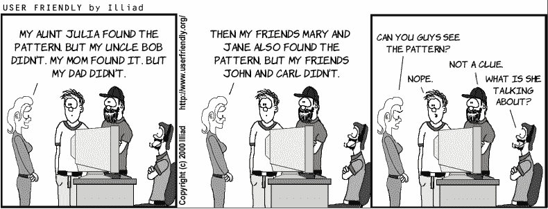

在本章中，我们学习机器学习的一个分支，称为 *分类*。分类模型与回归模型类似，它们的目的是根据特征预测数据集的标签。区别在于，回归模型旨在预测一个数字，而分类模型旨在预测一个状态或类别。分类模型通常被称为 *分类器*，我们将交替使用这些术语。许多分类器预测两种可能的状态之一（通常是是/否），尽管也可以构建预测更多可能状态的分类器。以下是一些流行的分类器示例：

+   一个预测用户是否会观看特定电影的推荐模型

+   一个预测电子邮件是垃圾邮件还是正常邮件的电子邮件模型

+   一个预测患者是生病还是健康的医疗模型

+   一个预测图像是否包含汽车、鸟、猫或狗的图像识别模型

+   一个预测用户是否说了特定命令的语音识别模型

分类是机器学习中的一个热门领域，本书的大部分章节（第 5、6、8、9、10、11 和 12 章）都讨论了不同的分类模型。在本章中，我们学习 *感知器* 模型，也称为 *感知器分类器*，或简单地称为 *感知器*。感知器类似于线性回归模型，因为它使用特征的线性组合来做出预测，并且是神经网络（我们在第十章中学习）的构建块。此外，训练感知器的过程与训练线性回归模型的过程类似。就像我们在第三章中用线性回归算法做的那样，我们以两种方式开发感知器算法：使用我们可以多次迭代的技巧，以及定义一个我们可以通过梯度下降最小化的误差函数。

本章我们学习的主要分类模型示例是 *情感分析*。在情感分析中，模型的目的是预测句子的情感。换句话说，模型预测句子是快乐的还是悲伤的。例如，一个好的情感分析模型可以预测句子“我感觉太棒了！”是一个快乐的句子，而句子“多么糟糕的一天！”是一个悲伤的句子。

情感分析在许多实际应用中被使用，例如以下：

+   当公司分析客户与技术支持之间的对话时，以评估对话的质量

+   当分析品牌数字存在（如社交媒体上的评论或与其产品相关的评论）的语气时

+   当像 Twitter 这样的社交平台在事件发生后分析特定人群的整体情绪时

+   当投资者使用对公司公开情绪的预测来预测其股价时

我们如何构建一个情感分析分类器呢？换句话说，我们如何构建一个机器学习模型，它以句子作为输入，并以输出告诉我们句子是快乐还是悲伤。这个模型当然会犯错误，但我们的想法是构建它，使其尽可能少犯错误。让我们放下书本几分钟，想想我们如何构建这种类型的模型。

这里有一个想法。快乐句子往往包含快乐词汇，如**wonderful**、**happy**或**joy**，而悲伤句子往往包含悲伤词汇，如**awful**、**sad**或**despair**。一个分类器可以由字典中每个单词的“快乐”分数组成。快乐词汇可以给予正分数，而悲伤词汇可以给予负分数。中性词汇如**the**可以给予零分。当我们将一个句子输入到我们的分类器中时，分类器只是简单地将句子中所有单词的分数相加。如果结果是正的，那么分类器就会得出结论，这个句子是快乐的。如果结果是负的，那么分类器就会得出结论，这个句子是悲伤的。现在的目标是找到字典中所有单词的分数。为此，我们使用机器学习。

我们刚才构建的模型类型被称为**感知器模型**。在本章中，我们将学习感知器的正式定义以及如何通过找到所有单词的完美分数来训练它，以便我们的分类器尽可能少犯错误。

训练感知器的过程被称为**感知器算法**，它与我们在第三章学到的线性回归算法并没有太大的区别。以下是感知器算法的思路：为了训练模型，我们首先需要一个包含许多句子及其标签（快乐/悲伤）的数据集。我们通过为所有单词分配随机分数来开始构建我们的分类器。然后，我们多次遍历数据集中的所有句子。对于每个句子，我们稍微调整分数，以便分类器改进对该句子的预测。我们如何调整分数呢？我们使用一种称为**感知器技巧**的方法来调整分数，这在“感知器技巧”这一节中会学到。另一种训练感知器模型的方法是使用误差函数，就像我们在第三章中所做的那样。然后我们使用梯度下降来最小化这个函数。

然而，语言很复杂——它有细微差别、双关语和讽刺。如果我们把一个词简化为一个简单的分数，我们不会丢失太多信息吗？答案是肯定的——我们会丢失很多信息，而且我们无法通过这种方式创建一个完美的分类器。好消息是，使用这种方法，我们仍然可以创建一个大多数时候都是正确的分类器。以下是一个证明我们使用的方法不可能总是正确的例子。句子“我不悲伤，我很快乐”和“我不快乐，我很悲伤”有相同的单词，但意义完全不同。因此，无论我们给单词赋予什么分数，这两个句子都将获得相同的分数，因此分类器将对他们做出相同的预测。它们有不同的标签，所以分类器必须在对其中一个句子做出错误判断。

解决这个问题的方法是为分类器构建一个考虑单词顺序的模型，或者甚至考虑其他事物，如标点符号或习语。一些模型，如*隐马尔可夫模型*（HMM）、*循环神经网络*（RNN）或*长短期记忆网络*（LSTM）在序列数据上取得了巨大成功，但我们将不会在本书中包括它们。然而，如果您想探索这些模型，附录 C 中您可以找到一些非常有用的参考资料。

您可以在以下 GitHub 仓库中找到本章所有代码：[`github.com/luisguiserrano/manning/tree/master/Chapter_5_Perceptron_Algorithm`](https://github.com/luisguiserrano/manning/tree/master/Chapter_5_Perceptron_Algorithm).

## 问题：我们身处一个外星星球，而我们不知道他们的语言！

想象以下场景：我们是宇航员，刚刚降落在遥远的星球上，那里居住着一群未知的外星人。我们希望能与外星人交流，但他们说的是一种我们不懂的奇怪语言。我们注意到外星人有两种情绪，快乐和悲伤。我们与他们交流的第一步是确定他们情绪是快乐还是悲伤。换句话说，我们希望构建一个情感分析分类器。

我们设法与四个外星人交上了朋友，并开始观察他们的情绪，研究他们说的话。我们注意到其中两个是快乐的，两个是悲伤的。他们也反复重复相同的句子。他们的语言似乎只有两个词：*aack*和*beep*。我们根据他们说的句子和他们的情绪形成了以下数据集：

数据集：

+   外星人 1

    +   情绪：快乐

    +   句子：*“Aack, aack, aack!”*

+   外星人 2：

    +   情绪：悲伤

    +   句子：*“Beep beep!”*

+   外星人 3：

    +   情绪：快乐

    +   句子：*“Aack beep aack!”*

+   外星人 4：

    +   情绪：悲伤

    +   句子：*“Aack beep beep beep!”*

突然，第五个外星人进来了，它说，“*Aack beep aack aack*！”我们真的无法判断这个外星人的情绪。根据我们所知，我们应该如何预测这个外星人的情绪（图 5.1）？

我们预测这个外星人很开心，尽管我们不知道他们的语言，但单词 *aack* 在快乐句子中似乎出现得更频繁，而单词 *beep* 在悲伤句子中似乎出现得更频繁。也许 *aack* 代表着积极的意义，比如“快乐”或“幸福”，而 *beep* 可能代表着悲伤的意义，比如“绝望”或“悲伤”。

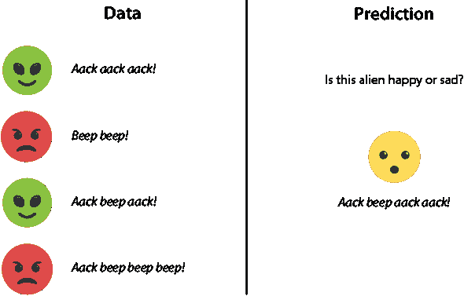

图 5.1 我们的外星人数据集。我们记录了他们的情绪（快乐或悲伤）和他们反复说的句子。现在又来了一位第五个外星人，说了一个不同的句子。我们预测这个外星人快乐还是悲伤？

这个观察结果产生了我们的第一个情感分析分类器。这个分类器通过以下方式进行预测：它计算单词 *aack* 和 *beep* 出现的次数。如果 *aack* 出现的次数多于 *beep*，则分类器预测句子是快乐的。如果它更少，则分类器预测句子是悲伤的。当两个单词出现次数相同会发生什么？我们没有依据来判断，所以我们说默认预测是句子是快乐的。实际上，这类边缘情况很少发生，所以它们不会给我们造成大问题。

我们刚刚构建的分类器是一个感知器（也称为线性分类器）。我们可以用分数或权重来表示它，如下所示：

情感分析分类器

给定一个句子，为以下单词分配以下分数：

分数：

+   *Aack*: 1 分

+   *Beep*: -1 分

规则：

通过将句子上所有单词的分数相加来计算句子的分数，如下所示：

+   如果分数为正或零，预测句子是快乐的。

+   如果分数为负，预测句子是悲伤的。

在大多数情况下，绘制我们的数据是有用的，因为有时会出现漂亮的模式。在表 5.1 中，我们有四个外星人，以及他们说了多少次 *aack* 和 *beep* 以及他们的情绪。

表 5.1 我们的外星人数据集，他们说的句子和他们的情绪。我们将每个句子分解为单词 aack 和 beep 出现的次数。

| 句子 | Aack | Beep | 情绪 |
| --- | --- | --- | --- |
| Aack aack aack! | 3 | 0 | 快乐 |
| Beep beep! | 0 | 2 | 悲伤 |
| Aack beep aack! | 2 | 1 | 快乐 |
| Aack beep beep beep! | 1 | 3 | 悲伤 |

图表由两个轴组成，横轴（*x* 轴）和纵轴（*y* 轴）。在横轴上，我们记录了 *aack* 出现的次数，在纵轴上，记录了 *beep* 的出现次数。这个图表可以在图 5.2 中看到。

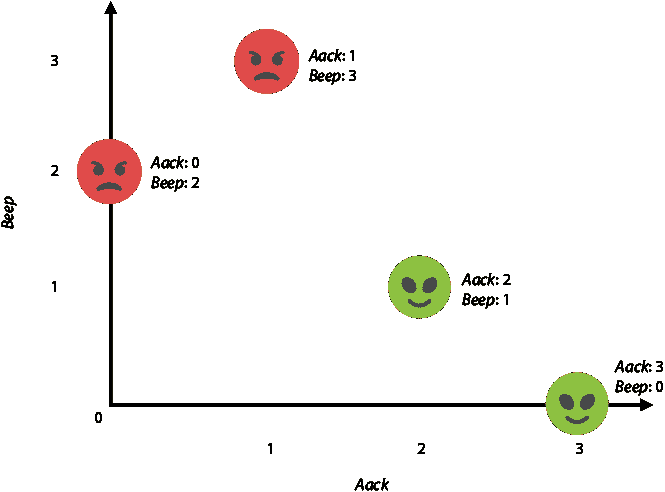

图 5.2 外星人的数据集图。在横轴上，我们绘制了单词 *aack* 出现的次数，在纵轴上，绘制了单词 *beep* 的出现次数。

注意，在图 5.2 的图中，快乐的异形位于右下角，而悲伤的异形位于左上角。这是因为右下角是句子中 *aack* 出现次数多于 *beep* 的区域，而左上角区域则相反。实际上，所有 *aack* 和 *beep* 出现次数相同的句子形成的线将这两个区域分开，如图 5.3 所示。这条线的方程如下：

#aack = #beep

或者等价地，这个方程：

#aack – #beep = 0

在本章中，我们将使用带有不同下标的变量 *x* 来表示一个词在句子中出现的次数。在这种情况下，*x*[aack] 表示单词 *aack* 出现的次数，而 *x*[beep] 表示单词 *beep* 出现的次数。

使用这种表示法，分类器的方程变为 *x*[aack] – *x*[beep] = 0，或者等价地，*x*[aack] = *x*[beep] *.* 这是平面上的一条直线方程。如果看起来不这样，想想直线方程 *y* = *x*，除了用 *x* 代替，我们用 *x*[aack]，用 *y* 代替 *x*[beep] *.* 为什么不使用 *x* 和 *y* 像我们高中时做的那样呢？我愿意这样做，但不幸的是，我们稍后需要 *y*（用于预测）。因此，让我们将 *x*[aack]-轴视为水平轴，将 *x*[beep]-轴视为垂直轴。与这个方程一起，我们有两个重要的区域，我们称之为 *正区域* 和 *负区域*。它们的定义如下：

**正区域**：平面上 *x*[aack] – *x*[beep] ≥ 0 的区域。这对应于单词 *aack* 出现的次数至少与单词 *beep* 相等的句子。

**负区域**：平面上 *x*[aack] – *x*[beep] *<* 0 的区域。这对应于单词 *aack* 出现的次数少于单词 *beep* 的句子。

我们创建的分类器预测，正区域中的每个句子都是快乐的，而负区域中的每个句子都是悲伤的。因此，我们的目标是找到可以将尽可能多的快乐句子放入正区域，尽可能多的悲伤句子放入负区域的分类器。对于这个小型示例，我们的分类器完美地完成了这项工作。但这并不总是如此，但感知器算法将帮助我们找到能够真正出色完成这项工作的分类器。

在图 5.3 中，我们可以看到对应于分类器和正负区域的线。如果你比较图 5.2 和图 5.3，你可以看到当前的分类器很好，因为所有快乐句子都在正区域，所有悲伤句子都在负区域。

现在我们已经构建了一个简单的情感分析感知器分类器，让我们看看一个稍微复杂一点的例子。

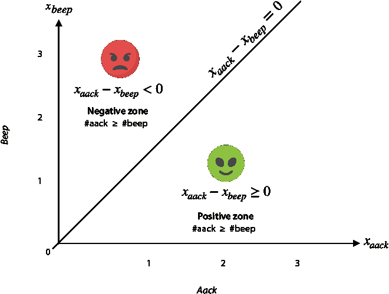

图 5.3 分类器是分割快乐和悲伤点的对角线。这条线的方程是 *x[aack]* = *x[beep]*（或者等价地，*x[aack]* – *x[beep]* = 0），因为这条线对应于所有水平和垂直坐标相等的点。快乐区域是*aack*出现次数大于或等于*beep*出现次数的区域，而悲伤区域是*aack*出现次数少于*beep*出现次数的区域。

一个稍微复杂一些的星球

在本节中，我们看到一个更复杂的例子，它引入了感知器的一个新方面：偏差。在我们能够与第一个星球上的外星人交流之后，我们被派往第二个星球，那里的外星人有稍微复杂一些的语言。我们的目标仍然是相同的：用他们的语言创建一个情感分析分类器。新星球上的语言有两种词：*crack*和*doink*。数据集显示在表 5.2 中。

为这个数据集构建分类器似乎比上一个数据集要困难一些。首先，我们应该给*crack*和*doink*这些词分配正分还是负分？让我们拿一支笔和一张纸，尝试构建一个可以正确分离这个数据集中快乐和悲伤句子的分类器。查看图 5.4 中的这个数据集的图表可能会有所帮助。

表 5.2 外星词汇的新数据集。再次，我们记录了每个句子，该句子中每个单词出现的次数以及外星人的情绪。

| 句子 | Crack | Doink | 情绪 |
| --- | --- | --- | --- |
| Crack! | 1 | 0 | 悲伤 |
| Doink doink! | 0 | 2 | 悲伤 |
| Crack doink! | 1 | 1 | 悲伤 |
| Crack doink crack! | 2 | 1 | 悲伤 |
| Doink crack doink doink! | 1 | 3 | 快乐 |
| Crack doink doink crack! | 2 | 2 | 快乐 |
| Doink doink crack crack crack! | 3 | 2 | 快乐 |
| Crack doink doink crack doink! | 2 | 3 | 快乐 |

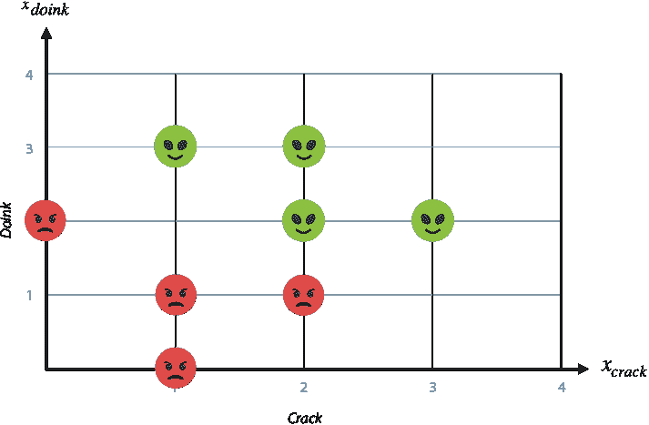

图 5.4 外星词汇新数据集的图表。注意，快乐的点倾向于在上方和右侧，而悲伤的点在下方和左侧。

这个分类器的想法是计算句子中的单词数量。注意，只有一个、两个或三个单词的句子都是悲伤的，而四个和五个单词的句子是快乐的。那就是分类器！它将三个单词或更少的句子分类为悲伤，将四个或更多单词的句子分类为快乐。我们还可以用更数学的方式表达这一点。

情感分析分类器

给定一个句子，给以下单词分配以下分数：

分数：

+   *Crack*：一分

+   *Doink*：一分

规则：

通过将句子上所有单词的分数相加来计算句子的分数。

+   如果分数是 4 或以上，预测该句子是快乐的。

+   如果分数是 3 或以下，预测该句子是悲伤的。

为了让它更简单，让我们通过使用 3.5 的截止值稍微改变一下规则。

规则：

通过计算句子上所有单词的分数来计算句子的分数。

+   如果分数为 3.5 或更多，预测句子是快乐的。

+   如果分数小于 3.5，预测句子是悲伤的。

这个分类器再次对应于一条线，该线在图 5.5 中进行了说明。

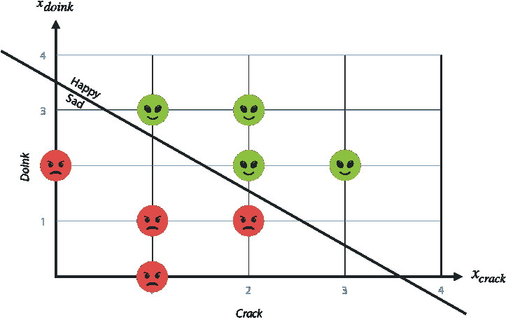

图 5.5 新数据集的外星人分类器。它再次是一条分割快乐和悲伤外星人的线。

在上一个例子中，我们得出结论，单词 *aack* 是一个快乐的词，而单词 *beep* 是一个悲伤的词。在这个例子中会发生什么？看起来单词 *crack* 和 *doink* 都是快乐的，因为它们的分数都是正的。那么，句子 “*Crack doink*” 为什么是一个悲伤的句子？因为它没有足够的单词。这个星球上的外星人有着独特的个性。说话不多的是悲伤的外星人，而说话很多的是快乐的外星人。我们可以这样解释：这个星球上的外星人天生就是悲伤的，但他们可以通过多说话来摆脱悲伤。

在这个分类器中，另一个重要元素是截止值或阈值 3.5。分类器使用这个阈值进行预测，因为分数高于或等于阈值的句子被分类为快乐，而分数低于阈值的句子被分类为悲伤。然而，阈值并不常见，我们而是使用 *偏置* 的概念。偏置是阈值的相反数，我们将其加到分数上。这样，分类器可以计算分数，如果分数是非负的，则返回快乐的预测，如果分数是负的，则返回悲伤的预测。作为最后的符号变化，我们将单词的分数称为 *权重*。我们的分类器可以表示如下：

情感分析分类器

给定一个句子，为单词分配以下权重和偏置：

权重：

+   *Crack*: 一分

+   *Doink*: 一分

**偏置**： –3.5 分

规则：

通过将句子上所有单词的权重和偏置相加来计算句子的分数。

+   如果分数大于或等于零，预测句子是快乐的。

+   如果分数小于零，预测句子是悲伤的。

分类器的分数方程，以及图 5.5 中的直线方程如下：

#crack + #doink – 3.5 = 0

注意，定义一个阈值为 3.5 且偏置为 –3.5 的感知器分类器与以下两个等式相同，因为这两个等式是等价的：

+   #crack + #doink ≥ 3.5

+   #crack + #doink – 3.5 ≥ 0

我们可以使用与上一节类似的表达法，其中 *x*[crack] 是单词 *crack* 出现的次数，*x*[doink] 是单词 *doink* 出现的次数。因此，图 3.5 中的直线方程可以写成

*x*[crack] + *x*[doink] – 3.5 = 0.

这条线也将平面分为正区域和负区域，定义如下：

**正区域**：平面上 *x*[crack] + *x*[doink] – 3.5 ≥ 0 的区域

**负区域**：平面上满足 *x*[crack] + *x*[doink] – 3.5 < 0 的区域

我们的分类器是否需要始终正确？不

在前两个例子中，我们构建了一个始终正确的分类器。换句话说，这个分类器将两个快乐的句子分类为快乐，将两个悲伤的句子分类为悲伤。这在实践中并不常见，尤其是在包含许多点的数据集中。然而，分类器的目标是将点尽可能准确地分类。在图 5.6 中，我们可以看到一个包含 17 个点（8 个快乐和 9 个悲伤）的数据集，使用单条线无法完美地将其分成两部分。然而，图中的线做得很好，只错误地分类了三个点。

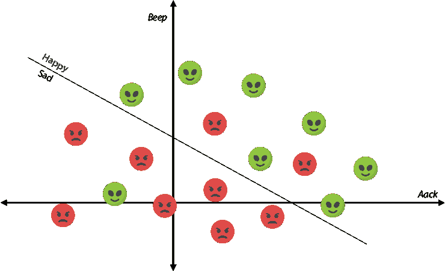

图 5.6 这条线很好地分割了数据集。注意，它只犯了一个错误：两个在快乐区域，一个在悲伤区域。

更通用的分类器和定义线的不同方法

在本节中，我们获得了对感知器分类器的更一般性的看法。暂时让我们称我们的单词 1 和 2，以及跟踪它们出现的变量为 *x*[1] 和 *x*[2]。前两个分类器的方程如下：

+   *x*[1] – *x*[2] = 0

+   *x*[1] + *x*[2] – 3.5 = 0

感知器分类器的方程的一般形式是 *ax*[1] + *bx*[2] + *c* = 0，其中 *a* 是单词 1 的得分，*b* 是单词 2 的得分，*c* 是偏置。这个方程对应于一条线，将平面分成两个区域，如下所示：

**正区域**：平面上满足 *ax*[1] + *bx*[2] + *c* ≥ 0 的区域

**负区域**：平面上满足 *ax*[1] + *bx*[2] + *c* < 0 的区域

例如，如果单词 1 的得分为 4，单词 2 的得分为-2.5，偏置为 1.8，那么这个分类器的方程是

4*x*[1] – 2.5*x*[2] + 1.8 = 0,

以及正负区域分别是满足 4*x*[1] – 2.5*x*[2] + 1.8 ≥ 0 和 4*x*[1] – 2.5*x*[2] + 1.8 < 0 的区域。

旁白：平面上线和区域的方程在第三章中，我们使用方程 *y* = *mx* + *b* 在 *x* 和 *y* 轴的平面上定义了线。在本章中，我们使用方程 *ax*[1] + *bx*[2] + *c* = 0 在 *x*[1] 和 *x*[2] 轴的平面上定义它们。它们有什么不同？它们都是定义线的完全有效的方法。然而，第一个方程对线性回归模型很有用，而第二个方程对感知器模型（以及一般地，对其他分类算法，如逻辑回归、神经网络和支持向量机，我们将在第 6、10 和 11 章分别看到）很有用。为什么这个方程对感知器模型更好？以下是一些优点：

+   方程*ax*[1] + *bx*[2] + *c* = 0 不仅定义了一条线，而且清楚地定义了两个区域，正区域和负区域。如果我们想要有相同的线，但正负区域相反，我们会考虑方程 –*ax*[1] – *bx*[2] – *c* = 0。

+   使用方程*ax*[1] + *bx*[2] + *c* = 0，我们可以画出垂直线，因为垂直线的方程是*x* = *c*或 1*x*[1] + 0*x*[2] – *c* = 0。尽管垂直线在线性回归模型中不常见，但在分类模型中确实会出现。

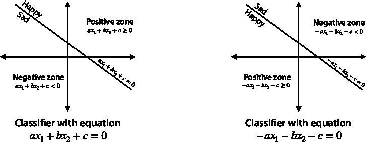

图 5.7 一个分类器由方程*ax*[1] + *bx*[2] + *c* = 0、正区域和负区域定义。如果我们想翻转正负区域，我们只需要取权重和偏差的相反数。在左边，我们有方程*ax*[1] + *bx*[2] + *c* = 0 的分类器。在右边，区域翻转且方程为 –*ax*[1] – *bx*[2] – *c* = 0 的分类器。

步进函数和激活函数：获取预测的紧凑方式

在本节中，我们学习了一种数学捷径来获得预测。然而，在学习这个之前，我们需要将所有数据转换为数字。注意，我们数据集中的标签是“快乐”和“悲伤”。我们分别记录为 1 和 0。

本章中我们构建的两个感知器分类器都是使用 if 语句定义的。具体来说，分类器根据句子的总得分预测“快乐”或“悲伤”；如果这个得分是正数或零，分类器预测“快乐”，如果是负数，分类器预测“悲伤”。我们有一个更直接的方法将得分转换为预测：使用*步进函数*。

步进函数：当输出非负时返回 1，当输出为负时返回 0 的函数。换句话说，如果输入是*x*，那么

+   *step*(*x*) = 1 if *x* ≥ 0

+   *step*(*x*) = 0 if *x* < 0

图 5.8 显示了步进函数的图形。

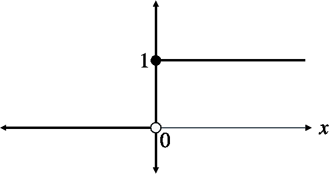

图 5.8 步进函数在感知器模型的研究中很有用。当输入为负时，步进函数的输出为 0，否则为 1。

使用步进函数，我们可以轻松地表达感知器分类器的输出。在我们的数据集中，我们使用变量*y*来指代标签，就像我们在第三章中所做的那样。模型对标签的预测表示为*y**ˆ*。感知器模型的输出以紧凑的形式表示为

*ŷ* = *step*(*ax*[1] + *bx*[2] + *c*).

步进函数是*激活函数*的一个特例。激活函数是机器学习中的一个重要概念，尤其是在深度学习中，它将在第六章和第十章中再次出现。激活函数的正式定义将在稍后给出，因为它的全部力量是在构建神经网络时使用的。但就目前而言，我们可以将激活函数视为一个可以将得分转换为预测的函数。

如果我有超过两个单词会发生什么？感知器分类器的一般定义

在本节开头提到的两个外星例子中，我们为拥有两个单词的语言构建了感知器分类器。但我们可以构建拥有任意多个单词的分类器。例如，如果我们有一个包含三个单词的语言，比如 *aack*，*beep* 和 *crack*，分类器将根据以下公式进行预测：

*ŷ* = *step*(*ax*[aack] + *bx*[beep] + *cx*[crack] + *d*),

其中 *a*，*b* 和 *c* 分别是单词 *aack*，*beep* 和 *crack* 的权重，*d* 是偏差。

正如我们所见，对于拥有两个单词的语言的情感分析感知器分类器可以表示为分割快乐和悲伤点的平面上的线。对于拥有三个单词的语言的情感分析分类器也可以用几何方式表示。我们可以想象这些点生活在三维空间中。在这种情况下，每个轴对应于单词 *aack*，*beep* 和 *crack*，一个句子对应于空间中的一个点，其三个坐标是三个单词出现的次数。图 5.9 展示了一个例子，其中包含 *aack* 五次，*beep* 八次和 *crack* 三次的句子对应于坐标为 (5, 8, 3) 的点。

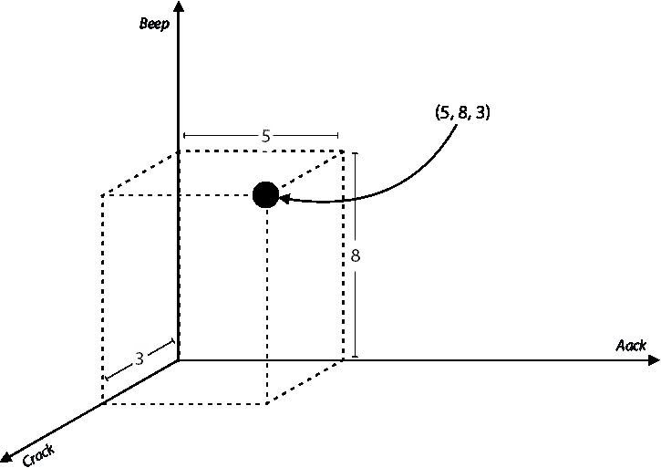

图 5.9 将包含三个单词的句子绘制为空间中的一个点。在这种情况下，包含单词 aack 五次，beep 八次和 crack 三次的句子绘制在坐标为 (5,8,3) 的点上。

使用平面来分离这些点。平面的方程是 *ax*[aack] + *bx*[beep] + *cx*[crack] + *d*，这个平面在图 5.10 中被展示出来。

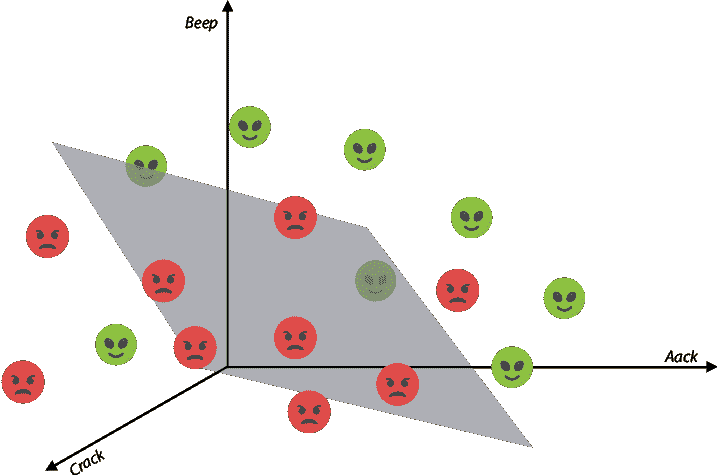

图 5.10 将三个单词的句子数据集绘制在三维空间中。分类器用一个分割空间的平面表示。

我们可以为拥有尽可能多单词的语言构建情感分析感知器分类器。假设我们的语言有 *n* 个单词，我们称之为 1, 2, … , *n*。我们的数据集由 *m* 个句子组成，我们称之为 *x*^((1)), *x*^((2)), … , *x*^(^m^)。每个句子 *x*^((1)) 都有一个标签 *y*[i]，如果句子是快乐的，则标签为 1，如果是悲伤的，则标签为 0。我们记录每个句子的方式是使用每个 *n* 个单词出现的次数。因此，每个句子对应数据集中的一行，可以看作是一个向量，或一个由数字 *x*^(^i^) = (*x*[1]^(^i^), *x*[2]^(^i^), … , *x*[n]^(^i^)) 组成的 *n*-元组，其中 *x*[j]^(^i^) 是单词 *j* 在第 *i* 个句子中出现的次数。

感知器分类器由 *n* 个权重（分数）组成，每个权重对应我们语言中的 *n* 个单词，还有一个偏差。权重表示为 *w*[i] 和偏差 *b*。因此，分类器对句子 *x*^(^i^) 的预测是

*ŷ*[i] = *step*(*w*[1]*x*[1]^(^i^) + *w*[2]*x*[2]^(^i^) + … +*w*[n]*x*[n]^(^i^) + *b*).

与只有两个单词的分类器可以用一条线在平面上分割成两个区域一样，可以用一个平面在三维空间中分割成两个区域，具有*n*个单词的分类器也可以用几何表示。不幸的是，我们需要*n*维来看到它们。人类只能看到三维，所以我们可能需要想象一个(*n*-1)-维平面（称为超平面）将*n*-维空间分割成两个区域。

然而，我们无法从几何上想象它们并不意味着我们不能很好地理解它们是如何工作的。想象一下，如果我们的分类器建立在英语语言的基础上。每个单词都会被分配一个权重。这相当于遍历词典，并为每个单词分配一个快乐分数。结果可能看起来像这样：

权重（分数）:

+   A: 0.1 points

+   Aardvark: 0.2 points

+   Aargh: –4 points

+   …

+   Joy: 10 points

+   …

+   Suffering: –8.5 points

+   ...

+   Zygote: 0.4 points

偏差：

+   –2.3 points

如果这些是分类器的权重和偏差，要预测一个句子是快乐还是悲伤，我们只需加上句子上所有单词的分数（包括重复的）。如果结果是高于或等于 2.3（偏差的负值），则预测该句子为快乐；否则，预测为悲伤。

此外，这种表示法适用于任何例子，而不仅仅是情感分析。如果我们有一个不同的问题，不同的数据点、特征和标签，我们可以使用相同的变量来编码它。例如，如果我们有一个医疗应用，我们试图使用*n*个权重和偏差来预测患者是生病还是健康，我们仍然可以称标签为*y*，特征为*x*[i]，权重为*w*[i]，偏差为*b*。

偏差、*y*-截距和安静外星人的内在情绪

到目前为止，我们已经很好地理解了分类器的权重意味着什么。具有正权重的单词是快乐的，具有负权重的单词是悲伤的。具有非常小的权重（无论是正还是负）的单词是更中性的单词。然而，偏差意味着什么呢？

在第三章中，我们指定了房价回归模型中的偏差是房屋的基础价格。换句话说，它是假设房屋房间数为零（一个工作室？）的假设房屋的预测价格。在感知器模型中，偏差可以解释为空句子的分数。换句话说，如果一个外星人什么都没说，这个外星人快乐还是悲伤？如果一个句子没有单词，它的分数就是偏差。因此，如果偏差是正的，那么什么都没说的外星人就是快乐的，如果偏差是负的，那么同样的外星人就是悲伤的。

几何上，正偏见和负偏见的区别在于原点（坐标为(0,0)的点）相对于分类器的位置。这是因为坐标为(0,0)的点对应于没有单词的句子。在具有正偏见的分类器中，原点位于正区域，而在具有负偏见的分类器中，原点位于负区域，如图 5.11 所示。

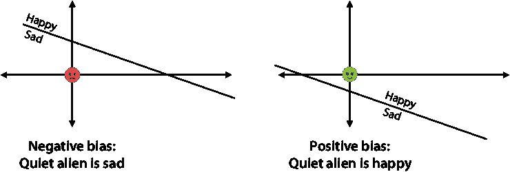

图 5.11 左：分类器具有负偏见，或正*阈值*（*y*截距）。这意味着不说任何话的外星人落入悲伤区域，并被分类为悲伤。右：分类器具有正偏见，或负阈值。这意味着不说任何话的外星人落入快乐区域，并被分类为快乐。

我们能否考虑具有正偏见或负偏见的情感分析数据集？以下两个例子如何？

**示例 1（正偏见）**：一个产品的在线评论数据集

想象一个数据集，我们记录了在亚马逊上特定产品的所有评论。其中一些是正面的，一些是负面的，根据它们收到的星级来区分。你认为空评论的评分会是什么？根据我的经验，差评往往包含很多单词，因为客户感到沮丧，他们描述了他们的负面经历。然而，许多正面评论是空的——客户只是给出了一个好的评分，而不需要解释他们为什么喜欢这个产品。因此，这个分类器可能具有正偏见。

**示例 2（负偏见）**：与朋友对话的数据集

想象一下，我们记录了我们与朋友的全部对话并将它们分类为快乐或悲伤的对话。如果有一天我们遇到一个朋友，而我们的朋友说绝对没有任何话，我们想象他们可能是在生我们的气，或者他们非常沮丧。因此，空句子被分类为悲伤。这意味着这个分类器可能具有负偏见。

## 我们如何确定一个分类器是好是坏？误差函数

现在我们已经定义了什么是感知器分类器，我们的下一个目标是了解如何训练它——换句话说，我们如何找到最适合我们数据的感知器分类器？但在学习如何训练感知器之前，我们需要学习一个重要的概念：如何评估它们。更具体地说，在本节中，我们学习一个有用的误差函数，它将告诉我们感知器分类器是否适合我们的数据。与第三章中绝对误差和平方误差对线性回归有效一样，这个新的误差函数对于不适合数据的分类器将很大，而对于适合数据的分类器将很小。

如何比较分类器？误差函数

在本节中，我们学习如何构建一个有效的错误函数，帮助我们确定特定感知器分类器的优劣。首先，让我们测试我们的直觉。图 5.12 显示了同一数据集上的两个不同的感知器分类器。分类器被表示为一条有两条明确边界的线，一边是快乐，另一边是悲伤。显然，左侧的是一个不好的分类器，而右侧的是一个好的分类器。我们能想出一个衡量它们好坏的方法吗？换句话说，我们能给每个分类器分配一个数字，使得左侧的分类器分配一个高数字，而右侧的分类器分配一个低数字？

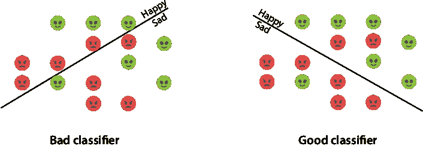

图 5.12 左：一个不好的分类器，它并没有很好地分割点。右：一个好的分类器。我们能想出一个错误函数，将高数字分配给不好的分类器，将低数字分配给好的分类器吗？

接下来，我们看到对这个问题的不同回答，每个都有其优缺点。其中之一（剧透：第三个）是我们用来训练感知器的。

错误函数 1：错误数量

评估分类器的最简单方法是通过计算它犯的错误数量——换句话说，通过计算它错误分类的点数。

在这个例子中，左侧的分类器有一个 8 的错误率，因为它错误地将四个快乐点预测为悲伤，并将四个悲伤点预测为快乐。好的分类器有一个 3 的错误率，因为它错误地将一个快乐点预测为悲伤，并将两个悲伤点预测为快乐。这如图 5.13 所示。

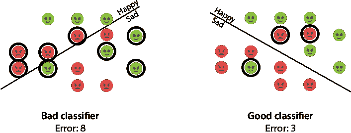

图 5.13 我们通过计算每个分类器错误分类的点数来评估这两个分类器。左侧的分类器错误分类了八个点，而右侧的分类器错误分类了三个点。因此，我们得出结论，右侧的分类器对于我们的数据集来说是一个更好的选择。

这是一个好的错误函数，但并不是一个很好的错误函数。为什么？它告诉我们何时有错误，但它不衡量错误的严重程度。例如，如果一个句子是悲伤的，而分类器给它评分为 1，那么分类器就犯了错误。然而，如果另一个分类器给它评分为 100，那么这个分类器就犯了更大的错误。从几何上观察这一点，如图 5.14 所示。在这张图片中，两个分类器都将一个悲伤点错误分类为快乐。然而，左侧的分类器将线靠近点，这意味着悲伤点离悲伤区域不远。相比之下，右侧的分类器将点定位得非常远离其悲伤区域。

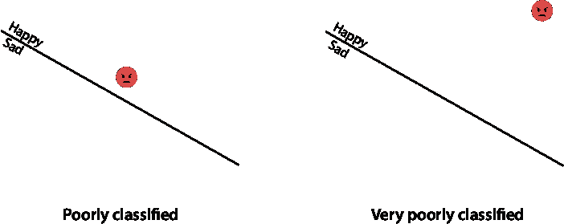

图 5.14 两个分类器误分类了点。然而，右侧的分类器犯的错误比左侧的分类器大得多。左侧的点离边界不远，因此它离悲伤区域也不远。然而，右侧的点离悲伤区域很远。理想情况下，我们希望一个误差函数将更高的误差分配给右侧的分类器，而不是左侧的分类器。

我们为什么关心测量误差的严重程度呢？仅仅计数它们不是足够了吗？回想一下我们在第三章中用到的线性回归算法。更具体地说，回想一下“梯度下降”这一节，我们使用梯度下降来减少这个误差。减少误差的方法是通过逐步减小误差，直到我们达到一个误差很小的点。在线性回归算法中，我们小幅调整直线，并选择误差减少最多的方向。如果我们通过计数误分类点的数量来计算误差，那么这个误差将只取整数值。如果我们小幅调整直线，误差可能根本不会减少，我们也不知道该朝哪个方向移动。梯度下降的目标是通过在函数减少最多的方向上采取小步骤来最小化函数。如果函数只取整数值，这相当于试图从阿兹特克阶梯上下降。当我们处于一个平坦的台阶上时，我们不知道该走哪一步，因为函数在任意方向上都不会减少。这如图 5.15 所示。

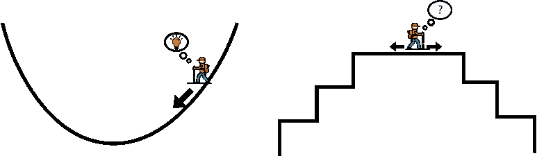

图 5.15 通过小步下降来最小化误差函数就像从山上走下来一样。然而，为了做到这一点，误差函数不能是平坦的（就像右侧的那个），因为在平坦的误差函数中，小步不会减少误差。一个好的误差函数就像左侧的那个，我们可以很容易地看到必须使用哪个方向来迈步以略微减少误差函数。

我们需要一个函数来衡量误差的大小，并将更高的误差分配给远离边界的误分类点，而不是那些靠近边界的点。

误差函数 2：距离

在图 5.16 中区分两个分类器的方法是考虑点到直线的垂直距离。注意，对于左侧的分类器，这个距离很小，而对于右侧的分类器，距离很大。

这个误差函数更有效。这个误差函数所做的是：

+   正确分类的点会产生 0 误差。

+   误分类的点会产生一个等于该点到直线距离的误差。

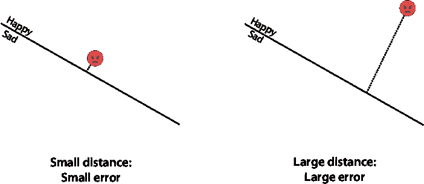

图 5.16 一种有效衡量分类器如何误分类点的办法是测量该点到直线的垂直距离。对于左边的分类器，这个距离较小，而对于右边的分类器，这个距离较大。

让我们回到本节开头我们拥有的两个分类器。我们计算总误差的方法是添加所有数据点的误差，如图 5.17 所示。这意味着我们只关注误分类点，并添加这些点到直线的垂直距离。请注意，不良分类器的误差较大，而良好分类器的误差较小。

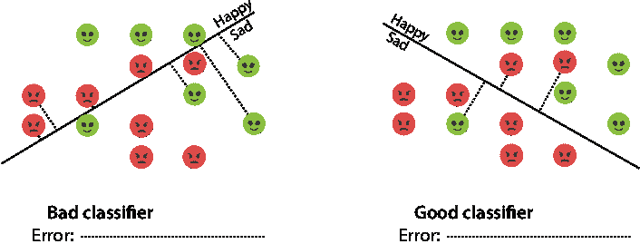

图 5.17 为了计算分类器的总误差，我们将所有误差相加，这些误差是误分类点到直线的垂直距离。左边的分类器误差较大，而右边的分类器误差较小。因此，我们得出结论，右边的分类器更好。

这几乎是我们将要使用的误差函数。为什么我们不使用这个呢？因为点到直线的距离是一个复杂的公式。它包含一个平方根，因为我们使用勾股定理来计算它。平方根具有复杂的导数，一旦我们应用梯度下降算法，就会增加不必要的复杂性。我们不需要承担这种复杂性，因为我们可以创建一个更容易计算但仍然能够捕捉误差函数本质的误差函数：对误分类的点返回一个误差，并根据误分类点离边界的距离来改变误差的大小。

误差函数 3：得分

在本节中，我们将了解如何构建感知器的标准误差函数，我们称之为**感知器误差函数**。首先，让我们总结一下我们希望在误差函数中拥有的性质如下：

+   正确分类点的误差函数为 0。

+   误分类点的误差函数是一个正数。

    +   对于接近边界的误分类点，误差函数值较小。

    +   对于远离边界的误分类点，误差函数值较大。

+   它由一个简单的公式给出。

回想一下，分类器对正区间的点预测标签为 1，对负区间的点预测标签为 0。因此，一个误分类点要么是正区间的标签为 0 的点，要么是负区间的标签为 1 的点。

为了构建感知器误差函数，我们使用得分。具体来说，我们使用以下得分的性质：

得分的性质：

1.  边界上的点得分为 0。

1.  正区间的点具有正得分。

1.  负区间的点具有负得分。

1.  接近边界的点具有低幅度的得分（即低绝对值的正或负得分）。

1.  远离边界的点具有高幅值的得分（即，高绝对值的高或低得分）。

对于一个错误分类的点，感知机错误希望分配一个与其到边界的距离成比例的值。因此，远离边界的错误分类点的错误必须很高，而接近边界的错误分类点的错误必须很低。观察性质 4 和 5，我们可以看到，远离边界的点的得分绝对值总是很高，而接近边界的点的得分绝对值总是很低。因此，我们定义错误为错误分类点的得分的绝对值。

更具体地说，考虑将权重 *a* 和 *b* 分配给单词 *aack* 和 *beep* 的分类器，并具有偏差 *c*。此分类器对具有 *x*[aack] 次出现的单词 *aack* 和 *x*[beep] 次出现的单词 *beep* 的句子进行预测 *ŷ* = *step*(*ax*[aack] + *bx*[beep] + *c*)。感知机错误定义为以下：

句子的感知机错误

+   如果句子被正确分类，错误为 0。

+   如果句子被错误分类，错误为 |*x*[aack] + *bx*[beep] + *c*|.

在一般场景中，其中符号定义如“如果我有超过两个单词会发生什么？”一节中所述，以下为感知机错误的定义：

点的感知机错误（一般）

+   如果点被正确分类，错误为 0。

+   如果点被错误分类，错误为 |*w*[1] *x*[1] +*w*[2] *x*[2] + … +*w*[n]*x*[n] + *b*|.

平均感知机错误：计算整个数据集错误的一种方法

为了计算整个数据集的感知机错误，我们取所有点对应的所有错误的平均值。我们也可以选择取总和，尽管在本章中我们选择取平均值并称之为*平均感知机错误*。

为了说明平均感知机错误，让我们看一个例子。

示例

考虑由四个句子组成的语料库，其中两个标记为快乐，两个标记为悲伤，如表 5.3 所示。

表 5.3 外星人新的数据集。同样，我们记录了每个句子，该句子中每个单词出现的次数以及外星人的情绪。

| 句子 | 啦 | 哔 | 标签（情绪） |
| --- | --- | --- | --- |
| 啦 | 1 | 0 | 悲伤 |
| 哔 | 0 | 1 | 快乐 |
| 啦哔哔哔 | 1 | 3 | 快乐 |
| 啦哔哔 啦 啦 | 3 | 2 | 悲伤 |

我们将在该数据集上比较以下两个分类器：

分类器 1

权重：

+   * 啦*：*a* = 1

+   *哔*：*b* = 2

**偏差**：*c* = –4

**句子得分**： 1*x*[aack] + 2*x*[beep] – 4

**预测**：*ŷ* = *step*(1*x*[aack] + 2*x*[beep] – 4)

分类器 2

权重：

+   * 啦*：*a* = –1

+   *哔*：*b* = 1

**偏差**：*c* = 0

**句子得分**： –*x*[aack] + *x*[beep]

**预测**： *ŷ* = *step*(–*x*[aack] + *x*[beep])

点和分类器可以在图 5.18 中看到。乍一看，哪一个看起来像是一个更好的分类器？看起来分类器 2 更好，因为它正确地将所有点分类，而分类器 1 有两个错误。现在让我们计算错误，并确保分类器 1 的错误率高于分类器 2。

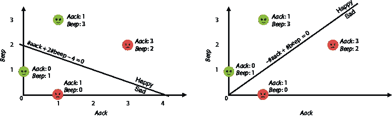

图 5.18 在左边我们有分类器 1，在右边我们有分类器 2。

两个分类器的预测结果在表 5.4 中计算。

表 5.4 我们的四个句子的数据集及其标签。对于两个分类器中的每一个，我们都有得分和预测。

| 句子 (*x*[aack], *x*[beep]) | 标签*y*   | 分类器 1 得分 1*x*[aack] + 2*x*[beep] – 4 | 分类器 1 预测*step*(1*x*[aack] + 2*x*[beep] – 4) | 分类器 1 错误 | 分类器 2 得分– *x*[aack] + 2*x*[beep] | 分类器 2 预测*step*(–*x*[aack] + 2 *x*[beep]) | 分类器 2 错误 |
| --- | --- | --- | --- | --- | --- | --- | --- |
| (1,0) | 悲伤 (0) | –3 | 0 (正确) | 0 | –1 | 0 (正确) | 0 |
| (0,1) | 快乐 (1) | -2 | 0 (错误) | 2 | 1 | 1 (正确) | 0 |
| (1,3) | 快乐 (1) | 3 | 1 (正确) | 3 | 2 | 1 (正确) | 0 |
| (3,2) | 悲伤 (0) | 3 | 1 (错误) | 0 | –1 | 0 (正确) | 0 |
| 平均感知器错误 |  | 1.25 |  | 0 |

现在来计算错误。注意，分类器 1 只错误地将句子 2 和句子 4 分类。句子 2 是快乐的，但它被错误地分类为悲伤的，而句子 4 是悲伤的，但它被错误地分类为快乐的。句子 2 的错误是得分的绝对值，即|–2| = 2。句子 4 的错误是得分的绝对值，即|3| = 3。其他两个句子没有错误，因为它们被正确分类。因此，分类器 1 的平均感知器错误为

1/4(0 + 2 + 0 + 3) = 1.25。

分类器 2 没有错误——它正确地分类了所有点。因此，分类器 2 的平均感知器错误为 0。我们据此得出结论，分类器 2 优于分类器 1。这些计算的总结在表 5.4 和图 5.19 中显示。


图 5.19 分类器 1 的错误率为 1.25，而分类器 2 的错误率为 0。因此，我们得出结论，分类器 2 优于分类器 1。

现在我们知道了如何比较分类器，让我们继续寻找其中最好的一个，或者至少是一个相当好的一个。

## 如何找到一个好的分类器？感知器算法

要构建一个好的感知器分类器，我们将遵循与第三章中我们遵循的线性回归相似的方法。这个过程被称为*感知器算法*，它包括从一个随机的感知器分类器开始，并逐渐改进它，直到我们得到一个好的分类器。感知器算法的主要步骤如下：

1.  从一个随机的感知器分类器开始。

1.  稍微改进分类器。（重复多次）。

1.  通过测量感知器错误来决定何时停止循环运行。

我们首先在循环内部开发步骤，这是一种用于略微改进感知器分类器的技术，称为**感知器技巧**。它与我们在第三章的“平方技巧”和“绝对技巧”部分学到的技巧类似。

感知器技巧：略微改进感知器的方法

感知器技巧是一个微小的步骤，帮助我们从一个感知器分类器到一个略微更好的感知器分类器。然而，我们将首先描述一个不那么雄心勃勃的步骤。就像我们在第三章中所做的那样，我们首先关注一个点，并尝试改进该点的分类器。

有两种方式来观察感知器步骤，尽管两者都是等价的。第一种方式是几何方式，我们将分类器视为一条线。

感知器技巧的伪代码（几何）

+   **情况 1**：如果点被正确分类，保持线不变。

+   **情况 2**：如果点被错误分类，将线稍微移近该点。

为什么这会起作用？让我们来思考一下。如果点被错误分类，这意味着它位于线的错误一侧。将线移近它可能不会将其移到正确的一侧，但至少会使它更接近线，因此更接近线的正确一侧。我们重复这个过程很多次，所以可以想象有一天我们能够将线移过点，从而正确分类它。这个过程在图 5.20 中展示。

我们还有一种代数方法来观察感知器技巧。

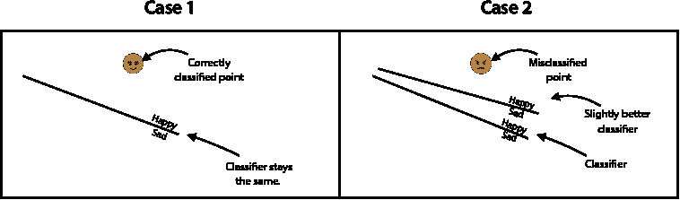

图 5.20 情况 1（左）：一个被正确分类的点告诉线保持原位。情况 2（右）：一个被错误分类的点告诉线向它靠近。

感知器技巧的伪代码（代数）

+   **情况 1**：如果点被正确分类，保持分类器不变。

+   **情况 2**：如果点被错误分类，这意味着它产生了一个正误差。调整权重和偏置的一小部分，以便这个误差略微减小。

几何方法是一个更直观的方式来可视化这个技巧，但代数方法是一个更容易发展这个技巧的方式，所以我们将从代数方法来看。首先，让我们用我们的直觉来考虑。想象一下，我们有一个针对整个英语语言的分类器。我们尝试这个分类器对句子“我很悲伤”，它预测这个句子是快乐的。这显然是错误的。我们可能在哪里出错？如果预测这个句子是快乐的，那么这个句子必须得到了一个正分。这个句子不应该得到正分——它应该得到一个负分才能被分类为悲伤。分数是它的单词 *我*、*是* 和 *悲伤* 的分数总和，加上偏差。我们需要降低这个分数，使句子稍微悲伤一些。如果我们只稍微降低它，分数仍然是正的，这也是可以的。我们的希望是，通过多次运行这个过程，总有一天能将分数变成负数，并正确地分类我们的句子。降低分数的方法是降低它的所有部分，即单词 *我*、*是* 和 *悲伤* 的权重以及偏差。我们应该降低它们多少？我们通过一个等于我们在第三章“平方技巧”部分学到的学习率的量来降低它们。

类似地，如果我们的分类器将句子“我很高兴”错误地分类为悲伤句子，那么我们的做法是略微增加单词 *我*、*是* 和 *高兴* 的权重以及偏差，增加的量等于学习率。

让我们用一个数值例子来说明这一点。在这个例子中，我们使用的学习率为 *η* = 0.01。想象一下，我们有一个与上一节相同的分类器，即具有以下权重和偏差的分类器。我们将它称为“坏分类器”，因为我们的目标是改进它。

坏分类器

权重：

+   *啊哈*：*a* = 1

+   *哔哔*：*b* = 2

**偏差**：*c* = –4

**预测**：*ŷ* = *step*(*x*[aack] + 2*x*[beep] *–* 4)

以下句子被模型错误分类，我们将用它来改进权重：

**句子 1**： “哔哔 啊哈 啊哈 哔哔 哔哔 哔哔。”

**标签**：悲伤（0）

对于这个句子，*aack* 出现的次数是 *x*[aack] = 2，*beep* 出现的次数是 *x*[beep] = 5。因此，分数是 1 · *x*[aack] + 2 · *x*[beep] – 4 = 1 · 2 + 2 · 5 – 4 = 8，预测是 *ŷ* = *step*(8) = 1。

句子应该有一个负得分，以被分类为悲伤。然而，分类器给它一个得分为 8，这是正的。我们需要降低这个得分。降低得分的一种方法是从 *aack* 的权重减去到 *beep* 的权重，以及偏置，从而得到新的权重，我们称之为 *a**'* = 0.99，*b**'* = 1.99，以及新的偏置 *c**'* = 4.01。然而，考虑一下：单词 *beep* 出现的次数比单词 *aack* 多得多。在某种程度上，*beep* 对句子的得分比 *aack* 更关键。我们可能需要比 *aack* 的得分降低 *beep* 的权重更多。让我们通过将每个单词的权重减少学习率乘以单词在句子中出现的次数来降低每个单词的权重。换句话说：

+   单词 aack 出现了两次，所以我们将它的权重减少两倍的学习率，即 0.02。我们得到新的权重 *a**'* = 1 – 2 · 0.01 = 0.98。

+   单词 *beep* 出现了五次，所以我们将它的权重减少五倍的学习率，即 0.05。我们得到新的权重 *b**'* = 2 – 5 · 0.01 = 1.95。

+   偏置只加一次到得分上，所以我们通过学习率，即 0.01 来减少偏置。我们得到新的偏置 *c**'* = –4 – 0.01 = –4.01。

除此之外，我们不是从每个权重中减去学习率，而是减去学习率乘以单词在句子中出现的次数。真正的理由是微积分。换句话说，当我们开发梯度下降法时，误差函数的导数迫使我们这样做。这个过程在附录 B 的第“使用梯度下降训练分类模型”部分有详细说明。

新的改进分类器如下：

改进的分类器 1

权重：

+   *Aack*：*a**'* = 0.98

+   *哔哔声*：*b**'* = 1.95

**偏置**：*c**'* = –4.01

**预测**：*ŷ* = *step*(0.98*x*[aack] + 1.95*x*[beep] – 4.01)

让我们验证这两个分类器的错误。记住，错误是得分的绝对值。因此，糟糕的分类器产生的错误为 |1 · *x*[aack] + 2 · *x*[beep] – 4| = |1 · 2 + 2 · 5 – 4| = 8。改进的分类器产生的错误为 |0.98 · *x*[aack] + 1.95 · *x*[beep] – 4.01| = |0.98 · 2 + 1.95 · 5 – 4.01| = 7.7。这是一个更小的错误，所以我们确实改进了该点的分类器！

我们刚才开发的案例包含一个带有负标签的错误分类点。如果错误分类点有一个正标签会发生什么？程序是相同的，只是不是从权重中减去一个量，而是加上它。让我们回到糟糕的分类器，并考虑以下句子：

**句子 2**：“Aack aack。”

**标签**：快乐

这个句子的预测是 *ŷ* = *step*(*x*[aack] + 2*x*[beep] – 4) = *step*(2 + 2 · 0 – 4) = *step*(–2) = 0。因为预测是悲伤的，所以句子被错误分类。这个句子的分数是 –2，为了将这个句子分类为快乐，我们需要分类器给它一个正分数。感知器技巧将通过以下方式增加这个 –2 分数的权重和偏差：

+   单词 *aack* 出现两次，所以我们将权重增加两倍的学习率，即 0.02。我们得到新的权重 *a'* = 1 + 2 · 0.01 = 1.02。

+   单词 *beep* 出现零次，所以我们不会增加其权重，因为这个词与句子无关。

+   偏差只加到分数上一次，所以我们通过学习率，或 0.01，增加偏差。我们得到新的偏差*c**' = –4 + 0.01 = –3.99。

因此，我们新的改进分类器如下：

改进的分类器 2

**权重**：

+   *Aack*: *a**'* = 1.02

+   *Beep*: *b**'* = 2

**偏差**: *c**' = –3.99

**预测**：*ŷ* = *step*(1.02*x*[aack] + 2*x*[beep] – 3.99)

现在我们来验证错误。因为不良分类器给句子一个 –2 的分数，所以错误是 |–2| = 2。第二个分类器给句子一个分数为 1.02*x*[aack] + 2*x*[beep] – 3.99 = 1.02 · 2 + 2 · 0 – 3.99 = –1.95，错误为 1.95。因此，改进的分类器在这个点上比不良分类器有更小的错误，这正是我们所期望的。

让我们总结这两个情况，并得到感知器技巧的伪代码。

感知器技巧的伪代码

**输入**：

+   一个具有权重 *a, b,* 和偏差 *c* 的感知器

+   一个坐标为 (*x*[1], *x*[2]) 和标签 *y* 的点

+   一个小的正值 *η*（学习率）

**输出**：

+   一个具有新权重 *a'*, *b'*, 和偏差 *c'* 的感知器

**步骤**：

+   感知器在这一点上的预测是 *ŷ* = *step*(*ax*[1] + *bx*[2] + *c*）。

+   **情况 1**：如果 *ŷ = y*：

    +   **返回**原始感知器，权重 *a'*, *b'*, 和偏差 *c'*。

+   **情况 2**：如果 *ŷ* = 1 且 *y* = 0：

    +   **返回**具有以下权重和偏差的感知器：

        +   *a' = a – η**x*[1]

        +   *b' = b – η**x*[2]

        +   *c' = c – η**x*[1]

+   **情况 3**：如果 *ŷ* = 0 且 *y* = 1：

    +   **返回**具有以下权重和偏差的感知器：

        +   *a' = a + η**x*[1]

        +   *b' = b – η**x*[2]

        +   *c' = c + η**x*[1]

如果感知器正确分类了点，输出感知器与输入相同，它们都产生一个错误为 0。如果感知器错误分类了点，输出感知器产生的错误比输入感知器小。

以下是一个简洁的技巧来压缩伪代码。注意，*y* – *ŷ* 对于感知器技巧中的三个情况是 0, –1 和 +1。因此，我们可以总结如下：

感知器技巧的伪代码

**输入**：

+   一个具有权重 *a*, *b*, 和偏差 *c* 的感知器

+   一个坐标为 (*x*[1], *x*[2]) 和标签 *y* 的点

+   一个小的值 *η*（学习率）

**输出**：

+   一个具有新权重 *a'*, *b'*, 和偏差 *c'* 的感知器

**步骤**：

+   感知器在点上的预测是 *ŷ* = *step*(*ax*[1] + *bx*[2] + *c*)。

+   **返回**具有以下权重和偏差的感知器：

    +   *a' = a* + *η*(*y* - *ŷ*)*x*[1]

    +   *b' = b* + *η*(*y* - *ŷ*)*x*[2]

    +   *c' = c* + *η*(*y* - *ŷ*)

重复感知器技巧多次：感知器算法

在本节中，我们学习*感知器算法*，该算法用于在数据集上训练感知器分类器。回想一下，感知器技巧允许我们稍微改进一个感知器，以便在一点上做出更好的预测。感知器算法包括从一个随机的分类器开始，并连续改进它，多次使用感知器技巧。

正如我们在本章中看到的，我们可以用两种方式来研究这个问题：几何和代数。在几何上，数据集由平面上用两种颜色着色的点给出，分类器是一条试图分割这些点的线。图 5.21 包含了一组快乐和悲伤的句子数据集，就像我们在本章开头看到的。算法的第一步是画一条随机的线。很明显，图 5.21 中的线并不代表一个很好的感知器分类器，因为它没有很好地分割快乐和悲伤的句子。

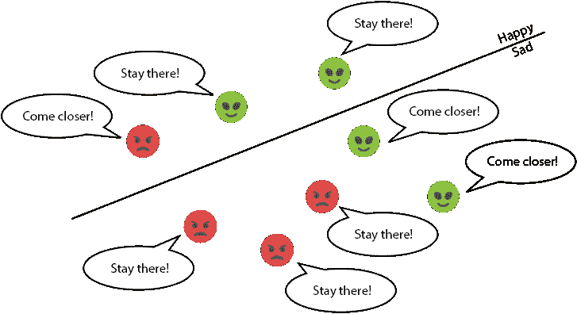

图 5.21 每个点都会告诉分类器如何让自己过得更好。被正确分类的点会告诉线保持不动。被错误分类的点会告诉线稍微向它们移动。

感知器算法的下一步是随机选择一个点，例如图 5.22 中的点。如果点被正确分类，则直线保持不变。如果点被错误分类，则直线会稍微靠近该点，从而使直线更好地适应该点。它可能对其他点不再是一个好的适应，但现在这并不重要。

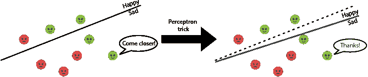

图 5.22 如果我们将感知器技巧应用于一个分类器和错误分类的点，分类器会稍微向该点移动。

可以想象，如果我们重复这个过程很多次，最终我们会得到一个好的解决方案。这种方法并不总是能带我们到最好的解决方案。但在实践中，这种方法通常能找到一个好的解决方案，如图 5.23 所示。我们称之为*感知器算法*。

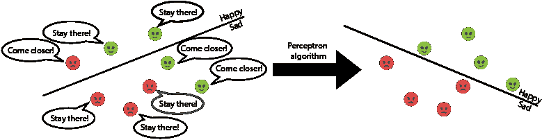

图 5.23 如果我们多次应用感知器技巧，每次随机选择一个点，我们可以想象我们会得到一个大多数点都能正确分类的分类器。

我们运行算法的次数是 epoch 的数量。因此，这个算法有两个超参数：epoch 的数量和学习率。感知器算法的伪代码如下：

感知器算法的伪代码

输入：

+   一个由 1 和 0 标记的点集

+   一个 epoch 的数量，*n*

+   一个学习率 *η*

输出：

+   由一组权重和偏差组成的感知器分类器，它适合数据集

程序：

+   从感知器分类器的权重和偏差的随机值开始。

+   重复多次：

    +   选择一个随机数据点。

    +   使用感知器技巧更新权重和偏差。

**返回值**: 带有更新后的权重和偏差的感知器分类器。

我们应该运行循环多长时间？换句话说，我们应该使用多少个周期？以下是一些帮助我们做出决定的准则：

+   运行循环固定次数，这可能是基于我们的计算能力，或者我们拥有的时间量。

+   运行循环，直到错误低于我们事先设定的某个阈值。

+   运行循环，直到错误在一定的周期数内没有显著变化。

通常情况下，如果我们有足够的计算能力，运行它比所需的次数多几次是可以的，因为一旦我们有一个拟合良好的感知器分类器，它往往不会改变很多。在“编码感知器算法”部分，我们编码感知器算法并通过测量每一步的错误来分析它，这样我们就能更好地了解何时停止运行它。

注意，对于某些情况，例如图 5.24 中所示的情况，在数据集中找到一条线来分开两个类别是不可能的。这是可以的：目标是找到一条尽可能少出错的线来分开数据集（如图中所示），感知器算法在这方面做得很好。

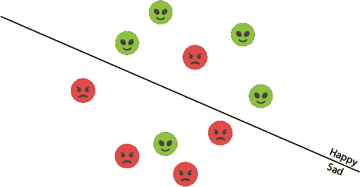

图 5.24 一个包含两个类别的数据集，这两个类别无法用一条线分开。然后，感知器算法被训练以找到尽可能好地分开它们的线。

梯度下降

你可能会注意到训练这个模型的过程看起来非常熟悉。事实上，它与我们在第三章中用线性回归所做的是相似的。回想一下，线性回归的目的是将一条线尽可能接近一组点。在第三章中，我们通过从一个随机线开始，并逐步靠近点来训练我们的线性回归模型。我们用从山顶（埃里斯特山）向下走的小步来类比这个过程。山顶上每个点的海拔是平均感知器误差函数，我们将其定义为绝对误差，或平方误差。因此，从山顶向下走相当于最小化误差，这相当于找到最佳拟合线。我们称这个过程为梯度下降，因为梯度正是指向最大增长方向的向量（所以它的负方向指向最大减少方向），在这个方向上迈出一步将使我们向下走得更远。

在本章中，发生的是同样的事情。我们的问题有一点不同，因为我们不希望将直线尽可能接近一组点。相反，我们希望以最佳方式绘制一条将两组点分开的线。感知器算法是一个从随机线开始，并逐步移动以构建更好分离器的过程。从山上下降的类比也适用于这里。唯一的不同之处在于，在这个山上，每个点的海拔高度是我们在第“如何比较分类器？错误函数”节中学到的平均感知器误差。

随机梯度下降和批量梯度下降

在本节中，我们开发感知器算法的方式是每次取一个点，并调整感知器（直线）以更好地适应该点。这被称为一个 epoch。然而，正如我们在第三章“我们是一次训练一个点还是多个点？”节中处理线性回归时所做的，更好的方法是每次取一批点，并一次性调整感知器以更好地适应这些点。极端情况是，一次性取集合中的所有点，并一次性调整感知器以更好地适应所有点。在第三章“我们是一次训练一个点还是多个点？”节中，我们称这些方法为*随机梯度下降*、*小批量梯度下降*和*批量梯度下降*。在本节中，我们使用带有小批量梯度下降的正式感知器算法。数学细节出现在附录 B，“使用梯度下降训练分类模型”节中，其中使用小批量梯度下降对感知器算法进行了全面描述。

## 编写感知器算法

现在我们已经为我们的情感分析应用开发了感知器算法，在本节中我们将编写它的代码。首先，我们将从头开始编写代码以适应我们的原始数据集，然后我们将使用 Turi Create。在现实生活中，我们总是使用一个包，几乎没有必要自己编写算法。然而，至少编写一些算法是好的——把它想象成做长除法。虽然我们通常不用计算器做长除法，但我们在高中时不得不这样做是好的，因为现在当我们用计算器做长除法时，我们知道背后发生了什么。本节的代码如下，我们使用的数据集显示在表 5.5 中：

+   **Notebook**: Coding_perceptron_algorithm.ipynb

    +   [`github.com/luisguiserrano/manning/blob/master/Chapter_5_Perceptron_Algorithm/Coding_perceptron_algorithm.ipynb`](https://github.com/luisguiserrano/manning/blob/master/Chapter_5_Perceptron_Algorithm/Coding_perceptron_algorithm.ipynb)

表 5.5 外星人数据集，他们说过的话以及他们的情绪。

| Aack | Beep | Happy/Sad |
| --- | --- | --- |
| 1 | 0 | 0 |
| 0 | 2 | 0 |
| 1 | 1 | 0 |
| 1 | 2 | 0 |
| 1 | 3 | 1 |
| 2 | 2 | 1 |
| 2 | 3 | 1 |
| 3 | 2 | 1 |

让我们先定义我们的数据集为一个 NumPy 数组。特征对应于两个数字，分别对应*aack*和*beep*的出现。标签为快乐句子的 1，悲伤句子的 0。

```
import numpy as np
features = np.array([[1,0],[0,2],[1,1],[1,2],[1,3],[2,2],[2,3],[3,2]])
labels = np.array([0,0,0,0,1,1,1,1])
```

这给我们带来了图 5.25 中的图表。在这个图表中，快乐句子是三角形，悲伤句子是正方形。

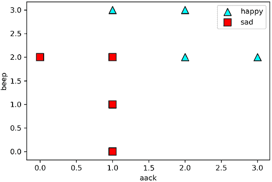

图 5.25 我们的数据集的图表。三角形是快乐的异形，正方形是悲伤的异形。

编写感知器技巧

在本节中，我们编写感知器技巧的代码。我们将使用随机梯度下降（一次一个点）来编写它，但我们也可以使用小批量或批量梯度下降来编写它。我们首先编写得分函数和预测函数。这两个函数接收相同的输入，即模型的权重、偏置和一个数据点的特征。得分函数返回模型对该数据点的评分，预测函数如果评分大于或等于零则返回 1，如果评分小于零则返回 0。对于此函数，我们使用第三章中“绘制误差函数和知道何时停止运行算法”部分中定义的点积。

```
def score(weights, bias, features):
    return np.dot(features, weights) + bias ❶
```

❶ 计算权重和特征之间的点积，加上偏置，并应用步函数

要编写预测函数，我们首先编写步函数。预测是分数的步函数。

```
def *step*(x):
    if x >= 0:
        return 1
    else:
        return 0

def prediction(weights, bias, features):
    return *step*(score(weights, bias, features)) ❶
```

❶ 查看分数，如果它是正数或零，则返回 1；如果是负数，则返回 0

接下来，我们编写一个点的误差函数。回想一下，如果点被正确分类，则误差为零；如果点被错误分类，则误差等于分数的绝对值。此函数以模型的权重和偏置以及数据点的特征和标签作为输入。

```
def error(weights, bias, features, label):
    pred = prediction(weights, bias, features)
    if pred == label: ❶
        return 0
    else: ❷
        return np.abs(score(weights, bias, features))
```

❶ 如果预测等于标签，则点被正确分类，这意味着误差为零。

❷ 如果预测与标签不同，则点被错误分类，这意味着误差等于分数的绝对值。

我们现在编写一个用于平均感知器误差的函数。此函数计算我们数据集中所有点的误差的平均值。

```
def mean_perceptron_error(weights, bias, features, labels):
    total_error = 0
    for i in range(len(features)): ❶
        total_error += error(weights, bias, features[i], labels[i])
    return total_error/len(features) ❷
```

❶ 遍历我们的数据，并对每个点，加上该点的误差，然后返回这个误差

❷ 将误差总和除以点的数量以获得平均感知器误差。

现在我们有了误差函数，我们可以继续编写感知器技巧的代码。我们将编写该节“感知器技巧”末尾找到的算法的简化版本。然而，在笔记本中，你可以找到两种编码方式，第一种使用`if`语句检查点是否被正确分类。

```
def perceptron_trick(weights, bias, features, label, learning_rate = 0.01):
    pred = prediction(weights, bias, features)
    for i in range(len(weights)):
        weights[i] += (label-pred)*features[i]*learning_rate ❶
    bias += (label-pred)*learning_rate
    return weights, bias
```

❶ 使用感知器技巧更新权重和偏置

编写感知器算法

既然我们已经有了感知器技巧，我们可以编写感知器算法了。回想一下，感知器算法包括从一个随机的感知器分类器开始，并多次重复感知器技巧（多达 epoch 的数量）。为了跟踪算法的性能，我们还会在每个 epoch 跟踪平均感知器误差。作为输入，我们有数据（特征和标签）、学习率，我们默认设置为 0.01，以及 epoch 的数量，我们默认设置为 200。感知器算法的代码如下：

```
def perceptron_algorithm(features, labels, learning_rate = 0.01, epochs = 200):
    weights = [1.0 for i in range(len(features[0]))] ❶
    bias = 0.0
    errors = [] ❷
    for epoch in range(epochs): ❸
        error = mean_perceptron_error(weights, bias, features, labels) ❹
        errors.append(error)
        i = random.randint(0, len(features)-1) ❺
        weights, bias = perceptron_trick(weights, bias, features[i], labels[i])❻
    return weights, bias, errors
```

❶ 将权重初始化为 1，将偏置初始化为 0。如果您愿意，也可以将它们初始化为小的随机数。

❷ 一个用于存储误差的数组

❸ 重复该过程，直到 epoch 的数量

❹ 计算平均感知器误差并将其存储

❺ 在我们的数据集中随机选择一个点

❻ 将感知器算法应用于更新模型基于该点的权重和偏置

现在我们来在我们的数据集上运行算法吧！

```
perceptron_algorithm(features, labels)
Output: ([0.6299999999999997, 0.17999999999999938], -1.0400000000000007)
```

输出显示我们获得的权重和偏置如下：

+   *aack*的权重：0.63

+   *beep*的权重：0.18

+   偏置：-1.04

我们可能会有不同的答案，因为算法中我们选择点的随机性。为了使存储库中的代码始终返回相同的答案，随机种子被设置为零。

图 5.26 显示了两个图表：左边是线拟合，右边是误差函数。对应于结果感知器的线是粗线，它正确地分类了每个点。较细的线是对应于每个 200 个 epoch 后获得的感知器的线。注意，在每个 epoch，线都成为点的更好拟合。随着 epoch 数量的增加，误差降低（主要是），直到在约 140 个 epoch 时达到零，这意味着每个点都被正确分类。

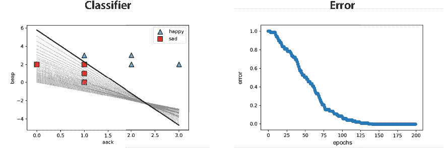

图 5.26 左：我们结果分类器的图。注意，它正确地分类了每个点。右：误差图。注意，我们运行感知器算法的 epoch 越多，误差越低。

那就是感知器算法的代码！正如我之前提到的，在实践中，我们通常不会手动编写算法，而是使用一个包，如 Turi Create 或 Scikit-Learn。这就是我们在下一节要介绍的内容。

使用 Turi Create 编写感知器算法

在本节中，我们学习在 Turi Create 中编写感知器算法。代码与之前的练习在同一个笔记本中。我们的第一个任务是导入 Turi Create 并创建一个包含我们数据的 SFrame，如下所示：

```
import turicreate as tc

datadict = {'aack': features[:,0], 'beep':features[:,1], 'prediction': labels}
data = tc.SFrame(datadict)
```

接下来，我们创建并训练我们的感知器分类器，使用`logistic_classifier`对象和`create`方法，如以下代码所示。输入是数据集和包含标签（目标）的列名。

```
perceptron = tc.logistic_classifier.create(data, target='prediction')
```

输出：

```
+-----------+----------+--------------+-------------------+
| Iteration | Passes   | Elapsed Time | Training Accuracy |
+-----------+----------+--------------+-------------------+
| 1         | 2        | 1.003120     | 1.000000          |
| 2         | 3        | 1.004235     | 1.000000          |
| 3         | 4        | 1.004840     | 1.000000          |
| 4         | 5        | 1.005574     | 1.000000          |
+-----------+----------+--------------+-------------------+
SUCCESS: Optimal solution found.
```

注意，感知器算法运行了四个时期，在最后一个时期（实际上，在所有时期），它的训练准确率为 1。这意味着数据集中的每个点都被正确分类。

最后，我们可以使用以下命令查看模型的权重和偏差：

```
perceptron.coefficients
```

这个函数的输出显示了以下感知器的权重和偏差：

+   *aack*的权重：2.70

+   *beep*的权重：2.46

+   偏差：-8.96

这些结果与我们手动获得的结果不同，但两个感知器在数据集中都工作得很好。

## 感知器算法的应用

感知器算法在现实生活中有许多应用。几乎每次我们需要用是或否来回答问题，而答案是从以前的数据中预测出来的，感知器算法都可以帮助我们。以下是感知器算法在现实生活中的应用实例。

垃圾邮件过滤器

就像我们根据句子中的单词预测句子是快乐还是悲伤一样，我们可以根据电子邮件中的单词预测电子邮件是否是垃圾邮件。我们还可以使用其他特征，如下所示：

+   电子邮件长度

+   附件大小

+   发件人数量

+   我们是否有任何联系人是发件人

目前，感知器算法（及其更高级的对应物，逻辑回归和神经网络）以及其他分类模型，大多数最大的电子邮件提供商都将其用作垃圾邮件分类管道的一部分，并取得了很好的效果。

我们也可以使用感知器算法等分类算法对电子邮件进行分类。将电子邮件分类为个人、订阅和促销是同一个问题。甚至对一封电子邮件的潜在回复也是分类问题，只是现在我们使用的标签是电子邮件的回复。

推荐系统

在许多推荐系统中，向用户推荐视频、电影、歌曲或产品归结为一个是否的问题。在这些情况下，问题可以是以下任何一种：

+   用户是否会点击我们推荐的视频/电影？

+   用户是否会观看我们推荐的整个视频/电影？

+   用户是否会听我们推荐的歌？

+   用户是否会购买我们推荐的商品？

特征可以是任何东西，从人口统计（用户的年龄、性别、位置），到行为（用户看了哪些视频，听了哪些歌曲，买了哪些产品？）。你可以想象用户向量会很长！为此，需要大量的计算能力和非常巧妙的算法实现。

Netflix、YouTube 和 Amazon 等公司以及其他许多公司，在他们的推荐系统中使用感知器算法或更高级的分类模型。

医疗保健

许多医疗模型也使用感知器算法等分类算法来回答以下问题：

+   患者是否患有特定的疾病？

+   某种治疗方法对病人有效吗？

这些模型的特征通常是病人所患的症状和他们的医疗史。对于这类算法，需要非常高的性能水平。为病人推荐错误的治疗方案比推荐一个用户不会观看的视频要严重得多。对于这种分析，请参考第七章，其中我们讨论了准确度以及其他评估分类模型的方法。

计算机视觉

感知器算法等分类算法在计算机视觉中得到了广泛应用，特别是在图像识别中。想象一下，我们有一张图片，我们想要教会计算机判断这张图片是否包含一只狗。这是一个分类模型，其特征是图像的像素。

感知器算法在 MNIST 等精心制作的图像数据集上表现良好，MNIST 是一个手写数字数据集。然而，对于更复杂的图像，它表现不佳。对于这些，人们使用由许多感知器组合而成的模型。这些模型恰当地被称为多层感知器，或神经网络，我们将在第十章中详细学习它们。

## 摘要

+   分类是机器学习的一个重要部分。它与回归类似，因为它包括使用标记数据训练算法，并使用它来对未来的（未标记）数据进行预测。与回归的不同之处在于，在分类中，预测是类别，例如是/否、垃圾邮件/非垃圾邮件等。

+   感知器分类器通过为每个特征和偏差分配一个权重来工作。数据点的得分是权重和特征的乘积之和，加上偏差。如果得分大于或等于零，分类器预测为是。否则，它预测为否。

+   对于情感分析，感知器由字典中每个单词的得分以及一个偏差组成。快乐词通常会有一个正得分，而悲伤词会有一个负得分。中性词如*the*可能最终会有一个接近零的得分。

+   偏差帮助我们判断一个空句子是快乐还是悲伤。如果偏差是正的，那么空句子就是快乐的，如果是负的，那么空句子就是悲伤的。

+   从图形上看，我们可以将感知器视为一条试图分离两类点的线，这些点可以看作是两种不同颜色的点。在更高维度的空间中，感知器是一个分隔点的超平面。

+   感知器算法通过从一个随机的线开始，然后慢慢移动它以更好地分隔点来工作。在每一次迭代中，它选择一个随机点。如果点被正确分类，线不会移动。如果它被错误分类，那么线会稍微靠近一点，以越过它并正确分类。

+   感知器算法有众多应用，包括垃圾邮件检测、推荐系统、电子商务和医疗保健。

## 练习

练习 5.1

以下是一个数据集，包含已测试 COVID-19 阳性或阴性的患者。他们的症状包括咳嗽（C）、发热（F）、呼吸困难（B）和疲劳（T）。

|  | 咳嗽（C） | 发热（F） | 呼吸困难（B） | 疲劳（T） | 诊断（D） |
| --- | --- | --- | --- | --- | --- |
| 患者编号 1 |  | X | X | X | 病人 |
| 患者编号 2 | X | X |  | X | 病人 |
| 患者编号 3 | X |  | X | X | 病人 |
| 患者编号 4 | X | X | X |  | 病人 |
| 患者编号 5 | X |  |  | X | 健康 |
| 患者编号 6 |  | X | X |  | 健康 |
| 患者编号 7 |  | X |  |  | 健康 |
| 患者编号 8 |  |  |  | X | 健康 |

构建一个感知器模型来分类这个数据集。

提示：你可以使用感知器算法，但你可能能够直接找到一个有效的感知器模型。

练习 5.2

考虑一个感知器模型，该模型将点 (*x*[1], *x*[2]) 分配给预测 *ŷ* = *step*(2*x*[1] + 3*x*[2] – 4)。该模型具有方程 2*x*[1] + 3*x*[2] – 4 = 0 的边界线。我们有一个点 *p* = (1, 1) 且标签为 0。

1.  验证点 *p* 被模型错误分类。

1.  计算模型在点 *p* 处产生的感知器误差。

1.  使用感知器技巧获得一个新的模型，该模型仍然错误分类 *p* 但产生更小的误差。你可以使用 *η* = 0.01 作为学习率。

1.  计算新模型在点 *p* 处的预测，并验证感知器误差小于原始误差。

练习 5.3

感知器在构建逻辑门（如 AND 和 OR）方面特别有用。

1.  构建一个模拟 AND 门的感知器。换句话说，构建一个感知器来拟合以下数据集（其中 *x*[1], *x*[2] 是特征，*y* 是标签）：

    | *x*[1] | *x*[2] | *y*   |
    | --- | --- | --- |
    | 0 | 0 | 0 |
    | 0 | 1 | 0 |
    | 1 | 0 | 0 |
    | 1 | 1 | 1 |

1.  类似地，根据以下数据集构建一个模拟 OR 门的感知器：

    | *x*[1] | *x*[2] | *y*   |
    | --- | --- | --- |
    | 0 | 0 | 0 |
    | 0 | 1 | 1 |
    | 1 | 0 | 1 |
    | 1 | 1 | 1 |

1.  证明不存在一个感知器可以模拟以下数据集给出的 XOR 门：

    | *x*[1] | *x*[2] | *y*   |
    | --- | --- | --- |
    | 0 | 0 | 0 |
    | 0 | 1 | 1 |
    | 1 | 0 | 1 |
    | 1 | 1 | 0 |
