# 6 一种连续的分割点方法：逻辑分类器

在本章

+   分类模型中硬任务和软任务之间的区别

+   Sigmoid 函数，一种连续的激活函数

+   离散感知器与连续感知器，也称为逻辑分类器

+   用于分类数据的逻辑回归算法

+   在 Python 中编码逻辑回归算法

+   在 Turi Create 中使用逻辑分类器分析电影评论的情感

+   使用 softmax 函数构建超过两个类别的分类器

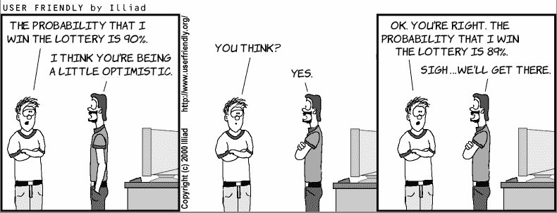

在上一章中，我们构建了一个分类器，用于判断一个句子是快乐还是悲伤。但正如我们可以想象的那样，有些句子比其他句子更快乐。例如，“我感觉很好”和“今天是我一生中最美好的一天！”这两个句子都是快乐的，但第二个句子比第一个句子快乐得多。不是很好吗？有一个分类器不仅能预测句子是快乐还是悲伤，还能给出句子快乐的评分——比如说，一个告诉我们第一个句子有 60%快乐的分类器，第二个句子有 95%快乐的分类器？在这一章中，我们定义了*逻辑分类器*，它正是这样做的。这个分类器给每个句子分配一个从 0 到 1 的分数，这样句子越快乐，它收到的分数就越高。

简而言之，逻辑分类器是一种模型，它的工作方式与感知器分类器非常相似，除了它返回的是 0 到 1 之间的一个数字。在这种情况下，目标是给最悲伤的句子分配接近 0 的分数，给最快乐的句子分配接近 1 的分数，给中性的句子分配接近 0.5 的分数。这个 0.5 的阈值在实践中很常见，尽管是任意的。在第七章中，我们将看到如何调整它以优化我们的模型，但本章我们使用 0.5。

本章依赖于第五章，因为我们在这里开发的算法在技术差异之外是相似的。确保你很好地理解第五章将有助于你理解本章的内容。在第五章中，我们使用一个错误函数描述了感知器算法，该函数告诉我们感知器分类器有多好，以及一个迭代步骤，该步骤将分类器转变为一个稍微好一点的分类器。在这一章中，我们学习逻辑回归算法，它以类似的方式工作。主要区别如下：

+   步函数被一个新的激活函数所取代，该函数返回介于 0 和 1 之间的值。

+   感知器错误函数被一个新的基于概率计算的错误函数所取代。

+   感知器技巧被一个新的技巧所取代，该技巧基于这个新的错误函数改进了分类器。

旁白：在本章中，我们进行了大量的数值计算。如果你跟随方程式，可能会发现你的计算与书中所述的数值略有不同。书中在方程式的最后一位数进行四舍五入，而不是在步骤之间。然而，这应该对最终结果的影响非常小。

在本章末尾，我们将所学知识应用于 IMDB（[www.imdb.com](https://www.imdb.com)）网站上真实的电影评论数据集。我们使用逻辑分类器来预测电影评论是正面还是负面。

本章的代码可在以下 GitHub 仓库中找到：[`github.com/luisguiserrano/manning/tree/master/Chapter_6_Logistic_Regression`](https://github.com/luisguiserrano/manning/tree/master/Chapter_6_Logistic_Regression).

## 逻辑分类器：感知器分类器的连续版本

在第五章中，我们介绍了感知器，这是一种使用数据特征进行预测的分类器。预测可以是 1 或 0。这被称为*离散感知器*，因为它从离散集合（包含 0 和 1 的集合）中返回一个答案。在本章中，我们学习*连续感知器*，它返回一个介于 0 和 1 之间的任何数值。连续感知器的一个更常见的名称是*逻辑分类器*。逻辑分类器的输出可以解释为分数，逻辑分类器的目标是分配尽可能接近点的标签——标签为 0 的点应得到接近 0 的分数，标签为 1 的点应得到接近 1 的分数。

我们可以像离散感知器一样可视化连续感知器：用一条线（或高维平面）分隔两个数据类别。唯一的区别是，离散感知器预测线的一侧的所有内容都有标签 1，另一侧有标签 0，而连续感知器根据点相对于线的位置分配一个从 0 到 1 的值。线上的每个点都得到 0.5 的值。这个值意味着模型无法决定句子是快乐还是悲伤。例如，在正在进行的情感分析示例中，句子“今天是星期二”既不快乐也不悲伤，因此模型会分配一个接近 0.5 的分数。正区间的点得到大于 0.5 的分数，其中正方向上离 0.5 线更远的点得到更接近 1 的值。负区间的点得到小于 0.5 的分数，其中离线更远的点得到更接近 0 的值。没有点得到 1 或 0 的值（除非我们考虑无穷远的点），如图 6.1 所示。

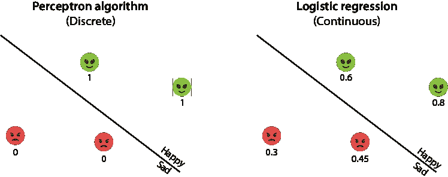

图 6.1 左：感知器算法训练一个离散感知器，其中预测值为 0（快乐）和 1（悲伤）。右：逻辑回归算法训练一个连续感知器，其中预测值是介于 0 和 1 之间的数字，表示预测的幸福程度。

为什么我们称之为*分类*而不是*回归*，鉴于逻辑分类器并不是输出一个状态本身，而是一个数字？原因是，在评分之后，我们可以将它们分为两类，即得分在 0.5 或更高的点和得分低于 0.5 的点。从图形上看，这两类点被边界线分开，就像感知器分类器一样。然而，我们用来训练逻辑分类器的算法被称为*逻辑回归算法*。这个符号有点奇特，但我们将保持原样以匹配文献。

分类的一种概率方法：sigmoid 函数

我们如何稍微修改上一节中的感知器模型，为每个句子得到一个分数，而不是简单的“快乐”或“悲伤”？回想一下我们在感知器模型中是如何进行预测的。我们通过分别评分每个单词并将评分相加，再加上偏差来评分每个句子。如果评分是正的，我们预测句子是快乐的；如果评分是负的，我们预测句子是悲伤的。换句话说，我们所做的是将阶跃函数应用于评分。阶跃函数在非负评分时返回 1，在负评分时返回 0。

现在我们做类似的事情。我们取一个接收分数作为输入并输出 0 到 1 之间数字的函数。如果分数是正的，则数字接近 1；如果分数是负的，则数字接近 0。如果分数是零，则输出是 0.5。想象一下，如果你能将整个数轴压缩到 0 和 1 之间的区间，它看起来就像图 6.2 中的函数。

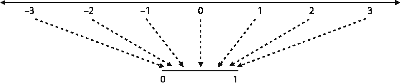

图 6.2 Sigmoid 函数将整个数轴映射到区间(0,1)。

许多函数可以在这里帮助我们，在这种情况下，我们使用一个称为*sigmoid*的函数，用希腊字母*sigma*（*σ*）表示。sigmoid 的公式如下：

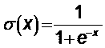

这里真正重要的是公式本身，而是函数所做的工作，即将实数线压缩到区间(0,1)。在图 6.3 中，我们可以看到阶跃函数和 sigmoid 函数的图形比较。

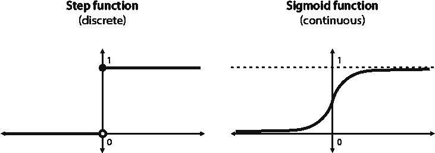

图 6.3 左：用于构建离散感知器的阶跃函数。对于任何负输入，它输出 0；对于任何正或零输入，它输出 1。它在零处有间断。右：用于构建连续感知器的 sigmoid 函数。对于负输入，它输出小于 0.5 的值；对于正输入，它输出大于 0.5 的值。在零处，它输出 0.5。它在任何地方都是连续且可微的。

S 形函数在一般情况下，由于以下几个原因，通常比阶梯函数更好。连续预测比离散预测提供了更多信息。此外，当我们进入微积分时，S 形函数的导数比阶梯函数要好得多。阶梯函数的导数为零，除了原点，在那里它是未定义的。在表 6.1 中，我们计算了 S 形函数的一些值，以确保函数按我们的预期工作。

表 6.1 在 S 形函数下的某些输入及其输出。注意，对于大的负输入，输出接近 0，而对于大的正输入，输出接近 1。对于输入 0，输出是 0.5。

| *x*   | σ(*x*) |
| --- | --- |
| –5 | 0.007 |
| –1 | 0.269 |
| 0 | 0.5 |
| 1 | 0.731 |
| 5 | 0.993 |

逻辑分类器的预测是通过将 S 形函数应用于得分得到的，它返回一个介于 0 和 1 之间的数字，正如之前提到的，在我们的例子中，这可以解释为句子快乐的概率。

在第五章中，我们为感知器定义了一个误差函数，称为感知器误差。我们使用这个感知器误差来迭代构建感知器分类器。在本章中，我们遵循相同的程序。连续感知器的误差与离散预测器的误差略有不同，但它们仍然有相似之处。

数据集和预测

在本章中，我们使用与第五章相同的用例，其中我们有一个外星语言的句子数据集，标签为“快乐”和“悲伤”，分别用 1 和 0 表示。本章的数据集与第五章略有不同，如表 6.2 所示。

表 6.2 句子的数据集及其快乐/悲伤标签。坐标是句子中单词 aack 和 beep 的出现次数。

|  | 单词 | 坐标(#aack, #beep) | 标签 |
| --- | --- | --- | --- |
| 句子 1 | Aack beep beep aack aack. | (3,2) | 悲伤 (0) |
| 句子 2 | Beep aack beep. | (1,2) | 快乐 (1) |
| 句子 3 | Beep! | (0,1) | 快乐 (1) |
| 句子 4 | Aack aack. | (2,0) | 悲伤 (0) |

我们使用的模型具有以下权重和偏差：

逻辑分类器 1

+   *Aack*的权重：*a* = 1

+   *Beep*的权重：*b* = 2

+   偏差：*c* = –4

我们使用与第五章相同的符号，其中变量 *x*[aack] 和 *x*[beep] 分别跟踪 *aack* 和 *beep* 的出现次数。感知器分类器会根据公式 *ŷ* = *step*(*ax*[aack] + *bx*[beep] + *c*) 进行预测，但由于这是一个逻辑分类器，它使用 S 形函数而不是阶梯函数。因此，其预测为 *ŷ* = *σ*(*ax*[aack] + *bx*[beep] + *c*)。在这种情况下，预测如下：

**预测**：*ŷ* = *σ*(1 · *x*[aack] + 2 · *x*[beep] – 4)

因此，分类器对我们的数据集做出了以下预测：

+   **句子 1**：*ŷ* = *σ*(3 + 2 · 2 – 4) = *σ*(3) = 0.953。

+   **句子 2**：*ŷ* = *σ*(1 + 2 · 2 – 4) = *σ*(1) = 0.731。

+   **句子 3**：*ŷ* = *σ*(0 + 2 · 1 – 4) = *σ*(–2) = 0.119。

+   **句子 4**：*ŷ* = *σ*(2 + 2 · 0 – 4) = *σ*(–2) = 0.119。

“快乐”和“悲伤”类别的边界是方程*x*[aack] + 2*x*[beep] – 4 = 0 的线，如图 6.4 所示。

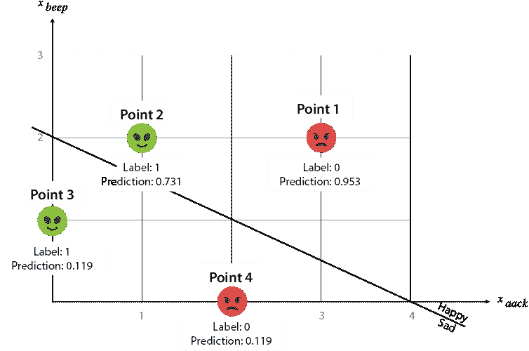

图 6.4 表 6.2 中数据集的预测图。注意点 2 和 4 被正确分类，但点 1 和 3 被错误分类。

这条线将平面分为正（快乐）和负（悲伤）区域。正区域由预测值高于或等于 0.5 的点组成，负区域由预测值小于 0.5 的点组成。

误差函数：绝对误差、平方误差和对数损失

在本节中，我们为逻辑分类器构建了三个误差函数。一个好的误差函数应该具备哪些特性？以下是一些例子：

+   如果一个点被正确分类，误差将是一个小数。

+   如果一个点被错误分类，误差将是一个大数。

+   对于一组点的分类器的误差是所有点误差的总和（或平均值）。

许多函数满足这些属性，我们将看到其中的三个；绝对误差、平方误差和对数损失。在表 6.3 中，我们有与我们的数据集中句子对应的四个点的标签和预测，以下是其特征：

+   线上的点被预测为 0.5。

+   位于正区域的点被预测为高于 0.5，并且一个点在这个方向上离线越远，其预测值就越接近 1。

+   位于负区域的点被预测为低于 0.5，并且一个点在这个方向上离线越远，其预测值就越接近 0。

表 6.3 四个点——两个快乐和两个悲伤及其预测，如图 6.4 所示。注意点 1 和 4 被正确分类，但点 2 和 3 没有被分类。一个好的误差函数应该将小的误差分配给正确分类的点，将大的误差分配给分类不良的点。

| 点 | 标签 | 预测 | 误差？ |
| --- | --- | --- | --- |
| 1 | 0 (悲伤) | 0.953 | 应该很大 |
| 2 | 1 (快乐) | 0.731 | 应该很小 |
| 3 | 1 (快乐) | 0.119 | 应该很大 |
| 4 | 0 (悲伤) | 0.119 | 应该很小 |

注意到在表 6.3 中，点 2 和 4 得到了一个接近标签的预测，因此它们应该有小的误差。相比之下，点 1 和 3 得到了一个远离标签的预测，因此它们应该有大的误差。具有这种特定属性的三个误差函数如下：

误差函数 1：绝对误差

绝对误差与我们在第三章中为线性回归定义的绝对误差相似。它是预测值与标签之间差异的绝对值。正如我们所见，当预测值远离标签时，误差很大；而当它们接近时，误差很小。

误差函数 2：平方误差

再次，就像在线性回归中一样，我们也有平方误差。这是预测值和标签之间的差的平方，它以与绝对误差相同的原因工作。

在我们继续之前，让我们计算表 6.4 中点的绝对误差和平方误差。请注意，点 2 和 4（正确分类）有小的误差，而点 1 和 3（错误分类）有较大的误差。

表 6.4 我们附上了表 6.3 中点的绝对误差和平方误差。请注意，正如我们所希望的，点 2 和 4 有小的误差，而点 1 和 3 有较大的误差。

| 点 | 标签 | 预测标签 | 绝对误差 | 平方误差 |
| --- | --- | --- | --- | --- |
| 1 | 0 (悲伤) | 0.953 | 0.953 | 0.908 |
| 2 | 1 (快乐) | 0.731 | 0.269 | 0.072 |
| 3 | 1 (快乐) | 0.119 | 0.881 | 0.776 |
| 4 | 0 (悲伤) | 0.119 | 0.119 | 0.014 |

绝对误差和平方误差可能会让你想起回归中使用的误差函数。然而，在分类中，它们并不那么广泛使用。最流行的是我们接下来要看到的下一个函数。为什么它更受欢迎？与下一个函数相关的数学（导数）工作得更好。此外，这些误差都非常小。事实上，无论分类有多差，它们都小于 1。原因是介于 0 和 1 之间的两个数字之间的差（或差的平方）最多为 1。为了正确训练模型，我们需要误差函数能够取比这更大的值。幸运的是，第三个误差函数可以为我们做到这一点。

误差函数 3：log loss

*log loss* 是连续感知器最广泛使用的误差函数。本书中的大多数误差函数名称中都包含“误差”一词，但这个函数的名称中却包含“loss”（损失）。名称中的 *log* 部分来源于公式中使用的自然对数。然而，log loss 的真正灵魂是概率。

连续感知器的输出是介于 0 和 1 之间的数字，因此它们可以被认为是概率。模型为每个数据点分配一个概率，即该点快乐的概率。从这个结果中，我们可以推断出该点悲伤的概率，即快乐概率的 1 减去。例如，如果预测值为 0.75，这意味着模型认为该点有 0.75 的概率是快乐的，有 0.25 的概率是悲伤的。

现在，这里有一个主要的观察结果。模型的目标是为快乐点（标签为 1 的点）分配高概率，为悲伤点（标签为 0 的点）分配低概率。请注意，一个点悲伤的概率是它快乐概率的 1 减去。因此，对于每个点，让我们计算模型为其标签分配的概率。对于我们的数据集中的点，相应的概率如下：

+   **点 1**：

    +   标签 = 0 (悲伤)

    +   预测（快乐概率）= 0.953

    +   成为该标签的概率：1 – 0.953 = **0.047**

+   **第 2 点**:

    +   标签 = 1（快乐）

    +   预测（快乐的概率）= 0.731

    +   成为该标签的概率：**0.731**

+   **第 3 点**:

    +   标签 = 1（快乐）

    +   预测（快乐的概率）= 0.119

    +   成为该标签的概率：**0.119**

+   **第 4 点**:

    +   标签 = 0（悲伤）

    +   预测（快乐的概率）= 0.119

    +   成为该标签的概率：1 – 0.119 = **0.881**

注意，第 2 点和第 4 点是分类良好的点，模型分配了很高的概率认为它们是自己的标签。相比之下，第 1 点和第 3 点是分类不良的点，模型分配了很低的概率认为它们是自己的标签。

与感知器分类器相比，逻辑回归分类器不给出明确的答案。感知器分类器会说，“我 100%确信这个点是快乐的”，而逻辑回归分类器会说，“你的点有 73%的概率是快乐的，27%的概率是悲伤的。”虽然感知器分类器的目标是尽可能多地正确，但逻辑回归分类器的目标是给每个点分配具有最高可能性的正确标签。这个分类器将概率 0.047、0.731、0.119 和 0.881 分配给四个标签。理想情况下，我们希望这些数字更高。我们如何衡量这四个数字呢？一种方法是将它们相加或取平均值。但由于它们是概率，自然的方法是相乘。当事件是独立时，它们同时发生的概率是它们概率的乘积。如果我们假设这四个预测是独立的，那么这个模型分配给标签“悲伤、快乐、快乐、悲伤”的概率是这四个数字的乘积，即 0.047 · 0.731 · 0.119 · 0.881 = 0.004。这是一个非常小的概率。我们希望一个更适合这个数据集的模型会产生更高的概率。

我们刚才计算的概率似乎是我们模型的良好度量，但它有一些问题。例如，它是由许多小数相乘得到的。许多小数的乘积往往非常小。想象一下，如果我们的数据集有一百万个点，概率将是这些在 0 到 1 之间的一个百万个数的乘积。这个数字可能非常小，以至于计算机可能无法表示它。此外，操作一个百万个数的乘积极其困难。我们是否有办法将它转换成更容易操作的东西，比如和？

幸运的是，我们有一个方便的方法将产品转换为和——使用对数。对于整本书，我们只需要了解对数的一个特性，那就是它可以将产品转换为和。更具体地说，两个数的乘积的对数是这些数的对数之和，如下所示：

*ln*(*a · b*) = *ln*(*a*) + *ln*(*b*)

我们可以使用以 2、10 或 e 为底的对数。在本章中，我们使用自然对数，其底数为 e。然而，如果我们使用任何其他底数的对数，也可以得到相同的结果。

如果我们将自然对数应用于我们的概率乘积，我们得到

*ln*(0.047 *·* 0.731 *·* 0.119 *·* 0.881) = *ln*(0.047) + *ln*(0.731) + *ln*(0.119) + *ln*(0.881) = –5.616.

一个小细节。注意结果是一个负数。实际上，这总是会发生，因为 0 到 1 之间的数的对数总是负数。因此，如果我们取概率乘积的负对数，它总是正数。

对数损失定义为概率乘积的负对数，这也就是概率的负对数之和。此外，每个加数都是该点的对数损失。在表 6.5 中，你可以看到每个点的对数损失的计算。通过将所有点的对数损失相加，我们得到总对数损失为 5.616。

表 6.5 计算数据集中点的对数损失。注意，分类良好的点（2 和 4）具有较小的对数损失，而分类不良的点（1 和 3）具有较大的对数损失。

| 点 | 标签 | 预测标签 | 是其标签的概率 | 对数损失 |
| --- | --- | --- | --- | --- |
| 1 | 0 (悲伤) | 0.953 | 0.047 | –ln(0.047) = 3.049 |
| 2 | 1 (快乐) | 0.731 | 0.731 | –ln(0.731) = 0.313 |
| 3 | 1 (快乐) | 0.119 | 0.119 | –ln(0.119) = 2.127 |
| 4 | 0 (悲伤) | 0.119 | 0.881 | –ln(0.881) = 0.127 |

注意，确实，分类良好的点（2 和 4）具有较小的对数损失，而分类不良的点具有较大的对数损失。原因是如果数字*x*接近 0，则–*ln*(*x*)是一个大数，但如果*x*接近 1，则–*ln*(*x*)是一个小数。

总结一下，计算对数损失的步骤如下：

+   对于每个点，我们计算分类器给出其标签的概率。

    +   对于快乐点，这个概率就是得分。

    +   对于悲伤点，这个概率是得分减去 1。

+   我们将这些概率相乘，以获得分类器对这些标签给出的总概率。

+   我们将自然对数应用于该总概率。

+   乘积的对数是各个因子的对数之和，因此我们得到一个对数之和，每个点一个。

+   我们注意到所有项都是负数，因为小于 1 的数的对数是负数。因此，我们将所有项乘以–1 以得到正数的和。

+   这个和就是我们的对数损失。

对数损失与*交叉熵*的概念密切相关，交叉熵是衡量两个概率分布之间相似度的一种方法。关于交叉熵的更多细节可以在附录 C 的参考文献中找到。

对数损失的公式

一个点的对数损失可以简化为一个漂亮的公式。回想一下，对数损失是点是其标签（快乐或悲伤）的概率的负对数。模型对每个点的预测是 *ŷ*，即点是快乐的概率。因此，根据模型，点是悲伤的概率是 1 – *ŷ*。因此，我们可以将对数损失写成以下形式：

+   如果标签是 0：*对数损失* = –*ln*(1 – *ŷ*)

+   如果标签是 1：*对数损失* = –*ln*(*ŷ*)

因为标签是 y，之前的 `if` 语句可以简化为以下公式：

*对数损失* = –*y* *ln*(*ŷ*) – (1 – *y*) *ln*(1 – *ŷ*)

之前的公式之所以有效，是因为如果标签是 0，第一个加数是 0，如果标签是 1，第二个加数是 0。当我们提到点的对数损失或整个数据集的对数损失时，我们使用术语 *对数损失*。数据集的对数损失是每个点的对数损失的总和。

使用对数损失比较分类器

现在我们已经确定了对逻辑分类器的误差函数，即对数损失，我们可以用它来比较两个分类器。回想一下，我们本章中使用的分类器由以下权重和偏差定义：

逻辑分类器 1

+   *Aack* 权重：*a* = 1

+   *Beep* 权重：*b* = 2

+   偏差：*c* = –4

在本节中，我们将其与以下逻辑分类器进行比较：

逻辑分类器 2

+   *Aack* 权重：*a* = –1

+   *Beep* 权重：*b* = 1

+   偏差：*c* = 0

每个分类器做出的预测如下：

+   **分类器 1**：*ŷ* = *σ*(*x*[aack] + 2*x*[beep] – 4)

+   **分类器 2**：*ŷ* = *σ*(–*x*[aack] + *x*[beep])

两个分类器的预测记录在表 6.6 中，数据集和两个边界线的图示在图 6.5 中。

表 6.6 计算数据集中点的对数损失。注意，分类器 2 的预测比分类器 1 的预测更接近点的标签。因此，分类器 2 是一个更好的分类器。

| 点 | 标签 | 分类器 1 预测 | 分类器 2 预测 |
| --- | --- | --- | --- |
| 1 | 0 (悲伤) | 0.953 | 0.269 |
| 2 | 1 (快乐) | 0.731 | 0.731 |
| 3 | 1 (快乐) | 0.119 | 0.731 |
| 4 | 0 (悲伤) | 0.881 | 0.119 |

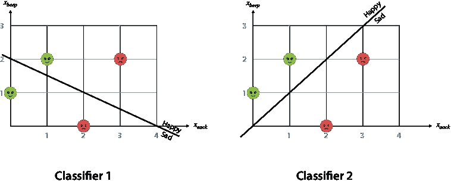

图 6.5 左：一个犯两个错误的糟糕分类器。右：一个正确分类所有四个点的良好分类器。

从表 6.6 和图 6.5 的结果来看，很明显分类器 2 比分类器 1 好得多。例如，在图 6.5 中，我们可以看到分类器 2 正确地将两个快乐句子定位在正区域，将两个悲伤句子定位在负区域。接下来，我们比较对数损失。回想一下，分类器 1 的对数损失是 5.616。我们应该得到一个更小的对数损失，因为这是一个更好的分类器。

根据公式 *对数损失* = –*y* *ln*(*ŷ*) – (1 – *y*) *ln*(1 – *ŷ*)，我们数据集中每个点的对数损失如下：

+   **点 1**：*y* = 0, *ŷ* = 0.269：

    +   *对数损失* = *ln*(1 – 0.269) = 0.313

+   **点 2**：*y* = 1, *ŷ* = 0.73：

    +   *对数损失* = *ln*(0.721) = 0.313

+   **点 3**：*y* = 1, *ŷ* = 0.73：

    +   *对数损失* = *ln*(731) = 0.313

+   **点 4**：*y* = 0, *ŷ* = 0.119：

    +   *对数损失* = *ln*(1 – 0.119) = 0.127

数据集的总对数损失是这四个值的总和，为 1.067。请注意，这个值远小于 5.616，这证实了分类器 2 确实比分类器 1 好得多。

## 如何找到一个好的逻辑分类器？逻辑回归算法

在本节中，我们学习如何训练逻辑分类器。这个过程与训练线性回归模型或感知器分类器的过程类似，包括以下步骤：

+   从一个随机的逻辑分类器开始。

+   重复多次：

    +   略微改进分类器。

+   测量对数损失以决定何时停止循环。

算法的关键是循环内部的步骤，它包括略微改进逻辑分类器。这个步骤使用了一个称为*逻辑技巧*的技巧。逻辑技巧与感知器技巧类似，如下一节所示。

逻辑技巧：略微改进连续感知器的方法

回想第五章中提到的感知器技巧，它包括从一个随机的分类器开始，依次选择一个随机点，并应用感知器技巧。它有以下两种情况：

+   **案例 1**：如果点被正确分类，保持线不变。

+   **案例 2**：如果点被错误分类，将线稍微移近该点。

逻辑技巧（如图 6.6 所示）与感知器技巧类似。唯一不同的是，当点被正确分类时，我们将线*远离*点。它有以下两种情况：

+   **案例 1**：如果点被正确分类，稍微将线移离该点。

+   **案例 2**：如果点被错误分类，稍微将线移近该点。

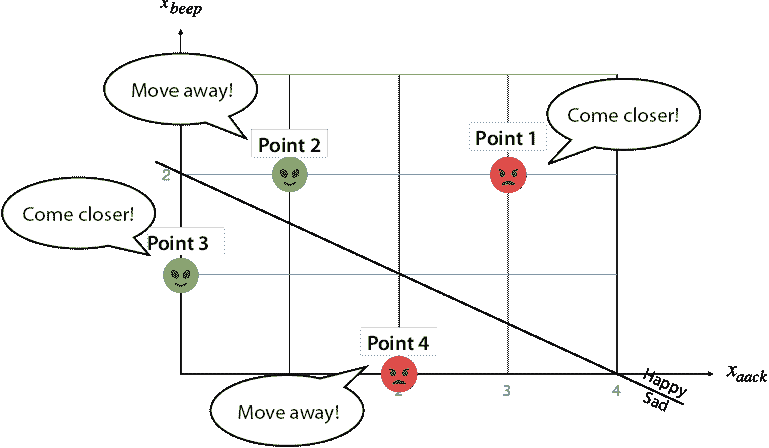

图 6.6 在逻辑回归算法中，每个点都有发言权。被正确分类的点告诉线远离，进入正确的区域更深。被错误分类的点告诉线靠近，希望有一天能位于线的正确一侧。

为什么我们要将线移动到正确分类的点之外？如果点被正确分类，这意味着它在相对于线的正确区域内。如果我们把线移得更远，我们就把点推向正确的区域更深。因为预测是基于点与边界线的距离，对于位于正（快乐）区域的点，如果点离线更远，预测会增加。同样，对于位于负（悲伤）区域的点，如果点离线更远，预测会降低。因此，如果点的标签是 1，我们是在增加预测（使其更接近 1），如果点的标签是 0，我们是在减少预测（使其更接近 0）。

例如，看看分类器 1 和我们的数据集中的第一句话。回想一下，这个分类器的权重 *a* = 1，*b* = 2，以及偏置 *c* = –4。这句话对应于坐标点 (*x*[aack], *x*[beep]) = (3,2)，标签 *y* = 0。我们对这个点的预测是 *ŷ* = *σ*(3 + 2 · 2 – 4) = *σ*(3) = 0.953。预测值与标签相差甚远，因此误差很高：实际上，在表 6.5 中，我们计算出的误差是 3.049。这个分类器犯的错误是认为这句话比实际情况更快乐。因此，为了调整权重以确保分类器降低对这个句子的预测，我们应该大幅降低权重 *a*，*b* 和偏置 *c*。

使用相同的逻辑，我们可以分析如何调整权重以改进其他点的分类。对于数据集中的第二句话，标签是 *y* = 1，预测值是 0.731。这是一个好的预测，但如果我们想改进它，我们应该稍微增加权重和偏置。对于第三句话，因为标签是 *y* = 1，预测值是 *ŷ* = 0.119，我们应该大幅增加权重和偏置。最后，对于第四句话，标签是 *y* = 0，预测值是 *ŷ* = 0.119，因此我们应该稍微降低权重和偏置。这些总结在表 6.7 中。

表 6.7 计算数据集中点的对数损失。注意，被正确分类的点（2 和 4）对数损失很小，而分类不良的点（1 和 3）对数损失很大。

| 点 | 标签 *y* | 分类器 1 预测 *y* | 如何调整权重 *a*，*b* 和偏置 *c* | *y* – *ŷ* |
| --- | --- | --- | --- | --- |
| 1 | 0 | 0.953 | 大幅降低 | –0.953 |
| 2 | 1 | 0.731 | 稍微增加 | 0.269 |
| 3 | 1 | 0.119 | 大幅增加 | 0.881 |
| 4 | 0 | 0.119 | 稍微降低 | –0.119 |

以下观察结果可以帮助我们确定我们想要添加到权重和偏置中的完美数量，以改进预测：

+   **观察 1**：表 6.7 的最后一列是标签减去预测的值。注意这个表中最后两列之间的相似性。这表明我们应该更新权重和偏置的量应该是*y* – *ŷ*的倍数。

+   **观察 2**：想象一个句子，其中单词*aack*出现了 10 次，而*beep*出现了 1 次。如果我们要向这两个单词的权重中添加（或减去）一个值，那么认为*aack*的权重应该更新得更多是有意义的，因为这个单词对句子的整体得分更为关键。因此，我们应该更新*aack*权重的量应该乘以*x*[aack]，而我们应该更新*beep*权重的量应该乘以*x*[beep] *.*

+   **观察 3**：我们更新权重和偏置的量也应该乘以学习率*η*，因为我们想确保这个数字很小。

将三个观察结果结合起来，我们得出以下更新权重是一个很好的集合：

+   *a* = *a* + *η*(*y* – *ŷ*)*x*[1]

+   *b* = *b* + *η*(*y* – *ŷ*)*x*[2]

+   *c* = *c* + *η*(*y* – *ŷ*)

因此，逻辑技巧的伪代码如下。注意它与我们第五章“感知器技巧”部分末尾学习的感知器技巧的伪代码是多么相似。

逻辑技巧的伪代码

输入：

+   一个具有权重*a, b,*和偏置*c*的逻辑分类器

+   坐标为(*x*[1], *x*[2])和标签*y*的点

+   一个小的值*η*（学习率）

输出：

+   一个具有新权重*a', b',*和偏置*c'*的感知器，至少与输入一样好

程序：

+   感知器在点上的预测是*ŷ* = *σ*(*ax*[1] + *bx*[2] + *c*).

返回：

+   具有以下权重和偏置的感知器：

    +   *a* = *a* + *η*(*y* - *ŷ*)*x*[1]

    +   *b* = *b* + *η*(*y* - *ŷ*)*x*[2]

    +   *c* = *c* + *η*(*y* - *ŷ*)

我们在逻辑技巧中更新权重和偏置的方式并非巧合。它来自于应用梯度下降算法来减少对数损失。数学细节在附录 B 的第“使用梯度下降训练分类模型”部分中描述。

为了验证逻辑技巧在我们的案例中是否有效，让我们将其应用于当前数据集。实际上，我们将分别对四个点应用这个技巧，看看每个点会如何修改模型的权重和偏置。最后，我们将比较更新前后的对数损失，以验证它确实已经减少。对于以下计算，我们使用学习率*η* = 0.05。

使用每个句子更新分类器

使用第一句话：

+   初始权重和偏置：*a* = 1, *b* = 2, *c* = –4

+   标签：*y* = 0

+   预测：0.953

+   初始对数损失：–0 · *ln*(0.953) – 1 *ln*(1 – 0.953) = 3.049

+   点的坐标：*x*[aack] = 3, *x*[beep] = 2

+   学习率：*η* = 0.01

+   更新后的权重和偏置：

    +   a' = 1 + 0.05 · (0 – 0.953) · 3 = 0.857

    +   b' = 2 + 0.05 · (0 – 0.953) · 2 = 1.905

    +   c' = –4 + 0.05 · (0 – 0.953) = –4.048

+   更新预测：*ŷ* = *σ*(0.857 · 3 + 1.905 · 2 – 4.048 = 0.912\. (注意，预测降低，因此现在更接近标签 0)。

+   最终对数损失：–0 · *ln*(0.912) – 1 *ln*(1 – 0.912) = 2.426\. (注意，错误从 3.049 减少到 2.426)。

其他三个点的计算显示在表 6.8 中。注意，在表中，更新后的预测始终比初始预测更接近标签，最终对数损失始终小于初始对数损失。这意味着无论我们使用哪个点进行逻辑回归技巧，我们都会改进该点的模型并减少最终对数损失。

表 6.8 所有点的预测计算、对数损失、更新权重和更新预测。

| 点 | 坐标 | 标签 | 初始预测 | 初始对数损失 | 更新权重： | 更新预测 | 最终对数损失 |
| --- | --- | --- | --- | --- | --- | --- | --- |
| 1 | (3,2) | 0 | 0.953 | 3.049 | *a’* = 0.857*b’* = 1.905*c’* = –4.048 | 0.912 | 2.426 |
| 2 | (1,2) | 1 | 0.731 | 0.313 | *a’* = 1.013*b*’ = 2.027*c*’ = –3.987 | 0.747 | 0.292 |
| 3 | (0,1) | 1 | 0.119 | 2.127 | *a’* = 1*b’* = 2.044*c’* = –3.956 | 0.129 | 2.050 |
| 4 | (2,0) | 0 | 0.119 | 0.127 | *a’* = 0.988*b’* = 2*c’* = –4.006 | 0.127 | 0.123 |

在本节的开头，我们讨论了逻辑回归技巧也可以通过几何方式可视化，即相对于点移动边界线。更具体地说，如果点被错误分类，则将线移近点；如果点被正确分类，则将线移远点。我们可以通过在表 6.8 中的四种情况下绘制原始分类器和修改后的分类器来验证这一点。在图 6.7 中，你可以看到这四个图。在每一个图中，实线是原始分类器，虚线是通过应用逻辑回归技巧得到的分类器，使用突出显示的点。注意，正确分类的点 2 和 4 将线推开，而错误分类的点 1 和 3 将线移近它们。

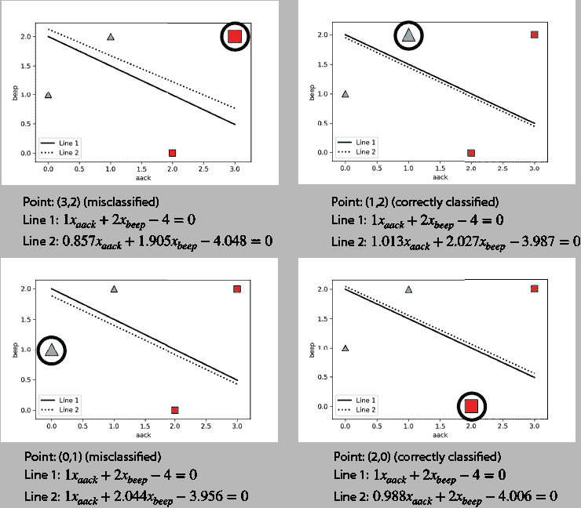

图 6.7 将逻辑回归技巧应用于每个四个数据点。注意，对于正确分类的点，线远离点，而对于错误分类的点，线移近点。

重复多次逻辑回归技巧：逻辑回归算法

逻辑回归算法是我们用来训练逻辑分类器的算法。与感知器算法通过多次重复感知器技巧一样，逻辑回归算法通过多次重复逻辑回归技巧来实现。伪代码如下：

逻辑回归算法的伪代码

输入：

+   标记为 1 和 0 的点数据集

+   许多个时代，*n*

+   学习率 *η*

输出：

+   由一组权重和偏差组成的逻辑分类器，该分类器适合数据集

程序：

+   从随机值开始，为逻辑分类器的权重和偏差设置初始值。

+   重复多次：

    +   选择一个随机数据点。

    +   使用逻辑技巧更新权重和偏差。

返回：

+   使用更新后的权重和偏差的感知器分类器

正如我们之前看到的，逻辑技巧的每一次迭代要么将线移动到错误分类点的附近，要么将其移动到正确分类点的附近。

随机梯度下降、小批量梯度下降和批量梯度下降

逻辑回归算法，与线性回归和感知器一样，是基于梯度下降的另一种算法。如果我们使用梯度下降来减少对数损失，那么梯度下降步骤就变成了逻辑技巧。

通用逻辑回归算法不仅适用于具有两个特征的数据集，也适用于具有我们想要的任何数量特征的数据集。在这种情况下，就像感知器算法一样，边界不会看起来像一条线，而会像更高维空间中分割点的更高维超平面。然而，我们不需要可视化这个更高维的空间；我们只需要构建一个具有与我们的数据中特征数量一样多的权重的逻辑回归分类器。逻辑技巧和逻辑算法以与我们之前章节中相同的方式更新权重。

就像我们之前学过的算法一样，在实践中，我们不会一次只选择一个点来更新模型。相反，我们使用小批量梯度下降——我们取一批点并更新模型以更好地适应这些点。对于完全通用的逻辑回归算法和利用梯度下降对逻辑技巧的彻底数学推导，请参阅附录 B，第“使用梯度下降训练分类模型”节。

## 编写逻辑回归算法

在本节中，我们将看到如何手动编写逻辑回归算法。本节的代码如下：

+   **注意**：Coding_logistic_regression.ipynb

    +   [`github.com/luisguiserrano/manning/blob/master/Chapter_6_Logistic_Regression/Coding_logistic_regression.ipynb`](https://github.com/luisguiserrano/manning/blob/master/Chapter_6_Logistic_Regression/Coding_logistic_regression.ipynb)

我们将在第五章中使用的数据集上测试我们的代码。数据集如表 6.9 所示。

表 6.9 我们将用逻辑分类器拟合的数据集

| *Aack* *x*[1] | *Beep* *x*[2] | 标签 *y* |
| --- | --- | --- |
| 1 | 0 | 0 |
| 0 | 2 | 0 |
| 1 | 1 | 0 |
| 1 | 2 | 0 |
| 1 | 3 | 1 |
| 2 | 2 | 1 |
| 2 | 3 | 1 |
| 3 | 2 | 1 |

加载我们小型数据集的代码如下，数据集的图表如图 6.8 所示：

```
import numpy as np
features = np.array([[1,0],[0,2],[1,1],[1,2],[1,3],[2,2],[2,3],[3,2]])
labels = np.array([0,0,0,0,1,1,1,1])
```

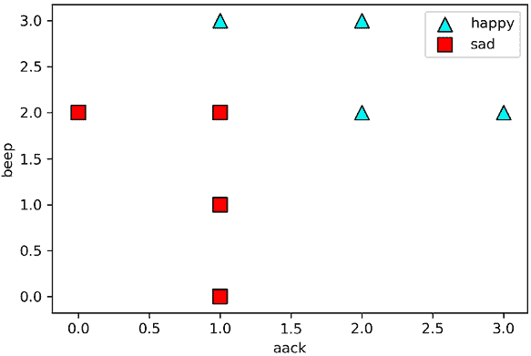

图 6.8 我们数据集的图表，其中快乐的句子由三角形表示，悲伤的句子由正方形表示。

手动编写逻辑回归算法

在本节中，我们展示了如何手动编写逻辑技巧和逻辑回归算法。更一般地，我们将为具有*n*个权重的数据集编写逻辑回归算法。我们使用的符号如下：

+   特征：*x*[1], *x*[2], … , *x*[n]

+   标签：*y*

+   权重：*w*[1], *w*[2], … , *w*[n]

+   偏置：*b*

特定句子的分数是该句子中每个单词的权重（*w*[i]）乘以该单词出现的次数（*x*[i]）的总和的 sigmoid 函数，再加上偏置（*b*）。注意，我们使用求和符号表示

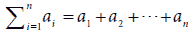.

+   预测：*ŷ* = *σ*(*w*[1]*x*[1] + *w*[2]*x*[2] + … + *w*[n]*x*[n] + *b*) = *σ*(Σ[i]^n[=1]*w*[i] *x*[i] + *b*).

对于我们当前的问题，我们将*x*[aack]和*x*[beep]分别称为*x*[1]和*x*[2]。它们对应的权重是*w*[1]和*w*[1]，偏置是*b*。

我们首先编写 sigmoid 函数、分数和预测的代码。回忆一下 sigmoid 函数的公式

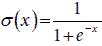

```
def sigmoid(x):
    return np.exp(x)/(1+np.exp(x))
```

对于分数函数，我们使用特征和权重之间的点积。回忆一下，向量(*x*[1], *x*[2], … , *x*[n])和(*w*[1], *w*[2], … , *w*[n])之间的点积是*w*[1] *x*[1] + *w*[2] *x*[2] + … + *w*[n] *x*[n]。

```
def score(weights, bias, features):
    return np.dot(weights, features) + bias
```

最后，回忆一下，预测是 sigmoid 激活函数应用于分数。

```
def prediction(weights, bias, features):
    return sigmoid(score(weights, bias, features))
```

现在我们有了预测，我们可以继续计算 log loss。回忆一下，log loss 的公式是

*log loss* = –*y ln*(*ŷ*) – (1 – *y*) *ln*(1 – *y*).

让我们按照以下方式编写该公式：

```
def log_loss(weights, bias, features, label):
    pred = prediction(weights, bias, features)
    return -label*np.log(pred) - (1-label)*np.log(1-pred)
```

我们需要整个数据集上的 log loss，因此我们可以将所有数据点相加，如下所示：

```
def total_log_loss(weights, bias, features, labels):
    total_error = 0
    for i in range(len(features)):
        total_error += log_loss(weights, bias, features[i], labels[i])
    return total_error
```

现在我们准备编写逻辑回归技巧和逻辑回归算法的代码。在超过两个变量的情况下，回忆一下，第*i*个权重的逻辑回归步骤是以下公式，其中*η*是学习率：

+   *w*[i] → *w*[i] + *η*(*y* – *ŷ*)*x*[i] for *i* = 1, 2, … , *n*

+   *b* → *b* + *η*(*y* – *ŷ*) for *i* = 1, 2, … , *n*.

```
def logistic_trick(weights, bias, features, label, learning_rate = 0.01):
    pred = prediction(weights, bias, features)
    for i in range(len(weights)):
        weights[i] += (label-pred)*features[i]*learning_rate
        bias += (label-pred)*learning_rate
    return weights, bias

def logistic_regression_algorithm(features, labels, learning_rate = 0.01, epochs = 1000):
    utils.plot_points(features, labels)
    weights = [1.0 for i in range(len(features[0]))]
    bias = 0.0
    errors = []
    for i in range(epochs):
        errors.append(total_log_loss(weights, bias, features, labels))
        j = random.randint(0, len(features)-1)
        weights, bias = logistic_trick(weights, bias, features[j], labels[j])
    return weights, bias
```

现在我们可以运行逻辑回归算法来构建一个适合我们数据集的逻辑分类器，如下所示：

```
logistic_regression_algorithm(features, labels)
([0.46999999999999953, 0.09999999999999937], -0.6800000000000004)
```

我们获得分类器具有以下权重和偏置：

+   *w*[1] = 0.47

+   *w*[2] = 0.10

+   *b* = –0.68

分类器的图（以及每个 epoch 的先前分类器的图）如图 6.9 所示。

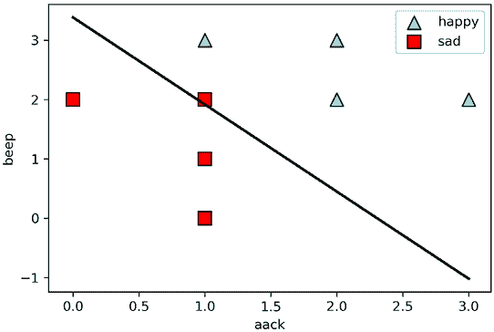

图 6.9 结果逻辑分类器的边界

在图 6.10 中，我们可以看到所有 epoch 对应的分类器图表（左）和 log 损失图表（右）。在中间分类器图表中，最后一个对应的是深色线。从 log 损失图表中可以看出，随着我们运行算法的 epoch 数增加，log 损失急剧下降，这正是我们想要的。此外，log 损失永远不会为零，即使所有点都被正确分类。这是因为对于任何点，无论分类得多好，log 损失永远不会为零。这与第五章中的图 5.26 形成对比，在那里感知器损失在所有点都被正确分类时确实达到了零值。

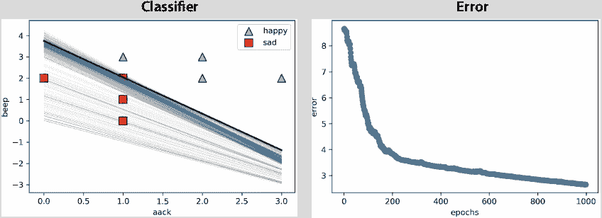

图 6.10 左：逻辑回归算法所有中间步骤的图表。注意我们从一个糟糕的分类器开始，逐渐向一个好的分类器（粗线）移动。右：错误图。注意随着我们运行逻辑回归算法的 epoch 数增加，错误率降低。

## 实际应用：使用 Turi Create 对 IMDB 评论进行分类

在本节中，我们看到了逻辑分类器在情感分析中的实际应用。我们使用 Turi Create 构建一个分析 IMDB 网站上电影评论的模型。本节的代码如下：

+   **笔记本**: Sentiment_analysis_IMDB.ipynb

    +   [`github.com/luisguiserrano/manning/blob/master/Chapter_6_Logistic_Regression/Sentiment_analysis_IMDB.ipynb`](https://github.com/luisguiserrano/manning/blob/master/Chapter_6_Logistic_Regression/Sentiment_analysis_IMDB.ipynb)

+   **数据集**: IMDB_Dataset.csv

首先，我们导入 Turi Create，下载数据集，并将其转换为 SFrame，我们称之为`movies`，如下所示：

```
import turicreate as tc
movies = tc.SFrame('IMDB Dataset.csv')
```

数据集的前五行显示在表 6.10 中。

表 6.10 IMDB 数据集的前五行。评论列包含评论文本，情感列包含评论的情感，可以是积极或消极。

| 评论 | 情感 |
| --- | --- |
| 另一位评论者提到... | 积极 |
| 一部精彩的小制作... | 积极 |
| 我觉得这是一个度过美好一天的好日子... | 积极 |
| 基本上，有一个家庭里有一个小... | 消极 |
| Petter Mattei 的《金钱时代里的爱情》是一部... | 积极 |

数据集有两列，一列是评论，作为字符串，另一列是情感，作为积极或消极。首先，我们需要处理字符串，因为每个单词都需要成为一个不同的特征。Turi Create 内置的`text_analytics`包中的`count_words`函数对于这个任务很有用，因为它将一个句子转换成一个包含单词计数的字典。例如，句子“to be or not to be”被转换成字典{‘to’:2, ‘be’:2, ‘or’:1, ‘not’:1}。我们添加一个名为`words`的新列，包含这个字典，如下所示：

```
movies['words'] = tc.text_analytics.count_words(movies['review'])
```

我们数据集的新列的前几行显示在表 6.11 中。

表 6.11 词语列是一个字典，其中记录了评论中的每个词语及其出现次数。这是我们的逻辑分类器的特征列。

| 评论 | 情感 | 词语 |
| --- | --- | --- |
| 另一位评论者提到... | 积极 | {'if': 1.0, 'viewing': 1.0, 'comfortable': 1.0, ... |
| 一部美好的小制作... | 积极 | {'done': 1.0, 'every': 1.0, 'decorating': 1.0, ... |
| 我觉得这是一个度过美好的一天... | 积极 | {'see': 1.0, 'go': 1.0, 'great': 1.0, 'superm ... |
| 基本上，有一个家庭，一个小孩... | 消极 | {'them': 1.0, 'ignore': 1.0, 'dialogs': 1.0, ... |
| 彼得·马泰利的《金钱时代里的爱情》是... | 积极 | {'work': 1.0, 'his': 1.0, 'for': 1.0, 'anxiously': ... |

我们已经准备好训练我们的模型了！为此，我们使用 `logistic_classifier` 包中的 `create` 函数，在其中我们指定目标（标签）为 `sentiment` 列，特征为 `words` 列。请注意，目标以包含标签的列的名称命名的字符串形式表示，但特征以包含每个特征的列名称的字符串数组形式表示（以防我们需要指定多个列），如下所示：

```
model = tc.logistic_classifier.create(movies, features=['words'], target='sentiment')
```

现在我们已经训练了我们的模型，我们可以查看词语的权重，使用 `coefficients` 命令。我们得到的表格有几列，但我们关心的是 `index` 和 `value` 列，它们显示了词语及其权重。前五项如下：

+   (截距)：0.065

+   if: –0.018

+   viewing: 0.089

+   comfortable: 0.517

+   become: 0.106

第一个，称为截距，是偏差。因为模型的偏差是正的，所以空评论是积极的，正如我们在第五章的“偏差、*y*-截距和安静外星人的固有情绪”一节中学到的。这很有道理，因为给电影打负分的用户倾向于留下评论，而许多给电影打正分的用户则不留任何评论。其他词语是中性的，所以它们的权重意义不大，但让我们探索一些词语的权重，例如 *wonderful*、*horrible* 和 *the*，如下所示：

+   wonderful: 1.043

+   horrible: –1.075

+   the: 0.0005

As we see, the weight of the word *wonderful* is positive, the weight of the word *horrible* is negative, and the weight of the word *the* is small. This makes sense: *wonderful* is a positive word, *horrible* is a negative word, and *the* is a neutral word.

作为最后一步，让我们找出最积极和消极的评论。为此，我们使用模型对所有电影进行预测。这些预测将存储在一个名为 `predictions` 的新列中，使用以下命令：

```
movies['prediction'] = model.predict(movies, output_type='probability')
```

根据模型，让我们找出最积极和最消极的电影。我们通过以下方式对数组进行排序：

最积极评论：

```
movies.sort('predictions')[-1]
```

**输出**： “在我看来，很多人不知道实际上 *Blade* 是一部与 *X-Men* 相当的超级英雄电影……”

最多负面评论：

```
movies.sort('predictions')[0]
```

**输出**：“甚至比原来的更无趣……”

我们可以做很多事情来改进这个模型。例如，一些文本处理技术，如删除标点符号和大小写，或删除停用词（如 *the*，*and*，*of*，*it*），通常会给我们更好的结果。但是，看到我们只需要几行代码就能构建自己的情感分析分类器真是太棒了！

## 将多个类别分类：softmax 函数

到目前为止，我们已经看到连续感知器将两个类别分类为快乐和悲伤。但是，如果我们有更多类别呢？在第五章的结尾，我们讨论了对于离散感知器来说，在两个以上类别之间进行分类是困难的。然而，使用逻辑分类器来做这件事很容易。

想象一个包含三个标签的图像数据集：“狗”、“猫”和“鸟”。要构建一个分类器，预测每个图像的这三个标签之一，就需要为每个标签构建三个分类器，每个标签一个。当有新的图像进来时，我们用这三个分类器中的每一个来评估它。对应于每个动物的分类器返回一个概率，表示图像是相应的动物。然后，我们将图像分类为返回最高概率的分类器对应的动物。

然而，这并不是做这件事的理想方式，因为这个分类器返回的是一个离散的答案，例如“狗”、“猫”或“鸟”。如果我们想要一个返回三种动物概率的分类器呢？比如说，一个答案可能是这样的形式：“10%狗，85%猫，5%鸟。”我们这样做是使用 softmax 函数。

softmax 函数的工作原理如下：回想一下，逻辑分类器使用两步过程进行预测——首先它计算一个分数，然后它将 sigmoid 函数应用于这个分数。现在让我们忘记 sigmoid 函数，输出分数。现在想象三个分类器返回以下分数：

+   狗分类器：3

+   猫分类器：2

+   鸟分类器：-1

我们如何将这些分数转换为概率呢？好吧，这里有一个想法：我们可以进行归一化。这意味着将这些数字除以它们的总和，即五，使它们加起来等于一。当我们这样做时，我们得到狗的概率为 3/5，猫的概率为 2/5，鸟的概率为-1/5。这可以工作，但并不理想，因为图像是鸟的概率是一个负数。概率必须始终为正，所以我们需要尝试不同的方法。

我们需要的是一个始终为正且递增的函数。指数函数非常适合这个。任何指数函数，如 2^x，3^x 或 10^x，都可以完成这项工作。默认情况下，我们使用函数 *e*^x，它具有美好的数学特性（例如，*e*^x 的导数也是 *e*^x）。我们将此函数应用于分数，得到以下值：

+   狗分类器：*e*³ = 20.085

+   猫分类器：*e*² = 7.389

+   鸟分类器：*e*^(–1) = 0.368

现在，我们做之前做过的事情——归一化，或者除以这些数字的总和，使它们加起来为 1。总和是 20.085 + 7.389 + 0.368 = 27.842，所以我们得到以下结果：

+   狗的概率：20.085/27.842 = 0.721

+   猫的概率：7.389/27.842 = 0.265

+   鸟的概率：0.368/27.842 = 0.013

这些是我们三个分类器给出的三个概率。我们使用的函数是 softmax，其通用版本如下：如果我们有 *n* 个分类器，它们输出 *n* 个分数 *a*[1]，*a*[2]，… ，*a*[n]，得到的概率是 *p*[1]，*p*[2]，… ，*p*[n]，其中

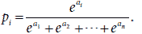

这个公式被称为 softmax 函数。

如果我们只对两个类别使用 softmax 函数会发生什么？我们会得到 sigmoid 函数。为什么不作为练习来验证这一点呢？

## 摘要

+   连续感知器，或逻辑分类器，与感知器分类器类似，除了它们不会做出 0 或 1 这样的离散预测，而是预测 0 到 1 之间的任何数字。

+   逻辑分类器比离散感知器更有用，因为它们提供了更多信息。除了告诉我们分类器预测了哪个类别，它们还提供了一个概率。一个好的逻辑分类器会给标签为 0 的点分配低概率，给标签为 1 的点分配高概率。

+   对数损失是逻辑分类器的误差函数。它对每个点分别计算，作为分类器分配给其标签的概率的自然对数的负数。

+   分类器在数据集上的总对数损失是每个点的对数损失的加和。

+   逻辑技巧接受一个标记数据点和边界线。如果点被错误分类，则将线移近点；如果点被正确分类，则将线移远点。这比感知器技巧更有用，因为感知器技巧在点被正确分类时不会移动线。

+   逻辑回归算法用于将逻辑分类器拟合到标记数据集。它包括从一个具有随机权重的逻辑分类器开始，并持续随机选择一个点，应用逻辑技巧以获得一个略微更好的分类器。

+   当我们有多个类别要预测时，我们可以构建多个线性分类器，并使用 softmax 函数将它们组合起来。

## 练习

练习 6.1

一位牙医在患者数据集上训练了一个逻辑分类器，以预测他们是否有蛀牙。模型确定患者有蛀牙的概率是

*σ*(*d* + 0.5*c* – 0.8),

其中

+   *d* 是一个变量，表示患者过去是否有过其他蛀牙，并且

+   *c* 是一个变量，表示患者是否吃糖果。

例如，如果一个病人吃了糖果，那么 *c* = 1，如果没有吃，那么 *c* = 0。那么一个去年治疗过蛀牙且现在吃糖果的病人今天有蛀牙的概率是多少？

练习 6.2

考虑将点 (*x*[1], *x*[2]) 分配给预测 *ŷ* = *σ*(2*x*[1] + 3*x*[2] – 4) 的逻辑分类器，以及点 *p* = (1, 1) 带有标签 0。

1.  计算模型对点 *p* 的预测 *ŷ*。

1.  计算模型在点 *p* 处产生的对数损失。

1.  使用逻辑技巧获得一个产生更小对数损失的新的模型。你可以使用 *η* = 0.1 作为学习率。

1.  找到新模型在点 *p* 处的预测，并验证获得的对数损失是否小于原始值。

练习 6.3

使用练习 6.2 中的模型，找到一个预测值为 0.8 的点。

提示：首先找到给出预测值为 0.8 的分数，并记住预测是 *ŷ* = *σ*(score)。
