# 7 如何衡量分类模型？准确率及其朋友

在本章中

+   模型可能犯的错误类型：假阳性和假阴性

+   将这些错误放入表格中：混淆矩阵

+   准确率、召回率、精确率、F 分数、敏感性和特异性是什么，以及它们如何用于评估模型

+   ROC 曲线是什么，它是如何同时跟踪敏感性和特异性的

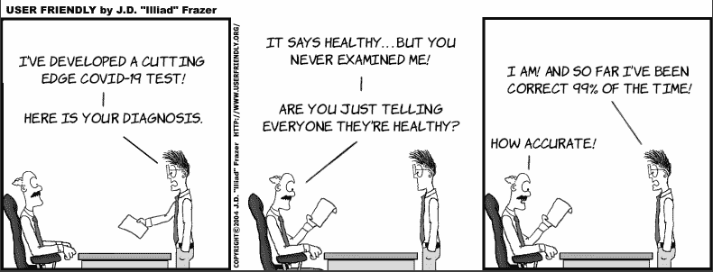

本章与前面两章略有不同——它不专注于构建分类模型；相反，它专注于评估它们。对于机器学习专业人士来说，能够评估不同模型的性能与能够训练它们一样重要。我们很少在数据集上训练单个模型；我们训练几个不同的模型，并选择表现最好的一个。我们还需要确保模型在投入生产前具有良好的质量。模型的质量并不总是容易衡量，在本章中，我们学习了几种评估我们的分类模型的技术。在第四章中，我们学习了如何评估回归模型，因此我们可以将本章视为其类比，但针对的是分类模型。

测量分类模型性能的最简单方法是通过计算其准确率。然而，我们将看到准确率并不能描绘出整个画面，因为一些模型虽然准确率很高，但本质上并不好。为了解决这个问题，我们将定义一些有用的指标，例如精确率和召回率。然后我们将它们结合成一个新且更强大的指标，称为 F 分数。这些指标被数据科学家广泛用于评估他们的模型。然而，在其他学科，如医学中，使用其他类似的指标，例如敏感性和特异性。使用这两个最后的指标，我们将能够构建一个称为接收者操作特征（ROC）曲线的曲线。ROC 曲线是一个简单的图表，它为我们提供了对模型的深刻见解。

## 准确率：我的模型有多正确？

在本节中，我们讨论准确率，这是分类模型最简单和最常用的度量。模型的准确率是指模型正确的时间百分比。换句话说，它是正确预测的数据点数与总数据点数的比率。例如，如果我们对一个包含 1,000 个样本的测试数据集进行模型评估，并且模型正确预测了样本的标签 875 次，那么这个模型的准确率为 875/1000 = 0.875，或 87.5%。

准确率是评估分类模型最常见的方法，我们应该始终使用它。然而，有时准确率并不能完全描述模型的性能，正如我们很快将看到的。让我们首先看看本章我们将研究的两个例子。

两个模型的例子：冠状病毒和垃圾邮件

在本章中，我们使用我们的指标评估了两个数据集上的几个模型。第一个数据集是患者医疗数据集，其中一些患者已被诊断为冠状病毒。第二个数据集是电子邮件数据集，这些电子邮件已被标记为垃圾邮件或非垃圾邮件。正如我们在第一章中学到的，*垃圾邮件*是指垃圾邮件，而*非垃圾邮件*是指非垃圾邮件。在第八章中，当我们学习朴素贝叶斯算法时，我们将更详细地研究这样的数据集。在本章中，我们不是构建模型，而是将模型作为黑盒使用，并根据它们预测正确或错误的数据点数量来评估它们。这两个数据集都是完全虚构的。

医疗数据集：一组被诊断为冠状病毒的病人

我们的第一组数据集是一个包含 1,000 名患者的医疗数据集。其中，10 人被诊断为冠状病毒，其余 990 人被诊断为健康。因此，这个数据集中的标签是“生病”或“健康”，对应于诊断。模型的目标是根据每个患者的特征预测诊断。

电子邮件数据集：一组被标记为垃圾邮件或非垃圾邮件的电子邮件

我们的第二个数据集是一个包含 100 封电子邮件的数据集。其中，40 封是垃圾邮件，其余 60 封是非垃圾邮件。这个数据集中的标签是“垃圾邮件”和“非垃圾邮件”，模型的目标是根据电子邮件的特征预测标签。

一个超级有效却又超级无用的模型

准确率是一个非常有用的指标，但它能否描绘出模型的完整图景呢？答案是否定的，我们将通过一个例子来阐述这一点。目前，让我们专注于冠状病毒数据集。我们将在下一节回到电子邮件数据集。

假设一位数据科学家告诉我们以下内容：“我开发了一种冠状病毒检测方法，只需 10 秒钟即可运行，不需要任何检查，并且准确率为 99%！”我们应该感到兴奋还是怀疑？我们可能会怀疑。为什么？我们很快就会看到，计算模型的准确率有时并不足够。我们的模型可能准确率为 99%，但可能完全无用。

我们能否想象一个完全无用的模型，该模型可以预测我们数据集中的冠状病毒，并且在这个数据集中 99%的时间都是正确的？回想一下，我们的数据集包含 1,000 名患者，其中 10 人有冠状病毒。请随意放下这本书，思考一下如何构建一个可以检测冠状病毒的模型，并且在这个数据集中 99%的时间都是正确的。

这可能是一个这样的模型：简单地将每个患者诊断为健康。这是一个简单的模型，但仍然是一个模型；这是一个预测所有事物属于一个类别的模型。

这个模型的准确率是多少呢？嗯，在 1,000 次尝试中，它有 10 次错误，990 次正确。这给出了 99%的准确率，正如我们承诺的那样。然而，这个模型等同于在一场全球大流行期间告诉每个人他们都健康，这是非常糟糕的！

那么，我们模型的问题是什么？问题是错误并不平等，有些错误比其他错误代价更高，正如我们将在下一节中看到的。

## 如何解决准确率问题？定义不同类型的错误以及如何衡量它们

在前一节中，我们构建了一个具有高准确率的无用模型。在本节中，我们研究出了什么问题。也就是说，我们研究在那个模型中计算准确率的问题，并介绍了一些略微不同的指标，这些指标将给我们提供对这个模型更好的评估。

我们需要研究的第一件事是错误的类型。在下一节中，我们看到某些错误比其他错误更关键。然后在“存储正确和错误分类点”到“召回率、精确率或 F 分数”的章节中，我们学习了不同的指标，这些指标比准确率更能捕捉这些关键错误。

“将分类点放入表格”到“召回率、精确率或 F 分数”，我们学习了不同的指标，这些指标比准确率更能捕捉这些关键错误。

假阳性和假阴性：哪一个更糟糕？

在许多情况下，错误总数并不能告诉我们关于模型性能的所有信息，我们需要深入挖掘并以不同的方式识别不同类型的错误。在本节中，我们看到两种错误类型。冠状病毒模型可能犯的两种错误类型是什么？它可以诊断一个健康的人为生病，或者一个生病的人为健康。在我们的模型中，我们按照惯例将生病患者标记为正例。这两种错误类型被称为假阳性和假阴性，如下所示：

+   **假阳性**：被错误地诊断为生病的人

+   **假阴性**：被错误地诊断为健康的人

在一般设置中，一个假阳性是一个具有负标签的数据点，但模型错误地将其分类为正类。一个假阴性是一个具有正标签的数据点，但模型错误地将其分类为负类。自然地，正确诊断的案例也有名称，如下所示：

+   **真阳性**：被诊断为生病的人

+   **真阴性**：被诊断为健康的人

在一般设置中，一个真阳性是一个具有正标签的数据点，它被正确分类为正类，一个真阴性是一个具有负标签的数据点，它被正确分类为负类。

现在，让我们看看电子邮件数据集。假设我们有一个模型，它预测每封邮件是垃圾邮件还是正常邮件。我们将垃圾邮件视为正例。因此，我们的两种错误类型如下：

+   **假阳性**：被错误地分类为垃圾邮件的正常邮件

+   **假阴性**：被错误地分类为垃圾邮件的正常邮件

正确分类的邮件如下：

+   **真阳性**：被正确分类为垃圾邮件的垃圾邮件

+   **真阴性**：被正确分类为正常邮件的正常邮件

图 7.1 展示了模型的图形表示，其中垂直线是边界，线左侧的区域是负区域，线右侧的区域是正区域。三角形是带有正标签的点，圆圈是带有负标签的点。上面定义的四个量如下：

+   线右侧的三角形：真阳性

+   线左侧的三角形：假阴性

+   线右侧的圆圈：假阳性

+   线左侧的圆圈：真阴性

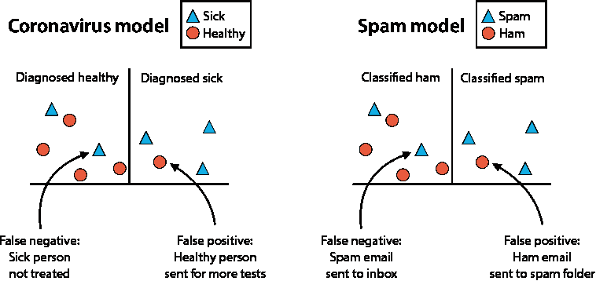

图 7.1 展示了两个在现实生活中广泛使用且我们将在本章中使用的模型示例。在左边，是一个冠状病毒模型，其中人们被诊断为健康或生病。在右边，是一个垃圾邮件检测模型，其中电子邮件被分类为垃圾邮件或正常邮件。对于每个模型，我们都突出了一些错误，并将它们分为假阳性和假阴性。

注意到图 7.1 中的两个模型都产生了以下量：

+   三个真阳性

+   四个真阴性

+   一个假阳性

+   两个假阴性

要了解冠状病毒模型和垃圾邮件模型之间的区别，我们需要分析在假阳性和假阴性之间哪一个更糟糕。让我们分别对每个模型进行这种分析。

分析冠状病毒模型中的假阳性和假阴性

让我们停下来思考一下。在冠状病毒模型中，哪一种错误听起来更糟糕：假阳性还是假阴性？换句话说，什么更糟糕：错误地将健康患者诊断为生病，还是将生病患者诊断为健康？让我们假设，当我们诊断患者为健康时，我们会让他们不带治疗回家，而当我们诊断患者为生病时，我们会让他们进行更多测试。错误地诊断健康人可能只是一个小麻烦，因为这意味着健康人将不得不进行额外的测试。然而，错误地诊断生病的人意味着生病的人将得不到治疗，他们的病情可能会恶化，他们可能会潜在地感染许多人。因此，**在冠状病毒模型中，假阴性比假阳性要糟糕得多**。

分析垃圾邮件模型中的假阳性和假阴性

现在我们将对垃圾邮件模型进行同样的分析。在这种情况下，让我们假设如果我们的垃圾邮件分类器将一封邮件分类为垃圾邮件，那么这封邮件就会被自动删除。如果它将其分类为正常邮件，那么邮件就会被发送到我们的收件箱。哪种错误听起来更糟糕：假阳性还是假阴性？换句话说，将一封正常邮件错误地分类为垃圾邮件并删除它，或者将一封垃圾邮件错误地分类为正常邮件并发送到收件箱，哪种更糟糕？我想我们可以同意，删除一封好邮件比将垃圾邮件发送到收件箱更糟糕。我们收件箱中偶尔出现的垃圾邮件可能会让人烦恼，但删除一封正常邮件可能是一场灾难！想象一下，如果我们的奶奶给我们发了一封非常友好的邮件，告诉我们她烤了饼干，而我们的过滤器删除了它，我们心里会感到多么的悲伤。因此，**在垃圾邮件模型中，假阳性比假阴性要糟糕得多**。

这就是两种模型的不同之处。在冠状病毒模型中，假阴性结果更糟糕，而在垃圾邮件模型中，假阳性结果更糟糕。在这两种模型中测量准确性的问题在于，准确性将这两种错误视为同等严重，并且无法区分它们。

在“一个超级有效但超级无用的模型”这一节中，我们有一个例子，这个模型诊断出每个病人都是健康的。这个模型在 1000 名病人中只犯了 10 个错误。然而，这 10 个都是假阴性，这是非常糟糕的。如果这 10 个是假阳性，那么这个模型会好得多。

在接下来的章节中，我们将设计两个新的度量标准，类似于准确性。第一个度量标准帮助我们处理假阴性更糟糕的模型，第二个度量标准帮助我们处理假阳性更糟糕的模型。

将正确和错误分类的点存储在表格中：混淆矩阵

在前面的子节中，我们学习了假阳性、假阴性、真阳性和真阴性。为了跟踪这四个实体，我们将它们放在一起，组成一个恰如其分的表格，称为*混淆矩阵*。对于二元分类模型（预测两个类别的模型），混淆矩阵有两行两列。在行中我们写上真实标签（在医疗例子中，这是人的状况，生病或健康），而在列中我们写上预测标签（人的诊断，生病或健康）。一般混淆矩阵如图 7.1 所示，具体的一个例子是这两个数据集中模型的具体混淆矩阵，如表 7.2 至 7.5 所示。这被称为混淆矩阵，因为它使得我们很容易看出模型是否混淆了两个类别，即阳性（生病）和阴性（健康）。

表 7.1 混淆矩阵帮助我们计算每个类别被正确预测的次数以及每个类别被错误地与其他类别混淆的次数。在这个矩阵中，行代表标签，列代表预测。对角线上的元素被正确分类，而对角线外的元素没有被正确分类。

| 人的状况 | 预测为阳性 | 预测为阴性 |
| --- | --- | --- |
| 阳性 | 真阳性数量 | 假阴性数量 |
| 阴性 | 假阳性数量 | 真阴性数量 |

对于我们现有的模型（将每个病人都诊断为健康的模型），从现在起我们称之为冠状病毒模型 1，其混淆矩阵如图 7.2 所示。

表 7.2 我们冠状病毒模型的混淆矩阵帮助我们深入分析模型，区分两种类型的错误。此模型产生了 10 个假阴性错误（将生病的人诊断为健康），没有假阳性错误（将健康的人诊断为生病）。请注意，模型产生了过多的假阴性，这是在这种情况下最糟糕的错误类型，这表明此模型并不很好。

| 冠状病毒模型 1 | 诊断为生病（预测为阳性） | 诊断为健康（预测为阴性） |
| --- | --- | --- |
| 病人（阳性） | 0（真阳性数量） | 10（假阴性数量） |
| 健康（阴性） | 0（假阳性数量） | 990（真阴性数量） |

对于有更多类别的复杂问题，我们有一个更大的混淆矩阵。例如，如果我们的模型将图像分类为河马、鸟类、猫和狗，那么我们的混淆矩阵是一个四阶矩阵，其中行代表真实标签（动物的类型），列代表预测标签（模型预测的动物类型）。这个混淆矩阵也具有这样的性质，即正确分类的点被计在对角线上，而错误分类的点被计在对角线外。

回忆：在所有阳性例子中，我们正确分类了多少个？

现在我们知道了两种类型的错误，在本节中，我们将学习一个将给冠状病毒模型 1 带来更低分数的指标。我们已经确定，这个模型的问题在于它给我们太多的假阴性，即它将太多的病人诊断为健康。

让我们暂时假设我们根本不在乎假阳性。比如说，如果模型将一个健康的人诊断为生病，这个人可能需要额外做一次测试或隔离一段时间，但这根本不是问题。当然，这并不是实际情况；假阳性也是昂贵的，但现在让我们假装它们不是问题。在这种情况下，我们需要一个指标来替代准确率，并且这个指标重视找到阳性病例，而对错误地将阴性病例分类则不太关心。

要找到这个指标，我们需要评估我们的目标是什么。如果我们想治愈冠状病毒，那么我们真正想要的是以下内容：在世界上所有生病的人中，我们希望找到他们所有人。我们偶然找到不生病的人没关系，只要我们找到所有生病的人。这是关键。这个新指标，称为*召回率*，精确地衡量了这一点：在生病的人中，我们的模型诊断出多少是正确的？

在更一般的术语中，召回率找到具有正标签的数据点中的正确预测比例。这是真阳性的数量除以总正数。冠状病毒模型 1 在 10 个正数中有 0 个真阳性，所以它的召回率是 0/10 = 0。另一种说法是，真阳性数除以真阳性数和假阴性数的总和，如下所示：

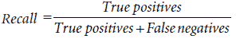

与此相反，假设我们有一个第二个模型，称为冠状病毒模型 2。这个模型的混淆矩阵显示在表 7.3 中。这个第二个模型比第一个模型犯的错误更多——总共犯了 50 个错误，而第一个模型只犯了 10 个。第二个模型的准确率是 950/1000 = 0.95，或者说 95%。从准确率来看，第二个模型不如第一个模型好。

然而，第二个模型正确诊断了 10 个生病患者中的 8 个和 1000 人中的 942 个。换句话说，它有两个假阴性和 48 个假阳性。

表 7.3 第二个冠状病毒模型的混淆矩阵

| 冠状病毒模型 2 | 诊断为生病 | 诊断为健康 |
| --- | --- | --- |
| 生病 | 8（真阳性） | 2（假阴性） |
| 健康 | 48（假阳性） | 942（真阴性） |

这个模型的召回率是真阳性数（8 个正确诊断的生病患者）除以总正数（10 个生病患者），即 8/10 = 0.8，或者说 80%。从召回率来看，第二个模型要好得多。为了清晰起见，让我们如下总结这些计算：

冠状病毒模型 1：

真阳性（被诊断为生病并送进行更多测试的生病患者）= 0

假阴性（被诊断为健康并送回家的生病患者）= 10

召回率 = 0/10 = 0%

冠状病毒模型 2：

真阳性（被诊断为生病并送进行更多测试的生病患者）= 8

假阴性（被诊断为健康并送回家的生病患者）= 2

召回率 = 8/10 = 80%

在冠状病毒模型这样的模型中，假阴性比假阳性更昂贵，它们是*高召回率模型*。

现在我们有了更好的指标，我们能否像欺骗准确度那样欺骗这个指标？换句话说，我们能否构建一个具有完全召回率的模型？好吧，准备好惊喜吧，因为我们能。如果我们构建一个将每个病人都诊断为生病的模型，这个模型将有 100%的召回率。然而，这个模型也很糟糕，因为它虽然零假阴性，但假阳性太多，以至于它不是一个好的模型。看来我们仍然需要更多的指标来正确评估我们的模型。

精确度：在我们分类为正例的例子中，我们正确分类了多少个？

在上一节中，我们学习了召回率，这是一个衡量我们的模型在假阴性方面表现如何的指标。这个指标对冠状病毒模型很有用——我们已经看到这个模型不能承受太多的假阴性。在本节中，我们将学习一个类似的指标，*精确度*，它衡量我们的模型在假阳性方面的表现。我们将使用这个指标来评估垃圾邮件模型，因为这个模型不能承受太多的假阳性。

正如我们在召回率中所做的那样，为了提出一个指标，我们首先需要定义我们的目标。我们希望有一个不会删除任何正常邮件的垃圾邮件过滤器。如果它不是删除邮件，而是将它们发送到垃圾邮件箱中。那么我们需要查看那个垃圾邮件箱，并希望我们看不到一封正常邮件。因此，我们的指标应该精确地衡量这一点：在我们垃圾邮件箱中的邮件中，有多少实际上是垃圾邮件？换句话说，在预测为垃圾邮件的邮件中，实际上有多少是垃圾邮件？这是我们指标，我们称之为*精确度*。

更正式地说，精确度只考虑被标记为正面的数据点，并在其中考虑有多少是真阳性。因为预测为正面的数据点是真阳性和假阳性的并集，所以公式如下：

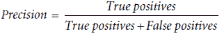

记住，在我们的 100 封邮件数据集中，有 40 封是垃圾邮件，60 封是正常邮件。假设我们训练了以下两个模型，称为垃圾邮件模型 1 和垃圾邮件模型 2。它们的混淆矩阵分别显示在表 7.4 和 7.5 中。

表 7.4 第一个垃圾邮件模型的混淆矩阵

| 垃圾邮件模型 1 | 预测为垃圾邮件 | 预测为正常邮件 |
| --- | --- | --- |
| 垃圾邮件 | 30 (真阳性) | 10 (假阴性) |
| 正常邮件 | 5 (假阳性) | 55 (真阴性) |

表 7.5 第二个垃圾邮件模型的混淆矩阵

| 垃圾邮件模型 2 | 预测为垃圾邮件 | 预测为正常邮件 |
| --- | --- | --- |
| 垃圾邮件 | 35 (真阳性) | 5 (假阴性) |
| 正常邮件 | 10 (假阳性) | 50 (真阴性) |

从准确度来看，似乎这两个模型都相当好——它们都正确预测了 85%的时间（100 封邮件中有 85 封正确）。然而，乍一看，第一个模型似乎比第二个模型好，因为第一个模型只删除了五封正常邮件，而第二个模型删除了十封。现在让我们按照以下方式计算精确度：

垃圾邮件模型 1：

+   真阳性（删除的垃圾邮件）= 30

+   假阳性（删除的普通邮件）= 5

+   精确率 = 30/35 = 85.7%

垃圾邮件模型 2：

+   真阳性（删除的垃圾邮件）= 35

+   假阳性（删除的普通邮件）= 10

+   精确率 = 35/45 = 77.7%

正如我们所想：精确率给第一个模型比第二个模型更高的分数。我们得出结论，像垃圾邮件模型这样的模型，其中假阳性比假阴性更昂贵，是*高精确率模型*。那么为什么第一个模型比第二个模型好？第二个模型删除了 10 封好（普通）邮件，但第一个模型只删除了其中 5 封。第二个模型可能清理了比第一个模型更多的垃圾邮件，但这不能弥补它删除的 5 封普通邮件。

现在，就像我们欺骗准确率和召回率一样，我们也可以欺骗精确率。考虑以下垃圾邮件过滤器：一个永远不会检测到任何垃圾邮件的垃圾邮件过滤器。这个模型的精确率是多少？这很复杂，因为删除的垃圾邮件为零（零真阳性）和删除的普通邮件为零（零假阳性）。我们不会尝试将零除以零，因为这本书会燃烧起来，但按照惯例，没有错误假阳性的模型精确率为 100%。但是，当然，一个什么都不做的垃圾邮件过滤器不是一个好的垃圾邮件过滤器。

这表明，无论我们的指标有多好，它们总是可以被欺骗。这并不意味着它们不起作用。准确率、精确率和召回率是数据科学家工具箱中有用的工具。取决于我们决定哪些对我们的模型更有用，通过决定哪些错误比其他错误更昂贵。始终小心，不要在评估不同指标之前就认为模型是好的。

将召回率和精确率结合作为优化两者的一种方式：F 分数

在本节中，我们讨论 F 分数，这是一个结合了召回率和精确率的指标。在前面的章节中，我们看到了两个例子，即冠状病毒模型和垃圾邮件模型，其中错误否定或错误肯定更重要。然而，在现实生活中，两者都很重要，即使它们的重要性程度不同。例如，我们可能希望一个模型不会误诊任何病人，但也不会误诊太多健康人，因为误诊一个健康人可能涉及不必要的痛苦测试，甚至是不必要的手术，这可能会对他们的健康产生负面影响。同样，我们可能希望一个模型不会删除我们的任何好邮件。但为了成为一个好的垃圾邮件过滤器，它仍然需要捕捉到大量的垃圾邮件；否则，它就毫无用处。F 分数有一个伴随的参数*β*，所以更常见的术语是*F*[β]-分数。当*β* = 1 时，它被称为*F*[1]-分数。

计算 F 分数

我们的目标是找到一个介于召回率和精确率之间的指标。首先想到的是召回率和精确率的平均值。这会有效吗？会的，但这并不是我们选择的方案，有一个基本原因。一个好的模型应该具有好的召回率和好的精确率。如果一个模型，比如说，召回率为 50%，精确率为 100%，那么平均值为 75%。这是一个不错的分数，但模型可能并不好，因为 50%的召回率并不理想。我们需要一个指标，它的行为类似于平均值，但更接近这两个数值中的最小值。

类似于两个数平均值的量称为调和平均数。两个数 a 和 b 的平均值是(a + b)/2，它们的调和平均数是 2ab/(a + b)。调和平均数具有以下性质：它总是小于或等于平均值。如果 a 和 b 相等，可以快速检查它们的调和平均数等于它们两者，就像平均值一样。但在其他情况下，调和平均数会更小。让我们看一个例子：如果 a = 1 且 b = 9，它们的平均值是 5。调和平均数是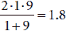

*F*[1]-分数定义为精确率和召回率的调和平均，如下所示：

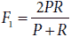

如果这两个数值都较高，*F*[1]-分数也会较高。然而，如果其中一个数值较低，*F*[1]-分数将会较低。*F*[1]-分数的目的是衡量召回率和精确率是否都较高，并在其中一个分数较低时发出警报。

计算*F*[β]-分数

在前一小节中，我们学习了*F*[1]-分数，这是一个结合召回率和精确率的分数，用于评估模型。然而，有时我们希望召回率高于精确率，或者相反。因此，当我们结合这两个分数时，我们可能希望给其中一个分数赋予更多的权重。这意味着有时我们可能希望一个既关注假阳性也关注假阴性的模型，但更重视其中一个。例如，冠状病毒模型对假阴性非常关注，因为人们的生命可能取决于对病毒的准确识别，但它仍然不希望产生过多的假阳性，因为我们可能不想浪费过多的资源重新检测健康的人。垃圾邮件模型对假阳性非常关注，因为我们真的不希望删除好的电子邮件，但也不希望产生过多的假阴性，因为我们不希望我们的收件箱被垃圾邮件消息所充斥。

这就是 *F*[β]-分数发挥作用的地方。*F*[β]-分数的公式可能一开始看起来很复杂，但一旦我们仔细观察，它确实做了我们想要的事情。*F*[β]-分数使用一个称为 *β*（希腊字母贝塔）的参数，它可以取任何正数值。*β* 的作用就像一个旋钮，我们可以转动它来强调精确率或召回率。更具体地说，如果我们把 *β* 旋钮滑到零，我们得到完全的精确率；如果我们把它滑到无穷大，我们得到完全的召回率。一般来说，*β* 的值越低，我们越强调精确率，而 *β* 的值越高，我们越强调召回率。

*F*[β]-分数的定义如下（其中精确率为 *P*，召回率为 *R*）：

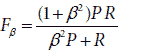

让我们通过观察一些 *β* 的值来仔细分析这个公式。

**案例 1**：***β* = 1**

当 *β* 等于 1 时，*F*[β]-分数变为以下形式：

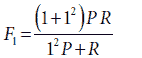

这与考虑召回率和精确率同等重要的 *F*[1]-分数相同。

**案例 2**：***β* = 10**

当 *β* 等于 10 时，*F*[β]-分数变为以下形式：

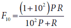

这可以写成

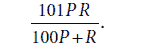

这与 *F*[1]-分数类似，但请注意它对 *R* 的重视程度远高于 *P*。为了看到这一点，请注意当 *β* 趋向于 ∞ 时，*F*[β]-分数的极限是 *R*。因此，当我们想要一个介于召回率和精确率之间的分数，且更重视召回率时，我们选择一个大于 1 的 *β* 值。值越大，我们对召回率的重视程度就越高，对精确率的重视程度就越低。

**案例 3**：***β* = 0.1**

当 *β* 等于 0.1 时，*F*[β]-分数变为以下形式：

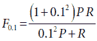

就像之前一样，我们可以写成

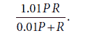

这与案例 2 中的公式类似，但这个公式给 *P* 的重视程度更高。因此，当我们想要一个介于召回率和精确率之间的分数，且更重视精确率时，我们选择一个小于 1 的 *β* 值。值越小，我们对精确率的重视程度就越高，对召回率的重视程度就越低。在极限情况下，我们说 *β* = 0 给我们的是精确率，而 *β* = ∞ 给我们的是召回率。

召回率、精确率或 F 分数：我们应该使用哪一个？

现在，我们如何将召回率和精确率付诸实践？当我们有一个模型时，它是高召回率还是高精确率的模型？我们使用 F 分数吗？如果是这样，我们应该选择哪个 *β* 值？这些问题的答案取决于我们，作为数据科学家。对我们来说，了解我们试图解决的问题非常重要，以便决定哪种错误，即假阳性或假阴性，代价更高。

在前两个例子中，我们可以看到，由于冠状病毒模型需要更多地关注召回率而不是精确度，我们应该选择一个较大的 *b* 值，比如说，例如，2。相比之下，垃圾邮件模型需要更多地关注精确度而不是召回率，因此我们应该选择一个较小的 *β* 值，比如说，0.5。为了更多练习分析模型和估计应该使用哪些 *β* 值，请参阅章节末尾的练习 7.4。

## 评估我们模型的有用工具：接收者操作特征（ROC）曲线

在“如何解决准确度问题？”这一节中，我们学习了如何使用精确度、召回率和 F 分数等指标来评估模型。我们还了解到，评估模型的主要挑战之一在于存在多种类型的错误，并且不同类型的错误具有不同的重要性水平。我们学习了两种类型的错误：假阳性和假阴性。在某些模型中，假阴性比假阳性代价更高，而在某些模型中则相反。

在本节中，我将向您介绍一种有用的技术，用于根据模型在假阳性和假阴性方面的表现来评估模型。此外，这种方法有一个重要的特性：一个旋钮，允许我们逐渐在表现良好的假阳性模型和表现良好的假阴性模型之间切换。这种技术基于一个称为 *接收者操作特征（ROC）曲线* 的曲线。

在学习 ROC 曲线之前，我们需要介绍两个新的指标，称为特异性和灵敏度。实际上，其中之一是新的。另一个，我们之前已经见过。

灵敏度和特异性：评估我们模型的新方法

在“如何解决准确度问题？”这一节中，我们定义了召回率和精确度作为我们的指标，并发现它们是衡量我们模型对假阴性和假阳性的有用工具。然而，在本节中，我们使用两个不同但非常相似的指标：*灵敏度* 和 *特异性*。它们与之前的指标有相似的作用，但当我们需要构建 ROC 曲线时，它们对我们更有用。此外，尽管精确度和召回率在数据科学家中更广泛使用，但灵敏度和特异性在医学领域更为常见。灵敏度和特异性定义为以下内容：

**灵敏度（真阳性率）**：测试识别正标签点的容量。这是真阳性数与总阳性数的比率。（注意：这与召回率相同）。

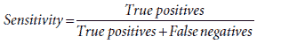

**特异性（真阴性率）**：测试识别负标签点的容量。这是真阴性数与总阴性数的比率。

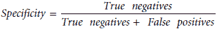

如我所述，灵敏度与召回率相同。然而，特异性与精确度不同（每个名称在不同的学科中都很流行，因此我们在这里都使用它们）。我们将在“召回率是灵敏度，但精确度和特异性不同”这一节中更详细地了解这一点。

在冠状病毒模型中，灵敏度是指模型正确诊断的患病人数占所有患病人数的比例。特异性是指模型正确诊断的健康人数占所有健康人数的比例。我们更关心正确诊断患病人群，因此我们需要冠状病毒模型具有**高灵敏度**。

在垃圾邮件检测模型中，灵敏度是指我们正确删除的垃圾邮件占所有垃圾邮件的比例。特异性是指我们正确发送到收件箱的普通邮件占所有普通邮件的比例。因为我们更关心正确检测普通邮件，所以我们需要垃圾邮件检测模型具有**高特异性**。

为了阐明前面的概念，让我们看看我们正在工作的图形示例。也就是说，让我们计算图 7.2（与图 7.1 相同）中我们两个模型的特异性和灵敏度。

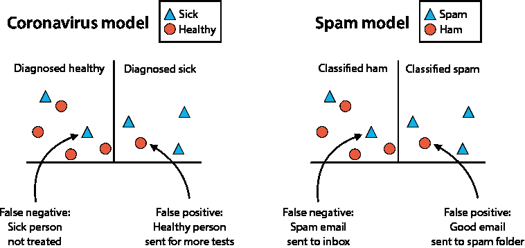

图 7.2 左边是一个冠状病毒模型，其中人们被诊断为健康或患病；右边是一个垃圾邮件检测模型，其中电子邮件被分类为垃圾邮件或普通邮件

如我们之前所见，这两个模型产生了以下数量：

+   三个真阳性

+   四个真阴性

+   一个假阳性

+   两个假阴性

现在我们来计算这些模型的特异性和灵敏度。

计算特异性

在这种情况下，我们计算灵敏度的方法是：在所有阳性点中，模型正确分类了多少个？这相当于问：在所有三角形中，有多少个位于线的右侧？共有五个三角形，模型正确地将三个位于线的右侧的三角形分类，因此灵敏度是 3/5，等于 0.6，或 60%。

计算灵敏度

我们计算特异性的方法是：在所有阴性点中，模型正确分类了多少个？这相当于问：在所有圆形中，有多少个位于线的左侧？共有五个圆形，模型正确地将四个位于线的左侧的圆形分类，因此特异性是 4/5，等于 0.8，或 80%。

接收者操作特征（ROC）曲线：一种优化模型灵敏度和特异性的方法

在本节中，我们将看到如何绘制接收者操作特征（ROC）曲线，这将为我们提供关于模型的大量信息。简而言之，我们将缓慢修改模型并记录每个时间步长模型的灵敏度和特异性。

我们对模型需要做的第一个也是唯一的一个假设是，它返回的预测是一个连续值，即概率。这在像逻辑分类器这样的模型中是正确的，其中预测不是一个类别，例如正/负，而是一个介于 0 和 1 之间的值，例如 0.7。我们通常用这个值来选择一个阈值，例如 0.5，并将预测值高于或等于阈值的每个点分类为阳性，其他点分类为阴性。然而，这个阈值可以是任何值——它不必是 0.5。我们的程序包括从 0 到 1 改变这个阈值，并记录每个阈值值下模型的灵敏度和特异性。

让我们来看一个例子。我们计算三个不同阈值（0.2、0.5 和 0.8）的灵敏度和特异性。在图 7.3 中，我们可以看到每个阈值下有多少点位于线的左侧和右侧。让我们详细研究一下。记住，灵敏度是所有阳性中的真阳性比率，特异性是所有阴性中的真阴性比率。还要记住，对于这些中的每一个，总共有五个阳性，五个阴性。

阈值 = 0.2

真阳性数量：4

**灵敏度**：五分之五

真阴性数量：3

**特异性**：五分之四

阈值 = 0.5

真阳性数量：3

**灵敏度**：五分之四

真阴性数量：4

**特异性**：五分之五

阈值 = 0.2

真阳性数量：2

**灵敏度**：五分之四

真阴性数量：5

**特异性**：五/五 = 1

注意，低阈值会导致许多阳性预测。因此，我们将有很少的假阴性，这意味着高灵敏度分数，以及许多假阳性，这意味着低特异性分数。同样，高阈值意味着低灵敏度分数和高特异性分数。当我们从低阈值移动到高阈值时，灵敏度降低，特异性增加。这是一个重要的观点，我们将在本章后面的部分讨论，当我们到达决定模型最佳阈值的时候。

现在我们准备构建 ROC 曲线。首先，我们考虑一个阈值为 0，并逐渐以小的间隔增加这个阈值，直到它达到 1。对于阈值的每次增加，我们恰好通过一个点。阈值的具体值并不重要——重要的是在每一步，我们恰好通过一个点（这是可能的，因为所有点都给出了不同的分数，但这不是一般性的要求）。因此，我们将这些步骤称为 0、1、2、...、10。在你的脑海中，你应该想象图 7.3 中的垂直线从 0 开始，缓慢地从左向右移动，每次扫过一个点，直到达到 1。这些步骤记录在表 7.6 中，包括每个步骤的真阳性、真阴性、灵敏度和特异性。

注意到的一点是，在第一步（步骤 0）中，线位于阈值 0。这意味着模型将每个点都分类为正样本。所有正样本也被分类为正样本，因此每个正样本都是真阳性。这意味着在时间步 0，敏感度为 5/5 = 1。但由于每个负样本都被分类为正样本，没有真阳性，因此特异性为 0/5 = 0。同样，在最后一步（步骤 10）中，阈值为 1，我们可以检查出由于每个点都被分类为负样本，敏感度现在为 0，特异性为 1。为了清晰起见，图 7.3 中的三个模型在表 7.6 中分别突出显示为时间步 4、6 和 8。

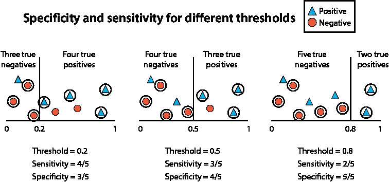

图 7.3 移动阈值对敏感性和特异性的影响。在左侧，我们有一个低阈值的模型；在中间，我们有一个中等阈值的模型；在右侧，我们有一个高阈值的模型。对于每个模型，都有五个正样本和五个负样本。每个模型由一条垂直线表示。模型预测位于线右侧的点为正样本，位于线左侧的点为负样本。对于每个模型，我们计算了真阳性和真阴性的数量，即正确预测的正样本和负样本的数量。我们使用这些数据来计算敏感性和特异性。请注意，随着阈值的增加（即，随着垂直线从左向右移动），敏感度下降，特异性上升。

表 7.6 在提高我们的阈值的过程中所有的时间步，这是构建 ROC 曲线的重要步骤。在每个时间步，我们记录真阳性和真阴性的数量。然后，我们通过将真阳性的数量除以正样本总数来计算模型的特异性。作为最后一步，我们通过将真阴性的数量除以负样本总数来计算特异性。

| 步骤 | 真阳性 | 敏感度 | 真阴性 | 特异性 |
| --- | --- | --- | --- | --- |
| 0 | 5 | 1 | 0 | 0 |
| 1 | 5 | 1 | 1 | 0.2 |
| 2 | 4 | 0.8 | 1 | 0.2 |
| 3 | 4 | 0.8 | 2 | 0.4 |
| 4 | 4 | 0.8 | 3 | 0.6 |
| 5 | 3 | 0.6 | 3 | 0.6 |
| 6 | 3 | 0.6 | 4 | 0.8 |
| 7 | 2 | 0.4 | 4 | 0.8 |
| 8 | 2 | 0.4 | 5 | 1 |
| 9 | 1 | 0.2 | 5 | 1 |
| 10 | 0 | 0 | 5 | 1 |

作为最后一步，我们绘制了敏感性和特异性值。这是 ROC 曲线，如图 7.4 所示。在这个图中，每个黑色点对应一个时间步（点内指示），水平坐标对应敏感度，垂直坐标对应特异性。

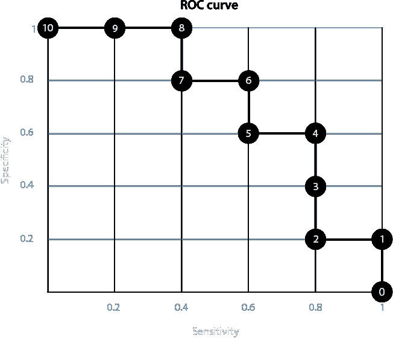

图 7.4 在这里，我们可以看到对应于我们正在进行的示例的 ROC 曲线，它为我们提供了关于模型的大量信息。高亮的点对应于将阈值从 0 移动到 1 时获得的 timesteps，每个点都标有 timesteps。在横轴上，我们记录了每个 timesteps 的模型敏感性，在纵轴上，我们记录了特异性。

一个告诉我们模型有多好的指标：AUC（曲线下的面积）

正如我们在本书之前所见，评估机器学习模型是一项非常重要的任务，在本节中，我们将讨论如何使用 ROC 曲线来评估模型。为此，我们已经完成了所有工作——剩下的只是计算曲线下的面积，即 AUC。在图 7.5 的顶部，我们可以看到三个模型，其中预测值由横轴给出（从 0 到 1）。在底部，你可以看到三个相应的 ROC 曲线。每个方块的尺寸是 0.2 乘以 0.2。每个曲线下的方块数量分别是 13、18 和 25，这相当于曲线下的面积是 0.52、0.72 和 1。

注意，一个模型最好的 AUC 是 1，这对应于图右边的模型。一个模型最差的 AUC 是 0.5，因为这意味着模型的表现与随机猜测一样好。这对应于图左边的模型。中间的模型是我们的原始模型，AUC 为 0.72。

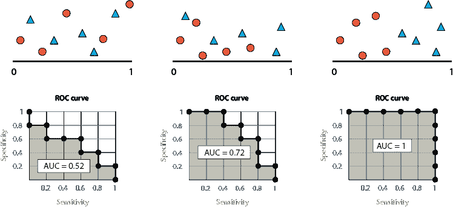

图 7.5 在这个图中，我们可以看到 AUC，即曲线下的面积，是一个很好的指标，可以用来确定模型的好坏。AUC 越高，模型越好。在左边，我们有一个 AUC 为 0.52 的坏模型。在中间，我们有一个 AUC 为 0.72 的好模型。在右边，我们有一个 AUC 为 1 的伟大模型。

那么 AUC 为零的模型呢？这有点棘手。AUC 为零的模型对应于一个将每个点都分类错误的模型。这是一个坏模型吗？实际上，这是一个非常好的模型，因为要修复它，我们只需要翻转所有正负预测，就能得到一个完美的模型。这就像有一个人每次在回答是非问题时都撒谎一样。要让他们说实话，我们只需要翻转他们所有的答案。这意味着在二元分类模型中，最坏的情况是 AUC 为 0.5，因为这对应于一个撒谎 50%的人。他们给我们没有信息，因为我们永远不知道他们在说真话还是撒谎！顺便说一句，如果我们有一个 AUC 小于 0.5 的模型，我们可以翻转正负预测，从而得到一个 AUC 大于 0.5 的模型。

如何使用 ROC 曲线做出决策

ROC 是一个强大的图形，它为我们提供了关于模型的大量信息。在本节中，我们学习如何使用它来改进我们的模型。简而言之，我们使用 ROC 调整模型中的阈值，并将其应用于选择最适合我们用例的最佳模型。

在本章的开头，我们介绍了两个模型，即冠状病毒模型和垃圾邮件检测模型。这些模型非常不同，因为我们看到，冠状病毒模型需要高敏感性，而垃圾邮件检测模型需要高特异度。每个模型都需要一定程度的敏感性和特异度，这取决于我们要解决的问题。假设我们处于以下情况：我们正在训练一个应该具有高敏感性的模型，但我们得到了一个低敏感性而高特异度的模型。我们是否有办法牺牲一些特异度以换取一些敏感性？

答案是肯定的！我们可以通过调整阈值来权衡特异性和敏感性。回想一下，当我们首次定义 ROC 曲线时，我们注意到阈值越低，模型的敏感性越高而特异度越低，反之，阈值越高，模型的敏感性越低而特异度越高。当对应的阈值垂直线位于最左侧时，所有点都被预测为阳性，因此所有阳性都是真阳性，而当时垂直线位于最右侧时，所有点都被预测为阴性，因此所有阴性都是真阴性。当我们向右移动这条线时，我们失去了一些真阳性并获得了某些真阴性，因此敏感性降低而特异度提高。请注意，当阈值从 0 移动到 1 时，我们在 ROC 曲线上向上并向左移动，如图 7.6 所示。

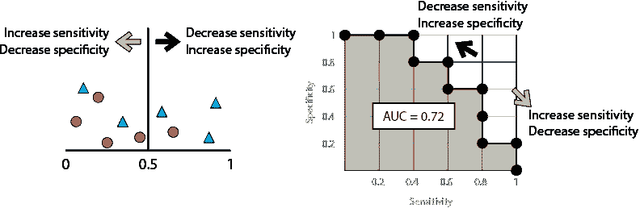

图 7.6 模型的阈值与敏感性和特异度有很大关系，这种关系将帮助我们为我们的模型选择完美的阈值。在左侧，我们有我们的模型，在右侧，是对应的 ROC 曲线。当我们增加或减少阈值时，我们改变模型的敏感性和特异度，这种变化通过在 ROC 曲线上的移动来表示。

为什么会发生这种情况呢？阈值告诉我们我们在分类一个点时在哪里划线。例如，在冠状病毒模型中，阈值告诉我们我们在决定一个人是否需要进一步检测或回家时在哪里划线。低阈值的模型是指即使有轻微症状也会让人进行额外检测的模型。高阈值的模型是指需要人们表现出强烈症状才会让人进行更多检测的模型。因为我们希望捕捉到所有生病的人，所以我们希望这个模型的阈值低，这意味着我们希望这个模型具有高敏感性。为了清晰起见，在图 7.7 中，我们可以看到之前使用的三个阈值，以及它们在曲线中的对应点。

如果我们想让我们的模型具有高敏感性，我们只需将阈值推向左侧（即减小它），直到我们到达曲线上具有我们想要的敏感度的点。请注意，模型可能会失去一些特异性，这是我们付出的代价。相比之下，如果我们想要更高的特异性，我们将阈值推向右侧（即增加它），直到我们到达曲线上具有我们想要的特异性的点。同样，在这个过程中，我们会失去一些敏感性。曲线告诉我们我们获得了多少以及失去了多少，因此作为数据科学家，这是一个帮助我们决定模型最佳阈值的伟大工具。在图 7.8 中，我们可以看到一个具有更大数据集的更一般化的例子。

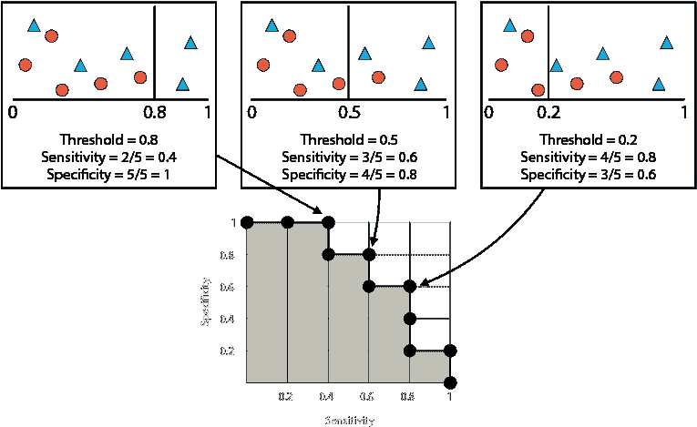

图 7.7 模型阈值与其 ROC 曲线的平行关系。左侧的模型具有高阈值、低敏感性和高特异性。中间的模型在阈值、敏感性和特异性方面具有中等值。右侧的模型具有低阈值、高敏感性和低特异性。

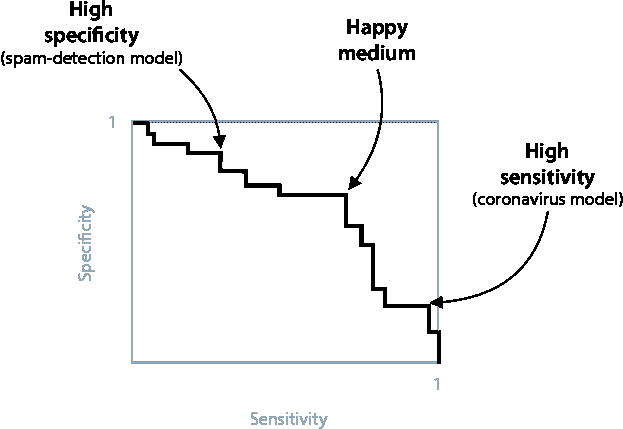

图 7.8 在这个更一般化的场景中，我们可以看到一个 ROC 曲线和三个与之对应的点，分别对应三个不同的阈值。如果我们想要选择一个具有高特异性的阈值，我们选择左侧的一个。对于具有高敏感性的模型，我们选择右侧的一个。如果我们想要一个既有较高敏感性又有较高特异性的模型，我们选择中间的一个。

如果我们需要一个高敏感性的模型，例如冠状病毒模型，我们会选择右侧的点。如果我们需要一个高特异性的模型，例如垃圾邮件检测模型，我们可能会选择左侧的点。然而，如果我们想要相对较高的敏感性和特异性，我们可能会选择中间的点。作为数据科学家，我们有责任对问题有足够的了解，以便正确地做出这个决定。

召回率是敏感性，但精确性和特异性是不同的

在这一点上，你可能想知道我们如何能够立刻记住所有这些术语。答案是，它们很难不混淆。大多数数据科学家（包括作者）经常需要快速在维基百科上查找它们，以确保它们不会混淆。我们可以使用助记符来帮助我们记住哪个是哪个。

例如，当我们想到召回率时，想想一个制造了具有致命设计缺陷的汽车的公司。他们需要找到所有有缺陷的汽车并将它们召回。如果他们意外地得到了一些非有缺陷的汽车，他们只需将它们退回。然而，找不到一辆有缺陷的汽车将是可怕的。因此，召回率关注的是找到所有正标签的示例。这代表了一个具有高召回率的模型。

另一方面，如果我们为这家汽车公司工作，并且我们做得有点过头，开始召回**所有**的汽车，我们的老板可能会过来对我们说：“嘿，你送来修理的汽车太多了，我们的资源快用完了。你能更挑剔一点，只送那些有故障的吗？”然后我们需要在模型中添加精确度，并尝试只找到那些有故障的汽车，即使我们不小心错过了其中一些（希望不会！）。这代表了一个具有高**精确度**的模型。

当谈到特异性和灵敏度时，想象一个地震传感器，每次有地震时都会发出蜂鸣声。这个传感器非常**灵敏**。如果隔壁房子里的蝴蝶打喷嚏，传感器也会发出蜂鸣声。这个传感器肯定会捕捉到所有的地震，但它也会捕捉到许多其他不是地震的东西。这代表了一个具有高**灵敏度**的模型。

现在，让我们想象这个传感器有一个旋钮，我们将它的灵敏度调到最低。现在，传感器只有在有大量移动时才会发出蜂鸣声。当传感器发出蜂鸣声时，我们知道那是地震。问题是它可能会错过一些较小或中等的地震。换句话说，这个传感器对地震非常**特异**，所以它不太可能对其他任何事情发出蜂鸣声。这代表了一个具有高**特异性**的模型。

如果我们回顾前面的四个段落，我们可能会注意到以下两点：

+   回忆和灵敏度非常相似。

+   精确度和特异性非常相似。

至少，召回率和灵敏度有相同的目的，即测量有多少假反例。同样，精确度和特异性也有相同的目的，即测量有多少假正例。

结果表明，回忆和灵敏度实际上是同一件事。然而，精确度和特异性并不相同。尽管它们测量的不是同一指标，但它们都会惩罚那些有大量误报的模型。如何记住所有这些指标呢？一个图形化的启发式方法可以帮助我们记住召回率、精确度、灵敏度和特异性。在图 7.9 中，我们看到一个混淆矩阵，包含四个量：真正例、真反例、假正例和假反例。如果我们关注顶部行（标记为正的例子），我们可以通过将左列的数字除以两列数字之和来计算召回率。如果我们关注最左边的列（预测为正的例子），我们可以通过将顶行的数字除以两行数字之和来计算精确度。如果我们关注底部行（标记为负的例子），我们可以通过将左列的数字除以两列数字之和来计算特异性。换句话说

+   召回率和灵敏度对应于顶部行。

+   精确度对应于最左边的列。

+   特异性对应于底部行。

图 7.9 混淆矩阵的顶部行给出了召回率和灵敏度：真正例数与真正例数和假阴性数之和的比率。最左侧的列给出了精度：真正例数与真正例数和假阳性数之和的比率。底部行给出了特异性：假阳性数与假阳性数和真阴性数之和的比率。

总结起来，这些量在我们的两个模型中如下：

医学模型：

+   **召回率和灵敏度**：在生病的人（阳性）中，有多少被正确诊断为生病？

+   **精度**：在诊断为生病的人中，实际上有多少是生病的？

+   **特异性**：在健康的人（阴性）中，有多少被正确诊断为健康？

邮件模型：

+   **召回率和灵敏度**：在垃圾邮件（阳性）中，有多少被正确删除？

+   **精度**：在删除的邮件中，实际上有多少是垃圾邮件？

+   **特异性**：在垃圾邮件（阴性）中，有多少被正确发送到收件箱？

## 摘要

+   能够评估一个模型与能够训练一个模型一样重要。

+   我们可以使用几个重要的指标来评估一个模型。在本章中我们学习的是准确度、召回率、精度、F 分数、特异性和灵敏度。

+   准确度计算正确预测与总预测之间的比率。它是有用的，但在某些情况下可能会失败，尤其是在正负标签不平衡的情况下。

+   错误分为两类：假阳性和假阴性。

    +   假阳性是一个负标签点，模型错误地预测为阳性。

    +   假阴性是一个正标签点，模型错误地预测为阴性。

+   对于某些模型，假阴性和假阳性被赋予不同的重要性级别。

+   召回率和精度是评估模型的有用指标，尤其是在模型对假阴性和假阳性赋予不同重要性的情况下。

    +   召回率衡量模型正确预测的正点数。当模型产生许多假阴性时，召回率会很低。因此，在我们不希望有太多假阴性的模型中，如医学诊断模型，召回率是一个有用的指标。

    +   精度衡量模型预测为正点的点中，实际上有多少是正点。当模型产生许多误报时，精度会很低。因此，在我们不希望有太多误报的模型中，如垃圾邮件模型，精度是一个有用的指标。

+   *F*[1]-分数是一个有用的指标，它结合了召回率和精度。它返回一个介于召回率和精度之间的值，但更接近于两者中较小的一个。

+   *F*[β]-分数是 *F*[1]-分数的一种变体，其中可以调整参数 *β* 以给予精度或召回更高的权重。*β* 的值越高，召回的重要性就越大，而 *β* 的值越低，精度的重要性就越大。*F*[β]-分数特别适用于评估精度或召回比另一个更重要，但我们仍然关心这两个指标的模型。

+   灵敏度和特异性是两个有用的指标，帮助我们评估模型。它们在医学领域被高度使用。

    +   灵敏度，或真正正例比率，衡量模型正确预测了多少个正例。当模型产生许多假阴性时，灵敏度会很低。因此，在医疗模型中，我们不想意外地让许多健康患者得不到治疗时，灵敏度是一个有用的指标。

    +   特异性，或真正负例比率，衡量模型正确预测了多少个负例。当模型产生许多假阳性时，特异性会很低。因此，在医疗模型中，我们不想意外地治疗或对健康患者进行进一步侵入性测试时，特异性是一个有用的指标。

+   召回率和灵敏度是同一回事。然而，精度和特异性不是同一回事。精度确保大多数预测的正例确实是正例，而特异性检查大多数真正负例是否已经被检测到。

+   当我们提高模型中的阈值时，我们降低其灵敏度并提高其特异性。

+   ROC，或接收者操作特征曲线，是一个有用的图表，帮助我们跟踪模型在每个不同阈值下的灵敏度和特异性。

+   ROC（接受者操作特征曲线）也帮助我们确定模型的好坏，使用曲线下的面积，或 AUC。AUC 越接近 1，模型越好。AUC 越接近 0.5，模型越差。

+   通过观察 ROC 曲线，我们可以根据模型对每种值的预期来决定使用什么阈值，以同时获得灵敏度和特异性的良好值。这使得 ROC 曲线成为评估和改进模型最受欢迎和最有用的一种方式。

## 练习

练习 7.1

一个视频网站已经确定一个特定的用户喜欢动物视频，而且绝对没有其他喜好。在下图中，我们可以看到当用户登录网站时收到的推荐。

如果这是我们关于模型的所有数据，回答以下问题：

1.  模型的准确度是多少？

1.  模型的召回率是多少？

1.  模型的精度是多少？

1.  模型的 *F*[1]-分数是多少？

1.  你会说这是一个好的推荐模型吗？

练习 7.2

找出以下混淆矩阵中医疗模型的灵敏度和特异性：

|  | 预测患病 | 预测健康 |
| --- | --- | --- |
| 患病 | 120 | 22 |
| 健康 | 63 | 795 |

练习 7.3

对于以下模型，确定哪种错误更严重，是假阳性还是假阴性。基于此，确定在评估每个模型时，我们应该强调哪个指标，是精确度还是召回率。

1.  一种电影推荐系统，预测用户是否会观看电影

1.  一种用于自动驾驶汽车中的图像检测模型，用于检测图像中是否包含行人

1.  一种预测用户是否向其下达命令的家庭语音助手

练习 7.4

我们被赋予以下模型：

1.  一种基于汽车摄像头图像检测行人的自动驾驶汽车模型

1.  一种基于患者症状诊断致命疾病的医学模型

1.  一种基于用户之前观看的电影的电影推荐系统

1.  一种根据语音命令确定用户是否需要帮助的语音助手

1.  一种基于电子邮件中单词确定电子邮件是否为垃圾邮件的垃圾邮件检测模型

我们被赋予的任务是使用 *F*[β]-分数来评估这些模型。然而，我们没有给出要使用的 *β* 值。您会使用什么 *β* 值来评估每个模型？
