# 8 利用概率达到极致：朴素贝叶斯模型

在本章中

+   什么是贝叶斯定理

+   相关事件和独立事件

+   先验概率和后验概率

+   根据事件计算条件概率

+   使用朴素贝叶斯模型来预测一封电子邮件是否为垃圾邮件或正常邮件，基于邮件中的文字

+   在 Python 中编码朴素贝叶斯算法

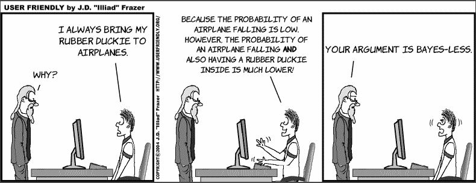

朴素贝叶斯是一种重要的机器学习模型，用于分类。朴素贝叶斯模型是一个纯粹的概率模型，这意味着预测是一个介于 0 和 1 之间的数字，表示标签为正的概率。朴素贝叶斯模型的主要组成部分是贝叶斯定理。

贝叶斯定理在概率论和统计学中起着根本的作用，因为它有助于计算概率。它基于这样一个前提：我们收集关于一个事件的信息越多，我们对其概率的估计就越准确。例如，假设我们想要找到今天会下雪的概率。如果我们没有关于我们所在的位置和现在是哪一年的信息，我们只能给出一个模糊的估计。然而，如果我们得到信息，我们就可以对概率做出更好的估计。想象一下，我告诉你我在想一种动物，并希望你能猜出它是什么。我想的动物是狗的概率是多少？鉴于你不知道任何信息，这个概率相当小。然而，如果我现在告诉你我想的动物是家养宠物，这个概率就会大大增加。然而，如果我现在告诉你我想的动物有翅膀，这个概率现在为零。每次我告诉你一条新信息，你对它是狗的概率估计就会越来越准确。贝叶斯定理就是将这种逻辑形式化并放入公式中的方法。

更具体地说，贝叶斯定理回答了“在发生 x 的情况下，Y 的概率是多少？”这个问题，这被称为条件概率。你可以想象，回答这类问题在机器学习中很有用，因为如果我们能回答“在给定特征的情况下，标签为正的概率是多少？”这个问题，我们就有一个分类模型。例如，我们可以通过回答“给定包含的单词，这句话是快乐的概率是多少？”这个问题来构建情感分析模型（就像我们在第六章中做的那样）。然而，当我们有太多的特征（在这种情况下，是单词）时，使用贝叶斯定理计算概率会变得非常复杂。这就是朴素贝叶斯算法拯救我们的地方。朴素贝叶斯算法通过简化这种计算来帮助我们构建所需的分类模型，称为朴素贝叶斯模型。它被称为朴素贝叶斯是因为为了简化计算，我们做出了一个稍微有些天真且不一定正确的假设。然而，这个假设帮助我们得到了一个很好的概率估计。

在本章中，我们看到了贝叶斯定理与一些现实生活中的例子结合使用。我们首先研究一个有趣且略带惊讶的医疗案例。然后，我们深入探讨朴素贝叶斯模型，通过将其应用于机器学习中的一个常见问题：垃圾邮件分类。最后，我们用 Python 编写算法，并在真实的垃圾邮件数据集中使用它进行预测。

本章的所有代码都可以在这个 GitHub 仓库中找到：[`github.com/luisguiserrano/manning/tree/master/Chapter_8_Naive_Bayes`](https://github.com/luisguiserrano/manning/tree/master/Chapter_8_Naive_Bayes)。

## 病了还是健康？一个以贝叶斯定理为主角的传奇故事

考虑以下场景。你的（有点疑病症的）朋友给你打电话，接下来的对话是这样的：

**你**：你好！

**朋友**：嗨。我有个可怕的消息！

**你**：哎呀，怎么了？

**朋友**：我听说了一种可怕且罕见的疾病，我去医生那里做了检测。医生说她将进行一个非常准确的测试。然后今天，她给我打电话告诉我，我检测呈阳性！我肯定有病！

哎呀！你该对你的朋友说些什么呢？首先，让我们让他冷静下来，并试图弄清楚他是否可能患有这种疾病。

**你**：首先，让我们冷静下来。医学中会出错。让我们看看你实际上患病的可能性有多大。医生说测试的准确率有多高？

**朋友**：她说准确率达到了 99%。这意味着我患病的可能性是 99%！

**你**：等等，让我们看看所有的数字。不考虑测试结果，患病的可能性有多大？有多少人患有这种疾病？

**朋友**：我在网上看到，平均每 10,000 人中就有一个人患有这种疾病。

**你**：好的，让我拿张纸（把朋友放在一边）。

让我们停下来做一个测验。

测验：你认为你朋友测试呈阳性时患病的概率在什么范围内？

1.  0–20%

1.  20–40%

1.  40–60%

1.  60–80%

1.  80–100%

让我们计算这个概率。总结一下，我们有以下两条信息：

+   测试正确率是 99%。更准确地说（我们向医生确认过这一点），平均来说，在每 100 个健康人中，测试正确诊断了 99 人，在每 100 个病人中，测试也正确诊断了 99 人。因此，在健康人和病人中，测试的准确率都是 99%。

+   平均来说，每 10,000 人中就有 1 人患病。

让我们做一些粗略的计算，看看概率会是多少。这些计算总结在图 8.1 所示的混淆矩阵中。为了参考，我们可以随机选择一百万人的一个群体。平均来说，每 10,000 人中就有 1 人患病，所以我们预计这 100 人中有 1 人患病，999,900 人健康。

首先，让我们对这 100 个生病的进行测试。因为测试正确率是 99%，我们预计这 100 人中有 99 人会被正确诊断为生病——即 99 个测试呈阳性的病人。

现在，让我们对这 999,900 个健康的人进行测试。测试有 1%的错误率，所以我们预计这 999,900 个健康人中会有 1%的人被误诊为生病。这意味着有 9,999 个健康人测试呈阳性。

这意味着测试呈阳性的总人数是 99 + 9,999 = 10,098 人。在这些人中，只有 99 人是生病的。因此，在你朋友测试呈阳性时，他生病的概率是 99/10.098 = 0.0098，或者 0.98%。这还不到 1%！所以我们可以回到我们朋友身边。

**你**：别担心，根据你给我的数据，你测试呈阳性时生病的概率不到 1%！

**朋友**：哦，我的天哪，真的吗？这真是太好了，谢谢你！

**你**：不用谢我，感谢数学（眨眼）。

让我们总结一下我们的计算。以下是我们的事实：

+   **事实 1**：在每 10,000 人中，有 1 人患有疾病。

+   **事实 2**：在每 100 个接受测试的病人中，有 99 个测试呈阳性，1 个测试呈阴性。

+   **事实 3**：在每 100 个接受测试的健康人中，有 99 个测试呈阴性，1 个测试呈阳性。

我们选择了一百万人的样本群体，如图 8.1 所示，分解如下：

+   根据事实 1，我们预计在我们的样本人群中，有 100 人患病，999,900 人健康。

+   根据事实 2，在 100 个病人中，有 99 个测试呈阳性，1 个测试呈阴性。

+   根据事实 3，在 999,900 个健康人中，有 9,999 个测试呈阳性，989,901 个测试呈阴性。

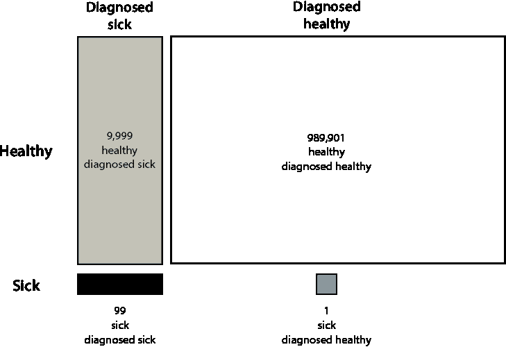

图 8.1 在我们的 100 万患者中，只有 100 人患病（底部行）。在诊断为患病的 10,098 人中（左侧列），实际上只有 99 人患病。其余的 9,999 人都是健康的，却被误诊为患病。因此，如果我们的朋友被诊断为患病，他更有可能属于那 9,999 个健康的（左上角）而不是那 99 个患病的（左下角）。

由于我们的朋友测试结果呈阳性，他必须在图 8.1 的左侧列。这一列有 9,999 个被误诊为患病的健康人和 99 个被正确诊断为患病的患者。你的朋友患病的概率是 99/9,999 = 0.0089，这不到 1%。

这有点令人惊讶，如果测试正确率是 99%，那么为什么会这么错误？好吧，如果测试只有 1%的时间出错，那么它并不差。但是，因为每 10,000 人中就有一个人患有这种疾病，这意味着一个人患病的概率是 0.01%。更有可能的是，成为那 1%被误诊的人群，还是成为那 0.01%患病的人群？尽管 1%是一个小群体，但它比 0.01%大得多。测试有问题；它的错误率比患病率大得多。我们在第七章的“两个模型示例：冠状病毒和垃圾邮件”部分也有类似的问题——我们不能依赖准确性来衡量这个模型。

一种看待这个问题的方式是使用树状图。在我们的图中，我们从左侧的一个根开始，它分支成两种可能性：你的朋友是患病或健康。这两种可能性中的每一种又分支成两种更进一步的可能性：你的朋友被诊断为健康或被诊断为患病。这个树状图在图 8.2 中展示，并附有每个分支的患者数量。

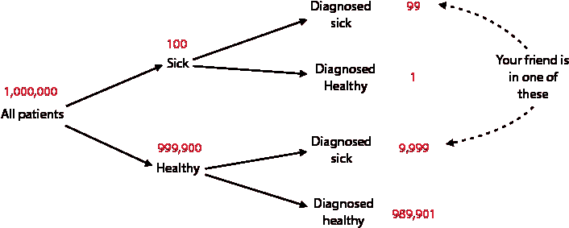

图 8.2 可能性的树状图。每个患者可以是患病或健康。对于每一种可能性，患者可以被诊断为患病或健康，这给我们提供了四种可能性。我们从一百万患者开始：其中 100 人患病，其余的 999,900 人健康。在这 100 个患病的人中，有一个人被误诊为健康，其余的 99 人被正确诊断为患病。在 999,900 个健康患者中，有 9,999 人被误诊为患病，其余的 989,901 人被正确诊断为健康。

从图 8.2 中，我们再次可以看到，如果你的朋友测试结果呈阳性，他患病的概率是 99/99+9,999 = 0.0098，前提是他只能位于右侧的第一和第三组。

贝叶斯定理的序言：先验、事件和后验

现在我们已经拥有了陈述贝叶斯定理的所有工具。贝叶斯定理的主要目标是计算一个概率。一开始，如果我们手中没有任何信息，我们只能计算出初始概率，我们称之为*先验概率*。然后，发生了一个事件，它给我们提供了信息。在这个信息之后，我们对想要计算的概率有了更好的估计。我们称这个更好的估计为*后验概率*。先验、事件和后验在图 8.3 中得到了说明。

先验 初始概率

事件 发生的事情，它给我们提供信息

后验 使用先验概率和事件计算出的最终（更准确）的概率

下面是一个例子。想象一下，我们想要找出今天下雨的概率。如果我们一无所知，我们只能对概率给出一个粗略的估计，这就是先验概率。如果我们四处看看，发现我们身处亚马逊雨林（这个事件），那么我们可以给出一个更加精确的估计。事实上，如果我们身处亚马逊雨林，今天很可能下雨。这个新的估计就是后验概率。

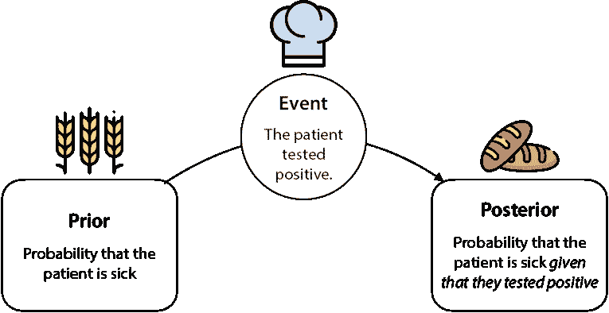

图 8.3 先验、事件和后验。先验是“原始”概率，即当我们知道很少信息时计算的概率。事件是我们获得的信息，它将帮助我们完善对概率的计算。后验是“加工后”的概率，或者是我们拥有更多信息时计算出的更加准确的概率。

在我们正在进行的医学例子中，我们需要计算一个病人生病的概率。先验概率、事件和后验概率如下：

+   **先验**：最初，这个概率是 1/10,000，因为我们没有其他信息，除了知道每 10,000 个病人中有一个人生病。这个 1/10,000，或者说 0.0001，就是先验概率。

+   **事件**：突然，新的信息出现了。在这种情况下，病人做了一次测试，并且测试结果呈阳性。

+   **后验**：在测试结果呈阳性之后，我们重新计算病人生病的概率，结果是 0.0098。这就是后验概率。

贝叶斯定理是概率论和机器学习最重要的基石之一。它的重要性如此之高，以至于有多个领域以它的名字命名，例如*贝叶斯学习*、*贝叶斯统计学*和*贝叶斯分析*。在本章中，我们将学习贝叶斯定理以及由此派生出的一个重要分类模型：朴素贝叶斯模型。简而言之，朴素贝叶斯模型做的是大多数分类模型都会做的事情，即从一组

特征。模型以概率的形式返回答案，这个概率是使用贝叶斯定理计算得出的。

## 用例：垃圾邮件检测模型

本章我们研究的用例是一个垃圾邮件检测模型。这个模型帮助我们区分垃圾邮件和正常邮件。正如我们在第一章和第七章所讨论的，垃圾邮件是指垃圾邮件，而正常邮件是指非垃圾邮件。

基于朴素贝叶斯模型，我们可以输出一封邮件是垃圾邮件或正常邮件的概率。这样，我们可以将概率最高的垃圾邮件直接发送到垃圾邮件文件夹，其余的保留在收件箱中。这个概率应该取决于邮件的特征，例如其文字、发件人、大小等。对于本章，我们只考虑文字作为特征。这个例子与我们在第五章和第六章研究的情感分析例子并没有太大的不同。这个情感分析分类器的关键是每个单词在垃圾邮件中出现的概率。例如，单词“彩票”在垃圾邮件中出现的概率比“会议”要高。这个概率是我们计算的基础。

寻找先验概率：任何一封邮件是垃圾邮件的概率

一封邮件是垃圾邮件的概率是多少？这是一个难题，但让我们尝试做出一个粗略的估计，我们称之为先验概率。我们查看当前的收件箱，统计垃圾邮件和正常邮件的数量。想象一下，在 100 封邮件中，有 20 封是垃圾邮件，80 封是正常邮件。因此，20%的邮件是垃圾邮件。如果我们想要做出一个合理的估计，我们可以认为“据我们所知”，新邮件是垃圾邮件的概率是 0.2。这是先验概率。计算过程在图 8.4 中进行了说明，其中垃圾邮件用深灰色表示，正常邮件用白色表示。

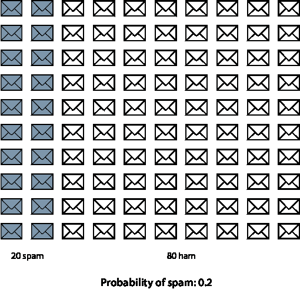

图 8.4 我们有一个包含 100 封邮件的数据集，其中 20 封是垃圾邮件。对一封邮件是垃圾邮件的概率的估计是 0.2。这是先验概率。

寻找后验概率：已知邮件包含特定单词时，邮件是垃圾邮件的概率

当然，并不是所有的邮件都是同等重要的。我们希望利用邮件的特性来做出一个更合理的猜测。我们可以使用许多特性，如发件人、大小或邮件中的单词。对于这个应用，我们只使用邮件中的单词。然而，我鼓励你在思考这个例子时，考虑如何使用其他特性。

假设我们找到一个特定的单词，比如说“彩票”，这个单词在垃圾邮件中比在正常邮件中出现的频率更高。这个单词代表我们的事件。在垃圾邮件中，“彩票”这个单词出现在 15 封邮件中，而在正常邮件中只出现在 5 封邮件中。因此，在包含“彩票”这个单词的 20 封邮件中，有 15 封是垃圾邮件，5 封是正常邮件。因此，包含“彩票”这个单词的邮件是垃圾邮件的概率正好是 15/20 = 0.75。这就是后验概率。计算这个概率的过程在图 8.5 中进行了说明。

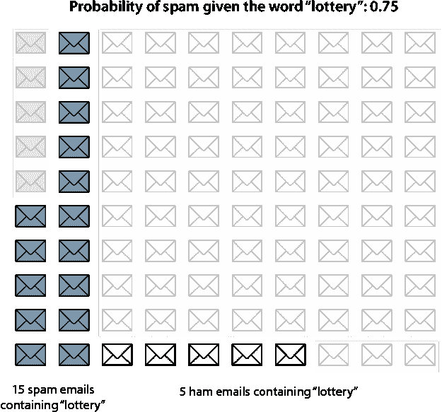

图 8.5 我们移除了（灰色显示）不包含单词*lottery*的邮件。突然之间，我们的概率发生了变化。在包含单词*lottery*的邮件中，有 15 封是垃圾邮件，5 封是正常邮件，所以包含单词*lottery*的邮件是垃圾邮件的概率是 15/20 = 0.75。

就这样：我们计算了包含单词*lottery*的邮件是垃圾邮件的概率。为了总结：

+   **先验**概率是 0.2。这是在不知道任何关于邮件信息的情况下，邮件是垃圾邮件的概率。

+   **事件**是邮件包含单词*lottery*。这有助于我们更好地估计概率。

+   **后验**概率是 0.75。这是在知道邮件包含单词*lottery*的情况下，邮件是垃圾邮件的概率。

在这个例子中，我们通过计数邮件并除以来计算概率。这主要是为了教学目的，但在现实生活中，我们可以使用一个公式来计算这个概率的捷径。这个公式被称为贝叶斯定理，我们将在下一部分看到。

数学刚刚发生了什么？将比率转换为概率

一种可视化前一个例子方法是使用所有四种可能性的树形图，就像我们在图 8.2 中的医疗例子中所做的那样。可能性是邮件是垃圾邮件或正常邮件，以及它是否包含单词*lottery*。我们这样绘制它：我们从根节点开始，它分为两个分支。上面的分支对应垃圾邮件，下面的分支对应正常邮件。每个分支再分为两个更小的分支，即邮件包含单词*lottery*和不包含时。树形图如图 8.6 所示。注意，在这个树形图中，我们还指出了在总共 100 封邮件中，每个特定组有多少封邮件。

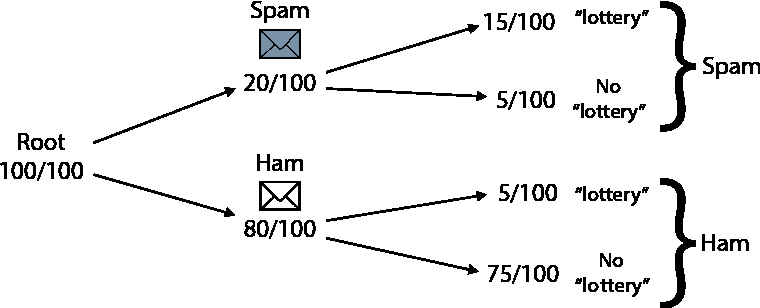

图 8.6 可能性树。根节点分为两个分支：垃圾邮件和正常邮件。然后每个分支再分为两个分支：当邮件包含单词*lottery*时，和不包含时。

一旦我们有了这个树形图，并且想要计算包含单词*lottery*的邮件是垃圾邮件的概率，我们只需移除所有不包含单词*lottery*的分支。这如图 8.7 所示。

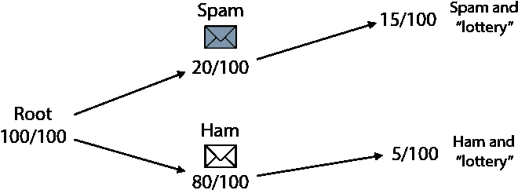

图 8.7 从之前的树形图中，我们移除了不包含单词*lottery*的两个分支。在最初的 100 封邮件中，我们剩下 20 封包含*lottery*。由于这 20 封邮件，其中 15 封是垃圾邮件，我们得出结论，包含单词*lottery*的邮件是垃圾邮件的概率是 0.75。

现在，我们有 20 封邮件，其中 15 封是垃圾邮件，5 封是正常邮件。因此，包含单词*lottery*的邮件是垃圾邮件的概率是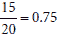。

但我们已经计算过了，那么图表有什么好处呢？除了使事情更简单之外，好处是通常我们所拥有的信息是基于概率的，而不是基于邮件的数量。很多时候，我们不知道垃圾邮件或正常邮件的数量。我们所知道的是以下信息：

+   一封邮件是垃圾邮件的概率是 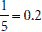。

+   垃圾邮件包含单词*lottery*的概率是 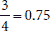。

+   一封正常邮件包含单词*lottery*的概率是 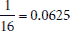。

+   **问题**：包含单词*lottery*的邮件是垃圾邮件的概率是多少？

首先，让我们检查这些信息是否足够。我们知道邮件是正常邮件的概率吗？嗯，我们知道邮件是垃圾邮件的概率是 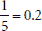。唯一的另一种可能性是邮件是正常邮件，所以它必须是补集，即 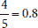。这是一条重要的规则——互补概率规则。

互补概率规则 对于事件*E*，事件*E*的补集，表示为*E*^c，是与*E*相反的事件。*E*^c 的概率是 1 减去*E*的概率，即，

*P*(*E*^c) = 1 − *P*(*E*)

因此，我们有以下：

+   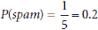：邮件是垃圾邮件的概率

+   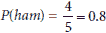：邮件是正常邮件的概率

现在我们来看其他信息。垃圾邮件包含单词*lottery*的概率是 。这可以理解为，邮件包含单词*lottery*且邮件是垃圾邮件的概率是 0.75。这是一个条件概率，条件是邮件是垃圾邮件。我们用竖线表示条件，所以这可以写成*P*(*'lottery'*|*spam*)。这个条件的补集是*P*(*no 'lottery'*|*spam*)，即垃圾邮件不包含单词*lottery*的概率。这个概率是 1 – *P*(*'lottery'*|*spam*)。这样，我们可以计算出其他概率，如下所示：

+   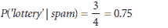：垃圾邮件包含单词*lottery*的概率。

+   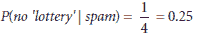：垃圾邮件不包含单词*lottery*的概率。

+   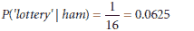：正常邮件包含单词*lottery*的概率。

+   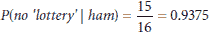：正常邮件不包含单词*lottery*的概率。

我们接下来要做的是找到两个事件同时发生的概率。更具体地说，我们想要以下四个概率：

+   一封邮件是垃圾邮件且包含单词*lottery*的概率

+   一封邮件是垃圾邮件且不包含单词*lottery*的概率

+   一封邮件是正常邮件且包含单词*lottery*

+   一封邮件是正常邮件且不包含单词*lottery*的概率

这些事件被称为事件的*交集*，并用符号∩表示。因此，我们需要找到以下概率：

+   *P*(*'lottery'* ∩ *spam*)

+   *P*(*no 'lottery'* ∩ *spam*)

+   *P*(*'lottery'* ∩ *ham*)

+   *P*(*no 'lottery'* ∩ *ham*)

让我们看看一些数字。我们知道，或者说 100 封邮件中有 20 封是垃圾邮件。在这 20 封中，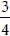包含单词*lottery*。最后，我们将这两个数字相乘，乘以，得到，这与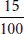相同，即包含单词*lottery*的垃圾邮件的比例。我们所做的是以下：我们将邮件是垃圾邮件的概率乘以垃圾邮件包含单词*lottery*的概率，以获得邮件是垃圾邮件且包含单词*lottery*的概率。垃圾邮件包含单词*lottery*的概率正是条件概率，即邮件包含单词*lottery*的条件概率。这导致了概率的乘法法则。

概率的乘法法则 对于事件*E*和*F*，它们交集的概率是 F 在 E 条件下的条件概率乘以 F 的概率，即*P*(*E* ∩ *F*) = *P*(*E*|*F*) ∩ *P*(*F*)。

现在我们可以按照以下方式计算这些概率：

+   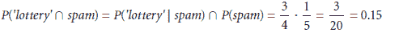

+   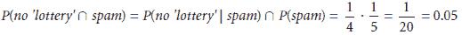

+   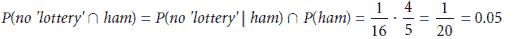

+   

这些概率总结在图 8.8 中。请注意，边上的概率乘积是右侧的概率。此外，请注意，所有这些四个概率的总和为 1，因为它们涵盖了所有可能的场景。

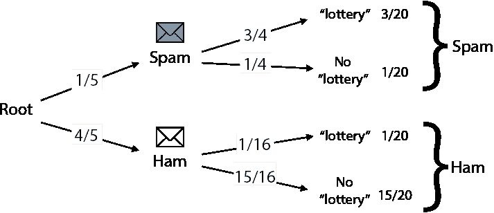

图 8.8 8.6 图中的同一棵树，但现在加入了概率。从根节点出发，有两个分支，一个用于垃圾邮件，一个用于正常邮件。在每个分支中，我们记录相应的概率。每个分支再次分为两个叶子节点：一个用于包含单词*lottery*的邮件，另一个用于不包含它的邮件。在每个分支中，我们记录相应的概率。请注意，这些概率的乘积是每个叶子节点右侧的概率。例如，对于顶部的叶子节点，1/5 · 3/4 = 3/20 = 0.15。

我们几乎完成了。我们想要找到*P*(*spam*|*'lottery'*)，即在邮件包含单词*lottery*的情况下邮件是垃圾邮件的概率。在我们刚刚研究的四个事件中，只有两个事件出现了单词*lottery*。因此，我们只需要考虑这些，即：

+   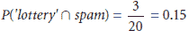

+   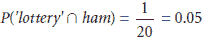

换句话说，我们只需要考虑图 8.9 中显示的两个分支——第一个和第三个，即包含单词*lottery*的邮件。

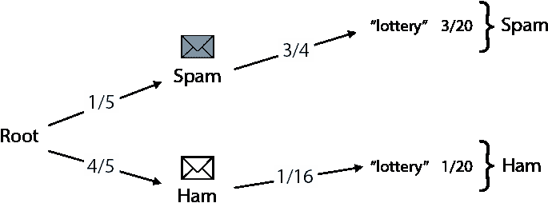

图 8.9 从图 8.8 中的树中，我们移除了不包含单词 *lottery* 的两个分支。

第一个是一个邮件是垃圾邮件的概率，第二个是邮件是正常邮件（ham）的概率。这两个概率相加不等于 1。然而，因为我们现在生活在一个邮件包含单词 *lottery* 的世界里，所以这两个是唯一可能的场景。因此，它们的概率应该相加等于 1。此外，它们应该仍然保持相同的相对比例。解决这个问题的方式是归一化——找到两个彼此之间保持相同相对比例的数字，就像 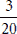 和 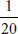 那样，但它们的和为 1。找到这些数字的方法是将它们各自除以它们的和。在这种情况下，数字变成了 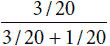 和 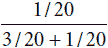。它们简化为 3/4 和 1/4，这就是我们想要的概率。因此，我们得出以下结论：

+   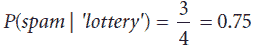

+   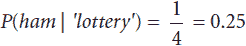

这正是我们在计算邮件时得出的结论。为了总结这些信息，我们需要一个公式。我们有两个概率：一封邮件是垃圾邮件并且包含单词 *lottery* 的概率，以及一封邮件是垃圾邮件但不包含单词 *lottery* 的概率。为了使它们相加等于 1，我们对它们进行了归一化。这相当于将它们各自除以它们的和。用数学术语来说，我们做了以下操作：

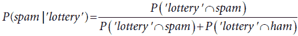

如果我们记得这两个概率是什么，使用乘法法则，我们得到以下结果：

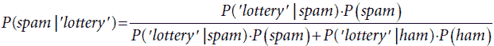

为了验证，我们将数字代入得到：

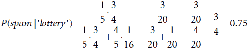

这就是贝叶斯定理的公式！更正式地说：

贝叶斯定理 对于事件 E 和 F，

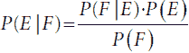

因为事件 *F* 可以分解为两个不相交的事件 *F*|*E* 和 *F*|*E*^c，所以

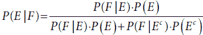

那么对于两个单词呢？朴素贝叶斯算法

在上一节中，我们计算了当邮件包含关键字 *lottery* 时，邮件是垃圾邮件的概率。然而，字典中包含许多更多的单词，我们希望计算邮件包含几个单词时，邮件是垃圾邮件的概率。正如你所想象的那样，计算变得更加复杂，但在本节中，我们学习了一个帮助我们估计这个概率的技巧。

通常，这个技巧帮助我们基于两个事件而不是一个事件来计算后验概率（并且它很容易推广到两个以上事件）。它基于以下前提：当事件是独立的，两个事件同时发生的概率是它们概率的乘积。事件并不总是独立的，但假设它们有时是独立的，这有助于我们做出良好的近似。例如，想象以下场景：有一个有 1000 人的岛屿。岛上的居民中有一半（500 人）是女性，十分之一（100 人）有棕色眼睛。你认为有多少居民是女性且有棕色眼睛？如果我们只知道这些信息，我们就无法找出答案，除非我们亲自计数。然而，如果我们假设性别和眼睛颜色是独立的，那么我们可以估计，十分之一的一半的人口是由女性和棕色眼睛的人组成。也就是说，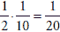的人口。因为总人口是 1000 人，我们对于女性棕色眼睛人数的估计是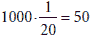人。也许我们会去岛屿上并发现情况并非如此，但根据我们*所知最好的情况*，50 是一个很好的估计。有人可能会说，我们对性别和眼睛颜色独立性的假设是*天真*的，也许它确实是，但这是在给定信息的情况下我们能做出的最佳估计。

在上一个例子中我们使用的规则是独立概率的乘法法则，它表述如下：

独立概率的乘法法则 如果两个事件 *E* 和 *F* 是独立的，即一个事件的发生不会以任何方式影响另一个事件的发生，那么两个事件同时发生的概率（事件的交集）是每个事件概率的乘积。换句话说，

*P*(*E* ∩ *F*) = *P*(*E*) · *P*(*F*).

回到电子邮件的例子。在我们计算出包含“彩票”一词的电子邮件是垃圾邮件的概率后，我们注意到另一个词“销售”也经常出现在垃圾邮件中。我们想要找出包含“彩票”和“销售”两个词的电子邮件是垃圾邮件的概率。我们首先计算包含“销售”一词的垃圾邮件和正常邮件的数量，发现它在 20 封垃圾邮件中的 6 封和 80 封正常邮件中的 4 封中出现。因此，概率如下（如图 8.10 所示）：

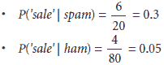

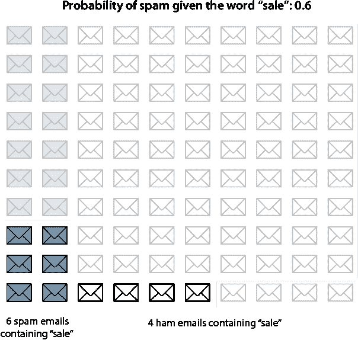

图 8.10 在与“彩票”一词类似的计算中，我们查看包含“销售”一词的电子邮件。在这些（未灰显的）电子邮件中，有六个垃圾邮件和四个正常邮件。

可以再次使用贝叶斯定理来得出结论，即一个电子邮件包含单词 *销售* 时是垃圾邮件的概率为 0.6，我鼓励你自己进行计算。然而，更重要的问题是：一个电子邮件同时包含单词 *彩票* 和 *销售* 时是垃圾邮件的概率是多少？在我们进行这个计算之前，让我们先找出一个电子邮件包含单词 *彩票* 和 *销售* 时它是垃圾邮件的概率。这应该很容易：我们查看所有电子邮件，找出有多少垃圾邮件包含这两个单词。

然而，我们可能会遇到没有包含单词 *彩票* 和 *销售* 的电子邮件的问题。我们只有 100 封电子邮件，当我们试图在这封电子邮件上找到两个单词时，我们可能没有足够的样本来正确估计概率。我们能做什么呢？一个可能的解决方案是收集更多的数据，直到我们拥有如此多的电子邮件，以至于有可能其中一些包含这两个单词。然而，可能的情况是我们无法收集更多的数据，所以我们只能利用我们已有的数据。这就是天真假设能帮到我们的地方。

让我们尝试以与我们在本节开头估计岛屿上棕色眼睛女性数量相同的方式估计这个概率。我们知道，根据前一小节，单词 *彩票* 出现在垃圾邮件中的概率是 0.75。在本节较早的部分，*销售* 出现在垃圾邮件中的概率是 0.6。因此，如果我们天真地假设这两个单词的出现是独立的，那么这两个单词同时出现在垃圾邮件中的概率是 0.75 · 0.3 = 0.225。以类似的方式，因为我们计算出包含单词 *彩票* 的火腿邮件的概率是 0.0625，包含单词 *销售* 的概率是 0.05，那么包含这两个单词的火腿邮件的概率是 0.0625 · 0.05 = 0.003125。换句话说，我们已经做了以下估计：

+   *P*(*'彩票'*, *'销售'*|*垃圾邮件*) = *P*(*'彩票'*|*垃圾邮件*) *P*(*'销售'*|*垃圾邮件*) = 0.75 · 0.3 = 0.225

+   *P*(*'彩票'* , *'销售'*|*火腿*) = *P*(*'彩票'*|*火腿*) *P*(*'销售'*|*火腿*) = 0.0625 · 0.05 = 0.003125

我们所做天真假设如下：

天真假设：电子邮件中出现的单词彼此完全独立。换句话说，一个特定单词在电子邮件中的出现不会以任何方式影响另一个单词的出现。

很可能，这种天真假设是不正确的。一个词的出现有时会极大地影响另一个词的出现。例如，如果一个电子邮件包含单词 *盐*，那么在这个电子邮件中出现 *胡椒* 的可能性就更大，因为它们经常一起出现。这就是我们的假设之所以天真。然而，实际上这个假设效果很好，它极大地简化了我们的数学计算。这被称为概率乘法定律，如图 8.11 所示。

现在我们有了概率的估计值，我们继续寻找包含单词*lottery*和*sale*的垃圾邮件和正常邮件的期望数量。

+   因为有 20 封垃圾邮件，且垃圾邮件同时包含这两个单词的概率是 0.45，所以同时包含这两个单词的垃圾邮件的期望数量是 20 · 0.225 = 4.5。

+   同样，有 80 封正常邮件，且正常邮件同时包含这两个单词的概率是 0.00325，所以同时包含这两个单词的正常邮件的期望数量是 80 · 0.00325 = 0.25。

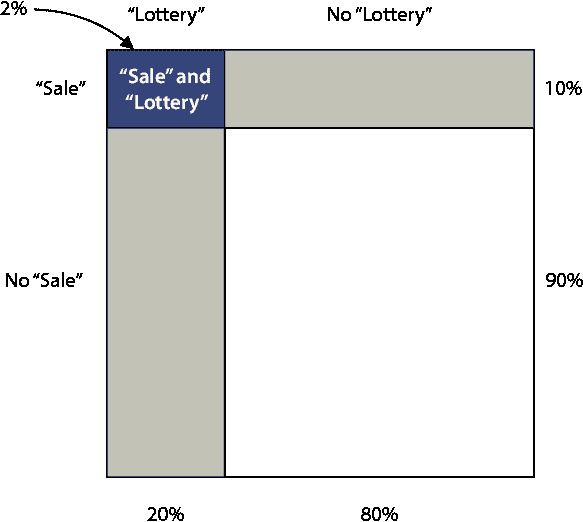

图 8.11 假设有 20%的邮件包含单词*lottery*，10%的邮件包含单词*sale*。我们做出一个简单的假设，即这两个单词相互独立。在这个假设下，包含这两个单词的邮件的百分比可以估计为 2%，即 20%和 10%的乘积。

之前的计算表明，如果我们只将数据集限制为包含单词*lottery*和*sale*的邮件，我们预计其中 4.5 封是垃圾邮件，0.25 封是正常邮件。因此，如果我们随机从中选择一封，选择到垃圾邮件的概率是多少？这看起来可能比整数更难，但如果我们看图 8.12，这可能会更清楚。我们有 4.5 封垃圾邮件和 0.25 封正常邮件（这正好是四分之一封邮件）。如果我们扔一个飞镖，它落在邮件上，那么它落在垃圾邮件上的概率是多少？嗯，邮件的总数（或者如果你愿意这样想象，总面积）是 4.5 + 0.25 = 4.75。因为 4.5 是垃圾邮件，飞镖落在垃圾邮件上的概率是 4.5/4.75 = 0.9474。这意味着包含单词*lottery*和*sale*的邮件有 94.74%的概率是垃圾邮件。这相当高！

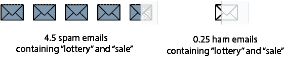

图 8.12 我们有 4.5 封垃圾邮件和 0.25 封正常邮件。我们扔一个飞镖，它击中了一封邮件。击中垃圾邮件的概率是多少？答案是 94.74%。

我们在这里使用概率论，运用贝叶斯定理，除了事件

+   *E* = *lottery* ∩ *sale*

+   *F* = *spam*

得到公式

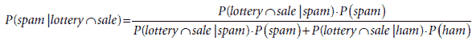

然后，我们（天真地）假设单词*lottery*和*sale*在垃圾邮件（和正常邮件）中的出现是独立的，得到以下两个公式：

*P*(*lottery* ∩ *sale*|*spam*) = *P*(*lottery*|*spam*) · *P*(*sale*|*spam*)

*P(lottery* ∩ *sale | ham) = P(lottery | ham)* · *P(sale | ham)*

将它们代入前面的公式，我们得到

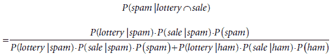

最后，代入以下值：

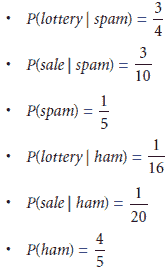

我们得到

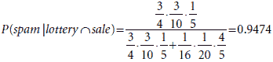

那么，如果有超过两个单词呢？

在一般情况下，邮件有*n*个单词*x*[1]，*x*[2]，… ，*x*[n]。贝叶斯定理表明，给定邮件包含单词*x*[1]，*x*[2]，… ，*x*[n]，邮件是垃圾邮件的概率是


在前面的方程中，我们移除了交集符号，并用逗号替换了它。朴素假设是所有这些单词的出现是独立的。因此，

*P*(*x*[1], *x*[2], … , *x*[n] | *spam*) = *P*(*x*[1] | *spam*) *P*(*x*[2] | *spam*) … *P*(*x*[n] | *spam*)

和

*P*(*x*[1], *x*[2], … , *x*[n] | *ham*) = *P*(*x*[1] | *ham*) *P*(*x*[2] | ham) … *P*(*x*[n] | *ham*).

将最后三个方程组合起来，我们得到


右侧的每个量都很容易估计为电子邮件数量的比率。例如，*P*(*x*[i] | *spam*) 是包含单词 *x*[i] 的垃圾邮件数量与垃圾邮件总数之间的比率。

作为一个小例子，假设电子邮件中包含单词 *lottery*、*sale* 和 *mom*。我们检查单词 *mom* 并注意到它在 20 封垃圾邮件中只出现了一次，在 80 封正常邮件中有 10 次。因此，*P*(*'mom'*|*spam*) = 1/20 和 *P*(*'mom'*|*ham*) = 1/8。使用与上一节相同的单词 *lottery* 和 *sale* 的概率，我们得到以下结果：


注意，将单词 *mom* 加入方程中，将垃圾邮件的概率从 94.74%降低到 87.80%，这是有道理的，因为这个单词在正常邮件中比在垃圾邮件中更可能出现。

## 使用真实数据构建垃圾邮件检测模型

现在我们已经开发出了算法，让我们挽起袖子编写朴素贝叶斯算法。Scikit-Learn 等几个包对这个算法有很好的实现，我鼓励你看看它们。然而，我们将手动编写它。我们使用的数据集来自 Kaggle，有关下载链接，请查看附录 C 中本章的资源。以下是本节的代码：

+   **笔记**: Coding_naive_Bayes.ipynb

    +   [`github.com/luisguiserrano/manning/blob/master/Chapter_8_Naive_Bayes/Coding_naive_Bayes.ipynb`](https://github.com/luisguiserrano/manning/blob/master/Chapter_8_Naive_Bayes/Coding_naive_Bayes.ipynb)

+   **数据集**: emails.csv

对于这个例子，我们将介绍一个用于处理大型数据集的有用包，称为 Pandas（要了解更多信息，请查看第十三章中的“使用 Pandas 加载数据集”部分）。在 pandas 中存储数据集的主要对象是 DataFrame。要将我们的数据加载到 Pandas DataFrame 中，我们使用以下命令：

```
import pandas
emails = pandas.read_csv('emails.csv')
```

在表 8.1 中，你可以看到数据集的前五行。

这个数据集有两个列。第一列是电子邮件的文本（包括其主题行），以字符串格式表示。第二列告诉我们电子邮件是否是垃圾邮件（1）或正常邮件（0）。首先我们需要做一些数据预处理。

表 8.1：我们电子邮件数据集的前五行。文本列显示了每封电子邮件中的文本，垃圾邮件列显示如果电子邮件是垃圾邮件则为 1，如果是正常邮件则为 0。请注意，前五封电子邮件都是垃圾邮件。

| 文本 | 垃圾邮件 |
| --- | --- |
| 主题：自然吸引你的企业... | 1 |
| 主题：股票交易枪手 fanny i... | 1 |
| 主题：难以置信的新家园制作简单... | 1 |
| 主题：4 色打印特殊请求添加... | 1 |
| 主题：没有钱，获取软件 cds... | 1 |

数据预处理

让我们先从将文本字符串转换为单词列表开始。我们使用以下函数来完成这项工作，该函数使用`lower()`函数将所有单词转换为小写，并使用`split()`函数将单词转换为列表。我们只检查每个单词是否出现在电子邮件中，而不管它出现多少次，所以我们将其转换为集合，然后再转换为列表。

```
def process_email(text):
text = text.lower()
return list(set(text.split()))
```

现在我们使用`apply()`函数将此更改应用于整个列。我们将新列命名为 emails['words']。

```
emails['words'] = emails['text'].apply(process_email)
```

修改后的电子邮件数据集的前五行如表 8.2 所示。

表 8.2 带有新列“Words”的电子邮件数据集，其中包含电子邮件中的单词列表（不重复）和主题行

| 文本 | 垃圾邮件 | 单词 |
| --- | --- | --- |
| 主题：自然吸引你的企业... | 1 | [letsyou, all, do, but, list, is, information,... |
| 主题：股票交易枪手 fanny i... | 1 | [not, like, duane, trading, libretto, attainde... |
| 主题：难以置信的新家园制作简单... | 1 | [im, have, $, take, foward, all, limited, subj... |
| 主题：4 色打印特殊请求添加... | 1 | [color, azusa, pdf, printable, 8102, subject:,... |
| 主题：没有钱，获取软件 cds... | 1 | [get, not, have, all, do, subject:, be, by, me... |

寻找先验概率

首先，我们需要找到一封电子邮件是垃圾邮件的概率（即先验概率）。为此，我们计算垃圾邮件的数量，并将其除以总邮件数量。请注意，垃圾邮件的数量是垃圾邮件列中条目的总和。以下行将完成这项工作：

```
sum(emails['spam'])/len(emails)
0.2388268156424581
```

我们推断出，电子邮件是垃圾邮件的先验概率大约为 0.24。这是如果我们对电子邮件一无所知时，电子邮件是垃圾邮件的概率。同样，电子邮件是正常邮件的先验概率大约为 0.76。

使用贝叶斯定理寻找后验概率

我们需要找到垃圾邮件（和正常邮件）包含特定单词的概率。我们同时为所有单词计算这些概率。以下函数创建了一个名为 model 的字典，记录了每个单词，以及该单词在垃圾邮件和正常邮件中出现的次数：

```
model = {}

for index, email in emails.iterrows():
    for word in email['words']:
        if word not in model:
            model[word] = {'spam': 1, 'ham': 1}
        if word in model:
            if email['spam']:
                model[word]['spam'] += 1
            else:
                model[word]['ham'] += 1
```

注意，计数初始化为 1，因此实际上我们记录了垃圾邮件和正常邮件各多一次的出现次数。我们使用这个小技巧来避免出现零计数，因为我们不希望意外地除以零。现在让我们按照以下方式检查字典的一些行：

```
model['lottery']
{'ham': 1, 'spam': 9}

model['sale']
{'ham': 42, 'spam': 39}
```

这意味着单词*lottery*出现在 1 封正常邮件和 9 封垃圾邮件中，而单词*sale*出现在 42 封正常邮件和 39 封垃圾邮件中。尽管这个字典没有包含任何概率，但可以通过将第一个条目除以两个条目的总和来推断这些概率。因此，如果一封邮件包含单词 lottery，那么它是垃圾邮件的概率是 ，如果它包含单词 sale，那么它是垃圾邮件的概率是 。

实现朴素贝叶斯算法

算法的输入是邮件。它遍历邮件中的所有单词，并对每个单词计算包含该单词的垃圾邮件概率和正常邮件概率。这些概率是使用我们在上一节中定义的字典计算的。然后我们乘以这些概率（朴素假设）并应用贝叶斯定理来找到包含特定邮件中单词的邮件是垃圾邮件的概率。使用此模型进行预测的代码如下：

```
def predict_naive_bayes(email):
    total = len(emails)                                      ❶
    num_spam = sum(emails['spam'])
    num_ham = total - num_spam
    email = email.lower()                                    ❷
    words = set(email.split())
    spams = [1.0]
    hams = [1.0]
    for word in words:
        if word in model:
            spams.append(model[word]['spam']/num_spam*total) ❸
            hams.append(model[word]['ham']/num_ham*total)
    prod_spams = np.long(np.prod(spams)*num_spam)            ❹
    prod_hams = np.long(np.prod(hams)*num_ham)
    return prod_spams/(prod_spams + prod_hams)               ❺ 
```

❶ 计算总邮件数、垃圾邮件数和正常邮件数

❷ 通过将其转换为单词列表（小写）来处理每封邮件

❸ 对于每个单词，计算包含该单词的邮件是垃圾邮件（或正常邮件）的条件概率，作为一个比率

❹ 将所有之前的概率乘以邮件是垃圾邮件的先验概率，并称这个结果为 prod_spams。对 prod_hams 执行类似的过程。

❺ 对这两个概率进行归一化，使它们相加等于 1（使用贝叶斯定理），并返回结果

你可能会注意到，在前面的代码中，我们使用了另一个小的技巧。每个概率都乘以数据集中邮件的总数。这个因素不会影响我们的计算，因为该因素同时出现在分子和分母中。然而，它确实确保了我们的概率乘积对于 Python 来说不是太小，可以处理。

现在我们已经建立了模型，让我们通过在邮件上进行预测来测试它，如下所示：

```
predict_naive_bayes('Hi mom how are you')
0.12554358867163865

predict_naive_bayes('meet me at the lobby of the hotel at nine am')
0.00006964603508395

predict_naive_bayes('buy cheap lottery easy money now')
0.9999734722659664

predict_naive_bayes('asdfgh')
0.2388268156424581
```

它似乎工作得很好。像“hi mom how are you”这样的邮件被判定为垃圾邮件的概率很低（大约 0.12），而像“buy cheap lottery easy money now”这样的邮件被判定为垃圾邮件的概率非常高（超过 0.99）。注意，最后一封邮件没有包含字典中的任何单词，其概率为 0.2388，这正是先验概率。

进一步工作

这是对朴素贝叶斯算法的快速实现。但对于更大的数据集和更大的邮件，我们应该使用一个包。像 Scikit-Learn 这样的包提供了对朴素贝叶斯算法的优秀实现，具有许多可调整的参数。探索这个和其他包，并在所有类型的数据集上使用朴素贝叶斯算法！

## 摘要

+   贝叶斯定理是概率论、统计学和机器学习中广泛使用的技术。

+   贝叶斯定理包括根据先验概率和事件来计算后验概率。

+   先验概率是在信息非常有限的情况下对概率的基本计算。

+   贝叶斯定理使用事件来对所讨论的概率做出更好的估计。

+   当想要将先验概率与几个事件结合起来时，使用朴素贝叶斯算法。

+   “天真”这个词来源于我们做出了一个天真的假设，即所讨论的事件都是独立的。

## 练习

练习 8.1

对于每一对事件 A 和 B，确定它们是独立的还是依赖的。对于 (a) 到 (d)，提供数学证明。对于 (e) 和 (f)，提供口头证明。

抛掷三个公平的硬币：

1.  A: 第一个落地为正面。B: 第三个落地为反面。

1.  A: 第一个落地为正面。B: 三次抛掷中有奇数个正面。

    抛掷两个骰子：

1.  A: 第一个显示 1。B: 第二个显示 2。

1.  A: 第一个显示 3。B: 第二个显示的值比第一个高。

    对于以下内容，提供口头证明。假设对于这个问题，我们生活在一个有季节的地方。

1.  A: 外面在下雨。B: 今天是星期一。

1.  A: 外面在下雨。B: 今天是六月。

练习 8.2

我们必须定期去一个办公室办理一些文件。这个办公室有两个职员，Aisha 和 Beto。我们知道 Aisha 每周工作三天，Beto 工作其他两天。然而，每周的日程都会改变，所以我们永远不知道 Aisha 在哪三天，Beto 在哪两天。

1.  如果我们在一个随机日子里去办公室，Aisha 是职员的可能性是多少？

    我们从外面看，注意到职员穿着红色的毛衣，尽管我们无法确定谁是职员。我们经常去那个办公室，所以知道 Beto 比 Aisha 更经常穿红色。事实上，Aisha 每三天穿一次红色（三分之一的时间），Beto 每两天穿一次红色（一半的时间）。

1.  知道今天职员穿着红色毛衣的情况下，Aisha 是职员的可能性是多少？

练习 8.3

以下是一组测试过 COVID-19 阳性或阴性的病人的数据集。他们的症状是咳嗽（C）、发烧（F）、呼吸困难（B）和疲劳（T）。

|  | 咳嗽（C） | 发烧（F） | 呼吸困难（B） | 疲劳（T） | 诊断 |
| --- | --- | --- | --- | --- | --- |
| 病人 1 |  | X | X | X | 病人 |
| 病人 2 | X | X |  | X | 病人 |
| 病人 3 | X |  | X | X | 病人 |
| 病人 4 | X | X | X |  | 病人 |
| 病人 5 | X |  |  | X | 健康 |
| 病人 6 |  | X | X |  | 健康 |
| 病人 7 |  | X |  |  | 健康 |
| 病人 8 |  |  |  | X | 健康 |

本练习的目的是构建一个朴素贝叶斯模型，从症状预测诊断。使用朴素贝叶斯算法找到以下概率：

注意：对于以下问题，我们没有提到的症状对我们来说完全未知。例如，如果我们知道病人有咳嗽，但没有提到他们的发烧，这并不意味着病人没有发烧。

1.  患者咳嗽的情况下生病的概率

1.  患者不疲劳的情况下生病的概率

1.  患者咳嗽且有发烧的情况下生病的概率

1.  患者咳嗽且有发烧，但没有呼吸困难的情况下生病的概率
