# 9 通过提问来分割数据：决策树

在本章

+   决策树是什么

+   使用决策树进行分类和回归

+   使用用户信息构建应用推荐系统

+   准确率、基尼指数和熵，以及它们在构建决策树中的作用

+   使用 Scikit-Learn 在大学录取数据集上训练决策树


在本章中，我们介绍决策树。决策树是强大的分类和回归模型，同时也为我们提供了大量关于数据集的信息。就像我们在本书中学到的先前模型一样，决策树使用标记数据进行训练，我们想要预测的标签可以是类别（用于分类）或值（用于回归）。在本章的大部分内容中，我们专注于分类决策树，但在本章的末尾，我们描述了回归决策树。然而，这两种类型树的结构和训练过程是相似的。在本章中，我们开发了几个用例，包括一个应用推荐系统和预测大学录取的模型。

决策树遵循直观的过程进行预测——这与人类的推理非常相似。考虑以下场景：我们想决定今天是否应该穿夹克。决策过程看起来像什么？我们可能会向外看并检查是否在下雨。如果下雨，那么我们肯定会穿夹克。如果不下雨，那么我们可能会检查温度。如果天气热，那么我们就不穿夹克，但如果天气冷，那么我们就穿夹克。在图 9.1 中，我们可以看到这个决策过程的图形，其中决策是通过从上到下遍历树来做出的。

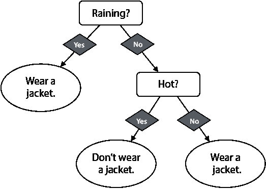

图 9.1 用于决定在给定的一天是否需要穿夹克的决策树。我们通过遍历树向下并选择与每个正确答案对应的分支来做出决定。

我们的决策过程看起来像一棵树，但它是倒置的。树由顶点组成，称为**节点**和边。在最顶部，我们可以看到**根节点**，从中伸出两个分支。每个节点要么有两个或零个分支（边）从中伸出，因此我们称它为**二叉树**。有两个分支从中伸出的节点称为**决策节点**，没有分支从中伸出的节点称为**叶子节点**或**叶子**。这种节点、叶子和边的排列就是我们所说的决策树。树是计算机科学中的自然对象，因为计算机将每个过程分解成一系列二进制操作。

最简单的决策树，称为**决策桩**，由一个决策节点（根节点）和两个叶子组成。这代表了一个简单的是或否问题，基于此我们立即做出决定。

决策树的深度是根节点下方的层数。另一种衡量方法是根节点到叶子节点的最长路径的长度，其中路径的长度由其包含的边数来衡量。图 9.1 中的树深度为 2。决策树桩的深度为 1。

以下是到目前为止我们所学的定义总结：

决策树 基于是或否问题并由二叉树表示的机器学习模型。该树有一个根节点、决策节点、叶子节点和分支。

根节点 树的最顶层节点。它包含第一个是或否问题。为了方便起见，我们称它为*根*。

决策节点 我们模型中的每个是或否问题都由一个决策节点表示，从这个节点延伸出两个分支（一个用于“是”答案，另一个用于“否”答案）。

叶子节点 没有分支从其延伸出的节点。这些代表我们在遍历树后所做的决策。为了方便起见，我们称它们为*叶子*。

分支 从每个决策节点延伸出的两个边，对应于节点中问题的“是”和“否”答案。在本章中，按照惯例，左边的分支对应“是”，右边的分支对应“否”。

深度 决策树中的层数。或者，它也是从根节点到叶子节点的最长路径上的分支数。

在本章中，节点被绘制为边缘圆润的矩形，分支中的答案以菱形表示，叶子以椭圆形表示。图 9.2 展示了决策树的一般外观。

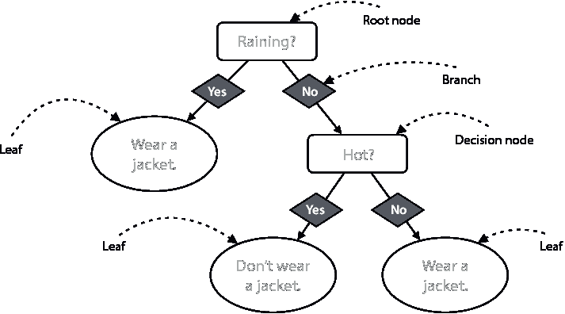

图 9.2 一个带有根节点、决策节点、分支和叶子的常规决策树。请注意，每个决策节点都包含一个是或否问题。从每个可能的答案中，延伸出一个分支，可以引导到另一个决策节点或叶子。这棵树深度为 2，因为从叶子到根的最长路径穿过两个分支。

我们是如何构建这棵树的？为什么我们问的是这些问题？我们还可以检查是否是星期一，是否看到外面的红色汽车，或者我们是否饿了，然后构建以下决策树：

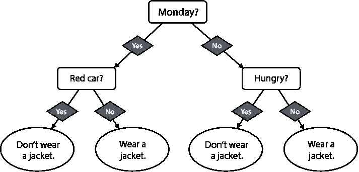

图 9.3 我们可以用第二个（可能不是那么好）的决策树来决定在给定的一天是否要穿夹克

当涉及到决定是否穿夹克时，我们认为哪棵树更好：树 1（图 9.1）还是树 2（图 9.3）？嗯，作为人类，我们有足够的经验来判断树 1 对于这个决定比树 2 好得多。计算机会如何知道呢？计算机本身没有经验，但它们有类似的东西，那就是数据。如果我们想像计算机一样思考，我们可以只是遍历所有可能的树，尝试每一棵树一段时间——比如说，一年——然后通过计算我们使用每一棵树做出正确决定的次数来比较它们的性能。我们可以想象，如果我们使用树 1，我们大多数日子都是正确的，而如果我们使用树 2，我们可能会在寒冷的一天没有穿夹克，或者在极其炎热的一天穿上了夹克。计算机所需要做的就是遍历所有树，收集数据，并找到最好的那一棵，对吧？

几乎是！不幸的是，即使是对于计算机来说，搜索所有可能的树以找到最有效的一棵树也会花费非常长的时间。但是幸运的是，我们有使这种搜索变得更快的方法，因此，我们可以使用决策树进行许多奇妙的应用，包括垃圾邮件检测、情感分析和医疗诊断。在本章中，我们将介绍一种快速构建良好决策树的方法。简而言之，我们一次构建一个节点，从顶部开始。为了选择与每个节点相对应的正确问题，我们考虑所有可能的问题，并选择那些出现次数最多的一个问题。这个过程如下所示：

选择一个好的第一个问题

我们需要为树的根选择一个好的第一个问题。什么是一个好的问题，可以帮助我们决定在给定的一天是否要穿夹克？最初，它可以是任何问题。让我们假设我们为第一个问题想出了五个候选问题：

1.  天气在下雨吗？

1.  外面冷吗？

1.  我饿吗？

1.  外面有红色的车吗？

1.  是星期一吗？

在这五个问题中，哪一个看起来最适合帮助我们决定是否应该穿夹克？我们的直觉告诉我们，最后三个问题对我们做出决定没有帮助。让我们假设，根据经验，我们发现前两个问题中，第一个更有用。我们使用这个问题开始构建我们的树。到目前为止，我们有一个简单的决策树，或者称为决策桩，由那个单一的问题组成，如图 9.4 所示。

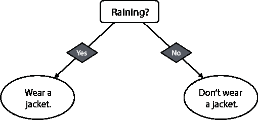

图 9.4 一个简单的决策树（决策桩），它只包含一个问题：“天气在下雨吗？”如果答案是肯定的，我们做出的决定是穿上夹克。

我们能否做得更好？想象一下，当我们开始注意到下雨时，穿夹克总是正确的决定。然而，有些天不下雨，不穿夹克就不是正确的决定。这就是问题 2 出现的时候。我们用这个问题来帮助我们，以下是这样做的：在我们确认没有下雨之后，*然后*我们检查

温度，如果天气冷，我们就决定穿夹克。这使得树的左叶子变成一个节点，从这个节点延伸出两个叶子，如图 9.5 所示。

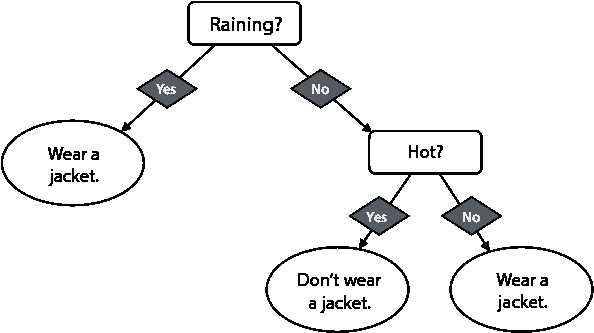

图 9.5：比图 9.4 中的决策树稍微复杂一些，我们在其中选择了一片叶子并将其分割成两个更进一步的叶子。这与图 9.1 中的树是相同的。

现在我们有了我们的决策树。我们能做得更好吗？也许我们可以通过向我们的树中添加更多的节点和叶子来实现。但到目前为止，这个树已经非常有效了。在这个例子中，我们使用我们的直觉和经验来做决定。在本章中，我们将学习一个仅基于数据构建这些树的算法。

你可能会在脑海中涌现出许多问题，例如以下这些问题：

1.  你究竟是如何决定提出哪个最佳问题的？

1.  总是选择最佳可能问题的过程实际上能让我们构建出*最佳*决策树吗？

1.  为什么我们不构建所有可能的决策树，然后从中选择最好的一个呢？

1.  我们会编写这个算法吗？

1.  我们在现实生活中可以在哪里找到决策树？

1.  我们可以看到决策树是如何用于分类的，但它们又是如何用于回归的呢？

本章回答了所有这些问题，但这里有一些快速的答案：

1.  **你究竟是如何决定提出哪个最佳问题的？**

    我们有几种方法可以做到这一点。最简单的一种是使用准确度，这意味着：哪个问题能让我更频繁地做出正确的决定？然而，在本章中，我们还学习了其他方法，例如基尼指数或熵。

1.  **总是选择最佳可能问题的过程实际上能让我们构建出** *最佳* **决策树吗？**

    实际上，这个过程并不能保证我们得到最佳可能的树。这就是我们所说的*贪婪算法*。贪婪算法是这样工作的：在每一个点上，算法做出最佳可能的选择。它们通常工作得很好，但并不是在每一个时间步都做出最佳可能的选择就能得到最佳的整体结果。有时候，提出一个较弱的问题可能会以某种方式对我们的数据进行分组，最终我们得到一个更好的树。然而，构建决策树的算法通常工作得非常好且非常快，所以我们就这样接受了。看看本章中我们看到的所有算法，并尝试找出去除贪婪属性的方法来改进它们！

1.  **为什么我们不构建所有可能的决策树，然后从中选择最好的一个呢？**

    可能的决策树数量非常大，尤其是如果我们的数据集有很多特征。遍历所有这些树会非常慢。在这里，找到每个节点只需要在特征上做线性搜索，而不是在所有可能的树上搜索，这使得它更快。

1.  **我们会编码这个算法吗？**

    这个算法可以手动编码。然而，我们会看到，由于它是递归的，编码可能会有些繁琐。因此，我们将使用一个有用的包 Scikit-Learn，用真实数据构建决策树。

1.  **我们可以在现实生活中找到决策树吗？**

    在许多地方！它们在机器学习中被广泛使用，不仅因为它们工作得非常好，而且因为它们为我们提供了大量关于数据的信息。决策树被使用的某些地方包括在推荐系统中（推荐视频、电影、app、购买产品等），在垃圾邮件分类中（决定一封邮件是否为垃圾邮件），在情感分析中（决定一句话是快乐还是悲伤），以及在生物学中（决定患者是否生病或帮助识别物种或基因组类型中的某些层次结构）。

1.  **我们可以看到决策树是如何进行分类的，但它们又是如何进行回归的呢？**

    回归决策树看起来与分类决策树完全一样，只是叶子节点不同。在分类决策树中，叶子节点有类别，如是或否。在回归决策树中，叶子节点有值，如 4，8.2，或-199。我们的模型做出的预测是在向下遍历树时到达的叶子节点。

本章我们将研究的第一个用例是机器学习中的一个流行应用，也是我最喜欢的之一：推荐系统。

本章的代码可在以下 GitHub 仓库中找到：[`github.com/luisguiserrano/manning/tree/master/Chapter_9_Decision_Trees`](https://github.com/luisguiserrano/manning/tree/master/Chapter_9_Decision_Trees)。

## 问题：我们需要根据用户可能下载的内容向他们推荐 app

推荐系统是机器学习中最为常见和激动人心的应用之一。你是否好奇 Netflix 是如何推荐电影的，YouTube 是如何猜测你可能观看的视频，或者 Amazon 是如何展示你可能感兴趣购买的产品？这些都是推荐系统的例子。一个简单且有趣的方式来观察推荐问题，就是将它们视为分类问题。让我们从一个简单的例子开始：我们自己的使用决策树的 app 推荐系统。

假设我们想要构建一个系统，向用户推荐他们可以在以下选项中下载的 app。我们商店中有以下三个 app（图 9.6）：

+   **原子计数器**：一个用于计算你身体中原子数量的 app

+   **蜂巢寻找者**：一个将你的位置映射并找到最近蜂巢的 app

+   **检查棋局**：一个用于寻找澳大利亚棋手的 app


图 9.6 我们推荐的三款应用：Atom Count，一款用于计算你体内原子数量的应用；Beehive Finder，一款用于定位你位置附近蜂箱的应用；以及 Check Mate Mate，一款用于寻找你所在地区澳大利亚棋手的应用

训练数据是一个表格，包含用户使用的平台（iPhone 或 Android）、他们的年龄以及他们下载的应用（在现实生活中有更多平台，但为了简单起见，我们假设只有这两种选项）。我们的表格包含六个人，如表 9.1 所示。

表 9.1 一个应用商店的用户数据集。对于每个客户，我们记录他们的平台、年龄和他们下载的应用。

| 平台 | 年龄 | 应用 |
| --- | --- | --- |
| iPhone | 15 | Atom Count |
| iPhone | 25 | Check Mate Mate |
| Android | 32 | Beehive Finder |
| iPhone | 35 | Check Mate Mate |
| Android | 12 | Atom Count |
| Android | 14 | Atom Count |

给定这个表格，你会向以下三位客户推荐哪个应用？

+   **客户 1**：一位 13 岁的 iPhone 用户

+   **客户 2**：一位 28 岁的 iPhone 用户

+   **客户 3**：一位 34 岁的 Android 用户

我们应该采取以下措施：

**客户 1**：一位 13 岁的 iPhone 用户。对于这位客户，我们应该推荐 Atom Count，因为从这些青少年客户（三个）来看，年轻人似乎更倾向于下载 Atom Count。

**客户 2**：一位 28 岁的 iPhone 用户。对于这位客户，我们应该推荐 Check Mate Mate，因为从数据集中两位 iPhone 用户（年龄分别为 25 岁和 35 岁）来看，他们都下载了 Check Mate Mate。

**客户 3**：一位 34 岁的 Android 用户。对于这位客户，我们应该推荐 Beehive Finder，因为在数据集中有一位 32 岁的 Android 用户下载了 Beehive Finder。

然而，逐个客户进行操作似乎是一项繁琐的工作。接下来，我们将构建一个决策树来一次性处理所有客户。

## 解决方案：构建一个应用推荐系统

在本节中，我们将看到如何使用决策树构建一个应用推荐系统。简而言之，构建决策树的算法遵循以下步骤：

1.  确定哪些数据对于决定推荐哪个应用最有用。

1.  这个特征将数据分割成两个更小的数据集。

1.  对每个较小的数据集重复步骤 1 和 2。

换句话说，我们所做的是决定两个特征（平台或年龄）中哪一个更成功地决定了用户会下载哪个应用，并选择这个作为我们的决策树的根。然后，我们遍历分支，始终选择该分支数据中最具决定性的特征，从而构建我们的决策树。

构建模型的第一步：提出最佳问题

构建我们的模型的第一步是找出最有用的特征：换句话说，最有用的提问。首先，让我们稍微简化我们的数据。让我们称 20 岁以下的人为“青年”，20 岁及以上的人为“成人”（别担心——我们很快就会回到原始数据集，在“使用连续特征（如年龄）划分数据”部分）。我们的修改后的数据集如表 9.2 所示。

表 9.2 表 9.1 中数据集的简化版本，其中年龄列已简化为两个类别，“青年”和“成人”

| 平台 | 年龄 | 应用 |
| --- | --- | --- |
| iPhone | 青年 | Atom Count |
| iPhone | 成人 | Check Mate Mate |
| Android | 成人 | Beehive Finder |
| iPhone | 成人 | Check Mate Mate |
| Android | 青年 | Atom Count |
| Android | 青年 | Atom Count |

决策树的基本构建块是形式为“用户是否使用 iPhone？”或“用户是否是青年？”的问题。我们需要其中之一作为树的根。我们应该选择哪一个？我们应该选择最能确定他们下载的应用的问题。为了决定哪个问题在这方面更好，让我们比较它们。

第一个问题：用户使用的是 iPhone 还是 Android？

这个问题将用户分为两组，iPhone 用户和 Android 用户。每组都有三个用户。但我们需要跟踪每个用户下载了哪个应用。快速查看表 9.2 可以帮助我们注意到以下内容：

+   在 iPhone 用户中，有一个人下载了 Atom Count，两个人下载了 Check Mate Mate。

+   在 Android 用户中，有两个人下载了 Atom Count，一个人下载了 Beehive Finder。

结果决策树桩如图 9.7 所示。

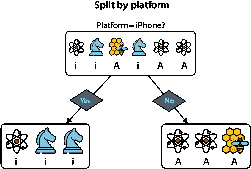

图 9.7 如果我们按平台划分我们的用户，我们得到以下划分：iPhone 用户在左侧，Android 用户在右侧。在 iPhone 用户中，有一个人下载了 Atom Count，两个人下载了 Check Mate Mate。在 Android 用户中，有两个人下载了 Atom Count，一个人下载了 Beehive Finder。

现在，让我们看看如果我们按年龄划分会发生什么。

第二个问题：用户是青年还是成人？

这个问题将用户分为两组，青年和成人。再次，每组都有三个用户。快速查看表 9.2 可以帮助我们注意到每个用户下载了什么，如下所示：

+   青年用户都下载了 Atom Count。

+   在成人用户中，有两个人下载了 Atom Count，一个人下载了 Beehive Finder。

结果决策树桩如图 9.8 所示。

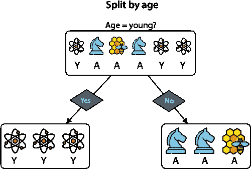

图 9.8 如果我们按年龄划分我们的用户，我们得到以下划分：青年在左侧，成人在右侧。在青年用户中，所有三个都下载了 Atom Count。在成人用户中，一个人下载了 Beehive Finder，两个人下载了 Check Mate Mate。

从图 9.7 和 9.8 中看，哪一个看起来是更好的分割？似乎第二个（基于年龄）更好，因为它注意到了所有三个年轻人下载了 Atom Count 的事实。但我们需要计算机来确定年龄是一个更好的特征，所以我们会给它一些数字来比较。在本节中，我们学习三种比较这两种分割的方法：准确率、吉尼不纯度和熵。让我们从第一个开始：准确率。

准确率：我们的模型有多正确？

我们在第七章学习了准确率，但这里有一个简短的回顾。准确率是正确分类的数据点数占总数据点数的比例。

假设我们只被允许问一个问题，并且必须通过这个问题来确定向用户推荐哪个应用。我们有以下两个分类器：

+   **分类器** 1：询问“你使用什么平台？”然后根据这个信息确定推荐哪个应用

+   **分类器 2**：询问“你多大年龄？”然后根据这个信息确定推荐哪个应用

让我们更仔细地看看分类器。关键观察结果是：如果我们必须通过只问一个问题来推荐一个应用，我们最好的选择是查看所有给出相同答案的人，并推荐他们中最常见的应用。

**分类器 1**：你使用什么平台？

+   如果答案是“iPhone”，那么我们会注意到在所有 iPhone 用户中，大多数下载了 Check Mate Mate。因此，我们向所有 iPhone 用户推荐 Check Mate Mate。我们正确率是**三分之二**。

+   如果答案是“Android”，那么我们会注意到在所有 Android 用户中，大多数下载了 Atom Count，所以我们向所有 Android 用户推荐这个应用。我们正确率是**三分之二**。

**分类器 2**：你多大年龄？

+   如果答案是“年轻”，那么我们会注意到所有年轻人下载了 Atom Count，所以我们做出这个推荐。我们正确率是**三次三**。

+   如果答案是“成人”，那么我们会注意到在所有成人中，大多数下载了 Check Mate Mate，所以我们推荐这个应用。我们正确率是**三分之二**。

注意到分类器 1 有**四次六次正确**，分类器 2 有**五次六次正确**。因此，对于这个数据集，分类器 2 更好。在图 9.9 中，你可以看到这两个分类器及其准确率。注意，问题被重新措辞，以便它们有是或否的答案，这不会改变分类器或结果。

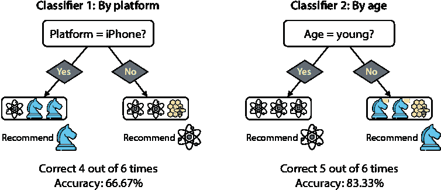

图 9.9 中，分类器 1 使用平台，分类器 2 使用年龄。为了在每个叶节点上进行预测，每个分类器都会选择该叶节点样本中最常见的标签。分类器 1 有四次是正确的，分类器 2 有五次是正确的。因此，基于准确率，分类器 2 表现更好。

吉尼不纯度指数：我的数据集有多多样？

*基尼不纯度指数*，或*基尼指数*，是我们比较平台和年龄分割的另一种方法。基尼指数是数据集中多样性的度量。换句话说，如果我们有一个所有元素都相似的集合，这个集合的基尼指数就低，如果所有元素都不同，它就有大的基尼指数。为了清晰起见，考虑以下两组 10 个彩色球（其中任何两个相同颜色的球都是不可区分的）：

+   **集合 1**：八个红色球，两个蓝色球

+   **集合 2**：四个红色球，三个蓝色球，两个黄色球，一个绿色球

集合 1 看起来比集合 2 更纯净，因为集合 1 主要包含红色球和一些蓝色球，而集合 2 有许多不同的颜色。接下来，我们制定一个不纯度的度量标准，将低值分配给集合 1，将高值分配给集合 2。这个不纯度度量标准依赖于概率。考虑以下问题：

如果我们从集合中随机抽取两个元素，它们颜色不同的概率是多少？这两个元素不需要是不同的；我们允许重复抽取同一个元素。

对于集合 1，这个概率较低，因为集合中的球颜色相似。对于集合 2，这个概率较高，因为集合多样化，如果我们抽取两个球，它们很可能是不同颜色的。

不同颜色的。让我们计算这些概率。首先，注意根据互补概率定律（见第八章“数学刚刚发生了什么？”部分），我们抽取两个不同颜色球的概率是 1 减去我们抽取两个相同颜色球的概率：

P(抽取两个不同颜色的球) = 1 – P(抽取两个相同颜色的球)

现在让我们计算抽取两个相同颜色球的概率。考虑一个一般的集合，其中球有 *n* 种颜色。让我们称它们为颜色 1，颜色 2，一直到颜色 *n*。因为两个球必须属于这 *n* 种颜色之一，所以抽取两个相同颜色球的概率是抽取每种颜色两个球的概率之和：

P(抽取两个相同颜色的球) = P(两个球都是颜色 1) + P(两个球都是颜色 2) + … + P(两个球都是颜色 *n*)

我们在这里使用的是不相交概率的求和规则，该规则如下：

不相交概率的求和规则 如果两个事件 *E* 和 *F* 是不相交的，即它们永远不会同时发生，那么其中一个发生（事件的并集）的概率是每个事件概率的和。换句话说，

*P*(*E* ∪ *F*) = *P*(*E*) + *P*(*F*)

现在，让我们计算两个球颜色相同的概率，对于每种颜色。注意，我们完全独立地抽取每个球。因此，根据独立概率的乘法法则（第八章的“数学发生了什么？”部分），两个球都是颜色 1 的概率是抽取一个球且它为颜色 1 的概率的平方。一般来说，如果 *p*[i] 是我们随机抽取一个球且它为颜色 i 的概率，那么

P(两个球都是颜色 i) = *p*[i]²。

将所有这些公式放在一起（图 9.10），我们得到

P(抽取两个不同颜色的球) = 1 – *p*[1]² – *p*[2]² – … – *p*[n]²。

这个最后的公式是集合的基尼指数。

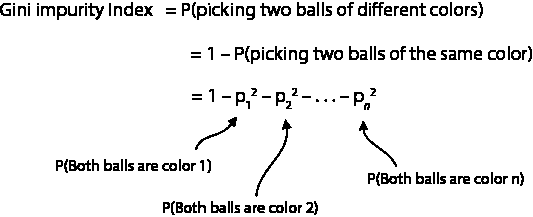

图 9.10 基尼不纯度指数的计算总结

最后，随机抽取一个颜色为 *i* 的球的概率是颜色为 *i* 的球的数量除以球的总数。这导致了基尼指数的正式定义。

基尼不纯度指数 在一个包含 *m* 个元素和 *n* 个类别的集合中，其中 *a*[i] 个元素属于第 *i* 类，基尼不纯度指数是

*Gini* = 1 – *p*[1]² – *p*[2]² – … – *p*[n]²，

其中 *p*[i] = *a*[i] / *m*。这可以解释为如果我们从集合中随机抽取两个元素，它们属于不同类别的概率。

现在，我们可以计算我们两个集合的基尼指数。为了清晰起见，集合 1 的基尼指数计算在图 9.11 中展示（红色和蓝色被黑色和白色替代）。

**集合 1**：{红色，红色，红色，红色，红色，红色，红色，红色，蓝色，蓝色}（八个红色球，两个蓝色球）

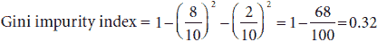

**集合 2**：{红色，红色，红色，红色，蓝色，蓝色，蓝色，黄色，黄色，绿色}

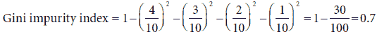

注意，实际上集合 1 的基尼指数大于集合 2 的基尼指数。

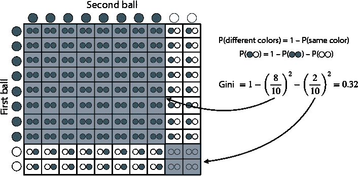

图 9.11 具有八个黑色球和两个白色球的集合的基尼指数计算。注意，如果正方形的总面积为 1，则抽取两个黑色球的概率是 0.8²，抽取两个白色球的概率是 0.2²（这两个用阴影部分表示）。因此，抽取两个不同颜色球的概率是剩余的面积，即 1 – 0.8² – 0.2² = 0.32。这就是基尼指数。

我们如何使用基尼指数来决定两种数据分割方式（年龄或平台）哪种更好？显然，如果我们能将数据分割成两个更纯净的数据集，我们就进行了更好的分割。因此，让我们计算每个叶子的标签集合的基尼指数。查看图 9.12，以下是叶子的标签（我们用每个应用的名称的第一个字母来缩写每个应用）：

分类器 1（按平台分类）：

+   左侧叶子（iPhone）：{A，C，C}

+   右侧叶子（Android）：{A，A，B}

分类器 2（按年龄分类）：

+   左侧叶子（年轻人）：{A，A，A}

+   右侧叶子（成年人）：{B，C，C}

集合 {A, C, C}, {A, A, B}, 和 {B, C, C} 的基尼指数都是相同的：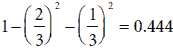。集合 {A, A, A} 的基尼指数为 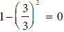。一般来说，纯集合的基尼指数总是 0。为了衡量分割的纯度，我们平均两个叶子的基尼指数。因此，我们得到以下计算：

分类器 1（按平台划分）：

平均基尼指数 = 1/2(0.444+0.444) = 0.444

分类器 2（按年龄划分）：

平均基尼指数 = 1/2(0.444+0) = 0.222


图 9.12 按平台和年龄划分数据集的两种分割方式及其基尼指数计算。注意，按年龄划分数据集给我们两个更小的数据集，它们的平均基尼指数更低。因此，我们选择按年龄划分数据集。

我们得出结论，第二次分割更好，因为它具有更低的平均基尼指数。

旁白：基尼不纯度指数不应与基尼系数混淆。基尼系数在统计学中用于计算国家的收入或财富不平等。在这本书中，每当提到基尼指数时，我们指的是基尼不纯度指数。

熵：另一种衡量多样性的度量，在信息理论中有着广泛的应用

在本节中，我们学习集合中另一种同质性的度量——其熵，它基于熵的物理概念，在概率和信息理论中非常重要。为了理解熵，我们来看一个稍微奇怪的概率问题。考虑与上一节相同的两组彩色球，但将颜色视为一个有序集合。

+   **集合 1**：{红色，红色，红色，红色，红色，红色，红色，红色，蓝色，蓝色}（八个红色球，两个蓝色球）

+   **集合 2**：{红色，红色，红色，红色，蓝色，蓝色，蓝色，黄色，黄色，绿色}（四个红色球，三个蓝色球，两个黄色球，一个绿色球）

现在，考虑以下场景：我们在一个袋子里有集合 1，我们开始从这个袋子中取出球，并且立即将我们刚刚取出的每个球放回袋子中。我们记录我们取出的球的颜色。如果我们这样做 10 次，想象一下我们得到以下序列：

+   红色，红色，红色，蓝色，红色，蓝色，蓝色，红色，红色，红色

这里是定义熵的主要问题：

按照前一段描述的程序进行操作，我们得到定义集合 1 的确切序列 {红色，红色，红色，红色，红色，红色，红色，红色，蓝色，蓝色} 的概率是多少？

这个概率并不很大，因为我们必须非常幸运才能得到这个序列。让我们来计算它。我们有八个红色球和两个蓝色球，所以得到红色球的概率是 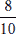 和得到蓝色球的概率是 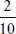。因为所有的抽取都是独立的，得到所需序列的概率是

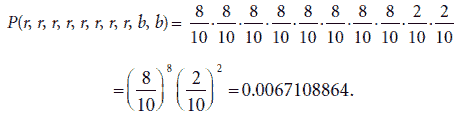。

这非常小，但你能想象集合 2 对应的概率吗？对于集合 2，我们是从一个包含四个红色球、三个蓝色球、两个黄色球和一个绿色球的袋子中取球，并希望获得以下序列：

+   红色，红色，红色，红色，蓝色，蓝色，蓝色，黄色，黄色，绿色。

这几乎是不可能的，因为我们有很多颜色，每种颜色的球并不多。这个概率，以类似的方式计算，是

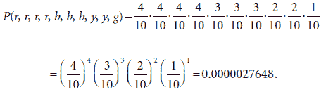.

集合越多样化，我们通过一次取一个球的方式获取原始序列的可能性就越小。相比之下，最纯的集合，其中所有球的颜色都相同，这种方式很容易获得。例如，如果我们的原始集合有 10 个红色球，每次我们随机取一个球，球就是红色的。因此，获取序列 {红色，红色，红色，红色，红色，红色，红色，红色，红色，红色} 的概率是 1。

在大多数情况下，这些数字都非常小——而且这里只有 10 个元素。想象一下，如果我们的数据集有一百万个元素，我们将处理极其小的数字。当我们必须处理非常小的数字时，使用对数是最好的方法，因为它们提供了一种方便的方式来表示小数。例如，0.000000000000001 等于 10^(-15)，所以它在 10 为底的对数是 -15，这是一个更容易处理的好数字。

熵的定义如下：我们从通过一次取一个元素的方式从我们的集合中恢复初始序列的概率开始，这些元素可以重复取。然后我们取对数，并除以集合中元素的总数。因为决策树处理二元决策，我们将使用以 2 为底的对数。我们取对数的负值是因为非常小的数字的对数都是负的，所以我们乘以 -1 来将其转换为正数。因为我们取了负值，所以集合越多样化，熵就越高。

现在我们可以计算两个集合的熵，并使用以下两个恒等式来展开它们：

+   *log*(*ab*) = *log*(*a*) + *log*(*b*)

+   *log*(*a*^c) = *c* *log*(*a*)

**集合 1**: {红色，红色，红色，红色，红色，红色，红色，红色，蓝色，蓝色}（八个红色球，两个蓝色球）


**集合 2**: {红色，红色，红色，红色，蓝色，蓝色，蓝色，黄色，黄色，绿色}

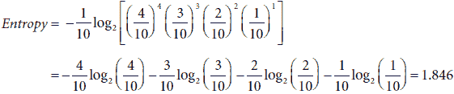

注意到集合 2 的熵大于集合 1 的熵，这意味着集合 2 比集合 1 更具多样性。以下是对熵的正式定义：

在一个包含 *m* 个元素和 *n* 个类别的集合中，其中 *a*[i] 个元素属于第 *i*- 个类别，熵是

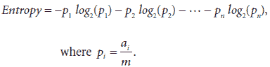

我们可以使用熵来决定在两种分割数据的方式（平台或年龄）中哪一种更好，就像我们使用 Gini 指数时做的那样。经验法则是，如果我们能够将数据分割成两个具有更少组合熵的数据集，我们就已经进行了更好的分割。因此，让我们计算每个叶子标签集合的熵。再次查看图 9.12，以下是叶子的标签（我们用每个应用程序名称的第一个字母来缩写每个应用程序）：

分类器 1（按平台）：

左叶子：{A, C, C}

右叶子：{A, A, B}

分类器 2（按年龄）：

左叶子：{A, A, A}

右叶子：{B, C, C}

集合 {A, C, C}, {A, A, B}, 和 {B, C, C} 的熵都相同：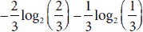。集合 {A, A, A} 的熵为 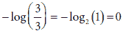。一般来说，所有元素都相同的集合的熵总是 0。为了测量分割的纯度，我们平均两个叶子标签集合的熵，如下所示（如图 9.13 所示）：

分类器 1（按平台）：

平均熵 = 1/2(0.918 + 0.918) = 0.918

分类器 2（按年龄）：

平均熵 = 1/2(0.918+0) = 0.459

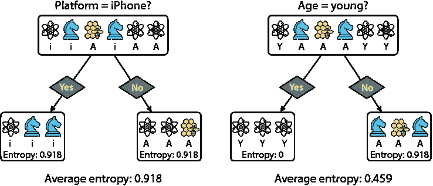

图 9.13 通过平台和年龄分割数据集的两种方式，以及它们的熵计算。注意，通过年龄分割数据集给我们带来了两个平均熵更低的小数据集。因此，我们再次选择通过年龄分割数据集。

因此，我们再次得出结论，第二个分割更好，因为它具有更低的平均熵。

熵是概率论和统计学中的一个极其重要的概念，因为它与信息论有很强的联系，这主要归功于克劳德·香农的工作。事实上，一个称为 *信息增益* 的重要概念正是熵的变化。要了解更多关于这个主题的信息，请参阅附录 C 中的视频和博客文章，它们更详细地介绍了这个主题。

不同大小的类别？没问题：我们可以取加权平均

在前面的章节中，我们学习了如何通过最小化平均 Gini 不纯度指数或熵来实现最佳分割。然而，想象一下，你有一个包含八个数据点的数据集（在训练决策树时，我们也将这些数据点称为样本），并将其分割成两个大小分别为六和二的数据集。正如你可能想象的那样，较大的数据集在 Gini 不纯度指数或熵的计算中应该占更大的比重。因此，我们考虑加权平均，在每一个叶子节点，我们分配对应叶子的点数比例。因此，在这种情况下，我们会将第一个 Gini 不纯度指数（或熵）的权重设为 6/8，第二个的权重为 2/8。图 9.14 展示了一个加权平均 Gini 不纯度指数和加权平均熵的示例。

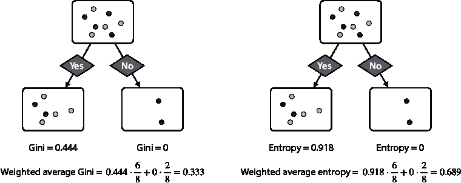

图 9.14 将大小为八的数据集分割成两个大小分别为六和二的数据集。为了计算平均 Gini 指数和平均熵，我们将左侧数据集的指数按 6/8 加权，右侧数据集的指数按 2/8 加权。这导致加权 Gini 指数为 0.333，加权熵为 0.689。

现在我们已经学习了三种方法（准确率、Gini 指数和熵）来选择最佳分割，我们所需做的就是多次迭代此过程以构建决策树！这将在下一节中详细介绍。

建模的第二步：迭代

在上一节中，我们学习了如何使用一个特征以最佳方式分割数据。这是决策树训练过程中的主要内容。要完成构建我们的决策树，我们只剩下多次迭代这一步骤。在本节中，我们将学习如何做到这一点。

使用三种方法，准确率、Gini 指数和熵，我们决定使用“年龄”特征进行最佳分割。一旦我们进行这个分割，我们的数据集就被分割成两个数据集。这两个数据集的分割，包括它们的准确率、Gini 指数和熵，如图 9.15 所示。

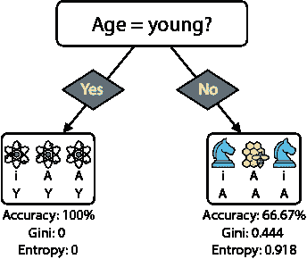

图 9.15 当我们按年龄分割我们的数据集时，我们得到两个数据集。左侧的数据集有三个用户下载了原子计数，右侧的数据集有一个用户下载了蜂巢计数，两个用户下载了检查者计数。

注意左侧的数据集是纯的——所有标签都相同，其准确率为 100%，其 Gini 指数和熵都为 0。我们无法再对此数据集进行分割或改进分类。因此，此节点成为叶子节点，当我们到达该叶子时，我们返回预测“原子计数”。

右侧的数据集仍然可以分割，因为它有两个标签：“蜂巢计数”和“检查者计数”。我们已经使用了年龄特征，所以让我们尝试使用平台特征。结果我们发现我们很幸运，因为安卓用户下载了蜂巢计数，而两个 iPhone 用户下载了检查者计数。因此，我们可以使用平台特征来分割这个叶子，并获得图 9.16 中所示的决策节点。

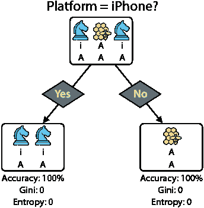

图 9.16 我们可以使用平台来分割图 9.15 中的右叶子，从而获得两个纯数据集。每个数据集的准确率都是 100%，Gini 指数和熵都是 0。

在这次分割后，我们就完成了，因为我们无法进一步改进我们的分割。因此，我们获得了图 9.17 中的树。

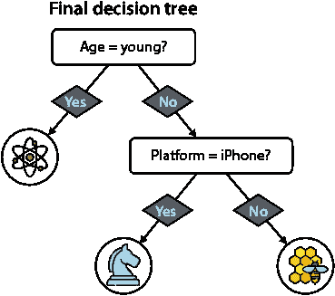

图 9.17 结果决策树有两个节点和三个叶子。此树正确预测了原始数据集中的每个点。

这是我们过程的结束，我们已经构建了一个能够对整个数据集进行分类的决策树。我们几乎有了算法的所有伪代码，除了下一节中我们将看到的某些最终细节。

最后一步：何时停止构建树以及其他超参数

在上一节中，我们通过递归分割我们的数据集来构建决策树。每次分割都是通过选择最佳特征来进行的。这个特征是通过以下任何一种指标找到的：准确率、基尼指数或熵。我们完成分割，当数据集对应于每个叶节点的部分是纯的——换句话说，当它上面的所有样本都有相同的标签时。

在这个过程中可能会出现许多问题。例如，如果我们继续分割我们的数据时间过长，我们可能会陷入一个极端情况，即每个叶节点包含非常少的样本，这可能导致严重的过拟合。防止这种情况的方法是引入一个停止条件。这个条件可以是以下任何一种：

1.  如果准确率、基尼指数或熵的变化低于某个阈值，则不要分割节点。

1.  如果一个节点少于一定数量的样本，则不要分割该节点。

1.  只有当两个结果叶节点都至少包含一定数量的样本时，才分割一个节点。

1.  在达到一定深度后停止构建树。

所有这些停止条件都需要一个超参数。更具体地说，这些是前四个条件的超参数：

1.  准确率（或基尼指数、熵）的最小变化量

1.  一个节点必须具有的最小样本数才能进行分割

1.  叶节点中允许的最小样本数

1.  树的最大深度

我们选择这些超参数的方式要么是经验，要么是通过运行穷举搜索，在搜索中我们寻找不同超参数的组合，并选择在验证集上表现最好的一个。这个过程被称为*网格搜索*，我们将在第十三章的“调整超参数以找到最佳模型：网格搜索”部分更详细地研究它。

决策树算法：如何构建决策树并使用它进行预测

现在我们终于准备好陈述决策树算法的伪代码，这允许我们训练一个决策树来拟合数据集。

决策树算法的伪代码

输入：

+   一个包含其相关标签的样本训练数据集

+   用于分割数据的指标（准确率、基尼指数或熵）

+   一个（或多个）停止条件

输出：

+   一个适合数据集的决策树

程序：

+   添加一个根节点，并将其与整个数据集关联。这个节点具有级别 0。称它为叶节点。

+   重复直到每个叶节点都满足停止条件：

    +   选择最高层的一个叶节点。

    +   遍历所有特征，并选择一个根据所选指标以最佳方式分割该节点对应样本的特征。将该特征与节点关联。

    +   这个特征将数据集分割成两个分支。为每个分支创建两个新的叶节点，并将相应的样本与每个节点关联。

    +   如果停止条件允许分裂，则将节点转换为决策节点，并在其下方添加两个新的叶子节点。如果节点的级别是*i*，则两个新的叶子节点位于*i* + 1 级别。

    +   如果停止条件不允许分裂，则该节点变为叶子节点。为此叶子节点，关联其样本中最常见的标签。该标签就是叶子节点的预测。

返回：

+   获得了决策树。

要使用此树进行预测，我们只需按照以下规则遍历它：

+   向下遍历树。在每个节点，继续沿着由特征指示的方向前进。

+   当到达叶子节点时，预测就是与该叶子节点关联的标签（在训练过程中与该叶子节点关联的样本中最常见的标签）。

这就是我们使用之前构建的应用推荐决策树进行预测的方式。当新用户到来时，我们检查他们的年龄和平台，并采取以下行动：

+   如果用户是年轻人，那么我们推荐他们使用 Atom Count。

+   如果用户是成年人，那么我们检查他们的平台。

    +   如果平台是 Android，那么我们推荐使用 Beehive Count。

    +   如果平台是 iPhone，那么我们推荐 Check Mate Mate。

除此之外，在训练决策树时，文献中包含诸如 Gini 增益和信息增益等术语。Gini 增益是指叶子节点的加权 Gini 不纯度指数与我们要分裂的决策节点的 Gini 不纯度指数（熵）之间的差异。类似地，信息增益是指叶子节点的加权熵与根节点的熵之间的差异。训练决策树最常见的做法是通过最大化 Gini 增益或信息增益。然而，在本章中，我们通过最小化加权 Gini 指数或加权熵来训练决策树。训练过程完全相同，因为决策节点的 Gini 不纯度指数（熵）在整个分裂该决策节点的过程中是恒定的。

## 超越了是/否这类问题

在“解决方案：构建应用推荐系统”这一节中，我们学习了如何构建一个决策树，该决策树适用于一个非常具体的案例，其中每个特征都是分类的二进制特征（意味着它只有两个类别，例如用户的平台）。然而，几乎相同的算法可以用来构建具有更多类别的分类特征决策树（例如狗/猫/鸟）以及具有数值特征（例如年龄或平均收入）的决策树。需要修改的主要步骤是我们分裂数据集的步骤，在本节中，我们将向您展示如何进行。

使用非二进制分类特征（如狗/猫/鸟）分割数据。

回想一下，当我们想要根据二进制特征分割数据集时，我们只需提出一个形式为“特征 X 吗？”的简单是或否问题。例如，当特征是平台时，一个问题可以是“用户是 iPhone 用户吗？”如果我们有一个具有超过两个类别的特征，我们只需提出几个问题。例如，如果输入是一个可能是狗、猫或鸟的动物，那么我们提出以下问题：

+   这动物是狗吗？

+   这动物是猫吗？

+   这动物是鸟吗？

无论特征有多少个类别，我们都可以将其分割成几个二进制问题（图 9.18）。

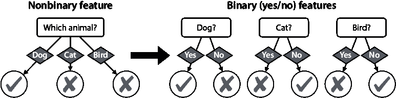

图 9.18 当我们有一个非二进制特征时，例如有三个或更多可能类别的特征，我们将其转换为几个二进制（是或否）特征，每个类别一个。例如，如果特征是狗，对三个问题“它是狗吗？”、“它是猫吗？”和“它是鸟吗？”的回答分别是“是”、“否”和“否”。

每个问题都以不同的方式分割数据。为了确定三个问题中哪一个给我们提供了最佳的分割，我们使用与“建立模型的第一步”部分中相同的方法：准确率、基尼指数或熵。将非二进制分类特征转换为几个二进制特征的过程称为*独热编码*。在第十三章的“将分类数据转换为数值数据”部分中，我们看到它在真实数据集中被使用。

使用连续特征（如年龄）分割数据

回想一下，在我们简化数据集之前，“年龄”特征包含数字。让我们回到原始表格，并在那里构建一个决策树（表 9.3）。

表 9.3 我们的原始应用推荐数据集，包含平台和用户的（数值）年龄。这与表 9.1 相同。

| 平台 | 年龄 | 应用 |
| --- | --- | --- |
| iPhone | 15 | 原子计数 |
| iPhone | 25 | 检查者 |
| 安卓 | 32 | 蜂巢寻找者 |
| iPhone | 35 | 检查者 |
| 安卓 | 12 | 原子计数 |
| 安卓 | 14 | 原子计数 |

这个想法是将年龄列转换为几个形式为“用户是否小于 X？”或“用户是否大于 X？”的问题。看起来我们似乎有无限多的问题要问，因为数字是无限的，但请注意，许多这些问题以相同的方式分割数据。例如，询问“用户是否小于 20？”和“用户是否小于 21？”会给我们相同的分割。实际上，只有七种可能的分割方式，如图 9.19 所示。

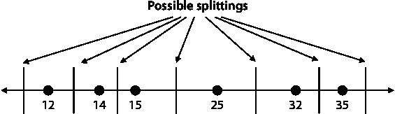

图 9.19 按年龄分割用户的七种可能方式的图形。注意，只要截止点位于连续年龄之间（除了第一个和最后一个截止点），放置截止点的位置无关紧要。

按照惯例，我们将选择连续年龄之间的中点作为分割的年龄。对于端点，我们可以选择任何随机值，只要它不在区间内。因此，我们有七个可能的问题将数据分割成两个集合，如表 9.4 所示。在此表中，我们还计算了每个分割的准确率、基尼不纯度指数和熵。

注意，第四个问题（“用户是否小于 20 岁？”）给出了最高的准确率，最低的加权基尼指数，以及最低的加权熵，因此这是使用“年龄”特征可以做出的最佳分割。

表 9.4：我们可以选择的七个可能的问题，每个问题都有相应的分割。在第一个集合中，我们放入小于截止年龄的用户，在第二个集合中，放入大于截止年龄的用户。

| 问题 | 第一组（是） | 第二组（否） | 标签 | 加权准确率 | 加权基尼不纯度指数 | 加权熵 |
| --- | --- | --- | --- | --- | --- | --- |
| 用户是否小于 7 岁？ | empty | 12, 14, 15, 25, 32, 35 | {},{A,A,A,C,B,C} | 3/6 | 0.611 | 1.459 |
| 用户是否小于 13 岁？ | 12 | 14, 15, 25, 32, 35 | {A},{A,A,C,B,C} | 3/6 | 0.533 | 1.268 |
| 用户是否小于 14.5 岁？ | 12, 14 | 15, 25, 32, 35 | {A,A}{A,C,B,C} | 4/6 | 0.417 | 1.0 |
| 用户是否小于 20 岁？ | 12, 14, 15 | 25, 32, 35 | {A,A,A},{C,B,C} | 5/6 | 0.222 | 0.459 |
| 用户是否小于 28.5 岁？ | 12, 14, 15, 25 | 32, 35 | {A,A,A,C},{B,C} | 4/6 | 0.416 | 0.874 |
| 用户是否小于 33.5 岁？ | 12, 14, 15, 25, 32 | 35 | {A,A,A,C,B},{C} | 4/6 | 0.467 | 1.145 |
| 用户是否小于 100 岁？ | 12, 14, 15, 25, 32, 35 | empty | {A,A,A,C,B,C},{} | 3/6 | 0.611 | 1/459 |

在表中进行计算，并验证你是否得到相同的答案。这些基尼指数的整个计算过程在以下笔记本中：[`github.com/luisguiserrano/manning/blob/master/Chapter_9_Decision_Trees/Gini_entropy_calculations.ipynb`](https://github.com/luisguiserrano/manning/blob/master/Chapter_9_Decision_Trees/Gini_entropy_calculations.ipynb)。

为了清晰起见，让我们对第三个问题的准确率、加权基尼不纯度指数和加权熵进行计算。注意，这个问题将数据分割成以下两个集合：

+   **集合 1**（小于 14.5 岁）

    +   年龄：12, 14

    +   标签：{A, A}

+   **集合 2**（14.5 岁及以上）：

    +   年龄：15, 25, 32, 25

    +   标签：{A, C, B, C}

准确率计算

集合 1 中最常见的标签是“A”，集合 2 中是“C”，因此我们将为每个相应的叶子节点做出这些预测。在集合 1 中，每个元素都被正确预测，而在集合 2 中，只有两个元素被正确预测。因此，这个决策树桩在六个数据点中的四个是正确的，准确率为 4/6 = 0.667。

在接下来的两个计算中，请注意以下内容：

+   集合 1 是纯的（其所有标签都相同），因此其基尼不纯度指数和熵都是 0。

+   在集合 2 中，标签为“A”、“B”和“C”的元素比例分别为 1/4、1/4 和 2/4 = 1/2。

加权 Gini 不纯度指数计算

集合 {A, A} 的 Gini 不纯度指数为 0。

集合 {A, C, B, C} 的 Gini 不纯度指数为 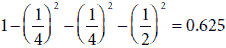

两个 Gini 不纯度指数的加权平均为 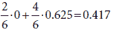

准确度计算

集合 {A, A} 的熵为 0。

集合 {A, C, B, C} 的熵为 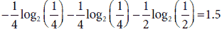

两个熵的加权平均为 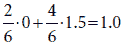

一个数值特征变成一系列是或否的问题，这些可以测量并与来自其他特征的另一些是或否的问题进行比较，以选择那个决策节点最佳的问题。

旁注：这个应用推荐模型非常小，所以我们完全可以手动完成。但是，要查看代码，请查看这个笔记本：[`github.com/luisguiserrano/manning/blob/master/Chapter_9_Decision_Trees/App_recommendations.ipynb`](https://github.com/luisguiserrano/manning/blob/master/Chapter_9_Decision_Trees/App_recommendations.ipynb)。该笔记本使用 Scikit-Learn 包，我们将在“使用 Scikit-Learn 构建决策树”一节中详细介绍。

## 决策树的图形边界

在本节中，我将向您展示两件事：如何从几何角度（在二维空间中）构建决策树，以及如何在流行的机器学习包 Scikit-Learn 中编码决策树。

回想一下，在分类模型中，例如感知器（第五章）或逻辑分类器（第六章），我们绘制了将标签为 0 和 1 的点分开的模型边界，结果是一条直线。决策树的边界也很理想，当数据是二维的时，它是由垂直线和水平线的组合形成的。在本节中，我们通过一个例子来说明这一点。考虑图 9.20 中的数据集，其中标签为 1 的点为三角形，标签为 0 的点为正方形。水平和垂直轴分别称为 *x*[0] 和 *x*[1]。


图 9.20 一个包含两个特征 (*x*[0] 和 *x*[1]) 和两个标签（三角形和正方形）的数据集，我们将在这个数据集上训练决策树

如果您必须仅使用一条水平线或垂直线来分割这个数据集，您会选择哪条线？根据您用来衡量解决方案有效性的标准，可能会有不同的线。让我们先选择一条垂直线 *x*[0] = 5。这将使它右侧主要是三角形，左侧主要是正方形，除了两个错误分类的点，一个是正方形，一个是三角形（图 9.21）。尝试检查所有其他可能的垂直线和水平线，使用您最喜欢的指标（准确度、Gini 指数和熵）进行比较，并验证这是最佳分割点的线。

现在让我们分别看看每一半。这次，很容易看出在 *x*[1] = 8 和 *x*[1] = 2.5 的两条水平线将分别在左右两侧完成任务。这些线完全将数据集划分为正方形和三角形。图 9.22 展示了结果。

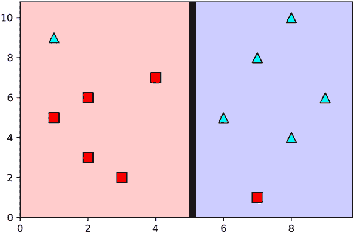

图 9.21 如果我们只能使用一条垂直线或水平线以最佳方式对数据进行分类，我们会使用哪一条？基于准确率，最佳分类器是 *x*[0] = 5 的垂直线，我们将它右侧的所有点分类为三角形，左侧的所有点分类为正方形。这个简单的分类器正确分类了 8 个点中的 10 个，准确率为 0.8。

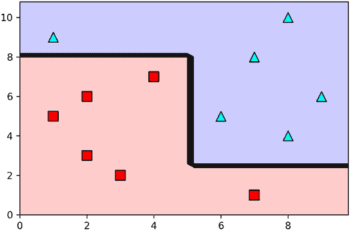

图 9.22 图 9.21 中的分类器将我们留在了两个数据集，每个数据集位于垂直线的两侧。如果我们必须使用一条垂直线或水平线来对每个数据集进行分类，我们会选择哪一条？如图所示，最佳选择是在 *x*[1] = 8 和 *x*[1] = 2.5 的水平线。

我们在这里所做的是构建一个决策树。在每一个阶段，我们从两个特征（*x*[0] 和 *x*[1]）中选取，并选择最佳分割数据的阈值。实际上，在下一小节中，我们使用 Scikit-Learn 在这个数据集上构建相同的决策树。

使用 Scikit-Learn 构建决策树

在本节中，我们学习如何使用一个流行的机器学习包 Scikit-Learn（简称 sklearn）来构建决策树。本节的代码如下：

+   **注意**：Graphical_example.ipynb

    +   [`github.com/luisguiserrano/manning/blob/master/Chapter_9_Decision_Trees/Graphical_example.ipynb`](https://github.com/luisguiserrano/manning/blob/master/Chapter_9_Decision_Trees/Graphical_example.ipynb)

我们首先将数据集作为名为 `dataset` 的 Pandas DataFrame 加载，如以下代码行所示：

```
import pandas as pd
dataset = pd.DataFrame({
    'x_0':[7,3,2,1,2,4,1,8,6,7,8,9],
    'x_1':[1,2,3,5,6,7,9,10,5,8,4,6],
    'y': [0,0,0,0,0,0,1,1,1,1,1,1]})
```

现在我们将特征与标签分开，如下所示：

```
features = dataset[['x_0', 'x_1']]
labels = dataset['y']
```

要构建决策树，我们创建一个 `DecisionTreeClassifier` 对象，并使用 `fit` 函数，如下所示：

```
decision_tree = DecisionTreeClassifier()
decision_tree.fit(features, labels)
```

我们使用 utils.py 文件中的 `display_tree` 函数获得了树的图，如图 9.23 所示。

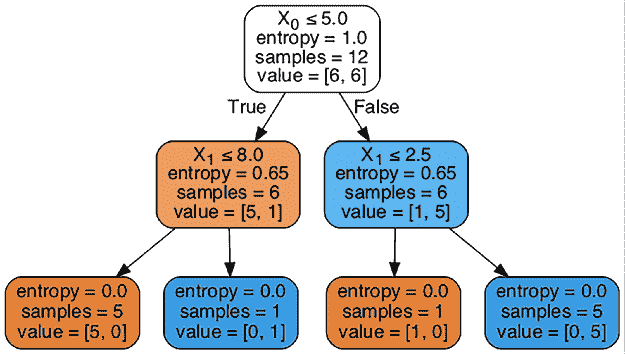

图 9.23 深度为 2 的决策树，对应图 9.22 中的边界。它有三个节点和四个叶子。

注意，图 9.23 中的树与图 9.22 中的边界完全对应。根节点对应于第一个垂直线 *x*[0] = 5，线两侧的点对应两个分支。图左侧和右侧的 *x*[1] = 8.0 和 *x*[1] = 2.5 的两条水平线对应两个分支。此外，在每个节点我们都有以下信息：

+   **基尼指数**：该节点标签的基尼不纯度指数

+   **样本**：对应该节点的数据点（样本）数量

+   **值**：该节点两个标签数据点的数量

如您所见，这个树是使用基尼指数训练的，这是 Scikit-Learn 的默认值。要使用熵来训练它，我们可以在构建`DecisionTree`对象时指定它，如下所示：

```
decision_tree = DecisionTreeClassifier(criterion='entropy')
```

在训练树时，我们可以指定更多的超参数，我们将在下一节中通过一个更大的示例看到。

## 真实应用：使用 Scikit-Learn 建模学生录取

在本节中，我们使用决策树来构建一个预测研究生院录取的模型。数据集可以在 Kaggle 上找到（参见附录 C 中的链接）。与“决策树的图形边界”部分一样，我们将使用 Scikit-Learn 来训练决策树，并使用 Pandas 来处理数据集。本节的代码如下：

+   **笔记本**：University_admissions.ipynb

    +   [`github.com/luisguiserrano/manning/blob/master/Chapter_9_Decision_Trees/University_Admissions.ipynb`](https://github.com/luisguiserrano/manning/blob/master/Chapter_9_Decision_Trees/University_Admissions.ipynb)

+   **数据集**：Admission_Predict.csv

数据集具有以下特征：

+   **GRE 分数**：一个 340 分以下的数字

+   **TOEFL 分数**：一个 120 分以下的数字

+   **大学排名**：一个从 1 到 5 的数字

+   **目的陈述强度（SOP）**：一个从 1 到 5 的数字

+   **本科平均成绩点（CGPA）**：一个从 1 到 10 的数字

+   **推荐信强度（LOR）**：一个从 1 到 5 的数字

+   **研究经验**：布尔变量（0 或 1）

数据集中的标签是录取概率，这是一个介于 0 和 1 之间的数字。为了得到二元标签，我们将录取概率为 0.75 或更高的每个学生视为“录取”，其他学生视为“未录取”。

加载数据集到 Pandas DataFrame 并执行此预处理步骤的代码如下：

```
import pandas as pd
data = pd.read_csv('Admission_Predict.csv', index_col=0)
data['Admitted'] = data['Chance of Admit'] >= 0.75
data = data.drop(['Chance of Admit'], axis=1)
```

结果数据集的前几行如表 9.5 所示。

表 9.5 一个包含 400 名学生及其标准化考试分数、成绩、大学排名、推荐信、目的陈述和其被录取到研究生院机会的信息的数据集

| GRE 分数 | TOEFL 分数 | 大学排名 | SOP | LOR | CGPA | 研究 | 录取 |
| --- | --- | --- | --- | --- | --- | --- | --- |
| 337 | 118 | 4 | 4.5 | 4.5 | 9.65 | 1 | True |
| 324 | 107 | 4 | 4.0 | 4.5 | 8.87 | 1 | True |
| 316 | 104 | 3 | 3.0 | 3.5 | 8.00 | 1 | False |
| 322 | 110 | 3 | 3.5 | 2.5 | 8.67 | 1 | True |
| 314 | 103 | 2 | 2.0 | 3.0 | 8.21 | 0 | False |

正如我们在“决策树的图形边界”部分所看到的，Scikit-Learn 要求我们分别输入特征和标签。我们将构建一个名为`features`的 Pandas DataFrame，包含除了“录取”列之外的所有列，以及一个名为`labels`的 Pandas Series，只包含“录取”列。代码如下：

```
features = data.drop(['Admitted'], axis=1)
labels = data['Admitted']
```

现在我们创建一个`DecisionTreeClassifier`对象（我们称之为`dt`）并使用`fit`方法。我们将使用 Gini 指数进行训练，如以下所示，因此不需要指定`criterion`超参数，但请继续使用熵进行训练，并将结果与这里得到的结果进行比较：

```
from sklearn.tree import DecisionTreeClassifier
dt = DecisionTreeClassifier()
dt.fit(features, labels)
```

要进行预测，我们可以使用`predict`函数。例如，以下是我们对前五个学生进行预测的方法：

```
dt.predict(features[0:5])
Output: array([ True, True, False, True, False])
```

然而，我们刚刚训练的决策树过度拟合了。一种观察这个现象的方法是使用`score`函数，并意识到它在训练集上的得分是 100%。在本章中，我们不会测试模型，而是尝试构建一个测试集并验证这个模型是否过度拟合。另一种观察过度拟合的方法是绘制树形图，并注意其深度为 10（见笔记本）。在下一节中，我们将了解一些有助于我们防止过度拟合的超参数。

在 Scikit-Learn 中设置超参数

为了防止过度拟合，我们可以使用我们在“最后一步：何时停止构建树和其他超参数”部分中学到的某些超参数，例如以下内容：

+   `max_depth`：允许的最大深度。

+   `max_features`：在每次分割时考虑的最大特征数（当特征太多且训练过程太长时很有用）。

+   `min_impurity_decrease`：节点的不纯度必须高于此阈值才能分割节点。

+   `min_impurity_split`：当节点的不纯度低于此阈值时，节点变为叶节点。

+   `min_samples_leaf`：叶节点所需的最小样本数。如果一个分割留下的叶节点样本数少于这个数量，则不执行分割。

+   `min_samples_split`：分割节点所需的最小样本数。

尝试调整这些参数以找到一个好的模型。我们将使用以下参数：

+   `max_depth = 3`

+   `min_samples_leaf = 10`

+   `min_samples_split = 10`

```
dt_smaller = DecisionTreeClassifier(max_depth=3, min_samples_leaf=10, min_samples_split=10)
dt_smaller.fit(features, labels)
```

结果树如图 9.24 所示。请注意，在这棵树中，所有指向右边的边对应于“False”，而指向左边的边对应于“True”。

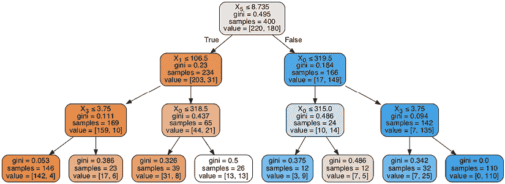

图 9.24 学生录取数据集中训练的深度为 3 的决策树

在每个叶节点给出的预测是该叶节点中大多数节点的标签。在笔记本中，每个节点都分配了一个颜色，从橙色到蓝色。橙色节点是具有更多标签 0 的节点，蓝色节点是具有标签 1 的节点。请注意，白色叶节点中标签 0 和 1 的点数相同。对于这个叶节点，任何预测的性能都相同。在这种情况下，Scikit-Learn 默认选择列表中的第一个类别，在这种情况下是 false。

要进行预测，我们使用`predict`函数。例如，让我们预测以下数字的学生的录取情况：

+   GRE 分数：320

+   TOEFL 分数：110

+   大学评级：3

+   SOP：4.0

+   LOR：3.5

+   CGPA：8.9

+   研究：0（无研究）

```
dt_smaller.predict([[320, 110, 3, 4.0, 3.5, 8.9, 0]])
Output: array([ True])
```

树预测该学生会获得录取。

从这个树中，我们可以推断出关于我们数据集的以下信息：

+   最重要的特征是第六列(*X*[5])，对应于 CGPA，即成绩。截止分数是 10 分中的 8.735 分。事实上，根节点右侧的大多数预测都是“录取”，左侧的是“不录取”，这表明 CGPA 是一个非常强的特征。

+   在此特征之后，最重要的两个特征是 GRE 分数(*X*[0])和托福分数(*X*[1])，都是标准化测试。事实上，在取得好成绩的学生中，大多数人很可能被录取，除非他们在 GRE 上表现不佳，如图 9.24 中从左数第六片叶子所说明的那样。

+   除了成绩和标准化测试之外，树中出现的唯一其他特征是 SOP，即目的陈述的强度。它位于树的下方，并且没有太多地改变预测。

然而，请记住，树的构建本质上是贪婪的，即在每一个点上它都选择最顶端的特征。但这并不保证特征的选择是最佳的。例如，可能存在一个特征组合非常强大，但没有任何一个单独强大，树可能无法捕捉到这一点。因此，尽管我们得到了一些关于数据集的信息，但我们不应立即丢弃树中未出现的特征。在特征选择时，一个好的特征选择算法，如 L1 正则化，将非常有用。

## 回归决策树

在本章的大部分内容中，我们使用了决策树进行分类，但如前所述，决策树也是很好的回归模型。在本节中，我们将看到如何构建决策树回归模型。本节的代码如下：

+   **笔记本**：Regression_decision_tree.ipynb

    +   [`github.com/luisguiserrano/manning/blob/master/Chapter_9_Decision_Trees/Regression_decision_tree.ipynb`](https://github.com/luisguiserrano/manning/blob/master/Chapter_9_Decision_Trees/Regression_decision_tree.ipynb)

考虑以下问题：我们有一个应用，我们想要预测用户每周使用应用的天数来衡量他们的互动水平。我们拥有的唯一特征是用户的年龄。数据集显示在表 9.6 中，其图表在图 9.25 中。

表 9.6 一个包含八个用户、他们的年龄以及他们与我们应用互动的小数据集。互动是通过他们在一周内打开应用的天数来衡量的。

| 年龄 | 互动 |
| --- | --- |
| 10 | 7 |
| 20 | 5 |
| 30 | 7 |
| 40 | 1 |
| 50 | 2 |
| 60 | 1 |
| 70 | 5 |
| 80 | 4 |

从这个数据集中，似乎我们有三个用户群体。年轻用户（10 岁、20 岁、30 岁）经常使用应用，中年用户（40 岁、50 岁、60 岁）不太使用，而老年用户（70 岁、80 岁）有时使用。因此，这样的预测是有意义的：

+   如果用户年龄为 34 岁或以下，每周的参与度为 6 天。

+   如果用户年龄在 35 岁到 64 岁之间，每周的参与度为 1 天。

+   如果用户年龄为 65 岁或以上，每周的参与度为 3.5 天。


图 9.25 表 9.6 中数据集的图表，其中水平轴对应用户的年龄，垂直轴对应他们每周与该应用的互动天数

回归决策树的预测看起来类似于这个，因为决策树将我们的用户分成组，并为每个组预测一个固定值。分割用户的方式是通过使用特征，这与我们在分类问题中所做的方式完全一样。

幸运的是，用于训练回归决策树的算法与我们用于训练分类决策树的算法非常相似。唯一的区别是，对于分类树，我们使用了准确率、基尼指数或熵，而对于回归树，我们使用平均平方误差（MSE）。平均平方误差可能听起来很熟悉——我们在第三章的“我们如何衡量我们的结果？误差函数”部分使用了它来训练线性回归模型。

在我们深入算法之前，让我们从概念上思考一下。想象一下，你必须将一条线尽可能紧密地拟合到图 9.25 中的数据集。但是有一个限制——这条线必须是水平的。我们应该在哪里拟合这条水平线呢？将其拟合在数据集的“中间”是有意义的——换句话说，在标签的平均高度，即 4。这是一个非常简单的分类模型，它将相同的预测值 4 分配给每个点。

现在，让我们更进一步。如果我们必须使用两个水平段，我们应该如何将它们尽可能紧密地拟合到数据上？我们可能会有几个猜测，其中一个是将 35 岁左边的点设置一个较高的栏，而将 35 岁右边的点设置一个较低的栏。这代表了一个决策树桩，它提出了问题：“你小于 35 岁吗？”并根据用户如何回答这个问题来分配预测。

如果我们能够将这两个水平段各自再分成两个——我们应该将它们定位在哪里呢？我们可以继续遵循这个过程，直到我们将用户分解成几个标签非常相似的组。然后，我们预测该组中所有用户的平均标签。

我们将用户分解成几个标签非常相似的组。然后，我们预测该组中所有用户的平均标签。

我们刚才遵循的过程是训练回归决策树的过程。现在让我们更正式一些。回想一下，当一个特征是数值时，我们考虑所有可能的分割方式。因此，分割年龄特征的可能是使用以下截止值：15，25，35，45，55，65 和 75。每个这些截止值都给我们两个较小的数据集，我们称之为左数据集和右数据集。现在我们执行以下步骤：

1.  对于每个较小的数据集，我们预测标签的平均值。

1.  我们计算预测的平均平方误差。

1.  我们选择给出最小平方误差的截止点。

例如，如果我们的截止点是 65 岁，那么两个数据集如下所示：

+   **左侧数据集**：65 岁以下的用户。标签为{7, 5, 7, 1, 2, 1}。

+   **右侧数据集**：65 岁或以上的用户。标签为{5,4}。

对于每个数据集，我们预测标签的平均值，左侧为 3.833，右侧为 4.5。因此，前六个用户的预测值为 3.833，最后两个为 4.5。现在，我们按照以下方式计算 MSE：

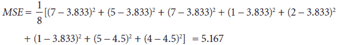

在表 9.7 中，我们可以看到每个可能的截止点所得到的值。完整的计算在笔记本本节的末尾。

表 9.7 使用截止点按年龄分割数据集的九种可能方式。每个截止点将数据集分割成两个更小的数据集，对于这两个数据集，预测值由标签的平均值给出。均方误差（MSE）是通过计算标签和预测值之间差异的平方的平均值来计算的。请注意，具有最小 MSE 的分割是在 35 岁的截止点获得的。这为我们决策树中的根节点提供了信息。

| 截止点 | 左侧标签集 | 右侧标签集 | 左侧预测集 | 右侧预测集 | MSE |
| --- | --- | --- | --- | --- | --- |
| 0 | {} | {7,5,7,1,2,1,5,4} | None | 4.0 | 5.25 |
| 15 | {7} | {5,7,1,2,1,5,4} | 7.0 | 3.571 | 3.964 |
| 25 | {7,5} | {7,1,2,1,5,4} | 6.0 | 3.333 | 3.917 |
| 35 | {7,5,7} | {1,2,1,5,4} | 6.333 | 2.6 | 1.983 |
| 45 | {7,5,7,1} | {2,1,5,4} | 5.0 | 3.0 | 4.25 |
| 55 | {7,5,7,1,2} | {1,5,4} | 4.4 | 3.333 | 4.983 |
| 65 | {7,5,7,1,2,1} | {5,4} | 3.833 | 4.5 | 5.167 |
| 75 | {7,5,7,1,2,1,5} | {4} | 4.0 | 4.0 | 5.25 |
| 100 | {7,5,7,1,2,1,5,4} | {} | 4.0 | none | 5.25 |

最佳截止点为 35 岁，因为它给出了最小的均方误差预测。因此，我们在回归决策树中建立了第一个决策节点。接下来的步骤是以相同的方式递归地继续分割左侧和右侧数据集。我们不会手动进行，而是像之前一样使用 Scikit-Learn。

首先，我们定义我们的特征和标签。我们可以使用数组来完成这项工作，如下所示：

```
features = [[10],[20],[30],[40],[50],[60],[70],[80]]
labels = [7,5,7,1,2,1,5,4]
```

现在，我们使用`DecisionTreeRegressor`对象构建一个最大深度为 2 的回归决策树，如下所示：

```
from sklearn.tree import DecisionTreeRegressor
dt_regressor = DecisionTreeRegressor(max_depth=2)
dt_regressor.fit(features, labels)
```

得到的决策树如图 9.26 所示。第一个截止点为 35 岁，正如我们之前已经计算出的。接下来的两个截止点为 15 岁和 65 岁。在图 9.26 的右侧，我们还可以看到这些四个数据子集的预测值。

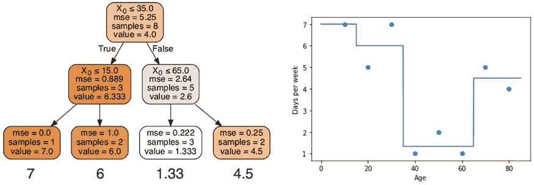

图 9.26 左侧：Scikit-Learn 中得到的决策树。此树有三个决策节点和四个叶子节点。右侧：此决策树做出的预测图。注意，截止年龄为 35 岁、15 岁和 65 岁，对应树中的决策节点。预测值为 7、6、1.33 和 4.5，对应树中的叶子节点。

## 应用

决策树在现实生活中有许多有用的应用。决策树的一个特殊之处在于，除了预测之外，它们还为我们提供了大量关于数据的信息，因为它们以分层结构组织数据。很多时候，这些信息的价值与预测能力相当，甚至更高。在本节中，我们将看到决策树在以下领域的实际应用示例：

+   医疗保健

+   推荐系统

决策树在医疗保健领域被广泛使用

决策树在医学领域被广泛使用，不仅用于预测，还用于识别预测中的决定性特征。你可以想象，在医学领域，一个只说“患者生病”或“患者健康”的黑盒是不够的。然而，决策树提供了大量关于预测原因的信息。患者可能因为症状、家族病史、习惯或许多其他因素而生病。

决策树在推荐系统中非常有用

在推荐系统中，决策树同样非常有用。最著名的推荐系统问题之一，Netflix 奖项，就是借助决策树获得的。2006 年，Netflix 举办了一场竞赛，旨在构建最佳推荐系统以预测用户对电影的评分。2009 年，他们向获奖者颁发了 100 万美元美元奖金，获奖者通过改进 Netflix 算法使其提升了超过 10%。他们这样做的方式是使用梯度提升决策树来结合超过 500 个不同的模型。其他推荐引擎也使用决策树来研究用户的参与度，并找出最佳确定参与度的人口统计特征。

在第十二章中，我们将学习更多关于梯度提升决策树和随机森林的知识。目前，想象它们最好的方式是作为许多决策树共同工作以做出最佳预测的集合。

## 摘要

+   决策树是重要的机器学习模型，用于分类和回归。

+   决策树的工作方式是通过询问关于数据的数据的二进制问题，并根据这些问题的答案做出预测。

+   构建分类决策树的算法包括找到最佳决定标签的特征，并迭代这一步骤。

+   我们有几种方法可以判断一个特征是否最佳地决定了标签。在本章中我们学习到的三种方法是准确率、基尼不纯度指数和熵。

+   基尼不纯度指数衡量集合的纯度。因此，每个元素都有相同标签的集合具有基尼不纯度指数为 0。每个元素都有不同标签的集合具有接近 1 的基尼不纯度指数。

+   熵是衡量集合纯度的另一种度量。所有元素都具有相同标签的集合熵为 0。一半元素具有一个标签，另一半具有另一个标签的集合熵为 1。在构建决策树时，分割前后的熵差称为信息增益。

+   构建回归决策树的算法与用于分类的算法类似。唯一的区别是我们使用均方误差来选择最佳特征以分割数据。

+   在二维空间中，回归树图看起来像是几条水平线的并集，其中每条水平线是对特定叶节点中元素的预测。

+   决策树的应用范围非常广泛，从推荐算法到医学和生物学的应用。

## 练习

练习 9.1

在以下垃圾邮件检测决策树模型中，确定来自您母亲的电子邮件，主题为“请去商店，有促销活动”，是否会被分类为垃圾邮件。

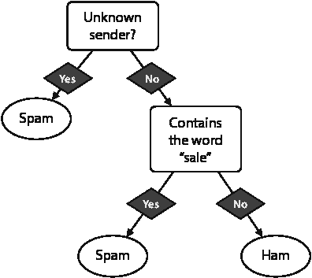

练习 9.2

我们的目标是构建一个决策树模型，以确定信用卡交易是否为欺诈。我们使用以下信用卡交易数据集，具有以下特征：

+   **值**：交易的值。

+   **已批准供应商**：信用卡公司有一份已批准供应商的名单。此变量表示供应商是否在该名单中。

|  | 值 | 已批准供应商 | 欺诈 |
| --- | --- | --- | --- |
| 交易编号 1 | $100 | 未批准 | 是 |
| 交易编号 2 | $100 | 已批准 | 否 |
| 交易编号 3 | $10,000 | 已批准 | 否 |
| 交易编号 4 | $10,000 | 未批准 | 是 |
| 交易编号 5 | $5,000 | 已批准 | 是 |
| 交易编号 6 | $100 | 已批准 | 否 |

根据以下规格构建决策树的第一节点：

1.  使用基尼不纯度指数

1.  使用熵

练习 9.3

以下是一个 COVID-19 检测结果为阳性或阴性的患者数据集。他们的症状是咳嗽 (C)、发烧 (F)、呼吸困难 (B) 和疲劳 (T)。

|  | 咳嗽 (C) | 发烧 (F) | 呼吸困难 (B) | 疲劳 (T) | 诊断 |
| --- | --- | --- | --- | --- | --- |
| 患者编号 1 |  | X | X | X | 病人 |
| 患者编号 2 | X | X |  | X | 病人 |
| 患者编号 3 | X |  | X | X | 病人 |
| 患者编号 4 | X | X | X |  | 病人 |
| 患者编号 5 | X |  |  | X | 健康 |
| 患者编号 6 |  | X | X |  | 健康 |
| 患者编号 7 |  | X |  |  | 健康 |
| 患者编号 8 |  |  |  | X | 健康 |

使用准确率，构建一个高度为 1 的决策树（决策树桩），对数据进行分类。这个分类器在数据集上的准确率是多少？
