# 10 结合构建块以获得更多力量：神经网络

在本章

+   什么是神经网络

+   神经网络的架构：节点、层、深度和激活函数

+   使用反向传播训练神经网络

+   神经网络训练中可能遇到的问题，例如梯度消失问题和过拟合

+   提高神经网络训练的技术，例如正则化和 dropout

+   使用 Keras 训练用于情感分析和图像分类的神经网络

+   将神经网络用作回归模型

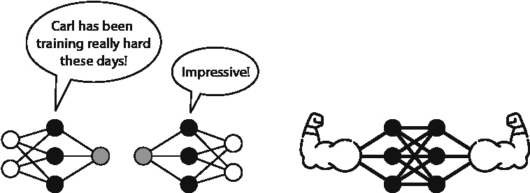

在本章，我们学习**神经网络**，也称为**多层感知器**。神经网络是（如果不是最受欢迎的）最流行的机器学习模型之一。它们非常有用，以至于该领域有自己独特的名称：**深度学习**。深度学习在机器学习的最前沿领域有众多应用，包括图像识别、自然语言处理、医学和自动驾驶汽车。从广义上讲，神经网络旨在模仿人脑的工作方式。它们可能非常复杂，如图 10.1 所示。

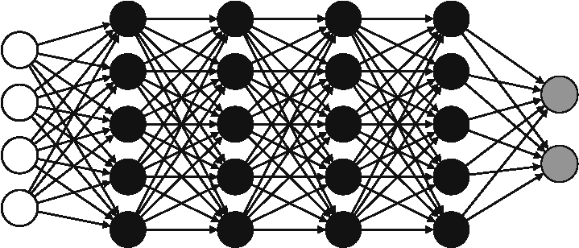

图 10.1 一个神经网络。它可能看起来很复杂，但在接下来的几页中，我们将揭开这个图像的神秘面纱。

图 10.1 中的神经网络可能因为有很多节点、边等看起来令人畏惧。然而，我们可以用更简单的方式理解神经网络。一种看待它们的方式是将它们视为感知器（我们在第五章和第六章中学过）的集合。我喜欢将神经网络看作是线性分类器的组合，这些分类器产生了非线性分类器。在低维度中，线性分类器看起来像是线或平面，而非线性分类器看起来像是复杂的曲线或表面。在本章中，我们讨论神经网络背后的直觉以及它们如何工作的细节，我们还编写神经网络代码并使用它们进行图像识别等几个应用。

神经网络在分类和回归中很有用。在本章中，我们主要关注分类神经网络，但也学习了使它们适用于回归所需的小改动。首先，一些术语。回想一下，在第五章中，我们学习了感知器，在第六章中，我们学习了逻辑分类器。我们还了解到它们被称为离散和连续感知器。为了刷新你的记忆，离散感知器的输出是 0 或 1，而连续感知器的输出是(0,1)区间内的任何数字。为了计算这个输出，离散感知器使用步函数（第五章中的“步函数和激活函数”部分），而连续感知器使用 sigmoid 函数（第六章中的“一种概率方法进行分类：sigmoid 函数”部分）。在本章中，我们将这两个分类器都称为感知器，并在需要时，我们会指明我们是在谈论离散感知器还是连续感知器。

本章的代码可在以下 GitHub 仓库中找到：[`github.com/luisguiserrano/manning/tree/master/Chapter_10_Neural_Networks`](https://github.com/luisguiserrano/manning/tree/master/Chapter_10_Neural_Networks)。

## 神经网络示例：一个更复杂的外星世界

在本节中，我们通过第五章和第六章中熟悉的情感分析示例来学习神经网络。场景如下：我们发现自己在一个由外星人居住的遥远星球上。他们似乎说一种由两个单词组成的语言，*aack*和*beep*，我们想要构建一个机器学习模型，帮助我们根据他们所说的单词来判断外星人是否快乐或悲伤。这被称为情感分析，因为我们需要构建一个模型来分析外星人的情绪。我们记录了一些外星人的谈话，并设法通过其他方式确定他们是否快乐或悲伤，并据此构建了表 10.1 所示的数据集。

表 10.1 我们的数据集，其中每一行代表一个外星人。第一列代表他们所说的句子。第二列和第三列代表句子中每个单词出现的次数。第四列代表外星人的情绪。

| 句子 | Aack | Beep | 情绪 |
| --- | --- | --- | --- |
| “*Aack*” | 1 | 0 | 悲伤 |
| “*Aack aack*” | 2 | 0 | 悲伤 |
| “*Beep*” | 0 | 1 | 悲伤 |
| “*Beep beep*” | 0 | 2 | 悲伤 |
| “*Aack beep*” | 1 | 1 | 快乐 |
| “*Aack aack beep*” | 2 | 1 | 快乐 |
| “*Beep aack beep*” | 1 | 2 | 快乐 |
| “*Beep aack beep aack*” | 2 | 2 | 快乐 |

这个数据集看起来相当不错，我们应该能够将分类器拟合到这些数据上。让我们先绘制它，如图 10.2 所示。

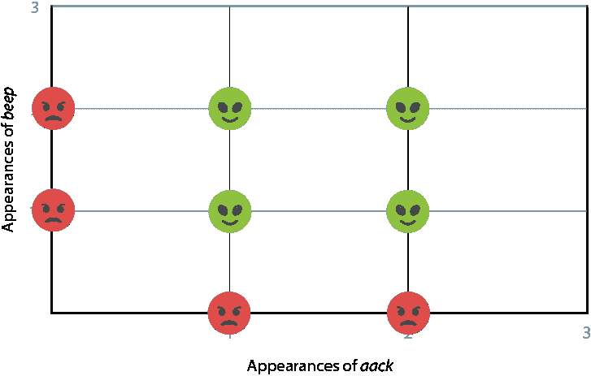

图 10.2 表 10.1 中数据集的绘图。水平轴对应于单词*aack*出现的次数，垂直轴对应于单词*beep*出现的次数。快乐的面孔对应于快乐的异形，悲伤的面孔对应于悲伤的异形。

从图 10.2 来看，我们似乎无法将线性分类器拟合到这些数据上。换句话说，画一条将快乐和悲伤的面孔分开的线是不可能的。我们能做什么？我们已经学习了其他可以完成这项工作的分类器，例如朴素贝叶斯分类器（第八章）或决策树（第九章）。但在这个章节中，我们坚持使用感知器。如果我们的目标是分离图 10.2 中的点，并且一条直线做不到，那么什么比一条直线更好？以下是什么？

1.  两条直线

1.  一条曲线

这些是神经网络的例子。让我们首先看看为什么第一个，使用两条直线的分类器，是一个神经网络。

解决方案：如果一条直线不够，可以使用两条直线来分类你的数据集

在本节中，我们探讨一个使用两条直线来分割数据集的分类器。我们有多种方法可以画两条直线来分割这个数据集，其中一种方法如图 10.3 所示。让我们称它们为直线 1 和直线 2。

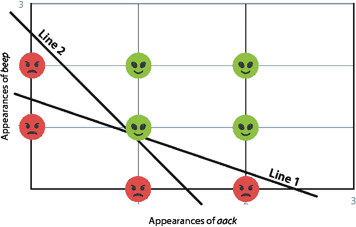

图 10.3 在我们的数据集中，快乐和悲伤的点不能由一条直线分开。然而，画两条直线可以很好地将它们分开——位于两条直线之上的点可以分类为快乐，其余的点为悲伤。以这种方式结合线性分类器是神经网络的基础。

我们可以定义我们的分类器如下：

情感分析分类器

如果一个句子对应点位于图 10.3 中所示的两条直线之上，则将其分类为快乐。如果它至少低于一条直线，则将其分类为悲伤。

现在，让我们加入一些数学。我们能想到这两条直线的两个方程吗？许多方程都可以工作，但让我们使用以下两个（其中*x*[a]是句子中单词*aack*出现的次数，*x*[b]是单词*beep*出现的次数）。

+   第 1 条直线：6*x*[a] + 10*x*[b] – 15 = 0

+   第 2 条直线：10*x*[a] + 6*x*[b] – 15 = 0

aside: 我们是如何找到这些方程的？注意，第 1 行通过点(0, 1.5)和(2.5, 0)。因此，斜率，定义为水平轴的变化除以垂直轴的变化，恰好是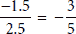。*y*轴截距——即直线与垂直轴相交的高度是 1.5。因此，这条直线的方程是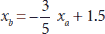。通过操作这个方程，我们得到 6*x*[a] + 10*x*[b] – 15 = 0。我们可以用类似的方法找到第 2 条直线的方程。

因此，我们的分类器变成了以下形式：

情感分析分类器

如果以下两个不等式都成立，则句子被分类为快乐：

+   **不等式 1**：6*x*[a] + 10*x*[b] – 15 ≥ 0

+   **不等式 2**：10*x*[a] + 6*x*[b] **–** 15 ≥ 0

如果其中至少有一个失败，那么句子就被分类为悲伤。

作为一致性检查，表 10.2 包含了两个方程式各自的值。在每个方程式的右侧，我们检查方程式的值是否大于或等于 0。最右侧的列检查两个值是否都大于或等于 0。

表 10.2 与表 10.1 相同的 dataset，但有一些新的列。第四列和第六列对应于我们的两条线。第五列和第七列检查每条线在每个数据点上的方程式是否给出非负值。最后一列检查得到的两个值是否都是非负的。

| 句子 | 阿克 | 哔 | 方程式 1 | 方程式 1 ≥ 0? | 方程式 2 | 方程式 2 ≥ 0? | 两个方程式 ≥ 0 |
| --- | --- | --- | --- | --- | --- | --- | --- |
| “*阿克*” | 1 | 0 | –9 | 否 | –5 | 否 | 否 |
| “*阿克 阿克*” | 2 | 0 | –3 | 否 | 5 | 是 | 否 |
| “*哔*” | 0 | 1 | –5 | 否 | –9 | 否 | 否 |
| “*哔哔*” | 0 | 2 | 5 | 是 | 3 | 否 | 否 |
| “*阿克 哔*” | 1 | 1 | 1 | 是 | 1 | 是 | 是 |
| “*阿克 阿克 哔*” | 1 | 2 | 11 | 是 | 7 | 是 | 是 |
| “*哔哔 阿克 哔*” | 2 | 1 | 7 | 是 | 11 | 是 | 是 |
| “*哔哔哔*” | 2 | 2 | 17 | 是 | 17 | 是 | 是 |

注意，表 10.2（是/否）最右侧的列与表 10.1（快乐/悲伤）最右侧的列相匹配。这意味着分类器成功地将所有数据正确分类。

为什么是两条线？幸福不是线性的吗？

在第五章和第六章中，我们根据分类器的方程式推断出了关于语言的一些信息。例如，如果单词*aack*的权重是正的，我们得出结论，它很可能是一个快乐的词。那么现在呢？我们能否从这个包含两个方程式的分类器中推断出关于语言的信息？

我们可以这样考虑两个方程式，也许在外星人的星球上，幸福不是一个简单的线性事物，而是基于两件事。在现实生活中，幸福可以基于许多事情：它可以是基于拥有充实的事业和快乐的家庭生活以及桌上的食物。它也可以是基于拥有咖啡和甜甜圈。在这种情况下，让我们假设幸福的两个方面是事业和家庭。对于一个外星人来说，要快乐，他需要拥有*两者*。

结果表明，在这种情况下，职业幸福和家庭幸福都是简单的线性分类器，每个分类器都由两条线中的一条描述。让我们假设第 1 行对应职业幸福，第 2 行对应家庭幸福。因此，我们可以将外星人的幸福视为图 10.4 中的图表。在这个图表中，职业幸福和家庭幸福通过 AND 运算符连接，该运算符检查两者是否都为真。如果它们都是真的，那么外星人就是快乐的。如果其中任何一个失败，外星人就不快乐。

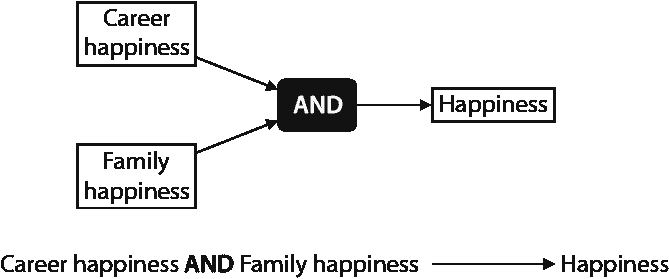

图 10.4 幸福分类器由职业幸福分类器、家庭幸福分类器和 AND 运算符组成。如果职业和家庭幸福分类器都输出 Yes，那么幸福分类器也输出 Yes。如果其中任何一个输出 No，那么幸福分类器也输出 No。

家庭和职业幸福分类器都是感知器，因为它们由一条线的方程给出。我们能将这个 AND 运算符转换成另一个感知器吗？答案是肯定的，我们将在下一小节中看到如何做到这一点。

图 10.4 开始看起来像神经网络。只需再走几步，再加上一点数学，我们就能得到本章开头图 10.1 中的样子。

将感知器的输出组合到另一个感知器中

图 10.4 暗示了一种感知器的组合，其中我们将两个感知器的输出作为第三个感知器的输入。这就是神经网络是如何构建的，在本节中，我们将看到其背后的数学原理。

在第五章的“阶跃函数和激活函数”部分，我们定义了阶跃函数，当输入为负时返回 0，当输入为正或零时返回 1。请注意，因为我们使用了阶跃函数，所以这些是离散感知器。使用这个函数，我们可以将家庭和职业幸福分类器定义为以下：

职业幸福分类器

权重：

+   *嘟嘟声*：6

+   *哔哔声*：10

**偏差**：-15

**句子得分**：6*x*[a] + 10*x*[b] – 15

**预测**：*F* = *step*(6*x*[a] + 10*x*[b] – 15)

家庭幸福分类器

权重：

+   *嘟嘟声*：10

+   *哔哔声*：6

**偏差**：-15

**句子得分**：10*x*[a]+6*x*[b] – 15

**预测**：*C* = *step*(10*x*[a]+6*x*[b] – 15)

下一步是将职业和家庭幸福分类器的输出连接到一个新的幸福分类器。尝试验证以下分类器是否工作。图 10.5 包含两个表格，分别展示了职业和家庭分类器的输出，以及一个包含前两列是职业和家庭分类器的输入和输出，最后一列是家庭分类器输出的第三个表格。图 10.5 中的每个表格对应一个感知器。

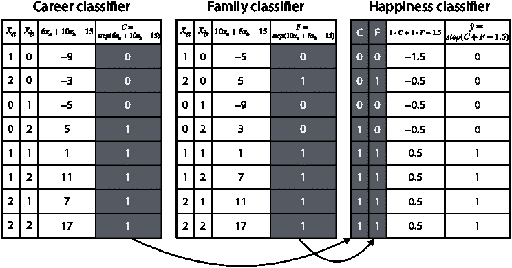

图 10.5 包含三个感知器分类器，一个用于职业幸福，一个用于家庭幸福，还有一个将前两个结合起来的幸福分类器。职业和家庭感知器的输出是幸福感知器的输入。

幸福分类器

权重：

+   职业：1

+   家庭：1

**偏差**：-1.5

**句子得分**：1 · *C* + 1 · *F* – 1.5

**预测**：*ŷ* = *step*(1 · *C* + 1 · *F* – 1.5)

这种分类器的组合构成了一个神经网络。接下来，我们将看到如何使其看起来像图 10.1 中的图像。

感知器的图形表示

在本节中，我将向您展示如何以图形方式表示感知器，这导致了神经网络图形表示的产生。我们称它们为神经网络，因为它们的基本单元，即感知器，大致类似于神经元。

一个神经元由三个主要部分组成：细胞体、树突和轴突。从广义上讲，神经元通过树突接收来自其他神经元的信号，在细胞体中处理它们，并通过轴突发送信号以被其他神经元接收。这与感知器形成对比，感知器接收数字作为输入，并应用数学

对它们进行的操作（通常由一个与激活函数组合的和组成），并输出一个新的数字。这个过程如图 10.6 所示。

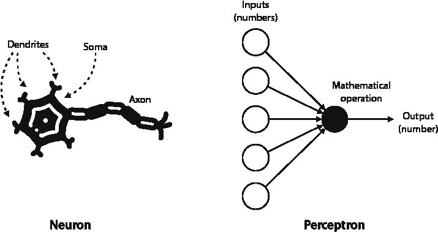

图 10.6 一个感知器松散地基于神经元。左图：一个神经元及其主要组成部分：树突、细胞体和轴突。信号通过树突进入，在细胞体中处理，并通过轴突发送到其他神经元。右图：感知器。左边的节点对应于数值输入，中间的节点执行数学运算并输出一个数字。

更正式地说，回想一下第五章和第六章中感知器的定义，其中我们有了以下实体：

+   **输入**：*x*[1]，*x*[2]，…，*x*[n]

+   **权重**：*w*[1]，*w*[2]，…，*w*[n]

+   **偏置**：*b*

+   **激活函数**：对于离散感知器是阶跃函数，对于连续感知器是 Sigmoid 函数。（在本章的后面我们将学习其他新的激活函数。）

+   **预测**：由公式 *ŷ* = *f*(*w*[1] *x*[1] + *w*[2] *x*[2] + … + *w*[n] *x*[n] + *b*) 定义，其中 *f* 是相应的激活函数

这些在图中的位置如图 10.7 所示。在左侧，我们有输入节点，在右侧，我们有输出节点。输入变量放在输入节点上。最后的输入节点不包含变量，但它包含值为 1。权重位于连接输入节点和输出节点的边路上。对应于最终输入节点的权重是偏置。计算预测的数学运算发生在输出节点内部，并且该节点输出预测。

例如，由方程 *ŷ* = *σ*(3*x*[1] – 2*x*[2] + 4*x*[3] + 2) 定义的感知器如图 10.7 所示。注意，在这个感知器中，以下步骤被执行：

+   输入与相应的权重相乘并相加，得到 3*x*[1] – 2*x*[2] + 4*x*[3]。

+   将偏置添加到前面的方程中，得到 3*x*[1] – 2*x*[2] + 4*x*[3] + 2。

+   将 Sigmoid 激活函数应用于得到输出 *ŷ* = *σ*(3*x*[1] – 2*x*[2] + 4*x*[3] + 2)。

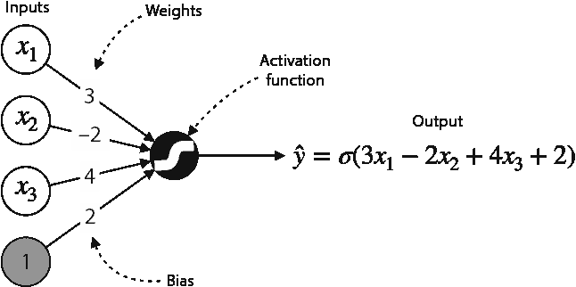

图 10.7 感知器的视觉表示。输入（特征和偏置）作为左边的节点出现，权重和偏置位于连接输入节点到中间主节点的边上。中间的节点对权重和输入进行线性组合，加上偏置，并应用激活函数，在这种情况下是 Sigmoid 函数。输出是公式 *ŷ* = *σ*(3*x*[1] – 2*x*[2] + 4*x*[3] + 2) 给出的预测。

例如，如果这个感知器的输入是点 (*x*[1], *x*[2], *x*[3]) = (1, 3, 1)，那么输出是 *σ*(3 · 1 – 2 · 3 + 4 · 1 + 2) = *σ*(3) = 0.953。

如果这个感知器是用阶跃函数而不是 Sigmoid 函数定义的，输出将是 *step*(3 · 1 – 2 · 3 + 4 · 1 + 2) = *step*(3) = 1。

这种图形表示使得感知器容易串联，正如我们在下一节中看到的。

神经网络的图形表示

正如我们在上一节中看到的，神经网络是感知器的串联。这种结构旨在松散地模拟人脑，其中几个神经元的输出成为另一个神经元的输入。同样，在神经网络中，几个感知器的输出成为另一个感知器的输入，如图 10.8 所示。

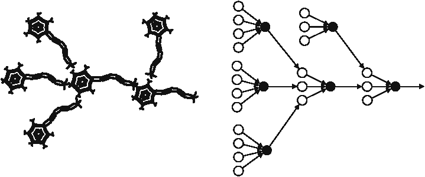

图 10.8 神经网络旨在（松散地）模拟大脑的结构。左：神经元在大脑内部以某种方式连接，使得一个神经元的输出成为另一个神经元的输入。右：感知器以某种方式连接，使得一个感知器的输出成为另一个感知器的输入。

我们在上一节中构建的神经网络，其中我们将职业感知器和家庭感知器与幸福感知器串联起来，如图 10.9 所示。

注意到图 10.9 中的图中，职业和家庭感知器的输入被重复了。一种更清晰的方式来表达，其中这些输入不会重复，如图 10.10 所示。

注意到这三个感知器使用了阶跃函数。我们这样做只是为了教育目的，因为在现实生活中，神经网络永远不会使用阶跃函数作为激活函数，因为这会使我们无法使用梯度下降（更多内容请参阅“训练神经网络”部分）。然而，Sigmoid 函数在神经网络中却被广泛使用，在“不同的激活函数”部分，我们将学习一些实际中使用的其他有用的激活函数。

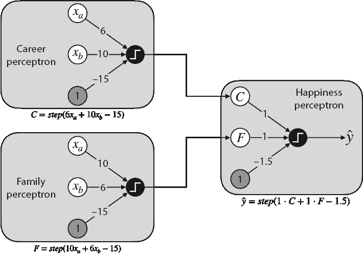

图 10.9 当我们将职业和家庭感知器的输出连接到幸福感知器时，我们得到一个神经网络。这个神经网络使用阶跃函数作为激活函数。

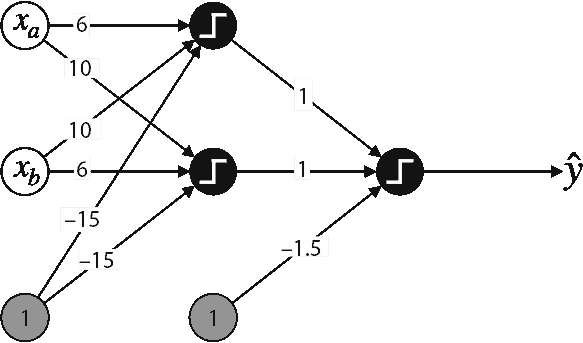

图 10.10 图 10.9 中图表的清理版本。在这个图表中，特征 *x*[a] 和 *x*[b]，以及偏置没有重复。相反，它们各自连接到右侧的两个节点，很好地将三个感知器组合到同一个图表中。

神经网络的边界

在第五章和第六章中，我们研究了感知器的边界，这些边界由线给出。在本节中，我们看看神经网络边界是什么样的。

从第五章和第六章回顾，离散感知器和连续感知器（逻辑分类器）都有一个由定义它们的线性方程给出的线性边界。离散感知器根据点位于线的哪一侧将预测 0 和 1 分配给点。连续感知器将 0 到 1 之间的预测分配给平面上的每个点。线上的点得到 0.5 的预测，线一侧的点得到高于 0.5 的预测，而线另一侧的点得到低于 0.5 的预测。图 10.11 说明了对应于方程 10*x*[a] + 6*x*[b] – 15 = 0 的离散和连续感知器。

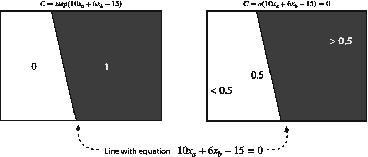

图 10.11 感知器的边界是一条线。左：对于离散感知器，线一侧的点被预测为 0，另一侧的点被预测为 1。右：对于连续感知器，所有点都被预测在区间(0,1)内。在这个例子中，最左边的点得到的预测接近 0，最右边的点得到的预测接近 1，而在线上的点得到的预测为 0.5。

我们也可以以类似的方式可视化神经网络的输出。回想一下，具有步进激活函数的神经网络的输出如下：

+   如果 6*x*[a] + 10*x*[b] – 15 ≥ 0 且 10*x*[a] + 6*x*[b] – 15 ≥ 0，则输出为 1。

+   否则，输出为 0。

在图 10.12 的左侧，使用两条线来表示这个边界。请注意，它是由两个输入感知器边界和偏置节点的组合表示的。使用步进激活函数得到的边界用虚线表示，而使用 sigmoid 激活函数得到的边界是一条曲线。

要更仔细地研究这些边界，请查看以下笔记本：[`github.com/luisguiserrano/manning/blob/master/Chapter_10_Neural_Networks/Plotting_Boundaries.ipynb`](https://github.com/luisguiserrano/manning/blob/master/Chapter_10_Neural_Networks/Plotting_Boundaries.ipynb)。在这个笔记本中，使用步进和 sigmoid 激活函数绘制了两条线和两个神经网络的边界，如图 10.13 所示。

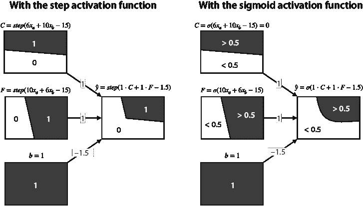

图 10.12 构建神经网络时，我们使用两个感知器和一个偏置节点（用一个总是输出值为 1 的分类器表示）的输出连接到第三个感知器。结果分类器的边界是输入分类器边界的组合。在左侧，我们看到使用阶跃函数得到的边界，这是一条折线。在右侧，我们看到使用 sigmoid 函数得到的边界，这是一条曲线。

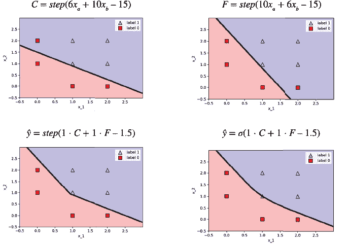

图 10.13 分类器边界的图示。顶部：两个线性分类器，职业（左侧）和家庭（右侧）分类器。底部：两个神经网络，使用阶跃函数（左侧）和 sigmoid 函数（右侧）。

注意，具有 sigmoid 激活函数的神经网络实际上并不很好地拟合整个数据集，因为它错误地将点（1,1）分类了，如图 10.13 的右下角所示。尝试以某种方式改变权重，使其很好地拟合这个点。（参见本章末尾的练习 10.3）。

完全连接神经网络的通用架构

在前面的章节中，我们看到了一个小型神经网络的例子，但在现实生活中，神经网络要大得多。节点按层排列，如图 10.14 所示。第一层是输入层，最后一层是输出层，所有介于两者之间的层都称为隐藏层。节点和层的排列称为神经网络的*架构*。层的数量（不包括输入层）称为神经网络的深度。图 10.14 中的神经网络深度为 3，其架构如下：

+   一个大小为 4 的输入层

+   一个大小为 5 的隐藏层

+   一个大小为 3 的隐藏层

+   一个大小为 1 的输出层

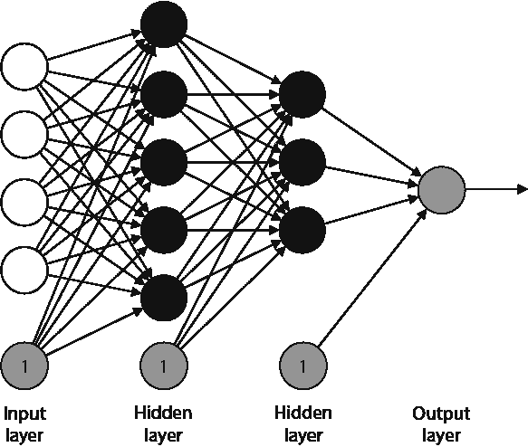

图 10.14 神经网络的一般架构。节点被划分为层，其中最左侧的层是输入层，最右侧的层是输出层，所有介于两者之间的层都是隐藏层。同一层中的所有节点都连接到下一层中的所有（非偏置）节点。

神经网络通常绘制时不包含偏置节点，但假设它们是架构的一部分。然而，我们不计入架构中的偏置节点。换句话说，层的尺寸是该层中非偏置节点的数量。

注意到在图 10.14 中的神经网络中，同一层中的每个节点都连接到下一层中的每个（非偏置）节点。此外，非连续层之间没有连接。这种架构称为*全连接*。对于某些应用，我们使用不同的架构，其中并非所有连接都存在，或者某些节点在非连续层之间连接——请参阅“更复杂方言的其他架构”部分，了解其中的一些内容。然而，在本章中，我们构建的所有神经网络都是全连接的。

将神经网络边界想象成图 10.15 中所示的那样。在这个图中，你可以看到每个节点对应的分类器。注意，第一隐藏层由线性分类器组成，每个后续层的分类器比前一个层的稍微复杂一些。

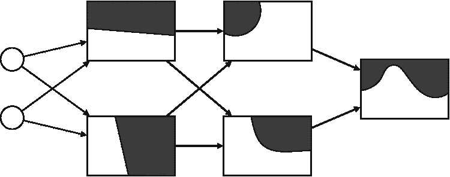

图 10.15 我喜欢这样可视化神经网络。每个节点都对应一个分类器，这个分类器有一个明确的边界。第一隐藏层中的节点都对应线性分类器（感知器），因此它们被绘制成线条。每个层的节点边界是由前一层边界组合而成的。因此，每个隐藏层的边界变得越来越复杂。在这个图中，我们移除了偏差节点。

一个很好的工具来玩以理解神经网络的是 TensorFlow Playground，可以在[`playground.tensorflow.org`](https://playground.tensorflow.org)找到。那里有几个图形数据集可用，你可以用不同的架构和超参数训练神经网络。

## 训练神经网络

在本章中，我们看到了神经网络的一般外观，以及它们并不像听起来那么神秘。我们如何训练这样的怪物呢？从理论上讲，这个过程并不复杂，尽管它可能计算成本很高。我们有几个技巧和启发式方法可以使用来加速这个过程。在本节中，我们学习这个训练过程。训练神经网络与其他模型（如感知器或逻辑分类器）的训练并没有太大区别。我们首先随机初始化所有权重和偏差。接下来，我们定义一个错误函数来衡量神经网络的性能。最后，我们反复使用错误函数来调整模型的权重和偏差，以减少错误函数。

错误函数：衡量神经网络性能的一种方式

在本节中，我们学习用于训练神经网络的错误函数。幸运的是，我们之前已经见过这个函数——第六章“逻辑分类器”部分中的对数损失函数。回忆一下，对数损失的公式是

*对数损失* = –*y* *ln*(*ŷ*) – (1 – *y*) *ln*(1 – *ŷ*)，

其中 *y* 是标签，*ŷ* 是预测。

作为复习，使用对数损失函数进行分类问题的一个很好的原因是，当预测和标签接近时，它返回一个较小的值，而当它们相距较远时，它返回一个较大的值。

反向传播：训练神经网络的关键步骤

在本节中，我们学习训练神经网络过程中的最重要步骤。回忆一下，在第三章、第五章和第六章（线性回归、感知器算法和逻辑回归）中，我们使用梯度下降来训练我们的模型。对于神经网络也是如此。训练算法被称为*反向传播算法*，其伪代码如下：

反向传播算法的伪代码

+   使用随机权重和偏置初始化神经网络。

+   重复多次：

    +   计算损失函数及其梯度（即相对于每个权重和偏置的导数）。

    +   沿着梯度相反的方向迈一小步，以减少损失函数的小量。

+   你获得的权重对应于一个（很可能）很好地拟合数据的神经网络。

神经网络的损失函数很复杂，因为它涉及到预测的对数，而预测本身是一个复杂的函数。此外，我们需要计算相对于许多变量的导数，对应于神经网络的每个权重和偏置。在附录 B“使用梯度下降训练神经网络”中，我们回顾了具有一个隐藏层或任意大小的神经网络的反向传播算法的数学细节。在附录 C 中，可以看到一些推荐资源，以深入了解深层神经网络的反向传播数学。在实践中，像 Keras、TensorFlow 和 PyTorch 这样的优秀包已经以极高的速度和性能实现了此算法。

回想一下，当我们学习线性回归模型（第三章）、离散感知器（第五章）和连续感知器（第六章）时，这个过程总是有一个步骤，我们需要移动一条线以更好地模拟我们的数据。这种类型的几何图形对于神经网络来说更难可视化，因为它发生在更高的维度中。然而，我们仍然可以形成反向传播的心理图景，为此，我们需要专注于神经网络的一个节点和一个数据点。想象一下图 10.16 右边的分类器。这个分类器是从左边的三个分类器得到的（底部的一个对应于偏置，我们用总是返回预测为 1 的分类器来表示）。结果分类器错误地分类了点，如图所示。从三个输入分类器中，第一个很好地分类了点，但其他两个没有。因此，反向传播步骤将增加对应于顶部分类器的边的权重，并减少对应于底部两个分类器的权重。这确保了结果分类器将更像顶部的一个，因此，它对点的分类将得到改善。

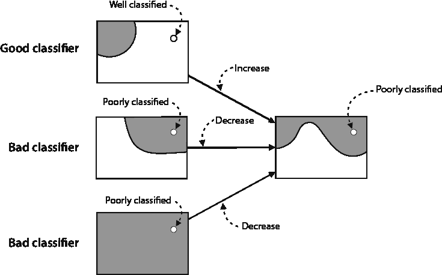

图 10.16 反向传播的心理图景。在训练过程的每一步，边的权重都会更新。如果一个分类器很好，它的权重会增加一小部分，如果它不好，它的权重会减少。

可能的问题：从过拟合到梯度消失

在实践中，神经网络工作得非常好。但是，由于它们的复杂性，许多问题出现在它们的训练过程中。幸运的是，我们可以为最紧迫的问题提供一个解决方案。一个问题

神经网络存在的问题是过拟合——非常大的架构可能会潜在地记住我们的数据，而没有很好地泛化。在下一节中，我们将看到一些在训练神经网络时减少过拟合的技术。

神经网络可能还会遇到另一个严重的问题，那就是梯度消失。请注意，sigmoid 函数在两端非常平坦，这表明其导数（曲线的切线）过于平坦（见图 10.17）。这意味着它们的斜率非常接近于零。

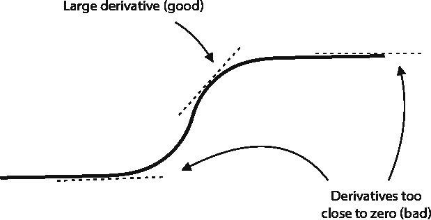

图 10.17 sigmoid 函数在两端平坦，这意味着对于大的正负值，其导数非常小，这阻碍了训练。

在反向传播过程中，我们组合了许多 sigmoid 函数（这意味着我们反复将 sigmoid 函数的输出作为另一个 sigmoid 函数的输入）。正如预期的那样，这种组合导致导数非常接近于零，这意味着反向传播中采取的步骤非常小。如果这种情况发生，我们可能需要很长时间才能得到一个好的分类器，这是一个问题。

我们有几个解决梯度消失问题的方案，到目前为止，其中最有效的一个是改变激活函数。在“不同的激活函数”这一节中，我们学习了一些新的激活函数，以帮助我们处理梯度消失问题。

训练神经网络的技巧：正则化和 dropout

如前所述，神经网络容易过拟合。在本节中，我们讨论了一些在神经网络训练过程中减少过拟合量的技术。

我们如何选择正确的架构？这是一个困难的问题，没有具体的答案。通常的做法是选择一个比我们可能需要的更大的架构，然后应用技术来减少网络可能有的过拟合量。在某种程度上，这就像挑选一条裤子，你唯一的选择要么太小要么太大。如果我们选择太小的裤子，我们几乎无能为力。另一方面，如果我们选择太大的裤子，我们可以用皮带调整使其更合身。这并不理想，但这是我们目前唯一的选择。根据数据集选择正确的架构是一个复杂的问题，目前在这个方向上正在进行大量研究。想了解更多，请参阅附录 C 中的资源。

正则化：通过惩罚更高的权重来减少过拟合的方法

如我们在第四章所学，我们可以使用 L1 和 L2 正则化来减少回归和分类模型中的过拟合，神经网络也不例外。在神经网络中应用正则化的方式与在线性回归中应用的方式相同——通过向误差函数中添加一个正则化项。如果我们进行 L1 正则化，正则化项等于正则化参数（λ）乘以我们模型中所有权重（不包括偏置）的绝对值之和。如果我们进行 L2 正则化，那么我们取平方和而不是绝对值。例如，在“具有示例的神经网络”部分中的示例神经网络，其 L2 正则化误差为

*对数损失* + λ *·* (6² + 10² + 10² + 6² + 1² + 1²) = *对数损失* + 274λ。

Dropout：确保少数强节点不会主导训练

Dropout 是一种用于减少神经网络过拟合的有趣技术，为了理解它，让我们考虑以下类比：想象我们习惯用右手，喜欢去健身房。过了一段时间，我们开始注意到我们的右二头肌长得很多，但左边的却没有。然后我们开始更加关注我们的训练，并意识到因为我们习惯用右手，所以我们总是用右手拿起杠铃，没有让左手得到足够的锻炼。我们决定不能再这样下去了，于是采取了一个激进的措施。有些日子我们决定把右手绑在背后，强迫自己整个训练过程不用右手。这样之后，我们开始看到左臂开始按照预期增长。现在，为了让两只手臂都得到锻炼，我们这样做：每天去健身房之前，我们抛两个硬币，一个代表每只手臂。如果左边的硬币正面朝上，我们就把左臂绑在背后，如果右臂的硬币正面朝上，我们就把右臂绑在背后。有些日子我们会用两只手臂工作，有些日子只用一只，有些日子则不用（可能是腿部训练日）。硬币的随机性将确保，平均来看，我们几乎同样地锻炼两只手臂。

Dropout 使用这个逻辑，除了使用臂之外，我们在神经网络中训练权重。当一个神经网络有太多节点时，一些节点会捕捉到数据中的模式，这些模式对于做出良好的预测是有用的，而其他节点则会捕捉到嘈杂或不相关的模式。Dropout 过程在每个 epoch 随机移除一些节点，并对剩余的节点执行一次梯度下降步骤。通过在每个 epoch 移除一些节点，我们可能会移除那些已经捕捉到有用模式的节点，从而迫使其他节点承担更多的责任。

更具体地说，dropout 过程为每个神经元附加一个小的概率*p*。在训练过程的每个 epoch 中，每个神经元以概率*p*被移除，神经网络只训练剩余的神经元。Dropout 仅在隐藏层中使用，而不是在输入或输出层中。dropout 过程在图 10.18 中说明，其中在每个训练的四个 epoch 中移除了一些神经元。

Dropout 过程如图 10.18 所示。在不同的 epoch 中，我们随机选择节点从训练中移除，以给所有节点一个更新其权重的机会，避免少数单个节点主导训练。

Dropout 在实践中有很大的成功，我鼓励你在每次训练神经网络时都使用它。我们用于训练神经网络的包使其易于使用，正如我们将在本章后面看到的那样。

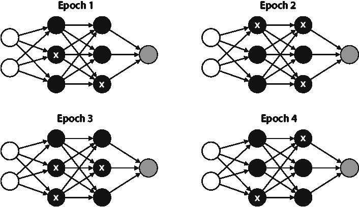

图 10.18 dropout 过程。在不同的 epoch 中，我们随机选择节点从训练中移除，以给所有节点一个更新其权重的机会，避免少数单个节点主导训练。

不同的激活函数：双曲正切（tanh）和修正线性单元（ReLU）

正如我们在“潜在问题”部分看到的那样，sigmoid 函数有点太平坦，这会导致梯度消失问题。解决这个问题的一个方法是使用不同的激活函数。在本节中，我们介绍了两个对改进我们的训练过程至关重要的不同激活函数：双曲正切（tanh）和修正线性单元（ReLU）

双曲正切（tanh）

由于其形状，双曲正切函数在实践中往往比 sigmoid 函数表现更好，其公式如下：

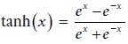

Tanh 比 sigmoid 稍微平坦一些，但形状仍然相似，如图 10.19 所示。它对 sigmoid 有所改进，但仍然存在梯度消失问题。

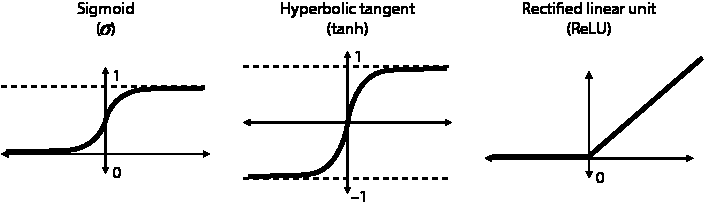

图 10.19 神经网络中使用的三种不同的激活函数。左：sigmoid 函数，用希腊字母*sigma*表示。中：双曲正切，或 tanh。右：修正线性单元，或 ReLU。

修正线性单元（ReLU）

在神经网络中常用的一种更受欢迎的激活函数是修正线性单元，或 ReLU。这个很简单：如果输入是负数，输出是零；否则，输出等于输入。换句话说，它对非负数保持不变，并将所有负数转换为零。对于*x* ≥ 0，*ReLU*(*x*) = *x*，对于*x* < 0，*ReLU*(*x*) = 0。ReLU 是解决梯度消失问题的良好解决方案，因为当输入为正时，其导数为 1，因此，它在大型神经网络中得到了广泛的应用。

这些激活函数的伟大之处在于我们可以在同一个神经网络中组合不同的激活函数。在最常见的架构之一中，每个节点都使用 ReLU 激活函数，除了最后一个节点，它使用 sigmoid。在最后使用 sigmoid 的原因是，如果我们的问题是分类问题，神经网络的输出必须在 0 到 1 之间。

具有多个输出的神经网络：softmax 函数

到目前为止，我们使用的神经网络只有一个输出。然而，使用我们在第六章“将数据分类到多个类别：softmax 函数”部分学到的 softmax 函数构建一个产生多个输出的神经网络并不困难。softmax 函数是 sigmoid 的多变量扩展，我们可以用它将分数转换为概率。

最好的方式是通过一个例子来说明 softmax 函数。想象一下，我们有一个神经网络，其任务是确定图像中是否包含河马、鸟、猫或狗。在最后一层，我们有四个节点，每个节点对应一种动物。我们不是将 sigmoid 函数应用于来自前一层的分数，而是将 softmax 函数应用于所有这些分数。例如，如果分数是 0、3、1 和 1，softmax 返回以下结果：

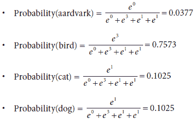

这些结果表明神经网络强烈相信该图像对应于一只鸟。

超参数

与大多数机器学习算法一样，神经网络使用许多超参数，我们可以微调这些超参数以使它们工作得更好。这些超参数决定了我们的训练方式，即我们希望这个过程持续多长时间，以什么速度进行，以及我们如何选择将数据输入到模型中。神经网络中最重要的几个超参数如下：

+   **学习率 *η***：我们在训练过程中使用的步长大小

+   **训练轮数**：我们用于训练的步数

+   **批量 vs. 小批量 vs. 随机梯度下降**：一次进入训练过程的数据点数量——也就是说，我们是逐个输入点，批量输入，还是同时全部输入？

+   **架构**：

    +   神经网络中的层数

    +   每层的节点数

    +   每个节点使用的激活函数

+   **正则化参数****：

    +   L1 或 L2 正则化

    +   正则化项 λ

+   **Dropout 概率 *p***

我们以与其他算法相同的方式调整这些超参数，使用诸如网格搜索等方法。在第十三章中，我们通过一个实际例子更详细地阐述了这些方法。

## 在 Keras 中编码神经网络

现在我们已经学习了神经网络背后的理论，是时候将它们付诸实践了！已经编写了许多用于神经网络的优秀软件包，例如 Keras、TensorFlow 和 PyTorch。这三个都非常强大，在本章中，我们将使用 Keras，因为它简单易用。我们将为两个不同的数据集构建两个神经网络。第一个数据集包含具有两个特征和标签 0 和 1 的点。该数据集是二维的，因此我们将能够查看模型创建的非线性边界。第二个数据集是图像识别中常用的数据集，称为 MNIST（修改后的国家标准与技术研究院）数据集。MNIST 数据集包含我们可以使用神经网络进行分类的手写数字。

二维空间中的图形示例

在本节中，我们将在图 10.20 所示的数据集上使用 Keras 训练一个神经网络。该数据集包含两个标签，0 和 1。标签为 0 的点被绘制为正方形，而标签为 1 的点被绘制为三角形。请注意，标签为 1 的点主要位于中心，而标签为 0 的点位于边缘。对于这种类型的数据集，我们需要一个具有非线性边界的分类器，这使得它成为神经网络的一个很好的例子。本节的代码如下：

+   **注意**: Graphical_example.ipynb

    +   [`github.com/luisguiserrano/manning/blob/master/Chapter_10_Neural_Networks/Graphical_example.ipynb`](https://github.com/luisguiserrano/manning/blob/master/Chapter_10_Neural_Networks/Graphical_example.ipynb)

+   **数据集**: one_circle.csv

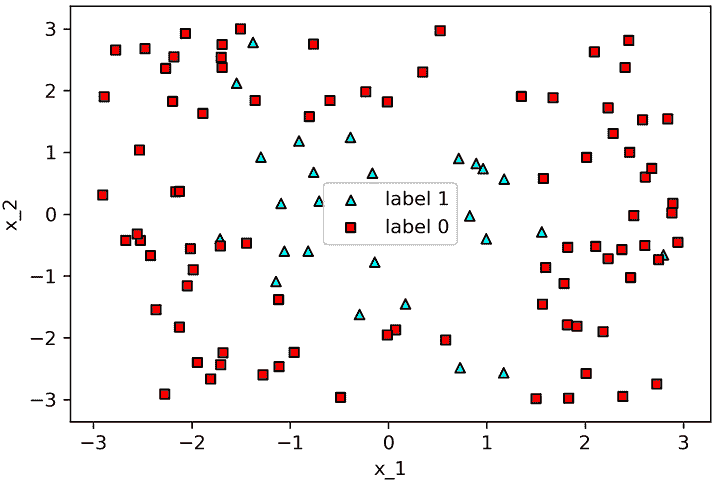

图 10.20 神经网络非常适合非线性可分集。为了测试这一点，我们将在这个圆形数据集上训练一个神经网络。

在我们训练模型之前，让我们查看我们数据中的某些随机行。输入将被称为 x，具有特征 x_1 和 x_2，输出将被称为 y。表 10.3 包含一些样本数据点。该数据集有 110 行。

表 10.3 包含 110 行、两个特征和标签 0 和 1 的数据集

| x_1 | x_2 | *y*   |
| --- | --- | --- |
| –0.759416 | 2.753240 | 0 |
| –1.885278 | 1.629527 | 0 |
| ... | ... | ... |
| 0.729767 | –2.479655 | 1 |
| –1.715920 | –0.393404 | 1 |

在我们构建和训练神经网络之前，我们必须进行一些数据预处理。

对我们的数据进行分类：将非二进制特征转换为二进制

在这个数据集中，输出是一个介于 0 到 1 之间的数字，但它代表两个类别。在 Keras 中，建议对这种类型的输出进行分类。这仅仅意味着标签为 0 的点现在将具有标签[1,0]，而标签为 1 的点现在将具有标签[0,1]。我们使用以下 `to_categorical` 函数来完成这项操作：

```
from tensorflow.keras.utils import to_categorical
categorized_y = np.array(to_categorical(y, 2))
```

新的标签称为 `categorized_y`。

神经网络的架构

在本节中，我们构建了此数据集的神经网络架构。决定使用哪种架构并不是一门精确的科学，但通常建议比实际的小一点更好。对于这个数据集，我们将使用以下架构，包含两个隐藏层（图 10.21）：

+   输入层

    +   大小：2

+   第一个隐藏层

    +   大小：128

    +   激活函数：ReLU

+   第二个隐藏层

    +   大小：64

    +   激活函数：ReLU

+   输出层

    +   大小：2

    +   激活函数：softmax

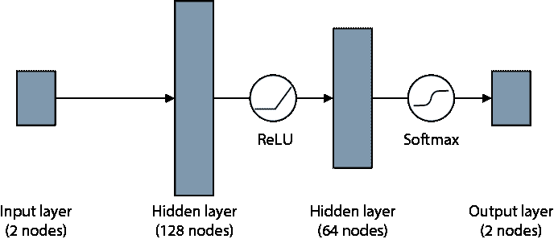

图 10.21 我们将用于分类数据集的架构。它包含两个隐藏层：一个有 128 个节点，另一个有 64 个节点。它们之间的激活函数是 ReLU，最终的激活函数是 softmax。

此外，我们将在隐藏层之间添加 dropout 层，dropout 概率为 0.2，以防止过拟合。

在 Keras 中构建模型

在 Keras 中构建神经网络只需要几行代码。首先，我们按照以下方式导入必要的包和函数：

```
from tensorflow.keras.models import Sequential
from tensorflow.keras.layers import Dense, Dropout, Activation
```

现在，让我们定义模型，其架构与我们之前小节中定义的架构相同。首先，我们使用以下行定义模型：

```
model = Sequential()                                       ❶
model.add(Dense(128, activation='relu', input_shape=(2,))) ❷
model.add(Dropout(.2))                                     ❸
model.add(Dense(64, activation='relu'))                    ❹
model.add(Dropout(.2))
model.add(Dense(2, activation='softmax'))                  ❺
```

❶ 定义模型

❷ 添加第一个隐藏层，并使用 ReLU 激活函数

❸ 添加一个概率为 0.2 的 dropout

❹ 添加第二个隐藏层，并使用 ReLU 激活函数

❺ 添加输出层，并使用 softmax 激活函数

一旦定义了模型，我们就可以编译它，如下所示：

```
model.compile(loss = 'categorical_crossentropy', optimizer='adam', metrics=['accuracy'])
```

`compile`函数中的参数如下：

+   `loss = 'categorical_crossentropy'`：这是损失函数，我们将其定义为对数损失。因为我们的标签有多列，我们需要使用对数损失函数的多变量版本，称为分类交叉熵。

+   `optimizer = 'adam'`：像 Keras 这样的包有很多内置技巧可以帮助我们以最佳方式训练模型。添加优化器到我们的训练中总是一个好主意。其中一些最好的是 Adam、SGD、RMSProp 和 AdaGrad。尝试使用其他优化器进行相同的训练，看看它们的性能如何。

+   `metrics = ['accuracy']`：随着训练的进行，我们会在每个 epoch 得到模型表现的报告。此标志允许我们定义在训练期间想要看到的指标，在这个例子中，我们选择了准确率。

当我们运行代码时，我们会得到架构和参数数量的摘要，如下所示：

```
Model: "sequential"
_________________________________________________________________
Layer (type)         Output Shape                Param #
=================================================================
dense (Dense)        (None, 128)                 384
_________________________________________________________________
dropout (Dropout)    (None, 128)                 0
_________________________________________________________________
dense_1 (Dense)      (None, 64)                  8256
_________________________________________________________________
dropout_1 (Dropout)  (None, 64)                  0
_________________________________________________________________
dense_2 (Dense)      (None, 2)                   130
=================================================================
Total params: 8,770
Trainable params: 8,770
Non-trainable params: 0
_________________________________________________________________
```

前一个输出中的每一行代表一个层（为了描述目的，dropout 层被视为单独的层）。列对应于层的类型、形状（节点数）和参数数量，这正好是权重数加上偏置数。此模型总共有 8,770 个可训练参数。

训练模型

对于训练，只需要一行简单的代码，如下所示：

```
model.fit(x, categorized_y, epochs=100, batch_size=10)
```

让我们检查 fit 函数的每个输入。

+   `x and categorized_y`：分别是特征和标签。

+   `epochs`：我们在整个数据集上运行反向传播的次数。在这里，我们做了 100 次。

+   `batch_size`：我们用于训练模型的批次的长度。在这里，我们以 10 个批次向模型介绍我们的数据。对于如此小的数据集，我们不需要分批输入，但在这个例子中，我们这样做是为了展示。

随着模型的训练，它会在每个时代输出一些信息，即损失（误差函数）和准确率。为了对比，注意第一个时代损失高、准确率低，而最后一个时代在这两个指标上都有更好的结果：

```
Epoch 1/100
11/11 [==============================] - 0s 2ms/step - loss: 0.5473 - accuracy: 0.7182
...
Epoch 100/100
11/11 [==============================] - 0s 2ms/step - loss: 0.2110 - accuracy: 0.9000
```

模型在训练集上的最终准确率为 0.9。这很好，尽管请记住，准确率必须在测试集中计算。这里我不会做，但尝试将数据集分成训练集和测试集，并重新训练这个神经网络，看看你获得什么测试准确率。图 10.22 显示了神经网络边界的图。

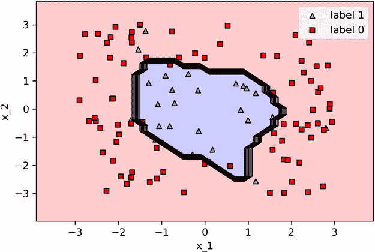

图 10.22 我们训练的神经网络分类器的边界。注意它正确地分类了大多数点，但有少数例外。

注意，模型成功地将数据分类得相当好，将三角形包围起来，将正方形留在外面。由于数据噪声，它犯了一些错误，但这没关系。有缺陷的边界暗示了轻微的过拟合，但总的来说，这似乎是一个不错的模型。

训练用于图像识别的神经网络

在本节中，我们学习如何训练用于图像识别的神经网络。我们使用的数据集是 MNIST，这是一个流行的图像识别数据集，包含从 0 到 9 的 70000 个手写数字。每张图像的标签是对应的数字。每个灰度图像都是一个 28x28 的数字矩阵，数值介于 0 到 255 之间，其中 0 代表白色，255 代表黑色，介于两者之间的任何数值代表灰色。本节的代码如下：

+   **笔记本**：Image_recognition.ipynb

    +   [`github.com/luisguiserrano/manning/blob/master/Chapter_10_Neural_Networks/Image_recognition.ipynb`](https://github.com/luisguiserrano/manning/blob/master/Chapter_10_Neural_Networks/Image_recognition.ipynb)

+   **数据集**：MNIST（与 Keras 预加载）

加载数据

此数据集在 Keras 中预先加载，因此很容易将其加载到 NumPy 数组中。实际上，它已经被分成了大小为 60,000 和 10,000 的训练集和测试集。以下代码行将它们加载到 NumPy 数组中：

```
from tensorflow import keras
(x_train, y_train), (x_test, y_test) = keras.datasets.mnist.load_data()
```

在图 10.23 中，你可以看到数据集中的前五张图像及其标签。


图 10.23 MNIST 中一些手写数字的示例及其标签

数据预处理

神经网络接收向量作为输入而不是矩阵，因此我们必须将每个 28x28 的图像转换成长度为 28²=784 的长向量。我们可以使用`reshape`函数来完成此操作，如下所示：

```
x_train_reshaped = x_train.reshape(-1, 28*28)
x_test_reshaped = x_test.reshape(-1, 28*28)
```

与前面的例子一样，我们也必须对标签进行分类。因为标签是一个介于 0 到 9 之间的数字，我们必须将其转换成一个长度为 10 的向量，其中对应标签的项是一个 1，其余都是 0。我们可以通过以下代码行来完成这个操作：

```
y_train_cat = to_categorical(y_train, 10)
y_test_cat = to_categorical(y_test, 10)
```

这个过程在图 10.24 中得到了说明。

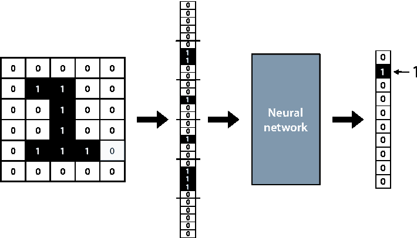

图 10.24 在训练神经网络之前，我们以以下方式预处理图像和标签。我们将矩形图像通过连接行塑造成一个长向量。然后我们将每个标签转换成一个长度为 10 的向量，其中对应标签的位置只有一个非零项。

构建和训练模型

我们可以使用与前面模型相同的架构，只是稍作修改，因为现在的输入大小是 784。在下面的代码行中，我们定义了模型及其架构：

```
model = Sequential()
model.add(Dense(128, activation='relu', input_shape=(28*28,)))
model.add(Dropout(.2))
model.add(Dense(64, activation='relu'))
model.add(Dropout(.2))
model.add(Dense(10, activation='softmax'))
```

现在我们以 10 个批次的规模编译并训练模型 10 个周期，如图所示。这个模型有 109,386 个可训练参数，所以在你的电脑上训练 10 个周期可能需要几分钟。

```
model.compile(loss = 'categorical_crossentropy', optimizer='adam', metrics=['accuracy'])
model.fit(x_train_reshaped, y_train_cat, epochs=10, batch_size=10)
```

观察输出，我们可以看到模型的训练准确率为 0.9164，这很好，但让我们评估测试准确率以确保模型没有过拟合。

评估模型

我们可以通过在测试数据集上进行预测并将它们与标签进行比较来评估测试集的准确率。神经网络输出长度为 10 的向量，其中包含它分配给每个标签的概率，因此我们可以通过查看这个向量中最大值的项来获得预测，如下所示：

```
predictions_vector = model.predict(x_test_reshaped)
predictions = [np.argmax(pred) for pred in predictions_vector]
```

当我们将这些与标签进行比较时，我们得到了 0.942 的测试准确率，这相当不错。我们可以通过更复杂的架构，如卷积神经网络（更多内容将在下一节中介绍），做得更好，但知道即使是一个小型全连接神经网络，我们也能在图像识别问题上做得相当好。

现在我们来看一些预测结果。在图 10.25 中，我们可以看到一个正确的预测（左）和一个错误的预测（右）。注意，错误的预测是一个写得很差的数字 3 的图像，它也有一点像数字 8。

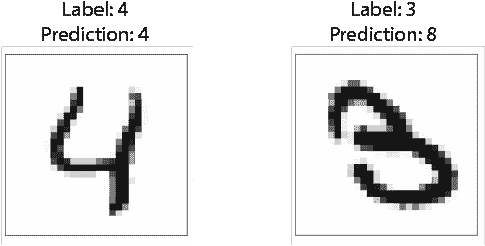

图 10.25 左：一个被神经网络正确分类的 4 的图像。右：一个被错误分类为 8 的 3 的图像。

通过这个练习，我们可以看到，使用 Keras 的几行代码训练这样一个大型神经网络的过程非常简单！当然，这里还有很多其他可以做的事情。玩转这个笔记本，向神经网络添加更多层，改变超参数，看看你能将这个模型的测试准确率提高到多高！

## 用于回归的神经网络

在本章中，我们看到了如何使用神经网络作为分类模型，但神经网络作为回归模型同样有用。幸运的是，我们只需要对分类神经网络进行两项小的调整，就可以得到一个回归神经网络。第一项调整是从神经网络中移除最终的 sigmoid 函数。这个函数的作用是将输入转换为 0 到 1 之间的数字，因此如果我们移除它，神经网络将能够返回任何数字。第二项调整是将误差函数更改为绝对误差或均方误差，因为这些是回归相关的误差函数。其他所有内容都将保持不变，包括训练过程。

函数的作用是将输入转换为 0 到 1 之间的数字，因此如果我们移除它，神经网络将能够返回任何数字。第二项调整是将误差函数更改为绝对误差或均方误差，因为这些是回归相关的误差函数。其他所有内容都将保持不变，包括训练过程。

例如，让我们看看第 10.7 节“感知器的图形表示”中的图 10.7 中的感知器。这个感知器做出预测 *ŷ* = *σ*(3*x*[1] – 2*x*[2] + 4*x*[3] + 2)。如果我们移除 sigmoid 激活函数，新的感知器将做出预测 *ŷ* = 3*x*[1] – 2*x*[2] + 4*x*[3] + 2。这个感知器在图 10.26 中展示。注意，这个感知器代表了一个线性回归模型。

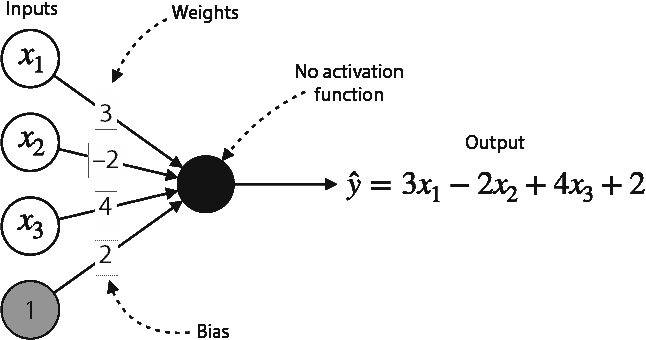

图 10.26 如果我们从感知器中移除激活函数，我们将分类模型转换为线性回归模型。线性回归模型可以预测任何数值，而不仅仅是 0 到 1 之间的一个数值。

为了说明这个过程，我们在 Keras 上使用一个熟悉的数据集：海得拉巴的房价数据集进行神经网络训练。回想一下，在第三章的“实际应用：使用 Turi Create 预测印度房价”部分，我们训练了一个线性回归模型来拟合这个数据集。这一部分的代码如下：

+   **笔记本**：House_price_predictions_neural_network.ipynb

    +   [`github.com/luisguiserrano/manning/blob/master/Chapter_10_Neural_Networks/House_price_predictions_neural_network.ipynb`](https://github.com/luisguiserrano/manning/blob/master/Chapter_10_Neural_Networks/House_price_predictions_neural_network.ipynb)

+   **数据集**：Hyderabad.csv

加载数据集和将数据集拆分为特征和标签的详细信息可以在笔记本中找到。我们将使用的神经网络架构如下：

+   输入层大小为 38（数据集的列数）

+   一个大小为 128 的隐藏层，带有 ReLU 激活函数和 0.2 的 dropout 参数

+   一个大小为 64 的隐藏层，带有 ReLU 激活函数和 0.2 的 dropout 参数

+   输出层大小为 1，没有激活函数

```
model = Sequential()
model.add(Dense(38, activation='relu', input_shape=(38,)))
model.add(Dropout(.2))
model.add(Dense(128, activation='relu'))
model.add(Dropout(.2))
model.add(Dense(64, activation='relu'))
model.add(Dropout(.2))
model.add(Dense(1))
```

为了训练神经网络，我们使用均方误差函数和 Adam 优化器。我们将使用 10 个批次的 10 个 epoch 进行训练，如下所示：

```
model.compile(loss = 'mean_squared_error', optimizer='adam')
model.fit(features, labels, epochs=10, batch_size=10)
```

这个神经网络在训练数据集上报告了 553,542.5 的均方根误差。通过添加测试集并调整架构来进一步研究这个模型，看看你能将其改进多少！

## 更复杂数据集的其他架构

神经网络在许多应用中都非常有用，可能比目前任何其他机器学习算法都要有用。神经网络最重要的特性之一是其多功能性。我们可以以非常有趣的方式修改架构，以更好地适应我们的数据和解决问题。要了解更多关于这些架构的信息，请参阅安德鲁·特拉斯特（Andrew Trask）的《Grokking Deep Learning》（Manning, 2019）以及附录 C 中或[`serrano.academy/neural-networks/`](https://serrano.academy/neural-networks/)提供的视频集。

神经网络如何“看”：卷积神经网络（CNN）

正如我们在本章中学到的，神经网络在图像处理方面非常出色，我们可以在许多应用中使用它们，如下所示：

+   **图像识别**：输入是一个图像，输出是图像上的标签。以下是一些用于图像识别的著名数据集：

    +   MNIST：28-by-28 灰度图像中的手写数字

    +   CIFAR-10：彩色图像，有 10 个标签，如飞机、汽车等，在 32-by-32 的图像中

    +   CIFAR-100：类似于 CIFAR-10，但有 100 个标签，如水生哺乳动物、花卉等

+   **语义分割**：输入是一个图像，输出不仅包括图像中找到的物体的标签，还包括它们在图像中的位置。通常，神经网络将这个位置输出为图像中的一个边界矩形。

在“训练用于图像识别的神经网络”这一节中，我们构建了一个小型、全连接的神经网络，它对 MNIST 数据集的分类效果相当不错。然而，对于更复杂的图像，如图片和面部，这样的神经网络表现不会很好，因为将图像转换为长向量会丢失很多信息。对于这些复杂的图像，我们需要不同的架构，这就是卷积神经网络帮助我们的地方。

关于神经网络的详细信息，请参阅附录 C 中的资源，但以下是他们工作的大致概述。想象一下，我们有一个大图像需要处理。我们取一个较小的窗口，比如 5-by-5 或 7-by-7 像素，然后将其在大型图像上滑动。每次通过时，我们应用一个称为卷积的公式。因此，我们最终得到一个稍微小一点的过滤图像，它在某种程度上总结了上一个图像——这是一个卷积层。卷积神经网络由几个这样的卷积层和一些全连接层组成。

当涉及到复杂的图像时，我们通常不会从头开始训练神经网络。一种有用的技术称为**迁移学习**，它包括从一个预训练的网络开始，并使用我们的数据来调整其一些参数（通常是最后一层）。这种技术通常效果很好，且计算成本较低。InceptionV3、ImageNet、ResNet 和 VGG 等网络都是由拥有强大计算能力的公司和研究机构训练的，因此我们强烈推荐使用它们。

神经网络如何说话：循环神经网络（RNN）、门控循环单元（GRU）和长短期记忆网络（LSTM）

神经网络最迷人的应用之一是当我们能让它们与我们交谈或理解我们所说的话时。这涉及到倾听我们说的话或阅读我们写的内容，分析它，并能够做出回应或行动。计算机理解和处理语言的能力被称为自然语言处理。神经网络在自然语言处理方面取得了许多成功。本章开头提到的情感分析示例就是自然语言处理的一部分，因为它涉及到理解句子并确定它们是否具有积极或消极的情感。正如你可以想象的那样，还存在许多更前沿的应用，例如以下内容：

+   **机器翻译**：将句子从一种语言翻译成另一种语言。

+   **语音识别**：解码人类语音并将其转换为文本。

+   **文本摘要**：将大量文本总结成几段。

+   **聊天机器人**：一种可以与人类交谈并回答问题的系统。这些系统尚未完善，但有用的聊天机器人通常在特定主题下运行，例如客户支持。

对于处理文本来说，最有效的架构是*循环神经网络*，以及它们的更高级版本，称为*长短期记忆网络*（LSTM）和*门控循环单元*（GRU）。为了理解它们是什么，想象一个神经网络，其中输出被作为输入的一部分重新连接到网络中。这样，神经网络就有了记忆，当训练得当，这种记忆可以帮助它们理解文本中的主题。

神经网络如何绘制画作：生成对抗网络（GAN）

神经网络最迷人的应用之一是生成。到目前为止，神经网络（以及本书中大多数其他机器学习模型）在预测机器学习方面表现良好，即能够回答诸如“那是什么价格？”或“这是猫还是狗？”等问题。然而，近年来，在被称为*生成机器学习*的迷人领域取得了许多进展。生成机器学习是机器学习的一个领域，它教会计算机如何创造事物，而不仅仅是回答问题。绘画、作曲或写故事等行为代表了理解世界的一个更高层次。

毫无疑问，在过去的几年里，最重要的进步之一是**生成对抗网络**（GANs）的发展。在图像生成方面，生成对抗网络展现出了令人着迷的结果。GANs 由两个相互竞争的网络组成，即生成器和判别器。生成器试图生成看起来真实的图像，而判别器则试图区分真实图像和伪造图像。在训练过程中，我们向判别器提供真实图像以及生成器生成的伪造图像。当应用于人脸数据集时，这个过程产生了一个能够生成一些非常逼真的人脸的生成器。事实上，它们看起来如此逼真，以至于人类往往很难区分它们。你可以通过一个 GAN 来测试自己——[`www.whichfaceisreal.com`](https://www.whichfaceisreal.com)。

## 摘要

+   神经网络是一种用于分类和回归的强大模型。神经网络由一组按层组织的感觉器组成，其中一层输出的结果作为下一层的输入。它们的复杂性使它们能够在其他机器学习模型难以应用的领域中取得巨大成功。

+   神经网络在许多领域都有前沿的应用，包括图像识别和文本处理。

+   神经网络的基本构建块是感知器。感知器接收几个值作为输入，通过将输入乘以权重、添加偏差并应用激活函数来输出一个值。

+   流行的激活函数包括 sigmoid、双曲正切、softmax 和修正线性单元（ReLU）。它们用于神经网络中的层之间，以打破线性并帮助我们构建更复杂的边界。

+   Sigmoid 函数是一个简单的函数，它将任何实数映射到 0 和 1 之间的区间。双曲正切函数类似，但输出是-1 和 1 之间的区间。它们的目标是将我们的输入挤压到一个小区间内，以便我们的答案可以被解释为类别。它们主要用于神经网络中的最终（输出）层。由于它们的导数平坦，它们可能会导致梯度消失问题。

+   ReLU 函数是一个将负数映射到 0，非负数映射到自身的函数。它在减少梯度消失问题方面取得了巨大成功，因此比 sigmoid 函数或双曲正切函数更多地用于神经网络训练。

+   神经网络具有非常复杂的结构，这使得它们难以训练。我们用来训练它们的称为反向传播的过程已经取得了巨大成功。反向传播包括对损失函数求导，并找到所有关于模型所有权重的偏导数。然后我们使用这些导数迭代地更新模型的权重，以提高其性能。

+   神经网络容易过拟合和其他问题，如梯度消失，但我们可以使用正则化和 dropout 等技术来帮助减少这些问题。

+   我们有一些有用的包来训练神经网络，例如 Keras、TensorFlow 和 PyTorch。这些包使我们能够非常容易地训练神经网络，因为我们只需要定义模型的架构和误差函数，它们会负责训练。此外，它们有许多内置的先进优化器，我们可以利用这些优化器。

## 练习

练习 10.1

以下图像显示了一个所有激活都是 sigmoid 函数的神经网络。

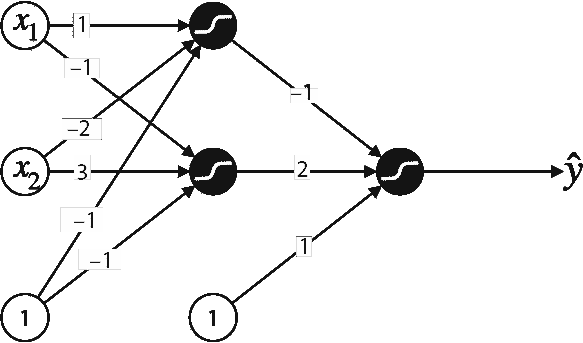

这个神经网络会对输入(1,1)做出什么预测？

练习 10.2

正如我们在练习 5.3 中学到的，不可能构建一个模拟 XOR 门的感知器。换句话说，不可能使用感知器拟合以下数据集并获得 100%的准确率：

| *x*[1] | *x*[2] | *y*   |
| --- | --- | --- |
| 0 | 0 | 0 |
| 0 | 1 | 1 |
| 1 | 0 | 1 |
| 1 | 1 | 0 |

这是因为数据集不是线性可分的。使用深度为 2 的神经网络，构建一个模拟之前显示的 XOR 门的感知器。作为激活函数，使用步函数而不是 sigmoid 函数以获得离散输出。

提示：使用训练方法来做这个可能会很困难；相反，尝试凭直觉调整权重。尝试（或在网上搜索如何）使用 AND、OR 和 NOT 门构建一个 XOR 门，并使用练习 5.3 的结果来帮助你。

练习 10.3

在“神经网络图形表示”部分的结尾，我们看到了图 10.13 中的神经网络，其激活函数与表 10.1 中的数据集不匹配，因为点(1,1)被错误分类。

1.  验证这是否是这种情况。

1.  改变权重，使神经网络能够正确分类每个点。
