# 11 以风格寻找边界：支持向量机和核方法

在本章

+   支持向量机是什么

+   对于一个数据集，哪个线性分类器有最好的边界

+   使用核方法构建非线性分类器

+   在 Scikit-Learn 中编码支持向量机和核方法


专家建议在尝试分离鸡数据集时使用核方法。

在本章中，我们讨论了一个强大的分类模型，称为支持向量机（简称 SVM）。SVM 与感知器类似，因为它使用线性边界将两个类别的数据集分开。然而，SVM 的目标是找到尽可能远离数据集中点的线性边界。我们还介绍了核方法，当与 SVM 结合使用时非常有用，并且可以帮助使用高度非线性边界来分类数据集。

在第五章，我们学习了线性分类器，或感知器。对于二维数据，这些由一条线定义，该线将具有两个标签的点组成的数据集分开。然而，我们可能已经注意到，许多不同的线可以分离一个数据集，这引发以下问题：我们如何知道哪条是最好的线？在图 11.1 中，我们可以看到三种不同的线性分类器，它们将这个数据集分开。你更喜欢分类器 1、2 还是 3？

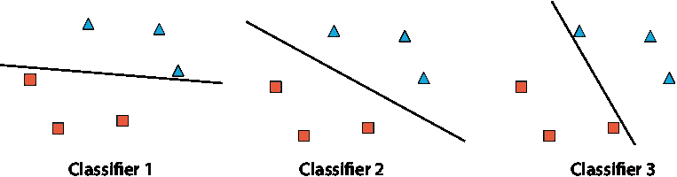

图 11.1 三种正确分类我们的数据集的分类器。我们应该选择分类器 1、2 还是 3？

如果你说是分类器 2，我们同意。这三条线都很好地分离了数据集，但第二条线放置得更好。第一条和第三条线与一些点非常接近，而第二条线与所有点都保持距离。如果我们稍微调整这三条线，第一条和第三条可能会越过一些点，在这个过程中错误地分类一些点，而第二条线仍然会正确地分类所有点。因此，分类器 2 比分类器 1 和 3 更稳健。

这就是支持向量机发挥作用的地方。SVM 分类器使用两条平行线而不是一条线。SVM 的目标有两个；它试图正确地分类数据，并且试图尽可能地将线分开。在图 11.2 中，我们可以看到三个分类器的两条平行线，以及它们的中间线作为参考。分类器 2 中的两条外部（虚线）线彼此距离最远，这使得这个分类器成为最好的一个。

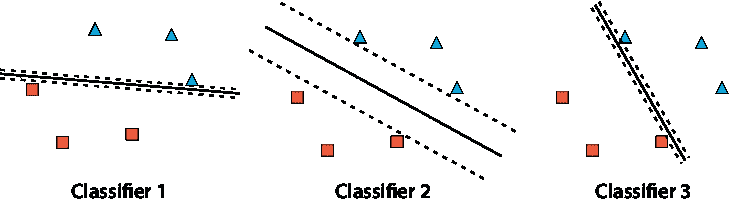

图 11.2 我们将我们的分类器绘制为两条尽可能远的平行线。我们可以看到分类器 2 是两条平行线之间距离最远的那一个。这意味着分类器 2 中的中间线是位于这些点之间位置最好的那一条。

我们可能想要将支持向量机（SVM）可视化为中心的那条线，它试图尽可能远离这些点。我们也可以想象成两条外部平行的线，试图尽可能远离彼此。在本章中，我们将根据不同情况在不同时间使用这两种可视化方法，因为每种方法在特定情况下都很有用。

我们如何构建这样的分类器？我们可以用与之前类似的方式来做，只是使用一个稍微不同的误差函数和稍微不同的迭代步骤。

注意：在本章中，所有分类器都是离散的，即它们的输出是 0 或 1。有时它们通过预测 *ŷ* = *step*(*f*(*x*)) 来描述，有时通过边界方程 *f*(*x*) = 0 来描述，即尝试将我们的数据点分为两个类别的函数的图像。例如，预测 *ŷ* = *step*(3*x*[1] + 4*x*[2] – 1) 的感知器有时仅通过线性方程 3*x*[1] + 4*x*[2] – 1 = 0 来描述。在本章的一些分类器中，尤其是在“使用非线性边界训练 SVM：核方法”这一节中，边界方程不一定是一个线性函数。

在本章中，我们主要在单维和二维数据集（线上的点或平面上的点）上看到这种理论。然而，支持向量机在更高维度的数据集上同样表现良好。一维中的线性边界是点，二维中的线性边界是线。同样，三维中的线性边界是平面，而在更高维度中，它们是比点所在空间低一维的超平面。在这些所有情况下，我们都试图找到离点最远的边界。在图 11.3 中，你可以看到一维、二维和三维边界的示例。

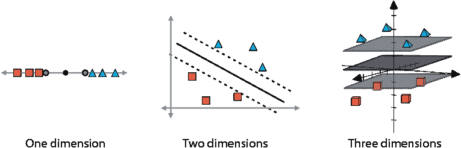

图 11.3 展示了单维、二维和三维数据集的线性边界。在一维中，边界由两个点形成，在二维中由两条线形成，在三维中由两个平面形成。在每种情况下，我们都试图尽可能地将这两者分开。中间的边界（点、线或平面）为了清晰起见进行了说明。

本章的所有代码都存放在这个 GitHub 仓库中：[`github.com/luisguiserrano/manning/tree/master/Chapter_11_Support_Vector_Machines`](https://github.com/luisguiserrano/manning/tree/master/Chapter_11_Support_Vector_Machines)。

## 使用新的误差函数构建更好的分类器

如同机器学习模型中常见的那样，SVM 是通过一个误差函数来定义的。在本节中，我们将看到 SVM 的误差函数，它非常特殊，因为它试图同时最大化两件事：点的分类和线的距离。

要训练一个 SVM，我们需要为两个尽可能分开的线构建一个分类器的错误函数。当我们思考构建错误函数时，我们应该始终问自己：“我们希望模型实现什么？”以下是我们想要实现的两件事：

+   每条线都应该尽可能好地分类点。

+   这两条线应该尽可能远。

错误函数应该惩罚任何未能实现这些目标的模型。因为我们想要两件事，所以我们的 SVM 错误函数应该是两个错误函数的和：第一个惩罚被错误分类的点，第二个惩罚彼此太近的线。因此，我们的错误函数可以看起来像这样：

错误 = 分类错误 + 距离错误

在接下来的两个部分中，我们将分别开发这两个术语中的每一个。

分类错误函数：尝试正确分类点

在本节中，我们学习分类错误函数。这是推动分类器正确分类点的错误函数的一部分。简而言之，这个错误是这样计算的。因为分类器由两条线组成，我们把它们看作是两个独立的离散感知器（第五章）。然后我们计算这个分类器的总错误，即两个感知器错误的和（第五章“如何比较分类器？错误函数”部分）。让我们看一个例子。

SVM 使用两条平行线，幸运的是，平行线有相似的方程；它们有相同的权重但不同的偏置。因此，在我们的 SVM 中，我们使用中心线作为参考框架 L，其方程为*w*[1]*x*[1] + *w*[2]*x*[2] + *b* = 0，并构建两条线，一条在上面，一条在下面，相应的方程为：

+   L+：*w*[1]*x*[1] + *w*[2]*x*[2] + *b* = 1，并且

+   L–：*w*[1]*x*[1] + *w*[2]*x*[2] + *b* = –1

例如，图 11.4 显示了三条平行线 L、L+和 L–，它们的方程如下：

+   L：2*x*[1] + 3*x*[2] – 6 = 0

+   L+：2*x*[1] + 3*x*[2] – 6 = 1

+   L–：2*x*[1] + 3*x*[2] – 6 = –1

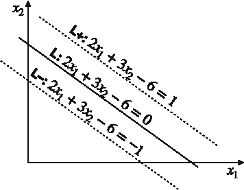

图 11.4 我们的主要线 L 是中间的那条。我们通过稍微改变 L 的方程来构建两个平行且等距的线 L+和 L–。

我们现在的分类器由线 L+和 L–组成。我们可以把 L+和 L–看作是两个独立的感知器分类器，它们各自的目标都是正确分类点。每个分类器都有自己的感知器错误函数，因此分类函数定义为这两个错误函数的和，如图 11.5 所示。

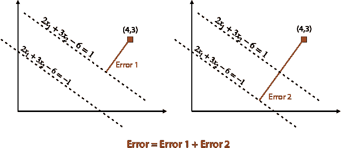

图 11.5 现在我们分类器由两条线组成，错误分类点的误差是根据这两条线来衡量的。然后我们将两个误差相加以获得分类误差。请注意，误差不是如图所示垂直线段的长度，而是与它成比例。

注意到在支持向量机（SVM）中，**两条**线都必须很好地对点进行分类。因此，位于两条线之间的点总是被其中一条线错误分类，所以它不被 SVM 视为正确分类的点。

回忆第五章“如何比较分类器？误差函数”部分的内容，离散感知器的误差函数，在点(*p*, *q*)处的预测 *ŷ* = *step*(*w*[1]*x*[1] + *w*[2]*x*[2] + *b*)，由以下给出：

+   0 如果点被正确分类，并且

+   |*w*[1]*x*[1] + *w*[2]*x*[2] + *b*| 如果点被错误分类

例如，考虑标签为 0 的点(4,3)。这个点在图 11.5 中的两个感知器都被错误分类。请注意，两个感知器给出了以下预测：

+   L+: *ŷ* = *step*(2*x*[1] + 3*x*[2] – 7)

+   L–: *ŷ* = *step*(2*x*[1] + 3*x*[2] – 5)

因此，它相对于这个 SVM 的分类误差是

|2 · 4 + 3 · 3 – 7| + |2 · 4 + 3 · 3 – 5| = 10 + 12 = 22。

距离误差函数：试图尽可能地将我们的两条线分开

现在我们已经创建了一个衡量分类误差的误差函数，我们需要构建一个检查两条线之间距离的误差函数，如果这个距离很小，则发出警报。在本节中，我们讨论了一个出人意料简单的误差函数，当两条线靠近时它很大，当它们远离时它很小。

这个误差函数被称为距离误差函数，我们之前已经见过；它是我们在第四章“修改误差函数以解决问题”部分学到的正则化项。更具体地说，如果我们的线的方程是 *w*[1]*x*[1] + *w*[2]*x*[2] + *b* = 1 和 *w*[1]*x*[1] + *w*[2]*x*[2] + *b* = –1，那么误差函数就是 *w*[1]² + *w*[2]²。为什么？我们将利用以下事实：两条线之间的垂直距离恰好是 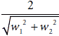，如图 11.6 所示。如果你想要计算出这个距离计算的细节，请查看本章末尾的练习 11.1。

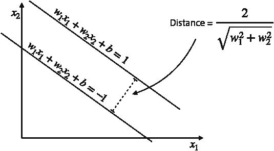

图 11.6 两条平行线之间的距离可以根据线的方程计算。

了解这一点后，请注意以下内容：

+   当 *w*[1]² + *w*[2]² 较大时，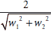 较小。

+   当 *w*[1]² + *w*[2]² 较小时， 较大。

因为我们希望线尽可能远，这个项 *w*[1]² + *w*[2]² 是一个好的错误函数，因为它为不良分类器（那些线很近的分类器）提供了大值，而对于良好分类器（那些线很远的分类器）则提供小值。

在图 11.7 中，我们可以看到两个 SVM 分类器的示例。它们的方程如下：

+   SVM 1:

    +   L+: 3*x*[1] + 4*x*[2] + 5 = 1

    +   L–: 3*x*[1] + 4*x*[2] + 5 = –1

+   SVM 2:

    +   L+: 30*x*[1] + 40*x*[2] + 50 = 1

    +   L–: 30*x*[1] + 40*x*[2] + 50 = 1

它们的距离错误函数如下所示：

+   SVM 1:

    +   距离错误函数 = 3² + 4² = 25

+   SVM 2:

    +   距离错误函数 = 30² + 40² = 2500

注意，从图 11.7 中还可以看出，SVM 2 中的线比 SVM 1 中的线要近得多，这使得 SVM 1 成为一个更好的分类器（从距离的角度来看）。SVM 1 中线的距离为 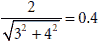，而在 SVM 2 中为 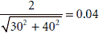。

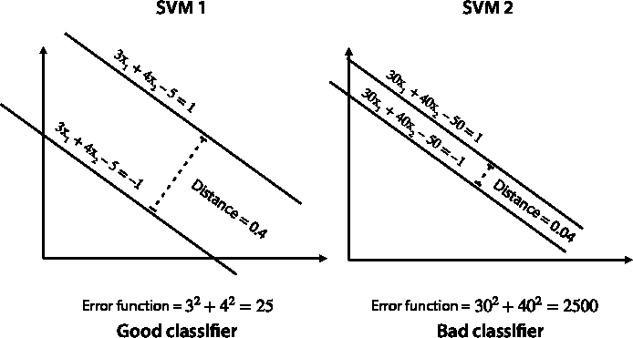

图 11.7 左：一个 SVM，其中线之间的距离为 0.4，错误为 25。右：一个 SVM，其中线之间的距离为 0.04，错误为 2500。注意，在这个比较中，左边的分类器比右边的分类器要好得多，因为线彼此之间的距离更远。这导致距离错误更小。

将两个错误函数相加以获得错误函数

现在我们已经建立了一个分类错误函数和一个距离错误函数，让我们看看如何将它们结合起来构建一个错误函数，帮助我们确保实现了两个目标：将点很好地分类，并且两条线彼此间隔很远。

为了获得这个错误函数，我们将分类错误函数和距离错误函数相加，得到以下公式：

错误 = 分类错误 + 距离错误

一个良好的 SVM 必须尝试尽可能少地犯分类错误，同时尝试使线尽可能远。

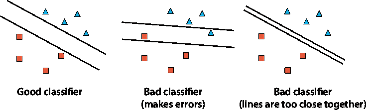

图 11.8 左：一个良好的 SVM，由两条间隔良好的线组成，能够正确分类所有点。中：一个不良的 SVM，错误分类了两个点。右：一个不良的 SVM，由两条太靠近的线组成。

在图 11.8 中，我们可以看到同一数据集的三个 SVM 分类器。左边的分类器是一个好的分类器，因为它很好地分类了数据，并且线之间间隔很远，减少了错误的可能性。中间的那个分类器犯了一些错误（因为顶部线下方有一个三角形，底部线上方有一个正方形），所以它不是一个好的分类器。右边的分类器正确地分类了点，但线太靠近了，所以它也不是一个好的分类器。

我们希望我们的 SVM 更关注分类还是距离？C 参数可以帮助我们

在本节中，我们学习了一种有用的技术来调整和改进我们的模型，这涉及到引入 C 参数。当我们要训练一个比距离（或相反）更关注分类的 SVM 时，使用 C 参数。

到目前为止，似乎我们构建一个好的 SVM 分类器所要做的只是跟踪两件事。我们想确保分类器尽可能少犯错误，同时保持线尽可能分开。但如果我们不得不为了对方的利益而牺牲一方怎么办？在图 11.9 中，我们对同一个数据集有两个分类器。左边的一个犯了一些错误，但线分得很开。右边的一个没有错误，但线太靠近了。我们应该选择哪一个？

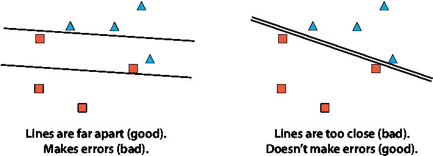

图 11.9 这两个分类器各有优点和缺点。左边的一个由间隔良好的线组成（优点），但它错误地分类了一些点（缺点）。右边的一个由太靠近的线组成（缺点），但它正确地分类了所有点（优点）。

结果表明，这个答案取决于我们正在解决的问题。有时我们希望有一个尽可能少犯错误的分类器，即使线很近，有时我们希望有一个即使犯一些错误也能保持线分开的分类器。我们如何控制这一点？我们使用一个我们称之为 C 参数的参数。我们通过将分类错误乘以 C 来稍微修改错误公式，得到以下公式：

错误公式 = C · (分类错误) + (距离错误)

如果 C 很大，那么错误公式主要由分类错误决定，因此我们的分类器更关注正确分类点。如果 C 很小，那么公式主要由距离错误决定，因此我们的分类器更关注保持线分开。

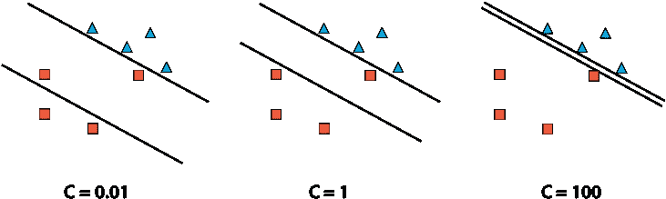

图 11.10 中不同的 C 值在具有良好间隔线的分类器和正确分类点的分类器之间切换。左边的分类器 C 值较小（0.01），线间隔良好，但犯了错误。右边的分类器 C 值较大（100），正确分类了点，但线太靠近了。中间的分类器犯了一个错误，但找到了两条间隔良好的线。

在图 11.10 中，我们可以看到三个分类器：一个 C 值大的分类器可以正确分类所有点，一个 C 值小的分类器可以保持线间隔良好，还有一个 C = 1 的分类器试图两者兼顾。在现实生活中，C 是一个超参数，我们可以通过使用模型复杂度图（第四章中“决定我们的模型应该有多复杂的一种数值方法”部分）或我们对所解决问题的了解、数据和对模型的知识来调整 C。

## 在 Scikit-Learn 中编码支持向量机

现在我们已经学习了 SVM 是什么，我们准备编写一个 SVM 并用它来建模一些数据。在 Scikit-Learn 中，编写 SVM 简单，这就是我们在本节中学到的。我们还学习了如何在代码中使用 C 参数。

编写简单的 SVM

我们首先在样本数据集中编写一个简单的 SVM，然后我们将添加更多参数。数据集称为 linear.csv，其图表显示在图 11.11 中。本节的代码如下：

+   **笔记**：SVM_graphical_example.ipynb

    +   [`github.com/luisguiserrano/manning/blob/master/Chapter_11_Support_Vector_Machines/SVM_graphical_example.ipynb`](https://github.com/luisguiserrano/manning/blob/master/Chapter_11_Support_Vector_Machines/SVM_graphical_example.ipynb)

+   **数据集**：linear.csv

我们首先从 Scikit-Learn 的 `svm` 包中导入，并按以下方式加载数据：

```
from sklearn.svm import SVC
```

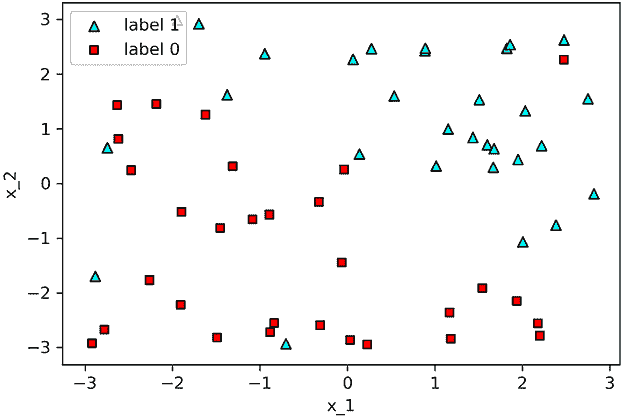

图 11.11 几乎线性可分的数据集，有一些异常值

然后，如以下代码片段所示，我们将数据加载到两个 Pandas DataFrame 中，分别命名为 `features` 和 `labels`，然后定义我们的模型 `svm_linear` 并对其进行训练。我们获得的准确率为 0.933，图表显示在图 11.12 中。

```
svm_linear = SVC(kernel='linear')
svm_linear.fit(features, labels)
```

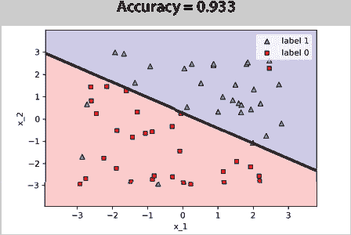

图 11.12 我们在 Scikit-Learn 中构建的 SVM 分类器的图表由一条线组成。该模型的准确率为 0.933。

C 参数

在 Scikit-Learn 中，我们可以轻松地将 C 参数引入模型。这里我们训练并绘制了两个模型，一个具有非常小的值 0.01，另一个具有较大的值 100，如下代码和图 11.13 所示：

```
svm_c_001 = SVC(kernel='linear', C=0.01)
svm_c_001.fit(features, labels)

svm_c_100 = SVC(kernel='linear', C=100)
svm_c_100.fit(features, labels)
```

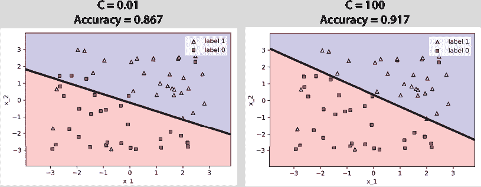

图 11.13 左侧的分类器 C 值较小，很好地分隔了点之间的线，但犯了一些错误。右侧的分类器 C 值较大，没有犯错误，尽管线过于接近一些点。

我们可以看到，C 值较小的模型并不太强调正确分类点，它犯了一些错误，这在它的低准确率（0.867）中很明显。在这个例子中很难看出，但这个分类器非常强调线尽可能远离点。相比之下，C 值较大的分类器试图正确分类所有点，这反映在其更高的准确率上。

## 使用非线性边界的 SVM 训练：核方法

正如我们在本书的其他章节中看到的，并非每个数据集都是线性可分的，很多时候我们需要构建非线性分类器来捕捉数据的复杂性。在本节中，我们研究了一种与 SVM 相关的强大方法，称为 *核方法*，它帮助我们构建高度非线性分类器。

如果我们有一个数据集，发现我们无法用线性分类器将其分离，我们该怎么办？一个想法是向这个数据集添加更多列，并希望更丰富的数据集是线性可分的。核方法包括以巧妙的方式添加更多列，在这个新数据集上构建一个线性分类器，然后在保持对（现在是非线性的）分类器的跟踪的同时移除我们添加的列。

这听起来可能有些复杂，但我们有一个很好的几何方法来观察这种方法。想象一下，数据集在二维空间中，这意味着输入有两个列。如果我们添加一个第三列，数据集现在就是三维的，就像你手中的点突然以不同的高度飞入空间一样。也许如果我们以巧妙的方式提高这些点的高度，我们可以用平面将它们分开。这就是核方法，它在图 11.14 中得到了说明。

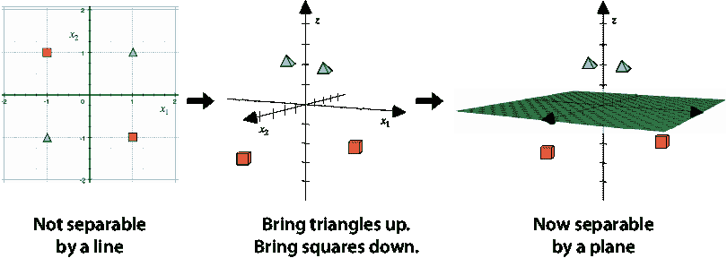

图 11.14 左：这个集合不能用一条线分开。中：我们在三维空间中观察它，然后提高两个三角形并降低两个正方形。右：我们新的数据集现在可以用一个平面分开。（来源：使用 Golden Software, LLC 的 Grapher™辅助创建的图像；[`www.goldensoftware.com/products/grapher`](https://www.goldensoftware.com/products/grapher))。

核、特征图和算子理论

核方法背后的理论来自数学中的一个领域，称为*算子理论*。核是一个相似性函数，简而言之，是一个告诉我们两个点是否相似或不同的函数（例如，接近或远离）。核可以产生一个*特征图*，这是我们的数据集所在空间与（通常是）更高维空间之间的映射。

不需要完整的核和特征图理论来理解分类器。如果你想要深入了解这些内容，请参阅附录 C 中的资源。为了本章的目的，我们将核方法视为向我们的数据集添加列以使点可分的一种方式。例如，图 11.14 中的数据集有两个列，*x*[1]和*x*[2]，我们添加了第三个列，其值为*x*[1]*x*[2]。等价地，它也可以看作是将平面上的点(*x*[1], *x*[2])映射到空间中的点(*x*[1], *x*[2], *x*[1]*x*[2])的函数。一旦点属于 3-D 空间，我们就可以使用图 11.14 右边的平面来分离它们。要更详细地研究这个例子，请参阅本章末尾的练习 11.2。

本章中我们看到的两个核及其相应的特征图是*多项式核*和*径向基函数*（RBF）核。它们都以不同但非常有效的方式向我们的数据集添加列。

利用多项式方程为我们带来好处：多项式核

在本节中，我们讨论多项式核，这是一种有用的核，可以帮助我们建模非线性数据集。更具体地说，核方法帮助我们使用如圆、抛物线和双曲线等多项式方程来建模数据。我们将通过两个示例来说明多项式核。

示例 1：一个圆形数据集

对于我们的第一个示例，让我们尝试对表 11.1 中的数据集进行分类。

表 11.1 一个小数据集，如图 11.15 所示

| *x*[1] | *x*[2] | *y*   |
| --- | --- | --- |
| 0.3 | 0.3 | 0 |
| 0.2 | 0.8 | 0 |  |
| –0.6 | 0.4 | 0 |
| 0.6 | –0.4 | 0 |
| –0.4 | –0.3 | 0 |
| 0 | –0.8 | 0 |
| –0.4 | 1.2 | 1 |
| 0.9 | –0.7 | 1 |
| –1.1 | –0.8 | 1 |
| 0.7 | 0.9 | 1 |
| –0.9 | 0.8 | 1 |
| 0.6 | –1 | 1 |

该图如图 11.15 所示，其中标签为 0 的点以正方形绘制，标签为 1 的点以三角形绘制。

当我们查看图 11.15 中的图时，很明显一条线无法将正方形和三角形分开。然而，一个圆可以（如图 11.16 所示）。现在的问题是，如果支持向量机只能绘制线性边界，我们如何绘制这个圆？

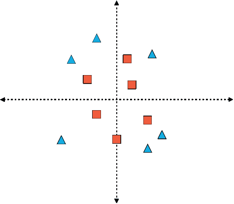

图 11.15 表 11.1 中数据集的图。请注意，它不能被一条线分开。因此，这个数据集是核方法的好候选。

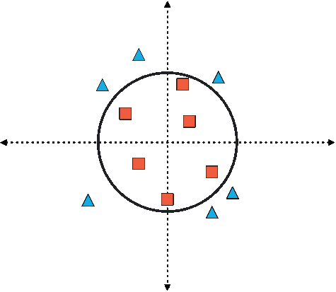

图 11.16 核方法为我们提供了一个具有圆形边界的分类器，这些点被很好地分隔开。

为了绘制这个边界，让我们思考。什么特征可以区分正方形和三角形？从观察图中可以看出，三角形比圆离原点更远。测量到原点距离的公式是两个坐标平方和的平方根。如果这些坐标是 *x*[1] 和 *x*[2]，那么这个距离是 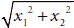。让我们先不考虑平方根，只考虑 *x*[1]² + *x*[2]²。现在让我们在表 11.1 中添加一个包含这个值的列，看看会发生什么。结果数据集如图 11.2 所示。

表 11.2 我们在表 11.1 中添加了一个额外的列。这一列由前两列值的平方和组成。

| *x*[1] | *x*[2] | *x*[1]² + *x*[2]² | *y*   |
| --- | --- | --- | --- |
| 0.3 | 0.3 | 0.18 | 0 |
| 0.2 | 0.8 | 0.68 | 0 |
| –0.6 | 0.4 | 0.52 | 0 |
| 0.6 | –0.4 | 0.52 | 0 |
| –0.4 | –0.3 | 0.25 | 0 |
| 0 | –0.8 | 0.64 | 0 |
| –0.4 | 1.2 | 1.6 | 1 |
| 0.9 | –0.7 | 1.3 | 1 |
| –1.1 | –0.8 | 1.85 | 1 |
| 0.7 | 0.9 | 1.3 | 1 |
| –0.9 | 0.8 | 1.45 | 1 |
| 0.6 | –1 | 1.36 | 1 |

在查看表 11.2 之后，我们可以看到趋势。所有标记为 0 的点都满足坐标平方和小于 1 的条件，而标记为 1 的点满足这个和大于 1 的条件。因此，分离这些点的坐标方程正是*x*[1]² + *x*[2]² = 1。请注意，这不是一个线性方程，因为变量被提升到大于一的幂。事实上，这正是圆的方程。

想象这种几何方式如图 11.17 所示。我们的原始集位于平面中，无法用一条线将两个类别分开。但如果我们把每个点（*x*[1]，*x*[2]）提升到高度*x*[1]² + *x*[2]²，这相当于将这些点放入方程*z* = *x*[1]² + *x*[2]²的抛物面中（图中所示）。我们提升每个点的距离正是该点到原点的距离的平方。因此，正方形提升的量很小，因为它们靠近原点，而三角形提升的量很大，因为它们远离原点。现在正方形和三角形相距很远，因此我们可以用高度为 1 的水平平面将它们分开——换句话说，就是方程*z* = 1 的平面。作为最后一步，我们将所有东西投影到平面上。抛物面和平面的交点变成了方程*x*[1]² + *x*[2]² = 1 的圆。请注意，这个方程不是线性的，因为它包含二次项。最后，这个分类器做出的预测是*ŷ* = *step*(*x*[1]² + *x*[2]² – 1)。

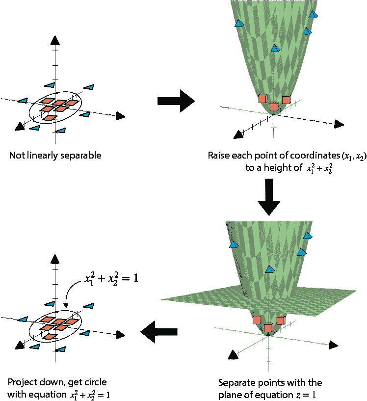

图 11.17 核方法。步骤 1：我们从一组非线性可分的数据集开始。步骤 2：然后我们将每个点提升到其到原点的距离的平方。这创建了一个抛物面。步骤 3：现在三角形很高，而正方形很低。我们通过高度为 1 的平面来分离它们。步骤 4：我们将所有东西投影下来。抛物面和平面的交点形成一个圆。这个圆的投影给出了我们分类器的圆形边界。（来源：图像由 Golden Software, LLC 的 Grapher™辅助创建；[`www.goldensoftware.com/products/grapher`](https://www.goldensoftware.com/products/grapher)）。

示例 2：修改后的 XOR 数据集

圆形并不是我们唯一可以绘制的图形。让我们考虑一个非常简单的数据集，如图 11.3 表所示，并在图 11.18 中绘制。这个数据集类似于练习 5.3 和 10.2 中对应的 XOR 运算符。如果你想在原始 XOR 数据集上解决相同的问题，你可以在本章末尾的练习 11.2 中做到这一点。

表 11.3 修改后的 XOR 数据集

| *x*[1] | *x*[2] | *y*   |
| --- | --- | --- |
| –1 | –1 | 1 |
| –1 | 1 | 0 |
| 1 | –1 | 0 |
| 1 | 1 | 1 |

要看出这个数据集不是线性可分的，请看图 11.18。两个三角形位于一个大正方形的对角，而两个正方形位于剩余的两个角上。不可能画一条线将三角形和正方形分开。然而，我们可以使用多项式方程来帮助我们，这次我们将使用两个特征的乘积。让我们将对应于乘积 *x*[1]*x*[2] 的列添加到原始数据集中。结果如表 11.4 所示。

表 11.4 我们在表 11.3 中添加了一列，该列由前两列的乘积组成。注意，表中最右边两列之间有很强的关系。

| *x*[1] | *x*[2] | *x*[1] *x*[2] | *y*   |
| --- | --- | --- | --- |
| –1 | –1 | 1 | 1 |
| –1 | 1 | –1 | 0 |
| 1 | –1 | –1 | 0 |
| 1 | 1 | 1 | 1 |

注意到对应于乘积 *x*[1]*x*[2] 的列与标签列非常相似。我们现在可以看到，对于这个数据集，一个好的分类器具有以下边界方程：*x*[1]*x*[2] = 1。这个方程的图是水平和垂直轴的并集，这是因为要使乘积 *x*[1]*x*[2] 为 0，我们需要 *x*[1] = 0 或 *x*[2] = 0。这个分类器做出的预测由 *ŷ* = *step*(*x*[1]*x*[2]) 给出，对于平面的东北部和西南部的点，预测为 1，其他地方为 0。

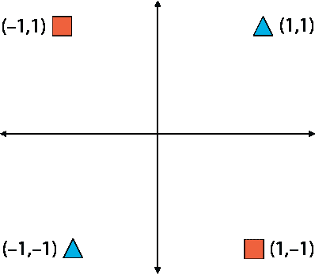

图 11.18 表 11.3 中数据集的图。将正方形与三角形分开的分类器的边界方程为 *x*[1]*x*[2] = 0，这对应于水平和垂直轴的并集。

超越二次方程：多项式核

在前两个例子中，我们使用了多项式表达式来帮助我们分类一个非线性可分的数据集。在第一个例子中，这个表达式是 *x*[1]² + *x*[2]²，因为对于靠近原点的点，这个值很小，而对于远离原点的点，这个值很大。在第二个例子中，表达式是 *x*[1]*x*[2]，这有助于我们在平面的不同象限中分离点。

我们是如何找到这些表达式的？在一个更复杂的数据集中，我们可能没有时间查看图表并直观地找到一个有助于我们的表达式。我们需要一个方法，换句话说，一个算法。我们将考虑所有可能的二次（二次）单变量，包含 *x*[1] 和 *x*[2]。这些是以下三个单变量：*x*[1]²，*x*[1]*x*[2]，和 *x*[2]²。我们称这些新变量为 *x*[3]，*x*[4]，和 *x*[5]，并将它们视为与 *x*[1] 和 *x*[2] 完全无关。让我们将此应用于第一个例子（圆）。添加了这些新列的表 11.1 数据集如表 11.5 所示。

我们现在可以构建一个分类器来对增强后的数据集进行分类。训练 SVM 的方法是使用上一节学到的技术。我鼓励你使用 Scikit-Learn，Turi Create 或你选择的任何包来构建这样的分类器。通过检查，这里有一个有效的分类器方程：

0*x*[1] + 0*x*[2] + 1*x*[3] + 0*x*[4] + 1*x*[5] – 1 = 0

表 11.5 我们在表 11.1 中增加了三行，每一行对应于两个变量*x*[1]和*x*[2]上的每个二次单项式。这些单项式是*x*[1]²，*x*[1] *x*[2]，和*x*[2]²。

| *x*[1] | *x*[2] | *x*[3] = *x*[1]² | *x*[4] = *x*[1] *x*[2] | *x*[5] = *x*[2]² | *y*   |
| --- | --- | --- | --- | --- | --- |
| 0.3 | 0.3 | 0.09 | 0.09 | 0.09 | 0 |
| 0.2 | 0.8 | 0.04 | 0.16 | 0.64 | 0 |
| –0.6 | 0.4 | 0.36 | –0.24 | 0.16 | 0 |
| 0.6 | –0.4 | 0.36 | –0.24 | 0.16 | 0 |
| –0.4 | –0.3 | 0.16 | 0.12 | 0.09 | 0 |
| 0 | –0.8 | 0 | 0 | 0.64 | 0 |
| –0.4 | 1.2 | 0.16 | –0.48 | 1.44 | 1 |
| 0.9 | –0.7 | 0.81 | –0.63 | 0.49 | 1 |
| –1.1 | –0.8 | 1.21 | 0.88 | 0.64 | 1 |
| 0.7 | 0.9 | 0.49 | 0.63 | 0.81 | 1 |
| –0.9 | 0.8 | 0.81 | –0.72 | 0.64 | 1 |
| 0.6 | –1 | 0.36 | –0.6 | 1 | 1 |

记住*x*[3] = *x*[1]²和*x*[4] = *x*[2]²，我们得到所需的圆的方程，如下所示：

*x*[1]² + *x*[2]² = 1

如果我们要像之前那样从几何角度可视化这个过程，它会变得稍微复杂一些。我们美好的二维数据集变成了五维数据集。在这个数据集中，标记为 0 和 1 的点现在相距很远，可以用四维超平面分开。当我们将其投影到二维时，我们得到所需的圆。

多项式核产生了一个将二维平面映射到五维空间的映射。这个映射是将点(*x*[1]，*x*[2])映射到点(*x*[1]，*x*[2]，*x*[1]²，*x*[1]*x*[2]，*x*[2]²)。因为每个单项式的最大次数是 2，所以我们说这是二次多项式核。对于多项式核，我们总是必须指定次数。

如果我们使用的是更高次数的多项式核，比如*k*，我们应该在数据集中添加哪些列？对于给定变量集中的每个单项式，我们添加一个列，其次数小于或等于*k*。例如，如果我们使用*x*[1]和*x*[2]上的三次多项式核，我们添加的列对应于以下单项式：{*x*[1]，*x*[2]，*x*[1]²，*x*[1]*x*[2]，*x*[2]²，*x*[1]³，*x*[1]²*x*[2]，*x*[1]*x*[2]²，*x*[2]³}。我们也可以以相同的方式为更多变量做这件事。例如，如果我们使用*x*[1]，*x*[2]，和*x*[3]上的二次多项式核，我们添加的列具有以下单项式：{*x*[1]，*x*[2]，*x*[3]，*x*[1]²，*x*[1]*x*[2]，*x*[1]*x*[3]，*x*[2]²，*x*[2]*x*[3]，*x*[3]²}。

利用高维空间中的峰值来为我们带来好处：径向基函数（RBF）核

我们将要看到的下一个核是径向基函数核。这个核在实践中非常有用，因为它可以帮助我们使用以每个数据点为中心的某些特殊函数构建非线性边界。为了介绍 RBF 核，让我们首先看看图 11.19 中显示的一维示例。这个数据集不是线性可分的——正方形正好位于两个三角形之间。


图 11.19 一个一维数据集，线性分类器无法对其进行分类。注意，线性分类器是一个将线分为两部分的点，并且没有点可以定位在直线上，使得所有三角形都在一边，正方形在另一边。

我们将构建这个数据集的分类器的方式是想象在每个点上构建一座山或一个山谷。对于标记为 1 的点（三角形），我们将放置一座山，对于标记为 0 的点（正方形），我们将放置一个山谷。这些山和山谷被称为*径向基函数*。结果图显示在图 11.20 的顶部。现在，我们画出一个山脉，使得在每个点上，高度是那个点上的所有山和山谷高度的总和。我们可以在图 11.20 的底部看到结果山脉。最后，分类器的边界对应于这个山脉高度为零的点，即底部突出显示的两个点。这个分类器将两个点之间的任何东西分类为正方形，并将区间外的任何东西分类为三角形。

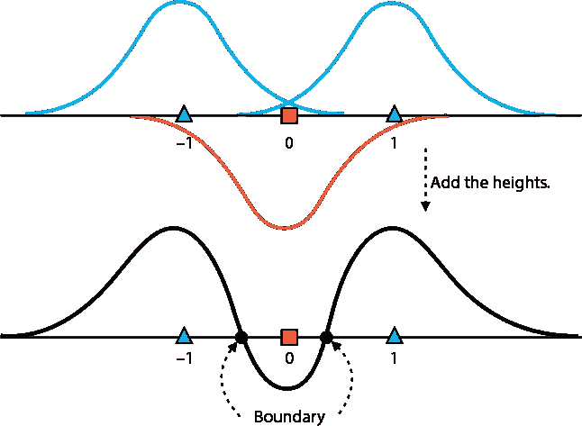

图 11.20 使用具有 RBF 核的 SVM 在一维数据集中分离非线性数据集。顶部：我们在每个标记为 1 的点处画一座山（径向基函数），在每个标记为 0 的点处画一个山谷。底部：我们在顶部图中的径向基函数上添加。结果函数与轴相交两次。两个交点是我们 SVM 分类器的边界。我们将它们之间的每个点分类为正方形（标签 0），并将每个外部点分类为三角形（标签 1）。

这（以及下一节中围绕它的数学）是 RBF 核的精髓。现在让我们使用它在一个二维数据集中构建一个类似的分类器。

要在平面上构建山脉和山谷，想象平面就像一张毯子（如图 11.21 所示）。如果我们捏住毯子上的那个点并抬起它，我们就会得到山脉。如果我们压下它，我们就会得到山谷。这些山脉和山谷是径向基函数。它们被称为径向基函数，因为函数在一点的值只依赖于该点与中心之间的距离。我们可以在任何我们喜欢的点上抬起毯子，这样就为每个点给出一个不同的径向基函数。*径向基函数核*（也称为 RBF 核）产生一个映射，使用这些径向函数以帮助我们分离数据集的方式向我们的数据集添加几列。

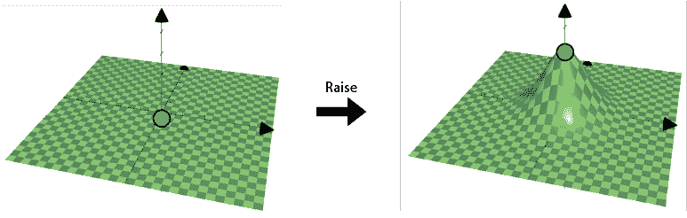

图 11.21 径向基函数由在特定点抬起平面组成。这是我们用来构建非线性分类器的函数族。（来源：使用 Golden Software, LLC 的 Grapher™辅助创建的图像；[`www.goldensoftware.com/products/grapher`](https://www.goldensoftware.com/products/grapher)）。

我们如何将这个用作分类器呢？想象一下以下情况：我们在图 11.22 的左侧有数据集，其中，像往常一样，三角形代表标签为 1 的点，而正方形代表标签为 0 的点。现在，我们在每个三角形上抬起平面，在每个正方形上压下平面。我们得到了图 11.22 右侧所示的三维图。

要创建分类器，我们在高度 0 处画一个平面，并将其与我们的表面相交。这相当于观察高度为 0 的点的曲线。想象一下，如果有一个有山脉和大海的地形。曲线将对应于海岸线，即水和陆地相交的地方。这条海岸线是图 11.23 左侧所示的曲线。然后我们将所有东西投影回平面，得到我们想要的分类器，如图 11.23 右侧所示。

这就是 RBF 核背后的想法。当然，我们必须发展数学，我们将在接下来的几节中这样做。但原则上，如果我们能想象抬起和压下一张毯子，然后通过观察特定高度的点的边界来构建分类器，那么我们就能理解 RBF 核是什么。

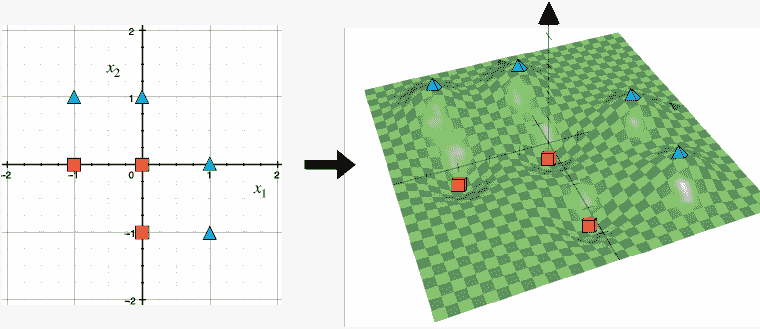

图 11.22 左：平面上一个非线性可分的数据集。右：我们已使用径向基函数抬起每个三角形并降低每个正方形。注意，现在我们可以通过一个平面来分离数据集，这意味着我们的修改后的数据集是线性可分的。（来源：使用 Golden Software, LLC 的 Grapher™辅助创建的图像；[`www.goldensoftware.com/products/grapher`](https://www.goldensoftware.com/products/grapher)）。

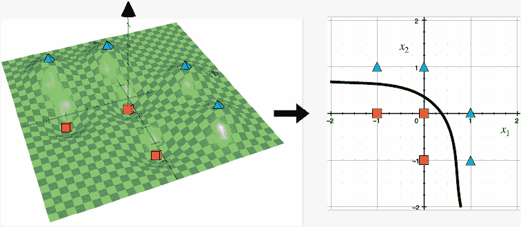

图 11.23 左：如果我们看高度为 0 的点，它们形成一条曲线。如果我们把高点看作陆地，低点看作海洋，这条曲线就是海岸线。右：当我们把点投影（展平）回平面时，海岸线现在是我们区分三角形和正方形的分类器。（来源：使用 Golden Software, LLC 的 Grapher™辅助创建的图像；[`www.goldensoftware.com/products/grapher`](https://www.goldensoftware.com/products/grapher)）

对径向基函数的更深入探讨

径向基函数可以存在于任意数量的变量中。在本节的开头，我们看到了一维和二维的例子。对于一维，最简单的径向基函数公式是 *y* = *e*^(−x²)。这看起来像一条线上的一个隆起（图 11.24）。它看起来很像一个标准的正态（高斯）分布。标准的正态分布类似，但它有一个略微不同的公式，因此其下的面积是 1。

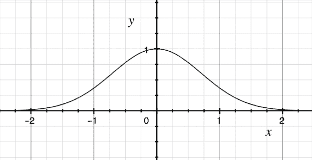

图 11.24 一个径向基函数的示例。它看起来很像一个正常的（高斯）分布。

注意这个隆起发生在 0 处。如果我们想让它出现在任何不同的点，比如说 *p*，我们可以平移公式，得到 *y* = *e*^(−(*x* − *p*)²)。例如，以点 5 为中心的径向基函数正好是 *y* = *e*^(−(*x* − 5)²)。

对于两个变量，最基本径向基函数的公式是 *z* = *e*^(−(*x*² + *y*²))，它看起来像图 11.25 中所示的图表。再次，你可能注意到它看起来很像一个多元正态分布。它再次是多元正态分布的一个修改版本。

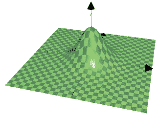

图 11.25 在两个变量上的径向基函数。它再次看起来很像一个正态分布。（来源：使用 Golden Software, LLC 的 Grapher™辅助创建的图像；[`www.goldensoftware.com/products/grapher`](https://www.goldensoftware.com/products/grapher)）

这个隆起正好发生在点(0,0)处。如果我们想让它出现在任何不同的点，比如说(*p, q*)，我们可以平移公式，得到 *y* = *e*^(−[(*x* − *p*)² +(*y* − *q*)²])。例如，以点(2, –3)为中心的径向基函数正好是 *y* = *e*^(−[(*x* − 2)² +(*y* + 3)²])。

对于 n 个变量，基本径向基函数的公式是 *y* = *e*^(−(*x*[1]²+ ··· +*x*[n]²))。我们无法在 *n* + 1 维度中绘制图表，但如果我们想象挤压一个 *n*-维度的毯子并用手指提起它，那就是它的样子。然而，因为我们使用的算法完全是数学的，所以计算机可以轻松地在任意多的变量中运行它。像往常一样，这个 *n*-维度的隆起以 0 为中心，但如果我们想让它以点 (*p*[1], …, *p*[n])为中心，公式是 *y* = *e*^(−[(*x*[1] - *p*[1])²+ ··· +(*x*[n] - *p*[n])²])

测量点之间距离的一个度量：相似度

要使用 RBF 内核构建 SVM，我们需要一个概念：相似度的概念。我们说两个点相似，如果它们彼此靠近，如果不相似，如果它们彼此远离（图 11.26）。换句话说，两个点之间的相似度如果它们彼此靠近就很高，如果它们彼此远离就很低。如果一对点是同一个点，那么相似度为 1。在理论上，两个无限远的点之间的相似度为 0。


图 11.26 两个彼此靠近的点被定义为具有高相似度。两个彼此远离的点被定义为具有低相似度。

现在我们需要找到一个相似度的公式。正如我们所看到的，两个点之间的相似度随着它们之间距离的增加而降低。因此，许多相似度的公式都会工作，只要它们满足这个条件。因为我们在这个部分使用指数函数，所以我们定义如下。对于点 *p* 和 *q*，*p* 和 *q* 之间的相似度如下：

*similarity*(*p*,*q*)= *e*^–^(distance)^(^p^,^q^)²

这个看起来是一个复杂的相似度公式，但有一个非常好的方法来看待它。如果我们想要找到两个点之间的相似度，比如说 *p* 和 *q*，这个相似度正是以 *p* 为中心的径向基函数在点 *q* 处应用的高度。也就是说，如果我们把毯子在点 *p* 处捏起并提起，那么点 *q* 处的毯子高度就会很高，如果 *q* 靠近 *p*，而如果 *q* 离 *p* 很远，那么高度就会很低。在图 11.27 中，我们可以看到一个变量的情况，但想象一下通过毯子类比在任何数量的变量中。

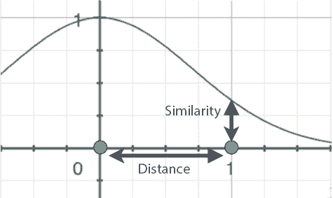

图 11.27 相似度定义为径向基函数中点的位置，其中输入是距离。请注意，距离越高，相似度越低，反之亦然。

使用 RBF 内核训练 SVM

现在我们已经拥有了使用 RBF 内核训练 SVM 的所有工具，让我们看看如何将这些工具组合起来。让我们首先看看图 11.19 显示的简单数据集。数据集本身在表 11.6 中。

表 11.6 图 11.19 所示的一维数据集。请注意，它不是线性可分的，因为标签为 0 的点正好位于两个标签为 1 的点之间。

| 点 | *x*   | y (标签) |
| --- | --- | --- |
| 1 | –1 | 1 |
| 2 | 0 | 0 |
| 3 | 1 | 1 |

正如我们所见，这个数据集不是线性可分的。为了使其线性可分，我们将添加几个列。我们添加的三个列是相似度列，它们记录了点之间的相似度。具有 *x* 坐标 *x*[1] 和 *x*[2] 的两个点之间的相似度测量为 *e*^((*x*[1] + *x*[2])²)，如“在更高维中使用凸起以获得优势”部分所示。例如，点 1 和点 2 之间的相似度为 *e*^((−1 −0)²) = 0.368。在 Sim1 列中，我们将记录点 1 与其他三个点之间的相似度，依此类推。扩展后的数据集如表 11.7 所示。

表 11.7 我们通过添加三个新列扩展了表 11.6 中的数据集。每个列对应于所有点相对于每个点的相似度。这个扩展后的数据集存在于四维空间中，并且是线性可分的。

| 点 | *x*   | 模拟 1 | 模拟 2 | 模拟 3 | *y*   |
| --- | --- | --- | --- | --- | --- |
| 1 | –1 | 1 | 0.368 | 0.018 | 1 |
| 2 | 0 | 0.368 | 1 | 0.368 | 0 |
| 3 | 1 | 0.018 | 0.368 | 1 | 1 |

这个扩展后的数据集现在是线性可分的！许多分类器可以分离这个集合，但特别是以下边界方程的分类器：

*ŷ* = *step*(*Sim*1 – *Sim*2 + *Sim*3)

让我们通过预测每个点的标签来验证，如下所示：

+   **点 1**: *ŷ* = *step*(1 – 0.368 + 0.018) = *step*(0.65) = 1

+   **点 2**: *ŷ* = *step*(0.368 – 1 + 0.368) = *step*(–0.264) = 0

+   **点 3**: *ŷ* = *step*(0.018 – 0.368 + 1) = *step*(0.65) = 1

此外，因为 *Sim*1=*e*^((*x* + 1)²)，*Sim*2=*e*^((*x* − 0)²)，*Sim*3=*e*^((*x* − 1)²)，所以我们的最终分类器做出以下预测：

*ŷ* = *step*(*e*^((*x* + 1)²) − *e*^(*x*²) + *e*^((*x* − 1)²))

现在，让我们在二维空间中执行相同的程序。本节不需要代码，但计算量很大，所以如果您想查看它们，可以在以下笔记本中找到：[`github.com/luisguiserrano/manning/blob/master/Chapter_11_Support_Vector_Machines/Calculating_similarities.ipynb`](https://github.com/luisguiserrano/manning/blob/master/Chapter_11_Support_Vector_Machines/Calculating_similarities.ipynb).

表 11.8 一个简单的二维数据集，如图 11.28 所示。我们将使用具有 RBF 核的支持向量机来分类这个数据集。

| 点 | *x*[1] | *x*[2] | *y*   |
| --- | --- | --- | --- |
| 1 | 0 | 0 | 0 |
| 2 | –1 | 0 | 0 |
| 3 | 0 | –1 | 0 |
| 4 | 0 | 1 | 1 |
| 5 | 1 | 0 | 1 |
| 6 | –1 | 1 | 1 |
| 7 | 1 | –1 | 1 |

考虑表 11.8 中的数据集，我们已将其图形化分类（图 11.22 和 11.23）。为了方便，它再次在图 11.28 中绘制。在这个图中，标签为 0 的点以正方形表示，标签为 1 的点以三角形表示。

注意，在表 11.8 的第一列和图 11.28 中，我们给每个点都编了号。这不是数据的一部分；我们这样做只是为了方便。现在我们将向这个表添加七个列。这些列是每个点相对于其他点的相似度。例如，对于点 1，我们添加一个名为 Sim1 的相似度列。这个列中每个点的条目是那个点与点 1 之间的相似度。让我们计算其中一个，例如，与点 6 的相似度。根据勾股定理，点 1 和点 6 之间的距离如下：

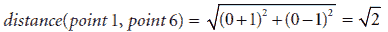

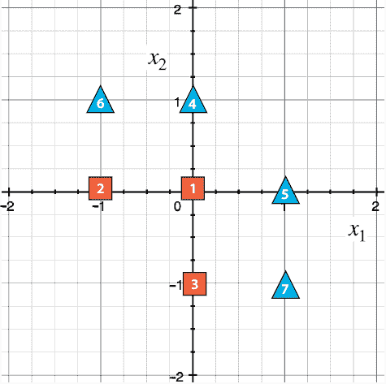

图 11.28 表 11.8 中数据集的图表，其中标签为 0 的点为正方形，标签为 1 的点为三角形。注意，正方形和三角形无法用一条线分开。我们将使用具有 RBF 核的支持向量机（SVM）用曲线边界将它们分开。

因此，相似度精确地是

*similarity*(*point* 1, *point* 6)= *e*^–^(distance)^(^q^,^p^)² = *e*^(–2) = 0.135.

这个数字位于第 1 行和 Sim6 列（以及对称地，第 6 行和 Sim1 列）。在表中填写更多值以使你自己相信这是正确的，或者查看计算整个表的笔记本。结果如表 11.9 所示。

表 11.9 我们在表 11.8 的数据集中增加了七个相似度列。每一列都记录了与其他六个点的相似度。

| 点 | *x*[1] | *x*[2] | Sim1 | Sim2 | Sim3 | Sim4 | Sim5 | Sim6 | Sim7 | *y*   |
| --- | --- | --- | --- | --- | --- | --- | --- | --- | --- | --- |
| 1 | 0 | 0 | 1 | 0.368 | 0.368 | 0.368 | 0.368 | 0.135 | 0.135 | 0 |
| 2 | –1 | 0 | 0.368 | 1 | 0.135 | 0.135 | 0.018 | 0.368 | 0.007 | 0 |
| 3 | 0 | –1 | 0.368 | 0.135 | 1 | 0.018 | 0.135 | 0.007 | 0.368 | 0 |
| 4 | 0 | 1 | 0.368 | 0.135 | 0.018 | 1 | 0.135 | 0.368 | 0.007 | 1 |
| 5 | 1 | 0 | 0.368 | 0.018 | 0.135 | 0.135 | 1 | 0.007 | 0.368 | 1 |
| 6 | –1 | 1 | 0.135 | 0.368 | 0.007 | 0.367 | 0.007 | 1 | 0 | 1 |
| 7 | 1 | –1 | 0.135 | 0.007 | 0.368 | 0.007 | 0.368 | 0 | 1 | 1 |

注意以下事项：

1.  每个点与自身之间的相似度总是 1。

1.  对于每对点，当它们在图中靠近时相似度较高，当它们相距较远时相似度较低。

1.  由 Sim1 到 Sim7 列组成的表是对称的，因为点 p 和点 q 之间的相似度与点 q 和点 p 之间的相似度相同（因为它只取决于点 p 和点 q 之间的距离）。

1.  点 6 和点 7 之间的相似度显示为 0，但实际上并非如此。点 6 和点 7 之间的距离是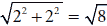，因此它们的相似度为 *e*^(–8) = 0.00033546262，四舍五入后为 0，因为我们使用了三位有效数字。

现在，让我们继续构建我们的分类器！注意，对于小表 11.8 中的数据，没有线性分类器可以工作（因为点不能被一条线分开），但在具有更多特征（列）的更大表 11.9 中，我们可以拟合这样的分类器。我们继续拟合 SVM 到这些数据。许多 SVM 可以正确分类这个数据集，在笔记本中，我使用了 Turi Create 来构建一个。然而，一个更简单的分类器也可以工作。这个分类器有以下权重：

+   *x*[1] 和 *x*[2] 的权重为 0。

+   Sim *p* 的权重为 1，其中 *p* = 1, 2, 和 3。

+   Sim *p* 的权重为 -1，其中 *p* = 4, 5, 6, 和 7。

+   偏差为 *b* = 0。

我们发现分类器将标签 -1 添加到对应于标签 0 的列，并将 +1 添加到对应于标签 1 的列。这相当于在标签 1 的任何点上添加一个山丘，在标签 0 的每个点上添加一个山谷，就像图 11.29 中所示。为了从数学上验证这一点，取表 11.7，加上 Sim4、Sim5、Sim6 和 Sim7 列的值，然后减去 Sim1、Sim2 和 Sim3 列的值。你会注意到前三个行得到一个负数，后四个行得到一个正数。因此，我们可以使用阈值 0，我们就有了一个可以正确分类这个数据集的分类器，因为标签 1 的点得到一个正分数，而标签 0 的点得到一个负分数。使用阈值 0 等同于使用图 11.29 中图表的 coastline 来分离点。

如果我们插入相似性函数，我们获得的分类器如下：

*ŷ* = *step*(−*e*^(*x*[1]² + *x*[2] ²) −*e*^((*x*[1] + 1)² + *x*[2]²) −*e*^(*x*[1]² + (*x*[2] + 1)²) +*e*^(*x*[1]² + (*x*[2] − 1)²) +*e*^((*x*[1] − 1)² + *x*[2]²) +*e*^((*x*[1] + 1)² + (*x*[2] − 1)²) +*e*^((*x*[1] − 1)² + (*x*[2] + 1)²))

总结来说，我们找到了一个非线性可分的数据集。我们使用径向基函数和点之间的相似性向数据集中添加了几个列。这有助于我们在更高维的空间中构建一个线性分类器。然后我们将高维线性分类器投影到平面上，以获得我们想要的分类器。我们可以在图 11.29 中看到得到的曲线分类器。


图 11.29 在这个数据集中，我们升高了每个三角形并降低了每个正方形。然后我们在高度 0 处绘制了一个平面，该平面将正方形和三角形分开。该平面在曲面上形成一个曲线边界。然后我们将所有内容投影回二维，这个曲线边界就是将我们的三角形和正方形分开的边界。边界在右侧绘制。（来源：由 Golden Software, LLC 的 Grapher™ 辅助创建的图像；[`www.goldensoftware.com/products/grapher`](https://www.goldensoftware.com/products/grapher)）。

使用 RBF 内核的过拟合和欠拟合：gamma 参数

在本节的开始部分，我们提到存在许多不同的径向基函数，即平面上的每一个点对应一个。实际上还有更多。其中一些在平面上某一点抬起并形成一个狭窄的表面，而另一些则形成一个宽大的表面。一些例子可以在图 11.30 中看到。在实践中，我们希望调整径向基函数的宽度。为此，我们使用一个称为*gamma 参数*的参数。当 gamma 值较小时，形成的表面非常宽，而当它较大时，表面则非常狭窄。

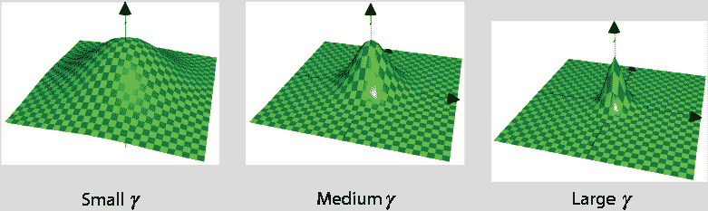

图 11.30 gamma 参数决定了表面的宽度。注意，对于小的 gamma 值，表面非常宽，而对于大的 gamma 值，表面则非常狭窄。（来源：由 Golden Software, LLC 的 Grapher™辅助创建的图像；[`www.goldensoftware.com/products/grapher`](https://www.goldensoftware.com/products/grapher)）

Gamma 是一个超参数。回想一下，超参数是我们用来训练模型的具体规格。我们调整这个超参数的方法是使用我们之前看到的方法，例如模型复杂度图（第四章中的“决定模型复杂度的数值方法”部分）。不同的 gamma 值往往会过拟合或欠拟合。让我们回顾一下本节开头提到的三个不同 gamma 值的例子。这三个模型在图 11.31 中进行了展示。

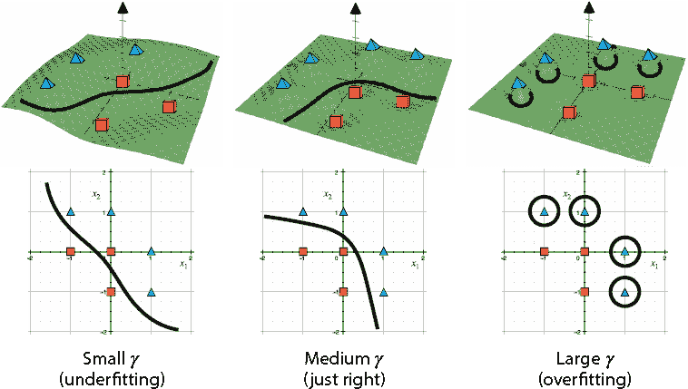

图 11.31 展示了使用 RBF 核和不同 gamma 值的三个 SVM 分类器。（来源：由 Golden Software, LLC 的 Grapher™辅助创建的图像；[`www.goldensoftware.com/products/grapher`](https://www.goldensoftware.com/products/grapher)）

注意，对于非常小的 gamma 值，模型会过拟合，因为曲线过于简单，并且不能很好地对数据进行分类。对于较大的 gamma 值，模型会严重过拟合，因为它为每个三角形构建一个小山，为每个正方形构建一个小山谷。这使得它几乎将所有东西都分类为正方形，除了三角形周围的区域。中等值的 gamma 似乎效果很好，因为它构建了一个足够简单且能正确分类点的边界。

当我们添加 gamma 参数时，径向基函数的方程变化不大——我们只需将指数乘以 gamma。在一般情况下，径向基函数的方程如下：

*y* = *e*^(−*γ*[(*x*[1] − *p*[1])²+ ··· +( *x[n]* + *p[n]*)²])

不要过于担心学习这个公式——只需记住，即使在更高维的情况下，我们创建的峰值可以是宽的或窄的。通常，有一种方法可以编码它并使其工作，这就是我们在下一节中要做的。

编写核方法

现在我们已经学习了 SVM 的核方法，接下来我们将在 Scikit-Learn 中编写代码，并使用多项式和 RBF 核在一个更复杂的数据集上训练模型。要在 Scikit-Learn 中使用特定核训练 SVM，我们只需在定义 SVM 时添加核作为参数即可。本节的代码如下：

+   **注意**: SVM_graphical_example.ipynb

    +   [SVM 图形示例](https://github.com/luisguiserrano/manning/blob/master/Chapter_11_Support_Vector_Machines/SVM_graphical_example.ipynb)

+   数据集：

    +   one_circle.csv

    +   two_circles.csv

编写多项式核以分类圆形数据集

在本小节中，我们将学习如何在 Scikit-Learn 中编写多项式核的代码。为此，我们使用一个名为 one_circle.csv 的数据集，如图 11.32 所示。

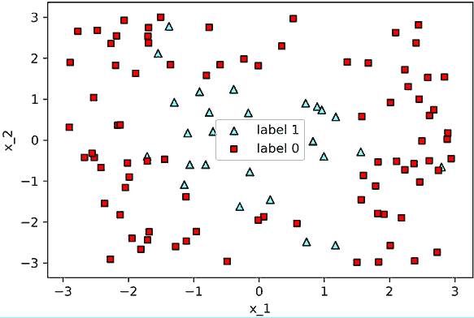

图 11.32 一个圆形数据集，包含一些噪声。我们将使用具有多项式核的 SVM 来分类这个数据集。

注意到除了少数异常值外，这个数据集基本上是圆形的。我们训练了一个 SVM 分类器，其中我们指定 `kernel` 参数为 `poly`，`degree` 参数为 2，如下一代码片段所示。我们想要 degree 为 2 的原因是圆的方程是一个二次多项式。结果如图 11.33 所示。

```
svm_degree_2 = SVC(kernel='poly', degree=2)
svm_degree_2.fit(features, labels)
```

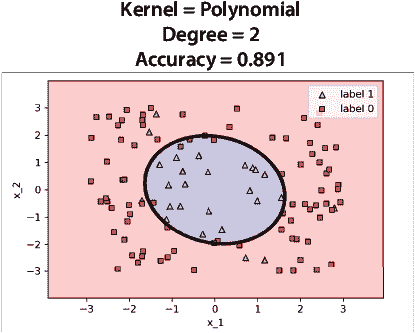

图 11.33 具有二次多项式核的 SVM 分类器

注意到这个具有二次多项式核的 SVM 成功构建了一个大致圆形的区域来包围数据集，正如预期的那样。

编写 RBF 核以分类由两个相交圆组成的数据集，并调整 gamma 参数

我们已经画了一个圆，但让我们变得更复杂一些。在本小节中，我们将学习如何编写几个具有 RBF 核的 SVM 来分类具有两个相交圆形状的数据集。这个数据集称为 two_circles.csv，如图 11.34 所示。

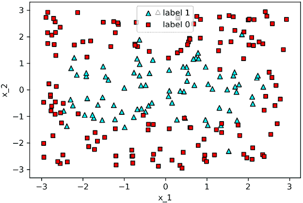

图 11.34 由两个相交圆组成的数据集，包含一些异常值。我们将使用具有 RBF 核的 SVM 来分类这个数据集。

要使用 RBF 核，我们指定 `kernel = 'rbf'`。我们还可以指定一个 gamma 的值。我们将训练四个不同的 SVM 分类器，gamma 的值分别为 0.1、1、10 和 100，如以下所示：

```
svm_gamma_01 = SVC(kernel='rbf', gamma=0.1)  ❶
svm_gamma_01.fit(features, labels)

svm_gamma_1 = SVC(kernel='rbf', gamma=1)     ❷
svm_gamma_1.fit(features, labels)

svm_gamma_10 = SVC(kernel='rbf', gamma=10)   ❸
svm_gamma_10.fit(features, labels)

svm_gamma_100 = SVC(kernel='rbf', gamma=100) ❹
svm_gamma_100.fit(features, labels)
```

❶ Gamma = 0.1

❷ Gamma = 1

❸ Gamma = 10

❹ Gamma = 100

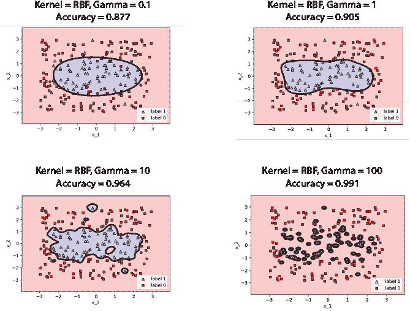

图 11.35 具有不同 gamma 值的 RBF 核的四个 SVM 分类器

四个分类器出现在图 11.35 中。注意，当 gamma = 0.1 时，模型略微欠拟合，因为它认为边界是一个椭圆形，并犯了一些错误。gamma = 1 提供了一个很好的模型，能够很好地捕捉数据。当我们达到 gamma = 10 时，我们可以看到模型开始过拟合。注意它如何尝试正确分类每个点，包括异常值，它单独包围每个异常值。当我们达到 gamma=100 时，我们可以看到一些严重的过拟合。这个分类器只围绕每个三角形用一个小的圆形区域，并将其他所有内容分类为正方形。因此，对于这个模型，gamma = 1 在我们尝试的值中似乎是最好的。

## 摘要

+   支持向量机（SVM）是一种分类器，它由拟合两条平行线（或超平面）组成，并尝试使它们尽可能远地分开，同时仍然尝试正确分类数据。

+   构建支持向量机的方法是使用一个包含两个项的错误函数：两个感知器错误的和，每个平行线一个，以及距离错误，当两条平行线相距较远时距离错误较高，当它们靠得很近时距离错误较低。

+   我们使用 C 参数来调节在正确分类点和尝试使线间距最大化之间的平衡。这在训练时很有用，因为它让我们对我们的偏好有了控制权，即如果我们想构建一个能够很好地分类数据的分类器，或者一个具有良好间距边界的分类器。

+   核方法是一种构建非线性分类器的有用且非常强大的工具。

+   核方法包括使用函数帮助我们将数据集嵌入到更高维的空间中，在那里点可能更容易用线性分类器进行分类。这相当于以巧妙的方式向我们的数据集添加列，使增强后的数据集线性可分。

+   有几种不同的核函数可用，例如多项式核和径向基函数核。多项式核允许我们构建如圆、抛物线和双曲线等多项式区域。径向基函数核允许我们构建更复杂的曲线区域。

## 练习

练习 11.1

（此练习完成了“距离错误函数”部分所需的计算。）

证明具有方程 *w*[1]*x*[1] + *w*[2]*x*[1] + *b* = 1 和 *w*[1]*x*[1] + *w*[2]*x*[1] + *b* = –1 的两条线的距离恰好是 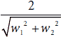。

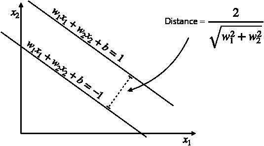

练习 11.2

正如我们在练习 5.3 中所学，不可能构建一个模仿 XOR 门的感知器模型。换句话说，不可能用感知器模型（以 100% 的准确率）拟合以下数据集：

| *x*[1] | *x*[2] | *y*   |
| --- | --- | --- |
| 0 | 0 | 0 |
| 0 | 1 | 1 |
| 1 | 0 | 1 |
| 1 | 1 | 0 |

这是因为数据集不是线性可分的。支持向量机（SVM）也有同样的问题，因为 SVM 也是一个线性模型。然而，我们可以使用核函数来帮助我们。我们应该使用什么核函数将这个数据集转换为线性可分的数据集？转换后的 SVM 会是什么样子？

提示：查看“利用多项式方程为你带来好处”部分中的示例 2，它解决了一个非常类似的问题。
