# 12 结合模型以最大化结果：集成学习

在本章中

+   集成学习的概念以及它是如何将弱分类器组合成更强的分类器的

+   使用随机森林以随机方式组合分类器

+   使用提升方法以更巧妙的方式组合分类器

+   一些最受欢迎的集成方法：随机森林、AdaBoost、梯度提升和 XGBoost

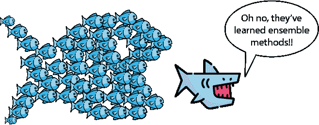

在学习了众多有趣且实用的机器学习模型之后，自然会想知道是否可以将这些分类器结合起来。幸运的是，我们可以做到，在本章中，我们将学习几种通过组合弱模型来构建更强模型的方法。本章中我们学习的两种主要方法是集成学习和提升学习。简而言之，集成学习是通过随机构建几个模型并将它们结合起来。而提升学习则通过战略性地选择每个模型来关注前一个模型的错误，以更智能地构建这些模型。这些集成方法在重要的机器学习问题中展现出的结果是巨大的。例如，Netflix Prize，该奖项授予了最适合 Netflix 大量观众数据的最佳模型，由一个使用不同模型集成的团队赢得。

在本章中，我们学习了一些最强大和最受欢迎的集成学习和提升模型，包括随机森林、AdaBoost、梯度提升和 XGBoost。其中大部分模型用于分类，而一些则用于回归。然而，大多数集成方法在这两种情况下都适用。

一些术语：在这本书中，我们根据其任务将机器学习模型称为模型，有时也称为回归器或分类器。在本章中，我们引入了“学习器”这个术语，它也指代机器学习模型。在文献中，当谈论集成方法时，常用“弱学习器”和“强学习器”这两个术语。然而，机器学习模型和学习者之间并没有区别。

本章的所有代码都可在以下 GitHub 仓库中找到：[`github.com/luisguiserrano/manning/tree/master/Chapter_12_Ensemble_Methods`](https://github.com/luisguiserrano/manning/tree/master/Chapter_12_Ensemble_Methods)。

## 在朋友的帮助下

让我们通过以下类比来可视化集成方法：想象一下，我们必须参加一个包含 100 个不同主题（包括数学、地理、科学、历史和音乐）的真假题考试。幸运的是，我们可以叫上我们的五个朋友——Adriana、Bob、Carlos、Dana 和 Emily——来帮助我们。有一个小限制，就是他们都全职工作，没有时间回答所有 100 个问题，但他们非常乐意帮助我们回答其中的一部分。我们可以使用什么技术来获取他们的帮助？以下有两种可能的技术：

**技术 1**：对于每个朋友，挑选几个随机问题，并让他们回答这些问题（确保每个问题至少有一个朋友回答）。在得到回应后，通过选择那些回答该问题的人中最受欢迎的选项来回答测试。例如，如果我们的两个朋友在问题 1 上回答“True”，一个朋友回答“False”，那么我们回答问题 1 为“True”（如果有平局，我们可以随机选择一个获胜的回应）。

**技术 2**：我们给 Adriana 考试，并要求她只回答她最有把握的问题。我们假设这些答案是好的，并将它们从测试中删除。现在我们将剩余的问题给 Bob，并给予相同的指示。我们继续这样做，直到将问题传递给所有五个朋友。

技术 1 类似于 Bagging 算法，技术 2 类似于 Boosting 算法。更具体地说，Bagging 和 Boosting 使用一组称为“弱学习器”的模型，并将它们组合成一个“强学习器”（如图 12.1 所示）。

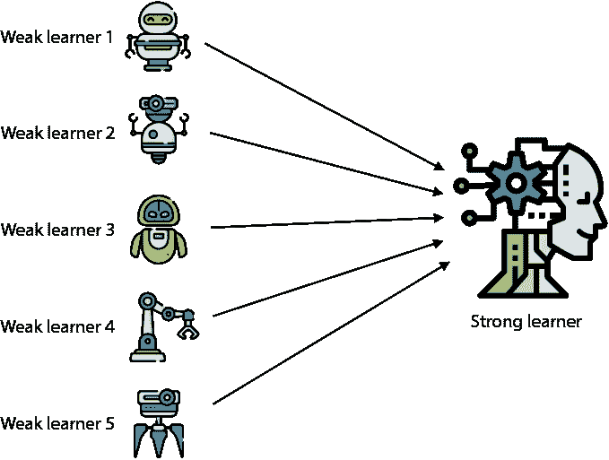

图 12.1 集成方法包括将多个弱学习器结合在一起构建强学习器。

**Bagging**：通过从数据集中随机抽取点（有放回）来构建随机集合。在每个集合上训练不同的模型。这些模型是弱学习器。然后，通过投票（如果是分类模型）或平均预测（如果是回归模型）来形成强学习器。

**Boosting**：首先训练一个随机模型，这是第一个弱学习器。在整个数据集上评估它。缩小预测良好的点，放大预测不良的点。在这个修改后的数据集上训练第二个弱学习器。我们继续这样做，直到构建了几个模型。将它们组合成强学习器的方式与 Bagging 相同，即通过投票或平均弱学习器的预测。更具体地说，如果学习器是分类器，强学习器预测弱学习器预测的最常见的类别（因此称为“投票”），如果有平局，则随机选择。如果学习器是回归器，强学习器预测弱学习器给出的预测的平均值。

本章中的大多数模型都使用决策树（无论是回归还是分类）作为弱学习器。我们这样做是因为决策树非常适合这种类型的方法。然而，当你阅读本章时，我鼓励你思考如何结合其他类型的模型，例如感知器和 SVMs。

我们花费了一整本书的时间构建非常好的学习器。为什么我们想要结合多个弱学习器，而不是一开始就构建一个强学习器呢？一个原因是集成方法已被证明比其他模型过度拟合的情况要少得多。简而言之，一个模型过度拟合是很容易的，但如果你有多个针对同一数据集的模型，它们的组合过度拟合会更少。从某种意义上说，如果有一个学习器犯了错误，其他的学习器往往会纠正它，并且平均来说，它们会表现得更好。

在本章中，我们学习了以下模型。第一个是一个集成算法，最后三个是提升算法：

+   随机森林

+   AdaBoost

+   梯度提升

+   XGBoost

所有这些模型都适用于回归和分类。为了教育目的，我们将前两个作为分类模型学习，后两个作为回归模型学习。分类和回归的过程类似。然而，请阅读每个模型，并想象它们在两种情况下是如何工作的。要了解所有这些算法在分类和回归中的工作方式，请参阅附录 C 中链接的视频和阅读材料，其中详细解释了这两种情况。

## 集成：随机地将一些弱学习器组合起来构建强学习器

在本节中，我们将看到最著名的集成模型之一：**随机森林**。在随机森林中，弱学习器是在数据集的随机子集上训练的小决策树。随机森林在分类和回归问题中都表现良好，其过程类似。我们将通过一个分类示例来了解随机森林。本节的代码如下：

+   **笔记本**：Random_forests_and_AdaBoost.ipynb

    +   [`github.com/luisguiserrano/manning/blob/master/Chapter_12_Ensemble_Methods/Random_forests_and_AdaBoost.ipynb`](https://github.com/luisguiserrano/manning/blob/master/Chapter_12_Ensemble_Methods/Random_forests_and_AdaBoost.ipynb)

我们使用了一个小的垃圾邮件和正常邮件数据集，类似于我们在第八章中使用朴素贝叶斯模型时使用的数据集。数据集显示在表 12.1 中，并在图 12.2 中绘制。数据集的特征是电子邮件中“彩票”和“销售”单词出现的次数，而“是/否”标签表示电子邮件是否为垃圾邮件（是）或正常邮件（否）。

表 12.1 邮件垃圾邮件和正常邮件表，以及每个邮件中“彩票”和“销售”单词出现的次数

| Lottery | Sale | Spam |
| --- | --- | --- |
| 7 | 8 | 1 |
| 3 | 2 | 0 |
| 8 | 4 | 1 |
| 2 | 6 | 0 |
| 6 | 5 | 1 |
| 9 | 6 | 1 |
| 8 | 5 | 0 |
| 7 | 1 | 0 |
| 1 | 9 | 1 |
| 4 | 7 | 0 |
| 1 | 3 | 0 |
| 3 | 10 | 1 |
| 2 | 2 | 1 |
| 9 | 3 | 0 |
| 5 | 3 | 0 |
| 10 | 1 | 0 |
| 5 | 9 | 1 |
| 10 | 8 | 1 |

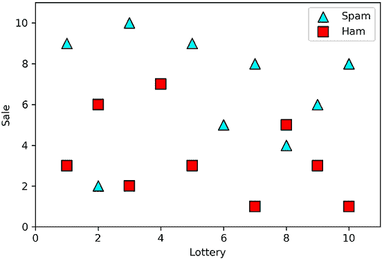

图 12.2 图 12.2  表 12.1 中数据集的绘图。垃圾邮件用三角形表示，正常邮件用正方形表示。水平和垂直轴分别表示“彩票”和“销售”单词出现的次数。

首先，对决策树进行（过度）拟合

在我们深入了解随机森林之前，让我们将决策树分类器拟合到这些数据上，看看它的表现如何。因为我们已经在第九章中学过这个内容，图 12.3 只显示了最终结果，但我们可以在笔记本中看到代码。在图 12.3 的左侧，我们可以看到实际的树（相当深！），在右侧，我们可以看到由这个决策树定义的边界。注意，它很好地拟合了数据集，训练准确率达到 100%，尽管它显然过拟合了。过拟合可以在模型试图正确分类的两个异常值上观察到，而没有注意到它们是异常值。

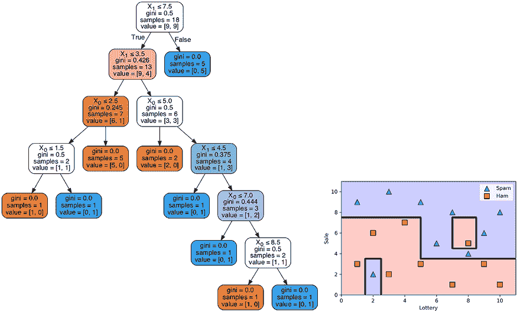

图 12.3 左：一个分类我们的数据集的决策树。右：由这个决策树定义的边界。注意，它很好地分割了数据，尽管它暗示了过拟合，因为一个好的模型会将两个孤立点视为异常值，而不是试图正确地分类它们。

在接下来的几节中，我们将看到如何通过拟合随机森林来解决这个过拟合问题。

手动拟合随机森林

在本节中，我们将学习如何手动拟合随机森林，尽管这只是为了教育目的，因为在实际操作中并不是这样做的。简而言之，我们从数据集中随机选择子集，并在每个子集上训练一个弱学习器（决策树）。一些数据点可能属于多个子集，而另一些可能不属于任何子集。这些子集的组合构成了我们的强学习器。强学习器进行预测的方式是通过让弱学习器进行投票。对于这个数据集，我们使用三个弱学习器。因为数据集有 18 个点，所以让我们考虑三个包含 6 个数据点的子集，如图 12.4 所示。

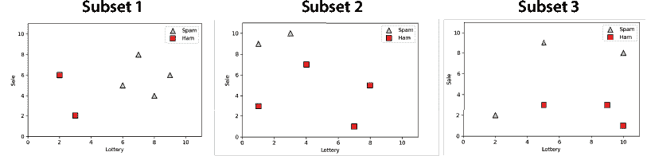

图 12.4 构建随机森林的第一步是将我们的数据分成三个子集。这是图 12.2 中所示的数据集分割。

接下来，我们继续构建我们的三个弱学习器。在每个子集上拟合一个深度为 1 的决策树。回想一下第九章的内容，深度为 1 的决策树只包含一个节点和两个叶子。它的边界由一条尽可能好地分割数据集的单个水平或垂直线组成。弱学习器如图 12.5 所示。

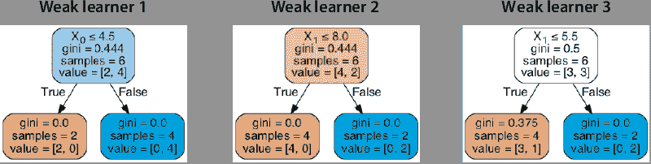

图 12.5 形成我们的随机森林的三个弱学习器都是深度为 1 的决策树。每个决策树拟合图 12.4 中对应的三个子集之一。

我们通过投票将这些组合成一个强学习器。换句话说，对于任何输入，每个弱学习器预测一个 0 或 1 的值。强学习器做出的预测是三个中最常见的输出。这种组合可以在图 12.6 中看到，其中弱学习器在顶部，强学习器在底部。

注意，随机森林是一个好的分类器，因为它正确分类了大多数点，但它允许一些错误，以避免过度拟合数据。然而，我们不需要手动训练这些随机森林，因为 Scikit-Learn 有相应的函数，我们将在下一节中看到。

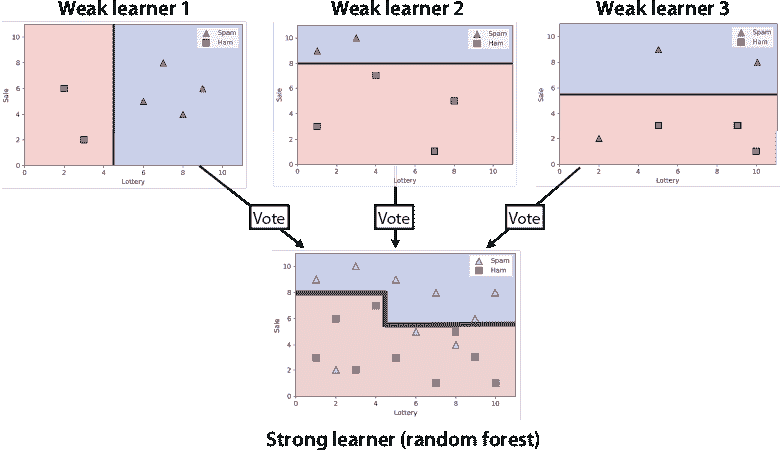

图 12.6 获得随机森林预测的方法是通过结合三个弱学习者的预测。在顶部，我们可以看到图 12.5 中的三个决策树边界。在底部，我们可以看到三个决策树如何投票以获得相应随机森林的边界。

在 Scikit-Learn 中训练随机森林

在本节中，我们展示了如何使用 Scikit-Learn 训练随机森林。在下面的代码中，我们使用了`RandomForestClassifier`包。首先，我们的数据存储在两个名为`features`和`labels`的 Pandas DataFrame 中，如下所示：

```
from sklearn.ensemble import RandomForestClassifier
random_forest_classifier = RandomForestClassifier(random_state=0, n_estimators=5, max_depth=1)
random_forest_classifier.fit(features, labels)
random_forest_classifier.score(features, labels)
```

在之前的代码中，我们指定了想要五个弱学习者，使用`n_estimators`超参数。这些弱学习者再次是决策树，我们使用`max_depth`超参数指定了它们的深度为 1。模型的图示如图 12.7 所示。注意这个模型犯了一些错误，但设法找到了一个好的边界，其中垃圾邮件是那些有很多“彩票”和“销售”等词语出现的邮件（图示的右上角），而 ham 邮件是那些这些词语出现不多的邮件（图示的左下角）。

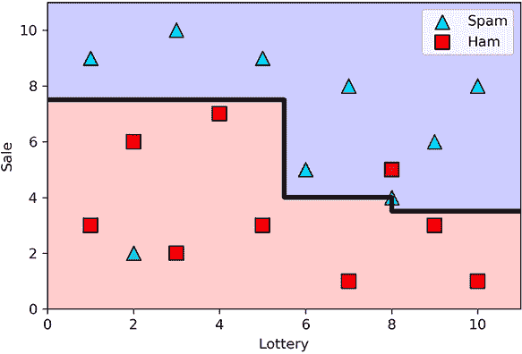

图 12.7 使用 Scikit-Learn 获得的随机森林边界。请注意，它很好地分类了数据集，并将两个误分类的点视为异常值，而不是尝试正确分类它们。

Scikit-Learn 还允许我们可视化和绘制单个弱学习者（请参阅笔记本中的代码）。弱学习者如图 12.8 所示。请注意，并非所有弱学习者都有用。例如，第一个将每个点分类为 ham。


图 12.8 通过 Scikit-Learn 获得的五个弱学习者组成的随机森林。每个都是一个深度为 1 的决策树。它们组合形成了图 12.7 中显示的强学习者。

在本节中，我们使用了深度为 1 的决策树作为弱学习者，但通常，我们可以使用任何深度的树。尝试通过改变`max_depth`超参数重新训练此模型，使用更深的决策树，看看随机森林会是什么样子！

## AdaBoost：以巧妙的方式结合弱学习者以构建强学习者

提升与袋装类似，我们通过结合多个弱学习器来构建一个强学习器。不同之处在于，我们不是随机选择弱学习器。相反，每个学习器都是通过关注先前学习器的弱点来构建的。在本节中，我们将学习一种由 Freund 和 Schapire 于 1997 年开发的强大提升技术，称为 AdaBoost（参见附录 C 获取参考文献）。AdaBoost 代表自适应提升，它适用于回归和分类。然而，我们将在一个分类示例中使用它，该示例非常清楚地说明了训练算法。

在 AdaBoost 中，就像在随机森林中一样，每个弱学习器都是深度为 1 的决策树。与随机森林不同，每个弱学习器都是在整个数据集上训练的，而不是在数据集的一部分上。唯一的注意事项是，在每个弱学习器训练后，我们通过扩大被错误分类的点来修改数据集，这样未来的弱学习器就会更加关注这些点。简而言之，AdaBoost 的工作原理如下：

训练 AdaBoost 模型的伪代码

+   在第一个数据集上训练第一个弱学习器。

+   对每个新的弱学习器重复以下步骤：

    +   在训练完一个弱学习器后，点被修改如下：

        +   被错误分类的点被放大。

    +   在这个修改后的数据集上训练一个新的弱学习器。

在本节中，我们通过一个示例更详细地开发这个伪代码。我们使用的这个数据集有两个类别（三角形和正方形），如图 12.9 所示。

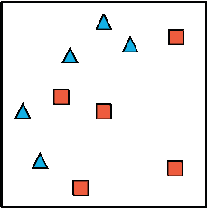

图 12.9 我们将使用 AdaBoost 进行分类的数据集。它有两个标签，分别由三角形和正方形表示。

AdaBoost 的总体图景：构建弱学习器

在接下来的两个小节中，我们将看到如何构建一个 AdaBoost 模型来拟合图 12.9 中所示的数据集。首先，我们构建将组合成一个强学习器的弱学习器。

第一步是将每个点的权重分配为 1，如图 12.10 的左侧所示。接下来，我们在该数据集上构建一个弱学习器。回想一下，弱学习器是深度为 1 的决策树。深度为 1 的决策树对应于最佳分割点的水平或垂直线。有几个这样的树可以完成这项工作，但我们将选择一个——图 12.10 中间所示的垂直线，它正确分类了左侧的两个三角形和右侧的五个正方形，并错误分类了右侧的三个三角形。下一步是将三个错误分类的点放大，以便在未来的弱学习器眼中赋予它们更多的重视。为了放大它们，回想一下，每个点最初有一个权重为 1。我们定义这个弱学习器的*缩放因子*为正确分类的点数除以错误分类的点数。在这种情况下，缩放因子是 7/3 = 2.33。我们继续通过这个缩放因子将每个错误分类的点进行缩放，如图 12.10 的右侧所示。

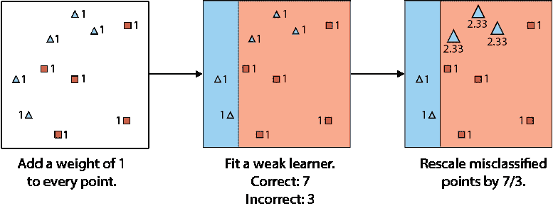

图 12.10 AdaBoost 模型第一个弱学习器的拟合。左侧：数据集，其中每个点被分配一个权重为 1。中间：最佳拟合此数据集的弱学习器。右侧：缩放后的数据集，我们通过 7/3 的缩放因子放大了错误分类的点。

现在我们已经构建了第一个弱学习器，我们以同样的方式构建下一个。第二个弱学习器如图 12.11 所示。图象的左侧是缩放后的数据集。第二个弱学习器是最佳拟合这个数据集的弱学习器。我们这是什么意思呢？因为点有不同的权重，我们希望弱学习器中正确分类的点的权重之和是最高的。这个弱学习器是

图 12.11 中间的水平线。我们现在继续计算缩放因子。我们需要稍微修改其定义，因为现在点有权重。缩放因子是正确分类的点的权重之和与错误分类的点的权重之和的比率。第一个项是 2.33 + 2.33 + 2.33 + 1 + 1 + 1 + 1 = 11，第二个是 1 + 1 + 1 = 3。因此，缩放因子是 11/3 = 3.67。我们继续将三个错误分类的点的权重乘以这个 3.67 的因子，如图 12.11 的右侧所示。

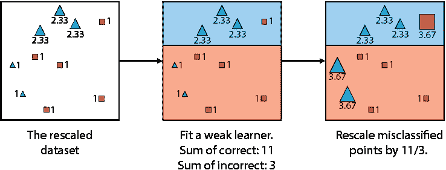

图 12.11 AdaBoost 模型第二个弱学习器的拟合。左侧：图 12.10 中的缩放后的数据集。中间：最佳拟合缩放后数据集的弱学习器——这意味着，对于正确分类的点的权重之和最大的弱学习器。右侧：新的缩放后的数据集，我们通过 11/3 的缩放因子放大了错误分类的点。

我们继续这样下去，直到我们构建了我们想要的那么多弱学习器。对于这个例子，我们只构建了三个弱学习器。第三个弱学习器是一条垂直线，如图 12.12 所示。

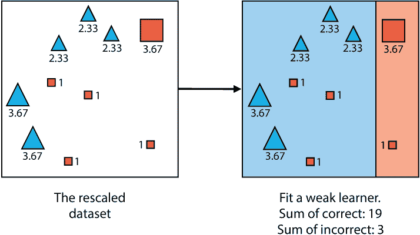

图 12.12 AdaBoost 模型中第三个弱学习器的拟合。左：来自图 12.11 的缩放数据集。右：最适合此缩放数据集的弱学习器。

这就是我们构建弱学习器的方法。现在，我们需要将它们组合成一个强学习器。这与我们使用随机森林所做的方法类似，但需要使用更多的数学知识，如下一节所示。

将弱学习器组合成强学习器

现在我们已经构建了弱学习器，在本节中，我们学习了一种有效的方法将它们组合成一个强学习器。想法是让分类器进行投票，就像它们在随机森林分类器中所做的那样，但这次，好的学习器比差的学习器有更多的发言权。如果分类器真的很差，那么它的投票实际上将是负数。

要理解这一点，想象我们有三个朋友：真诚的特蕾莎、不可预测的乌尔伯特和说谎的伦尼。真诚的特蕾莎几乎总是说实话，说谎的伦尼几乎总是撒谎，不可预测的乌尔伯特大约一半的时间说实话，另一半时间撒谎。在这三个朋友中，哪一个是最没有用的？

我认为，真诚的特蕾莎非常可靠，因为她几乎总是说实话，所以我们可以信任她。在其他人中，我更喜欢说谎的伦尼。如果他几乎总是在我们问他一个是非问题时撒谎，我们就简单地接受他告诉我们的相反事实，我们大多数时候都会是正确的！另一方面，如果我们不知道不可预测的乌尔伯特是在说实话还是在撒谎，那么他对我们来说就没有任何用处。在这种情况下，如果我们给每个朋友说的话分配一个分数，我会给真诚的特蕾莎一个很高的正分，给说谎的伦尼一个很高的负分，给不可预测的乌尔伯特一个零分。

现在想象我们的三个朋友是在一个有两个类别的数据集上训练的弱学习器。真诚的特蕾莎是一个准确率非常高的分类器，说谎的伦尼是一个准确率非常低的分类器，不可预测的乌尔伯特是一个准确率接近 50%的分类器。我们想要构建一个强学习器，其预测是通过三个弱学习器的加权投票得到的。因此，我们给每个弱学习器分配一个分数，这就是学习者的投票在最终投票中将占多少权重。此外，我们想要以下方式分配这些分数：

+   真诚的特蕾莎分类器得到一个很高的正分。

+   不可预测的乌尔伯特分类器得到一个接近零的分数。

+   说谎的伦尼分类器得到一个很高的负分。

换句话说，弱学习器的分数是一个具有以下属性的数字：

1.  当学习器的准确率大于 0.5 时为正数

1.  当模型的准确率为 0.5 时为 0

1.  当学习者的准确度小于 0.5 时，它是负数

1.  当学习者的准确度接近 1 时，它是一个大的正数

1.  当学习者的准确度接近 0 时，它是一个大的负数

为了得到一个满足上述 1-5 个特性的弱学习者的良好得分，我们使用概率论中的一个流行概念，称为*logit*或*对数概率*，我们将在下面讨论。

概率、赔率和对数概率

你可能在赌博中看到过，人们从不提及概率，但他们总是谈论*赔率*。这些赔率是什么？在以下意义上，它们与概率相似：如果我们多次运行一个实验并记录特定结果发生的次数，那么这个结果发生的概率是它发生的次数除以我们运行实验的总次数。这个结果的对数概率是它发生的次数除以它没有发生的次数。

例如，掷骰子得到 1 的概率是 1/6，但赔率是 1/5。如果一匹马在每四场比赛中赢三场，那么这匹马赢得比赛的概率是 3/4，赔率是 3/1=3。赔率的公式很简单：如果事件的概率是*x*，那么赔率是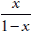。例如，在骰子例子中，概率是 1/6，赔率是

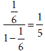.

请注意，因为概率是一个介于 0 和 1 之间的数，所以赔率是一个介于 0 和∞之间的数。

现在让我们回到我们的原始目标。我们正在寻找一个满足上述 1-5 个特性的函数。概率函数很接近，但还不够，因为它只输出正值。将概率转换为满足上述 1-5 个特性的函数的方法是取对数。因此，我们得到了对数概率，也称为 logit，其定义如下：

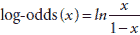

图 12.13 显示了对数概率函数的图像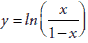。请注意，这个函数满足 1-5 个特性。

因此，我们所需做的就是使用对数概率函数来计算每个弱学习者的得分。我们将此对数概率函数应用于准确度。表 12.2 包含了一些弱学习者的准确度和该准确度的对数概率。请注意，正如预期的那样，准确度高的模型具有高的正得分，准确度低的模型具有高的负得分，而准确度接近 0.5 的模型得分接近 0。

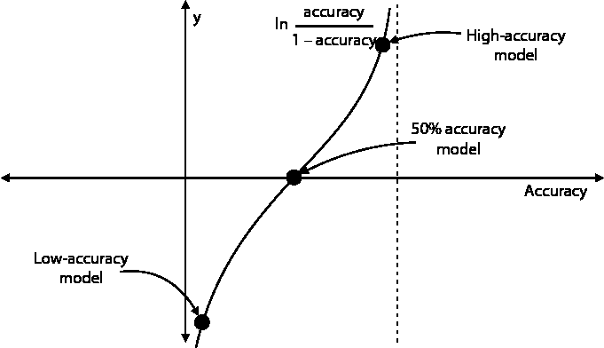

图 12.13 该曲线显示了对数概率函数相对于准确度的图像。请注意，对于准确度较小的值，对数概率是一个非常大的负数，而对于准确度较高的值，它是一个非常大的正数。当准确度为 50%（或 0.5）时，对数概率恰好为零。

表 12.2 展示了弱分类器的几个准确度值，以及使用对数几率计算出的相应分数。请注意，准确度非常低的模型会得到很大的负分数，准确度非常高的值会得到很大的正分数，而接近 0.5 的准确度值会得到接近 0 的分数。

| 准确度 | 对数几率（弱学习器的分数） |
| --- | --- |
| 0.01 | –4.595 |
| 0.1 | –2.197 |
| 0.2 | –1.386 |
| 0.5 | 0 |
| 0.8 | 1.386 |
| 0.9 | 2.197 |
| 0.99 | 4.595 |

组合分类器

既然我们已经确定对数几率是定义所有弱学习器分数的方法，我们就可以继续将它们组合起来构建强学习器。回想一下，弱学习器的准确度是正确分类的点分数总和除以所有点分数总和，如图 12.10-12.12 所示。

+   弱学习器 1：

    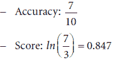

+   弱学习器 2：

    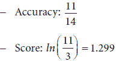

+   弱学习器 3：

    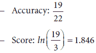

强学习器的预测是通过弱分类器的加权投票得到的，其中每个分类器的投票是其分数。一个简单的方法是将弱学习器的预测值从 0 和 1 改为-1 和 1，并将每个预测值乘以弱学习器的分数，然后相加。如果得到的预测值大于或等于零，则强学习器预测为 1，如果为负，则预测为 0。投票过程如图 12.14 所示，预测结果如图 12.15 所示。注意，在图 12.15 中，得到的分类器正确地分类了数据集中的每个点。

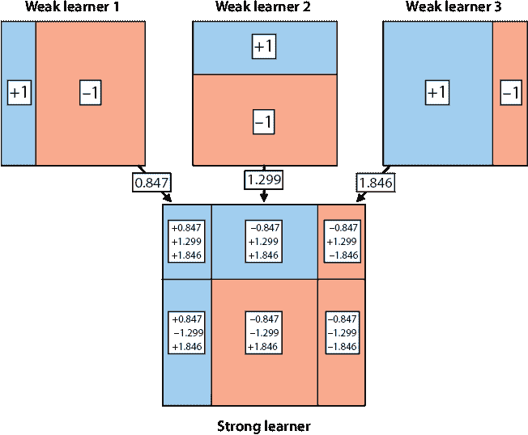

图 12.14 展示了如何在 AdaBoost 模型中将弱学习器组合成一个强学习器。我们使用对数几率对每个弱学习器进行评分，并根据它们的评分进行投票（评分越高，该学习器的投票权重越大）。底部图中的每个区域都包含弱学习器评分的总和。请注意，为了简化计算，弱学习器的预测值是+1 和-1，而不是 1 和 0。

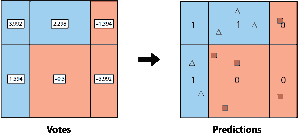

图 12.15 展示了如何获得 AdaBoost 模型的预测。一旦我们添加了来自弱学习器的分数（如图 12.14 所示），如果分数总和大于或等于 0，则分配预测值为 1，否则分配预测值为 0。

在 Scikit-Learn 中编码 AdaBoost

在本节中，我们将展示如何使用 Scikit-Learn 训练一个 AdaBoost 模型。我们使用与“手动拟合随机森林”部分相同的垃圾邮件数据集进行训练，并在图 12.16 中进行了绘制。我们继续使用上一节中的以下笔记本：

+   **笔记**：Random_forests_and_AdaBoost.ipynb

    +   [`github.com/luisguiserrano/manning/blob/master/Chapter_12_Ensemble_Methods/Random_forests_and_AdaBoost.ipynb`](https://github.com/luisguiserrano/manning/blob/master/Chapter_12_Ensemble_Methods/Random_forests_and_AdaBoost.ipynb)

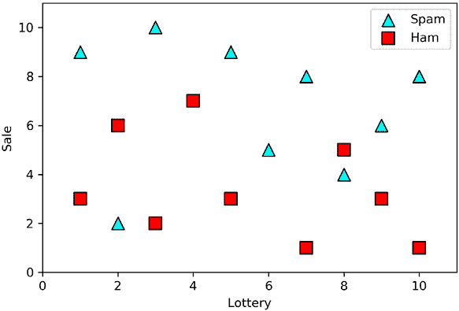

图 12.16 在此数据集中，我们使用 Scikit-Learn 训练一个 AdaBoost 分类器。这是来自“Bagging”部分的相同垃圾邮件数据集，其中特征是单词“彩票”和“垃圾邮件”出现的次数，垃圾邮件用三角形表示，正常邮件用正方形表示。

数据集包含两个 Pandas DataFrame，分别称为`features`和`labels`。训练使用 Scikit-Learn 中的`AdaBoostClassifier`包完成。我们指定此模型将使用六个弱学习器，如以下所示：

```
from sklearn.ensemble import AdaBoostClassifier
adaboost_classifier = AdaBoostClassifier(n_estimators=6)
adaboost_classifier.fit(features, labels)
adaboost_classifier.score(features, labels)
```

结果模型的边界在图 12.17 中绘制。

我们可以更进一步，探索六个弱学习者和它们的分数（参见笔记本中的代码）。它们的边界在图 12.18 中绘制，并且正如笔记本中所示，所有弱学习者的分数都是 1。

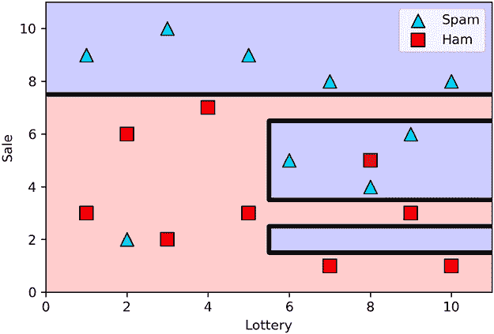

图 12.17 AdaBoost 分类器在图 12.16 的垃圾邮件数据集上的结果。请注意，分类器很好地拟合了数据集，并且没有过度拟合太多。

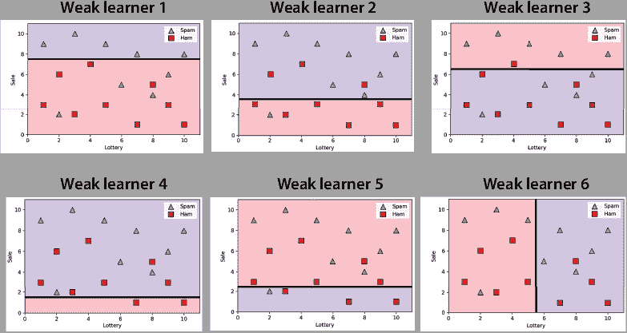

图 12.18 我们 AdaBoost 模型中的六个弱学习器。每一个都是深度为 1 的决策树。它们组合成图 12.17 中的强学习器。

注意，图 12.17 中的强学习器是通过将图 12.18 中每个弱学习者的分数设为 1，并让它们投票得到的。

## 梯度提升：使用决策树构建强大的学习器

在本节中，我们讨论梯度提升，这是目前最受欢迎且最成功的机器学习模型之一。梯度提升与 AdaBoost 类似，因为弱学习器是决策树，每个弱学习器的目标是从前一个学习者的错误中学习。梯度提升与 AdaBoost 之间的一个区别在于，在梯度提升中，我们允许决策树的深度超过 1。梯度提升可用于回归和分类，但为了清晰起见，我们使用回归示例。要了解更多信息，请查看附录 C 中视频和阅读材料的链接。本节的代码如下：

+   **笔记本**：Gradient_boosting_and_XGBoost.ipynb

    +   [`github.com/luisguiserrano/manning/blob/master/Chapter_12_Ensemble_Methods/Gradient_boosting_and_XGBoost.ipynb`](https://github.com/luisguiserrano/manning/blob/master/Chapter_12_Ensemble_Methods/Gradient_boosting_and_XGBoost.ipynb)

我们使用的例子与第九章中“决策树回归”部分相同的例子，我们在其中研究了某些用户与一个应用的互动程度。特征是用户的年龄，标签是用户与应用互动的天数（表 12.3）。数据集的图示在图 12.19 中。

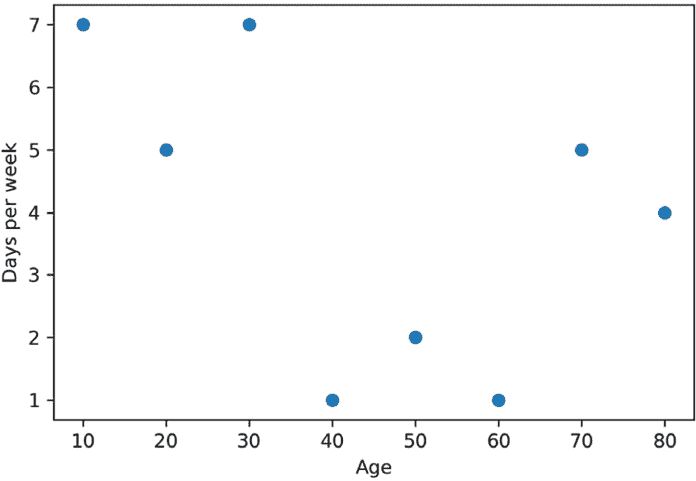

图 12.19 表 12.3 中用户互动数据集的图示。横轴代表用户的年龄，纵轴代表用户每周使用我们应用的天数。

表 12.3 一个包含八个用户、他们的年龄以及他们与我们应用的互动的小数据集。互动是通过他们在一周内打开应用的天数来衡量的。我们将使用梯度提升来拟合这个数据集。

| 特征（年龄） | 标签（互动） |
| --- | --- |
| 10 | 7 |
| 20 | 5 |
| 30 | 7 |
| 40 | 1 |
| 50 | 2 |
| 60 | 1 |
| 70 | 5 |
| 80 | 4 |

梯度提升的想法是我们将创建一个适合这个数据集的树序列。我们现在将使用的两个超参数是树的数目，我们将其设置为五，以及学习率，我们将其设置为 0.8。第一个弱学习器很简单：它是最适合数据集的深度为 0 的决策树。深度为 0 的决策树只是一个将相同的标签分配给数据集中每个点的节点。因为我们最小化的误差函数是均方误差，所以这个预测的最优值是标签的平均值。这个数据集标签的平均值是 4，所以我们的第一个弱学习器是一个将预测值 4 分配给每个点的节点。

下一步是计算残差，即标签与第一个弱学习器做出的预测之间的差异，并拟合一个新的决策树来这些残差。正如你所看到的，这是在训练一个决策树来填补第一个树留下的空缺。标签、预测和残差在表 12.4 中显示。

第二个弱学习器是一个拟合这些残差的树。树可以深到我们想要的程度，但在这个例子中，我们将确保所有弱学习器的深度最多为 2。这棵树在图 12.20（及其边界）中显示，其预测在表 12.4 的最右边列中。这棵树是使用 Scikit-Learn 获得的；请参阅笔记本以获取过程。

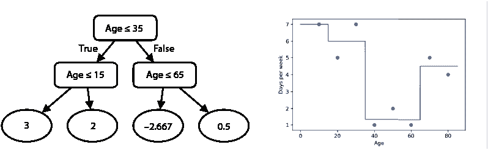

图 12.20 梯度提升模型中的第二个弱学习器。这个学习器是一个深度为 2 的决策树，如图左所示。这个弱学习器的预测在右边的图上显示。

表 12.4 第一个弱学习器的预测是标签的平均值。第二个弱学习器被训练来拟合第一个弱学习器的残差。

| 特征（年龄） | 标签（互动） | 弱学习器 1 的预测 | 残差 | 弱学习器 2 的预测 |
| --- | --- | --- | --- | --- |
| 10 | 7 | 4 | 3 | 3 |
| 20 | 5 | 4 | 2 | 2 |
| 30 | 7 | 4 | 3 | 2 |
| 40 | 1 | 4 | –3 | –2.667 |
| 50 | 2 | 4 | –2 | –2.667 |
| 60 | 1 | 4 | –3 | –2.667 |
| 70 | 5 | 4 | 1 | 0.5 |
| 80 | 4 | 4 | 0 | 0.5 |

这种想法是继续这种方式，计算新的残差并训练一个新的弱学习器来拟合这些残差。然而，有一个小的注意事项——为了计算前两个弱学习器的预测值，我们首先将第二个弱学习器的预测值乘以学习率。回想一下，我们使用的学习率是 0.8。因此，前两个弱学习器的组合预测是第一个的预测值（4）加上第二个预测值的 0.8 倍。我们这样做是因为我们不希望过度拟合，即训练数据拟合得太好。我们的目标是模仿梯度下降算法，通过逐渐接近解，这就是我们通过乘以学习率所实现的。新的残差是原始标签减去前两个弱学习器的组合预测。这些在表 12.5 中计算。

表 12.5 标签、前两个弱学习器的预测值以及残差。第一个弱学习器的预测值是标签的平均值。第二个弱学习器的预测值显示在图 12.20 中。组合预测等于第一个弱学习器的预测值加上学习率（0.8）乘以第二个弱学习器的预测值。残差是标签与第一个两个弱学习器的组合预测之间的差值。

| 标签 | 弱学习器 1 的预测值 | 弱学习器 2 的预测值 | 弱学习器 2 乘以学习率的预测值 | 弱学习器 1 和 2 的预测值 | 残差 |
| --- | --- | --- | --- | --- | --- |
| 7 | 4 | 3 | 2.4 | 6.4 | 0.6 |
| 5 | 4 | 2 | 1.6 | 5.6 | –0.6 |
| 7 | 4 | 2 | 1.6 | 5.6 | 1.4 |
| 1 | 4 | –2.667 | –2.13 | 1.87 | –0.87 |
| 2 | 4 | –2.667 | –2.13 | 1.87 | 0.13 |
| 1 | 4 | –2.667 | –2.13 | 1.87 | –0.87 |
| 5 | 4 | 0.5 | 0.4 | 4.4 | 0.6 |
| 4 | 4 | 0.5 | 0.4 | 4.4 | –0.4 |

现在我们可以继续在新的残差上拟合一个新的弱学习器，并计算前两个弱学习器的组合预测。我们通过将第一个弱学习器的预测值加上 0.8（学习率）乘以第二个和第三个弱学习器的预测值之和来获得这个值。我们为想要构建的每个弱学习器重复这个过程。我们可以使用 Scikit-Learn 中的`GradientBoostingRegressor`包（代码在笔记本中）来代替手动操作。接下来的几行代码显示了如何拟合模型并进行预测。请注意，我们已将树的深度设置为最多 2 层，树的数量设置为 5，学习率设置为 0.8。用于此的超参数是`max_depth`、`n_estimators`和`learning_rate`。此外，请注意，如果我们想要五棵树，我们必须将`n_estimators`超参数设置为 4，因为第一棵树不计入。

```
from sklearn.ensemble import GradientBoostingRegressor
gradient_boosting_regressor = GradientBoostingRegressor(max_depth=2, n_estimators=4, learning_rate=0.8)
gradient_boosting_regressor.fit(features, labels)
gradient_boosting_regressor.predict(features)
```

结果强学习器的图示如图 12.21 所示。请注意，它在预测值方面做得很好。


图 12.21 我们梯度提升回归器中强学习器预测的图示。请注意，该模型很好地拟合了数据集。

然而，我们可以更进一步，实际上绘制我们获得的五个弱学习器。这些细节在笔记本中，五个弱学习器如图 12.22 所示。请注意，最后一个弱学习器的预测值远小于第一个，因为每个弱学习器都在预测前一个的误差，而这些误差在每一步都会越来越小。

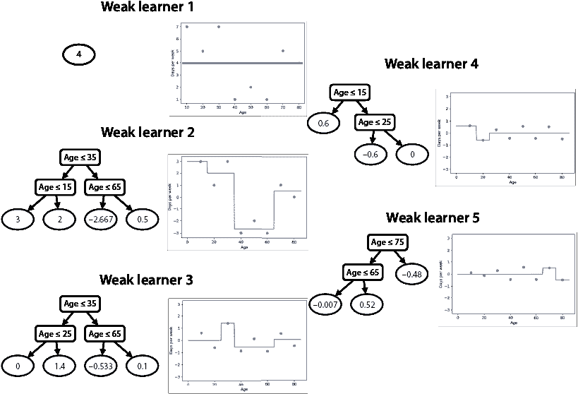

图 12.22 梯度提升模型中的五个弱学习器。第一个是一个深度为 0 的决策树，它总是预测标签的平均值。每个后续的弱学习器都是一个深度最多为 2 的决策树，它拟合先前弱学习器给出的预测的残差。请注意，弱学习器的预测值越来越小，因为当强学习器的预测值越来越接近标签时，残差也会越来越小。

最后，我们可以使用 Scikit-Learn 或手动计算来查看预测如下：

+   年龄 = 10，预测 = 6.87

+   年龄 = 20，预测 = 5.11

+   年龄 = 30，预测 = 6.71

+   年龄 = 40，预测 = 1.43

+   年龄 = 50，预测 = 1.43

+   年龄 = 60，预测 = 1.43

+   年龄 = 70，预测 = 4.90

+   年龄 = 80，预测 = 4.10

## XGBoost：一种极端的梯度提升方法

XGBoost，代表**极端梯度提升**，是最受欢迎、最强大和最有效的梯度提升实现之一。由陈天奇和卡洛斯·古斯特林于 2016 年创建（参见附录 C 获取参考文献），XGBoost 模型通常优于其他分类和回归模型。在本节中，我们将讨论 XGBoost 的工作原理，使用与“梯度提升：使用决策树构建强学习器”部分相同的回归示例。

XGBoost 使用决策树作为弱学习器，就像我们在之前学习的提升方法中一样，每个弱学习器都是设计来关注前一个的弱点。更具体地说，每棵树都是构建来拟合先前树预测的残差。然而，也有一些小的不同，比如我们构建树的方式，我们使用一个称为**相似度得分**的度量。此外，我们添加了一个剪枝步骤来防止过拟合，其中如果树的分支不满足某些条件，我们会移除这些分支。在本节中，我们将更详细地介绍这一点。

XGBoost 相似度得分：在集合中衡量相似性的新而有效的方法

在本小节中，我们将看到 XGBoost 的主要构建块，这是一种衡量集合元素相似度的方法。这个指标恰当地被称为*相似度得分*。在我们学习它之前，让我们做一个小的练习。在以下三个集合中，哪一个具有最大的相似度，哪一个具有最小的相似度？

+   **集合 1**：{10, –10, 4}

+   **集合 2**：{7, 7, 7}

+   **集合 3**：{7}

如果你认为集合 2 的相似度最高，而集合 1 的相似度最低，你的直觉是正确的。在集合 1 中，元素彼此之间非常不同，因此这一组的相似度最低。在集合 2 和 3 之间，情况并不那么明确，因为这两个集合都有相同的元素，但出现的次数不同。然而，集合 2 中数字七出现了三次，而集合 3 中只出现了一次。因此，在集合 2 中，元素比集合 3 更均匀，或者说更相似。

为了量化相似度，考虑以下指标。给定一个集合{*a*[1]，*a*[2]，…，*a*[n]}，相似度得分是元素总和的平方除以元素的数量，即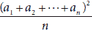。让我们计算上面三个集合的相似度得分，如下所示：

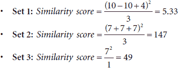

注意，正如预期的那样，集合 2 的相似度得分是最高的，而集合 1 的得分最低。

注意：这个相似度得分并不完美。有人可能会认为集合{1, 1, 1}比集合{7, 8, 9}更相似，但集合{1, 1, 1}的相似度得分是 3，而集合{7, 8, 9}的相似度得分是 192。然而，对于我们的算法来说，这个得分仍然有效。相似度得分的主要目标是能够很好地分离大值和小值，正如我们将在当前示例中看到的那样。

与相似度得分相关联的超参数λ有助于防止过拟合。当使用时，它被添加到相似度得分的分母中，给出了公式。例如，如果λ = 2，集合 1 的相似度得分现在是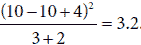。在我们的示例中，我们不会使用λ超参数，但在我们到达代码时，我们将看到如何将其设置为任何我们想要的值。

构建弱学习器

在本小节中，我们将看到如何构建每个弱学习器。为了说明这个过程，我们使用了“梯度提升”部分中的相同示例，如表 12.3 所示。为了方便起见，相同的数据集显示在表 12.6 的最左两列中。这是一个应用程序用户的数据集，其中特征是用户的年龄，标签是他们每周与该应用程序互动的天数。该数据集的图示如图 12.19 所示。

表 12.6 与表 12.3 中相同的数据库，包含用户、他们的年龄以及他们每周与我们应用互动的天数。第三列包含 XGBoost 模型中第一个弱学习器的预测。这些预测默认都是 0.5。最后一列包含残差，即标签与预测之间的差异。

| 特征（年龄） | 标签（参与度） | 第一个弱学习器的预测 | 残差 |
| --- | --- | --- | --- |
| 10 | 7 | 0.5 | 6.5 |
| 20 | 5 | 0.5 | 4.5 |
| 30 | 7 | 0.5 | 6.5 |
| 40 | 1 | 0.5 | 0.5 |
| 50 | 2 | 0.5 | 1.5 |
| 60 | 1 | 0.5 | 0.5 |
| 70 | 5 | 0.5 | 4.5 |
| 80 | 4 | 0.5 | 3.5 |

训练 XGBoost 模型的过程与训练梯度提升树的过程类似。第一个弱学习器是一棵对每个数据点预测 0.5 的树。在构建这个弱学习器之后，我们计算残差，即标签与预测标签之间的差异。这两个量可以在表 12.6 的最后两列中找到。

在开始构建剩余的树之前，让我们决定我们希望它们有多深。为了保持这个例子的小型化，我们再次使用最大深度为 2。这意味着当我们达到深度 2 时，我们停止构建弱学习器。这是一个超参数，我们将在“在 Python 中训练 XGBoost 模型”部分中更详细地了解。

要构建第二个弱学习器，我们需要将决策树拟合到残差上。我们使用相似度得分来完成这项工作。通常情况下，在根节点，我们有整个数据集。因此，我们首先计算整个数据集的相似度得分，如下所示：

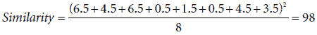

现在，我们继续使用与决策树相同的方式，根据年龄特征以所有可能的方式分割节点。对于每个分割，我们计算对应于每个叶子的子集的相似度得分并将它们相加。这就是该分割对应的组合相似度得分。得分如下：

根节点分割，数据集{6.5, 4.5, 6.5, 0.5, 1.5, 0.5, 4.5, 3.5}，相似度得分=98：

+   在 15 处分割：

    +   左节点：{6.5}; 相似度得分：42.25

    +   右节点：{4.5, 6.5, 0.5, 1.5, 0.5, 4.5, 3.5}; 相似度得分：66.04

    +   组合相似度得分：108.29

+   在 25 处分割：

    +   左节点：{6.5, 4.5}; 相似度得分：60.5

    +   右节点：{6.5, 0.5, 1.5, 0.5, 4.5, 3.5}; 相似度得分：48.17

    +   组合相似度得分：108.67

+   在 35 处分割：

    +   左节点：{6.5, 4.5, 6.5}; 相似度得分：102.08

    +   右节点：{0.5, 1.5, 0.5, 4.5, 3.5}; 相似度得分：22.05

    +   **组合相似度得分：124.13**

+   在 45 处分割：

    +   左节点：{6.5, 4.5, 6.5, 0.5}; 相似度得分：81

    +   右节点：{1.5, 0.5, 4.5, 3.5}; 相似度得分：25

    +   组合相似度得分：106

+   在 55 处分割：

    +   左节点：{6.5, 4.5, 6.5, 0.5, 1.5}; 相似度得分：76.05

    +   右节点：{0.5, 4.5, 3.5}; 相似度得分：24.08

    +   组合相似度得分：100.13

+   在 65 处分割：

    +   左节点：{6.5, 4.5, 6.5, 0.5, 1.5, 0.5}; 相似度得分：66.67

    +   右节点：{4.5, 3.5}; 相似度得分：32

    +   组合相似度得分：98.67

+   在 75 处分割：

    +   左节点：{6.5, 4.5, 6.5, 0.5, 1.5, 0.5, 4.5}; 相似度得分：85.75

    +   右节点：{3.5}; 相似度得分：12.25

    +   组合相似度得分：98

如这些计算所示，具有最佳组合相似度得分的分割是在年龄=35 岁。这将作为根节点的分割。

接下来，我们以相同的方式在每个节点的数据集上进行分割。

左节点的分割，数据集为{6.5, 4.5, 6.5}，相似度得分为 102.08：

+   在 15 处分割：

    +   左节点：{6.5}; 相似度得分：42.25

    +   右节点：{4.5, 6.5}; 相似度得分：60.5

    +   相似度得分：102.75

+   在 25 处分割：

    +   左节点：{6.5, 4.5}; 相似度得分：60.5

    +   右节点：{6.5}; 相似度得分：42.25

    +   相似度得分：102.75

两个分割给出了相同的组合相似度得分，因此我们可以使用其中的任何一个。让我们使用 15 处的分割。现在，转向右节点。

右节点的分割，数据集为{0.5, 1.5, 0.5, 4.5, 3.5}，相似度得分为 22.05：

+   在 45 处分割：

    +   左节点：{0.5}; 相似度得分：0.25

    +   右节点：{1.5, 0.5, 4.5, 3.5}; 相似度得分：25

    +   相似度得分：25.25

+   在 55 处分割：

    +   左节点：{0.5, 1.5}; 相似度得分：2

    +   右节点：{0.5, 4.5, 3.5}; 相似度得分：24.08

    +   相似度得分：26.08

+   在 65 处分割：

    +   左节点：{0.5, 1.5, 0.5}; 相似度得分：2.08

    +   右节点：{4.5, 3.5}; 相似度得分：32

    +   **相似度得分：34.08**

+   在 75 处分割：

    +   左节点：{0.5, 1.5, 0.5, 4.5}; 相似度得分：12.25

    +   右节点：{3.5}; 相似度得分：12.25

    +   相似度得分：24.5

从这里，我们得出结论，最佳分割是在年龄=65 岁。树现在深度为 2，所以我们停止生长，因为这正是我们在算法开始时决定的。结果树以及节点处的相似度得分如图 12.23 所示。

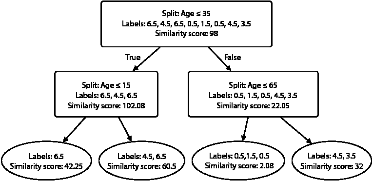

图 12.23 我们 XGBoost 分类器中的第二个弱学习器。对于每个节点，我们可以看到基于年龄特征的分割，该节点对应的标签，以及每组标签的相似度得分。每个节点选择的分割是最大化叶子节点组合相似度得分的分割。对于每个叶子节点，你可以看到相应的标签及其相似度得分。

这（几乎）就是我们的第二个弱学习器。在我们继续构建更多弱学习器之前，我们需要再进行一步操作来帮助减少过拟合。

树剪枝：通过简化弱学习器来减少过拟合的一种方法

XGBoost 的一个很好的特性是它不太容易过拟合。为此，它使用几个超参数，这些超参数在“在 Python 中训练 XGBoost 模型”部分中详细描述。其中之一，最小分割损失，如果结果节点的综合相似度得分与原始节点的相似度得分没有显著差异，则阻止分割发生。这种差异称为相似度增益。例如，在我们的树根节点中，相似度得分是 98，节点的综合相似度得分是 124.13。因此，相似度增益是 124.13 – 98 = 26.13。同样，左侧节点的相似度增益是 0.67，右侧节点的相似度增益是 12.03，如图 12.24 所示。

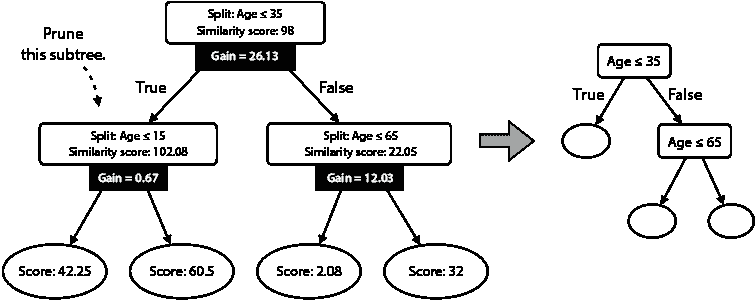

图 12.24 在图 12.23 的左侧，我们有与图 12.23 相同的树，额外的一条信息：相似度增益。我们通过从每个节点的相似度得分中减去叶子节点的综合相似度得分来获得这个值。我们只允许具有高于 1（我们的最小分割损失超参数）的相似度增益的分割，因此其中一个分割不再被允许。这导致右侧的剪枝树，现在它变成了我们的弱学习器。

我们将最小分割损失设置为 1。使用这个值，唯一被阻止的分割是左侧节点（年龄≤15）的分割。因此，第二个弱学习器看起来就像图 12.24 右侧的树。

进行预测

现在我们已经构建了第二个弱学习器，是时候用它来进行预测了。我们通过从任何决策树中获取预测的方式获得预测，即通过平均相应叶子的标签。第二个弱学习器的预测可以在图 12.25 中看到。

现在，我们来计算前两个弱学习器的组合预测。为了避免过拟合，我们使用与梯度提升中相同的技巧，即乘以

通过学习率对所有的弱学习器（除了第一个）进行预测。这是为了模拟梯度下降法，在经过几次迭代后，我们逐渐收敛到一个好的预测。我们使用的学习率是 0.7。因此，前两个弱学习器的组合预测等于第一个弱学习器的预测加上第二个弱学习器预测乘以 0.7。例如，对于第一个数据点，这个预测是

0.5 + 5.83 * 0.7 = 4.58。

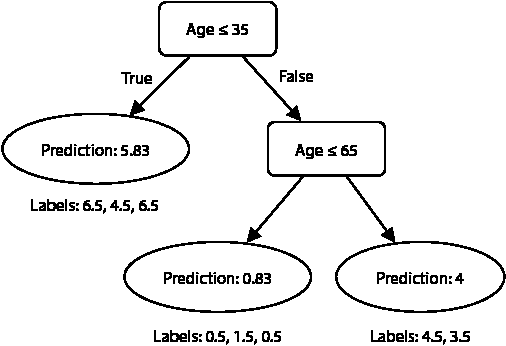

图 12.25 在我们的 XGBoost 模型中被剪枝后的第二个弱学习器。这是与图 12.24 相同的树，带有其预测。每个叶子的预测是相应叶子标签的平均值。

表 12.7 的第五列包含前两个弱学习器的组合预测。

表 12.7：标签、前两个弱学习者的预测和残差。综合预测是通过将第一个弱学习者的预测（总是 0.5）加上学习率（0.7）乘以第二个弱学习者的预测得到的。残差是标签和综合预测之间的差异。

| 标签（参与度） | 弱学习者 1 的预测 | 弱学习者 2 的预测 | 弱学习者 2 乘以学习率 | 综合预测 | 残差 |
| --- | --- | --- | --- | --- | --- |
| 7 | 0.5 | 5.83 | 4.08 | 4.58 | 2.42 |
| 5 | 0.5 | 5.83 | 4.08 | 4.58 | 0.42 |
| 7 | 0.5 | 5.83 | 4.08 | 4.58 | 2.42 |
| 1 | 0.5 | 0.83 | 0.58 | 1.08 | –0.08 |
| 2 | 0.5 | 0.83 | 0.58 | 1.08 | 0.92 |
| 1 | 0.5 | 0.83 | 0.58 | 1.08 | –0.08 |
| 5 | 0.5 | 4 | 2.8 | 3.3 | 1.7 |
| 4 | 0.5 | 4 | 2.8 | 3.3 | 0.7 |

注意，综合预测比第一个弱学习者的预测更接近标签。下一步是迭代。我们计算所有数据点的新的残差，为它们拟合一棵树，修剪树，计算新的综合预测，并以此类推。我们想要的树的数量是另一个超参数，我们可以在开始时选择。为了继续构建这些树，我们求助于一个有用的 Python 包，称为`xgboost`。

在 Python 中训练 XGBoost 模型

在本节中，我们学习如何使用`xgboost` Python 包训练模型以适应当前数据集。本节的代码与前一节相同，如下所示：

+   **Notebook**：Gradient_boosting_and_XGBoost.ipynb

    +   [`github.com/luisguiserrano/manning/blob/master/Chapter_12_Ensemble_Methods/Gradient_boosting_and_XGBoost.ipynb`](https://github.com/luisguiserrano/manning/blob/master/Chapter_12_Ensemble_Methods/Gradient_boosting_and_XGBoost.ipynb)

在我们开始之前，让我们回顾一下为该模型定义的超参数：

estimators 数量：弱学习者的数量。注意：在`xgboost`包中，第一个弱学习者不计入估计器之中。对于本例，我们将其设置为 3，这将给我们四个弱学习者。

最大深度：每个决策树（弱学习者）允许的最大深度。我们将其设置为 2。

lambda 参数：添加到相似度分数分母中的数字。我们将其设置为 0。

最小分割损失：允许分割发生的相似度分数的最小增益。我们将其设置为 1。

学习率：从倒数第二个弱学习者的预测乘以学习率。我们将其设置为 0.7。

使用以下代码行，我们导入包，构建一个名为`XGBRegressor`的模型，并将其拟合到我们的数据集：

```
import xgboost
from xgboost import XGBRegressor
xgboost_regressor = XGBRegressor(random_state=0,
                                 n_estimators=3,
                                 max_depth=2,
                                 reg_lambda=0,
                                 min_split_loss=1,
                                 learning_rate=0.7)
xgboost_regressor.fit(features, labels)
```

模型的图表显示在图 12.26 中。注意，它很好地拟合了数据集。

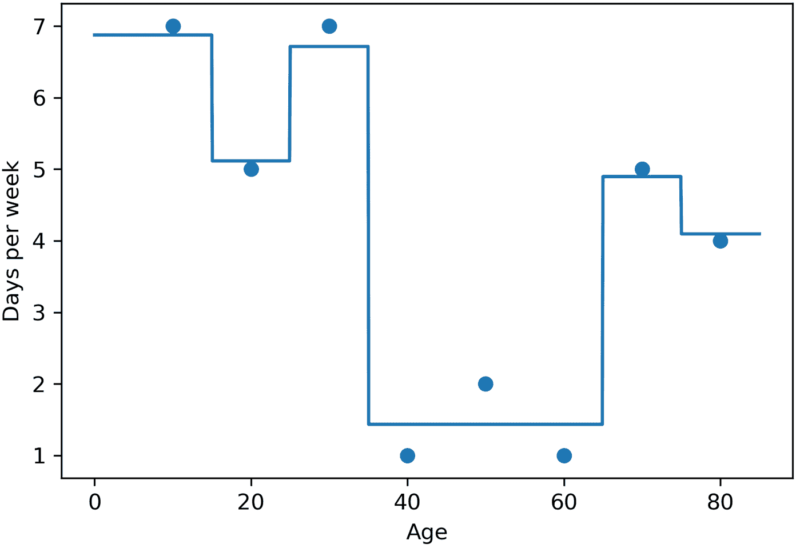

图 12.26：我们的 XGBoost 模型预测的图表。注意，它很好地拟合了数据集。

`xgboost`包还允许我们查看弱学习者，它们出现在图 12.24 中。以这种方式获得的树已经将标签乘以学习率 0.7，与图 12.25 中手动获得的树的预测值和图 12.27 中左侧第二棵树的预测值相比，这一点很清楚。

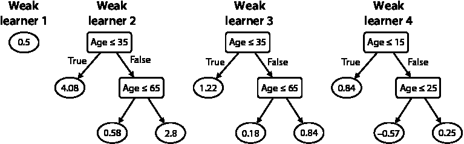

图 12.27 形成我们 XGBoost 模型中强学习者的四个弱学习者。注意，第一个总是预测 0.5。其他三个在形状上相当相似，这是一个巧合。然而，请注意，每棵树的预测值都在减小，因为每次我们都在拟合更小的残差。此外，请注意第二个弱学习者是我们图 12.25 中手动获得的同一棵树，唯一的区别是，在这棵树中，预测值已经乘以了学习率 0.7。

因此，为了获得强学习者的预测值，我们只需要添加每棵树的预测值。例如，对于一个 20 岁的用户，预测值如下：

+   弱学习者 1：0.5

+   弱学习者 2：4.08

+   弱学习者 3：1.22

+   弱学习者 4：-0.57

因此，预测值为 0.5 + 5.83 + 1.22 – 0.57 = 5.23。其他点的预测值如下：

+   年龄 = 10；预测值 = 6.64

+   年龄 = 20；预测值 = 5.23

+   年龄 = 30；预测值 = 6.05

+   年龄 = 40；预测值 = 1.51

+   年龄 = 50；预测值 = 1.51

+   年龄 = 60；预测值 = 1.51

+   年龄 = 70；预测值 = 4.39

+   年龄 = 80；预测值 = 4.39

## 集成方法的应用

集成方法是当今最实用的机器学习技术之一，因为它们在相对较低的成本下表现出极高的性能。集成方法应用最广泛的地方之一是机器学习挑战，例如 Netflix 挑战。Netflix 挑战是 Netflix 组织的一项比赛，他们将一些数据匿名化并公开。参赛者的目标是构建一个比 Netflix 本身更好的推荐系统；最佳系统将赢得一百万美元。获胜团队使用了一个强大的集成学习者的组合来获胜。有关更多信息，请参阅附录 C 中的参考文献。

## 概述

+   集成方法包括训练多个弱学习者并将它们组合成一个强大的学习者。它们是构建强大模型的有效方法，这些模型在真实数据集上取得了显著成果。

+   集成方法可用于回归和分类。

+   集成方法主要有两种类型：Bagging 和 Boosting。

+   Bagging，或称为自助聚合，包括在数据随机子集上构建连续的学习者，并将它们组合成一个强大的学习者，该学习者基于多数投票进行预测。

+   Boosting 包括构建一系列的学习者，其中每个学习者专注于前一个学习者的弱点，并将它们组合成一个强大的分类器，该分类器基于学习者的加权投票进行预测。

+   AdaBoost、梯度提升和 XGBoost 是三种先进的提升算法，它们在真实数据集上产生了很好的结果。

+   集成方法的用途非常广泛，从推荐算法到医学和生物学中的应用。

## 练习

练习 12.1

通过三个弱学习器*L*、*L*[1]、*L*[2]和*L*[3]形成了一个强提升学习器*L*。它们的权重分别是 1、0.4 和 1.2。对于特定的一个点，*L*[1]和*L*[2]预测其标签为正，而*L*[3]预测其为负。学习器*L*对这个点的最终预测是什么？

练习 12.2

我们正在对大小为 100 的数据集训练一个 AdaBoost 模型。当前的弱学习器正确分类了 100 个数据点中的 68 个。我们在最终模型中将分配给这个学习器的权重是多少？
