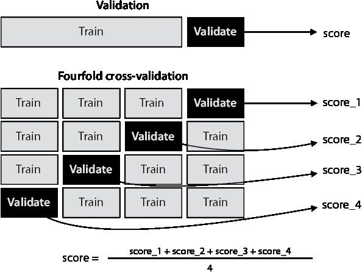

# 13 将一切付诸实践：数据工程和机器学习的真实案例

在本章

+   清洗和预处理数据，使其可由我们的模型读取

+   使用 Scikit-Learn 训练和评估多个模型

+   使用网格搜索为我们的模型选择良好的超参数

+   使用 k 折交叉验证以便能够同时使用我们的数据进行训练和验证


在整本书中，我们学习了一些监督学习中最重要的算法，并有机会编码它们，并使用它们在多个数据集上进行预测。然而，在真实数据上训练模型的过程需要更多步骤，这正是本章所讨论的内容。

数据科学家最基本的工作之一是清洗和预处理数据。这一点至关重要，因为计算机无法完全完成这项工作。要正确地清洗数据，需要具备良好的数据知识和解决问题的能力。在本章中，我们将探讨一些用于清理和预处理数据的重要技术。然后，我们将更仔细地研究特征，并应用一些特征工程，使它们为模型做好准备。作为下一步，我们将模型分为训练集、验证集和测试集，在数据集上训练多个模型，并评估它们。这样，我们就能为这个数据集选择表现最佳的模型。最后，我们学习了一些重要的方法，例如网格搜索，以找到我们模型的最佳超参数。

我们将这些步骤应用于学习机器学习技术的流行数据集：泰坦尼克号数据集。在下一节中，我们将深入探讨这个数据集。本章包含大量的编码。我们使用的两个 Python 包是 Pandas 和 Scikit-Learn，我们在整本书中广泛使用了它们。Pandas 包非常适合处理数据，包括打开文件、加载数据以及将其组织成表格，称为 DataFrame。Scikit-Learn 包非常适合训练和评估模型，它包含了我们在这本书中学到的大多数算法的稳健实现。

我们将在本章中使用的代码和数据集如下：

+   **笔记本**：End_to_end_example.ipynb

    +   [`github.com/luisguiserrano/manning/blob/master/Chapter_13_End_to_end_example/End_to_end_example.ipynb`](https://github.com/luisguiserrano/manning/blob/master/Chapter_13_End_to_end_example/End_to_end_example.ipynb)

+   **数据集**：titanic.csv

## 泰坦尼克号数据集

在本节中，我们加载数据并对其进行研究。加载数据和处理数据是数据科学家的一项关键技能，因为模型的成功高度依赖于输入数据的预处理方式。我们使用 Pandas 包来完成这项工作。

在本章中，我们使用了一个流行的机器学习学习示例：泰坦尼克号数据集。从高层次来看，这个数据集包含了关于泰坦尼克号上许多乘客的信息，包括他们的姓名、年龄、婚姻状况、登船港口和舱位等级。最重要的是，它还包含了乘客的生还信息。这个数据集可以在 Kaggle([www.kaggle.com](https://www.kaggle.com))上找到，这是一个拥有大量数据集和竞赛的流行在线社区，我强烈推荐你查看。

备注：我们使用的这个数据集是一个历史数据集，正如你可能想象的那样，它包含了 1912 年的许多社会偏见。历史数据集不提供修订或额外抽样的机会，以反映当前的社会规范和对世界的理解。这里的一些例子包括非二元性别的缺失、对性别和社会阶级的乘客的不同待遇，以及许多其他情况。我们将像对待数字表一样评估这个数据集，因为我们相信它是一个非常丰富且常用的数据集，用于构建模型和进行预测。然而，作为数据科学家，我们有责任始终警惕数据中的偏见，例如关于种族、性别认同、性取向、社会地位、能力、国籍、信仰等方面的偏见，并尽我们所能确保我们构建的模型不会延续历史偏见。

我们数据集的特征

我们使用的泰坦尼克号数据集包含了 891 名乘客的姓名和信息，包括他们是否生还。以下是数据集的列：

+   **乘客 ID**：一个标识每个乘客的数字，从 1 到 891

+   **姓名**：乘客的全名

+   **性别**：乘客的性别（男性或女性）

+   **年龄**：乘客的年龄，以整数表示

+   **舱位等级**：乘客所乘坐的舱位等级：头等舱、二等舱或三等舱

+   **兄弟姐妹和配偶数量**：乘客的兄弟姐妹和配偶的数量（如果乘客独自旅行，则为 0）

+   **父母和子女数量**：乘客的父母和子女的数量（如果乘客独自旅行，则为 0）

+   **船票号**：乘客的船票号码

+   **票价**：乘客支付的英镑票价

+   **船舱**：乘客所乘坐的船舱

+   **启航港**：乘客登船的港口：“C”代表瑟堡，“Q”代表昆士敦，“S”代表南安普顿

+   **生还**：乘客是否生还的信息（1 代表生还，0 代表未生还）

使用 Pandas 加载数据集

在本节中，我们将学习如何使用 Pandas 打开数据集并将其加载到 DataFrame 中，这是 Pandas 用来存储数据表的对象。我已经从[www.kaggle.com](https://www.kaggle.com)下载了数据，并将其存储为名为 titanic.csv 的 CSV（逗号分隔值）文件。在我们对 Pandas 进行任何操作之前，我们必须使用以下命令导入 Pandas：

```
import pandas
```

现在我们已经加载了 Pandas，我们需要加载数据集。对于存储数据集，Pandas 使用两个对象：*DataFrame* 和 *Series*。它们本质上是一样的，区别在于 Series 用于只有一列的数据集，而 DataFrame 用于多列数据集。

我们可以使用以下命令将数据集作为 DataFrame 加载：

```
raw_data = pandas.read_csv('./titanic.csv', index_col="PassengerId")
```

这个命令将数据集存储到名为 `raw_data` 的 Pandas DataFrame 中。我们称之为原始数据，因为我们的目标是清理和预处理它。一旦我们加载它，我们就可以看到前几行看起来像表 13.1。一般来说，Pandas 会添加一个额外的列，编号数据集中的所有元素。因为数据集已经包含了这种编号，我们可以通过指定 `index_col="PassengerId"` 来将这个索引设置为该列。因此，我们可能会看到在这个数据集中，行是从 1 开始编号，而不是像实践中更常见的从 0 开始。

表 13.1 泰坦尼克号数据集包含关于泰坦尼克号乘客的信息，包括他们是否幸存。这里我们使用 Pandas 打开数据集并打印其行和列。注意它有 891 行和 12 列。

| PassengerId | Survived | Pclass | Name | Sex | Age | SibSp | Parch | Ticket | Fare | Cabin | Embarked |
| --- | --- | --- | --- | --- | --- | --- | --- | --- | --- | --- | --- |
| 1 | 0 | 3 | 布劳恩，欧文·哈里斯先生 | 男 | 22.0 | 1 | 0 | A/5 21171 | 7.2500 | NaN | S |
| 2 | 1 | 1 | 库明斯，约翰·布拉德利夫人（佛罗伦萨·布里格斯·... | 女 | 38.0 | 1 | 0 | PC 17599 | 71.2833 | C85 | C |
| 3 | 1 | 3 | 海金恩，莱娜小姐 | 女 | 26.0 | 0 | 0 | STON/O2\. 3101282 | 7.9250 | NaN | S |
| ... | ... | ... | ... | ... | ... | ... | ... | ... | ... | ... | ... |
| 890 | 1 | 1 | 贝尔，卡尔·豪厄尔先生 | 男 | 26.0 | 0 | 0 | 111369 | 30.0000 | C148 | C |
| 891 | 0 | 3 | 杜利，帕特里克先生 | 男 | 32.0 | 0 | 0 | 370376 | 7.7500 | NaN | Q |

保存和加载数据集

在我们开始研究我们的数据集之前，这里有一个小步骤将帮助我们。在每个部分的末尾，我们将数据集保存为 CSV 文件，并在下一部分的开头再次加载它。这样我们就可以放下书本或退出 Jupyter Notebook，在任何检查点稍后回来继续工作，而无需重新运行所有命令。对于如此小的数据集，重新运行命令并不是什么大问题，但想象一下如果我们正在处理大量数据。序列化和保存数据在那里很重要，因为它节省了时间和处理能力。

这里是每个部分末尾保存的数据集名称：

+   “泰坦尼克号数据集”：raw_data

+   “清理我们的数据集”：clean_data

+   “特征工程”：preprocessed_data

保存和加载的命令如下：

```
tablename.to_csv('./filename.csv', index=None)
tablename = pandas.read_csv('./filename.csv')
```

当 Pandas 加载数据集时，它会添加一个索引列，为每个元素编号。我们可以忽略这个列，但在保存数据集时，我们必须设置参数 `index=None` 以避免保存不必要的索引列。

该数据集已经有一个名为 PassengerId 的索引列。如果我们想将其作为 Pandas 中的默认索引列，我们可以在加载数据集时指定 `index_col='PassengerId'`（但我们不会这样做）。

使用 Pandas 研究我们的数据集

在本节中，我将教你一些研究我们数据集的有用方法。第一个是长度函数，或 `len`。此函数返回数据集中的行数，如下所示：

```
len(raw_data)
Output: 891
```

这意味着我们的数据集有 891 行。要输出列名，我们使用 DataFrame 的 `columns` 属性，如下所示：

```
raw_data.columns
Output: Index(['PassengerId', 'Survived', 'Pclass', 'Name', 'Sex', 'Age', 'SibSp', 'Parch', 'Ticket', 'Fare', 'Cabin', 'Embarked'], dtype='object')
```

现在，让我们探索一个列。使用以下命令，我们可以探索幸存列：

```
raw_data['Survived']
Output:
0, 1, 1, 1, 0, .., 0, 1, 0, 1, 0
Name: Survived, Length: 891, dtype: int64
```

第一列是乘客的索引（1 到 891）。第二列如果是乘客未幸存，则为 0，如果是乘客幸存，则为 1。然而，如果我们想添加两列——例如姓名和年龄——我们可以使用 `next` 命令：

```
raw_data[['Name', 'Age']]
```

这样就会返回只包含这两列的 DataFrame。

现在假设我们想找出有多少乘客幸存。我们可以使用 `sum` 函数对幸存列的值进行求和，如下所示：

```
sum(raw_data['Survived'])
Output: 342
```

这表明在我们的数据集中，891 名乘客中只有 342 名幸存。

这只是 Pandas 为处理数据集提供的所有功能的一小部分。请访问[`pandas.pydata.org`](https://pandas.pydata.org)的文档页面以了解更多信息。

## 清理我们的数据集：缺失值及其处理方法

现在我们已经知道如何处理 DataFrame，我们将讨论一些清理数据集的技术。为什么这很重要？在现实生活中，数据可能很混乱，将混乱的数据输入模型通常会导致模型效果不佳。在训练模型之前，数据科学家充分探索数据集并进行一些清理，以便为模型准备数据是非常重要的。

我们遇到的第一问题是带有缺失值的数据集。由于人为或计算机错误，或者简单地由于数据收集问题，数据集并不总是包含所有值。试图将模型拟合到带有缺失值的数据集可能会产生错误。在缺失数据方面，泰坦尼克号数据集也不例外。例如，让我们看看我们数据集中的舱位列，如下所示：

```
raw_data['Cabin']
Output:
0     NaN
1     C85
2     NaN
3     C123
4     NaN
      ...
886   NaN
887   B42
888   NaN
889   C148
890   NaN
Name: Cabin, Length: 891, dtype: object
```

一些船舱名称是存在的，例如 C123 或 C148，但大多数值都是 NaN。NaN，或“不是一个数字”，意味着条目可能缺失、不可读，或者简单地是另一种无法转换为数字的类型。这可能是由于文书错误造成的；可以想象，“泰坦尼克号”的记录很旧，一些信息已经丢失，或者他们一开始就没有为每位乘客记录船舱号码。无论如何，我们都不希望数据集中有 NaN 值。我们现在面临一个决策点：我们应该处理这些 NaN 值还是完全删除该列？首先，让我们检查数据集中每一列有多少 NaN 值。我们的决策将取决于对这个问题的回答。

为了找出每一列中有多少值是 NaN，我们使用`is_na`（或`is_null`）函数。如果条目是 NaN，`is_na`函数返回 1，否则返回 0。因此，如果我们对这些值求和，我们就可以得到每一列中 NaN 条目的数量，如下所示：

```
raw_data.isna().sum()
Output:
PassengerId    0
Survived       0
Pclass         0
Name           0
Sex            0
Age          177
SibSp          0
Parch          0
Ticket         0
Fare           0
Cabin        687
Embarked       2
```

这告诉我们，唯一有缺失数据的列是年龄列，缺失 177 个值；船舱列，缺失 687 个值；以及登船列，缺失 2 个值。我们可以使用几种方法处理缺失数据，并且我们将为这个数据集的不同列应用不同的方法。

删除有缺失数据的列

当一列缺失太多值时，对应特征可能对我们的模型没有用处。在这种情况下，船舱似乎不是一个好的特征。在 891 行中，有 687 行没有值。这个特征应该被删除。我们可以使用 Pandas 中的`drop`函数来完成这个操作。我们将创建一个新的 DataFrame，名为`clean_data`，以存储我们即将清理的数据：

```
clean_data = raw_data.drop('Cabin', axis=1)
```

`drop`函数的参数如下：

+   我们想要删除的列的名称

+   当我们想要删除列时，`axis`参数为 1，当我们想要删除行时，`axis`参数为 0

然后，我们将这个函数的输出分配给变量`clean_data`，表示我们想要用新的 DataFrame 替换旧的 DataFrame，即名为`data`的 DataFrame，并删除该列。

如何不丢失整个列：填充缺失数据

我们并不总是想删除有缺失数据的列，因为我们可能会丢失重要的信息。我们也可以用有意义的值填充数据。例如，让我们看一下下面的年龄列： 

```
clean_data['Age']
Output:
0      22.0
1      38.0
2      26.0
3      35.0
4      35.0
       ...
886    27.0
887    19.0
888     NaN
889    26.0
890    32.0
Name: Age, Length: 891, dtype: float64
```

如我们之前所计算的，年龄列中只有 177 个值缺失，而总共有 891 个值，这并不多。这个列是有用的，所以我们不要删除它。那么我们可以对这些缺失值做些什么呢？我们可以做很多事情，但最常见的是用其他值的平均值或中位数来填充它们。让我们做后者。首先，我们使用中值函数计算中值，得到 28。接下来，我们使用`fillna`函数，用我们给出的值填充缺失值，如下一代码片段所示：

```
median_age = clean_data["Age"].median()
clean_data["Age"] = clean_data["Age"].fillna(median_age)
```

第三列缺失值的是登船港口（Embarked），缺失了两个值。我们在这里能做什么呢？由于这些是字母而不是数字，我们无法使用平均值。幸运的是，在 891 个乘客中只有两行缺失这个数字，所以我们在这里并没有丢失太多信息。我的建议是将所有在登船港口列中没有值的乘客归入同一个类别。我们可以将这个类别称为 U，代表“未知”。以下代码行将完成这项操作：

```
clean_data["Embarked"] = clean_data["Embarked"].fillna('U')
```

最后，我们可以将这个 DataFrame 保存为名为 clean_titanic_data 的 CSV 文件，以便在下一节中使用：

```
clean_data.to_csv('./clean_titanic_data.csv', index=None)
```

## 特征工程：在训练模型之前转换数据集中的特征

现在我们已经清洗了数据集，我们离能够训练模型更近了。然而，我们仍然需要进行一些重要的数据处理，这些内容在本节中可以看到。首先是数据类型从数值到分类的转换，反之亦然。其次是特征选择，我们手动决定哪些特征需要移除以提高我们模型的训练效果。

回想第二章，特征有两种类型：数值型和分类型。数值型特征是存储为数字的特征。在本数据集中，年龄、票价和等级等特征都是数字。分类型特征包含几个类别或等级。例如，性别特征包含两个类别：女性和男性。登船港口特征包含三个类别，C 代表瑟堡，Q 代表皇后镇，S 代表南安普顿。

正如我们在整本书中看到的，机器学习模型以数字作为输入。如果是这样，我们如何输入“女性”这个词或“Q”这个字母呢？我们需要有一种方法将分类特征转换为数值特征。而且，信不信由你，有时我们可能对将数值特征作为分类特征感兴趣，以帮助我们进行训练，例如将它们放入桶中，例如，年龄 1-10，11-20 等等。我们将在“将数值数据转换为分类数据”这一节中更详细地介绍这一点。

更进一步，当我们想到一个特征，比如乘客等级（称为 Pclass），这究竟是一个数值特征，还是一个分类特征？我们应该将等级视为介于一和三之间的数字，还是将其视为三个等级：头等舱、二等舱和三等舱？我们将在本节中回答所有这些问题。

在本节中，我们将 DataFrame 称为`preprocessed_data`。该数据集的前几行如表 13.2 所示

表 13.2 清洗后的数据集的前五行。我们将继续预处理这些数据以进行训练。

| PassengerId | Survived | Pclass | Name | Sex | Age | SibSp | Parch | Ticket | Fare | Embarked |
| --- | --- | --- | --- | --- | --- | --- | --- | --- | --- | --- |
| 1 | 0 | 3 | Braund, Mr. Owen Harris | 男性 | 22.0 | 1 | 0 | A/5 21171 | 7.2500 | S |
| 2 | 1 | 1 | Cumings, Mrs. John Bradley (Florence Briggs Th... | 女性 | 38.0 | 1 | 0 | PC 17599 | 71.2833 | C |
| 3 | 1 | 3 | Heikkinen, Miss. Laina | 女性 | 26.0 | 0 | 0 | STON/O2\. 3101282 | 7.9250 | S |
| 4 | 1 | 1 | Futrelle, Mrs. Jacques Heath (Lily May Peel) | female | 35.0 | 1 | 0 | 113803 | 53.1000 | S |
| 5 | 0 | 3 | Allen, Mr. William Henry | male | 35.0 | 0 | 0 | 373450 | 8.0500 | S |

将分类数据转换为数值数据：One-hot encoding

As was mentioned previously, machine learning models perform a lot of mathematical operations, and to perform mathematical operations in our data, we must make sure all the data is numerical. If we have any columns with categorical data, we must turn them into numbers. In this section, we learn a way to do this effectively using a technique called *one-hot encoding*.

But before we delve into one-hot encoding, here’s a question: why not simply attach a different number to each one of the classes? For example, if our feature has 10 classes, why not number them 0, 1, 2,..., 9? The reason is that this forces an order in the features that we may not want. For example, if the Embarked column has the three classes C, Q, and S, corresponding to Cherbourg, Queenstown, and Southampton, assigning the numbers 0, 1, and 2 to these would implicitly tell the model that the value of Queenstown is between the values of Cherbourg and Southampton, which is not necessarily true. A complex model may be able to deal with this implicit ordering, but simpler models (such as linear models, for example) will suffer. We’d like to make these values more independent of each other, and this is where one-hot encoding comes in.

One-hot encoding works in the following way: First, we look at how many classes the feature has and build as many new columns. For example, a column with two categories, female and male, would turn it into two columns, one for female and one for male. We can call these columns gender_male and gender_female for clarity. Then, we look at each passenger. If the passenger is female, then the gender_female column will have a 1, and the gender_male column will have a 0\. If the passenger is male, then we do the opposite.

What if we have a column with more classes, such as the embarked column? Because that column has three classes (C for Cherbourg, Q for Queenstown, and S for Southampton), we simply make three columns called embarked_c, embarked_q, and embarked_s. In that way, if a passenger embarked in, say, Southampton, the third column will have a 1 and the other two a 0\. This process is illustrated in figure 13.1.


Figure 13.1 One-hot encoding our data to turn it all into numbers for the machine learning model to read. On the left, we have columns with categorical features such as gender or port of embarkment. On the right, we have turned these categorical features into numerical features.

Pandas 函数`get_dummies`帮助我们进行独热编码。我们用它来创建一些新列，然后将这些列附加到数据集上，我们绝不能忘记删除原始列，因为那个信息是冗余的。接下来是进行性别和登船列独热编码的代码：

```
gender_columns = pandas.get_dummies(data['Sex'], prefix='Sex')                 ❶
embarked_columns = pandas.get_dummies(data["Pclass"], prefix="Pclass")

preprocessed_data = pandas.concat([preprocessed_data, gender_columns], axis=1) ❷
preprocessed_data = pandas.concat([preprocessed_data, embarked_columns], axis=1)

preprocessed_data = preprocessed_data.drop(['Sex', 'Embarked'], axis=1)        ❸
```

❶ 创建包含独热编码列的列

❷ 将数据集与新创建的列连接

❸ 从数据集中删除旧列

有时这个过程可能会很昂贵。想象一下有一个有 500 个类别的列。这将向我们的表格中添加 500 个新列！不仅如此，行将非常稀疏，即它们将包含大部分零。现在想象如果我们有很多每个有数百个类别的列——我们的表格将变得太大而无法处理。在这种情况下，作为数据科学家，使用你的标准来做出决定。如果有足够的计算能力和存储空间来处理数千甚至数百万个列，那么独热编码就没有问题。如果这些资源有限，也许我们可以将类别合并以产生更少的列。例如，如果我们有一个有 100 种动物类型的列，我们可以将它们合并成六个列，分别由哺乳动物、鸟类、鱼类、两栖动物、无脊椎动物和爬行动物组成。

我们能否对数值特征进行独热编码？如果是的话，我们为什么要这样做？

显然，如果一个特征有男性或女性等类别，我们最好的策略是对其进行独热编码。然而，还有一些数值特征，我们仍然可能想要考虑进行独热编码。让我们以 Pclass 列为例。这个列有 0、1、2 三个类别，分别对应头等舱、二等舱和三等舱。我们应该将其保留为数值特征，还是将其独热编码为三个特征，Pclass1、Pclass2 和 Pclass3？这当然是有争议的，我们可以在两个方面都提出很好的论据。有人可能会争论，如果我们不希望无谓地扩大数据集，如果这不会给模型带来性能上的潜在提升，我们就不想这样做。我们可以使用一个经验法则来决定是否将一个列拆分成几个列。我们可以问自己：这个特征是否与结果直接相关？换句话说，增加这个特征的价值是否会增加乘客生存的可能性？人们可能会想象，等级越高，乘客生存的可能性就越大。让我们通过一些计数来验证这一点（参见笔记本中的代码），如下所示：

+   在头等舱中，62.96%的乘客幸存。

+   在二等舱中，40.38%的乘客幸存。

+   在三等舱中，55%的乘客幸存。

注意，第二等舱乘客的生存可能性最低。因此，增加（或减少）舱位并不一定自动提高生存机会。出于这个原因，我建议将这个特征独热编码如下：

```
categorized_pclass_columns = pd.get_dummies(preprocessed_data['Pclass'], prefix='Pclass')
preprocessed_data = pd.concat([preprocessed_data, categorized_pclass_columns], axis=1)
preprocessed_data = preprocessed_data.drop(['Pclass'], axis=1)
```

将数值数据转换为分类数据（以及我们为什么要这样做）：分箱

在上一节中，我们学习了如何将分类数据转换为数值数据。在本节中，我们将看到如何进行相反的操作。我们为什么要这样做呢？让我们看看一个例子。

让我们看看年龄列。它很棒，是数值型的。机器学习模型回答以下问题：“年龄在多大程度上决定了在*泰坦尼克号*上的生存？”想象一下，我们有一个用于生存的线性模型。这样的模型最终会得出以下两个结论之一：

+   乘客越老，他们生存的可能性就越大。

+   乘客越老，他们生存的可能性就越小。

然而，这总是如此吗？如果年龄和生存之间的关系并不那么简单直接呢？如果乘客在 20 到 30 岁之间生存的可能性最高，而其他所有年龄组的可能性都很低呢？如果最低的生存可能性是在 20 到 30 岁之间呢？我们需要给模型所有的自由来决定哪些年龄决定了乘客更有可能或不太可能生存。我们能做什么？

许多非线性模型可以处理这个问题，但我们应该仍然修改年龄列，使其给模型更多的自由来探索数据。我们可以采取的一个有用技术是将年龄进行分组，即，将它们分成几个不同的桶。例如，我们可以将年龄列转换为以下形式：

+   从 0 岁到 10 岁

+   从 11 岁到 20 岁

+   从 21 岁到 30 岁

+   从 31 岁到 40 岁

+   从 41 岁到 50 岁

+   从 51 岁到 60 岁

+   从 61 岁到 70 岁

+   从 71 岁到 80 岁

+   81 岁或以上

这与独热编码类似，因为它会将年龄列转换为九个新的列。执行此操作的代码如下：

```
bins = [0, 10, 20, 30, 40, 50, 60, 70, 80]
categorized_age = pandas.cut(preprocessed_data['Age'], bins)
preprocessed_data['Categorized_age'] = categorized_age
preprocessed_data = preprocessed_data.drop(["Age"], axis=1)
```

特征选择：去除不必要的特征

在“删除缺失数据的列”的子节中，我们在我们的表中删除了一些列，因为它们有太多的缺失值。然而，我们也应该删除一些其他列，因为它们对于我们的模型不是必要的，甚至更糟，它们可能会完全破坏我们的模型！在本节中，我们将讨论哪些特征应该被删除。但在那之前，先看看这些特征，想想哪一个可能会对我们的模型有害。它们如下所示：

+   **PassengerID**：对应每个乘客的唯一编号

+   **Name**：乘客的全名

+   **Sex（两个类别）**：乘客的性别，男性或女性

+   **Age（几个类别）**：乘客的年龄，以整数表示

+   **Pclass（几个类别）**：乘客所乘坐的等级：头等、二等或三等

+   **SibSP**：乘客的兄弟姐妹和配偶的数量（如果乘客独自旅行，则为 0）

+   **Parch**：乘客的父母和孩子的数量（如果乘客独自旅行，则为 0）

+   **Ticket**：票号

+   **Fare**：乘客支付的票价（以英镑为单位）

+   **Cabin**：乘客所乘坐的客舱

+   **Embarked**：乘客登船的港口：C 代表瑟堡，Q 代表皇后镇，S 代表南安普顿

+   **Survived**：乘客是否幸存的信息（1 表示幸存，0 表示未幸存）

首先，让我们看看名字特征。我们应该在我们的模型中考虑它吗？绝对不应该，原因如下：每位乘客都有一个不同的名字（可能有一些非常少的例外，但它们并不重要）。因此，模型将训练成仅仅学习幸存乘客的名字，而无法告诉我们关于它尚未见过的新的乘客的名字。这个模型只是在记忆数据——它并没有从其特征中学习到任何有意义的东西。这意味着它过度拟合了，因此，我们应该完全去掉“名字”这一列。

票据和乘客 ID 特征与名字特征有同样的问题，因为每个乘客都有一个独特的值。我们也将去掉这两个列。`drop`函数将帮助我们完成这项工作，如下所示：

```
preprocessed_data = preprocessed_data.drop(['Name', 'Ticket', 'PassengerId'], axis=1)
```

关于幸存特征——我们不应该也去掉它吗？当然！在训练数据集时保留幸存列会导致过度拟合，因为模型将简单地使用这个特征来确定乘客是否幸存。这就像在考试中作弊一样，看答案。我们不会现在从数据集中去掉它，因为我们在稍后分割数据集为特征和标签用于训练时将会去掉它。

如往常一样，我们可以将这个数据集保存为 csv 文件 preprocessed_titanic_data.csv，以便在下一节中使用。

## 训练我们的模型

现在我们已经对数据进行了预处理，我们可以开始在不同模型上训练数据。我们应该从这本书中学到的哪些模型中选择：决策树、支持向量机、逻辑分类器？这个答案在于评估我们的模型。在本节中，我们将看到如何训练几个不同的模型，在验证数据集上评估它们，并选择最适合我们数据集的最佳模型。

如往常一样，我们从上一节保存数据所在的文件中加载数据，如下所示。我们将它称为`data`。

```
data = pandas.read_csv('preprocessed_titanic_data.csv')
```

表 13.3 包含了预处理数据的前几行。请注意，并不是所有列都显示出来，因为总共有 27 列。

表 13.3 我们预处理数据的前五行，准备输入到模型中。请注意，它有 21 列，比之前多得多。这些额外的列是在我们对一些现有特征进行独热编码和分箱时创建的。

| Survived | SibSp | Parch | Fare | Sex_female | Sex_male | Pclass_C | Pclass_Q | Pclass_S | Pclass_U | ... | Categorized_age_(10, 20] |
| --- | --- | --- | --- | --- | --- | --- | --- | --- | --- | --- | --- |
| 0 | 1 | 0 | 7.25000 | 0 | 1 | 0 | 0 | 1 | 0 | ... | 0 |
| 1 | 1 | 0 | 71.2833 | 1 | 0 | 1 | 0 | 0 | 0 | ... | 0 |
| 1 | 0 | 0 | 7.9250 | 1 | 0 | 0 | 0 | 1 | 0 | ... | 0 |
| 1 | 1 | 0 | 53.1000 | 1 | 0 | 0 | 0 | 1 | 0 | ... | 0 |
| 0 | 0 | 0 | 8.0500 | 0 | 1 | 0 | 0 | 1 | 0 | ... | 0 |

旁白 如果你运行笔记本中的代码，你可能会得到不同的数字。

将数据分为特征和标签，以及训练和验证

我们的数据库是一个包含特征和标签的表格。我们需要执行两个分割。首先，我们需要将特征从标签中分离出来，以便将其输入到模型中。接下来，我们需要形成一个训练集和一个测试集。这就是本小节所涵盖的内容。

为了将数据集分割成两个称为`features`和`labels`的表格，我们使用`drop`函数如下：

```
features = data.drop(["Survived"], axis=1)
labels = data["Survived"]
```

接下来，我们将数据分为训练集和验证集。我们将使用 60%的数据进行训练，20%的数据进行验证，20%的数据进行测试。对于数据分割，我们使用 Scikit-Learn 函数`train_test_split`。在这个函数中，我们使用`test_size`参数指定我们想要的验证数据百分比。输出是四个称为`features_train, features_test, labels_train, labels_test`的表格。

如果我们想要将数据分成 80%的训练数据和 20%的测试数据，我们将使用以下代码：

```
from sklearn.model_selection import train_test_split
features_train, features_test, labels_train, labels_test = 
    train_test_split(features, labels, test_size=0.2)
```

然而，因为我们想要 60%的训练数据，20%的验证数据和 20%的测试数据，我们需要两次使用`train_test_split`函数：一次用于分离训练数据，另一次用于分割验证集和测试集，如下所示：

```
features_train, features_validation_test, labels_train, labels_validation_test = 
    train_test_split(features, labels, test_size=0.4)
features_validation, features_test, labels_validation, labels_test = 
    train_test_split(features_validation_test, labels_validation_test, test_size=0.5)
```

旁白 你可能会发现在笔记本中我们在这个函数中指定了一个固定的`random_state`。原因是`train_test_split`在分割数据时会打乱数据。我们固定随机状态以确保我们总是得到相同的分割。

我们可以检查这些数据框的长度，并注意到训练集的长度是 534，验证集的长度是 178，测试集的长度是 179。现在，回想一下第四章中提到的黄金法则，那就是永远不要使用我们的测试数据来训练或对我们的模型做出决策。因此，我们将测试集留到最后，当我们决定使用什么模型时再使用。我们将使用训练集来训练模型，并使用验证集来决定选择哪个模型。

在我们的数据集上训练几个模型

我们终于到了有趣的部分：训练模型！在本节中，我们将看到如何在 Scikit-Learn 中仅用几行代码就训练几个不同的模型。

首先，我们开始训练一个逻辑回归模型。我们可以通过创建一个`LogisticRegression`实例并使用`fit`方法来实现，如下所示：

```
from sklearn.linear_model import LogisticRegression
lr_model = LogisticRegression()
lr_model.fit(features_train, labels_train)
```

让我们再训练一个决策树、一个朴素贝叶斯模型、一个支持向量机、一个随机森林、一个梯度提升树和一个 AdaBoost 模型，如下面的代码所示：

```
from sklearn.tree import DecisionTreeClassifier, GaussianNB, SVC, 
    RandomForestClassifier, GradientBoostingClassifier, AdaBoostClassifier

dt_model = DecisionTreeClassifier()
dt_model.fit(features_train, labels_train)

nb_model = GaussianNB()
nb_model.fit(features_train, labels_train)

svm_model = SVC()
svm_model.fit(features_train, labels_train)

rf_model = RandomForestClassifier()
rf_model.fit(features_train, labels_train)

gb_model = GradientBoostingClassifier()
gb_model.fit(features_train, labels_train)

ab_model = AdaBoostClassifier()
ab_model.fit(features_train, labels_train)
```

哪个模型更好？评估模型

现在我们已经训练了一些模型，我们需要选择最好的一个。在本节中，我们使用不同的指标来评估它们，使用验证集进行评估。回想一下，在第四章中我们学习了准确率、召回率、精确率和*F* [1] 分数。为了刷新你的记忆，定义如下：

准确率 正确标记的点数与总点数的比率。

回收率 在具有正标签的点中，正确分类的点的比例。换句话说，回收率 = 真阳性 / (真阳性 + 假阴性)，其中真阳性是真实阳性的数量，假阴性是假阴性的数量。

精确率 在被分类为正类的点中，正确分类的点的比例。换句话说，精确率 = 真阳性 / (真阳性 + 假阳性)，其中假阳性是假阳性的数量。

F[1]-分数 精确率和回收率的调和平均数。这是一个介于精确率和回收率之间的数字，但它更接近两者中的较小者。

测试每个模型的准确率

让我们先评估这些模型的准确率。Scikit-Learn 中的`score`函数将执行此操作，如下所示：

```
lr_model.score(features_validation, labels_validation)
Output:
0.7932960893854749
```

我们为所有其他模型计算准确率，并得到以下结果，我已经将其四舍五入到两位数（有关整个过程的详细信息，请参阅笔记本）：

准确率

+   **逻辑回归**: 0.77

+   **决策树**: 0.78

+   **朴素贝叶斯**: 0.72

+   **支持向量机**: 0.68

+   **随机森林**: 0.7875

+   **梯度提升**: 0.81

+   **AdaBoost**: 0.76

这表明在这个数据集中，最佳模型是梯度提升树，因为它在验证集上给出了最高的准确率（81%，这对于泰坦尼克号数据集来说是个好成绩）。这并不令人惊讶，因为这个算法通常表现非常好。

您可以遵循类似的程序来计算回收率、精确率和 F[1]分数。我将让您计算回收率和精确率，我们将一起计算 F[1]分数。

测试每个模型的 F[1]-分数

这是检查 F[1]分数的方法。首先，我们必须使用`predict`函数输出模型的预测，然后我们使用`f1_score`函数，如下所示：

```
lr_predicted_labels = lr_model.predict(features_validation) ❶
f1_score(labels_validation, lr_predicted_labels) ❷
Output:
0.6870229007633588
```

❶ 使用模型进行预测

❷ 计算 F[1]分数

如前所述，我们可以为所有模型执行此操作，并得到以下结果：

**F**[1]**-分数**

+   **逻辑回归**: 0.69

+   **决策树**: 0.71

+   **朴素贝叶斯**: 0.63

+   **支持向量机**: 0.42

+   **随机森林**: 0.68

+   **梯度提升**: 0.74

+   **AdaBoost**: 0.69

再次，梯度提升树以 0.74 的 F[1]-分数获胜。鉴于其数值远高于其他模型，我们可以安全地得出结论，在这八个模型中，梯度提升树是最佳选择。请注意，基于树的模型总体表现良好，这在数据集高度非线性这一点上并不令人惊讶。训练一个神经网络和一个 XGBoost 模型在这个数据集上也会很有趣，我鼓励你这样做！

测试模型

使用验证集比较模型后，我们最终做出了决定，并选择了梯度提升树作为这个数据集的最佳模型。不要感到惊讶；梯度提升树（及其近亲 XGBoost）在大多数比赛中获胜。但为了看看我们是否真的做得很好，或者我们是否意外地过拟合，我们需要对这个模型进行最后的测试：我们需要在尚未接触过的测试集上测试这个模型。

首先，让我们评估准确率，如下所示：

```
gb_model.score(features_test, labels_test)
Output:
0.8324022346368715
```

现在，让我们看看*F*[1]分数，如下所示：

```
gb_predicted_test_labels = gb_model.predict(features_test)
f1_score(labels_test, gb_predicted_test_labels)
Output:
0.8026315789473685
```

这些分数对于泰坦尼克号数据集来说相当不错。因此，我们可以放心地说我们的模型是好的。

然而，我们训练这些模型时没有触及它们的超参数，这意味着 Scikit-Learn 为它们选择了某些标准超参数。我们有没有办法找到模型的最佳超参数？在下一节中，我们将了解到这一点。

## 调整超参数以找到最佳模型：网格搜索

在上一节中，我们训练了几个模型，并发现梯度提升树在它们中表现最好。然而，我们没有探索许多不同的超参数组合，所以我们还有改进训练的空间。在本节中，我们看到了一种有用的技术，可以在许多超参数组合中搜索，以找到适合我们数据的好模型。

梯度提升树在泰坦尼克号数据集上的性能几乎达到了可能达到的最高水平，所以我们不妨让它保持原样。然而，性能较差的 SVM 表现最差，准确率为 69%，*F*[1]分数为 0.42。然而，我们仍然相信 SVMs，因为它们是一个强大的机器学习模型。也许这个 SVM 表现不佳是由于它使用的超参数。可能存在更好的超参数组合，它们可以工作得更好。

旁白：在本节中，我们做出了一些参数选择。有些是基于经验，有些是基于标准实践，还有些是任意的。我鼓励你尝试使用你决定的任何选择遵循类似的程序，并尝试超越当前模型的分数！

为了提高我们 SVM 的性能，我们使用了一种称为*网格搜索*的方法，它包括在不同超参数组合上多次训练我们的模型，并选择在验证集上表现最好的那个。

让我们从选择一个核函数开始。在实践中，我发现径向基函数（RBF）核通常表现良好，所以我们选择这个。回顾第九章，与 RBF 核相关的超参数是 gamma，它是一个实数。让我们尝试用两个 gamma 值来训练 SVM，即 1 和 10。为什么是 1 和 10？通常当我们搜索超参数时，我们倾向于进行指数搜索，所以我们可能会尝试 0.1、1、10、100、1000 等值，而不是 1、2、3、4、5。这种指数搜索覆盖了更大的空间，给我们找到良好超参数的机会更大，而且这种搜索在数据科学家中是一种标准实践。

再次回顾第九章，SVMs 关联的另一个超参数是 C 参数。让我们也尝试用 C = 1 和 C = 10 来训练模型。这给我们提供了以下四个可能的模型来训练：

**模型 1**：核函数 = RBF，gamma = 1，C = 1

**模型 2**：核函数 = RBF，gamma = 1，C = 10

**模型 3**：核函数 = RBF，gamma = 10，C = 1

**模型 4**：核函数 = RBF，gamma = 10，C = 10

我们可以用以下八行代码轻松地在我们的训练集中训练所有这些：

```
svm_1_1 = SVC(kernel='rbf', C=1, gamma=1)
svm_1_1.fit(features_train, labels_train)

svm_1_10 = SVC(kernel='rbf', C=1, gamma=10)
svm_1_10.fit(features_train, labels_train)

svm_10_1 = SVC(kernel='rbf', C=10, gamma=1)
svm_10_1.fit(features_train, labels_train)

svm_10_10 = SVC(kernel='rbf', C=10, gamma=10)
svm_10_10.fit(features_train, labels_train)
```

现在，我们使用准确率（另一个任意选择——我们也可以使用*F*[1]-分数、精确率或召回率）来评估它们。这些分数记录在表 13.4 中。

表 13.4 网格搜索方法对于搜索许多超参数组合并选择最佳模型非常有用。在这里，我们使用网格搜索来选择 SVM 中参数 C 和 gamma 的最佳组合。我们使用准确率来比较验证集中的模型。请注意，在这些模型中，最佳模型是 gamma = 0.1 且 C = 10 的模型，准确率为 0.72。

|  | C = 1 | C = 10 |
| --- | --- | --- |
| gamma = 0.1 | 0.69 | 0.72 |
| gamma = 1 | 0.70 | 0.70 |
| gamma = 10 | 0.67 | 0.65 |

从表 13.4 中可以看出，最佳准确率为 0.72，由 gamma = 0.1 和 C = 1 的模型给出。这比我们之前未指定任何超参数时获得的 0.68 有所改进。

如果我们有很多更多的参数，我们只需用它们制作一个网格，并训练所有可能的模型。请注意，随着我们探索更多的选择，模型的数量会迅速增加。例如，如果我们想要探索 gamma 的五个值和 C 的四个值，我们就必须训练 20 个模型（五个乘以四个）。我们还可以添加更多的超参数——例如，如果有一个我们想要尝试的第三个超参数，并且这个超参数有七个值，我们就必须总共训练 140 个模型（五个乘以四个乘以七个）。由于模型的数量增长如此之快，因此选择选择的方式非常重要，这样它就能很好地探索超参数空间，而无需训练大量模型。

Scikit-Learn 提供了一个简单的方法来做这件事：使用`GridSearchCV`对象。首先，我们将超参数定义为一个字典，其中字典的键是参数的名称，与该键对应的值是我们想要尝试的超参数值的列表。在这种情况下，让我们探索以下超参数组合：

**核函数**：RBF

**C**：0.01, 0.1, 1, 10, 100

**gamma**：0.01, 0.1, 1, 10, 100

以下代码将完成这项工作：

```
svm_parameters = {'kernel': ['rbf'],
                  'C': [0.01, 0.1, 1 , 10, 100],
                  'gamma': [0.01, 0.1, 1, 10, 100]
                 }                       ❶

svm = SVC()                              ❷

svm_gs = GridSearchCV(estimator = svm,
param_grid = svm_parameters)             ❸

svm_gs.fit(features_train, labels_train) ❹
```

❶ 一个包含我们想要尝试的超参数及其值的字典

❷ 一个没有超参数的常规 SVM

❸ 一个包含 SVM 和超参数字典的 GridSearchCV 对象

❹ 我们以与在 Scikit-Learn 中拟合常规模型相同的方式拟合 GridSearchCV 模型。

这将训练 25 个模型，这些模型包含超参数字典中给出的所有超参数组合。现在，我们从中选择最佳模型，并将其称为`svm_winner`。让我们按照以下方式计算这个模型在验证集上的准确率：

```
svm_winner = svm_gs.best_estimator_
svm_winner.score(features_validation, labels_validation)
Output:
0.7303370786516854
```

我们的最佳模型达到了 0.73 的准确率，这比原始的 0.68 要好。我们仍然可以通过运行更大的超参数搜索来改进这个模型，我鼓励你自己尝试。现在，让我们探索最后获胜的 SVM 模型使用了哪些超参数，如下所示：

```
svm_winner
Output:
SVC(C=10, break_ties=False, cache_size=200, class_weight=None, coef0=0.0,
    decision_function_shape='ovr', degree=3, gamma=0.01, kernel='rbf',
    max_iter=-1, probability=False, random_state=None, shrinking=True,
    tol=0.001, verbose=False)
```

获胜模型使用了 gamma = 0.01 和 C = 10 的 RBF 核。

挑战我鼓励你尝试在其他模型上使用网格搜索，看看你能提高多少获胜模型的准确性和*F*[1]分数！如果你有一个好分数，请在 Kaggle 数据集上运行它，并使用此链接提交你的预测：[`www.kaggle.com/c/titanic/submit`](https://www.kaggle.com/c/titanic/submit)。

还有一件事：`GridSearchCV`结尾的*CV*是什么意思？它代表*交叉验证*，我们将在下一节中学习。

## 使用 K 折交叉验证来重复使用我们的数据作为训练和验证

在本节中，我们学习了一种替代本章中使用的传统训练-验证-测试方法的替代方法。它被称为*k*-折交叉验证，它在许多情况下都很有用，尤其是在我们的数据集较小的情况下。

在整个这个例子中，我们使用了 60%的数据进行训练，20%进行验证，最后的 20%用于测试。这在实践中是可行的，但似乎我们丢失了一些数据，对吧？我们最终只使用 60%的数据来训练模型，这可能会损害我们的模型，尤其是在数据集较小的情况下。*K*-折交叉验证是一种通过多次回收数据来使用所有数据用于训练和测试的方法。它的工作原理如下：

1.  将数据分成*k*个相等（或几乎相等）的部分。

1.  使用*k*次训练模型，使用*k* - 1 个部分作为训练集，剩下的一个作为验证集。

1.  该模型的最终分数是*k*个步骤中验证分数的平均值。

图 13.2 展示了四折交叉验证的图片。



图 13.2 *K*-折交叉验证是一种有用的方法，它回收我们的数据，使其既用于训练又用于验证。在顶部，我们看到经典的训练-验证分割。在底部，我们看到一个四折交叉验证的示意图，我们将数据分成四个相等（或几乎相等）的部分。然后我们训练我们的模型四次。每次我们选择三个部分作为训练集，剩下的一个作为验证集。这个模型的分数是四个验证集上获得的四个分数的平均值。

这种方法是在`GridSearchCV`中使用的，可以通过输入`svm_gs.cv_results_`来检查这个过程的结果。我们在这里不会展示结果，因为它们非常长，但你可以查看笔记本中的结果。

## 摘要

+   Pandas 是一个有用的 Python 包，用于打开、操作和保存数据集。

+   清理我们的数据是必要的，因为它可能存在一些问题，如缺失值。

+   特征可以是数值的或分类的。数值特征是数字，例如年龄。分类特征是类别，或类型，例如狗/猫/鸟。

+   机器学习模型只接受数字，因此为了将分类数据输入到机器学习模型中，我们必须将其转换为数值数据。一种方法是通过独热编码。

+   在某些情况下，我们可能希望将我们的数值特征也视为分类特征，我们可以通过数据分箱来实现这一点。

+   使用特征选择来去除我们数据中的不必要特征是很重要的。

+   Scikit-Learn 是一个用于训练、测试和评估机器学习模型的实用包。

+   在训练模型之前，我们必须将数据分成训练、验证和测试。我们有 Pandas 函数来完成这项工作。

+   网格搜索是一种用于寻找模型最佳超参数的方法。它包括在（有时是大量）超参数集上训练多个模型。

+   *K*-fold 交叉验证是一种用于回收数据并将其作为训练和验证使用的方法。它包括在不同数据部分上训练和测试多个模型。

## 练习

练习 13.1

仓库中包含一个名为 test.csv 的文件。这是一个包含更多乘客的*泰坦尼克号*的文件，但它没有“Survived”列。

1.  按照本章所述，预处理这个文件中的数据。

1.  使用任何模型来预测这个数据集的标签。根据你的模型，你认为有多少乘客幸存了？

1.  比较本章中所有模型的性能，你认为测试集中有多少乘客实际上幸存了？
