# 附录 A. 练习题解答

## 第二章：机器学习类型

对于本章的问题，你的答案不需要与我的一致。如果你对这些应用中使用的模型有不同想法，那可能是个好主意！我鼓励你在文献中查找它们，如果它们不存在，尝试实现它们。

练习 2.1

对于以下每个场景，说明它是否是监督学习或无监督学习的例子。解释你的答案。在模糊不清的情况下，选择一个并解释你为什么选择它。

1.  一个社交网络上的推荐系统，向用户推荐潜在的朋友

1.  一个新闻网站上按主题划分新闻的系统

1.  Google 自动补全功能的句子

1.  一个在线零售商上的推荐系统，根据用户的过去购买历史向用户推荐购买商品

1.  一个信用卡公司中捕捉欺诈交易的系统

解答

根据你对问题和数据集的解释，每个这些都可以被认为是监督学习或无监督学习的例子。完全没问题（并且鼓励！）有不同的答案，只要背后的推理是正确的。

1.  这也是一个监督学习和无监督学习的例子。监督学习：对于特定用户，我们可以构建一个分类模型，其中其他每个用户的标签如果是潜在朋友则为正，如果不是潜在朋友则为负。

1.  这也是一个监督学习和无监督学习的例子。监督学习：一个分类模型，其中每篇新闻文章的标签是主题，例如政治、体育或科学。无监督学习：我们可以对文章进行聚类，然后手动检查每个聚类的主题是否相似。如果相似，那么我们可以手动通过最常见的主题为每个聚类打标签。还有一些更高级的无监督学习技术，如潜在狄利克雷分配，你可以在这个视频中学习到：[`www.youtube.com/watch?v=T05t-SqKArY`](https://www.youtube.com/watch?v=T05t-SqKArY)。

1.  这个例子更偏向于监督学习任务。我们可以构建一个分类模型，其中特征是用户最后输入的几个单词，标签是他们将要输入的下一个单词。这样，模型的预测就是我们将建议给用户的单词。

1.  这与 a)类似，它可以被认为是一个监督学习或无监督学习问题。监督学习：对于特定用户，我们可以为所有产品构建一个分类模型，其中对于每个产品，我们预测用户是否会购买它。我们也可以构建一个回归模型，其中我们预测用户将在这个特定产品上花费多少钱。无监督学习：我们可以对用户进行聚类。如果一个用户购买了一个产品，我们可以向该聚类中的其他用户推荐相同的产品。我们也可以对产品进行聚类，如果一个用户购买了一个产品，我们推荐同一聚类中的产品。

1.  这个任务更倾向于监督学习。我们可以构建一个分类模型，根据交易的特性预测某个交易是否是欺诈的。它也可以被视为一个无监督学习任务，其中我们聚类交易，那些被留下的异常值有更高的可能性是欺诈的。

练习 2.2

对于以下机器学习的应用，你会使用回归还是分类来解决它？解释你的答案。在存在歧义的情况下，选择一个并解释你为什么选择了它。

1.  一个在线商店预测用户在其网站上会花费多少钱

1.  一个语音助手解码语音并将其转换为文本

1.  从特定公司买卖股票

1.  YouTube 向用户推荐视频

解答

1.  回归，因为我们试图预测用户花费的金额，这是一个数值特征。

1.  分类，因为我们试图预测用户所说的句子是否是针对 Alexa 的，这是一个分类特征。

1.  这可能是回归或分类。如果我们试图预测预期的收益或预期的风险以帮助我们做出决策，那么它是回归。如果我们试图预测我们是否应该购买股票，那么它是分类。

1.  这又可以再次是回归或分类。如果我们试图预测用户观看视频的时间以推荐它，那么它是回归。如果我们试图预测用户是否会观看视频，那么它是分类。

练习 2.3

你的任务是构建一辆自动驾驶汽车。至少给出三个你必须解决的机器学习问题示例。在每个例子中，解释你是否使用监督学习/无监督学习，如果是监督学习，是否使用回归或分类。如果你使用其他类型的机器学习，解释这些类型以及为什么。

解答

+   一个分类模型，根据图像确定是否存在行人、停车标志、车道、其他车辆等。这是一个称为计算机视觉的机器学习大领域，我强烈建议你进一步探索！

+   与前一个类似的分类模型，它根据汽车中所有不同传感器（激光雷达等）的信号来确定汽车周围的对象。

+   一个机器学习模型，用于找到到达我们期望目的地的最近路径。这既不是精确的监督学习，也不是无监督学习。这里还可以使用一些更经典的的人工智能算法，例如 A*（A-星）搜索算法。

## 第三章：在点附近画线：线性回归

练习 3.1

一个网站已经训练了一个线性回归模型来预测用户将在网站上花费的分钟数。他们得到的公式是

*t̂* = 0.8*d* + 0.5*m* + 0.5*y* + 0.2*a* + 1.5

其中 *t̂* 是预测的分钟数，而 *d*、*m*、*y* 和 *a* 是指示变量（即，它们只取 0 或 1 的值），定义如下：

+   *d* 是一个变量，表示用户是否在使用桌面设备。

+   *m* 是一个变量，表示用户是否在使用移动设备。

+   *y* 是一个变量，表示用户是否年轻（21 岁以下）。

+   *a* 是一个变量，表示用户是否是成年人（21 岁或以上）。

示例：如果用户 30 岁，并且使用桌面设备，那么 *d* = 1，*m* = 0，*y* = 0，*a* = 1。

如果一个 45 岁的用户用手机查看网站，他们预计会在网站上花费多少时间？

解答

在这种情况下，变量的值如下：

+   *d* = 0 因为用户不在桌面设备上。

+   *m* = 1 因为用户在使用移动设备。

+   *y* = 0 因为用户不是 21 岁以下。

+   *a* = 1 因为用户年龄超过 21 岁。

当我们将它们代入公式时，我们得到

*t̂* = 0.8 · 0 + 0.5 · 1 + 0.5 · 0 + 0.2 · 1 + 1.5 = 2.2。

这意味着模型预测这位用户将在网站上花费 2.2 分钟。

练习 3.2

假设我们在一个医学数据集上训练了一个线性回归模型。该模型预测患者的预期寿命。模型会为我们的数据集中的每个特征分配一个权重。

a) 对于以下数量，说明你认为附加到这个数量的权重是正数、负数还是零。注意：如果你认为权重是一个非常小的数，无论是正数还是负数，你可以说零。

1.  患者每周的锻炼小时数

1.  患者每周吸烟的数量

1.  患者家庭成员中患有心脏病的人数

1.  患者的兄弟姐妹数量

1.  患者是否曾住院

b) 模型还有一个偏差。你认为偏差是正数、负数还是零？

解答

a) 我们将基于一般的医学知识进行一些概括。对于特定的患者，以下情况不一定成立，但我们将假设它们对整个人群是成立的：

1.  预期一个经常锻炼的患者比不锻炼的类似患者寿命更长。因此，这个权重应该是正数。

1.  一位每周吸烟很多支的病人预期寿命会比不吸烟的类似病人短。因此，这个权重应该是负数。

1.  一位有很多家庭成员患有心脏病的病人，患心脏病的可能性更高，因此他们预期寿命会比没有这些疾病的类似病人短。因此，这个权重应该是负数。

1.  兄弟姐妹的数量通常与预期寿命无关，因此我们预计这个权重将是一个非常小的数字，或者为零。

1.  一位过去曾经住院的病人可能之前就有健康问题。因此，他们的预期寿命会比之前从未住院的类似病人短。因此，这个权重应该是负数。当然，住院可能是因为不影响预期寿命的原因（例如骨折），但平均来说，我们可以这样说，如果病人过去曾经去过医院，他们有更高的可能性有健康问题。

b) 偏差是对一个所有特征都为零的病人的预测（即一个不吸烟、不运动、没有心脏病家族成员、没有兄弟姐妹且从未住院的病人）。因为这个病人预期会活很多年，所以这个模型的偏差必须是正数。

练习 3.3

以下是一组房屋数据集，包括面积（平方英尺）和价格（美元）。

|  | 面积(s) | 奖金(p) |
| --- | --- | --- |
| 房屋 1 | 100 | 200 |
| 房屋 2 | 200 | 475 |
| 房屋 3 | 200 | 400 |
| 房屋 4 | 250 | 520 |
| 房屋 5 | 325 | 735 |

假设我们已经训练了一个模型，该模型根据房屋面积预测价格如下：

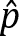 = 2s + 50

1.  计算该模型在数据集上的预测结果。

1.  计算该模型的平均绝对误差。

1.  计算该模型的均方根误差。

解答

1.  基于模型的预测价格如下：

    +   房屋 1:  = 2 · 100 + 50 = 250

    +   房屋 2:  = 2 · 200 + 50 = 450

    +   房屋 3:  = 2 · 200 + 50 = 450

    +   房屋 4:  = 2 · 250 + 50 = 550

    +   房屋 5:  = 2 · 325 + 50 = 700

1.  平均绝对误差是

    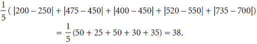

1.  均方误差是

    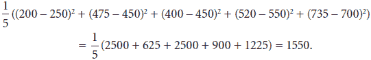

因此，均方根误差是 √1550 = 39.37。

练习 3.4

我们的目标是使用本章学到的技巧将方程 *ŷ* = 2*x* + 3 的直线移动到点 (*x*, *y*) = (5, 15) 附近。对于以下两个问题，使用学习率 *η* = 0.01。

1.  应用绝对技巧修改上述行，使其更接近该点。

1.  应用平方技巧修改上述行，使其更接近该点。

解答

该模型在这一点上的预测是 *ŷ* = 2 · 5 + 3 = 13。

1.  因为预测值是 13，小于标签值 15，所以这个点位于线下方。

    在这个模型中，斜率是 *m* = 2，*y* 截距是 *b* = 3。绝对技巧涉及将 *x**η* = 5 · 0.01 = 0.05 添加到斜率，将 *η* = 0.01 添加到 *y* 截距，从而得到具有以下方程的模型

    *ŷ* = 2.05*x* + 3.01.

1.  平方技巧涉及将 (*y* – *ŷ*)*x**η* = (15 – 13) · 5 · 0.01 = 0.1 添加到斜率，将 (*y* – *ŷ*)*η* = (15 – 13) · 0.01 = 0.02 添加到 *y* 截距，从而得到具有以下方程的模型

    *ŷ* = 2.1*x* + 3.02.

## 第四章：优化训练过程：欠拟合、过拟合、测试和正则化

练习 4.1

我们在同一数据集上使用不同的超参数训练了四个模型。在下面的表中，我们记录了每个模型的训练和测试误差。

| 模型 | 训练误差 | 测试误差 |
| --- | --- | --- |
| 1 | 0.1 | 1.8 |
| 2 | 0.4 | 1.2 |
| 3 | 0.6 | 0.8 |
| 4 | 1.9 | 2.3 |

1.  对于这个数据集，你会选择哪个模型？

1.  哪个模型看起来像是对数据进行欠拟合？

1.  哪个模型看起来像是对数据进行过拟合？

解答

1.  最佳模型是测试误差最小的模型，即模型 3。

1.  模型 4 看起来像是对数据进行欠拟合，因为它有较大的训练和测试误差。

1.  模型 1 和 2 看起来像是对数据进行过拟合，因为它们的训练误差小，但测试误差大。

练习 4.2

我们给出了以下数据集：

| *x*   | *y*   |
| --- | --- |
| 1 | 2 |
| 2 | 2.5 |
| 3 | 6 |
| 4 | 14.5 |
| 5 | 34 |

我们训练的预测 *y* 值为 *ŷ* 的多项式回归模型

*ŷ* = 2*x*² *–* 5*x* + 4*.*

如果正则化参数 λ = 0.1，并且我们用来训练这个数据集的错误函数是平均绝对误差（MAE），确定以下内容：

1.  我们模型（使用 L1 范数）的 lasso 回归误差

1.  我们模型（使用 L2 范数）的岭回归误差

解答

首先，我们需要找到预测值来计算模型的平均绝对误差。在下面的表中，我们可以找到使用公式 *ŷ* = 2*x*² *–* 5*x* + 4 计算的预测值，以及预测值和标签之间的差的绝对值 |*y* – *ŷ*|。

| *x*   | *y*   | *ŷ*   | | *y – ŷ* | |
| --- | --- | --- | --- | --- | --- |
| 1 | 2 | 1 | 1 |
| 2 | 2.5 | 2 | 0.5 |
| 3 | 6 | 7 | 1 |
| 4 | 14.5 | 16 | 1.5 |
| 5 | 34 | 29 | 5 |

因此，平均绝对误差是第四行数字的平均值

1.  首先，我们需要找到多项式的 L1 范数。这是非常数系数的绝对值之和，即 |2| + |–5| = 7。为了找到模型的 L1 正则化成本，我们需要将平均绝对误差和 L1 范数乘以正则化参数相加，得到 1.8 + 0.1 · 7 = 2.5。

1.  以类似的方式，我们通过将非常数系数的平方相加来找到多项式的 L1 范数，即 2² + (–5)² = 29。与之前一样，模型的 L2 正则化成本是 1.8 + 0.1 · 29 = 4.7。

## 第五章：使用线分割我们的点：感知器算法

练习 5.1

以下是一个数据集，其中包含已测试 COVID-19 阳性或阴性的患者。他们的症状是咳嗽 (C)、发烧 (F)、呼吸困难 (B) 和疲劳 (T)。

|  | 咳嗽 (C) | 发烧 (F) | 呼吸困难 (B) | 疲劳 (T) | 诊断 (D) |
| --- | --- | --- | --- | --- | --- |
| 患者编号 1 |  | X | X | X | 病例 |
| 患者编号 2 | X | X |  | X | 病例 |
| 患者编号 3 | X |  | X | X | 病例 |
| 患者编号 4 | X | X | X |  | 病例 |
| 患者编号 5 | X |  |  | X | 健康 |
| 患者编号 6 |  | X | X |  | 健康 |
| 患者编号 7 |  | X |  |  | 健康 |
| 患者编号 8 |  |  |  | X | 健康 |

构建一个分类此数据集的感知器模型。

提示：你可以使用感知器算法，但你可能能够通过直观地找到一个有效的感知器模型。

解答

如果我们计算每个患者有多少症状，我们会注意到，病例患者表现出三个或更多的症状，而健康患者表现出两个或更少的症状。因此，以下模型可以用来预测诊断 *D*：

*D̂* = *step*(*C* + *F* + *B* + *T* – 2.5)

练习 5.2

考虑将预测 *ŷ* = *step*(2*x*[1] + 3*x*[2] – 4) 分配给点 (*x*[1]，*x*[2]) 的感知器模型。此模型具有方程 2*x*[1] + 3*x*[2] – 4 = 0 的边界线。我们有一个点 *p* = (1, 1)，其标签为 0。

1.  验证点 *p* 是否被模型错误分类。

1.  计算模型在点 *p* 处产生的感知器误差。

1.  使用感知器技巧获得一个新的模型，该模型仍然错误地分类 *p*，但产生的误差更小。你可以使用 *η* = 0.01 作为学习率。

1.  找到新模型在点 *p* 处给出的预测，并验证得到的感知器误差小于原始误差。

解答

1.  点 *p* 的预测为

    *ŷ* = *step*(2*x*[1] + 3*x*[2] – 4) = *step*(2 · 1 + 3 · 1 – 4) = *step*(1) = 1。

    因为点的标签是 0，所以点被错误分类。

1.  感知器误差是得分的绝对值。得分为 2*x*[1] + 3*x*[2] – 4 = 2 · 1 + 3 · 1 – 4 = 1，因此感知器误差为 1。

1.  模型的权重是 2、3 和 –4，点的坐标是 (1, 1)。感知器技巧执行以下操作：

    +   将 2 替换为 2 – 0.01 · 1 = 1.99

    +   将 3 替换为 3 – 0.01 · 1 = 2.99

    +   将 –4 替换为 –1 – 0.01 · 1 = –4.01

    因此，新模型是预测 *ŷ* = *step*(1.99*x*[1] + 2.99*x*[2] – 4.01) 的模型。

1.  注意，在我们当前的位置，新的预测是 *ŷ* = *step*(1.99*x*[1] + 2.99*x*[2] – 4.01) = *step*(0.97) = 0，这意味着模型仍然错误地分类了该点。然而，新的感知器误差是 |1.99 · 1 + 2.99 · 1 – 4.01| = 0.97，这小于之前的误差 1。

练习 5.3

感知器对于构建逻辑门（如 AND 和 OR）特别有用。

1.  构建一个模拟 AND 门的感知器。换句话说，构建一个感知器来拟合以下数据集（其中 *x*[1]，*x*[2] 是特征，*y* 是标签）：

    | *x*[1] | *x*[2] | *y*   |
    | --- | --- | --- |
    | 0 | 0 | 0 |
    | 0 | 1 | 0 |
    | 1 | 0 | 0 |
    | 1 | 1 | 1 |

1.  类似地，构建一个感知器来模拟 OR 门，给定以下数据集：

    | *x*[1] | *x*[2] | *y*   |
    | --- | --- | --- |
    | 0 | 0 | 0 |
    | 0 | 1 | 1 |
    | 1 | 0 | 1 |
    | 1 | 1 | 1 |

1.  证明对于以下数据集，不存在模拟 XOR 门的感知器：

    | *x*[1] | *x*[2] | *y*   |
    | --- | --- | --- |
    | 0 | 0 | 0 |
    | 0 | 1 | 1 |
    | 1 | 0 | 1 |
    | 1 | 1 | 0 |

解答

为了简单起见，我们在下面的图中绘制了数据点。

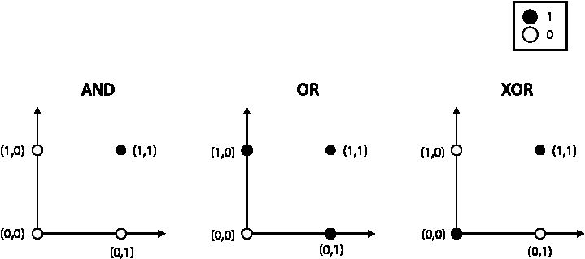

注意，感知器分类器恰好是上述图中将黑白点分开的线。

对于 AND 和 OR 数据集，我们可以很容易地用线分开黑白点，如以下所示。

1.  许多方程适用于分离 AND 数据集的线。我们将选择方程为 *x*[1] + *x*[2] – 1.5 的线。因此，对这一数据集进行分类的感知器做出的预测是 *ŷ* = *step*(*x*[1] + *x*[2] – 1.5)。

1.  类似地，对于 OR 数据集，许多方程都适用，我们选择方程为 *x*[1] + *x*[2] – 0.5 的线。预测的方程是 *ŷ* = *step*(*x*[1] + *x*[2] – 0.5)。

1.  注意，使用单条线无法分离 XOR 数据集。因此，没有感知器模型能够完美地拟合 XOR 数据集。然而，感知器的组合可以分离这个数据集。这些也被称为多层感知器，或神经网络，我们将在第十章中看到它们。如果你好奇，可以看看练习 10.2。

## 第六章：分割点的连续方法：逻辑分类器

练习 6.1

一位牙医在一个患者数据集上训练了一个逻辑分类器，以预测他们是否有蛀牙。模型确定患者有蛀牙的概率是

*σ*(*d* + 0.5*c* – 0.8),

其中

+   *d* 是一个变量，表示患者过去是否有过蛀牙，并且

+   *c* 是一个变量，表示患者是否吃糖果。

例如，如果患者吃糖果，则 *c* = 1，如果不吃，则 *c* = 0。那么，一个既吃糖果又去年接受过蛀牙治疗的患者今天有蛀牙的概率是多少？

解答

如果患者吃糖果，则 *c* = 1。如果患者去年接受了蛀牙治疗，则 *d* = 1。因此，根据模型，患者有蛀牙的概率是

*σ*(1 + 0.5 · 1 – 0.8) = *σ*(0.7) = 0.668。

练习 6.2

考虑将预测 *ŷ* = *σ*(2*x*[1] + 3*x*[2] – 4) 分配给点 (*x*[1], *x*[2]) 的逻辑分类器，以及点 *p* = (1, 1) 的标签为 0。

1.  计算模型对点 *p* 的预测 *ŷ*。

1.  计算模型在点 *p* 处产生的对数损失。

1.  使用逻辑技巧获得一个产生更小对数损失的新的模型。你可以使用 *η* = 0.1 作为学习率。

1.  找到新模型在点 *p* 处的预测值，并验证得到的对数损失小于原始值。

解答

1.  预测值为 *ŷ* = *σ*(2 · 1 + 3 · 1 – 4) = *σ*(1) = 0.731

1.  对数损失为

    *log loss* = –*y* *ln* (*ŷ*) – (1 – *y*) *ln* (1 – *ŷ*)

    = –0 *ln* (0.731) – (1 – 0) *ln* (1 – 0.731)

    = 1.313。

1.  回想一下，对于预测 *ŷ* = *σ*(*w*[1]*x*[1] + *w*[1]*x*[1] + *b*) 的逻辑回归模型，感知器技巧给出了以下新的权重：

    +   *w*[1]*'* = *w*[1] + *η*(*y* – *ŷ*) *x*[1] 对于 *i* = 1,2

    +   *b**'* = *b* + *η*(*y* – *ŷ*) 对于 *i* = 1,2

    这些是插入到先前公式中的值：

    +   *y* = 0

    +   *ŷ* = 0.731

    +   *w*[1] = 2

    +   *w*[2] = 3

    +   *b* = –4

    +   *η* = 0.1

    +   *x*[1] = 1

    +   *x*[2] = 1

    我们得到了以下新的权重，用于我们的分类器：

    +   *w*[1]' = 2 + 0.1 · (0 – 0.731) · 1 = 1.9269

    +   *w*[2]' = 3 + 0.1 · (0 – 0.731) · 1 = 2.9269

    +   *b* = –4 + 0.1 · (0 – 0.731) = –4.0731

    因此，我们的新分类器是做出预测 *ŷ* = *σ*(1.9269*x*[1] + 2.9269*x*[2] – 4.0731) 的那个。

    在点 *p* 处的预测是 *ŷ* =*σ*(1.9269 · 1 + 2.9269 · 1 – 4.0731) = 0.686。注意，因为标签是 0，预测值从原始的 0.731 提高到了实际的 0.686。

1.  这个预测的对数损失为 –*y* *ln*(*ŷ*) – (1 – *y*) *ln*(1 – *ŷ*) = –0 *ln*(0.686) – (1 – 0) *ln*(1 – 0.686) = 1.158。注意，这个值小于原始的对数损失 1.313。

练习 6.3

使用第 6.2 节中的第一个模型，构建一个预测值为 0.8 的点。

提示：首先找到给出预测值为 0.8 的分数，并记住预测值是 *ŷ* = *σ*(分数)。

解答

首先，我们需要找到一个分数，使得 *σ*(分数) = 0.8。这相当于

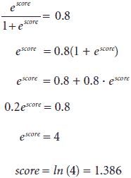

回想一下，对于点 (*x*[1], *x*[2])，分数是 2*x*[1] + 3*x*[2] – 4。许多点 (*x*[1], *x*[2]) 满足分数为 1.386，但为了方便起见，我们特别选择一个 *x*[2] = 0 的点。我们需要解方程 2*x*[1] + 3 · 0 – 4 = 1.386，其解为 *x*[1] = 2.693。因此，给出预测值为 0.8 的点是 (2.693, 0)。

## 第七章：如何衡量分类模型？准确率及其朋友

练习 7.1

一个视频网站已经确定一个特定用户喜欢动物视频，而且其他什么也不喜欢。在下一张图中，我们可以看到当用户登录网站时收到的推荐。

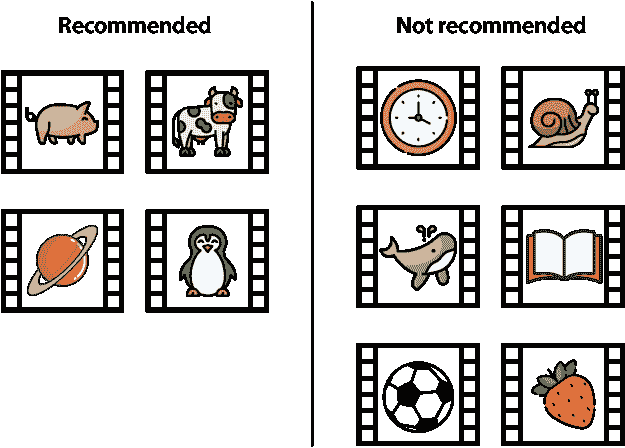

如果这是我们对模型拥有的所有数据，请回答以下问题：

1.  模型的准确率是多少？

1.  模型的召回率是多少？

1.  模型的精确率是多少？

1.  模型的 *F*[1]-score 是多少？

1.  你会认为这是一个好的推荐模型吗？

解答

首先，让我们写出混淆矩阵。在这种情况下，我们将关于动物的视频标记为 *positive*，将推荐的视频标记为 *predicted positive*。

+   有四个推荐视频。其中三个是关于动物的，这意味着它们是好的推荐。另一个不是关于动物的，所以它是假阳性。

+   有六个不推荐的视频。其中两个是关于动物的，本应被推荐。因此，它们是假阴性。其他四个不是关于动物的，所以不推荐它们是正确的。

因此，混淆矩阵如下：

|  | 预测阳性（推荐） | 预测阴性（不推荐） |
| --- | --- | --- |
| 正面（关于动物） | 3 | 2 |
| 负面（非关于动物） | 1 | 4 |

现在我们可以计算指标了。

1.  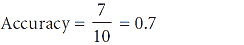

1.  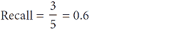

1.  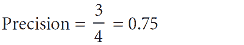

1.  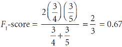

1.  这是一个主观答案。具有这些指标的医学模型可能不够好。然而，如果一个推荐模型的准确度、精确度和召回率都相当不错，那么它被认为是一个好的模型，因为在推荐模型中犯几个错误并不那么关键。

练习 7.2

找出具有以下混淆矩阵的医学模型的灵敏度和特异性：

|  | 预测患病 | 预测健康 |
| --- | --- | --- |
| 患病 | 120 | 22 |
| 健康 | 63 | 795 |

解答

灵敏度是正确预测的患病人数除以总患病人数。这是 120/142= 0.845。

特异性是正确预测的健康人数除以总健康人数。这是 795/858= 0.927。

练习 7.3

对于以下模型，确定哪种错误更严重，是假阳性还是假阴性。基于此，确定在评估每个模型时，我们应该强调哪个指标，是精确度还是召回率。

1.  一个电影推荐系统，用于预测用户是否会观看电影。

1.  在自动驾驶汽车中使用的图像检测模型，用于检测图像中是否包含行人。

1.  一个家庭语音助手，预测用户是否向它下达了命令。

解答

注意：在所有以下模型中，假阴性和假阳性都是不好的，我们希望避免两者。然而，我们展示了一个关于哪个更糟糕的论点。这些都是概念性问题，所以如果你有不同的想法，只要你能很好地论证，它就是有效的！这些是在数据科学家团队中出现的讨论类型，拥有健康观点和支撑每个观点的论据非常重要。

1.  在这个模型中，我们将用户想要观看的电影标记为正面。任何我们推荐用户不想要观看的电影都称为假阳性。当有用户想要观看的电影，但我们没有推荐时，这种情况称为假阴性。哪种情况更糟，假阴性还是假阳性？因为主页显示了众多推荐，而用户通常忽略大部分，所以这个模型有很多假阴性，这对用户体验影响不大。然而，如果有一部用户非常想看的好电影，向他们推荐它至关重要。因此，在这个模型中，假阴性比假阳性更糟，所以我们应该使用**召回率**来评估这个模型。

1.  在这个模型中，我们将行人的存在标记为正面。当没有行人，但汽车认为有行人时，这种情况称为假阳性。当汽车没有检测到汽车前方行人时，这种情况称为假阴性。在假阴性的情况下，汽车可能会撞到行人。在假阳性的情况下，汽车可能会不必要地刹车，这可能会导致或不会导致事故。尽管两者都很严重，但撞到行人更糟糕。因此，在这个模型中，假阴性比假阳性更糟，所以我们应该使用**召回率**来评估这个模型。

1.  在这个模型中，我们将语音命令标记为正面。当用户没有与语音助手交谈，但语音助手响应时，这种情况称为假阳性。当用户与语音助手交谈，但语音助手没有响应时，这种情况称为假阴性。作为一个个人选择，我更喜欢重复对我的语音助手说话，而不是让她突然对我说话。因此，在这个模型中，假阳性比假阴性更糟，所以我们应该使用**精确度**来评估这个模型。

练习 7.4

我们给出了以下模型：

1.  一个基于汽车摄像头图像检测行人的自动驾驶汽车模型

1.  一个基于患者症状诊断致命疾病的医学模型

1.  一个基于用户之前观看的电影推荐电影的推荐系统

1.  一个根据用户的语音命令确定用户是否需要帮助的语音助手

1.  一个基于电子邮件中文字的垃圾邮件检测模型，用于判断一封电子邮件是否为垃圾邮件

我们的任务是使用*F*[β]-分数来评估这些模型。然而，我们没有给出使用*β*的值。您会使用什么值的*β*来评估每个模型？

解决方案

记住，对于精度比召回率更重要的模型，我们使用小值的*β*的*F*[β]-分数。相比之下，对于召回率比精度更重要的模型，我们使用大值的*β*的*F*[β]-分数。

note 如果你的得分与这个解决方案不同，那完全没问题，只要你有论据来说明精确度和召回率哪个更重要，以及你选择的 *β* 值。

+   对于自动驾驶汽车和医疗模型，召回率非常重要，因为我们希望很少出现误判。因此，我会使用一个较大的 *β* 值，例如 4。

+   对于垃圾邮件检测模型，精确度很重要，因为我们希望很少出现误报。因此，我会使用一个较小的 *β* 值，例如 0.25。

+   对于推荐系统，召回率更重要（参见练习 7.3），尽管精确度也很重要。因此，我会使用一个较大的 *β* 值，例如 2。

+   对于语音助手，精确度更重要，尽管召回率也很重要（参见练习 7.3）。因此，我会使用一个较小的 *β* 值，例如 0.5。

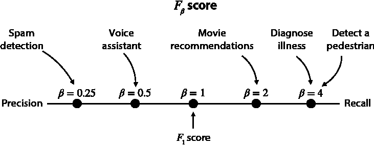

## 第八章：充分利用概率：朴素贝叶斯模型

练习 8.1

对于每一对事件 A 和 B，确定它们是独立的还是依赖的。对于 (a) 到 (d)，提供数学解释。对于 (e) 和 (f)，提供口头解释。

抛掷三枚公平硬币：

1.  A：第一次投掷正面朝上。B：第三次投掷反面朝上。

1.  A：第一次投掷正面朝上。B：三次投掷中正面朝上的次数是奇数。

    抛掷两枚骰子：

1.  A：第一次显示 1。B：第二次显示 2。

1.  A：第一次显示 3。B：第二次显示的数值比第一次高。

    对于以下内容，提供口头解释。假设对于这个问题，我们生活在一个有季节的地方。

1.  A：外面在下雨。B：今天是星期一。

1.  A：外面在下雨。B：现在是六月。

Solution

以下的一些内容可以通过直觉推断出来。然而，在确定两个事件是否独立时，有时直觉会失效。因此，除非事件显然是独立的，否则我们将坚持检查两个事件 A 和 B 是否独立，如果 *P*(*A* ∩ *B*) = *P*(*A*) *P*(*B*)。

1.  因为 A 和 B 对应于抛掷不同的硬币，所以它们是独立事件。

1.  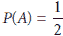 因为公平硬币的翻转会产生两个等可能的情况。在计算 *P*(*B*) 时，我们将使用“h”代表正面，“t”代表反面。这样，事件“hth”对应于第一和第三次硬币投掷正面朝上，第二次投掷反面朝上。因此，如果我们抛掷三枚硬币，就有八种等可能的情况：{hhh, hht, hth, htt, thh, tht, tth, ttt}。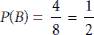 因为在八种等可能的情况（hhh, hht, hth, htt, thh, tht, tth, ttt）中，只有四种有奇数个正面，即 {hhh, htt, tht, tth}。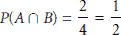 因为在八种可能的情况中，只有两种满足第一次投掷正面朝上且正面朝上的次数是奇数，即 {hhh, htt}。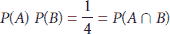，因此事件 A 和 B 是独立的。

1.  因为 A 和 B 对应于掷不同的骰子，所以它们是独立事件。

1.  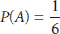，因为它对应于掷骰子得到特定的值。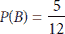的原因如下。注意，两个骰子得分的 36 种等可能的可能性是 {11, 12, 13, …, 56, 66}。在这其中，有六种情况两个骰子显示相同的值。剩下的 30 种对应于 15 种情况，其中第一个值更高，还有 15 种情况，第二个值更高，对称性使得如此。因此，有 15 种情况是第二个骰子的值比第三个骰子高，所以 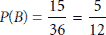。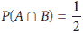的原因如下。如果第一个骰子落在 3 上，我们总共有六种等可能的情况，即 {31, 32, 33, 34, 35, 36}。在这六种情况中，有三个情况第二个数字更高。因此，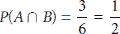。因为 *P*(*A*) *P*(*B*) ≠ *P*(*A* ∩ *B*)，事件 A 和 B 是相关的。

1.  对于这个问题，我们将假设 A 和 B 是独立的，也就是说，天气不依赖于星期几。这是一个合理的假设，鉴于我们对天气的了解，但如果我们想更确定，我们可以查看天气数据集并通过计算相应的概率来验证这一点。

1.  因为我们已经假设我们生活在一个有季节变化的地方，所以在北半球六月是夏天，而在南半球是冬天。根据我们居住的地方，冬天可能比夏天下雨更多。因此，我们可以假设事件 A 和 B 是相关的。

练习 8.2

我们有一个办公室，我们必须定期去那里办理一些文件工作。这个办公室有两个职员，Aisha 和 Beto。我们知道 Aisha 每周工作三天，而 Beto 工作剩下的两天。然而，每周的日程都会变化，所以我们永远不知道 Aisha 会在哪三天，Beto 会在哪两天。

1.  如果我们随机一天去办公室，Aisha 是职员的概率是多少？

    我们从外面看，注意到职员穿着一件红色毛衣，尽管我们无法确定是哪位职员。我们经常去那个办公室，所以知道 Beto 比 Aisha 更倾向于穿红色。事实上，Aisha 有三分之一的时间会穿红色，而 Beto 有二分之一的时间会穿红色。

1.  如果我们知道今天职员穿着红色，Aisha 是职员的概率是多少？

解答

让我们为事件使用以下符号：

+   A：职员是 Aisha 的事件

+   B：职员是 Beto 的事件

+   R：职员穿着红色的事件

1.  因为 Aisha 在办公室工作三天，Beto 工作两天，所以 Aisha 是职员的概率是 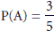，即 60%。此外，Beto 是职员的概率是 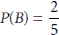，即 40%。

1.  直觉上，因为贝托比艾莎更常穿红色，我们想象店员是艾莎的概率比部分 a) 中的概率低。让我们检查数学是否与我们一致。我们知道店员穿着红色，所以我们需要找到在店员穿着红色的情况下，店员是艾莎的概率。这是 *P*(*A*|*R*).

艾莎穿红色的概率是 ，所以 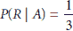。贝托穿红色的概率是 ，所以 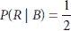。

我们可以使用贝叶斯定理来获得

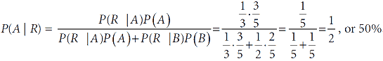

类似的计算表明，贝托是店员的可能性是 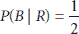，或 50%。

实际上，艾莎是店员的可能性比部分 a) 中得到的小，所以我们的直觉是对的。

练习 8.3

以下是一个数据集，其中包含已测试为阳性或阴性的 COVID-19 患者。他们的症状是咳嗽 (C)、发烧 (F)、呼吸困难 (B) 和疲劳 (T)。

|  | 咳嗽 (C) | 发烧 (F) | 呼吸困难 (B) | 疲劳 (T) | 诊断 |
| --- | --- | --- | --- | --- | --- |
| 患者编号 1 |  | X | X | X | 病人 |
| 患者编号 2 | X | X |  | X | 病人 |
| 患者编号 3 | X |  | X | X | 病人 |
| 患者编号 4 | X | X | X |  | 病人 |
| 患者编号 5 | X |  |  | X | 健康 |
| 患者编号 6 |  | X | X |  | 健康 |
| 患者编号 7 |  | X |  |  | 健康 |
| 患者编号 8 |  |  |  | X | 健康 |

本练习的目的是构建一个朴素贝叶斯模型，从症状预测诊断。使用朴素贝叶斯算法找到以下概率：

备注：对于以下问题，未提及的症状对我们来说是完全未知的。例如，如果我们知道患者有咳嗽，但没有任何关于发烧的说明，并不意味着患者没有发烧。

1.  在患者有咳嗽的情况下，患者生病的概率

1.  在患者不疲劳的情况下，患者生病的概率

1.  在患者有咳嗽和发烧的情况下，患者生病的概率

1.  在患者有咳嗽和发烧，但没有呼吸困难的情况下，患者生病的概率

解答

对于这个问题，我们有以下事件：

+   C：患者有咳嗽的事件

+   F：患者发烧的事件

+   B：患者有呼吸困难的事件

+   T：患者疲劳的事件

+   S：患者被诊断为生病的事件

+   H：患者被诊断为健康的事件

此外，*A*^c 表示事件 *A* 的补集（对立事件）。例如，*T*^c 表示患者不疲劳的事件。

首先，让我们计算 *P*(*S*) 和 *P*(*H*)。注意，因为数据集包含四个健康和四个生病的患者，这两个（先验）概率都是 ，或 50%。

1.  因为有四个病人咳嗽，其中三个是生病的，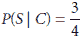，即 75%。

    同样地，我们可以用以下方式应用贝叶斯定理：首先，我们注意到有四个生病的病人，其中三个有咳嗽。我们还注意到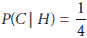，因为有四个健康病人，其中只有一个是咳嗽的。

    现在我们可以使用公式

    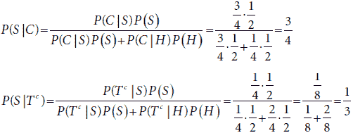

1.  因为有四个病人咳嗽，其中三个是生病的，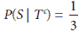，即 33.3%。

    我们也可以像以前一样使用贝叶斯定理。注意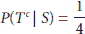，因为四个生病的病人中只有一个不累。同样，四个健康病人中有两个不累，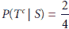。

    通过贝叶斯定理，

    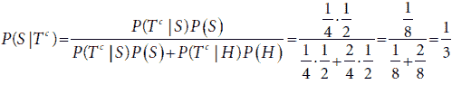

1.  *C* ∩ *F* 表示病人有咳嗽和发烧的事件，因此我们需要计算 *P*(*S*|*C* ∩ *F*)。

    回想一下部分 a)中的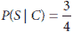和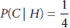。

    现在我们需要计算 *P*(*F*|*S*) 和 *P*(*F*|*H*)。注意，因为有四个生病的病人，其中三个有发烧，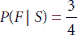。同样，四个健康病人中有两个发烧，。

    我们现在可以使用朴素贝叶斯算法来估计在病人咳嗽和发烧的情况下他们生病的概率。使用第八章“关于两个单词？朴素贝叶斯算法”部分中的公式，我们得到

    

1.  对于这个练习，我们需要找到 *P*(*S*|*C* ∩ *F* ∩ *B*^c)

    注意，因为有四个生病的病人，其中只有一个是无呼吸困难，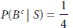。同样，有四个健康病人，其中三个无呼吸困难，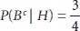。

    和以前一样，我们可以使用朴素贝叶斯算法。

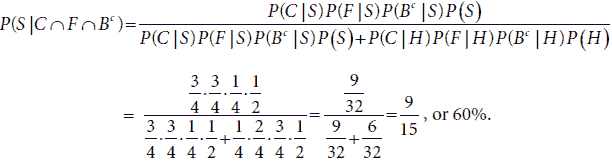

## 第九章：通过提问分割数据：决策树

练习 9.1

在以下垃圾邮件检测决策树模型中，确定来自你妈妈的标题为“请去商店，有促销活动”的电子邮件是否会被分类为垃圾邮件。

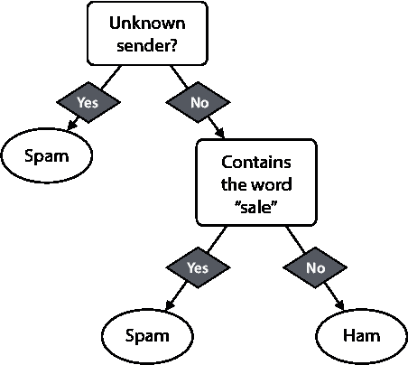

解答

首先，我们检查发送者是否未知。因为发送者是我们的妈妈，所以发送者不是未知的。因此，我们选择右边的分支。我们必须检查电子邮件是否包含单词“sale”。电子邮件确实包含单词“sale”，所以分类器（错误地）将其分类为垃圾邮件。

练习 9.2

我们的目标是构建一个决策树模型来决定信用卡交易是否欺诈。我们使用以下信用卡交易数据集，具有以下特征：

+   **值**：交易的价值。

+   **批准的供应商**：信用卡公司有一份批准的供应商名单。这个变量表示供应商是否在这个名单上。

|  | 值 | 已批准的供应商 | 欺诈 |
| --- | --- | --- | --- |
| 交易 1 | $100 | 未批准 | 是 |
| 交易 2 | $100 | 已批准 | 否 |
| 交易 3 | $10,000 | 已批准 | 否 |
| 交易 4 | $10,000 | 未批准 | 是 |
| 交易 5 | $5,000 | 已批准 | 是 |
| 交易 6 | $100 | 已批准 | 否 |

根据以下规范构建决策树的第一节点：

1.  使用基尼不纯度指数

1.  使用熵

解决方案

在这两种情况下，最佳分割是通过使用已批准的供应商特征获得的，如下一图所示。

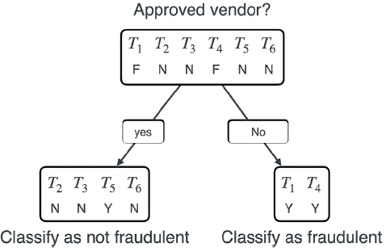

让我们称交易为 *T*[1], *T*[2], *T*[3], *T*[4], *T*[5], 和 *T*[6]。

首先，让我们看看我们可以做出的所有以下分割。使用已批准的供应商进行分割是容易的，因为这是一个有两个类别的分类变量。值列更复杂——我们可以用它以两种可能的方式分割数据。一种是在 $100 和 $5,000 之间的某个值作为截止值，另一种是在 $5,000 和 $10,000 之间的某个值作为截止值。总结一下，这些都是所有可能的分割：

+   **值 1**：其中截止值介于 $100 和 $5,000 之间。这里的两个类别是 {*T*[1], *T*[2], *T*[6]} 和 {*T*[3], *T*[4], *T*[5]}。

+   **值 2**：其中截止值是介于 $5,000 和 $10,000 之间的某个值。这里的两个类别是 {*T*[1], *T*[2], *T*[5], *T*[6]} 和 {*T*[3], *T*[4]}。

+   **已批准的供应商**：两个类别是“已批准”和“未批准”，或者等价地，{*T*[2], *T*[3], *T*[5], *T*[6]} 和 {*T*[1], *T*[4]}。

1.  让我们计算以下四个分割中的每个分割的基尼不纯度指数：

    **值 1**：介于 $100 和 $5,000 之间的截止值

    注意，对于第一类 {*T*[1], *T*[2], *T*[6]}，欺诈列中的标签是 {“是”， “否”， “否”}。这个分割的基尼不纯度指数是 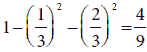。

    注意，对于第二类 {*T*[3], *T*[4], *T*[5]}，欺诈列中的标签是 {“否”， “是”， “是”}。这个分割的基尼不纯度指数是 。

    因此，这个分割的加权基尼不纯度指数是 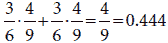。

    **值 2**：介于 $5,000 和 $10,000 之间的截止值

    对于第一类 {*T*[1], *T*[2], *T*[5], *T*[6]}，欺诈列中的标签是 {“是”， “否”， “是”， “否”}。这个分割的基尼不纯度指数是 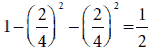。

    注意，对于第二类 {*T*[3], *T*[4]}，欺诈列中的标签是 {“否”， “是”}。这个分割的基尼不纯度指数是 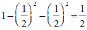。

    因此，这个分割的加权基尼不纯度指数是 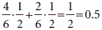*.*

    已批准的供应商：

    对于第一类 {*T*[2], *T*[3], *T*[5], *T*[6]}，欺诈列中的标签是 {“否”， “否”， “是”， “否”}。这个分割的基尼不纯度指数是 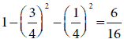。

    对于第二类 {*T*[1], *T*[4]}，欺诈列中的标签是 {“是”， “是”}。这个分割的基尼不纯度指数是 1 – 1² = 0。

    因此，这个分割的加权基尼不纯度指数为 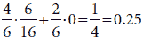。

    注意到这三个值中，最低的是 0.25，对应于“批准的供应商”列。这意味着分割这些数据的最佳方式是使用“批准的供应商”特征。

1.  对于这部分，我们已经做了大部分繁重的工作。我们将遵循与部分 a) 相同的程序，只是在每个阶段计算熵而不是基尼不纯度指数。

    **值 1**：$100 和 $5,000 之间的截断值

    集合 {“是”，“否”，“否”} 的熵为 。

    集合 {“否”，“是”，“是”} 的熵也是 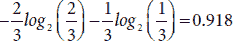。

    因此，这个分割的加权熵为 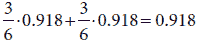。

    **值 2**：$5,000 和 $10,000 之间的截断值

    集合 {“是”，“否”，“是”，“否”} 的熵为 。

    集合 {“否”，“是”} 的熵为 。

    因此，这个分割的加权熵为 。

    批准的供应商：

    集合 {“否”，“否”，“是”，“否”} 的熵为 。

    集合 {“是”，“是”} 的熵为 。

    因此，这个分割的加权熵为 。

    注意到在这些中，最小的熵是 0.541，对应于“批准的供应商”列。因此，再次分割这些数据的最佳方式仍然是使用“批准的供应商”特征。

练习 9.3

以下是一个患者数据集，这些患者已检测出 COVID-19 的阳性或阴性。他们的症状是咳嗽 (C)、发热 (F)、呼吸困难 (B) 和疲劳 (T)。

|  | 咳嗽 (C) | 发热 (F) | 呼吸困难 (B) | 疲劳 (T) | 诊断 |
| --- | --- | --- | --- | --- | --- |
| 患者编号 1 |  | X | X | X | 病人 |
| 患者编号 2 | X | X |  | X | 病人 |
| 患者编号 3 | X |  | X | X | 病人 |
| 患者编号 4 | X | X | X |  | 病人 |
| 患者编号 5 | X |  |  | X | 健康 |
| 患者编号 6 |  | X | X |  | 健康 |
| 患者编号 7 |  | X |  |  | 健康 |
| 患者编号 8 |  |  |  | X | 健康 |

使用准确率，构建一个高度为 1 的决策树（决策树桩），用于分类这些数据。这个分类器在数据集上的准确率是多少？

解决方案

让我们称患者为 *P*[1] 到 *P*[8]。病人将用“s”表示，健康的人用“h”表示。

首先注意到第一次分割可以是四个特征 C、F、B 和 T 中的任何一个。让我们首先计算基于特征 C 分割数据的分类器准确率，即基于问题“患者是否有咳嗽？”构建的分类器。

基于 C 特征的分割：

+   有咳嗽的患者：{*P*[2], *P*[3], *P*[4], *P*[5]}。他们的标签是 {*s*, *s*, *s*, *h*}。

+   无咳嗽的患者：{*P*[1], *P*[6], *P*[7], *P*[8]}。他们的标签是 {*s*, *h*, *h*, *h*}。

看这个，我们可以看到最准确的分类器（仅基于 C 特征）是将所有咳嗽的人分类为病态，而没有咳嗽的人分类为健康的分类器。这个分类器正确地将八名患者中的六名（三名病态和三名健康）分类，因此其准确率为 6/8，即 75%。

现在，让我们用同样的方法处理其他三个特征。

根据 F 特征进行分割：

+   发烧的病人：{*P*[1], *P*[2], *P*[4], *P*[6], *P*[7]}. 他们的标签是 {*s*, *s*, *s*, *h*, *h*}.

+   无发烧的病人：{*P*[3], *P*[5], *P*[8]}. 他们的标签是 {*s*, *h*, *h*}.

看这个，我们可以看到最准确的分类器（仅基于 F 特征）是将所有发烧的患者分类为病态，而没有发烧的患者分类为健康的分类器。这个分类器正确地将八名患者中的五名（三名病态和两名健康）分类，因此其准确率为 5/8，即 62.5%。

根据 B 特征进行分割：

+   表现出呼吸困难的患者：{*P*[1], *P*[3], *P*[4], *P*[5]}. 他们的标签是 {*s*, *s*, *s*, *h*}.

+   没有表现出呼吸困难的患者：{*P*[2], *P*[6], *P*[7], *P*[8]}. 他们的标签是 {*s*, *h*, *h*, *h*}.

看这个，我们可以看到最准确的分类器（仅基于 B 特征）是将所有表现出呼吸困难的患者分类为病态，而没有表现出呼吸困难的患者分类为健康的分类器。这个分类器正确地将八名患者中的六名（三名病态和三名健康）分类，因此其准确率为 6/8，即 75%。

根据 T 特征进行分割：

+   疲劳的病人：{*P*[1], *P*[2], *P*[3], *P*[5], *P*[8]}. 他们的标签是 {*s*, *s*, *s*, *h*, *h*}.

+   无疲劳的病人：{*P*[4], *P*[5], *P*[7]}. 他们的标签是 {*s*, *h*, *h*}.

看这个，我们可以看到最准确的分类器（仅基于 F 特征）是将所有疲劳的病人分类为病态，而没有疲劳的病人分类为健康的分类器。这个分类器正确地将八名患者中的五名（三名病态和两名健康）分类，因此其准确率为 5/8，即 62.5%。

注意，给我们带来最佳准确率的两个特征是 C（咳嗽）和 B（呼吸困难）。决策树将随机选择这两个中的一个。让我们选择第一个，C。使用 C 特征分割数据后，我们得到以下两个数据集：

+   有咳嗽的病人：{*P*[2], *P*[3], *P*[4], *P*[5]}. 他们的标签是 {*s*, *s*, *s*, *h*}.

+   无咳嗽的病人：{*P*[1], *P*[6], *P*[7], *P*[8]}. 他们的标签是 {*s*, *h*, *h*, *h*}.

这给我们提供了一个深度为 1 的树，该树以 75% 的准确率对数据进行分类。该树在下一张图中展示。

## 第十章：组合构建块以获得更多力量：神经网络

练习 10.1

下图展示了一个所有激活都是 Sigmoid 函数的神经网络。

这个神经网络会对输入(1,1)做出什么预测？

解答

让我们称中间节点的输出为*η*[1]和*η*[2]。这些计算如下：

*h*[1] = *σ*(1 · *x*[1] – 2 · *x*[2] – 1)

*h*[2] =*σ*(–1 · *x*[1] + 3 · *x*[2] – 1)

将*x*[1] = 1 和*x*[2] = 1 代入，我们得到以下结果：

*h*[1] = *σ*(–2) = 0.119

*h*[2] = *σ*(1) = 0.731

最终层是

*ŷ* = *σ*(–1 · *h*[1] + 2 · *h*[2] + 1).

用之前得到的*h*[1]和*h*[2]的值替换，我们得到

*ŷ* = *σ*(–0.119 + 2 · 0.731 + 1) = *σ*(2.343) = 0.912.

因此，神经网络的输出是 0.912。

练习 10.2

正如我们在练习 5.3 中学到的，无法构建一个模仿 XOR 门的感知器。换句话说，无法使用感知器拟合以下数据集并获得 100%的准确率：

| *x*[1] | *x*[2] | *y*   |
| --- | --- | --- |
| 0 | 0 | 0 |
| 0 | 1 | 1 |
| 1 | 0 | 1 |
| 1 | 1 | 0 |

这是因为数据集不是线性可分的。使用深度为 2 的神经网络，构建一个模仿之前展示的 XOR 门的感知器。作为激活函数，使用步进函数而不是 sigmoid 函数以获得离散输出。

提示：使用训练方法来做这个可能很难；相反，尝试通过观察权重来尝试。尝试（或在网上搜索如何）使用 AND、OR 和 NOT 门构建一个 XOR 门，并使用练习 5.3 的结果来帮助你。

解答

注意以下 AND、OR 和 NOT 门的组合形成了一个 XOR 门（其中 NAND 门是 AND 门和 NOT 门的组合）。

下面的真值表说明了这一点。

| *x*[1] | *x*[2] | *h*[1] = *x*[1] *OR* *x*[2] | *h*[2] = *x*[1] *NAND* *x*[2] | *h*[1] *AND* *η*[2] | *x*[1] *XOR* *x*[2] |
| --- | --- | --- | --- | --- | --- |
| 0 | 0 | 0 | 1 | 0 | 0 |
| 0 | 1 | 1 | 1 | 1 | 1 |
| 1 | 0 | 1 | 1 | 1 | 1 |
| 1 | 1 | 1 | 0 | 0 | 0 |

正如我们在练习 5.3 中所做的那样，这里有一些感知器，它们模仿了 OR、NAND 和 AND 门。NAND 门是通过取 AND 门中所有权重的反得到。

将这些组合在一起，我们得到下一张图中所示的神经网络。

我鼓励你验证这个网络确实模仿了 XOR 逻辑门。这是通过将四个向量(0,0)、(0,1)、(1,0)、(1,1)输入网络并验证输出为 0、1、1、0 来完成的。

练习 10.3

在“神经网络图形表示”部分的结尾，我们看到了图 10.13 中的神经网络，由于激活函数的原因，它不适合表 10.1 中的数据集，因为点(1,1)被错误分类。

1.  验证这是否是情况。

1.  改变权重，使神经网络能够正确分类每个点。

解答

1.  对于点(*x*[a]，*x*[b]) = (1, 1)，预测如下：

    *C* = *σ*(6 · 1 + 10 · 1 – 15) = *σ*(1) = 0.731

    *F* = *σ*(10 · 1 + 6 · 1 – 15) = *σ*(1) = 0.731

    *ŷ* = *σ*(1 · 0.731 + 1 · 0.731 – 1.5) = *σ*(–0.39) = 0.404

    因为预测值更接近于 0 而不是 1，所以这个点被错误分类。

1.  将最终节点的偏差降低到小于 2 · 0.731 = 1.461 的任何值都可以。例如，如果这个偏差是 1.4，那么在点（1,1）的预测值将高于 0.5。作为一个练习，我鼓励你验证这个新的神经网络是否正确地预测了剩余点的标签。

## 第十一章：以风格寻找边界：支持向量机和核方法

练习 11.1

（此练习完成了“距离误差函数”部分所需的计算。）

证明方程 *w*[1]*x*[1] + *w*[2]*x*[2] + *b* = 1 和 *w*[1]*x*[1] + *w*[2]*x*[2] + *b* = –1 的直线之间的距离恰好是 。

解答

首先，让我们这样称呼这些线：

+   *L*[1] 是方程 *w*[1]*x*[1] + *w*[2]*x*[2] + *b* = 1 的直线。

+   *L*[2] 是方程 *w*[1]*x*[1] + *w*[2]*x*[2] + *b* = –1 的直线。

注意，我们可以将方程 *w*[1]*x*[1] + *w*[2]*x*[2] + *b* = 0 重新写为 ，其斜率为 。任何与此线垂直的线的斜率为 。特别是，方程为  的线与 *L*[1] 和 *L*[2] 都垂直。我们将这条线称为 *L*[3]。

接下来，我们解出 *L*[3] 与每条线 *L*[1] 和 *L*[2] 的交点。*L*[1] 和 *L*[3] 的交点是以下方程的解：

我们可以将第二个方程代入第一个方程，得到

,

然后解出 *x*[1]，得到

。

因此，因为 *L*[2] 中的每个点都有形式 ，*L*[1] 和 *L*[3] 的交点是坐标为  的点。

类似的计算将表明，*L*[2] 和 *L*[3] 的交点是坐标为  的点。

要找到这两个点之间的距离，我们可以使用勾股定理。这个距离是

如此。

练习 11.2

正如我们在练习 5.3 中学到的，不可能构建一个模仿 XOR 门的感知器模型。换句话说，不可能用感知器模型（以 100%的准确率）拟合以下数据集：

| *x*[1] | *x*[2] | *y*   |
| --- | --- | --- |
| 0 | 0 | 0 |
| 0 | 1 | 1 |
| 1 | 0 | 1 |
| 1 | 1 | 0 |

这是因为数据集不是线性可分的。支持向量机（SVM）也有同样的问题，因为 SVM 也是一个线性模型。然而，我们可以使用核函数来帮助我们。我们应该使用什么核函数将这个数据集转换为线性可分的数据集？转换后的 SVM 会是什么样子？

提示：查看“利用多项式方程为你带来好处”部分的例子 2，它解决了一个非常类似的问题。

解答

考虑到二次多项式核，我们得到以下数据集：

| *x*[1] | *x*[2] | *x*[1]² | *x*[1] *x*[2] | *x*[2]² | *y*   |
| --- | --- | --- | --- | --- | --- |
| 0 | 0 | 0 | 0 | 0 | 0 |
| 0 | 1 | 0 | 0 | 1 | 1 |
| 1 | 1 | 1 | 0 | 0 | 1 |
| 1 | 1 | 1 | 1 | 1 | 0 |

几个分类器在这个修改后的数据集上工作。例如，具有方程 *ŷ* = *step*(*x*[1] + *x*[2] – 2*x*[1]*x*[2] – 0.5) 的分类器正确地分类了数据。

## 第十二章：结合模型以最大化结果：集成学习

练习 12.1

由三个弱学习器 *L*[1]、*L*[2] 和 *L*[3] 组成的强学习器 *L* 通过三个弱学习器形成。它们的权重分别为 1、0.4 和 1.2。对于特定点，*L*[1] 和 *L*[2] 预测其标签为正，而 *L*[3] 预测其为负。学习器 *L* 对此点的最终预测是什么？

解答

因为 *L*[1] 和 *L*[2] 预测标签为正，而 *L*[3] 预测标签为负，所以投票总和为

1 + 0.4 – 1.2 = 0.2。

这个结果是正的，这意味着强学习器预测这个点的标签为正。

练习 12.2

我们正在对大小为 100 的数据集训练 AdaBoost 模型。当前的弱学习器正确分类了 68 个数据点中的 100 个。我们将为这个学习器在最终模型中分配什么权重？

解答

这个权重是 log 概率，即概率的自然对数。概率为 68/32，因为分类器正确分类了 68 个点，错误分类了剩余的 32 个。因此，分配给这个弱学习器的权重是

## 第十三章：付诸实践：数据工程和机器学习的真实案例

练习 13.1

仓库中包含一个名为 test.csv 的文件。这是一个包含更多 *泰坦尼克号* 乘客的文件，但它没有“Survived”列。

1.  按照本章中的方法预处理此文件中的数据。

1.  使用任何模型来预测此数据集中的标签。根据你的模型，你认为有多少乘客幸存了？

1.  比较本章中所有模型的性能，你认为测试集中有多少乘客实际上幸存了？

解答

解答位于以下笔记本的末尾：[`github.com/luisguiserrano/manning/tree/master/Chapter_13_End_to_end_example`](https://github.com/luisguiserrano/manning/tree/master/Chapter_13_End_to_end_example).
