# 附录 B. 梯度下降背后的数学：使用导数和斜率下山

在这个附录中，我们将介绍梯度下降的数学细节。这个附录相当技术性，理解它不是阅读本书其余部分所必需的。然而，它在这里是为了给那些希望了解一些核心机器学习算法内部工作原理的读者提供一个完整的感观。这个附录所需的数学知识比本书的其他部分要高。更具体地说，需要了解向量、导数和链式法则。

在第 3、5、6、10 和 11 章中，我们使用了梯度下降来最小化我们模型中的误差函数。更具体地说，我们使用了梯度下降来最小化以下误差函数：

+   第三章：线性回归模型中的绝对值和平方误差函数

+   第五章：感知器模型中的感知器误差函数

+   第六章：逻辑分类器中的对数损失

+   第十章：神经网络中的对数损失

+   第十一章：SVM 中的分类（感知器）误差和距离（正则化）误差

正如我们在第 3、5、6、10 和 11 章中学到的，误差函数衡量模型做得有多糟糕。因此，找到这个误差函数的最小值——或者至少是一个非常小的值，即使它不是最小值——对于找到一个好的模型将是至关重要的。

我们使用的类比是下山——如图 B.1 所示的埃罗斯特山。场景如下：你正站在山顶的某个地方，你想到达这座山的底部。天气非常多云，所以你看不见你周围很远的地方。你能做的最好的事情是一步一步地从山上下来。你问自己，“如果我只迈出一步，我应该朝哪个方向迈出，才能下得最快？”你找到那个方向，迈出那一步。然后你再次提出相同的问题，再迈出另一步，你重复这个过程很多次。可以想象，如果你总是迈出一步，那一步能让你下得最快，那么你肯定能到达一个低洼的地方。你可能需要一点运气才能真正到达山底，而不是陷入山谷，但我们在“陷入局部最小值”这一节中会处理这个问题。

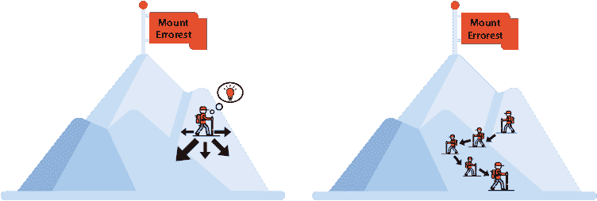

图 B.1 在梯度下降步骤中，我们想要从被称为埃罗斯特山的山上下来。

在接下来的几节中，我们将描述梯度下降背后的数学，并使用它来帮助我们通过减少它们的误差函数来训练几个机器学习算法。

## 使用梯度下降来减少函数

梯度下降的数学形式如下：假设你想要最小化函数 *f*(*x*[1], *x*[2], …, *x*[n]) 在 *n* 个变量 *x*[1], *x*[2], …, *x*[n] 上的值。我们假设这个函数在每个 *n* 个变量上都是连续且可导的。

我们目前位于点*p*，坐标为(*p*[1], *p*[2], …, *p*[n])，我们希望找到函数减少最多的方向，以便采取该步骤。这如图 B.2 所示。为了找到函数减少最多的方向，我们使用函数的*梯度*。梯度是由函数*f*相对于每个变量*x*[1], *x*[2], …, *x*[n]的偏导数组成的*n*-维向量。这个梯度表示为∇*f*，如下所示：

![AppB_01_E01.png]

梯度是一个指向最大增长方向的向量，即函数*增加*最多的方向。因此，梯度的负值是函数*减少*最多的方向。这是我们想要采取的步骤。我们使用在第三章中学到的*学习率*来确定步长的大小，我们用*η*表示它。梯度下降步骤包括在负梯度的方向上迈出长度为*η*|∇*f|*的步长。因此，如果我们的原始点是*p*，在应用梯度下降步骤后，我们得到点*p* – *η*∇*f*。图 B.2 说明了我们为减少函数*f*所采取的步骤。

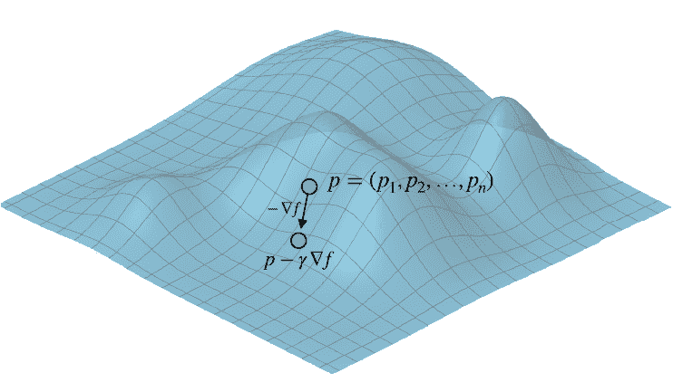

图 B.2 我们最初位于点*p*。我们朝着负梯度的方向迈出一步，最终到达一个新的点。这是函数减少最多的方向。（来源：使用 Golden Software, LLC 的 Grapher™辅助创建的图像；[`www.goldensoftware.com/products/grapher`](https://www.goldensoftware.com/products/grapher)）。

现在我们知道了如何迈出一小步来略微减少函数，我们可以简单地重复这个过程多次来最小化我们的函数。因此，梯度下降算法的伪代码如下：

梯度下降算法的伪代码

**目标**：最小化函数*f*。

超参数：

+   迭代次数（重复次数）*N*

+   学习率*η*

流程：

+   选择一个随机点*p*[0]。

+   对于*i* = 0, …, *N* – 1：

    +   – 计算梯度∇*f*(*p*[i])。

    +   – 选择点*p*[i][+1] = *p*[i] – *η*∇*f*(*p*[i])。

+   以点*p*[n]结束。

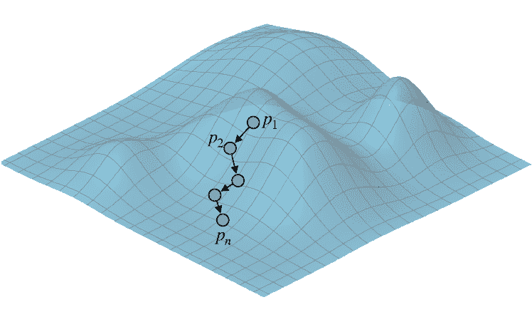

图 B.3 如果我们多次重复梯度下降步骤，我们有很大的机会找到函数的最小值。在这个图中，*p*[1]代表起点，*p*[n]代表使用梯度下降获得的点。（来源：使用 Golden Software, LLC 的 Grapher™辅助创建的图像；[`www.goldensoftware.com/products/grapher`](https://www.goldensoftware.com/products/grapher)）。

这个过程**总是**找到函数的最小值吗？不幸的是，不是的。在尝试使用梯度下降最小化函数时可能会出现几个问题，例如陷入局部最小值（一个山谷）。我们将在“陷入局部最小值”这一节中学习一种非常有用的技术来处理这个问题。

## 使用梯度下降训练模型

现在我们知道了梯度下降如何帮助我们最小化（或者至少，找到函数的小值），在本节中我们将看到如何使用它来训练一些机器学习模型。我们将训练的模型如下：

+   线性回归（来自第三章）。

+   感知器（来自第五章）。

+   逻辑分类器（来自第六章）。

+   神经网络（来自第十章）。

+   正则化（来自第四章和第十一章）。这不是一个模型，但我们仍然可以看到梯度下降步骤对使用正则化的模型产生的影响。

我们使用梯度下降训练模型的方式是让 *f* 成为模型的对应误差函数，并使用梯度下降来最小化 *f*。误差函数的值在数据集上计算。然而，正如我们在第三章的“我们是一次训练一个点还是多个点”部分、第六章的“随机、小批量和大批量梯度下降”部分以及第十章的“超参数”部分所看到的，如果数据集太大，我们可以通过将数据集分成大小大致相同的小批量来加速训练，并在每一步中选取不同的一个小批量来计算误差函数。

在本附录中，我们将使用以下记号。大多数术语已在第一章和第二章中介绍：

+   数据集的**大小**，或行数，是 *m*。

+   数据集的**维度**，或列数，是 *n*。

+   数据集由**特征**和**标签**组成。

+   **特征**是 *m* 个向量 *x*[i] = (*x*[1]^(^i^)，*x*[2]^(^i^)，…，*x*[n]^(^i^))，对于 *i* = 1，2，…，*m*。

+   **标签** *y*[i]，对于 *i* = 1，2，…，*m*。

+   **模型**由 *n* 个权重向量 *w* = (*w*[1]，*w*[2]，…，*w*[n]) 和偏置 *b*（一个标量）给出（除非模型是神经网络，它将具有更多的权重和偏置）。

+   **预测** *ŷ*，对于 *i* = 1，2，…，*m*。

+   模型的**学习率**是 *η*。

+   数据的**小批量**是 *B*[1]，*B*[2]，…，*B*[l]，其中 *l* 是某个数字。每个小批量具有长度 *q*。一个小批量中的点（为了方便记号）表示为 *x*^((1))，…，*x*^(^q^)，标签为 *y*[1]，…，*y*[q]。

我们将用于训练模型的梯度下降算法如下：

机器学习模型训练的梯度下降算法

超参数：

+   轮数（重复次数）*N*

+   学习率 *η*

流程：

+   随机选择权重 *w*[1]，*w*[2]，…，*w*[n] 和随机偏置 *b*。

+   对于 *i* = 0，…，*N* – 1：

    +   对于每个小批量 *B*[1]，*B*[2]，…，*B*[l]。

        +   计算特定小批量的误差函数 *f*(*w, b*)。

        +   计算梯度 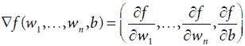

        +   将权重和偏差替换如下：

            +   *w*[1] 被替换为 ![w*[1] 替换图](../Images/AppB_03_E02.png)

            +   *b* 被替换为 

在接下来的小节中，我们将详细说明以下每个模型和误差函数的此过程：

+   带有平均绝对误差函数的线性回归模型（下一节）

+   带有平均平方误差函数的线性回归模型（下一节）

+   感知器模型带有感知器误差函数（“使用梯度下降训练分类模型”这一节）

+   带有对数损失函数的逻辑回归模型（“使用梯度下降训练分类模型”这一节）

+   带有对数损失函数的神经网络（“使用梯度下降训练神经网络”这一节）

+   带有正则化的模型（“使用梯度下降进行正则化”这一节）

使用梯度下降来训练线性回归模型

在本节中，我们使用梯度下降来训练一个线性回归模型，使用我们之前学过的两个误差函数：平均绝对误差和平均平方误差。回顾第三章，在线性回归中，预测值 *ŷ*[1]，*ŷ*[1]，…，*ŷ*[q] 由以下公式给出：

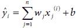

我们回归模型的目标是找到权重 *w*[1]，…，*w*[n]，它们产生的预测值与标签非常接近。因此，误差函数通过测量特定权重集下 *ŷ* 与 *y* 之间的距离来帮助。正如我们在第三章的“绝对误差”和“平方误差”一节中看到的，我们有两种不同的方式来计算这个距离。第一种是绝对值 |*ŷ* – *y*|，第二种是差异的平方 (*y* – *ŷ*)²。第一种产生了平均绝对误差，第二种产生了平均平方误差。让我们分别研究它们。

使用梯度下降来训练线性回归模型以减少平均绝对误差

在本小节中，我们将计算平均绝对误差函数的梯度，并使用它来应用梯度下降并训练一个线性回归模型。平均绝对误差是一种衡量 *ŷ* 和 *y* 之间距离的方法。它首次在第三章的“绝对误差”一节中定义，其公式如下：

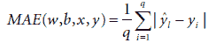

为了方便起见，我们将 *MAE*(*w, b, x*, *y*) 简写为 *MAE*。为了使用梯度下降来减少 *MAE*，我们需要计算梯度 ∇*MAE*，它是一个包含 *n* + 1 个关于 *w*[1]，…，*w*[n]，*b* 的偏导数的向量，

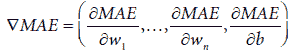

我们将使用链式法则来计算这些偏导数。首先，注意

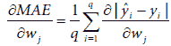

函数 *f*(*x*) = |*x*| 的导数是符号函数 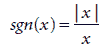，当 *x* 为正时为 +1，当 *x* 为负时为 -1（在 0 处未定义，但为了方便，我们可以将其定义为 0）。因此，我们可以将前面的方程重写为

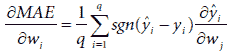

为了计算这个值，让我们关注方程的最后一部分，即 。由于 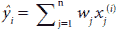，因此

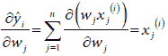.

这是因为 *w*[j] 对 *w*[i] 的导数，当 *j* = *i* 时为 1，否则为 0。因此，在导数上替换，我们得到以下结果：

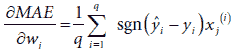

使用类似的分析，我们可以计算出 *MAE*(*w*, *b*) 对 *b* 的导数是

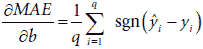

梯度下降步骤如下：

梯度下降步骤：

将 (*w*, *b*) 替换为 (*w**'*, *b**'*)，其中

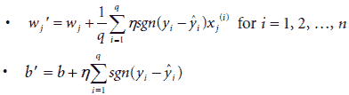

注意到有趣的一点：如果小批量的大小 *q* = 1，并且只包含点 *x* = (*x*[1], *x*[2], …, *x*[n])，带有标签 *y* 和预测 *ŷ*，则步骤定义如下：

将 (*w*, *b*) 替换为 (*w**'*, *b**'*)，其中

+   *w*[j]' = *w*[j] + *η* sgn(*y* – *ŷ*)*x*[j]

+   *b*' = *b* + *η* sgn(*y* – *ŷ*)

这正是我们在第三章“简单技巧”一节中使用的简单技巧来训练我们的线性回归算法。

使用梯度下降法通过减少均方误差来训练线性回归模型

在本小节中，我们将计算均方误差函数的梯度，并利用它来应用梯度下降法并训练线性回归模型。均方误差是衡量 *ŷ* 和 *y* 之间距离的另一种方式。它首次在第三章“平方误差”一节中定义，其公式为

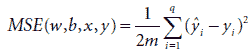

为了方便，我们将 *MSE*(*w, b, x*, *y*) 简写为 *MSE*。为了计算梯度 ∇*MSE*，我们可以遵循与之前描述的均方绝对误差相同的程序，只是 *f*(*x*) = *x*² 的导数是 2*x*。因此，*MSE* 对 *w*[j] 的导数是

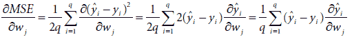

类似地，*MSE*(*w*, *b*) 对 *b* 的导数是

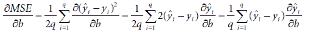

梯度下降步骤：

将 (*w*, *b*) 替换为 (*w**'*, *b**'*)，其中

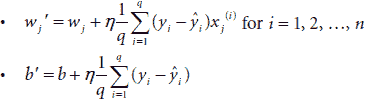

注意再次，如果小批量的大小 *q =* 1，并且只包含点 *x* = (*x*[1], *x*[2], …, *x*[n])，带有标签 *y* 和预测 *ŷ*，则步骤定义如下：

将 (*w*, *b*) 替换为 (*w**'*, *b**'*)，其中

+   *w*[j]' = *w*[j] + *η*(*y* – *ŷ*)*x*[j]

+   *b**'* = *b* + *η*(*y* – *ŷ*)

这正是我们在第三章“平方技巧”一节中使用的平方技巧来训练我们的线性回归算法。

使用梯度下降法训练分类模型

在本节中，我们学习如何使用梯度下降来训练分类模型。我们将训练的两个模型是感知器模型（第五章）和对数回归模型（第六章）。每个模型都有自己的误差函数，因此我们将分别开发它们。

使用梯度下降来训练感知器模型以减少感知器误差

在本小节中，我们将计算感知器误差函数的梯度，并使用它来应用梯度下降并训练感知器模型。在感知器模型中，预测是 *ŷ*[1]*,* *ŷ*[2]*, …,* *ŷ*[q]，其中每个 *ŷ*[i] 是 0 或 1。为了计算预测，我们首先需要记住第五章中引入的步骤函数 *step*(*x*)。这个函数将任何实数 *x* 作为输入，如果 *x* < 0 则输出 0，如果 *x* ≥ 0 则输出 1。它的图示在图 B.4 中。

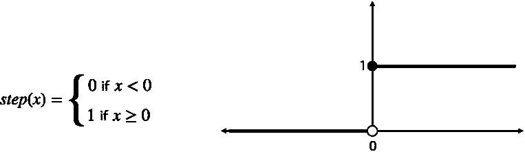

图 B.4 步骤函数。对于负数，它输出 0，对于非负数，它输出 1。

模型给每个点一个 *分数*。具有权重 (*w*[1], *w*[2], …, *w*[n]) 和偏置 *b* 的模型给点 *x*^(^i^) = (*x*[1]^(^i^), *x*[n]^(^i^), …, *x*[n]^(^i^)) 的分数是

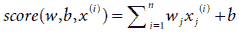

预测 *ŷ*[i] 由以下公式给出：

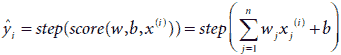

换句话说，如果分数为正，预测为 1，否则为 0。

感知器误差函数被称为 *PE*(*w, b, x*, *y*)，我们将它简称为 *PE*。它首次在第五章的“如何比较分类器？误差函数”一节中定义。根据构造，如果模型做出了错误的预测，它就是一个大数，如果模型做出了正确的预测，它就是一个小数（在这种情况下，实际上为 0）。误差函数的定义如下。

+   *PE*(*w, b, x, y*) = 0 如果 *ŷ* = *y*

+   *PE*(*w, b, x*, *y*) = |*score*(*w, b, x*)| 如果 *ŷ* *≠* *y*

换句话说，如果点被正确分类，误差为零。如果点被错误分类，误差是分数的绝对值。因此，分数绝对值低的错误分类点产生低误差，而分数绝对值高的错误分类点产生高误差。这是因为点的分数的绝对值与该点与边界的距离成正比。因此，误差低的点是靠近边界的点，而误差高的点是远离边界的点。

为了计算梯度 ∇*PE*，我们可以使用之前的相同规则。我们应该注意的一件事是，绝对值函数 |*x*| 的导数在 *x* ≥ 0 时为 1，在 *x* < 0 时为 0。这个导数在 0 处未定义，这是我们计算中的一个问题，但在实践中，我们可以任意将其定义为 1 而不会出现任何问题。

在第十章中，我们介绍了 *ReLU*(*x*)（修正线性单元）函数，当 *x* < 0 时为 0，当 *x* ≥ 0 时为 *x*。请注意，有两种方式可能导致点被错误分类：

+   如果 *y* = 0 且 *ŷ* = 1。这意味着 *score*(*w, b, x*) ≥ 0。

+   如果 *y* = 1 且 *ŷ* = 0。这意味着 *score*(*w, b, x*) < 0。

因此，我们可以方便地将感知器误差重写为

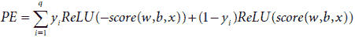

或者更详细地说，作为

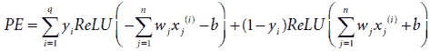

现在我们可以使用链式法则来计算梯度 ∇*PE*。一个重要的观察结果是，我们将使用，并且读者可以验证的是，*ReLU*(*x*)的导数是步函数 *step*(*x*)。这个梯度是

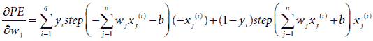

这可以重写为

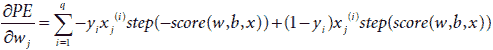

这看起来很复杂，但实际上并不难。让我们分析上一个表达式的右侧的每一项。请注意，*step*(*score*(*w, b, x*)) 当且仅当 *score*(*w, b, x*) > 0 时为 1，否则为 0。这正是 *ŷ* = 1 的时候。同样，*step*(–*score*(*w, b, x*)) 当且仅当 *score*(*w, b, x*) < 0 时为 1，否则为 0。这正是 *ŷ* = 0 的时候。因此

+   如果 *ŷ*[i] = 0 且 *y*[i] = 0：

    −*y*[i] *x*[j]^(^i^)) *step*(−*score*(*w, b, x*)) + (1 − *y*[i]) *x*[j]^(^i^) *step*(*score*(*w, b, x*)) = 0

+   如果 *ŷ*[i] = 1 且 *y*[i] = 1：

    −*y*[i] *x*[j]^(^i^)) *step*(−*score*(*w, b, x*)) + (1 − *y*[i]) *x*[j]^(^i^) *step*(*score*(*w, b, x*)) = 0

+   如果 *ŷ*[i] = 0 且 *y*[i] = 1：

    −*y*[i] *x*[j]^(^i^)) *step*(−*score*(*w, b, x*)) + (1 − *y*[i]) *x*[j]^(^i^) *step*(*score*(*w, b, x*)) = −*x*[j]^(^i^))

+   如果 *ŷ*[i] = 1 且 *y*[i] = 0：

    −*y*[i] *x*[j]^(^i^)) *step*(−*score*(*w, b, x*)) + (1 − *y*[i]) *x*[j]^(^i^) *step*(*score*(*w, b, x*)) = *x*[j]^(^i^))

这意味着在计算 ∂*PE*/∂*x*[j] 时，只有来自错误分类点的项会添加值。

以类似的方式，

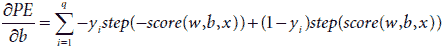

因此，梯度下降步骤定义为以下：

梯度下降步骤：

将 (*w*, *b*) 替换为 (*w**'*, *b**'*)，其中

+   *w*[j]' = *w*[j] + *η* Σ[i]^q[=1] −*y*[i] *x*[j]^(^i^)*step*(−*score*(*w, b, x*)) + (1 − *y*[i]) *x*[j]^(^i^) *step*(*score*(*w, b, x*)), 并且

+   *b*' = *b* + *η* Σ[i]^q[=1] −*y*[i]*step*(−*score*(*w, b, x*)) + (1− *y*[i])*step*(*score*(*w, b, x*))

再次，查看上一个表达式的右侧

+   如果 *ŷ*[i] = 0 且 *y*[i] = 0：

    −*y*[i]*step*(−*score*(*w, b, x*)) + (1− *y*[i])*step*(*score*(*w, b, x*)) = 0

+   如果 *ŷ*[i] = 1 且 *y*[i] = 1：

    −*y*[i]*step*(−*score*(*w, b, x*)) + (1− *y*[i])*step*(*score*(*w, b, x*)) = 0

+   如果 *ŷ*[i] = 0 且 *y*[i] = 1：

    −*y*[i]*step*(−*score*(*w, b, x*)) + (1− *y*[i])*step*(*score*(*w, b, x*)) = −*1*

+   如果 *ŷ*[i] = 1 且 *y*[i] = 0：

    −*y*[i]*step*(−*score*(*w, b, x*)) + (1− *y*[i])*step*(*score*(*w, b, x*)) = *1*

所有这些可能并不意味太多，但可以编写代码来计算梯度的所有条目。再次注意，如果小批量的大小 *q* = 1，并且只包含点 *x* = (*x*[1]，*x*[2]，…，*x*[n])，具有标签 *y* 和预测 *ŷ*，则步骤定义如下：

梯度下降步骤：

+   如果点被正确分类，则不要改变 *w* 和 *b*。

+   如果点具有标签 *y* = 0 并被分类为 *ŷ* = 1：

    +   将 *w* 替换为 *w*' = *w* – *η**x*。

    +   将 *b* 替换为 *b*' = *w* – *η*。

+   如果点具有标签 *y* = 1 并被分类为 *ŷ* = 0：

    +   将 *w* 替换为 *w*' = *w* + *η**x*。

    +   将 *b* 替换为 *b*' = *w* + *η*。

注意，这正是第五章中“感知器技巧”部分描述的感知器技巧。

使用梯度下降法训练逻辑回归模型以减少对数损失

在本小节中，我们将计算对数损失函数的梯度，并使用它来应用梯度下降并训练逻辑回归模型。在逻辑回归模型中，预测值是 *ŷ*[1]，*ŷ*[2]，…，*ŷ*[q]，其中每个 *ŷ*[i] 是介于 0 和 1 之间的某个实数。为了计算预测值，我们首先需要记住第六章中引入的 sigmoid 函数 *σ*(*x*)。该函数将任何实数 *x* 作为输入，并输出介于 0 和 1 之间的某个数字。如果 *x* 是一个很大的正数，那么 *σ*(*x*) 接近 1。如果 *x* 是一个很大的负数，那么 *σ*(*x*) 接近 0。sigmoid 函数的公式是

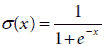

*σ*(*x*) 的图像如图 B.5 所示。

逻辑回归模型的预测值正是 sigmoid 函数的输出，即对于 *i* = 1, 2, …, *q*，它们被定义为以下：

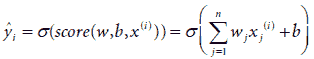

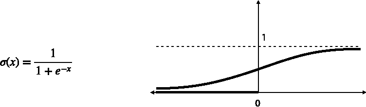

图 B.5 Sigmoid 函数始终输出介于 0 和 1 之间的数字。对于负数，输出接近 0，对于正数，输出接近 1。

对数损失表示为 *LL*(*w, b, x*, *y*)，我们将简写为 *LL*。这个错误函数最初在第六章的“数据集和预测”部分中定义。它类似于感知器错误函数，因为按照构造，如果模型做出了错误的预测，它就是一个很大的数字；如果模型做出了好的预测，它就是一个小的数字。对数损失函数定义为

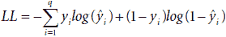

我们可以继续使用链式法则计算梯度 ∇*LL*。在此之前，请注意，sigmoid 函数的导数可以写成 *σ**'*(*x*) = *σ*(*x*)|1 – *σ*(*x*)|。关于最后计算的详细情况，可以使用微分的有理数法则来计算，具体留给读者。使用这个，我们可以计算 *ŷ*[i] 对 *w*[j] 的导数。因为 *ŷ*[i] = *σ*(Σ[i]^n[=1]*w*[j]*x*[j]^(^i^) + *b*))，所以根据链式法则，

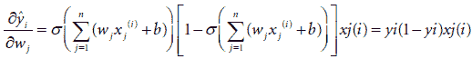

现在，让我们继续开发对数损失。再次使用链式法则，我们得到

并且通过之前对 ∂*ŷ*[i]/∂*w*[j] 的计算，

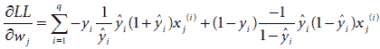

简化后得到

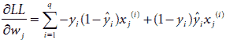

这进一步简化为

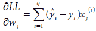

类似地，对 *b* 求导，我们得到

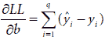

因此，梯度下降步骤变为以下：

梯度下降步骤：

将 (*w*, *b*) 替换为 (*w**'*, *b**'*), 其中

+   *w**' = *w* + *η*Σ[i]^q=1*x*^(^i^)

+   *b**' = *b* + *η*Σ[i]^q=1

注意当小批量的大小为 1 时，梯度下降步骤变为以下：

将 (*w*, *b*) 替换为 (*w**'*, *b**'*), 其中

+   *w**' = *w* + *η*(*y*[i] – *ŷ*[i])*x*^(^i^)

+   *b**' = *b* + *η*(*y*[i] – *ŷ*[i])

这正是我们在第六章“如何找到一个好的逻辑分类器？”中学习到的逻辑回归技巧。

使用梯度下降训练神经网络

在第十章的“反向传播”一节中，我们介绍了反向传播——训练神经网络的步骤。这个过程包括重复梯度下降步骤以最小化 log 损失。在本节中，我们将看到如何实际计算导数以执行这个梯度下降步骤。我们将在这个深度为 2 的神经网络（一个输入层、一个隐藏层和一个输出层）中执行此过程，但示例足够大，可以展示这些导数是如何在一般情况下计算的。此外，我们将只对单个点的误差应用梯度下降（换句话说，我们将进行随机梯度下降）。然而，我鼓励你计算出具有更多层的神经网络的导数，并使用点的小批量（小批量梯度下降）。

在我们的神经网络中，输入层由 *m* 个输入节点组成，隐藏层由 *n* 个隐藏节点组成，输出层由一个输出节点组成。本节中的符号如下

子节不同，为了简化，如下（并在图 B.6 中说明）：

+   输入是坐标为 *x*[1], *x*[2], …, *x*[m] 的点。

+   第一隐藏层具有权重 *V*[ij] 和偏置 *b*[j]，其中 *i* = 1, 2, …, *m* 和 *j* = 1, 2, …, *n*。

+   第二隐藏层具有权重 *W*[j]，其中 *j* = 1, 2, …, *n*，以及偏置 *c*。

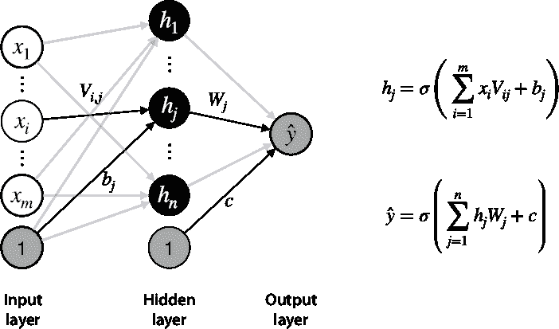

图 B.6 使用具有一个隐藏层和 sigmoid 激活函数的神经网络计算预测的过程

输出的计算方式如下两个方程：

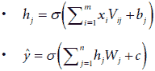

为了简化导数的计算，我们使用以下辅助变量 *r*[j] 和 *s*：

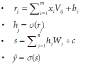

这样，我们可以计算以下偏导数（回忆一下 sigmoid 函数的导数是 *σ**'*(*x*) = *σ**'*(*x*)[1 – *σ*(*x*)]，以及 log 损失是 *L*(*y*, *ŷ*) = – *y ln*(*ŷ*) – (1 – *y*)*ln*(1 – *ŷ*)——为了方便起见，我们将其称为 *L*）：

1.  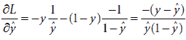

1.  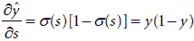

1.  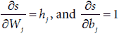

1.  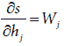

1.  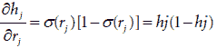

1.  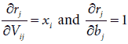

    为了简化我们的计算，请注意，如果我们乘以方程 1 和 2 并使用链式法则，我们得到

1.  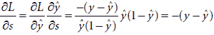

    现在，我们可以使用链式法则和方程 3–7 来计算关于权重和偏差的 log 损失的导数，如下所示：

1.  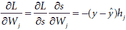

1.  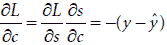

1.  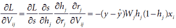

1.  

使用前面的方程，梯度下降步骤如下：

神经网络的梯度下降步骤：

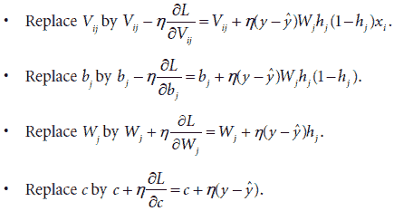

之前的方程相当复杂，即使是更多层的神经网络的反向传播方程也是如此。幸运的是，我们可以使用 PyTorch、TensorFlow 和 Keras 来训练神经网络，而无需计算所有导数。

## 使用梯度下降进行正则化

在第四章的“修改误差函数以解决我们的问题”部分，我们学习了正则化作为降低机器学习模型过拟合的一种方法。正则化包括向误差函数中添加一个正则化项，这有助于减少过拟合。这个项可以是模型中使用的多项式的 L1 或 L2 范数。在第十章的“训练神经网络的技巧”部分，我们学习了如何通过添加类似的正则化项来应用正则化以训练神经网络。后来，在第十一章的“距离误差函数”部分，我们学习了 SVM 的距离误差函数，这确保了分类器中的两条线彼此靠近。距离误差函数与 L2 正则化项具有相同的形式。

然而，在第四章的“直观地看待正则化”部分，我们学习了一种更直观的方式来理解正则化。简而言之，每个使用正则化的梯度下降步骤都会略微减少模型系数的值。让我们看看这一现象背后的数学原理。

对于具有权重 *w*[1]、*w*[2]、…、*w*[n] 的模型，正则化项如下：

+   L1 正则化：*W*[1] = |*w*[1]| + |*w*[2]| + … + |*w*[n]|

+   L2 正则化：*W*[2] = *w*[1]² + *w*[2]² + … + *w*[n]²

回想一下，为了不剧烈改变系数，正则化项乘以一个正则化参数 *l*。因此，当我们应用梯度下降时，系数的修改如下：

+   L1 正则化：*w*[i] 被替换为 *w*[i] – ∇ *W*[1]

+   L2 正则化：*w*[i] 被替换为 *w*[i] – ∇ *W*[2]

其中 ∇ 表示正则化项的梯度。换句话说，，. 由于 ，和 ，那么梯度下降步骤如下：

正则化的梯度下降步骤：

+   L1 正则化：将 *a*[i] 替换为 

+   L2 正则化：将 *a*[i] 替换为 

注意到这个梯度下降步骤总是减小系数 *a*[i] 的绝对值。在 L1 正则化中，如果 *a*[i] 是正的，我们从 *a*[i] 中减去一个小的值；如果它是负的，我们则加上一个小的值。在 L2 正则化中，我们将 *a*[i] 乘以一个略小于 1 的数。

## 卡在局部最小值上：它是如何发生的，以及我们如何解决它

如附录开头所述，梯度下降算法不一定能找到函数的最小值。例如，看看图 B.7。假设我们想使用梯度下降法找到图中函数的最小值。由于梯度下降的第一步是从一个随机点开始，我们将从标记为“起点”的点开始。

图 B.7 我们站在标记为“起点”的点。函数的最小值是标记为“最小值”的点。我们能否通过梯度下降法达到这个最小值？

图 B.8 展示了梯度下降算法寻找最小值将采取的路径。请注意，它成功地找到了离那个点最近的局部最小值，但它完全错过了右边的全局最小值。

图 B.8 很遗憾，梯度下降法并没有帮助我们找到这个函数的最小值。我们确实有所下降，但我们在局部最小值（山谷）处卡住了。我们该如何解决这个问题？

我们该如何解决这个问题？我们可以使用许多技术来解决这个问题，在本节中，我们学习一个常见的称为 *随机重启动* 的方法。解决方案是简单地多次运行算法，每次从一个不同的随机点开始，并选择找到的最小值。在图 B.9 中，我们使用随机重启动找到一个函数的全局最小值（请注意，这个函数仅在图中所示区间内定义，因此该区间内的最低值确实是全局最小值）。我们选择了三个随机起点，一个用圆圈表示，一个用正方形表示，一个用三角形表示。请注意，如果我们在这三个点上的每个点上使用梯度下降法，正方形设法找到了函数的全局最小值。

图 B.9 随机重启动技术的说明。该函数仅在这一点上定义，有三个山谷，全局最小值位于第二个山谷中。在这里，我们使用三个不同的起点运行梯度下降算法：圆圈、正方形和三角形。请注意，正方形设法找到了函数的全局最小值。

这种方法仍然不能保证找到全局最小值，因为我们可能运气不佳，只选取了那些陷入山谷中的点。然而，如果我们有足够的随机起始点，我们找到全局最小值的几率就会大大提高。即使我们无法找到全局最小值，我们也可能仍然能够找到一个足够好的局部最小值，这将有助于我们训练出一个好的模型。
