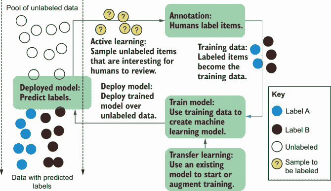
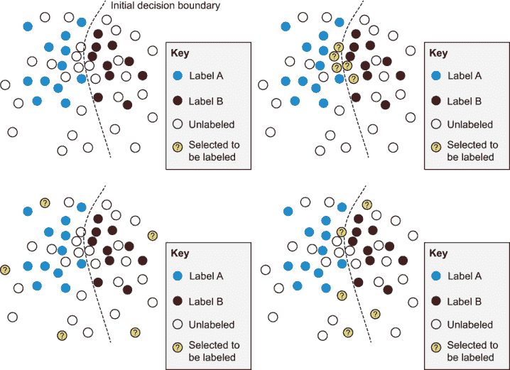
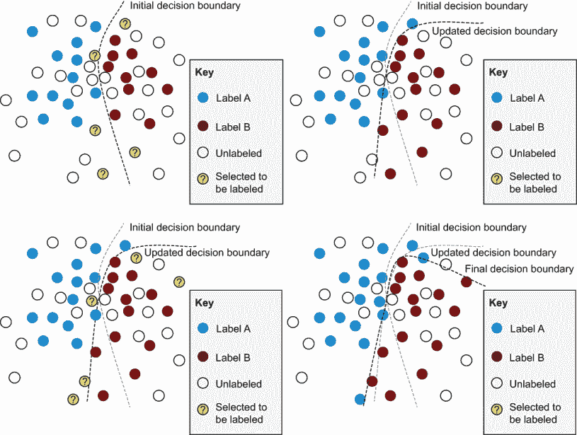
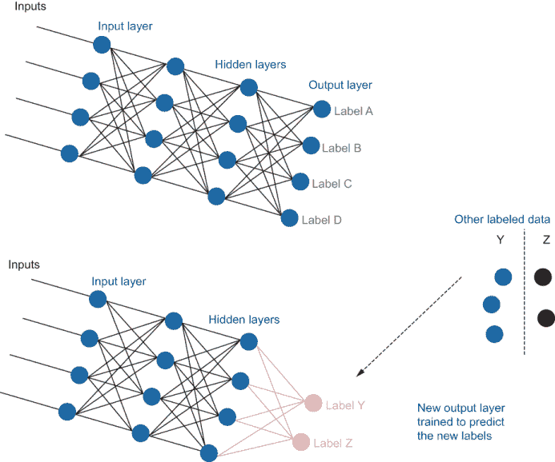
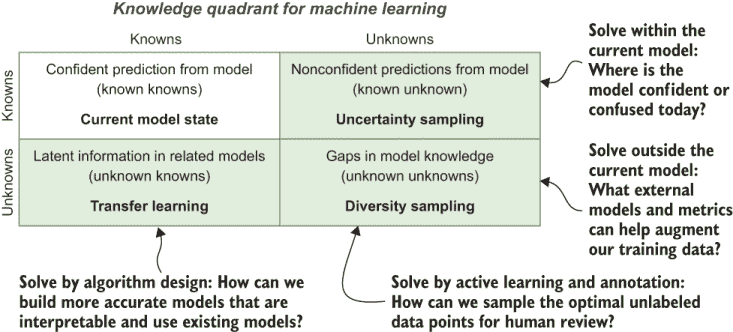

# 1 闭环机器学习简介

本章涵盖

+   将未标记数据标注以创建训练、验证和评估数据

+   抽取最重要的未标记数据项（主动学习）

+   将人机交互原则融入标注

+   实施迁移学习以利用现有模型中的信息

与电影中的机器人不同，今天的大多数人工智能（AI）无法自主学习；相反，它依赖于密集的人类反馈。今天大约 90%的机器学习应用都是由监督式机器学习驱动的。这个数字涵盖了广泛的使用案例。自动驾驶汽车可以安全地将你送下街道，因为人类已经花费数千小时告诉它当传感器看到行人、移动车辆、车道标记或其他相关物体时的情况。当你说出“调高音量”时，你的家庭设备知道该怎么做，因为人类已经花费数千小时告诉它如何解释不同的命令。而且，你的机器翻译服务可以翻译不同语言，因为它在数千（或可能数百万）个由人类翻译的文本上进行了训练。

与过去相比，我们的智能设备从程序员那里学习到的规则越来越少，更多地是从不需要编码的人类提供的示例和反馈中学习。这些由人类编码的示例——训练数据——被用来训练机器学习模型，并使它们在特定任务上更加准确。但程序员仍然需要创建允许非技术性人类提供反馈的软件，这提出了当今技术领域中的一个最重要问题：*人类和机器学习算法如何正确互动以解决问题*。阅读这本书后，你将能够为你在机器学习中可能遇到的大多数用途回答这个问题。

标注和主动学习是闭环机器学习的基础。它们规定了如何从人们那里获取训练数据，以及在你没有预算或时间对所有数据进行人类反馈时，如何确定正确的数据展示给人们。迁移学习使我们能够避免从头开始，而是将现有的机器学习模型适应到我们的新任务中。我们将在本章中介绍这些概念。

## 1.1 闭环机器学习的基本原则

*闭环* *机器学习* 是一套策略，用于在应用人工智能的应用中结合人类和机器智能。通常的目标是完成以下一项或多项：

+   提高机器学习模型的准确性。

+   更快地达到机器学习模型的准确度目标。

+   结合人类和机器智能以最大化准确性。

+   使用机器学习辅助人类任务以提高效率。

本书涵盖了最常见的主动学习和标注策略，以及如何为您的数据、任务和标注劳动力设计最佳界面。本书从简单的例子逐渐过渡到更复杂的例子，并编写成顺序阅读。然而，您不太可能同时应用所有这些技术，因此，本书也被设计成每个特定技术的参考。

图 1.1 展示了添加标签到数据的人机交互机器学习过程。这个过程可以是任何标注过程：将主题添加到新闻故事中，根据正在进行的运动对体育照片进行分类，识别社交媒体评论的情感，对视频内容是否露骨进行评分，等等。在所有情况下，您都可以使用机器学习来自动化标注过程的一部分或加快人工过程。在所有情况下，使用最佳实践意味着实施图 1.1 中所示的循环：采样正确的数据进行标注，使用这些数据来训练模型，并使用该模型来采样更多数据进行标注。

图 1.1 人机交互过程中预测数据标签的心理模型

在某些情况下，您可能只需要一些技术。例如，如果您有一个在机器学习模型不确定时退回到人类的系统，您就会查看关于不确定性采样、标注质量和界面设计的相关章节和部分。即使您没有完成“循环”，这些主题仍然代表了本书的大部分内容。

本书假设您对机器学习有一定的了解。一些概念对于人机交互系统尤为重要，包括对 softmax 及其局限性的深入理解。您还需要知道如何使用考虑模型置信度的指标来计算准确率，计算调整后的准确率，以及从人类视角衡量机器学习的性能。（附录中包含这些知识的总结。）

## 1.2 介绍标注

*标注*是将原始数据进行标记的过程，使其成为机器学习的训练数据。大多数数据科学家都会告诉你，他们花费在数据集整理和标注上的时间比构建机器学习模型的时间要多得多。人类标注的质量控制依赖于比大多数机器学习模型更复杂的统计方法，因此，花时间学习如何创建高质量的训练数据是非常重要的。

### 1.2.1 简单和更复杂的标注策略

标注过程可以很简单。例如，如果您想对关于产品的社交媒体帖子进行标注，以分析该产品情绪趋势的广泛趋势，您可以在几小时内构建并部署一个 HTML 表单。一个简单的 HTML 表单可以允许某人根据情绪选项对每条社交媒体帖子进行评分，每个评分将成为您训练数据中社交媒体帖子的标签。

标注过程也可以很复杂。例如，如果您想对视频中的每个对象进行标注并绘制边界框，简单的 HTML 表单就不够了；您需要一个允许标注者绘制这些框的图形界面，而良好的用户体验可能需要数月的工程时间来构建。

### 1.2.2 填补数据科学知识空白

您的机器学习算法策略和数据标注策略可以同时优化。这两种策略紧密相连，如果您采用综合方法，您将更快地从模型中获得更高的准确度。算法和标注是优秀机器学习同等重要的组成部分。

所有计算机科学系都提供机器学习课程，但很少有课程教授如何创建训练数据。在最多的情况下，您可能只能在六门课程中的数百个机器学习讲座中找到一两个关于创建训练数据的讲座。这种情况正在改变，但进展缓慢。由于历史原因，学术机器学习研究人员倾向于保持数据集不变，并仅从不同算法的角度评估他们的研究。

与学术机器学习相比，在工业界，通过标注更多训练数据来提高模型性能更为常见。尤其是在数据性质随时间变化（这也是很常见的情况）时，使用少量新的标注可能比尝试将现有模型适应新的数据领域更有效。但相比之下，更多的学术论文关注的是如何在没有新训练数据的情况下将算法适应新领域，而不是如何高效地标注正确的新训练数据。

由于学术界存在这种不平衡，我经常看到工业界的人犯同样的错误。他们雇佣了一打了解如何构建最先进算法的聪明博士，但他们没有创建训练数据或考虑标注正确接口的经验。我最近在世界最大的汽车制造商之一看到了这种情况。公司雇佣了大量最近毕业的机器学习毕业生，但由于新员工无法扩展他们的数据标注策略，公司无法实施其自动驾驶汽车技术。公司最终解雇了整个团队。在事件发生后，我建议公司如何通过将算法和标注作为优秀机器学习同等重要、相互交织的组成部分来重建其策略。

### 1.2.3 质量人工标注：为什么很难？

对于那些研究它的人来说，标注是一门与机器学习紧密相关的科学。最明显的例子是，提供标签的人类可能会犯错误，克服这些错误需要惊人的复杂统计。

训练数据中的人类错误可能重要或不重要，这取决于用例。如果一个机器学习模型仅用于识别消费者情绪的广泛趋势，那么从 1%的糟糕训练数据中传播的错误可能无关紧要。但如果一个驱动自动驾驶车辆的算法由于从糟糕的训练数据中传播的错误而没有看到 1%的行人，结果将是灾难性的。一些算法可以处理训练数据中的一些噪声，随机噪声甚至有助于某些算法通过避免过拟合而变得更加准确。但人类错误往往不是随机噪声；因此，它们往往会向训练数据中引入不可恢复的偏差。没有任何算法能够从真正糟糕的训练数据中幸存。

对于简单的任务，例如在客观任务上的二进制标签，当不同的标注者意见不一致时，统计数据对于决定哪个标签是正确的相当直接。但对于主观任务，或者甚至具有连续数据的客观任务，不存在简单的启发式方法来决定正确的标签。想想通过在自动驾驶汽车识别到的每个行人周围放置边界框来创建训练数据的这项关键任务。如果两个标注者的边界框略有不同怎么办？哪个框是正确的？答案并不一定是任何一个框或者是两个框的平均值。实际上，聚合这两个框的最佳方式是使用机器学习。

确保质量标注的最佳方法之一是确保有合适的人来做这些标注。本书的第七章致力于寻找、培训和管理工作最佳的标注者。关于合适的劳动力与合适技术的结合的重要性，请参阅以下侧边栏。

人类洞察力和可扩展的机器学习等于生产型人工智能

*由 Radha Ramaswami Basu 提供的专家轶事*

人工智能的结果高度依赖于输入其内的训练数据的质量。一个小小的用户界面改进，比如一个魔法棒来选择图像中的区域，当应用于数百万数据点并配合良好的质量控制流程时，可以实现巨大的效率提升。一支先进的工作队伍是关键因素：培训和专业化提高质量，专家工作队伍的见解可以与领域专家一起指导模型设计。最佳模型是由机器和人类智能之间建设性、持续的合作创造的。

我们最近承接了一个项目，需要对机器人冠状动脉旁路移植术（CABG）视频中各种解剖结构的像素级标注。我们的标注团队并非解剖学或生理学专家，因此我们实施了临床知识教学课程，由一位受过培训的外科医生领导的解决方案架构师来增强现有的 3D 空间推理和精确标注的核心技能。对我们客户的结果是成功的培训和评估数据。对我们来说，结果是看到来自资源不足背景的人们在动画讨论中迅速成为医学图像分析最重要步骤之一的专家。

*拉达·巴苏是 iMerit 的创始人兼首席执行官。iMerit 利用技术和由 50%来自弱势社区的女性和青年组成的 AI 劳动力，为全球客户提供高级技术工作者。拉达之前在惠普工作，作为首席执行官将 Supportsoft 上市，并在圣克拉拉大学创立了节俭创新实验室*。

## 1.3 介绍主动学习：提高训练数据的速度和降低成本

监督学习模型几乎总是随着标注数据的增加而变得更加准确。*主动学习*是决定哪些数据用于人工标注的过程。没有一种算法、架构或参数集能在所有情况下使机器学习模型更准确，也没有一种主动学习的策略在所有用例和数据集中都是最优的。然而，你应该首先尝试某些方法，因为它们更有可能适用于你的数据和任务。

大多数关于主动学习的研究论文都关注训练项的数量，但在许多情况下，速度可能是一个更重要的因素。例如，在灾害响应中，我经常部署机器学习模型从新兴灾害中过滤和提取信息。任何灾害响应的延误都可能至关重要，因此快速获得可用的模型比需要输入模型中的标签数量更重要。

### 1.3.1 三种广泛的主动学习抽样策略：不确定性、多样性和随机

存在许多主动学习策略，但在大多数情况下，三种基本方法都适用：不确定性、多样性和随机抽样。这三种方法的组合几乎总是应该从起点开始。

随机抽样听起来最简单，但可能最难。如果你的数据预先过滤，或者数据随时间变化，或者你知道由于其他原因，随机样本不能代表你正在解决的问题，那么什么是随机呢？这些问题将在以下章节中更详细地讨论。无论策略如何，你都应该始终标注一定量的随机数据，以评估你模型的准确性，并将你的主动学习策略与随机选择的项目基线进行比较。

在文献中，不确定性和多样性采样有不同的名称。它们通常被称为 *利用* 和 *探索*，这两个名字听起来巧妙且押韵，但并不十分透明。

*不确定性采样* 是一组用于识别当前机器学习模型中接近决策边界的未标记项目的策略。如果你有一个二元分类任务，这些项目将有接近 50%的概率属于任一标签；因此，模型被称为不确定或困惑。这些项目最有可能被错误分类，因此它们最有可能导致与预测标签不同的标签，在它们被添加到训练数据中并重新训练模型后，移动决策边界。

*多样性采样* 是一组用于识别当前机器学习模型中未充分代表或未知的项目策略。这些项目可能具有在训练数据中罕见的特征，或者它们可能代表当前在模型中未充分代表的真实世界人口统计特征。在任何情况下，当模型应用时，结果都可能表现不佳或参差不齐，尤其是在数据随时间变化的情况下。多样性采样的目标是针对新的、不寻常的或未充分代表的项目进行标注，以便为机器学习算法提供一个更完整的对问题空间的了解。

虽然术语 *不确定性采样* 被广泛使用，但 *多样性采样* 在不同领域有不同的名称，例如代表性采样、分层采样、异常检测和异常检测。对于某些用例，例如在天文数据库中识别新现象或检测异常网络活动以进行安全监控，任务的目标是识别异常或异常值，但我们可以将它们适应为主动学习的采样策略。

不确定性采样和多样性采样在单独使用时存在缺点（图 1.2）。不确定性采样可能专注于决策边界的一部分，例如，而多样性采样可能专注于远离边界的异常值。因此，这些策略通常一起使用，以找到最大化不确定性和多样性的未标记项目选择。

图 1.2 不同主动学习策略的优缺点。左上角：机器学习算法在项目之间的决策边界，其中一些项目被标记为 A，一些被标记为 B。右上角：不确定性采样的一个可能结果。这种主动学习策略对于选择决策边界附近的无标签项目是有效的。这些项目最有可能被错误预测，因此，最有可能获得一个能够移动决策边界的标签。然而，如果所有的不确定性都集中在问题空间的一个部分，那么对这些项目进行标记将不会对模型产生广泛的影响。左下角：多样性采样的一个可能结果。这种主动学习策略对于选择问题空间不同部分的无标签项目是有效的。然而，如果多样性远离决策边界，那么这些项目不太可能被错误预测，因此，当人类给他们分配与模型预测相同的标签时，它们对模型的影响不会很大。右下角：结合不确定性采样和多样性采样的一个可能结果。当策略结合时，会选择靠近决策边界不同部分的项目。因此，我们正在优化找到可能导致决策边界变化的项目的机会。

需要注意的是，主动学习过程是迭代的。在主动学习的每一次迭代中，都会识别出一组项目并为其分配一个新的由人类生成的新标签。然后，使用新项目重新训练模型，并重复此过程。图 1.3 展示了选择和标注新项目的两个迭代过程，导致边界发生变化。

图 1.3 迭代主动学习过程。*从左上角到底右角*：两次主动学习的迭代。在每次迭代中，都会选择沿着边界进行多样化的选择，这反过来又会在重新训练后导致边界移动，从而得到一个更准确的机器学习模型。理想情况下，我们请求人类为我们的主动学习策略中所需的最少项目数量提供标签。这个请求加快了获得准确模型的时间，并减少了整体的人工标注成本。

迭代周期本身可以是一种多样性采样。想象一下，你只使用了不确定性采样，并在一个迭代中只从问题空间的一个部分进行采样。你可能会解决该部分问题空间中的所有不确定性；因此，下一个迭代将集中在其他地方。经过足够的迭代，你可能根本不需要多样性采样。不确定性采样的每次迭代都会关注问题空间的不同部分，并且迭代在一起，足以获得用于训练的项目多样样本。

正确实施主动学习具有这种自我纠正功能：每次迭代都会找到最适合人工标注的数据的新方面。然而，如果你的数据空间中某些部分本质上是模糊的，每次迭代可能会不断地把你带回到问题空间中具有那些模糊项目的同一部分。因此，通常明智的做法是考虑不确定性和多样性采样策略，以确保你不会将所有的标注努力都集中在模型可能无法解决的问题空间的一部分。

图 1.2 和图 1.3 为你提供了关于主动学习过程的良好直观理解。正如任何处理过高维或序列数据的人都知道，从边界或多样性中识别距离并不总是直接的。至少，这个过程比图 1.2 和图 1.3 中的简单欧几里得距离要复杂。但同样的思想仍然适用：我们试图尽可能快地达到一个准确模型，同时尽可能少地使用人工标签。

迭代次数和每次迭代中需要标注的项目数量取决于任务。当你从事自适应机器+人工翻译工作时，一个翻译过的句子就足以作为训练数据，要求模型更新，理想情况下在几秒钟内完成。从用户体验的角度来看，这一点很容易理解。如果人工翻译者纠正了某些单词的机器预测，但机器没有快速适应，人工翻译者可能需要（重新）纠正那个机器输出数百次。当你翻译高度上下文相关的单词时，这个问题很常见。例如，你可能想在新闻文章中直译一个人的名字，但在一部虚构作品中将其翻译成本地化名字。如果软件在人工纠正后不久就重复同样的错误，用户体验将会很糟糕，因为我们期望近期性有助于适应。

在技术层面上，当然，快速适应模型要困难得多。以大型机器翻译模型为例。目前，训练这些模型需要一周或更长时间。根据翻译者的经验，能够快速适应的软件系统正在采用持续学习。在我所工作的多数用例中，例如识别社交媒体评论中的情感，我只需要大约每月迭代一次来适应新的数据。尽管目前很少有应用具有实时自适应机器学习，但越来越多的应用正在朝这个方向发展。

### 1.3.2 什么是评估数据的随机选择？

虽然容易*说*你应该始终在保留数据的随机样本上进行评估，但在实际操作中，确保你有一个真正随机的数据样本通常并不容易。如果你通过关键词、时间或其他因素预先过滤了你正在处理的数据，你已经有一个非代表性的样本。该样本的准确率并不一定能够表明你的模型部署的数据上的准确率。

我看到人们使用广为人知的 ImageNet 数据集，并将机器学习模型应用于大量数据。标准的 ImageNet 数据集有 1,000 个标签，每个标签描述了该图像的类别，例如“篮球”、“出租车”或“游泳”。ImageNet 挑战赛评估了该数据集的保留数据，系统在该数据集内达到了接近人类水平的准确率。然而，如果你将这些相同的模型应用于社交媒体平台上发布的随机选择图像，准确率会立即下降到大约 10%。

在大多数机器学习的应用中，数据也会随时间而变化。如果你处理的是语言数据，人们讨论的话题会随时间变化，语言本身也会创新和演变。如果你处理的是计算机视觉数据，你遇到的物体类型也会随时间变化。同样重要的是，图像本身也会根据相机技术的进步和变化而变化。

如果你不能定义一个有意义的随机评估数据集，你应该尝试定义一个*代表性*的评估数据集。如果你定义了一个代表性数据集，你是在承认对于你的数据集来说，真正随机的样本是不可能的或不具有意义的。根据你如何应用数据，你需要自己定义什么是有代表性的。你可能想要为每个你关心的标签选择数据点，从每个时间段选择一定数量的数据点，或者从聚类算法的输出中选择一定数量的数据点以确保多样性。（我在第四章中更详细地讨论了这一主题。）

你可能还希望拥有多个通过不同标准编制的评估数据集。一个常见的策略是有一个数据集是从与训练数据相同的数据中抽取的，并且至少有一个来自不同来源的域外评估数据集。域外数据集通常来自不同类型的媒体或不同时间段。例如，如果一个自然语言处理（NLP）任务的所有训练数据都来自历史新闻文章，那么域外数据集可能来自最近的社会媒体数据。对于大多数实际应用，你应该使用域外评估数据集，这是衡量你的模型真正泛化到问题并不仅仅是过度拟合特定数据集的特性的最佳指标。然而，这种做法在主动学习时可能会很棘手，因为一旦开始标注这些数据，它们就不再是域外的了。如果这样做是可行的，我建议你保留一个不应用主动学习的域外数据集。这样，你可以看到你的主动学习策略在泛化问题时表现如何，而不仅仅是适应和过度拟合它遇到的领域。

### 1.3.3 何时使用主动学习

当你只能标注你数据的一小部分，并且随机抽样无法覆盖数据的多样性时，你应该使用主动学习。这个建议涵盖了大多数实际场景，因为数据的规模在许多用例中成为一个重要的因素。

一个很好的例子是视频中存在的数据量。例如，在视频的每一帧中为每个对象画一个边界框，这将非常耗时。假设这个视频是关于在街道上行驶的自动驾驶汽车，你关心大约 20 个对象（汽车、行人、标志等）。每秒 30 帧，那么就是 30 帧 * 60 秒 * 20 对象，所以你需要为 1 分钟的数据创建**36,000**个框！即使是速度最快的人类标注员也需要至少 12 小时来标注 1 分钟的数据。

如果我们计算一下，我们会看到这个问题有多么难以处理。在美国，人们平均每天开车 1 小时，这意味着美国人每年开车 95,104,400,000 小时。很快，每辆车都将配备前视摄像头来辅助驾驶。所以，仅在美国一年的驾驶时间就需要 60,000,000,000（60 万亿）小时来标注。地球上的人不足以标注今天美国驾驶员的视频，即使全世界的人除了标注数据外什么都不做，只是为了使美国驾驶员更安全。

因此，任何在自动驾驶汽车公司工作的数据科学家都需要回答关于标注过程的各种问题。视频中的每**n**帧是否都合适？我们能否采样视频，这样我们就不需要标注所有视频？有没有设计标注界面的方法来加速这个过程？

标注的不可行性在大多数情况下都是真实的。将需要标注的数据量将超过预算或时间，将每个数据点展示给人类。这可能是最初使用机器学习的原因。如果您有预算和时间手动标注所有数据点，那么您可能不需要自动化这项任务。

并非在所有情况下都需要主动学习，尽管人机交互学习策略可能仍然相关。在某些情况下，法律要求对每个数据点进行标注，例如法院命令审计，要求人类检查公司内的每一条通信以寻找潜在的欺诈。尽管人类最终需要查看每个数据点，但主动学习可以帮助他们更快地找到欺诈示例并确定最佳用户界面。它还可以识别人类标注中的潜在错误。实际上，这就是今天许多审计是如何进行的。

还有一些狭窄的用例，在这些用例中，您几乎肯定不需要主动学习。例如，如果您在工厂中监控具有一致照明的设备，那么应该很容易实现一个计算机视觉模型，从机器上的灯光或开关确定给定的机械设备是开启还是关闭。由于机械设备、照明、摄像头等不会随时间变化，您可能不需要在模型构建后使用主动学习来持续获取训练数据。然而，这些用例很少见。我在工业界遇到的用例中，不到 1%的用例不需要更多训练数据。

类似地，可能存在一些用例，其中您的基线模型对于您的业务用例来说足够准确，或者更多训练数据的成本超过了更准确模型可能带来的任何价值。这个标准也可能是主动学习迭代的停止点。

## 1.4 机器学习和人机交互

几十年来，许多聪明的人未能借助机器翻译使人类翻译更快、更准确。显然，应该有可能结合人类翻译和机器翻译。然而，当人类翻译需要从机器翻译输出中纠正一句话中的一个或两个错误时，翻译者重新从零开始键入整个句子会更快。在翻译时使用机器翻译句子作为参考对速度的影响很小，除非人类翻译者格外小心，否则他们最终会延续机器翻译中的错误，使他们的翻译不够准确。

这个问题的最终解决方案不在于机器翻译算法的准确性，而在于用户界面。现代翻译系统不再要求人类翻译员重新输入整个句子，而是允许他们使用在手机上（以及越来越多地）在电子邮件和文档编辑工具中常见的预测文本功能。人类翻译员像以前一样输入翻译内容，通过按下 Enter 或 Tab 键接受预测翻译中的下一个单词，每次机器翻译预测正确时都会提高他们的整体速度。因此，最大的突破在于人机交互，而不是底层机器学习算法。

人机交互是计算机科学中的一个成熟领域，最近它对于机器学习变得尤为重要。当你为人类创建用于生成训练数据的界面时，你正在利用一个位于认知科学、社会科学、心理学、用户体验设计以及其他几个领域交叉点的领域。

### 1.4.1 用户界面：你如何创建训练数据？

通常，一个简单的网页表单就足以收集训练数据。与网页表单交互背后的人机交互原则同样简单：人们因为整天都能看到它们，所以习惯了网页表单。表单直观，因为许多聪明的人对 HTML 表单进行了工作并进行了优化。你正在利用这些约定：人们知道简单的 HTML 表单是如何工作的，因此你不需要对他们进行教育。另一方面，打破这些约定可能会让人困惑，因此你被限制在预期的行为上。你可能有一些想法，认为动态文本可以加快某些任务，但这个约定可能会比它帮助的人更多。

最简单的界面——二元响应——也是质量控制的最佳选择。如果你能将你的注释项目简化或分解为二元任务，那么设计直观界面和实现第八章至第十一章中涵盖的注释质量控制功能就会容易得多。

当你处理更复杂的界面时，约定也变得更加复杂。想象一下，你要求人们在一个图像中围绕某些对象绘制多边形，这是自动驾驶汽车公司常用的用例。注释者会期待哪些方式？他们会期待自由手绘、线条、画笔、通过颜色/区域进行智能选择，或其他选择工具吗？如果人们习惯于在 Adobe Photoshop 等程序中处理图像，他们可能会在注释图像时期待相同的功能。就像你在构建和受限于人们对网页表单的期望一样，你也在受限于他们对选择和编辑图像的期望。不幸的是，如果你提供功能齐全的界面，这些期望可能需要数百小时的编码才能实现。

对于任何从事重复性任务，如创建训练数据的人来说，移动鼠标效率低下，如果可能的话应该避免。如果整个注释过程都可以在键盘上完成，包括注释本身以及任何表单提交或导航，注释者的节奏将大大提高。如果你必须包括鼠标，你应该获得丰富的注释来弥补较慢的输入。

一些注释任务有专门的输入设备。将语音转录成文字的人通常使用脚踏板在音频录音中前后导航。这个过程允许他们将双手放在键盘上。用脚导航录音比用鼠标导航录音要高效得多。

除了转录等例外，键盘仍然是王者。大多数注释任务没有像转录那样流行了很长时间，因此没有发展出专门的输入设备。对于大多数任务来说，在笔记本电脑或 PC 上使用键盘比在平板电脑或手机屏幕上使用键盘要快。在保持眼睛关注输入的同时在平坦表面上打字并不容易，所以除非任务是一个简单的二元选择任务或类似的东西，否则手机和平板电脑不适合进行大量数据注释。

### 1.4.2 前置条件：什么可以影响人类的感知？

为了获得准确的学习数据，你必须考虑到人类注释者的注意力集中、注意力持续时间和可能使他们犯错误或改变行为的情境效应。考虑一个来自语言学研究的绝佳例子。在一项名为“填充玩具与语音感知”的研究中（[`doi.org/10.1515/ling.2010.027`](https://doi.org/10.1515/ling.2010.027)），研究人员要求参与者区分澳大利亚和新西兰口音。研究人员在参与者进行研究的房间里的架子上放置了一只填充玩具几维鸟或袋鼠（这些是那些国家的标志性动物）。进行研究的负责人没有向参与者提及这个填充玩具；玩具只是放在背景中。令人难以置信的是，当几维鸟在场时，人们认为口音听起来更像新西兰，而当袋鼠在场时，口音听起来更像澳大利亚。鉴于这一事实，很容易想象，如果你正在构建一个用于检测口音的机器学习模型（也许你正在开发一个希望尽可能在多种口音下工作的智能家居设备），在收集训练数据时需要考虑情境。

当上下文或事件序列可以影响人类感知时，这种现象被称为**启动效应**。在创建训练数据时最重要的类型是**重复启动效应**，它发生在任务序列可以影响某人感知的情况下。例如，如果一个注释者正在为社交媒体帖子进行情感标注，并且他们连续遇到 99 条负面情感帖子，那么他们更有可能在第一百条帖子实际上是正面时将其错误地标注为负面。帖子可能是固有的模糊（例如讽刺）或注释者在重复工作中注意力下降所造成的简单错误。在第十一章中，我讨论了需要控制的各种启动效应类型。

### 1.4.3 通过评估机器学习预测创建标签的优缺点

将机器学习和确保质量注释相结合的一种方法是通过使用简单的二进制输入表来让人们评估模型预测并确认或拒绝该预测。这种方法可以将更复杂的任务转化为二进制注释任务。你可以问某人围绕一个对象的边界框是否正确，这是一个简单的二进制问题，不涉及复杂的编辑/选择界面。同样，询问注释者某个词是否是一段文本中的位置比提供一个界面来有效地注释自由文本中的位置短语要容易得多。

然而，当你这样做的时候，你可能会专注于局部模型的不确定性，而错过问题空间的重要部分。尽管你可以通过让人类评估机器学习模型的预测来简化界面和注释准确度评估，但你仍然需要一个多样性策略来进行采样，即使这个策略仅仅是确保随机选择的项目也是可用的。

### 1.4.4 设计注释界面的基本原则

基于我到目前为止所涵盖的内容，以下是一些设计注释界面的基本原则。我将在整本书中详细介绍这些原则：

+   尽可能将问题表述为二进制选择。

+   确保预期的响应多样化，以避免启动效应。

+   使用现有的交互约定。

+   允许键盘驱动响应。

## 1.5 机器学习辅助人类与人类辅助机器学习

环境中的人类机器学习可以有两个不同的目标：通过人类输入使机器学习应用更准确，以及通过机器学习的辅助来提高人类任务。这两个目标有时会结合在一起，机器翻译就是一个很好的例子。通过使用机器翻译来建议单词或短语，人类可以选择接受或拒绝，就像你在打字时你的智能手机预测下一个单词一样，这样可以使人类翻译更快。这项任务是一个机器学习辅助的人类处理任务。我还与那些在人类翻译过于昂贵时使用机器翻译的客户合作过。由于人类翻译和机器翻译的数据内容相似，机器翻译系统随着时间的推移从人类翻译的数据中变得更加准确。这些系统正在实现两个目标，使人类更有效率，使机器更准确。

搜索引擎是另一个人类在环机器学习的绝佳例子。人们常常忘记，尽管搜索引擎在通用搜索和特定用例（如电子商务和导航（在线地图））中无处不在，但它们仍然是一种人工智能形式。例如，当你在线搜索页面并点击出现的第四个链接而不是第一个链接时，你可能在训练那个搜索引擎（信息检索系统），使其第四个链接可能成为你搜索查询的更好顶部响应。有一种普遍的误解，即搜索引擎只根据最终用户的反馈进行训练。实际上，所有主要的搜索引擎都雇佣了成千上万的注释员来评估和调整他们的搜索引擎。评估搜索相关性是机器学习中人类注释的最大用例。尽管最近计算机视觉用例（如自动驾驶汽车）和语音用例（如家庭设备和智能手机）的流行有所上升，但搜索相关性仍然是专业人类注释的最大用例。

尽管乍一看它们可能有所不同，但大多数环境中的人类机器学习任务都包含机器学习辅助人类和人类辅助机器学习的元素，因此你需要为两者都进行设计。

## 1.6 转移学习以启动你的模型

在大多数情况下，你不需要从头开始构建你的训练数据。通常，现有的数据集接近你所需的内容。例如，如果你正在创建用于电影评论的情感分析模型，你可能有一个从产品评论开始的情感分析数据集，然后你可以将其适应到你的用例中。这个过程——从一个用例中提取模型并将其适应到另一个用例中——被称为迁移学习。

最近，将通用预训练模型适应新的、特定的用例的流行度大幅增加。换句话说，人们正在构建模型，*专门*用于在许多用例中进行迁移学习。这些模型通常被称为*预训练*模型。

历史上，迁移学习涉及将一个过程的输出输入到另一个过程中。在自然语言处理（NLP）中的一个例子可能是

通用词性标注器 > 语法解析器 > 情感分析标注器

今天，迁移学习通常意味着

重新训练神经网络模型的一部分以适应新的任务（预训练模型）或使用一个神经模型的参数作为另一个模型的输入

图 1.4 展示了迁移学习的一个例子。一个模型可以在一组标签上训练，然后通过保持相同的架构并冻结模型的一部分（在这种情况下仅重新训练最后一层）来在另一组标签上重新训练。

图 1.4 迁移学习的一个例子。构建了一个模型来预测标签为“A”、“B”、“C”或“D”。通过重新训练模型的最后一层，并且使用比从头开始训练模型时少得多的人工标注项，模型能够预测标签“Y”和“Z”。

### 1.6.1 计算机视觉中的迁移学习

迁移学习在计算机视觉领域最近取得了最大的进展。一种流行的策略是从 ImageNet 数据集开始，构建一个模型，从数百万个示例中分类 1,000 个标签：运动、鸟类、人造物体等等。

为了学习分类不同类型的运动、动物和物体，机器学习模型正在学习区分图像中 1,000 种物品所需的纹理和边缘类型。许多这些纹理和边缘比 1,000 个标签更通用，可以在其他地方使用。因为所有这些纹理和边缘都是在网络的中间层中学习的，所以你只需要在新的标签集上重新训练最后一层。你可能只需要几百个或几千个示例，而不是数百万个，因为你已经从数百万张图像中提取了纹理和边缘。当人们用少量数据重新训练最终层到新的标签时，ImageNet 取得了很高的成功，包括生物中的细胞和卫星视图中的地理特征等物体。

也可能重新训练除最后一层之外的其他几层，并从你正在迁移的模型中添加更多层。迁移学习可以与许多架构和参数一起使用，以适应新的用例，但目标仍然是限制构建新数据集上准确模型所需的人工标注数量。

到目前为止，计算机视觉在超越图像标注方面还不太成功。对于检测图像中物体等任务，很难创建能够从一个物体类型适应到另一个物体类型的迁移学习系统。问题在于物体被检测为边缘和纹理的集合，而不是整体物体。然而，许多人正在研究这个问题，因此毫无疑问，突破将会发生。

### 1.6.2 NLP 中的迁移学习

对于 NLP 来说，对预训练模型的推动甚至比计算机视觉还要晚。这种形式的迁移学习在过去两三年内才在 NLP 中变得流行，因此它是本文中涵盖的最前沿技术之一，但它也可能很快过时。

类似于 ImageNet 的适应方法对语言数据不起作用。将一个情感分析数据集的迁移学习应用到另一个情感分析数据集上，只能提供大约 ~2–3% 的准确率提升。预测文档级标签的模型没有像等价的计算机视觉模型那样捕捉到人类语言的广度。但通过观察它们经常出现的上下文，你可以学习到单词的有趣属性。例如，*doctor* 和 *surgeon* 可能会在相似的环境中出现。假设你找到了任何英语单词出现的 10,000 个上下文，查看其前后单词集合。你可以看到单词 *doctor* 在这 10,000 个上下文中出现的可能性。其中一些上下文将与医学相关，因此 *doctor* 在这些上下文中的得分会很高。但大多数 10,000 个上下文不会与医学相关，因此 *doctor* 在这些上下文中的得分会很低。你可以将这些 10,000 个得分视为一个 10,000 维的向量。单词 *surgeon* 很可能有一个与 *doctor* 类似的向量，因为它经常出现在相同的环境中。

通过上下文理解单词的概念很古老，构成了语言学功能理论的基石：

*通过它所伴随的词语来认识一个单词（Firth, J. R. 1957:11)*。

严格来说，我们需要深入到单词层面才能获取最重要的信息。英语是一个例外，因为单词往往对机器学习来说是非常好的原子单位。英语允许有复杂的单词，例如 *un-do-ing*，很明显我们为什么想要解释其单独的部分（词素），但英语这样做比典型语言要少得多。英语用词序表达的内容，比如主语-谓语-宾语，更频繁地用英语限制的词缀来表达，比如现在时和过去时以及单复数区别。因此，对于不偏向于像英语这样的特权语言的机器学习任务，我们需要对子词进行建模。

费尔思会欣赏这个事实。他创立了英格兰第一个语言学系，我在那里工作了两年，帮助记录和保护濒危语言。在那里的时候，很明显，语言的全部多样性意味着我们需要比仅仅词语更精细的特征。如果我们想要将世界的机器学习能力适应尽可能多的 7,000 种世界语言，那么需要人参与的机器学习方法就是必要的。

当迁移学习最近取得突破时，它遵循了在上下文中理解词语（或词语片段）的原则。如果我们能从上下文中预测词语，我们就可以免费为我们的模型获得数百万个标签：

*我的 ___ 很可爱。他 ___ play-ing*

不需要人工标注。我们可以从原始文本中移除一部分词语，然后将剩余的文本转化为一个预测性机器学习任务。正如你可以猜到的，第一个空缺的词可能是 *狗*、*小狗* 或 *小猫*，而第二个空缺的词很可能是 *是* 或 *曾经是*。就像 *外科医生* 和 *医生* 一样，我们可以根据上下文预测词语。

与早期迁移学习从一种情感类型到另一种情感类型失败的例子不同，这类预训练模型已经取得了广泛的成功。通过仅对预测上下文中词语的模型进行少量调整，就有可能构建具有最先进技术的系统，这些系统只需要少量的人工标注来完成语言任务，如问答、情感分析和文本蕴涵。与计算机视觉不同，迁移学习正在迅速成为复杂 NLP 任务（如摘要和翻译）的普遍方法。

预训练的模型并不复杂。目前最复杂的模型是训练来预测上下文中的一个词，句子中词语的顺序，以及句子之间的顺序。从这个数据中固有的三种预测类型的基础模型，我们可以构建几乎任何具有先发优势的 NLP 应用场景。因为词语顺序和句子顺序是文档的固有属性，预训练的模型不需要人工标注。它们仍然像监督机器学习任务一样构建，但训练数据是免费生成的。模型可能需要预测数据中每十个被移除的词中的一个，并预测在源文档中某些句子是否依次出现，在你需要为任务添加人工标注之前，提供强大的先发优势。

然而，预训练模型受可用未标记文本数量的限制。即使考虑不同语言的总体频率，英语中的未标记文本也比其他语言多得多。也会有文化偏见。例如，“我的狗很可爱”这句话在在线文本中可能经常出现，这是预训练模型的主要数据来源。但并非每个人都有宠物狗。当我短暂生活在亚马逊研究马赛语时，猴子是受欢迎的宠物。英语短语“我的猴子很可爱”很少在网上出现，马赛语的对应短语“Chuna bëdambo ikek”则根本不存在。预训练系统中的词向量以及上下文模型确实允许一个词表达多个含义，因此它们可以捕捉到这个上下文中的“狗”和“猴子”，但它们仍然偏向于它们训练的数据，并且“猴子”的上下文在任何语言中都不太可能大量出现。我们需要意识到预训练系统可能会放大文化偏见。

预训练模型仍然需要额外的手工标注才能在其任务中实现准确的结果，因此转移学习并没有改变我们用于人机交互机器学习的一般架构。然而，它可以给我们一个实质性的起点，在标注方面，这可能影响我们选择用于采样额外数据项以供人工标注的主动学习策略，甚至影响人类提供标注的界面。

转移学习也是第五章中讨论的一些高级主动学习策略和第九章中高级数据标注和增强策略的基础。

## 1.7 本文中可以期待的内容

要思考文本各部分如何相互关联，可以将主题视为知识四象限（图 1.5）。

图 1.5 展示了机器学习知识四象限，涵盖了本书中的主题，并以您机器学习模型已知和未知的内容来表述。

四个象限是：

+   *已知已知*——您机器学习模型今天可以自信且准确地执行的内容。这个象限是您模型当前的状态。

+   *已知未知*——您机器学习模型今天无法自信执行的内容。您可以对这些项目应用不确定性采样。

+   *已知未知*——预训练模型中可以适应您任务的已知知识。转移学习允许您使用这些知识。

+   *未知未知*——您机器学习模型中的差距。您可以对这些项目应用多样性采样。

列和行也很有意义，行捕捉了您模型当前状态的知识，而列捕捉了所需解决方案的类型：

+   顶部行捕捉了您模型的知识。

+   底部行捕捉了模型外的知识。

+   左列可以通过合适的算法来解决。

+   右列可以通过人机交互来解决。

本文涵盖了广泛的技术，因此保留这张图可能有助于了解所有内容是如何相互关联的。

本书在第一、二章节的末尾提供了速查表，作为对已涵盖的主要概念的快速参考。阅读后续章节时，你可以将这些速查表随时备用。

## 摘要

+   更广泛的人机交互机器学习架构是一个结合人类和机器组件的迭代过程。理解这些组件可以解释本书各部分是如何结合在一起的。

+   你可以使用一些基本的注释技术来开始创建训练数据。理解这些技术可以确保你准确且高效地进行注释。

+   两种最常见的主动学习策略是不确定性采样和多样性采样。理解每种类型的基本原理有助于你针对特定问题制定合适的策略组合。

+   人机交互为你提供了一个框架，用于设计包含人类操作员的机器学习系统的用户体验组件。

+   迁移学习使我们能够将一个任务中训练的模型适应到另一个任务中，并使用更少的注释构建更准确的模型。
