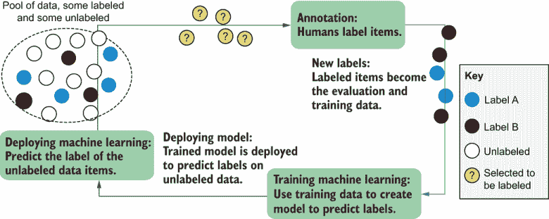
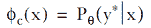
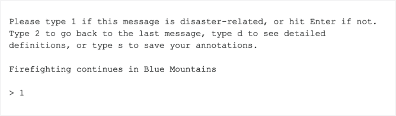

# 2 人机交互机器学习入门

本章涵盖了

+   根据模型置信度对预测进行排名以识别混淆项

+   寻找具有新颖信息的未标记项

+   构建一个简单的界面来标注训练数据

+   随着添加更多训练数据评估模型准确性的变化

对于任何机器学习任务，你应该从一个简单但功能性的系统开始，随着你的进展构建更复杂的组件。这个指南适用于大多数技术：推出最小可行产品（MVP），然后对产品进行迭代。你从最初推出的产品中获得的反馈将告诉你哪些部分是构建下一个产品时最重要的。

本章致力于构建你的第一个人机交互机器学习 MVP。随着本书的进展，我们将在此基础上构建系统，让你了解构建更复杂的数据标注界面、主动学习算法和评估策略所需的不同组件。

有时候，一个简单的系统就足够了。假设你在一家媒体公司工作，你的工作是按照主题对新闻文章进行标记。你已经有了体育、政治和娱乐等主题。最近自然灾害的新闻报道很多，你的老板要求你标注相关的过去新闻文章为灾害相关，以便更好地搜索这个新标签。你没有几个月的时间来构建一个最优的系统；你希望尽快推出一个最小可行产品（MVP）。

## 2.1 超越黑客式学习：你的第一个主动学习算法

你可能没有意识到，但你可能之前已经使用过主动学习了。正如你在第一章中学到的，主动学习是选择合适数据供人类审查的过程。通过关键词或其他预处理步骤过滤数据是一种主动学习形式，尽管它不是特别有原则性。

如果你最近才开始尝试机器学习实验，你可能已经使用了常见的学术数据集，例如 ImageNet、MNIST 光学字符识别（OCR）数据集和 CoNLL 命名实体识别（NER）数据集。在创建实际训练数据之前，这些数据集都经过了各种采样技术的严格筛选。因此，如果你从这些流行的数据集中随机采样，你的样本并不是真正随机的：它是对在创建这些数据集时使用的任何采样策略所符合的数据的选择。换句话说，你无意中使用了可能来自十多年前的一些手工制作的启发式方法作为采样策略。在这篇文章中，你将学习到更复杂的方法。

您很可能已经使用了 ImageNet、MNIST OCR 或 CoNLL NER 数据集，但没有意识到它们是如何被过滤的。关于这些数据集的正式文档很少，而且据我所知，在大多数使用这些数据集的人中都没有提及。ImageNet 是在我在斯坦福大学时由同事创建的；我是原始 CoNLL NER 任务中的 15 个研究团队之一；当我看到一篇现在著名的深度学习基础论文中提到 MNIST 时，我了解到了 MNIST 的局限性。显然，拼凑现有数据集是如何创建的是如此困难且随意，但直到这本书，还没有一个地方告诉您：*不要相信任何现有的数据集能够代表您在现实世界中遇到的数据*。

由于您在构建机器学习模型时可能已经使用了过滤后的数据，因此将大多数机器学习问题视为已经处于主动学习迭代过程的中期可能会有所帮助。一些关于数据采样的决策已经做出；它们引导您到达当前的数据标注状态，并且可能并不完全最优。因此，您需要首先关注的是如何在前进的过程中开始正确地采样数据。

如果您没有明确实现一个好的主动学习策略，而是采用临时方法来采样您的数据，那么您就是在实施“黑客式学习”。¹ 组装一些东西是可以的，但即使您做得很快，也要确保基础正确。

您的第一个带人类交互的机器学习系统将类似于图 2.1 所示。在本章的剩余部分，您将实现这个架构。本章假设您将使用 2.2 节中介绍的数据集，但您也可以轻松地使用自己的数据。或者，您可以构建这里描述的系统；然后，通过更改数据和标注说明，您应该能够将您自己的文本标注任务插入其中。



图 2.1 您的第一个带人类交互的机器学习系统架构

## 2.2 您的第一个系统架构

在本文中，您将构建的第一个带人类交互的机器学习系统将把一组新闻标题标注为“与灾难相关”或“非灾难相关”。这项现实世界的任务可能有多个应用领域：

+   使用这个数据集构建一个机器学习模型，以帮助实时识别与灾难相关的新闻文章，从而帮助应对

+   为新闻文章添加一个新的“与灾难相关”标签，以提高数据库的可搜索性和可索引性

+   通过允许某人分析相关标题来支持一项关于媒体如何报道灾难的社会研究

在全球疫情追踪中，识别关于爆发的新闻文章是一项重要任务。H5N1（禽流感）在确定为流感新株之前几周就已经公开报道，而 H1N1（猪流感）在几个月前就已经公开报道。如果这些报告能更早地呈现在病毒学家和流行病学家面前，他们就能识别流感新株的模式，并能够更快地做出反应。尽管您第一个带有人工智能的机器学习系统的用例很简单，但它是一个现实世界的用例，可能会挽救生命。²

对于您将在整本书中使用的数据，您将使用我在作为专业灾害响应者工作时处理的一些过去灾难的消息。在这些案例中，我运行了带有人工智能的机器学习系统来处理数据，因此这些示例与本文相关。数据包括 2010 年海地地震和智利地震后的消息、2010 年巴基斯坦洪水、2012 年美国飓风桑迪以及大量关注疾病爆发的新闻标题集合。

您将加入斯坦福大学 NLP 专业的学生、Udacity 的数据科学学生以及报名参加“人工智能普及”（[`ai-4-all.org`](http://ai-4-all.org/））的高中生，他们今天也将使用这个数据集作为课程的一部分。您将执行本章开头介绍的任务：对新闻标题进行分类。您可以在[https://github.com/rmunro/pytorch_active_learning](https://github.com/rmunro/pytorch_active_learning)下载代码和数据。

请参阅 readme 文件，了解如何在您的机器上安装 Python 3.6 或更高版本以及 PyTorch 的说明。Python 和 PyTorch 的版本更新迅速，因此我将保持 readme 文件更新，提供安装说明，而不是尝试在此处包含该信息。

如果您不熟悉 PyTorch，请从本 PyTorch 教程中的示例开始：[`mng.bz/6gy5`](http://mng.bz/6gy5)。本章中的示例是从 PyTorch 示例和 PyTorch 教程中的示例结合而来的。如果您熟悉这两个教程，本章中的所有代码都应该对您来说很清晰。CSV 文件中的数据包括两个到五个字段，具体取决于其处理程度，看起来类似于表 2.1 中的示例。

表 2.1 一个示例数据文件，包含 ID、实际文本、选定的主动学习采样策略和该策略的分数

| 文本 ID | 文本 | 标签 | 样本策略 | 分数 |
| --- | --- | --- | --- | --- |
| 596124 | Dolores 湖居民洪水预警 | 1 | 低置信度 | 0.5872 |
| 58503 | 地震救援人员抵达 | 1 | 随机 | 0.6234 |
| 23173 | 自行车手在尝试导航新自行车道时迷路 | 0 | 随机 | 0.0937 |

本章中您将使用的数据来自大量新闻标题的集合。这些文章跨越了许多年和数百次灾难，但大多数标题*并非*与灾难相关。

数据库中有四个数据位置：

+   */训练数据*—你的模型将用于训练的数据

+   */验证数据*—你的模型将用于微调的数据

+   */评估数据*—你的模型将用于评估准确性的数据

+   */未标记数据*—你想要标记的大量数据池

你将在这个存储库中的 CSV 文件中看到数据，并且它们将具有以下格式：

+   0\. 文本 ID（此项目的唯一 ID）

+   1\. 文本（文本本身）

+   2\. 标签（标签：1 = “与灾难相关”；0 = “与灾难无关”）

+   3\. 样本策略（我们用来采样此项的主动学习策略）

+   4\. 置信度（机器学习对此项是“与灾难相关”的置信度）

（此列表从 0 开始计数而不是 1，以便它与代码中每个字段的项目/行的索引相匹配）。

这些字段足够你构建你的第一个模型。你会发现示例中的未标记数据还没有标签、样本策略或置信度，这是显而易见的原因。

如果你想要立即开始，你可以运行此脚本：

```
> python active_learning_basics.py
```

你最初将被提示将消息标注为“与灾难相关”或“与灾难无关”以创建评估数据。然后你将再次被提示对初始训练数据进行相同的操作。只有在这种情况下，你才会看到模型开始基于你的数据构建，并且主动学习过程开始。我们将在本章后面返回代码，并介绍其背后的策略。

在实际灾难中，你将需要将数据分类到大量细粒度的类别中。例如，你可能需要区分食物和水的请求，因为人们没有食物可以忍受的时间比没有水要长得多，所以对饮用水的请求需要比食物的请求更紧急地响应。另一方面，你可能能够通过过滤在当地提供水，但食物仍需要运送到受灾地区，以更长时间的需求。因此，不同的救灾组织通常专注于食物或水。同样，对于医疗援助、安全、住房等类型的区分也是如此，所有这些都需要细粒度的类别才能实施。但在任何这些情况下，在“相关”和“不相关”之间进行过滤都可以是一个重要的第一步。如果数据量足够低，你可能只需要机器学习辅助来区分相关信息和非相关信息；人类可以处理其他类别。我参与过这样的救灾行动。

此外，在大多数灾难中，你不会用英语工作。英语只占全球日常对话的约 5%，因此大约 95%关于灾难的交流不是用英语进行的。更广泛的结构可以应用于任何语言。最大的区别是英语使用空格将句子分割成单词。大多数语言都有更复杂的词缀、后缀和复合词，使得单个单词更加复杂。一些语言，如中文，在大多数单词之间不使用空格。将单词分解为其构成部分（*语素*）本身就是一个重要的任务。事实上，这是我博士论文的一部分：自动发现任何语言在灾难响应通信中的词内边界。一个有趣且重要的研究领域将是使机器学习真正在全球范围内平等，我鼓励人们追求这一目标！

这有助于使你的数据假设明确，这样你就可以构建和优化最适合你用例的架构。在任何机器学习系统中包含假设是一种好的实践，因此以下是我们的假设：

+   数据仅包含英语。

+   数据包含不同种类的英语（英国英语、美国英语、作为第二语言的英语）。

+   我们可以使用空格分隔的单词作为我们的特征。

+   对于这个用例，二元分类任务就足够了。

应该很容易看出，人类在循环机器学习的更广泛框架如何适用于任何类似的用例。本章中的框架几乎可以像对另一个文本分类任务一样容易地适应图像分类。

如果你已经开始了，你会看到在你可以构建模型之前，你需要标注一些额外的数据。这在一般情况下是一种好的实践：查看你的数据将为你模型的所有部分提供更好的直觉。参见以下侧边栏了解为什么你应该查看你的数据。

阳光是最好的消毒剂

*彼得·斯科莫罗赫的专家轶事*

你需要深入查看真实数据，以确切知道要构建哪些模型。除了高级图表和汇总统计之外，我建议数据科学家定期浏览大量随机选择的、细粒度的数据，让这些例子影响他们。作为高管每周查看公司级图表，网络工程师查看系统日志的统计数据，数据科学家应该对其数据及其变化有直觉。

当我构建 LinkedIn 的技能推荐功能时，我创建了一个简单的网页界面，其中包含一个随机按钮，它显示了推荐示例以及相应的模型输入，这样我就可以快速查看数据，并了解可能最成功的算法和注释策略。这种方法是确保你已经发现潜在问题并获得了关键的高质量输入数据的最佳方式。你正在给你的数据带来光明，阳光是最好的消毒剂。

*彼得·斯科莫罗赫（Peter Skomoroch），前 SkipFlag（被 WorkDay 收购）的首席执行官，曾在 LinkedIn 担任首席数据科学家，是该团队发明“数据科学家”这一职位的人之一*。

## 2.3 解释模型预测和数据以支持主动学习

几乎所有的监督机器学习模型都会给你两样东西：

+   一个预测标签（或一组预测标签）

+   与每个预测标签相关联的数字（或一组数字）

这些数字通常被解释为预测的置信度，尽管这取决于数字是如何生成的，可能会有所不同。如果有相互排斥的类别并且具有相似的置信度，那么你有很好的证据表明模型对其预测感到困惑，并且人类的判断将是有价值的。因此，当模型学会正确预测具有不确定预测的项目的标签时，它将受益最大。

假设我们有一个可能与灾难相关的消息，预测看起来是这样的：

```
{
    "Object": {
        "Label": "Not Disaster-Related",
        "Scores": {
            "Disaster-Related": 0.475524352,
            "Not Disaster-Related": 0.524475648
        }
    }
}
```

在这个预测中，消息被预测为“非灾难相关”。在其余的监督机器学习中，这个标签是人们最关心的：标签预测是否正确，以及模型在预测大量保留数据集时的整体准确率是多少？

然而，在主动学习过程中，与预测相关的数字通常是我们最关心的。你可以从例子中看到，“非灾难相关”被预测为 0.524 分。这个分数意味着系统有 52.4%的信心认为预测是正确的。

从这里任务的视角来看，你可以看到为什么你可能仍然希望有人审查结果：这仍然有相对较高的可能是与灾难相关的。如果它*确实*与灾难相关，那么你的模型可能因为某些原因在这个例子上犯了错误，所以你很可能希望将其添加到你的训练数据中，以免错过类似的例子。

在第三章中，我们将转向如何可靠地评估 0.524 分的这个问题。特别是对于神经网络模型，这些置信度可能会相差很大。为了本章的目的，我们可以假设虽然确切数字可能不准确，但我们通常可以相信多个预测中置信度相对差异的准确性。

### 2.3.1 置信度排名

假设我们还有另一个带有这种预测的消息：

```
{
    "Object": {
        "Label": "Not Disaster-Related",
        "Scores": {
            "Disaster-Related": 0.015524352,
            "Not Disaster-Related": 0.984475648
        }
    }
}
```

此项也被预测为“非灾难相关”，但置信度为 98.4%，而第一项的置信度仅为 52.4%。因此，模型对第二项的信心比对第一项的信心更大。因此，合理地假设第一项更有可能被错误标记，并将从人工审查中受益。即使我们不信任 52.4%和 98.4%的数字（正如你将在后面的章节中了解到的那样），假设置信度排名将与准确性相关是合理的。这几乎适用于几乎所有机器学习算法和几乎所有计算准确性的方法：你可以根据预测的置信度对项目进行排名，并抽取置信度最低的项目。对于一个关于项目*x*的标签集合*y*的概率分布，置信度由以下方程给出，其中 y*是最有信心（c）的标签：



对于像这个例子这样的二元预测任务，你可以简单地按置信度排名，并抽取置信度接近 50%的项目。然而，如果你尝试更复杂的事情，比如预测三个或更多互斥的标签、标记数据序列、生成整个句子（包括翻译和语音转录）或在图像和视频中识别对象，你有多种方法来计算置信度。我们将在后面的章节中回到其他计算置信度的方法。关于低置信度的直觉保持不变，二元任务对于你的第一个人工系统来说更容易。

### 2.3.2 识别异常值

如第一章所述，你通常想确保你为人工标记获得的项目种类多样，以便新抽取的项目不会都相似。这项任务可以包括确保你没有遗漏任何重要的异常值。一些灾难是罕见的，例如一颗大型小行星撞击地球。如果新闻标题说“小行星使核桃溪变平”，而你的机器学习模型还没有学会什么是小行星或核桃溪是一个城市，那么很容易理解为什么你的机器学习模型可能没有预测这个标题与灾难相关。你可以称这个句子在这个方面的一个异常值：它离你之前见过的任何东西都最远。

与置信度排名一样，我们有多种方法来确保我们最大化了为人工审查选择的内容的多样性。你将在后面的章节中了解更多关于这些方法的内容。现在，我们将关注一个简单的指标：每个未标记项目中单词的平均训练数据频率。以下是本章我们将实施的策略：

1.  对于未标记数据中的每个项目，计算它与训练数据中已有项目的平均单词匹配数。

1.  根据平均匹配数对项目进行排名。

1.  抽取平均匹配数最低的项目。

1.  将该项目添加到标记数据中。

1.  重复这些步骤，直到你采样足够的数据进行一次人工审核迭代。

注意，在第 4 步中，当你采样了第一个项目后，你可以将该项目视为已标记，因为你知道你稍后会为它获取一个标签。

这种确定异常值的方法往往倾向于偏好小型和新颖的标题，因此你会看到代码将 1 加到计数中作为平滑因子。它还不喜欢包含许多常见单词（如*the*）的句子，即使其他单词不常见。因此，你与其使用平均匹配，不如跟踪新颖单词的原始数量，以模拟标题中新颖信息的总量，而不是整体平均值。

你也可以将训练数据中的匹配数除以该词在所有数据中出现的总次数，然后将这些分数相乘，这大致会给你提供该元素是异常值的贝叶斯概率。你不仅可以使用词匹配，还可以使用更复杂的基于编辑距离的指标，这些指标会考虑句子中单词的顺序。或者，你可以使用许多其他字符串匹配和其他算法来确定异常值。

与其他一切一样，你可以从实现本章中的简单示例开始，以后再尝试其他示例。主要目标是保险策略：是否有什么完全不同的事情我们还没有看到？可能没有，但如果有的话，那将是正确注释的最高价值项。我们将在第五章中探讨结合置信度采样和多样性采样的方法。

我们还将探讨如何将你的机器学习策略与你的注释策略相结合。如果你在机器学习领域工作了一段时间，但从未参与过注释或主动学习，你可能只优化了模型以实现准确性。对于完整的架构，你可能希望采取更全面的方法，其中你的注释、主动学习和机器学习策略相互告知。你可以决定实施可以提供更准确置信度估计的机器学习算法，但这可能会牺牲标签预测的准确性。或者，你可能增强你的机器学习模型以具有两种类型的推理：一种用于预测标签，另一种用于更准确地估计每个预测的置信度。如果你正在构建用于更复杂任务的模型，例如生成文本序列（如机器翻译）或图像中的区域（如目标检测），今天最常见的方法是为该任务本身构建单独的推理能力并解释置信度。我们将在本书的第九章到第十一章中探讨这些架构。

构建你的第一个带人工审核的机器学习模型的过程总结在图 2.2 中。


图 2.2 在你的第一个包含人类操作员的机器学习系统中，迭代过程。最初（顶部），你正在标注未标记项目的随机样本，将其作为评估数据。然后你开始标注用于训练数据的第一批项目（中间），同样从随机选择开始。在此之后，你开始使用主动学习（底部）来抽样低置信度或异常值的项目。

### 2.3.3 迭代过程中可以期待什么

在我们的示例代码中，在我们有足够的评估和初始训练数据后，我们将每 100 个项目迭代一次主动学习。从每次迭代的项数来看，这个数字可能有点小，因为你将花费大量时间等待模型重新训练相对较少的新标注项目，但 100 个是一个合适的数字，可以让你感受到每次迭代中采样数据的变化程度。

在你通过主动学习过程迭代时，可能会注意到以下一些事情：

+   *第一次迭代*—你主要在标注“非灾难相关”的标题，这可能会感觉有些枯燥。当主动学习开始发挥作用时，这种平衡将会改善，但到目前为止，获取随机抽样的评估数据是必要的。你也应该注意到，这个问题并不简单，因为记者经常将灾难隐喻用于非灾难事件，尤其是体育团队（宣布战争、得分干旱等）。你还将面临边缘案例的挑战。例如，飞机坠毁是否算作灾难，或者其状态是否取决于飞机的大小和/或原因？这些边缘案例将帮助你细化任务定义，并为吸引更多劳动力大规模标注数据制定正确的指导方针。

+   *第二次迭代*—你已经创建了你的第一个模型！你的 F 分数可能非常糟糕，可能只有 0.20。然而，你的曲线下面积（AUC）可能大约是 0.75。（参见附录了解更多关于 F 分数和 AUC 的信息。）所以尽管准确度不高，你比随机选择能更好地找到与灾难相关的信息。你可以通过调整模型参数和架构来修复 F 分数，但更多数据比模型架构更重要，当你开始标注时这一点将变得清晰：你将在第二次迭代时立即注意到大量项目与灾难相关。实际上，大部分项目可能都是。在早期，你的模型仍然会尝试将大多数事情预测为“非灾难相关”，所以任何接近 50%置信度的都位于“与灾难相关”的端点。这个例子表明，主动学习可以自我纠正：它在不要求你明确实现针对重要标签的采样策略的情况下，对低频标签进行了过度采样。你还将看到过度拟合的证据。例如，如果你的第一次迭代中随机选择的项目恰好有很多关于洪水的大标题，你可能有*太多*关于洪水的大标题，而关于其他类型灾难的则不够。

+   *第三次和第四次迭代*—你应该开始看到模型准确率提高，因为你现在标注了更多与“灾难相关”的标题，使得每个标签的标注数据更接近 50:50。如果你的模型对某些术语（如洪水示例）进行了过度拟合，你应该已经看到了一些反例，例如“新投资涌入市场”，这些反例有助于将你的模型推向对这些术语的标题进行更准确的预测。如果包含“地板”的所有内容确实与灾难相关，这些项目现在将以高置信度预测，并且不再接近 50%。无论如何，问题会自我纠正，你所看到的标题多样性应该会增加。

+   *第五次到第十次迭代*—你的模型开始达到合理的准确率水平，你应该会看到标题的更多多样性。只要每 100 个标注中 F 分数或 AUC 提高几个百分点，你就在准确率上取得了良好的提升。你可能希望你有更多的标注评估数据，这样你就可以在更大的保留数据集上计算准确率。不幸的是，你做不到。除非你准备放弃大量的现有标签，否则几乎不可能回到真正的随机采样。

虽然感觉很简单，但本章中你构建的系统遵循与 2018 年（在本章撰写前不到一年）亚马逊网络服务（AWS）SageMaker Ground Truth 初始发布相同的策略。事实上，在第一个版本中，SageMaker 仅根据置信度进行采样，在该版本中没有寻找异常值。虽然你构建的系统很简单，但它超越了目前由主要云服务提供商提供的主动学习工具的算法复杂性水平。我在 AWS 工作时短暂地参与了 SageMaker Ground Truth 的开发，所以这并不是对该产品或我的同事的批评，他们比我投入了更多的工作。尽管主动学习首次成为大规模商业产品的一部分，但它仍然处于早期阶段。

我们将在本书的第二部分介绍更复杂的采样方法。目前，更重要的是关注建立主动学习的迭代过程，以及标注、重新训练和评估你的模型的最佳实践。如果你没有正确地制定迭代和评估策略，你可能会轻易地使你的模型变得更差而不是更好，甚至可能没有意识到这一点。

## 2.4 构建获取人工标签的界面

为了标注你的数据，你需要从正确的界面开始。在本节中，我们将介绍我们的示例数据应该是什么样的。

适合人工标注的正确界面与合适的采样策略一样重要。如果你能将你的界面效率提高 50%，那就相当于将你的主动学习采样策略提高了 50%。出于对进行标注的人的尊重，你应该尽可能确保他们觉得他们尽可能有效。如果你真的不知道界面或算法改进是下一步的最佳关注点，那么从改善人类工作的界面开始，以后再考虑 CPU 的感受。

本书第三部分致力于数据标注，因此我们将做出一些假设以保持本章讨论的简单性：

+   标注者没有在标签上犯很多错误，所以我们不需要对标注实施质量控制。

+   标注者完全理解任务和标签，所以他们不会意外地选择错误的标签。

+   只有一个标注者在同一时间工作，所以我们不需要跟踪任何正在进行的标注。

这些假设是很大的。在大多数部署的系统中，你需要实施质量控制以确保标注者不会犯错误；你很可能会需要多次迭代标注来细化标签和指令的定义；并且你需要一个系统来跟踪分配给多个人并行工作的任务。如果你只想快速标注一些数据用于探索目的，就像你现在所做的那样，一个简单的标注界面就足够了。

### 2.4.1 用于标注文本的简单界面

你构建的界面取决于你的任务和数据分布。对于像我们在这里实施的二进制标注任务，一个简单的命令行界面就足够了（图 2.3）。如果你运行本章中介绍的脚本，你会立即看到它：

```
> python active_learning_basics.py
```



图 2.3 本章示例的命令行界面标注工具

如引言中所述，许多人机交互因素都涉及到制作一个好的标注界面。但如果你必须快速构建一些东西，请执行以下操作：

1.  建立一个界面，让标注者能够专注于屏幕的一部分。

1.  允许所有操作的热键。

1.  包含一个后退/撤销选项。

首先确保这三件事正确，然后图形设计可以稍后进行。

要确切了解代码在做什么，请查看[`github.com/rmunro/pytorch_active_learning`](https://github.com/rmunro/pytorch_active_learning)上的仓库，或者将其本地克隆并对其进行实验。为了说明目的，本书将分享该代码的摘录。

你可以在以下列表中的`get_annotations()`函数的前 20 行中看到引发标注的代码。

列表 2.1 标注我们想要标注的无标签项

```
def get_annotations(data, default_sampling_strategy="random"):
    """Prompts annotator for label from command line and adds annotations to 
    ➥ data 

    Keyword arguments:
        data -- an list of unlabeled items where each item is 
                [ID, TEXT, LABEL, SAMPLING_STRATEGY, CONFIDENCE]
        default_sampling_strategy -- strategy to use for each item if not 
        ➥ already specified
    """

    ind = 0
    while ind <= len(data):
        if ind < 0:
            ind = 0 # in case you've gone back before the first
        if ind < len(data):
            textid = data[ind][0]
            text = data[ind][1]
            label = data[ind][2]
            strategy =  data[ind][3]

            if textid in already_labeled:
                print("Skipping seen "+label)
                ind+=1
            else:
                print(annotation_instructions)
                label = str(input(text+"\n\n> "))     ❶
                ...
                ...
```

❶ `input()`函数提示用户输入。

对于我们的数据，标签有点不平衡，因为大多数标题与灾难无关。这一事实对界面设计有影响。如果有人不断选择“与灾难无关”，这将既低效又无聊。只要你有标注者不可避免地被诱导选择默认选项的后备选项，你就可以将“与灾难无关”作为默认选项以提高效率。你可能自己就是这样做的：快速标注后，当你按下错误答案时不得不返回。你应该在`get_annotations()`函数的下一部分和最后的 20 行代码中看到这个功能。

列表 2.2 允许标注者通过重复来避免错误

```
def get_annotations(data, default_sampling_strategy="random"):
                ...
                ...

                if label == "2":                   
                    ind-=1  # go back
                elif label == "d":                    
                    print(detailed_instructions) # print detailed 
                    ➥ instructions
                elif label == "s":
                    break  # save and exit
                else:
                    if not label == "1":
                        label = "0" # treat everything other than 1 as 0

                    data[ind][2] = label # add label to our data

                    if data[ind][3] is None or data[ind][3] == "":
                        data[ind][3] = default_sampling_strategy # default if 
                        ➥ none given
                    ind+=1        

        else:
            #last one - give annotator a chance to go back
            print(last_instruction)
            label = str(input("\n\n> ")) 
            if label == "2":
                ind-=1
            else:
                ind+=1

    return data
```

### 2.4.2 管理机器学习数据

对于一个部署的系统，最好将你的注释存储在一个负责备份、可用性和可扩展性的数据库中。但你不能像在本地机器上浏览文件那样轻松地浏览数据库。除了将训练项目添加到你的数据库中，或者如果你正在构建一个简单的系统，拥有可以快速检查的本地存储数据和注释可能会有所帮助。

在我们的例子中，我们将根据标签将数据分开存储到单独的文件中，以增加冗余。除非你在一个已经为标注和机器学习建立了良好数据管理流程的组织中工作，否则你可能没有像对代码那样对数据进行相同的质量控制，例如单元测试和良好的版本控制。因此，在存储数据的方式上保持冗余是明智的。同样，你也会看到代码会附加文件，但永远不会覆盖文件。它还会保持未标记数据.csv 文件不变，在项目被标记时检查其他数据集的重复项，而不是从该文件中删除标题。

在存储标签的方式上保持冗余并强制不删除数据，当你开始实验时将节省你很多麻烦。我从未遇到过一位机器学习专业人士没有在某个时候意外删除过标记数据，所以请遵循这些建议！同时，也请记住，如果你在本地机器上存储数据，这些数据可能属于其他人或包含敏感内容。确保你有权存储这些数据，并在不再需要时删除数据。

尽管这个主题没有在本书中涵盖，但对你数据版本控制同样重要，尤其是当你边更新指令边进行时。一些较旧的标签可能是不正确的，如果你想在以后重新创建你的主动学习迭代，你希望能够重新生成它们。

## 2.5 部署你的第一个闭环机器学习系统

现在，让我们将您第一个闭环系统中所有部件组合起来！如果您在本章的早期没有这样做，请从[`github.com/rmunro/pytorch_active_learning`](https://github.com/rmunro/pytorch_active_learning)下载代码和数据，并查看 readme 文件以获取安装说明。

您可以立即运行此代码，它将开始提示您标注数据，并在每次迭代后自动训练。您应该体验在 2.3.3 节中学到的每个迭代中的数据变化。

为了了解底层发生了什么，让我们通过此代码的主要组件及其背后的策略来分析。我们使用一个简单的 PyTorch 机器学习模型进行文本分类。我们将使用一个可以快速重新训练的浅层模型来使我们的迭代快速进行。在 PyTorch 中，整个模型定义只有十几行代码。

列表 2.3 具有一个隐藏层的简单 PyTorch 文本分类模型

```
class SimpleTextClassifier(nn.Module):  # inherit pytorch's nn.Module
    """Text Classifier with 1 hidden layer 

    """

    def __init__(self, num_labels, vocab_size):
        super(SimpleTextClassifier, self).__init__() # call parent init

        # Define model with one hidden layer with 128 neurons
        self.linear1 = nn.Linear(vocab_size, 128)                   ❶
        self.linear2 = nn.Linear(128, num_labels)                   ❷

    def forward(self, feature_vec):
        # Define how data is passed through the model

        hidden1 = self.linear1(feature_vec).clamp(min=0) # ReLU     ❸
        output = self.linear2(hidden1)                              ❹
        return F.log_softmax(output, dim=1)                         ❺
```

❶ 具有 128 个神经元/节点的隐藏层

❷ 输出层预测每个标签

❸ 使用 ReLU 激活函数优化我们的隐藏层

❹ 使用线性激活函数作为我们的输出层

❺ 将我们的线性输出的 log softmax 返回以优化训练中的模型，并将其作为预测的概率分布返回

我们输入层包含特征集中每个单词的一热编码（数千个），输出层是两个标签，隐藏层有 128 个节点。

对于训练，我们知道标签之间的数据最初是不平衡的，因此我们想要确保我们为每个标签选择接近偶数个项目的某种东西。此规范在代码开始时设置在这些变量中：

```
epochs = 10 # number of epochs per training session
select_per_epoch = 200  # number to sample per epoch per label
```

我们将训练我们的模型 10 个周期，并且对于每个周期，我们将从每个标签随机选择 200 个项目。这种方法不会使我们的模型完全平衡，因为我们仍然是在所有周期中选择来自非灾难相关文本的更大种类，但即使我们只有大约 100 个与灾难相关的示例，这也将足够我们从数据中获得一些信号。

（隐藏神经元、周期和每个周期选择的项目是合理的，但其他方面是任意起点。您可以尝试不同的超参数，但在标注过程的开始，您应该专注于数据。）

下一个展示的`train_model()`函数是训练我们模型的代码。

列表 2.4 训练文本分类模型

```
def train_model(training_data, validation_data = "", evaluation_data = "", 
➥ num_labels=2, vocab_size=0):
    """Train model on the given training_data

    Tune with the validation_data
    Evaluate accuracy with the evaluation_data
    """

    model = SimpleTextClassifier(num_labels, vocab_size)
    # let's hard-code our labels for this example code 
    # and map to the same meaningful booleans in our data, 
    # so we don't mix anything up when inspecting our data
    label_to_ix = {"not_disaster_related": 0, "disaster_related": 1} 

    loss_function = nn.NLLLoss()
    optimizer = optim.SGD(model.parameters(), lr=0.01)

    # epochs training
    for epoch in range(epochs):
        print("Epoch: "+str(epoch))
        current = 0

        # make a subset of data to use in this epoch
        # with an equal number of items from each label

        shuffle(training_data) #randomize the order of the training data
        related = [row for row in training_data if '1' in row[2]]
        not_related = [row for row in training_data if '0' in row[2]]

        epoch_data = related[:select_per_epoch]     ❶
        epoch_data += not_related[:select_per_epoch]
        shuffle(epoch_data) 

        # train our model
        for item in epoch_data:
            features = item[1].split()
            label = int(item[2])

            model.zero_grad() 

            feature_vec = make_feature_vector(features, feature_index)
            target = torch.LongTensor([int(label)])

            log_probs = model(feature_vec)

            # compute loss function, do backward pass, and update the 
            ➥ gradient
            loss = loss_function(log_probs, target)
            loss.backward()
            optimizer.step()
```

❶ 为每个标签选择等量的项目，以有效地对较小的标签进行过采样，尤其是在标注的早期迭代中。

您可以看到我们正在保持训练超参数不变，例如学习率和激活函数的类型。对于实际系统，您可能想要尝试训练超参数，以及更好地模拟单词序列或像素集群的架构，如果您正在进行图像分类。

如果你进行任何超参数调整，你应该创建验证数据并使用这些数据来调整你的模型，就像你在机器学习中已经习惯做的那样。实际上，你可能需要多种类型的验证数据集，包括在每个迭代中从你的训练数据中抽取的一个，一个在你使用主动学习之前从你的未标记数据中抽取的，以及一个在每个迭代中从剩余的未标记项目中抽取的。我们将在第三章中回到主动学习的验证数据。现在，我们省略了额外的标注。如果你想在本章的示例中调整模型，请在每个迭代中从你的训练数据集中抽取随机选择的数据。

`train_model()` 函数的剩余部分评估新模型的准确性并将其保存到 models/ 文件夹中。我将在下一节中介绍评估。

如前所述，在开始构建任何机器学习系统之前，你应该熟悉你的数据。幸运的是，这个最佳实践也适用于主动学习。你应该首先选择评估数据，并且你应该成为负责标注这些数据的人之一。

### 2.5.1 总是首先获取评估数据

评估数据通常被称为测试集或保留数据，对于这个任务，它应该是我们标注的标题的随机样本。我们将在每次主动学习迭代后始终保留这些标题，以便我们可以跟踪模型在每次迭代后的准确性。

首先获取评估数据非常重要，因为在你开始其他采样技术之后，有很多方式会无意中使你的评估数据产生偏差。以下是一些如果你没有首先提取评估数据可能会出错的情况：

+   如果你忘记在低置信度采样之后从未标记的项目中采样评估数据，你的评估数据将偏向于剩余的高置信度项目，你的模型看起来会比实际更准确。

+   如果你忘记采样评估数据，并在置信度采样之后从你的训练数据中抽取评估数据，你的评估数据将偏向于低置信度项目，你的模型看起来会比实际更不准确。

+   如果你已经实现了异常值检测，后来又尝试提取评估数据，几乎不可避免地会产生偏差，因为你抽取的项目已经对额外异常值的采样做出了贡献。

如果你没有首先制作评估数据会发生什么？

如果你没有记住首先获取评估数据，就很难知道你的模型有多准确。这个错误是我看到人们犯的最大错误之一。一旦数据科学家获得任何新的手工标签，他们自然会想要将这些标签添加到他们的训练数据中，看看他们的模型能提高多少准确性。但如果你对评估数据没有给予足够的重视，并且没有小心地确保其真正随机，你就不会知道你的模型有多准确。我见过一些公司错误地构建自动驾驶汽车、社交媒体流和约会应用，评估数据出错。要知道，今天从你身边驶过的车辆、推荐给你的新闻文章以及你未来可能要嫁的人，都可能是由不确定准确性的机器学习模型决定的。

如果你想要立即开始训练，至少先设置好评估数据，这样它就不会影响你的分析。你可以稍后回来注释这些数据，或者与你的训练和验证数据并行注释。

最后，如果你将模型应用于一个持续变化的信息流，可能无法选择真正随机的数据。在持续的灾害响应情况下，这绝对会是这种情况，因为随着时间的推移，会报告有关变化条件和需求的新信息。对于我们在这里正在处理的例子，我们被要求标记一组有限的新闻标题，因此选择标题的随机样本作为我们的训练数据是有意义的。我们将在第三章中回到更复杂情境下的评估数据抽样策略。

评估模型在每个迭代中准确性的代码是`evaluate_model()`函数。

列表 2.5 在保留数据上评估模型

```
def evaluate_model(model, evaluation_data):
    """Evaluate the model on the held-out evaluation data

    Return the f-value for disaster-related and the AUC
    """

    related_confs = [] # related items and their confidence of being related
    not_related_confs = [] # not related items and their confidence of 
    ➥ being _related_

    true_pos = 0.0 # true positives, etc 
    false_pos = 0.0
    false_neg = 0.0

    with torch.no_grad():
        for item in evaluation_data:
            _, text, label, _, _, = item

            feature_vector = make_feature_vector(text.split(), feature_index)
            log_probs = model(feature_vector)

            # get confidence that item is disaster-related
            prob_related = math.exp(log_probs.data.tolist()[0][1])     ❶

            if(label == "1"):
                # true label is disaster related
                related_confs.append(prob_related)
                if prob_related > 0.5:
                    true_pos += 1.0
                else:
                    false_neg += 1.0
            else:
                # not disaster-related
                not_related_confs.append(prob_related)
                if prob_related > 0.5:
                    false_pos += 1.0
                    ...
                    ...
```

❶ PyTorch 张量是二维的，所以我们只需要提取预测的置信度。

这段代码获取每个项目被预测为“与灾害相关”的置信度，并跟踪每个预测是否正确或错误。原始准确率在这里不是一个好的度量标准。因为两个标签的频率不平衡，你每次预测“非灾害相关”都会得到近 95%的准确率。这个结果没有信息量，我们的任务特别是要找到与灾害相关的标题，因此我们将计算准确率作为灾害相关预测的 F 分数。

除了关心 F 分数外，我们还关心置信度是否与准确性相关，因此我们计算 ROC 曲线下的面积。ROC（接收者操作特征）曲线按置信度对数据集进行排序，并计算真正例与假正例的比率。

请参阅附录，其中定义了精确度、召回率、F 分数和 AUC 的讨论，这些都在我们代码的`evaluate_model()`函数中实现。

列表 2.6 计算精确度、召回率、F 分数和 AUC

```
def evaluate_model(model, evaluation_data):
                    ...
                    ...
    # Get FScore
    if true_pos == 0.0:
        fscore = 0.0
    else:
        precision = true_pos / (true_pos + false_pos)
        recall = true_pos / (true_pos + false_neg)
        fscore = (2 * precision * recall) / (precision + recall)    ❶

    # GET AUC
    not_related_confs.sort()
    total_greater = 0 # count of how many total have higher confidence
    for conf in related_confs:
        for conf2 in not_related_confs:
            if conf < conf2:                                        ❷
                break
            else:                  
                total_greater += 1

    denom = len(not_related_confs) * len(related_confs) 
    auc = total_greater / denom

    return[fscore, auc]
```

❶ 精确度和召回率的调和平均值

❷ 对于我们关心的标签（在这种情况下是“相关”），我们想知道有多少被预测为具有该标签，并且比没有该标签的项目具有更高的置信度。

如果你查看模型目录中任何你构建的模型的文件名，你会看到文件名包括时间戳、模型的 F 分数和 AUC 的准确度以及训练项的数量。为你的模型提供详细和透明的名称是良好的数据管理实践，这将让你通过查看目录列表简单地跟踪每个迭代的准确度。

### 2.5.2 每个数据点都有机会

通过在主动学习的每个迭代中包含新的随机采样项目，你得到该迭代的一个基线。你可以比较在随机项目上训练的准确性与你的其他采样策略，这可以告诉你你的采样策略与随机采样相比有多有效。你将已经知道有多少新标注的项目与你的模型预测的标签不同，但你不会知道它们在添加到训练数据后会对未来的预测造成多大的变化。

即使你的其他主动学习策略在迭代中失败，你仍然会从随机样本中获得增量改进，因此随机采样是一个很好的后备方案。

在这里也有一个道德选择。我们承认所有策略都不完美，因此每个数据项仍然有一定的机会被随机选择并由人工审查，即使没有任何采样策略会选择它。在实际的灾难场景中，你希望消除有人会看到重要标题的机会吗？因为你的采样策略永远不会选择它？道德问题是一个你应该根据你正在处理的数据和用例来问自己的问题。

### 2.5.3 为您的数据选择合适的策略

我们知道在我们的数据中，灾难相关的标题很少，因此选择异常值的策略不太可能选择很多与灾难相关的项目。因此，示例代码专注于根据以下策略按置信度选择并针对每个迭代采样数据：

+   10% 从未标记的项目中随机选择

+   80% 从置信度最低的项目中选择

+   10% 被选为异常值

假设低置信度项目实际上是 50:50 与灾难相关和非灾难相关，当大量项目已被标注并且我们的模型稳定时，标注者应该看到略多于 4/10 的与灾难相关的消息。这个结果足够接近，以至于我们不必担心排序效应会在后续迭代中影响标注者。

以下三个列表包含三个策略的代码。首先，我们获取低置信度预测。

列表 2.7 使用低置信度采样项目

```
def get_low_conf_unlabeled(model, unlabeled_data, number=80, limit=10000):
    confidences = []
    if limit == -1:
        print("Get confidences for unlabeled data (this might take a while)")
    else: 
        # only apply the model to a limited number of items
        shuffle(unlabeled_data)
        unlabeled_data = unlabeled_data[:limit]

    with torch.no_grad():
        for item in unlabeled_data:
            textid = item[0]
            if textid in already_labeled:
                continue

            text = item[1]

            feature_vector = make_feature_vector(text.split(), feature_index)
            log_probs = model(feature_vector)

            prob_related = math.exp(log_probs.data.tolist()[0][1])    ❶

            if prob_related < 0.5:
                confidence = 1 - prob_related
            else:
                confidence = prob_related 

            item[3] = "low confidence"
            item[4] = confidence
            confidences.append(item)

    confidences.sort(key=lambda x: x[4])                              ❷
    return confidences[:number:]
```

❶ 获取每个标签的项目概率。

❷ 按置信度对项目进行排序。

接下来，我们获取随机项目。

列表 2.8 样本随机项

```
def get_random_items(unlabeled_data, number = 10):
    shuffle(unlabeled_data)

    random_items = []
    for item in unlabeled_data:
        textid = item[0]
        if textid in already_labeled:
            continue
        random_items.append(item)
        if len(random_items) >= number:
            break

    return random_items
```

最后，我们得到了异常值。

列表 2.9 样本异常值

```
def get_outliers(training_data, unlabeled_data, number=10):
    """Get outliers from unlabeled data in training data
    Returns number outliers

    An outlier is defined as the percent of words in an item in 
    unlabeled_data that do not exist in training_data
    """
    outliers = []

    total_feature_counts = defaultdict(lambda: 0)

    for item in training_data:
        text = item[1]
        features = text.split()

        for feature in features:
            total_feature_counts[feature] += 1                       ❶

    while(len(outliers) < number):
        top_outlier = []
        top_match = float("inf")

        for item in unlabeled_data:
            textid = item[0]
            if textid in already_labeled:
                continue

            text = item[1]
            features = text.split()
            total_matches = 1 # start at 1 for slight smoothing 
            for feature in features:
                if feature in total_feature_counts:
                    total_matches += total_feature_counts[feature]   ❷

            ave_matches = total_matches / len(features)
            if ave_matches < top_match:
                top_match = ave_matches
                top_outlier = item

        # add this outlier to list and update what is 'labeled', 
        # assuming this new outlier will get a label
        top_outlier[3] = "outlier"
        outliers.append(top_outlier)
        text = top_outlier[1]
        features = text.split()
        for feature in features:
            total_feature_counts[feature] += 1                       ❸

    return outliers
```

❶ 计算训练数据中所有特征的数量。

❷ 将未标记数据项中此特征出现的次数添加到该特征中。

❸ 更新此项目的训练数据计数，以帮助增加下一次采样的异常值的多样性。

你可以看到，在默认情况下，在 `get_low_conf_unlabeled()` 函数中，我们只对 10,000 个未标记项进行置信度预测，而不是对整个数据集进行预测。这个示例使得迭代之间的时间更加可控，因为你可能需要等待几分钟甚至几小时才能完成所有预测，这取决于你的机器。这个示例也增加了数据的多样性，因为我们每次都是从未标记项的不同子集中选择低置信度项。

### 2.5.4 重新训练模型并迭代

现在你有了新标注的项，你可以将它们添加到训练数据中，并查看模型准确性的变化。如果你运行本章开头下载的脚本，你会看到在完成每个迭代的标注后，重新训练会自动进行。

如果你查看那段代码，你也会看到结合了本章中我们讨论的所有代码的控制部分。这段额外的代码是超参数，例如每次迭代的注释数量，以及文件末尾的代码，确保首先获取评估数据，然后训练模型，并在拥有足够的评估数据时开始使用主动学习进行迭代。本章的示例代码少于 500 行，因此花时间理解每一步发生的事情，并思考如何扩展代码的任何部分是值得的。

如果你来自机器学习背景，特征的数量可能会让你感到惊讶。你可能只有 1,000 个标记的训练项，就有超过 10,000 个特征。如果你不再标记任何数据，你的模型不应该看起来是这个样子：如果你减少特征数量，你几乎肯定能获得更高的准确性。但有些反直觉的是，你想要大量的特征，尤其是在主动学习的早期迭代中，当你希望每个特征都对罕见的灾难相关标题产生影响时。否则，你的早期模型可能会更加偏向于你随机首次采样的那种标题类型。你有多种方式可以将你的机器学习架构和主动学习策略结合起来，我将在第九章到第十一章中介绍主要的方法。

在完成大约 10 次注释迭代后，查看您的训练数据。您会发现大多数项目都是通过低置信度选择的，这并不令人惊讶。寻找那些被列为异常值选择的项，可能会让您感到惊讶。可能有一些例子，其中的单词（对您来说）显然与灾难相关，这意味着这些例子以可能被遗漏的方式增加了您数据集的多样性。

尽管主动学习可以自我纠正，但您是否能看到任何证据表明它没有纠正某些偏差？常见例子包括过度采样过长或过短的句子。计算机视觉的等效例子是过度采样过大或过小、高分辨率或低分辨率的图像。您选择的异常值策略和机器学习模型可能基于这些特征进行过度采样，而这些特征并不是您目标的核心。在这种情况下，您可能需要考虑将本章中的方法应用于不同数据桶中的数据：最低置信度短句、最低置信度中等句子和最低置信度长句。

如果您愿意，也可以在这个代码中尝试采样策略的变体。尝试仅对随机选择的项进行重新训练，并将结果精度与另一个系统进行比较，该系统在相同数量的低置信度选择的项上重新训练，并使用异常值采样。哪种策略影响最大，以及影响有多大？

您还可以考虑接下来应该开发什么：

+   更高效的注释界面

+   帮助防止注释错误的质量控制

+   更好的主动学习采样策略

+   用于分类算法的更复杂的神经网络架构

您的主观体验可能与我的不同，而且尝试在此处提供的示例数据集之外的数据集上的这个例子也可能改变了某些事情。但很可能您已经将前三个选项之一识别为下一个需要构建的最重要组件。如果您来自机器学习背景，您的第一直觉可能是保持数据不变，并开始尝试更复杂的神经网络架构。这项任务可能是最好的下一步，但通常在早期并不是最重要的。一般来说，您应该首先确保数据正确；调整机器学习架构在迭代后期变得更重要。

本书剩余部分帮助您学习如何设计更好的注释界面，实施更好的注释质量控制，制定更好的主动学习策略，以及找到更好的方法来组合这些组件。

## 摘要

+   一个简单的人机交互机器学习系统可以涵盖整个周期，从采样未标记数据到更新模型。这种方法让您可以快速开始使用一个完整的 MVP 系统，并根据需要构建。

+   两种简单的主动学习策略易于实施：从预测中采样最不自信的项目和采样异常值。理解这些策略的基本目标将有助于你深入探索本书后面的不确定性采样和多样性采样。

+   简单的命令行界面可以允许人类高效地标注数据。即使是一个简单的纯文本界面，如果按照一般的人机交互原则构建，也可以是高效的。

+   良好的数据管理，例如将创建评估数据作为首要任务，对于正确执行至关重要。如果你没有正确处理你的评估数据，你可能永远不知道你的模型有多准确。

+   定期迭代使用新标注的数据重新训练机器学习模型表明，随着时间的推移，你的模型会变得更加准确。如果设计得当，主动学习迭代自然会自我纠正，一个迭代中的过拟合会在后续迭代中的采样策略中得到纠正。

* * *

^（1.）感谢 Jennifer Prendki（本文中一个轶事的作者）提出了“hacktive learning”这个术语。由于我们不同的口音，我们在合作时互相误解，我们都将“active learning”理解为“hacktive learning”，无意中发明了这个有用的短语。

^（2.）有关我们如何追踪流行病的信息，请参阅[`nlp.stanford.edu/pubs/Munro2012epidemics.pdf`](https://nlp.stanford.edu/pubs/Munro2012epidemics.pdf)。自从我在 2019 年初写下这个笔记以来，COVID-19 使这个用例的重要性变得更加明显。
