# 3 不确定性采样

本章涵盖

+   理解模型预测的分数

+   将多个标签的预测组合成一个单一的不确定性分数

+   将多个模型的预测组合成一个单一的不确定性分数

+   使用不同种类的机器学习算法计算不确定性

+   决定每次迭代周期向人类展示多少个项目

+   评估不确定性采样的成功率

人们用来使人工智能变得更聪明的最常见策略是让机器学习模型告诉人类它们在任务上不确定的时候，然后请求人类提供正确的反馈。一般来说，混淆算法的无标签数据在标记并添加到训练数据中时最有价值。如果算法可以以高置信度标记一个项目，那么它很可能是正确的。

这章致力于解释我们的模型试图告诉我们它对其任务不确定时的问题。但知道模型不确定以及如何计算这种不确定性并不总是容易的。在简单的二进制标记任务之外，衡量不确定性的不同方式可以产生截然不同的结果。你需要理解和考虑所有确定不确定性的方法，以便为你的数据和目标选择正确的方法。

例如，想象一下你正在构建一辆自动驾驶汽车。你希望帮助汽车理解它在行驶过程中遇到的新类型物体（行人、骑自行车的人、街牌、动物等等）。然而，要做到这一点，你需要了解汽车在看到什么物体时感到不确定，以及如何最好地解释和应对这种不确定性。

## 3.1 解释机器学习模型中的不确定性

*不确定性采样* 是一系列技术，用于识别当前机器学习模型决策边界附近的无标签项目。虽然识别模型何时自信很容易——有一个非常高的置信度结果——但你有很多种计算不确定性的方法，你的选择将取决于你的用例以及对你特定数据最有效的方法。

在本章中，我们探讨了四种不确定性采样的方法：

+   *最小置信度采样*—最自信预测与 100%置信度之间的差异。在我们的例子中，如果模型最自信地认为图像中有一个行人，最小置信度捕捉了该预测的置信度（或不确定性）。

+   *置信度采样范围* 两个最自信预测之间的差异。在我们的例子中，如果模型最自信地认为图像中有一个行人，第二自信地认为图像中包含一个动物，置信度范围捕捉了这两个置信度之间的差异。

+   置信度比率——两个最自信预测之间的比率。在我们的例子中，如果模型最自信地认为图像中有一个行人，第二自信地认为图像中包含一个动物，比率捕捉了这两个置信度之间的*比率*（而不是差异）。

+   *基于熵的采样*，根据信息理论定义的所有预测之间的差异。在我们的例子中，基于熵的采样将捕捉每个置信度与每个其他置信度之间的差异程度。

我们还将探讨如何从不同类型的机器学习算法中确定不确定性，以及当你对每个数据项有多个预测时如何计算不确定性，例如当你使用模型集成时。

理解每种方法的优缺点需要深入了解每种策略的确切操作，因此本章提供了详细的示例，包括方程和代码。在你开始正确解释置信度之前，你还需要了解置信度是如何生成的，因此本章从如何解释你模型的概率分布开始，特别是如果它们是由 softmax 生成的，这是从神经网络模型生成置信度最流行的算法。

### 3.1.1 为什么要在你的模型中寻找不确定性？

让我们回到我们的自动驾驶汽车示例。假设你的汽车大部分时间都在高速公路上行驶，它已经擅长导航，而且物体数量有限。例如，在主要高速公路上，你很少看到骑自行车的人或行人。如果你从汽车的录像中随机选择视频片段，你的选择将主要来自高速公路，汽车在那里已经很有信心并且驾驶得很好。如果人类主要对汽车在已经很有信心的高速公路驾驶方面提供反馈，那么人类几乎无法做任何事情来提高汽车的驾驶技能。

因此，你想要知道当你的自动驾驶汽车在行驶时最困惑的时刻。所以你决定从汽车对其检测到的物体最不确定的视频片段中提取视频片段，然后让人类为这些视频片段中的物体提供*地面真实情况*（训练数据）。人类可以识别移动物体是行人、另一辆车、骑自行车的人，或者汽车的对象检测系统可能遗漏的其他重要物体。不同的物体可以预期以不同的速度移动，并且更或更不可预测，这将帮助汽车预测这些物体的移动。

例如，汽车在暴风雪中驾驶时可能最困惑。如果你只展示暴风雪的视频片段，那么这些数据在 99%的情况下对汽车没有帮助，因为那时汽车不在暴风雪中。事实上，这些数据可能会使汽车变得更糟。暴风雪会限制可见范围，你可能会无意中使数据产生偏差，使得汽车的行为只有在暴风雪中才有意义，而在其他地方则很危险。你可能会教会汽车忽略所有远处的物体，因为下雪时它们根本看不见；这样，你将限制汽车在非暴风雪条件下预测远处物体的能力。因此，你需要不同类型的条件，在这些条件下你的汽车正在经历不确定性。

此外，在多个对象的情况下，如何定义不确定性并不明确。是不确定性关于预测的最可能对象吗？是在两个最可能的预测之间吗？或者，在为汽车检测到的某个对象制定整体不确定性得分时，你应该考虑每个可能的对象吗？当你深入挖掘时，决定应该将自动驾驶汽车视频中的哪些对象展示给人类进行审查是困难的。

最后，当模型不确定时，它并没有用简单易懂的语言告诉你：即使对于单个对象，机器学习模型给出的数字可能*对应*预测的置信度，但不一定是准确性的可靠度量。我们本章的起点是了解模型何时不确定。从这个基础上，你将能够构建更广泛的样本不确定性策略。

所有主动学习技术的潜在假设是，某些数据点对你的模型比其他数据点更有价值。（具体例子见以下边栏。）在本章中，我们将从通过查看 softmax 来解释模型输出开始。

并非所有数据都同等重要

*Jennifer Prendki 的专家轶事*

如果你关心你的营养，你不会去超市随意从货架上挑选商品。你可能会通过从超市货架上随机挑选商品最终获得所需的营养，但在这个过程中你会吃很多垃圾食品。我认为在机器学习中，人们仍然认为随机采样超市比找出他们需要的东西并集中精力在那里更好，这很奇怪。

我构建的第一个主动学习系统是迫不得已的。我正在构建机器学习系统，以帮助一家大型零售店确保当有人在网站上搜索时，正确的产品组合会显示出来。一夜之间，公司重组意味着我的人力标注预算减半，而我们需要标注的库存增加了 10 倍。因此，我的标注团队每个项目的预算只有我们之前的一半。我创建了第一个主动学习框架，以发现最重要的 5%。结果比使用更大预算的随机采样要好。从那时起，我在大多数项目中都使用了主动学习，因为并非所有数据都是平等的！

*Jennifer Prendki 是 Alectio 公司的首席执行官，该公司专门寻找机器学习所需的数据。她之前在 Atlassian、Figure Eight 和 Walmart 领导数据科学团队*。

### 3.1.2 Softmax 和概率分布

正如你在第二章中发现的那样，几乎所有的机器学习模型都给你两样东西：

+   一个预测标签（或一组预测）

+   与每个预测标签相关联的数字（或一组数字）

假设我们有一个简单的自动驾驶汽车目标检测模型，它试图区分只有四种类型的对象。该模型可能会给出以下预测。

列表 3.1 JSON 编码的预测示例

```
{
    "Object": {
        "Label": "Cyclist",
        "Scores": {
            "Cyclist": 0.9192784428596497,      ❶
            "Pedestrian": 0.01409964170306921,
            "Sign": 0.049725741147994995,
            "Animal": 0.016896208748221397
        }
    }
}
```

❶ 在这个预测中，对象被预测为“Cyclist”，准确率为 91.9%。这些分数相加将等于 100%，从而给出该项目的概率分布。

这个输出很可能是来自*softmax*，它通过指数将 logits 转换为 0-1 范围的分数。softmax 的定义如下

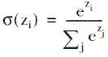

如图 3.1 所示。

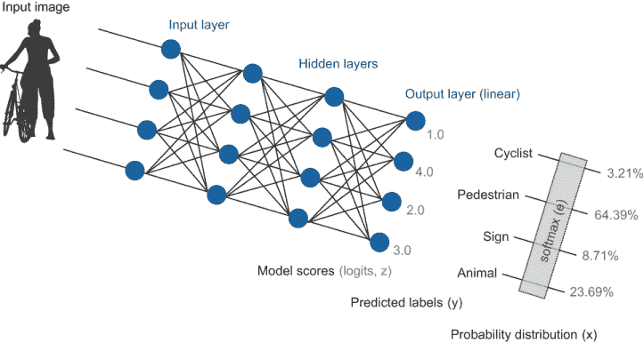

图 3.1 如何通过 softmax 创建概率分布。输出层使用线性激活函数，生成模型得分（logits），然后通过 softmax 转换为概率分布。

因为*softmax*除以指数，它失去了 logits 的规模。例如，图 3.1 中的 logits 是[1, 4, 2, 1]。如果 logits 是[101, 104, 102, 101]，softmax 将产生相同的概率分布，所以模型中的激活水平在输出中丢失了。我们将在第四章中探讨如何考虑激活。在本章中，理解仅使用概率分布时丢失了一些信息是很重要的。

如果你过去只使用了 softmax 的输出，我强烈建议阅读附录。正如其中解释的那样，softmax 的基数（.是任意的）可以通过改变基数来改变对不同项目预测的置信度排名顺序。这个事实并不广为人知，在此书之前从未有过报道。排名顺序对于不确定性采样很重要，正如你将在本章中看到的那样，因此在你自己的实验中，你可能想尝试改变 softmax 的基数（或等价地，温度），除了采用本章后面描述的技术之外。

从你的模型中获得更准确的置信度的一个常见方法是通过使用验证数据集调整 softmax 的基数/温度，以便概率分布尽可能接近实际准确性。例如，你可能调整 softmax 的基数/温度，使得置信度分数 0.7 有 70%的时间是正确的。调整基数/温度的一个更强大的替代方法是使用局部回归方法，如 LOESS，将你的概率分布映射到验证数据上的实际准确性。每个统计软件包都将包含一个或多个你可以实验的局部回归方法。

如果你只是建模不确定性以便采样最不确定的项目进行主动学习，那么概率分布是否准确反映准确性可能并不重要。你的选择将取决于你试图实现的目标，了解所有可用的技术会有所帮助。

### 3.1.3 解释主动学习的成功

你可以使用 F 分数和 AUC 等准确性指标来计算主动学习的成功，就像你在第二章中所做的那样。如果你来自算法背景，这项技术对你来说将是熟悉的。

然而，有时考虑人力成本更有意义。例如，你可以通过所需的人类标签数量来比较两种主动学习策略以实现一定的准确性目标。这可能会比使用相同数量的标签比较准确性大得多或小得多，因此计算两者都很有用。

如果你没有将项目放回训练数据中，因此没有实施完整的主动学习周期，那么仅从不确定性采样中暴露出的多少个*错误*预测来评估更有意义。也就是说，当你采样*N*个最不确定的项目时，模型错误预测的百分比是多少？

关于以人为中心的评估质量方法，例如标注数据所需的时间，请参阅附录，其中更详细地介绍了衡量模型性能的方法。

## 3.2 不确定性采样算法

现在你已经了解了模型预测中的置信度来源，你可以思考如何解释概率分布，以找出你的机器学习模型最不确定的地方。

不确定性采样是一种识别当前机器学习模型中接近决策边界的未标记项目的策略。如果你有一个二元分类任务，就像你在第二章中看到的那样，这些项目被预测为接近 50%的概率属于任一标签；因此，模型是不确定的。这些项目最有可能被错误分类；因此，它们最有可能导致人类标签与预测标签不同。图 3.2 显示了不确定性采样应该如何找到接近决策边界的项目。

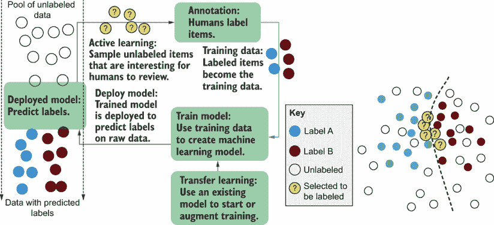

图 3.2 不确定性采样是一种主动学习策略，它对接近决策边界（有时彼此接近）的未标记项目进行过采样，因此更有可能得到导致决策边界变化的人类标签。

有许多计算不确定性的算法，其中一些我们将在这里介绍。它们都遵循相同的原理：

+   将不确定性采样算法应用于大量预测，为每个项目生成一个不确定性分数。

+   按不确定性分数对预测进行排序。

+   选择前*N*个最不确定的项目进行人工审查。

+   为前*N*个项目获取人类标签，用这些项目重新训练模型，并迭代这个过程。

本章涵盖的三种方法对预测的数据是无关的：给定项目将获得相同的置信度分数，无论其他被预测项目的分数如何。这种无关性有助于本章中方法的简单性和可预测性：不确定性分数的排名顺序足以在一系列预测中找到最不确定的。然而，其他技术可以采用预测的分布来改变个别分数。我们将在第五章和第六章回到这个话题。

注意：对于二元分类任务，本章中的策略是相同的，但对于三个或更多标签，策略会迅速分化。

### 3.2.1 最小置信度采样

最简单且最常用的不确定性采样方法是将每个项目的 100%置信度与最自信预测的标签之间的差异。你在第二章中看到了这种主动学习的实现。让我们将 softmax 的结果称为给定预测的标签概率。我们知道 softmax 并不严格给出概率，但这些方程是适用于任何来源的概率分布的通用方程，而不仅仅是 softmax。基本方程只是标签最高置信度的概率，这是你在第二章中实现的：

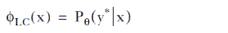

虽然你可以仅根据置信度进行排序，但将不确定性得分转换为 0–1 范围可能很有用，其中 1 是最不确定的得分。在这种情况下，我们必须归一化得分。我们从 1 减去值，将结果乘以标签数量，然后除以标签数量 - 1。我们这样做是因为最小置信度永远不会低于标签数量的倒数，这是当所有标签都有相同的预测置信度时。因此，0-1 范围的最小置信度采样是

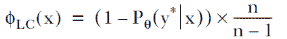

以下列表展示了 PyTorch 中最小置信度采样的实现。

列表 3.2 PyTorch 中的最小置信度采样

```
def least_confidence(*self*,  prob_dist, sorted=False):
    *"""* 
    *Returns the uncertainty score of an array using*
    *least confidence sampling in a 0-1 range where 1 is most uncertain*

    *Assumes probability distribution is a pytorch tensor, like:* 
      *tensor([0.0321, 0.6439, 0.0871, 0.2369])*

    *Keyword arguments:*
      *prob_dist -- a pytorch tensor of real numbers between 0 and 1 that* 
      ➥ *total to 1.0*
      *sorted – if the probability distribution is pre-sorted from largest to* 
      ➥ *smallest*
    *"""*
    if sorted:
      simple_least_conf = prob_dist.data[0] 
    else:
      simple_least_conf = torch.max(prob_dist) 

    num_labels = prob_dist.numel() # number of labels

    normalized_least_conf = (1 - simple_least_conf) * 
    ➥ (num_labels / (num_labels - 1))

    return normalized_least_conf.item()
```

让我们应用最小置信度来获取自动驾驶汽车预测的不确定性得分。这里只计算“行人”的置信度。使用我们的示例，这个不确定性得分将是 (1 – 0.6439) * (4 / 3) = 0.4748。因此，最小置信度采样为你提供了预测的排序顺序，其中你会采样预测标签置信度最低的项目。这种方法对第二、第三等值敏感，仅在于其他预测的总和将是得分本身：将分配给最自信标签之外标签的置信度量。

| 预测标签 | 骑行者 | 行人 | 标志 | 动物 |
| --- | --- | --- | --- | --- |
| softmax | 0.0321 | 0.6439 | 0.0871 | 0.2369 |

此方法不会对其他任何预测之间的不确定性敏感：对于最自信的预测具有相同的置信度，从第二到第 *n* 个置信度可以取任何值，而不会改变不确定性得分。如果你只关心特定用例中最自信的预测，这种方法是一个很好的起点。否则，你可能希望使用以下章节中讨论的其中一种方法。

最小置信度对 softmax 算法的基数敏感。这个例子有点反直觉，但回想一下 softmax(base=10) 给出 ~0.9 的置信度，这将导致不确定性得分为 0.1——比相同数据上的 0.35 小得多。对于不同的基数，这个得分将改变整体排名。softmax 的更高基数会拉大最自信标签和其他标签之间的差异；因此，在更高基数下，标签置信度之间的差异将比最自信标签和 1.0 之间的绝对差异更重要。

### 3.2.2 置信度边际采样

最直观的不确定性采样形式是两个最自信预测之间的差异。也就是说，对于模型预测的标签，它比下一个最自信标签更自信多少？这被定义为

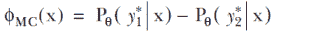

再次强调，我们可以将其转换为 0–1 范围。我们再次需要从 1.0 中减去，但最大可能的得分已经是 1，因此不需要乘以任何系数：

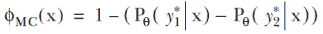

下面是使用 PyTorch 实现的置信度范围采样。

列表 3.3 PyTorch 中的置信度范围采样

```
def margin_confidence(*self*,  prob_dist, sorted=False):
    *"""* 
    *Returns the uncertainty score of a probability distribution using*
    *margin of confidence sampling in 0-1 range where 1 is most uncertain*

    *Assumes probability distribution is a pytorch tensor, like:* 
      *tensor([0.0321, 0.6439, 0.0871, 0.2369])*

    *Keyword arguments:*
      *prob_dist -- a pytorch tensor of real numbers between 0 and 1 that* 
      ➥ *total to 1.0*
      *sorted -- if the probability distribution is pre-sorted from largest to* 
      ➥ *smallest*
        *"""*
    if not sorted:
      prob_dist, _ = torch.sort(prob_dist, descending=True)

    difference = (prob_dist.data[0] - prob_dist.data[1]) 
    margin_conf = 1 - difference 

    return margin_conf.item()
```

让我们将置信度范围采样应用于我们的示例数据。“行人”和“动物”是最自信和次自信的预测。使用我们的示例，这个不确定性得分将是 1.0 - (0.6439 - 0.2369) = 0.5930。

| 预测标签 | 自行车 | 行人 | 标志 | 动物 |
| --- | --- | --- | --- | --- |
| softmax | 0.0321 | 0.6439 | 0.0871 | 0.2369 |

这种方法对除了两个最自信的预测之外的不确定性不会敏感：对于最自信和次自信的预测，相同的置信度差异，从第三到第 *n* 个置信度可以取任何值，而不会改变不确定性得分。

如果你只关心你特定用例中预测标签和次自信预测之间的不确定性，这个方法是一个好的起点。这种类型的不确定性采样是我在工业界看到人们使用最常见的一种。

置信度范围比最小置信度采样对 softmax 算法中使用的基数更不敏感，但它仍然敏感。尽管 softmax(base=10) 会给我们的数据集一个置信度范围得分为 0.1899，与 base *e* 的 0.5930 相比，所有两个最可能的分数都会移动。这些分数将以不同的速率移动，这取决于所有原始分数的总相对差异，但请记住，我们是在模型最不确定的时候进行采样——也就是说，当最自信的分数尽可能低且因此最相似的时候。因此，当你在不同的 softmax 基数下通过置信度范围采样采样最不确定的项目时，你可能只会得到几个百分点的差异。

### 3.2.3 比率采样

置信度比率是对置信度范围的轻微变化，它查看前两个分数之间的比率，而不是差异。这是改善你对置信度和 softmax 之间关系理解的最佳不确定性采样方法。为了使技术更直观，将比率视为捕捉第一个标签比次自信标签更有可能多少次：

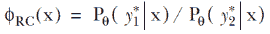

现在让我们再次输入我们的数字：

0.6439 / 0.2369 = 2.71828

我们得到了自然对数，*e* = 2.71828！同样，如果我们使用以 10 为底，我们得到

90.01% / 9.001% = 10

我们得到了 10——我们使用的基数！这个例子很好地说明了为什么 *e* 是生成置信度的任意基数。（有关此主题的更多信息，请参阅附录。）在这个上下文中，“行人”真的比“动物”更有可能作为预测吗？可能不是。怀疑它确实比“动物”多 10 倍的可能性。唯一告诉我们的是，置信度比率告诉我们“行人”和“动物”之间的原始得分差异为“1”——仅此而已。使用除法的置信度比率可以用原始得分来定义，在这种情况下，使用 softmax(base=)，其中是 softmax 中使用的基数（如果不是 *e*）：

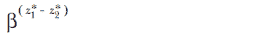

置信度比率在 softmax 中使用的任何基数上都是不变的。得分完全由你的模型中最高两个原始得分之间的距离决定；因此，通过基数或温度进行缩放不会改变排名顺序。为了给置信度比率一个 0-1 的归一化范围，你只需取前面方程的倒数：

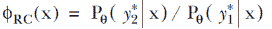

我们使用上面的非倒置版本是为了直接输出它们的 softmax 基数，以便说明。以下列表展示了使用 PyTorch 实现的置信度比率采样。

列表 3.4 PyTorch 中的置信度比率采样

```
def ratio_confidence(*self*,  prob_dist, sorted=False):
    *"""* 
    *Returns the uncertainty score of a probability distribution using*
    *ratio of confidence sampling in 0-1 range where 1 is most uncertain*

    *Assumes probability distribution is a pytorch tensor, like:* 
      *tensor([0.0321, 0.6439, 0.0871, 0.2369])*

    *Keyword arguments:*
      *prob_dist --  pytorch tensor of real numbers between 0 and 1 that total* 
      ➥ *to 1.0*
      *sorted -- if the probability distribution is pre-sorted from largest to* 
      ➥ *smallest*
        *"""*
    if not sorted:
      prob_dist, _ = torch.sort(prob_dist, descending=True) 

    ratio_conf = prob_dist.data[1] / prob_dist.data[0]

    return ratio_conf.item()
```

我希望这个例子能给你另一个直观的理由，说明为什么置信度采样边际相对不变：当你的目标是进行排名时，从你的两个最高值中减去和除以你的两个最高值之间没有太大差异。

幸运的是，当置信度边际减法与置信度比率不同时，它通过优先考虑最不确定的来做到我们想要的事情。尽管置信度边际和置信度比率没有明确查看两个最自信的置信度之外的内容，但它们影响了可能的值。如果第三自信的值是 0.25，第一和第二的值最多可以相差 0.5。所以如果第三自信的预测相对接近第一和第二，置信度边际的不确定性得分就会增加。这种变化很小，并不是直接由置信度边际引起的；它是 softmax 方程中的分母更大的副产品，由于第三自信的值更大，它成为不成比例地更大的指数。尽管如此，这种行为是正确的；在其他条件相同的情况下，置信度边际在可能平局的情况下寻找两个最自信预测之外的不确定性。

与置信度边际不同，其中从第三到 *nth* 预测的变化是 softmax 的幸运副产品，我们的下一个最受欢迎的不确定性采样策略明确地模拟了所有预测。

### 3.2.4 熵（分类熵）

观察一组预测中的不确定性的方法之一是看你是否会因结果而感到惊讶。这一概念是熵技术的基础。相对于它们的概率，你会对每个可能的结果感到多么惊讶？

将熵和惊讶用你长期支持的体育队伍来考虑是很直观的，即使它处于输球状态。对我来说，这支队伍是底特律雄狮美式足球队。近年来，即使雄狮在比赛中早期领先，他们赢得比赛的概率也只有 50%。所以即使雄狮在比赛中早期领先，我也不知道结果会怎样，而且每场比赛无论哪种结果都会有相等程度的惊讶。熵并不衡量输球的情感负担——只衡量惊讶。熵方程为我们提供了一个数学上合理的计算结果惊讶的方法，如图 3.3 所示。


图 3.3 低熵（左）和高熵（右）的示例。高熵发生在概率最相似的时候，并且从分布中任何单个预测的惊讶程度最大。熵有时有点反直觉，因为左边的图有最大的变异性和三个极不可能的事件。然而，这三个不可能的事件却被一个高度可能的事件所抵消。四个在相等可能性附近的事件将具有更大的总熵，即使这三个罕见的事件在它们发生的罕见时刻会有更大的信息。

将熵应用于概率分布，涉及将每个概率乘以其自身的对数并取负和：

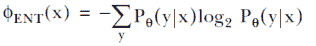

我们可以通过除以预测（标签）数量的对数将熵转换为 0-1 范围：

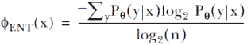

以下列表展示了使用 Python 和 PyTorch 库实现熵分数比率的示例。

列表 3.5 PyTorch 中的基于熵的采样

```
def entropy_based(*self*,  prob_dist):
    *"""* 
    *Returns uncertainty score of a probability distribution using entropy* 

    *Assumes probability distribution is a pytorch tensor, like:* 
      *tensor([0.0321, 0.6439, 0.0871, 0.2369])*

    *Keyword arguments:*
      *prob_dist -- a pytorch tensor of real numbers between 0 and 1 that* 
      ➥ *total to 1.0*
      *sorted -- if the probability distribution is pre-sorted from largest to* 
      ➥ *smallest*
    *"""*
    log_probs = prob_dist * torch.log2(prob_dist)     ❶
    raw_entropy = 0 - torch.sum(log_probs)

    normalized_entropy = raw_entropy / math.log2(prob_dist.numel())

    return normalized_entropy.item()
```

❶ 将每个概率乘以其以 2 为底的对数。

首先，不要因为另一个任意的基数，即用于历史原因的 log(base=2)，而感到害怕：熵的基数选择不会改变不确定性采样的排名顺序。与 softmax 不同，使用不同基数的熵计算对于不确定性采样不会改变数据集上分数的排名顺序。根据基数，你会得到不同的熵分数，但熵分数将对于每个概率分布单调变化，因此不会改变不确定性采样的排名顺序。以 2 为基数用于熵的历史原因，因为熵来自信息理论，它处理以二进制位压缩数据流。让我们计算我们示例数据的熵：

| 预测标签 | 骑行者 | 行人 | 标志 | 动物 |
| --- | --- | --- | --- | --- |
| P(y | x) 即 softmax | 0.0321 | 0.6439 | 0.0871 | 0.2369 |
| log2(P(y | x)) | –4.963 | –0.635 | –3.520 | –2.078 |
| P(y | x) log2(P(y | x)) | –0.159 | –0.409 | –0.307 | –0.492 |

将这些数字相加并取反

0 – SUM(–0.159, –0.409, –0.307, –0.492) = 1.367

除以标签数量的对数返回

1.367 / log2 = 0.684

注意，P(y|x) log(P(y|x))这一步与 softmax 算法给出的概率分布不是单调的。“行人”返回-0.409，但“动物”返回-0.492。因此，“动物”尽管不是最自信或最不自信的预测，却对最终的熵得分贡献最大。

根据熵对数据进行排序的不确定性对 softmax 算法使用的基数很敏感，并且与最小置信度几乎同样敏感。为什么是这样很直观：熵*明确地*使用了概率分布中的每一个数字，因此这些数字通过更高的基数分散得越远，结果就会越发散。

回想我们之前的例子，其中 softmax(base=10)给出约 0.9%的置信度，这将导致不确定性得分为 0.1——远小于相同数据上的 0.35。对于不同的基数，这个分数将改变整体排名。softmax 的更高基数会拉大最自信标签和其他标签之间的差异。

### 3.2.5 深入探讨熵

如果你想深入了解熵，可以尝试将不同的置信度插入方程的内侧，每个置信度乘以其自身的对数，例如 0.3 * log(0.3)。对于这种熵度量，P(y|x) log(P(y|x))的每次预测得分将返回大约 0.3679 的（负）最大值。与 softmax 不同，欧拉数是特殊的，因为 e^(-1) = 0.3679。用来推导这个结果的公式被称为*欧拉公式*，它本身是 9 世纪左右创造的*Thâbit ibn Kurrah 规则*的推导。无论你使用什么基数来计算熵，每个预测的最大（负）值都会接近 0.3679，这应该有助于你理解为什么在这个情况下基数并不重要。

在机器学习和信号处理中，你会在几个地方遇到熵，所以这个方程是一个很好的理解点。幸运的是，你不需要推导欧拉公式或 Thâbit ibn Kurrah 规则来使用熵进行不确定性采样。0.3679（或接近这个数字）对熵贡献最大的直觉相当简单：

+   如果概率是 1.0，模型是完全可预测的，没有熵。

+   如果概率是 0.0，那么这个数据点对熵没有任何贡献，因为它永远不会发生。

+   因此，在每次预测的基础上，0.0 和 1.0 之间的某个数字对熵是最优的。

但 0.3679 仅对单个概率是最佳的。使用一个标签的概率为 0.3679，你将只为每个其他标签留下 0.6431。因此，整个概率分布的最高熵，而不仅仅是单个值，总是在每个概率都相同且等于标签数量的倒数时发生。

## 3.3 识别不同类型模型混淆的时刻

你最有可能在机器学习中使用神经网络模型，但神经网络模型有许多不同的架构，还有许多其他流行的监督机器学习算法。几乎每个机器学习库或服务都会返回它们算法的某种形式的分数，这些分数可以用于不确定性采样。在某些情况下，你将能够直接使用这些分数；在其他情况下，你将不得不使用类似 softmax 的方法将分数转换为概率分布。

即使你只使用神经网络或常见机器学习库和服务的默认设置进行预测模型，了解算法的全范围以及不同类型的机器学习模型中不确定性的定义也是很有用的。有些与我们从神经网络模型中得出的解释大不相同，但并不一定更好或更差，因此这将帮助你欣赏不同常见方法的优缺点。不同类型机器学习算法的不确定性确定策略总结在图 3.4 中，并在本节中更详细地展开。

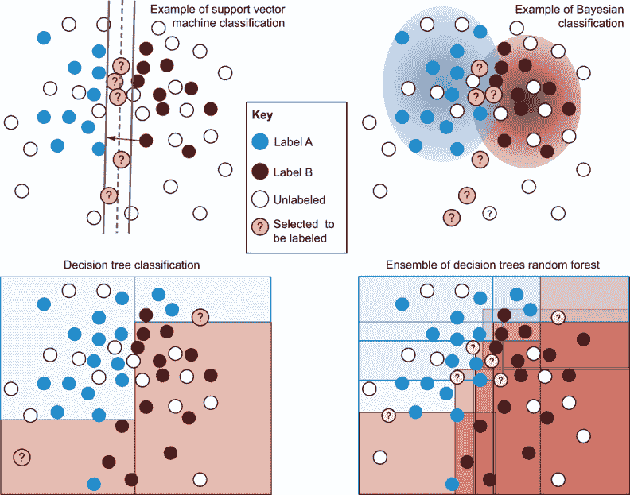

图 3.4 不同监督机器学习算法的不确定性采样。

*左上角*：支持向量机（SVM）的决策边界。与神经网络模型一样，判别性学习器试图找到一种最优地划分数据的方法。与神经网络分类器不同，SVM 还试图最大化边界的宽度。这就是 SVM 决定多个可能的中心线中哪一个是最佳划分的方法：它具有最宽的边界。请注意，从分隔器（SVM 的超平面）的距离是从分隔器的远端，而不是中间线。

*右上角*：一个潜在的贝叶斯模型。这个模型是一个生成式监督学习模型，试图模拟每个标签的分布，而不是模拟它们之间的边界。基于每个标签的置信度可以直接读取为该标签的概率。

*Bottom left*: 决策树可能提供的划分，一次只按一个特征划分并递归细分数据。置信度定义为最终桶（叶子节点）中标签的百分比，例如，左下角的叶子节点有一个标签 A 和三个标签 B，因此在那个叶子节点中的预测会有 25%的置信度在标签 A 上，75%的置信度在标签 B 上。决策树对它们可以划分多深很敏感——它们可以继续划分到只有一个项目的叶子节点——因此概率通常不可靠。

*Bottom right*: 决策树的集成，其中最著名的变体是随机森林。训练了多个决策树。不同的树通常是通过在不同的数据子集和/或特征上训练来实现的。标签的置信度可以是所有模型预测中一个项目被预测的百分比，或者所有预测的平均置信度。

### 3.3.1 使用逻辑回归和 MaxEnt 模型的不确定性采样

对于解释模型置信度，你可以将逻辑回归和最大熵（MaxEnt）模型视为与神经网络模型相同。逻辑回归模型、MaxEnt 模型和单层神经网络模型之间几乎没有区别（有时没有区别）。因此，你可以像对神经网络模型那样应用不确定性采样：你可能得到 softmax 输出，或者得到可以应用 softmax 的分数。同样需要注意：逻辑回归或 MaxEnt 模型的任务不是准确计算模型的置信度，因为模型试图在标签之间最优地区分，所以你可能需要尝试不同的基数/温度来生成你的概率分布。

### 3.3.2 使用 SVMs 的不确定性采样

支持向量机（SVMs）代表另一种类型的判别学习。与神经网络模型一样，它们试图找到一种最优划分数据的方法。与神经网络分类器不同，SVMs 还试图最大化边界的宽度并决定多个可能的划分中哪一个是正确的。最优边界定义为最宽的边界——更具体地说，是最佳地模拟标签与划分边界另一侧的最大距离的边界。你可以在图 3.5 中看到 SVMs 的例子。支持向量本身是定义边界的数据点。

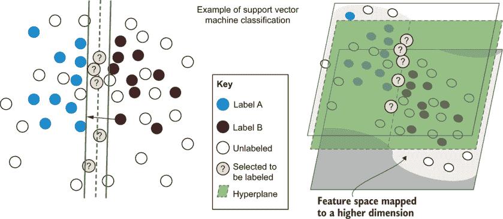

图 3.5 SVM 将我们的示例 2D 数据集（顶部）投影到 3D（底部），以便线性平面可以分离两组标签：标签 A 位于平面之上，标签 B 位于平面之下。采样项是最接近平面的。如果你想学习一些重要的早期主动学习文献，你需要了解 SVMs 在这个高级别是如何工作的。

SVMs also differ in how they model more complicated distributions. Neural networks use hidden layers to discover boundaries between labels that are more complicated than simple linear divisions. Two hidden layers are enough to define any function. SVMs more or less do the same thing, but with predefined functions that map the data into higher dimensions. In figure 3.5, our 2D example data is projected into a third dimension that raises items on one side of that function and lowers them on the other. With the projection into a higher dimension, the data is linearly separable, and a plane divides the two labels.

It is many orders of magnitude more efficient to train a model when you’ve predefined the type of function (as in SVMs) rather than let your model find the function itself among all possible alternatives (as in neural models). The chance of predefining the correct function type is low, however, and the cost of hardware is coming down while speed is going up, so SVMs are rarely used today, compared with their earlier popularity.

### 3.3.3 使用贝叶斯模型的不确定性采样

*贝叶斯模型*是生成式监督学习模型，这意味着它们试图模拟每个标签及其潜在样本的分布，而不是模拟标签之间的边界。贝叶斯模型的优势在于你可以直接从模型中读取概率：

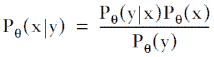

你不需要单独的步骤或特定的激活函数来将任意分数转换为概率分布；模型明确地计算一个项目具有标签的概率。因此，基于每个标签的置信度可以直接读取为该标签的概率。

因为它们不试图模拟标签之间的差异，所以贝叶斯模型通常无法在不进行大量微调的情况下捕获更复杂的决策边界。朴素贝叶斯算法因其无法模拟特征之间的线性关系（更不用说更复杂的线性关系）而获得了“朴素”这个名字，尽管它可以几乎瞬间用新的训练数据进行重新训练，这对于需要人工干预的系统来说很有吸引力。

贝叶斯模型也必须对数据分布做出假设，例如真实值落在正态分布内，这在你实际数据中可能并不一定成立。如果不小心，这些假设可能会使概率偏离真实值。尽管如此，它们通常会比判别模型的概率更可靠，但你不能盲目地信任它们，而不了解它们对数据的假设。

因此，尽管贝叶斯模型并不总是像判别性模型那样有可能获得相同的准确度，但它们通常会产生更可靠的置信度分数，因此可以直接用于主动学习。例如，如果你信任你的置信度分数，你可以根据该分数进行采样：采样 90%具有 0.9 不确定性的项目，采样 10%具有 0.1 不确定性的项目，依此类推。然而，在简单的标记任务之外，当人们谈论主动学习的贝叶斯方法时，他们通常指的是在判别性模型集成上的预测，这将在本章后面的第 3.4 节中介绍。

### 3.3.4 使用决策树和随机森林的不确定性采样

*决策树* 是一种判别性学习器，它一次只根据一个特征划分数据，递归地将数据划分为桶，直到最终的桶——叶节点——只包含一组标签。树通常在早期停止（*剪枝*），这样叶节点最终会有一些标签的多样性，模型不会过度拟合数据。本章前面的图 3.4 展示了这样一个例子。

置信度由该预测的叶节点中标签的百分比定义。例如，图 3.4 中左下角的叶节点有一个标签 A 和三个标签 B，因此在该叶节点中的预测会有 25%的置信度在标签 A 上，以及 75%的置信度在标签 B 上。

决策树对它们可以划分多深很敏感；它们可能会继续划分到只有一个项目的叶节点。相比之下，如果它们不够深，每个预测将包含很多噪声，桶会很大，同一桶中的相对较远的训练项目错误地贡献了置信度。因此，概率通常不可靠。

由于这个原因，单棵决策树的置信度很少被信任，并且不建议用于不确定性采样。它们在其他主动学习策略中可能很有用，我们将在后面介绍，但对于任何涉及决策树的主动学习，我建议你使用多棵树并合并结果。

*随机森林* 是最著名的决策树集成。在机器学习中，*集成* 指的是一组机器学习模型，这些模型被组合起来进行预测，我们将在第 3.4 节中更详细地介绍。

对于随机森林，训练了多个不同的决策树，目的是从每个决策树中得到略微不同的预测。不同的树通常是通过在不同的数据子集和/或特征上训练来实现的。标签的置信度可以是所有模型预测中一个项目被预测的百分比，或者是所有预测的平均置信度。

如图 3.4 所示，在右下角的图中结合了四个决策树，随着在多个预测中进行平均，两个标签之间的决策边界开始变得更加平缓。因此，随机森林在两个标签之间的边界上提供了一个很好的、有用的置信度近似。决策树训练速度快，所以如果您选择它们作为主动学习的算法，在随机森林中训练许多树几乎没有理由。

## 3.4 在多个预测中测量不确定性

有时，您可能已经从您的数据中构建了多个模型。您可能已经在尝试不同的模型类型或超参数，并希望将预测组合成一个单一的不确定性得分。如果不是这样，您可能想对您的数据尝试几种不同的模型来观察方差。即使您没有使用多个模型来处理您的数据，观察不同模型预测的变异也能让您对当前模型的不稳定性有一个直观的认识。

### 3.4.1 使用集成模型进行不确定性采样

与随机森林是一个监督学习算法的集成类似，您可以使用多种类型的算法来确定不确定性，并在它们之间进行汇总。图 3.6 显示了一个示例。不同的分类器由于使用了不同类型的统计方法，其置信度得分可能不太可能直接兼容。

结合多个分类器最简单的方法是按每个分类器的不确定性得分对项目进行排序，根据其排名顺序给每个项目分配一个新得分，然后将这些排名得分组合成一个主不确定性排名。


图 3.6：结合不同类型机器学习算法预测的集成模型：神经网络模型、SVMs、贝叶斯模型和决策树（决策森林）。预测可以通过各种方式（最大值、平均值等）组合，以找到每个未标记项目的联合不确定性。

您可以通过不同模型对项目标签的一致性频率来计算不确定性。分歧最大的项目是需要采样的对象。您还可以考虑预测的概率分布。您可以通过多种方式组合不同模型的预测：

+   所有模型中最低的最大置信度

+   模型间最小和最大置信度之间的差异

+   模型间最小和最大置信度之间的比率

+   所有模型中所有置信度的熵

+   所有模型中的平均置信度

您可能已经注意到，前四种方法与我们在单个预测中进行不确定性采样时使用的相同算法，但在这个情况下是跨多个预测。因此，您应该已经能够实现这些方法。

### 3.4.2 委员会查询和 dropout

在主动学习过程中，基于集成的方法有时被称为*委员会查询*，尤其是在仅使用一种机器学习算法进行集成时。你可以尝试使用基于神经模型的集成方法：多次训练一个模型，并查看每个神经模型预测中未标记数据的共识。如果你已经多次重新训练模型以调整超参数，那么利用不同的预测来帮助主动学习也是可以的。

按照随机森林方法，你可以尝试使用不同子集的项目或特征重新训练你的模型，以强制在构建的模型类型中实现多样性。这种方法将防止一个特征（或少数几个特征）主导最终的不确定性得分。

一种最近流行的用于神经模型的方法是使用 dropout。你可能熟悉在训练模型时使用 dropout：在训练模型时，你移除/忽略一些随机百分比的神经元/连接，以避免将模型过度拟合到任何特定的神经元。

你可以将 dropout 策略应用于预测：多次对项目进行预测，每次丢弃不同的随机选择的神经元/连接。这种方法会导致项目有多个置信度，你可以使用这些置信度与集成评估方法一起采样正确的项目，如图 3.7 所示。

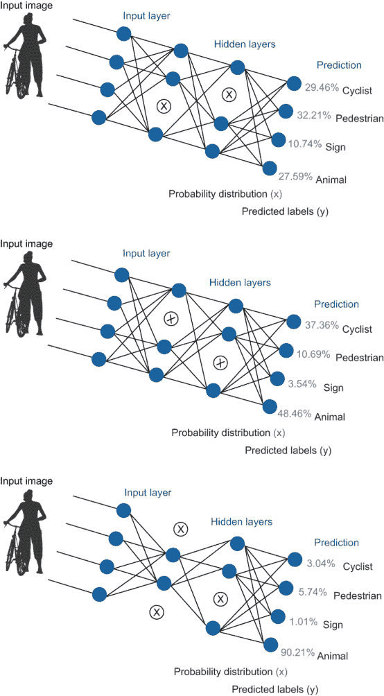

图 3.7 将 dropout 应用于模型以获得单个项目的多个预测。在每个预测中，随机丢弃（忽略）一组神经元，导致不同的置信度和（可能）不同的预测标签。然后，可以通过计算所有预测之间的变化来计算不确定性：不一致性越高，不确定性越大。从单个模型中获得多个预测的方法被称为*蒙特卡洛*dropout。

你将在本书的其余部分看到更多使用神经网络架构本身来帮助主动学习的例子。第四章，涵盖了多样性采样，以一个类似的例子开始，该例子使用模型激活来检测异常值，本书后面的许多高级技术也做同样的事情。

在人机交互的机器学习领域工作是一个令人兴奋的时代。你可以与机器学习算法的最新架构一起工作，并思考它们与人类-计算机交互的关系。

### 3.4.3 随机性和认知不确定性的区别

来自哲学文献的术语*随机不确定性*和*认知不确定性*在从未阅读过哲学文献的机器学习科学家中很受欢迎。在机器学习文献中，这些术语通常指的是使用的方法。"认知不确定性"是指单个模型预测中的不确定性，而"随机不确定性"是指多个预测中的不确定性（特别是在最近的文献中，尤其是蒙特卡洛 dropout）。"随机"在历史上意味着固有的随机性，而"认知"意味着缺乏知识，但这些定义只在机器学习中才有意义，在机器学习中没有新的数据可以标注，这在学术研究之外是罕见的。

因此，在阅读机器学习文献时，假设研究人员只讨论用于计算不确定性的方法，而不是更深层次的哲学意义。图 3.8 展示了这些差异。

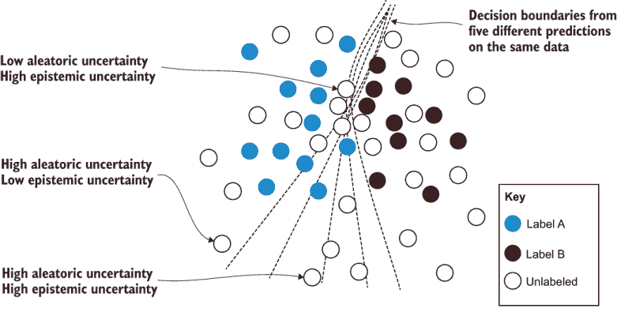

图 3.8 展示了根据在机器学习文献中最广泛使用的定义，随机不确定性和认知不确定性之间的差异。第一个突出显示的项目靠近所有五个预测的决策边界，因此具有高认知不确定性，但决策边界聚集在一起，因此具有低随机不确定性。第二个突出显示的项目具有低认知不确定性，因为它不靠近大多数决策边界，但它的决策边界距离有很大的变化，因此具有高随机不确定性。最后一个项目靠近平均决策边界，所有边界之间的距离变化很大，因此两种类型都具有高不确定性。

图 3.8 展示了如何通过多个预测来预测不确定性，除了从单个决策边界距离外，还可以从多个决策边界的方差来衡量。对于一个神经网络模型，从决策边界距离的变化可以计算为预测标签的变化，任何在 3.2 节中提到的不确定性采样指标的变化，或者每个预测整个概率分布的变化。

有关起始点的进一步阅读，请参阅 3.8 节，因为这个研究领域非常活跃。关于随机不确定性的文献往往关注最优类型的集成或 dropout，而关于认知不确定性的文献往往关注从单个模型中获得更准确的概率分布。

### 3.4.4 多标签和连续值分类

如果你的任务是多标签，允许每个项目有多个正确标签，你可以使用与集成相同的聚合方法来计算不确定性。你可以将每个标签视为一个二元分类器。然后你可以决定是否要平均不确定性，取最大不确定性，或使用本章前面介绍的其他聚合技术之一。

当你将每个标签视为一个二元分类器时，不确定性采样算法的类型（最小置信度、置信度范围等）之间没有区别，但你可能尝试在本节中*除了*跨不同标签聚合之外，还可以尝试集成方法。例如，你可以在你的数据上训练多个模型，然后聚合每个项目的每个标签的预测。这种方法将为每个项目的每个标签提供不同的不确定性值，你可以尝试不同的方法来聚合每个标签的不确定性，包括跨标签的不确定性。

对于连续值，例如预测真实值的回归模型而不是标签，你的模型可能不会在预测中给出置信度分数。在这些情况下，你可以应用集成方法并查看变化来计算不确定性。实际上，蒙特卡洛 dropout 最初用于估计不需要标注新数据的回归模型中的不确定性。在那个受控环境中，你可以认为*认知不确定性*是正确的术语。

第六章涵盖了主动学习在许多用例中的应用，关于目标检测的部分更详细地讨论了回归中的不确定性。第十章有一个专门的部分用于评估连续任务的标注准确性，这可能与你的任务也相关。我建议你阅读这两章，以了解更多关于与预测连续值的模型一起工作的细节。

## 3.5 选择合适数量的人为审查项目

不确定性采样是一个迭代过程。你选择一定数量的项目供人工审查，重新训练你的模型，然后重复这个过程。回想一下第一章中，如果不进行多样性采样，仅对不确定性进行采样的潜在缺点，如图 3.9 所示。

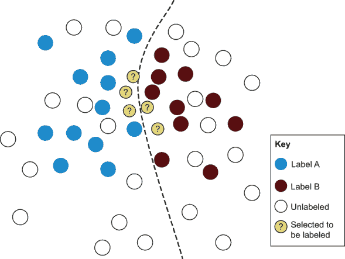

图 3.9 从特征空间相同区域选择的不确定性项目，因此缺乏多样性

这里最不确定的项目都彼此靠近。在真实示例中，成千上万的示例可能会聚集在一起，并且不需要对它们全部进行采样。无论项目是从哪里采样的，你都无法完全确定直到人工提供了标签并且模型重新训练后，对模型的影响是什么。

重新训练模型可能需要很长时间，然而，在此期间要求人工标注员等待可能会浪费他们的时间。有两个相互竞争的力量在起作用：

+   最小化样本大小将确保在每次迭代中从每个数据点中获得最大利益。

+   最大化样本大小将确保更多项目能够更快地被标注，并且模型需要重新训练的频率更低。

正如你在第二章中看到的，你的模型在早期迭代中多样性较低，但随着模型的重新训练，这种情况在后续迭代中自行纠正。最终的决定取决于业务流程。在最近的翻译工作中，我们希望我们的模型能在几秒钟内适应，以便在翻译者工作时看起来能够实时响应。我也看到过一些公司对每年大约一次的迭代来适应新数据感到满意。

### 3.5.1 预算约束的不确定性采样

如果你有一个固定的标注预算，你应该尽量进行尽可能多的迭代。可能的迭代次数将取决于你是否按标签（如许多众包工作者模型）或按小时（如许多专家人类模型）支付标注者的报酬。

如果你的预算是按标签计算的，这意味着无论获取这些标签之间的时间间隔有多长，你都要支付固定的价格，那么最佳做法是优化以实现尽可能多的迭代次数。人们确实倾向于在等待模型训练时感到无聊。当重新训练模型需要超过几天时，我看到人们最多进行大约 10 次迭代并相应地计划。选择 10 并没有特别的原因：这是一个直观的迭代次数，用于监控准确性的变化。

如果你的预算是按小时计算的，这意味着你每天有固定的人数来标注固定的小时数，那么最佳做法是始终确保有可用的数据用于标注。让标注者逐步通过不确定性的排名顺序处理未标注的项目，并在固定间隔内重新训练模型，每当新模型准备好时，就用新的不确定性排名替换旧的排名。如果你使用不确定性采样并且想要避免只从问题空间的一个部分过度采样，你应该定期更换模型。现实中，如果有人全职为你标注数据，你应该给予他们应有的尊重，实施本书中提到的多种主动学习采样策略，并从所有这些策略中进行采样，这样那些人就会觉得自己贡献了最大的价值。你也更不可能引入仅实施一个算法可能导致的偏差，因此人和机器都能得分。我们将在第七章中回到不同类型的标注工作队伍的策略。

### 3.5.2 时间约束的不确定性采样

如果你时间紧迫，需要快速推出更新后的模型，你应该考虑尽可能快速重新训练模型的策略，正如第二章所述。最快的方法是使用简单的模型。只有一个或两个层（或者更好的是，使用朴素贝叶斯模型）的模型可以非常快速地重新训练，让你能够快速迭代。此外，有一些证据表明，从更简单的模型中进行的不确定性采样可以与从更复杂的模型中进行采样一样有效。记住，我们寻找的是最大的困惑，而不是最大的准确性。只要一个简单模型对相同项目的困惑程度与一个更复杂的模型相同，这两个模型就会采样相同的项。

一种更高级的方法是只重新训练一个更大模型的最後一层（或几层）。你可以通过只使用新数据重新训练最后一层来快速重新训练你的模型，而不是重新训练整个模型。这个过程可能只需要几秒钟，而不是几周。重新训练的模型不一定那么准确，但它可能很接近。与选择一个更简单的模型一样，如果目标是寻找更多的不确定性，这种准确性的微小损失可能并不重要。更快的迭代甚至可能产生比等待很长时间用更少的迭代重新训练整个模型更准确的模型。

一种更高级的方法是取两者之长：使用方法来发现哪些参数是重新训练整个模型时最重要的，然后只重新训练它们。这种方法可以提供与重新训练整个模型相同的准确性，但所需时间却少得多。

另一种可以更容易实施的高级方法是拥有两个模型：一个增量模型，它会立即更新每个新的训练项，另一个模型则定期从头开始重新训练。第十二章中的一个示例实现就使用了这种架构。

### 3.5.3 如果我没有时间或预算限制，何时停止？

真幸运！你应该在你模型不再变得更准确的时候停止。如果你已经尝试了许多不确定性采样的策略，并且在达到一定准确性后没有获得任何更多收益，那么这个条件是一个很好的信号，表明你应该停止并思考其他主动学习和/或算法策略，如果你的期望准确性目标尚未实现。

随着你标注的数据越来越多，你最终会发现收益递减；无论你使用什么策略，随着你添加更多数据，学习率都会下降。即使这个比率还没有达到平台期，你也应该能够对每条标签的准确性以及这些标签的成本进行成本效益分析。

## 3.6 评估主动学习的成功

总是评估不确定性采样在随机选择的、保留的测试集上。如果在每次迭代后从你的训练数据中随机选择测试数据，你就不知道你的实际准确率是多少。事实上，你的准确率可能看起来比实际要低。通过选择难以分类的项目，你很可能会过度采样固有的模糊项。如果你在固有的模糊项上测试得更多，你更有可能看到错误。（我们在第二章中讨论了这个问题，但在这里重复一遍。）因此，不要陷入忘记在不确定性采样之外随机采样的陷阱：你将不知道你的模型是否在改进！

### 3.6.1 我需要新的测试数据吗？

如果你已经保留了测试数据集，并且你知道未标记的数据与你的训练数据大致相同，你不需要额外的测试数据。你可以继续在相同的数据上进行测试。

如果你知道测试数据与你的原始训练数据分布不同，或者如果你不确定，你应该通过随机选择未标记的项目来收集额外的标签，并将它们添加到你的测试集中或创建第二个独立的测试集。

小贴士：在第一次迭代的不确定性采样之前创建你的新测试集。

一旦你通过不确定性采样从池中移除了一些未标记的项目，这个池就不再是随机选择了。现在，这个池偏向于*自信地*预测的项目，因此从这个池中随机选择很可能会在用作测试集时返回错误的高精度。

在所有迭代过程中保持你的测试集独立，并不要允许其项目成为任何采样策略的一部分。如果你在迭代了几次之后才忘记这样做，并且你的随机样本包括通过不确定性采样选择的项目，你需要回到第一次迭代。你不能简单地从训练数据中移除那些测试项目，因为它们在中间的不确定性采样策略中已经被训练并做出了贡献。

也是一个好主意，看看你的不确定性采样技术在随机采样的基线旁边表现如何。如果你没有比随机采样更准确，你应该重新考虑你的策略！选择随机选择的项，对于这些项，你知道比较将具有统计学意义：通常，几百个项就足够了。与你的整个模型的评估数据不同，这些项可以在下一次迭代中添加到你的训练数据中，因为你正在比较每个步骤的采样策略，考虑到剩余需要标记的内容。

最后，你可能希望包括一些随机选择的物品，以及由不确定性采样选择的物品。如果你不打算实现第四章中的一些多样性采样方法，随机采样将给你提供最基本的形式的多样性采样，并确保每个数据点都有机会得到人工审查。

### 3.6.2 我需要新的验证数据吗？

你还应该考虑在每个迭代中最多使用四个验证集，数据来自

+   与测试集相同的分布

+   每个迭代中剩余的未标记物品

+   每个迭代中与新采样物品相同的分布

+   每个迭代中与总训练集相同的分布

如果你是在每次添加数据后调整模型参数，你将使用验证集来评估准确性。如果你在测试集上调整模型，你将不知道你的模型是否真正泛化，或者你只是找到了一组恰好与特定评估数据配合得很好的参数。

验证集将让你在查看测试集的情况下调整模型的准确性。通常，你从一开始就会有一个验证集。与你的测试集一样，如果你认为未标记的物品来自与你的初始训练数据相同的分布，你不需要更新/替换它。否则，你应该在不确定性采样的第一次迭代之前更新你的验证数据，就像你的测试数据一样。

你可能想使用第二个验证集来测试你的主动学习策略在每个迭代中的表现如何。在你开始主动学习迭代后，剩余的未标记物品将不再是一个随机样本，因此这个分布将不同于你现有的测试集和验证集。这个数据集作为每个迭代的基线。不确定性采样是否仍然比从剩余物品中随机选择给出更好的结果？因为这个数据集只对一次迭代有用，所以在每个迭代结束时将这些物品添加到训练数据中是可以的；这些标签不是被丢弃的人工标签。

如果你想评估每一轮中创建的人为标签的准确性，你应该在从与新采样数据相同分布中抽取的第三个验证数据集上进行此操作。你的新采样数据可能对于人类来说天生更容易或更难进行标签化，因此你需要在该相同分布上评估人类准确性。

最后，你应该考虑在每个迭代中随机从训练数据中抽取的第四个验证集。这些验证数据可以用来确保模型没有过度拟合训练数据，许多机器学习库默认会这样做。如果你的验证数据和训练数据不是来自相同的分布，将很难估计你过度拟合了多少，因此拥有一个单独的验证集来检查过度拟合是一个好主意。

缺点是高达四个验证数据集的人工标注成本。在工业界，我经常看到人们使用错误的验证数据集，通常是在所有情况下都使用一个验证集。最常见的原因是人们希望尽可能多地将其标注项目放入训练数据中，以便更快地使模型更准确。当然，这也是主动学习的目标，但没有正确的验证数据，您将不知道下一步的战略方向以获得更高的准确性。

## 3.7 不确定性采样速查表

本文中的示例数据只有两个标签。不确定性采样算法将返回具有两个标签的相同样本。图 3.10 展示了当有三个标签时，不同算法的目标区域示例。该图显示，置信度边际和比率采样了一些只有成对混淆的项目，这反映了算法只针对最有可能的两个标签。相比之下，熵最大化所有标签之间的混淆，这也是为什么最高浓度出现在所有三个标签之间。

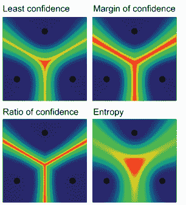

图 3.10 四种主要不确定性采样算法的热图以及它们为三个标签问题采样的区域。在这个例子中，每个点是一个具有不同标签的项目，每个像素的热度是不确定性。最热（最不确定）的像素是最浅的像素（如果你在彩色模式下查看，是红色像素）。左上角是最小置信度采样，右上角是置信度边际采样，左下角是比率采样，右下角是基于熵的采样。主要收获是置信度边际和比率采样了一些只有成对混淆的项目，而熵最大化所有标签之间的混淆。

注意，随着标签数量的增加，方法之间的差异变得更加极端。图 3.11 比较了配置以突出显示方法之间的差异。


图 3.11 方法比较。左边的四个图像显示，置信度边际和比率的不确定性空间大部分在两个标签之间，由于对第三个标签来说并不模糊，因此熵完全忽略了这一点。右边的四个图像显示，特别是在更复杂的任务中，不同不确定性采样算法将要采样的项目将不同。¹

TIP 您可以在[`robertmunro.com/uncertainty_sampling_example.html`](http://robertmunro.com/uncertainty_sampling_example.html)上尝试 3.10 和 3.11 图标的交互式版本。交互式示例的源代码实现了 JavaScript 中的不确定性采样算法，但您可能更希望使用与本章相关的 PyTorch 和 NumPy 代码库中的 Python 示例。

图 3.12 总结了本章中你已实现的四个不确定性采样算法。


图 3.12 不确定性采样速查表

## 3.8 进一步阅读

不确定性采样已经存在很长时间了，关于它的很多优秀文献已经被撰写。对于不确定性采样的最前沿研究，寻找那些自身被频繁引用的近期论文。

注意，大多数论文都没有将分数归一化到[0, 1]的范围。如果你打算将你的模型部署到现实世界的情况中，我强烈建议你归一化输出。即使归一化输出不会改变准确性，它也会使检查更容易，并防止下游处理中的问题，特别是对于你将在后续章节中学习的先进方法。

### 3.8.1 关于最小置信度采样的进一步阅读

关于最小置信度的一个早期论文是“Aron Culotta 和 Andrew McCallum 的《Reducing labeling effort for structured prediction tasks》”，[链接](http://mng.bz/opYj)。

### 3.8.2 关于置信度边界采样的进一步阅读

关于置信度边界的早期论文是“Tobias Scheffer, Christian Decomain 和 Stefan Wrobel 的《Active Hidden Markov Models for Information Extraction》”，[链接](http://mng.bz/nMO8)。

### 3.8.3 关于置信度采样比率的进一步阅读

我不知道关于置信度比率的文章，尽管我在主动学习课程中教授了这个主题。当这本书中提出时，比率和 softmax 基础/温度之间的关系是新的。由于置信度比率与置信度边界相似，因为两者都关注两个最自信预测之间的关系，所以置信度边界的文献应该大部分是相关的。

### 3.8.4 关于基于熵采样的进一步阅读

关于基于熵采样的一个早期论文是“Ido Dagan 和 Sean P. Engelson 的《Committee-Based Sampling For Training Probabilistic Classifiers》”，[链接](http://mng.bz/vzWq)。

### 3.8.5 关于其他机器学习模型的进一步阅读

关于不确定性采样的一般性基础论文是“David D. Lewis 和 William A. Gale 的《A Sequential Algorithm for Training Text Classifiers》”，[链接](http://mng.bz/4ZQg)。这篇论文使用贝叶斯分类器。如果你查看下个十年高度引用的文本，你会发现 SVMs 和线性模型很常见。由于本章中提到的理由，我不建议你尝试使用决策树实现不确定性采样。

### 3.8.6 关于基于集成的不确定性采样的进一步阅读

Dagan 和 Engelson 的论文（第 3.8.4 节）涵盖了多个分类器（委员会查询）的使用案例，因此它是集成模型的一个良好起点。对于更多关注神经模型的研究，包括 dropout 和贝叶斯方法以更好地估计不确定性，一个良好的入门点是 Zachary C. Lipton 和 Aditya Siddhant 的“Deep Bayesian Active Learning for Natural Language Processing: Results of a Large-Scale Empirical Study”（[`mng.bz/Qmae`](http://mng.bz/Qmae)）。

你会在学术论文中看到随机 dropout 称为蒙特卡洛 dropout 和贝叶斯（深度）主动学习。无论名称如何，策略仍然是随机选择在预测期间忽略的神经元/连接。术语“蒙特卡洛”是发明该术语的物理学家开的玩笑。术语“贝叶斯”来自如果你眯着眼睛看变化，它看起来像高斯分布；它实际上不是一个贝叶斯分类器。在理解术语的积极方面，通过在预测期间向你的模型传递一个额外的参数，你可以通过告诉你的朋友你刚刚实现了“蒙特卡洛 dropout 用于贝叶斯深度主动学习”来让他们印象深刻。

## 摘要

+   有四种常见的算法用于不确定性采样：最小置信度、置信度范围、置信度比和熵。这些算法可以帮助你理解你模型中的不同类型的“已知未知”。

+   你可以从每种不确定性采样算法中获取不同的样本。理解为什么将帮助你决定哪种方式是衡量你模型中不确定性的最佳方法。

+   不同的监督机器学习算法，包括神经网络模型、贝叶斯模型、SVM 和决策树，会输出不同类型的分数。理解每个分数将帮助您解释它们以确定不确定性。

+   集成方法和 dropout 可以用于为同一项目创建多个预测。你可以通过查看不同模型预测中的变化来计算不确定性。

+   在每个主动学习周期内获取更多注释与在更多周期内获取较少注释之间存在权衡。理解这些权衡将让你在使用不确定性采样时能够选择正确的周期数量和每个周期的规模。

+   你可能想要创建不同类型的验证数据来评估你系统的不同部分。理解不同类型的验证数据将让你能够选择正确的数据来调整每个组件。

+   正确的测试框架将帮助你计算你系统的准确性，确保你正确地测量性能提升，而不是无意中偏差了你的数据。

* * *

^(1.)感谢 Adrian Calma 建议使用左侧图像作为突出差异的绝佳方式。
