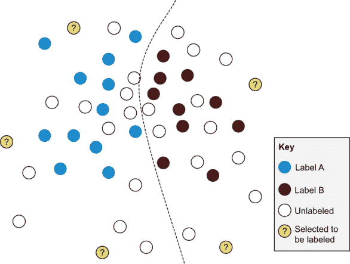
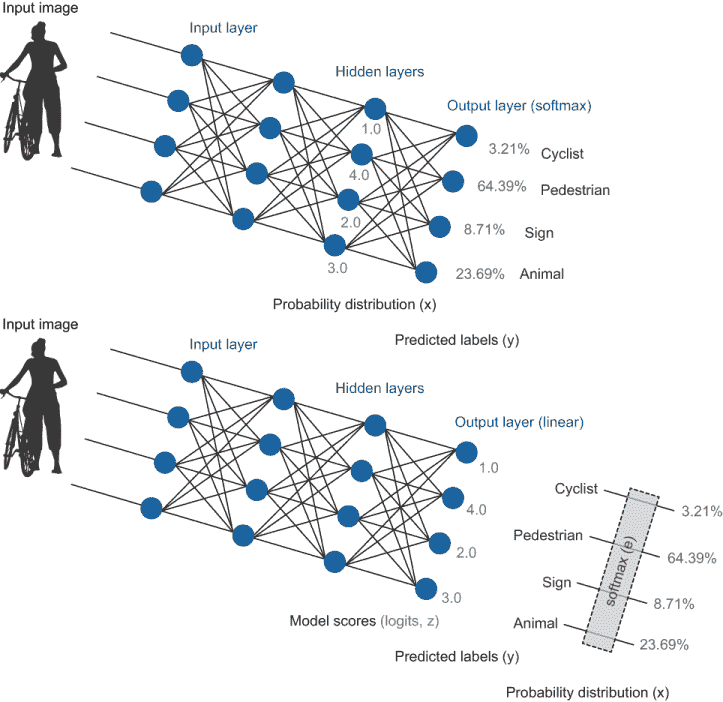
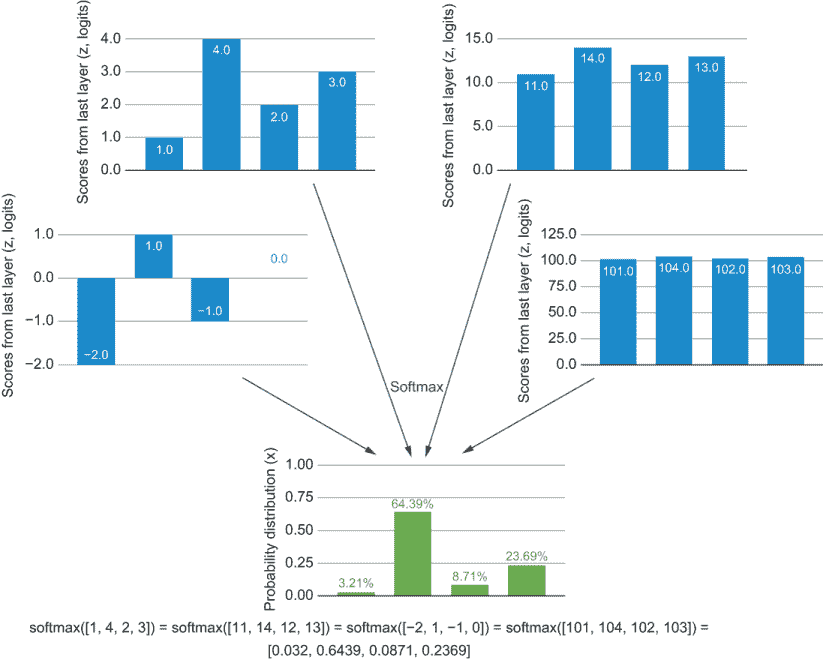
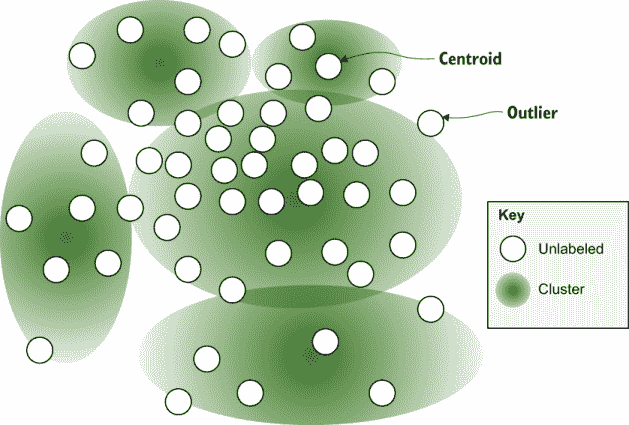
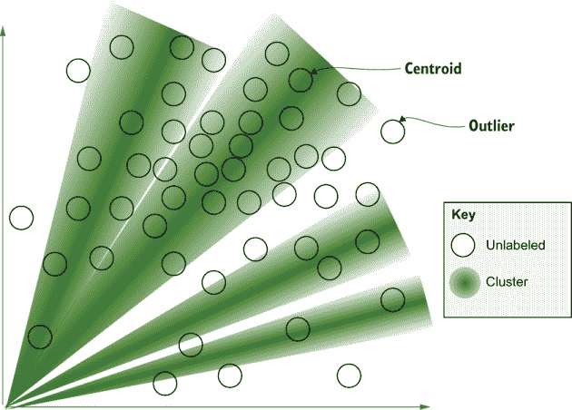
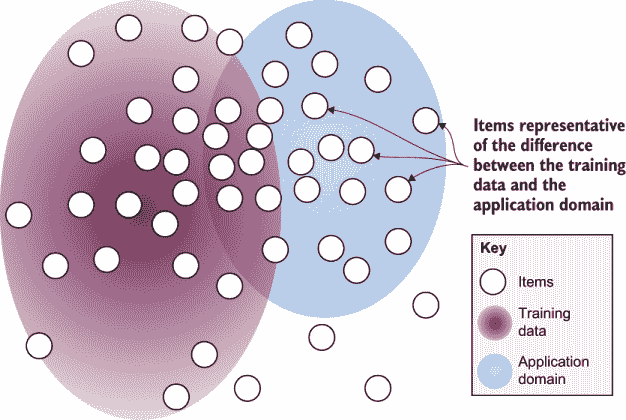
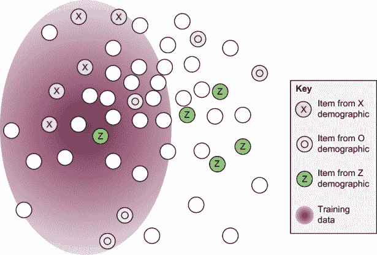
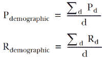
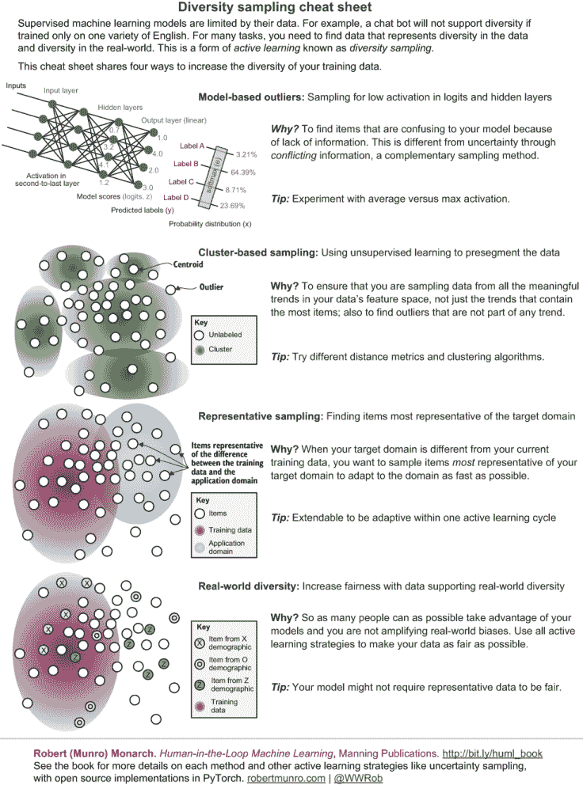

# 4 多样性采样

本章涵盖

+   使用异常检测来采样当前模型未知的数据

+   在标注开始之前，使用聚类来采样更多样化的数据

+   使用代表性采样来针对与模型部署位置最相似的数据

+   通过分层采样和主动学习提高现实世界的多样性

+   使用不同类型的机器学习架构进行多样性采样

+   评估多样性采样的成功

在第三章中，你学习了如何识别模型的不确定性：模型“知道它不知道”的地方。在本章中，你将学习如何识别模型中缺失的部分：模型“不知道它不知道”的“未知未知”，或称为“未知未知”。这个问题很棘手，因为模型需要知道的信息通常是一个在不断变化的世界中的移动目标。就像人类每天都会学习新单词、新物体和新行为来适应不断变化的环境一样，大多数机器学习算法都是在不断变化的环境中部署的。

例如，如果我们使用机器学习来分类或处理人类语言，我们通常期望应用能够适应新单词和新含义，而不是保持陈旧，只理解历史某个时间点的语言。在接下来的章节中，我们将探讨语音识别和计算机视觉中的几个用例，以说明多样性采样对不同类型机器学习问题的价值。

假设你的工作是构建一个可以为尽可能多的用户成功的语音助手。你公司的领导期望你的机器学习算法比任何一个人都拥有更广泛的知识。典型的英语使用者知道大约 40,000 个单词，占英语 20 万词汇量的 20%，但你的模型应该接近 100%的覆盖率。你有很多未标记的录音可以标记，但其中一些单词的使用频率很低。如果你随机采样这些录音，你会错过这些罕见的单词。因此，你需要明确尝试获取尽可能覆盖不同单词的训练数据。你也可能想了解人们在与其语音助手交谈时最常使用的单词，并采样更多这些单词。

你还担心人口统计学上的多样性。录音主要来自一个性别，以及生活在少数几个地区的人，因此生成的模型可能只对那个性别和某些口音更准确。你希望尽可能公平地从不同的群体中采样，以使模型对所有群体都同样准确。

最后，许多人不会说英语，但希望有一个语音助手，但你几乎没有非英语数据。你可能不得不公开诚实地承认这种多样性方面的限制。

这个问题比仅仅知道模型何时困惑更难，因此多样性采样的解决方案本身在算法上比不确定性采样的解决方案更加多样化。

## 4.1 了解你所不知道的：识别模型知识中的差距

在本章中，我们探讨了四种多样性采样的方法：

+   *基于模型的异常值采样*—确定在当前状态下模型不知道哪些项目（与第三章中的不确定相比）。在我们的语音助手例子中，基于模型的异常值采样将有助于识别我们的语音助手之前未曾遇到过的单词。

+   *基于聚类的采样*—使用独立于你的模型的统计方法来找到用于标记的多样化项目选择。在我们的例子中，基于聚类的采样将有助于识别数据中的自然趋势，这样我们就可以确保不遗漏任何罕见但有意义的变化。

+   *代表性采样*—找到与你的目标领域最相似的未标记项目样本，与你的训练数据相比。在我们的例子中，让我们假设人们主要使用你的语音助手来请求歌曲。因此，代表性采样将针对歌曲请求的示例。

+   *针对现实世界多样性的采样*—确保我们的训练数据中包含各种现实世界实体的多样性，以减少现实世界的偏差。在我们的例子中，这种方法可能包括针对尽可能多的口音、年龄和性别进行录音。

正如你在本书的引言中所学到的，短语*不确定性采样*在主动学习中广泛使用，但*多样性采样*在不同领域有不同的名称，通常只解决部分问题。你可能看到多样性采样被称为分层采样、代表性采样、异常检测或异常检测。很多时候，我们用于多样性采样的算法是从其他用例借用的。例如，异常检测主要用于识别天文数据库中的新现象或检测安全中的异常网络活动等任务。

为了不混淆非主动学习用例并提供一致性，我们将在本文中使用“多样性采样”这个短语。这个短语故意唤起数据中代表的人口的多样性。尽管我们明确针对的是第四种多样性采样，旨在实现人口多样性，但其他三种类型与真实世界的多样性相关。你的未标记数据可能偏向于最有特权的群体：来自最富裕国家的语言、来自最富裕经济体的图像、由最富裕的个人创建的视频，以及其他由权力不平衡产生的偏见。如果你只基于随机采样的原始数据构建模型，可能会放大这种偏见。任何增加你为主动学习采样的项目多样性的方法，都可能增加从这些数据构建的模型中受益的人的多样性。

即使你不在意人口统计学上的偏见，你可能仍然想要克服数据中的样本偏差。如果你正在处理农业图像，并且你的原始数据中恰好有一种作物过度代表，你可能需要一个采样策略来重新平衡数据，以代表许多类型的作物。此外，还可能存在与人群相关的更深层次的偏见。如果你有一种作物的例子更多，这种作物在富裕国家是否更常见，你是否有更多的照片，因为富裕国家的拖拉机更有可能配备摄像头？当我们深入挖掘时，数据偏差和现实世界偏差往往密切相关。图 4.1 重复了你在第一章中看到的多样性采样示例。



图 4.1 多样性采样，展示了被选中的用于标记的项目，这些项目与现有的训练项目以及彼此之间差异最大。你想要采样与当前训练数据中的项目不同，并且彼此之间也不相似的项目。

对于不确定性采样，你只想看到靠近你当前决策边界的内容，或者在不同预测中变化最大的内容——一个相对较小且定义明确的特征空间。对于多样性采样，你想要探索特征空间中每个角落的更大问题，并将决策边界扩展到该空间的新部分。不用说，你可以使用的算法集比不确定性采样更丰富，有时也更复杂。

如果你只关注学术数据集，可能不需要担心每个数据点，但在真实世界数据集中，多样性问题更为常见。请参阅以下侧边栏，了解更多关于真实世界数据集与学术数据集之间差异的信息。

学术数据与真实世界数据标注之间的差异

*专家观点，来自贾莉*

在现实世界中部署机器学习比学术研究要困难得多，主要区别在于数据。现实世界的数据杂乱无章，往往由于制度障碍而难以获取。在干净、不变的数据集上进行研究是可以的，但当你将这些模型带入现实世界时，很难预测它们的性能。

当我在帮助构建 ImageNet 时，我们不必担心在现实世界中可能遇到的每一个可能的图像类别。我们可以将数据限制在 WordNet 层次结构中概念子集的图像。在现实世界中，我们没有这种奢侈。例如，我们无法收集大量与罕见疾病相关的医学图像。这些图像的标注还需要领域专业知识，这带来了更多的挑战。现实世界系统需要 AI 技术专家和领域专家紧密合作，以激发研究、提供数据和数据分析，并开发算法来解决这些问题。

*李佳是 Dawnlight 医疗公司的首席执行官和联合创始人，该公司使用机器学习。她之前曾领导过 Google、Snap 和 Yahoo！的研究部门，并在斯坦福大学获得博士学位*。

### 4.1.1 多样性采样的示例数据

在本章中，我们将基于第二章中的示例，即灾害响应信息。回想一下第二章，我们想要将新闻标题标注为与灾害相关或不相关。在那一章中，我们实现了一个基本的异常检测算法，现在我们将通过更复杂的多样性采样算法来扩展它。代码位于与第二章相同的库中：[`github.com/rmunro/pytorch_active_learning`](https://github.com/rmunro/pytorch_active_learning)。本章我们将使用的代码在这两个文件中：diversity_sampling.py 和 active_learning.py。

在本章中，我们将介绍多种多样性采样策略。对于我们的示例数据，你可以想象一个机器学习模型在灾害发生时进行跟踪，以及区分目击者报告和二手（或三手）信息是有用的。如果你想要部署这种系统来实时跟踪灾害，你希望尽可能拥有多样化的过去训练数据项。例如，过去训练数据中可能只有一两条关于洪水的新闻报道，如果你随机选择项目供人类标注，很容易就会遗漏。

你还可以想象新的灾害类型，例如具有以前未观察到的感染模式的疾病爆发。如果人们以新的方式谈论这些新灾害，你想要确保你不会错过这些项目，并且这些项目能够尽快获得人类标注。

最后，你可能想要开始整合新的数据来源。如果其中一些新来源是美式英语而不是英式英语，或者它们使用不同的俚语，或者它们不是英语，那么你的模型在这些新的信息来源上可能不会准确。你想要确保你的模型能够尽可能快地适应这些新的数据来源及其风格差异，因为它本身也在适应文本中的新类型信息。

在每个步骤中减少偏差都很重要。如果你使用你的模型预测来找到更多洪水示例，但你的现有模型只有来自澳大利亚洪水的数据，那么你可能会从澳大利亚获得更多洪水示例供人类审查，而来自世界其他地方的示例则没有，因此你永远无法摆脱模型中的初始偏差。出于这个原因，大多数多样性采样算法与我们使用的模型无关。

### 4.1.2 解释用于多样性采样的神经网络模型

对于本章中的一些采样策略，我们需要新的方法来解释我们的模型。如果你访问你最终层的线性激活函数的原始输出而不是 softmax 输出，你可以更准确地分离真正的异常值和由冲突信息导致的项目。包括负范围的激活函数，如 Leaky ReLU，是理想的；否则，你可能会得到很多归零的分数，无法确定哪个是最大的异常值。

你将在第 4.1.3 节中学习如何访问和解释 PyTorch 模型的不同层。但你可能无法对最后一层的激活函数架构发表意见。Softmax 可能是预测标签最准确的激活函数，因为它可以忽略其输入的绝对值。在这些情况下，你可能仍然能够说服你的算法团队公开其他层以供分析。

如果我不控制我的模型架构怎么办？

如果你无法对预测算法的架构发表意见，你可能能够说服你的算法团队公开 logits 或仅使用 Leaky ReLU 激活函数重新训练模型的最后一层。重新训练模型的最后一层将比重新训练整个模型快得多。这种方法应该会吸引那些担心重新训练成本的人：他们通过支持一个不需要额外太多工作的有趣并行架构来支持一个新的用例。如果你使用 Transformer 模型，同样的概念也适用，但你将训练一个新的注意力头。（如果你不熟悉 Transformer 模型，不用担心；它们对本章来说并不重要。）

如果你遇到对重新训练最后一层想法的阻力，或者如果存在技术障碍，你的下一个最佳选择是使用模型的倒数第二层。无论如何，比较模型不同层的异常值采样方法，看看哪种方法最适合你的特定数据和模型架构，可能会很有趣。这类模型分析是当今机器学习研究中最激动人心的领域之一，同时也允许迁移学习，这在即将到来的章节中的技术中得到了应用。

在本章中，我们将限制自己使用简单但有效的方式来解释你的模型。图 4.2 中的两种场景解释了最后一层或倒数第二层。

第二种方法，使用倒数第二层，在更深层的网络中效果最好，其中倒数第二层更接近最后一层，并且该层中的神经元更少。更多的神经元会引入更多的随机变异性，这在统计上可能更难克服。

无论你使用哪种架构，你都会得到一个表示你的预测模型输出处/附近的激活水平的数字集合（向量/张量）。为了简单起见，我们将把这两个向量都称为 *z*，尽管 z 通常仅保留表示最后一层的 logits。我们还将使用 *n* 来表示该向量的大小（神经元的数量），无论它是否恰好是最后一层，因此也是标签的数量或中间层。

*低激活*意味着这个项目更有可能是异常值。从数学上讲，异常值可以是任何不寻常的向量，可能是异常高或异常低。但当我们解释模型预测以寻找异常值时，我们只关注低激活项——即模型今天关于这些项目信息很少的项。



图 4.2 两种神经网络架构以及如何解释它们进行异常值检测。在上面的例子中，你可以使用模型得分（称为 z 或 logits），在它们通过 softmax 归一化之前保留它们的绝对值。在下面的例子中，由于 softmax 函数，你在最终层失去了绝对值，因此你可以使用倒数第二层的激活来确定一个项目是否是异常值。

### 4.1.3 从 PyTorch 的隐藏层获取信息

要获取模型隐藏层中值的 z 值（logits），我们需要修改我们的代码，以便我们可以访问这些信息。幸运的是，在 PyTorch 中，代码很简单。首先，作为提醒，以下是你在第二章中用于训练中的前馈步骤以及生成推理中的置信度和标签预测的代码：

```
    def forward(self, feature_vec):
        # Define how data is passed through the model

        hidden1 = self.linear1(feature_vec).clamp(min=0) # ReLU
        output = self.linear2(hidden1)
        return F.log_softmax(output, dim=1)
```

您可以看到中间层和输出是变量（`hidden1` 和 `output`），它们保存了每一层的激活（在这种情况下是 PyTorch 张量，它们将是 1D 数组）。因此，我们可以简单地添加一个参数来返回所有层，并相应地修改代码。

列表 4.1 允许我们的模型返回除了 softmax 值之外的所有隐藏层

```
    def forward(self, feature_vec, return_all_layers=False):
        # Define how data is passed through the model and what is returned

        hidden1 = self.linear1(feature_vec).clamp(min=0) # ReLU
        output = self.linear2(hidden1)
        log_softmax = F.log_softmax(output, dim=1)      ❶

        if return_all_layers:
            return [hidden1, output, log_softmax]       ❷
        else:
            return log_softmax
```

❶ 与返回函数相同，但被提取到一个变量中

❷ 当 return_all_layers=True 时，唯一的真正新行是返回所有层

就这些了！您将在 active_learning.py 中看到这个修改后的代码。现在我们可以使用模型的任何部分来找到模型内的异常值。此外，我们还有其他方法来查询模型隐藏层。¹ 我更喜欢在推理函数中显式编码选项，就像在 `forward()` 函数中一样。我们将在未来的章节中以多种方式查询我们的模型，这种方法使得构建最简单的代码变得简单。

主动学习的良好编码实践

作为良好编码实践的说明，您可能希望将 `forward()` 函数中的 `return log_softmax` 行更改为也返回一个数组：`return [log_softmax]`。这样，无论传递给函数什么参数，函数都返回相同的数据类型（一个数组），这是一个更好的软件开发实践。缺点是它不具有向后兼容性，因此您必须更改调用该函数的每一块代码。如果您是经验丰富的 PyTorch 用户，您可能习惯于使用函数中的一个功能，该功能知道它处于训练模式或评估模式。这个功能对于一些常见的机器学习策略很有用，例如在训练时屏蔽神经元但预测时不屏蔽。但请抵制在这里使用这个功能的诱惑；在这种情况下，这是不良的软件开发，因为全局变量使得编写单元测试更加困难，并且会使您的代码在独立阅读时更难以理解。使用命名参数，如 `return_all_layers=True/False`；您希望以最透明的方式扩展代码。

通过添加代码以访问模型的所有层进行推理，我们可以使用该代码来确定异常值。回想一下，在第二章中，您使用以下行从您的模型中获取了对数概率：

```
log_probs = model(feature_vec)
```

现在您可以通过调用函数并使用以下行来选择您想要使用的模型层：

```
hidden, logits, log_probs = model(feature_vector, return_all_layers=True)
```

您有隐藏层、logits（z）和模型物品的对数概率。

回想第三章和附录，我们的 logits（来自最后一层的分数）在通过 softmax 转换为概率分布时失去了它们的绝对值。图 4.3 重新生成了附录中 softmax 扩展部分的一些示例。



图 4.3 通过 softmax（以 e 为底）从不同输入中导出的四个相同的概率分布

因此，我们的概率分布并不能告诉我们不确定性之间的区别，这种不确定性源于信息不足（如图 4.3 左例所示）和由于冲突但高度自信的信息（如图 4.3 右例所示）。因此，使用 logits（最后一层的分数）来区分这两种类型的不确定性会更好。

除了不确定性之外，我们还可以找到那些确定但错误的异常值。最值得标记的无标签项目是那些预测错误且远离决策边界的项目——也就是说，当前模型自信但错误地预测的项目。所有神经元低激活通常是一个很好的信号，表明还没有足够多的训练数据包含在该项目中的特征。

## 4.2 基于模型的异常值采样

现在我们能够解释我们的模型，我们可以查询模型以找到异常值。在神经网络中，*模型异常值*被定义为给定层中激活最低的项目。对于我们的最后一层，这种激活就是 logits。

选择用于确定异常值的正确指标的最大障碍是了解你神经元值的分布。你在高中时被教导，任何大于平均数三个标准差的数据点都是异常值，但这只适用于正态分布。不幸的是，你的线性激活函数并没有创建正态分布：如果它们准确模拟你的任务，它们应该是双峰分布的。如果你过去调查过模型，你也会知道一些神经元可能是在模拟噪声或简单通过值，即使在相同的数据上训练模型两次，它们也可能变化。此外，除非你有简单的架构，否则你网络的各个部分将具有不同的激活函数，因此它们将无法直接比较。

正如我们不能相信不确定性采样的置信度的绝对值一样，我们也不能相信我们神经元的绝对值来确定异常值。但就像我们可以相信排名顺序的置信度来找到最不确定的预测一样，我们也可以相信神经元激活的排名顺序来找到最不活跃的。排名顺序是一种稳健的方法，它让我们避免确定每个神经元中激活的实际分布。

这里有一个简单的例子，用于确定某个项目是异常值到什么程度。假设我们对 10 个项目进行了预测，并且这些预测是由一个神经元产生的，按从大到小的顺序排列（排名）：

```
[2.43, 2.23, 1.74, 1.12, 0.89, 0.44, 0.23, -0.34, -0.36, -0.42]
```

激活值为-0.36（下划线）的项目是 10 个项目中的第九低，因此我们可以给它一个异常值分数为 9/10 = 0.9。在刻度的两端，激活值为-0.42 的项目将得到 1.0 的分数，而激活值为 2.43 的项目将得到 0 的分数。因此，我们可以将每个神经元的这种激活排名顺序转换为刻度。那么，问题是什么数据用于生成排名。

### 4.2.1 使用验证数据对激活进行排名

我们不能使用训练数据来排名，因为模型已经在这个数据上进行了训练，一些神经元可能比其他神经元更多地过度拟合了这些数据，因此我们必须使用与我们的训练数据具有相同分布的数据。从实现的角度来看，这并不是一个很大的区别：我们只是在验证数据上计算排名，然后使用这个排名来获取我们未标记数据的异常值分数，正如你将在本节中看到的那样。

主要的区别是我们将获得排名中两个值之间的未标记数据值。我们可以使用简单的线性插值来计算这些值。假设我们的验证数据只包含 10 个项目，恰好与第 4.2 节中的相同：

```
[2.43, 2.23, 1.74, 1.12, 0.89, 0.44, 0.23, -0.34,(-0.35) -0.36, -0.42]
```

现在想象一个未标记的项目，其值为-0.35（高于其在排名中的位置）。这个值位于第八和第九低值项目之间的一半，因此我们可以给这个项目一个异常值分数为 8.5/10 = 85%。同样，如果未标记的项目值为-0.355，这是第八和第九项目之间距离的三分之四，分数将是 87.5%。我们将高于第一个项目的值视为 1，低于最后一个项目的值视为 0，这给我们一个[0–1]的范围，其中最大的异常值分数为 100%。

有不同的方法来组合每个项目的神经元之间的分数。从统计学的角度来看，最安全的方法是取每个项目所有神经元的平均激活值。特别是如果你使用的是隐藏层之一的激活值，你可能有一些神经元实际上在输出随机值，因此产生了虚假的最高值，这本来可能是一个异常值。你的 logits 对于每个值来说更有可能是可靠的，所以你可以尝试 logits 的最小置信度：所有神经元中的最低最大分数。为了查看基于模型的异常值采样的结果，请运行

```
> python active_learning.py --model_outliers=95
```

如同第二章所述，代码将选择这种采样策略，并为你选择 95 个未标记的项目进行标注，以及从剩余未标记的项目中随机选择的 5 个项目。如同第二章所述，你总是希望包含少量随机项目作为安全网。如果你不想评估任何随机项目，可以添加`random=0`选项：

```
> python active_learning.py --model_outliers=95 --random_remaining=0
```

您可以尝试调整其他数字，看看和/或注释多于或少于 95 的结果。如果您跳过了第二章，您将首先被要求注释一个纯随机样本，直到您有足够的初始训练和测试选项。这次注释的时间对于评估准确性和理解数据非常重要，所以如果您之前没有做过，请现在就做这些注释！

计算排名模型异常分数的代码被拆分为四个代码块。模型异常函数接受当前模型、未标记数据和从与训练数据相同分布中提取的保留验证数据。首先，我们在保留的验证数据上创建排名，您可以在 diversity_ sampling.py 中看到这些。

列表 4.2 使用验证数据获取激活排名

```
def get_validation_rankings(self, model, validation_data, feature_method):
    """ Get activation rankings using validation data

    Keyword arguments:
        model -- current machine learning model for this task
        validation_data -- held out data drawn from the same distribution as 
        ➥ the training data
        feature_method -- the method to create features from the raw text

    An outlier is defined as 
    unlabeled_data with the lowest average from rank order of logits
    where rank order is defined by validation data inference 

    """

    validation_rankings = [] # 2D array, every neuron by ordered list of 
    ➥ output on validation data per neuron    

    # Get per-neuron scores from validation data
    if self.verbose:
        print("Getting neuron activation scores from validation data")

    with torch.no_grad():
        v=0
        for item in validation_data:
            textid = item[0]
            text = item[1]

            feature_vector = feature_method(text)
            hidden, logits, log_probs = model(feature_vector, 
            ➥ return_all_layers=True)                            ❶

            neuron_outputs = logits.data.tolist()[0] #logits

            # initialize array if we haven't yet
            if len(validation_rankings) == 0:
                for output in neuron_outputs:
                    validation_rankings.append([0.0] * len(validation_data))

            n=0
            for output in neuron_outputs:
                validation_rankings[n][v] = output                ❷
                n += 1

            v += 1

    # Rank-order the validation scores 
    v=0
    for validation in validation_rankings:
        validation.sort()                                         ❸
        validation_rankings[v] = validation
        v += 1

    return validation_rankings   
```

❶ 我们在这里获取所有模型层的成果。

❷ 我们存储每个验证项和每个神经元的对数分数。

❸ 根据保留验证数据中的分数对每个神经元进行排名顺序。

在第二步中，我们根据每个神经元对每个未标记的数据项进行排序。

列表 4.3 PyTorch 中基于模型的异常值代码

```
    def get_model_outliers(self, model, unlabeled_data, validation_data, 
    ➥ feature_method, number=5, limit=10000):
        """Get model outliers from unlabeled data 

        Keyword arguments:
            model -- current machine learning model for this task
            unlabeled_data -- data that does not yet have a label
            validation_data -- held out data drawn from the same distribution 
            ➥ as the training data
            feature_method -- the method to create features from the raw text
            number -- number of items to sample
            limit -- sample from only this many items for faster sampling 
            ➥ (-1 = no limit)

        An outlier is defined as 
        unlabeled_data with the lowest average from rank order of logits
        where rank order is defined by validation data inference 

        """

        # Get per-neuron scores from validation data
        validation_rankings = self.get_validation_rankings(model, 
        ➥ validation_data, feature_method)                                 ❶

        # Iterate over unlabeled items
        if self.verbose:
            print("Getting rankings for unlabeled data")

        outliers = []
        if limit == -1 and len(unlabeled_data) > 10000 and self.verbose: 
            # we're drawing from *a lot* of data this will take a while 
            print("Get rankings for a large amount of unlabeled data: this 
            ➥ might take a while")
        else:
            # only apply the model to a limited number of items               
            shuffle(unlabeled_data)
            unlabeled_data = unlabeled_data[:limit]

        with torch.no_grad():
            for item in unlabeled_data:
                text = item[1]

                feature_vector = feature_method(text)
                hidden, logits, log_probs = model(feature_vector, 
                ➥ return_all_layers=True)                                  ❷

                neuron_outputs = logits.data.tolist()[0] #logits

                n=0
                ranks = []
                for output in neuron_outputs:
                    rank = self.get_rank(output, validation_rankings[n])    ❸
                    ranks.append(rank)
                    n += 1 

                item[3] = "logit_rank_outlier"

                item[4] = 1 - (sum(ranks) / len(neuron_outputs)) # average 
                ➥ rank

                outliers.append(item)

        outliers.sort(reverse=True, key=lambda x: x[4])       
        return outliers[:number:]       
```

❶ 调用以获取验证数据的激活。

❷ 我们在这里获取所有模型层的成果。

❸ 我们为每个未标记项获取排名顺序。

排名函数接受一个未标记项的一个神经元的激活值和该神经元在验证数据上计算的排名。使用以下代码根据验证排名对每个未标记项进行排序。

列表 4.4 根据验证激活返回项的排名顺序

```
    def get_rank(self, value, rankings):
        """ get the rank of the value in an ordered array as a percentage 

        Keyword arguments:
            value -- the value for which we want to return the ranked value
            rankings -- the ordered array in which to determine the value's  
            ➥ ranking

        returns linear distance between the indexes where value occurs, in the
        case that there is not an exact match with the ranked values    
        """

        index = 0 # default: ranking = 0

        for ranked_number in rankings:
            if value < ranked_number:
                break #NB: this O(N) loop could be optimized to O(log(N))
            index += 1        

        if(index >= len(rankings)):
            index = len(rankings) # maximum: ranking = 1

        elif(index > 0):
            # get linear interpolation between the two closest indexes 

            diff = rankings[index] - rankings[index - 1]
            perc = value - rankings[index - 1]
            linear = perc / diff
            index = float(index - 1) + linear

        absolute_ranking = index / len(rankings)

        return(absolute_ranking)
```

这个列表只是实现了排名排序示例。不要过于担心线性插值部分；代码在实现时有点晦涩，但它并没有捕捉到比您在示例中看到更复杂的内容。

### 4.2.2 我应该使用哪些层来计算基于模型的异常值？

您可能想尝试在不同的模型层上进行异常检测，看看它们是否能产生更好的异常值用于采样。一般来说，层越早，神经元就越接近原始数据。如果您选择了模型的输入层，即特征向量，输入层的异常值几乎与您在第二章中实现的异常检测方法相同。任何隐藏层都将介于表示原始数据（早期层）和表示预测任务（后期层）之间。

你也可以选择查看同一样本内的多个层。这种方法在迁移学习和预训练模型中使用；模型被“展平”以创建一个包含所有层的单个向量。你也可以使用展平的模型进行异常值检测，但你可能希望按每层的神经元数量进行归一化。在我们的模型中，隐藏层中的 128 个神经元将成为包含最终层 2 个神经元的异常值检测算法的主要贡献者，因此你可能希望独立计算各层的异常值排名，然后将两个结果合并。

或者，你也可以从两者中采样，将一半的模型异常值从 logits 中采样，另一半从隐藏层中采样。请注意，如果你仍然只有大约 1,000 个训练项目，隐藏层中的 128 个神经元可能不太具有信息量。你应该预计隐藏层将是嘈杂的，一些神经元是随机的，直到你拥有的标记训练项目比隐藏层中的神经元多得多——理想情况下，比层中的神经元多两个或更多数量级（超过 10,000 个标记项目）。

如果你使用接近输入的层，当你的特征值不表示激活时，要小心。对于我们的文本示例，输入*确实*代表了一种激活形式，因为它们代表了一个词出现的频率。然而，对于计算机视觉来说，更高的输入值可能只是代表更亮的 RGB 颜色。在这些情况下，模型输出层和 logits 层将更加可靠。

### 4.2.3 基于模型的异常值的局限性

这里是使用你的模型进行异常值采样的主要缺点的总结：

+   这种方法可能会生成在活跃学习迭代中相似且缺乏多样性的异常值。

+   很难避免模型中固有的某些统计偏差，因此你可能会持续错过某些类型的异常值。

+   在开始之前，你仍然需要一个模型，并且这种方法随着更多训练数据的增加而变得更好，因此基于模型的异常值采样不适合冷启动。

+   我们是通过使用我们的未标记数据来确定异常值的。很容易意外地采样到我们不想得到的东西——那些看起来最不像我们试图用新标签适应的数据。因此，我们使用验证数据来获取我们的排名，你应该遵循这种做法来检测任何其他类型的基于模型的异常值。

我们将在第五章中介绍解决第一个问题的方法，包括结合异常值检测和迁移学习的算法。第二个、第三个和第四个问题更难克服。因此，如果你正在采样基于模型的异常值，你应该考虑同时使用其他多样性采样方法，包括你可以从冷启动中使用的那些方法，例如聚类，我们将在下一节中介绍。

## 4.3 基于聚类的采样

聚类可以帮助你从一开始就针对数据多样性进行选择。策略相当直接：我们不是一开始就随机采样训练数据，我们还把我们的数据分成大量聚类，并从每个聚类中均匀采样。

这种方法之所以有效应该同样简单明了。到现在为止，你可能已经注意到有关当地澳大利亚体育团队的新闻文章标题有成千上万条。如果我们随机采样数据供人类审查，我们将花费大量时间手动标注关于体育比赛结果的相似标题。然而，如果我们预先聚类我们的数据，这些标题很可能会最终聚集在一个聚类中，因此我们只需要从这个与体育相关的聚类中标注少量示例。这种方法将节省大量时间，我们可以用这些时间来标注来自其他聚类的数据。那些其他聚类可能代表更罕见的标题类型，这些标题虽然重要但非常罕见，在随机采样中可能会被遗漏。所以聚类既节省了时间，又增加了多样性。

聚类是迄今为止在现实世界机器学习中用于多样性采样的最常用方法。它是本章讨论的第二种方法，因为它更适合本书的流程。在实践中，你可能首先尝试这种方法进行多样性采样。

你可能已经遇到过无监督学习，并且你很可能熟悉 k-means 聚类算法，这是我们将会使用的算法。无监督聚类和用于主动学习的聚类方法相同，但我们将会使用聚类来采样项目供人类审查进行标注，而不是解释聚类或在下一次处理中使用聚类本身。

### 4.3.1 聚类成员、质心和异常值

距离聚类中心最近的项被称为*质心*。实际上，一些聚类算法明确地测量质心项的距离，而不是整个聚类属性的距离。

你在第二章中从整个数据集中计算了异常值，在使用聚类时也可以计算异常值。异常值是质心的统计对立面：它们距离任何聚类的中心最远。

图 4.4 展示了五个聚类的示例，其中两个聚类的质心和异常值被标出。图 4.4 中的大多数项目都在一个聚类中：中间的大聚类。所以如果我们不是通过聚类而是随机采样，我们就会花费大部分时间标注相似的项目。通过首先聚类并从每个聚类中采样，我们可以确保更多的多样性。



图 4.4 展示了应用于数据的示例聚类算法，将其分为五个独立的聚类。对于每个聚类，最中心的项目被称为*质心*，距离中心最远的项目被称为*异常值*。

我们将以三种方式从聚类中进行采样：

+   *随机*—从每个聚类中随机采样项目。这种策略接近随机采样，但比纯随机采样更均匀地分散我们的选择在整个特征空间中。

+   *质心*—采样聚类的质心来代表我们数据中有意义的趋势的核心。

+   *异常值*—从我们的聚类算法中采样异常值，以找到可能被聚类遗漏的潜在有趣数据。聚类中的异常值有时被称为*基于邻近度的*异常值。

在单个聚类内，排名靠前的质心可能是相似的。也就是说，离中心最近的项可能类似于离中心第二近的项。因此，我们在聚类内部随机采样或仅选择质心。

同样，我们可能只需要每个聚类中采样少量异常值。可能这些异常值是算法遗漏的有意义趋势，但更有可能的是它们确实是真正罕见的：在文本中是重复的罕见单词，在计算机视觉中是嘈杂或损坏的图像。通常，您只需要采样少量异常值，如果您有大量聚类，可能每个聚类只采样一个异常值。

为了使示例简单，假设我们正在采样每个聚类的质心，每个聚类的单个最大异常值，以及每个聚类内部额外随机采样的三个项目。要使用基于聚类的采样，请运行

```
> python active_learning.py --cluster_based=95 --verbose
```

此命令通过基于聚类的采样为您采样 95 个未标记的项目进行标注，同时还有从剩余未标记项目中随机选择的 5 个项目。我建议使用`verbose`标志运行代码，该标志在代码运行时打印出每个聚类的三个随机项目。您可以通过检查聚类中的项目是否在语义上似乎相关，来了解聚类是否很好地捕捉到了有意义的差异。反过来，这种方法将给您一个关于数据中有多少有意义的趋势被呈现出来供人工标注的印象。

### 4.3.2 任何宇宙中的聚类算法

就我所知，没有人深入研究过是否有一个聚类算法始终比另一个聚类算法更好用于主动学习。许多成对研究查看特定聚类算法的变体，但没有全面广泛的研究，所以如果您对这个主题感兴趣，这种情况将是一个很好的研究课题。

一些聚类算法只需要对数据进行单次遍历，而一些算法的复杂度可能为 O(N³)或更差。尽管计算密集型算法可以在您的数据中找到更多数学上合理的聚类，但聚类中信息分布的分布对于需要标记的项目采样来说，不一定更好或更差。

对于我们将要实施的系统，我们不希望使用系统的人需要等待很长时间，直到聚类算法找到最佳的聚类。因此，我们将选择一个高效的聚类算法。我们将使用一种变种的 k-means 算法，它使用余弦相似度作为距离度量，而不是更典型的欧几里得距离（图 4.5）。我们处理的是高维数据，而在高维空间中欧几里得距离效果不佳。思考这个问题的方法之一是想象数据中的许多角落。几乎所有的聚类算法在高维数据中都容易产生不可靠的结果。在图 4.4 中，我们有两个维度的示例，只有四个角落，异常值可以隐藏在数据分布的中心。如果我们有三个维度的特征，异常值可以占据八个角落。（想象一下立方体的八个角落。）当我们达到 300 个特征时，数据就有 10⁹⁰ 个角落，而 10⁹⁰ 大于可观测宇宙中的原子数量。在几乎任何自然语言处理（NLP）任务中，你肯定会有超过 300 个特征，因此异常值可能会出现在空间的许多角落。对于超过 10 维度的数据，超过 99%的空间都在角落里，所以如果数据是均匀分布的，甚至高斯分布，你将测量到角落的伪影，而不是距离，这可能是不可靠的。



图 4.5 使用余弦相似度的聚类算法示例。对于每个聚类，中心被定义为从 0 出发的向量，该聚类的成员资格是表示该聚类的向量和表示项目的向量之间的角度。请注意，尽管这个例子看起来不像图 4.4 中的球形聚类那样像真实的聚类，但它受限于二维。对于更高维度的稀疏数据，你更有可能在使用你的模型时使用这种数据，这种聚类通常比这里展示的球形类型更好。

你可以将余弦相似度想象成在夜空中观察星星。如果你从自己出发，向两颗星星画一条直线，并测量这两条线之间的角度，那么这个角度就会给你余弦相似度。在夜空示例中，你只有三个物理维度，但你的数据对于每个特征都有一个维度。余弦相似度并不是对高维问题的免疫，但它通常比欧几里得距离表现得更好，尤其是在稀疏数据方面，比如我们的文本编码。

余弦相似度衡量两个向量是否指向同一方向，但不衡量距离。天空中两颗星星之间可能有一个很小的角度，但其中一颗可能远得多。因为你只测量角度，所以你将星星视为距离相等。因此，余弦相似度有时被称为*球面 k-means*，其中所有数据点都被视为在多维球面上距离 0 相同的距离。这个例子确实提出了一个问题：数据点可能意外地指向同一方向，因此错误地看起来很相似。然而，在高度数据中发生这种问题的可能性很低，因此高维度有助于（并使我们的计算更简单）。我们可以将聚类的向量计算为该聚类中所有项目（特征）向量的总和，而不用担心按项目数量进行归一化，因为余弦对距离函数的绝对值不敏感。

### 4.3.3 使用余弦相似度的 K-means 聚类

给定两个相同大小的特征向量 v[1]和 v[2]，你可以计算这两个向量之间角度的余弦值如下

𝛟CS = (v[1] ⋅ v[2]) / (‖v[1]‖[2] ⋅ ‖v[2]‖[2])

余弦相似度是 PyTorch 的内置函数，所以我们不会在这里深入探讨其实现。夜空中星星之间的角度和图 4.5（第 4.3.2 节）中的示例应该足以让你理解正在发生的事情。（如果你对余弦相似度感兴趣或想查看 PyTorch 中的其他距离函数，可以从[`mng.bz/XdzM`](http://mng.bz/XdzM)的文档开始。）

其他流行的机器学习库也实现了大量的聚类算法。这些其他算法可能和你在这里实现的示例一样有效。有一种普遍的看法认为，聚类算法不应用于超过 10,000 个项目的数据集，但这并不正确。始终存在一些聚类算法，它们可以通过单次数据遍历合理地工作，因此你不应该根据数据集大小考虑任何限制，除非你试图将处理时间缩短到几秒钟。即使对于计算密集型的聚类算法，你通常也可以在数据的小子集（批次）中构建聚类，使用这些结果聚类几乎和整个数据集一样好。

K-means 的一般策略如下：

1.  通过从所需的注释数量反向工作来选择你想要的聚类数量。

1.  随机将数据项添加到初始聚类之一。

1.  遍历项目，如果它们更接近另一个聚类，则将它们移动到另一个聚类。

1.  重复步骤 3，直到没有更多项目可以移动或者达到通过数据预定义的 epoch 数量限制。

余弦相似度和余弦距离是同一回事

你可能会在文献中看到余弦相似度被称作余弦距离。这些术语意味着同一件事。一般来说，聚类算法更可能使用“距离”这个术语，而在最严格的定义中，距离 = 1 – 相似度。然而，余弦相似度并不遵循严格的三角不等式性质（Schwarz 不等式），因此余弦相似度不符合距离度量的正式定义——因此得名“相似度”。在这个章节中，当我们把中心点和异常值作为互补来获取每个采样项目的 [0, 1] 范围时，术语已经足够令人困惑了，所以不要让这增加你的困惑！

如步骤 1 所述，你应该反向工作，并选择最合理的簇数量，这取决于你从每个簇中想要采样的项目数量。如果你想从每个簇中采样 5 个项目（1 个中心点，1 个异常值和 3 个随机选择），并且你想要在这个主动学习迭代中通过这种采样策略注释 100 个项目，那么你应该选择 20 个簇，因为 20 × 5 = 100。

为了完整性，本书示例代码中实现了带有余弦相似度的 k-means 聚类算法的完整代码，你可以在 [`mng.bz/MXQm`](http://mng.bz/MXQm) 上看到它。这个 k-means 策略与距离度量无关。k-means 函数只接受两个参数：数据，可以是未标记的或标记的（在这种情况下，标签被忽略），以及你想要的簇数量。你可以在 diversity_sampling.py 中的 k-means 策略中看到，以下列表中的主函数。

列表 4.5 PyTorch 中的基于簇的采样

```
def get_cluster_samples(self, data, num_clusters=5, max_epochs=5, 
➥ limit=5000):
    """Create clusters using cosine similarity

    Keyword arguments:
        data -- data to be clustered
        num_clusters -- the number of clusters to create
        max_epochs -- maximum number of epochs to create clusters
        limit -- sample only this many items for faster clustering (-1 = no 
        ➥ limit)

    Creates clusters by the k-means clustering algorithm,
    using cosine similarity instead of more common euclidean distance

    Creates clusters until converged or max_epochs passes over the data 

    """ 

    if limit > 0:
        shuffle(data)
        data = data[:limit]

    cosine_clusters = CosineClusters(num_clusters)

    cosine_clusters.add_random_training_items(data)               ❶

    for i in range(0, max_epochs):
        print("Epoch "+str(i))
        added = cosine_clusters.add_items_to_best_cluster(data)   ❷
        if added == 0:
            break

    centroids = cosine_clusters.get_centroids()                   ❸
    outliers = cosine_clusters.get_outliers()                     ❹
    randoms = cosine_clusters.get_randoms(3, verbose)             ❺

    return centroids + outliers + randoms
```

❶ 使用随机分配初始化簇。

❷ 将每个项目移动到最适合它的簇中，并重复。

❸ 从每个簇中采样最佳拟合（中心点）。

❹ 从每个簇中采样最大的异常值。

❺ 从每个簇中随机采样三个项目，并传递 verbose 参数以了解每个簇中有什么。

你可以用余弦替换任何其他距离/相似度度量，并且可能效果一样好。你可能想要尝试的一种策略是为了加快过程，在数据的一个子集上创建簇，然后将剩余的数据分配到其簇中。这种方法让你两全其美：快速创建簇并从整个数据集中采样。你可能还想要尝试不同的簇数量和每个簇中不同的随机选择数量。

你可能会记得，从高中数学中学到的余弦函数值：余弦(90°) = 0 和余弦(0°) = 1。这使得我们的目标值在[0,1]范围内变得容易实现，因为当仅对正特征值进行计算时，余弦相似度已经返回了[0,1]范围内的值。对于我们的质心，我们可以直接将余弦相似度作为每个项目的多样性得分。对于异常值，我们将从 1 中减去这些值，以确保我们在主动学习排名策略中保持一致性，并且总是采样最高值。正如我们在第三章中提到的，一致性对于下游任务很重要。

### 4.3.4 通过嵌入或 PCA 减少特征维度

聚类对于文本比对图像来说效果更好。如果你来自计算机视觉背景，你早已知道这一点。当你查看本章中的示例中的聚类时，你可以看到每个聚类中项目之间的语义关系。所有聚类都包含具有相似主题的新闻标题，例如。但如果将余弦相似度应用于图像，情况可能就不一样了，因为单个像素比字符序列从图像内容中抽象出来得更多。如果你将余弦相似度应用于图像，你可能会得到一个包含风景图像的聚类，但这个聚类可能错误地包含一张绿色汽车停在蓝色墙前的图像。

减少数据维度最常见的方法是主成分分析（PCA）。PCA 通过组合高度相关的特征来减少数据集的维度。如果你已经从事机器学习一段时间了，你可能认为 PCA 是减少数据维度时的首选选项。PCA 对于早期非神经机器学习算法来说很常见，当有大量维度（特征）之间存在相关性时，其质量会下降。基于神经模型的嵌入在学术界更为常见，但 PCA 在工业界更为常见。

PCA 的实现超出了本书的范围。尽管如此，PCA 是机器学习中一个很好的技术，因此我建议你阅读更多关于它的内容，以便你拥有几个降维的工具。PCA 不是 PyTorch 的本地函数（尽管我并不惊讶它很快就会被添加），但 PCA 的核心操作是奇异值分解（SVD），这在[`pytorch.org/docs/stable/torch.html#torch.svd`](https://pytorch.org/docs/stable/torch.html#torch.svd)中有介绍。

作为 PCA 的替代方案，你可以使用你模型的嵌入——也就是说，使用你模型的隐藏层或另一个在其它数据上训练过的模型。你可以将这些层用作直接建模的表现。或者，你可以使用模型蒸馏来降低聚类过程中的维度，如下所示：

1.  选择你想要的聚类数量。

1.  根据你现有的（高维）特征空间对项目进行聚类。

1.  将每个聚类视为一个标签，并构建一个模型来将项目分类到每个聚类中。

1.  使用你新中间层的隐藏层作为新的特征集，继续将项目重新分配到最佳聚类的过程。

模型设计在这里很重要。对于文本数据，你第 4.2 节中的架构可能就足够了：一个包含 128 个神经元的单个隐藏层。对于图像数据，你可能需要更多层，并使用卷积神经网络（CNN）或类似网络来帮助泛化到特定的像素位置。在两种情况下，使用你构建模型时的直觉，根据你拥有的数据量和选择的聚类（标签）数量。

注意，如果你的向量中有负值，比如你在使用 LeakyReLU 作为激活函数的隐藏层上进行聚类时，余弦相似度将返回[-1,1]范围内的值，而不是[0,1]范围内的值。因此，为了保持一致性，你可能需要通过加 1 并减半余弦相似度的结果来归一化，以获得[0,1]的范围。

对于更密集的特征向量，无论是来自模型还是来自 PCA，你也可能考虑使用除了余弦以外的其他距离函数。余弦相似度最适合大型稀疏向量，例如我们的词表示。你可能不想像余弦相似度那样将[0.1, 0.1]的激活与[10.1, 10.1]的激活同等对待。PyTorch 还内置了一个用于成对距离的距离函数，在这种情况下可能更合适。你可以在 pytorch_clusters.py 文件中看到这个函数被注释掉，现在余弦函数存在的地方。你可以尝试不同的距离函数，看看是否可以得到更有意义的聚类。正如代码所述，你可能需要根据该聚类中的项目数量来归一化你的聚类向量；否则，你应该能够在不修改代码的其他部分的情况下替换其他距离函数。

作为计算机视觉高级聚类的最后一个要点，如果你是为了多样性采样而聚类，那么聚类本身是否具有语义意义可能并不重要。从采样的角度来看，即使聚类本身在语义上不一致，你仍然可能从你的聚类中获得来自不同图像的良好多样性。也就是说，你可能可以忽略嵌入和 PCA，并直接在像素值上聚类。这种方法可能同样成功。余弦相似度将为 RGB = (50,100,100)和 RGB = (100,200,200)创建相同的向量，因此相同图像的较亮、较饱和的版本可能是相同的，但这可能并不重要。我不了解任何关于图像像素级聚类是否总是比在主动学习采样时使用降维更差的研究，因此这个研究主题对于任何有兴趣追求它的人来说都是一个有价值的主题。

### 4.3.5 其他聚类算法

除了 k-means 的其他变体之外，你可能还想尝试其他聚类算法和相关无监督机器学习算法。本书的范围不涉及每个流行的聚类算法；关于聚类已有许多优秀的书籍。然而，在本书中，我们将从高层次的角度审视三种算法：

+   基于邻近度的聚类，例如 k-最近邻（KNN）和谱聚类

+   高斯混合模型（GMM）

+   主题建模

你可能熟悉 KNN 算法。KNN 通过该簇中少数几个项目之间的邻近度来形成簇（k 个项目，而不是整个簇。k-means 的一个优点和局限性是所有簇都有一个有意义的中心：即均值本身。你可以想象 L 形状的簇或其他没有有意义的中心的模式；KNN 允许你捕捉这些类型的簇。谱聚类也是如此，它是一种基于向量的聚类方法，可以通过在新向量中表示特征空间来发现更复杂的簇形状。

然而，没有明确的证据表明基于邻近度的聚类在主动学习方面始终优于 k-means 聚类。你可能想在 L 形状的两个不同极端分别捕获数据点，因为即使它们之间有连续的项目链接，它们也足够不同。此外，如果你的 k-means 算法建立在隐藏层或 PCA 导出的向量上，那么它将在你学习的向量中发现不同类型的形状，正如你之前所学的。你的 k-means 算法只会在它学习的向量中发现简单的球状簇，但如果这些向量是从更多特征中抽象出来的，那么当它们映射回这些特征时，簇就会变得更加复杂。实际上，将 k-means 应用于隐藏层中的向量与使用谱聚类来发现不同的簇形状相似。因此，对于主动学习来说，谱聚类没有明显的优势——至少，还没有人深入研究这个话题，以至于在大多数主动学习用例中，一种方法明显优于另一种方法。

GMM 允许一个项目同时属于多个聚类。与试图强制在两个自然重叠的聚类之间设置聚类边界的 k-means 相比，这种算法可以产生更数学上合理的聚类。你可能会看到 GMMs 和相关算法被称为软聚类与硬聚类或模糊聚类。与基于邻近度的聚类一样，没有强有力的证据表明 GMMs 比 k-means 在主动学习方面产生更好的样本。在我职业生涯的早期，我同时从事混合模型和主动学习，但从未将两者结合起来；我从未觉得其他主动学习技术存在需要 GMMs 或类似算法来克服的不足。所以从实践经验来看，我可以报告说，我从未觉得有必要尝试将两者结合起来，但我也没有深入测试 GMMs 在主动学习中的应用。这个主题是另一个可能令人兴奋的研究领域。

主题模型几乎仅用于文本。主题模型明确地发现一个主题中相关词的集合以及这些主题在文档中的分布。最流行的算法是潜在狄利克雷分配（LDA），你可能在文献中看到主题模型被称为 LDA。与 GMMs 不同，主题模型在实际应用中使用得很多，尤其是在社交媒体监控工具中。一个主题中的相关词通常在语义上是相关的，因此专家用户可以生成主题，然后选择最有趣的主题进行进一步分析。这种方法是一种轻量级监督，是我们将在第九章中再次讨论的重要的人机交互策略。在多样性采样中，你可以将聚类作为主题，并从每个主题中采样项目，就像使用任何其他聚类机制一样。

虽然任何聚类算法可能都不如 k-means 在建模数据方面更好，但它将带来不同的结果，这将增加多样性。所以如果你有多个聚类算法为主动学习生成样本，你就不太可能因为任何一种聚类方法的数学假设而产生偏差。如果你已经因为其他原因在你的数据上使用聚类算法，那么尝试将它们作为采样策略来使用。

## 4.4 代表性采样

*代表性* *采样* 指的是明确计算训练数据与我们部署模型的应用域之间的差异。在基于模型的异常值和基于聚类的采样方法中，我们没有明确尝试建模我们的模型与评估模型准确性的数据之间的差距。因此，自然的下一步是尝试找到符合这一特征的项目：哪些未标记数据看起来最像我们部署模型所在的领域？这一步骤对于你作为数据科学家来说，就像对于你的模型一样有用：了解哪些数据看起来最像你正在适应的地方，将给你关于整个数据集以及你可能会遇到的问题的良好直觉。一个示例如图 4.6 所示。



图 4.6 代表性采样的一个示例，显示了当前训练数据来自与应用域数据不同的分布。代表性采样最大化了相对于当前训练数据，采样与应用域看起来最像的项目。

### 4.4.1 代表性采样很少单独使用

如果你认为代表性采样是主动学习中最优的方法，这是可以理解的。如果我们能够采样看起来最像我们希望部署模型的地方的数据，这难道不是解决了我们大部分的多样性问题吗？虽然这种直觉是正确的，代表性采样也是最强大的主动学习策略之一，但它也是最容易出现错误和过拟合的。因此，在深入实施之前，我们将探讨一些局限性。

首先，在大多数现实场景中，你的未标记数据并不是来自你将部署模型的领域。如果你正在部署一个模型来识别未来的新闻标题（如我们的示例）或帮助自动驾驶汽车在未来某个时刻在道路上导航，你并没有来自目标域的数据样本；你有一个来自早期中间时间点的样本。这一事实在大多数现实场景中都是正确的：你将在未来部署你的模型。因此，如果你将训练数据调整得太接近你的未标记数据，当模型部署到未来数据时，它将陷入过去。

在某些部署场景中，例如集中式模型处理新闻标题，你可能能够几乎实时地适应新数据，因此你不会遇到大问题。在其他用例中，例如自动驾驶汽车，几乎实时地调整模型并将其部署到每辆车上将是不可能的。在两种情况下，你仍然需要比仅看起来最像你当前未标记数据的训练项目更多样化的训练项目。

在本书的所有主动学习策略中，代表性采样最容易出现噪声。如果你有干净的训练数据，你的未标记数据中的噪声通常与训练数据最不同。在自然语言处理任务中，这种噪声可能包括损坏的文本、不属于你的目标域的语言文本、来自你的训练数据中不存在的地名列表的文本，等等。对于计算机视觉，噪声可能包括损坏的图像文件；例如，在将相机镜头对准地面时意外拍摄的图片；以及由于使用不同相机、分辨率或压缩技术而产生的伪影。这些类型的噪声中，没有一种对你的任务是有趣的，因此它们不会产生有趣或多样化的样本范围以进行标记。

最后，如果你只在主动学习过程的后期周期中应用代表性采样，那么它可能会产生比好处更多的坏处，尤其是在你没有领域适应问题时。假设你使用了不确定性采样进行几次主动学习迭代，然后在后续迭代中应用代表性采样。你在早期迭代中过度采样了接近决策边界的项目，因此代表性采样将在后续迭代中过度采样远离决策边界的项目。如果你这样实施，这种方法将比随机采样更差。

由于这些原因，代表性采样很少单独使用；它最常用于将代表性采样与不确定性采样结合的算法或过程中。例如，你可能只为也接近决策边界的项目使用代表性采样。在一些关于代表性采样的基础学术论文中，你可能会看到他们所说的*代表性采样*是多样性和不确定性的结合。我们将在第五章中回到方法的组合，在那里我们将充分利用所有采样技术。在这一章中，我们将单独介绍代表性采样，以便你在学习如何将其与其他方法结合之前理解其基本原理。

考虑到这些注意事项，代表性采样对于领域适应可能是有用的。在学术研究中，人们关注的是没有任何额外标签的领域适应，这通常被称为*差异*而不是*表示*。在工业界，我还没有遇到没有额外人工干预的领域适应，因此它应该成为你工具箱中的重要工具。

### 4.4.2 简单代表性采样

与我们在 4.4.1 节中的聚类示例一样，我们可以使用许多算法进行代表性采样。我们在第二章中提到过一种，其中对异常检测方法进行微小修改，计算某事物是否是训练数据的异常，但不是未标记数据的异常。在这里，我们将提高一点复杂性，并使用从我们的训练数据到未标记数据的余弦相似度，如下所示：

1.  创建一个包含训练数据的簇。

1.  创建一个包含未标记数据的第二个簇。

1.  从训练数据相对于未标记数据的异常分数中采样具有最大异常分数的项目。

要尝试代表性采样，请运行

```
> python active_learning.py --representative=95
```

此命令使用代表性采样为您采样 95 个未标记项目以便标注，以及从剩余未标记项目中随机选择的 5 个项目。代表性采样函数将训练数据和未标记数据作为参数，以找到相对于训练数据的未标记数据项目中最具代表性的项目。使用我们现有的聚类实现，我们可以看到这只需要几行额外的代码。

列表 4.6 PyTorch 中的代表性采样

```
def get_representative_samples(self, training_data, unlabeled_data, number=20, limit=10000):
    """Gets the most representative unlabeled items, compared to training data
    Keyword arguments:
        training_data -- data with a label, that the current model is trained 
        ➥ on
        unlabeled_data -- data that does not yet have a label
        number -- number of items to sample
        limit -- sample from only this many items for faster sampling (-1 = 
        ➥ no limit)
    Creates one cluster for each data set: training and unlabeled

    """ 

    if limit > 0:
        shuffle(training_data)
        training_data = training_data[:limit]
        shuffle(unlabeled_data)
        unlabeled_data = unlabeled_data[:limit]

    training_cluster = Cluster()       ❶
    for item in training_data:
        training_cluster.add_to_cluster(item)

    unlabeled_cluster = Cluster()      ❷
    for item in unlabeled_data:
        unlabeled_cluster.add_to_cluster(item)

    for item in unlabeled_data:        ❸
        training_score = training_cluster.cosine_similary(item)
        unlabeled_score = unlabeled_cluster.cosine_similary(item)

        representativeness = unlabeled_score - training_score

        item[3] = "representative"            
        item[4] = representativeness

    unlabeled_data.sort(reverse=True, key=lambda x: x[4])       
    return unlabeled_data[:number:]  
```

❶ 为训练数据创建一个簇。

❷ 为未标记数据创建一个簇。

❸ 对于每个未标记项目，计算它与标记数据相对于未标记数据的接近程度。

与聚类代码一样，如果您将此采样策略应用于图像，您可能希望使用一个低维向量，该向量将图像从单个像素中抽象出来。如果您使用不同的特征维度，代码中不需要进行任何更改；您只需将新的数据向量直接插入算法中即可。

### 4.4.3 自适应代表性采样

对我们代码的微小修改意味着我们可以在每个主动学习迭代中使我们的代表性采样策略自适应。当我们采样了最具代表性的项目时，我们知道该项目将在以后获得标签，即使我们还不确定那个标签是什么。因此，我们可以将那个单独的项目添加到假设的训练数据中，然后对下一个项目再次运行代表性采样。这种方法将有助于防止代表性采样只采样相似的项目。要尝试自适应代表性采样，请运行

```
> python active_learning.py --adaptive_representative=95
```

此命令使用自适应代表性采样为您采样 95 个未标记项目以便标注，以及从剩余未标记项目中随机选择的 5 个项目。新代码甚至更短，使用相同的参数，并对每个新项目调用一次代表性采样函数。

列表 4.7 PyTorch 中的自适应代表性采样

```
def get_adaptive_representative_samples(self, training_data, unlabeled_data, 
➥ number=20, limit=5000):
    """Adaptively gets the most representative unlabeled items, compared to 
    ➥ training data

    Keyword arguments:
        training_data -- data with a label, that the current model is trained on
        unlabeled_data -- data that does not yet have a label
        number -- number of items to sample
        limit -- sample from only this many items for faster sampling (-1 = 
        ➥ no limit)

    Adaptive variant of get_representative_samples() where the training_data 
    ➥ is updated
    after each individual selection in order to increase diversity of samples

    """

    samples = []

    for i in range(0, number):
        print("Epoch "+str(i))
        representative_item = get_representative_samples(training_data, 
        ➥ unlabeled_data, 1, limit)[0]
        samples.append(representative_item)
        unlabeled_data.remove(representative_item)

    return samples
```

使用我们的集群和代表性采样的构建块，在代码上开始实施更复杂的主动学习策略只是一个小的扩展。我们将在第五章中详细介绍这些高级技术。在大多数情况下，代码将保持简短，但了解构建块很重要。

注意，这个函数运行需要一段时间，因为它需要重新评估您所采样的每个未标记数据点的代表性得分。因此，如果您在一个较小的服务器或个人电脑上运行此代码，您可能希望降低要采样的`数量`或考虑的`限制`，这样您就可以在不等待很长时间的情况下看到此采样策略的结果。

## 4.5 为现实世界多样性进行采样

识别和减少偏差的策略很复杂，可能足以填满一本书。在本文本中，我们将集中讨论数据标注问题：确保训练数据尽可能公平地代表现实世界的多样性。正如您在本章引言中所读到的，在某些情况下，我们对机器学习的期望比对人还高。例如，我们期望许多模型包含接近英语 20 万个词汇量，而不是典型流利人士所知的约 4 万个词汇。因此，本节涵盖了确保模型从主动学习角度公平的最佳实践，同时知道衡量和减少现实世界偏差是一个复杂且远未解决的问题的领域。

现实世界的多样性人口可以是任何对您的数据有意义的现实世界划分。以下是一个（非详尽）的列表，列出了我们可能对我们灾害响应示例中关心的多样性人口类型：

+   *语言*—我们能否更准确地识别用某些语言编写的与灾害相关的内容？这里存在明显的偏见，因为数据大部分是英文。

+   *地理*—我们能否更准确地识别来自/关于某些国家的与灾害相关的内容？这里存在很高的偏差可能性，因为一些国家会有更多媒体报道其灾害，并且还会存在国家层面的人口偏差。

+   *性别*—我们能否更准确地识别来自/关于某一性别人群的与灾害相关的内容？可能男性比其他性别更多地编写内容，这可能会反映在写作风格中。

+   *社会经济*—我们能否更准确地识别来自/关于不同收入人群的与灾害相关的内容？关于富裕国家的报道通常更多，因此这种情况可能导致数据和模型中的偏差。

+   *种族和民族*——我们能否更准确地识别来自或关于某些种族或民族的与灾难相关的内容？媒体文章往往将同一类型的事件，如一名男子单独进行的枪击，描述为某些民族的恐怖战争的一部分（因此与灾难相关），但对于其他民族来说则被视为个人犯罪（因此与灾难无关）。

+   *日期和时间*——我们能否在一天中的某些时间、一周中的某一天或一年中的某个月份更准确地识别与灾难相关的内容？周末发布的文章较少，而且这些文章往往更关注人文兴趣。

偏差可能在不同组合中有所不同，这种情况被称为*交叉性偏差*。对某些性别的人的偏见可能对某些种族和民族来说更好、更差，甚至可能相反。

根据你部署模型的位置，你可能需要遵守当地法律。例如，在加利福尼亚州，劳动法禁止在多个人口统计中歧视，包括前述列表中的许多人口统计，以及年龄、移民状态、性取向和宗教。在某些情况下，通过编码数据以改变采样策略来解决问题可能不是正确的选择；相反，你需要在收集数据时解决问题。

### 4.5.1 训练数据多样性的常见问题

图 4.7 总结了数据公平性的三个常见问题。图 4.7 中的三个人口统计显示了在尝试创建训练数据时可能会遇到的一些常见问题：

+   在你的训练数据中过度代表但并非来自相同分布的人口统计（X）

+   一种人口统计，其分布与整体数据分布相似，但在训练数据中尚未以平衡的方式表示（O）

+   一种在训练数据中代表性不足的人口统计，以至于产生的模型可能比使用随机采样更差（Z）



图 4.7 展示了多样性采样试图解决的问题的例子。在这里，我们有项目映射到三个现实世界的人口统计，我们称之为 X、O 和 Z。

人口统计 X 看起来相当不错。到目前为止，我们所有的例子都在当前训练数据中。X 与整体训练数据的分布并不相同。这个问题并不典型于神经网络模型，但它可能是像朴素贝叶斯这样的简单模型的问题。X 是特权人口统计的典型例子，具有积极的偏差，例如在多语言数据集中标准英语数据。

人口统计学 O 今天部分在训练数据中，部分在训练数据外。O 在整个特征范围内分布得相当均匀。因此，如果我们能够收集代表整个特征空间的训练数据，我们对 O 就最不担心。O 是具有最小偏差（正面或负面）的人口统计学的典型代表，例如基于时间的 demographics，其中每个项目都在一定时期内被仔细收集。

相比之下，人口统计学 Z 在当前训练数据之外聚集。更糟糕的是，当前训练数据中的 Z 数据点似乎对 Z 来说是异常值。模型可能没有关于 Z 的信息，实际上可能错误地建模了 Z。Z 是代表性不足的人口统计学的典型代表，例如在数据集中没有出现的代表性不足的种族，除非那个人偶然与更受优待的人口统计学共享特征。

机器学习算法本身并不容易受到数据中已经存在的许多固有偏差的影响，尽管这些偏差是可能的。大多数时候，当一个算法表现出偏差时，它是在反映或放大来自训练数据或训练数据表示为模型特征的方式中的偏差。即使偏差完全来自模型本身，你也可能需要负责创建用于检测和测量该偏差的评估数据。如果数据来源导致结果不佳，当你开始标注数据时，你也负责识别这一事实。所以如果你负责标注数据，你可能在模型公平性方面比组织中的任何人都更有影响力。

注意，许多人工智能伦理学研究人员使用的“算法”定义比大多数计算机科学家更广泛，包括机器学习模型的数据处理和输出解释。这种定义本身并不更好或更差——只是不同。当你阅读人工智能伦理文献中的算法时，请注意具体指的是应用程序中哪些使用机器学习的部分。

### 4.5.2 确保人口统计学多样性的分层抽样

没有来自每个人口统计学的未标记项目参考数据集，你需要应用之前已经应用过的主动学习策略，但现在以分层方式应用于所有数据：

1.  对每个人口统计学应用最小置信度抽样，在每个人口统计学中选择与该人口统计学最自信预测相等的项目数量。

1.  对每个人口统计学应用置信度边际抽样，在每个人口统计学中选择与该人口统计学最自信或次自信相等的项目数量。记住，置信度边际是明确查看两个最自信的项目。）

1.  对每个人口统计学应用基于模型的异常值检测。

1.  在每个人口统计学内应用基于聚类的抽样。

基本上，我们希望从整体未标记数据中获得最佳可能的数据集，同样地，我们也希望为每个群体做这件事，同时注意在那些群体之间进行分层抽样。

本章中没有为这个任务提供单独的代码。你应该能够根据你关心的群体划分数据，并且只对每个群体的数据进行抽样策略的应用。

### 4.5.3 代表性和代表性：哪个更重要？

在拥有代表一个群体的数据与该群体在数据中得到良好代表之间有一个微妙但重要的区别。这种区别在使用的模型类型不同时尤其重要，因此我们将在这里区分它们：

+   *代表性群体数据*—如果你的数据是从与该群体相同的分布中抽取的，那么你的数据就是代表该群体的。在统计术语中，如果你的标记数据是从随机抽取该群体的数据中独立且同分布（IDD）的，那么你的标记数据就是代表性的。

+   *一个得到良好代表的群体*—一个群体如果存在足够的数据代表该群体，以便你的模型能够公平地执行，但数据不需要是 IDD。

如果你知道你的未标记数据公平地代表了你所关心的群体，并且它对该群体进行了准确编码，你可以创建一个额外的评估数据集，该数据集从每个群体中随机抽取。如果你的群体不是同等频繁的，这种方法将比从整个数据集中随机抽样创建评估数据更快。但你可以只使用这个数据集来评估你的每个群体的准确性（第 4.5.4 节）。

记住，你的未标记数据可能*不*代表每个群体。本章中来自澳大利亚媒体组织的这一章的数据专注于澳大利亚及其地理或政治上接近的国家新闻。例如，关于乌干达的文章不会代表乌干达的实际事件；数据将偏向于那些被认为对澳大利亚更重要的事件。在这种情况下，不可能获得代表乌干达的数据。相反，你应该使用聚类来获取尽可能多样化的关于乌干达的文章集合，这样至少可以保证关于乌干达的文章得到良好代表。

如果你使用的是神经网络模型，那么即使数据有很好的代表性但并不具有代表性，你可能也还可以接受。只要数据足够多，神经网络模型可以针对给定的人口统计中的所有项目保持准确性，即使它在训练时使用的数据在该人口统计中是不平衡的。例如，乌干达的新闻文章可能过多地偏向于体育相关文章。只要你的模型有足够的乌干达其他类型新闻的例子来确保在这些主题上的准确性，那么体育相关新闻的过度代表就不会产生影响；你的模型可以对乌干达的所有类型新闻都保持相同的准确性。

然而，如果你使用的是生成模型，尤其是像朴素贝叶斯这样的简单模型，你的模型会明确地通过假设代表性数据来尝试对分类任务进行建模。在这种情况下，你需要更加努力地确保你的数据具有代表性，或者通过操纵某些参数（如某些数据类型的先验概率）来尝试在模型中编码代表性。

这种方法将现实世界多样性的采样与分层采样分开。在社会科学中，*分层采样*是一种确保数据尽可能具有代表性的技术，并且用于调整调查等活动的结果，以考虑人口统计的不平衡。根据神经网络模型的不同，数据存在于训练数据中可能就足够了，偏见不会持续存在。另一方面，一个模型可能会放大任何偏见。因此，情况变得稍微复杂一些，需要整体解决，考虑到机器学习架构。如果你关心你模型的现实世界多样性，分层采样的文献仍然是一个好的起点，了解这种采样策略不一定是解决问题的唯一方案。

### 4.5.4 按人口统计的准确性

如果我们的数据中有现实世界的人口统计数据，我们可以根据这些统计数据计算宏观准确性的变体。对于属于某个特定人口统计的每个项目，有多少个被正确预测了它们的给定标签？请注意，每个“错误”都将既是误报也是漏报。因此，除非你从准确性中排除了某些标签，或者为可信预测设置了阈值，否则你将具有相同的精确度和召回率值（与微观精确度和召回率相同的情况）。用*d*表示属于每个人口统计的成员。因此，精确度和召回率是



我没有在工业界经常看到这种技术的使用，但这并不意味着它不应该被采用。大多数关于人口统计不平等的研究往往是临时的。例如，在人脸识别方面，有许多流行媒体机构选择少量代表不同种族的人的图片，并寻找这些种族之间的不同准确度水平。在这些用例中，媒体机构仅测试精确度，并且是在一个小（可能不具有代表性）的样本上。这种方法适用于媒体故事，但如果我们认真对待提高我们模型公平性的话，这种方法是行不通的。

如果你负责构建模型并确保其尽可能公平，你应该考虑更广泛的方式来衡量精度。你可能希望根据你的用例进一步细化基于人口统计的精度。以下是一些选项：

+   *最小精度*—任何人口统计中的最低精确度、召回度或 F 分数。如果你想将你的模型视为在人口统计公平性方面仅与其最薄弱环节一样强大，你应该取最小精度。你可以从一个特定的人口统计中取最小 F 分数。对于更严格的指标，可以取最小精确度和最小召回度，可能来自不同的标签，并将 F 分数应用于这些。

+   *谐波精度*—按人口统计的精度计算出的调和平均值，这将比平均人口统计精度更严格，但不会像取最小值（除非有 0 值）那样严格。正如我们通过取精确度和召回率的调和平均值来得到 F 分数，而不是算术平均值一样，我们也可以取调和平均值。调和平均值会更多地惩罚异常低精度，而不是奖励异常高精度，但不会像取最小值那样多。

### 4.5.5 实际世界多样性的采样局限性

实际世界多样性采样的最大缺点是你无法保证模型是完美的，但你可以更准确地测量偏差，并确保你的模型将比仅使用随机采样时的模型公平得多。有时，你可能无法弥补偏差，仅仅是因为可用的未标记数据不足。我在海地克里奥尔语和乌尔都语等语言中从事灾害响应工作，那里根本没有足够的数据来覆盖与英语标题相同的潜在灾害范围。仅通过标记是无法解决这个问题。数据收集超出了本书的范围，但我们在第九章中介绍创建合成数据的方法时，将回到一些其他相关技术。

## 4.6 使用不同类型模型的多样性采样

你可以将多样性采样应用于任何类型的模型架构。类似于我们在第三章学习的不确定性采样，有时其他模型的多样性采样与神经网络模型相同，有时多样性采样是特定于某种类型模型的。

### 4.6.1 使用不同类型模型的基于模型的异常值

对于使用线性回归的模型，你可以像神经网络模型一样计算模型异常值：哪些项目在所有标签上的激活度最低？如果你可以访问它们，可以使用预先归一化的预测分数，就像你在本章中对 logits 所做的那样。

在贝叶斯模型的情况下，基于模型的异常值具有每个标签最低的整体概率。正如我们在这里的神经网络模型一样，你可以根据你的用例中最有意义的方式计算最低的整体值，是最低的平均值还是最低的最大值。

在 SVMs 的情况下，你可以寻找接近超平面（决策边界）但与支持向量本身的最大距离的预测：确定决策边界的训练项目。这些项目将是神经网络模型中具有高不确定性的模型异常值的等价物。

### 4.6.2 使用不同类型模型的聚类

你可以使用本章中提到的无监督聚类方法，例如 k-means，为任何监督机器学习算法进行采样。不需要为不同类型的监督机器学习算法改变 k-means 方法，因此你可以从本章中的方法开始，然后根据你的模型和数据考虑对其进行优化。

如果你想要深入了解基于聚类的采样，2000 年代初对多样性采样进行了大量研究。SVMs 在当时达到了顶峰，因此你需要复习你的 SVM 知识，以充分利用当时的研究成果。

### 4.6.3 使用不同类型模型的代表性采样

如本章前面所述，你可以使用朴素贝叶斯或欧几里得距离进行代表性采样，而不是余弦相似度。任何距离函数都可能适用于你的特定数据；我们在这本书中只使用余弦相似度，是因为从第 4.3 节关于聚类的连续性。如果你将聚类算法中的距离函数从余弦相似度更改为聚类成员的概率，那么这仅仅需要几行代码的编辑，你就可以尝试贝叶斯聚类。

决策树提供了一种独特的多样性采样类型。你可以查看不同叶子中的预测数量在训练数据和评估数据之间的差异。假设你的决策树有 10 个叶子，当预测你的验证数据时，所有 10 个叶子中的项目数量都相等。现在想象一下，当你将模型应用于你的未标记数据时，90%的数据最终落在了一个叶子上。这个叶子显然比迄今为止的训练数据更好地代表了目标域中的数据类型。因此，你应该从包含 90%数据的叶子中抽取更多项目，知道这些数据对你将部署模型的地方更重要。

### 4.6.4 使用不同类型的模型进行现实世界多样性采样

提高你的神经网络模型多样性的策略可以应用于其他类型的机器学习模型。你想要确保你正在为每个人口统计优化相同数量的标签，并为每个人口统计的相等精度进行优化。

## 4.7 多样性采样速查表

图 4.8 是本章中你实施的四种多样性采样方法的速查表。如果你对这些策略有信心，请将此速查表放在手边，以便快速查阅。



图 4.8 本章涵盖的多样性采样类型的速查表：基于模型的异常值采样、基于聚类的采样、代表性采样和现实世界多样性采样。这四种策略确保了数据中的多样性和代表性——分别对应于模型当前状态下未知的项目；统计上代表整个数据分布的项目；最大程度代表你将部署模型的地方的项目；以及最代表现实世界人口统计的项目。

## 4.8 进一步阅读

你将不得不超出机器学习文献的范围，去寻找与多样性采样相关的许多最重要的论文。如果你专注于收集正确的数据，那么从 2000 年代初开始的文档语言和存档文献是最好的起点。如果你专注于数据中的分层抽样，那么有一百年的社会科学文献与教育、经济学等各个领域相关。本节将进一步阅读限制在机器学习文献中，所以请记住，最好的论文是建立在其他领域的进步之上的。

### 4.8.1 基于模型的异常值进一步阅读

基于模型的异常值算法是我个人开发的，尚未在本书以外的出版物中发表，除了在非正式的演示和课程中。关于确定异常值的基于神经的方法的文献正在增长，但往往关注的是统计异常值而不是低激活。

调查神经网络模型以确定其知识（或缺乏知识）的实践有时被称为*探查*。虽然还没有关于探查以发现主动学习中的异常值的论文，但无疑在更广泛模型探查文献中存在一些可以为此目的改编的良好技术。

### 4.8.2 基于聚类的采样进一步阅读

对于基于聚类的采样，最佳起点是 Hieu T. Ngyuen 和 Arnold Smeulders 的《使用预聚类进行主动学习》([`mng.bz/ao6Y`](http://mng.bz/ao6Y))。对于基于聚类的采样最前沿的研究，寻找近期被这些作者引用且自身引用率很高的论文。

注意，Ngyuen 和 Smeulders 使用了一个结合聚类与不确定性采样的主动学习度量。正如本章前面所提到的，这种组合是主动学习中使用聚类的最常见方式。本文本中这些主题是分别教授的，这样你可以在学习如何结合它们之前单独理解它们。在深入研究之前，你可能想阅读第五章，其中你将聚类与不确定性采样结合起来。

最早关注主动学习聚类问题的论文来自俄罗斯的科学家。我所知道的这些论文的第一版英文翻译是 Novosibirk Zagoruiko 的《分类与识别》([`mng.bz/goXn`](http://mng.bz/goXn))。如果你能阅读俄语，你甚至可以找到 50 多年前就开始思考这个问题的科学家的更早论文！

### 4.8.3 代表性采样进一步阅读

代表性采样的原则首先在 Andrew Kachites McCallum 和 Kamal Nigam 的《使用 EM 和池式主动学习进行文本分类》中进行了探索([`mng.bz/e54Z`](http://mng.bz/e54Z))。对于代表性采样的最前沿研究，寻找近期被这些作者引用且自身引用率很高的论文。

### 4.8.4 为现实世界多样性采样的进一步阅读

这里有两篇关于现实世界多样性的机器学习的好论文，一篇在计算机视觉领域，一篇在自然语言处理领域。两者都发现，对于来自更富裕背景的人来说，流行的模型更准确，训练数据偏向于更富裕的人看到的对象和富裕/多数人群使用的语言：

+   Terrance DeVries、Ishan Misra、Changhan Wang 和 Laurens van der Maaten 的《是否对象识别对每个人都是有效的？》([`mng.bz/pVG0`](http://mng.bz/pVG0))。

+   David Jurgens、Yulia Tsvetkov 和 Dan Jurafsky 的《为社会公平的语言识别引入方言变异性》([`mng.bz/OEyO`](http://mng.bz/OEyO))。

对于语言技术文献中偏差的批判性回顾，包括该术语使用的不一致性，我推荐苏琳·布洛杰特、索隆·巴罗卡斯、哈尔·道姆三世和汉娜·沃拉奇的论文“语言（技术）是力量：NLP 中‘偏差’的批判性调查”（[`mng.bz/Yq0Q`](http://mng.bz/Yq0Q)）。

## 摘要

+   本章介绍了四种常见的多样性抽样方法：基于模型的异常值抽样、基于聚类的抽样、代表性抽样和针对现实世界多样性的抽样。这些技术可以帮助你了解模型中的“未知未知”类型。

+   基于模型的异常值抽样允许你抽取当前模型状态下未知的项目，帮助你扩展模型的知识，填补当前存在的知识空白。

+   基于聚类的抽样允许你抽取那些在统计上能代表你数据整体分布的样本，帮助你扩展模型的知识，以捕捉数据中的所有有意义的趋势，包括那些随机抽样可能遗漏的较罕见趋势。

+   代表性抽样可以用来抽取那些最能代表你将要部署模型的地方的样本，帮助你将模型适应到与当前训练数据不同的领域，这在现实世界的机器学习中是一个常见问题。

+   为了支持现实世界的多样性，你需要部署所有从不确定性抽样和多样性抽样到的不确定性抽样技术，以使你的应用在多样化的用户群体中更加准确，因此更加公平。

+   微分和宏分等准确度指标可以应用于现实世界的群体，作为衡量模型潜在偏差的一种方式。

+   解释用于多样性抽样的神经网络模型的层，让你能够尽可能多地获取信息以进行主动学习，为你计算模型异常值提供更多选项，并为高级迁移学习技术提供构建块。

+   决定在实施多样性抽样时应该由人类审查多少项目的方法与不确定性抽样不同，因为在某些情况下，它们可以在主动学习的每个迭代中自适应调整。自适应抽样方法允许你使人类在循环中的机器学习反馈循环更加高效，因为你不必等待模型重新训练。

+   使用任何监督机器学习算法，包括神经网络模型、贝叶斯模型、SVM 和决策树，都可以实现多样性抽样。你可以使用你目前正在使用的任何类型的机器学习算法来实现主动学习；你不需要切换到本书示例中重点关注的神经网络模型。你甚至可能决定尝试一些这些额外的主动学习算法，以利用它们的独特特性。

* * *

(1.) 在 PyTorch 中获取隐藏层的一种替代方法是 `hook()` 方法。请参阅[`mng.bz/XdzM`](http://mng.bz/XdzM)上的文档。
