# 5 高级主动学习

本章涵盖

+   结合不确定性采样和多样性采样技术

+   使用主动迁移学习来采样最不确定和最具代表性的项目

+   在主动学习周期内实现自适应迁移学习

在第三章和第四章中，你学习了如何识别模型的不确定性（模型知道它不知道的内容）以及模型缺失的内容（模型不知道它不知道的内容）。在本章中，你将学习如何将这些技术结合成一个全面的主动学习策略。你还将学习如何使用迁移学习来调整你的模型，以预测哪些项目需要采样。

## 5.1 结合不确定性采样和多样性采样

本节探讨了将你迄今为止所学的所有主动学习技术结合起来的方法，以便你可以有效地将它们应用于特定的用例。你还将学习一种新的主动学习策略：预期误差减少，它结合了不确定性采样和多样性采样的原则。回顾第一章，理想的主动学习策略试图采样接近决策边界但彼此距离较远的项目，如图 5.1 所示。

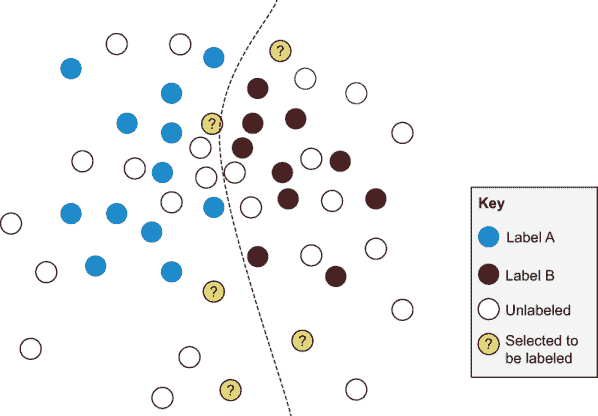

图 5.1 结合不确定性采样和多样性采样的一种可能结果。当这些策略结合时，会选择接近决策边界不同部分的项目。因此，我们正在优化找到可能改变决策边界的项目的概率，当它们被添加到训练数据中时。

你已经学会了识别接近决策边界（不确定性采样）和彼此之间距离较远的项目（基于聚类的采样和自适应代表性采样）。本章将向你展示如何采样既接近决策边界又具有多样性的项目，如图 5.1 所示。

### 5.1.1 基于聚类的最小置信度采样

在工业界，不确定性采样和多样性采样最常见的结合方式是从一种方法中抽取大量样本，然后使用另一种方法进一步过滤这些样本。尽管这种技术无处不在，但它没有统一的名称，这可能是由于许多公司出于必要而独立发明了它。

如果你使用最不确定的 50%项目进行最小置信度采样，然后应用基于聚类的采样来采样这些项目的 10%，你最终可以得到大约 5%的数据样本，类似于图 5.1 中的那些：不确定性和多样性的近似最优组合。图 5.2 以图形方式表示了这一结果。首先，你采样最不确定的 50%项目；然后应用聚类确保所选项目中的多样性，采样每个聚类的质心。

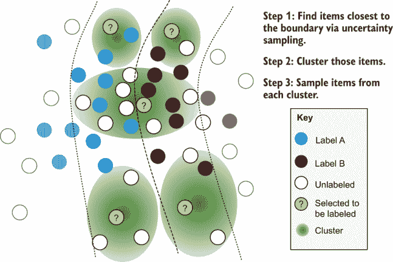

图 5.2 结合最小置信度和基于聚类的采样的示例。首先，不确定性采样找到决策边界附近的项；然后聚类确保该选择中的多样性。在此图中，每个聚类的质心被采样。或者，你也可以选择随机选择异常值成员。

使用你已经学到的代码，你可以看到结合最小置信度采样和聚类是我们在同一代码仓库中使用的`advanced_active_learning.py`的一个简单扩展（[`github.com/rmunro/pytorch_active_learning`](https://github.com/rmunro/pytorch_active_learning)），如下所示。

列表 5.1 结合最小置信度采样和聚类

```
def get_clustered_uncertainty_samples(*self*,  model, unlabeled_data, method, 
➥ feature_method, perc_uncertain = 0.1, num_clusters=20, max_epochs=10, 
➥ limit=10000):

    if limit > 0:
      shuffle(unlabeled_data)
      unlabeled_data = unlabeled_data[:limit]            
    uncertain_count = math.ceil(len(unlabeled_data) * perc_uncertain)

    uncertain_samples = *self*, uncertainty_sampling.get_samples(model, 
    ➥ unlabeled_data, 
    ➥ method, feature_method, uncertain_count, limit=limit)                ❶
    samples = *self*, diversity_sampling.get_cluster_samples(uncertain_samples,
    ➥ num_clusters=num_clusters)                                           ❷

    for item in samples:
      item[3] = method.__name__+"_"+item[3] # record the sampling method

    return samples
```

❶ 获取大量最不确定的样本。

❷ 在这些不确定的样本中，使用聚类确保样本的多样性。

只需要两行新代码就可以结合这两种方法：一行用于获取最不确定的项，另一行用于聚类它们。如果你对灾难响应文本分类任务感兴趣，尝试使用这个新命令：

```
> python active_learning.py --clustered_uncertainty=10 --verbose
```

你会立即看到数据往往落在可能或可能不与灾难相关的文本的分割附近，并且这些项是一个多样化的选择。你有许多选项可以使用不确定性采样来找到决策边界附近的项，然后应用基于聚类的采样以确保这些项中的多样性。你可以尝试不同的不确定性采样类型，不同的不确定性截止阈值，以及不同的聚类参数。在许多情况下，这种聚类和不确定性采样的组合将是深入挖掘主动学习中最有价值项的最快方式，应该是最先尝试的策略之一。

结合策略的简单方法很少出现在学术论文中；学术界更喜欢将方法结合成一个单一算法的论文，而不是将多个简单算法链在一起。这很有道理，因为结合方法是容易的，正如你已经看到的；没有必要为可以在几行代码中实现的事情写一篇学术论文。但是作为一个构建现实世界主动学习系统的开发者，你应该在尝试更实验性的算法之前，始终实现简单的解决方案。

尝试简单方法的第一种原因是，你可能会需要长时间在你的应用程序中支持它们。如果你不需要发明新技术就能达到 99%的效果，那么维护你的代码将会更容易。以下侧边栏提供了一个很好的例子，说明了早期决策的重要性。

你的早期数据决策持续重要

*凯里安·斯奈德的专家轶事*

在机器学习项目的早期所做的决策可能会影响你未来多年所构建的产品。这一点对于数据决策尤其如此：你的特征编码策略、标签本体和源数据将产生长期影响。

在我研究生毕业后第一次工作的时候，我负责构建基础设施，使得微软软件能够在世界各地的数十种语言中运行。这项工作包括做出基本决策，比如决定一个语言的字符的字母顺序——这在当时许多语言中是不存在的。当 2004 年的海啸摧毁了印度洋周边的国家时，对于斯里兰卡的僧伽罗语使用者来说，这是一个紧迫的问题：由于僧伽罗语还没有标准化的编码，因此没有简单的方法来支持搜索失踪人员。我们为僧伽罗语支持的时间表从几个月缩短到几天，以便我们能够帮助失踪人员服务，与本土语言使用者合作，尽可能快地构建解决方案。

我们当时决定的编码被 Unicode 采纳为僧伽罗语的官方编码，现在永久地编码了这种语言。你并不总是会在如此关键的时间线上工作，但你应该始终从一开始就考虑你产品决策的长期影响。

*基兰·斯奈德（Kieran Snyder）是 Textio 的 CEO 和联合创始人，Textio 是一个广泛使用的增强写作平台。基兰之前在微软和亚马逊担任过产品领导角色，并在宾夕法尼亚大学获得了语言学博士学位*。

不要假设复杂的解决方案一定是最好的；你可能会发现，对于你的数据来说，只需要简单地将最小置信度和聚类结合起来就足够了。像往常一样，你可以测试不同的方法，看看哪种方法在随机采样的基线准确性上产生了最大的变化。

### 5.1.2 基于模型的异常值的不确定性采样

当你将不确定性采样与基于模型的异常值相结合时，你正在最大化你模型当前的混淆。你正在寻找接近决策边界的项目，并确保它们的特征对于当前模型来说是相对未知的。图 5.3 展示了这种方法可能生成的样本类型。

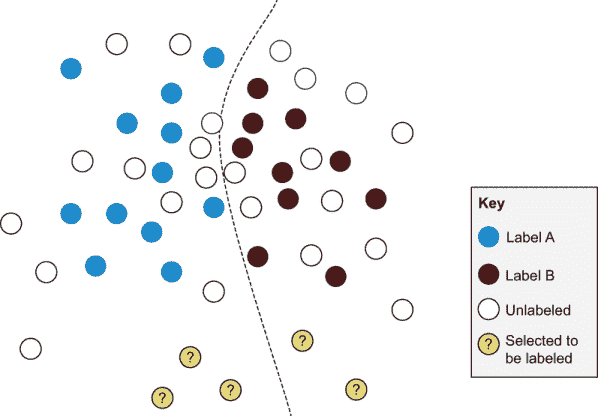

图 5.3 这个将不确定性采样与基于模型的异常值相结合的例子选择了接近决策边界但与当前训练数据项不同的项目，因此也与模型不同。

列表 5.2 将不确定性采样与基于模型的异常值相结合

```
def get_uncertain_model_outlier_samples(*self*,  model, outlier_model,  
➥ unlabeled_data, training_data, validation_data, method, feature_method,
➥ perc_uncertain = 0.1, number=10, limit=10000):

    if limit > 0:
      shuffle(unlabeled_data)
      unlabeled_data = unlabeled_data[:limit]            
    uncertain_count = math.ceil(len(unlabeled_data) * perc_uncertain)

    uncertain_samples = *self*, uncertainty_sampling.get_samples(model, 
    ➥ unlabeled_data, method, feature_method, uncertain_count, limit=limit) ❶

    samples = *self*, diversity_sampling.get_model_outliers(outlier_model,
    ➥ uncertain_samples, validation_data,feature_method, 
    ➥ number=number, limit=limit)                                           ❷

    for item in samples:
      item[3] = method.__name__+"_"+item[3]

    return samples
```

❶ 获取最不确定的项目。

❷ 对这些项目应用基于模型的异常值采样。

正如列表 5.1 中的示例一样，这里只需要两行代码就可以将所有内容整合在一起。虽然将不确定性采样与基于模型的异常值结合是针对最有可能增加你的模型知识和整体准确性的项目最优的，但它也可能采样相似的项目。你可以使用以下命令尝试此技术：

```
> python active_learning.py --*uncertain_model_outliers*=100 --verbose
```

### 5.1.3 基于模型的异常值和聚类的不确定性采样

由于 5.1.2 节中的方法可能会对彼此接近的项进行过采样，你可能希望首先实施此策略，然后应用聚类以确保多样性。只需一行代码即可将聚类添加到先前方法末尾，因此可以轻松实现。或者，如果你有快速的主动学习迭代，这种方法在结合不确定性采样和基于模型的异常值时可以确保更多的多样性；你可以在每个迭代中采样少量项目。

### 5.1.4 代表性采样和基于簇的采样

你在第四章中学到的代表性采样技术的缺点是它将训练数据和目标域视为单个簇。实际上，你的数据通常会在特征空间中呈现多峰分布，而单个簇无法最优地捕捉。

为了捕捉这种复杂性，你可以将代表性采样和基于簇的采样结合到一个稍微复杂一些的架构中。你可以独立地对你的训练数据和未标记数据进行聚类，识别出最能代表你的未标记数据的簇，并从这些簇中进行过采样。这种方法比单独的代表性采样提供了更多样化的项目（图 5.4）。

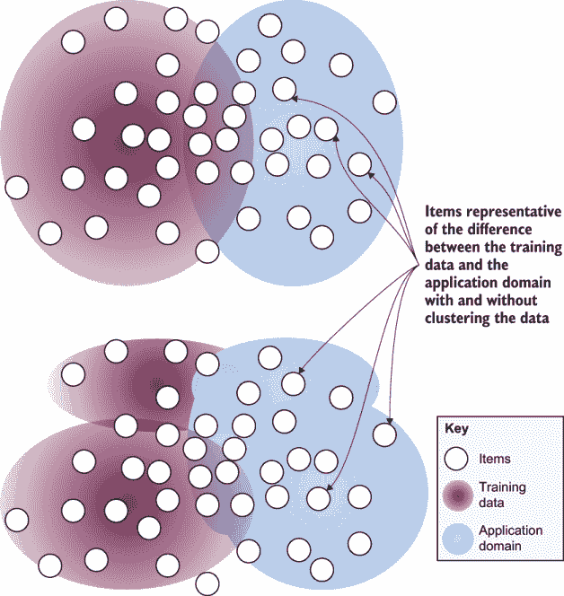

图 5.4 结合代表性采样和基于簇的采样的一个示例（底部）。这种方法采样了相对于你的当前训练数据最像你的应用域的项目，并且彼此不同。相比之下，第四章中更简单的代表性采样方法将每个分布视为单个分布。

正如你在图 5.4 中可以看到的，你的当前训练数据和目标域可能不是特征空间内的均匀分布。首先对数据进行聚类将帮助你更准确地建模特征空间，并采样更多样化的未标记项目。首先，从应用域创建训练数据和未标记数据的簇。

列表 5.3 结合代表性采样和聚类

```
def get_representative_cluster_samples(self, training_data, unlabeled_data,
➥ number=10, num_clusters=20, max_epochs=10, limit=10000):
    """Gets the most representative unlabeled items, compared to training data,
    ➥ across multiple clusters

    Keyword arguments:
      training_data -- data with a label, that the current model is trained on
      unlabeled_data -- data that does not yet have a label
      number -- number of items to sample
      limit -- sample from only this many items for faster sampling (-1 = 
      ➥ no limit)
      num_clusters -- the number of clusters to create
      max_epochs -- maximum number of epochs to create clusters

    """ 

    if limit > 0:
      shuffle(training_data)
      training_data = training_data[:limit]
      shuffle(unlabeled_data)
      unlabeled_data = unlabeled_data[:limit]

    # Create clusters for training data

    training_clusters = CosineClusters(num_clusters)
    training_clusters.add_random_training_items(training_data)

    for i in range(0, max_epochs):        ❶
      print("Epoch "+str(i))
      added = training_clusters.add_items_to_best_cluster(training_data)
        if added == 0:
          break

    # Create clusters for unlabeled data

    unlabeled_clusters = CosineClusters(num_clusters)    
    unlabeled_clusters.add_random_training_items(training_data)

    for i in range(0, max_epochs):        ❷
      print("Epoch "+str(i))
      added = unlabeled_clusters.add_items_to_best_cluster(unlabeled_data)
        if added == 0:
          Break
```

❶ 在现有训练数据中创建簇。

❷ 在未标记数据中创建簇。

然后迭代每个未标记数据的簇，并找到每个簇中相对于训练数据簇的质心最近的项。

列表 5.4 结合代表性采样和聚类，继续

```
        most_representative_items = []

        # for each cluster of unlabeled data
        for cluster in unlabeled_clusters.clusters:
            most_representative = None
            representativeness = float("-inf")

            # find the item in that cluster most like the unlabeled data 
            item_keys = list(cluster.members.keys())

            for key in item_keys:
                item = cluster.members[key]

                _, unlabeled_score =
                ➥ unlabeled_clusters.get_best_cluster(item)                  ❶
                _, training_score = training_clusters.get_best_cluster(item)  ❷

                cluster_representativeness = unlabeled_score - training_score ❸

                if cluster_representativeness > representativeness:
                    representativeness = cluster_representativeness 
                    most_representative = item

            most_representative[3] = "representative_clusters"            
            most_representative[4] = representativeness
            most_representative_items.append(most_representative)

        most_representative_items.sort(reverse=True, key=lambda x: x[4])       
        return most_representative_items[:number:]     
```

❶ 在未标记数据簇中找到最佳拟合簇。

❷ 在训练数据簇中找到最佳拟合簇。

❸ 记录两个之间的差异作为我们的代表性分数。

在设计上，这个代码几乎与你第四章中实现的代表性采样方法相同，但你要求聚类算法为每个分布创建多个簇，而不是只为训练数据和未标记数据创建一个簇。你可以用这个命令尝试这个技术：

```
> python active_learning.py --*representative_clusters*=100 --verbose
```

### 5.1.5 从最高熵簇中采样

如果你某个簇中有高熵，那么关于该簇中项目的正确标签存在很多混淆。换句话说，这些簇在所有项目中的平均不确定性最高。因此，这些项目最有可能改变标签，并且有最大的标签变化空间。

图 5.5 中的例子在某些方面与为了多样性而进行聚类的相反，因为它故意关注问题空间的一部分。但有时，这种关注正是你所需要的。

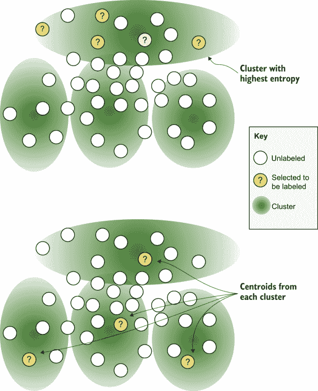

图 5.5 这个结合基于簇的采样与熵（底部）的例子采样了簇内最混乱的项目。你可能认为这个簇是最接近决策边界的。在这个例子中，簇内随机采样项目，但你可以通过采样质心、异常值和/或对簇内具有最高熵的项目进行过采样来实验。相比之下，简单的聚类（顶部）从每个簇中采样项目。

注意，这种方法在你有准确标签的数据并且有信心任务可以用机器学习解决时效果最好。如果你有大量固有模糊性的数据，这种方法往往会集中在那些区域。为了解决这个问题，看看你现有的训练数据中有多少落在高熵簇中。如果簇已经在你的训练数据中得到了很好的代表，那么你有很好的证据表明它是特征空间中固有的模糊部分，并且额外的标签不会有所帮助。以下列表显示了选择具有最高平均熵簇的代码。

列表 5.5 从最高熵簇中采样

```
def get_high_uncertainty_cluster(*self*,  model, unlabeled_data, method, 
➥ feature_method, number=10, num_clusters=20, max_epochs=10, limit=10000):
    *"""Gets items from the cluster with the highest average uncertainty*

    *Keyword arguments:*
      *model -- machine learning model to get predictions from to determine* 
      ➥ *uncertainty*
      *unlabeled_data -- data that does not yet have a label*
      *method -- method for uncertainty sampling (eg: least_confidence())*
      *feature_method -- the method for extracting features from your data*
      *number -- number of items to sample*
      *num_clusters -- the number of clusters to create*
      *max_epochs -- maximum number of epochs to create clusters*
      *limit -- sample from only this many items for faster sampling* 
      ➥ *(-1 = no limit)*
    *"""*

    if limit > 0:
      shuffle(unlabeled_data)
      unlabeled_data = unlabeled_data[:limit]            

    unlabeled_clusters = CosineClusters(num_clusters)    
    unlabeled_clusters.add_random_training_items(unlabeled_data)

    for i in range(0, max_epochs):                           ❶
      print(*"Epoch * "str(i))
      added = unlabeled_clusters.add_items_to_best_cluster(unlabeled_data)
      if added == 0:
        break

    # get scores

    most_uncertain_cluster = None
    highest_average_uncertainty = 0.0

    # for each cluster of unlabeled data
    for cluster in unlabeled_clusters.clusters:
      total_uncertainty = 0.0
      count = 0

      item_keys = list(cluster.members.keys())

      for key in item_keys:
        item = cluster.members[key]
        text = item[1] # the text for the message

        feature_vector = feature_method(text)
        hidden, logits, log_probs = model(feature_vector, 
        ➥ return_all_layers=True)

        prob_dist = torch.exp(log_probs) # the probability distribution of 
        ➥ our prediction

        score = method(prob_dist.data[0]) # get the specific type of 
        ➥ uncertainty sampling

        total_uncertainty += score
        count += 1

      average_uncertainty = total_uncertainty / count         ❷
      if average_uncertainty > highest_average_uncertainty:
          highest_average_uncertainty = average_uncertainty
          most_uncertain_cluster = cluster

    samples = most_uncertain_cluster.get_random_members(number)

    return samples
```

❶ 创建簇。

❷ 计算每个簇中项目的平均不确定性（使用熵）。

在这个代码示例中，我们正在计算一个簇中所有项目的平均熵。你可以尝试基于你的采样策略不同的聚合统计。例如，如果你知道你只采样了前 100 个项目，那么你可以计算每个簇中 100 个最不确定的项目之间的平均熵，而不是计算簇中每个项目之间的平均熵。你可以用这个命令尝试这个技术：

```
> python active_learning.py --*high_uncertainty_cluste*=100 --verbose
```

### 5.1.6 其他主动学习策略的组合

在这本书中涵盖主动学习技术的所有可能组合太多了，但到这个阶段，你应该已经很好地了解了如何将它们组合起来。以下是一些起点：

+   *结合不确定性采样与代表性采样*—您可以采样最能够代表您的目标领域且不确定的项目。这种方法在主动学习的后期迭代中特别有用。如果您在早期迭代中使用了不确定性采样，您的目标领域将包含与决策边界不成比例地远的项，可能会被错误地选为代表性。

+   *结合基于模型的异常值与代表性采样*—这是领域自适应的终极方法，针对的是今天您的模型未知但也在您的目标领域中相对常见的项目。

+   *将聚类与自身结合以创建层次聚类*—如果您有一些大型簇或希望在簇内进行多样性采样，您可以从一个簇中提取项目，并使用它们来创建一组新的簇。

+   *结合从最高熵簇中进行采样与置信度边界采样（或某些其他不确定性指标）*—你可以找到具有最高熵的簇，然后从中采样所有最接近决策边界的项目。

+   *结合集成方法或 dropout 与个体策略*—您可能正在构建多个模型，并决定贝叶斯模型更适合确定不确定性，而神经网络模型更适合确定基于模型的异常值。您可以使用一个模型进行采样，并使用另一个模型进一步细化。如果您基于隐藏层进行聚类，您可以从不确定性采样中采用 dropout 方法，并在创建簇时随机忽略一些神经元。这种方法将防止簇过度拟合到您网络的内部表示。

### 5.1.7 结合主动学习分数

将一个采样策略的输出管道传输到另一个策略的替代方法是，从不同的采样策略中提取分数，并找到最高平均分数，这对于除了聚类以外的所有方法都有数学意义。例如，您可以平均每个项目的置信度边界分数、基于模型的异常值分数和代表性学习分数，然后根据这个单一的汇总分数对所有项目进行排名。

虽然所有分数都应该在[0–1]范围内，但请注意，其中一些可能集中在很小的范围内，因此对平均值的贡献可能不大。如果您的数据中存在这种情况，您可以尝试将所有分数转换为百分位数（分位数），这实际上将所有采样分数转换为分层排名顺序。您可以使用您选择的数学库中的内置函数将任何数字列表转换为百分位数。在各种 Python 库中寻找名为`rank()`、`percentile()`或`percentileofscore()`的函数。与您用于采样的其他方法相比，将分数转换为百分位数相对较快，因此无需担心尝试找到最优化函数；选择您已经使用的库中的一个函数即可。

你也可以通过方法的并集来采样，而不是通过过滤（这是通过交集的组合）。这种方法可以用于任何方法，并且在你结合多个不确定性采样分数时可能最有意义。你可以通过最不自信、置信度边际、置信度比率或熵来采样最不确定的 10%的项目，从而产生一个通用的“不确定”样本集，然后直接使用这些样本或通过结合其他方法来细化采样。你可以以许多方式组合你所学到的构建块，我鼓励你尝试它们。

### 5.1.8 预期误差减少采样

预期误差减少是文献中旨在将不确定性采样和多样性采样结合成一个单一指标的一小部分积极学习策略之一。这个算法被包括在这里是为了完整性，但有一个前提，就是我还没有看到它在现实世界中的实现。预期误差减少采样的核心指标是，如果给一个未标记的项目分配一个标签，模型中的误差将减少多少。¹你可以给每个未标记的项目分配可能的标签，用这些标签重新训练模型，然后观察模型准确率的变化。你有两种常见的方式来计算模型准确率的变化：

+   *总体准确率*——如果这个项目有一个标签，预测正确的项目数量会有什么变化？

+   *总体熵*——如果这个项目有一个标签，总体熵会有什么变化？这种方法使用你在不确定性采样章节 3.2.4 和 3.2.5 中学到的熵的定义。与第一种方法相比，它对预测的置信度敏感，而第一种方法只对预测的标签敏感。

分数是按照每个标签的频率加权计算的。你采样那些最有可能提高模型整体性能的项目。然而，这个算法存在一些实际问题：

+   对于大多数算法来说，为每个未标记的项目和每个标签重新训练模型一次是非常昂贵的。

+   重新训练模型时可能会有很大的变化，以至于一个额外标签的变化可能无法与噪声区分开来。

+   由于标签的熵很高，对于可能性越来越小的标签，算法可能会过度采样远离决策边界的项目。

因此，在使用神经网络模型时，这种方法存在实际限制。这个算法的原始作者使用了增量朴素贝叶斯，可以通过更新新项的特征计数来适应新的训练项，并且是确定性的。鉴于这一事实，预期误差减少对作者们的特定算法是有效的。可以通过使用每个标签的预测概率而不是标签频率（先验概率）来解决远离决策边界的过度采样项的问题，但你可能需要从你的模型中获得准确的置信度预测，正如你在第三章中学到的，你可能没有。

如果你尝试实现预期误差减少，你可以尝试不同的准确度指标，以及除了熵之外的其它不确定性采样算法。因为这种方法使用熵，它来自信息论，你可能会在关于这个算法变体的文献中看到它被称为*信息增益*。仔细阅读这些论文，因为*增益*可能意味着*更低*的信息。尽管这个术语在数学上是正确的，但当预测信息较少时，说你的模型知道得更多可能会感觉反直觉。

如本节开头所述，据我所知，没有人（至少）在是否预期误差减少比通过采样策略的交集和/或并集简单组合方法更好的问题上发表过文章。你可以尝试实现预期误差减少和相关算法，看看它们是否有助于你的系统。你可能只需要通过用新项重新训练你模型的最后一层来实现它们，这将加快这个过程。

如果你想要采样具有与预期误差减少类似目标的项，你可以聚类你的数据，然后查看预测中熵最高的聚类，就像本章前面 5.4 节中的示例。然而，预期误差减少有一个问题，那就是它可能只找到特征空间中某一部分的项，就像在孤立中使用的不确定性采样算法。如果你将 5.4 节中的示例扩展到从*N*个最高熵聚类中采样项，而不仅仅是单个最高熵聚类，你将在几行代码中解决预期误差减少的局限性。

而不是尝试手工制作一个将不确定性采样和多样性采样结合成一个算法的算法，然而，你可以让机器学习为你决定这种组合。原始的预期误差减少论文的标题为“通过采样估计误差减少实现最优主动学习”，这篇论文已有 20 年历史，因此这很可能是作者们所考虑的方向。本章的其余部分将构建用于主动学习中的采样过程的机器学习模型。

## 5.2 不确定性采样的主动迁移学习

最先进的主动学习方法使用了你在本书中学到的所有内容：第三章中学到的解释混淆的采样策略，第四章中学到的查询模型不同层的方法，以及本章第一部分中学到的技术组合。

使用所有这些技术，你可以构建一个新的模型，其任务是预测最大不确定性的位置。首先，让我们回顾一下第一章中关于迁移学习的描述，如图 5.6 所示。

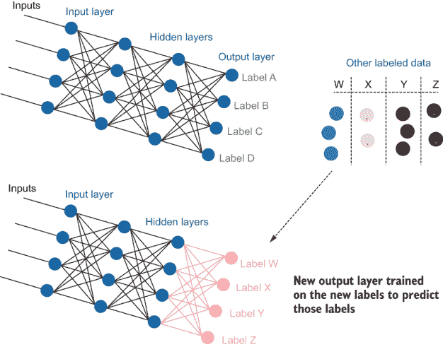

图 5.6 我们有一个预测标签为“A”、“B”、“C”或“D”的模型，以及一个带有标签“W”、“X”、“Y”和“Z”的独立数据集。当我们只重新训练模型的最后一层时，模型能够使用比从头开始训练模型时更少的人工标记项目来预测标签“W”、“X”、“Y”和“Z”。

在图 5.6 的示例中，你可以看到模型如何在一个标签集上训练，然后通过保持相同的架构和冻结模型的一部分（在这种情况下仅重新训练最后一层）在另一个标签集上重新训练。还有许多其他方法可以使用迁移学习和上下文模型进行人机交互的机器学习。本章中的示例是图 5.6 中所示迁移学习类型的变体。

### 5.2.1 让你的模型预测自己的错误

迁移学习产生的新标签可以是任何你想要的类别，包括关于任务本身的信息。这一事实是主动迁移学习的核心洞察：你可以使用迁移学习来询问你的模型它在哪些方面感到困惑，通过让它预测自己的错误。图 5.7 概述了这一过程。

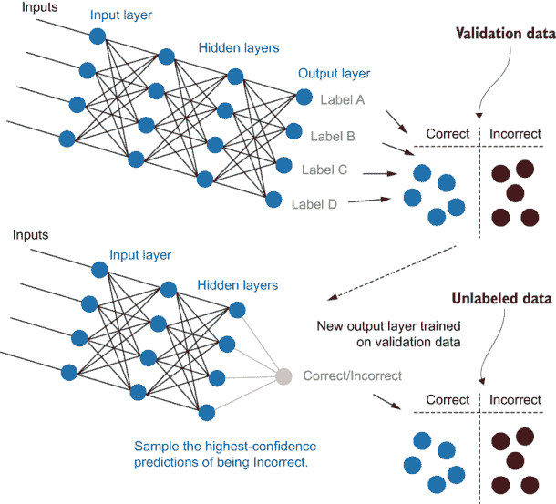

图 5.7 模型预测验证项目，并根据它们是否被正确分类将它们分类为“正确”或“不正确”。然后重新训练模型的最后一层来预测项目是“正确”还是“不正确”，有效地将这两个桶转换为新的标签。

如图 5.7 所示，这个过程有几个步骤：

1.  将模型应用于验证数据集，并捕获哪些验证项目被正确和错误地分类。这些数据是你的新训练数据。现在你的验证项目有了“正确”或“不正确”的额外标签。

1.  为模型创建一个新的输出层，并使用你的新训练数据训练这个新层，预测你的新“正确”和“不正确”标签。

1.  将未标记的数据项通过新模型运行，并采样预测为“不正确”且置信度最高的项目。

现在你已经获得了一组项目样本，这些项目被你的模型预测为最有可能不正确，因此将受益于人工标记。

### 5.2.2 实施主动迁移学习

最简单的主动迁移学习方法可以使用您已经学到的代码构建块来构建。要实现图 5.7 中的架构，您可以创建一个新的层作为其自己的模型，并使用最终的隐藏层作为该层的特征。

这里是 5.2.1 节中的三个步骤，在 PyTorch 中实现。首先，将模型应用于验证数据集，并捕获哪些验证项被正确和错误地分类。这些数据是您的新训练数据。您的验证项有一个额外的标签“正确”或“错误”，这在（名称冗长但透明地命名的）`get_deep_active_transfer_learning_uncertainty_samples()`方法中。

列表 5.6 主动迁移学习

```
correct_predictions = [] # validation items predicted correctly
incorrect_predictions = [] # validation items predicted incorrectly
item_hidden_layers = {} # hidden layer of each item, by id

for item in validation_data:

    id = item[0]
    text = item[1]
    label = item[2]

    feature_vector = feature_method(text)
    hidden, logits, log_probs = model(feature_vector, return_all_layers=True)

    item_hidden_layers[id] = hidden              ❶

    prob_dist = torch.exp(log_probs)     
    # get confidence that item is disaster-related
    prob_related = math.exp(log_probs.data.tolist()[0][1]) 

    if item[3] == "seen":
        correct_predictions.append(item)         ❷

    elif(label=="1" and prob_related > 0.5) or (label=="0" and prob_related 
    ➥ <= 0.5):
        correct_predictions.append(item)
    else:
        incorrect_predictions.append(item)       ❸
```

❶ 将此项目的隐藏层存储起来，稍后用于我们的新模型。

❷ 项被正确预测，因此在新模型中它获得“正确”标签。

❸ 项被错误预测，因此在新模型中它获得“错误”标签。

第二步，为在您的新的训练数据上训练的模型创建一个新的输出层，预测新的“正确”和“错误”标签。

列表 5.7 创建新的输出层

```
correct_model = SimpleUncertaintyPredictor(128)
loss_function = nn.NLLLoss()
optimizer = optim.SGD(correct_model.parameters(), lr=0.01)   

for epoch in range(epochs):                           ❶
    if self.verbose:
        print("Epoch: "+str(epoch))
    current = 0

    # make a subset of data to use in this epoch
    # with an equal number of items from each label

    shuffle(correct_predictions) #randomize the order of the validation data
    shuffle(incorrect_predictions) #randomize the order of the validation data

    correct_ids = {}
    for item in correct_predictions:
        correct_ids[item[0]] = True         
    epoch_data = correct_predictions[:select_per_epoch]
    epoch_data += incorrect_predictions[:select_per_epoch]
    shuffle(epoch_data) 

    # train the final layers model
    for item in epoch_data:                
        id = item[0]
        label = 0
        if id in correct_ids:
            label = 1

        correct_model.zero_grad() 

        feature_vec = item_hidden_layers[id]          ❷
        target = torch.LongTensor([label])

        log_probs = correct_model(feature_vec)

        # compute loss function, do backward pass, and update the gradient
        loss = loss_function(log_probs, target)
        loss.backward(retain_graph=True)
        optimizer.step()    
```

❶ 训练代码与本书中的其他示例类似。

❷ 在这里，我们使用原始模型的隐藏层作为我们的特征向量。

最后，将您的未标记数据项通过新模型运行，并采样预测置信度最高的错误项。

列表 5.8 预测“错误”标签

```
deep_active_transfer_preds = []

with torch.no_grad():                                                       ❶
    v=0
    for item in unlabeled_data:
        text = item[1]

        # get prediction from main model
        feature_vector = feature_method(text)                               ❷
        hidden, logits, log_probs = model(feature_vector, 
        ➥ return_all_layers=True)

        # use hidden layer from main model as input to model predicting 
        ➥ correct/errors
        logits, log_probs = correct_model(hidden, return_all_layers=True)   ❸

        # get confidence that item is correct
        prob_correct = 1 - math.exp(log_probs.data.tolist()[0][1]) 

        if(label == "0"):
            prob_correct = 1 - prob_correct

        item[3] = "predicted_error"            
        item[4] = 1 - prob_correct
        deep_active_transfer_preds.append(item)

deep_active_transfer_preds.sort(reverse=True, key=lambda x: x[4])

return deep_active_transfer_preds[:number:]
```

❶ 评估代码与本书中的其他示例类似。

❷ 首先，我们需要从我们的原始模型中获取隐藏层。

❸ 然后，我们将那个隐藏层作为我们新模型的特征向量。

如果您对灾害响应文本分类任务感兴趣，请尝试使用这种新的主动迁移学习方法：

```
> python active_learning.py --*transfer_learned_uncertainty* 10 --verbose 
```

如您在这段代码中所见，我们并没有改变用于预测消息是否与灾害响应相关的原始模型。我们不是替换该模型的最后一层，而是在现有模型之上有效地添加了一个新的输出层。作为替代，您也可以用相同的结果替换最后一层。

本书使用这种架构是因为它是非破坏性的。旧模型仍然存在。这种架构防止了当您仍然想使用原始模型（无论是生产中还是用于其他采样策略）时出现不希望的错误。您还避免了需要额外的内存来并行拥有两个完整模型的副本。构建一个新层或复制并修改模型是等效的，因此请选择适合您代码库的方法。所有这些代码都位于本章前面讨论的方法相同的文件中：advanced_active_learning.py。

### 5.2.3 带有更多层的主动迁移学习

您不需要将主动迁移学习限制在单个新层或仅基于最后一个隐藏层。如图 5.8 所示，您可以构建多个新层，并且它们可以直接连接到任何隐藏层。

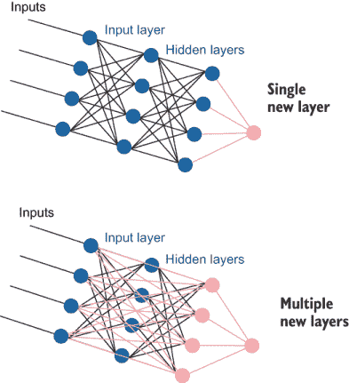

图 5.8 更复杂的活跃迁移学习架构，使用活跃迁移学习来创建预测。顶部示例在新的输出层中有一个单神经元。底部示例是一个更复杂的架构，有一个新的隐藏层与多个现有隐藏层相连。

将扩展到图 5.8 中更复杂的架构只需要几行额外的代码。首先，用于预测“正确”或“错误”的新模型需要一个隐藏层。然后，这个新模型将从多个隐藏层中提取其特征。你可以将不同层的向量附加在一起，这个展平的向量成为新模型的特征。

如果你熟悉自然语言处理（NLP）中的上下文模型或计算机视觉中的卷积模型，这个过程是熟悉的；你正在从你的网络的不同部分提取神经元的激活并将其展平成一个长的特征向量。这个结果向量通常被称为*表示*，因为你在使用一个模型中的神经元来表示另一个模型中的特征。我们将在第九章中回到表示，在那里它们对于一些半自动化的创建训练数据的方法也很重要。

然而，你可以构建一个更复杂的模型，但这并不意味着你应该构建它。如果你没有很多验证数据，你更有可能对更复杂的模型进行过拟合。如果你只训练一个新输出神经元，那么避免训练错误会容易得多。根据你通常为该数据量构建的二进制预测任务，使用你的直觉来判断你的模型需要有多复杂。

### 5.2.4 活跃迁移学习的优缺点

活跃迁移学习具有一些很好的特性，使其适用于广泛的问题：

+   你正在重用你的隐藏层，因此你是在直接基于你的模型当前的信息状态构建模型。

+   你不需要太多的标记项来使模型有效，特别是如果你只重新训练最后一层（如果你的验证数据量不大，这很方便）。

+   训练速度快，特别是如果你只重新训练最后一层。

+   它可以与许多架构一起工作。你可能是在文档或图像级别预测标签，预测图像中的对象，或者生成文本序列。对于所有这些用例，你都可以添加一个新的最终层或几层来预测“正确”或“错误”。（有关主动学习用例的更多信息，请参阅第六章。）

+   你不需要对不同神经元的不同激活范围进行归一化，因为你的模型将为你完成这项任务。

第五点特别不错。回想一下，使用基于模型的异常值时，你需要使用验证数据对激活进行量化，因为一些神经元在平均激活上可能任意地更高或更低。能够将信息传递给另一层的神经元，并告诉新层确定每个现有神经元应应用的精确权重，这很好。主动迁移学习也有一些缺点：

+   与其他不确定性采样技术一样，它可能会过分关注特征空间的一部分；因此，它缺乏多样性。

+   你可能会过拟合你的验证数据。如果没有很多验证项目，你的预测不确定性的模型可能无法推广到你的未标记数据。

第一个问题可以在不添加额外人工标签的情况下部分解决，正如你在本章 5.3.2 节中稍后看到的。这个事实是与其他不确定性采样算法相比，这种方法最大的优势之一。

过拟合问题也可以相对容易地诊断，因为它表现为对项目是错误的极高信心。如果你对你的主要模型有一个二进制预测，并且你的错误预测模型有 95%的信心认为一个项目被错误分类，那么你的主要模型最初就应该正确地分类那个项目。

如果你发现你正在过拟合，并且提前停止训练没有帮助，你可以尝试通过获取多个预测，使用第三章 3.4 节中的集成方法来避免过拟合。这些方法包括训练多个模型，在推理时使用 dropout（蒙特卡洛采样），以及从不同的验证项目特征子集中抽取。

## 5.3 将主动迁移学习应用于代表性采样

我们可以将相同的主动迁移学习原则应用于代表性采样。也就是说，我们可以调整我们的模型来预测一个项目与我们的模型的应用领域相比，是否更相似于当前的训练数据。

这种方法有助于领域自适应，例如你在第四章中学到的代表性采样方法。实际上，代表性采样并没有太大的不同。在第四章以及下文中的示例中，你都在构建一个新的模型来预测一个项目是否是你试图适应的模型数据的代表性。

### 5.3.1 让你的模型预测它不知道的内容

在原则上，你不需要你的现有模型来预测一个项目是否在你的训练数据中或在你的未标记数据中。你可以构建一个新的模型，该模型将你的训练数据和未标记数据作为二进制预测问题。在实践中，包括对你要构建的机器学习任务重要的特征是有用的。

图 5.9 展示了代表性主动迁移学习的过程和架构，展示了如何重新训练你的模型以预测未标记项是更类似于你的当前训练数据还是更类似于你的模型的应用域。

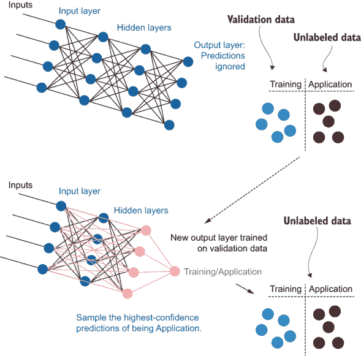

图 5.9 我们可以构建一个模型来采样与当前训练数据最不相似的项。首先，我们从与训练数据相同分布中获取验证数据，并给它一个“训练”标签。然后，我们从我们的目标域中获取未标记数据，并给它一个“应用”标签。我们训练一个新的输出层来预测“训练”和“应用”标签，使其能够访问模型的全部层。我们将新模型应用于未标记数据（忽略我们在其上训练的未标记项），并采样那些最自信地预测为“应用”的项。

如图 5.9 所示，与不确定性采样的主动迁移学习相比，差异很少。首先，忽略原始模型的预测。验证和未标记数据可以直接给予标签。验证数据来自与训练数据相同的分布，因此被赋予“训练”标签。来自目标域的未标记数据被赋予“应用”标签。然后，模型在这些标签上训练。

其次，新模型应该能够访问更多层。如果你正在适应一个新的领域，你可能有很多在训练数据中尚未存在的特征。在这种情况下，你现有模型包含的唯一信息是这些特征存在于输入层作为特征，但之前模型中的任何其他层都没有贡献。更复杂的架构类型将捕捉到这些信息。

### 5.3.2 自适应代表性采样的主动迁移学习

就像代表性采样（第四章）可以是自适应的，代表性采样的主动迁移学习也可以是自适应的，这意味着你可以在一个主动学习周期内进行多次迭代，如图 5.10 所示。

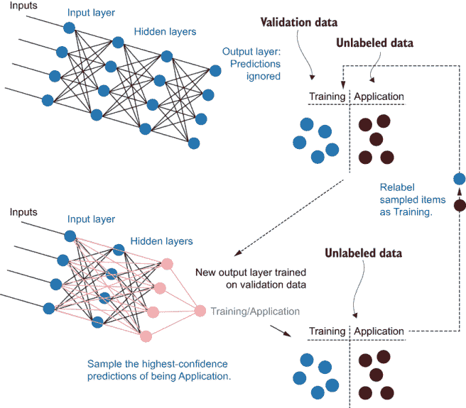

图 5.10 由于我们的采样项目将在之后获得人工标签，我们可以假设它们成为训练数据的一部分，而无需知道标签是什么。首先，我们从与训练数据相同的分布中获取验证数据，并给它一个“训练”标签。我们从目标域中获取未标记数据，并给它一个“应用”标签。我们训练一个新的输出层来预测“训练”和“应用”标签，并让它访问模型的全部层。我们将新模型应用于未标记数据（忽略我们在其上训练的未标记项目），并采样那些最自信地预测为“应用”的项目。我们可以假设这些项目将后来获得标签并成为训练数据的一部分。因此，我们可以取这些采样项目，将它们的标签从“应用”改为“训练”，并在新的数据集上重新训练我们的最终层（们）。

图 5.10 中的过程与非自适应版本类似。我们创建新的输出层来分类一个项目是否在现有训练数据中或在目标域中，采样那些最自信地预测为“应用”的项目。为了将这个过程扩展到自适应策略，我们可以假设采样项目将后来获得标签并成为训练数据的一部分。因此，我们可以取那些采样项目，将它们的标签从“应用”改为“训练”，并在新的数据集上重新训练我们的最终层（们）。这个过程可以重复进行，直到没有更多对“应用”域项目的自信预测，或者直到您达到在这个主动学习迭代中想要采样的项目最大数量。

### 5.3.3 代表性采样中主动迁移学习的优缺点

代表性采样中主动迁移学习的优缺点与第四章中更简单的代表性采样方法相同。与这些方法相比，优点可能更加积极，因为您正在使用更强大的模型，但一些缺点，如过拟合的风险，可能成为更大的潜在错误。

再次总结这些优势和劣势：代表性采样在当你拥有新领域中的所有数据时是有效的，但如果你正在适应尚未采样的未来数据，你的模型可能会陷入过去。这种方法也是本书中所有主动学习策略中最容易受到噪声影响的。如果你有新的数据，比如损坏的文本——来自不属于你的目标领域的语言文本，损坏的图像文件，由不同相机使用产生的伪影等等——这些因素中的任何一个都可能与你当前的训练数据不同，但不是以有趣的方式。最后，如果你在不确定性采样之后迭代使用代表性采样，主动迁移学习可能会产生比好处更多的坏处，因为你的应用领域将有更多远离决策边界的项目，而你的训练数据则没有。出于这些原因，我建议你仅在与其他采样策略结合使用的情况下部署主动迁移学习进行代表性采样，正如你在 5.1 节所学的那样。

## 5.4 主动迁移学习自适应采样

本书中的主动学习最终算法也是最强大的；它是一种可以在主动学习单次迭代中自适应的不确定性采样。你在第三章学到的所有不确定性采样技术都是非自适应的。在一个主动学习周期内，所有这些技术都存在从问题空间的一个小部分采样项的风险。

*自适应采样主动迁移学习*（ATLAS）是一个例外，它允许在一个迭代中自适应采样，而不需要使用聚类来确保多样性。ATLAS 在此处引入时有一个前提，即它是本书中在出版时测试最少的一个算法。我在 2019 年底发明了 ATLAS，当时我意识到主动迁移学习具有某些可以利用的特性，使其变得自适应。ATLAS 在我所实验的数据上取得了成功，但它尚未在工业界广泛应用或在学术界经过同行评审。正如你对待任何新方法一样，准备好进行实验，以确保这个算法适合你的数据。

### 5.4.1 通过预测不确定性使不确定性采样自适应

如你在第三章所学，大多数不确定性采样算法都有相同的问题：它们可以从特征空间的一部分采样，这意味着在主动学习的一次迭代中，所有样本都是相似的。如果你不小心，你最终可能只会从特征空间的一个小部分采样项。

如你在 5.1.1 节所学，你可以通过结合聚类和不确定性采样来解决此问题。这种方法仍然是开始你的主动学习策略时推荐的思考方式；在有了这个基线之后，你可以尝试 ATLAS。你可以利用主动迁移学习在不确定性采样中的两个有趣特性：

+   你预测的是模型是否正确，而不是实际的标签。

+   你通常可以正确预测训练数据项的标签。

这两项加在一起意味着你可以假设你的样本项稍后会正确，即使你目前还不知道标签（见图 5.11）。

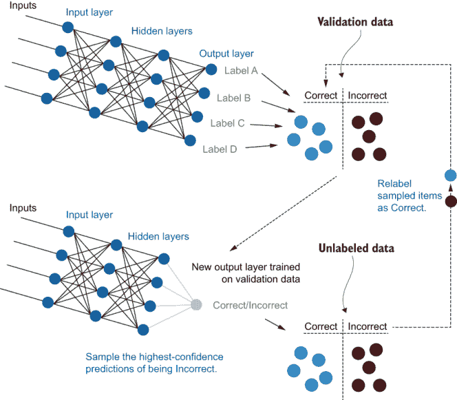

图 5.11 因为我们的采样项稍后会被人工标记并成为训练数据的一部分，我们可以假设模型稍后会正确预测这些项，因为模型通常在它们训练的实际项上最准确。首先，验证项由模型预测，并根据它们是否被正确分类分为“正确”或“错误”的类别。模型的最后一层被重新训练以预测项是“正确”还是“错误”，有效地将这两个类别转换为新的标签。我们将新模型应用于未标记的数据，预测每个项将是“正确”还是“错误”。我们可以采样最有可能被标记为“错误”的项。然后我们可以假设这些项稍后会被标记，并成为训练数据的一部分，这将由预测相同数据的模型正确标记。因此，我们可以将这些采样项的标签从“错误”改为“正确”，并在新的数据集上重新训练我们的最终层。

图 5.11 中的过程与非自适应版本类似。我们创建新的输出层来分类一个项是“正确”还是“错误”，采样那些最有可能被预测为“错误”的项。为了将这种架构扩展到自适应策略，我们可以假设那些采样项稍后会被标记，并成为训练数据的一部分，并且它们在获得标签后将被正确预测（无论标签是什么）。因此，我们可以将这些采样项的标签从“错误”改为“正确”，并在新的数据集上重新训练我们的最终层。这个过程可以重复进行，直到我们没有更多关于“错误”域项的信心预测，或者达到我们在这个主动学习迭代中想要采样的最大项数。将 ATLAS 作为主动学习的不确定性采样包装器实现，只需要 10 行代码。

列表 5.9 主动迁移学习用于自适应采样

```
def get_atlas_samples(self, model, unlabeled_data, validation_data, 
➥ feature_method, number=100, limit=10000, number_per_iteration=10,
➥ epochs=10, select_per_epoch=100):
"""Uses transfer learning to predict uncertainty within the model

Keyword arguments:
    model -- machine learning model to get predictions from to determine 
    ➥ uncertainty
    unlabeled_data -- data that does not yet have a label
    validation_data -- data with a label that is not in the training set, to 
    ➥ be used for transfer learning
    feature_method -- the method for extracting features from your data
    number -- number of items to sample
    number_per_iteration -- number of items to sample per iteration
    limit -- sample from only this many items for faster sampling (-1 = no 
    ➥ limit)
""" 

if(len(unlabeled_data) < number):
    raise Exception('More samples requested than the number of unlabeled 
    ➥ items')

atlas_samples = [] # all items sampled by atlas

while(len(atlas_samples) < number):
    samples = 
    ➥ self.get_deep_active_transfer_learning_uncertainty_samples(model, 
    ➥ unlabeled_data, validation_data, feature_method, 
    ➥ number_per_iteration, limit, epochs, select_per_epoch)

    for item in samples:
        atlas_samples.append(item)
        unlabeled_data.remove(item)

        item = copy.deepcopy(item)
        item[3] = "seen" # mark this item as already seen

        validation_data.append(item) # append so that it is in the next 
        ➥ iteration

return atlas_samples  
```

关键代码行在每次循环后将样本项的副本添加到验证数据中。如果你对灾难响应文本分类任务感兴趣，尝试使用 ATLAS 的新方法进行实现：

```
> python active_learning.py --*atlas*=100 --verbose 
```

由于你默认选择 10 个项（`number_per_iteration=10`）并且总共需要 100 个，你应该在采样过程中看到模型重新训练 10 次。尝试使用每次迭代更小的数字以获得更多样化的选择，这将需要更多时间来重新训练。

尽管 ATLAS 只向您最初学习的用于不确定性采样的活跃迁移学习架构中添加了一步，但要理解它可能需要一点时间。在机器学习中，你可以在没有人工审查的情况下自信地为未标记的项目分配标签的情况并不多见。诀窍在于我们没有为我们的项目分配实际的标签；我们知道标签将在以后到来。

### 5.4.2 ATLAS 的优缺点

ATLAS 最大的优点是它通过一种方法解决了不确定性采样和多样性采样问题。这种方法相对于其他不确定性采样方法还有一个有趣的优点：它不会陷入特征空间中固有的模糊部分。如果你有固有的模糊数据，这些数据对你的模型来说将继续保持高不确定性。在你进行一次主动学习迭代并标注数据后，你的模型可能在下一次迭代中仍然在这部分数据中找到最大的不确定性。在这里，我们的模型（错误的）假设它将在以后正确处理这些数据，这有助于我们。我们只需要看到几个模糊的项目，ATLAS 就会开始关注我们特征空间的其它部分。在模型犯错有帮助的情况下并不多见，但这种情况是其中之一。

最主要的缺点是其反面：有时，你不会从特征空间的一个部分中获得足够的标签。除非你得到实际的标签，否则你无法确定你需要从特征空间的每个部分获取多少项目。这个问题等同于在结合聚类和不确定性采样时决定从每个簇中采样多少项目。幸运的是，如果你知道你将在以后有更多的主动学习迭代，那么低估这个问题是安全的。

其他缺点大多源于这种方法尚未经过测试，并且具有最复杂的架构。你可能需要相当数量的超参数调整来构建最准确的模型来预测“正确”和“错误”。如果你不能自动化这个调整而需要手动进行，这个过程就不是自动自适应的过程。因为模型是一个简单的二进制任务，你没有重新训练所有层，所以模型不应该需要太多的调整。

## 5.5 高级主动学习速查表

为了快速参考，图 5.12 和 5.13 展示了 5.1 节中高级主动学习策略和 5.2、5.3、5.4 节中主动迁移学习技术的速查表。

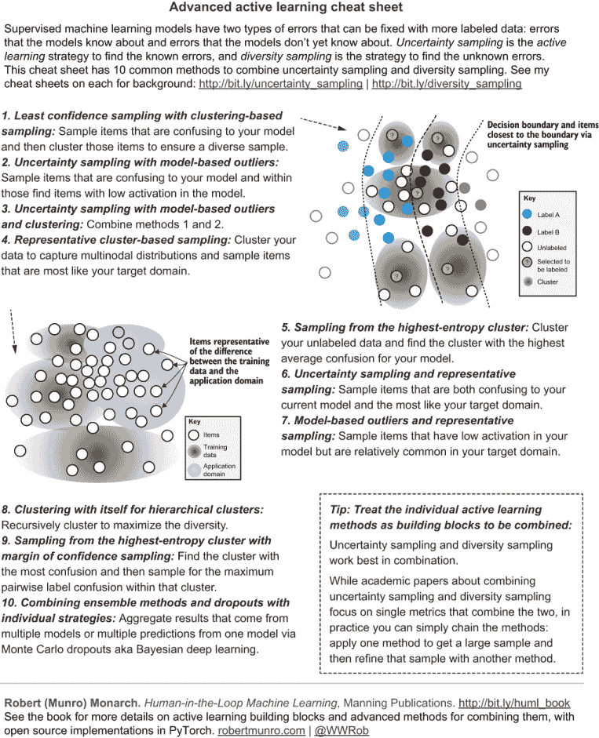

图 5.12 高级主动学习速查表

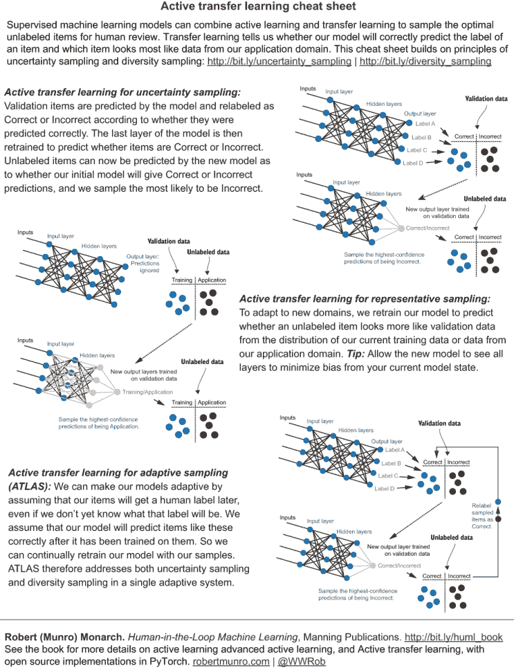

图 5.13 主动迁移学习速查表

## 5.6 活跃迁移学习的进一步阅读

正如你在本章中学到的，关于使用一种方法采样大量项目，而另一种方法用于细化样本的高级主动学习技术，现有的工作很少。关于结合不确定性采样和多样性采样的学术论文主要关注结合两种方法的单一指标，但在实践中，你可以简单地串联这些方法：应用一种方法得到一个大样本，然后用另一种方法细化这个样本。学术论文倾向于将组合指标与独立的方法进行比较，因此它们不会给你一个关于它们是否比串联方法更好的想法（第 5.1 节）。

本章中提到的主动迁移学习方法比目前在学术或行业论文中报道的方法更为先进。在出版本书之前，我已经就这些方法发表过演讲，但所有这些演讲的内容都包含在本章中，因此别无他处可以阅读到它们。我直到 2019 年底在创建与本章配套的 PyTorch 库时，才发现了将主动迁移学习扩展到自适应学习的可能性。本书出版后，请寻找引用 ATLAS 的最新研究论文。

如果你喜欢 ATLAS 将主动学习本身转化为一个机器学习问题的事实，你可以找到一份长长的有趣研究论文列表。自从主动学习存在以来，人们一直在思考如何将机器学习应用于为人工审查采样项目的过程。我推荐的一篇很好的近期论文是“从数据中学习主动学习”，作者是 Ksenia Konyushkova、Sznitman Raphael 和 Pascal Fua（[`mng.bz/Gxj8`](http://mng.bz/Gxj8)）。寻找这篇论文中最被引用的工作以及引用这篇论文的更近期的作品，以了解使用机器学习的主动学习方法。为了深入了解，请参阅 NeurIPS 论文的第一作者 Ksenia Konyushkova 的博士论文，其中包含全面的文献综述。

对于一篇较旧的论文，该论文探讨了结合不确定性和代表性采样的方法，我推荐“使用互信息进行乐观主动学习”，作者是 Yuhong Guo 和 Russ Greiner（[`mng.bz/zx9g`](http://mng.bz/zx9g)）。

## 摘要

+   你有多种方式可以将不确定性采样和多样性采样结合起来。这些技术将帮助你优化你的主动学习策略，以采样对模型精度最有帮助的项目。

+   将不确定性采样和聚类结合起来是最常见的主动学习方法，在你学习本书到目前为止的所有内容之后，相对容易实现，因此它是探索高级主动学习策略的一个好起点。

+   活跃的迁移学习用于不确定性采样允许你构建一个模型来预测未标记的项目是否会被正确标记，使用你的现有模型作为不确定性预测模型的起点。这种方法允许你在不确定性采样过程中使用机器学习。

+   活跃的迁移学习用于代表性采样允许你构建一个模型来预测未标记的项目是否比你的现有训练数据更接近你的目标领域。这种方法允许你在代表性采样过程中使用机器学习。

+   ATLAS 允许你扩展活跃的迁移学习用于不确定性采样，这样你就不需要从特征空间的一个区域过度采样项目，将不确定性采样和多样性采样的方面结合到一个机器学习模型中。

* * *

(1.)“通过采样估计误差减少实现最优主动学习”，作者：尼古拉斯·罗伊和安德鲁·麦卡卢姆 ([`dl.acm.org/doi/10.5555/645530.655646`](https://dl.acm.org/doi/10.5555/645530.655646)).
