# 6 将主动学习应用于不同的机器学习任务

本章涵盖

+   计算目标检测的不确定性和多样性

+   计算语义分割的不确定性和多样性

+   计算序列标注的不确定性和多样性

+   计算语言生成的不确定性和多样性

+   计算语音、视频和信息检索的不确定性和多样性

+   选择合适数量的样本进行人工审查

在第 3、4、5 章中，示例和算法主要集中在文档级或图像级标签上。在本章中，你将学习如何将不确定性采样和多样性采样的相同原则应用于更复杂的计算机视觉任务，例如目标检测和语义分割（像素标注）以及更复杂的自然语言处理（NLP）任务，如序列标注和自然语言生成。一般原则是相同的，并且在许多情况下，没有任何变化。最大的不同之处在于你如何采样主动学习选择的项，这将取决于你试图解决的现实世界问题。

大多数现实世界的机器学习系统使用比文档级或图像级标签预测更复杂的任务。即使听起来简单的问题，当你深入研究时，往往需要高级的主动学习技术。想象一下，你正在构建一个计算机视觉系统来帮助农业。你拥有带有摄像头的智能拖拉机，需要区分幼苗和杂草，以便拖拉机可以高效准确地施用肥料和除草剂。尽管除草是历史上最常见和重复的任务之一，但你需要图像内的目标检测，而不是图像级标签，来自动化这项任务。

此外，你的模型有不同的混淆类型。在某些情况下，你的模型知道一个物体是植物，但无法决定该植物是幼苗还是杂草。在其他情况下，由于各种小物体都可能进入田地，你的模型不确定某些新物体是否是植物。你需要不确定性采样来区分幼苗/杂草，并结合多样性采样来识别新物体。

最后，你的相机在每张图像中捕捉多达 100 种植物，因此你必须决定如何解决图像级混淆与对象级混淆。当图像中的一个对象非常难以识别或当 100 个对象有点难以识别时，你是否优先考虑人工审查？你是否优先考虑对象的正确标签或对象轮廓的准确性？任何这些类型的错误都可能对你正在解决的问题至关重要，因此你需要决定如何将你的现实世界问题映射到正确的采样和评估策略。因此，尽管你正在自动化历史上最常见和重复的任务之一，但你仍需要高级的主动学习技术来解决问题。

## 6.1 将主动学习应用于目标检测

到目前为止，我们研究的是相对简单的机器学习问题：对整个图像（图像标注）或整个文本片段（文档标注）进行预测。然而，对于许多问题，需要更精细的预测。

你可能只想在图像中识别某些对象，例如，因此你更关心对象的不确定性和多样性，而不是背景。本章开头我们的例子就是这样：你更关心识别杂草，而不是识别围绕它们的田野。在关心背景的程度上，你只关心这一点，以便你能区分杂草和不同的背景。

对于这些示例，你希望采用也关注你所关心区域的主动学习策略。有时，这种关注是免费的；你的模型正在关注你所关心的区域，因此你通常不需要改变你在图像和文档标注中学习的方法。在其他情况下，你需要裁剪/遮蔽你的数据到你所关心的区域，并确保在这个过程中没有引入偏差。在接下来的几节中，我们将讨论一些机器学习问题，并看看你已学到的主动学习策略如何适应这些问题。

图 6.1 说明了在目标检测任务中识别不确定性和多样性的问题。假设这个任务使用的是第三章中的相同示例图像，但在第三章中，我们只想预测图像的标签，而现在我们想要识别图像中的特定对象并在这些图像周围放置边界框。如图 6.1 所示，我们关心的对象——自行车——只是围绕它的边界框中像素的一小部分。

图 6.1 展示了在目标检测任务中识别不确定性和多样性的问题。我们关心的对象——自行车——是其周围边界框中像素的一小部分。即使是微量的上下文也是像素数量的两倍，整个图像的像素数量是边界框的 10 倍。因此，如果我们试图在整个图像上计算不确定性和多样性，我们可能会风险关注大量无关信息。

对象的边缘往往是信息最丰富的地方，但通过增加 20%的上下文几乎会翻倍我们关注的像素总数。整个图像的像素数量是边界框的 10 倍。因此，如果我们试图在整个图像上计算不确定性和多样性，我们可能会风险关注大量无关信息。尽管我们可以使用在第四章和第五章中学到的不确定性采样和多样性采样技术，但我们希望将这种不确定性和多样性集中在我们最关心的区域。

本节的其余部分将介绍如何计算不确定性和多样性。你可以从你的模型中很容易地获得不确定性；最高不确定性往往在于你的对象，而不是背景。对于多样性，你应主要关注那些也是不确定的区域。

### 6.1.1 目标检测的准确性：标签置信度和定位

你在这里有两个任务：目标检测和目标标注。你应该将不同类型的不确定性和多样性应用于这两个任务：

+   标注每个对象（自行车、人类、行人等）

+   识别图像中对象的边界

每个任务的置信度是

+   对象标签置信度（标签正确的置信度）

+   对象定位置信度（边界框正确的置信度）

如果你从你的目标检测算法中获得一个置信度分数，你的置信度分数很可能是**仅**目标标签的置信度。今天使用的绝大多数目标检测算法都使用卷积神经网络（CNNs）并依赖于回归来确定正确的边界框。所有这些算法都会返回标签置信度，但很少返回到达边界框本身的回归分数。

你可以通过查看 F 分数或曲线下面积（AUC）的某种变化来确定标签准确性，就像你在前面的章节和附录中学到的那样：通过查看预测边界框和实际边界框相交的区域面积，除以这两个框覆盖的总面积。交集与并集（IoU）是确定定位准确性的最常用指标。如果你之前从事过计算机视觉工作，你早已知道 IoU。图 6.2 展示了 IoU 的一个示例，计算准确性的方法是将预测边界框和实际边界框相交的区域面积除以这两个框覆盖的总面积。

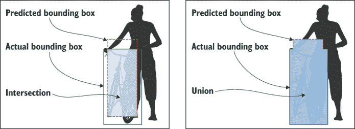

图 6.2 使用 IoU 测量边界框准确性的示例。准确性是通过预测边界框与实际边界框相交的面积除以两个边界框并集的面积来计算的。

IoU 也用于主动学习中的目标检测，因此在跳入不确定性采样和多样性采样之前，学习（或更新你的知识）是很重要的。就我们之前讨论的准确度指标而言，IoU 更为严格，因为它往往在相同的数据上具有更低的值。将 IoU 视为正确或错误预测的面积（或像素）的数量：

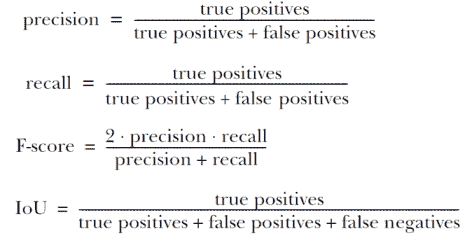

与 F-score 类似，IoU 结合了两种类型的错误：误报和漏报。除了 100%准确性的简单情况外，IoU 总是低于 F-score。F-score 在 NLP 中更为流行，而 IoU 几乎仅用于计算机视觉。你会在大多数机器学习领域的文献中看到 AUC，尽管 AUC 在 NLP 和计算机视觉中并不像应该的那样常用。

你还会在计算机视觉文献中看到平均平均精度（mAP）。mAP 是一种与 AUC 不同的曲线，但具有类似的想法。对于 mAP，你按精度对项目进行排名，然后按召回率绘制，创建一个精度-召回曲线，平均精度是该曲线下的面积。这种 mAP 的应用需要一个阈值来定义一个物体是否“正确”——通常是一个 IoU 值为 0.5 或 0.75。mAP 的确切阈值计算往往会有所不同，并且通常为不同的数据集和用例专门定义。对于像自动驾驶这样高度校准的任务，显然你需要比 0.50 的 IoU 值更高的准确度来认为预测是正确的。对于这本书来说，了解任何 mAP 的计算都不是必要的；重要的是要意识到这种其他常见的准确度指标，它将根据任务而特定。

对于主动学习，你通常希望采用一种策略，从定位置信度和标签置信度中采样。你需要确定你想要关注每种类型的程度。尽管你的标签和 IoU 准确性将帮助你确定需要最关注的地方，但你的关注点也将取决于你正在构建的应用程序。

假设你正在部署我们的示例模型以检测道路上的行人、汽车、自行车和其他物体。如果你的应用程序旨在预测碰撞，定位最为重要；错误地标记并不重要，重要的是你的物体边界是否准确。然而，如果你的应用程序旨在识别不同的交通流量，那么物体的精确边界并不重要，但标签很重要，因为你需要精确地知道看到了多少汽车、行人和其他物体。

因此，你可以在相同的位置部署相同的模型，但根据用例，你可能需要将你的主动学习和数据标注策略集中在本地化或置信度上。确定对你用例最重要的因素，并相应地集中你的主动学习策略。

### 6.1.2 对象检测中标签置信度和定位的不确定性采样

你可以使用标签置信度进行不确定性采样，就像你在第三章中为图像级标签所做的那样。你的目标检测模型将给出一个概率分布，你可以应用最小置信度、置信度范围、置信度比率、熵或集成模型来确定标签预测的不确定性。

对于定位置信度，集成模型是你的最佳选择，它将多个确定性预测组合成一个可以解释为置信度的单一预测。图 6.3 显示了示例。你可以使用两种方法中的任何一种：真正的集成或一个模型内的 dropout，这两种方法你都在第三章中学过。

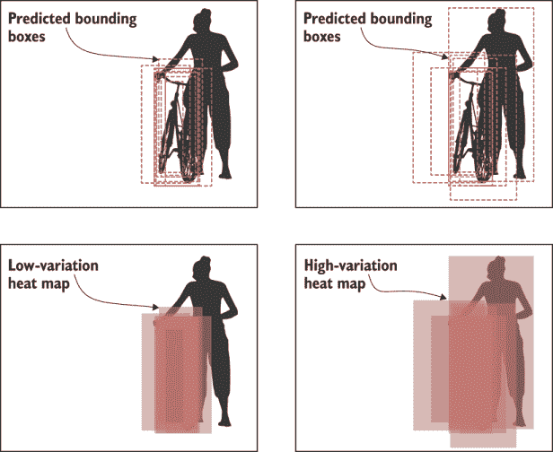

图 6.3 对一个对象的预测热力图示例，显示了低变化（左侧）和高变化（右侧）。高变化是模型中更多不确定性的证据；因此，右侧示例是人工评估的良好候选。你可以通过使用集成模型、从多个模型中获得预测并改变参数、使用特征子集或项目子集，或以其他方式在模型中引入随机变化来生成多个预测。在单个模型中，你可以通过在每个预测中使用随机选择的神经元的 dropout 来为单个项目生成多个预测（称为蒙特卡洛 dropout）。你还可以结合两种方法：创建一个模型集成，并为每个模型进行多次预测使用 dropout。

对于真正的集成，你从多个模型中获得预测，并确保这些预测会因不同模型的超参数而有所不同，为每个模型训练特征子集，为每个模型训练项目子集，或者以其他方式（如打乱训练项目的顺序）在训练运行中引入随机变化。

对于单个模型，你可以通过在每个预测中使用随机选择的神经元的 dropout 来生成多个预测（即蒙特卡洛 dropout）。这种方法比构建多个模型更快、更简单，而且出奇地有效。你也可以结合两种方法：训练一些具有不同参数的模型，然后对每个模型应用 dropout。

不确定性是从所有预测的平均 IoU 计算得出的。这种计算自然给出一个[0, 1]的范围，因此不需要归一化。除以模型的数量，而不是预测的数量。一些模型可能不会做出预测，这个信息很重要：将所有非预测视为 IoU=0。

现在你为每个边界框都有一个不确定性分数，你可以采样具有最大不确定性的边界框以供人工审查。如果你使用集成方法或 dropout 进行定位，你可以将它们用于标签置信度，代替或补充其他不确定性采样方法。

### 6.1.3 对象检测中的标签置信度和定位的多样性采样

对于多样性采样，我们需要解决本章开头提出的问题：我们更关心对象而非背景的多样性。最简单的解决方案是将图像裁剪到预测的边界框，然后应用多样性采样，但还有更复杂的变体，我们将在本节中介绍。第四章介绍了三种类型的多样性采样：

+   基于模型的异常值采样

+   基于聚类的采样

+   代表性采样

+   真实世界多样性的采样

对于基于模型的异常值和真实世界多样性，你不必做任何超出你已经为图像级标签学习到的事情：

+   你可以将基于模型的异常值检测应用于目标检测问题，就像你将其应用于图像标注问题一样。

+   你可以在目标检测问题中为真实世界多样性进行采样，就像你在图像标注问题中进行采样一样。

对于基于模型的异常值，隐藏层同时关注标注和定位问题，因此你的神经元主要捕捉关于对象和标签的信息。你可以将图像裁剪到预测的对象，然后寻找基于模型的异常值，但专门用于背景的少量神经元可能对多样性很有趣，因此在这种情况下你可能会失去一些东西。

对于多样性采样，第四章中的原则也适用。你需要结合所有主动学习方法，以确保跨真实世界人口统计数据的数据公平性。在这种情况下，背景也很重要，因为如果你不小心，你可能会错误地建模对象的上下文而不是对象本身。（参见以下侧边栏。）对于目标检测，你可能希望确保你的数据试图平衡包括相机类型、缩放、一天中的时间和天气在内的各种类型的对象。即使是高度控制的设置，例如医学成像，我也看到系统仅限于从少量患者和仅一种成像设备的数据中进行训练，从而引入了不受欢迎的真实世界偏差。

你的模型真的忽略了背景吗？

本书假设你的模型专注于对象而不是背景。然而，有时你的模型可能会错误地使用背景信息。例如，如果你只拍摄了自行车道上的自行车照片，你的模型可能会预测自行车道，而对其他环境中的自行车视而不见。或者，它可能只在车道存在时依赖自行车道，这仍然不是理想的，因为模型没有将这些环境中对自行车的知识推广到其他背景。

一篇关于模型可解释性的有影响力的近期论文提出了另一个例子。作者创建了一个看似准确的模型，用于区分狼和哈士奇¹，但只使用了雪中的狼和不在雪中的哈士奇的照片。他们展示了该模型预测的是背景中是否有雪，而不是实际的动物！这个问题在图像级标签中更为严重，因为在目标检测中，你也在明确地迫使模型学习对象本身的轮廓，这使得模型难以专注于背景。但这个问题在任何需要控制上下文的机器学习问题中都可能以某种程度发生。

解决方案是更好地采样以实现现实世界的多样性，确保所有你关心的标签和对象之间的上下文尽可能多样化。如果你担心你的模型存在这个问题，以下是诊断方法：使用一种方法找出哪些像素对于你的预测是重要特征（例如 LIME，哈士奇/狼论文中的方法，或者截至 2019 年 10 月的 PyTorch 中的 Captum 可解释性库），然后测量有多少像素落在你的验证数据上的边界框之外。得分最高的图像最有可能存在问题。查看这些图像以识别模型在边界框之外关注的任何模式。

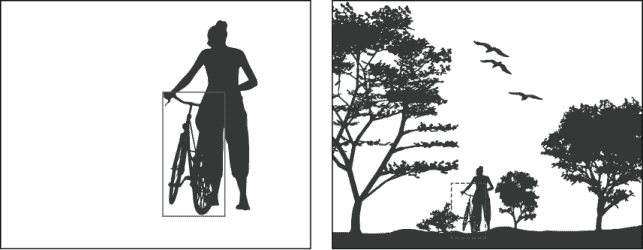

图 6.4 图像中一个对象——自行车的例子，其中 99%的图像不是自行车。用虚线捕获的自行车及其直接上下文应该足以识别该对象是自行车。使用一些策略，如代表性采样和聚类，我们需要裁剪或遮罩图像以针对这些区域。

对于基于聚类的采样和代表性采样，重点应放在对象本身上，而不是背景上。如果你的背景占图像的 90%，例如图 6.1 中的例子（在图 6.4 中重复），它将占决定聚类或代表性的 90%的影响。图 6.1 还包含一个相对较大的对象，占据了框架高度的一半。但在许多情况下，例子更像是图 6.4 中的第二幅图像，其中对象只占像素的不到 1%。

在图 6.4 中，自行车本身及其直接上下文足以识别该对象为自行车。一些框外的信息可能有助于确定自行车出现的规模和上下文，但这并不重要。

因此，每个预测对象的周围区域应该被裁剪。因为你的模型并不完全准确，你需要确保你捕捉到了对象。使用你的不确定性采样方法（集成或 dropout）进行多次预测。然后执行以下操作之一：

+   *在给定的阈值处裁剪。* 例如，你可能创建一个最小的裁剪，以捕捉到对象预测边界框的 90%。

+   *使用同一对象的每个预测框，并对框进行加权。* 你可能对每个预测框应用代表性采样，然后对所有代表性采样进行平均，其中加权平均由每个框与其他所有框的平均 IoU 确定。

作为裁剪图像的替代方案，你可以忽略上下文框外的像素——这个过程称为*掩码*。你可以将针对像素输入训练的模型的掩码视为第一层的 dropout，因为你正在忽略一些输入神经元（像素）。

上下文有多重要？

在计算机视觉中存在一些例外情况，其中上下文*确实*很重要。我在多次场合中只遇到过这些例外情况之一：识别空超市货架以帮助补货。一个空的空间（对象）也需要上下文，例如相邻的物品和空货架下的价格标签。否则，模型无法确定货架是故意留空的，还是应该有产品放在货架上。

除非你有这样的用例，即根据上下文基本标记一个孔，否则请尽可能保持框紧，以便进行聚类和代表性采样。通过使用整个图像的一些多样性采样，你可以捕捉到更广泛的环境多样性。

根据你的使用案例，你可能还需要调整图像的大小。如果你在计算机视觉领域工作，你已经有你选择的用于程序化调整大小的工具。例如，我们的自行车在照片底部可能并不重要，因此你可以通过裁剪每个预测以使整个图像为基准来规范化你的数据，然后通过将所有样本图像缩放到相同的尺寸来进一步规范化。作为一个一般规则，根据你想要如何编码数据以进行聚类和代表性采样来做出裁剪/掩码的决定：

+   如果你正在使用像素作为特征或使用单独的工具来创建特征，请裁剪图像，并考虑是否也应该调整它们的大小。

+   如果你正在使用与用于对象检测的*同一*模型中的隐藏层，你可以对图像进行掩码处理，而不移动或调整它们的大小。你的特征可以捕捉到不同位置和尺度上对象的相似性。

现在你已经裁剪或遮罩了图像，可以用于聚类和代表性采样！在图像中的每个裁剪或遮罩对象上，你可以应用聚类或代表性采样。你应用基于聚类的采样和代表性采样，就像你在第四章中学到的那样。

确保你采样了具有不同图像中对象数量的图像。如果你发现你只采样了具有少量或大量对象的图像，你无意中在你的过程中引入了偏见。在这种情况下，分层你的采样。你可能采样 100 个具有 1 个预测对象的图像，100 个具有 2 个预测对象的图像，依此类推。

### 6.1.4 对目标检测的主动迁移学习

你可以将主动迁移学习应用于目标检测，就像你将其应用于图像级标签一样。你还可以将主动迁移学习应用于自适应采样（ATLAS），在单个主动学习周期内进行调整，因为你假设你首先采样的对象将由人工标注员稍后纠正，即使你不知道那些标签是什么。

无论你使用哪种神经网络架构进行目标检测，你都可以使用隐藏层（s）作为你基于验证数据训练的二进制“正确”/“错误”模型的特征。作为一个有趣的扩展，你可以在二进制“正确”/“错误”任务之外，计算验证数据的 IoU 并创建一个预测 IoU 的模型。也就是说，你可以预测一个连续值而不是二进制的“正确”/“错误”。这个过程可能只是将最终层改为回归任务而不是分类任务，并让这个回归任务模拟每个验证项的 IoU。这个扩展可能只需要从第五章的 ATLAS 示例中更改一或两行代码。

### 6.1.5 设置低目标检测阈值以避免持续偏见

无论你使用什么方法进行目标检测，都要设置低置信度阈值。你不想只找到与你数据中已经存在的对象相似的对象，这会持续这些类型对象的偏见。

你可能会发现低阈值产生了过多的候选对象。你可能会在 50%或更高的置信度下得到 100 个预测图像，但在 10%的置信度下得到 10,000 个，其中大多数是背景（不是对象的假阳性）。所以你可能会想在这个情况下提高阈值。不要这么做。

除非你确信你已经正确设置了阈值以在预测中获得接近完美的召回率，否则你仍然有可能在你的模型中持续偏见。相反，按置信度分层，并从每个分层中采样：

+   在 10-20%的置信度下采样 100 个预测图像。

+   在 20-30%的置信度下采样 100 个预测图像。

+   在 30-40%的置信度下采样 100 个预测图像，依此类推。

图 6.5 显示了按置信度分层的通用策略示例。

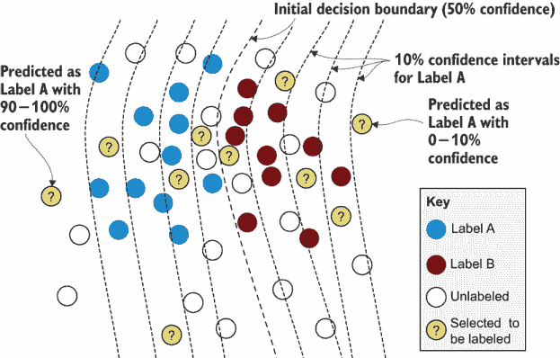

图 6.5 按置信度分层：在 0-10%、10-20%置信度等，一直分层到 90-100%置信度，抽取等数量的项目。在这个例子中，从标签 A 的每个 10%置信度区间中抽取一个项目。当标签之间存在较大的不平衡时，按置信度分层非常有帮助。

如图 6.5 所示，您可以在不同的置信度区间抽取相同数量的项目。这种策略对于像对象检测这样的任务很有帮助，因为您的许多图像可能不包含您关心的对象。使用按置信度分层的抽样策略，您将花费大部分时间抽样高置信度对象，同时仍有一些低置信度对象的选择。请注意，尽管识别非对象似乎浪费时间，但这对于您的机器学习算法来说并非如此。学习不是对象但当前以非平凡置信度预测为对象的识别，对于您的模型精度的重要性与学习新对象一样重要。

这种分层对于避免数据中的偏差非常重要。您也可以尝试在每种置信度内随机抽样的方法组合作为替代。

+   从具有 10-20%置信度的 10,000 个对象中选取，应用聚类，并从样本中抽取质心来获取其中最多样化的 100 个对象。

+   从具有 10-20%置信度的 10,000 个对象中选取，并应用代表性抽样以获取与您的目标领域最相似的 100 个对象。

+   从具有 10-20%置信度的 10,000 个对象中选取，并对基于模型的异常值进行抽样，以获取与当前训练数据最不相似的 100 个对象。

注意，您可以将这种方法应用于按置信度分层的任何类型任务，而不仅仅是对象检测。

### 6.1.6 创建与您的预测相似的代表性抽样训练数据样本

由于您正在裁剪或遮罩您的未标记图像，如果您正在实施代表性抽样，您应该对训练数据执行相同操作。如果您只使用训练数据中的完美边界框，但随后使用未标记数据的不可预测的预测，那么“代表性”样本可能会变成不同框大小和裁剪策略的结果，而不是实际的对象。以下有四种选项，按优先顺序排列：

+   对训练数据进行交叉验证。您可能将训练数据分成 10 个相等的数据集。迭代地对每组九个数据集进行训练，并在每个保留的数据集上进行边界框预测。将所有预测组合起来，并将组合作为代表性抽样语料库的训练数据部分。

+   使用与您的训练数据具有相同分布的验证数据集，对验证集进行边界框预测，并将这些验证边界框作为您语料库中代表性抽样的训练数据部分。

+   在训练数据上预测，然后随机扩展或收缩框，使它们具有相同的平均预测变化。

+   使用你的训练数据中的实际框，然后随机扩展或收缩框，使它们具有相同的平均预测变化。

选项 1 和 2 在统计上同样好。如果你有一个保留的验证集，这个过程比重新训练整个模型要简单一些，但它不会是训练集中确切的数据，尽管它尽可能接近。

对于选项 3 和 4，虽然你可以增加边界框的大小，使平均值为相同，但你无法匹配预测中出现的错误类型。预测的边界框错误不会随机分布；它们将取决于图像本身，这在创建人工噪声时很难复制。

### 6.1.7 对象检测中图像级多样性的采样

就像任何其他方法一样，你应该始终随机采样一些图像进行审查。这个样本提供了你的评估数据，并为你提供了一个基准，以衡量你的主动学习策略的成功程度。

对于少量样本，你可以使用图像级采样，这有助于多样性，并且比本节中介绍的其他方法更容易防止偏差。如果你在整张图像级别应用聚类，并发现包含少量或没有现有训练样本的整个簇，那么你有很好的证据表明，你应该对这些簇中的某些项目进行人工审查，因为你可能遗漏了一些东西。

如果你向模型引入新的数据类型（也许你正在使用新的相机或从新的位置收集数据），图像级别的代表性采样可以帮助你更快地适应。这种策略也有助于你在尝试结合新数据时，比仅尝试实现对象级主动学习时具有更少的偏差。

如果你尝试在不同类型的数据上使用对象级方法，很难避免偏向于你已经看到的对象，因为其中一些对象可能仍然低于你使用的阈值。置信度阈值通常对域外数据最不可靠。

### 6.1.8 使用多边形时考虑更紧密的掩码

如果你使用的是图 6.6 中所示的多边形而不是边界框，所有的方法仍然适用。你有一个额外的选项：你可以在边界框外部而不是在最近的边缘一定距离处进行掩码。在我们的自行车示例中，这种方法更接近捕捉自行车本身，而不是那么多的空地。

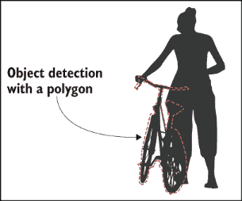

图 6.6 使用多边形而不是边界框进行目标检测的示例。你可以为边界框和多边形使用相同的主动学习方法，并且对于多边形还有一个额外的选项：可以在多边形最近边缘的一定距离处进行掩码。

由于同样的原因，错误检测可以更加精确，尤其是对于形状不规则的物体。你可以想象，像图 6.6 中的自行车，在许多照片中可能会有把手伸出。仅为了捕捉那个把手而扩展的边界框可能会轻易地占据盒子面积的一半，这为像素错误提供了很大的空间，而这些像素并不属于物体本身。在图像识别中，在边界框和多边形之后，下一个复杂度级别是语义分割。

## 6.2 将主动学习应用于语义分割

*语义分割*发生在整个图像都被赋予标签，并且所有物体周围都有准确的多边形边界时。由于这种技术为图像中的每个像素都贴上了标签，因此它也被称为*像素标签*。图 6.7 展示了这样一个例子。

图 6.7 展示了语义分割的一个例子，其中每个像素都被标注。这类彩色照片是许多语义分割工具的外观：一种填色练习。我们将在本书的后面部分介绍这些工具，特别是在第十章。如果你以黑白形式查看这张图像，对比的灰色阴影应该能给你一个很好的颜色图像概念。如果物体被赋予标签（例如，四棵树被分别标注），那么这项任务就被称为*实例分割*。

如果你试图估计延伸到其他物体背后（遮挡）的物体，那么更常见的是使用你在 6.1 节中学到的边界框类型的物体检测。使用语义分割将所有物体涂成单一类型，而不是分别识别每个物体，这种情况也很常见。例如，图 6.7 中的每棵树都是相同的颜色，但图像并没有区分不同的树。然而，这些共性并不是一成不变的：有些情况下，忽略遮挡的边界框被使用，语义分割试图捕捉遮挡，语义分割区分物体（称为*实例分割*）。如果一个模型结合了所有这些方法，有时它被称为*全景分割*，识别物体和背景像素。本章中的所有方法都应该足够通用，可以应用于边界框或语义分割的任何变化。

这些方法可以应用于其他类型的传感器数据，例如来自激光雷达、雷达或声纳的 2D 和 3D 图像，这些都是自动驾驶汽车中常见的。在农业中，收集红外线和紫外线的图像也很常见，然后将这些结果转换成可见颜色以供人工标注，这也是常见的。搜索“红外森林”或“紫外花卉”照片，你就会明白为什么：很多有用的信息都超出了人类的可视范围！如果涉及到额外的维度和传感器信息，本节中的原则仍然适用。

### 6.2.1 语义分割的准确性

语义分割的准确性是在每个像素级别上计算的。有多少像素被正确分类，相对于保留的测试集？你可以使用你迄今为止学到的所有准确性指标：精确度、召回率、F 分数、AUC、IoU 以及微观和宏观分数。机器学习准确性的正确选择取决于你的用例。

对于确定不确定性，宏观 F 分数或宏观 IoU 通常最有用。与我们的边界框示例一样，在语义分割中，我们通常有很多我们不关心的空间，例如天空和背景。如果你有很多不连续的区域，你可能会遇到麻烦。例如，图 6.7 在叶子和天空之间可能有超过 100 个独立的天空区域。从整体大小和总数来看，这些天空区域将主导基于像素或区域的微观分数，而树叶混淆将主导我们的不确定性采样策略。所以假设你关心所有标签，但不关心该对象在图像中占据多少空间，使用宏观分数：每个标签每个区域的平均 IoU 或每个标签每个像素的平均 F 分数。

你也可能决定忽略一些标签。也许你只关心人和自行车，因此你可以选择一个宏观准确性值，只查看这些标签。你仍然会从区分人和自行车与背景、地面和天空的错误中获取输入，但不会是那些无关标签之间的错误。请注意，具体是什么重要将取决于你的具体用例。如果你的任务是识别森林覆盖率，那么叶子和天空之间的区域将最为重要！

使用你部署的机器学习模型准确性作为计算不确定性的指南。你应该根据你为准确性计算加权的标签，以两种方式之一进行此计算：

+   如果你不对你的标签进行加权（你要么 100%关心，要么不关心每个标签是否等于绝对权重），使用你用于模型准确性的相同指标来确定采样位置。如果你只关心模型准确性中的两个标签的混淆，则只对涉及一个或两个这些标签的混淆预测进行主动学习采样。

+   如果你有一个加权的准确性指标，请不要使用与模型准确性相同的指标。相反，使用你在第三章中学到的分层采样方法。图 6.8 显示了一个示例。

如图 6.8 所示，按标签进行分层采样有助于将你的主动学习策略集中在最重要的像素上。虽然你可以为任何机器学习问题使用分层采样，但语义分割是其中可以提供帮助的最清晰的例子之一。

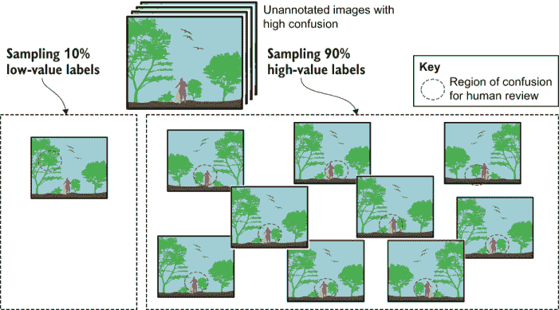

图 6.8 层次抽样在分割中的应用示例。对于这个示例任务，假设我们更关心与人和自行车像素相关的错误，而不是与树木和天空像素相关的错误。我们的主动学习样本将包括 90:10 的分割：90%将是我们最关心的标签中最令人困惑的样本，10%将是我们不关心的标签。请注意，天空和树木边缘的像素数量远远超过人和自行车边缘的像素数量，因此层次抽样有助于我们关注我们最关心的错误。因此，你的抽样策略可能与你的准确度评估策略不同，在准确度评估策略中，你可以简单地应用 90%和 10%的相对权重到高值或低值错误。不确定性抽样指标并不容易进行这种加权，所以除非你对自己的统计技能足够自信以调整你的加权策略，否则使用这种层次抽样方法。

注意，层次抽样可能与你的模型准确度评估策略不同。假设你关心标签 A 比标签 B 多九倍。计算你的模型准确度为 90% × 标签 A 的 F 分数 + 10% × 标签 B 的 F 分数（加权宏 F 分数）。这种策略对于模型准确度来说是可行的，但不幸的是，你不能以类似的方式应用权重到不确定性分数，因为你的加权几乎肯定只会将标签 A 的项目排在最高位，将它们唯一地置于排名的顶部。相反，使用这些权重作为样本数量的比例。例如，你可能采样 90 个最不确定的标签 A 项目和 10 个最不确定的标签 B 项目。这种技术比尝试在标签之间创建加权抽样策略简单得多，而且效果更佳。如果你不关心某些标签，仍然可以考虑采样少量样本，特别是使用基于模型的异常值和代表性抽样，因为它们可能是你关心的标签的假阴性。

### 6.2.2 语义分割的不确定性抽样

大多数语义分割算法都是基于 CNN 的变体，使用 softmax 在可能的每个像素的标签上生成概率分布。因此，你可以使用你在第三章学到的方 法，按每个像素计算不确定性。你的模型不太可能对每个像素进行预测，这将是不高效的，而是预测区域，并在被迫时仅选择小的（可能是像素大小的）区域。确切地知道你的预测置信度来自哪里。

与边界框一样，从你的模型中得到的置信度可能反映了你的标签置信度，而不是你对象边界的置信度。如果是这样，你可以从像素置信度中推导出定位置信度：你知道哪些像素是相邻不同标签的像素，因此所有边界像素的聚合置信度就是定位置信度。你可能对几个像素的误差可以接受；如果是这样，使用这个误差范围来确定你计算置信度的位置。例如，如果你通过原谅所有小于 3 像素的错误来衡量你的机器学习模型的准确性，那么对不确定性也做同样的事情，测量距离边界 3 像素的像素的平均不确定性。

由于某种原因，你可能正在使用一个不提供给定标签概率分布的模型。在这种情况下，你可以使用集成方法和/或 dropout 来创建多个预测，并将不确定性计算为预测中标签一致性的数量。

现在你只采样你关心的像素，并且每个像素都有一个不确定性分数，你可以应用任何不确定性采样算法。计算整个图像的不确定性的最简单方法是从你关心的每个像素中取平均值。如果你主要关心边界，你可以在其他标签的几个像素内采样项目。

根据你的任务，如果你（例如）想给图像一个不确定性分数，这个分数是任何单个区域的最高不确定性，你可以尝试除了平均值以外的其他指标。你只关注图像内区域的能力部分取决于你的注释设置。是否需要注释整个图像，或者他们是否只能注释你关心的标签？这些问题在第九章从注释的角度进行了讨论。

### 6.2.3 语义分割的多样性采样

由于模型基于异常值采样不能直接从你的模型中采样，就像在对象识别中那样，因此这种方法适用于对象识别，因为你是迫使模型关注你关心的区域，但语义分割算法必须对每个像素进行分类。因此，你应该遮罩或裁剪图像，只包含你关心的预测标签，如第 6.1 节所述，然后应用基于模型的异常值。

对于聚类和代表性采样也是同样的道理：裁剪或遮罩图像到你关心的区域，然后应用聚类和/或代表性采样。对于现实世界的多样性，策略与边界框相同：使用你在主动学习中所知道的所有技术，以采样你关心的跨和内部人口统计数据的多样性。关于这些方法，请参阅第 6.1 节关于目标检测的更多内容。

### 6.2.4 语义分割的主动迁移学习

你可以将主动迁移学习应用于语义分割，就像你应用于图像级标签一样，但你应该使用自适应方法：ATLAS。如果你不使用此算法的自适应版本，你可能会仅在你不关心的区域采样混淆，例如当你主要关心地面上的物体时，叶子和天空之间的划分。请注意，ATLAS 不会完全解决这个问题；它可能会最初采样你不关心的混淆类型。但它会快速适应，假设这些类型的混淆已解决，因此也会覆盖你关心的区域。如果你考虑你的数据中存在多少成对的标签集以及你实际上关心这些对中的百分比，你将会有一些关于 ATLAS 即插即用成功率的想法。

要充分利用 ATLAS 进行语义分割，你可以策略性地设置你的验证数据以用于迁移学习。例如，如果你不关心叶子和天空之间的错误，你可以在运行验证数据通过原始模型以生成你的“正确”/“错误”标签时忽略这些错误。这样，你的模型现在只预测你关心的标签类型的错误。

### 6.2.5 语义分割中图像级多样性的采样

与目标检测一样，你可能想从整个图像中采样少量项目（特别是如果你正在引入来自新位置、相机类型等的数据），这样你可以快速适应并找到你关心的标签的假阴性。如果你在结合方法时，你也可以尝试放宽裁剪或遮罩的限制。你可以对整个图像进行代表性采样，以找到最具代表性的新领域或图像类型的图像，然后对最具代表性的图像进行采样，对这些样本应用遮罩/裁剪，并对这些样本进行聚类以实现多样性。这种技术为你提供了从整个图像中关于你关心的领域最具代表性的项目最多样化的选择。

## 6.3 将主动学习应用于序列标注

*序列* *标注*是将机器学习应用于序列内的标注，是 NLP 中最常见的任务之一。假设你有这个句子（序列）：

*“首次在旧金山的超市发现大肠杆菌疫情”*

如果你正在实现一个从文本报告中追踪疫情爆发的模型，你可能想从句子中提取信息，例如疾病的名称、数据中的任何位置以及重要的关键词，如表 6.1 所示。

表 6.1 一个示例序列标签：关键词检测和两种类型的命名实体，疾病和地点。标签 B（开始）应用于跨度的开始，标签 I（内部）应用于跨度内的其他单词，使我们能够明确地区分相邻的跨度，例如“旧金山”和“超市”。这个过程被称为 IOB *标记*，其中 O（外部）是非标签。（O 从表中省略以增强可读性。）

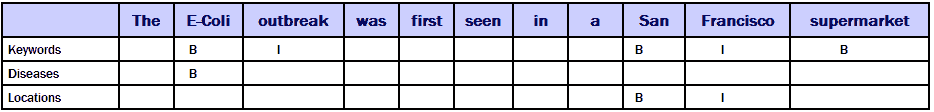

在文献中，你最常见的标签是用于跨度的 IOB 标记，如表 6.1 所示。请注意，你可能需要根据不同类型的标签以不同的方式定义跨度。名为“大肠杆菌”的命名实体是一个单词，但当我们提取关键词时，它变成了短语“大肠杆菌爆发”。尽管“旧金山”既是实体（地点）也是关键词，但普通名词“超市”是关键词但不是实体。严格来说，这个过程被称为*IOB2 标记*，其中 IOB 只在单个跨度中有多个标记时使用 B。IOB2 是你在文献中最常见的处理方法，有时简称为 IOB。

其他编码方式标记跨度的结束而不是开始。这种编码方式在整句分割任务中很常见，例如标记每个单词和子词跨度的结束以及每个句子的结束。对于句子，标记结束是因为识别句子结束（通常用标点符号）比识别开始要容易一些。本章中的方法适用于任何类型的序列编码，因此本章将坚持使用 IOB2 示例，并假设如果您的编码系统不同，它很容易适应。

你也可能将一些标签视为同一任务的天然组成部分。我在命名实体识别（NER）方面做了很多工作，它将识别“地点”和“疾病”视为同一任务的一部分，但将关键词识别视为不同的任务。即使在同一任务中，标签的定义也可能有很大的变化。一些流行的 NER 数据集只有四种实体类型：“人物”、“地点”、“组织”和“杂项”。相比之下，我曾经帮助一家汽车公司构建了一个拥有数千种实体类型的实体识别系统；每种类型的引擎、车门甚至头枕都有多种类型和名称。

尽管你可能在 NLP 中执行各种序列标注任务，但它们都归结为在序列中识别文本跨度。这类序列标注任务在文献中被称为*信息提取*，通常是更复杂的多字段信息提取任务的构建块。如果你有一个包含一个疾病和多个位置的句子，你也会确定疾病被检测到的位置，如果有的话。在本章中，我们将坚持识别单个跨度的示例，并假设你可以将它们扩展到更复杂的信息提取任务。

### 6.3.1 序列标注的准确性

序列标注的准确性指标取决于任务。对于命名实体，通常是整个跨度的 F 分数。因此，将“旧金山”预测为位置将占准确性的 100%，但将“Francisco”或“旧金山超市”预测为位置将占准确性的 0%。

在某些情况下，这种严格的准确性可能被放宽，或者与更宽容的指标（如每词准确性，称为*per-token*，因为并非所有标记都是精确的单词）一起报告。在其他情况下，准确性可能针对实体与非实体进行报告，实体的类型（如疾病或位置）将单独报告。

你可能不会关心序列任务中的“O”标签。F 分数将捕捉其他标签与“O”之间的混淆，这可能已经足够。就像在目标检测和语义分割中，你更关心每个数据项的某些部分而不是其他部分。专注于这些数据部分进行主动学习将导致更好的样本。

就像在计算机视觉示例中一样，你应该使用与测量你的 NLP 模型准确性一致的指标进行主动学习采样。对于许多 NLP 任务，上下文比目标检测更重要。你知道“旧金山”是一个地点，而不是一个名称中包含“旧金山”的组织，因为整个句子的上下文。因此，在预测序列周围有一个更广泛的上下文更安全，通常也是可取的，因为上下文可以是一个重要的预测因素。

### 6.3.2 序列标注的不确定性采样

几乎所有的序列标注算法都会为你提供标签的概率分布，通常使用 softmax，这样你就可以直接计算每词的不确定性。除了（或与）softmax 置信度之外，你可以使用集成模型和/或 dropout 来生成多个预测，并将不确定性作为这些预测之间的一致性或熵的水平来计算。这种方法类似于计算机视觉中的目标检测示例。

同样，就像在计算机视觉示例中一样，你的置信度将关于每个标记的标签置信度，而不是整个跨度或跨度的边界。但如果你使用 IOB2 标记，你的“B”标签将联合预测标签和起始边界。

你可以决定如何计算整个跨度的不确定性。所有信心值的乘积是（从数学上讲）最正确的联合概率。然而，你还需要对标记的数量进行归一化，这可能很复杂。因此，跨度中所有标记的平均或最小信心可能比乘积更容易处理。

对于跨度外的标记，不确定性可能很重要。如果我们错误地预测“Francisco”不是位置，我们希望考虑到它可能曾是位置的事实。表 6.2 展示了这样一个例子。

表 6.2 展示了与每个标签相关的位置识别和信心示例。表中显示了一个错误，即只有“San”来自“San Francisco”是位置，但“Francisco”的信心相当高。因此，我们想要确保在计算信心时考虑到预测跨度之外的信息。

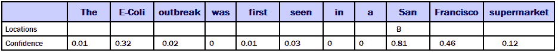

表 6.2 显示了一个错误，其中只有“San”来自“San Francisco”被预测为位置。然而，“Francisco”是一个假阴性，但它的信心（0.46）相当高。因此，我们想要从预测跨度之外计算不确定性；我们想要确保边界也是正确的。

在表 6.2 中，我们可以将“Francisco”视为 1 - 0.46 = 0.54，这将降低我们对跨度边界的信心。相比之下，在预测的开始阶段，“a”的信心为零。所以 1 - 0 = 1，这将增加我们的信心。“B”标签也有助于提高初始边界的信心。

### 6.3.3 序列标注的多样性采样

对于你的机器学习模型，你几乎肯定使用了一个架构和/或特征表示，它能够捕捉广泛的上下文窗口。在某些模型中，你直接编码了这个表示。如果你使用基于 transformer 的方法，那么上下文（注意力）是作为模型本身的一部分被发现的，你可能只提供了一个最大尺寸。为了帮助确定在主动学习中使用上下文，选择一个与你的预测模型使用的上下文一致的采样窗口。第四章介绍了四种类型的多样性采样：

+   基于模型的异常值采样

+   基于聚类的采样

+   典型采样

+   现实世界多样性的采样

我们将首先从最简单的方法开始，即与对象检测一样：

+   你可以将基于模型的异常值检测应用于序列标注问题，就像你将其应用于文档标注问题一样。

+   你可以在序列标注问题中进行现实世界多样性的采样，就像你在文档标注问题中进行采样一样。

对于基于模型的异常值，隐藏层专注于你关心的跨度。也就是说，你的神经元将主要捕捉信息以区分你的跨度与非跨度（“B”和“I”来自“O”）以及跨度标签的不同。因此，你可以直接应用基于模型的异常值，而无需截断句子到每个预测跨度的直接上下文。

你可以在图 6.9 中看到不同的特征表示：one-hot 编码、非上下文嵌入（如 word2vec）和上下文嵌入（如 BERT）。如果你在 NLP 领域工作过，你可能使用过这些常见的特征表示。在所有三种情况下，我们想要提取预测的文本跨度并创建一个单独的特征向量来表示该跨度。主要区别在于我们使用求和而不是使用最大值（尽管最大值可能也行得通），以及在使用上下文嵌入时不需要在预测跨度之外进行采样，因为上下文已经包含在向量中。在提取短语之前计算上下文嵌入。对于其他方法，你提取短语是在计算向量之前还是之后并不重要。对于多样性采样，第四章中的原则也适用：你需要结合所有主动学习方法以确保跨真实世界人口统计数据的公平数据。

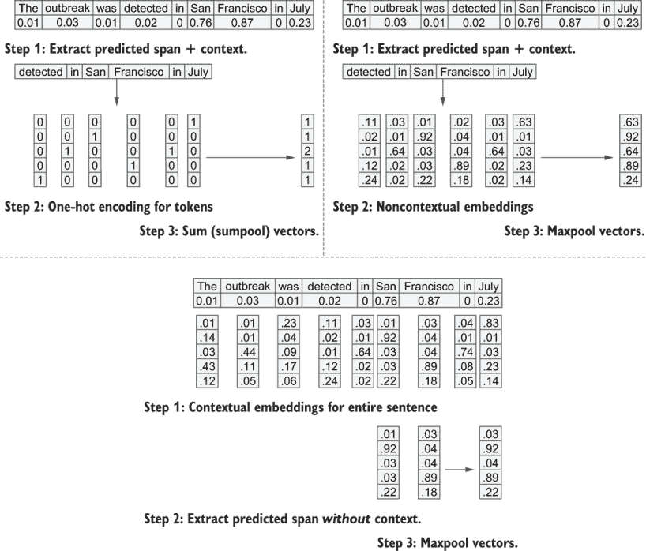

图 6.9 展示了三种用于主动学习的预测跨度编码方式：使用 one-hot 编码将每个标记编码为其自己的特征（左上角）；使用非上下文向量（嵌入）如 word2vec（右上角）；以及使用上下文嵌入如 BERT（底部）。你也可以尝试使用平均池化（avepool）代替或与最大池化（maxpool）一起使用。

到目前为止，你可以看到序列标注中的多样性采样与目标检测中的多样性采样有很多相似之处。你关心对象/跨度上下文，但对于基于模型的异常值，你不必过于担心，因为你的模型已经将大部分神经元集中在你最关心的图像/文本部分。

对于基于聚类采样和代表性采样，我们希望将模型集中在跨度本身上，而不是在任一侧的上下文中太远。如果你使用的是标记的上下文向量表示，你可能不需要额外的上下文；那个上下文已经包含在你的向量中。

前后文本应在有意义的距离和单词或句子边界（或如果你有这些信息，在短语边界）处裁剪。因为你的模型不是 100%准确的，你需要确保你捕捉到了完整的跨度：

+   在给定的阈值下裁剪。如果跨度是位置，则将选择扩展到预测位置之前或之后的单词，其中位置至少有一些低（例如，10%）的置信度。

+   设置一个宽阈值，可能是整个句子，并按每个单词或子单词序列是跨度的组成部分的概率来加权每个单词或子单词。

并非所有算法都允许你以有意义的方式对特征进行加权。如果你无法做到这一点，可以使用与目标检测相同的策略：从集成或 dropout 中生成多个跨度。然后尝试对每个预测进行代表性采样，根据它们与其他预测跨度的平均重叠程度进行加权。你可以直接使用每个跨度中的单词和子单词进行聚类和代表性采样，就像你在第五章中所做的那样。

如果你正在裁剪文本并使用模型的隐藏层进行基于聚类的采样、基于模型的异常值或代表性采样，请在裁剪文本之前获取这些隐藏层。完整的句子上下文对于获取跨度中每个单词的准确上下文表示是必要的。当你拥有句子中每个单词或子单词的神经元激活向量时，你可以将选择裁剪到跨度。

你需要解决的最后一个问题是如何组合每个单词或子单词的向量。如果你的所有跨度长度相同，你可以将它们连接起来。如果不相同，你需要将它们组合起来——这是一个称为*池化*的过程，用于神经网络向量。向量往往是稀疏的，所以最大池化可能是最好的（在每个向量索引中取每个单词或子单词的最大值），但你也可以尝试平均或其他池化方法来观察差异。

无论你是使用单词、子单词还是向量表示，你都可以像在第四章中学到的那样应用基于聚类的采样和代表性采样。你可以采样质心、异常值和随机聚类成员，你也可以从你的目标领域中采样最具代表性的项目。

### 6.3.4 序列标记的主动迁移学习

你可以将主动迁移学习应用于序列标记，就像你应用于文档级标签一样。你还可以应用 ATLAS，在单个主动学习周期内进行调整，因为你可以假设你最初采样的序列将被人类标注员后来纠正，即使你不知道那些标签是什么。

无论您使用哪种类型的神经网络架构进行序列标注，您都可以使用隐藏层（s）作为在验证数据上训练的二进制“正确”/“错误”模型的特征。您需要决定在验证数据中什么算作“正确”和“错误”。如果您对某些序列比对其他序列更关心，您可能只想将那些序列的错误视为“错误”，专注于您最关心的错误类型。您还需要决定是否按每标记错误或整个序列来计算错误。作为一个起点，使用与您在机器学习模型中计算准确率相同的方法来计算错误是有意义的，但您可能想尝试其他方法。

### 6.3.5 按置信度和标记进行分层采样

无论您使用什么方法预测跨度，都要将阈值设置得低一些。您不希望只找到与您数据中已经存在的跨度相似的跨度，这将导致偏差的持续。您可以使用与目标检测相同的按置信度分层的采样方法（第 6.1.5 节），例如，在 0%-10%置信度、10%-20%置信度等处采样相同数量的跨度。

此外，您还可以根据标记本身对样本进行分层。您可以将“旧金山”（或任何其他序列）的跨度样本限制在最多 5 个或 10 个实例，从而在总体上采样更多样化的标记。

### 6.3.6 为代表性采样创建与您的预测相似的训练数据样本

如果您正在为代表性采样裁剪未标记的文本，您应该对训练数据做同样的事情。如果您只使用训练数据中的完美跨度标注，但使用未标记数据中的不完美预测，那么“代表性”样本最终可能是不同裁剪策略的结果，而不是实际的跨度差异。

第 6.1.6 节介绍了一些裁剪训练数据和未标记数据以减少偏差的策略。这些策略也适用于跨度，因此如果您正在对跨度应用代表性采样，请查看这些方法。

与目标检测类似，您应该考虑在未裁剪的文本上使用一些采样方法。您可能在这里做更多的事情，因为跨度的上下文通常是上下文中相关的语言片段，这些片段被优化以编码信息；而目标检测的背景更有可能是世界中的随机垃圾。

一些简单的代表性采样方法可能很有效，您可能不需要构建模型。您甚至可以选择只关注那些尚未出现在您的训练数据中的预测跨度。

### 6.3.7 完整序列标注

对于 NLP 中的一些任务，您希望对文本中的每个项目进行标注。例如，词性标注（POS）标记，如表 6.3 所示。

表 6.3 全序列解析示例，显示名词、动词、副词（Adv）、专有名词（PRP）等 POS 标签（标签）

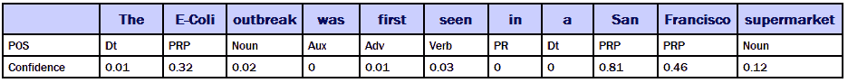

你可以将这个任务视为与文本内部的序列标记相同，但它在简化方面有所简化，因为你不必太担心裁剪文本或忽略“O”标签。按标签分层可能有助于表 6.3 中那样的案例，例如选取 100 个最不确定的名词、100 个最不确定的动词、100 个最不确定的副词等等。你可以使用这种抽样方法结合宏 F 分数来评估模型精度。

### 6.3.8 序列标记中文档级别多样性的抽样

与任何其他方法一样，你应该始终随机抽样文本进行审查。这种做法提供了你的评估数据，并为你提供了一个评估主动学习成功与否的基准。如果你在全文级别应用聚类，并发现存在大量或没有现有训练项的整个集群，那么你有很好的证据表明，你应该对这些集群中的某些项目进行人工审查，因为你可能遗漏了一些东西。

在文档层面上，也可能存在现实世界的多样性考虑：文本的类型、创建者的流畅性、语言（们）等等。对于这些情况，分层抽样在文档层面上可能比在序列层面上更有效。

## 6.4 将主动学习应用于语言生成

对于某些自然语言处理任务，机器学习算法正在生成类似于自然语言的序列。最常见的用例是文本生成，这是本节中的示例用例。大多数手语和口语语言生成都是从文本生成开始的，然后作为单独的任务生成符号或语音。机器学习模型通常是通用的序列生成架构，可以应用于其他类型的序列，如基因和音乐，但这些比文本更不常见。

即使如此，也只有在迁移学习最近取得进展的基础上，全文生成系统才达到了足够准确的水平，使我们能够开始在现实世界应用中开始使用它们。

最明显的例外是机器翻译，这在学术界和工业界已经流行了一段时间。机器翻译是一个定义明确的问题，它从一个语言中取一个句子，并产生一个新的语言的句子。从历史上看，机器翻译有很多现有的训练数据可以借鉴，这些数据是以书籍、文章和网页的形式存在的，它们在语言之间被人工翻译。

问答，即对一个问题的回答给出一个完整的句子，作为文本生成的例子，越来越受欢迎。另一个例子是对话系统，如聊天机器人，根据交互产生句子。摘要又是另一个例子，从更长的文本中产生更少的句子。然而，并非所有这些用例都必然使用全文生成。许多问答系统、聊天机器人和摘要算法在从输入中提取重要序列后，使用模板输出创建看似真实的通信。在这些情况下，它们使用文档级标签和序列标签，因此，您已经学过的用于文档标签和序列标签的主动学习策略将足够。

### 6.4.1 计算语言生成系统的准确率

语言生成的一个复杂因素是很少有一个正确的答案。这种情况通常通过在评估数据中包含多个正确答案，并允许最佳匹配作为使用的分数来解决。在翻译任务中，评估数据通常包含几个正确的翻译，准确率是通过将翻译与其中任何一个的最佳匹配来计算的。

在过去几年中，神经机器翻译的主要进步是全句子到句子的生成；机器学习接受两种语言中相同句子的示例，然后训练一个可以直接从一句话翻译到另一句话的模型。这个功能非常强大。以前，机器翻译系统需要多个步骤来解析不同语言之间的输入和输出，并对齐两个句子。每个步骤都使用自己的机器学习系统，并且这些步骤通常与元机器学习系统一起组合起来。新的神经机器翻译系统只需要平行文本，并且可以处理整个流程，它们仅使用大约 1%的早期拼凑系统的代码，并且更加准确。唯一的缺点是，与它们的非神经前辈相比，神经机器翻译系统现在更难以解释，因此更难在模型中识别混淆。

### 6.4.2 语言生成的不确定性采样

对于不确定性采样，你可以查看多个预测之间的变化，就像你在序列标注和计算机视觉任务中所做的那样，但这个领域的研究相对较少。如果你正在构建用于文本生成的模型，你很可能使用的是生成多个候选算法。可能可以通过查看这些候选之间的变化来测量不确定性。但是，神经机器翻译模型通常通过使用称为 beam search 的方法生成少量候选（大约 5 个），这不足以准确测量变化。最近的研究表明，扩大搜索范围可能会降低整体模型精度，这显然是你想要避免的。²

你可以尝试使用集成模型或从单个模型中去除一些神经元来模拟不确定性。在机器翻译中，测量集成模型之间的一致性水平是确定不确定性的长期实践，但这些模型训练起来成本高昂（通常需要几天或几周），因此仅仅为了采样不确定性而训练多个模型可能会非常昂贵。

在句子生成过程中使用 dropout 可以帮助通过从单个模型中获得多个句子来生成不确定性分数。我在撰写本书期间发表的一篇论文中首次尝试了这种方法。³最初，我打算将这项研究包括在内，这项研究专注于语言模型中的偏差检测，并将其作为本书最后一章的例子。然而，鉴于该内容已在论文中，以及本书中的灾害响应示例在撰写期间因 COVID-19 大流行而变得更加相关，因此我将第十二章中的示例任务替换为跟踪潜在食源性疾病爆发的任务。

### 6.4.3 语言生成的多样性采样

对于语言生成，多样性采样比不确定性采样更直接。如果你的输入是文本，你可以像在第四章中为文档级标注实现的那样实现多样性采样。你可以使用聚类来确保你有一组多样化的输入，代表性采样来适应新领域，以及基于模型的异常值来采样当前模型感到困惑的内容。你还可以根据任何现实世界的人口统计特征对样本进行分层。

多样性采样通常一直是机器翻译的主要关注点。大多数机器翻译系统都是通用型的，因此训练数据需要覆盖你语言对中的尽可能多的单词，每个单词在尽可能多的上下文中出现，特别是如果该单词根据上下文有多个翻译的话。

对于特定领域的机器翻译系统，通常使用代表性抽样来确保任何对领域重要的新单词或短语都有翻译。例如，当您将机器翻译系统适应新的技术领域时，增加该领域的术语样本是一个很好的策略，因为这些术语对于正确性至关重要，并且不太可能被更通用的机器翻译系统所知晓。

对于文本生成的多样性抽样，最令人兴奋的应用之一是为其他任务创建新的数据。一种长期存在的方法是*回译*。如果您有一段被标记为负面情绪的英文文本，您可以使用机器翻译将该句子翻译成多种其他语言，然后再将其翻译回英文。文本本身可能会改变，但负面情绪的标签可能仍然正确。这种训练数据生成的方法，称为*数据增强*，包括一些关于人机交互机器学习方面的最新进展，我们将在第九章中介绍。

### 6.4.4 语言生成的主动迁移学习

您可以将主动迁移学习应用于语言生成，方式与其他本章中的用例类似。您还可以应用 ATLAS，在单个主动学习周期内进行调整，因为您可以假设您最初采样的序列将被人类标注员后来纠正，即使您不知道那些标签是什么。

您需要仔细定义在验证数据中什么算作“正确”或“错误”的预测。通常，这项任务涉及设置一个准确性阈值，超过该阈值，句子就被认为是正确的或错误的。如果您可以按每个标记计算准确性，您可以选择将所有标记的准确性汇总以创建一个数值准确性值。您可以选择预测一个连续值而不是二元的“正确”/“错误”，就像在第 6.1.1 节中对象检测的 IoU 示例中那样。

## 6.5 将主动学习应用于其他机器学习任务

第 3、4、5 章中的主动学习原则可以应用于几乎任何机器学习任务。本节从高层次上概述了更多内容。本节不会深入到您在计算机视觉和 NLP 示例中学到的实现细节水平，但它将让您了解相同的原理如何应用于不同的数据类型。

*对于某些用例，根本无法收集新的未标记数据，您将需要找到其他方法来衡量您的准确性。* 有关此类方法之一的更多信息，请参阅以下侧边栏：合成控制。

合成控制：在没有评估数据的情况下评估您的模型

*埃莱娜·格罗瓦尔博士的专家轶事*

如果你在部署一个无法进行 A/B 测试的应用程序时，如何衡量你的模型的成功呢？合成控制方法是在这种情况下你可以使用的一种技术：你找到与你在部署模型的地方在特征上最接近的现有数据，并使用这些数据作为你的对照组。

我第一次了解到合成控制是在研究教育政策分析时。当一所学校尝试一些新方法来改善学生的学习环境时，不能期望只有一半的学生生活得到改善，以便另一半可以作为一个统计对照组。相反，教育研究人员可能会创建一个与学生在人口统计和表现方面最相似的学校的合成控制组。我采取了这种策略，当我领导 Airbnb 的数据科学团队时，我们应用了这种方法。当 Airbnb 在新的城市/市场推出产品或政策变化，并且无法进行实验时，我们会创建一个最相似的城市/市场的合成控制组。然后我们可以衡量我们的模型与合成控制组在参与度、收入、用户评分和搜索相关性等指标上的影响。合成控制使我们能够采取数据驱动的方法来衡量我们模型的影响，即使我们没有评估数据。

*Elena Grewal 是 Data 2 the People 的创始人兼首席执行官，这是一家利用数据科学支持政治候选人的咨询公司。Elena 之前领导了 Airbnb 的数据科学团队，并在斯坦福大学获得了教育学博士学位*。

### 6.5.1 信息检索的主动学习

*信息检索*是一组算法，驱动着搜索引擎和推荐系统。可以使用多个指标来计算返回多个结果的查询检索系统的准确性。今天最常用的这些指标之一是折现累积增益（DCG），其中 reli 是排名位置 p 处结果的分级相关性：

`log()`函数用于降低低值项的权重。也许你希望第一个搜索结果是最准确的；你对第二个搜索结果关心得稍微少一些；对第三个搜索结果关心得更少一些；以此类推。最初引入对数时，这种使用是一种相当随意的加权，但一些相对较新的理论表明，它具有数学上的有效性。⁴

现实世界的搜索系统是当今人机交互机器学习中最复杂的用例之一。想想在线商店的一个简单搜索。商店正在使用一种机器学习形式来检索搜索结果。它使用第二种机器学习形式来识别你的搜索字符串中的关键词和实体。它使用第三种机器学习形式从结果中的每个产品中提取相关的摘要文本。产品被分类为产品类型（电子产品、书籍等），以帮助第四种机器学习形式的搜索相关性。商店还可能使用第五种机器学习形式来决定理想的展示图像（纯背景或情境中）。许多现代搜索引擎也试图最大化多样性，返回不同类型的产品，而不是同一产品的 10 个版本。因此，可能有六个或更多不同的机器学习系统对你的搜索结果做出贡献，甚至在任何模型尝试为你量身定制结果之前。每个机器学习系统都需要自己的训练数据。其中一些数据可以来自人们的点击，但大部分来自离线标注者提供的反馈。

你可能没有意识到你在网上购物时正在使用最前沿的机器学习，但幕后有很多事情在进行。事实上，这个用例是为什么最知名的众包平台，亚马逊的 Mechanical Turk，被发明出来的原因：为了清理在线商店中产品的目录信息。

信息检索也倾向于使用比其他机器学习应用更多的现实世界准确性指标。尽管 DCG 在离线评估搜索相关性方面很受欢迎，但系统使用者的结果通常优化为面向商业的指标：一个人购买的商品数量，从搜索到购买之间的点击/秒数，客户未来六个月的客户价值等。因为这些指标是关于模型的使用，所以它们有时被称为*在线指标*，与 F-score 和 IoU 不同，后者是离线指标。这些指标与 F-score 和 IoU 不同，并且更加以人为中心，因此其他用例可以从信息检索社区中学到很多。

### 6.5.2 视频的主动学习

大多数针对静态图像的解决方案也适用于视频中的目标检测和/或语义分割。关注视频中最关心的区域，并使用它们作为样本。如果你的模型只关注你关心的对象或标签，你可以实现不确定性采样和基于模型的异常值，而不必 necessarily 裁剪或遮罩你的视频到你所关心的对象。如果你正在应用多样性采样，你几乎肯定想要首先裁剪或遮罩到那些对象。

视频和静态图像之间最大的区别是，你有很多来自同一视频的几乎相同的图像帧。最明显的解决方案就是最好的解决方案：如果你有多个来自你的模型认为相同的对象的帧，就采样不确定性最高的帧。在新的对象上重新训练的迭代过程可能会在之后给你一些或所有其他高置信度的帧。

多样性采样应该已经减少了在不同帧中选择相同对象次数，因为对象在帧之间看起来是相同的。如果对象改变了形态，你可能想以不同的形态采样它，所以这种情况是可行的。一个例子是手语。你并不是在追踪一个对象，而是在尝试解释一条信息流，所以你的主动学习策略可能看起来更像文本和语音，而不是对象检测。

注意，如果你在视频对象检测中不使用多样性采样，你可能会发现你最不确定的样本是连续帧中的相同对象。我所见过的多数公司都会每隔*N*帧采样一次，或者按视频采样精确数量的帧，通常是第一帧、最后一帧和一些中间帧。这种分层采样的方法并没有什么问题，但通过聚类和自适应代表性采样来增加多样性通常会得到更丰富的样本。你可能还需要对某些视频进行过采样，以获取更多包含某些罕见标签的帧，从而提高现实世界的多样性。如果你每部视频都取每一帧，那么你会有很多单独的图像，因此你也可以先对整个图像进行大规模聚类，并使用视频总数作为指导：

+   如果你拥有的聚类数量少于视频总数，可以将相似的视频合并成一个聚类，以实现有针对性的多样性。

+   如果你拥有的聚类数量多于视频总数，最终你应该有一些视频被分割成多个聚类，理想情况下是内容更丰富的视频。

这种方法为你提供了很大的空间，可以将本书中涵盖的主动学习方法结合起来，以尽可能快地标注视频。

### 6.5.3 语音的主动学习

就像文本或手语一样，语音可以是一个标注任务，一个序列任务，或者一个语言生成任务。你对待每个用例的方式与对待文本或图像的方式相同。

如果你是在整个语音行为（如果你正在标注对智能设备或类似对象发出的命令，称为*意图*）级别进行语音标注，那么你的模型已经专注于你关心的现象，就像对象检测和序列标注一样。因此，不确定性采样和基于模型的异常值检测应该可以在你的语音数据上工作，而无需裁剪。

如果你正在将语音转录成文本，或执行一些查看整个录音错误的任务，这个过程更类似于文本生成，其中你希望关注多样性以采样尽可能多的语音行为。在世界上几乎每一种语言中，书写系统都比口语更标准化。因此，当你试图捕捉每一个可能的口音和语言变化时，与处理文本相比，多样性变得更加重要。

在数据收集技术的重要性方面，语音介于文本和图像之间。麦克风的质量、环境噪声、录音设备、文件格式和压缩技术都可能产生模型可能错误学习而不是实际信息的伪影。

在这里讨论的所有数据类型中，语音在感知结构和实际物理结构之间的差异最大。例如，你可能会感觉到单词之间的间隙，但这种感知是一种错觉，因为真实的语音几乎总是将单词连在一起。几乎每个声音都会在即时语境中发生变化。英语的复数形式是 *s* 或 *z*，这取决于前面的音素（*cats* 和 *dogz*），但你可能认为复数后缀只有一个声音。当你采样语音数据时，请注意不要仅仅依赖于该语音的文本转录。

## 6.6 选择合适数量的项目进行人工审查

对于高级主动学习技术，你已经学到的原则同样适用。你可以在主动学习迭代中使一些主动学习策略，如代表性采样，自适应，但大多数技术组合在用新标注的数据重新训练模型时仍然能产生最大的效益。

你可能需要从一定数量的聚类或分层中抽取一定数量的样本，以反映现实世界的受众。你每次迭代的最大样本数量将根据数据类型而变化。你可能每小时可以标注 1,000 条简短文本消息的位置，但在同一时间段内可能只能完成 1 张图像的完整语义分割。因此，你的决策中一个重要因素将是你的数据类型以及你正在部署的标注策略——这一点我们将在第七章至第十二章中讨论。

### 6.6.1 对完全或部分标注数据的主动标注

如果你的机器学习模型可以从部分标注的数据中学习，你将使你的系统变得更加高效。继续我们在这本书中一直使用的例子，想象你正在为城市街道实现一个目标检测模型。你的模型可能足够准确以识别汽车和行人，但可能不足以识别自行车和动物。

你可能拥有数千张自行车和动物的图像，但每张图像平均也有几十辆车和行人。理想情况下，你希望只标注那些图像中的自行车和动物，并且不超过 10 倍的资源来确保所有车和行人也被标注在同一图像中。然而，许多机器学习架构不允许你部分标注数据；它们需要每个对象都被标注，否则，那些对象将错误地计入背景。

你可能会选择那些最大化混淆和多样性的 100 辆自行车和动物进行采样，但随后会花费大部分资源标注它们周围的 1,000 辆车和行人，而得到的额外收益相对较少。没有捷径可走：如果你只采样没有很多车或行人的图像，你就是在使数据偏向某些不具代表性的环境，这些环境不能代表你的整个数据集。如果你遇到需要为每张图像或文档进行完整标注的系统，你想要格外小心，确保每次都采样价值最高的项目。

越来越容易结合不同的模型或拥有异构的训练数据。你可能能够为行人和车辆训练单独的模型，然后通过迁移学习将它们结合起来。

### 6.6.2 将机器学习与标注相结合

在设计你的标注和模型策略时，你应该考虑这些选项，因为你可能会发现，一个略微不精确的机器学习架构，当你不受限于完全或不标注图像时，最终会产生更精确的模型。

解决在大图像/文档中仅需要标注少数对象/跨度的最佳方法是将机器学习融入标注过程。进行语义分割时，标注整个图像可能需要一个小时，但接受/拒绝每项标注可能只需 30 秒。当结合预测和人工标注时，危险在于人们可能会被引导去信任一个不正确的预测，从而延续现有的偏差。这种情况是一个复杂的人机交互问题。第九章、第十章和第十一章介绍了以最有效的方式结合模型预测和人工标注的问题。

## 6.7 进一步阅读

关于计算序列标注和序列生成的置信度，请参阅 Jan Niehues 和 Ngoc-Quan Pham 的“在序列到序列模型中建模置信度”（[`mng.bz/9Mqo`](http://mng.bz/9Mqo)）。作者们研究了语音识别，并通过在源文本标记上计算置信度（不确定性）而不是仅预测标记，以有趣的方式扩展了机器翻译问题。

有关机器翻译活动学习技术的概述，请参阅“神经机器翻译活动学习技术的实证评估”，由 Xiangkai Zeng、Sarthak Garg、Rajen Chatterjee、Udhyakumar Nallasamy 和 Matthias Paulik 所著 ([`mng.bz/j4Np`](http://mng.bz/j4Np))。本文中的许多技术可以应用于其他序列生成任务。

## 摘要

+   在许多用例中，您希望在图像或文档中识别或提取信息，而不是对整个图像或文档进行标记。相同的活动学习策略可以应用于这些用例。了解正确的策略有助于您了解可以应用活动学习的问题类型以及如何为您的用例构建正确的策略。

+   您需要裁剪或遮罩您的图像和文档，以充分利用某些活动学习策略。正确的裁剪或遮罩策略会产生更好的样本供人工审查，了解何时需要裁剪或遮罩您的项目有助于您选择适合您用例的正确方法。

+   活动学习可以应用于许多超出计算机视觉和自然语言处理的任务，包括信息检索、语音识别和视频。了解活动学习应用领域的更广泛景观将帮助您适应任何机器学习问题。

+   在高级活动学习的每一轮中，为人工审查选择的项目数量非常具体，取决于您的数据。了解适合您数据的正确策略对于部署最有效的人机交互机器学习系统对于您的问题至关重要。

* * *

^（1）“我应该信任你的预测吗？”：解释任何分类器的预测，由 Marco Tulio Ribeiro、Sameer Singh 和 Carlos Guestrin 所著 ([`www.kdd.org/kdd2016/papers/files/rfp0573-ribeiroA.pdf`](https://www.kdd.org/kdd2016/papers/files/rfp0573-ribeiroA.pdf)。

^（2）“分析神经机器翻译中的不确定性”，由 Myle Ott、Michael Auli、David Grangier 和 Marc’Aurelio Ranzato 所著 ([`arxiv.org/abs/1803.00047`](https://arxiv.org/abs/1803.00047)。

^（3）“使用部分合成数据生成检测独立代词偏差”，由 Robert (Munro) Monarch 和 Alex (Carmen) Morrison 所著 ([`www.aclweb.org/anthology/2020.emnlp-main.157.pdf`](https://www.aclweb.org/anthology/2020.emnlp-main.157.pdf))。

^（4）“NDCG 类型排名度量理论分析”，由 Yining Wang、Liwei Wang、Yuanzhi Li、Di He、Wei Chen 和 Tie-Yan Liu 所著 ([`arxiv.org/abs/1304.6480`](https://arxiv.org/abs/1304.6480)。
