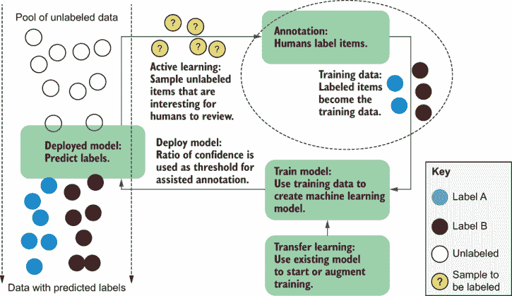
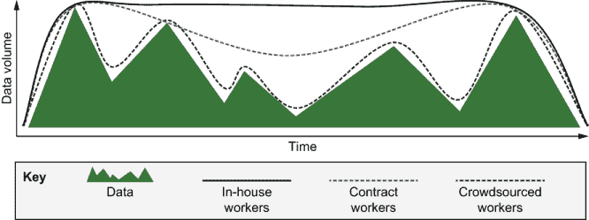
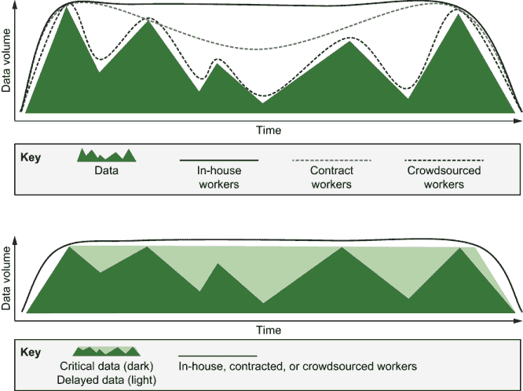
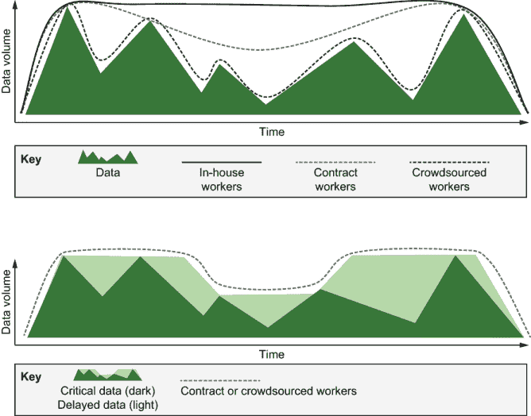
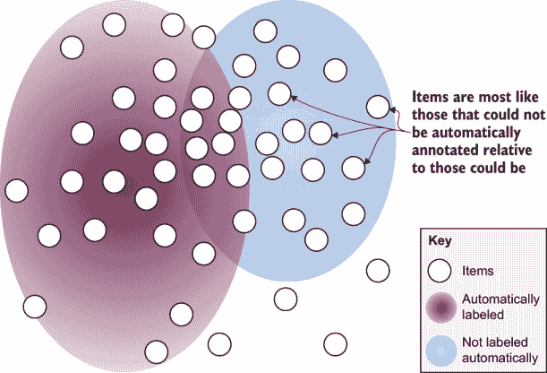
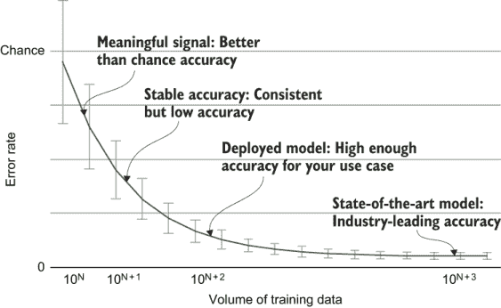

# 7 与标注你的数据的人员合作

本章涵盖了

+   理解内部、合同和按任务付费的标注劳动力

+   使用三个关键原则激励不同的劳动力

+   在非货币性补偿情况下评估劳动力

+   评估你的标注量需求

+   理解标注员为特定任务所需的培训和/或专业知识

在本书的前两章中，你学习了如何为人工审查选择合适的数据。本部分章节涵盖了如何优化这种人工交互，从如何找到和管理能够提供人工反馈的正确人员开始。机器学习模型通常需要成千上万（有时甚至数百万）个人类反馈的实例来获取必要的训练数据以确保准确性。

你需要的劳动力类型将取决于你的任务、规模和紧迫性。如果你有一个简单的任务，比如确定社交媒体帖子是正面还是负面情绪，并且你需要尽快获得数百万个人类标注，那么理想的工作力不需要专业技能。但理想情况下，该工作力可以并行扩展到数千人，并且每个人可以短时间被雇佣。

然而，如果你有一个复杂任务，比如在密集的金融术语中识别金融文件中的欺诈证据，你可能希望找到在金融领域有经验或能够被训练以理解该领域的标注员。如果文件使用的是你不懂的语言，找到和评估能够标注数据的正确人员将会更加复杂。

通常，你希望有一个结合不同类型工作力的数据标注策略。想象一下，你在一个大型金融公司工作，你正在构建一个系统来监控可能表明公司价值变化的金融新闻文章。这个系统将成为一个广泛使用的应用程序的一部分，人们使用这个应用程序来做出关于在股市上市的公司买卖股票的决定。你需要对数据进行两种类型的标注：每篇文章是关于哪个公司以及每篇文章中的信息是否暗示了股价的变化。

对于第一种标签——公司识别——你可以轻松雇佣非专家标注者。你不需要理解财经新闻来识别公司名称。然而，理解哪些因素可以改变股价是很复杂的。在某些情况下，如果内容明确（例如，“预期股价将暴跌”），对语言的普通流畅度就足够了。在其他情况下，上下文可能并不那么明显。例如，“Acme 公司符合调整后的第三季度预期”这句话，对于一个公司来说，符合调整后的季度预期是积极的还是消极的？你需要理解调整的上下文。对于包含财务缩写的复杂语言，没有接受过金融领域培训的人是无法理解的。

因此，你可能决定你需要三种类型的工作团队：

+   *众包工作者*，当新闻文章发布时，他们可以最快地扩展和缩减规模，以识别正在讨论哪些公司

+   *合同工*，他们可以学习财务术语来理解股价的变化

+   *内部专家*，他们可以标注最困难的边缘案例，裁决冲突的标签，并为其他工作者提供指导

无论合适的人选是谁，当他们得到公平的报酬、对自己的工作有安全感，并且对正在完成的工作有透明度时，他们都会做得最好。换句话说，管理工作团队最道德的方式也是对你组织最有利的。本章涵盖了如何选择和管理任何标注任务合适的团队。

## 7.1 标注简介

*标注* 是为你的模型创建训练数据的过程。对于几乎所有预期能够自主运行的机器学习应用，你需要比一个人实际标注的数据标签更多，因此你需要选择合适的工作团队来标注你的数据，以及最佳的管理方式。图 7.1 中的人类在循环图显示了标注过程，它从未标记数据开始，输出标记的训练数据。

图 7.1 *数据标注* 是创建未标记数据的过程，无论是通过标记未标记数据还是审查从模型生成的标签。

在本章和随后的章节中，我们将深入探讨图 7.1 中的标注组件，展示运行标注项目所需的子过程和算法。一条建议：从你的算法策略开始制定你的数据策略。完善标注策略和指南所需的时间与创建算法架构和调整超参数所需的时间一样长，你的算法和架构的选择应该基于你预期的标注类型和数量。

### 7.1.1 良好数据标注的三个原则

你对标注你数据的人表示的尊重越多，你的数据就越好。无论这个人是在职的主题专家（SME）还是只为你标注几分钟的外包工作者，这些基本原则都将确保你获得最佳可能的标注：

+   *工资*—公平支付。

+   *安全*—定期支付。

+   *所有权*—提供透明度。

三种主要类型的工作队伍总结在图 7.2 中，显示了随时间推移所需工作量的不均衡。众包工作者最容易被扩大或缩小规模，但他们的工作质量通常最低。内部工作者最难扩大规模，但他们通常是中小企业，提供最高质量的数据。外包工作者介于两者之间：他们拥有众包工作者的一些灵活性，并且可以被训练到高水平的专长。这些差异应该影响你对工作队伍（们）的选择。我们将在接下来的章节中更详细地介绍每种工作队伍，并扩展每个工作队伍的薪酬、安全和所有权原则。

图 7.2 概述了你可以用来标注数据的三种主要类型的工作队伍：内部工作者、合同工作者和众包工作者，其中主要的权衡是灵活性对专长。

监督机器学习工作涉及人员管理

如果你使用人工标注的数据，你就在进行人员管理。大多数现实世界的机器学习应用都使用为该目的而标注的数据进行监督学习。你无法避免对你为你标注数据的人所承担的责任：如果他们的工作被用于你创建的模型中，你对他们就负有照顾的责任。

许多数据科学家认为他们的工作就像纯粹的研究。公司中的许多高级数据科学家不必管理其他研究人员，正是因为人员管理被认为会妨碍在研究中进行“真正的”工作。不幸的是，对于那些人来说，即使你的组织有一个独立的数据标注团队或已外包标注，你也没有办法外包你对标注数据的人的责任。

本章可能看起来更像管理建议而不是技术建议，但这种关注是有意为之的，因为知道如何管理分布式的团队是任何数据科学家的重要技能。正如本章所述，良好的管理对于确保为为你的模型做出贡献的每个人提供公平的工作条件也是必要的。

你的职责包括与注释你数据的那些人进行交流。我怀疑你遇到过只在项目开始时给员工提供指导而不邀请反馈的好经理。当存在权力不平衡时，获取反馈可能会很复杂，因此你需要深思熟虑并充满同理心地实施沟通渠道。

### 7.1.2 注释数据和审查模型预测

在本书中，术语“标注”被广泛使用。在某些情况下，它意味着标注原始数据；在其他情况下，它意味着由机器学习模型辅助或与之交互的人类。

我们将在第十一章中回到用户界面和质量控制。现在，请理解，当您计算标注所需的工作量时，您需要考虑您可能用于标注的数据的不同呈现方式以及所需的不同工作量。

### 7.1.3 机器学习辅助的人类标注

对于许多任务来说，目标是协助人类过程。实际上，许多模型可以根据应用进行自动化或协助人类。例如，您可以训练一个碰撞检测算法来驱动一辆完全自主的车辆或提醒驾驶员。同样，您可以训练一个医学影像算法来进行诊断或告知医疗从业者的决策。

本章节适用于两种类型的应用。我们将在 7.5.1 节中介绍将最终用户作为标注者的概念。正如该节所述，即使您的应用程序在协助人类任务时免费获得许多标注，您可能仍然希望雇佣除最终用户之外的标注者。

对于机器学习辅助的人类，有一点与就业安全和透明度原则相关：明确您的目标是协助最终用户的工作，而不是训练他们的自动化替代品。但如果您知道您正在获得最终用户反馈以自动化特定任务，您必须对此事实保持透明，以便期望是现实的，并且您应该相应地补偿这些人。

## 7.2 内部专家

对于大多数机器学习项目来说，最大的劳动力是内部员工——与构建算法的人在同一组织中工作的人。尽管如此，与外包和众包工作者相比，质量控制和工作管理对于内部标注者的研究最不充分。大多数关于标注的学术论文都集中在外包和（特别是）按任务付费的众包工作者上。显然，如果模型构建者和标注者都在同一组织中，您将获得很多好处，因为他们能够直接沟通。

内部工作的优势在于领域专业知识和对敏感数据的保护。如果您从事分析财务报告或诊断医学图像等复杂问题，您的内部团队成员可能是世界上少数几个具备标注您所需数据技能的人之一。如果您的数据包含敏感信息，内部员工也为您提供了数据的最私密和安全保护。

对于某些用例，你可能因为监管原因而被迫将数据保留在内部。第十章中我们将涵盖的数据生成工具可以帮助你处理这些情况。即使你的合成数据不是 100%准确，也有很大可能性你的合成数据不会像你的真实数据那样敏感。因此，当你无法与外包工作人员分享实际数据时，你有机会雇佣外包劳动力来过滤或编辑合成数据，以达到你期望的准确度。

虽然内部员工通常比其他员工拥有更多的专业知识，但认为这意味着他们代表了将使用你应用程序的完整人群范围可能是错误的。请参阅以下侧边栏，了解更多关于最佳小型专家的信息。

家长是完美的小型专家

*阿亚娜·霍华德的专家轶事*

关于人的模型很少能准确反映数据中未代表的人群。许多人口统计偏差可能导致某些人群代表性不足，例如能力、年龄、种族和性别。通常还存在交叉偏差：如果人们在多个人口统计数据中代表性不足，有时这些数据的交叉点可能比各部分的总和还要重要。即使你确实有数据，也可能很难找到具有正确经验的人来正确标注它。

在为有特殊需求的孩子制造机器人时，我发现检测儿童情绪、检测来自代表性不足的种族的人的情绪以及检测自闭症谱系人群的情绪的数据不足。没有沉浸式经验的人往往在识别这些孩子的情绪方面表现不佳，这限制了能够提供表示孩子快乐或不开心的训练数据的人。甚至一些受过训练的儿科医生在处理能力、年龄和/或种族的交叉性时，在准确标注数据时也会遇到困难。幸运的是，我们发现孩子自己的父母是他们情绪的最佳评判者，因此我们为父母创建了快速接受或拒绝模型对孩子情绪预测的界面。这个界面使我们能够获取尽可能多的训练数据，同时最大限度地减少父母提供反馈所需的时间和专业技术。这些孩子的父母最终证明是调整我们的系统以满足他们孩子需求的最完美的小型专家。

*阿亚娜·霍华德是俄亥俄州立大学哥伦布分校工程学院院长。她曾是乔治亚理工学院互动计算学院的院长，也是 Zyrobotics 的联合创始人，该公司为有特殊需求的孩子制造治疗和教育产品。她曾在美国宇航局工作，并拥有南加州大学的博士学位*。

### 7.2.1 内部员工的薪酬

你可能不会设定你公司内标注员们的薪水，因此这个原则是免费的：他们已经同意了他们所获得的薪水。如果你确实设定了你内部标注员的薪水，确保他们得到与其他员工相同的尊重和公平待遇。

### 7.2.2 内部员工的安全保障

内部员工已经有一份工作（按定义），因此安全保障来自于他们能够保持这份工作，即在你有工作给他们的时候——也就是说，在你确保他们能够保持这份工作的时候。如果你的内部员工的雇佣和组织职位因为他们是临时工或合同工而提供较少的工作保障，可以使用一些外包员工的原则。例如，对于合同工，尽量使可用的工时量尽可能一致，并明确他们的雇佣将持续多长时间。关于工作流动性要透明。一个人能否成为正式员工或转移到其他角色？

### 7.2.3 内部员工的所有权

透明度通常是内部员工最重要的原则。如果员工无论是否创建标注都能得到报酬，你需要确保这项任务本身是有趣的。

使任何重复性任务变得有趣的最佳方式是明确这项工作的重要性。如果你的内部标注员能够了解他们的工作是如何改善公司的，这些信息可以成为很好的动力。事实上，标注可以是向组织贡献最透明的方式之一。如果你有标注数量的每日目标或可以分享训练模型中的准确性如何提高，很容易将标注工作与公司目标联系起来。标注员更有可能通过提高准确性做出贡献，而不是实验新算法的科学家，因此你应该与标注员分享这一事实。

除了看到标注如何帮助公司从数量上提高日常动力之外，内部标注员应该清楚他们的工作是如何对公司整体目标做出贡献的。一个花费 400 小时标注支持新应用的数据的标注员应该感受到与花费 400 小时编码它的工程师一样的所有权。

我看到公司经常错误地理解这个概念，让他们的内部标注团队对他们的*工作*对日常或长期目标的影响一无所知。这种失败是对从事工作的人的不尊重，导致动机低下、高流失率和低质量的标注，这对任何人都没有帮助。

此外，你还有责任确保工作对内部员工持续可用。你的数据可能因你无法控制的原因而突发涌入。例如，如果你正在对新闻文章进行分类，那么在特定时区新闻文章发布的时间段，你将拥有更多数据。这种情况适合采用众包标注劳动力，但你可能决定延迟一些数据标注。图 7.3 展示了一个示例，其中最关键的数据在到达时立即标注，其他数据则稍后标注。

图 7.3 为内部员工优化工作流程。当数据因你无法控制的原因而突发涌入时，可以进行平滑处理，首先标注最关键的数据，然后逐步标注其他数据。底部图表显示了标注工作量的平滑情况。

数据标注需要越一致，管理标注过程就越容易。当试图平滑工作量时，你可以随机化哪些数据先来，但你还有其他可以实验的选项。例如，你可以首先将所有数据聚类，并确保所有质心首先被标注，以确保多样性。或者，你可以选择应用代表性抽样，首先标注看起来最新颖的项目。所有这些方法都是平滑所需标注量度的良好方式，同时尽可能快地从数据中获得最大收益。

### 7.2.4 小贴士：始终运行内部标注会话

无论你使用何种工作组合，我都建议尽可能在最具多样性的内部员工群体中运行标注会话。这种方法有以下几个好处：

+   由内部人员创建的高质量标注可以成为你的（人工）训练示例，并成为你质量控制数据的一部分（参见第八章）。

+   你的内部标注会话有助于早期发现边缘情况，例如那些由于当前标注指南未涵盖而难以标注的数据项。理解这些边缘情况将帮助你完善任务定义和向标注你数据的人员的指导。

+   这个过程是一个很好的团队建设练习。如果你将组织中的每个部门的员工召集到一个房间里（如果他们需要长时间工作，可以提供食物和饮料），这个过程会非常有趣，并允许公司中的每个人都为机器学习应用做出贡献。让每个人都至少标注一个小时的数据，同时讨论他们遇到的边缘情况。在我工作过的许多公司中，“标注小时”是许多人一周中最喜欢的时光。

这个练习也可以是建立一个内部专家团队来为你的更大标注团队创建和更新指南的好方法。特别是如果你有随时间变化的数据，你将希望定期更新你的标注指南并提供当前的示例标注。

你也可以使用一些外包标注者作为专家，偶尔，一位出色的众包工作者可能能够帮助这个过程。许多专注于标注的组织对其创建指南和培训材料的最佳方式有内部专业知识。相信他们的专业知识，并考虑邀请外包组织的人士参加你的内部标注会议。

图 7.4 展示了将专家标注者整合的一些例子，从完全忽略专家标注者的模型（仅推荐用于试点）到更复杂的流程，这些流程优化了专家在数据随时间变化时如何帮助确保质量控制。

如果你在一个试点中实施图 7.4 中的第一种方法，排除那些令人困惑的项目，而不是将它们与可能不正确的标签一起包含。如果你的 5%的项目无法被标注，排除这 5%的项目从你的训练和评估数据中，并假设你有 5%的额外错误。

如果你将由于标签错误而产生的噪声数据包含在训练和评估数据中，将很难衡量你的准确性。不要相信包含难以标注项目的噪声训练数据是可以接受的。许多算法可以在噪声训练数据上保持准确性，但它们假设可预测的噪声（随机、均匀、高斯等）。如果项目难以标注，这些项目可能不是随机分布的。

图 7.4 中的第二个例子在工业界最为常见，对于难以处理的例子，会将其转交给专家进行人工审核。如果数据在时间上相对一致，这种方法是可行的。

如果数据变化迅速，图 7.4 中的第三种方法更为推荐。在第三种方法中，专家标注者在主要标注团队之前查看新数据，使用主动学习策略尽可能多地揭示边缘案例，以确保指南不会落后于实际数据。如果你有定期到来的数据，这种方法允许你比让他们响应第二例中那样的临时难以处理的例子更可预测地安排内部工作人员。

图 7.4 内部标注的三个工作流程。顶部的工作流程仅推荐用于试点；它不使用内部标注员，并忽略了难以标注的项目。第二个例子在行业中最为常见：难以处理的例子被转交给专家进行人工审核。如果你的数据在时间上相对一致，这种方法效果很好。如果你的数据变化很快，建议使用第三种方法。在这种方法中，专家标注员在主要标注过程开始之前，通过多样性采样和不确定性采样寻找潜在的新边缘情况；然后这些例子和更新后的指南被传递给主要的标注团队。这是唯一确保指南不会落后于实际数据的方法。专家标注员还随机标注了一些项目，以进行质量控制，我们将在第八章中讨论这一点。

你可以将第二种和第三种方法结合起来，尽可能提前应对新的用例，同时仍然允许难以处理的例子被转交给专家进行人工审核。你可能只需要在数据特别难以标注的情况下，或者在标注的早期迭代中这样做，在你发现所有主要边缘情况之前。

## 7.3 外包工人

外包工人是数据标注增长最快的劳动力。在过去五年中，我看到外包公司（有时称为业务流程外包商）的工作量增长速度超过了其他类型的标注劳动力。

外包本身并不是什么新鲜事。在技术行业中，一直都有外包公司，拥有大量可以承包不同类型任务的员工。最著名的例子是呼叫中心。当你给银行或公用事业公司打电话时，你很可能是联系到了一个外包公司，该公司受雇于你打电话的公司，而你正在与该公司雇佣的员工交谈。

越来越多的外包公司专注于机器学习。一些公司只专注于提供劳动力；而另一些公司则在其更广泛的提供中提供一些机器学习技术。大多数情况下，外包公司的员工位于生活成本相对较低的世界各地，这意味着工资也较低。成本经常被引用为外包的主要原因；外包比雇佣内部员工做工作更便宜。

可扩展性是使用外包工人的另一个原因。通常，调整外包工人的规模比调整内部工作团队的规模要容易得多。对于机器学习来说，这种灵活性在你不知道你的应用程序是否成功，直到你拥有大量训练数据之前非常有用。如果你与外包公司正确设定了期望，这种方法对每个人来说都更有效：你不必扩大期望工作更长时间的内勤工人的规模，外包公司可以为其员工规划任务转换，他们经常这样做，并且这应该纳入他们的薪酬方案中。

最后，并不是所有外包工人都应该被视为低技能。如果一个标注员已经从事自动驾驶车辆的标注工作多年，他们是一个高技能的个人。如果一个公司是自动驾驶车辆的新手，外包工人可以是一个宝贵的专业知识来源；他们从多年的经验中获得了关于应该标注什么以及对于模型来说什么重要的直觉。

如果你无法平滑内部工人的标注量需求，你可能会找到一个中间地带，你可以足够平滑地标注，以便使用外包工人，他们可以比内部工人更快地循环上下（但不如众包工人快）。图 7.5 展示了示例。

图 7.5 为外包工人平滑工作。如果你无法完全平滑数据量，你可能能够足够平滑以适应外包工人可以上下调整的规模。

### 7.3.1 外包工人的薪酬

外包工人的雇主应提供公平的薪酬，但你仍有责任核实这种补偿是否公平。你对任何为你工作的人都有照顾义务，即使他们是另一家公司提供的承包商。这种照顾义务源于一种权力动态，你处于最强大的位置。你不希望外包公司通过压低工人工资来以更低的价格赢得你的业务。特别是如果你使用的是一个你不熟悉的外包公司，你应该提出以下问题：

+   每位工人每小时/每天的报酬是多少，这种报酬与他们在当地公布的最低工资和最低生活成本相比如何？

+   工人在接受任务培训的时间是否会得到报酬，或者只有在他们进行标注时才会得到报酬？

+   工人在项目之间或在你项目工作量较少时是否得到报酬，或者只有在他们直接参与项目时才会得到报酬？

你可以深入探讨这些问题中的任何一个。例如，关于薪酬，你可以询问诸如医疗保健、退休和带薪休假等福利。

计算工人在工作地点的生活成本补偿是否公平，考虑到项目之间的任何减少或缺失的工资。请注意，您也是这个方程的一部分；如果您能为您的项目提供持续的工作流，那么当个别工人等待您的数据到来或在他们之间切换项目时，他们的空闲时间将会更少。

如果外包组织不能给出具体的答案，那么这很可能不是一个好的选择。最坏的情况是，该组织可能只是在其他外包公司或众包工人之上运营一个管理层，您不希望与您的注释员有太多的步骤距离，因为您不太可能获得高质量的注释。最坏的情况是，该组织可能正在掩盖它支付剥削性工资的事实。

注意补偿方面的文化和国家差异。大多数欧洲国家的工人享有良好的国家医疗保障，可能不会考虑雇主提供的医疗保障的重要性，例如，而美国的工人可能不会期待有产假福利。情况也可能相反：如果您在美国，您不需要坚持要求在拥有良好国家医疗保障选择的国家工作的工人也有雇主提供的医疗保障。

我的建议是，在提问时多问一些问题，如果您的提问显得文化上不敏感，事后道歉。与其因为害怕提问而让任何人的补偿不公平，不如冒犯那些得到公平报酬的人，并从那次经历中成长。

### 7.3.2 外包工人的安全

外包工人的工作保障来自他们的直接雇主。除了询问他们的薪酬外，您还应该询问工作保障和晋升机会。

许多外包公司在其组织中都有明确的晋升路径。注释员可以成为一线经理，然后是场地经理，等等。他们也可能有专业化的领域，例如被信任执行特定的困难注释任务和敏感数据，这些任务的报酬会更高。

如果您的工人在组织中没有晋升机会，考虑他们是否应该因为执行您的任务而得到更多的补偿，考虑到他们可能需要自费支付培训和教育以提升他们的职业生涯。如果有人作为专业注释员感到满意，不想进入管理层或专业角色，这也是完全可以接受的。如果这个人在一个积极的环境中工作，得到公平的报酬，并感到对所做工作的所有权，那么这是一份有尊严的工作。

### 7.3.3 外包工人的所有权

外包员工最有可能全职担任标注员。因此，透明度很重要，这样这些员工就知道他们正在为你的组织做出贡献。就像内部员工一样，如果外包员工了解他们标注数据的原因，他们将会更有动力。例如，如果他们正在标注城市公园的场景，他们应该知道用例是否专注于行人或植物。了解目标大大提高了数据的准确性，并让员工有了一种他们正在为重要任务做出贡献的感觉。

如果可能的话，让你的外包员工感觉到他们直接为你的公司做出了贡献。一些公司积极避免将他们的外包员工视为组织的一部分。从品牌的角度来看，这种做法可能是可以理解的（担心另一家公司的员工可能会对你的公司造成误解），但如果目标是隐藏业务流程外包的事实，那么可能就不公平了。

无论你的组织政策如何，全职作为承包商工作的人在给定的一天里所做的贡献与全职在公司内部工作的人一样多，他们应该有这样的感觉。在尽可能的范围内，让这些员工知道他们是如何为你的组织做出贡献的，但也让他们知道他们不能公开谈论这一点。通常有一个中间地带，你可以向外包员工公开他们所创造的价值，但明确指出他们只能私下讨论。你可能有一些不能公开谈论他们工作内容的内部人员。

外包员工对你的公司目标可能比内部员工有更少的直觉。你的公司可能是一家大型跨国公司或热门的社区初创公司，但并不能保证外包员工知道这个事实，所以不要假设太多。当外包员工了解他们完成工作的背景时，这是一个双赢的局面：他们会以更快的速度完成高质量的工作，获得更高的报酬，并对这个过程感觉更好。在你与他们一起工作时，尽量保持与标注员的沟通渠道。

### 7.3.4 小贴士：与你的外包员工交谈

如果你正在运行一个机器学习项目，你应该与负责日常标注的线管理人员直接沟通。这种沟通可以是电子邮件、论坛，或者（理想情况下）在线聊天。与标注员本人直接沟通可能会更加丰富，但根据规模和隐私问题，这种互动可能不被允许。

作为中间方案，你可能与一线经理保持开放渠道，并与标注者定期举行全体大会。如果你有定期会议，要明确告诉外包公司，这段时间是可以收费的时间，标注者应该得到报酬。在标注工作中，总会出现一些问题，比如你没有考虑到的边缘案例和你做出的没有在指南中明确说明的假设。此外，与标注者直接沟通他们为之人创建数据的人是尊重的。

我通常看到外包工作者与构建机器学习模型的人相隔四到五层。数据科学家可能会雇佣内部人员来管理数据；那位数据经理与外包公司的客户经理合作；那位客户经理与公司的标注领导合作；标注领导与一线经理合作；最后，一线经理与单个标注者合作。这是沟通任何指南或反馈的五个步骤！

记住，除了支付标注者的费用外，你实际上是在支付所有中间人的费用。在某些行业中，50%的开支用于这种管理开销。如果你被迫使用低效的管理结构，你的沟通不必遵循那条路径。与标注者或他们的直接管理者建立直接关系。

## 7.4 群众外包工作者

按任务付费的群众外包工作者是数据标注中最受关注的工作群体，但他们是人数最少的一群。我在拥有两个最大的群众外包标注工作市场的公司工作过，即便如此，我使用的还是外包工作者（他们得到了公平的小时工资），而不是群众外包工作者。

群众外包工作的在线市场通常允许你发布你的标注工作；然后人们可以选择以每项任务发布的单价来完成这项工作。如果提供奖金或按比例的小时工资，这些金额是每项任务价格的补充。工作者通常是匿名的，这种匿名性通常由平台在技术和条款条件上强制执行。

因为**群众外包**是一个通用术语，它还包括数据收集，标注也被称为**微任务**。由于工作是按数据项支付的，这个过程也被称为**按任务付费**，或者更普遍地，被认为是**零工经济**的一部分。在所有情况下，它都指的是工作最大的灵活性，但也最容易受到剥削。

使用群众外包工作者的最大优势是他们可以快速地扩大或缩小规模。如果你只需要几分钟的工作，但需要来自数千人，按任务付费的群众外包工作者是理想的。

在大多数公司中，任何大型、持续的机器学习项目依赖众包工作者的情况很少见，众包工作者更常用于快速实验以验证在新的任务上达到一定准确度是否可行。当需要快速完成标注且时间紧迫时，也会使用众包工作者，尽管一些外包公司提供 24/7 的工作团队，可以同意更短的完成时间。

由于学术研究更常关注不同用例的快速实验，而不是单一用例的持续准确性提升，因此众包工作者已成为许多学术部门的标注工作首选。这项工作的突出地位是为什么众包工作有时会被错误地视为工业界标注的普遍方法。参见第 7.4.3 节中的“不要将研究生经济学应用到你的数据标注策略”以了解更多关于学术界与众包之间关系的视角，以及它如何影响现实世界的机器学习。

在工作者一方，有合理的理由解释为什么一个人会选择成为众包工作者而不是为外包公司工作。最大的原因是可能没有外包公司能在他们的所在地雇佣他们。只要有互联网连接，你几乎可以从任何地方成为众包工作者。

对于可能面临歧视的人来说，众包工作可以成为一种平衡器。匿名性使得工作者基于种族、性别、犯罪记录、国籍、残疾或其他常限制人们就业的原因受到歧视的可能性大大降低。他们的工作将根据其固有的优点来评估。

有些人更喜欢众包工作，因为他们受限或更喜欢按任务付费的工作。也许他们由于其他承诺，如照顾家人或全职工作（这允许他们有时间进行额外的众包工作）而每次只能贡献几分钟。这个领域是确保公平最困难的一个领域。如果一个工作者需要 60 分钟来完成大多数人只需 15 分钟就能完成的任务，那么只支付他们 15 分钟的费用是不公平的；他们应该得到 60 分钟的费用。如果这笔费用超出了你的预算，那么在在线声誉系统中不要以任何负面方式反映他们，排除他们接受你未来任务的资格。

众包工作者是最容易被剥削的劳动力。预先预测某些任务需要多长时间是困难的，因此即使任务设置有良好的意图，按任务付费的补偿也可能不足以支付给某人。此外，有人很容易设置任务而不带好意图，要么错误地表示完成任务所需的时间，要么提供剥削性的工资。

我看到有人提出论点，认为对于有闲暇时间且没有其他收入来源的人来说，低薪工作（比如每小时 1 美元）总比没有好。但这种论点是不正确的。支付给某人低于他们生活所需的薪资在道德上是错误的。除此之外，它还加剧了同样的不平等。如果你有一个只能通过剥削性工资才能盈利的商业模式，你正在拖垮整个行业，而其他行业要保持竞争力，只能通过采取同样的做法。因此，你正在帮助创造一个只能通过持续剥削性工资模式来生存的行业，这对任何人都没有帮助。

### 7.4.1 集体外包工人的薪资

你应该始终公平地支付集体外包工人的薪资。所有主要的集体外包平台都会告诉你有人为你的任务工作了多长时间，但这个数字可能不准确，因为它依赖于浏览器来跟踪时间，并且可能不包括工人在开始工作之前研究任务所花费的时间。

我建议根据他们所在的世界位置和该地点的公平薪资发布数据，支付他们完成工作的公平时薪。每个集体外包市场都允许你通过奖金结构有效地支付时薪，即使不可能直接将时薪纳入支付流程。如果你无法计算出某人花费的确切时间，你应该直接询问工人，而不是冒低估他们薪资的风险。也有软件可以帮助你。¹

如果你认为有人在你预算范围内没有为你完成集体外包工作，每个集体外包平台都会允许你将他们排除在未来的工作之外。你仍然应该支付他们完成的工作。即使你 99%确信他们的工作并不真诚，你也应该支付他们，这样 1%的人就不会不公平地错过机会。

每个主要的集体外包平台都允许你限制工作给某些工人。这种限制可能以你可以授予的资格或工人 ID 列表的形式实施，但结果是一样的：只有那些人将被允许在你的任务上工作。在你找到能够很好地完成你任务的人之后，你可以将你的最重要的工作限制给他们。

每个主要的集体外包平台也实施了一些“可信工作者”类别，这些类别自动评估某人过去的表现，通常基于他们完成并验证的工作量。然而，这些系统很容易被不良行为者控制的机器人诈骗，因此你很可能需要自己培养一个可信工作者池。

制定良好的说明比其他工作群体更困难，因为你通常无法直接互动。此外，工作者可能不会说你的语言，并在浏览器中使用机器翻译来遵循你的指示。如果人们不是为了阅读说明而获得报酬，他们更有可能浏览它们，如果他们不得不不断滚动过去，他们可能会感到烦恼，因此，拥有准确、简洁且翻译成其他语言时仍然有意义的说明非常重要。这并不容易，但这也是一种尊重的做法；如果你是按任务而不是按小时支付人们，你应该尽可能使你的界面高效。我建议将任务分解成更简单的子任务，这不仅对你的质量有益，而且可以让按任务获得报酬的工作者尽可能高效，从而每小时赚取更多。

### 7.4.2 众包工作者的安全性

众包工作者的工作保障主要来自市场本身。完成任务的人知道在他们完成任务后，还会有其他工作可用。

对于短期安全性，如果你表明有多少工作可用，这有助于工作者。如果工作者知道他们可以连续工作许多小时、几天或几个月来处理你的任务，他们更有可能开始你的任务，但如果你将任务分解成更小的作业，工作者可能不会明显感觉到工作保障。如果你在某个任务中只有 100 个需要标注的项目，但总共将重复同样的任务数百万个，请在任务描述中包含这一事实。当工作者知道更多他们熟悉的工作即将到来时，你的任务对他们来说更有吸引力。

通常，你应该考虑到工作者在按任务支付的工作中没有获得任何福利，并且可能会花费大量时间（通常是 50%或更多）在没有报酬的情况下寻找要工作的项目并阅读说明。相应地支付人们报酬，并为短期、一次性任务支付额外费用。

### 7.4.3 众包工作者的所有权

类似于外包工作者，众包工作者在尽可能多的透明度下通常会感到更强的所有权感，并产生更好的结果。透明度是双向的：你应该始终从众包工作者那里征求关于你的任务的反馈。一个简单的评论字段就足够了。

即使出于敏感原因你不能识别你的公司，你也应该分享你的标注项目的动机以及它可能带来的好处。当人们知道他们正在创造价值时，他们会感觉更好。

不要将研究生经济学应用到你的数据标注策略中

太多的数据科学家将他们在大学中的数据标注经验带到工业界。在大多数计算机科学课程中，数据标注不被视为一门科学，或者至少不像算法开发那样被高度重视。同时，学生被教导不要重视自己的时间；对于学生来说，花几周时间解决一个可能以几百美元外包的问题是可以接受的。

一个复合因素是，研究生通常几乎没有用于人工标注的预算。他们可能可以访问计算机集群或云服务提供商的免费信用额度，但他们可能没有简单的方法来获取资金以支付人们标注新数据。

因此，按任务付费的众包平台在试图从数据预算中获得最大收益的研究生中很受欢迎。他们也愿意花大量时间进行质量控制，而不是支付给更有专业知识的人以确保数据质量，因为相同的预算限制。由于他们的任务通常数量很少，他们很少成为垃圾邮件发送者的目标，因此质量似乎人为地很高。

因为标注本身不是学生希望推进的科学的一部分，标注通常被视为达到目的的手段。在职业生涯的早期，数据科学家也常常带着这种同样的心态来处理标注。他们希望忽略数据，认为这不是他们的问题，并用自己的资源培养合适的低薪工作者，而不是支付更高的工资给更好的工作者，以便更准确地标注数据。

小心不要让研究生经济学错误地影响你的数据标注策略。本章中的许多建议，例如举办内部数据标注会议和与外包注释员建立直接沟通，将有助于你的企业文化，并确保你以对所有人都有益的方式接近数据标注。

### 7.4.4 小贴士：创建一条确保工作和职业发展的路径

有很大可能性，你最终会希望一些注释员能够全职工作，即使你最初只需要兼职工作者。如果有一条成为全职工作者的途径，你应该在任务描述中包含这一事实，以吸引最优秀的工作者。

然而，你需要根据个人业绩来构建全职工作的可能性，而不是使情况具有竞争性。如果人们知道他们可能会在一个竞争环境中错失机会，那么工作将存在太大的权力不平衡，这可能导致人们为了未来的工作承诺而做出过多的妥协。简单来说，不要说“前 10 名最佳人员将获得 3 个月的合同”之类的话。如果你不能做出这样的承诺，就什么也不要承诺，以免无意中建立一个剥削性的环境。

如果市场提供反馈和评论，请使用它！任何工作表现良好的人都应得到这种认可，这有助于他们的未来工作和职业发展。

## 7.5 其他劳动力

你迄今为止看到的三个劳动力——内部员工、外包员工和众包员工——可能覆盖了你所从事的大多数机器学习项目，但其他类型的劳动力可能介于这些类别之间。外包公司可能会在类似众包的结构中雇佣分包商，或者你可能拥有在远程地点作为合同工的内部注释员。你可以为这些配置应用适当的薪酬、安全和所有权的原则组合，以最尊重这些劳动力并确保你获得最佳质量的工作。

在经营较小的公司时，我发现直接雇佣人员而不是使用外包公司往往能取得很多成功。一些在线市场为合同注释员提供了对其过去工作的透明度，当你直接与他们工作时，这更容易确保你公平地支付他们，并公开沟通。这种方法并不总是能够扩展，但对于较小的单一注释项目来说，它可以取得成功。

你还可能涉及其他一些劳动力：终端用户、志愿者、玩游戏的人和计算机生成的注释。我们将在以下部分简要介绍它们。

### 7.5.1 终端用户

如果你能够从你的终端用户那里免费获取数据标签，你将拥有一个强大的商业模式！从终端用户那里获取标签的能力甚至可能是决定你需要构建哪些产品的一个重要因素。如果你可以从不花费任何成本的数据标签中获得你的第一个工作应用，你就可以稍后再考虑运行注释项目。到那时，你也将拥有良好的用户数据，可以通过主动学习来抽样，以集中你的注释工作。

对于许多应用来说，用户提供的反馈可以推动你的机器学习模型。然而，许多看似依赖终端用户进行训练数据的应用，仍然使用大量的注释员。最明显、最普遍的例子是搜索引擎。无论你是搜索网站、产品还是地图上的位置，你的搜索结果选择都有助于该搜索引擎在未来更智能地匹配类似的查询。

很容易假设搜索系统只依赖于用户反馈，但这并不是事实。搜索相关性是雇佣注释员的最大用例。付费注释员通常负责组件。一个产品页面可能被索引为产品类型（电子产品、食品等），从页面中提取关键词，并自动选择最佳显示图像，每个任务都是一个单独的注释任务。大多数可以从终端用户那里获取数据的系统都花费大量时间在离线状态下注释相同的数据。

用户提供的训练数据最大的缺点是用户实际上在驱动你的采样策略。你在第三章和第四章中学习了如何通过标注错误的数据样本来轻易地偏置你的模型。如果你只采样在特定一天看起来对你用户最有兴趣的数据，你就有可能得到缺乏多样性的数据。可能性是，你用户中最受欢迎的交互可能并不等同于随机分布中的交互，或者对于你的模型来说，了解这些交互是最重要的，因此你可能会得到比随机采样更差的数据。你的模型可能只对最常见的用例准确，而对其他所有用例都表现不佳，这可能会在现实世界中产生多样性的影响。

如果你有一大池原始数据，最好的方法是使用代表性采样来发现你从用户提供的标注中遗漏了什么，然后为通过代表性采样采样的项目获取额外的标注。这种方法将减轻你的训练数据中的偏差，如果它过度采样了用户认为重要的内容而不是对模型最好的内容。

获取用户生成标注的一些最聪明的方法是间接的。CAPTCHA 就是你可能每天都会遇到的例子。一个*A CAPTCHA*（完全自动化的公开图灵测试，用于区分计算机和人类）是你要完成的测试，以向网站或应用程序表明你不是机器人。如果你完成了一个要求你转录扫描文本或识别照片中对象的 CAPTCHA，那么你很可能正在为某个公司创建训练数据。这种用例很巧妙，因为如果机器学习已经足够好以完成这项任务，那么最初就不需要这些训练数据。这种任务的人力资源有限，除非你所在的组织提供这种人力资源，否则这可能不值得追求。

即使你不能依赖用户进行标注，你也应该使用他们进行不确定性采样。如果没有数据敏感性问题，定期查看你的模型在部署时预测不确定的示例。这些信息将增强你对模型不足之处的直觉，并且采样的项目在标注时将有助于你的模型。

### 7.5.2 志愿者

对于具有固有利益的任务，你可能能够让人们作为志愿者众包工人来贡献。2010 年，我运行了最大的灾难响应众包。海地发生地震，立即造成 10 多万人死亡，留下超过一百万无家可归的人。我负责灾难响应和报告系统的第一步。我们设立了一个免费电话号码 4636，海地任何人都可以发送短信请求帮助或报告当地情况。海地的大多数人只说海地克里奥尔语，而进入海地的国际灾难响应社区的大多数人只会说英语。因此，我招募并管理了来自 49 个国家的 2000 名海地侨民志愿者来帮忙。当有人向海地的 4636 发送短信时，志愿者会将其翻译成英文，对请求进行分类（食物、药品等），并在地图上标出位置。在地震后的第一个月，超过 45,000 份结构化报告被发送给讲英语的灾难响应人员，平均周转时间不到 5 分钟。

同时，我们将翻译内容与微软和谷歌的机器翻译团队共享，以便他们可以使用这些数据来启动针对海地克里奥尔语的机器翻译服务，这些服务在灾难响应相关数据方面是准确的。这是人类在回路中机器学习首次被用于灾难响应。这种方法自那以后变得更加普遍，但很少在志愿者参与而不是雇佣工人时成功。

我所见过的其他高调、由志愿者驱动的项目是在科学领域，例如基因折叠项目 Fold It²，但这些项目通常是例外而不是规则。一般来说，很难让众包志愿者项目起飞。海地是一个特殊情况，有一大批受过良好教育的人愿意从远方贡献他们能做的一切。

如果你正在寻找志愿者，我建议你通过强大的社会联系找到并管理他们。许多人试图通过社交媒体上的公开呼吁来启动志愿者众包活动，但其中 99%的人都没有达到所需的人数。更糟糕的是，志愿者来去匆匆，他们可能没有达到正确的准确水平就离开了，并且为培训消耗了大量资源。对于那些提供大量工作的志愿者来说，看到这么多人来来去去也是令人沮丧的。

当你直接联系人们并在少数志愿者周围建立社区时，你更有可能成功。你会在开源编码项目和像维基百科这样的项目中看到相同的模式；大部分工作都是由少数人完成的。

### 7.5.3 玩游戏的人

将工作游戏化介于有偿工人和志愿者之间。大多数尝试从游戏中获取训练数据的尝试都失败了。你可以使用这种策略，但我不建议将其作为获取注释的方式。

我在游戏中取得的最大成功是在流行病追踪工作中。在欧洲发生大肠杆菌疫情期间，我们需要人们注释关于受影响人数的德语新闻报道。我们在众包平台上找不到足够的德语使用者，而这一事件发生在专门从事机器学习注释的外包公司之前。我们最终在在线游戏《农场小镇》中找到了德语使用者，并在游戏中用虚拟货币支付他们来注释新闻文章。所以，在德国室内的人被支付虚拟农业货币来帮助追踪在德国田野外发生的真实农业疫情。

这个案例是一个一次性用例，很难看出它可能具有剥削性。我们为每个任务支付了少量金钱，但玩游戏的人得到了在游戏中完成这项工作所需 10 倍时间的补偿。

我还没有看到除了游戏本身或专注于学术研究的 AI 之外，能够生成有趣训练数据的游戏。人们花费了难以置信的时间玩在线游戏，但现在这个潜在的工作力量在很大程度上还未被挖掘。

注意，我不建议你将*有偿*工作游戏化。如果你强迫某人在类似游戏的环境中完成有偿工作，如果这项工作感觉不是最有效率的注释数据的方式，那个人会很快感到厌烦。想想你自己的工作。如果它有你在游戏中遇到的那种人工障碍，会更有趣吗？

也有大量证据表明，如提供排行榜等策略总体上是负面的，只能激励少数顶尖的领导者，而使大多数不在排行榜前列的人失去动力。如果你想从游戏行业吸取任何东西应用到有偿工作中，请使用透明度的原则：让人们知道他们的个人进度，但要以他们为组织做出的贡献来衡量，而不是他们与同龄人的比较。

### 7.5.4 模型预测作为注释

如果你可以从另一个机器学习应用中获取注释，你可以以较低的成本获取大量注释。这种策略很少会是获取注释的唯一策略。如果一个机器学习算法已经能够产生准确的数据，为什么你需要为新模型提供注释呢？使用现有模型的高置信度预测作为注释的策略被称为半监督机器学习。

第九章更详细地介绍了使用模型预测作为注释。所有自动标记策略都可能延续您模型的现有偏见，因此它们应与人工注释标签结合使用。所有显示无额外人工标签的领域适应的学术论文都局限于狭窄的领域。

图 7.6 展示了在尽可能避免延续过去模型中的偏见和限制时，如何开始使用计算机生成的注释的示例。首先，您可以使用现有模型自动生成注释，并仅选择那些置信度高的注释。正如您在第三章中学到的，您不能总是仅信任置信度，尤其是如果您知道您正在将模型应用于新的数据领域。如果现有模型是一个神经网络，并且您可以访问其 logits 或隐藏层，还应排除在模型中整体激活度低的预测（基于模型的异常值），这表明它们与模型训练的数据不相似。然后使用代表性抽样来识别您无法自动标记的项目，并对这些项目进行抽样以供人工审查。

图 7.6 使用计算机生成的注释并通过代表性抽样进行增强。如果您为您的任务有单独的模型，您可以使用该模型自动生成标签。最好专注于高度置信的预测（如果可以访问）以及网络中激活度高的预测：基于模型的异常值。然后使用代表性抽样来识别您无法自动标记的项目，并对这些项目进行抽样以供人工审查。

对于一个稍微复杂一些的方法，您可以使用自适应代表性抽样来减少您需要抽样的项目数量。通过更多的复杂性，您可以使用聚类和代表性抽样的组合，正如您在第五章中学到的。如果您要解决的问题在数据集的特征空间中本质上是异质的，那么结合聚类和代表性抽样是理想的。

使用计算机生成的注释可能是您模型的最大推动力，也可能是最大的陷阱，这取决于您的数据和现有可用模型的质量。为了确定这种方法是否适合您，要考虑人类注释组件的全部成本。如果您已经需要花费大量时间来完善正确的指令、整合和培训人力，那么通过减少工人需要注释的数量来节省的钱可能并不多。也就是说，优势可能没有您想象的那么大。

在某些情况下，例如机器翻译，使用现有模型是最好的起点。为大量数据获取人工翻译的成本很高，因此几乎总是更经济高效地使用一个以最初机器翻译的数据集开始的模型。

另一个可以使用计算机生成的标注作为起点的情况是，当您正在将遗留系统适应到更新的机器学习模型时。假设您有一个包含大量手动编写的规则或手动调整的系统来提取正确特征的老旧系统，并且您希望将该系统适应到一个不需要手动编写的规则或特征的较新的神经机器学习系统中。您可以将遗留系统应用于大量原始数据，并使用生成的预测作为您的标注。这个模型可能不会立即达到您想要的准确度，但它可以是一个好的起点，并且额外的主动学习和标注可以在此基础上进行。第九章涵盖了将模型预测与人工标注相结合的许多方法——这是一个令人兴奋且快速发展的研究领域。

## 7.6 需要标注的量估计

无论您使用哪种劳动力，您通常都需要估计标注数据所需的总时间。随着标注数据的增加，将您的标注策略分为四个阶段是有用的：

+   *有意义的信号*—优于随机准确度。您的模型准确度在统计学上优于随机水平，但参数或起始条件的小幅变化会导致模型在准确度和正确分类的项目上有所不同。在这个阶段，您已经有了足够的信号来表明更多的标注会增加准确度，并且这种策略值得追求。

+   *稳定的准确度*—一致但低准确度。您的模型准确度仍然较低，但它是稳定的，因为参数或起始条件的小幅变化会产生在准确度和正确分类的项目上相似的模型。您可以从这个阶段开始信任模型的置信度和激活，充分利用主动学习。

+   *部署的模型*—对于您的用例来说足够高的准确度。您有一个足够准确以用于您的用例的模型，并且您可以从将其部署到您的应用程序开始。您可以从部署的模型中开始识别不确定的项目或代表新、未见过的示例，调整您的模型以适应其遇到的变化数据。

+   *最先进的模型*—行业领先的准确度。您的模型在您的行业中是最准确的。您继续在部署的模型中识别不确定的项目或代表新、未见过的示例，以便在变化的环境中保持准确度。

在我所看到的每个行业中，赢得长期胜利的最先进模型都是因为更好的训练数据，而不是因为新的算法。因此，更好的数据通常被称为*数据护城河*：数据是阻止你的竞争对手达到相同精度水平的障碍。

### 7.6.1 需要标注数量的数量级方程

考虑到你的项目所需的数据量，最好的思考方式是按数量级来考虑。换句话说，为了使模型精度指数级增长以达到某些里程碑，所需的标注数量。

假设你有一个相对简单的二分类预测任务，例如本书第二章中预测灾害相关和非灾害相关信息的例子。你可能得到一个类似这样的进展，假设 N=2（见图 7.7）：

+   100（10^N）个标注——有意义的信号

+   1,000（10^(N+1)）个标注——稳定精度

+   10,000（10^(N+2)）个标注——部署的模型

+   100,000（10^(N+3)）个标注——最先进的模型

图 7.7 训练数据的数量级原理。估计比有意义信号到稳定精度再到部署模型和最先进模型多一个数量级的数据。在开始标注数据并看到实际精度提升之前，使用这个原理作为基准来估计你需要的数据量。

你将能够通过主动学习和迁移学习减少需要标注的项目数量，但步骤函数仍然大约是指数级的，尤其是在 N 较低的情况下（例如，N=1.2）。同样，对于需要大量标签或复杂任务（如全文生成，N=3）的任务，可能需要更多的标注。在这种情况下，你应该假设步骤函数仍然是大约指数级的，但 N 值更高。

当实际标注开始到来时，你可以开始绘制你的真实精度提升，并更好地估计你需要多少数据。绘制的精度提升（或如图 7.7 所示的错误减少）被称为你的模型的*学习曲线*，但这个名字有双重含义：人们经常将单个模型收敛时精度的提升也称为学习曲线。如果你的机器学习框架显示了学习曲线，请检查该名称是否指的是随着数据量的增加而增加的精度，还是指模型收敛到一定量的数据时的精度增加。这两种情况是不同的。

即使你有自己的数据进来，也要记住图 7.7 中显示的收益递减。当你的准确度随着前 100 或 1000 个标注快速上升时，这可能会令人兴奋，但在此之后准确度提高的速度会慢得多。这种体验很典型。不要急于尝试玩弄算法架构和参数，因为那正是你最熟悉的。如果你发现随着数据的增加，准确度在提高，但增长速度呈指数级放缓，那么这个模型可能正在按预期运行。

### 7.6.2 预计标注培训和任务细化需要一到四周

你的机器模型已经准备好了，你已经证明它可以用一个流行的开源数据集工作。现在你准备好为你的应用打开真实标注数据的洪流了！

如果你没有并行设置你的标注策略，你可能会感到惊讶：你可能需要等待几周。等待是令人沮丧的，但正如我在本章开头所建议的，你应该同时开始你的数据和算法策略。如果你发现数据与你在最初试点时使用的开源数据集差异太大（可能某些标签非常罕见或数据的多样性要高得多），无论如何你都需要回到你的机器学习架构的草稿上。不要急于标注，但如果必须为了快速结果而加快速度，要做好准备，因为缺乏质量控制，这些标注可能会出现太多错误。

在与你的数据标注领导进行多次迭代以正确制定说明、调查任何系统性错误以及适当细化你的指南之前，你才能自信地打开数据洪流来标注大量数据。

预计需要几周时间才能使标注过程顺利运行，而不是几天（尽管不应该需要你很多个月才能使标注过程顺利运行）。如果任务很简单，比如用相对较少的标签标注照片，那么可能接近一周；你需要清晰定义每个标签的计数标准，但这应该不会花费太多时间来细化。如果你有一个更复杂的任务，涉及不寻常的数据和标注要求，那么细化你的任务和标注员在培训中逐步提升可能需要接近一个月的时间，并且随着更多边缘情况的发现，你将不断细化你的任务。

当你等待你的标注团队接受培训时，如果需要立即获取数据，你可以自己开始标注数据。这将让你对你的数据有更深入的了解，这将对你的模型和标注指南都有帮助。

### 7.6.3 使用你的试点标注和准确度目标来估算成本

当你将注释过程精炼到足以自信你的指南全面且注释者已经接受了你的任务培训时，你可以估算成本。考虑你的准确度要求，使用第 7.6.1 节中的量级指南来估算所需的总注释数量。你需要最先进的技术吗？如果是这样，你可以将实现最先进结果所需的量级乘以每个注释的成本，并估算总成本。结果可能有助于确定你的产品策略。如果你没有预算达到最初计划的最先进准确度，你仍然可能能够获得足够高的准确度以满足你的用例，这可能会改变你的产品开发策略。对你自己和你的利益相关者诚实地评估你能够达到的准确度是很重要的。如果你的模型在开源数据集上是最先进的，但由于预算限制，它将无法达到该准确度，那么你需要为你的项目中的所有利益相关者设定期望。

我们尚未涉及的一个变量是每个项目注释者的数量。你通常会将相同的任务分配给多个人，以在他们之间找到共识，并产生比任何单个注释者能创造的更准确的学习数据。我们将在第八章中介绍这种质量控制方法。现在，只需了解你可能为每个项目获得多个注释，并且这些结果需要成为你预算的一部分。

当然，你的标签预算可能从一开始就是固定的。在这种情况下，确保你仔细实施良好的主动学习策略，以便从每个注释中获得最大收益。

### 7.6.4 合并工作团队类型

将工作团队合并的一个常见原因是质量控制。工作流程和选择标签工作团队的方式是确保你为数据获取准确标签的常见方法（第八章）。其他常见原因包括数据敏感性和复杂性，这意味着某些数据过于敏感或复杂，不能外包，而某些数据则可以，从而导致多个工作团队的产生。

当在大型公司工作时，我通常同时与多家数据标注公司合作，以降低我的管道风险，不依赖任何供应商成为数据标签的唯一来源。如果你最终拥有多个工作团队，显然你需要为每个工作团队制定预算，并将预算合并以获得整个项目的总支出。

## 摘要

+   标注的主要工作团队类型有三种：内部、外包和众包。了解这些工作团队将帮助你选择最适合你任务的工作团队或组合。

+   激励注释者的三个关键原则是薪酬、安全和透明度。了解如何将这些原则应用于不同的工作团队，将确保通过拥有最快乐的团队来获得最佳可能的工作成果。

+   你可以考虑一些非货币补偿系统，包括应用终端用户、志愿者和计算机生成数据/标注。当你受预算限制或需要特殊资质时，你可能需要考虑这些替代劳动力。

+   不要将研究生经济学应用到你的数据标注策略中。

+   数量级原理让你可以估算你的总标注量需求。这个原理帮助你规划标注策略，并使用有意义的早期估计，随着你继续进行可以对其进行细化。

* * *

(1.)一个最近的例子是论文“公平工作：一行代码的众包最低工资”，作者为 Mark Whiting、Grant Hugh 和 Michael Bernstein ([`mng.bz/WdQw`](http://mng.bz/WdQw)).

(2.)“与公民科学家合作构建从头开始的冷冻电子显微镜结构”，作者为 Firas Khatib、Ambroise Desfosses、Foldit Players、Brian Koepnick、Jeff Flatten、Zoran Popovic´、David Baker、Seth Cooper、Irina Gutsche 和 Scott Horowitz ([`mng.bz/8NqB`](https://shortener.manning.com/8NqB)).
